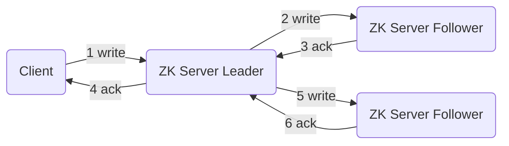
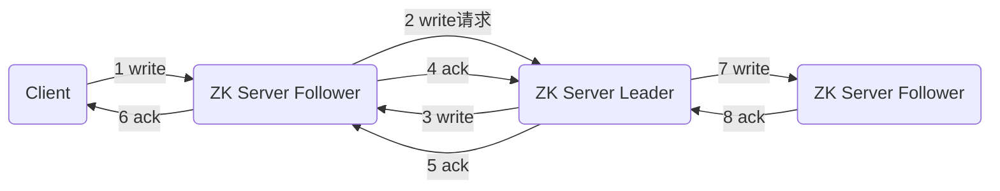

【尚硅谷】大数据技术之Zookeeper 3.5.7版本教程

https://www.bilibili.com/video/BV1to4y1C7gw

2021-06-30 08:00:41

# P1 开篇_课程介绍

一、课程升级的重点内容

1. Zookeeper 分布式锁案例
2. Paxos 算法
3. ZAB 协议
4. CAP
5. 源码（zk 服务端初始化源码、服务器端加载数据源码、选举算法、状态同步算法、Leader 启动源码、Follower 启动源码、客户端启动源码）

二、课程特色

1. 新 Zookeeper 3.5.7
2. 细 注释详细，文档中代码复制粘贴就可以
3. 全 几乎涵盖了所有关于 ZK 相关讲解
4. 生动 PPT 动画

三、资料获取方式

四、技术基础要求

javase + maven + idea + linux 常用命令

# P2 入门_概述

第 1 章 Zookeeper 入门

## 1.1 概述

Zookeeper 是一个开源的分布式的，为分布式框架提供协调服务的 Apache 项目

Zookeeper 工作机制

Zookeeper 从设计模式角度来理解：是一个基于观察者模式设计的分布式服务管理框架，它**负责存储和管理大家都关心的数据**，然后**接收观察者的注册**，一旦这些数据的状态发生变化，Zookeeper **就将负责通知已经在 Zookeeper 上注册的哪些观察者**做出相应的反应。

1. 服务端启动时去注册信息（创建都是临时节点）
2. 获取到当前在线服务器列表，并且注册监听
3. 服务器节点下线
4. 服务器节点上下线时间通知
5. 客户端重新再去获取服务器列表，并注册监听

Zookeeper = 文件系统 + 通知机制

# P3 入门_特点

## 1.2 特点

Zookeeper 特点

1. Zookeeper：一个领导者（Leader），多个跟随者（Follower）组成的集群。
2. 集群中只要有**半数以上**节点存活，Zookeeper 集群就能正常服务。所以 Zookeeper 适合安装奇数台服务器。
3. 全局数据一致：每个 Server 保存一份相同的数据副本，Client 无论连接到哪个 Server，数据都是一致的。
4. 更新请求顺序执行，来自同一个 Client 的更新请求按其发送顺序依次执行。
5. 数据更新原子性，一次数据更新要么成功，要么失败。
6. 实时性，在一定时间范围内，Client 能读到最新数据。

每次写操作都有事务 id（zxid）

# P4 入门_数据结构

## 1.3 数据结构

Zookeeper 数据模型的结构与 **Unix 文件系统很类似**，整体上可以看作是一棵树，每个节点称作一个 ZNode。每一个 ZNode 默认能够存储 **1MB** 的数据，每个 ZNode 都可以**通过其路径唯一标识**。

# P5 入门_应用场景

## 1.4 应用场景

提供的服务包括：统一命名服务、统一配置管理、统一集群管理、服务器节点动态上下线、软负载均衡等。

- 统一命名服务
  - 在分布式环境下，经常需要对应用/服务进行统一命名，便于识别。
  - 例如：IP 不容易记住，而域名容易记住。
- 统一配置管理
  1. 分布式环境下，配置文件同步非常常见。
     1. 一般要求一个集群中，所有节点的配置信息是一致的，比如 Kafka 集群。
     2. 对配置文件修改后，希望能够快速同步到各个节点上。
  2. 配置管理可交由 ZooKeeper 实现
     1. 可将配置信息写入 ZooKeeper 上的一个 Znode。
     2. 各个客户端服务器监听这个 Znode。
- 统一集群管理
  1. 分布式环境中，实时掌握每个节点的状态是必要的。
     1. 可根据节点实时状态做出一些调整
  2. Zookeeper 可以实现实时监控节点状态变化
     1. 可将节点信息写入 ZooKeeper 上的一个 ZNode
     2. 监听这个 ZNode 可获取它的实时状态变化
- 服务器动态上下线
  - 客户端能实时洞察到服务器上下线的变化
    1. 服务端启动时去注册信息（创建都是临时节点）
    2. 获取到当前在线服务器列表，并且注册监听
    3. 服务器节点下线
    4. 服务器节点上下线时间通知
    5. 客户端重新再去获取服务器列表，并注册监听
- 软负载均衡
  - 在 Zookeeper 中记录每台服务器的访问数，让访问数最小的服务器去处理最新的客户端请求

# P6 入门_下载地址

## 1.5 下载地址

1. 官网首页
2. 下载截图

# P7 本地_安装

第 2 章 Zookeeper 本地安装

## 2.1 本地模式安装

1. 安装前准备

   1. 安装 JDK
   2. 拷贝 apache-zookeeper-3.5.7-bin.tar.gz 安装包到 Linux 系统下
   3. 解压到指定目录
   4. 修改名称

2. 配置修改

   1. 将 /opt/module/zookeeper-3.5.7/conf 这个路径下的 zoo_sample.cfg 修改为 zoo.cfg

   2. 打开 zoo.cfg 文件，修改 dataDir 路径

      修改如下内容：

      ```properties
      dataDir=/opt/module/zookeeper-3.5.7/zkData
      ```

   3. 在 /opt/module/zookeeper-3.5.7/ 这个目录上创建 zkData 文件夹

3. 操作 Zookeeper

   1. 启动 Zookeeper

      ```shell
      bin/zkServer.sh start
      ```

   2. 查看进程是否启动

      ```shell
      jps
      ```

   3. 查看状态

      ```shell
      bin/zkServer.sh status
      ```

   4. 启动客户端

      ```shell
      bin/zkCli.sh
      ```

   5. 退出客户端

      ```shell
      quit
      ```

   6. 停止 Zookeeper

      ```shell
      bin/zkServer.sh stop
      ```

# P8 本地_配置参数解读

## 2.2 配置参数解读

Zookeeper 中的配置文件 zoo.cfg 中参数含义解读如下：

1. **tickTime = 2000**: 通信心跳时间，Zookeeper 服务器与客户端心跳时间，单位毫秒

2. **initLimit = 10**：LF 初始通信时限

   Leader 和 Follower **初始连接**时能容忍的最多心跳数（tickTime 的数量）

3. **syncLimit = 5**：LF 同步通信时限

   Leader 和 Follower 之间通信时间如果超过 syncLimit * tickTime，Leader 认为 Follower 死掉，从服务器列表中删除 Follower。

4. **dataDir：**保存 Zookeeper 中的数据

   注意：默认的 tmp 目录，容易被 Linux 系统定期删除，所以一般不用默认的 tmp 目录。

5. **clientPort = 2181**：客户端连接端口，通常不做修改

# P9 集群_安装

第3章 Zookeeper 集群操作

## 3.1 集群操作

### 3.1.1 集群安装

1. 集群规划

   在 hadoop102、hadoop103 和 hadoop104 三个节点上都部署 Zookeeper

   思考：如果是 10 台服务器，需要部署多少台 Zookeeper？

2. 解压安装

   1. 在 hadoop102 解压 Zookeeper 安装包到 /opt/module/ 目录下

      ```shell
      tar -zxvf apache-zookeeper-3.5.7-bin.tar.gz -C /opt/module/
      ```

   2. 修改 apache-zookeeper-3.5.7-bin 名称为  zookeeper-3.5.7

3. 配置服务器编号

   1. 在 /opt/module/zookeeper-3.5.7/ 这个目录下创建 zkData

   2. 在 /opt/module/zookeeper-3.5.7/zkData 目录下创建一个 myid 的文件

      在文件中添加与 server 对应的编号（注意：上下不要有空行，左右不要有空格）

      **注意：添加 myid 文件，一定要在 Linux 里面创建，在 notepad++ 里面很可能乱码**

   3. 拷贝配置好的 zookeeper 到其他机器上

      并分别在 hadoop103、hadoop104 上修改 myid 文件中内容为 3、4

4. 配置 zoo.cfg 文件

   1. 重命名 /opt/module/zookeeper-3.5.7/conf 这个目录下的 zoo_sample.cfg 为 zoo.cfg

   2. 打开 zoo.cfg 文件

      修改数据存储路径配置

      ```properties
      dataDir=/opt/module/zookeeper-3.5.7/zkData
      ```

      增加如下配置

      ```properties
      server.2=hadoop102:2888:3888
      server.3=hadoop103:2888:3888
      server.4=hadoop104:2888:3888
      ```

   3. 配置参数解读

      ```properties
      server.A=B:C:D
      ```

      A 是一个数字，表示这个是第几号服务器；

      集群模式下配置一个文件 myid，这个文件在 dataDir 目录下，这个文件里面有一个数据就是 A 的值，**Zookeeper 启动时读取此文件，拿到里面的数据与 zoo.cfg 里面的配置信息比较从而判断到底是哪个 server**

      B 是这个服务器的地址

      C 是这个服务器 Follower 与集群中的 Leader 服务器交换信息的端口

      D 是万一集群中的 Leader 服务器挂了，需要一个端口来重新进行选举，选出一个新的 Leader，而这个端口就是用来执行选举时服务器相互通信的端口。

# P10 集群_第一次启动选举

### 3.1.2 选举机制（面试重点）

Zookeeper 选举机制——第一次启动

1. 服务器 1 启动，发起一次选举。服务器 1 投自己一票。此时服务器 1 票数一票，不够半数以上（3 票），选举无法完成，服务器 1 状态保持为 LOCKING
2. 服务器 2 启动，再发起一次选举，服务器 1 和 2 分别投自己一票并交换选票信息；**此时服务器 1 发现服务器 2 的 myid 比自己投票推举的（服务器 1）大，更改选票为推举服务器 2**。此时服务器 1 票数 0 票，服务器 2 票数 2 票，没有半数以上结果，选举无法完成，服务器1，2 状态保持 LOCKING
3. 服务器 3 启动，发起一次选举。此时服务器 1 和 2 都会更改选票为服务器 3。此次投票结果：服务器 1 为 0 票，服务器 2 为 0 票，服务器 3  为 3 票，此时服务器 3 的票数已经超过半数，服务器 3 当选 Leader。服务器 1，2 更改状态为 FOLLOWING，服务器 3 更改状态为 LEADING。
4. 服务器 4 启动，发起一次选举。此时服务器 1，2，3 已经不是 LOCKING 状态，不会更改选票信息。交换选票信息结果：服务器 3 为 3 票，服务器 4 为 1 票。此时服务器 4 服从多数，更改选票信息为服务器 3，并更改状态为 FOLLOWING；
5. 服务器 5 启动，同 4 一样当小弟。

每次写操作都有事务 id（zxid）

**SID**：**服务器 ID**。用来唯一标识一台 ZooKeeper 集群中的机器，每台机器不能重复，**和 myid 一致**。

**ZXID**：事务 ID。**ZXID 是一个事务 ID，用来标识一次服务器状态的变更**。在某一时刻，集群中的每台机器的 ZXID 值不一定完全一致，这和 ZooKeeper 服务器对于客户端“更新请求”的处理逻辑有关。

**Epoch**：**每个 Leader 任期的代号**。没有 Leader 时间同一轮投票过程中的逻辑时钟值是相同的。每投完一次票这个数据就会增加

# P11 集群_非第一次启动选举

Zookeeper 选举机制——非第一次启动

1. 当 Zookeeper 集群中的一台服务器出现以下两种情况之一时，就会开始进入 Leader 选举：

   - 服务器初始化启动
   - 服务器运行期间无法和 Leader 保持连接

2. 而当一台机器进入 Leader 选举流程时，当前集群也可能会处于以下两种状态：

   - 集群中本来就已经存在一个 Leader。

     对于第一种已经存在 Leader 的情况，机器试图去选举 Leader 时，会被告知当前服务器的 Leader 信息，对于该机器来说，仅仅需要和 Leader 机器建立连接，并进行状态同步即可。

   - **集群中确实不存在 Leader**。

     假设 ZooKeeper 由 5 台服务器组成，SID 分别为 1、2、3、4、5，ZXID 分别为 8、8、8、7、7，并且此时 SID 为 3 的服务器是 Leader，某一时刻 3 和 5 服务器出现故障，因此开始进行 Leader 选举。

     SID 为 1、2、4 的机器投票情况：（1,8,1）（1,8,2）（1,7,4）【(EPOCH, ZXID, SID)】

     选举 Leader 规则：

     1. EPOCH 大的直接胜出
     2. EPOCH 相同，事务 id 大的胜出
     3. 事务 id 相同，服务器 id 大的胜出

# P12 集群_启动停止脚本

### 3.1.3 ZK 集群启动停止脚本

1. 在 hadoop102 的 /home/atguigu/bin 目录下创建脚本

   ```shell
   vim zk.sh
   ```

   在脚本中编写如下内容

# P13 客户端命令行_节点信息

## 3.2 客户端命令行操作

### 3.2.1 命令行语法

| 命令基本语法 | 功能描述                                                     |
| ------------ | ------------------------------------------------------------ |
| help         | 显式所有操作命令                                             |
| ls path      | 使用 ls 命令来查看当前 znode 的子节点【可监听】<br />-w 监听子节点变化<br />-s 附加次级信息 |
| create       | 普通创建<br />-s 含有序列<br />-e 临时（重启或者超时消失）   |
| get path     | 获得节点的值【可监听】<br />-w 监听节点内容变化<br />-s 附加次级信息 |
| set          | 设置节点的具体值                                             |
| stat         | 查看节点状态                                                 |
| delete       | 删除节点                                                     |
| deleteall    | 递归删除节点                                                 |

1. 启动客户端

   ```shell
   bin/zkCli.sh -server hadoop102:2181
   ```

2. 显示所有操作命令

   ```shell
   help
   ```

### 3.2.2 znode 节点数据信息

1. 查看当前 znode 中所包含的内容

   ```shell
   ls /
   ```

2. 查看当前节点详细数据

   ```shell
   ls -s /
   ```

   1. **cZxid: 创建节点的事务 zxid**

      每次修改 ZooKeeper 状态都会产生一个 ZooKeeper 事务 ID，事务 ID 是 ZooKeeper 中所有修改总的次序。每次修改都有唯一的 zxid，如果 zxid1 小于 zxid2，那么 zxid1 在 zxid2 之前发生。

   2. ctime：znode 被创建的毫秒数（从 1970 年开始）

   3. mZxid：znode 最后更新的事务 zxid

   4. mtime：znode 最后修改的毫秒数（从 1970 年开始）

   5. pZxid：znode 最后更新的子节点 zxid

   6. cversion：znode 子节点变化号，znode 子节点修改次数

   7. **dataVersion：znode 数据变化号**

   8. aclVersion：znode 访问控制列表的变化号

   9. ephemeralOwner：如果是临时节点，这个是 znode 拥有者的 session id。如果不是临时节点则是 0。

   10. **dataLength：znode 的数据长度**

   11. **numChildren：znode 子节点数量**

# P14 客户端命令行_节点类型

### 3.2.3 节点类型（持久/短暂/有序号/无序号）

持久（Persistent）：客户端和服务器端断开连接后，创建的节点不删除

短暂（Ephemeral）：客户端和服务器端断开连接后，创建的节点自己删除

1. 持久化目录节点

   客户端与 Zookeeper 断开连接后，该节点依旧存在

2. 持久化顺序编号目录节点

   客户端与 Zookeeper 断开连接后，该节点依旧存在，只是 Zookeeper 给该节点名称进行顺序编号

3. 临时目录节点

   客户端与 Zookeeper 断开连接后，该节点被删除

4. 临时顺序编号目录节点

   客户端与 Zookeeper 断开连接后，该节点被删除，只是 Zookeeper 给该节点名称进行顺序编号。

说明：创建 znode 时设置顺序标识，znode 名称后会附加一个值，顺序号是一个单调递增的计数器，由父节点维护

**注意：在分布式系统中，顺序号可以被用于为所有的事件进行全局排序，这样客户端可以通过顺序号推断事件的顺序**

1. 分别创建 2 个普通节点（永久节点 + 不带序号）

   ```shell
   create /sanguo "diaochan"
   create /sanguo/shuguo "liubei"
   ```

   注意：创建节点时，要赋值

2. 获得节点的值

   ```shell
   get -s /sanguo
   get -s /sanguo/shuguo
   ```

3. 创建带序号的节点（永久节点 + 带序号）

   1. 先创建一个普通的根节点 /sangui/weiguo

      ```shell
      create /sanguo/weiguo "caocao"
      ```

   2. 创建带序号的节点

      ```shell
      create -s /sanguo/weiguo/zhangliao "zhangliao"
      create -s /sanguo/weiguo/zhangliao "zhangliao"
      create -s /sanguo/weiguo/xuchu "xuchu"
      ```

      如果原来没有序号节点，序号从 0 开始依次递增。如果原节点下已有 2 个节点，则再排序时从 2 开始，以此类推

4. 创建短暂节点（短暂节点 + 不带序号 or 带序号）

   1. 创建短暂的不带序号的节点

      ```shell
      create -e /sanguo/wuguo "zhouyu"
      ```

   2. 创建短暂的带序号的节点

      ```shell
      create -e -s /sanguo/wuguo "zhouyu"
      ```

   3. 在当前客户端是能查看到的

      ```shell
      ls /sanguo
      ```

   4. 退出当前客户端然后再重启客户端

      ```shell
      quit
      ```

   5. 再次查看根目标下短暂节点已经删除

      ```shell
      ls /sanguo
      ```

5. 修改节点数据值

   ```shell
   set /sanguo/weiguo "simayi"
   ```

# P15 客户端命令行_监听器及节点删除

### 3.2.4 监听器原理

客户端注册监听它关心的目录节点，当目录节点发生变化（数据改变、节点删除、子目录节点增加删除）时，ZooKeeper 会通知客户端。监听机制保证 ZooKeeper 保存的任何的数据的任何改变都能快速的响应到监听了该节点的应用程序。

1. 监听原理详解

   1. 首先要有一个 main() 线程
   2. 在 main 线程中创建 Zookeeper 客户端，这时就会创建两个线程，一个负责网络连接通信（connect），一个负责监听（listener）。
   3. 通过 connect 线程将注册的监听事件发送给 Zookeeper。
   4. 在 Zookeeper 的注册监听器列表中将注册的监听事件添加到列表中。
   5. Zookeeper 监听到有数据或路径变化，就会将这个消息发送给 listener 线程。
   6. listener 线程内部调用了 process() 方法。

2. 常见的监听

   1. 监听节点数据的变化

      **get path [watch]**

   2. 监听子节点增减的变化

      **ls path [watch]**


1. Main 线程
2. 创建 zkClient
3. getChildren("/", true)
4. Client:ip:port:/path
5. "/" 路径数据发生变化
6. process()


1. 节点的值变化监听

   1. 在 hadoop104 主机上注册监听 /sanguo 节点数据变化

      ```shell
      get -w /sanguo
      ```

   2. 在 hadoop103 主机上修改 /sanguo 节点的数据

      ```shell
      set /sanguo "xisi"
      ```

   3. 观察 hadoop104 主机收到数据变化的监听

      ```
      WATCHER::
      WatchedEvent state:SyncConnected type:NodeDataChanged path:/sanguo
      ```

      注意：在 hadoop103 再多次修改 /sanguo 的值，hadoop104 上不会再收到监听。因为注册一次，只能监听一次。想再次监听，需要再次注册。

2. 节点的子节点变化监听（路径变化

   1. 在 hadoop104 主机上注册监听 /sanguo 节点的子节点变化

      ```shell
      ls -w /sanguo
      ```

   2. 在 hadoop103 主机 /sanguo 节点上创建子节点

      ```shell
      create /sanguo/jin "simayi"
      ```

   3. 观察 hadoop104 主机收到子节点变化的监听

      ```
      WATCHER::
      WatchedEvent state:SyncConnected type:NodeChildrenChanged path:/sanguo
      ```

      注意：节点的路径变化，也是注册一次，生效一次。想多次生效，就需要多次注册。

### 3.2.5 节点删除与查看

1. 删除节点

   ```shell
   delete /sanguo/jin
   ```

2. 递归删除节点

   ```shell
   deleteall /sanguo/shuguo
   ```

3. 查看节点状态

   ```shell
   stat /sanguo
   ```

# P16 客户端API_创建节点

## 3.3 客户端 API 操作

前提：保证 hadoop102、hadoop103、hadoop104 服务器上 Zookeeper 集群服务端启动。

### 3.3.1 IDEA 环境搭建

1. 创建一个工程：zookeeper

2. 添加 pom 文件

   ```xml
   <dependencies>
       <dependency>
           <groupId>junit</groupId>
           <artifactId>junit</artifactId>
           <version>RELEASE</version>
       </dependency>
       
       <dependency>
           <groupId>org.apache.logging.log4j</groupId>
           <artifactId>log4j-core</artifactId>
           <version>2.8.2</version>
       </dependency>
       
       <dependency>
           <groupId>org.apache.zookeeper</groupId>
           <artifactId>zookeeper</artifactId>
           <version>3.5.7</version>
       </dependency>
   </dependencies>
   ```

3. 拷贝 log4j.properties 文件到项目根目录

   需要在项目的 src/main/resources 目录下，新建一个文件，命令为“log4j.properties”，在文件中填入。

4. 创建包名 com.atguigu.zk

5. 创建类名称 zkClient

### 3.3.2 创建 ZooKeeper 客户端

```java
// 注意：逗号前后不能写空格
private static String connectString = "hadoop102:2181,hadoop103:2181,hadoop104:2181";
private static int sessionTimeout = 2000;
private ZooKeeper zkClient = null;

@Before
public void init() throws Exception {
    zkClient = new ZooKeeper(connectString, sessionTimeout, new Watcher(){
        @Override
        public void process(WatchedEvent watchedEvent) {
            // 收到事件通知后的回调函数（用户的业务逻辑）
            System.out.println(watchedEvent.getType() + "--" + watchedEvent.getPath());
            // 再次启动监听
            try {
                List<String> children = zkClient.getChildren("/", true);
                for (String child : children) {
                    System.out.println(child);
                }
            } catch (Exception e) {
                e.printStackTrace();
            }
        }
    });
}
```

### 3.3.3 创建子节点

```java
// 创建子节点
@Test
public void create() throws Exception {
    // 参数1：要创建的节点的路径；参数2：节点数据；参数3：节点权限；参数4：节点的类型
    String nodeCreated = zkClient.create("/atguigu", "shuaige".getBytes(), Ids.OPEN_ACL_UNSAFE, CreateMode.PERSISTENT);
}
```

测试：在 hadoop102 的 zk 客户端上查看创建节点情况

```shell
get -s /atguigu
```

# P17 客户端API_监听节点变化

### 3.3.4 获取子节点并监听节点变化

```java
// 获取子节点
@Test
public void getChildren() throws Exception {
    List<String> children = zkClient.getChildren("/", true);
    for (String child : children) {
        System.out.println(child);
    }
    // 延时阻塞
    Thread.sleep(Long.MAX_VALUE);
}
```

1. 在 IDEA 控制台上看到如下节点：

   ```
   zookeeper
   sanguo
   atguigu
   ```

2. 在 hadoop102 的客户端上创建再创建一个节点 /atguigu1，观察 IDEA 控制台

   ```shell
   create /atguigu1 "atguigu1"
   ```

3. 在 hadoop102 的客户端上删除节点 /atguigu1，观察 IDEA 控制台

   ```shell
   delete /atguigu1
   ```

# P18 客户端API_判断节点是否存在

### 3.3.5 判断 Znode 是否存在

```java
// 判断 znode 是否存在
@Test
public void exist() throws Exception {
    Stat stat = zkClient.exists("/atguigu", false);
    System.out.println(stat == null ? "not exist" : "exist");
}
```

# P19 写数据原理

## 3.4 客户端向服务端写数据流程

写流程之写入请求直接发送给 Leader 节点



写流程之写入请求直接发送给 Follower 节点



# P20 案例_服务器动态上下线 - 需求分析

第 4 章 服务器动态上下线监听案例

## 4.1 需求

某分布式系统中，主节点可以有多台，可以动态上下线，任意一台客户端都能实时感知到主节点服务器的上下线。

## 4.2 需求分析

客户端能实时洞察到服务器上下线的变化

1. 服务端启动时去注册信息（创建都是临时节点）
2. 获取到当前在线服务器列表，并且注册监听
3. 服务器节点下线
4. 服务器节点上下线时间通知
5. 客户端重新再去获取服务器列表，并注册监听

# P21 案例_服务器动态上下线 - 服务器注册

## 4.3 具体实现

1. 先在集群上创建 /servers 节点

   ```shell
   create /servers "servers"
   ```

2. 在 Idea 中创建包名：com.atguigu.zkcase1

3. 服务器端向 Zookeeper 注册代码

   ```java
   public class DistributeServer {
       private static String connectString = "hadoop102:2181,hadoop103:2181,hadoop104:2181";
   	private static int sessionTimeout = 2000;
   	private ZooKeeper zk = null;
       private String parentNode = "/servers";
       
       // 创建到 zk 的客户端连接
       public void getConnect() throws IOException {
           zk = new ZooKeeper(connectString, sessionTimeout, new Watcher(){
               @Override
               public void process(WatchedEvent event) {
                   
               }
           });
       }
       
       public static void main(String[] args) throws IOException {
           DistributeServer server = new DistributeServer();
           // 1. 获取 zk 连接
           server.getConnect();
           // 2. 注册服务器到 zk 集群
           server.regist(args[0]);
           // 3. 启动业务逻辑（睡觉）
           server.business();
       }
       
       private void business() throws InterruptedException {
           Thread.sleep(Long.MAX_VALUE);
       }
       
       private void regist(String hostname) {
           zk.create("/servers", hostname, ZooDefs.Ids.OPEN_ACL_UNSAFE, CreateMode.EPHEMERAL_SEQUENTIAL);
           System.out.println(hostname + "is online");
       }
   }
   ```

# P22 案例_服务器动态上下线 - 客户端监听

```java
public class DistributeClient {
    private static String connectString = "hadoop102:2181,hadoop103:2181,hadoop104:2181";
	private static int sessionTimeout = 2000;
	private ZooKeeper zk = null;
    private String parentNode = "/servers";
    
    // 创建到 zk 的客户端连接
    public void getConnect() throws IOException {
        zk = new ZooKeeper(connectString, sessionTimeout, new Watcher(){
            @Override
            public void process(WatchedEvent event) {
                // 再次启动监听
                try {
                    getServerList();
                } catch (Exception e) {
                    e.printStackTrace();
                }
            }
        });
    }
    
    public static void main(String[] args) throws IOException {
        DistributeClient client = new DistributeClient();
        // 1. 获取 zk 连接
        client.getConnect();
        // 2. 监听 /servers 下面子节点的增加和删除
        client.getServerList();
        // 3. 业务逻辑（睡觉）
        client.business();
    }
    
    private void business() throws InterruptedException {
        Thread.sleep(Long.MAX_VALUE);
    }
    
    private void getServerList() {
        List<String> children = zk.getChildren("/servers", true);
        ArrayList<String> servers = new ArrayList<>();
        for (String child : children) {
            byte[] data = zk.getData("/servers/" + child, false, null);
            servers.add(new String(data));
        }
        // 打印
        System.out.println(servers);
    }
}
```

# P23 案例_服务器动态上下线 - 测试

## 4.4 测试

1. 在 Linux 命令行上操作增加减少服务器

   1. 启动 DistributeClient 客户端

   2. 在 hadoop102 上 zk 的客户端 /server 目录上创建临时带序号节点

      ```shell
      create -e -s /servers/hadoop102 "hadoop102"
      create -e -s /servers/hadoop103 "hadoop103"
      ```

   3. 观察 Idea 控制台变化

      ```
      [hadoop102,hadoop103]
      ```

   4. 执行删除操作

      ```shell
      delete /servers/hadoop1020000000000
      ```

   5. 观察 Idea 控制台变化

      ```
      [hadoop103]
      ```

2. 在 Idea 上操作增加减少服务器

   1. 启动 DistributeClient 客户端（如果已经启动过，不需要重启）
   2. 启动 DistributeServer 服务

# P24 案例_分布式锁 - 需求分析

第 5 章 ZooKeeper 分布式锁案例

什么叫做分布式锁呢？

比如说“进程 1”在使用该资源的时候，会先去获得锁，“进程 1”获得锁以后会对该资源保持独占，这样其他进程就无法访问该资源，“进程 1” 用完该资源以后就将锁释放掉，让其他进程来获得锁，那么通过这个锁机制，我们就能保证了分布式系统中多个进程能够有序的访问该临界资源。那么我们把这个分布式环境下的这个锁叫做分布式锁。


`create -e -s /locks/seq` 创建临时顺序节点

获取到锁后，处理业务

1. 接收到请求后，在 /locks 节点下创建一个临时顺序节点
2. 判断自己是不是当前节点下最小的节点：是，获取到锁，不是，对前一个节点进行监听
3. 获取到锁，处理完业务后，delete 节点释放锁，然后下面的节点将收到通知，重复第二步判断

# P25 案例_分布式锁 - 代码实现（上）

# P26 案例_分布式锁 - 代码实现（下）

## 5.1 原生 Zookeeper 实现分布式锁案例

1. 分布式锁实现

   ```java
   public class DistributedLock {
       // zookeeper server 列表
       private static String connectString = "hadoop102:2181,hadoop103:2181,hadoop104:2181";
   	private static int sessionTimeout = 2000;
   	private ZooKeeper zk;
       
       private CountDownLatch connectLatch = new CountDownLatch(1);
       private CountDownLatch waitLatch = new CountDownLatch(1);
       
       private String waitPath;
   	private String currentMode;
       
       public DistributedLock() throws IOException {
           // 获取连接
           zk = new ZooKeeper(connectString, sessionTimeout, new Watcher(){
               @Override
               public void process(WatchedEvent watchedEvent) {
                   // connectLatch 如果连接上 zk 可以释放
                   if (watchedEvent.getState() == Event.KeeperState.SyncConnected) {
                       connectLatch.countDown();
                   }
                   // waitLatch 需要释放
                   if (watchedEvent.getState() == Event.KeeperState.NodeDeleted && watchedEvent.getPath().equals(waitPath)) {
                       waitLatch.countDown();
                   }
               }
           });
           // 等待 zk 正常连接后，往下走程序
           connectLatch.await();
           
           // 判断根节点 /locks 是否存在
           Stat stat = zk.exists("/locks", false);
           if (stat == null) {
               // 创建一下根节点
               zk.create("/locks", "locks".getBytes(), ZooDefs.Ids.OPEN_ACL_UNSAFE, CreateMode.PERSISTENT);
           }
       }
       
       // 对 zk 加锁
       public void zkLock() {
           // 创建对应的临时带序号节点
           try {
               currentMode = zk.create("/locks/" + "seq-", null, ZooDefs.Ids.OPEN_ACL_UNSAFE, CreateMode.EPHEMERAL_SEQUENTIAL);
               // 判断创建的节点是否是最小的序号节点，如果是获取到锁；如果不是，监听它序号前一个节点
               List<String> children = zk.getChildren("/locks", false);
               // 如果 children 只有一个值，那就直接获取锁；如果有多个节点，需要判断，谁最小
               if (children.size() == 1) {
                   return;
               } else {
                   Collections.sort(children);
                   // 获取节点名称 seq-00000000
                   String thisNode = currentMode.substring("/locks/".length());
                   // 通过 seq-00000000 获取该节点在 children 集合的位置
                   int index = children.indexOf(thisNode);
                   // 判断
                   if (index == -1) {
                       System.out.println("数据异常");
                   } else if (index == 0) {
                       // 就一个节点，可以获取锁了
                       return;
                   } else {
                       // 需要监听 他前一个节点变化
                       waitPath = "/locks/" + children.get(index - 1);
                       zk.getData(waitPath, true, new Stat());
                       // 等待监听
                       waitLatch.await();
                       return;
                   }
               }
           } catch (Exception e) {
               e.printStackTrace();
           }
   	}
       
       // 解锁
       public void unZkLock() {
           // 删除节点
           try {
   	        zk.delete(currentMode, -1);
           } catch (Exception e) {
               e.printStackTrace();
           }
       }
   }
   ```

# P27 案例_分布式锁 - 测试

```java
public class DistributedLockTest {
    public static void main(String[] args) throws InterruptedException, IOException, KeeperException {
        final DistributedLock lock1 = new DistributedLock();
        final DistributedLock lock2 = new DistributedLock();
        
        new Thread(new Runnable(){
            @Override
            public void run() {
                try {
                    lock1.zkLock();
                    System.out.println("线程1 启动，获取到锁");
                    Thread.sleep(5 * 1000);
                    
                    lock1.unZkLock();
                    System.out.println("线程1 释放锁");
                } catch (InterruptedException e) {
                    e.printStackTrace();
                }
            }
        }).start();
        
        new Thread(new Runnable(){
            @Override
            public void run() {
                try {
                    lock2.zkLock();
                    System.out.println("线程2 启动，获取到锁");
                    Thread.sleep(5 * 1000);
                    
                    lock2.unZkLock();
                    System.out.println("线程2 释放锁");
                } catch (InterruptedException e) {
                    e.printStackTrace();
                }
            }
        }).start();
    }
}
```

# P28 案例_分布式锁 - 成熟框架 curator

## 5.2 Curator 框架实现分布式锁案例

1. 原生的 Java API 开发存在的问题

   1. 会话连接是异步的，需要自己去处理。比如使用 CountDownLatch
   2. Watch 需要重复注册，不然就不能生效
   3. 开发的复杂性还是比较高的
   4. 不支持多节点删除和创建。需要自己去递归

2. Curator 是一个专门解决分布式锁的框架，解决了原生 Java API 开发分布式遇到的问题。

3. Curator 案例实操

   1. 添加依赖

      ```xml
      <dependency>
          <groupId>org.apache.curator</groupId>
          <artifactId>curator-framework</artifactId>
          <version>4.3.0</version>
      </dependency>
      <dependency>
          <groupId>org.apache.curator</groupId>
          <artifactId>curator-recipes</artifactId>
          <version>4.3.0</version>
      </dependency>
      <dependency>
          <groupId>org.apache.curator</groupId>
          <artifactId>curator-client</artifactId>
          <version>4.3.0</version>
      </dependency>
      ```

   2. 代码实现

      ```java
      public class CuratorLockTest {
          public static void main(String[] args) {
              // 创建分布式锁1
              InterProcessMutex lock1 = new InterProcessMutex(getCuratorFramework(), "/locks");
              // 创建分布式锁2
              InterProcessMutex lock2 = new InterProcessMutex(getCuratorFramework(), "/locks");
              
              new Thread(new Runnable() {
                  @Override
                  public void run() {
                      try {
                          lock1.acquire();
                          System.out.println("线程1 获取到锁");
                          lock1.acquire();
                          System.out.println("线程1 再次获取到锁");
                          Thread.sleep(5 * 1000);
                          lock1.release();
                          System.out.println("线程1 释放锁");
                          lock1.release();
                          System.out.println("线程1 再次释放锁");
                      } catch (Exception e) {
                          e.printStackTrace();
                      }
                  }
              }).start();
              
              new Thread(new Runnable() {
                  @Override
                  public void run() {
                      try {
                          lock2.acquire();
                          System.out.println("线程2 获取到锁");
                          lock2.acquire();
                          System.out.println("线程2 再次获取到锁");
                          Thread.sleep(5 * 1000);
                          lock2.release();
                          System.out.println("线程2 释放锁");
                          lock2.release();
                          System.out.println("线程2 再次释放锁");
                      } catch (Exception e) {
                          e.printStackTrace();
                      }
                  }
              }).start();
          }
          
          private static CuratorFramework getCuratorFramework() {
              ExponentialBackoffRetry policy = new ExponentialBackoffRetry(3000, 3);
              CuratorFramework client = CuratorFrameworkFactory.builder().connectString("hadoop102:2181,hadoop103:2181,hadoop104:2181")
                  .connectionTimeoutMs(2000)
                  .sessionTimeoutMs(2000)
                  .retryPolicy(policy)
                  .build();
              // 启动客户端
              client.start();
              System.out.println("zookeeper 启动成功");
              return client;
          }
      }
      ```

# P29 企业面试真题

第6章 企业面试真题（面试重点）

## 6.1 选举机制

半数机制，超过半数的投票通过，即通过。

1. 第一次启动选举规则：

   **投票过半数时，服务器 id 大的胜出**

2. 第二次启动选举规则：

   1. **EPOCH 大的直接胜出**
   2. **EPOCH 相同，事务 id 大的胜出**
   3. **事务 id 相同，服务器 id 大的胜出**

## 6.2 生产集群安装多少 zk 合适？

安装奇数台。

**生产经验：**

- 10 台服务器：3 台 zk；
- 20 台服务器：5 台 zk；
- 100 台服务器：11 台 zk；
- 200 台服务器：11 台 zk；

**服务器台数多：好处，提高可靠性；坏处：提高通信延时**

## 6.3 常用命令

ls、get、create、delete

# P30 算法基础_拜占庭将军问题

第 1 章 算法基础

思考：**Zookeeper 是如何保证数据一致性的？**这也是困扰分布式系统框架的一个难题。

## 1.1 拜占庭将军问题

拜占庭将军问题是一个协议问题，拜占庭帝国军队的将军们必须全体一致的决定是否攻击某一支敌军。问题是这些将军在地理上是分隔开的，并且将军中存在叛徒。叛徒可以任意行动以达到以下目标：**欺骗某些将军采取进攻行动；促成一个不是所有将军都同意的决定，如当将军们不希望进攻时促成进攻行动；或者迷惑某些将军，使他们无法做出决定**。如果叛徒达到了这些目的之一，则任何攻击行动的结果都是注定要失败的。只有完全达成一致的努力才能获得胜利。

# P31 算法基础_paxos 算法

## 1.2 Paxos 算法

### Paxos 算法——解决什么问题

**Paxos 算法：**一种基于消息传递且具有高度容错特性的**一致性算法**。

**Paxos 算法解决的问题**：就是如何快速正确的在一个分布式系统中对某个数据值达成一致，并且保证不论发生任何异常，都不会破坏整个系统的一致性。

- 机器宕机
- 网络异常（延迟、重复、丢失）

### Paxos 算法描述

- 在一个 Paxos 系统中，首先将所有节点划分为 Proposer（提议者），Acceptor（接受者），和 Learner（学习者）。（注意：每个节点都可以身兼数职）。
- 一个完整的 Paxos 算法流程分为三个阶段：
  - Prepare 准备阶段
    - Proposer 向多个 Acceptor 发出 Propose 请求 Promise（承诺）
    - Acceptor 针对收到的 Propose 请求进行 Promise（承诺）
  - Accept 接收阶段
    - Proposer 收到多数 Acceptor 承诺的 Promise 后，向 Acceptor 发出 Propose 请求
    - Acceptor 针对收到的 Propose 请求进行 Accept 处理
  - Learn 学习阶段：Proposer 将形成的决议发送给所有 Learners

### Paxos 算法流程

1. Prepare：Proposer 生成全局唯一且递增的 Proposal ID，向所有 Acceptor 发送 Propose 请求，这里无需携带提案内容，只携带 Proposal ID 即可。
2. Promise：Acceptor 收到 Propose 请求后，做出“两个承诺，一个应答”。
   - 不再接受 Proposal ID 小于等于（注意：这里是 <=）当前请求的 Propose 请求。
   - 不再接受 Proposal ID 小于（注意：这里是 <）当前请求的 Accept 请求。
   - 不违背以前做出的承诺下，回复已经 Accept 过的提案中 Proposal ID 最大的那个提案的 Value 和 Proposal ID，没有则返回空值。
3. Propose：Proposer 收到多数 Acceptor 的 Promise 应答后，从应答中选择 Proposal ID 最大的提案的 Value，作为本次要发起的提案。如果所有应答的提案 Value 均为空值，则可以自己随意决定提案 Value。然后携带当前 Proposal ID，向所有 Acceptor 发送 Propose 请求。
4. Accept：Accept 收到 Propose 请求后，在不违背自己之前做出的承诺下，接收并持久化当前 Proposal ID 和提案 Value。
5. Learn：Proposer 收到多数 Acceptor 的 Accept 后，决议形成，将形成的决议发送给所有 Learner。

情况1：

- 有 A1, A2, A3, A4, A5 5 位议员，就税率问题进行决议。
- A1 发起 1 号 Proposal 的 Propose，等待 Promise 承诺；
- A2 ~ A5 回应 Promise；
- A1 在收到两份回复时就会发起税率 10% 的 Proposal；
- A2 ~ A5 回应 Accept；
- 通过 Proposal，税率 10%。

情况2：

- 现在我们假设在 A1 提出提案的同时，A5 决定将税率定为 20%
- A1，A5 同时发起 Propose（序号分别为 1，2）
- A2 承诺 A1，A4 承诺 A5，A3 行为成为关键
- 情况1：
  - A3 先收到 A1 消息，承诺 A1
  - A1 发起 Proposal（1，10%），A2，A3 接受。
  - 之后 A3 又收到 A5 消息，回复 A1：（1，10%），并承诺 A5
  - A5 发起 Proposal（2，20%），A3，A4 接受。之后 A1，A5 同时广播决议。
- 情况2：
  - A3 先收到 A1 消息，承诺 A1。之后立刻收到 A5 消息，承诺 A5。
  - A1 发起 Proposal（1，10%），无足够响应，A1 重新 Propose（序号3），A3 再次承诺 A1
  - A5 发起 Proposal（2，20%），无足够响应，A5 重新 Propose（序号4），A3 再次承诺 A5
  - ……

造成这种情况的原因是系统中有一个以上的 Proposer，多个 Proposers 相互争夺 Acceptor，造成迟迟无法达成一致的情况。**针对这种情况，一种改进的 Paxos 算法被提出：从系统中选出一个节点作为 Leader，只有 Leader 能够发起提案。**这样，一次 Paxos 流程中只有一个 Proposer，不会出现活锁的情况，此时只会出现例子中第一种情况。

# P32 算法基础_zab协议

## 1.3 ZAB 协议

### 1.3.1 什么是 ZAB 算法

Zab 借鉴了 Paxos 算法，是特别为 Zookeeper 设计的支持崩溃恢复的原子广播协议。基于该协议，Zookeeper 设计为只有一台客户端（Leader）负责处理外部的写事务请求，然后 Leader 客户端将数据同步到其他 Follower 节点。即 Zookeeper 只有一个 Leader 可以发起提案。

### 1.3.2 Zab 协议内容

Zab 协议包括两种基本的模式：**消息广播**、**崩溃恢复**。

#### 消息广播

1. 客户端发起一个写操作请求。
2. Leader 服务器将客户端的请求转化为事务 Proposal 提案，同时为每个 Proposal 分配一个全局的 ID，即 zxid。
3. Leader 服务器为每个 Follower 服务器分配一个单独的队列，然后将需要广播的 Proposal 依次放到队列中去，并且根据 FIFO 策略进行消息发送。
4. Follower 接收到 Proposal 后，会首先将其以事务日志的方式写入本地磁盘中，写入成功后向 Leader 反馈一个 Ack 响应消息。
5. Leader 接收到超过半数以上 Follower 的 Ack 响应消息后，即认为消息发送成功，可以发送 commit 消息。
6. Leader 向所有 Follower 广播 commit 消息，同时自身也会完成事务提交。Follower 接收到 commit 消息后，会将上一条事务提交。
7. Zookeeper 采用 Zab 协议的核心，就是只要有一台服务器提交了 Proposal，就要确保所有的服务器最终都能正确提交 Proposal。

ZAB 协议针对事务请求的处理过程类似于一个两阶段提交过程

1. 广播事务阶段
2. 广播提交操作

这两阶段提交模型如下，有可能因为 Leader 宕机带来数据不一致，比如

1. Leader 发起一个事务 Proposal1 后就宕机，Follower 都没有 Proposal1
2. Leader 收到半数 ACK  宕机，没来得及向 Follower 发送 Commit

怎么解决呢？**ZAB 引入了崩溃恢复模式。**

#### 崩溃恢复——异常假设

一旦 Leader 服务器出现崩溃或者由于网络原因导致 Leader 服务器失去了与过半 Follower 的联系，那么就会进入**崩溃恢复模式**。

1. 假设两种服务器异常情况：
   1. 假设一个事务在 Leader 提出之后，Leader 挂了。
   2. 一个事务在 Leader 上提交了，并且过半的 Follower 都响应 Ack 了，但是 Leader 在 Commit 消息发出之前挂了。
2. Zab 协议崩溃恢复要求满足以下两个要求：
   1. 确保已经被 Leader 提交的提案 Proposal，必须最终被所有的 Follower 服务器提交。（已经产生的提案，Follower 必须执行）
   2. 确保丢弃已被 Leader 提出，但是没有被提交的 Proposal。（丢弃胎死腹中的提案）

#### 崩溃恢复——Leader选举

崩溃恢复主要包括两部分：**Leader 选举和数据恢复**。

**Leader选举**：根据上述要求，Zab 协议需要保证选举出来的 Leader 满足以下条件：

1. 新选举出来的 Leader 不能包含未提交的 Proposal。**即新 Leader 必须都是已经提交了 Proposal 的 Follower 服务器节点。**
2. **新选举的 Leader 节点中含有最大的 zxid**。这样做的好处是可以避免 Leader 服务器检查 Proposal 的提交和丢弃工作。

#### 崩溃恢复——数据恢复

**Zab 如何数据同步**：

1. 完成 Leader 选举后，在正式开始工作之前（接收事务请求，然后提出新的 Proposal），**Leader 服务器会首先确认事务日志中所有的 Proposal 是否已经被集群中过半的服务器 Commit**。
2. Leader 服务器需要确保所有的 Follower 服务器能够接收到每一条事务的 Proposal，并且能将所有已经提交的事务 Proposal 应用到内存数据中。**等到 Follower 将所有尚未同步的事务 Proposal 都从 Leader 服务器上同步过，并且应用到内存数据中以后，Leader 才会把该 Follower 加入到真正可用的 Follower 列表中。**
