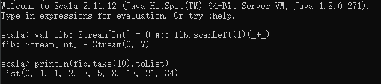
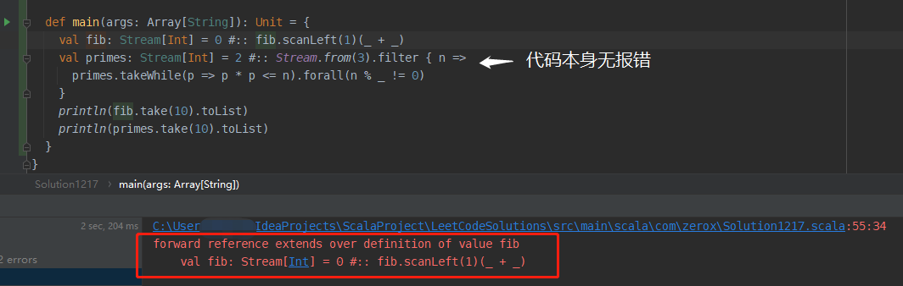

还是在上次提到的知乎回答 [《一行 Scala 能实现怎样丧心病狂的代码》https://www.zhihu.com/question/51038841/answer/123883134](https://www.zhihu.com/question/51038841/answer/123883134) 中，有使用递归定义的 val 的斐波那契数列和质数的实现：

**斐波那契数列**

```scala
val fib: Stream[Int] = 0 #:: fib.scanLeft(1)(_+_)
println(fib.take(10).toList)
// List(0, 1, 1, 2, 3, 5, 8, 13, 21, 34)
```

**质数**

```scala
val primes: Stream[Int] = 2 #:: Stream.from(3).filter{ n => 
         primes.takeWhile(p => p*p <= n).forall(n%_ != 0) }
println(primes.take(10).toList)
// List(2, 3, 5, 7, 11, 13, 17, 19, 23, 29)
```

学习过程中发现，使用 REPL 显然是可以成功运行的，毕竟答主就是使用的 REPL。



但是在我自己平时使用的 object main 方法内写下如下代码，编译就会报错：

```scala
object TestObject {
  def main(args: Array[String]): Unit = {
    val fib: Stream[Int] = 0 #:: fib.scanLeft(1)(_ + _)
    val primes: Stream[Int] = 2 #:: Stream.from(3).filter { n =>
      primes.takeWhile(p => p * p <= n).forall(n % _ != 0)
    }
    println(fib.take(10).toList)
    println(primes.take(10).toList)
  }
}
```

代码本身在 IDEA 中并不会报错，但是执行编译时会报错 “`forward reference extends over definition of value fib`”



看报错的内容，大致是指我们在定义时使用 `fib` 的时候（即 `fib.scanLeft` 处）`fib` 本身还没有定义好。那么经过我的尝试，发现如果想要不报错，正常运行，有三种修改方法：

> 可以参考 StackOverflow 上的一则讨论 [《Scala recursive val function inside val》](https://stackoverflow.com/questions/66409638/scala-recursive-val-function-inside-val) ：https://stackoverflow.com/questions/66409638/scala-recursive-val-function-inside-val 

1. 将 `val fib` 和 `val primes` 提到 object 的大括号中，即：

   ```scala
   object TestObject {
     val fib: Stream[Int] = 0 #:: fib.scanLeft(1)(_ + _)
     val primes: Stream[Int] = 2 #:: Stream.from(3).filter { n =>
       primes.takeWhile(p => p * p <= n).forall(n % _ != 0)
     }
     def main(args: Array[String]): Unit = {
       println(fib.take(10).toList)
       println(primes.take(10).toList)
     }
   }
   ```

2. 在 `val fib` 和 `val primes` 前面加上 `lazy`

3. 将 `val fib` 和 `val primes` 改为 `def fib` 和 `def primes`

方法是实验出来了，但是对应的原理却不太好解释。

首先是 3 相对比较好理解，递归的方法自然是没有问题的。

其次是 2 使用 `lazy` 关键字，让变量惰性加载，赋值后面的语句(`0 #:: fib.scanLeft(1)(_ + _)`)在 `fib` 第一次使用（`fib.take(10).toList`）时才真正执行，也相对好理解。

奇怪的是，为什么递归 val 定义在 main 方法内就会报错，而 object 以及 REPL 中就可以正常编译呢？这个问题有待进一步学习与研究。


