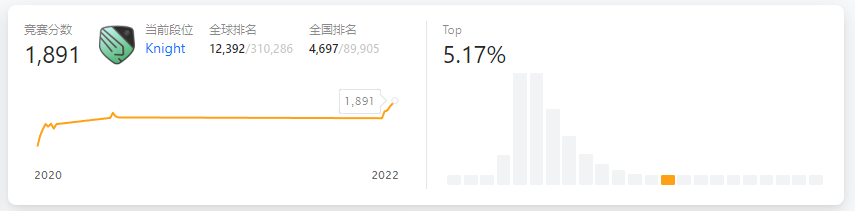

上周的周赛和双周赛都四题全通过了（也就是他们常说的 AK——All Kill，算上再之前周赛那次 AK，连着三次了），加上之前积分就已经 1853，力扣也有个统计门槛分数的讨论贴（链接： https://leetcode.cn/circle/discuss/SKzRis/ ）说明最近分界就在 1860 左右，所以估计这次出分以后应该就可以上 Knight 段位了。

果然今天看了一眼力扣个人资料页面（id：ZeromaX https://leetcode.cn/u/zeromax/ ），发现已经出结果了，目前已经到了 Knight。就打算写篇文章纪念一下，顺便整理一下最近的一些想法。

> 不过发现上周的双周赛估计是因为当时线上测试环境有问题，所以没有算分。力扣赔我脑细胞和头发！（笑）
>
> 上周末的周赛和双周赛，最后一题的困难题都是类似脑筋急转弯的题目（第 303 场周赛 **2354. 优质数对的数目** 是必须想到两个数按位与和按位或的 1 个数的和其实就是两个数二进制 1 的总个数，第 83 场双周赛 **2350. 不可能得到的最短骰子序列** 则是必须想到题目等效于用贪心的思想去计算每次循环中所有数字出现一次的总次数），想了好久，都是比赛快结束才做出来的。但是其实如果有思路的话，代码就很简单，所以想了半天最后想出来以后回过头来看就特别折磨。

# 力扣排位

力扣所谓 **Knight** 以及更高阶的 **Guardian** 段位，其实就是指竞赛积分 ≥1600 的用户中，根据比例 5%（Guardian）、20%（Knight）、75%（暂无）设定三档段位，段位每周比赛结束后计算一次。（具体规则在这里： https://leetcode.cn/circle/discuss/0fKGDu/ ）

之前 2020 年做力扣和参加周赛时还没注意有这么一回事。最近因为在学 Scala，利用力扣在刷题中练习，所以就也开始用 Scala 重新开始打打周赛练练手；每次比赛结束时看周赛排名里面前几名大佬的个人页面，才发现有这么个段位。然后就想着这段时间怎么用 Scala 上分整一个，参加了这么几周，这次终于还是拿到了 Knight。

不过不得不提一点，这次上 Knight 没有花费太多的时间，一方面是自己已经在力扣上刷过这么久的算法题了，相比 2020 年的自己肯定也更加熟练；另一方面是 Scala 确实比 Java 简洁多了，加上更加丰富的链式调用 API，可以保护自己的键盘少被敲打几次（其实就是敲起来快啦）。

要问心得的话，其实没什么复杂的经验。总结起来就很简单：**熟能生巧**。做得多了，其实很多算法思想套路大致头脑里就有个印象。当然，第一次接触的时候免不了还是得认真学习和思考一下，之后通过题目的重复练习来加深印象。

所以其实我个人习惯是如果题目标签里面有没接触过的，或者是题目想了一段时间没有思路的话，那还是直接看题解吧，看懂了再自己按思路写一遍。我自己一般如果有空的话，就自己还尝试着整点花活，看看题解或者自己的代码有没有什么可以优化的或者其他解法。然后一段时间后，可以再重新做一下之前的题（为了新鲜感，也可以学个相关的新语言来重新做，一边练新语言的语法，一边复习算法思路）。

以后感觉要上 Guardian 的话，那要花的功夫估计不少，毕竟最低分都要 2200 左右。自己还是慢慢刷困难的题吧，让自己算法思考能力变得更强才是真的（成龙有云：“力扣排位”里的你再强大也是假的）。

要提高的话，看网上大佬们的经验分享，之后有空就得去 Codeforces、洛谷上面刷刷那些“不那么面试”的算法题了。之所以这么说，主要也是因为 Codeforces、洛谷上面的题目偏向算法竞赛。自己毕竟也不是在校生了，从功利的角度，那多少是有点浪费时间的（甚至自己刷力扣困难算法题的行为，从社招面试角度来考虑都有点事倍功半，一般社招估计都难得达到这种高度，侧重点一般还是工程经验）。不过太功利就没意思了，之后感兴趣又有时间的话就试试！（当然，这个“之后”可能很短，也可能会是比较长的一段时间，或者就直接鸽了。随缘吧）

# 后续计划

之后估计周末有时间还是继续打一打比赛，毕竟把周赛当作游戏上分还是比较有正反馈的（还不会陷入打游戏冲段位时那种感觉自己行为无意义的怀疑）。不过平时估计算法题就会少刷一点了，最近的计划是多整理点工作相关的代码，自己工程代码方面也是比较薄弱。

之所以这么想，可能也是前面我所说的那种功利的思想作祟（还是得恰饭的嘛~）；但正如上次杂谈里面提到的，我一直有个不太好的习惯：闲下来的时间不太愿意去写自己的项目。工作这么久，和编程相关的坚持下来的习惯，也就是力扣上做做题和 Git 仓库上提交点力扣做题记录和读书笔记。

观察自己之所以力扣和 Git 仓库可以坚持零零星星做点题和提交点东西的原因，主要还是自己把类似打游戏每日任务那种心态迁移过去了，虽然慢慢养成了一个习惯，但是问题就是这样零散的学习很不成体系。最近力扣上集中刷算法题算是了结了一部分算法学习方面的任务，接下来就还是需要趁热打铁，抓紧自己现在比较能够沉下心来的状态，针对性地把个人工程代码库比较缺失的问题解决一下。

这里面的原因不仅仅是**面试会涉及到项目介绍**之类的考虑，其实一大部分缘由也是出于自己**补实践能力短板**的目的——平时工作过程中，很多时候就是在原有的工程代码框架下填细节，大的改动和重构其实也不敢做（没有配套的单元测试）。不少时候自己根据很多软件工程的书上看到的知识，感觉到其中的问题，但困于自己实践的少，也不太敢在公司代码上瞎搞。

另一方面就是**对于很多工作中涉及不到的工具、框架，缺少一个自己熟悉的较大项目去实践**。那么很多时候学习就停留在 Demo 大小的项目了，距离真正灵活运用还有很远。有一个个人的项目用于随便实验，还是方便不少。

这个想法倒是好久以前就有了，但是问题就是一直很难真正坚持。属于是“间歇性踌躇满志，持续性混吃等死”了。这次希望可以真正写出点东西吧……

