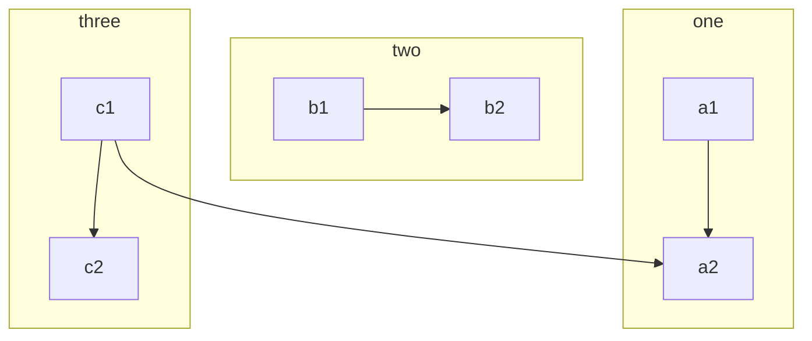
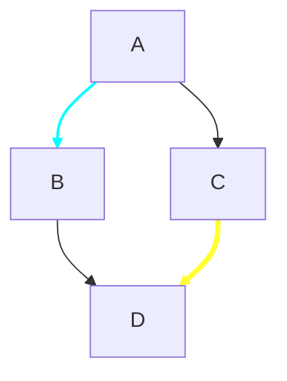
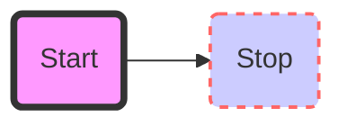
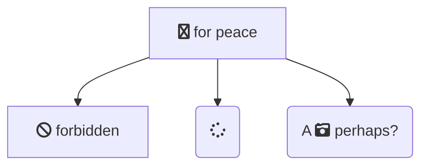
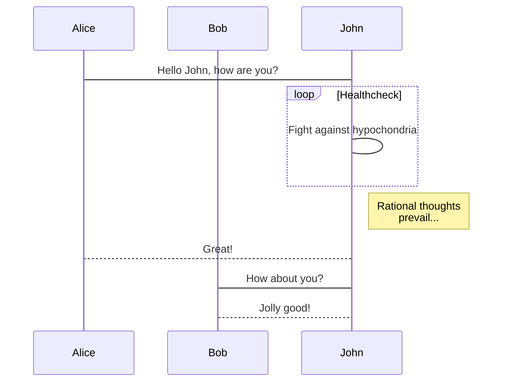
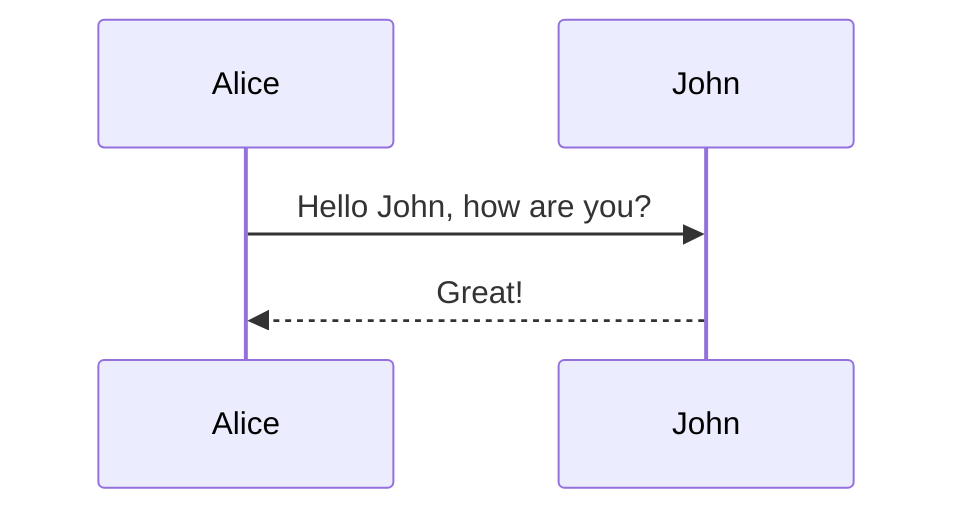
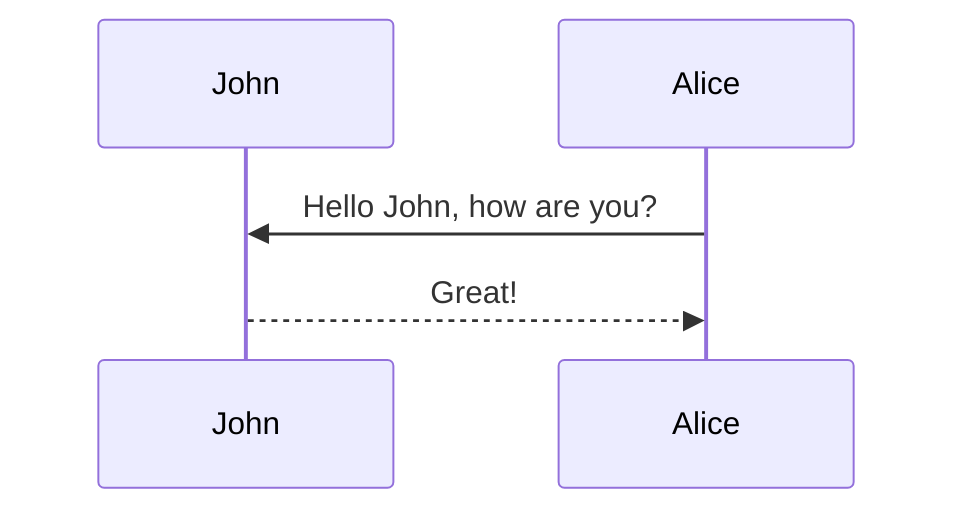
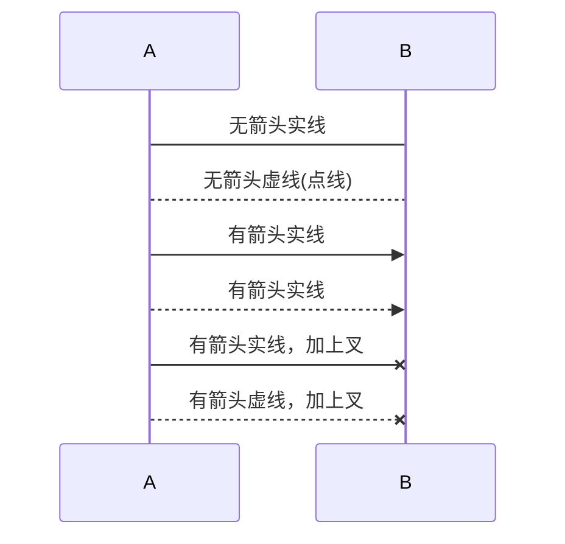

# Mermaid图教程

参考了：https://cloud.tencent.com/developer/article/1334691

## 图表方向

```
graph 图表方向
```

| 图表方向 | 含义     |
| -------- | -------- |
| TB/TD    | 从上到下 |
| BT       | 从下到上 |
| RL       | 从右到左 |
| LR       | 从左到右 |

## 节点图形

| 格式         | 形状       |
| ------------ | ---------- |
| `id[text]`   | 矩形       |
| `id(text)`   | 圆角矩形   |
| `id((text))` | 圆形       |
| `id>text]`   | 右向旗帜状 |
| `id{text}`   | 菱形       |


## 连接线

| 格式                         | 效果                 |
| ---------------------------- | -------------------- |
| `A-->B`                      | 实线，箭头，无文字   |
| `A---B`                      | 实线，无箭头，无文字 |
| `A--文字---B`或`A---|文字|B` | 实线，无箭头，文字   |
| `A--文字-->B`或`A-->|文字|B` | 实线，箭头，文字     |
| `A-.->B`                     | 虚线，箭头，无文字   |
| `A-.文字.->B`                | 虚线，箭头，文字     |
| `A==>B`                      | 大箭头，无文字       |
| `A==文字==>B`                | 大箭头，文字         |

## 特殊语法

### 引号

文字里用引号避免一些特殊字符的错误。比如矩形节点里有 `()` 时就无法渲染，所以加上引号。

```
graph LR
    id1["This is the (text) in the box"]
```


### 实体字符

可以使用 HTML 中的实体字符。

```
graph LR
     A["A double quote:#quot;"] -->B["A dec char:#9829;"]
```


## 子图

```
graph TB
    c1-->a2
    subgraph one
    a1-->a2
    end
    subgraph two
    b1-->b2
    end
    subgraph three
    c1-->c2
    end
```



## 样式

linkStyle 后面的数字表示第几根线，从 0 开始。可以指定颜色和粗细。

```
graph TD;
    A-->B;
    A-->C;
    B-->D;
    C-->D;
    linkStyle 0 stroke:#0ff,stroke-width:2px;
    linkStyle 3 stroke:#ff3,stroke-width:4px;
```



可以设置节点背景，边框颜色，粗细，实线还是虚线

```
graph LR
    id1(Start)-->id2(Stop)
    style id1 fill:#f9f,stroke:#333,stroke-width:4px
    style id2 fill:#ccf,stroke:#f66,stroke-width:2px,stroke-dasharray: 5, 5
```



## 图标

可以使用 [Font Awesome](https://fontawesome.com/) 图标。语法 `fa:icon class name`。

```
graph TD
   B["fa:fa-twitter for peace"]
   B-->C[fa:fa-ban forbidden]
   B-->D(fa:fa-spinner);
   B-->E(A fa:fa-camera-retro perhaps?);
```



## 时序图

```javascript
sequenceDiagram
    participant Alice
    participant Bob
    Alice->John: Hello John, how are you?
    loop Healthcheck
        John->John: Fight against hypochondria
    end
    Note right of John: Rational thoughts <br/>prevail...
    John-->Alice: Great!
    John->Bob: How about you?
    Bob-->John: Jolly good!
```



### 参与者

如果不显示声明，参与者将根据第一次出现的顺序排列，如：

```
sequenceDiagram
    Alice->>John: Hello John, how are you?
    John-->>Alice: Great!
```



第一条语句出现了两个参与者角色，而在这条语句中，Alice 在 John 之前，所以图中也是这个顺序。如果不想根据第一次出现的顺序来排，可以主动声明以定义顺序：

```javascript
sequenceDiagram
    participant John
    participant Alice
    Alice->>John: Hello John, how are you?
    John-->>Alice: Great!
```



### 别名

可以给角色写一个简短的别名以方便书写。

```
sequenceDiagram
    participant A as Alice
    participant J as John
    A->>J: Hello John, how are you?
    J->>A: Great!
```

### 消息

消息连线有六种样式。

有**一个**`-`是实线，**两个**`-`是虚线。

```
sequenceDiagram
    A->B: 无箭头实线
    A-->B: 无箭头虚线(点线)
    A->>B: 有箭头实线
    A-->>B: 有箭头实线
    A-x B: 有箭头实线，加上叉
    A--x B: 有箭头虚线，加上叉
```



###  激活

1. 角色可以选择激活或停用，可以以专用声明决定是否激活

   > sequenceDiagram
   > Alice ->> John : Hello John, how are you?
   > activate John
   > John -->> Alice: Great!
   > deactivate John

   ~~~mermaid
   sequenceDiagram
   Alice ->> John : Hello John, how are you?
   activate John
   John -->> Alice: Great!
   deactivate John
   ~~~

2. 还可以在箭头上附加+/-作为快捷表示方法

   > sequenceDiagram
   > Alice ->>+ John : Hello John, how are you?
   > John -->>- Alice: Great!

   ~~~mermaid
   sequenceDiagram
   Alice ->>+ John : Hello John, how are you?
   John -->>- Alice: Great!
   ~~~

3. 同一个角色可以多次激活

   > sequenceDiagram
   > Alice ->>+ John: Hello John, how are you?
   > Alice ->>+ John: John, can you hear me?
   > John -->>- Alice: Hi Alice, I can hear you!
   > John -->>- Alice: I feel great!

   ~~~mermaid
   sequenceDiagram
   Alice ->>+ John: Hello John, how are you?
   Alice ->>+ John: John, can you hear me?
   John -->>- Alice: Hi Alice, I can hear you!
   John -->>- Alice: I feel great!
   ~~~

### 注释

1. 序列图可以添加注释，格式为：`N(n)ote [right of | left of | over][Actor]`

   > sequenceDiagram
   > participant John
   > Note right of John: Text in note

   ~~~mermaid
   sequenceDiagram
   participant John
   Note right of John: Text in note
   ~~~

2. 也可以创建跨越两个角色的笔记

   > sequenceDiagram
   > Alice -> John: Hello John, how are you?
   > Note over Alice, John: A typical interaction

   ~~~mermaid
   sequenceDiagram
   Alice -> John: Hello John, how are you?
   Note over Alice, John: A typical interaction
   ~~~

### 循环

1. 可以在序列图中实现用符号表示的循环

   > loop Loop-text

   示例：

   > sequenceDiagram
   > Alice->John: Hello John, how are you?
   > loop Every minute
   > John-->Alice: Great!
   > end

   ~~~mermaid
   sequenceDiagram
   Alice->John: Hello John, how are you?
   loop Every minute
   John-->Alice: Great!
   end
   ~~~

   

### 备选路径

1. 可以在序列图中实现用符号表示的备选路径

   > alt Describing text
   > … statements …
   > else
   > … statements …
   > end

   或者如果还有序列是可选的

   > opt Describing-text
   > … statements …
   > end

   示例：

   > sequenceDiagram
   > Alice->>Bob:Hello Bob, how are you?
   > alt is sick
   > Bob->>Alice:Not so good:(
   > else is well
   > Bob->>Alice:Feeling fresh like a daisy
   > end
   > opt Extra response
   > Bob->>Alice:Thanks for asking
   > end

   ~~~mermaid
   sequenceDiagram
   Alice->>Bob:Hello Bob, how are you?
   alt is sick
   Bob->>Alice:Not so good:(
   else is well
   Bob->>Alice:Feeling fresh like a daisy
   end
   opt Extra response
   Bob->>Alice:Thanks for asking
   end
   ~~~

## 类图

### 泛化（Generalization）

~~~
classDiagram
    A<|--B
~~~

~~~mermaid
classDiagram
    A<|--B
~~~

示例：

~~~
classDiagram
    Animal <|-- Duck
    Animal <|-- Fish
    Animal <|-- Zebra
    Animal : +int age
    Animal : +String gender
    Animal: +isMammal()
    Animal: +mate()
    class Duck{
      +String beakColor
      +swim()
      +quack()
    }
    class Fish{
      -int sizeInFeet
      -canEat()
    }
    class Zebra{
      +bool is_wild
      +run()
    }
~~~


~~~mermaid
classDiagram
    Animal <|-- Duck
    Animal <|-- Fish
    Animal <|-- Zebra
    Animal : +int age
    Animal : +String gender
    Animal: +isMammal()
    Animal: +mate()
    class Duck{
      +String beakColor
      +swim()
      +quack()
    }
    class Fish{
      -int sizeInFeet
      -canEat()
    }
    class Zebra{
      +bool is_wild
      +run()
    }
~~~

### 实现（Realization）

~~~
classDiagram
   class IFlyable{
     <<interface>>
     + flying()
   }
   IFlyable<|..Bat
   Bat:+flying()
~~~

~~~mermaid
classDiagram
   class IFlyable{
     <<interface>>
     + flying()
   }
   IFlyable<|..Bat
   Bat:+flying()
~~~

### 组合（Composition）

~~~
classDiagram
  Computer *-- CPU
  Computer *-- Mainboard
  Computer *-- HardDisk
  Computer *-- MemeryCard
~~~

~~~mermaid
classDiagram
  Computer *-- CPU
  Computer *-- Mainboard
  Computer *-- HardDisk
  Computer *-- MemeryCard
~~~

### 聚合（Aggregation)

~~~
classDiagram
  Company o-- Empolyee
~~~

~~~mermaid
classDiagram
  Company o-- Empolyee
~~~

### 关联（Association）

~~~
classDiagram
  Reader "1..*" -- "1..*" Book
  Book "1..*"--> "1"Author
~~~

~~~mermaid
classDiagram
  Reader "1..*" -- "1..*" Book
  Book "1..*"--> "1"Author
~~~

### 依赖（Dependency）

~~~
classDiagram
  Animal..>Food
~~~

~~~mermaid
classDiagram
  Animal..>Food
~~~

### 总结

泛化=实现>组合>聚合>关联>依赖

~~~
classDiagram
classA --|> classB : Generalization
classM ..|> classN : Realization
classC --* classD : Composition
classE --o classF : Aggregation
classG --> classH : Association
classI -- classJ : Association
classK ..> classL : Dependency
~~~

~~~mermaid
classDiagram
classA --|> classB : Generalization
classM ..|> classN : Realization
classC --* classD : Composition
classE --o classF : Aggregation
classG --> classH : Association
classI -- classJ : Association
classK ..> classL : Dependency
~~~

