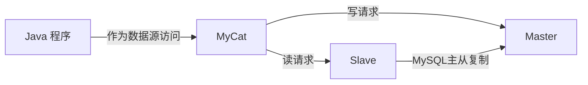
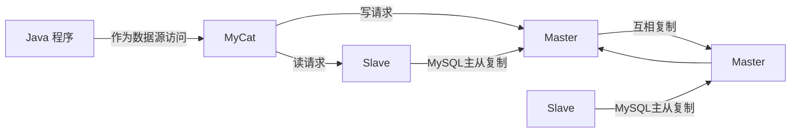

尚硅谷《MySQL数据库入门到大牛，mysql安装到优化，百科全书级，全网天花板》2021-11-17

https://www.bilibili.com/video/BV1iq4y1u7vj 

# P1 MySQL 教程简介

# P2 为什么使用数据库及数据库常用概念

## 为什么要使用数据库

- 持久化（persistence）：把数据保存到可掉电式存储设备中以供之后使用。大多数情况下，特别是企业级应用，数据持久化意味着将内存中的数据保存到硬盘上加以“固化”，而持久化的实现过程大多通过各种关系数据库来完成。
- 持久化的主要作用是将内存中的数据存储在关系型数据库中，当然也可以存储在磁盘文件、XML 数据文件中。

## 数据库与数据库管理系统

### 数据库的相关概念

DB：数据库（Database）即存储数据的“仓库”，其本质是一个文件系统。它保留了一系列有组织的数据。

DBMS：数据库管理系统（Database Management System）是一种操纵和管理数据库的大型软件，用于建立、使用和维护数据库，对数据库进行统一管理和控制。用户通过数据库管理系统访问数据库中表内的数据。

SQL：结构化查询语言（Structured Query Language）专门用来与数据库通信的语言。

### 数据库与数据库管理系统的关系

数据库管理系统（DBMS）可以管理多个数据库，一般开发人员会针对每一个应用创建一个数据库。为保存应用中实体的数据，一般会在数据库创建多个表，以保存程序中实体用户的数据。

# P3 常见的 DBMS 的对比

## 常见的数据库管理系统排名

目前互联网上常见的数据库管理软件有 Oracle、MySQL、MS SQL Server、DB2、PostgreSQL、Access、Sybase、Informix 这几种。

# P94 MySQL 8.0 新特性——窗口函数的使用

## 1. MySQL 8 新特性概述

MySQL 从 5.7 版本直接跳跃发布了 8.0 版本，可见这是一个令人兴奋的里程碑版本。MySQL 8 版本在功能上做了显著的改进与增强，开发者对 MySQL 的源代码进行了重构，最突出的一点是多 MySQL Optimizer 优化器进行了改进。不仅在速度上得到了改善，还为用户带来了更好的性能和更棒的体验。

### 1.1 MySQL 8.0 新增特性

1. 更简便的 NoSQL 支持

   NoSQL 泛指非关系型数据库和数据存储。随着互联网平台的规模飞速发展，传统的关系型数据库已经越来越不能满足需求。从 5.6 版本开始，MySQL 就开始支持简单的 NoSQL 存储功能。MySQL 8 对这一功能做了优化，以更灵活的方式实现 NoSQL 功能，不再依赖模式（schema）。

2. 更好的索引

   在查询中，正确地使用索引可以提高查询的效率。MySQL 8 中新增了 `隐藏索引` 和 `降序索引`。隐藏索引可以用来测试去掉索引对查询性能的影响。在查询中混合存在多列索引时，使用降序索引可以提高查询的性能。

3. 更完善的 JSON 支持

   MySQL 从 5.7 开始支持原生 JSON 数据的存储，MySQL 8 对这一功能做了优化，增加了聚合函数 `JSON_ARRAYAGG()` 和 `JSON_OBJECTAGG()`，将参数聚合为 JSON 数组或对象，新增了行内操作符 ->>，是列路径运算符 -> 的增强，对 JSON 排序做了提升，并优化了 JSON 的更新操作。

4. 安全和账户管理

   MYSQL 8 中新增了 `caching_sha2_password` 授权插件、角色、密码历史记录和 FIPS 模式支持，这些特性提高了数据库的安全性和性能，使数据库管理员能够更灵活地进行账户管理工作。

5. InnoDB 的变化

   `InnoDB 是 MySQL 默认的存储引擎`，是事务型数据库的首选引擎，支持事务安全表（ACID），支持行锁定和外键。在 MySQL 8 版本中，InnoDB 在自增、索引、加密、死锁、共享锁等方面做了大量的`改进和优化`，并且支持原子数据定义语言（DDL），提高了数据安全性，对事务提供更好的支持。

6. 数据字典

   在之前的 MySQL 版本中，字典数据都存储在元数据文件和非事务表中。从 MySQL 8 开始新增了事务数据字典，在这个字典里存储着数据库对象信息，这些数据字典存储在内部事务表中。

7. 原子数据定义语句

   MySQL 8 开始支持原子数据定义语句（Atomic DDL），即 `原子 DDL`。目前，只有 InnoDB 存储引擎支持原子 DDL。

   原子数据定义语句（DDL）将与 DDL 操作相关的数据字典更新、存储引擎操作、二进制日志写入结合到一个单独的原子事务中，这使得即使服务器崩溃，事务也会提交或回滚。

   使用支持原子操作的存储引擎所创建的表，在执行 DROP TABLE、CREATE TABLE、ALTER TABLE、RENAME TABLE、TRUNCATE TABLE、CREATE TABLESPACE、DROP TABLESPACE 等操作时，都支持原子操作，即事务要么完全操作成功，要么失败后回滚，不再进行部分提交。

   对于从 MySQL 5.7 复制到 MySQL 8 版本中的语句，可以添加 IF EXISTS 或 IF NOT EXISTS 语句来避免发生错误。

8. 资源管理
   MySQL 8 开始支持创建和管理资源组，允许将服务器内运行的线程分配给特定的分组，以便线程根据组内可用资源执行。组属性能够控制组内资源，启用或限制组内资源消耗。数据库管理员能够根据不同的工作负载适当地更改这些属性。

   目前，CPU 时间是可控资源，由“虚拟 CPU”这个概念来表示，此术语包含 CPU 的核心数，超线程，硬件线程等等。服务器在启动时确定可用的虚拟 CPU 数量。拥有对应权限的数据库管理员可以将这些 CPU 与资源组关联，并为资源组分配线程。

   资源组组件为 MySQL 中的资源组管理提供了 SQL 接口。资源组的属性用于资源组。MySQL 中存在两个默认组，系统组和用户组。默认的组不能被删除，其属性也不能被更改。对于用户自定义的组，资源组创建时可初始化所有的属性，除去名字和类型，其他属性都可在创建之后进行更改。

   在一些平台下，或进行了某些 MySQL 的配置时，资源管理的功能将受到限制，甚至不可用。例如，如果安装了线程池插件，或者使用的是 MacOS 系统，资源管理将处于不可用状态。在 FreeBSD 和  Solaris 系统中，资源线程优先级将失效。在 Linux 系统中，只有配置了 CAP_SYS_NICE 属性，资源管理优先级才能发挥作用。

9. 字符集支持

   MySQL 8 中默认的字符集由 `latin1` 更改为 `utf8mb4`，并首次增加了日语所特定使用的集合，utf8mb4_ja_0900_as_cs。

10. 优化器增强

    MySQL 优化器开始支持隐藏索引和降序索引。隐藏索引不会被优化器使用，验证索引的必要性时不需要删除索引，先将索引隐藏，如果优化器性能无影响就可以真正地删除索引。降序索引允许优化器对多个列进行排序，并且允许排序顺序不一致。

11. 公用表表达式

    公用表表达式（Common Table Expression）简称为 CTE，MySQL 现在支持递归和非递归两种形式的 CTE。CTE 通过在 SELECT 语句或其他特定语句前`使用 WITH 语句对临时结果`进行命名。

    基础语法如下：

    ```mysql
    WITH cte_name(col_name1, col_name2 ...) AS (Subquery)
    SELECT * FROM cte_name;
    ```

    Subquery 代表子查询，子查询前使用 WITH 语句将结果集命名为 cte_name，在后续的查询中即可使用 cte_name 进行查询。

12. 窗口函数

    MySQL 8 开始支持窗口函数。在之前的版本中已存在的大部分`聚合函数`在 MySQL 8 中也可以作为窗口函数来使用

    | 函数名称       | 描述                                                     |
    | -------------- | -------------------------------------------------------- |
    | CUME_DIST()    | 累计的分布值                                             |
    | DENSE_RANK()   | 对当前记录不间断排序                                     |
    | FIRST_VALUE()  | 返回窗口首行记录的对应字段值                             |
    | LAG()          | 返回对应字段的前 N 行记录                                |
    | LAST_VALUE()   | 返回窗口尾行记录的对应字段值                             |
    | LEAD()         | 返回对应字段的后 N 行记录                                |
    | NTH_VALUE()    | 返回第 N 条记录对应的字段值                              |
    | NTILE()        | 将区划分为 N 组，并返回组的数量                          |
    | PERCENT_RANK() | 返回 0 到 1 之间的小数，表示某个字段值在数据分区中的排名 |
    | RANK()         | 返回分区内每条记录对应的排名                             |
    | ROW_NUMBER()   | 返回每一条记录对应的序号，且不重复                       |

13. 正则表达式支持

    MySQL 在 8.0.4 以后的版本中采用支持 unicode 的国际化组件库实现正则表达式操作。这种方式不仅能提供完全的 Unicode 支持，而且是多字节安全编码。MySQL 增加了 REGEXP_LIKE()、EGEXP_INSTR()、REGEXP_REPLACE() 和 REGEXP_SUBSTR() 等函数来提升性能。另外，regexp_stack_limit 和 regexp_time_limit 系统变量能够通过匹配引擎来控制资源消耗。

14. 内部临时表

    `TempTable 存储引擎取代 MEMORY 存储引擎成为内部临时表的默认存储引擎`。TempTable 存储引擎为 VARCHAR 和 VARBINARY 列提供高效存储。`internal_tmp_mem_storage_engine` 会话变量定义了内部临时表的存储引擎，可选的值有两个，TempTable 和 MEMORY，其中 TempTable 为默认的存储引擎。temptable_max_ram 系统配置项定义了 TempTable 存储引擎可使用的最大内存数量。

15. 日志记录

    在 MySQL 8 中错误日志子系统由一系列 MySQL 组件构成。这些组件的构成由系统变量 log_error_services 来配置，能够实现日志事件的过滤和写入。

16. 备份锁

    新的备份锁允许在线备份期间执行数据操作语句，同时阻止可能造成快照不一致的操作。新备份锁由 LOCK INSTANCE FOR BACKUP 和 UNLOCK INSTANCE 语法提供支持，执行这些操作需要备份管理员特权。

17. 增强的 MySQL 复制

    MySQL 8 复制支持对 `JSON 文档`进行部分更新的`二进制日志记录`，该记录`使用紧凑的二进制格式`，从而节省记录完整 JSON 文档的空间。当使用基于语句的日志记录时，这种紧凑的日志记录会自动完成，并且可以通过将新的 binlog_row_value_options 系统变量值设置为 PARTIAL_JSON 来启用。

### 1.2 MySQL 8.0 移除的旧特性

在 MySQL 5.7 版本上开发的应用程序如果使用了 MySQL 8.0 移除的特性，语句可能会失败，或者产生不同的执行结果。为了避免这些问题，对于使用了移除特性的应用，应当尽力修正以避免使用这些特性，并尽可能使用替代方法。

1. 查询缓存

   `查询缓存已被移除`，删除的项有：

   1. 语句：FLUSH QUERY CACHE 和 RESET QUERY CACHE。
   2. 系统变量：query_cache_limit、query_cache_min_res_unit、query_cache_size、query_cache_type、query_cache_wlock_invalidate。
   3. 状态变量：Qcache_free_blocks、Qcache_free_memory、Qcache_hits、Qcache_inserts、Qcache_lowmem_prunes、Qcache_not_cached、Qcache_queries_in_cache、Qcache_total_blocks。
   4. 线程状态：checking privileges on cached query、checking query cache for query、invalidating query cache entries、sending cached result to client、storing result in query cache、waiting for query cache lock。

2. 加密相关

   删除的加密相关的内容有：ENCODE()、DECODE()、ENCRYPT()、DES_ENCRYPT() 和 DES_DECRYPT() 函数，配置项 des-key-file，系统变量 have_crypt，FLUSH 语句的 DES_KEY_FILE 选项，HAVE_CRYPT CMake 选项。

   对于移除的 ENCRYPT() 函数，考虑使用 SHA2() 替代，对于其他移除的函数，使用 AES_ENCRYPT() 和 AES_DECRYPT() 替代。

3. 空间函数相关

   在 MySQL 5.7 版本中，多个空间函数已被标记为过时。这些过时函数在 MySQL 8 中都已被移除，只保留了对应的 ST_ 和 MBR 函数。

4. \N 和 NULL

   在 SQL 语句中，解析器不再将 \N 视为 NULL，所以在 SQL 语句中应使用 NULL 代替 \N。这项变化不会影响使用 LOAD DATA INFILE 或者 SELECT ... INTO OUTFILE 操作文件的导入和导出。在这类操作中，NULL 仍等同于 \N

5. mysql_install_db

   在 MySQL 分布中，已移除了 mysql_install_db 程序，数据字典初始化需要调用带着 --initialize 或者 --initialize-insecure 选项的 mysqld 来代替实现。另外，--bootstrap 和 INSTALL_SCRIPTDIR CMake 也已被删除。

6. 通用分区处理程序

   通用分区处理程序已从 MySQL 服务中被移除。为了实现给定表分区，表所使用的存储引擎需要自有的分区处理程序。

   提供本地分区支持的 MySQL 存储引擎有两个，即 InnoDB 和 NDB，而在 MySQL 8 中只支持 InnoDB。

7. 系统和状态变量信息

   在 INFORMATION_SCHEMA 数据库中，对系统和状态变量信息不再进行维护。GLOBAL_VARIABLES、SESSION_VARIABLES、GLOBAL_STATUS、SESSION_STATUS 表都已被删除。另外，系统变量 show_compatibility_56 也已被删除。被删除的状态变量有 Slave_heartbeat_period、Slave_last_heartbeat、Slave_received_heartbeats、Slave_retried_transactions、Slave_running。以上被删除的内容都可使用性能模式中对应的内容进行替代。

8. mysql_plugin 工具

   mysql_plugin 工具用来配置 MySQL 服务器插件，现已被删除，可使用 --plugin-load 或 --plugin-load-add 选项在服务器启动时加载插件或者在运行时使用 INSTALL PLUGIN 语句加载插件来替代该工具。

## 2. 新特性1：窗口函数

20:00

### 2.1 使用窗口函数前后对比

### 2.2 窗口函数分类

31:30

### 2.3 语法结构

38:30

### 2.4 分类讲解

#### 序号函数

41:30

- ROW_NUMBER() 函数（41:40）
- RANK() 函数（46:30）
- DENSE_RANK() 函数（49:20）

#### 分布函数

51:50

- PERCENT_RANK() 函数（52:00）
- CUME_DIST() 函数（56:40）

#### 前后函数

58:40

- LAG(expr, n) 函数（58:50）
- LEAD(expr, n) 函数（1:02:30）

#### 首尾函数

1:04:32

- FIRST_VALUE(expr) 函数（1:04:40）
- LAST_VALUE(expr) 函数（1:07:25）

#### 其他函数

1:07:40

- NTH_VALUE(expr, n) 函数（1:07:50）
- NTILE(n) 函数（1:10:00）

# P95 公用表表达式 - 课后练习 - 最后寄语

## 普通公用表表达式

02:35

## 递归公用表表达式

08:20

## 小结

18:30

# P96 MySQL 高级特性篇章节概览

## 06 - MySQL 架构篇

1. Linux 环境下 MySQL 的安装与使用
   - 启动好两台 CentOS 7 虚拟机
   - rpm、yum、编译安装源码包
   - 服务的启动与远程登陆
   - 字符集设置、各级别字符集规则
   - sql_mode
2. MySQL 的数据目录
   - 主要目录结构
     - 文件存放路径：/var/lib/mysql
     - 相关命令：/usr/bin
     - 配置文件目录：/usr/share/mysql-8.0
   - 数据库文件系统
     - db.opt
     - .frm
     - .ibd
     - .MYD
     - .MYI
3. 用户与权限管理
   - 权限表：user 表、db 表、table_priv 表等
   - 用户管理：创建、修改、删除用户；设置密码
   - 权限管理：授予、查看、回收权限
   - 角色管理：创建、查看、激活、删除角色
   - 配置文件的使用
4. 逻辑架构
   - 逻辑架构分析
     - 连接层
     - 服务层
     - 引擎层
     - 存储层
   - SQL 查询流程
   - 查看执行计划
   - 数据库缓冲池
5. 存储引擎
   - 查看默认引擎
   - 设置表的引擎
   - 不同引擎介绍
     - InnoDB
     - MyISAM
     - Archive
     - CSV
     - Memory
     - ……
6. InnoDB 数据存储结构
   - 关系图
   - InnoDB 行格式
     - COMPACT 行格式
     - Redundant 行格式
     - Dynamic 行格式
     - Compressed 行格式
   - 数据页组成部分
     - 文件头（File Header）
     - 页头（Page Header）
     - 最大最小记录（Infimum + supremum）
     - 用户记录（User Records）
     - 空闲空间（Free Space）
     - 页目录（Page Directory）
     - 文件尾（File Tailer）
   - 区的结构：一个区会分配 64 个连续的页
   - 段的结构：若干个零散的页面以及一些完整的区组成
   - 表空间
     - 系统表空间（System tablespace）
     - 独立表空间（File-per-table tablespace）
     - 撤销表空间（Undo Tablespace）
     - 临时表空间（Temporary Tablespace）

## 07 - 索引及调优篇

1. 索引的数据结构
   - 类比
   - InnoDB 中的索引
     - 聚簇索引
     - 二级索引
   - 常见数据结构
     - Hash 结构
     - 二叉搜索树
     - AVL 树
     - B-Tree
     - B+Tree
     - R-Tree
2. 索引的创建与设计规则
   - 索引的创建、删除等
   - 哪些情况适合创建索引
     - 12 条规则
   - 哪些情况不适合创建索引
     - 7 条规则
3. 性能分析工具的使用
   - 数据库服务器的优化步骤
   - 系统性能参数
   - 统计 SQL 的查询成本：last_query_cost
   - 慢查询日志
   - 慢查询日志分析工具：mysqldumpslow
   - SQL 执行成本：SHOW PROFILE
   - 分析查询语句：EXPLAIN
4. 索引优化和查询优化
   - 调优原则与调优手段
   - 索引失效案例
     - 11 大案例分析
   - 关联查询优化
   - 子查询优化
   - 排序优化
   - GROUP BY 优化
   - 日常 SQL 编写的规范与优化
     - 16 大案例剖析
5. 数据库的设计规范
   - 六大范式
   - 反范式化
   - ER 模型
   - 表的设计原则
     - “三少一多”
   - SQL  编写建议
6. 数据库其他调优策略
   - 如何定位调优问题
   - 调优的维度和步骤
   - 优化 MySQL 服务器
     - 优化硬件
     - 优化参数
   - 优化数据库结构
     - 7 大原则
   - 大表优化
     - 限定查找范围
     - 读写分离
     - 垂直拆分
     - 水平拆分
   - 其他调优策略
     - 服务器语句超时处理
     - 创建全局通用表空间
     - 临时表性能优化
     - 隐藏索引对调优的帮助

## 08 - 事务篇

1. 事务基础知识
   - 事务处理的原则
   - 事务的 ACID 特性
   - 事务的状态
   - 事务隔离级别
2. MySQL 事务日志
   - redo 日志
     - redo 日志格式
     - redo 日志的写入过程
     - redo 日志的刷盘时机
     - 崩溃恢复
   - undo 日志
     - undo 日志的格式
     - 通用链表结构
     - Undo 页面链表
     - undo 日志具体写入过程
3. 锁
   - 并发事务访问相同记录
     - 读-读情况
     - 写-写情况
     - 读-写或写-读情况
   - 锁的不同角度分类
     - 对数据操作的类型分类划分：读锁、写锁
     - 对数据操作的粒度划分：表级锁、行锁、页级锁
       - 表级别的 S 锁、X 锁
       - 意向锁
       - 自增锁
       - MDL 锁
     - 从程序员的角度划分：乐观锁、悲观锁
     - 按加锁的方式划分：显示锁，隐式锁
     - 全局锁
     - 死锁
   - 锁的内存结构
   - 间隙锁加锁规则
     - 11 大案例剖析
4. 多版本并发控制
   - 快照读
   - 当前读
   - 版本链
   - ReadView
   - InnoDB 是如何解决幻读的

## 09 - 日志与备份篇

1. 其他数据库日志
   - 慢查询日志（slow query log）
   - 通用查询日志（general query log）
   - 错误日志（error log）
   - 二进制日志（bin log）
   - 中继日志（relay log）
   - 数据定义语句日志
2. 主从复制
   - 主从复制的原理
   - 一主一从常见配置
     - 主机配置文件
     - 从机配置文件
   - 主从同步数据一致性问题
   - 一主一从的读写分离
   - 主从复制：双主双从
   - 垂直拆分——分库
   - 水平拆分——分表
3. 数据库备份与恢复
   - mysqldump 实现逻辑备份
     - 备份全部数据库
     - 备份部分数据库
     - 备份部分表
     - 备份单表的部分数据
     - 只备份结构或只备份数据
   - 物理备份：直接复制整个数据库
     - 使用 MySQLhotcopy 工具快速备份
   - mysql 命令恢复数据
     - 单库备份中恢复单库
     - 全量备份恢复
     - 从全量备份中恢复单库
     - 从单库备份中恢复单表
   - 数据库迁移
     - 物理迁移和逻辑迁移
     - 相同版本数据库之间迁移注意点
     - 不同版本数据库之间迁移注意点
     - 全量迁移
     - 表的导出与导入

# P97 CentOS 环境的准备

第01章_Linux下MySQL的安装与使用

## 1 安装前说明

### 1.1 Linux 系统及工具的准备

- 安装并启动好两台虚拟机：`CentOS 7`
  - 掌握克隆虚拟机的操作
    - mac 地址
    - 主机名 `vim /etc/hostname`
    - ip 地址 `vim /etc/sysconfig/network-scripts/ifcfg-ens33`
    - UUID
- 安装有 `XShell` 和 `Xftp` 等访问 CentOS 系统的工具
- CentOS 6 和 CentOS 7 在 MySQL 的使用中的区别
  1. 防火墙：6 是 iptables，7 是 firewalld
  2. 启动服务的命令：6 是 service，7 是 systemctl

# P98 MySQL 的卸载

## 1.2 查看是否安装过 MySQL

- 如果你使用 rpm 安装，检查一下 RPM PACKAGE：

  ```shell
  rpm -qa | grep -i mysql # -i 忽略大小写
  ```

- 检查 mysql service

  ```shell
  systemctl status mysqld.service
  ```

- 如果存在 mysql-libs 的旧版本包，显示如下：（有查询结果）

- 如果不存在 mysql-libs 的版本，显示如下：（无查询结果）

## 1.3 MySQL 的卸载

1. 关闭 mysql 服务

   ```shell
   systemctl stop mysqld.service
   ```

2. 查看当前 mysql 安装状况

   ```shell
   rpm -qa | grep -i mysql
   # 或
   yum list installed | grep mysql
   ```

3. 卸载上述命令查询出的已安装程序

   ```shell
   yum remove mysql-xxx mysql-xxx mysql-xxx
   ```

   务必卸载干净，反复执行 `rpm -qa | grep -i mysql` 确认是否有卸载残留

4. 删除 mysql 相关文件

   - 查找相关文件 `find / -name mysql`
   - 删除上述命令查找出的相关文件 `rm -rf xxx`

5. 删除 my.cnf `rm -rf /etc/my.cnf`

# P99 Linux 下安装 MySQL 8.0 和 5.7 版本

## 2 MySQL 的 Linux 版安装

### 2.1 MySQL 的 4 大版本

> - **MySQL Community Server 社区版本**，开源免费，自由下载，但不提供官方技术支持，适用于大多数普通用户。
> - **MySQL Enterprise Edition 企业版本**，需付费，不能在线下载，可以使用 30 天。提供了更多的功能和更完备的技术支持，更适合于对数据库的功能和可靠性要求较高的企业客户。
> - **MySQL Cluster 集群版**，开源免费。用于架设集群服务器，可将几个 MySQL Server 封装成一个 Server。需要在社区版或企业版的基础上使用。
> - **MySQL Cluster CGE 高级集群版**，需付费。

此外，官方还提供了 `MySQL Workbench`（GUI TOOL）一款专为 MySQL 设计的**ER/数据库建模工具**。它是著名的数据库设计工具DBDesigner4的继任者。MySQL Workbench 又分为两个版本，分别是**社区版**（MySQL Workbench OSS）、**商用版**（MySQL Workbench SE）。

### 2.2 下载 MySQL 指定版本

1. 下载地址：官网 https://www.mysql.com

2. 打开官网，点击 DOWNLOADS

   然后点击 MySQL Community(GPL) Downloads

3. 点击 MySQL Community Server

4. 在 General Availability(GA) Releases 中选择合适的版本

   - 如果安装 Windows 系统下 MySQL，推荐下载 **MSI 安装程序**；点击 **Go to Download Page** 进行下载即可。
   - Windows 下的 MySQL 安装有两种安装程序
     - `mysql-installer-web-community-8.0.25.0.msi` 下载程序大小：2.4M；安装时需要联网安装组件
     - `mysql-installer-community-8.0.25.0.msi` 下载程序大小：435.7M；安装时离线安装即可。**推荐**。

5. Linux 系统下安装 MySQL 的几种方式

   1. Linux 系统下安装软件的常用三种方式：

      - 方式一：rpm 命令

        使用 rpm 命令安装扩展名“.rpm”的软件包。

      - 方式二：yum 命令

        需联网，从**互联网获取**的 yum 源，直接使用 yum 命令安装。

      - 方式三：编译安装源码包

        针对 `tar.gz` 这样的压缩格式，要用 tar 命令来解压；如果是其他压缩格式，就使用其他命令。

   2. Linux 系统下安装 MySQL，官方给出多种安装方式

      | 安装方式       | 特点                                                 |
      | -------------- | ---------------------------------------------------- |
      | rpm            | 安装简单，灵活性差，无法灵活选择版本、升级           |
      | rpm repository | 安装包极小，版本安装简单灵活，升级方便，需要联网安装 |
      | 通用二进制包   | 安装比较复杂，灵活性高，平台通用性好                 |
      | 源码包         | 安装最复杂，时间长，参数设置灵活，性能好             |

      - 这里不能直接选择 CentOS 7 系统版本，所以选择与之对应的 `Red Hat Enterprise Linux`

6. 下载的 tar 包，用压缩工具打开

   - 解压后 rpm 安装包

### 2.3 CentOS 7 下检查 MySQL 依赖

1. 检查 /tmp 临时目录权限（必不可少）

   由于 mysql 安装过程中，会通过 mysql 用户在 /tmp 目录下新建 tmp_db 文件，所以请给 /tmp 较大的权限。执行：

   ```shell
   chmod -R 777 /tmp
   ```

2. 安装前，检查依赖

   ```shell
   rpm -qa | grep libaio
   rpm -qa | grep net-tools
   ```

   如果不存在 需要到 centos 安装盘里进行 rpm 安装。安装 linux 如果带图形化界面，这些都是安装好的。

### 2.4 CentOS 7 下 MySQL 安装过程

1. 将安装程序拷贝到 /opt 目录下

   在 mysql 的安装目录下执行：（必须按照顺序执行）

   ```shell
   rpm -ivh mysql-community-common-8.0.25-1.el7.x86_64.rpm
   rpm -ivh mysql-community-client-plugins-8.0.25-1.el7.x86_64.rpm
   rpm -ivh mysql-community-libs-8.0.25-1.el7.x86_64.rpm
   rpm -ivh mysql-community-client-8.0.25-1.el7.x86_64.rpm
   rpm -ivh mysql-community-server-8.0.25-1.el7.x86_64.rpm
   ```

   - 注意：如在检查工作时，没有检查 mysql 依赖环境在安装 mysql-community-server 会报错
   - `rpm` 是 Redhat Package Manage 缩写，通过 RPM 的管理，用户可以把源代码包装成以 rpm 为扩展名的文件形式，易于安装。
   - `-i` , --install 安装软件包
   - `-v`，--verbose 提供更多的详细信息输出
   - `-h`，--hash 软件包安装时列出哈希标记（和 -v 一起使用效果更好），展示进度条

2. 安装过程截图

   安装过程中可能的报错信息：`mariadb-libs 被 mysql-community-libs-8.0.25-1.el7.x86_64 取代`

   > 一个命令： yum remove mysql-libs 解决，清除之前安装过的依赖即可

3. 查看 MySQL 版本

   执行如下命令，如果成功表示安装 mysql 成功。类似 java -version 打出版本等信息

   ```shell
   mysql --version
   # 或
   mysqladmin --version
   ```

   执行如下命令，查看是否安装成功。需要增加 -i 不用去区分大小写，否则搜索不到。

   ```shell
   rpm -qa | grep -i mysql
   ```

4. 服务的初始化

   为了保证数据库目录与文件的所有者为 mysql 登录用户，如果你是以 root 身份运行 mysql 服务，需要执行下面的命令初始化：

   ```shell
   mysqld --initialize --user=mysql
   ```

   说明：--initialize 选项默认以“安全”模式来初始化，则会为 root 用户生成一个密码并将**该密码标记为过期**，登录后你需要设置一个新的密码。生成的**临时密码**会往日志中记录一份。

   查看密码：

   ```shell
   cat /var/log/mysqld.log
   ```

   root@localhost: 后面就是初始化的密码

5. 启动 MySQL，查看状态

   ```shell
   # 加不加 .service 后缀都可以
   systemctl start mysqld.service # 启动
   systemctl stop mysqld.service # 关闭
   systemctl restart mysqld.service # 重启
   systemctl status mysqld.service # 查看状态
   ```

   > `mysqld` 这个可执行文件就代表着 `MySQL` 服务器程序，运行这个可执行文件就可以直接启动一个服务器进程。

   查看进程：

   ```shell
   ps -ef | grep -i mysql
   ```

6. 查看 MySQL 服务是否自启动

   ```shell
   systemctl list-unit-files| grep mysqld.service
   ```

   默认是 enabled。

   - 如果不是 enabled 可以运行如下命令设置自启动

     ```shell
     systemctl enable mysqld.service
     ```

   - 如果希望不进行自启动，运行如下命令设置

     ```shell
     systemctl disable mysqld.service
     ```

     

# P100 SQLyog 实现 MySQL 8.0 和 5.7 的远程连接

## 3 MySQL 登录

### 3.1 首次登录

通过 `mysql -hlocalhost -P3306 -uroot -p` 进行登录

### 3.2 修改密码

- 因为初始化密码默认是过期的，所以查看数据库会报错

- 修改密码：

  ```mysql
  ALTER USER `root`@`localhost` IDENTIFIED BY `new_password`;
  ```

- 5.7 版本之后（不含5.7），mysql 加入了全新的密码安全机制。设置新密码太简单会报错。

- 改为更复杂的密码规则之后，设置成功，可以正常使用数据库了。

### 3.3 设置远程登录

1. 当前问题

   在用 SQLyog 或 Navicat 中配置远程连接 MySQL 数据库时遇到如下报错信息，这是由于 MySQL 配置了不支持远程连接引起的。

2. 确认网络

   1. 在远程机器上使用 ping ip地址 保证网络畅通

   2. 在远程机器上使用 telnet 命令保证端口号开放访问

      ```shell
      telnet ip地址 端口号
      ```

3. 关闭防火墙或开放端口

   方式一：关闭防火墙

   - CentOS 6:

     ```shell
     service iptables sto
     ```

   - CentOS 7:

     ```shell
     systemctl start firewalld.service
     systemctl status firewalld.service
     systemctl stop firewalld.service
     # 设置开机启用防火墙
     systemctl enable firewalld.service
     # 设置开机禁用防火墙
     systemctl disable firewalld.service
     ```

   方式二：开放端口

   - 查看开放的端口号

     ```shell
     firewall-cmd --list-all
     ```

   - 设置开放的端口号

     ```shell
     firewall-cmd --add-service=http --permanent
     firewall-cmd --add-port=3306/tcp --permanent
     ```

   - 重启防火墙

     ```shell
     firewall-cmd --reload
     ```

4. Linux 下修改配置

   ```mysql
   show databases;
   use mysql;
   select host, user from user;
   update user set host = '%' where user = 'root';
   flush privileges;
   ```

配置新连接报错：错误号码 2058，分析是 mysql 密码加密方法变了。

解决办法：Linux 下 mysql -u root -p 登录你的 mysql 数据库，然后执行这条 SQL：

```mysql
ALTER USER `root`@'%' IDENTIFIED WITH mysql_native_password BY 'abc123';
```

然后再重新配置 SQLyog 的连接，则可以连接成功了。

## 4 MySQL 8 的密码强度评估（了解）

### 4.1 MySQL 不同版本设置密码（可能出现）

- MySQL 5.7 中：成功

  ```shell
  mysql> alter user 'root' identified by 'abcd1234';
  Query OK, 0 rows affected (0.00 sec)
  ```

- MySQL 8.0 中：失败

  ```shell
  mysql> alter user 'root' identified by 'abcd1234';
  ERROR 1819 (HY000): Your password does not satisfy the current policy requirements
  ```

### 4.2 MySQL 8 之前的安全策略

在 MySQL 8.0 之前，MySQL 使用的是 validate_password 插件检测、验证账号密码强度，保障账号的安全性。

安装/启用插件方式1：在参数文件 my.cnf 中添加参数

```
[mysqld]
plugin-load-add=validate_password.so
\#ON/OFF/FORCE_PLUS_PERMANENT: 是否使用该插件（及强制/永久强制使用）
validate-password=FORCE_PLUS_PERMANENT
```

> 说明1：
>
> plugin library 中的 validate_password 文件名的后缀名根据平台不同有所差异。对于 Unix 和 Unix-like 系统而言，它的文件后缀名是 .dll。
>
> 说明2：
>
> 修改参数后必须重启 MySQL 服务才能生效。
>
> 说明3：
>
> 参数 FORCE_PLUS_PERMANENT 是为了防止插件在 MySQL 运行时的时候被卸载。当你卸载插件时就会报错。

安装/启用插件方式2：运行时命令安装（推荐）

```mysql
mysql> INSTALL PLUGIN validate_password SONAME 'validate_password.so';
Query OK, 0 rows affected, 1 warning (0.11 sec)
```

此方法也会注册到元数据，也就是 mysql.plugin 表中，所以不用担心 MySQL 重启后插件会失效。

### 4.3 MySQL 8 的安全策略

22:58

### 4.4 卸载插件、组件（了解）

26:00

# P101 字符集的修改与底层原理说明

## 5 字符集的相关操作

### 5.1 修改 MySQL 5.7 字符集

#### 修改步骤

在 MySQL 8.0 版本之前，默认字符集为 `latin1`，utf8 字符集指向的是 `utf8mb3`。网站开发人员在数据库设计的时候往往会将编码修改为 utf8 字符集。如果遗忘修改默认的编码，就会出现乱码的问题。从 MySQL 8.0 开始，数据库的默认编码将改为 `utf8mb4`，从而避免上述乱码的问题。

操作1：查看默认使用的字符串

```mysql
show variables like 'character%';
# 或者
show variables like '%char%';
```

操作2：修改字符集

```shell
vim /etc/my.cnf
```

在 MySQL 5.7 或之前的版本中，在文件最后加上中文字符集配置：

```
character_set_server=utf8
```

操作3：重新启动 MySQL 服务

```shell
systemctl restart mysqld
```

> 但是原库、原表的设定不会发生变化，参数修改只对新建的数据库生效。

#### 已有库 & 库字符集的变更

MySQL 5.7 版本中，以前创建的库，创建的表字符集还是 latin1。

修改已创建数据库的字符集

```mysql
alter database dbtest1 character set 'utf8';
```

修改已创建数据表的字符集

```mysql
alter table t_emp convert to character set 'utf8';
```

> 注意：但是原有的数据如果是用非 'utf8' 编码的话，数据本身编码不会发生改变。已有数据需要导出或删除，然后重新插入。

### 5.2 各级别的字符集

MySQL 有 4 个级别的字符集和比较规则，分别是：

- 服务器级别
- 数据库级别
- 表级别
- 列级别

执行如下 SQL 语句：

```mysql
show variables like 'character%';
```

- character_set_server：服务器级别的字符集
- character_set_database：当前数据库的字符集
- character_set_client：服务器解码请求时使用的字符集
- character_set_connection：服务器处理请求时会把请求字符串从 character_set_client 转为 character_set_connection
- character_set_results：服务器向客户端返回数据时使用的字符集

#### 服务器级别

character_set_server 服务器级别的字符集

我们可以在启动服务器程序时通过启动选项或者在服务器程序运行过程中使用 `SET` 语句修改这两个变量的值。比如我们可以在配置文件中这样写：

```mysql
[server]
character_set_server=gbk # 默认字符集
collation_server=gbk_chinese_ci # 对应的默认的比较规则
```

当服务器启动的时候读取这个配置文件后这两个系统变量的值便修改了。

#### 数据库级别

character_set_database：当前数据库的字符集

我们在创建和修改数据库的时候可以指定该数据库的字符集和比较规则，具体语法如下：

```mysql
CREATE DATABASE 数据库名
	[[DEFAULT] CHARACTER SET 字符集名称]
	[[DEFAULT] COLLATE 比较规则名称];

ALTER DATABASE 数据库名
	[[DEFAULT] CHARACTER SET 字符集名称]
	[[DEFAULT] COLLATE 比较规则名称];
```

其中 `DEFAULT` 可以忽略，并不影响语句的语义。

数据库的创建语句中也可以不指定字符集和比较规则，比如这样：

```mysql
CREATE DATABASE 数据库名;
```

这样的话将使用服务器级别的字符集和比较规则作为数据库的字符集和比较规则。

#### 表级别

我们也可以在创建和修改表的时候指定表的字符集和比较规则，语法如下：

```mysql
CREATE TABLE 表名 (列的信息)
	[[DEFAULT] CHARACTER SET 字符集名称]
	[[DEFAULT] COLLATE 比较规则名称];

ALTER TABLE 表名
	[[DEFAULT] CHARACTER SET 字符集名称]
	[[DEFAULT] COLLATE 比较规则名称];
```

如果创建和修改表的语句中没有指明字符集和比较规则，将使用该表所在数据库的字符集和比较规则作为该表的字符集和比较规则。

#### 列级别

对于存储字符串的列，同一个表中的不同的列也可以有不同的字符集和比较规则。我们在创建和修改列定义的时候可以指定该列的字符集和比较规则，语法如下：

```mysql
CREATE TABLE 表名(
    列名 字符串类型 [CHARACTER SET 字符集名称] [COLLATE 比较规则名称],
    其他列...
);

ALTER TABLE 表名 MODIFY 列名 字符串类型 [CHARACTER SET 字符集] [COLLATE 比较规则名称];
```

对于某个列来说，如果在创建和修改的语句中没有指明字符集和比较规则，将使用该列所在表的字符集和比较规则作为该列的字符集和比较规则。

> 提示
>
> 在转换列的字符集时需要注意，如果转换前列中存储的数据不能用转换后的字符集进行表示会发生错误。比如说原先列使用的字符集是 utf8，列中存储了一些汉字，现在把列的字符集转换为 ascii 的话就会出错，因为 ascii 字符集并不能表示汉字字符。

# P102 比较规则_请求到响应过程中的编码和解码过程

## 5.3 字符集与比较规则（了解）

### utf8 和 utf8mb4

`utf8` 字符集表示一个字符需要使用 1 ~ 4 个字节，但是我们常用的一些字符使用 1 ~ 3 个字节就可以表示了。而字符集表示一个字符所用的最大字节长度，在某些方面会影响系统的存储和性能，所以设计 MySQL 的设计者偷偷的定义了两个概念：

- `utf8mb3`：阉割过的 `utf8` 字符集，只使用 1 ~ 3 个字节表示字符。
- `utf8mb4`：正宗的 `utf8` 字符集，使用 1 ~ 4 个字节表示字符。

在 MySQL 中 `utf8` 是 `utf8mb3` 的别名，所以之后在 MySQL 中提到 `utf8` 就意味着使用 1 ~ 3 个字节来表示一个字符。如果大家有使用 4 字节编码一个字符的情况，比如存储一些 emoji 表情，那请使用 `utf8mb4`。

此外，通过如下指令可以查看 MySQL 支持的字符集：

```mysql
SHOW CHARSET;
# 或者
SHOW CHARACTER SET;
```

### 比较规则

上表中，MySQL 版本一共支持 41 种字符集，其中 `Default collation` 列表示这种字符集中一种默认的比较规则，里面包含着该比较规则主要作用于哪种语言，比如 `utf8_polish_ci` 表示以波兰语的规则比较，`utf8_spanish_ci` 是以西班牙语的规则比较，`utf8_general_ci` 是一种通用的比较规则。

后缀表示该比较规则是否区分语言中的重音、大小写。具体如下：

| 后缀 | 英文释义           | 描述             |
| ---- | ------------------ | ---------------- |
| _ai  | accent insensitive | 不区分重音       |
| _as  | accent sensitive   | 区分重音         |
| _ci  | case insensitive   | 不区分大小写     |
| _cs  | case sensitive     | 区分大小写       |
| _bin | binary             | 以二进制方式比较 |

最后一列 `maxLen`，它代表该种字符集表示一个字符最多需要几个字节。

这里把常见的字符集和对应的 MaxLen 显示如下：

| 字符集名称 | MaxLen |
| ---------- | ------ |
| ascii      | 1      |
| latin1     | 1      |
| gb2312     | 2      |
| gbk        | 2      |
| utf8       | 3      |
| utf8mb4    | 4      |

常用操作1：

```mysql
# 查看 GBK 字符集的比较规则
SHOW COLLATION LIKE 'gbk%';
# 查看 UTF-8 字符集的比较规则
SHOW COLLATION LIKE 'utf8%';
```

常用操作2：

```mysql
# 查看服务器的字符集和比较规则
SHOW VARIABLES LIKE '%_server';
# 查看数据库的字符集和比较规则
SHOW VARIABLES LIKE '%_database';
# 查看具体数据库的字符集
SHOW CREATE DATABASE dbtest1;
# 修改具体数据库的字符集
ALTER DATABASE dbtest1 DEFAULT CHARACTER SET 'utf8' COLLATE 'utf8_general_ci';
```

说明1：

> utf8_unicode_ci 和 utf8_general_ci 对中、英文来说没有本质的区别。
>
> utf8_general_ci 校对速度快，但准确度稍差。
>
> utf8_unicode_ci 准确度高，但校对速度稍慢。
>
> 一般情况下，用 utf8_general_ci 就够了，但如果你的应用有德语、法语或者俄语，请一定使用 utf8_unicode_ci。

说明2：

> 修改了数据库的默认字符集和比较规则后，原来已经创建的表格的字符集和比较规则并不会改变，如果需要，那么需单独修改。

常用操作3：

```mysql
# 查看表的字符集
show create table employees;
# 查看表的比较规则
show table status from atguigudb like 'employees';
# 修改表的字符集和比较规则
ALTER TABLE emp1 DEFAULT CHARACTER SET 'utf8' COLLATE 'utf8_general_ci';
```

## 5.4 请求到响应过程中字符集的变化

我们知道从客户端发往服务器的请求本质上就是一个字符串，服务器向客户端返回的结果本质上也是一个字符串，而字符串其实是使用某种字符集编码的二进制数据。这个字符串可不是使用一种字符集的编码方式一条道走到黑的，从发送请求到返回结果这个过程中伴随着多次字符集的转换，在这个过程中会用到 3 个系统变量，我们先把它们写出来看一下：

| 系统变量                   | 描述                                                         |
| -------------------------- | ------------------------------------------------------------ |
| `character_set_client`     | 服务器解码请求时使用的字符集                                 |
| `character_set_connection` | 服务器处理请求时会把字符串从 `character_set_client` 转为 `character_set_connection` |
| `character_set_results`    | 服务器向客户端返回数据时使用的字符集                         |

12:36

从这个分析中我们可以得出这么几点需要注意的地方：

- 服务器认为客户端发送过来的请求是用 `character_set_client` 编码的。

  假设你的客户端采用的字符集和 `character_set_client` 不一样的话，这就会出现识别不准确的情况。比如我的客户端使用的是 `utf8` 字符集，如果把系统变量 `character_set_client` 的值设置为 `ascii` 的话，服务器可能无法理解我们发送的请求，更别谈处理这个请求了。

- 服务器将把得到的结果集使用 `character_set_results` 编码后发送给客户端。

  假设你的客户端采用的字符集和 `character_set_results` 不一样的话，这就可能会出现客户端无法解码结果集的情况，结果就是在你的屏幕上出现乱码。比如我的客户端使用的是 `utf8` 字符集，如果把系统变量 `character_set_results` 的值设置为 `ascii` 的话，可能会产生乱码。 

- `character_set_connection` 只是服务器在将请求的字节串从 `character_set_client` 转换为 `character_set_connection` 时使用，一定要注意，该字符集包含的字符范围一定涵盖请求中的字符，要不然会导致有的字符无法使用 `character_set_connection` 代表的字符集进行编码。

经验

开发中通常把 `character_set_client`、`character_set_results`、`character_set_connection` 这三个系统变量设置成和客户端使用的字符集一致的情况，这样减少了很多无谓的字符集转换。为了方便我们设置，MySQL 提供了一条非常简便的语句：

```mysql
SET NAMES 字符集名;
```

这一条语句产生的效果和我们执行这 3 条的效果是一样的：

```mysql
SET character_set_client = 字符集名;
SET character_set_connection = 字符集名;
SET character_set_results = 字符集名;
```

另外如果你想在启动客户端的时候就把 `character_set_client`、`character_set_results`、`character_set_connection` 这三个系统变量设置成一样的，那我们可以在启动客户端的时候指定一个叫 `default-character-set` 的启动选项，比如在配置文件里可以这么写：

```mysql
[client]
default-character-set=utf8
```

它起到的效果和执行一遍 `SET NAMES utf8` 是一样一样的，都会将那三个系统变量的值设置成 `utf8`。

# P103 SQL 大小写规范与 sql_mode 的设置

## 6 SQL 大小写规范

### 6.1 Windows 和 Linux 平台区别

在 SQL 中，关键字和函数名是不用区分字母大小写的

Windows 系统默认大小写不敏感，但是 Linux 系统是大小写敏感的

```mysql
SHOW VARIABLES LIKE '%lower_case_table_names%';
```

lower_case_table_names 参数值的设置：

- 默认为 0，大小写敏感。
- 设置 1，大小写不敏感。创建的表，数据库都是以小写形式存放在磁盘上，对于 SQL 语句都是转换为小写对表和数据库进行查找。
- 设置 2，创建的表和数据库依据语句上格式存放，凡是查找都是转换为小写进行。

### 6.2 Linux 下大小写规则设置

06:25

当想设置为大小写不敏感时，要在 `my.cnf` 这个配置文件 `[mysqld]` 中写入 `lower_case_table_names=1`，然后重启服务器。

此参数适用于 MySQL 5.7。MySQL 8 必须先删除数据目录

### 6.3 SQL 编写建议

09:15

## 7 sql_mode 的合理设置

10:30

### 7.1 介绍

sql_mode 会影响 MySQL 支持的 SQL 语法以及它执行的数据验证检查。通过设置 sql_mode，可以完成不同严格程度的数据校验，有效地保障数据准确性。

- 5.6 的 mode 默认值为空（即：`NO_ENGINE_SUBSTITUTION`），其实表示的是一个空值，相当于没有什么模式设置，可以理解为宽松模式。在这种设置下是可以允许一些非法操作的，比如允许一些非法数据的插入。
- 5.7 的 mode 是 `STRICT_TRANS_TABLES`，也就是严格模式。用于进行数据的严格校验，错误数据不能插入，报 error（错误），并且事务回滚

### 7.2 宽松模式 vs 严格模式

12:20

`char(10)` 如果超过了设定的字段长度 10

### 7.3 宽松模式再举例

15:56

### 7.4 模式查看和设置

16:05

查看当前的 sql_mode

```mysql
select @@session.sql_mode
select @@global.sql_mode
# 或者
show variables like 'sql_mode';
```

临时设置方式：设置当前窗口中设置 sql_mode

```mysql
SET GLOBAL sql_mode = 'modes...'; # 全局
SET SESSION sql_mode = 'modes...'; # 当前会话
```

永久设置方式：在 /etc/my.cnf 中配置 sql_mode

```mysql
[mysqld]
sql_mode=ONLY_FULL_GROUP_BY,STRICT_TRANS_TABLES,NO_ZERO_IN_DATE,NO_ZERO_DATE,ERROR_FOR_DIVISION_BY_ZERO,NO_ENGINE_SUBSTITUTION
```

# P104 MySQL 目录结构与表在文件系统中的表示

第02章_MySQL的数据目录

## 1 MySQL 8 的主要目录结构

```shell
find / -name mysql
```

### 1.1 数据库文件的存放路径

MySQL 数据库文件的存放路径：/var/lib/mysql/

数据目录对应着一个系统变量`datadir`

```mysql
SHOW VARIABLES LIKE 'datadir';
```

### 1.2 相关命令目录

/usr/bin（mysqladmin、mysqlbinlog、mysqldump 等命令）和 /usr/sbin

### 1.3 配置文件目录

/usr/share/mysql-8.0（命令及配置文件），/etc/mysql（如 my.cnf）

## 2 数据库和文件系统的关系

### 2.1 查看默认数据库

```mysql
SHOW DATABASES;
```

可以看到有 4 个数据库是属于 MySQL 自带的系统数据库。

- `mysql`

  MySQL 系统自带的核心数据库，它存储了 MySQL 的用户账户和权限信息，一些存储过程、事件的定义信息，一些运行过程中产生的日志信息，一些帮助信息以及时区信息等。

- `information_schema`

  MySQL 系统自带的数据库，这个数据库保存着 MySQL 服务器维护的所有其他数据库的信息，比如有哪些表、哪些视图、哪些触发器、哪些列、哪些索引。这些信息并不是真实的用户数据，而是一些描述性信息，有时候也称之为**元数据**。在系统数据库 `information_schema` 中提供了一些以 `innodb_sys` 开头的表，用于表示内部系统表。

  ```mysql
  USE information_schema;
  SHOW TABLES LIKE 'innodb_sys%'
  ```

- `performance_schema`

  MySQL 系统自带的数据库，这个数据库里主要保存 MySQL 服务器运行过程中的一些状态信息，可以用来监控 MySQL 服务的各类性能指标。包括统计最近执行了哪些语句，在执行过程的每个阶段都花费了多长时间，内存的使用情况等信息。

- `sys`

  MySQL 系统自带的数据库，这个数据库主要是通过视图的形式把 `information_schema` 和 `performance_schema` 结合起来，帮助系统管理员和开发人员监控 MySQL 的技术性能。

### 2.2 数据库在文件系统中的表示

12:35

`db.opt` 5.7 存在，8 没有

### 2.3 表在文件系统中的表示

#### 2.3.1 InnoDB 存储引擎模式

表空间有几种不同的类型：

1. 系统表空间

   默认情况下，InnoDB 会在数据目录下创建一个名为 `ibdata1`、大小为 `12M` 的文件，这个文件就是对应的系统表空间在文件系统上的表示。注意这个文件是子扩展文件，当不够用时它会自己增加文件大小。

   从 MySQL 5.5.7 到 MySQL 5.6.6 之间的各个版本中，我们表中的数据都会被默认存储到这个系统表空间。

2. 独立表空间

   在 MySQL 5.6.6 以及之后的版本中，InnoDB 并不会默认的把各个表的数据存储到系统表空间中，而是为每一个表建立一个独立表空间，也就是说我们创建了多少表，就有多少个独立表空间。

`.frm` 5.7 存在，8 没有（合并在 `.ibd` 里）

`ibdata1` 系统表空间

`.ibd` 独立表空间

#### 2.3.2 MyISAM 存储引擎模式

`.frm` 表结构 5.7 -> `.sdi` 8 存储元数据

`.MYD` 数据（MYData）

`.MYI` 索引（MYIndex）

### 2.4 小结

举例：数据库 a，表 b。

1. 如果表 b 采用 InnoDB，data\a 中会产生 1 个或者 2 个文件：

   - `b.frm`：描述表结构文件，字段长度等
   - 如果采用系统表空间模式的，数据信息和索引信息都存储在 `ibdata1` 中
   - 如果采用独立表空间存储模式，data\a 中还会产生 `b.ibd` 文件（存储数据信息和索引信息）

   此外：

   1. MySQL 5.7 中会在 data/a 的目录下生成 `db.opt` 文件用于保存数据库的相关配置。比如：字符集、比较规则。而 MySQL 8.0 不再提供 db.opt 文件。
   2. MySQL 8.0 中不再单独提供 b.frm，而是合并在 b.ibd 文件中。

2. 如果表 b 采用 MyISAM，data\a 中会产生 3 个文件：

   - MySQL 5.7 中：`b.frm` 描述表结构文件，字段长度等。
   - MySQL 8.0 中：`b.xxx.sdi`：描述表结构文件，字段长度等。
   - `b.MYD` (MYData): 数据信息文件，存储数据信息（如果采用独立表存储模式）
   - `b.MYI` (MYIndex): 存放索引信息文件

### 2.5 视图在文件系统中的表示

我们知道 MySQL 中的视图其实是虚拟的表，也就是某个查询语句的一个别名而已，所以在存储视图的时候是不需要存储真实的数据的，只需要把它的结构存储起来就行了。和表一样，描述视图结构的文件也会被存储到所属数据库对应的子目录下边，只会存储一个`视图名.frm`的文件。

### 2.6 其他的文件

- 服务器进程文件
- 服务器日志文件
- 默认/自动生成的 SSL 和 RSA 证书和密钥文件

# P105 用户的创建\修改\删除

第03章_用户与权限管理

## 1 用户管理

2:56

MySQL 用户可以分为普通用户和 root 用户。root 用户是超级管理员，拥有所有权限，包括创建用户、删除用户和修改用户的密码等管理权限；普通用户只拥有被授予的各种权限。

MySQL 提供了许多语句用来管理用户账号，这些语句可以用来管理包括登录和退出 MySQL 服务器，创建用户、删除用户、密码管理和权限管理等内容。

MySQL 数据库的安全性需要通过账户管理来保证。

### 1.1 登录 MySQL 服务器

启动 MySQL 服务后，可以通过 mysql 命令来登录 MySQL 服务器，命令如下：

```shell
mysql -h hostname|hostIP -P port -u username -p DatabaseName -e "SQL语句"
```

### 1.2 创建用户

7:25

在 MySQL 数据库中，官方推荐使用 CREATE USER 语句创建新用户。MySQL 8 版本移除了 PASSWORD 加密方法，因此不再推荐使用 INSERT 语句直接操作 MySQL 中的 user 表来增加用户。

使用 CREATE USER 来创建新用户时，必须拥有 CREATE USER 权限。每添加一个用户，CREATE USER 语句会在 MySQL.user 表中添加一条新纪录，但是新创建的账户没有任何权限。如果添加的账户已经存在，CREATE USER 语句就会返回一个错误。

CREATE USER 语句的基本语法形式如下：

```mysql
CREATE USER 用户名 [IDENTIFIED BY '密码'] [,用户名 [INDENTIFIED BY '密码']];
```

### 1.3 修改用户

14:42

```mysql
UPDATE mysql.user SET USER='li4' WHERE USER='wang5';
FLUSH PRIVILEGES;
```

### 1.4 删除用户

17:35

在 MySQL 数据库中，可以使用 `DROP USER` 语句来删除普通用户，也可以直接在 mysql.user 表中删除用户。

**方式1：使用 DROP 方式删除（推荐）**

```mysql
DROP USER user[, user];
```

默认@'%'

**方式2：使用 DELETE 方式删除**

```mysql
DELETE FROM mysql.user WHERE Host='hostname' AND User='username';
FLUSH PRIVILEGES; 
```

> 注意：不推荐通过 `DELETE` 进行删除，系统会有残留信息保留。而 `DROP USER` 命令会删除用户以及对应的权限，执行命令后你会发现 mysql.user 表和 mysql.db 表的相应记录都消失了。

# P106 用户密码的设置和管理

## 1.5 设置当前用户密码

MySQL 8 中已移除了 PASSWORD() 函数

旧的写法如下：

```mysql
# 修改当前用户的密码：（MySQL 5.7 测试有效）
SET PASSWORD = PASSWORD('123456');
```

这里介绍推荐的写法：

1、使用 ALTER USER 命令来修改当前用户密码

```mysql
ALTER USER USER() IDENTIFIED BY 'new_password';
```

2、使用 SET 语句来修改当前用户密码

```mysql
SET PASSWORD='new_password';
```

## 1.6 修改其他用户密码

1、使用 ALTER 语句来修改普通用户的密码

```mysql
ALTER USER user [IDENTIFIED BY '新密码'][, user [IDENTIFIED BY '新密码']]...;
```

2、使用 SET 命令来修改普通用户的密码

```mysql
SET PASSWORD FOR 'username'@'hostname'='new_password';
```

3、使用 UPDATE 命令来修改普通用户的密码（不推荐）

```mysql
UPDATE MySQL.user SET authentication_string=PASSWORD('123456') WHERE User = 'username' AND Host = 'hostname';
```

### 1.7 MySQL 8 的密码管理（了解）

09:53

（1）密码过期：要求定期修改密码

（2）密码重用限制：不允许使用旧密码

（3）密码强度评估：要求使用高强度的密码

# P107 权限管理与访问控制

## 2 权限管理

关于 MySQL 的权限简单的理解就是 MySQL 允许你做你权力以内的事情，不可以越界。比如只允许你执行 SELECT 操作，那么你就不能执行 UPDATE 操作。只允许你从某台机器上连接 MySQL，那么你就不能从除那台机器以外的其他机器连接 MySQL。

### 2.1 权限列表

1:28

```mysql
SHOW PRIVILEGES;
```

| 权限                    | user 表中对应的列      | 权限的范围           |
| ----------------------- | ---------------------- | -------------------- |
| CREATE                  | Create_priv            | 数据库、表或索引     |
| DROP                    | Drop_priv              | 数据库、表或视图     |
| GRANT OPTION            | Grant_priv             | 数据库、表或存储过程 |
| REFERENCES              | References_priv        | 数据库或表           |
| EVENT                   | Event_priv             | 数据库               |
| ALTER                   | Alter_priv             | 数据库               |
| DELETE                  | Delete_priv            | 表                   |
| INDEX                   | Index_priv             | 表                   |
| INSERT                  | Insert_priv            | 表                   |
| SELECT                  | Select_priv            | 表或列               |
| UPDATE                  | Update_priv            | 表或列               |
| CREATE TEMPORARY TABLES | Create_tem_table_priv  | 表                   |
| LOCK TABLES             | Lock_priv              | 表                   |
| TRIGGER                 | Trigger_priv           | 表                   |
| CREATE VIEW             | Create_view_priv       | 视图                 |
| SHOW VIEW               | Show_view_priv         | 视图                 |
| ALTER ROUTINE           | Alter_routine_priv     | 存储过程和函数       |
| CREATE ROUTINE          | Create_routine_priv    | 存储过程和函数       |
| EXECUTE                 | Execute_priv           | 存储过程和函数       |
| FILE                    | File_priv              | 访问服务器上的文件   |
| CREATE TABLESPACE       | Create_tablespace_priv | 服务器管理           |
| CREATE USER             | Create_user_priv       | 服务器管理           |
| PROCESS                 | Process_priv           | 存储过程和函数       |
| RELOAD                  | Reload_priv            | 访问服务器上的文件   |
| REPLICATION CLIENT      | Repl_client_priv       | 服务器管理           |
| REPLICATION SLAVE       | Repl_slave_priv        | 服务器管理           |
| SHOW DATABASES          | Show_db_priv           | 服务器管理           |
| SHUTDOWN                | Shutdown_priv          | 服务器管理           |
| SUPER                   | Super_priv             | 服务器管理           |

| 权限分布 | 可能的设置的权限                                             |
| -------- | ------------------------------------------------------------ |
| 表权限   | Select, Insert, Update, Delete, Create, Drop, Grant, References, Index, Alter |
| 列权限   | Select, Insert, Update, References                           |
| 过程权限 | Execute, Alter Routine, Grant                                |

### 2.2 授予权限的原则

02:45

### 2.3 授予权限

04:12

给用户授权的方式有 2 种，分别是通过把角色赋予用户给用户授权和直接给用户授权。

```mysql
GRANT 权限1，权限2，...权限n ON 数据库名称.表名称 TO 用户名@用户地址 [IDENTIFIED BY '密码口令'];
```

- `GRANT ALL PRIVILEGES ON ...` 所有库所有表的全部权限
- 如果需要赋予包括 GRANT 的权限，添加参数 `WITH GRANT OPTION` 这个选项即可，表示该用户可以将自己拥有的权限授权给别人。
- 可以使用 GRANT 重复给用户添加权限，权限叠加。

> 横向分组
>
> 纵向分组

### 2.4 查看权限

15:52

- 查看当前用户权限

  ```mysql
  SHOW GRANTS;
  SHOW GRANTS FOR CURRENT_USER;
  SHOW GRANTS FOR CURRENT_USER();
  ```

- 查看某用户的全局权限：

  ```mysql
  SHOW GRANTS FOR 'user'@'主机地址';
  ```

### 2.5 收回权限

16:12

- 收回权限命令

  ```mysql
  REVOKE 权限1，权限2，... 权限n ON 数据库名称.表名称 FROM 用户名@用户地址;
  ```

- `REVOKE ALL PRIVILEGES ON *.* FROM joe@'%'`

## 3 权限表

24:10

MySQL 服务器通过权限表来控制用户对数据库的访问，权限表存放在 mysql 数据库中。MySQL 数据库系统会根据这些权限表的内容为每个用户赋予相应的权限。这些权限表中最重要的是 user 表、db 表。除此之外，还有 table_priv 表、column_priv 表和 proc_priv 表等。在 MySQL 启动时，服务器将这些数据库表中权限信息的内容读入内存。

## 4 访问控制（了解）

33:50

### 4.1 连接核实阶段

### 4.2 请求核实阶段

# P108 角色的使用

## 5 角色管理

### 5.1 角色的理解

角色是 MySQL 8.0 引入的新功能。在 MySQL 中，角色是权限的集合。

引入角色的目的是方便管理拥有相同权限的用户。

### 5.2 创建角色

05:30

`CREATE ROLE`

### 5.3 给角色赋予权限

07:10

```mysql
GRANT ALL PRIVILEGES ON school.* TO 'school_admin';
GRANT SELECT ON school.* TO 'school_read';
```


### 5.4 查看角色的权限

09:30

```mysql
SHOW GRANTS FOR 'manager';
```

### 5.5 回收角色的权限

10:52

```mysql
REVOKE privileges ON tablename FROM 'rolename';
```

### 5.6 删除角色

11:53

```mysql
DROP ROLE role[, role2]...
```

### 5.7 给用户赋予角色

12:50

```mysql
GRANT role[, role2, ...] TO user[, user2, ...];
```

`SELECT CURRENT_ROLE()`

MySQL 中创建了角色以后，默认都是没有被激活。

### 5.8 激活角色

16:55

方式1：使用 SET DEFAULT ROLE 命令激活角色

```mysql
SET DEFAULT ROLE ALL TO 'kangshifu'@'localhost', 'dev1'@'localhost';
```

方式2：将 activate_all_roles_on_login 设置为 ON

```mysql
SET GLOBAL activate_all_roles_on_login=ON;
```

### 5.9 撤销用户的角色

20:47

```mysql
REVOKE role FROM user;
```

### 5.10 设置强制角色（mandatory role）

22:43

强制角色是给每个创建账户的默认角色，不需要手动设置。强制角色无法被 `REVOKE` 或者 `DROP`

方式1：服务启动前设置

```mysql
[mysqld]
mandatory_role='role1,role2@localhost,r3@%.atguigu.com'
```

方式2：运行时设置

```mysql
SET PERSIST mandatory_role='role1,role2@localhost,r3@%.atguigu.com'
SET GLOBAL mandatory_role='role1,role2@localhost,r3@%.atguigu.com'
```

### 5.11 小结

# P109 配置文件、系统变量与MySQL逻辑架构

## 6 配置文件的使用

### 6.1 配置文件格式

```mysql
[server]
option1 # 这是 option1，该选项不需要选项值
option2=value2 # 这是 option2，该选项需要选项值
(具体的启动选项...)
[mysqld]
(具体的启动选项...)
[mysqld_safe]
(具体的启动选项...)
[client]
(具体的启动选项...)
[mysql]
(具体的启动选项...)
[mysqladmin]
(具体的启动选项...)
```

`=` 周围可以有空白字符

`#` 来添加注释

### 6.2 启动命令与选项组

03:16

- `[server]` 组下边的启动选项将作用于**所有的服务器**程序。
- `[client]` 组下边的启动选项将作用于**所有的客户端**程序。

下面是启动命令能读取的选项组都有哪些：

| 启动命令       | 类别       | 能读取的组                                |
| -------------- | ---------- | ----------------------------------------- |
| `mysqld`       | 启动服务器 | `[mysqld]`、`[server]`                    |
| `mysqld_safe`  | 启动服务器 | `[mysqld]`、`[server]`、`[mysqld_safe]`   |
| `mysql.server` | 启动服务器 | `[mysqld]`、`[server]`、`[mysqld.server]` |
| `mysql`        | 启动客户端 | `[mysql]`、`[client]`                     |
| `mysqladmin`   | 启动客户端 | `[mysqladmin]`、`[client]`                |
| `mysqldump`    | 启动客户端 | `[mysqldump]`、`[client]`                 |

### 6.3 特定MySQL版本的专用选项组

05:25

我们可以在选项组的名称后加上特定的 MySQL 版本号，比如 `[mysqld-5.7]`

### 6.4 同一个配置文件中多个组的优先级

05:50

以最后一个出现的组中的启动选项为准

### 6.5 命令行和配置文件中启动选项的区别

06:41

如果同一个启动选项既出现在命令行中，又出现在配置文件中，那么以命令行中的启动选项为准！

## 7 系统变量（复习）

07:20

### 7.1 系统变量简介

### 7.2 查看系统变量

### 7.3 设置系统变量

#### 7.3.1 通过启动选项设置

- 通过命令行
- 通过配置文件

#### 7.3.2 服务器程序运行过程中设置

设置不同作用范围的系统变量

- `GLOBAL`：全局变量，影响服务器的整体操作。
- `SESSION`：会话变量，影响某个客户端连接的操作。（注：`SESSION` 有个别名叫 `LOCAL`）

```mysql
SET [GLOBAL|SESSION] 系统变量名 = 值;
SET [@@(GLOBAL|SESSION).]var_name = XXX;
```

第04章_逻辑架构

## 1 逻辑架构剖析

09:35

### 1.1 服务器处理客户端请求

首先 MySQL 是典型的 C/S 架构，即 Client/Server 架构，服务器端程序使用的 `mysqld`。

不论客户端进程和服务器进程是采用哪种方式进行通信，最后实现的效果都是：客户端进程向服务器进程发送一段文本（SQL 语句），服务器进程处理后再向客户端进程发送一段文本（处理结果）。

客户端 -> 第一部分：连接管理（处理连接）-> 第二部分：解析与优化（查询缓存 -> 语法解析 -> 查询优化） -> 第三部分：存储引擎 -> 文件系统

- 客户端程序
- 基础服务组件
- 连接池
- SQL 接口
- 解析器
- 优化器
- 查询缓存
- 插件式的存储引擎
- 文件系统
- 日志文件

### 1.2 Connectors

26:13

### 1.3 第1层：连接层

27:45

做的第一件事就是建立 `TCP` 连接。

MySQL 服务器里有专门的 TCP 连接池限制连接数，采用长连接模式复用 TCP 连接

连接管理的职责是负责认证、管理连接、获取权限信息。

### 1.4 第2层：服务层

29:24

- SQL Interface: SQL 接口
  - MySQL 支持 DML（数据操作语言）、DDL（数据定义语言）、存储过程、视图、触发器、自定义函数等多种 SQL 语言接口
- Parser: 解析器
- Optimizer：优化器
  - SQL 语句在语法解析之后，查询之前会使用查询优化器确定 SQL 语句的执行路径，生成一个**执行计划**。
  - 它使用“选取-投影-连接”策略进行查询
- Caches & Buffers：查询缓存组件
  - MySQL 5.7.20 开始不推荐使用查询缓存，并在 MySQL 8.0 中删除

### 1.5 第3层：引擎层

32:55

插件式存储引擎层（Storage Engines），真正的负责了 MySQL 中数据的存储和提取，对物理服务器级别维护的底层数据执行操作，服务器通过 API 与存储引擎进行通信。

### 1.6 存储层

### 1.7 小结

# P110 SQL 执行流程

## 2 SQL 执行流程

### 2.1 MySQL 中的 SQL 执行流程

MySQL 的查询流程：

1. 查询缓存

   查询缓存命中率不高

   总之，因为查询缓存往往弊大于利，查询缓存的失效非常频繁。

   一般建议大家在静态表里使用查询缓存。

   ```mysql
   # query_cache_type 有 3 个值：0 代表关闭查询缓存OFF,1 代表开启ON，2（DEMAND）
   query_cache_type=2
   ```

   你确定要使用查询缓存的语句，可以用 `SQL_CACHE` 显式指定

   监控查询缓存的命中率：`SHOW STATUS LIKE '%Qcache%';`

   - `Qcache_free_blocks` 表示查询缓存中还有多少剩余的 blocks，如果该值显示较大，则说明查询缓存中的内存碎片过多了，可能在一定的时间进行整理。
   - `Qcache_free_memory` 查询缓存的内存大小
   - `Qcache_hits` 表示有多少次命中缓存
   - `Qcache_inserts` 表示多少次未命中然后插入
   - `Qcache_lowmem_prunes` 该参数记录有多少条查询因为内存不足而被移除出查询缓存。
   - `Qcache_not_cached` 表示因为 query_cache_type 的设置而没有被缓存的查询数量
   - `Qcache_queries_in_cache` 当前缓存中缓存的查询数量
   - `Qcache_total_blocks` 当前缓存的 block 数量。

2. 解析器：在解析器中对 SQL 语句进行语法分析、语义分析。

3. 优化器：在优化器中会确定 SQL 语句的执行路径，比如是根据全表检索，还是根据索引检索等。

   逻辑查询优化和物理查询优化

4. 执行器

   在执行之前需要判断用户是否具备权限。

SQL 语句在 MySQL 中的流程是：**SQL 语句 -> 查询缓存 -> 解析器 -> 优化器 -> 执行器**

# P111 MySQL 8.0 和 5.7 中 SQL 执行流程的演示

```mysql
show profiles;
show profile;
show profile for query 7;
```

# P112 Oracle 中 SQL 执行流程、缓冲池的使用

### 2.5 Oracle 中的 SQL 执行流程（了解）

Oracle 中采用了共享池来判断 SQL 语句是否存在缓存和执行计划，通过这一步骤我们可以知道应该采用硬解析还是软解析。

1. 语法检查
2. 语义检查
3. 权限检查
4. 共享池检查：共享池（Shared Pool）是一块内存池，最主要的作用是缓存 SQL 语句和该语句的执行计划。
5. 优化器：如果要进行硬解析，也就是决定怎么做，比如创建解析树，生成执行计划
6. 执行器

## 3 数据库缓冲池（buffer pool）

06:10

InnoDB 存储引擎是以页为单位来管理存储空间的，我们进行的增删改查操作其实本质上都是在访问页面（包括读页面、写页面、创建新页面等操作）。而磁盘 I/O 需要消耗的时间很多，而在内存中进行操作，效率则会高很多，为了能让数据表或者索引中的数据随时被我们所用，DBMS 会申请占用内存来作为数据缓存池，在真正访问页面之前，需要把在磁盘上的页缓存到内存中的 Buffer Pool 之后才可以访问。

这样做的好处是可以让磁盘活动最小化，从而减少与磁盘直接进行 I/O 的时间。要知道，这种策略对提升 SQL 语句的查询性能来说至关重要。如果索引的数据在缓冲池里，那么访问的成本就会降低很多。

### 3.1 缓冲池 vs 查询缓存

缓冲池和查询缓存是一个东西吗？不是。

#### 1、缓冲池（Buffer Pool）

放在缓冲池里的：数据页、插入缓存、自适应索引哈希、索引页、锁信息、数据字典信息

缓冲池的预读特性：局部性原理

#### 2、查询缓存

### 3.2 缓冲池如何读取数据

12:35

缓冲池管理器会尽量将经常使用的数据保存起来，在数据库进行页面读操作的时候，首先会判断该页面是否在缓冲池中，如果存在就直接读取，如果不存在，就会通过内存或磁盘将页面存放到缓冲池中再进行读取。

**如果我们执行 SQL 语句的时候更新了缓冲池中的数据，那么这些数据会马上同步到磁盘上吗？**

实际上，当我们对数据库中的记录进行修改的时候，首先会修改缓冲池中页里面的记录信息，然后数据库会以一定的频率刷新到磁盘上。注意并不是每次发生更新操作，都会立刻进行磁盘回写。缓冲池会采用一种叫做 checkpoint 的机制将数据回写到磁盘上，这样做的好处就是提升了数据库的整体性能。

### 3.3 查看/设置缓冲池的大小

14:03

MyISAM 存储引擎，它只缓存索引，不缓存数据，对应的键缓存参数为 `key_buffer_size`

InnoDB 存储引擎，可以通过查看 `innodb_buffer_pool_size` 变量来查看缓冲池的大小。命令如下：

```mysql
SHOW VARIABLES LIKE 'innodb_buffer_pool_size'
```

我们可以修改缓冲池大小，比如改为 256 MB，方法如下：

```mysql
SET GLOBAL innodb_buffer_pool_size = 268435456;
```

或者

```mysql
[server]
innodb_buffer_pool_size = 268435456
```

### 3.4 多个 Buffer Pool 实例

15:20

Buffer Pool 本质是 InnoDB 向操作系统申请的一块连续的内存空间，在多线程环境下，访问 Buffer Pool 中的数据都需要加锁处理。在 Buffer Pool 特别大而且多线程并发访问特别高的情况下，单一的 Buffer Pool 可能会影响请求的处理速度。所以在 Buffer Pool 特别大的时候，我们可以把它们拆分成若干个小的 Buffer Pool，每个 Buffer Pool 都称为一个实例，它们都是独立的，独立的去申请内存空间，独立的管理各种链表。所以多线程并发访问时不会相互影响，从而提高并发处理能力。

```mysql
[server]
innodb_buffer_pool_instances = 2
```

查看缓冲池的个数，使用命令：

```mysql
SHOW VARIABLES LIKE 'innodb_buffer_pool_instances'
```

总大小除以实例个数，结果就是每个 Buffer Pool 实例占用的大小。

不过也不是说 Buffer Pool 实例创建的越多越好，分别管理各个 Buffer Pool 也是需要性能开销的，InnoDB 规定：当 innodb_buffer_pool_size 的值小于 1G 的时候设置多个实例是无效的，InnoDB 会默认把 innodb_buffer_pool_instances 的值修改为 1。而我们鼓励在 Buffer Pool 大于等于 1G 的时候设置多个 Buffer Pool 实例。

### 3.5 引申问题

18:15

Redo Log & Undo Log

# P113 设置表的存储引擎、InnoDB 与 MyISAM 的对比

第05章_存储引擎

MySQL 中提到了存储引擎的概念。简而言之，存储引擎就是指表的类型。其实存储引擎以前叫做表处理器，后来改名为存储引擎，它的功能就是接收上层传下来的指令，然后对表中的数据进行提取或写入操作。

## 1 查看存储引擎

03:53

- 查看 mysql 提供什么存储引擎：

  ```mysql
  SHOW ENGINES;
  ```

  `MEMORY`、`InnoDB`、`PERFORMANCE_SCHEMA`、`MyISAM`、`MRG_MYISAM`、`BLACKHOLE`、`CSV`、`ARCHIVE`

  - Engine 参数表示存储引擎名称
  - Support 参数表示 MySQL 数据库管理系统是否支持该存储引擎
  - DEFAULT 表示系统默认支持的存储引擎
  - Comment 参数表示对存储引擎的简介。
  - Transactions 参数表示存储引擎是否支持事务
  - XA 参数表示存储引擎所支持的分布式是否符合 XA 规范。代表着该存储引擎是否支持分布式事务。
  - Savepoints 参数表示存储引擎是否支持事务处理的保存点。也就是说，该存储引擎是否支持部分事务回滚。

## 2 设置系统默认的存储引擎

06:28

- 查看默认的存储引擎：

  ```mysql
  SHOW VARIABLES LIKE '%storage_engine%';
  # 或
  SELECT @@default_storage_engine;
  ```

- 修改默认的存储引擎

  ```mysql
  SET DEFAULT_STORAGE_ENGINE=MyISAM
  ```

## 3 设置表的存储引擎

16:26

### 3.1 创建表时指定存储引擎

```mysql
CREATE TABLE 表名(
	建表语句;
) ENGINE = 存储引擎名称;
```

### 3.2 修改表的存储引擎

```mysql
ALTER TABLE 表名 ENGINE = 存储引擎名称;
```

## 4 引擎介绍

14:35

### 4.1 InnoDB 引擎：具备外键支持功能的事务存储引擎

16:24

- MySQL 从 3.23.34a 开始就包含 InnoDB 存储引擎。大于等于 5.5 之后，默认采用 InnoDB 引擎。
- InnoDB 是 MySQL 的默认事务型引擎，它被设计用来处理大量的短期（short-lived）事务。可以确保事务的完整提交和回滚。
- 数据文件结构：
  - 表名.frm 存储表结构（MySQL 8.0 时，合并在表名.ibd 中）
  - 表名.ibd 存储数据和索引
- InnoDB 是为处理巨大数据量的最大性能设计。
- 对比 MyISAM 存储引擎，InnoDB 写的处理效率差一些，并且会占用更多的磁盘空间以保存索引和数据。
- MyISAM 只缓存索引，不缓存真实数据；InnoDB 不仅缓存索引还要缓存真实数据，对内存要求更高，而且内存大小对性能有决定性的影响。

**InnoDB 表的优势：**

19:56

- InnoDB 存储引擎在实际应用中拥有诸多优势，比如操作便利、提高了数据库的性能、维护成本低等。如果由于硬件或软件的原因导致服务器崩溃，那么在重启服务器之后不需要进行额外的操作。InnoDB 崩溃恢复功能自动将之前提交的内容定型，然后撤销没有提交的进程，重启之后继续从崩溃点开始执行。
- InnoDB 存储引擎在主内存中维护缓冲池，高频率使用的数据将在内存中直接被处理。这种缓存方式应用于多种信息加速了处理进程。

### 4.2 MyISAM 引擎：主要的非事务处理存储引擎

27:25

- MyISAM 提供了大量的特性，包括全文索引、压缩、空间函数（GIS）等，但 MyISAM 不支持事务、行级锁、外键，有一个毫无疑问的缺陷就是崩溃后无法安全恢复。
- 5.5 之前默认的存储引擎
- 优势是访问的速度快，对事务完整性没有要求或者以 SELECT、INSERT 为主的应用
- 针对数据统计有额外的常数存储。故而 count(*) 的查询效率很高
- 数据文件结构：
  - 表名.frm 存储表结构
  - 表名.MYD 存储数据（MYData）
  - 表名.MYI 存储索引（MYIndex）
- 应用场景：只读应用或者以读为主的业务

## 5 MyISAM 和 InnoDB

29:00

| 对比项         | MyISAM                                                   | InnoDB                                                       |
| -------------- | -------------------------------------------------------- | ------------------------------------------------------------ |
| 外键           | 不支持                                                   | 支持                                                         |
| 事务           | 不支持                                                   | 支持                                                         |
| 行表锁         | 表锁，即使操作一条记录也会锁住整个表，不适合高并发的操作 | 行锁，操作时只锁某一行，不对其他行有影响，适合高并发的操作   |
| 缓存           | 只缓存索引，不缓存真实数据                               | 不仅缓存索引还要缓存真实数据，对内存要求较高，而且内存大小对性能有决定性的影响 |
| 自带系统表使用 | Y                                                        | N                                                            |
| 关注点         | 性能：节省资源、消耗少、简单业务                         | 事务：并发写、事务、更大资源                                 |
| 默认安装       | Y                                                        | Y                                                            |
| 默认使用       | N                                                        | Y                                                            |

## 6 阿里巴巴、淘宝用哪个

30:30

- Percona
- Xtradb

# P114 Archive、CSV、Memory 等存储引擎的使用

## 4.3 Archive 引擎：用于数据存档

- archive 是归档的意思，仅仅支持插入和查询两种功能（行被插入后不能再修改）
- 在 MySQL 5.5 以后支持索引功能。
- 拥有很好的压缩机制，使用 zlib 压缩库，在记录请求的时候实时的进行压缩，经常被用来作为仓库使用。
- 创建 ARCHIVE 表时，存储引擎会创建名称以表名开头的文件。数据文件的扩展名为 `.ARZ`。
- 根据英文的测试结论来看，同样数据量下，Archive 表比 MyISAM 表要小大约 75%，比支持事务管理的 InnoDB 表小大约 83%。
- ARCHIVE 存储引擎采用了行级锁。

## 4.4 Blackhole 引擎：丢弃写操作，读操作会返回空内容

03:55

## 4.5 CSV 引擎：存储数据时，以逗号分隔各个数据项

04:25

所有字段必须非空

## 4.6 Memory 引擎：置于内存的表

09:34

- Memory 同时支持哈希索引和 B+ 树索引。
- Memory 表至少比 MyISAM 表快一个数量级。
- Memory 表的大小是受到限制的。
- 数据文件与索引文件分开存储

## 4.7 Federated 表：访问远程表

14:11

## 4.8 Merge 引擎：管理多个 MyISAM 表构成的表集合

14:29

## 4.9 NDB 引擎：MySQL 集群专用存储引擎

14:40

## 4.10 引擎对比

# P115 为什么使用索引及索引的优缺点

第06章_索引的数据结构

## 1 为什么使用索引

7:00

索引是存储引擎用于快速找到数据记录的一种数据结构

目的就是为了减少磁盘 I/O 次数，加快查询速率。

## 2 索引及其优缺点

15:10

### 2.1 索引概述

MySQL 官方对索引的定义为：索引（Index）是帮助 MySQL 高效获取数据的数据结构。

索引的本质：索引是数据结构。你可以简单理解为“排好序的快速查找数据结构”

索引是在存储引擎中实现的，因此每种存储引擎的索引不一定完全相同，并且每种存储引擎不一定支持所有索引类型。

### 2.2 优点

17:00

1. 提高数据检索效率，降低数据库的 IO 成本
2. 通过创建唯一索引，可以保证数据库表中每一行数据的唯一性
3. 在实现数据的参考完整性方面，可以加速表和表之间的连接。
4. 在使用分组和排序子句进行数据查询时，可以显著减少查询中分组和排序的时间，降低了 CPU 的消耗。

### 2.3 缺点

19:17

1. 创建索引和维护索引要耗费时间，并且随着数据量的增加，所耗费的时间也会增加。
2. 索引需要占磁盘空间，除了数据表占数据空间之外，每一个索引还要占一定的物理空间，存储在磁盘上，如果有大量的索引，索引文件就可能比数据文件更快达到最大文件尺寸。
3. 虽然索引大大提高了查询速度，同时却会降低更新表的速度。当对表中的数据进行增加、删除和修改的时候，索引也要动态地维护，这样就降低了数据的维护速度。

# P116 一个简单的索引设计方案

## 3 InnoDB 中索引的推演

1:20

### 3.1 索引之前的查找

#### 1、在一个页中的查找

- 以主键为搜索条件
- 以其他列为搜索条件

#### 2、在很多页中查找

1. 定位到记录所在的页
2. 从所在的页内中查找相应的记录

### 3.2 设计索引

9:50

#### 1、一个简单的索引设计方案

13:15

#### 2、InnoDB 中的索引方案

# P117 索引的迭代设计方案

## 2、InnoDB 中的索引方案

### 迭代1次：目录项记录的页

record_type

页目录（Page Directory）二分法

### 迭代2次：多个目录项记录的页

07:36

### 迭代3次：目录项记录页的目录页

09:54

### B+Tree

12:35

我们用到的 B+ 树都不会超过 4 层

# P118 聚簇索引、二级索引与联合索引的概念

## 3.3 常见索引概念

索引按照物理实现方式，索引可以分为 2 种：聚簇（聚集）和非聚簇（非聚集）索引。我们也把非聚簇索引称为二级索引或者辅助索引。

### 1、聚簇索引

1:50

聚簇索引并不是一种单独的索引类型，而是一种数据存储方式（所有用户记录都存储在了叶子节点），也就是所谓的索引即数据，数据即索引。

特点：

1. 使用记录主键值的大小进行记录和页的排序，这包括三方面的含义：

   - 页内的记录是按照主键的大小顺序排成一个单向链表。
   - 各个存放用户记录的页也是根据页中用户记录的主键大小顺序排成一个双向链表。
   - 存放目录项记录的页分为不同的层次，在同一层次中的页也是根据页中目录项记录的主键大小顺序排成一个双向链表。

2. B+树的叶子节点存储的是完整的用户记录。

   所谓完整的用户记录，就是指这个记录中存储了所有列的值（包括隐藏列）。

我们把具有这两种特性的 B+ 树称为聚簇索引。这种聚簇索引并不需要我们在 MySQL 语句中显式的使用 INDEX 语句去创建，InnoDB 存储引擎会自动的为我们创建聚簇索引。

优点：

- 数据访问更快，因为聚簇索引将索引和数据保存在同一个 B+ 树中
- 聚簇索引对于主键的排序查找和范围查找速度非常快。
- 按照聚簇索引排列顺序，查询显示一定范围数据的时候，由于数据都是紧密相连，数据库不用从多个数据块中提取数据，所以节省了大量的 IO 操作。

缺点：

- 插入速度严重依赖于插入顺序，按照主键的顺序插入是最快的方式，否则将会出现页分裂，严重影响性能。因此，对于 InnoDB 表，我们一般都会定义一个自增ID列为主键
- 更新主键的代价很高，因为将会导致被更新的行移动。因此，对于 InnoDB 表，我们一般定义主键为不可更新
- 二级索引访问需要两次索引查找，第一次找到主键值，第二次根据主键值找到行数据。

限制：

- 对于 MySQL 数据库目前只有 InnoDB 存储引擎支持聚簇索引，而 MyISAM 并不支持聚簇索引。
- 由于数据物理存储排序方式只能有一种，所以每个 MySQL 的表只能有一个聚簇索引。一般情况下就是该表的主键。
- 如果没有定义主键，InnoDB 会选择非空的唯一索引代替。如果没有这样的索引，InnoDB 会隐式的定义一个主键来作为聚簇索引。
- 为了充分利用聚簇索引的聚簇特性，所以 InnoDB 表的主键列尽量选用有序的顺序id，而不建议使用无序的 id，比如 UUID、MD5、HASH、字符串列作为主键无法保证数据的顺序增长。

### 2、二级索引（辅助索引、非聚簇索引）

12:40

- 使用记录 c2 列的大小进行记录和页的排序，这包括三个方面的含义：
  - 页内的记录是按照 c2 列的大小顺序排成一个单向链表。
  - 各个存放用户记录的页也是根据页中记录的 c2 列大小顺序排成一个双向链表。
  - 存放目录项记录的页分为不同层次，在同一层次中的页也是根据页中目录项的 c2 列大小顺序排成一个双向链表。
- B+ 树的叶子节点存储的并不是完整的用户记录，而只是 `c2 列+主键` 这两个列的值
- 目录项记录中不再是 `主键 + 页号` 的搭配，而变成了 `c2 列 + 页号` 的搭配。

概念：回表

我们根据这个以 c2 列大小排序的 B+ 树只能确定我们要查找记录的主键值，所以如果我们想根据 c2 列的值查找到完整的用户记录的话，仍然需要到聚簇索引中再查一遍，这个过程称为**回表**。也就是根据 c2 列的值查询一条完整的用户记录需要使用到 2 棵 B+ 树。

### 3、联合索引

20:00

我们也可以同时以多个列的大小作为排序规则，也就是同时为多个列建立索引，比方说我们想让 B+ 树按照 c2 和 c3 列的大小进行排序，这个包含两层含义：

- 先把各个记录和页按照 c2 列进行排序。
- 在记录的 c2 列相同的情况下，采用 c3 列进行排序

我们需要注意以下几点：

- 每条目录项记录都由 c2、c3、页号这三个部分组成，各条记录先按照 c2 列的值进行排序，如果记录的 c2 列相同，则按照 c3 列的值进行排序。
- B+ 树叶子节点处的用户记录由 c2、c3 和主键 c1 列组成。

注意一点，以 c2 和 c3 列的大小为排序规则建立的 B+ 树称为**联合索引**，本质上也是一个二级索引。它的意思与分别为 c2 和 c3 列分别建立索引的表述是不同的，不同点如下：

- 建立联合索引只会建立 1 棵 B+ 树。
- 为 c2 和 c3 列分别建立索引会分别以 c2 和 c3 列的大小为排序规则建立 2 棵 B+ 树。

# P119 InnoDB 中 B+ 树注意事项_MyISAM 的索引方案

### 3.4 InnoDB 的 B+ 树索引的注意事项

#### 1、根页面位置万年不动

我们前边介绍 B+ 树索引的时候，为了大家理解上的方便，先把存储用户记录的叶子节点都画出来，然后接着画存储目录项记录的内节点，实际上 B+ 树的形成过程是这样的：

- 每当为某个表创建一个 B+ 树索引（聚簇索引不是人为创建的，默认就有）的时候，都会为这个索引创建一个根节点页面。最开始表中没有数据的时候，每个 B+ 树索引对应的根节点中既没有用户记录，也没有目录项记录。
- 随后向表中插入用户记录时，先把用户记录存储到这个根节点中。
- 当根节点中的可用空间用完时继续插入记录，此时会将根节点中的所有记录复制到一个新分配的页，比如页a中，然后对这个新页进行页分裂的操作，得到另一个新页，比如页b。这是新插入的记录根据键值（也就是聚簇索引中的主键值，二级索引中对应的索引列的值）的大小就会被分配到页a或者页b中，而根节点便升级为存储目录项记录的页。

这个过程特别注意的是：一个 B+ 树索引的根节点自诞生之日起，便不会再移动。这样我们只要对某个表建立一个索引，那么它的根节点的页号便会被记录到某个地方，然后凡是 InnoDB 存储引擎需要用到这个索引的时候，都会从那个固定的地方取出根节点的页号，从而来访问这个索引。

#### 2、内节点中目录项记录的唯一性

我们知道 B+ 树索引中的内节点中目录项记录的内容是`索引列 + 页号`的搭配，但是这个搭配对于二级索引来说有点儿不严谨。

对于索引列数值一样的时候会无法判断位置

为了让新插入记录能找到自己在哪个页里，我们需要**保证在 B+ 树的同一层内节点的目录项记录除页号这个字段以外是唯一的。**所以对于二级索引的内节点的目录项记录的内容实际上是由三个部分构成的：

- 索引列的值
- 主键值
- 页号

也就是我们把主键值也添加到二级索引内节点中的目录项记录了，这样就能保证 B+ 树每一层节点中各条目录项记录除页号这个字段外是唯一的，所以我们为 c2 列建立二级索引后的示意图实际上应该是这样子的。

#### 3、一个页面最少存储 2 条记录

一个 B+ 树只需要很少的层级就可以轻松存储数亿条记录，查询速度相当不错！这是因为 B+ 树本质上就是一个大的多层级目录，每经过一个目录时都会过滤掉许多无效的子目录，直到最后访问到存储真实数据的目录。那如果一个大的目录中只存放一个子目录是啥效果呢？那就是目录层级非常非常多，而且最后的那个存放真实数据的目录中只能存放一条记录。废了半天劲只能存放一条真实的用户记录？所以 InnoDB 的一个数据页至少存放两条记录。

## 4、MyISAM 中的索引方案

B 树索引适用存储引擎如表所示：

| 索引/存储引擎 | MyISAM | InnoDB | Memory |
| ------------- | ------ | ------ | ------ |
| B-Tree 索引   | 支持   | 支持   | 支持   |

即使多个存储引擎支持同一种类型的索引，但是它们的实现原理也是不同的。InnoDB 和 MyISAM 默认的引擎是 Btree 索引；而 Memory 默认索引是 Hash 索引。

MyISAM 引擎使用 B+Tree 作为索引结构，叶子节点的 data 域存放的是数据记录的地址。

### 4.2 MyISAM 的原理

下图是 MyISAM 索引的原理图。

我们知道 InnoDB 中索引即数据，也就是聚簇索引的那棵 B+ 树的叶子节点中已经把所有完整的用户记录都包含了，而 MyISAM 的索引方案虽然也使用树形结构，但是却将索引和数据分开存储：

- 将表中的记录按照记录的插入顺序单独存储在一个文件中，称之为数据文件。这个文件并不划分为若干个数据页，有多少记录就往这个文件中塞多少记录就成了。由于在插入数据的时候并没有刻意按照主键大小排序，所以我们并不能在这些数据上使用二分法进行查找。
- 使用 MyISAM 存储引擎的表会把索引信息另外存储到一个称为索引文件的另一个文件中。MyISAM 会单独为表的主键创建一个索引，只不过在索引的叶子节点中存储的不是完整的用户记录，而是 `主键值 + 数据记录地址` 的组合。

MyISAM 的索引文件仅仅保存数据记录的地址。在 MyISAM 中，主键索引和二级索引没有任何区别，只是主键索引要求 key 是唯一的，而二级索引的 key 可以重复。

因此，MyISAM 中索引检索的算法为：首先按照 B+Tree 搜索算法搜索索引，如果指定的 Key 存在，则取出其 data 域的值，然后以 data 域的值为地址，读取相应数据记录。

### 4.3 MyISAM 与 InnoDB 对比

MyISAM 的索引方式都是“非聚簇”的，与 InnoDB 包含 1 个聚簇索引是不同的。小结两种引擎中索引的区别：

1. 在 InnoDB 存储引擎中，我们只需要根据主键值对聚簇索引进行一次查找就能找到对应记录，而在 MyISAM 中却需要进行一次回表操作，意味着 MyISAM 中建立的索引相当于全部都是二级索引。
2. InnoDB 的数据文件本身就是索引文件，而 MyISAM 索引文件和数据文件是分离的，索引文件仅保存数据记录的地址。
3. InnoDB 的非聚簇索引 data 域存储相应记录主键的值，而 MyISAM 索引记录的是地址。换句话说，InnoDB 的所有非聚簇索引都引用主键作为 data 域。
4. MyISAM 的回表操作是是否快速的，因为是拿着地址偏移量直接到文件中取数据的，反观 InnoDB 是通过获取主键之后再去聚簇索引里找记录，虽然说也不慢，但还是比不上直接用地址去访问。
5. InnoDB 要求表必须有主键（MyISAM 可以没有）。如果没有显式指定，则 MySQL 系统会自动选择一个可以非空且唯一标识数据记录的列作为主键。如果不存在这种列，则 MySQL 自动为 InnoDB 表生成一个隐含字段作为主键，这个字段长度为 6 个字节，类型为长整型。

## 5、索引的代价

索引是个好东西，可不能乱建，它在空间和时间上都会有消耗：

- 空间上的代价

  每建立一个索引都要为它建立一棵B+树，每一棵B+树的每一个节点都是一个数据页，一个页默认会占用 16KB 的存储空间，一棵很大的 B+ 树由许多数据页组成，那就是很大的一片存储空间。

- 时间上的代价

  每次对表中数据进行增、删、改操作时，都需要去修改各个 B+ 树索引。而且，B+ 树每层节点都是按照索引列的值从小到大的顺序排序而组成了双向链表。不论是叶子节点中的记录，还是内节点中的记录（也就是不论是用户记录还是目录项记录）都是按照索引列的值从小到大的顺序而形成了一个单向链表。而增、删、改操作可能会对节点和记录的排序造成破坏，所以存储引擎需要额外的时间进行一些记录移位，页面分裂、页面回收等操作来维护好节点和记录的排序。如果我们建了许多索引，每个索引对应的 B+ 树都要进行相关的维护操作，会给性能拖后腿。

# P120 Hash 索引、AVL 树、B 树和 B+ 树对比

## 6、MySQL 数据结构选择的合理性

从 MySQL 的角度来讲，不得不考虑一个现实问题就是磁盘 IO。如果我们能让索引的数据结构尽量减少硬盘的 I/O 操作，所消耗的时间也就越小。可以说，磁盘的 I/O 操作次数对索引的使用效率至关重要。

查找都是索引操作，一般来说索引非常大，尤其是关系型数据库，当数据量比较大的时候，索引的大小有可能几个 G 甚至更多，为了减少索引在内存的占用，数据库索引是存储在外部磁盘上的。当我们利用索引查询的时候，不可能把整个索引全部加载到内存，只能逐一加载，那么 MySQL 衡量查询效率的标准就是磁盘 IO 次数。

### 6.1 全表遍历


### 6.2 Hash 结构

Hash 本身是一个函数，又被称为散列函数，它可以帮助我们大幅提升检索数据的效率。

Hash 算法是通过某种确定性的算法（比如 MD5、SHA1、SHA2、SHA3）将输入转变为输出。相同的输入永远可以得到相同的输出，假设输入内容有微小偏差，在输出中通常会有不同的结果。

加速查找速度的数据结构，常见的有两类：

1. 树，例如平衡二叉搜索树，查询/插入/修改/删除的平均时间复杂度都是 `O(log2N)`
2. 哈希，例如 HashMap，查询/插入/修改/删除的平均时间复杂度都是 `O(1)`

采用 Hash 进行检索效率非常高，基本上一次检索就可以找到数据，而 B+ 树需要自顶而下依次查找，多次访问节点才能找到数据，中间需要多次 I/O 操作，从效率来说 Hash 比 B+ 树更快。

在哈希的方式下，一个元素 k 处于 h(k) 中，即利用哈希函数 h，根据关键字 k 计算出槽的位置。函数 h 将关键字域映射到哈希表 T[0...m-1]的槽位上。

碰撞，在数据库中一般采用链接法来解决。

Hash 结构效率高，那为什么索引结构要设计成树型呢？

1. Hash 索引仅能满足 `=` `<>` 和 IN 查询。如果进行范围查询，哈希型的索引，时间复杂度会退化为 O(n)；而树型的“有序”特性，依然能够保持 O(log2N) 的高效率。
2. Hash 索引还有一个缺陷，数据的存储是没有顺序的，在 ORDER BY 的情况下，使用 Hash 索引还需要对数据重新排序。
3. 对于联合索引的情况，Hash 值是将联合索引键合并后一起来计算的，无法对单独的一个键或者几个索引键进行查询。
4. 对于等值查询来说，通常 Hash 索引的效率更高，不过也存在一种情况，就是索引列的重复值如果很多，效率就会降低。这是因为遇到 Hash 冲突时，需要遍历桶中的行指针来进行比较，找到查询的关键字，非常耗时。所以，Hash 索引通常不会用到重复值多的列上，比如列为性别、年龄的情况等。

Hash 索引适用存储引擎如表所示：

| 索引/存储引擎 | MyISAM | InnoDB | Memory |
| ------------- | ------ | ------ | ------ |
| HASH 索引     | 不支持 | 不支持 | 支持   |

Hash 索引的适用性：

Hash 索引存在着很多限制，相比之下在数据库中 B+ 树索引的使用面会更广，不过也有一些场景采用 Hash 索引效率更高，比如在键值型（Key-Value）数据库中，Redis 存储的核心就是 Hash 表。

MySQL 中的 Memory 存储引擎支持 Hash 存储，如果我们需要用到查询的临时表时，就可以选择 Memory 存储引擎，把某个字段设置为 Hash 索引，比如字符串类型的字段，进行 Hash 计算之后长度可以缩短到几个字节。当字段的重复度低，而且经常需要进行等值查询的时候，采用 Hash 索引是个不错的选择。

另外，InnoDB 本身不支持 Hash 索引，但是提供**自适应 Hash 索引**（Adaptive Hash Index）。什么情况下才会使用自适应 Hash 索引呢？如果某个数据经常被访问，当满足一定条件的时候，就会将这个数据页的地址存放到 Hash 表中。这样下次查询的时候，就可以直接找到这个页面的所在位置。这样让 B+ 树也具备了 Hash 索引的优点。

采用自适应 Hash 索引目的是方便根据 SQL 的查询条件加速定位到叶子节点，特别是当 B+ 树比较深的时候，通过自适应 Hash 索引可以明显提高数据的检索效率。

我们可以通过 `innodb_adaptive_hash_index` 变量来查看是否开启了自适应 Hash，比如：

```mysql
show variables like '%adaptive_hash_index';
```

### 6.3 二叉搜索树

如果我们利用二叉树作为索引结构，那么磁盘 IO 次数和索引树的高度是相关的。

### 6.4 AVL 树

为了解决上面二叉查找树退化成链表的问题，人们提出了平衡二叉搜索树（Balanced Binary Tree），又称为 AVL 树（有别于 AVL 算法），它在二叉搜索树的基础上增加了约束，具有以下性质：

**它是一棵空树或它的左右两个子树的高度差的绝对值不超过1，并且左右两个子树都是一棵平衡二叉树。**

### 6.5 B-Tree

B 树的英文是 Balance Tree，也就是多路平衡查找树。简写为 B-Tree（注意横杠表示这两个单词连起来的意思，不是减号）。它的高度远小于平衡二叉树的高度。

B 树作为多路平衡查找树，它的每一个节点最多可以包括 M 个子节点，M 称为 B 树的阶。每个磁盘块中包括了关键字和子节点的指针。如果一个磁盘块中包括了 x 个关键字，那么指针数就是 x + 1。

一个 M 阶的 B 树（M > 2）有以下的特性：

1. 根节点的儿子数的范围是 [2, M]
2. 每个中间节点包含 k - 1 个关键字和 k 个孩子，孩子的数量 = 关键字的数量 + 1，k 的取值范围为 [ceil(M/2), M]。
3. 叶子节点包括 k-1 个关键字（叶子节点没有孩子），k 的取值范围为 [ceil(M/2), M]。
4. 假设中间节点的关键字为: Key[1], Key[2], ..., Key[k-1], 且关键字按照升序排序，即 Key[i] < Key[i + 1]。此时 k-1 个关键字相当于划分了 k 个范围，也就是对应着 k 个指针，即为：P[1], P[2], ..., P[k]，其中 P[1] 指向关键字小于 Key[1] 的子树，P[i] 指向关键字属于(Key[i-1], Key[i]) 的子树，P[k] 指向关键字大于 Key[k-1] 的子树。
5. 所有叶子节点位于同一层。

小结：

1. B 树在插入和删除时如果导致树不平衡，就通过自动调节节点位置来保持树的自平衡
2. 关键字集合分布在整个树中，即叶子节点和非叶子节点都存放数据。搜索有可能在非叶子节点结束。
3. 其搜索性能等价于在关键字全集内做一次二分查找

### 6.6 B+Tree

B+ 树也是一种多路搜索树，基于 B 树做出了改进，主流的 DBMS 都支持 B+ 树的索引方式，比如 MySQL。相比于 B-Tree，B+Tree 适合文件索引系统。

B+ 树和 B 树的差异在于以下几点：

1. 有 k 个孩子的节点就有 k 个关键字。也就是孩子数量 = 关键字数，而 B 树中，孩子数量 = 关键字数 + 1。
2. 非叶子节点的关键字也会同时存在于子节点中，并且是在子节点中所有关键字的最大（或最小）。
3. 非叶子节点仅用于索引，不保存数据记录，跟记录有关的信息都放在叶子节点中。而 B 树中，非叶子节点既保存索引，也保存数据记录。
4. 所有关键字都在叶子节点出现，叶子节点构成一个有序链表，而且叶子节点本身按照关键字的大小从小到大顺序链接。

B+ 树和 B 树有个根本的差异在于，B+ 树中间节点并不直接存储数据。这样的好处都有什么呢？

首先，**B+ 树查询效率更稳定**，因为 B+ 树每次只有访问到叶子节点才能找到对应的数据，而在 B 树中，非叶子节点也会存储数据，这样就会造成查询效率不稳定的情况，有时候访问到了非叶子节点就可以找到关键字，而有时需要访问到叶子节点才能找到关键字。

其次，**B+ 树的查询效率更高**。这是因为通常 B+ 树比 B 树更矮胖（阶数更大，深度更低），查询所需要的磁盘 I/O 也会更少。同样的磁盘页大小，B+ 树可以存储更多的节点关键字。

不仅是对单个关键字的查询上，**在查询范围上，B+ 树的效率也比 B 树高**。这是因为所有关键字都出现在 B+ 树的叶子节点中，叶子节点之间会有指针，数据又是递增的，这使得我们范围查找可以通过指针连接查找。而在 B 树中则需要通过中序遍历才能完成查询范围的查找，效率要低很多。

**思考题：为了减少 IO，索引树会一次性加载吗？**

1. 数据库索引是存储在磁盘上的，如果数据量很大，必然导致索引的大小也会很大，超过几个 G
2. 当我们利用索引查询的时候，是不可能将全部几个 G 的索引都加载进内存的，我们能做的只能是：逐一加载每个磁盘页，因为磁盘页对应着索引树的节点。

**思考题：B+ 树的存储能力如何？为何说一般查找行记录，最多只需 1~3 次磁盘 IO**

InnoDB 存储引擎中页的大小为 16KB，一般表的主键类型为 INT（占用 4 个字节）或 BIGINT（占用 8 个字节），指针类型也一般为 4 或 8 个字节，也就是说一个页（B+Tree 中的一个节点）中大概存储 16KB/(8B+8B)=1K 个键值（因为是估值。为方便计算，这里 K 取值为 10^3。也就是说一个深度为 3 的 B+Tree 索引可以维护 10^3 * 10^3 * 10^3 = 10 亿条记录。这里假定一个数据页也存储 10^3 条行记录数据了）

实际情况中每个节点可能不能填充满，因此在数据库中，B+Tree 的高度一般都在 2~4 层。MySQL 的 InnoDB 存储引擎在设计时是将根节点常驻内存的，也就是说查找某个键值的行记录时最多只需要 1 ~ 3 次磁盘 I/O 操作。

**思考题：为什么说 B+ 树比 B树更适合实际应用中操作系统的文件索引和数据库索引**

1. B+ 树的磁盘读写代价更低

   B+ 树的内部节点并没有指向关键字具体信息的指针。因此其内部节点相对于 B 树更小。如果把同一内部节点的关键字存放在同一盘块中，那么盘块所能容纳的关键字数量也越多。一次性读入内存中的需要查找的关键字也就越多。相对来说 IO 读写次数也就降低了。

2. B+ 树的查询效率更加稳定

   由于非终结点并不是最终指向文件内容的节点，而只是叶子节点中关键字的索引。所以任何关键字的查找必须走一条从根节点到叶子节点的路。所有关键字查询的路径长度相同，导致每个数据的查询效率相当。

**思考题：Hash 索引和 B+ 树索引的区别**

我们之前讲到过 B+ 树索引的结构，Hash 索引结构和 B+ 树的不同，因此在索引使用上也会有差别。

1. Hash 索引不能进行范围查询
2. Hash 索引不支持联合索引的最左侧原则（即联合索引的部分索引无法使用），而 B+ 树可以。
3. Hash 索引不支持 ORDER BY 排序
4. InnoDB 不支持哈希索引

**思考题：Hash 索引与 B+ 树索引是在建索引的时候手动指定吗？**

针对 InnoDB 和 MyISAM 存储引擎，都会默认采用 B+ 树索引，无法使用 Hash 索引。InnoDB 提供的自适应 Hash 是不需要手动指定的。如果是 Memory/Heap 和 NDB 存储引擎，是可以进行选择 Hash 索引的。

### 6.7 R 树

R-Tree 在 MySQL 很少使用，仅支持 geometry 数据类型，支持该类型的存储引擎只有 myisam、bdb、innodb、ndb、archive 几种。

R 树很好的解决了高维空间搜索问题。

### 6.8 小结

# P121 InnoDB 数据存储结构概述

第07章_InnoDB数据存储结构

## 1、数据库的存储结构：页

索引结构给我们提供了高效的索引方式，不过索引信息以及数据记录都是保存在文件上的，确切说是存储在页结构中。另一方面，索引是在存储引擎中实现的，MySQL 服务器上的存储引擎负责对表中数据的读取和写入工作。不同存储引擎中存放的格式一般是不同的，甚至有的存储引擎比如 Memory 都不用磁盘来存储数据。

由于 InnoDB 是 MySQL 的默认存储引擎，所以本章剖析 InnoDB 存储引擎的数据存储结构。

### 1.1 磁盘与内存交互基本单位：页

InnoDB 将数据划分为若干个页，InnoDB 中页的大小默认为 16KB。

以页作为磁盘和内存之间交互的基本单位，也就是一次最少从磁盘中读取 16KB 的内容到内存中，一次最少把内存中的 16KB 内容刷新到磁盘中。也就是说，在数据库中，不论读一行，还是读多行，都是将这些行所在的页进行加载。也就是说，数据库管理存储空间的基本单位是页（Page），数据库 I/O 操作的最小单位是页。一个页中可以存储多个行记录。

> 记录是按照行来存储的，但是数据库的读取并不以行为单位，否则一次读取（也就是一次 I/O 操作）只能处理一行数据，效率会非常低。

### 1.2 页结构概述

页 a、页 b、页 c ... 页 n 这些页可以不在物理结构上相连，只要通过双向链表相关联即可。每个数据页中的记录会按照主键值从小到大的顺序组成一个单向链表，每个数据页都会为存储在它里边的记录生成一个页目录，在通过主键查找某条记录的时候可以在页目录中使用二分法快速定位到对应的槽，然后再遍历该槽对应分组中的记录即可快速找到指定的记录。

### 1.3 页的大小

不同的数据库管理系统（简称 DBMS）的页大小不同。比如在 MySQL 的 InnoDB 存储引擎中，默认页的大小是 16KB，我们可以通过下面的命令来进行查看：

```mysql
show variables like '%innodb_page_size%';
```

SQL Server 中页的大小为 8 KB，而在 Oracle 中我们用术语“块”（Block）来代表“页”，Oracle 支持的块大小为 2KB，4KB，8KB，16KB，32KB 和 64KB。

### 1.4 页的上层结构

另外在数据库中，还存在着区（Extent）、段（Segment）和表空间（Tablespace）的概念。行、页、区、段、表空间的关系如下图所示

区（Extent）是比页大一级的存储结构，在 InnoDB 存储引擎中，一个区会分配 64 个连续的页。因为 InnoDB 中的页大小默认是 16KB，所以一个区的大小是 64 * 16KB = 1MB。

段（Segment）由一个或多个区组成，区在文件系统是一个连续分配的空间（在 InnoDB 中是连续的 64 个页），不过在段中不要求区与区之间是相邻的。**段是数据库中的分配单位，不同类型的数据库对象以不同的段形式存在**。当我们创建数据表、索引的时候，就会相应创建对应的段，比如创建一张表时会创建一个表段，创建一个索引时会创建一个索引段。

表空间（Tablespace）是一个逻辑容器，表空间存储的对象是段，在一个表空间中可以有一个或多个段，但是一个段只能属于一个表空间。数据库由一个或多个表空间组成，表空间从管理上可以划分为**系统表空间、用户表空间、撤销表空间、临时表空间**等。

# P122 页结构之文件头部与文件尾部

## 2、页的内部结构

页如果按类型划分的话，常见的有**数据页（保存 B+ 树节点）、系统页、Undo 页和事务数据页**等。数据页是我们最常使用的页。

数据页的 16KB 大小的存储空间被划分为七个部分，分别是文件头（File Header）、页头（Page Header）、最大最小记录（Infimum + supremum）、用户记录（User Records）、空闲空间（Free Space）、页目录（Page Directory）和文件尾（File Tailer）。

这七个部分作用如下，我们简单梳理如下表所示：

| 名称               | 占用大小 | 说明                                 |
| ------------------ | -------- | ------------------------------------ |
| File Header        | 38 字节  | 文件头，描述页的信息                 |
| Page Header        | 56 字节  | 页头，页的状态信息                   |
| Infimum + Supremum | 26 字节  | 最大和最小记录，这是两个虚拟的行记录 |
| User Records       | 不确定   | 用户记录，存储行记录内容             |
| Free Space         | 不确定   | 空闲记录，页中还没有被使用的空间     |
| Page Directory     | 不确定   | 页目录，存储用户记录的相对位置       |
| File Trailer       | 8 字节   | 文件尾，校验页是否完整               |

我们可以把这 7 个结构分为 3 个部分。

### 第1部分：File Header（文件头部）和 File Trailer（文件尾部）

首先是文件通用部分，也就是文件头和文件尾。

**1 文件头部信息**

不同类型的页都会以 File Header 作为第一个组成部分，它描述了一些针对各种页都通用的一些信息，比方说这个页的编号是多少，它的上一个页、下一个页是谁等，所有的数据页会组成一个双链表。这个部分占用固定的 38 个字节，是由下边这些内容组成的：

| 名称                             | 占用空间大小 | 描述                                                         |
| -------------------------------- | ------------ | ------------------------------------------------------------ |
| FIL_PAGE_SPACE_OR_CHKSUM         | 4 字节       | 页的校验和（checksum 值）                                    |
| FIL_PAGE_OFFSET                  | 4 字节       | 页号                                                         |
| FIL_PAGE_PREV                    | 4 字节       | 上一个页的页号                                               |
| FIL_PAGE_NEXT                    | 4 字节       | 下一个页的页号                                               |
| FIL_PAGE_LSN                     | 8 字节       | 页面被最后修改时对应的日志序列位置（英文名：Log Squence Number） |
| FIL_PAGE_TYPE                    | 2 字节       | 该页的类型                                                   |
| FIL_PAGE_FILE_FLUSH_LSN          | 8 字节       | 仅在系统表空间的一个页中定义，代表文件至少被刷新到了对应的 LSN 值 |
| FIL_PAGE_ARCH_LOG_NO_OR_SPACE_ID | 4 字节       | 页属于哪个表空间                                             |

其中 ：

- `FIL_PAGE_OFFSET`

  每一个页都有一个单独的页号，就跟你的身份证号码一样，InnoDB 通过页号可以唯一定位一个页。

- `FIL_PAGE_TYPE`

  这个代表当前页的类型。InnoDB 为了不同的目的而把页分为不同的类型，我们上边介绍的其实就是存储记录的数据页，其实还有很多别的类型的页，具体如下：

  | 类型名称                | 十六进制 | 描述                           |
  | ----------------------- | -------- | ------------------------------ |
  | FIL_PAGE_TYPE_ALLOCATED | 0x0000   | 最新分配，还没使用             |
  | FIL_PAGE_UNDO_LOG       | 0x0002   | Undo 日志页                    |
  | FIL_PAGE_INODE          | 0x0003   | 段信息节点                     |
  | FIL_PAGE_IBUF_FREE_LIST | 0x0004   | Insert Buffer 空闲列表         |
  | FIL_PAGE_IBUF_BITMAP    | 0x0005   | Insert Buffer 位图             |
  | FIL_PAGE_TYPE_SYS       | 0x0006   | 系统页                         |
  | FIL_PAGE_TYPE_TRX_SYS   | 0x0007   | 事务系统数据                   |
  | FIL_PAGE_TYPE_FSP_HDR   | 0x0008   | 表空间头部信息                 |
  | FIL_PAGE_TYPE_XDES      | 0x0009   | 扩展描述页                     |
  | FIL_PAGE_TYPE_BLOB      | 0x000A   | 溢出页                         |
  | FIL_PAGE_INDEX          | 0x45BF   | 索引页，也就是我们所说的数据页 |

  我们存放记录的数据页的类型其实就是 `FIL_PAGE_INDEX`，也就是所谓的索引页。

**2 数据页的链接实现**

在文件头部内容中有两个属性：`FIL_PAGE_PREV` 和 `FIL_PAGE_NEXT`

InnoDB 都是以页为单位存放数据的，如果数据分散到多个不连续的页中存储的话需要把这些页关联起来，`FIL_PAGE_PREV` 和 `FIL_PAGE_NEXT` 就分别代表本页的上一个和下一个页的页号。这样通过建立一个双向链表把许许多多的页就串联起来了，保证这些页之间不需要是物理上的连续，而是逻辑上的连续。

**3 检验页的完整性**

InnoDB 存储引擎以页为单位把数据加载到内存中处理，如果该页中的数据在内存中被修改了，那么在修改后的某个时间需要把数据同步到磁盘中。但是在同步了一半的时候断电了，造成了该页传输的不完整。

为了检测一个页是否完整（也就是在同步的时候有没有只同步一半的尴尬情况），这时可以通过文件尾的校验和（checksum 值）与文件头的校验和做比对，如果两个值不相等则证明页的传输有问题，需要重新进行传输，否则认为页的传输已经完成。

具体的：

每当一个页面在内存中修改了，在同步之前就要把它的校验和算出来，因为 File Header 在页面的前边，所以校验和会被首先同步到磁盘，当完全写完时，校验和也会被写到页的尾部，如果完全同步成功，则页的首部和尾部的校验和应该是一致的。如果写了一半断电了，那么在 File Header 中的校验和就代表着已经修改过的页，而在 File Trailer 中的校验和代表着原先的页，两者不同则意味着同步中间出了错。这里，校验方式就是采用 Hash 算法进行校验。


思维导图：

- 第 1 部分
  - File Header（文件头部）（38 字节）
    - FIL_PAGE_OFFSET（4 字节）
      - 每个页都有一个单独的页号，InnoDB 通过页号可以唯一定位一个页
    - FIL_PAGE_TYPE（2 字节）
      - 这个代表当前页的类型
    - FIL_PAGE_PREV（4 字节）和 FIL_PAGE_NEXT （4 字节）
    - FIL_PAGE_SPACE_OR_SHKSUM（4 字节）
      - 代表当前页面的校验和（checksum）
      - 什么是校验和？
        - 就是对于一个很长的字节串来说，我们会通过某种算法来计算一个比较短的值来代表这个很长的字符串，这个比较短的值就称为校验和。
        - 在比较两个很长的字节串之前，先比较这两个长字节串的校验和，如果校验和都不一样，则两个长字节串肯定是不同的，所以省去了直接比较两个比较长的字节串的时间损耗。
      - 文件头部和文件尾部都有这个属性
    - FIL_PAGE_LSN（8 字节）
      - 页面被最后修改时对应的日志序列位置（英文名是：Log Sequence Number）
  - File Trailer（文件尾部）（8 字节）
    - 前 4 个字节代表页的校验和：
      - 这个部分是和 File Header 中的校验和相对应的。
    - 后 4 个字节代表页面被最后修改时对应的日志序列位置（LSN）：
      - 这个部分也是为了校验页的完整性的，如果首部和尾部 LSN 值校验不成功的话，就说明同步过程出现了问题。

# P123 页结构之最小最大记录_行格式之记录头信息

- 第二部分
  - Free Space（空闲空间）
    - 我们自己存储的记录会按照指定的行格式存储到 User Records 部分。但是在一开始生成页的时候，其实并没有 User Records 这个部分。每当我们插入一条记录，都会从 Free Space 部分，也就是尚未使用的存储空间中申请一个记录大小的空间划分到 User Records 部分，当 Free Space 部分的空间全部被 User Records 部分替代掉之后，也就意味着这个页使用完了，如果还有新的记录插入的话，就需要去申请新的页了。
  - User Records（用户记录）
    - User Records 中的这些记录按照指定的行格式一条一条摆在 User Records 部分，相互之间形成单链表。、
    - 用户记录里的一条条数据如何记录？这里需要讲一讲记录行格式的记录头信息
  - Infimum * Supremum（最大最小记录）
    - 记录可以比较大小吗？
      - 是的，记录可以比大小，对于一条完整的记录来说，比较记录的大小就是比较主键的大小。比方说我们插入的 4 行记录的主键值分别是：1、2、3、4，这也就意味着这 4 条记录是从小到大依次递增。
    - InnoDB 规定的最小记录与最大记录这两条记录的构造十分简单，都是由 5 字节大小的记录头信息和 8 字节大小的一个固定的部分组成的，如图所示：
    - 这两条记录不是我们自己定义的记录，所以它们并不存放在页的 User Records 部分，它们被单独放在一个称为 Infimum + Supremum 的部分。


记录头信息（5字节）

- 预留位1
- 预留位2
- delete_mask
  - 这个属性标记当前记录是否被删除，占用 1 个二进制位
    - 值为 0：代表记录并没有被删除
    - 值为 1：代表记录被删除掉了
  - 被删除的记录为什么还在页中存储呢？
    - 你以为它删除了，可它还在真实的磁盘上，这些被删除的记录之所以不立即从磁盘上移除，是因为移除它们之后其他的记录在磁盘上需要重新排列，导致性能消耗。所以只是打一个删除标记而已，所以被删除掉的记录都会组成一个所谓的垃圾链表，在这个链表中的记录占用的空间称之为可重用空间，之后如果有新纪录插入到表中的话，可能把这些被删除的记录占用的存储空间覆盖掉。
- min_rec_mask
  - B+ 树的每层非叶子节点中的最小记录都会添加该标记，min_rec_mask 值为 1。
  - 我们自己插入的四条记录的 min_rec_mask 值都是 0，意味着它们都不是 B+ 树的非叶子节点中的最小记录。
- record_type
  - 这个属性表示当前记录的类型，一共有 4 种类型的记录：
    - 0：表示普通记录
    - 1：表示 B+ 树非叶节点记录
    - 2：表示最小记录
    - 3：表示最大记录
  - 从图中我们也可以看出来，我们自己插入的记录就是普通记录，它们的 record_type 值都是 0，而最小记录和最大记录的 record_type 值分别为 2 和 3。至于 record_type 为 1 的情况，我们在索引的数据结构章节讲过。
- heap_no
  - 这个属性表示当前记录在本页中的位置。
  - 从图中可以看出来，我们插入的 4 条记录在本页中的位置分别是：2、3、4、5。
  - 怎么不见 heap_no 值为 0 和 1 的记录呢？
    - MySQL 会自动给每个页里加了两个记录，由于这两个记录并不是我们自己插入的，所以有时候也称为**伪记录**或者**虚拟记录**。这两个伪记录一个代表**最小记录**，一个代表**最大记录**。最小记录和最大记录的 heap_no 值分别是 0 和 1，也就是说它们的位置最靠前。
- n_owned
  - 页目录中每个组中最后一条记录的头信息中会存储该组一共有多少条记录，作为 n_owned 字段。
  - 详情见 page directory（页目录）
- next_record
  - 记录头信息里该属性非常重要，它表示从当前记录的真实数据到下一条记录的真实数据的地址偏移量。（单位：字节）
  - 注意，下一条记录指的并不是按照我们插入顺序的下一条记录，而是按照主键值由小到大的顺序的下一条记录。而且规定 Infimum 记录（也就是最小记录）的下一条记录就是本页中主键值最小的用户记录，而本页中主键值最大的用户记录的下一条记录就是 Supremum 记录（也就是最大记录）。
  - 说明：
    - 删除一条记录时，记录并没有从存储空间中移除，而是：
      - 把该条记录的 delete_mask 值设置为 1
      - 该条记录的 next_record 值变为了 0，意味着该记录没有下一条记录了
      - 上一条记录的 next_record 指向了下一条记录
      - 最大记录的 n_owned 值从 5 变成了 4
    - 当数据页中存在多条被删除掉的记录时，这些记录的 next_record 属性将会把这些被删除掉的记录组成一个垃圾链表，以备之后重用这部分存储空间。

# P124 页结构之页目录与页头

- 第 3 部分

  - Page Directory（页目录）

    - 为什么需要页目录？
      - 在页中，记录是以单向链表的形式进行存储的。单向链表的特点就是插入、删除非常方便，但是检索效率不高，最差的情况下需要遍历链表上的所有节点才能完成检索。因此在页结构中专门设计了页目录这个模块，专门给记录做一个目录，通过二分查找法的方式进行检索，提升效率。
    - 具体机制
      1. 将所有的记录分成几个组，这些记录包括最小记录和最大记录，但不包括标记为“已删除”的记录。
      2. 第 1 组，也就是最小记录所在分组只有 1 个记录；最后一组，就是最大记录所在的分组，会有 1~8 条记录；其余组记录数量在 4 ~ 8 条之间。
      3. 在每个组中最后一条记录的头信息中会存储该组一共有多少条记录，作为 n_owned 字段。
      4. 页目录用来存储每组最后一条记录的地址偏移量，这些地址偏移量会按照先后顺序存储起来，每组的地址偏移量也被称之为槽（slot），每个槽相当于指针指向了不同组的最后一个记录。
    - 页目录分组的个数如何确定？
      - 为什么最小记录的 n_owned 值为 1，而最大记录的 n_owned 值为 5 呢？
      - InnoDB 规定，对于最小记录所在的分组只能有 1 条记录，最大记录所在的分组拥有的记录条数只能在 1~8 条之间，剩下的分组中记录的条数范围只能是 4 ~ 8 条之间。
      - 分组是按照下边的步骤进行的：
        - 初始情况下一个数据页里只有最小记录和最大记录两条记录，它们分属于两个分组。
        - 之后每插入一条记录，都会从页目录中找到主键值比本记录的主键大并且差值最小的槽，然后把该槽对应的记录的 n_owned 值加一，表示本组内又添加了一条记录，直到该组中的记录数等于 8 个。
        - 在一个组中的记录数等于 8 个后再插入一条记录时，会将组中的记录拆分成两个组，一个组中 4 条记录，另一个 5 条记录。这个过程会在页目录中新增一个槽来记录这个新增分组中最大的那条记录的偏移量。
    - 页目录结构下如何快速查找记录？
      1. 通过二分法确定该记录所在的槽，并找到该槽所在分组中主键值最小的那条记录
      2. 通过记录的 next_record 属性遍历该槽所在的组中的各个记录

  - Page Header（页面头部）

    - 为了能得到一个数据页中存储的记录的状态信息，比如本页中已经存储了多少条记录，第一条记录的地址是什么，页目录存储了多少个槽等等，特意在页中定义了一个叫 Page Header 的部分，这个部分占用固定的 56 个字节，专门存储各种状态信息。

      | 名称              | 占用空间大小 | 描述                                                         |
      | ----------------- | ------------ | ------------------------------------------------------------ |
      | PAGE_N_DIR_SLOTS  | 2 字节       | 在页目录中的槽数量                                           |
      | PAGE_HEAP_TOP     | 2 字节       | 还未使用的空间最小地址，也就是说从该地址之后就是 `Free Space` |
      | PAGE_N_HEAP       | 2 字节       | 本页中的记录的数量（包括最小和最大记录以及标记为删除的记录） |
      | PAGE_FREE         | 2 字节       | 第一个已经被标记为删除的记录地址（各个已删除的记录通过 `next_record` 也会组成一个单链表，这个单链表中的记录可以被重新利用） |
      | PAGE_GARBAGE      | 2 字节       | 已删除记录占用的字节数                                       |
      | PAGE_LAST_INSERT  | 2 字节       | 最后插入记录的位置                                           |
      | PAGE_DIRECTION    | 2 字节       | 记录插入的方向                                               |
      | PAGR_N_DIRECTION  | 2 字节       | 一个方向连续插入的记录数量                                   |
      | PAGE_N_RECS       | 2 字节       | 该页中记录的数量（不包括最小和最大记录以及被标记为删除的记录） |
      | PAGE_MAX_TRX_ID   | 8 字节       | 修改当前页的最大事务 ID，该值仅在二级索引中定义              |
      | PAGE_LEVEL        | 2 字节       | 当前页在 B+ 树中所处的层级                                   |
      | PAGE_INDEX_ID     | 8 字节       | 索引 ID，表示当前页属于哪个索引                              |
      | PAGE_BTR_SEG_LEAF | 10 字节      | B+ 树叶子段的头部信息，仅在 B+ 树的 Root 页定义              |
      | PAGE_BTR_SET_TOP  | 10 字节      | B+ 树非叶子段的头部信息，仅在 B+ 树的 Root 页定义            |

    - PAGE_DIRECTION

      - 假如新插入的一条记录的主键值比上一条记录的主键值大，我们说这条记录的插入方向是右边，反之则是左边。用来表示最后一条记录插入方向的状态就是 PAGE_DIRECTION

    - PAGE_N_DIRECTION

      - 假设连续几次插入新纪录的方向都是一致的，InnoDB 会把沿着同一个方向插入记录的条数记下来，这个条数就用 PAGE_N_DIRECTION 这个状态表示。当然，如果最后一条记录的插入方向改变了的话，这个状态的值会被清零重新统计。

# P125 设置行格式与 ibd 文件剖析 Compact 行格式

## 3、InnoDB 行格式（或记录格式）

我们平时的数据以行为单位来向表中插入数据，这些记录在磁盘上的存放方式也被称为行格式或者记录格式。InnoDB 存储引擎设计了 4 种不同类型的行格式，分别是 `Compact`、`Redundant`、`Dynamic` 和 `Compressed` 行格式。

查看 MySQL 8 默认行格式：

```mysql
SELECT @@innodb_default_row_format;
```

也可以使用如下语法查看具体表使用的行格式：

```mysql
SHOW TABLE STATUS LIKE '表名'\G
```


思维导图：

- 指定行格式的语法

  - 在创建或修改表的语句中指定行格式：

    ```mysql
    CREATE TABLE 表名 (列的信息) ROW_FORMAT=行格式名称
    ALTER TABLE 表名 ROW_FORMAT=行格式名称
    ```

- COMPACT 行格式

  - 在 MySQL 5.1 版本中，默认设置为 Compact 行格式。一条完整的记录其实可以被分为记录的额外信息和记录的真实记录两大部分。

  - 变长字段长度列表

    - MySQL 支持一些变长的数据类型，比如 VARCHAR(M)、VARBINARY(M)、TEXT 类型，BLOB 类型。这些数据类型修饰列称为变长字段，变长字段中存储多少字节的数据不是固定的，所以我们在存储真实数据的时候需要顺便把这些数据占用的字节数也存起来。在 Compact 行格式中，把所有变长字段的真实数据占用的字节长度都存放在记录的开头部位，从而形成一个变长字段长度列表。
    - 注意：这里面存储的变长长度和字段顺序是反过来的。比如两个 varchar 字段在表结构的顺序是 a(10)、b(15)。那么在变长字段长度列表中存储的长度顺序就是 15，10，是反过来的。

  - NULL 值列表

    - Compact 行格式会把可以为 NULL 的列同一管理起来，存在一个标记为 NULL 值列表中，如果表中没有允许存储 NULL 的列，则 NULL 值列表也不存在了。
    - 为什么定义 NULL 值列表？
      - 之所以要存储 NULL 是因为数据都是需要对齐的，如果没有标注出来 NULL 值的位置，就有可能在查询数据的时候出现混乱。如果使用一个特定的符号放到相应的数据位表示空置的话，虽然能达到效果，但是这样很浪费空间，所以直接就在行数据得头部开辟出一块空间专门用来记录该行数据哪些是非空数据，哪些是空数据，格式如下：
        1. 二进制位的值为 1 时，代表该列的值为 NULL
        2. 二进制位的值为 0 时，代表该列的值不为 NULL。
    - 也是倒序的

  - 记录头信息（5 字节）

    - 见 P123

  - 记录的真实数据

    - 记录的真实数据除了我们自己定义的列的数据以外，还会有三个隐藏列：

      | 列名           | 是否必须 | 占用空间 | 描述                    |
      | -------------- | -------- | -------- | ----------------------- |
      | row_id         | 否       | 6 字节   | 行 ID，唯一标识一条记录 |
      | transaction_id | 是       | 6 字节   | 事务 ID                 |
      | roll_pointer   | 是       | 7 字节   | 回滚指针                |

      实际上这几个列的真正名称其实是：DB_ROW_ID、DB_TRX_ID、DB_ROLL_PTR

      - 一个表没有手动定义主键，则会选取一个 Unique 键作为主键，如果连 Unique 键都没有定义的话，则会为表默认添加一个名为 row_id 的隐层列作为主键。所以 row_id 是在没有自定义主键以及 Unique 键的情况下才会存在的。
      - 事务 ID 和回滚指针在后面的《第 14 章_MySQL 事务日志》章节中讲解

- Dynamic 和 Compressed 行格式

  - 行溢出

- Redundant 行格式

  - 字段长度偏移列表
  - 记录头信息（record header）

# P126 行溢出与 Dynamic、Compressed、Redundant 行格式

- Dynamic 和 Compressed 行格式

  - 在 MySQL 8.0 中，默认行格式就是 Dynamic。Dynamic、Compressed 行格式和 Compact 行格式挺像，只不过在处理行溢出数据时有分歧：
    - Compressed 和 Dynamic 两种记录格式对于存放在 BLOB 中的数据采用了完全的行溢出的方式。在数据页中只存放 20 个字节的指针（溢出页的地址），实际的数据都存放在 Off Page（溢出页）中。
    - Compact 和 Redundant 两种格式会在记录的真实数据处存储一部分数据（存放 768 个前缀字节）。
  - Compressed 行记录格式的另一个功能就是，存储在其中的行数据会以 zlib 的算法进行压缩，因此对于 BLOB、TEXT、VARCHAR 这类大长度类型的数据能够进行非常有效的存储
  - 行溢出
    - **InnoDB 存储引擎可以将一条记录的某些数据存储在真正的数据页面之外**。
    - 案例：
      - 很多 DBA 喜欢 MySQL 数据库提供的 VARCHAR(M) 类型，认为可以存放 65535 字节。然而 MySQL 对一条记录占用的最大存储空间是有限制的，除 BLOB 或者 TEXT 类型的列之外，其他所有的列（不包括隐藏列和记录头信息）占用的字节长度加起来不能超过 65535 个字节。
      - 这个 65535 个字节除了列本身的数据之外，还包括一些其他的数据，以 Compact 行格式为例，比如说我们为了存储一个 VARCHAR(M) 类型的列，除了真实数据占有空间以外，还需要记录的额外信息。
      - 如果该 VARCHAR 类型的列没有 NOT NULL 属性，那最多只能存储 65532 个字节的数据，因为变长字段的长度占用 2 个字节，NULL 值标识需要占用 1 个字节。
      - 如果有 not null 属性，那么就不需要 NULL 值标识，也就可以多存储一个字节，即 65533 个字节
    - 通过上面的案例，我们可以知道一个页的大小一般是 16KB，也就是 16384 字节，而一个 VARCHAR(M) 类型的列就最多可以存储 65533 和字节，这样就可能出现一个页存放不了一条记录，这种现象称为**行溢出**
    - 在 Compact 和 Redundant 行格式中，对于占用存储空间非常大的列，在记录的真实数据处只会存储该列的一部分数据，把剩余的数据分散存储在几个其他的页中进行分页存储，然后记录的真实数据处用 20 个字节存储指向这些页的地址（当然这 20 个字节中不包括这些分散在其他页面中的数据的占用的字节数），从而可以找到剩余数据所在的页。这称为页的扩展。

- Redundant 行格式

  - Redundant 是 MySQL 5.0 版本之前 InnoDB 的行记录存储方式，MySQL 5.0 支持 Redundant 是为了兼容之前版本的页格式。

  - 结构：

    - 字段长度偏移列表
    - 记录头信息
    - 记录的真实数据

  - 不同于 Compact 行记录格式，Redundant 行格式的首部是一个字段长度偏移列表，同样是按照列的顺序逆序放置的。

  - 下边我们从各个方面看一下 Redundant 行格式有什么不同的地方

    - 字段长度偏移列表

      - 注意 Compact 行格式的开头是变长字段长度列表，而 Redundant 行格式的开头是字段长度偏移列表，与变长字段长度列表有两处不同：
        - 少了“变长”两个字：Redundant 行格式会把该条记录中所有列（包括隐藏列）的长度信息都按照逆序存储到字段长度偏移列表。
        - 多了“偏移”两个字：这意味着计算列值长度的方式不像 Compact 行格式那么直观，它是采用两个相邻数值的插值来计算各个列值的长度。

    - 记录头信息（record header）

      - 不同于 Compact 行格式，Redundant 行格式中的记录头信息固定占用 6 个字节（48 位），每位的含义见下表

        | 名称            | 大小(bit) | 描述                                                         |
        | --------------- | --------- | ------------------------------------------------------------ |
        | ()              | 1         | 未使用                                                       |
        | ()              | 1         | 未使用                                                       |
        | deleted_mask    | 1         | 该行是否已被删除                                             |
        | min_rec_mask    | 1         | B+ 树的每层非叶子节点中的最小记录都会添加该标记              |
        | n_owned         | 4         | 该记录拥有的记录数                                           |
        | heap_no         | 13        | 索引堆中该条记录的位置信息                                   |
        | n_fields        | 10        | 记录中列的数量                                               |
        | 1byte_offs_flag | 1         | 记录字段长度偏移列表中每个列对应的偏移量<br />使用 1 个字节还是 2 个字节表示 |
        | next_record     | 16        | 页中下一条记录的绝对位置                                     |

        与 Compact 行格式的记录头信息对比来看，有两处不同：

        - Redundant 行格式多了 n_field 和 1byte_offs_flag 这两个属性
        - Redundant 行格式没有 record_type 这个属性

        其中，n_fields：代表一行中列的数量，占用 10 位，这也很好地解释了为什么 MySQL 一个行支持最多的列为 1023。另一个值为 byte_offs_flags，该值定义了偏移列表占用 1 个字节还是 2 个字节。当它的值为 1 时，表明使用 1 个字节存储。当它的值为 0 时，表明使用 2 个字节存储。

        - 1byte_offs_flag 的值是怎么选择的

          我们前边说过每个列对应的偏移量可以占用 1 个字节或者 2 个字节来存储，那到底什么时候用 1 个字节，什么时候用 2 个字节呢？其实是根据该条 Redundant 行格式记录的真实数据占用的总大小来判断的

        - 后续省略，详情看视频 16:30

# P127 区、段、碎片区与表空间结构

## 4、区、段与碎片区

### 4.1 为什么要有区？

B+ 树的每一层中的页都会形成一个双向链表，如果是以**页为单位**来分配存储空间的话，双向链表相邻的两个页之间的**物理位置可能离得非常远**。我们介绍 B+ 树索引的适用场景的时候特别提到范围查询只需要定位到最左边的记录和最右边的记录，然后沿着双向链表一直扫描就可以了，而如果链表中相邻的两个页物理位置离得非常远，就是所谓的**随机 I/O**。再一次强调，磁盘的速度和内存的速度差了好几个数量级，**随机 I/O 是非常慢**的，所以我们应该尽量让链表中相邻的页的物理位置也相邻，这样进行范围查询的时候才可以使用所谓的**顺序 I/O**。

引入**区**的概念，一个区就是在物理位置上连续的 **64 个页**。因为 InnoDB 中的页大小默认是 16KB，所以一个区的大小是 64 * 16KB = 1MB。在表中数据量大的时候，为某个索引分配空间的时候就不再按照页为单位分配了，而是按照区为单位分配，甚至在表中的数据特别多的时候，可以一次性分配多个连续的区。虽然可能造成一点点空间的浪费（数据不足以填充满整个区），但是从性能角度看，可以消除很多的随机 I/O，功大于过！

### 4.2 为什么要有段？

对于范围查询，其实是对 B+ 树叶子节点中的记录进行顺序扫描，而如果不区分叶子节点和非叶子节点，统统把节点代表的页面放到申请到的区中的话，进行范围扫描的效果就大打折扣了。所以 InnoDB 对 B+ 树的**叶子节点**和**非叶子节点**进行了区别对待，也就是说叶子节点有自己独有的区，非叶子节点也有自己独有的区。存放叶子节点的区的集合就算是一个**段（segment）**，存放非叶子节点的区的集合也算是一个段。也就是说一个索引会生成 2 个段，一个**叶子节点段**，一个**非叶子节点段**。

除了索引的叶子节点和非叶子节点段之外，InnoDB 中还有为存储一些特殊的数据而定义的段，比如回滚段。所以常见的段有**数据段、索引段、回滚段**。数据段即为 B+ 树的叶子节点，索引段即为 B+ 树的非叶子节点。

在 InnoDB 存储引擎中，对段的管理都是由引擎自身所完成，DBA 不能也没有必要对其进行控制。这从一定程度上简化了 DBA 对于段的管理。

段其实不对应表空间中某一个连续的物理区域，而是一个逻辑上的概念，由若干个零散的页面以及一些完整的区组成。

### 4.3 为什么要有碎片区？

默认情况下，一个使用 InnoDB 存储引擎的表只有一个聚簇索引，一个索引会生成 2 个段，而段是以区为单位申请存储空间的，一个区默认占用 1M（64 * 16Kb = 1024Kb）存储空间，所以**默认情况下一个只存了几条记录的小表也需要 2M 的存储空间么**？以后每次添加一个索引都要多申请 2M 的存储空间么？这对于存储记录比较少的表简直是天大的浪费。这个问题的症结在于到现在为止我们介绍的区都是非常**纯粹**的，也就是一个区被整个分配给某一个段，或者说区中的所有页面都是为了存储同一个段的数据而存在的，即使段的数据填不满区中的所有的页面，那余下的页面也不能挪作他用。

为了考虑以完整的区为单位分配给某个段对于**数据量比较小**的表太浪费存储空间的情况，InnoDB 提出了一个**碎片（fragment）区**的概念。在一个碎片区中，并不是所有的页都是为了存储同一个段的数据而存在的，而是碎片区中的页可以用于不同的目的，比如有些页用于段 A，有些页用于段 B，有些页甚至哪个段都不属于。**碎片区直属于表空间**，并不属于任何一个段。

所以此后为某个段分配存储空间的策略是这样的：

- 在刚开始向表中插入数据的时候，段是从某个碎片区以单个页面为单位来分配存储空间的。
- 当某个段已经占用了 **32 个碎片区**页面之后，就会申请以完整的区为单位来分配存储空间。

所以现在段不能仅定义为是某些区的集合，更精确的应该是**某些零散的页面**以及**一些完整的区**的集合。

### 4.4 区的分类

区大体上可以分为 4 种类型：

- **空闲的区（FREE）**：现在还没有用到这个区中的任何页面
- **有剩余空间的碎片区（FREE_FRAG）**：表示碎片区中还有可用的页面
- **没有剩余空间的碎片区（FREE_FRAG）**：表示碎片区中的所有页面都被使用，没有空闲页面。
- **附属于某个段的区（FSEG）**：每一个索引都可以分为叶子节点段和非叶子节点段。

处于 **FREE**、**FREE_FRAG** 以及 **FULL_FRAG** 这三种状态的区都是独立的，直属于表空间。而处于 **FSEG** 状态的区是附属于某个段的。

> 如果把表空间比作是一个集团军，段就相当于师，区就相当于团。一般的团都是隶属于某个师的，就像是处于 **FSEG** 的区全都隶属于某个段，而处于 **FREE**、**FREE_FRAG** 以及 **FULL_FRAG** 这三种状态的区却直接隶属于表空间，就像独立团直接听命于军部一样。

## 5、表空间

表空间可以看做是 InnoDB 存储引擎逻辑结构的最高层，所有的数据都存放在表空间中。

表空间是一个**逻辑容器**，表空间存储的对象是段，在一个表空间中可以有一个或多个段，但是一个段只能属于一个表空间。表空间数据库由一个或多个表空间组成，表空间从管理上可以划分为**系统表空间**（System tablespace）、**独立表空间**（File-per-table tablespace）、**撤销表空间**（Undo tablespace）和**临时表空间**（Temporary tablespace）等。

### 5.1 独立表空间

独立表空间，即每张表有一个独立的表空间，也就是数据和索引信息都会保存在自己的表空间中。独立的表空间（即：单表）可以在不同的数据库之间进行**迁移**。

空间可以回收（DROP TABLE 操作可自动回收表空间；其他情况，表空间不能自己回收）。如果对于统计分析或者是日志表，删除大量数据后可以通过：`alter table TableName engine=innodb;` 回收不用的空间。对于使用独立表空间的表，不管怎么删除，表空间的碎片不会太严重的影响性能，而且还有机会处理。

**独立表空间结构**

独立表空间由段、区、页组成。前面已经讲解过了。

**真实表空间对应的文件大小**

我们到数据目录里看，会发现一个新建的表对应的 `.ibd` 文件只占用了 `96K`，才 6 个页面大小（MySQL 5.7 中），这是因为一开始表空间占用的空间很小，因为表里边都没有数据。不过别忘了这些 `.ibd` 文件是**子扩展的**，随着表中数据的增多，表空间对应的文件也逐渐增大。

**查看 InnoDB 的表空间类型**

```mysql
show variables like 'innodb_file_per_table';
```

你能看到 ON，这就意味着每张表都会单独保存为一个 `.ibd` 文件。

### 5.2 系统表空间

系统表空间的结构和独立表空间基本类似，只不过由于整个 MySQL 进程只有一个系统表空间，在系统表空间中会额外记录一些有关整个系统信息的页面，这部分是独立表空间中没有的。

**InnoDB 数据字典**

每当我们向一个表中插入一条记录的时候，**MySQL 校验过程**如下：

先要检验一下插入语句对应的表存不存在，插入的列和表是否符合，如果语法没有问题的话，还需要知道该表的聚簇索引和所有二级索引对应的根页面是哪个表空间的哪个页面，然后把记录插入对应索引的 B+ 树中。所以说，MySQL 除了保存着我们插入的用户数据之外，还需要保存许多额外的信息，比方说：

- 某个表属于哪个表空间，表里面有多少列
- 表对应的每一个列的类型是什么
- 该表有多少索引，每个索引对应哪几个字段，该索引对应的根页面在哪个表空间的哪个页面
- 该表有哪些外键，外键对应哪个表的哪些列
- 某个表空间对应文件系统上文件路径是什么

上面这些数据并不是我们使用 `INSERT` 语句插入的用户数据，实际上是为了更好的管理我们这些用户数据而不得已引入的一些额外数据，这些数据也称为**元数据**。InnoDB 存储引擎特意定义了一些列的**内部系统表**（internal system table）来记录这些元数据：

| 表名             | 描述                                                         |
| ---------------- | ------------------------------------------------------------ |
| SYS_TABLES       | 整个 InnoDB 存储引擎中所有的表的信息                         |
| SYS_COLUMNS      | 整个 InnoDB 存储引擎中所有的列的信息                         |
| SYS_INDEXES      | 整个 InnoDB 存储引擎中所有的索引的信息                       |
| SYS_FIELDS       | 整个 InnoDB 存储引擎中所有的索引对应的列的信息               |
| SYS_FOREIGN      | 整个 InnoDB 存储引擎中所有的外键的信息                       |
| SYS_FOREIGN_COLS | 整个 InnoDB 存储引擎中所有的外键对应列的信息                 |
| SYS_TABLESPACES  | 整个 InnoDB 存储引擎中所有的表空间信息                       |
| SYS_DATAFILES    | 整个 InnoDB 存储引擎中所有的表空间对应文件系统的文件路径信息 |
| SYS_VIRTUAL      | 整个 InnoDB 存储引擎中所有的虚拟生成列的信息                 |

这些系统表也被称为**数据字典**，它们都是以 B+ 树的形式保存在系统表空间的某些页面中，其中 `SYS_TABLES`、`SYS_COLUMNS`、`SYS_INDEXES`、`SYS_FIELDS` 这四个表尤其重要，称之为基本系统表（basic system tables）。

**SYS_TABLES 表结构**

| 列名       | 描述                                                   |
| ---------- | ------------------------------------------------------ |
| NAME       | 表的名称。主键                                         |
| ID         | InnoDB 存储引擎中每个表都有一个唯一的 ID。（二级索引） |
| N_COLS     | 该表拥有列的个数                                       |
| TYPE       | 表的类型，记录了一些文件格式、行格式、压缩等信息       |
| MIX_ID     | 已过时，忽略                                           |
| MIX_LEN    | 表的一些额外的属性                                     |
| CLUSTER_ID | 未使用，忽略                                           |
| SPACE      | 该表所属表空间的  ID                                   |

**SYS_COLUMNS 表结构**

| 列名     | 描述                                                         |
| -------- | ------------------------------------------------------------ |
| TABLE_ID | 该列所属表对应的 ID。（与 POS 一起构成联合主键）             |
| POS      | 该列在表中是第几列                                           |
| NAME     | 该列的名称                                                   |
| MTYPE    | main data type，主数据类型，那是那堆 INT、CHAR、VARCHAR、FLOAT、DOUBLE 之类的东西 |
| PRTYPE   | precise type，精确数据类型，那是修饰主数据类型的那堆东西，比如是否允许 NULL 值，是否允许负数啥的 |
| LEN      | 该列最多占用存储空间的字节数                                 |
| PREC     | 该列的精度，不过这列貌似都没有使用，默认值都是 0             |

**SYS_INDEXES 表结构**

| 列名            | 描述                                                         |
| --------------- | ------------------------------------------------------------ |
| TABLE_ID        | 该索引所属表对应的 ID。（与 ID 一起构成联合主键）            |
| ID              | InnoDB 存储引擎中每个索引都有一个唯一的 ID                   |
| NAME            | 该索引的名称                                                 |
| N_FIELDS        | 该索引包含列的个数                                           |
| TYPE            | 该索引的类型，比如聚簇索引、唯一索引、更改缓冲区的索引、全文索引、普通的二级索引等等各种类型 |
| SPACE           | 该索引根页面所在的表空间 ID                                  |
| PAGE_NO         | 该索引根页面所在的页面号                                     |
| MERGE_THRESHOLD | 如果页面中的记录被删除到某个比例，就把该页面和相邻页面合并，这个值就是这个比例 |

**SYS_FIELDS 表结构**

| 列名     | 描述                                                 |
| -------- | ---------------------------------------------------- |
| INDEX_ID | 该索引列所属表对应的 ID。（与 POS 一起构成联合主键） |
| POS      | 该索引列在某个索引中是第几列                         |
| COL_NAME | 该索引列的名称                                       |

注意：用户是不能直接访问 InnoDB 的这些内部系统表，除非你直接去解析系统表空间对应文件系统上的文件。不过考虑到查看这些表的内容可能有助于大家分析问题，所以在系统数据库 `information_schema` 中提供了一些以 `innodb_sys` 开头的表：

```mysql
USE information_schema;
SHOW TABLES LIKE `innodb_sys%`
```

在 `information_schema` 数据库中的这些以 `INNODB_SYS` 开头的表并不是真正的内部系统表（内部系统表就是我们上边以 `SYS` 开头的那些表），而是在存储引擎启动时读取这些 `SYS` 开头的系统表，然后填充到这些以 `INNODB_SYS` 开头的表中。以  `INNODB_SYS` 开头的表和以 `SYS` 开头的表中的字段并不完全一样，但供大家参考已经足矣。

## 附录：数据页加载的三种方式

InnoDB 从磁盘中读取数据的**最小单位**是数据页。而你想到的 id = xxx 的数据，就是这个数据页众多行的一行。

对于 MySQL 存放的数据，逻辑概念上我们称之为表，在磁盘等物理层面而言是按**数据页**形式进行存放的，当其加载到 MySQL 中我们称之为**缓存页**。

如果缓冲池中没有该数据，那么缓冲池有以下三种读取数据的方式，每种方式的读取效率都是不同的：

1. 内存读取

   如果该数据存在于内存中，基本上执行时间在 1ms 左右，效率还是很高的。

2. 随机读取

   如果数据没有在内存中，就需要在磁盘中对该页进行查找，整体时间预估在 **10ms** 左右，这 10ms 中有 6ms 是磁盘的实际繁忙时间（包括了**寻道和半圈旋转时间**），有 3ms 是对可能发生的排队时间的估计值，另外还有 1ms 的传输时间，将页从磁盘服务器缓冲区传输到数据库缓冲区中。这 10ms 看起来很快，但实际上对于数据库来说消耗的时间非常长了，因为这还只是一个页的读取时间。

3. 顺序读取

   顺序读取其实是一种批量读取的方式，因为我们请求的**数据在磁盘上往往都是相邻存储的**，顺序读取可以帮我们批量读取页面，这样的话，一次性加载到缓冲池中就不需要再对其他页面单独进行磁盘 I/O 操作了。如果一个磁盘的吞吐量是 40MB/S，那么对于一个 16KB 大小的页来说，一次可以顺序读取 2560（40MB / 16KB）个页，相当于一个页的读取时间为 0.4ms。采用批量读取的方式，即使是从磁盘上进行读取，效率也比从内存中只单独读取一个页的效率要高

# P128 索引的分类

第08章_索引的创建与设计原则

## 1、索引的声明与使用

### 1.1 索引的分类

MySQL 的索引包括普通索引、唯一性索引、全文索引、单列索引、多列索引和空间索引等。

- 从功能逻辑上说，索引主要有 4 种，分别是普通索引、唯一索引、主键索引、全文索引。
- 按照物理实现方式，索引可以分为 2 种：聚簇索引和非聚簇索引。
- 按照作用字段个数进行划分，分成单列索引和联合索引。

**1、普通索引**

在创建普通索引时，不附加任何限制条件，只是用于提高查询效率。这类索引可以创建在**任何数据类型**中，其值是否唯一和非空，要由字段本身的完整性约束条件决定。建立索引以后，可以通过索引进行查询。例如，在表 `student` 的字段 `name` 上建立一个普通索引，查询记录时就可以根据该索引进行查询。

**2、唯一性索引**

使用 **UNIQUE 参数**可以设置索引为唯一性索引，在创建唯一性索引时，限制该索引的值必须是唯一的，但允许有空值。在一张数据表里**可以有多个**唯一索引。

通过唯一性索引，可以更快速地确定某条记录。

**3、主键索引**

主键索引就是一种**特殊的唯一性索引**，在唯一索引的基础上增加了不为空的约束，也就是 NOT NULL + UNIQUE，一张表里**最多只有一个**主键索引。

为什么？这是由主键索引的物理实现方式决定的，因为数据存储在文件中只能按照一种顺序进行存储。

**4、单列索引**

在表中的单个字段上创建索引。单列索引只根据该字段进行索引。单列索引可以是普通索引，也可以是唯一性索引，还可以是全文索引。只要保证该索引只对应一个字段即可。一个表可以**有多个**单列索引。

**5、多列（组合、联合）索引**

多列索引是在表的**多个字段组合**上创建一个索引。该索引指向创建时对应的多个字符，可以通过这几个字段进行查询，但是只有查询条件中使用了这些字段中的第一个字段时才会被使用。例如，在表中的字段 id、name 和 gender 上建立一个多列索引 `idx_id_name_gender`，只有在查询条件中使用了字段 id 时该索引才会被使用，使用组合索引时遵循**最左前缀集合**。

**6、全文索引**

全文索引（也称为全文检索）是目前**搜索引擎**使用的一种关键技术。它能够利用【**分词技术**】等多种算法智能分析出文本文字中关键词的频率和重要性，然后按照一定的算法规则智能地筛选出我们想要的搜索结果。全文索引非常适合大型数据集，对于小的数据集，它的用处比较小。

使用参数 `FULLTEXT` 可以设置索引为全文索引。在定义索引的列上支持值的全文查找，允许在这些索引列中插入重复值和空值。全文索引只能创建在 `CHAR`、`VARCHAR` 或 `TEXT` 类型及其系列类型的字段上，**查询数据量较大的字符串类型的字段时，使用全文索引可以提高查询速度**。例如，表 `student` 的字段 `information` 是 `TEXT` 类型，该字段包含了很多文字信息。在字段 information 上建立全文索引后，可以提高查询字段 information 的速度。

全文索引典型的有两种类型：自然语言的全文索引和布尔全文索引。

- 自然语言搜索引擎将计算每一个文档对象和查询的相关度。这里，相关度是基于匹配的关键词的个数，以及关键词在文档中出现的次数。**在整个索引中出现次数越少的词语，匹配时的相关度就越高**。相反，非常常见的单词将不会被搜索，如果一个词语的在超过 50% 的记录中都出现了，那么自然语言的搜索将不会搜索这类词语。

MySQL 数据库从 3.23.23 版本开始支持全文索引，但 MySQL 5.6.4 以前**只有 MyISAM 支持**，5.6.4 版本以后 **InnoDB 才支持**，但是官方版本不支持**中文分词**，需要第三方分词插件。在 5.7.6 版本，MySQL 内置了 **ngram 全文解析器**，用来支持亚洲语种的分词。测试或使用全文索引时，要先看一下自己的 MySQL 版本、存储引擎和数据类型是否支持全文索引。

随着大数据时代的到来，关系型数据库应对全文索引的需求已力不从心，逐渐被 `solr`、`ElasticSearch` 等专门的搜索引擎所替代。

**7、补充：空间索引**

使用**参数 SPATIAL** 可以设置索引为**空间索引**。空间索引只能建立在空间数据类型上，这样可以提高系统获取空间数据的效率。MySQL 中的空间数据类型包括 `GEOMETRY`、`POINT`、`LINESTRING` 和 `POLYGON` 等。目前只有 MyISAM 存储引擎支持空间检索，而且索引的字段不能为空值。对于初学者来说，这类索引很少会用到。

**小结：不同的存储引擎支持的索引类型也不一样**

**InnoDB**：支持 B-tree、Full-text 等索引，不支持 Hash 索引；

**MyISAM**：支持 B-tree、Full-text 等索引，不支持 Hash 索引；

**Memory**：支持 B-tree、Hash 等索引，不支持 Full-text 索引；

**NDB**：支持 Hash 等索引，不支持 B-tree、Full-text 索引；

**Archive**：不支持 B-tree、Hash、Full-text 等索引

# P129 表中添加索引的三种方式

## 1.2 创建索引

MySQL 支持多种方法在单个或多个列上创建索引：在创建表的定义语句 `CREATE TABLE` 中指定索引列，使用 `ALTER TABLE` 语句在存在的表上创建索引，或者使用 `CREATE INDEX` 语句在已存在的表上添加索引。

### 1、创建表的时候创建索引

使用 CREATE TABLE 创建表时，除了可以定义列的数据类型外，还可以定义主键约束、外键约束或者唯一性约束，而不论创建哪种约束，在定义约束的同时相当于在指定列上创建了一个索引。

```mysql
CREATE TABLE dept(
	dept_id INT PRIMARY KEY AUTO_INCREMENT,
    dept_name VARCHAR(20)
);

CREATE TABLE emp(
    emp_id INT PRIMARY KEY AUTO_INCREMENT,
    emp_name VARCHAR(20) UNIQUE,
    dept_id INT,
    CONSTRAINT emp_dept_id_fk FOREIGN KEY(dept_id) REFERENCES dept(dept_id)
);
```

但是，如果显式创建表时创建索引的话，基本语法格式如下：

```mysql
CREATE TABLE table_name [col_name data_type]
[UNIQUE | FULLTEXT | SPATIAL] [INDEX | KEY] [index_name] (col_name [length]) [ASC | DESC]
```

- `UNIQUE`、`FULLTEXT` 和 `SPATIAL` 为可选参数，分别表示唯一索引、全文索引和空间索引
- `INDEX` 与 `KEY` 为同义词，两者的作用相同，用来指定创建索引
- `index_name` 指定索引的名称，为可选参数，如果不指定，那么 MySQL 默认 col_name 为索引名
- `col_name` 为需要创建索引的字段列，该列必须从数据表中定义的多个列中选择
- `length` 为可选参数，表示索引的长度，只有字符串类型的字段才能指定索引长度
- `ASC` 或 `DESC` 指定升序或者降序的索引值存储。

**1、创建普通索引**

在 book 表中 year_publication 字段上建立普通索引，SQL 语句如下：

```mysql
CREATE TABLE book(
	book_id INT,
    book_name VARCHAR(100),
    authors VARCHAR(100),
    info VARCHAR(100),
    comment VARCHAR(100),
    year_publication YEAR,
    INDEX(year_publication)
);
```

使用 EXPLAIN 语句查看所有是否正在使用：

```mysql
EXPLAIN SELECT * FROM book WHERE year_publication='1990';
```

通过命令查看索引：

```mysql
# 方式1
SHOW CREATE TABLE book;
# 方式2
SHOW INDEX FROM book;
```

**2、创建唯一索引**

**3、主键索引**

删除主键索引

```mysql
# 通过删除主键约束的方式删除主键索引
ALTER TABLE book DROP PRIMARY KEY;
```

修改主键索引：必须先删除掉（drop）原索引，再新建（add）索引

**4、创建单列索引**

单列索引是在数据表中某个字段上创建的索引，一个表中可以创建多个单列索引，前面例子中创建的索引都为单列索引。

**5、创建组合索引**

组合索引是在多个字段上创建一个索引

**6、创建全文索引**

FULLTEXT 全文索引可以用于全文搜索，并且只为 `CHAR`、`VARCHAR` 和 `TEXT` 列创建索引。索引总是对整个列进行，不支持局部（前缀）索引。

不同于 like 方式的查询：

```mysql
SELECT * FROM papers WHERE content LIKE '%查询字符串%';
```

全文索引用 match + against 方式查询：

```mysql
SELECT * FROM papers WHERE MATCH(title, content) AGAINST ('查询字符串')
```

明显提高查询效率。

> 注意点
>
> 1. 使用全文索引前，搞清楚版本支持情况
> 2. 全文索引比 like + % 快 N 倍，但是可能存在精度问题
> 3. 如果需要全文索引的是大量数据，建议先添加数据，再创建索引。

**7、创建空间索引**

空间索引创建中，要求空间类型的字段必须为**非空**。

### 2、在已经存在的表上创建索引

在已经存在的表中创建索引可以使用 ALTER TABLE 语句或者 CREATE INDEX 语句。

**1、使用 ALTER TABLE 语句创建索引**

ALTER TABLE 语句创建索引的基本语法如下：

```mysql
ALTER TABLE table_name ADD [UNIQUE | FULLTEXT | SPATIAL] [INDEX | KEY] [index_name] (col_name[length], ...) [ASC | DESC]
```

与创建表时创建索引的语法不同的是，这里使用了 `ALTER TABLE` 和 `ADD` 关键字，ADD 表示向表中添加索引。

 **2、使用 CREATE INDEX 创建索引**

CREATE INDEX 语句可以在已经存在的表上添加索引，在 MySQL 中，CREATE INDEX 被映射到一个 ALTER TABLE 语句上，基本语法结构为：

```mysql
CREATE [UNIQUE | FULLTEXT | SPATIAL] INDEX index_name
ON table_name (col_name[length], ...) [ASC | DESC]
```

# P130 删除索引与索引新特性：降序索引、隐藏索引

### 1.3 删除索引

MySQL 中删除索引使用 `ALTER TABLE` 或者 `DROP INDEX` 语句，两者可实现相同的功能，DROP INDEX 语句在内部被映射到一个 ALTER TABLE 语句中。

#### 1、使用 ALTER TABLE 删除索引

ALTER TABLE 删除索引的基本语法格式如下

```mysql
ALTER TABLE table_name DROP INDEX index_name;

ALTER TABLE table_name DROP COLUMN col_name; # 删除列后，联合索引对应也会删除该列。全删除后，联合索引也没了
```

> 提示：
>
> 添加 AUTO_INCREMENT 约束字段的唯一索引不能被删除

#### 2、使用 DROP INDEX 语句删除索引

DROP INDEX 删除索引的基本语法格式如下：

```mysql
DROP INDEX index_name ON table_name;
```

> 提示：
>
> 删除表中的列时，如果要删除的列为索引的组成部分，则该列也会从索引中删除。如果组成索引的所有列都被删除，则整个索引将被删除。

## 2、MySQL 8.0 索引新特性

### 2.1 支持降序索引

降序索引以降序存储键值。虽然在语法上，从 MySQL 4 版本开始就已经支持降序索引的语法了，但实际上该 DESC 定义是被忽略的，直到 MySQL 8.x 版本才开始真正支持降序索引（仅限于 InnoDB 存储引擎）。

MySQL 在 **8.0 版本之前创建的仍然是升序索引，使用时进行反向扫描，这大大降低了数据库的效率**。在某些场景下，降序索引意义重大。例如，如果一个查询，需要对多个列进行排序，且顺序要求不一致，那么使用降序索引将会避免数据库使用额外的文件排序操作，从而提高性能。

### 2.2 隐藏索引

在 MySQL 5.7 版本及之前，只能通过显式的方式删除索引。此时，如果发现删除索引后出现错误，又只能通过显式创建索引的方式将删除的索引创建回来。如果数据表中的数据量非常大，或者数据表本身比较大，这种操作就会消耗系统过多的资源，操作成本非常高。

从 MySQL 8.x 开始支持**隐藏索引（invisible indexes）**，只需要将待删除的索引设置为隐藏索引，使查询优化器不再使用这个索引（即使使用 force index（强制使用索引），优化器也不会使用该索引），确认将索引设置为隐藏索引后系统不受任何响应，就可以彻底删除索引。**这种通过先将索引设置为隐藏索引，再删除索引的方式就是软删除**。

同时，如果你想验证某个索引删除之后的**查询性能影响**，就可以暂时先隐藏该索引。

> 注意：
>
> 主键不能被设置为隐藏索引。当表中没有显式主键时，表中第一个唯一非空索引会称为隐式主键，也不能设置为隐藏索引。

索引默认是可见的，在使用 CREATE TABLE、CREATE INDEX 或者 ALTER TABLE 等语句时可以通过 `VISIBLE` 或者 `INVISIBLE` 关键词设置索引的可见性。

**1、创建表时直接创建**

在 MySQL 中创建隐藏索引通过 SQL 语句 INVISIBLE 来实现，其语法形式如下：

```mysql
CREATE TABLE tablename(
    propname1 type1[CONSTRANT1],
    propname2 type2[CONSTRANT2],
    ...
    propnamen typen,
    INDEX [indexname](propname1 [(length)]) INVISIBLE
);
```

上述语句比普通索引多了一个关键字 INVISIBLE，用来标记索引为不可见索引

```mysql
# 创建表以后
ALTER TABLE book ADD UNIQUE INDEX uk_idx_bname(book_name) INVINSIBLE;
# 修改索引的可见性
ALTER TABLE book ALTER INDEX idx_year_pub INVISIBLE;
ALTER TABLE book ALTER INDEX idx_year_pub VISIBLE;
```

**2、在已经存在的表上创建**

```mysql
CREATE INDEX indexname ON tablename(propname[(length)]) INVISIBLE;
```

**3、通过 ALTER TABLE 语句创建**

```mysql
ALTER TABLE tablename ADD INDEX indexname (propname[(length)]) INVISIBLE;
```

**4、切换索引可见状态**

```mysql
ALTER TABLE tablename ALTER INDEX index_name INVISIBLE;
ALTER TABLE tablename ALTER INDEX index_name VISIBLE;
```

> 注意
>
> 当索引被隐藏时，它的内容仍然是和正常索引一样实时更新的。如果一个索引需要长期被隐藏，那么可以将其删除，因为索引的存在会影响插入、更新和删除的性能。

通过设置隐藏索引的可见性可以查看索引对调优的帮助。

**5、使隐藏索引对查询优化器可见**

在 MySQL 8.x 版本中，为索引提供了一种新的测试方法，可以通过查询优化器的一个开关（use_invisible_indexes）来打开某个设置，使隐藏索引对查询优化器可见。如果 use_invisible_indexes 设置为 off（默认），优化器会忽略隐藏索引。如果设置为 on，即使隐藏索引不可见，优化器在生成执行计划时仍会考虑使用隐藏索引。

（1）在MySQL 命令行执行如下命令查看查询优化器的开关设置：

```mysql
SELECT @@optimizer_switch \G
```

在输出的结果信息中找到如下属性配置：

```
user_invisible_indexes=off
```

此属性配置值为 off，说明隐藏索引默认对查询优化器不可见。

（2）使隐藏索引对查询优化器可见，需要在 MySQL 命令行执行如下命令：

```mysql
SET SESSION optimizer_switch='user_invisible_indexes=on';
```

（3）使用 EXPLAIN 查看以字段 invisible_column 作为查询条件时的索引使用情况。

```mysql
EXPLAIN SELECT * FROM classes WHERE cname = 'test';
```

查询优化器会使用隐藏索引来查询数据。

（4）如果需要使隐藏索引对查询优化器不可见，则只需要执行如下命令即可。

```mysql
SET SESSION optimizer_switch='user_invisible_indexes=off';
```

# P131 适合创建索引的 11 种情况1

## 3、索引的设计原则

为了使索引的使用效率更高，在创建索引时，必须考虑在哪些字段上创建索引和创建什么类型的索引。**索引设计不合理或者缺少索引都会对数据库和应用程序的性能造成障碍**。高效的索引对于获得良好的性能非常重要。设计索引时，应该考虑相应准则。

### 3.1 数据准备

第1步：创建数据库、创建表

第2步：创建模拟数据必需的存储函数

第3步：

第4步：调用存储过程

### 3.2 哪些情况适合创建索引

#### 1、字段的数值有唯一性的限制

索引本身可以起到约束的作用，比如唯一索引、主键索引都是可以起到唯一性约束的，因此在我们的数据表中，如果某个字段是唯一的，就可以直接创建唯一性索引，或者主键索引。这样可以更快速地通过该索引来确定某条记录。

例如，学生表中学号是具有唯一性的字段，为该字段建立唯一性索引可以很快确定某个学生的信息，如果使用姓名的话，可能存在同名现象，从而降低查询速度。

> 业务上具有唯一特性的字段，即使是组合字段，也必须建成唯一索引。（来源：Alibaba）
>
> 说明：不要以外唯一索引影响了 insert 速度，这个速度损耗可以忽略，但提高查找速度是明显的。

#### 2、频繁作为 WHERE 查询条件的字段

某个字段在 SELECT 语句的 WHERE 条件中经常被使用到，那么就需要给这个字段创建索引了。尤其是在数据量大的情况下，创建普通索引就可以大幅提升数据查询的效率。

比如 student_info 数据表（含 100 万条数据），假设我们想要查询 student_id=123110 的用户信息。

如果我们没有对 student_id 字段创建索引，进行如下查询：

```mysql
SELECT course_id, class_id, name, create_time, student_id
FROM student_info
WHERE student_id = 123110;
```

#### 3、经常 GROUP BY 和 ORDER BY 的列

索引就是让数据按照某种顺序进行存储或检索，因此当我们使用 GROUP BY 对数据进行分组查询，或者使用 ORDER BY 对数据进行排序的时候，就需要对分组或者排序的字段进行索引。如果待排序的列有多个，那么可以在这些列上建立组合索引。

#### 4、UPDATE、DELETE 的 WHERE 条件列

当我们对某条数据进行 UPDATE 或者 DELETE 操作的时候，是否也需要对 WHERE 的条件列创建索引呢？

对数据按照某个条件进行查询后再进行 UPDATE 或 DELETE 的操作，如果对 WHERE 字段创建了索引，就能大幅提升效率。原理是因为我们需要先根据 WHERE 条件列检索出来这条记录，然后再对它进行更新或删除。如果进行更新的时候，更新的字段是非索引字段，提升的效率会更明显，这是因为非索引字段更新不需要对索引进行维护。

# P132 适合创建索引的 11 种情况2

#### 5、DISTINCT 字段需要创建索引

有时候我们需要对某个字段进行去重，使用 DISTINCT，那么对这个字段创建索引，也会提升查询效率。

这是因为索引会对数据按照某种顺序进行排序，所以在去重的时候也会快很多。

#### 6、多表 JOIN 连接操作时，创建索引注意事项

首先，连接表的数量尽量不要超过 3 张，因为每增加一张表就相当于增加了一次嵌套的循环，数量级增长会非常快，严重影响查询的效率。

其次，对 WHERE 条件创建索引，因为 WHERE 才是对数据条件的过滤。如果在数据量非常大的情况下，没有 WHERE 条件过滤是非常可怕的。

最后，对用于连接的字段创建索引，并且该字段在多张表中的类型必须一致。比如 course_id 在 student_info 表和 course 表中都为 int(11) 类型，而不能一个为 int 另一个为 varchar 类型。

#### 7、使用列的类型小的创建索引

我们这里说的类型大小指的就是该类型表示的数据范围的大小。

我们在定义表结构的时候要显式的指定列的类型，以整数类型为例，有 `TINYINT`、`MEDIUMINT`、`INT`、`BIGINT` 等，它们占用的存储空间依次递增，能表示的整数范围当然也是依次递增。如果我们想要对某个整数列建立索引的话，在表示的整数范围允许的情况下，尽量让索引列使用较小的类型，比如我们能使用 `INT` 就不要使用 `BIGINT`，能使用 `MEDIUMINT` 就不要使用 `INT`。这是因为：

- 数据类型越小，在查询时进行的比较操作越好
- 数据类型越小，索引占用的存储空间就越少，在一个数据页内就可以放下更多的记录，从而减少磁盘 I/O 带来的性能损耗，也就意味着可以把更多的数据页缓存在内存中，从而加快读写效率。

这个建议对于表的主键来说更加适用，因为不仅是聚簇索引中会存储主键值，其他所有的二级索引的节点处都会存储一份记录的主键值，如果主键使用更小的数据类型，也就意味着节省更多的存储空间和更高效的 I/O。

#### 8、使用字符串前缀创建索引

假如我们的字符串很长，那存储一个字符串就需要很大的存储空间。在我们需要为这个字符串列建立索引时，那就意味着在对应的 B+ 树中有这么两个问题：

- B+ 树索引中的记录需要把该列的完整字符串存储起来，更费时。而且字符串越长，在索引中占用的存储空间越大。
- 如果 B+ 树索引中索引列存储的字符串很长，那在做字符串比较时会占用更多的时间。

我们可以通过截取字段的前面一部分内容建立索引，这个就叫前缀索引。这样在查询记录时虽然不能精确的定位到记录的位置，但是能定位到相应前缀所在的位置，然后根据前缀相同的记录的主键值回表查询完整的字符串值。既节约空间，又减少了字符串的比较时间，还大体能解决排序的问题。

例如，TEXT 和 BLOB 类型的字段，进行全文检索会很浪费时间，如果只检索字段前面的若干字符，这样可以提高检索速度。

问题是截取多少呢？截取的多了，达不到节省索引存储空间的目的；截取的少了，重复内容太多，字段的散列度（选择性）会降低。怎么计算不同的长度的选择性呢？

先看一下字段在全部数据中的选择度：

```mysql
select count(distinct address) / count(*) from shop;
```

通过不同长度去计算，与全表的选择性对比：

公式：

```mysql
count(dinstinct left(列名, 索引长度)) / count(*)
```

例如：

```mysql
select count(distinct left(address, 10)) / count(*) as sub10, -- 截取前10个字符的选择度
count(distinct left(address, 15)) / count(*) as sub11, -- 截取前15个字符的选择度
count(distinct left(address, 20)) / count(*) as sub12, -- 截取前20个字符的选择度
count(distinct left(address, 25)) / count(*) as sub13 -- 截取前25个字符的选择度
from shop;
```

**引申另一个问题：索引列前缀对排序的影响**

如果使用了索引列前缀，比方说前边只把 address 列的前 12 个字符放到了二级索引中，下边这个查询可能就有点儿尴尬了：

```mysql
SELECT * FROM shop
ORDER BY address
LIMIT 12;
```

因为二级索引中不包含完整的 address 列信息，所以无法对前 12 个字符相同，后边的字符不同的记录进行排序，也就是使用索引列前缀的方式无法支持使用索引排序，只能使用文件排序。

**拓展：Alibaba《Java开发手册》**

【强制】在 varchar 字段上建立索引时，必须指定索引长度，没必要对全字段建立索引，根据实际文本区分度决定索引长度。

说明：索引的长度与区分度是一对矛盾体，一般对字符串类型数据，长度为 20 的索引，区分度会高达 90% 以上，可以使用 `count(distinct left(列名, 索引长度))/count(*)` 的区分度来确定。

#### 9、区分度高（散列性高）的列适合作为索引

列的基数指的是某一列中不重复数据的个数，比方说某个列包含值 `2, 5, 8, 2, 5, 8, 2, 5, 8`，虽然有 9 条记录，但该列的基数却是 3。也就是说，在记录行数一定的情况下，列的基数越大，该列中的值越分散；列的基数越小，该列中的值越集中。这个列的基数指标非常重要，直接影响我们是否能有效的利用索引。最好为列的基数大的列建立索引，为基数太小列的建立索引效果可能不好。

可以使用公式 `select count(distinct a)/count(*) from t1` 计算区分度，越接近1越好，一般超过 `33%` 就算是比较高效的索引了。

拓展：联合索引把区分度高（散列性高）的列放在前面。

#### 10、使用最频繁的列放到联合索引的左侧

这样也可以较少的建立一些索引。同时，由于“最左前缀原则”，可以增加联合索引的使用率。

#### 11、在多个字段都要创建索引的情况下，联合索引优于单值索引

# P133 不适合创建索引的 7 种情况

## 3.4 哪些情况不适合创建索引

### 1、在 where 中使用不到的字段，不要设置索引

WHERE 条件（包括 GROUP BY、ORDER BY）里用不到的字段不需要创建索引，索引的价值是快速定位，如果起不到定位的字段通常是不需要创建索引的。

### 2、数据量小的表最好不要使用索引

如果表记录太小，比如少于 1000 个，那么是不需要创建索引的。表记录太少，是否创建索引对查询效率的影响并不大。甚至说，查询花费的时间可能比遍历索引的时间还要短，索引可能不会产生优化效果。

### 3、有大量重复数据的列上不要建立索引

在条件表达式中经常用到的不同值较多的列上建立索引，但字段中如果有大量重复数据，也不用创建索引。比如在学生表的“性别”字段上只有“男”与“女”两个不同值，因此无须建立索引。如果建立索引，不但不会提高查询效率，反而会严重降低数据更新速度。

> 结论：当数据重复度较大，比如高于 10% 的时候，也不需要对这个字段使用索引。

### 4、避免对经常更新的表创建过多的索引

第一层含义：频繁更新的字段不一定要创建索引。因为更新数据的时候，也需要更新索引，如果索引太多，在更新索引的时候也会造成负担，从而影响效率。

第二次含义：避免对经常更新的表创建过多的索引，并且索引中的列尽可能少。此时，虽然提高了查询速度，同时却会降低更新表的速度。

### 5、不建议用无序的值作为索引

例如身份证、UUID（在索引比较时需要转为 ASCII，并且插入时可能造成页分裂）、MD5、HASH、无序长字符串等。

### 6、删除不再使用或者很少使用的索引

表中的数据被大量更新，或者数据的使用方式被改变后，原有的一些索引可能不再需要。数据库管理员应当定期找出这些索引，将它们删除，从而减少索引对更新操作的影响。

### 7、不要定义冗余或重复的索引

1. 冗余索引

   有时候有意或者无意的就对同一个列创建了多个索引，比如：index(a,b,c) 相当于 index(a)、index(a,b)、index(a,b,c)

2. 重复索引

   另一种情况，我们可能会对某个列重复建立索引：既是主键，又给它定义为一个唯一索引，还给它定义了一个普通索引，可是主键本身就会生成聚簇索引，所以定义的唯一索引和普通索引是重复的，这种情况要避免。

## 3.5 小结

索引是一把双刃剑，可提高查询效率，但也会降低插入和更新的速度并占用磁盘空间。

选择索引的最终目的是为了使查询的速度变快，上面给出的原则是最基本的准则，但不能拘泥于上面的准则，大家要在以后的学习和工作中进行不断的实践，根据应用的实际情况进行分析和判断，选择最合适的索引方式。

# P134 数据库优化步骤_查看系统性能参数

第09章_性能分析工具的使用

在数据库调优中，我们的目标就是响应时间更快，吞吐量更大。利用宏观的监控工具和微观的日志分析可以帮我们快速找到调优的思路和方式。

## 1、数据库服务器的优化步骤

当我们遇到数据库调优问题的时候，该如何思考呢？这里把思考的流程整理成下面这张图。

整个流程划分成了观察（Show status）和行动（Action）两个部分。字母 S 的部分代表观察（会使用相应的分析工具），字母 A 代表的部分是行动（对应分析可以采取的行动）。


S1

观察服务器状态

↓

是否存在周期性波动 -是→ A1 加缓存更改缓存失效策略 → 是否解决

↓否																							↓否

仍有不规则延迟或卡顿

↓

S2

开启慢查询

↓

S3

EXPLAIN SHOW PROFILING → SQL 执行时间长

 ↓													↓

SQL 等待时间长							A3

↓													1、索引设计优化

A2												2、JOIN 表过多，需要优化

调优服务器参数							3、数据表设计优化

↓													↓

是否解决

↓否

SQL 查询是否达到瓶颈 -否→ 重新检查

↓是

A4

1、读写分离（主从架构）

2、分库分表（垂直分库、垂直分表、水平分表）


我们可以通过观察了解数据库整体的运行状态，通过性能分析工具可以让我们了解执行慢的 SQL 都有哪些，查看具体的 SQL 执行计划，甚至是 SQL 执行中的每一步的成本代价，这样才能定位问题所在，找到了问题，再采取相应的行动。

**详细解释一下这张图：**

首先在 S1 部分，我们需要观察服务器的状态是否存在周期性的波动。如果存在周期性波动，有可能是周期性节点的原因，比如双十一、促销活动等。这样的话，我们可以通过 A1 这一步骤解决，也就是加缓存，或者更改缓存失效策略。

如果缓存策略没有解决，或者不是周期性波动的原因，我们就需要进一步分析查询延迟和卡顿的原因。接下来进入 S2 这一步，我们需要开启慢查询。慢查询可以帮我们定位执行慢的 SQL 语句。我们可以通过设置 `long_query_time` 参数定义“慢”的阈值，如果 SQL 执行时间超过了 long_query_time，则会认为是慢查询。当收集上来这些慢查询之后，我们就可以通过分析工具对慢查询日志进行分析。

在 S3 这一步骤中，我们就知道了执行慢的 SQL，这样就可以针对性地用 `EXPLAIN` 查看对应 SQL 语句的执行计划，或者使用 `show profile` 查看 SQL 中每一个步骤的时间成本。这样我们就可以了解 SQL 查询慢是因为执行时间长，还是等待时间长。

如果是 SQL 等待时间长，我们进入 A2 步骤。在这一步骤中，我们可以调优服务器的参数，比如适当增加数据库缓冲池等。如果是 SQL 执行时间长，就进入 A3 步骤，这一步中我们需要考虑是索引设计的问题？还是查询关联的数据表过多？还是因为数据表的字段设计问题导致了这一现象。然后在这些维度上进行对应的调整。

如果 A2 和 A3 都不能解决问题，我们需要考虑数据库自身的 SQL 查询性能是否已经达到了瓶颈，如果确认没有达到性能瓶颈，就需要重新检查，重复以上的步骤。如果已经达到了性能瓶颈，进入 A4 阶段，需要考虑增加服务器，采用读写分离的架构，或者考虑对数据库进行分库分表，比如垂直分库、垂直分表和水平分表等。

以上就是数据库调优的流程思路。如果我们发现执行 SQL 时存在不规则延迟或卡顿的时候，就可以采用分析工具帮我们定位有问题的 SQL，这三种分析工具你可以理解是 SQL 调优的三个步骤：`慢查询`、`EXPLAIN` 和 `SHOW PROFILING`。

小结：

成本从高到低，效果从低到高：

- 硬件
- 系统配置
- 数据库表结构
- SQL 及索引

## 2、查看系统性能参数

在 MySQL 中，可以使用 SHOW STATUS 语句查询一些 MySQL 数据库服务器的性能参数、执行频率。

SHOW STATUS 语句语法如下：

```mysql
SHOW [GLOBAL|SESSION] STATUS LIKE '参数';
```

一些常用的性能参数如下：

- Connection：连接 MySQL 服务器的次数
- Uptime：MySQL 服务器的上线时间。
- Slow_queries：慢查询的次数。
- Innodb_rows_read：Select 查询返回的行数
- Innodb_rows_inserted：执行 INSERT 操作插入的行数
- Innodb_rows_updated：执行 UPDATE 操作更新的行数
- Innodb_rows_deleted：执行 DELETE 操作删除的行数
- Com_select：查询操作的次数。
- Com_insert：插入操作的次数。对于批量插入的 INSERT 操作，只累加一次。
- Com_update：更新操作的次数。
- Com_delete：删除操作的次数。


- 若查询 MySQL 服务器的连接次数，则可以执行如下语句：

  ```mysql
  SHOW STATUS LIKE `Connections`;
  ```

- 若查询服务器工作时间，则可以执行如下语句：

  ```mysql
  SHOW STATUS LIKE `Uptime`;
  ```

- 若查询 MySQL 服务器的慢查询次数，则可以执行如下语句：

  ```mysql
  SHOW STATUS LIKE `Slow_queires`;
  ```

  慢查询次数参数可以结合慢查询日志找出慢查询语句，然后针对慢查询语句进行表结构优化或者查询语句优化。

  再比如，如下指令可以查看相关的指令情况：

  ```mysql
  SHOW STATUS LIKE `Innodb_rows_%`;
  ```

## 3、统计 SQL 的查询成本：last_query_cost

一条 SQL 查询语句在执行前需要确定查询执行计划，如果存在多种执行计划的话，MySQL 会计算每个执行计划所需要的成本，从中选择成本最小的一个作为最终执行的执行计划。

如果我们想要查看某条 SQL 语句的查询成本，可以在执行完这条 SQL 语句之后，通过查看当前会话中的 `last_query_cost` 变量值来得到当前查询的成本。它通常也是我们评价一个查询的执行效率的一个常用指标。这个查询成本对应的是 SQL 语句所需要读取的页的数量。

范围查询1条记录和100条记录的实验，可以看到页的数量是刚才的 20 倍，但是查询的效率并没有明显的变化，实际上这两个 SQL 查询的时间基本上一样，就是因为采用了顺序读取方式将页面一次性加载到缓冲池中，然后进行查找。虽然页数量（last_query_cost）增加了不少，但是通过缓冲池的机制，并没有增加多少查询时间。

使用场景：它对于比较开销是非常有用的，特别是我们有好几种查询方式可选的时候。

> SQL 查询是一个动态的过程，从页加载的角度来看，我们可以得到以下两点结论：
>
> 1. 位置决定效率。如果页就在数据库缓冲池中，那么效率是最高的，否则还需要从内存或者磁盘中进行读取，当然针对单个页的读取来说，如果页存在于内存中，会比在磁盘中读取效率高很多。
> 2. 批量决定效率。如果我们从磁盘中对单一页进行随机读，那么效率是很低的（差不多 10ms），而采用顺序读取的方式，批量对页进行读取，平均一页的读取效率就会提升很多，甚至要快于单个页面在内存中的随机读取。
>
> 所以说，遇到 I/O 并不用担心，方法找对了，效率还是很高的。我们首先要考虑数据存放的位置，如果是经常使用的数据就要尽量放到缓冲池中，其次我们可以充分利用磁盘的吞吐能力，一次性批量读取数据，这样单个页的读取效率也就得到了提升。

# P135 慢查询日志分析、SHOW PROFILE 查看 SQL 执行成本

## 4、定位执行慢的 SQL：慢查询日志

MySQL 的慢查询日志，用来记录在 MySQL 中响应时间超过阈值的语句，具体指运行时间超过 `long_query_time` 值的 SQL，则会被记录到慢查询日志中。long_query_time 的默认值为 10，意思是运行 10 秒以上（不含 10 秒）的语句，认为是超出了我们的最大忍耐时间值。

它的主要作用是，帮助我们发现那些执行时间特别长的 SQL 查询，并且有针对性地进行优化，从而提高系统的整体效率。当我们的数据库服务器发生阻塞、运行变慢的时候，检查一下慢查询日志，找到那些慢查询，对解决问题很有帮助。比如一条 sql 执行超过 5 秒钟，我们就算慢 SQL，希望能收集超过 5 秒的 sql，结合 explain 进行全面分析。

默认情况下，MySQL 数据库没有开启慢查询日志，需要我们手动来设置这个参数。如果不是调优需要的话，一般不建议启动该参数，因为开启慢查询日志会或多或少带来一定的性能影响。

慢查询日志支持将日志记录写入文件。

### 4.1 开启慢查询日志参数

1. 开启 slow_query_log

   在使用前，我们需要先看下慢查询是否已经开启，使用下面这条命令即可：

   ```mysql
   show variables like '%slow_query_log%';
   ```

   我们能看到 `slow_query_log=OFF`，我们可以把慢查询日志打开，注意设置变量值的时候需要使用 global，否则会报错：

   ```mysql
   set global slow_query_log='ON';
   ```

   然后我们再来查看下慢查询日志是否开启，以及慢查询日志文件的位置（slow_query_log_file）：

   你能看到这时慢查询分析已经开启，同时文件保存在 `/var/lib/mysql/atguigu02-slow.log` 文件中。

2. 修改 long_query_time 阈值

   接下来我们来看下慢查询的时间阈值设置，使用如下命令：

   ```mysql
   show variables like '%long_query_time%';
   ```

   这里如果我们想把时间缩短，比如设置为 1 秒，可以这样设置：

   ```mysql
   #测试发现：设置 global 的方式对当前 session 的 long_query_time 失效，对新连接的客户端有效，所以可以一并执行下述语句
   set global long_query_time = 1;
   show global variables like '%long_query_time%';
   
   set long_query_time = 1;
   show variables like '%long_query_time%';
   ```

   **补充：配置文件中一并设置参数**

   如下的方式相较于前面的命令行方式，可以看作是永久设置的方式。

   修改 `my.cnf` 文件，[mysqld]下增加或修改参数 `long_query_time`、`slow_query_log` 和 `slow_query_log_file` 后，然后重启 MySQL 服务器。

   ```properties
   [mysqld]
   slow_query_log=ON # 开启慢查询日志的开关
   slow_query_log_file=/var/lib/mysql/atguigu-slow.log #慢查询日志的目录和文件名信息
   long_query_time=3 #设置慢查询的阈值为 3 秒，超出此设定值的 SQL 即被记录到慢查询日志
   log_output=FILE
   ```

   如果不指定存储路径，慢查询日志将默认存储到 MySQL 数据库的数据文件夹下。如果不指定文件名，默认文件名为 hostname-slow.log

### 4.2 查看慢查询数目

查询当前系统中有多少条慢查询记录：

```mysql
SHOW GLOBAL STATUS LIKE `%Slow_queries%`;
```

### 4.3 案例演示

步骤1：建表

步骤2：设置参数 log_bin_trust_function_creators

```mysql
set global log_bin_trust_function_creators=1; # 不加 global 只是当前窗口有效
```

步骤3：创建函数

随机产生字符串：

步骤4：创建存储过程

步骤5：调用存储过程

### 4.4 测试及分析

1. 测试

2. 分析

   ```mysql
   show status like `slow_queries`;
   ```

   > 补充说明：
   >
   > 除了上述变量，控制慢查询日志的还有一个系统变量：min_examined_row_limit。这个变量的意思是，查询扫描过的最少记录数。这个变量和查询执行时间，共同组成了判别一个查询是否是慢查询的条件。如果查询扫描过的记录数大于等于这个变量的值，并且查询执行时间超过 long_query_time 的值，那么，这个查询就被记录到慢查询日志中；反之，则不被记录到慢查询日志中。
   >
   > 这个值默认是 0。与 long_query_time=10 合在一起，表示只要查询的执行时间超过 10 秒钟，哪怕一个记录也没有扫描过，都要被记录到慢查询日志中。你也可以根据需要，通过修改“my.ini”文件，来修改查询时长，或者通过 SET 指令，用 SQL 语句修改“min_examined_row_limit”的值。

### 4.5 慢查询日志分析工具：mysqldumpslow

在生产环境中，如果要手工分析日志，查找、分析 SQL，显然是个体力活，MySQL 提供了日志分析工具 `mysqldumpslow`。

查看 mysqldumpslow 的帮助信息

```mysql
mysqldumpslow --help
```

### 4.6 关闭慢查询日志

MySQL 服务器停止慢查询日志功能有两种方法：

**方式1：永久性方式**

修改 my.cnf 或者 my.ini 文件，把 [mysqld] 组下的 slow_query_log 值设置为 OFF，修改保存后，再重启 MySQL 服务，即可生效：

```properties
[mysqld]
slow_query_log=OFF
```

或者，把 slow_query_log 一项注释掉或删除

```properties
[mysqld]
#slow_query_log=OFF
```

重启 MySQL 服务，执行如下语句查询慢日志功能。

```mysql
SHOW VARIABLES LIKE '%slow%'; #查询慢查询日志所在目录
SHOW VARIABLES LIKE '%long_query_time%'; #查询超时时长
```

可以看到，MySQL 系统中的慢查询日志是关闭的。

**方式2：临时性方式**

使用 SET 语句来设置。

1. 停止 MySQL 慢查询日志功能，具体 SQL 语句如下。

   ```mysql
   SET GLOBAL slow_query_log=off;
   ```

2. 重启 MySQL 服务，使用 SHOW 语句查询慢查询日志功能信息，具体 SQL 语句如下

   ```mysql
   SHOW VARIABLES LIKE '%slow%';
   # 以及
   SHOW VARIABLES LIKE '%long_query_time%';
   ```

### 4.7 删除慢查询日志

使用 SHOW 语句显示慢查询日志信息，具体 SQL 语句如下。

```mysql
SHOW VARIABLES LIKE 'slow_query_log%';
```

从执行结果可以看出，慢查询日志的目录默认为 MySQL 的数据目录，在该目录下手动删除慢查询日志文件即可。

使用命令 `mysqladmin flush-logs` 来重新生成查询日志文件，具体命令如下，执行完毕会在数据目录下重新生成慢查询日志文件。

```mysql
mysqladmin -uroot -p flush-logs slow
```

> 提示
>
> 慢查询日志都是使用 mysqladmin flush-logs 命令来删除重建的。使用时一定要注意，一旦执行了这个命令，慢查询日志都只存在新的日志文件中，如果需要旧的查询日志，就必须事先备份。

## 5、查看 SQL 执行成本：SHOW PROFILE

show profile 在《逻辑架构》章节中讲过，这里作为复习。

Show Profile 是 MySQL 提供的可以用来分析当前会话中 SQL 都做了什么、执行的资源消耗情况的工具，可用于 SQL 调优的测量。默认情况下处于关闭状态，并保存最近 15 次的运行结果。

我们可以在会话级别开启这个功能：

```mysql
show variables like 'profiling';
```

通过设置 `profiling='ON'` 来开启 show profile：

```mysql
set profiling = 'ON';
```

然后执行相关的查询语句。接着看下当前会话都有哪些 profiles，使用下面这条命令：

```mysql
show profiles;
```

你能看到当前会话一共有 2 个查询。如果我们想要查看最近一次查询的开销，可以使用：

```mysql
show profile;
```

我们也可以查看指定的 Query ID 的开销，比如 `show profile for query 2` 查询结果是一样的。在 SHOW PROFILE 中我们可以查看不同部分的开销，比如 cpu、block.io 等：

```mysql
show profile cpu, block io for query 2;
```

通过上面的结果，我们可以弄清楚每一步骤的耗时，以及在不同部分，比如 CPU、block.io 的执行时间，这样我们就可以判断出来 SQL 到底慢在哪里。

**show profile 的常用查询参数：**

1. ALL：显示所有的开销信息。
2. BLOCK IO：显示块 IO 开销
3. CONTEXT SWITCHES：上下文切换开销
4. CPU：显示 CPU 开销信息。
5. IPC：显示发送和接收开销信息。
6. MEMORY：显示内存开销信息
7. PAGE FAULTS：显示页面错误开销信息。
8. SOURCE：显示和 Source_function，Source_file，Source_line 相关的开销信息。
9. SWAPS：显示交换次数开销信息。

**日常开发需注意的结论：**

1. `converting HEAP to MyISAM`：查询结果太大，内存不够，数据往磁盘上搬了。
2. `Creating tmp table`：创建临时表。先拷贝数据到临时表，用完后再删除临时表。
3. `Copying to tmp table on disk`：把内存中临时表复制到磁盘上，警惕！
4. `locked`。

如果在 show profile 诊断结果中出现了以上 4 条结果中的任何一条，则 SQL 语句需要优化。

**注意：**

不过 SHOW PROFILE 命令将被弃用，我们可以从 information_schema 中的 profiling 数据表进行查看。

# P136 EXPLAIN 的概述与 table、id 字段剖析

## 6、分析查询语句：EXPLAIN

### 6.1 概述

定位了查询慢的 SQL 之后，我们就可以使用 EXPLAIN 或 DESCRIBE 工具做针对性的分析查询语句。DESCRIBE 语句的使用方法与 EXPLAIN 语句是一样的，并且分析结果也是一样的。

MySQL 中有专门负责优化 SELECT 语句的优化器模块，主要功能：通过计算分析系统中收集到的统计信息，为客户端请求的 Query 提供它认为最优的执行计划（他认为最优的数据检索方式，但不见得是 DBA 认为最优的，这部分最耗费时间）。

这个执行计划展示了接下来具体执行查询的方式，比如多表连接的顺序是什么，对于每个表采用什么访问方法来具体执行查询等等。MySQL 为我们提供了 EXPLAIN 语句来帮助我们查看某个查询语句的具体执行计划，大家看懂 EXPLAIN 语句的各个输出项，可以有针对性的提升我们查询语句的性能。

1. 能做什么？
   - 表的读取顺序
   - 数据读取操作的操作类型
   - 哪些索引可以使用
   - 哪些索引被实际使用
   - 表之间的引用
   - 每张表有多少行被优化器查询
2. 官网介绍
3. 版本情况
   - MySQL 5.6.3 以前只能 `EXPLAIN SELECT`；MySQL 5.6.3 以后就可以 `EXPLAIN SELECT, UPDATE, DELETE`
   - 在 5.7 以前的版本中，想要显示 `partitions` 需要使用 `explain partitions` 命令；想要显示 `filtered` 需要使用 `explain extended` 命令。在 5.7 版本后，默认 explain 直接显示 partitions 和 filtered 中的信息。

### 6.2 基本语法

EXPLAIN 或 DESCRIBE 语句的语法形式如下：

```mysql
EXPLAIN SELECT select_options
或者
DESCRIBE SELECT select_options
```

如果我们想看看某个查询的执行计划的话，可以在具体的查询语句前边加一个 `EXPLAIN`，就像这样：

```mysql
EXPLAIN SELECT 1;
```

输出的上述信息就是所谓的执行计划。在这个执行计划的辅助下，我们需要知道应该怎样改进自己的查询语句以使查询执行起来更高效。其实除了以 SELECT 开头的查询语句，其余的 DELETE、INSERT、REPLACE 以及 UPDATE 语句等都可以加上 EXPLAIN，用来查看这些语句的执行计划，只是平时我们对 SELECT 语句更感兴趣。

注意：执行 EXPLAIN 时并没有真正的执行该后面的语句，因此可以安全的查看执行计划。

EXPLAIN 语句输出的各个列的作用如下：

| 列名          | 描述                                                      |
| ------------- | --------------------------------------------------------- |
| id            | 在一个大的查询语句中每个 SELECT 关键字都对应一个唯一的 id |
| select_type   | SELECT 关键字对应的那个查询的类型                         |
| table         | 表名                                                      |
| partitions    | 匹配的分区信息                                            |
| type          | 针对单表的访问方法                                        |
| possible_keys | 可能用到的索引                                            |
| key           | 实际上使用的索引                                          |
| key_len       | 实际使用到的索引长度                                      |
| ref           | 当使用索引列等值查询时，与索引列进行等值匹配的对象信息    |
| rows          | 预估的需要读取的记录条数                                  |
| filtered      | 某个表经过搜索条件过滤后剩余记录条数的百分比              |
| Extra         | 一些额外信息                                              |

在这里把它们都列出来只是为了描述一个轮廓，让大家有一个大致的印象。

### 6.3 数据准备

1. 建表

2. 设置参数 log_bin_trust_function_creators

   创建函数，假如报错，需开启如下命令：允许创建函数设置：

   ```mysql
   set global log_bin_trust_function_creators=1; # 不加 global 只是当前窗口有效。
   ```

3. 创建函数

4. 创建存储过程

5. 调用存储过程

### 6.4 EXPLAIN 各列作用

为了让大家有比较好的体验，我们调整了下 EXPLAIN 输出列的顺序。

#### 1、table

不论我们的查询语句有多复杂，里边儿包含了多少个表，到最后也是需要对每个表进行单表访问的，所以 MySQL 规定 EXPLAIN 语句输出的每条记录都对应着某个单表的访问方法，该条记录的 table 列代表着该表的表名（有时不是真实的表名字，可能是简称）。

```mysql
EXPLAIN SELECT * FROM s1;
```

这个查询语句只涉及对 s1 表的单表查询，所以 EXPLAIN 输出中只有一条记录，其中的 table 列的值是 s1，表明这条记录是用来说明对 s1 表的单表访问方法的。

下边我们看一个连接查询的执行计划：

```mysql
EXPLAIN SELECT * FROM s1 INNER JOIN s2;
```

可以看到这个连接查询的执行计划中有两条记录，这两条记录的 `table` 列分别是 `s1` 和 `s2`，这两条记录用来分别说明对 `s1` 表和 `s2` 表的访问方法是什么。

#### 2、id

我们写的查询语句一般都以 `SELECT` 关键字开头，比较简单的查询语句里只有一个 `SELECT` 关键字，比如下边这个查询语句：

```mysql
SELECT * FROM s1 WHERE key1 = 'a';
```

稍微复杂一点的连接查询中也只有一个 `SELECT` 关键字，比如：

```mysql
SELECT * FROM s1 INNER JOIN s2
ON s1.key1 = s2.key1
WHERE s1.common_field = 'a';
```

但是下边两种情况下在一条查询语句中会出现多个 `SELECT` 关键字：

- **查询中包含子查询的情况**

  比如下边这个查询语句中就包含 2 个 `SELECT` 关键字：

  ```mysql
  SELECT * FROM s1
  WHERE key1 IN (SELECT key3 FROM s2);
  ```

- **查询中包含 `UNION` 语句的情况**

  比如下边这个查询语句中也包含 2 个 `SELECT` 关键字：

  ```mysql
  SELECT * FROM s1 UNION SELECT * FROM s2;
  ```

**查询语句中每出现一个 `SELECT` 关键字，MySQL 就会为它分配一个唯一的 `id` 值**。这个 `id` 值就是 `EXPLAIN` 语句的第一个列，比如下边这个查询中只有一个 `SELECT` 关键字，所以 `EXPLAIN` 的结果中也就只有一条 `id` 列为 `1` 的记录：

```mysql
EXPLAIN SELECT * FROM s1 WHERE key1 = 'a';
```

对于连接查询来说，一个 `SELECT` 关键字后边的 `FROM` 子句中可以跟随多个表，所以在连接查询的执行计划中，每个表都会对应一条记录，但是这些记录的 id 值都是相同的，比如：

```mysql
EXPLAIN SELECT * FROM s1 INNER JOIN s2;
```

可以看到，上述连接查询中参与连接的 s1 和 s2 表分别对应一条记录，但是这两条记录对应的 `id` 值都是 `1`。这里需要大家记住的是，**在连接查询的执行计划中，每个表都会对应一条记录，这些记录的 id 列的值是相同的**，出现在前边的表表示驱动表，出现在后边的表表示被驱动表。所以从上边的 EXPLAIN 输出中我们可以看出，查询优化器准备让 s1 表作为驱动表，让 s2 表作为被驱动表来执行查询。

对于包含子查询的查询语句来说，就可能涉及多个 `SELECT` 关键字，所以在**包含子查询的查询语句的执行计划中，每个 `SELECT` 关键字都会对应一个唯一的 `id` 值**，比如这样：

```mysql
EXPLAIN SELECT * FROM s1 WHERE key1 IN (SELECT key1 FROM s2) OR key3 = 'a';
```

从输出结果中我们可以看到，s1 表在外层查询中，外层查询有一个独立的 `SELECT` 关键字，所以第一条记录的 `id` 值就是 `1`，s2 表在子查询中，子查询有一个独立的 `SELECT` 关键字，所以第二条记录的 `id` 值就是 `2`。

但是这里大家需要特别注意，**查询优化器可能对涉及子查询的查询语句进行重写，从而转换为连接查询。**所以如果我们想知道查询优化器对某个包含子查询的语句是否进行了重写，直接查看执行计划就好了，比如说：

```mysql
EXPLAIN SELECT * FROM s1 WHERE key1 IN (SELECT key2 FROM s2 WHERE common_field = 'a');
```

可以看到，虽然我们的查询语句是一个子查询，但是执行计划中的 s1 和 s2 表对应的记录的 `id` 值全部是 `1`，这就表明了查询优化器将子查询转换为了连接查询。

对于包含 `UNION` 子句的查询语句来说，每个 `SELECT` 关键字对应一个 `id` 值也是没错的，不过还是有点儿特别的东西，比方说下边这个查询：

```mysql
EXPLAIN SELECT * FROM s1 UNION SELECT * FROM s2;
```

这个语句的执行计划的第三条记录是什么？为何 `id` 值是 `NULL`，而且 table 列也很奇怪？`UNION`！它会把多个查询的结果集并起来并对结果集中的记录进行去重，怎么去重呢？MySQL 使用的是内部的临时表。正如上边的查询计划中所示，UNION 子句是为了把 id 为 1 的查询和 id 为 2 的查询的结果集合并起来并去重，所以在内部创建了一个名为 `<union1, 2>` 的临时表（就是执行计划第三条记录的 table 列的名称），id 为 `NULL` 表明这个临时表是为了合并两个查询的结果集而创建的。

跟 UNION 对比起来，`UNION ALL` 就不需要为最终的结果集进行去重，它只是单纯的把多个查询的结果集中的记录合并成一个并返回给用户，所以也就不需要使用临时表。所以在包含 `UNION ALL` 子句的查询的执行计划中，就没有那个 id 为 NULL 的记录，如下所示：

```mysql
EXPLAIN SELECT * FROM s1 UNION ALL SELECT * FROM s2;
```

小结：

- id 如果相同，可以认为是一组，从上往下顺序执行
- 在所有组中，id 值越大，优先级越高，越先执行
- 关注点：id 号每个号码，表示一趟独立的查询，一个 sql 的查询趟数越少越好

# P137 EXPLAIN 的 select_type、partitions、type、possible_keys、key、key_len 剖析

#### 3、select_type

一条大的查询语句里边可以包含若干个 SELECT 关键字，每个 SELECT 关键字代表着一个小的查询语句，而每个 SELECT 关键字的 FROM 子句中都可以包含若干张表（这些表用来做连接查询），每一张表都对应着执行计划输出中的一条记录。对于在同一个 SELECT 关键字中的表来说，它们的 id 值是相同的。

MySQL 为每一个 SELECT 关键字代表的小查询都定义了一个称之为 `select_type` 的属性，意思是我们只要知道了某个小查询的 `select_type` 属性，就知道了这个小查询在整个大查询中扮演了一个什么角色，我们看一下 select_type 都能取哪些值，请看官方文档：

| 名称                 | 描述                                                         |
| -------------------- | ------------------------------------------------------------ |
| SIMPLE               | Simple SELECT (not using UNION or subqueries)                |
| PRIMARY              | Outermost SELECT                                             |
| UNION                | Second or later SELECT statement in a UNION                  |
| UNION RESULT         | Result of a UNION                                            |
| SUBQUERY             | First SELECT in subquery                                     |
| DEPENDENT SUBQUERY   | First SELECT in subquery, dependent on outer query           |
| DEPENDENT UNION      | Second or later SELECT statement in a UNION, dependent on outer query |
| DERIVED              | Derived table                                                |
| MATERIALIZED         | Materialized subquery                                        |
| UNCACHEABLE SUBQUERY | A subquery for which the result cannot be cached and must be re-evaluated for each row of the outer query |
| UNCACHEABLE UNION    | The second or later select in a UNION that belongs to an uncacheable subquery (see UNCACHEABLE SUBQUERY) |

具体分析如下：

- `SIMPLE`

  查询语句中不包含 `UNION` 或者子查询的查询都算作是 `SIMPLE` 类型，比方说下边这个单表查询的 `select_type` 的值就是 `SIMPLE`：

  ```mysql
  EXPLAIN SELECT * FROM s1;
  ```

  当然，连接查询也算是 `SIMPLE` 类型，比如：

  ```mysql
  EXPLAIN SELECT * FROM s1 INNER JOIN s2;
  ```

- `PRIMARY`

  对于包含 `UNION`、`UNION ALL` 或者子查询的大查询组成的，其中最左边的那个查询的 `select_type` 值就是 `PRIMARY`，比方说：

  ```mysql
  EXPLAIN SELECT * FROM s1 UNION SELECT * FROM s2;
  ```

  从结果中可以看到，最左边的小查询 `SELECT * FROM s1` 对应的是执行计划中的第一条记录，它的 `select_type` 值就是 `PRIMARY`。

- `UNION`

  对于包含 `UNION` 或者 `UNION ALL` 的大查询来说，它是由几个小查询组成的，其中除了最左边的那个小查询以外，其余的小查询的 `select_type` 值就是 `UNION`，可以对比上一个例子的效果

- `UNION RESULT`

  `MySQL` 选择使用临时表来完成 `UNION` 查询的去重工作，针对该临时表的查询的 `select_type` 就是 `UNION RESULT`，例子上边有。

- `SUBQUERY`

  如果包含子查询的查询语句不能够转为对应的 `semi-join` 的形式，并且该子查询是不相关子查询，并且查询优化器决定采用将该子查询物化的方案来执行该子查询时，该子查询的第一个 `SELECT` 关键字代表的那个查询的 `select_type` 就是 `SUBQUERY`，比如下边这个查询：

  ```mysql
  EXPLAIN SELECT * FROM s1 WHERE key1 IN (SELECT key1 FROM s2) OR key3 = 'a';
  ```

- `MATERIALIZED`

  当查询优化器在执行包含子查询的语句时，选择将子查询物化之后与外层查询进行连接查询时，该子查询对应的 `select_type` 属性就是 `MATERIALIZED`，比如下边这个查询：

  ```mysql
  EXPLAIN SELECT * FROM s1 WHERE key1 IN (SELECT key1 FROM s2);
  ```

#### 4、partitions（可略）

- 代表分区表中的命中情况，非分区表，该项为 `NULL`。

- 如果想详细了解，可以如下方式测试。创建分区表：

  ```mysql
  -- 创建分区表
  -- 按照 id 分区，id < 100 p0 分区，其他 p1 分区
  CREATE TABLE user_partitions (
      id INT auto_increment,
      NAME VARCHAR(12), PRIMARY KEY(id)
  ) PARTITION BY RANGE(id)(
      PARTITION p0 VALUES less than (100),
      PARTITION p1 VALUES less than MAXVALUE
  );
  ```

  ```mysql
  DESC SELECT * FROM user_partitions WHERE id>200;
  ```

  查询 id 大于 200（200>100, p1 分区）的记录，查看执行计划，partitions 是 p1，符合我们的分区规则

#### 5、type

执行计划的一条记录就代表着 MySQL 对某个表的执行查询时的访问方法，又称“访问类型”，其中的 `type` 列就表明了这个访问方法是啥，是较为重要的一个指标。比如，看到 `type` 列的值是 `ref`，表明 `MySQL` 即将使用 `ref` 访问方法来执行对 `s1` 表的查询。

完整的访问方法如下：`system`，`count`，`eq_ref`，`ref`，`fulltext`，`ref_or_null`，`index_merge`，`unique_subquery`，`index_subquery`，`range`，`index`，`ALL`。

我们详细解释一下：

- `system`

  当表中只有一条记录并且该表使用的存储引擎的统计数据是精确的，比如 MyISAM、Memory，那么对该表的访问方法就是 `system`。比方说我们新建一个 `MyISAM` 表，并为其插入一条记录：

  ```mysql
  CREATE TABLE t(i int) Engine=MyISAM;
  INSERT INTO t VALUES(1);
  ```

  然后我们看一下查询这个表的执行计划：

  ```mysql
  EXPLAIN SELECT * FROM t;
  ```

  可以看到 `type` 列的值就是 `system` 了

  > 测试：可以把表改成使用 InnoDB 存储引擎，试试看执行计划的 `type` 列是什么？ALL

- `const`

  当我们根据主键或者唯一二级索引列与常数进行等值匹配时，对单表的访问方法就是 `const`，比如：

  ```mysql
  EXPLAIN SELECT * FROM s1 WHERE id = 10005;
  ```

- `eq_ref`

  在连接查询时，如果被驱动表是通过主键或者唯一二级索引列等值匹配的方式进行访问的（如果该主键或者唯一二级索引是联合索引的话，所有的索引列都必须进行等值比较）则对该被驱动表的访问方法就是 `eq_ref`，比方说

  ```mysql
  EXPLAIN SELECT * FROM s1 INNER JOIN s2 ON s1.id = s2.id;
  ```

  从执行计划的结果中可以看出，MySQL 打算将 s2 作为驱动表，s1 作为被驱动表，重点关注 s1 的访问方法是 `eq_ref`，表明在访问 s1 表的时候可以通过主键的等值匹配来访问。

- `ref`

  当通过普通的二级索引列与常量进行等值匹配时来查询某个表，那么对该表的访问方法就可能是 `ref`，比方说下边这个查询：

  ```mysql
  EXPLAIN SELECT * FROM s1 WHERE key1 = 'a';
  ```

- `fulltext`

  全文索引

- `ref_or_null`

  当对普通二级索引进行等值匹配查询，该索引列的值也可以是 `NULL` 值时，那么对该表的访问方法就可能是 `ref_or_null`，比如说：

  ```mysql
  EXPLAIN SELECT * FROM s1 WHERE key1 = 'a' OR key1 IS NULL
  ```

- `index_merge`

  一般情况下对于某个表的查询只能使用到一个索引，但单表访问方法时在某些场景下可以使用 `Intersection`、`Union`、`Sort-Union` 这三种索引合并的方式来执行查询。我们看一下执行计划中是怎么体现 MySQL 使用索引合并的方式来对某个表执行查询的：

  ```mysql
  EXPLAIN SELECT * FROM s1 WHERE key1 = 'a' OR key3 = 'a';
  ```

  从执行计划的 `type` 列的值是 `index_merge` 就可以看出，MySQL 打算使用索引合并的方式来执行对 s1 表的查询。

- `unique_subquery`

  类似于两表连接中的被驱动表的 `eq_ref` 访问方法，`unique_subquery` 是针对在一些包含 `IN` 子查询的查询语句中，如果查询优化器决定将 `IN` 子查询转换为 `EXISTS` 子查询，而且子查询可以使用到主键进行等值匹配的话，那么该子查询执行计划的 `type` 列的值就是 `unique_subquery`，比如下边的这个查询语句：

  ```mysql
  EXPLAIN SELECT * FROM s1 WHERE key2 IN (SELECT id FROM s2 WHERE s1.key1 = s2.key1) OR key3 = 'a';
  ```

  可以看到执行计划的第二条记录的 `type` 值就是 `unique_subquery`，说明在执行子查询时会使用到 `id` 列的索引

- `index_subquery`

  `index_subquery` 与 `unique_subquery` 类似，只不过访问子查询中的表时使用的是普通的索引，比如这样：

  ```mysql
  EXPLAIN SELECT * FROM s1 WHERE common_field IN (SELECT key3 FROM s2 WHERE s1.key1 = s2.key1) OR key3 = 'a';
  ```

- `range`

  如果使用索引获取某些特定范围的记录，那么就可能使用到 `range` 访问方法，比如下边的这个查询。

  ```mysql
  EXPLAIN SELECT * FROM s1 WHERE key1 IN ('a', 'b', 'c')
  ```

  或者

  ```mysql
  EXPLAIN SELECT * FROM s1 WHERE key1 >= 'a' AND key1 <= 'b'
  ```

- `index`

  当我们可以使用索引覆盖，但需要扫描全部的索引记录时，该表的访问方法就是 `index`，比如这样：

  ```mysql
  EXPLAIN SELECT key_part2 FROM s1 WHERE key_part3 = 'a';
  ```

  上述查询中搜索列表中只有 `key_part2` 一个列，而且搜索条件中也只有 `key_part3` 一个列，这两个列又恰好包含在 `idx_key_part` 这个索引中，可是搜索条件 `key_part3` 不能直接使用该索引进行 `ref` 或者 `range` 方式的访问，只能扫描整个 `idx_key_part` 索引的记录，所以查询计划的 `type` 列的值就是 `index`。

  > 再一次强调，对于使用 InnoDB 存储引擎的表来说，二级索引的记录只包含索引列和主键列的值，而聚簇索引中包含用户定义的全部列以及一些隐藏列，所以扫描二级索引的代价比直接全表扫描，也就是扫描聚簇索引的代价更低一些。

- `ALL`

  最熟悉的全表扫描，就不多说了，直接看例子：

  ```mysql
  EXPLAIN SELECT * FROM s1;
  ```

  一般来说，这些访问方法中除了 `ALL` 这个访问方法外，其余的访问方法都能用到索引，除了 `index_merge` 访问方法外，其余的访问方法都最多只能用到一个索引。

**小结：**

结果值从最好到最坏依次是：

**system > const > eq_ref > ref** > fulltext > ref_or_null > index_merge > unique_subquery > index_subquery > **range > index > ALL**

其中比较重要的几个提取出来（见粗体）。SQL 性能优化的目标：至少要达到 range 级别，要求是 ref 级别，最好是 consts 级别。（阿里巴巴开发手册要求）

#### 6、possible_keys 和 key

在 EXPLAIN 语句输出的执行计划中，`possible_keys` 列表示在某个查询语句中，对某个表执行单表查询时可能用到的索引有哪些。一般查询涉及到的字段上若存在索引，则该索引将被列出，但不一定被查询使用。`key` 列表示实际用到的索引有哪些，如果为 NULL，则没有使用索引。比方说下边这个查询：

```mysql
EXPLAIN SELECT * FROM s1 WHERE key1 > 'z' AND key3 = 'a';
```

上述执行计划的 `possible_keys` 列的值是 `idx_key1, idx_key3`，表示该查询可能使用到 `idx_key1, idx_key3` 两个索引，然后 `key` 列的值是 `idx_key3`，表示经过查询优化器计算使用不同索引的成本后，最后决定使用

#### 7、key_len

实际使用到的索引长度（即：字节数）

帮你检查是否充分的利用上了索引，值越大越好，主要针对于联合索引，有一定的参考意义。

# P138 EXPLAIN 中 ref、rows、filtered、extra 剖析

#### 8、ref

显示索引的哪一列被使用了，如果可能的话，是一个常数。哪些列或常量。哪些列或常量被用于查找索引列上的值。

当使用索引列等值匹配的条件去执行查询时，也就是在访问方法是 `const`、`eq_ref`、`ref`、`ref_or_null`、`unique_subquery`、`index_subquery` 其中之一时，`ref` 列展示的就是与索引列作等值匹配的结构是什么，比如只是一个常数或者是某个列。大家看下边这个查询：

```mysql
EXPLAIN SELECT * FROM s1 WHERE key1 = 'a';
```

可以看到 `ref` 列的值是 `const`，表明在使用 `idx_key1` 索引执行查询时，与 `key1` 列作等值匹配的对象是一个常数，当然有时候更复杂一点：

```mysql
EXPLAIN SELECT * FROM s1 INNER JOIN s2 ON s1.id = s2.id;
```

#### 9、rows

预估的需要读取的记录条数

值越小越好

#### 10、filtered

某个表经过搜索条件过滤后剩余记录条数的百分比

如果使用的是索引执行的单表扫描，那么计算时需要估计出满足除使用到对应索引的搜索条件外的其他搜索条件的记录有多少条。

对于单表查询来说，这个 filtered 列的值没有什么意义，我们更关注在连接查询中驱动表对应的执行计划记录的 filtered 值，它决定了被驱动表要执行的次数（即：rows * filtered）

#### 11、extra

顾名思义，`Extra` 列是用来说明一些额外信息的，包含不适合在其他列中显示但十分重要的额外信息。我们可以通过这些额外信息来更准确的理解 MySQL 到底将如何执行给定的查询语句。MySQL 提供的额外信息有好几十个，我们就不一个一个介绍了，所以我们只挑比较重要的额外信息介绍给大家。

- `No tables used`

  当查询语句的没有 `FROM` 子句时将会提示该额外信息，比如：

  ```mysql
  EXPLAIN SELECT 1;
  ```

- `Impossible WHERE`

  查询语句的 `WHERE` 子句永远为 `FALSE` 时将会提示该额外信息，比方说：

  ```mysql
  EXPLAIN SELECT * FROM s1 WHERE 1 != 1;
  ```

- `Using where`

  不用读取表中所有信息，仅通过索引就可以获取所需数据，这发生在对表的全部的请求列都是同一个索引的部分的时候，表示 mysql 服务器将在存储引擎检索行后再进行过滤。表明使用了 where 过滤。

  当我们使用全表扫描来执行对某个表的查询，并且该语句的 `WHERE` 子句中有针对该表的搜索条件时，在 `Extra` 列中会提示上述额外信息。比如下边这个查询：

  ```mysql
  EXPLAIN SELECT * FROM s1 WHERE common_field = 'a';
  ```

  当使用索引访问来执行对某个表的查询，并且该语句的 `WHERE` 子句中有除了该索引包含的列之外的其他搜索条件时，在 `Extra` 列中也会提示上述额外信息。比如下边这个查询虽然使用 `idx_key1` 索引执行查询，但是搜索条件中除了包含 `key1` 的搜索条件 `key1 = 'a'`，还包含 `common_field` 的搜索条件，所以 `Extra` 列会显示 `Using where` 的提示：

  ```mysql
  EXPLAIN SELECT * FROM s1 WHERE key1 = 'a' AND common_field = 'a';
  ```

- `No matching min/max row`

  当查询列表处有 `MIN` 或者 `MAX` 聚集函数，但是并没有符合 `WHERE` 子句中的搜索条件的记录时，将会提示该额外信息，比方说：

  ```mysql
  EXPLAIN SELECT MIN(key1) FROM s1 WHERE key1 = 'abcdefg';
  ```

- `Using index`

  当我们的查询列表以及搜索条件中只包含属于某个索引的列，也就是在可以使用索引覆盖的情况下，在 `Extra` 列将会提示该额外信息。比方说下边这个查询中只需要用到 `idx_key1` 而不需要回表操作：

  ```mysql
  EXPLAIN SELECT key1 FROM s1 WHERE key1 = 'a';
  ```

- `Using index condition`

  有些搜索条件中虽然出现了索引列，但却不能使用到索引，比如下边这个查询：

  ```mysql
  SELECT * FROM s1 WHERE key1 > 'z' AND key1 LIKE '%a';
  ```

  其中 `key1 > 'z'` 可以使用到索引，但是 `key1 LIKE '%a'` 却无法使用到索引，在以前版本的 MySQL 中，是按照下边步骤来执行这个查询的：

  - 先根据 `key1 > 'z'` 这个条件，从二级索引 `idx_key1` 中获取到对应的二级索引记录。
  - 根据上一步骤得到的二级索引记录中的主键值进行回表，找到完整的用户记录再检测该记录是否符合 `key1 LIKE '%a'` 这个条件，将符合条件的记录加入到最后的结果集。

  但是虽然 `key1 LIKE '%a'` 不能组成范围区间参与 `range` 访问方法的执行，但这个条件毕竟只涉及到了 `key1` 列，所以 MySQL 把上边的步骤改进了一下：

  - 先根据 `key1 > 'z'` 这个条件，定位到二级索引 `idx_key1` 中对应的二级索引记录。
  - 对于指定的二级索引记录，先不着急回表，而是先检测一下该记录是否满足 `key1 LIKE '%a'` 这个条件，如果这个条件不满足，则该二级索引记录压根儿就没必要回表。
  - 对于满足 `key1 LIKE '%a'` 这个条件的二级索引记录执行回表操作。

  我们说回表操作其实是一个随机 IO，比较耗时，所以上述修改虽然只改进了一点点，但是可以省去好多回表操作的成本。MySQL 把他们的这个改进称之为**索引条件下推**（英文名：Index Condition Pushdown）

  如果在查询语句的执行过程中将要使用索引条件下推这个特性，在 Extra 列中将会显示 `Using index condition`，比如这样：

  ```mysql
  EXPLAIN SELECT * FROM s1 WHERE key1 > 'z' AND key1 LIKE '%b';
  ```

- `Using join buffer (Block Nested Loop)`

  在连接查询执行过程中，当被驱动表不能有效的利用索引加快访问速度，MySQL 一般会为其分配一块名叫 `join buffer` 的内存块来加快查询速度，也就是我们所讲的基于块的嵌套循环算法，比如下边这个查询语句：

  ```mysql
  EXPLAIN SELECT * FROM s1 INNER JOIN s2 ON s1.common_field = s2.common_field;
  ```

  可以在对 s2 表的执行计划的 Extra 列显示了两个提示：

  - `Using join buffer (Block Nested Loop)`：这是因为对表 s2 的访问不能有效利用索引，只好退而求其次，使用 `join buffer` 来减少对 s2 表的访问次数，从而提高性能。
  - `Using where`：可以看到查询语句中有一个 `s1.common_field = s2.common_field` 条件，因为 s1 是驱动表，s2 是被驱动表，所以在访问 s2 表时，`s1.common_field` 的值已经确定下来了，所以实际上查询 s2 表的条件就是 `s2.common_field = 一个常数`，所以提示了 `Using where` 的额外信息。

- `Not exists`

  当我们使用左（外）连接时，如果 `WHERE` 子句中包含要求被驱动表的某个列等于 `NULL` 值的搜索条件，而且那个列又是不允许存储 `NULL` 值的，那么在该表的执行计划的 Extra 列就会提示 `Not exists` 额外信息，比如这样：

  ```mysql
  EXPLAIN SELECT * FROM s1 LEFT JOIN s2 ON s1.key1 = s2.key1 WHERE s2.id IS NULL;
  ```

  上述查询中 s1 表是驱动表，s2 表是被驱动表，`s2.id` 列是不允许存储 `NULL` 值的，而 `WHERE`子句中又包含 `s2.id IS NULL` 的搜索条件，这意味着必定是驱动表的记录在被驱动表中找不到匹配 `ON` 子句条件的记录才会把该驱动表的记录加入到最终的结果集，所以对于某条驱动表中的记录来说，如果能在被驱动表中找到 1 条符合 `ON` 子句条件的记录，那么该驱动表的记录就不会被加入到最终的结果集，也就是说我们没有必要到被驱动表中找到全部符合 ON 子句条件的记录，这样可以稍微节省一点性能。

  > 小贴士：右（外）连接可以被转换为左（外）连接，所以就不提右（外）连接的情况了。

- `Using intersect(...)`、`Using union(...)` 和 `Using sort_union(...)`

  如果执行计划的 `Extra` 列出现了 `Using intersect(...)` 提示，说明准备使用 `Intersect` 索引合并的方式执行查询，括号中的 ... 表示需要进行索引合并的索引名称；如果出现了 `Using union(...)` 提示，说明准备使用 `Union` 索引合并的方式执行查询；出现了 `Using sort_union(...)` 提示，说明准备使用 `Sort-Union` 索引合并的方式执行查询。比如这个查询的执行计划：

  ```mysql
  EXPLAIN SELECT * FROM s1 WHERE key1 = 'a' OR key3 = 'a';
  ```

  其中 `Extra` 列就显示了 `Using union(idx_key3, idx_key1)`，表明 `MySQL` 即将使用 `idx_key3` 和 `idx_key1` 这两个索引进行 `Union` 索引合并的方式执行查询。

- `Zero limit`

  当我们的 `LIMIT` 子句参数为 0 时，表示压根不打算从表中读出任何记录，将会提示该额外信息，比如这样：

  ```mysql
  EXPLAIN SELECT * FROM s1 LIMIT 0;
  ```

- `Using filesort`

  有一些情况下对结果集中的记录进行排序是可以使用到索引的，比如下边这个查询：

  ```mysql
  EXPLAIN SELECT * FROM s1 ORDER BY key1 LIMIT 10;
  ```

  这个查询语句可以利用 `idx_key1` 索引直接取出 `key1` 列的 10 条记录，然后再进行回表操作就好了。但是很多情况下排序操作无法使用到索引，只能在内存中（记录较少的时候）或者磁盘中（记录较多的时候）进行排序，MySQL 把这种在内存中或者磁盘上进行排序的方式统称为文件排序（英文名：`filesort`）。如果某个查询需要使用文件排序的方式执行查询，就会在执行计划的 `Extra` 列中显示 `Using filesort` 提示，比如这样：

  ```mysql
  EXPLAIN SELECT * FROM s1 ORDER BY common_field LIMIT 10;
  ```

  需要注意的是，如果查询中需要使用 `filesort` 的方式进行排序的记录非常多，那么这个过程是很耗费性能的，我们最好想办法将使用文件排序的执行方式改为使用索引进行排序。

- `Using temporary`

  在许多查询的执行过程中，MySQL 可能会借助临时表来完成一些功能，比如去重、排序之类的，比如我们在执行许多包含 `DISTINCT`、`GROUP BY`、`UNION` 等子句的查询过程中，如果不能有效利用索引来完成查询，MySQL 很有可能寻求通过建立内部的临时表来执行查询。如果查询中使用到了内部的临时表，在执行计划的 `Extra` 列将显示 `Using temporary` 提示，比方说这样：

  ```mysql
  EXPLAIN SELECT DISTINCT common_field FROM s1;
  ```

  再比如：

  ```mysql
  EXPLAIN SELECT common_field, COUNT(*) AS amount FROM s1 GROUP BY common_field;
  ```

  执行计划中出现 `Using temporary` 并不是一个好的征兆，因为建立与维护临时表要付出很大成本的，所以我们最好使用索引来替代掉使用临时表，比方说下边这个包含 `GROUP BY` 子句的查询就不需要使用临时表：

  ```mysql
  EXPLAIN SELECT key1, COUNT(*) AS amount FROM s1 GROUP BY key1;
  ```

  从 `Extra` 的 `Using index` 的提示里我们可以看出，上述查询只需要扫描 `idx_key1` 索引就可以搞定了，不再需要临时表了。

- `其它`

  其他特殊情况这里省略。

#### 12、小结

- EXPLAIN 不考虑各种 Cache
- EXPLAIN 不能显示 MySQL 在执行查询时所作的优化工作
- EXPLAIN 不会告诉你关于触发器、存储过程的信息或用户自定义函数对查询的影响情况
- 部分统计信息是估算的，并非精确值

# P139 EXPLAIN 的 4 种格式与查看优化器重写 SQL

## 7、EXPLAIN 的进一步使用

### 7.1 EXPLAIN 四种输出格式

这里谈谈 EXPLAIN 的输出格式。EXPLAIN 可以输出四种格式：传统格式，JSON 格式，TREE 格式以及可视化输出。用户可以根据需要选择适用于自己的格式。

#### 1、传统格式

传统格式简单明了，输出是一个表格形式，概要说明查询计划。

```mysql
EXPLAIN SELECT s1.key1, s2.key1 FROM s1 LEFT JOIN s2 ON s1.key1 = s2.key1 WHERE s2.common_field IS NOT NULL;
```

#### 2、JSON 格式

第1种格式中介绍的 `EXPLAIN` 语句输出中缺少了一个衡量执行计划好坏的重要属性——`成本`。而 JSON 格式是四种格式里面输出信息最详尽的格式，里面包含了执行的成本信息。

- JSON 格式：在 EXPLAIN 单词和真正的查询语句中间加上 `FORMAT=JSON`。

  ```mysql
  EXPLAIN FORMAT=JSON SELECT ...
  ```

- EXPLAIN 的 Column 与 JSON 的对应关系：（来源于 MySQL 5.7 文档）

  | Column        | JSON Name     | Meaning                                        |
  | ------------- | ------------- | ---------------------------------------------- |
  | id            | select_id     | The SELECT identifier                          |
  | select_type   | None          | The SELECT type                                |
  | table         | table_name    | The table for the output row                   |
  | partitions    | partitions    | The matching partitions                        |
  | type          | access_type   | The join type                                  |
  | possible_keys | possible_keys | The possible indexes to choose                 |
  | key           | key           | The index actually chosen                      |
  | key_len       | key_length    | The length of the chosen key                   |
  | ref           | ref           | The columns compared to the index              |
  | rows          | rows          | Estimate of rows to be examined                |
  | filtered      | filtered      | Percentage of rows filtered by table condition |
  | Extra         | None          | Additional information                         |

这样我们就可以得到一个 json 格式的执行计划，里面包含该计划花费的成本，比如这样：

```mysql
EXPLAIN FORMAT=JSON SELECT * FROM s1 INNER JOIN s2 ON s1.key1 = s2.key2 WHERE s1.common_field = 'a'\G
************ 1. row *************
EXPLAIN: {
	"query_block": {
		"select_id": 1, # 整个查询语句只有一个 SELECT 关键字，该关键字对应的 id 号为 1
		"cost_info": {
			"query_cost": "3197.16" # 整个查询的执行成本预计为 3197.16
		},
		"nested_loop": [ # 几个表之间采用嵌套循环连接算法执行
            # 以下是参与嵌套循环连接算法的各个表的信息
            {
            	"table": {
            		"table_name": "s1", # s1 表是驱动表
            		"access_type": "ALL", # 访问方法为 ALL，意味着使用全表扫描访问
            		"possible_keys": [
                        "idx_key1"
                    ],
            		"rows_examined_per_scan": 9688, # 查询一次 s1 表大致需要扫描 9688 条记录
            		"rows_produced_per_join": 968, # 驱动表 s1 的扇出是 968
            		"filtered": "10.00", # condition filtering 代表的百分比
            		"cost_info": {
            			"read_cost": "1840.84",
            			"eval_cost": "193.75",
            			"prefix_cost": "2034.60", # 单次查询 s1 表总共的成本
            			"data_read_per_join": "1M" # 读取的数据量
		            },
            		"used_columns": [ # 执行查询中涉及到的列
                        "id",
                        "key1",
                        "key2",
                        "key3",
                        "key_part1",
                        "key_part2",
                        "key_part3",
                        "common_field"
                    ],
            		# 对 s1 表访问时针对单表查询的条件
            		"attached_condition": "((`atguigu`.`s1`.`common_field` = 'a') and (`atguigu`.`s1`.`key1` is not null))"
            	}
            },
            {
            	"table": {
            		"table_name": "s2", # s2 表是被驱动表
            		"access_type": "ref", # 访问方法为 ref，意味着使用索引等值匹配的方式访问
            		"possible_keys": [ # 可能使用的索引
                        "idx_key2"
                    ],
            		"key": "idx_key2", # 实际使用的索引
            		"used_key_parts": [ # 使用到的索引列
                        "key2"
                    ],
            		"key_length": "5", # key_len
            		"ref": [ # 与 key2 列进行等值匹配的对象
                        "atguigu.s1.key1"
                    ]
            		"rows_examined_per_scan": 1, # 查询一次 s2 表大致需要扫描 1 条记录
            		"rows_produced_per_join": 968, # 被驱动表 s2 的扇出是 968（由于后边没有多余的表进行连接，所以这个值也没啥用）
            		"filtered": "100.00", # condition filtering 代表的百分比
            		# s2 使用索引进行查询的搜索条件
            		"index_condition": "(`atguigu`.`s1`.`key1` = `atguigu`.`s2`.`key2`)",
            		"cost_info": {
            			"read_cost": "968.80",
            			"eval_cost": "193.76",
            			"prefix_cost": "3197.16", # 单次查询 s1、多次查询 s2 表总共的成本
            			"data_read_per_join": "1M" # 读取的数据量
		            },
            		"used_columns": [ # 执行查询中涉及到的列
                        "id",
                        "key1",
                        "key2",
                        "key3",
                        "key_part1",
                        "key_part2",
                        "key_part3",
                        "common_field"
                    ]
            	}
            }
        ]
	}
}
```

我们使用 `#` 后边跟随注释的形式为大家解释了 `EXPLAIN FORMAT=JSON` 语句的输出内容，但是大家可能有疑问 `"cost_info"` 里边的成本看着怪怪的，它们是怎么计算出来的？先看 `s1` 表的 `"cost_info"` 部分：

```json
"cost_info": {
    "read_cost": "1840.84",
    "eval_cost": "193.76",
    "prefix_cost": "2034.60",
    "data_read_per_join": "1M"
}
```

- `read_cost` 是由下边这两部分组成的：

  - `IO` 成本
  - 检测 `rows * (1 - filter)` 条记录的 `CPU` 成本

  > 小贴士：rows 和 filter 都是我们前边介绍执行计划的输出列，在 JSON 格式的执行计划中，rows 相当于 rows_examined_per_scan， filtered 名称不变

- `eval_cost` 是这样计算的：

  检测 `rows * filter` 条记录的成本

- `prefix_cost` 就是单独查询 `s1` 表的成本，也就是：`read_cost + eval_cost`

- `data_read_per_join` 表示在此次查询中需要读取的数据量。

对于 `s2` 表的 `"cost_info"` 部分是这样的：

```json
"cost_info": {
    "read_cost": "968.80",
    "eval_cost": "193.76",
    "prefix_cost": "3197.16",
    "data_read_per_join": "1M"
}
```

由于 `s2` 表是被驱动表，所以可能被读取多次，这里的 `read_cost` 和 `eval_cost` 是访问多次 `s2` 表后累加起来的值，大家主要关注里边儿的 `prefix_cost` 的值代表的是整个连接查询预计的成本，也就是单次查询 `s1` 表和多次查询 `s2` 表后的成本的和，也就是：

```
968.80 + 193.76 + 2034.60 = 3197.16
```

#### 3、TREE 格式

TREE 格式是 8.0.16 版本之后引入的新格式，主要根据查询的各个部分之间的关系和各部分的执行顺序来描述如何查询。

```mysql
EXPLAIN FORMAT=tree SELECT * FROM s1 INNER JOIN s2 ON s1.key1 = s2.key2 WHERE s1.common_field = 'a'\G
```

#### 4、可视化输出

可视化输出，可以通过 MySQL Workbench 可视化查看 MySQL 的执行计划。通过点击 Workbench 的放大镜图标，即可生成可视化的查询计划。

### 7.2 SHOW WARNINGS 的使用

在我们使用 `EXPLAIN` 语句查看了某个查询的执行计划后，紧接着还可以使用 `SHOW WARNINGS`  语句查看与这个查询的执行计划有关的一些扩展信息，比如这样：

```mysql
EXPLAIN SELECT s1.key1, s2.key1 FROM s1 LEFT JOIN s2 ON s1.key1 = s2.key1 WHERE s2.common_field IS NOT NULL;
```

```mysql
SHOW WARNINGS\G
```

大家可以看到 `SHOW WARNINGS` 展示出来的信息有三个字段，分别是 `Level`、`Code`、`Message`。我们最常见的就是 Code 为 1003 的信息，当 Code 值为 1003 时，`Message` 字段展示的信息类似于查询优化器将我们的查询语句重写后的语句。比如我们上边的查询本来是一个左（外）连接查询，但是有一个 s2.common_field IS NOT NULL 的条件，这就会导致查询优化器把左（外）连接查询优化为内连接查询，从 `SHOW WARNINGS` 的 `Message` 字段也可以看出来，原本的 LEFT JOIN 已经变成了 JOIN。

但是大家一定要注意，我们说 `Message` 字段展示的信息类似于查询优化器将我们的查询语句重写后的语句，并不是等价于，也就是说 `Message` 字段展示的信息并不是标准的查询语句，在很多情况下并不能直接拿到黑框框中运行，它只能作为帮助我们理解 MySQL 将如何执行查询语句的一个参考依据而已。

# P140 trace 分析优化器执行计划与 Sys schema 使用

## 8、分析优化器执行计划：trace

`OPTIMIZER_TRACE` 是 MySQL 5.6 引入的一项跟踪功能，它可以跟踪优化器做出的各种决策（比如访问表的方法、各种开销计算、各种转换等），并将跟踪结果记录到 `INFOMATION_SCHEMA.OPTIMIZER_TRACE` 表中。

此功能默认关闭。开启 trace，并设置格式为 JSON，同时设置 trace 最大能够使用的内存大小，避免解析过程中因为默认内存过小而不能够完整展示。

```mysql
SET optimizer_trace="enabled=on", end_markers_in_json=on;
SET optimizer_trace_max_mem_size=1000000;
```

开启后，可分析如下语句：

- SELECT
- INSERT
- REPLACE
- UPDATE
- DELETE
- EXPLAIN
- SET
- DECLARE
- CASE
- IF
- RETURN
- CALL

测试：执行如下 SQL 语句

```mysql
SELECT * FROM student WHERE id < 10;
```

最后，查询 information_schema.optimizer_trace 就可以知道 MySQL 是如何执行 SQL 的：

```mysql
SELECT * FROM information_schema.optimizer_trace\G
********** 1. row ***********
# 第 1 部分：查询语句
QUERY: select * from student where id < 10
# 第 2 部分：QUERY 字段对应语句的跟踪信息
TRACE: {
	"steps": [
        {
        	"join_preparation": { # 预备工作
                "select#": 1,
                "steps": [
                    {
                        "expanded_query": "/* select#1 */ select `student`.`id` as `id`, `student`.`stuno` as `stuno`, `student`.`name` as `name`, `student`.`age` as `age`, `student`.`classId` as `classId` from `student` where (`student`.`id` < 10)"
                    }
                ] # steps
            } # join_preparation
        },
        {
        	"join_optimization": { # 进行优化
        		"select#": 1,
        		"steps": [
                    {
                    	"condition_processing": { # 条件处理
                    		"condition": "WHERE",
                    		"original_condition": "(`student`.`id` < 10)",
                    		"steps": [
                                {
                                	"transformation": "equality_propagation",
                                	"resulting_condition": "(`student`.`id` < 10)"
                                },
                                {
                                	"transformation": "constant_propagation",
                                	"resulting_condition": "(`student`.`id` < 10)"
                                },
                                {
                                	"transformation": "trivial_condition_removal",
                                	"resulting_condition": "(`student`.`id` < 10)"
                                }
                            ] # steps
                    	} # condition_processing
                    },
                    {
                    	"substitute_generated_columns": { # 替换生成的列
                    	}
                    },
                    {
                    	"table_dependencies": [ # 表的依赖关系
                            {
                            	"table": "`student`",
                            	"range_analysis": {
                            		"table_scan": {
                            			"rows": 3973767,
                            			"cost": 408558
                            		}, # 扫描表
                            		"potential_range_indexes": [ # 潜在的范围索引
                                        {
                                        	"index": "PRIMARY",
                                        	"usable": true,
                                        	"key_parts": [
                                                "id"
                                            ]
                                        }
                                    ],
                            		"setup_range_conditions": [ # 设置范围条件
                                    ],
                            		"group_index_range": {
                            			"chosen": false,
                            			"cause": "not_group_by_or_distinct"
                            		},
                            		"skip_scan_range": {
                            			"potential_skip_scan_indexes": [
                                            {
                                            	"index": "PRIMARY",
                                            	"usable": false,
                                            	"cause": "query_references_nonkey_column"
                                            }
                                        ]
                            		},
                            		"analyzing_range_alternatives": { # 分析范围选项
                            			"range_scan_alternatives": [
                                            {
                                                "index": "PRIMARY",
                                                "ranges": [
                                                    "id < 10"
                                                ],
                                                "index_dives_for_eq_ranges": true,
                                                "rowid_ordered": true,
                                                "using_mrr": false,
                                                "index_only": false,
                                                "cows": 9,
                                                "cost": 1.91986,
                                                "chosen": true
                                            }
                                        ],
                            			"analyzing_roworder_intersect": {
                            				"usable": false,
                            				"cause": "too_few_roworder_scans"
                            			}
                            		}, # analyzing_range_alternatives
                            		"chosen_range_access_summary": { # 选择范围访问摘要
                            			"range_access_plan": {
                            				"type": "range_scan",
                            				"index": "PRIMARY",
                            				"rows": 9,
                            				"ranges": [
                                                "id < 10"
                                            ]
                            			},
                            			"rows_for_plan": 9,
                            			"cost_for_plan": 1.91986,
                            			"chosen": true
                            		} # chosen_range_access_summary
                            	} # range_analysis
                            }
                        ] # rows_estimation
                    },
                    {
                    	"considered_execution_plans": [ # 考虑执行计划
                            {
                            	"plan_prefix": [
                                ],
                            	"table": "`student`",
                            	"best_access_path": { # 最佳访问路径
                            		"considered_access_paths": [
                                        {
                                        	"rows_to_scan": 9,
                                        	"access_type": "range",
                                        	"range_details": {
                                        		"used_index": "PRIMARY"
                                        	},
                                        	"resulting_rows": 9,
                                        	"cost": 2.81986,
                                        	"chosen": true
                                        }
                                    ] # considered_access_paths
                            	}, # best_access_path
                            	"condition_filtering_pct": 100, # 行过滤百分比
                            	"rows_for_plan": 9,
                            	"cost_for_plan": 2.81986,
                            	"chosen": true
                            }
                        ] # considered_execution_plans
                    },
                    {
                    	"attaching_conditions_to_tables": { # 将条件附加到表上
                    		"original_condition": "(`student`.`id` < 10)",
                    		"attached_conditions_computation": [
                            ],
                    		"attached_conditions_summary": [ # 附加条件概要
                                {
                                	"table": "`student`",
                                	"attached": "(`student`.`id` < 10)"
                                }
                            ] # attached_conditions_summary
                    	} # attaching_conditions_to_tables
                    },
                    {
                    	"finalizing_table_conditions": [
                            {
                            	"table": "`student`",
                            	"original_table_condition": "(`student`.`id` < 10)",
                            	"final_table_condition": "(`student`.`id` < 10)"
                            }
                        ] # finalizing_table_conditions
                    },
                    {
                    	"refine_plan": [ # 精简计划
                            {
                            	"table": "`student`"
                            }
                        ] # refine_plan
                    }
                ] # steps
        	} # join_optimization
        },
        {
        	"join_execution": { # 执行
        		"select#": 1,
        		"steps": [
                ]
        	} # join_execution
        }
    ] # steps
}
# 第 3 部分：跟踪信息过长时，被截断的跟踪信息的字节数
MISSING_BYTES_BEYOND_MAX_MEM_SIZE: 0 # 丢失的超出最大容量的字节
# 第 4 部分：执行跟踪语句的用户是否有查看对象的权限。当不具有权限时，该列信息为 1 且 TRACE 字段为空，一般在调用带有 SQL SECURITY DEFINER 的视图或者是存储过程的情况下，会出现此问题。
INSUFFICIENT_PRIVILEGES: 0 # 缺失权限
```

## 9、MySQL 监控分析视图- sys schema

关于 MySQL 的性能监控和问题诊断，我们一般都从 performance_schema 中去获取想要的数据，在 MySQL 5.7.7 版本中新增 sys schema，它将 performance_schema 和 information_schema 中的数据以更容易理解的方式总结归纳为“视图”，其目的就是为了降低查询 performance_schema 的复杂度，让 DBA 能够快速的定位问题。下面看看这些库中都有哪些监控表和视图，掌握了这些，在我们开发和运维的过程中就起到了事半功倍的效果。

### 9.1 Sys schema 视图摘要

1. 主机相关：以 host_summary 开头，主要汇总了 IO 延迟的信息。
2. InnoDB 相关：以 innodb 开头，汇总了 innodb buffer 信息和事务等待 innodb 锁的信息。
3. I/O 相关：以 io 开头，汇总了等待 I/O、I/O 使用量情况。
4. 内存使用情况：以 memory 开头，从主机、线程、事件等角度展示内存的使用情况
5. 连接与会话信息： processlist 和 session 相关视图，总结了会话相关信息。
6. 表相关：以 schema_table 开头的视图，展示了表的统计信息。
7. 索引信息：统计了索引的使用情况，包含冗余索引和未使用的索引情况。
8. 语句相关：以 statement 开头，包含执行全表扫描、使用临时表、排序等的语句信息。
9. 用户相关：以 user 开头的视图，统计了用户使用的文件 I/O、执行语句统计信息。
10. 等待事件相关信息：以 wait 开头，展示等待事件的延迟情况。

### 9.2 Sys schema 视图使用场景

索引情况

```mysql
# 1. 查询冗余索引
select * from sys.schema_redundant_indexes;
# 2. 查询未使用过的索引
select * from sys.schema_unused_indexes;
# 3. 查询索引的使用情况
select index_name, rows_selected, rows_inserted, rows_updated, rows_deleted from sys.schema_index_statistics where table_schema='dbname';
```

表相关

```mysql
# 1. 查询表的访问量
select table_schema, table_name, sum(io_read_requests + io_write_requests) as io from sys.schema_table_statistics group by table_schema, table_name order by io desc;
# 2. 查询占用 bufferpool 较多的表
select object_schema, object_name, allocated, data from sys.innodb_buffer_stats_by_table order by allocated limit 10;
# 3. 查看表的全表扫描情况
select * from sys.statements_with_full_table_scans where db='dbname';
```

语句相关

```mysql
# 1. 监控 SQL 执行的频率
select db, exec_count, query from sys.statement_analysis 
order by exec_count desc;
# 2. 监控使用了排序的 SQL
select db, exec_count, first_seen, last_seen, query
from sys.statements_with_sorting limit 1;
# 3. 监控使用了临时表或者磁盘临时表的 SQL
select db, exec_count, tmp_tables, tmp, disk_tables, query
from sys.statement_analysis where tmp_tables > 0 or tmp_disk_tables > 0
order by (tmp_tables + tmp_disk_tables) desc;
```

IO 相关

```mysql
# 1. 查看消耗磁盘 IO 的文件
select file, avg_read, avg_write, avg_read + avg_write as avg_io
from sys.io_global_by_file_by_bytes order by avg_read limit 10; 
```

Innodb 相关

```mysql
# 1. 行锁阻塞情况
select * from sys.innodb_lock_waits;
```

> 风险提示：
>
> 通过 sys 库去查询时，MySQL 会消耗大量资源去收集相关信息，严重的可能会导致业务请求被阻塞，从而引起故障。建议生产上不要频繁的去查询 sys 或者 performance_schema、information_schema 来完成监控、巡检等工作。

# P141 数据准备与索引失效的 11 种情况1

第10章 索引优化与查询优化

都有哪些维度可以进行数据库调优？简言之：

- 索引失效、没有充分利用到索引——索引建立
- 关联查询太多 JOIN（设计缺陷或不得已的需求）——SQL 优化
- 服务器调优及各个参数设置（缓冲、线程数等）——调整 my.cnf
- 数据过多——分库分表

关于数据库调优的知识点非常分散。不同的 DBMS，不同的公司，不同的职位，不同的项目遇到的问题都不尽相同。这里我们分为三个章节进行细致讲解。

虽然 SQL 查询优化的技术有很多，但是大方向上完全可以分成物理查询优化和逻辑查询优化两大块。

- 物理查询优化是通过索引和表连接方式等技术来进行优化，这里重点需要掌握索引的使用。
- 逻辑查询优化就是通过 SQL 等价变化提升查询效率，直白一点就是说，换一种查询写法执行效率可能更高。

## 1、数据准备

步骤1：建表

步骤2：设置参数

步骤3：创建函数

步骤4：创建存储过程

步骤5：调用存储过程

步骤6：删除某表上的索引

## 2、索引失效案例

MySQL 中提高性能的一个最有效的方式是对数据表设计合理的索引。索引提供了高效访问数据的方法，并且加快查询的速度，因此索引对查询的速度有着至关重要的影响。

- 使用索引可以快速地定位表中的某条记录，从而提高数据库查询的速度，提高数据库的性能。
- 如果查询时没有使用索引，查询语句就会扫描表中所有记录。在数据量大的情况下，这样查询的速度会很慢。

大多数情况下都（默认）采用 B+ 树来构建所有。只是空间列类型的所有使用 R-树，并且 MEMORY 表还支持 hash 索引。

其实，用不用索引，最终都是优化器说了算。优化器是基于什么的优化器？基于 cost 开销（CostBaseOptimizer），它不是基于规则（Rule-BasedOptimizer），也不是基于语义。怎么样开销小就怎么来。另外，**SQL 语句是否使用索引，跟数据库版本、数据量、数据选择度都有关系**。

### 2.1 全值匹配我最爱

### 2.2 最佳左前缀法则

在 MySQL 建立联合索引时会遵守最佳左前缀匹配原则，即最左优先，在检索数据时从联合索引的最左边开始匹配。

如果索引了多列，要遵守最左前缀法则。指的是查询从索引的最左前列开始并且不跳过索引中的列。

结论：MySQL 可以为多个字段创建索引，一个索引可以包括 16 个字段。对于多列索引，**过滤条件要使用索引必须按照索引建立时的顺序，依次满足，一旦跳过某个字段，索引后面的字段都无法被使用**。如果查询条件中没有使用这些字段中第 1 个字段时，多列（或联合）索引不会被使用。

> 拓展：Alibaba《Java 开发手册》
>
> 索引文件具有 B-Tree 的最左前缀匹配特性，如果左边的值未确定，那么无法使用此索引。

### 2.3 主键插入顺序

对于一个使用 `InnoDB` 存储引擎的表来说，在我们没有显式的创建索引时，表中的数据实际上都是存储在聚簇索引的叶子节点的。而记录又是存储在数据页中的，数据页和记录又是按照记录主键值从小到大的顺序进行排序，所以如果我们插入的记录的主键值是依次增大的话，那我们每插满一个数据页就换到下一个数据页继续插，而如果我们插入的主键值忽大忽小的话，就比较麻烦了。

数据页已经满了，再插进来怎么办呢？我们需要把当前页面分裂成两个页面，把本页中的一些记录移动到新创建的这个页中。页面分裂和记录移位意味着什么？意味着：性能损耗！所以如果我们想尽量避免这样无谓的性能损耗，最好让插入的记录的主键值依次递增，这样就不会发生这样的性能损耗了。所以我们建议：让主键具有 `AUTO_INCREMENT`，让存储引擎自己为表生成主键，而不是我们手动插入。

我们自定义的主键 `id` 拥有 `AUTO_INCREMENT` 属性，在插入记录时存储引擎会自动为我们填入自增的主键值这样的主键占用空间少，顺序写入，减少页分裂。

### 2.4 计算、函数、类型转换（自动或手动）导致索引失效

### 2.5 类型转换导致索引失效

结论：设计实体类属性时，一定要与数据库字段类型相对应。否则，就会出现类型转换的情况。

# P142 索引失效的 11 种情况2

### 2.6 范围条件右边的列索引失效

- 范围右边的列不能使用。比如：（<）（<=）（>）（>=）和 between 等

- 如果这种 sql 出现较多，应该建立：

  ```mysql
  CREATE INDEX idx_age_name_classid ON student(age,name,classid);
  ```

- 将范围查询条件放置语句最后：

  ```mysql
  EXPLAIN SELECT SQL_NO_CACHE * FROM student WHERE student.age = 30 AND student.name = 'abc' AND student.classId > 20;
  ```

> 应用开发中范围查询，例如：金额查询，日期查询往往都是范围查询。应将查询条件放置 where 语句最后。

### 2.7 不等于（!= 或者 <>）索引失效

### 2.8 is null 可以使用索引，is not null 无法使用索引

> 结论：最好在设计数据表的时候就将字段设置为 NOT NULL 约束，比如你可以将 INT 类型的字段，默认值设置为 0。将字符类型的默认值设置为空字符串（''）。
>
> 扩展：同理，在查询中使用 `not like` 也无法使用索引，导致全表扫描。

### 2.9 like 以通配符 % 开头索引失效

在使用 LIKE 关键字进行查询的查询语句中，如果匹配字符串的第一个字符为“%”，索引就不会起作用。只有“%”不在第一个位置，索引才会起作用。

> 拓展：Alibaba 《Java 开发手册》
>
> 【强制】页面搜索严禁左模糊或者全模糊，如果需要请走搜索引擎来解决。

### 2.10 OR 前后存在非索引的列，索引失效

在 WHERE 子句中，如果在 OR 前的条件列进行了索引，而在 OR 后的条件列没有进行索引，那么索引会失效。也就是说，**OR 前后的两个条件中的列都是索引时，查询中才使用索引**。

因为 OR 的含义就是两个只要满足一个即可，因此只有一个条件列进行了索引是没有意义的，只要有条件列没有进行索引，就会进行全表扫描，因此索引的条件也会失效。

简单来说就是对两个字段分别进行了扫描，然后将这两个结果集进行了合并。这样做的好处就是避免了全表扫描。

### 2.11 数据库和表的字符集统一使用 utf8mb4

统一使用 utf8mb4（5.5.3 版本以上支持）兼容性更好，统一字符集可以避免由于字符集转换产生的乱码。不同的字符集进行比较前需要进行转换会造成索引失效。

### 2.12 练习及一般性建议

练习：假设：index(a,b,c)

| Where 语句                                              | 索引是否被使用                                               |
| ------------------------------------------------------- | ------------------------------------------------------------ |
| where a = 3                                             | Y, 使用到 a                                                  |
| where a = 3 and b = 5                                   | Y, 使用到 a, b                                               |
| where a = 3 and b = 5 and c = 4                         | Y, 使用到 a, b, c                                            |
| where b = 3 或者 where b = 3 and c = 4 或者 where c = 4 | N                                                            |
| where a = 3 and c = 5                                   | 使用到 a，但是 c 不可以，b 中间断了                          |
| where a = 3 and b > 4 and c = 5                         | 使用到 a 和 b，c 不能用在范围之后，b 断了                    |
| where a is null and b is not null                       | is null 支持索引 但是 is not null 不支持。索引 a 可以使用索引，但是 b 不可以使用 |
| where a <> 3                                            | 不能使用索引                                                 |
| where abs(a) = 3                                        | 不能使用索引                                                 |
| where a = 3 and b like 'kk%' and c = 4                  | Y, 使用到 a, b, c                                            |
| where a = 3 and b like '%kk' and c = 4                  | Y, 使用到 a                                                  |
| where a = 3 and b like '%kk%' and c = 4                 | Y, 使用到 a                                                  |
| where a = 3 and b like '%kk%' and c = 4                 | Y, 使用到 a, b, c                                            |

一般性建议：

- 对于单列索引，尽量选择针对当前 query 过滤性更好的索引
- 在选择组合索引的时候，当前 query 中过滤性最好的字段在索引字段顺序中，位置越靠前越好。
- 在选择组合索引的时候，尽量选择能够包含当前 query 中的 where 子句中更多字段的索引。
- 在选择组合索引的时候，如果某个字段可能出现范围查询时，尽量把这个字段放在索引次序的最后面。

总之，书写 SQL 语句时，尽量避免造成索引失效的情况。

# P143 外连接与内连接的查询优化

## 3、关联查询优化

### 3.1 数据准备

### 3.2 采用左外连接

下面开始 EXPLAIN 分析

```mysql
EXPLAIN SELECT SQL_NO_CACHE * FROM `type` LEFT JOIN book ON type.card = book.card;
```

结论：type 有 ALL

添加索引优化

```mysql
ALTER TABLE book ADD INDEX Y(card); # 【被驱动表】，可以避免全表扫描
```

可以看到第二行的 type 变为了 ref，rows 也变成了优化比较明显。这是由左连接特性决定的。LEFT JOIN 条件用于确定如何从右表搜索行，左边一定都有，所以右边是我们的关键点，一定需要建立索引。

只在驱动表索引无法避免全表扫描

### 3.3 采用内连接

换成 inner join（MySQL 自动选择驱动表）

```mysql
EXPLAIN SELECT SQL_NO_CACHE * FROM type INNER JOIN book ON type.card = book.card;
```

结论：

- 对于内连接来说，查询优化器可以决定谁作为驱动表，谁作为被驱动表出现的
- 对于内连接来讲，如果表的连接条件中只能有一个字段有索引，则有索引的字段所在的表会被作为被驱动表出现
- 对于内连接来说，在两个表的连接条件都存在索引的情况下，会选择小表作为驱动表。“小表驱动大表”

# P144 JOIN 语句的底层原理

## 3.4 JOIN 语句原理

join 方式连接多个表，本质就是各个表之间数据的循环匹配。MySQL 5.5 版本之前，MySQL 只支持一种表间关联方式，就是嵌套循环（Nested Loop Join）。如果关联表的数据量很大，则 join 关联的执行事件会非常长。在 MySQL 5.5 以后的版本中，MySQL 通过引入 BNLJ 算法来优化嵌套执行。

### 1、驱动表和被驱动表

驱动表就是主表，被驱动表就是从表、非驱动表。

- 对于内连接来说：

  ```mysql
  SELECT * FROM A JOIN B ON ...
  ```

  A 一定是驱动表吗？不一定，优化器会根据你查询语句做优化，决定先查哪张表。先查询的那张表就是驱动表，反之就是被驱动表。通过 explain 关键字可以查看。

- 对于外连接来说：

  ```mysql
  SELECT * FROM A LEFT JOIN B ON ...
  # 或
  SELECT * FROM B RIGHT JOIN A ON ...
  ```

  通常，大家会认为 A 就是驱动表，B 就是被驱动表。但也未必。

### 2、Simple Nested-Loop Join（简单嵌套循环连接）

算法相当简单，从表 A 中取出一条数据 1，遍历表 B，将匹配到的数据放到 result。以此类推，驱动表 A 中的每一条记录与被驱动表 B 的记录进行判断

可以看到这种方式效率是非常低的，以上述表 A 数据 100 条，表 B 数据 1000 条计算，则 A * B = 10 万次。开销统计如下：

| 开销统计         | SNLJ      |
| ---------------- | --------- |
| 外表扫描次数     | 1         |
| 内表扫描次数     | A         |
| 读取记录数       | A + B * A |
| JOIN 比较次数    | B * A     |
| 回表读取记录次数 | 0         |

当然 mysql 肯定不会这么粗暴的去进行表的连接，所以就出现了后面的两种对 Nested-Loop Join 优化算法。

### 3、Index Nested-Loop Join（索引嵌套循环连接）

Index Nested-Loop Join 其优化的思路主要是为了减少内层表数据的匹配次数，所以要求被驱动表上必须有索引才行。通过外层表匹配条件直接与内层表索引进行匹配，避免和内存表的每条记录去进行比较，这样极大的减少了对内层表的匹配次数。

驱动表中的每条记录通过被驱动表的所有进行访问，因为索引查询的成本是比较固定的，故 mysql 优化器都倾向于使用记录少的表作为驱动表（外表）。

| 开销统计         | SNLJ      | INLJ                   |
| ---------------- | --------- | ---------------------- |
| 外表扫描次数     | 1         | 1                      |
| 内表扫描次数     | A         | 0                      |
| 读取记录数       | A + B * A | A + B(match)           |
| JOIN 比较次数    | B * A     | A * Index(Height)      |
| 回表读取记录次数 | 0         | B(match) (if possible) |

如果被驱动表加索引，效率是非常高的，但如果索引不是主键索引，所以还得进行一次回表查询。相比，被驱动表的索引是主键索引，效率会更高。

### 4、Block Nested-Loop Join（块嵌套循环连接）

如果存在索引，那么会使用 index 的方式进行 join，如果 join 的列没有索引，被驱动表要扫描的次数太多了。每次访问被驱动表，其表中的记录都会被加载到内存中，然后再从驱动表中取一条与其匹配，匹配结束后清除内存，然后再从驱动表中加载一条记录，然后把被驱动表的记录在加载到内存匹配，这样周而复始，大大增加了 IO 的次数。为了减少被驱动表的 IO 次数，就出现了 Block Nested-Loop Join 的方式。

不再是逐条获取驱动表的数据，而是一块一块的获取，引入了 join buffer 缓冲区，将驱动表 join 相关的部分数据列（大小受 join buffer 的限制）缓存到 join buffer 中，然后全表扫描被驱动表，被驱动表的每一条记录一次性和 join buffer 中的所有驱动表记录进行匹配（内存中操作），将简单嵌套循环中的多次比较合并成一次，降低了被驱动表的访问频率。

> 注意：
>
> 这里缓存的不只是关联表的列，select 后面的列也会缓存起来。
>
> 在一个有 N 个 join 关联的 sql 中会分配 N - 1 个 join buffer。所以查询的时候尽量减少不必要的字段，可以让 join buffer 中可以存放更多的列。

| 开销统计         | SNLJ      | INLJ                   | BNLJ                                              |
| ---------------- | --------- | ---------------------- | ------------------------------------------------- |
| 外表扫描次数     | 1         | 1                      | 1                                                 |
| 内表扫描次数     | A         | 0                      | A * used_column_size / join_buffer_size + 1       |
| 读取记录数       | A + B * A | A + B(match)           | A + B * (A * used_column_size / join_buffer_size) |
| JOIN 比较次数    | B * A     | A * Index(Height)      | B * A                                             |
| 回表读取记录次数 | 0         | B(match) (if possible) | 0                                                 |

参数设置：

- block_nested_loop

  通过 `show variables like '%optimizer_switch%'` 查看 `block_nested_loop` 状态。默认是开启的。 

- join_buffer_size

  驱动表能不能一次加载完，要看 join buffer 能不能存储所有的数据，默认情况下 `join_buffer_size=256k`。

  ```mysql
  show variables like '%join_buffer%';
  ```

  join_buffer_size 的最大值在 32 位系统可以申请 4G，而在 64 位操作系统下可以申请大于 4G 的 Join Buffer 空间（64 位 Windows 除外，其大值会被截断为 4 GB 并发出警告）。

### 5、Join 小结

1. 整体效率比较：INLJ > BNLJ > SNLJ
2. 永远用小结果集驱动大结果集（其本质就是减少外层循环的数据数量）（小的度量单位指的是 表行数 * 每行大小）
3. 为被驱动表匹配的条件增加索引（减少内层表的循环匹配次数）
4. 增大 join buffer size 的大小（一次缓存的数据越多，那么内层包的扫表次数就越少）
5. 减少驱动表不必要的字段查询（字段越少，join buffer 所缓存的数据就越多）

### 6、Hash Join

从 MySQL 的 8.0.20 版本开始将废弃 BNLJ，因为从 MySQL 8.0.18 版本开始就加入了 hash join 默认都会使用 hash join

- Nested Loop：

  对于被连接的数据子集的情况，Nested Loop 是个较好的选择。

- Hash Join 是做大数据集连接时的常用方式，优化器使用两个表中较少（相对较小）的表利用 Join Key 在内存中建立散列表，然后扫描较大的表并探测散列表，找出与 Hash 表匹配的行。

  - 这种方式适用于较小的表完全可以放于内存中的情况，这样总成本就是访问两个表的成本之和。
  - 在表很大的情况下并不能完全放入内存，这时优化器会将它分割成若干不同的分区，不能放入内存的部分就把该分区写入磁盘的临时段，此时要求有较大的临时段从而尽量提高 I/O 的性能。
  - 它能够很好的工作于没有索引的大表和并行查询的环境中，并提供最好的性能。大多数人都说它是 Join 的重型升降机。Hash Join 只能应用于等值连接（如 WHERE A.COL1 = B.COL2），这是由 Hash 的特点决定的。

| 类别     | Nested Loop                                                  | Hash Join                                                    |
| -------- | ------------------------------------------------------------ | ------------------------------------------------------------ |
| 使用条件 | 任何条件                                                     | 等值连接（=）                                                |
| 相关资源 | CPU、磁盘 I/O                                                | 内存、临时空间                                               |
| 特点     | 当有高选择性索引或进行限制性搜索时效率比较高，能够快速返回第一次的搜索结果。 | 当缺乏索引或者索引条件模糊时，Hash Join 比 Nested Loop 有效。在数据仓库环境下，如果表的记录数多，效率高。 |
| 缺点     | 当所有丢失或者查询条件限制不够时，效率很低；当表的记录数多时，效率低。 | 为建立哈希表，需要大量内存。第一次的结果返回较慢。           |

所以，在决定哪个表做驱动表的时候，应该是两个表按照各自的条件过滤，过滤完成后，计算参与 join 的各个字段的总数据量，数据量小的那个表，就是“小表”，应该作为驱动表。

# P145 子查询优化和排序优化

### 3.5 小结

- 保证被驱动表的 JOIN 字段已经创建了索引
- 需要 JOIN 的字段，数据类型保持绝对一致。
- LEFT JOIN 时，选择小表作为驱动表，大表作为被驱动表。减少外层循环的次数。
- INNER JOIN 时，MySQL 会自动将小结果集的表选为驱动表。选择相信 MySQL 优化策略。
- 能够直接多表关联的尽量直接关联，不用子查询。（减少查询的趟数）
- 不建议使用子查询，建议将子查询 SQL 拆开结合程序多次查询，或使用 JOIN 来代替子查询。
- 衍生表建不了索引

## 4、子查询优化

MySQL 从 4.1 版本开始支持子查询，使用子查询可以进行 SELECT 语句的嵌套查询，即一个 SELECT 查询的结果作为另一个 SELECT 语句的条件。子查询可以一次性完成很多逻辑上需要多个步骤才能完成的 SQL 操作。

子查询是 MySQL 的一项重要的功能，可以帮助我们通过一个 SQL 语句实现比较复杂的查询。但是，子查询的执行效率不高。原因：

1. 执行子查询时，MySQL 需要为内层查询语句的查询结果建立一个临时表，然后外层查询语句从临时表中查询记录。查询完毕后，再撤销这些临时表。这样会消耗过多的 CPU 和 IO 资源，产生大量的慢查询。
2. 子查询的结果集存储的临时表，不论是内存临时表还是磁盘临时表都不会存在索引，所以查询性能会受到一定的影响。
3. 对于返回结果集比较大的子查询，其对查询性能的影响也就越大。

在 MySQL 中，可以使用连接（JOIN）查询来替代子查询。连接查询不需要建立临时表，其速度比子查询要快，如果查询中使用索引的话，性能就会更好。

> 结论：尽量不要使用 NOT IN 或者 NOT EXISTS，用 LEFT JOIN xxx ON xx WHERE xx IS NULL 替代

## 5、排序优化

### 5.1 排序优化

问题：在 WHERE 条件字段上加索引，但是为什么在 ORDER BY 字段上还要加索引呢？

回答：

在 MySQL 中，支持两种排序方式，分别是 `FileSort` 和 `Index` 排序。

- Index 排序中，索引可以保证数据的有序性，不需要再进行排序，效率更高。
- FileSort 排序则一般在内存中进行排序，占用 CPU 较多。如果待排结果较大，会产生临时文件 I/O 到磁盘进行排序的情况，效率较低。

优化建议：

1. SQL 中，可以在 WHERE 子句和 ORDER BY 子句中使用索引，目的是在 WHERE 子句中避免全表扫描，在 ORDER BY 子句避免使用 FileSort 排序。当然，某些情况下全表扫描，或者 FileSort 排序不一定比索引慢。但总的来说，我们还是要避免，以提高查询效率。
2. 尽量使用 Index 完成 ORDER BY 排序。如果 WHERE 和 ORDER BY 后面是相同的列就使用单索引列；如果不同就是用联合索引。
3. 无法使用 Index 时，需要对 FileSort 方式进行调优。

### 5.2 测试

删除 student 表和 class 表中已创建的索引。

以下是否能使用到索引，能否去掉 using filesort

**过程一：**

```mysql
EXPLAIN SELECT SQL_NO_CACHE * FROM student ORDER BY age, classid;
EXPLAIN SELECT SQL_NO_CACHE * FROM student ORDER BY age, classid LIMIT 10;
```

**过程二： order by 时不 limit，索引失效：**

``` mysql
# 创建索引
CREATE INDEX idx_age_classid_name ON student (age, classid, NAME);
# 不限制，索引失效
EXPLAIN SELECT SQL_NO_CACHE * FROM student ORDER BY age, classid;
# 增加 LIMIT 过滤条件，使用上索引了。
EXPLAIN SELECT SQL_NO_CACHE * FROM student ORDER BY age, classid LIMIT 10;
```

**过程三： order by 时顺序错误，索引失效**：

```mysql
# 创建索引 age, classid, stuno
CREATE INDEX idx_age_classid_stuno ON student (age, classid, stuno);
# 以下哪些索引失效？
EXPLAIN SELECT SQL_NO_CACHE * FROM student ORDER BY classid LIMIT 10;
EXPLAIN SELECT SQL_NO_CACHE * FROM student ORDER BY classid, NAME LIMIT 10;
EXPLAIN SELECT SQL_NO_CACHE * FROM student ORDER BY age, classid, stuno LIMIT 10;
EXPLAIN SELECT SQL_NO_CACHE * FROM student ORDER BY age, classid LIMIT 10;
EXPLAIN SELECT SQL_NO_CACHE * FROM student ORDER BY age LIMIT 10;
```

**过程四：order by 时规则不一致，索引失效（顺序错，不索引；方向反，不索引）**

```mysql
EXPLAIN SELECT * FROM student ORDER BY age DESC, classid ASC LIMIT 10;
EXPLAIN SELECT * FROM student ORDER BY classid DESC, NAME DESC LIMIT 10;
EXPLAIN SELECT * FROM student ORDER BY age ASC, classid DESC LIMIT 10;
EXPLAIN SELECT * FROM student ORDER BY age DESC, classid DESC LIMIT 10;
```

> 结论：ORDER BY 子句，尽量使用 index 方式排序，避免使用 FileSort 方式排序

**过程五：无过滤，不索引**

```mysql
EXPLAIN SELECT * FROM student WHERE age = 45 ORDER BY classid;
EXPLAIN SELECT * FROM student WHERE age = 45 ORDER BY classid, name;
EXPLAIN SELECT * FROM student WHERE classid = 45 ORDER BY age;
EXPLAIN SELECT * FROM student WHERE classid = 45 ORDER BY age limit 10;
```

**小结：**

```mysql
INDEX a_b_c(a, b, c)

order by 能使用索引最左前缀
- ORDER BY a
- ORDER BY a, b
- ORDER BY a, b, c
- ORDER BY a DESC, b DESC, c DESC

如果 WHERE 使用索引的最左前缀定义为常量，则 order by 能使用索引
- WHERE a = const ORDER BY b, c
- WHERE a = const AND b = const ORDER BY c
- WHERE a = const ORDER BY b, c
- WHERE a = const AND b > const ORDER BY b, c

不能使用索引进行排序
- ORDER BY a ASC, b DESC, c DESC # 排序不一致
- WHERE g = const ORDER BY b, c # 丢失 a 索引
- WHERE a = const ORDER BY c # 丢失 b 索引
- WHERE a = const ORDER BY a, d # d 不是索引的一部分
- WHERE a in (...) ORDER BY b, c # 对于排序来说，多个相等条件也是范围查询
```

### 5.3 案例实战

ORDER BY 子句，尽量使用 Index 方式排序，避免使用 FileSort 方式排序。

执行案例前先清除 student 上的索引，只留主键：

> 结论：type 是 ALL，即最坏的情况。Extra 里还出现了 Using filesort，也是最坏的情况。优化是必须的。

优化思路：

**方案一：为了去掉 filesort 我们可以把索引建成**

```mysql
# 创建新索引
CREATE INDEX idx_age_name ON student(age,NAME);

EXPLAIN SELECT SQL_NO_CACHE * FROM student WHERE age = 30 AND stuno < 101000 ORDER BY NAME;
```

这样我们优化掉了 using filesort

**方案二：尽量让 where 的过滤条件和排序使用上索引**

建一个三个字段的组合索引：

```mysql
DROP INDEX idx_age_name ON student;
CREATE INDEX idx_age_stuno_name ON student(age, stuno, NAME);
EXPLAIN SELECT SQL_NO_CACHE * FROM student WHERE age = 30 AND stuno < 101000 ORDER BY NAME;
```

我们发现 using filesort 依然存在，所以 name 并没有用到索引，而且 type 还是 range 光看字面其实并不美好。原因是，因为 stuno 是一个范围过滤，所以索引后面的字段不会再使用索引了。

结果竟然有 filesort 的 sql 运行速度，超过了已经优化掉 filesort 的 ssql，而且快了很多，几乎一瞬间就出现了结果。

原因：

所有的排序都是在条件过滤之后才执行的。所以，如果条件过滤掉大部分数据的话，剩下几百几千条数据进行排序其实并不是很消耗性能，即使索引优化了排序，但实际提升性能很有限。相对的 stuno < 101000 这个条件，如果没有用到索引的话，要对几万条的数据进行扫描，这是非常消耗性能的，所以索引放在这个字段上性价比最高，是最优选择。

> 结论：
>
> 1. 两个索引同时存在，mysql 自动选择最优的方案。（对于这个例子，mysql 选择 idx_age_stuno_name）。但是，随着数据量的变化，选择的索引也会随之变化的。
> 2. 当【范围条件】和【group by 或者 order by】的字段出现二选一时，优先观察条件字段的过滤数量，如果过滤的数据足够多，而需要排序的数据并不多时，优先把索引放在范围字段上。反之，亦然。

### 5.4 filesort 算法：双路排序和单路排序

排序的字段若如果不在索引列上，则 filesort 会有两种算法：**双路排序**和**单路排序**

**双路排序（慢）**

- MySQL 4.1 之前使用双路排序，字面意思就是两次扫描磁盘，最终得到数据，读取行指针和 order by 列，对他们进行排序，然后扫描已经排序好的列表，按照列表中的值重新从列表中读取对应的数据输出
- 从磁盘取排序字段，在 buffer 进行排序，再从磁盘取其他字段。

取一批数据，要对磁盘进行两次扫描，众所周知，IO 是很耗时的，所以在 mysql 4.1 之后，出现了第二种改进的算法，就是单路排序

**单路排序（快）**

从磁盘读取查询需要的所有列，按照 order by 列在 buffer 对它们进行排序，然后扫描排序后的列表进行输出，它的效率更快一些，避免了第二次读取数据。并且把随机 IO 变成了顺序 IO，但是它会使用的空间，因为它把每一行都保存在内存中了。

**结论及引申出的问题**

- 由于单路是后出的，总体而言好过双路
- 但是用单路有问题
  - 在 sort_buffer 中，单路比多路要多占用很多空间，因为单路是把所有字段都取出，所以有可能取出的数据的总大小超出了 `sort_buffer` 的容量，导致每次只能取 sort_buffer 容量大小的数据，进行排序（创建 tmp 文件，多路合并），排完再取 sort_buffer 容量大小，再排……从而多次 I/O。
  - 单路本来想省一次 I/O 操作，反而导致大量的 I/O 操作，反而得不偿失。

**优化策略**

**1、尝试提高 sort_buffer_size**

- 不管用哪种算法，提高这个参数都会提高效率，要根据系统的能力取提高，因为这个参数是针对每个进程（connection）的 1M - 8M 之间调整。MySQL 5.7， InnoDB 存储引擎默认值是 1048576 字节，1MB。

  ```mysql
  SHOW VARIABLES LIKE '%sort_buffer_size%';
  ```

**2、尝试提高 max_length_for_sort_data**

- 提高这个参数，会提高用改进算法的概率。

  ```mysql
  SHOW VARIABLES LIKE '%max_length_for_sort_data%'; # 默认 1024 字节
  ```

- 但是如果设的太高，数据总容量超出 sort_buffer_size 的概率就增大，明显症状是高的磁盘 I/O 活动和低的处理器使用率。如果需要返回的列的总长度大于 max_length_for_sort_data，使用双路算法，否则使用单路算法。1024 - 8192 字节之间调整

**3、Order by 时 select * 是一个大忌，最好只 Query 需要的字段。**原因：

- 当 Query 的字段大小总和小于 `max_length_for_sort_data`，而且排序字段不是 TEXT|BLOB 类型时，会用改进后的算法——单路排序，否则用老算法——多路排序。
- 两种算法的数据都有可能超过 sort_buffer_size 的容量，超出之后，会创建 tmp 文件进行合并排序，导致多次 I/O，但是用单路排序算法的风险会更大一些，所以要**提高 sort_buffer_size**。

# P146 GROUP BY 优化、分页查询优化

## 6、GROUP BY 优化

- group by 使用索引的原则几乎跟 order by 一致，group by 即使没有过滤条件用到索引，也可以直接使用索引。
- group by 先排序再分组，遵照索引建的最佳左前缀法则
- 当无法使用索引列，增大 `max_length_for_sort_data` 和 `sort_buffer_size` 参数的设置
- where 效率高于 having，能写在 where 限定的条件就不要写在 having 中了
- 减少使用 order by，和业务沟通能不排序就不排序，或将排序放到程序端去做。Order by、group by、distinct 这些语句较为耗费 CPU，数据库的 CPU 资源是及其宝贵的。
- 包含了 order by、group by、distinct 这些查询的语句，where 条件过滤出来的结果集请保持在 1000 行以内，否则 SQL 会很慢。

## 7、优化分页查询

一般分页查询时，通过创建覆盖索引能够比较好地提高性能。一个常见又非常头疼的问题就是 `limit 2000000, 10`，此时需要 MySQL 排序前 2000010 记录，仅仅返回 2000000 - 2000010 的记录，其他记录丢弃，查询排序的代价非常大。

```mysql
EXPLAIN SELECT * FROM student LIMIT 2000000,10;
```

**优化思路一**

在索引上完成排序分页操作，最后根据主键关联回原表查询所需要的其他列内容。

```mysql
EXPLAIN SELECT * FROM student t, (SELECT id FROM student ORDER BY id LIMIT 2000000, 10) a WHERE t.id = a.id;
```

**优化思路二**

该方案适用于主键自增的表，可以把 Limit 查询转换成某个位置的查询。

```mysql
EXPLAIN SELECT * FROM student WHERE id > 2000000 LIMIT 10;
```

# P147 覆盖索引的使用

## 8、优先考虑覆盖索引

### 8.1 什么是覆盖索引？

**理解方式一：**索引是高效找到行的一个方法，但是一般数据库也能使用索引找到一个列的数据，因此它不必读取整个行。毕竟索引叶子节点存储了它们索引的数据；当能通过读取索引就可以得到想要的数据，那就不需要读取行了。**一个索引包含了满足查询结果的数据就叫做覆盖索引**。

**理解方式二**：非聚簇符合索引的一种形式，它包括在查询里的 SELECT、JOIN 和 WHERE 子句用到的所有列（即建索引的字段正好是覆盖查询条件中所涉及的字段）。

简单说就是，`索引列+主键`包含 SELECT 到 FROM 之间查询的列。

### 8.2 覆盖索引的利弊

**好处：**

**1、避免 InnoDB 表进行索引的二次查询（回表）**

InnoDB 是以聚集索引的顺序来存储的，对于 InnoDB 来说，二级索引在叶子节点中所保存的是行的主键信息，如果是用二级索引查询数据，在查找到相应的键值后，还需通过主键进行二次查询才能获取我们真实所需要的数据。

在覆盖索引中，二级索引的键值中可以获取所要的数据，避免了对主键的二次查询，减少了 IO 操作，提升了查询效率。

**2、可以把随机 IO 变成顺序 IO 加快查询效率**

由于覆盖索引是按键值的顺序存储的，对于 IO 密集型的范围查找来说，对比随机从磁盘读取每一行的数据 IO 要少的多，因此引用覆盖索引在访问时也可以把磁盘的随机读取的 IO 转变成索引查找的顺序 IO。

**由于覆盖索引可以减少树的搜索次数，显著提升查询性能，所以使用覆盖索引是一个常用的性能优化手段。**

**弊端：**

索引字段的维护总是有代价的。因此，在建立冗余索引来支持覆盖索引时就需要权衡考虑了。这是业务 DBA，或者称为业务数据架构师的工作。

# P148 索引条件下推（ICP）

## 10、索引下推

### 10.1 使用前后对比

Index Condition Pushdown（ICP）是 MySQL 5.6 中新特性，是一种在存储引擎层使用索引过滤数据的优化方式。

- 如果没有 ICP，存储引擎会遍历索引以定位基表中的行，并将它们返回给 MySQL 服务器，由 MySQL 服务器评估 `WHERE` 后面的条件是否保留行。
- 启用 ICP 后，如果部分 `WHERE` 条件可以仅使用索引中的列进行筛选，则 MySQL 服务器会把这部分 `WHERE` 条件放到存储引擎筛选。然后存储引擎通过使用索引条目来筛选数据，并且只有在满足这一条件时才从表中读取行。
  - 好处：ICP 可以减少存储引擎必须访问基表的次数和 MySQL 服务器必须访问存储引擎的次数。
  - 但是，ICP 的加速效果取决于存储引擎内通过 ICP 筛选掉的数据的比例。

### 10.2 ICP 的开启/关闭

- 默认情况下启用索引条件下推。可以通过设置系统变量 `optimizer_switch` 控制：`index_condition_pushdown`

  ```mysql
  # 打开索引下推
  SET optimizer_switch = 'index_condition_pushdown=on';
  # 关闭索引下推
  SET optimizer_switch = 'index_condition_pushdown=off';
  ```

- 当使用索引条件下推时，`EXPLAIN` 语句输出结果中 `Extra` 列内容显示为 `Using index condition`。

### 10.3 ICP 使用案例

建表

插入数据

为该表定义联合索引 zip_last_first(zipcode, lastname, firstname)。如果我们知道了一个人的邮编，但是不确定这个人的姓氏，我们可以进行如下检索：

```mysql
SELECT * FROM people
WHERE zipcode='000001'
AND lastname LIKE '%张%'
AND address LIKE '%北京市%';
```

执行查看 SQL 的查询计划，`Extra` 中显示了 `Using index condition`，这表示使用了索引下推。另外， Using where 表示条件中包含需要过滤的非索引列的数据，即 address LIKE '%北京市%' 这个条件并不是索引列，需要在服务端过滤掉。

如果不想出现 Using where，把 address LIKE '%北京市%' 去掉即可

这个表中存在两个索引，分别是：

- 主键索引
- 二级索引 zip_last_first

下面我们关闭 ICP 查看执行计划

```mysql
SET optimizer_switch = 'index_condition_pushdown=off';
```

查看执行计划，已经没有了 Using index condition，表示没有使用 ICP

```mysql
EXPLAIN SELECT * FROM people
WHERE zipcode='000001'
AND lastname LIKE '%张%'
AND address LIKE '%北京市%';
```

### 10.4 开启和关闭 ICP 的性能对比

创建存储过程，主要目的就是插入很多 000001 的数据，这样查询的时候为了在存储引擎层做过滤，减少 IO，也为了减少缓冲池（缓存数据页，没有 IO）的作用。

调用存储过程

首先打开 `profiling`

```mysql
set profiling = 1;
```

执行 SQL 语句，此时默认打开索引下推。

```mysql
SELECT * FROM people WHERE zipcode='000001' AND lastname LIKE '%张%';
```

再次执行 SQL 语句，不使用索引下推

```mysql
SELECT /** no_icp(people) */ * FROM people WHERE zipcode = '000001' AND lastname LIKE '%张%';
```

查看当前会话所产生的所有 profiles

```mysql
show profiles\G;
```

结果如下。

多次测试效率对比来看，使用 ICP 优化的查询效率会好一些。这里建议多存储一些数据效果更明显。

### 10.5 ICP 的使用条件

1. 如果表访问的类型为 range、ref、eq_ref 和 ref_or_null 可以使用 ICP
2. ICP 可以用于 `InnoDB` 和 `MyISAM` 表，包括分区表 `InnoDB` 和 `MyISAM` 表
3. 对于 `InnoDB` 表，ICP 仅用于二级索引。ICP 的目标是减少全行读取次数，从而减少 I/O 操作。
4. 当 SQL 使用覆盖索引时，不支持 ICP。因为这种情况下使用 ICP 不会减少 I/O。
5. 相关子查询的条件不能使用 ICP

# P149 其他查询优化策略

## 12、其他查询优化策略

### 12.1 EXISTS 和 IN 的区分

**问题：**

不太理解哪种情况下应该使用 EXISTS，哪种情况应该用 IN。选择的标准是看能否使用表的索引吗？

**回答：**

索引是个前提，其实选择与否还是要看表的大小。你可以将选择的标准理解为小表驱动大表。在这种方式下效率是最高的。

比如下面这样：

```mysql
SELECT * FROM A WHERE cc IN (SELECT cc FROM B);

SELECT * FROM A WHERE EXISTS (SELECT cc FROM B WHERE B.cc=A.cc)
```

哪个表小就用哪个表来驱动，A 表小就用 EXISTS，B 表小就用 IN。

### 12.2 COUNT(*) 与 COUNT(具体字段)效率

问：在 MySQL 中统计数据表的行数，可以使用三种方式：`SELECT COUNT(*)`、`SELECT COUNT(1)` 和 `SELECT COUNT(具体字段)`, 使用这三者之间的查询效率是怎样的？

答：

前提：如果你要统计的是某个字段的非空数据行数，则另当别论，毕竟比较执行效率的前提是结果一样才可以。

**环节1**：`COUNT(*)` 和 `COUNT(1)` 都是对所有结果进行 `COUNT`，`COUNT(*)` 和 `COUNT(1)` 本质上并没有区别（二者执行时间可能略有差别，不过你还是可以把它俩的执行效率看成是相等的）。如果有 WHERE 子句，则是对所有符合筛选条件的数据进行统计；如果没有 WHERE 子句，则是对数据表的数据行数进行统计。

**环节2**：如果是 MyISAM 存储引擎，统计数据表的行数只需要 `O(1)` 的复杂度，这是因为每张 MyISAM 的数据表都有一个 meta 信息存储了 `row_count` 值，而一致性则由表级锁来保证。

如果是 InnoDB 存储引擎，因为 InnoDB 支持事务，采用行级锁和 MVCC 机制，所以无法像 MyISAM 一样，维护一个 row_count 变量，因此需要采用扫描全表，进行循环+计数的方式来完成统计。

**环节3**：在 InnoDB 引擎中，如果采用 `COUNT(具体字段)` 来统计数据行数，要尽量采用二级索引。因为主键采用的索引是聚簇索引，聚簇索引包含的信息多，明显会大于二级索引（非聚簇索引）。对于 `COUNT(*)` 和 `COUNT(1)` 来说，它们不需要查找具体的行，只是统计行数，系统会自动采用占用空间更小的二级索引来进行统计。

如果有多个二级索引，会使用 key_len 小的二级索引进行扫描。当没有二级索引的时候，才会采用主键索引来进行统计。

### 12.3 关于 SELECT(*)

在表查询中，建议明确字段，不要使用 * 作为查询的字段列表，推荐使用 SELECT <字段列表> 查询。原因：

1. MySQL 在解析过程中，会通过查询数据字典将 “*” 按序转换成所有列名，这会大大的耗费资源和时间。
2. 无法使用覆盖索引

### 12.4 LIMIT 1 对优化的影响

针对的是会扫描全表的 SQL 语句，如果你可以确定结果集只有一条，那么加上 `LIMIT 1` 的时候，当找到一条结果的时候就不会继续扫描了，这样会加快查询速度。

如果数据表已经对字段建立了唯一索引，那么可以通过索引进行查询，不会全表扫描的话，就不需要加上 `LIMIT 1` 了。

### 12.5 多使用 COMMIT

只要有可能，在程序中尽量多使用 COMMIT，这样程序的性能得到提高，需求也会因为 COMMIT 所释放的资源而减少。

COMMIT 所释放的资源：

- 回滚段上用于恢复数据的信息
- 被程序语句获得的锁
- redo / undo log buffer 中的空间
- 管理上述 3 种资源中的内部花费

# P150 淘宝数据库的主键如何设计

## 13、淘宝数据库，主键如何设计的？

聊一个实际问题：淘宝的数据库，主键是如何设计的？

某些错的离谱的答案还在网上年复一年的流传着，甚至还成为了所谓的 MySQL 军规。其中，一个最明显的错误就是关于 MySQL 的主键设计。

大部分人的回答如此自信：用 8 字节的 BIGINT 做主键，而不要用 INT。错！

这样的回答，只站在了数据库这一层，而没有从业务的角度思考主键。主键就是一个自增 ID 吗？站在 2022 年的新年档口，用自增做主键，架构设计上可能连及格分都拿不到。

### 13.1 自增 ID 的问题

自增 ID 做主键，简单易懂，几乎所有数据库都支持自增类型，只是实现上各自有所不同而已。自增 ID 除了简单，其他都是缺点，总体来看存在以下几方面的问题：

1. 可靠性不高

   存在自增 ID 回溯的问题，这个问题直到最新版本的 MySQL 8.0 才修复。

2. 安全性不高

   对外暴露的接口可以非常容易猜测对应的信息。比如：/User/1/ 这样的接口，可以非常容易猜测用户 ID 的值为多少，总用户数量有多少，也可以非常容易地通过接口进行数据的爬取

3. 性能差

   自增 ID 的性能较差，需要在数据库服务器端生成。

4. 交互多

   业务还需要额外执行一次类似 `last_insert_id()` 的函数才能知道刚才插入的自增值，这需要多一次的网络交互。在海量并发的系统中，多 1 条 SQL，就多一次性能上的开销。

5. 局部唯一性

   最重要的一点，自增 ID 是局部唯一，只在当前数据库实例中唯一，而不是全局唯一，在任意服务器间都是唯一的。对于目前分布式系统来说，这简直就是噩梦。

### 13.2 业务字段做主键

为了能够唯一地标识一个会员的信息，需要为会员信息表设置一个主键。那么，怎么为这个表设置主键，才能达到我们理想的目标呢？这里我们考虑业务字段做主键。

表数据如下：

- cardno（卡号）
- membername（名称）
- memberphone（电话）
- memberid（身份证号）
- address（地址）
- sex（性别）
- birthday（生日）

在这个表里，哪个字段比较合适呢？

- **选择卡号（cardno）**

  会员卡号（cardno）看起来比较合适，因为会员卡号不能为空，而且有唯一性，可以用来标识一条会员记录

  不同的会员卡号对应不同的会员，字段“cardno”唯一地标识某一个会员。如果都是这样，会员卡号和会员一一对应，系统是可以正常运行的。

  但实际情况是，会员卡号可能存在重复使用的情况。比如，张三因为工作变动搬离了原来的地址，不再到商家的门店消费了（退还了会员卡），于是张三就不再是这个商家门店的会员了。但是，商家不想让这个会员卡空着，就把卡号是“10000001”的会员卡发给了王五。

  从系统设计的角度看，这个变化只是修改了会员信息表中卡号是“10000001”这个会员信息，并不会影响到数据一致性。也就是说，修改会员卡号是“10000001”的会员信息，系统的各个模块，都会获取到修改后的会员信息，不会出现“有的模块获取到修改之前的会员信息，有的模块获取到修改后的会员信息，而导致系统内部数据不一致”的情况。因此，从信息系统层面上看是没问题的。

  但是从使用系统的业务层面来看，就有很大的问题了，会对商家造成影响。

  比如，我们有一个销售流水表（trans），记录了所有的销售流水明细。

- **选择会员电话或身份证号**

  会员电话可以做主键吗？不行的。在实际操作中，手机号也存在被运营商收回，重新发给别人用的情况。

  那身份证号行不行呢？好像可以。因为身份证绝不会重复，身份证号与一个人存在一一对应的关系。可问题是，身份证号属于个人隐私，顾客不一定愿意给你。要是强制要求会员必须登记身份证号，会把很多客人赶跑的。其实，客户电话也有这个问题，这也是我们在设计会员信息表的时候，允许身份证号和电话都为空的原因。

  **所以建议尽量不要用跟业务有关的字段做主键。毕竟，作为项目设计的技术人员，我们谁也无法预测在项目的整个声明周期中，哪个业务字段会因为项目的业务需求而有重复，或者重用之类的情况出现。**

  > 经验：
  >
  > 刚开始使用 MySQL 时，很多人都很容易犯的错误是喜欢用业务字段做主键，想当然地认为了解业务需求，但实际情况往往出乎意料，而更改主键设置的成本非常高。

### 13.3 淘宝的主键设计

在淘宝的电商业务中，订单服务是一个核心业务。请问，订单表的主键淘宝是如何设计的呢？是自增 id 吗？

打开淘宝，看一下订单信息：

订单号是 19 位的长度，且订单的最后 5 位都是一样的，都是 08113。且订单号的前面 14 位部分是单调递增的。

大胆猜测，淘宝的订单 ID 设计应该是：

```
订单 ID = 时间 + 去重字段 + 用户 ID 后 6 位尾号
```

这样的设计能做到全局唯一，且对分布式系统查询极其友好。

### 13.4 推荐的主键设计

非核心业务：对应表的主键自增 ID，如告警、日志、监控等信息

核心业务：**主键设计至少应该是全局唯一且是单调递增**。全局唯一保证在各系统之间都是唯一的，单调递增是希望插入时不影响数据库性能。

这里推荐最简单的一种主键设计：UUID。

**UUID 的特点：**

全局唯一，占用 36 字节，数据无序，插入性能差。

**认识 UUID：**

- 为什么 UUID 是全局唯一的？
- 为什么 UUID 占用 36 个字节？
- 为什么 UUID 是无序的？

MySQL 数据库的 UUID 组成如下所示：

```
UUID = 时间 + UUID 版本（16字节） - 时钟序列（4 字节） - MAC 地址（12 字节）
```

时间+版本（16字节）

- 时间低位 32 位
- 时间中位 16 位
- 时间高位 12 位
- UUID 版本 4 位

为什么 UUID 是全局唯一的？

在 UUID 中时间占用 60 位，存储的类似 TIMESTAMP 的时间戳，但表示的是从 1582-10-15 00:00:00.00 到现在的 100ns 的计数。可以看到 UUID 存储的时间精度比 TIMESTAMP 更高，时间维度发生重复的概率降低到 1/100ns.

时钟序列是为了避免时钟被回拨导致产生时间重复的可能性。MAC 地址用于全局唯一。

为什么 UUID 占用 36 个字节？

UUID 根据字符串进行存储，设计时还带有无用“-”字符串，因此总共需要 36 个字节。

为什么 UUID 是随机无序的呢？

因为 UUID 的设计中，将时间低位放在最前面，而这部分的数据是一直在变化的，并且是无序。

**改造 UUID**

若将时间高低位互换，则时间就是单调递增的了，也就变得单调递增了。MySQL 8.0 可以更换时间低位和时间高位的存储方式，这样 UUID 就是有序的 UUID 了。

MySQL 8.0 还解决了 UUID 存在的空间占用的问题，除去了 UUID 字符串中无意义的“-”字符串，并且将字符串用二进制类型保存，这样存储空间降低为 16 字节。

可以通过 MySQL 8.0 提供的 uuid_to_bin 函数实现上述功能，同样的，MySQL 也提供了 bin_to_uuid 函数进行转化：

```mysql
SET @uuid = UUID();
SELECT @uuid, uuid_to_bin(@@uuid), uuid_to_bin(@uuid, TRUE);
```

通过函数 uuid_to_bin(@uuid, true) 将 UUID 转化为有序 UUID 了。全局唯一 + 单调递增，这不就是我们想要的主键！

**4、有序 UUID 性能测试**

16 字节的有序 UUID，相比之前 8 字节的自增 ID，性能和存储空间对比究竟如何呢？

我们来做一个测试，插入 1 亿条数据，每条数据占用 500 字节，含有 3 个二级索引，最终的结果如下所示：

|           | 时间（秒） | 表大小（G） |
| --------- | ---------- | ----------- |
| 自增 ID   | 2712       | 240         |
| UUID      | 3396       | 250         |
| 有序 UUID | 2624       | 243         |

从上图可以看到插入 1 亿条数据有序 UUID 是最快的，而且在实际业务使用中有序 UUID 在业务端就可以生成。还可以进一步减少 SQL 的交互次数。

另外，虽然有序 UUID 相比自增 ID 多了 8 个字节，但实际只增了 3G 的存储空间，还可以接受。

> 在当今的互联网环境中，非常不推荐自增 ID 作为主键的数据库设计。更推荐类似有序 UUID 的全局唯一的实现。
>
> 另外在真实的业务系统中，主键还可以加入业务和系统属性，如用户的尾号，机房的信息等。这样的主键设计就更为考验架构师的水平了。

**如果不是 MySQL 8.0 怎么办？**

手动赋值字段做主键！

可以在总部 MySQL 数据库中，有一个管理信息表，在这个表中添加一个字段，专门用来记录当前会员编号的最大值。

# P151 范式概述与第一范式

第11章_数据库的设计规范

## 1、为什么需要数据库设计

**我们在设计数据表的时候，要考虑很多问题。**比如：

- 用户都需要什么数据？需要在数据表中保存哪些数据？
- 如何保证数据表中数据的正确性，当插入、删除、更新的时候该进行怎样的约束检查？
- 如何降低数据表的数据冗余度，保证数据表不会因为用户量的增长而迅速扩张？
- 如何让负责数据库维护的人员更方便地使用数据库？
- 使用数据库的应用场景也各不相同，可以说针对不同的情况，设计出来的数据表可能千差万别。

**现实情况中，面临的场景：**

当数据库运行了一段时间之后，我们才发现数据表设计的有问题。重新调整数据表的结构，就需要做数据迁移，还有可能影响程序的业务逻辑，以及网站正常的访问。

**如果是糟糕的数据库设计可能会造成以下问题：**

- 数据冗余、信息重复，存储空间浪费
- 数据更新、插入、删除的异常
- 无法正确表示信息
- 丢失有效信息
- 程序性能差

**良好的数据库设计则有以下优点：**

- 节省数据的存储空间
- 能够保证数据的完整性
- 方便进行数据库应用系统的开发

总之，开始设置数据库的时候，我们就需要重视数据表的设计。为了建立冗余较小、结构合理的数据库，设计数据库时必须遵循一定的规则。

## 2、范式

### 2.1 范式简介

**在关系数据库中，关于数据表设计的基本原则、规则就称为范式。**可以理解为，一张数据表的设计结构需要满足的某种设计标准的级别。要想设计一个结构合理的关系型数据库，必须满足一定的范式。

范式的英文名称是 `Normal Form`，简称 `NF`。它是英国人 E.F.Codd 在上世纪70年代提出关系数据库模型后总结出来的。范式是关系数据库理论的基础，也是我们在设计数据库结构过程中所要遵循的规则和指导方法。

### 2.2 范式都包括哪些

目前关系型数据库有六种常见范式，按照范式级别，从低到高分别是：**第一范式（1NF）、第二范式（2NF）、第三范式（3NF）、巴斯·科德范式（BCNF）、第四范式（4NF）和第五范式（5NF，又称完美范式）**。

数据库的范式设计越高阶，冗余度就越低，同时高阶的范式一定符合低价范式的要求，满足最低要求的范式是第一范式（1NF）。在第一范式的基础上进一步满足更多规范要求的称为第二范式（2NF），其余范式依此类推。

一般来说，在关系型数据库设计中，最高也就遵循到 `BCNF`，普遍还是 `3NF`。但也不绝对，有时候为了提高某些查询性能，我们还需要破坏范式规则，也就是`反规范化`。

### 2.3 键和相关属性的概念

范式的定义会使用到主键和候选键，数据库中键（Key）由一个或者多个属性组成。数据表中常用的几种键和属性的定义：

- **超键**：能唯一标识元组的属性集叫做超键。
- **候选键**：如果超键不包括多余的属性，那么这个超键就是候选键。
- **主键**：用户可以从候选键中选择一个作为主键。
- **外键**：如果数据表 R1 中的某属性集不是 R1 的主键，而是另一个数据表 R2 的主键，那么这个属性集就是数据表 R1 的外键。
- **主属性**：包含在任一候选键中的属性称为主属性。
- **非主属性**：与主属性相对，指的是不包含在任何一个候选键中的属性。

通常，我们也将候选键称之为“**码**”，把主键也称为“**主码**”。因为键可能是由多个属性组成的，针对单个属性，我们还可以用主属性和非主属性来进行区分。

### 2.4 第一范式（1st NF）

第一范式主要是确保数据表中每个字段的值必须具有**原子性**，也就是说数据表中每个字段的值为**不可再次拆分**的最小数据单元。

我们在设计某个字段的时候，对于字段 X 来说，不能把字段 X 拆分成字段 X-1 和字段 X-2。事实上，任何的 DBMS 都会满足第一范式的要求，不会将字段进行拆分。

属性的原子性是**主观的**。例如姓名应该使用 1 个（fullname）、2 个（firstname 和 lastname）还是 3 个（firstname、middlename 和 lastname）属性表示呢？答案取决于应用程序。如果应用程序需要分别处理雇员的姓名部分（如：用于搜索目的），则有必要把它们分开。否则，不需要。

# P152 第二范式与第三范式

### 2.5 第二范式（2nd NF）

第二范式要求，在满足第一范式的基础上，还要**满足数据表里的每一条数据记录，都是可唯一标识的。而且所有非主键字段，都必须完全依赖主键，不能只依赖主键的一部分。**如果知道主键的所有属性的值，就可以检索到任何元组（行）的任何属性的任何值。（要求中的主键，其实可以扩展替换为候选键）。

对于非主属性来说，并非完全依赖候选键。这样会产生怎样的问题呢？

1. **数据冗余**：如果一个球员可以参加 m 场比赛，那么球员的姓名和年龄就重复了 m-1 次。一个比赛也可能会有 n 个球员参加，比赛的时间和地点就重复了 n-1 次。
2. **插入异常**：如果我们想要添加一场新的比赛，但是这时还没有确定参加的球员都有谁，那么就没法插入。
3. **删除异常**：如果我要删除某个球员编号，如果没有单独保存比赛表的话，就会同时把比赛信息删除掉。
4. **更新异常**：如果我们调整了某个比赛的时间，那么数据表中所有这个比赛的时间都需要进行调整，否则就会出现一场比赛时间不同的情况。

> 1NF 告诉我们字段属性需要是原子性的，而 2NF 告诉我们一张表就是一个独立的对象，一张表只表达一个意思。

> 小结：第二范式（2NF）要求实体的属性完全依赖主关键字。如果存在不完全依赖，那么这个属性和主关键字的这一部分应该分离出来形成一个新的实体，新实体与元实体之间是一对多的关系。

### 2.6 第三范式（3rd NF）

第三范式是在第二范式的基础上，确保数据表中的每一个非主键字段都和主键字段直接相关，也就是说，**要求数据表中的所有非主键字段不能依赖于其他非主键字段**。（即，不能存在非主属性 A 依赖于非主属性 B，非主属性 B 依赖于主键 C 的情况，即存在“A -> B -> C”的决定关系）通俗地讲，该规则的意思是所有**非主键属性**之间不能有依赖关系，必须**相互独立**。

这里的主键可以拓展为候选键。

> 符合 3NF 后的数据模型通俗地讲，2NF 和 3NF 通常以这句话概括：“每个非键属性依赖于键，依赖于整个键，并且除了键别无他物”。

### 2.7 小结

关于数据表的设计，有三个范式要遵循。

1. 第一范式（1NF），确保每列保持**原子性**

   数据库的每一列都是不可分割的原子数据项，不可再分的最小数据单元，而不能是集合、数组、记录等非原子数据项。

2. 第二范式（2NF），确保每列都和主键**完全依赖**

   尤其在复合主键的情况下，非主键部分不应该依赖于部分主键。

3. 第三范式（3NF）确保每列都和主键列**直接相关**，而不是间接相关

**范式的优点**：数据的标准化有助于消除数据库中的**数据冗余**，第三范式（3NF）通常被认为在性能、扩展性的数据完整性方面达到了最好的平衡。

**范式的缺点**：范式的使用，可能**降低查询的效率**。因为范式等级越高，设计出来的数据表就越多、越精细，数据的冗余度越低，进行数据查询的时候就可能需要**关联多张表**，这不但代价昂贵，也可能使一些**索引策略无效**。

范式只是提出了设计的标准，实际上设计数据表时，未必一定要符合这些标准。开发中，我们会出现为了性能和读取效率违反范式化的原则，通过**增加少量的冗余**或重复的数据来提高数据库的**读性能**，减少关联查询，join 表的次数，实现**空间换取时间**的目的。因此在实际的设计过程中要理论结合实际，灵活运用。

> 范式本身没有优劣之分，只有适用场景不同。没有完美的设计，只有合适的设计，我们在数据表的设计中，还需要根据需求将范式和反范式混合适用。

# P153 反范式化的应用

## 3、反范式化

### 3.1 概述

有的时候不能简单按照规范要求设计数据表，因为有的数据看似冗余，其实对业务来说十分重要。这个时候，我们就要遵循**业务优先**的原则，首先满足业务需求，再尽量减少冗余。

如果数据库中的数据量比较大，系统的 UV 和 PV 访问频次比较高，则完全按照 MySQL 的三大范式设计数据表，读数据时会产生大量的关联查询，在一定程度上会影响数据库的读性能。如果我们想对查询效率进行优化，**反范式优化**也是一种优化思路。此时，可以通过在数据表中**增加冗余字段**来提高数据库的读性能。

**规范化 vs 性能**

> 1. 为满足某种商业目标，数据库性能比规范化数据库更重要
> 2. 在数据规范化的同时，要综合考虑数据库的性能
> 3. 通过在给定的表中添加额外的字段，以大量减少需要从中搜索信息所需的时间
> 4. 通过在给定的表中插入计算列，以方便查询

### 3.2 应用举例

### 3.3 反范式的新问题

反范式可以通过空间换时间，提升查询的效率，但是反范式也会带来一些新问题：

- 存储**空间变大**了
- 一个表中字段做了修改，另一个表中冗余的字段也需要做同步修改，否则**数据不一致**
- 若采用存储过程来支持数据的更新、删除等额外操作，如果更新频繁，会非常**消耗系统资源**
- 在**数据量小**的情况下，反范式不能体现性能的优势，可能还会让数据库的设计更加**复杂**

### 3.4 反范式的适用场景

当冗余信息有价值或者能**大幅度提高查询效率**的时候，我们才会采取反范式的优化。

#### 1、增加冗余字段的建议

增加冗余字段一定要符合如下两个条件。只有满足这两个条件，才可以考虑增加冗余字段。

1. 这个冗余字段**不需要经常进行修改**
2. 这个冗余字段**查询的时候不可或缺**。

#### 2、历史快照、历史数据的需要

在现实生活中，我们经常需要一些冗余信息，比如订单中的收货人信息，包括姓名、电话和地址等。每次发生的**订单收货信息**都属于**历史快照**，需要进行保存，但用户可以随时修改自己的信息，这时保存这些冗余信息是非常有必要的。

反范式优化也常用在**数据仓库**的设计中，因为数据仓库通常**存储历史数据**，对增删改的实时性要求不强，对历史数据的分析需求强。这时适当允许数据的冗余度，更方便进行数据分析。

我简单总结下数据仓库和数据库在使用上的区别：

1. 数据库设计的目的在于**捕获数据**，而数据仓库设计的目的在于**分析数据**；
2. 数据库对数据的**增删改实时性**要求强，需要存储在线的用户数据，而数据仓库存储的一般是**历史数据**；
3. 数据库设计需要**尽量避免冗余**，但为了提高查询效率也允许一定的**冗余度**，而数据仓库在设计上更偏向采用反范式设计。

# P154 巴斯范式、第四范式、第五范式和域键范式

## 4、BCNF（巴斯范式）

人们在 3NF 的基础上进行了改进，提出了**巴斯范式（BCNF），也叫做巴斯-科德范式（Boyce-Codd Normal Form）**。BCNF 被认为没有新的设计规范加入，只是对第三范式中设计规范要求更强，使得数据库冗余度更小。所以，称为是**修正的第三范式**，或**扩充的第三范式**，BCNF 不被称为第四范式。

若一个关系达到了第三范式，并且它只有一个候选键，或者它的每个候选键都是单属性，则该关系自然达到 BC 范式。

一般来说，一个数据库设计符合 3NF 或 BCNF 就可以了。

**1、案例**

我们分析如下表的范式情况：

在这个表中，一个仓库只有一个管理员，同时一个管理员也只管理一个仓库。我们先来梳理下这些属性之间的依赖关系。

仓库名决定了管理员，管理员也决定了仓库名，同时（仓库名，物品名）的属性集合可以决定数量这个属性。这样，我们就可以找到数据表的候选键。

**候选键**：是（管理员，物品名）和（仓库名，物品名），然后我们从候选键中选择一个作为**主键**，比如（仓库名，物品名）。

**主属性**：包含在任一候选键中的属性，也就是仓库名，管理员和物品名。

**非主属性**：数量这个属性。

**2、是否符合三范式**

如何判断一张表的范式呢？我们需要根据范式的等级，从低到高来进行判断。

首先，数据表每个属性都是原子性的，符合 1NF 的要求；

其次，数据表中非主属性“数量”都与候选键全部依赖，（仓库名，物品名）决定数量，（管理员，物品名）决定数量。因此，数据表符合 2NF 的要求；

最后，数据表中的非主属性，不传递依赖于候选键。因此符合 3NF 的要求。

**3、存在的问题**

既然数据表已经符合了 3NF 的要求，是不是就不存在问题了呢？我们来看下面的情况：

1. 增加一个仓库，但是还没有存放任何物品。根据数据表实体完整性的要求，主键不能有空值，因此会出现**插入异常**；
2. 如果仓库更换了管理员，我们就可能会**修改数据表中的多条记录**；
3. 如果仓库里的商品都卖空了，那么此时仓库名称和相应的管理员名称也会随之被删除。

你能看到，即便数据表符合 3NF 的要求，同样可能存在插入，更新和删除数据的异常情况。

**4、问题解决**

首先我们需要确认造成异常的原因：主属性仓库名对于候选键（管理员，物品名）是部分依赖的关系，这样就有可能导致上面的异常情况。因此引入 BCNF，**它在 3NF 的基础上消除了主属性对候选键的部分依赖或者传递依赖关系**。

- 如果在关系 R 中，U 为主键，A 属性是主键的一个属性，若存在 A -> Y，Y 为主属性，则该关系不属于 BCNF。

根据 BCNF 的要求，我们需要把仓库管理关系 warehouse_keeper 表拆分成下面这样：

**仓库表**：（仓库名，管理员）

**库存表**：（仓库名，物品名，数量）

这样就不存在主属性对于候选键的部分依赖或传递依赖，上面数据表的设计就符合 BCNF。

再举例：

有一个**学生导师表**，其中包含字段：学生 ID，专业，导师，专业 GPA，这其中学生 ID 和专业是联合主键。

| StudentId | Major    | Advisor | MajGPA |
| --------- | -------- | ------- | ------ |
| 1         | 人工智能 | Edward  | 4.0    |
| 2         | 大数据   | William | 3.8    |
| 1         | 大数据   | William | 3.7    |
| 3         | 大数据   | Joseph  | 4.0    |

这个表的设计满足三范式，但是这里存在另一个依赖关系，“专业”依赖于“导师”，也就是说每个导师只做一个专业方面的导师，只要知道了是哪个导师，我们自然就知道是哪个专业的了。

所以这个表的部分主键 Major 依赖于非主键属性 Advisor，那么我们可以进行以下的调整，拆分成 2 个表：

学生导师表：

| StudentId | Advisor | MajGPA |
| --------- | ------- | ------ |
| 1         | Edward  | 4.0    |
| 2         | William | 3.8    |
| 1         | William | 3.7    |
| 3         | Joseph  | 4.0    |

导师表：

| Advisor | Major    |
| ------- | -------- |
| Edward  | 人工智能 |
| William | 大数据   |
| Joseph  | 大数据   |

## 5、第四范式

多值依赖的概念：

- **多值依赖**即属性之间的一对多关系，记为 K →→ A。
- **函数依赖**事实上是单值依赖，所以不能表达属性值之间的一对多关系。
- **平凡的多值依赖**：全集 U = K + A，一个 K 可以对应于多个 A，即 K →→ A。此时整个表就是一组一对多关系。
- **非平凡的多值依赖**：全集 U = K + A + B，一个 K 可以对应于多个 A，也可以对应于多个 B，A 与 B 互相独立，即 K →→ A, K →→ B。整个表有多组一对多关系，且有：“一”部分是相同的属性集合，“多”部分是互相独立的属性集合。

第四范式即在满足巴斯-科德范式（BCNF）的基础上，消除非平凡且非函数依赖的多值依赖（即把同一表内的多对多关系删除）。

**举例1：**职工表（职工编号，职工孩子姓名，职工选修课程）。

在这个表中，同一个职工可能会多个职工孩子姓名。同样，同一个职工也可能会有多个职工选修课程，即这里存在着多值事实，不符合第四范式。

如果要符合第四范式，只需要将上表分为两个表，使它们只有一个多值事实，例如：**职工表一**（职工编号，职工孩子姓名），**职工表二**（职工编号，职工选修课程），两个表都只有一个多值事实，所以符合第四范式。

**举例2**：

比如我们建立课程、教师、教材的模型。我们规定，每门课程有对应的一组教师，每门课程也有对应的一组教材，一门课程使用的教材和教师没有关系。我们建立的关系表如下：

课程 ID，教师 ID，教材 ID；这三列作为联合主键。

为了表述方便，我们用 Name 代替 ID，这样更容易看懂：

| Course | Teacher | Book       |
| ------ | ------- | ---------- |
| 英语   | Bill    | 人教版英语 |
| 英语   | Bill    | 美版英语   |
| 英语   | Jay     | 美版英语   |
| 高数   | William | 人教版高数 |
| 高数   | Dave    | 美版高数   |

这个表除了主键，就没有其他字段了，所以肯定满足 BC 范式，但是却存在**多值依赖**导致的异常。

假如我们下学期想采用一本新的英语高数教材，但是还没确定具体哪个老师来教，那么我们就无法在这个表中维护 Course 高数和 Book 英版高数教材的关系。

解决办法是我们把这个多值依赖的表拆解成 2 个表，分别建立关系。这是我们拆分后的表：

| Course | Teacher |
| ------ | ------- |
| 英语   | Bill    |
| 英语   | Jay     |
| 高数   | William |
| 高数   | Dave    |

以及

| Course | Book       |
| ------ | ---------- |
| 英语   | 人教版英语 |
| 英语   | 美版英语   |
| 高数   | 人教版高数 |
| 高数   | 美版高数   |

## 6、第五范式、域键范式

除了第四范式外，我们还有更高级的第五范式（又称完美范式）和域键范式（DKNF）。

在满足第四范式（4NF）的基础上，消除不是由候选键所蕴含的连接依赖。**如果关系模式 R 中的每一个连接依赖均由 R 的候选键所隐含**，则称此关系模式符合第五范式。

函数依赖是多值依赖的一种特殊情况，而多值依赖实际上是连接依赖的一种特殊情况。但连接依赖不像函数依赖和多值依赖可以由**语义直接导出**，而是在**关系连接运算**时才反映出来。存在连接依赖的关系模式仍可能遇到数据冗余及插入、修改、删除异常等问题。

第五范式处理的是**无损连接问题**，这个范式基本**没有实际意义**，因为无损连接很少出现，而且难以察觉。而域键范式试图定义一个**终极范式**，该范式考虑所有的依赖和约束类型，但是实用价值也是最小的，只存在理论研究中。

# P155 范式的实战案例

# P156 ER 建模与转换数据表的过程

## 8、ER 模型

数据库设计是牵一发而动全身的。那有没有什么办法提前看到数据库的全貌呢？比如需要哪些数据表、数据表中应该有哪些字段，数据表与数据表之间有什么关系、通过什么字段进行连接，等等。这样我们才能进行整体的梳理和设计。

其实，ER 模型就是一个这样的工具。ER 模型也叫作**实体关系模型**，是用来描述现实生活中客观存在的事务、事物的属性，以及事物之间关系的一种数据模型。**在开发基于数据库的信息系统的设计阶段，通常使用 ER 模型来描述信息需求和信息特性，帮助我们理清业务逻辑，从而设计出优秀的数据库**。

### 8.1 ER 模型包括哪些要素？

**ER 模型中有三个要素，分别是实体、属性和关系。**

**实体**，可以看做是数据对象，往往对应于现实生活中的真实存在的个体。在 ER 模型中，用**矩形**来表示。实体分为两类，分别是**强实体**和**弱实体**。强实体是指不依赖于其他实体的实体；弱实体是指对另一个实体有很强的依赖关系的实体。

**属性**，则是指实体的特性。比如超市的地址、联系电话、员工数等。在 ER 模型中用**椭圆形**来表示。

**关系**，则是指实体之间的联系。比如超市把商品卖给顾客，就是一种超市与顾客之间的联系。在 ER 模型中用**菱形**来表示。

注意：实体和属性不容易区分。这里提供一个原则：我们要从系统整体的角度出发去看，**可以独立存在的是实体，不可再分的是属性**。也就是说，属性不能包含其他属性。

### 8.2 关系的类型

在 ER 模型的 3 个要素中，关系又可以分为 3 种类型，分别是 一对一、一对多、多对多。

**一对一**：指实体之间的关系是一一对应的，比如个人与身份证信息之间的关系就是一对一的关系。一个人只能有一个身份证信息，一个身份证信息也只属于一个人。

**一对多**：指一边的实体通过关系，可以对应多个另外一边的实体。相反，另一边的实体通过这个关系，则只能对应唯一的一边的实体。比如说，我们新建一个班级表，而每个班级都有多个学生，每个学生则对应一个班级，班级对学生就是一对多的关系。

**多对多**：指关系两边的实体都可以通过关系对应多个对方的实体。比如在进货模块中，供货商与超市之间的关系就是多对多的关系，一个供货商可以给多个超市供货，一个超市也可以从多个供货商那里采购商品。再比如一个选课表，有许多科目，每个科目有很多学生选，而每个学生又可以选择多个科目，这就是多对多的关系。

### 8.3 建模分析

ER 模型看起来比较麻烦，但是对我们把控项目整体非常重要。如果你只是开发一个小应用，或许简单设计几个表够用了，一旦要设计有一定规模的应用，在项目的初始阶段，建立完整的 ER 模型就非常关键了。开发应用项目的实质，其实就是**建模**。

### 8.4 ER 模型的细化

### 8.5 ER 模型图转换成数据表

通过绘制 ER 模型，我们理清了业务逻辑，现在，我们就要进行非常重要的一步了：把绘制好的 ER 模型，转换成具体的数据表，下面介绍下转换的原则：

1. 一个**实体**通常转换成一个**数据表**
2. 一个**多对多的关系**，通常也转换成一个**数据表**
3. 一个**1对1**，或者**1对多**的关系，往往通过表的**外键**来表达，而不是设计一个新的数据表；
4. 把**属性**转换成表的**字段**

#### 1、一个实体转换成一个数据表

二级分类单独拆分出一张表。

查询二级分类的时候 IS NOT NULL 条件是无法使用到索引的。无论是业务需求还是数据库表的规范来看都应该拆分为两张表

#### 2、一个多对多的关系转换成一个数据表

针对这种情况需要设计一个独立的表来表示，这种表一般称为**中间表**。

#### 3、通过外键来表达 1 对多的关系

外键约束主要是在数据库层面上**保证数据的一致性**，但是因为插入和更新数据需要检查外键，理论上**性能会有所下降**，对性能是负面的影响。

实际的项目，不建议使用外键，一方面是**降低开发的复杂度**（有外键的话主从表类的操作必须先操作主表），另外是有外键在**处理数据的时候非常麻烦**。在电商平台，由于**并发业务量比较大**，所以一般不设置外键，以免影响数据库**性能**。

在应用层面做数据的**一致性检查**，本来就是一个正常的功能需求。如学生选课的场景，课程肯定不是输入的，而是通过下拉或查找等方式从系统中进行选取，就能够保证是合法的课程 ID，因此就不需要靠数据库的外键来检查了。

#### 4、把属性转换成表的字段

# P157 数据库的设计原则和日常 SQL 编写规范

## 9、数据表的设计原则

综合以上内容，总结出数据表设计的一般原则：“三少一多”

**1、数据表的个数越少越好**

RDBMS 的核心在于对实体和联系的定义，也就是 E-R 图（Entity Relationship Diagram），数据表越少，证明实体和联系设计得越简洁，既方便理解又方便操作。

**2、数据表中的字段个数越少越好**

字段个数越多，数据冗余的可能性越大。设置字段个数少的前提是各个字段相互独立，而不是某个字段的取值可以由其他字段计算出来。当然字段个数少是相对的，我们通常会在**数据冗余**和**检索效率**中进行平衡。

**3、数据表中联合主键的字段个数越少越好**

设置主键是为了确定唯一性，当一个字段无法确定唯一性的时候，就需要采用联合主键的方式（也就是用多个字段来定义一个主键）。联合主键中的字段越多，**占用的索引空间越大**，不仅会加大理解难度，还会增加运行时间和索引空间，因此联合主键的字段个数越少越好。

**4、使用主键和外键越多越好**

数据库的设计实际上就是定义各种表，以及各种字段之间的关系。这些关系越多，证明这些实体之间的冗余度越低，**利用度越高**。这样做的好处在于不仅保证了数据表之间的**独立性**，还能提升相互之间的关联使用率。

“三少一多”原则的核心就是**简单可复用**，简单是指用更少的表、更少的字段、更少的联合主键字段来完成数据表的设计。可复用是指通过主键、外键的使用来增强数据表之间的复用率。因为一个主键可以理解是一张表的代表。键设计得越多，证明它们之间的利用率越高。

> 注意：这个原则并不是绝对的，有时候我们需要牺牲数据的冗余度来换取数据处理的效率。

## 10、数据库对象编写建议

前面我们讲了数据库的设计规范，下面给出的这些规范适用于大多数公司，按照下面的规范来使用数据库，这样数据库可以发挥出更高的性能。

### 10.1 关于库

1. 【强制】库的名称必须控制在 32 个字符以内，只能使用英文字母、数字和下划线，建议以英文字母开头。

2. 【强制】库名中英文**一律小写**，不同单词采用**下划线**分割。须见名知意。

3. 【强制】库的名称格式：业务系统名称_子系统名。

4. 【强制】库名禁止使用关键字（如 type, order 等）。

5. 【强制】创建数据库时必须**显式指定字符集**，并且字符集只能是 utf8 或者是 utf8mb4。

   创建数据库 SQL 举例：`CREATE DATABASE crm_fund DEFAULT CHARACTER SET 'utf8';`

6. 【建议】对于程序连接数据库账号，遵循**权限最小原则**

   使用数据库账号只能在一个 DB 下使用，不准跨库。程序使用的账号**原则上不准有 drop 权限**。

7. 【建议】临时库以 `tmp_` 为前缀，并以日期为后缀；

   备份库以 `bak_` 为前缀，并以日期为后缀。

### 10.2 关于表、列

1. 【强制】表和列的名称必须控制在 32 个字符以内，表名只能使用英文字母、数字和下划线，建议以**英文字母开头**。

2. 【强制】**表名、列名一律小写**，不同单词采用下划线分割。须见名知意。

3. 【强制】表名要求有模块名强相关，同一模块的表名尽量使用**统一前缀**。比如：crm_fund_item

4. 【强制】创建表时必须**显式指定字符集**为 utf8 或 utf8mb4。

5. 【强制】表名、列名禁止使用关键字（如 type, order 等）。

6. 【强制】创建表时必须**显式指定表存储引擎**类型。如无特殊要求，一律为 InnoDB。

7. 【强制】建表必须有 comment。

8. 【强制】字段命名应尽可能使用表达实际含义的英文单词或**缩写**。如：公司 ID，不要使用 corporation_id，而用 corp_id 即可。

9. 【强制】布尔值类型的字段命名为 `is_描述`。如 member 表上表示是否为 enabled 的会员的字段命名为 is_enabled。

10. 【强制】禁止在数据库中存储图片、文件等大的二进制数据

    通常文件很大，短时间内造成数据量快速增长，数据库进行数据库读取时，通常会进行大量的随机 IO 操作，文件很大时，IO 操作很耗时。通常存储于文件服务器，数据库只存储文件地址信息。

11. 【强制】建表时关于主键：`表必须有主键`

    1. 强制要求主键为 id，类型为 int 或 bigint，且为 auto_increment 建议使用 unsigned 无符号型。
    2. 标识表里每一行主体的字段不要设为主键，建议设为其他字段如 user_id, order_id 等，并建立 unique key 索引。因为如果设为主键且主键值为随机插入，则会导致 InnoDB 内部页分裂和大量随机 I/O，性能下降。

12. 【建议】核心表（如用户表）必须有行数据的**创建时间字段**（create_time）和**最后更新时间字段**（update_time），便于查问题。

13. 【建议】表中所有字段尽量都是 `NOT NULL` 属性，业务可以根据需要定义 `DEFAULT 值`。

    因为使用 NULL 值会存在每一行都会占用额外存储空间、数据迁移容易出错、聚合函数计算结果偏差等问题。

14. 【建议】所有存储相同数据的**列名和列类型必须一致**（一般作为关联列，如果查询时关联列类型不一致会自动进行数据类型隐式转换，会造成列上的索引失效，导致查询效率降低）。

15. 【建议】中间表（或临时表）用于保留中间结果集，名称以 `tmp_` 开头。

    备份表用于备份或抓取源表快照，名称以 `bak_` 开头。中间表和备份表定期清理。

16. 【示范】一个较为规范的建表语句：

    ```mysql
    CREATE TABLE user_info {
    	`id` int unsigned NOT NULL AUTO_INCREMENT COMMENT '自增主键',
    	`user_id` bigint(11) NOT NULL COMMENT '用户 id',
    	`username` varchar(45) NOT NULL COMMENT '真实姓名',
    	`email` varchar(30) NOT NULL COMMENT '用户邮箱',
    	...
    	`create_time` timestamp NOT NULL DEFAULT CURRENT_TIMESTAMP COMMENT '创建时间',
    	`update_time` timestamp NOT NULL DEFAULT CURRENT_TIMESTAMP ON UPDATE CURRENT_TIMESTAMP COMMENT '修改时间',
    	`user_review_status` tinyint NOT NULL COMMENT '用户资料审核状态，1 为通过，2 为审核中，3 为未通过，4 为还未提交审核',
    	PRIMARY KEY (`id`),
    	UNIQUE KEY `uniq_user_id` (`user_id`),
    	KEY `idx_username` (`username`),
    	KEY `idx_create_time_status` (`create_time`, `user_review_status`)
    } ENGINE=InnoDB DEFAULT CHARSET=utf8 COMMENT='网站用户基本信息'
    ```

17. 【建议】创建表时，可以使用可视化工具。这样可以确保表、字段相关的约定都能设置上。

    实际上，我们通常很少自己写 DDL 语句，可以使用一些可视化工具来创建和操作数据库和数据表。

    可视化工具除了方便，还能直接帮我们将数据库的结构定义转化为 SQL 语言，方便数据库和数据表结构的导出和导入。

### 10.3 关于索引

1. 【强制】InnoDB 表必须主键为 id int/bigint auto_increment，且主键值**禁止被更新**。

2. 【强制】InnoDB 和 MyISAM 存储引擎表，索引类型必须为 `BTREE`。

3. 【建议】主键的名称以 `pk_` 开头，唯一键以 `uni_` 或 `uk_` 开头，普通索引以 `idx_` 开头，一律使用小写格式，以字段的名称或缩写作为后缀。

4. 【建议】多单词组成的 columnname，取前几个单词首字母，加末单词组成 column_name。如：sample 表 member_id 上的索引：idx_sample_mid

5. 【建议】单个表上索引个数**不能超过 6 个**

6. 【建议】在建立索引时，多考虑建立**联合索引**，并把区分度最高的字段放在最前面。

7. 【建议】在多表 JOIN 的 SQL 里，保证被驱动表的连接列上有索引，这样 JOIN 执行效率最高。

8. 【建议】建表或加索引时，保证表里互相不存在**冗余索引**。

   比如：如果表里已经存在 key(a,b)，则 key(a) 为冗余索引，需要删除。

### 10.4 SQL 编写

1. 【强制】程序端 SELECT 语句必须指定具体字段名称，禁止写成 `*`。

2. 【建议】程序端 insert 语句指定具体字段名称，不要写成 `INSERT INTO t1 VALUES (...)`。

3. 【建议】除静态表或小表（100 行以内），DML 语句必须有 WHERE 条件，且使用索引查找。

4. 【建议】INSERT INTO ... VALUES(XX), (XX), (XX).. 这里 XX 的值不要超过 5000 个。值过多虽然上线很快，但会引起主从同步延迟。

5. 【建议】SELECT 语句不要使用 UNION，推荐使用 UNION ALL，并且 UNION 子句个数限制在 5 个以内。

6. 【建议】线上环境，多表 JOIN 不要超过 5 个表。

7. 【建议】减少使用 ORDER BY，和业务沟通能不排序就不排序，或将排序放到程序端去做。ORDER BY、GROUP BY、DISTINCT 这些语句较为耗费 CPU，数据库的 CPU 资源是极其宝贵的。

8. 【建议】包含了 ORDER BY、GROUP BY、DISTINCT 这些查询的语句，WHERE 条件过滤出来的结果集请保持在 1000 行以内，否则 SQL 会很慢。

9. 【建议】对单表的多次 alter 操作必须合并为一次

   对于超过 100W 行的大表进行 alter table，必须经过 DBA 审核，并在业务低峰期进行，多个 alter 需要整合在一起。因为 alter table 会产生**表锁**，期间阻塞对于该表的所有写入，对于业务可能会产生极大影响。

10. 【建议】批量操作数据时，需要控制事务处理间隔时间，进行必要的 sleep。

11. 【建议】事务里包含 SQL 不超过 5 个。

    因为过长的事务会导致锁数据较久，MySQL 内部缓存、连接消耗过多等问题。

12. 【建议】事务里更新语句尽量基于主键或 UNIQUE KEY，如 `UPDATE ... WHERE id = XX;`

    否则会产生间隙锁，内部扩大锁定范围，导致系统性能下降，产生死锁。

# P158 PowerDesigner 创建概念、物理数据模型

# P159 数据库调优整体步骤、优化 MySQL 服务器硬件和参数

第12章 数据库其他调优策略

## 1、数据库调优的措施

### 1.1 调优的目标

- 尽可能**节省系统资源**，以便系统可以提供更大负荷的服务。（吞吐量更大）
- 合理的结构设计和参数调整，以提高用户操作**响应的速度**。（响应速度更快）
- 减少系统的瓶颈，提高 MySQL 数据库整体的性能。

### 1.2 如何定位调优问题

不过随着用户量的不断增加，以及应用程序复杂度的提升，我们很难用**“更快”**去定义数据库调优的目标，因为用户在不同时间段访问服务器遇到的瓶颈不同，比如双十一促销会带来大规模的**并发访问**；还有用户在进行不同业务操作的时候，数据库的**事务处理**和**SQL 查询**都会有所不同。因此我们还需要更加精细的定位，去确定调优的目标。

如何确定呢？一般情况下，有如下几种方式：

- **用户的反馈（主要）**

  用户是我们的服务对象，因此他们的反馈是最直接的。虽然他们不会直接提出技术建议，但是有些问题往往是用户第一时间发现的。我们要重视用户的反馈，找到和数据相关的问题。

- **日志分析（主要）**

  我们可以通过查看数据库日志和操作系统日志等方式找出异常情况，通过它们来定位遇到的问题。

- **服务器资源使用监控**

  通过监控服务器的 CPU、内存、I/O 等使用情况，可以实时了解服务器的性能使用，与历史情况进行对比。

- **数据库内部状况监控**

  在数据库的监控中，**活动会话（Active Session）监控**是一个重要的指标。通过它，你可以清楚地了解数据库当前是否处于非常繁忙的状态，是否存在 SQL 堆积等。

- **其它**

  除了活动会话监控以外，我们也可以对**事务**、**锁等待**等进行监控，这些都可以帮助我们对数据库的运行状态有更全面的认识。

### 1.4 调优的维度和步骤

我们需要调优的对象是整个数据库管理系统，它不仅包括 SQL 查询，还包括数据库的部署配置、架构等。从这个角度来说，我们思考的维度就不仅仅局限在 SQL 优化上了。通过如下的步骤我们进行梳理：

#### 第1步：选择适合的 DBMS

如果对**事务性处理**以及**安全性要求高**的话，可以选择商业的数据库产品。这些数据库在事务处理和查询性能上都比较强，比如采用 SQL Server、Oracle，那么**单表存储上亿条数据**是没有问题的。如果数据表设计得好，即使不采用**分库分表**的方式，查询效率也不差。

除此之外，你也可以采用开源的 MySQL 进行存储，它有很多存储引擎可以选择，如果进行事务处理的话可以选择 InnoDB，非事务处理可以选择 MyISAM。

NoSQL 阵营包括**键值型数据库**、**文档型数据库**、**搜索引擎**、**列式存储**和**图形数据库**。这些数据库的优缺点和使用场景各有不同，比如列式存储数据库可以大幅度降低系统的 I/O，适合于分布式文件系统，但如果数据需要频繁地增删改，那么列式存储就不太适用了。

DBMS 的选择关系到了后面的整个设计过程，所以第一步就是要选择适合的 DBMS。如果已经确定好了 DBMS，那么这步可以跳过。

#### 第2步：优化表设计

选择了 DBMS 之后，我们就需要进行表设计了。而数据表的设计方式也直接影响了后续的 SQL 查询语句。RDBMS 中，每个对象都可以定义为一张表，表与表之间的关系代表了对象之间的关系。如果用的是 MySQL，我们还可以根据不同表的使用需求，选择不同的存储引擎。除此之外，还有一些优化的原则可以参考：

1. 表结构要尽量**遵循三范式的原则**。这样可以让数据结构更加清晰规范，减少冗余字段，同时也减少了在更新，插入和删除数据时等异常情况的发生。
2. 如果**查询**应用比较多，尤其是需要进行**多表联查**的时候，可以采用**反范式**进行优化。反范式采用**空间换时间**的方式，通过增加冗余字段提高查询的效率。
3. **表字段的数据类型**选择，关系到了查询效率的高低以及存储空间的大小。一般来说，如果字段可以采用数值类型就不要采用字符类型；字符长度要尽可能设计得短一些。针对字符类型来说，当确定字符长度固定时，就可以采用 CHAR 类型；当长度不固定时，通常采用 VARCHAR 类型。

数据表的结构设计很基础，也很关键。好的表结构可以在业务发展和用户量增加的情况下依然发挥作用，不好的表结构设计会让数据表变得非常臃肿，查询效率也会降低。

#### 第3步：优化逻辑查询

当我们建立好数据表之后，就可以对数据表进行增删改查的操作了。这时我们首先需要考虑的是逻辑查询优化。

SQL 查询优化，可以分为**逻辑查询优化**和**物理查询优化**。逻辑查询优化就是通过改变 SQL 语句的内容让 SQL 执行效率更高效，采用的方式是对 SQL 语句进行等价变换，对查询进行重写。

SQL 的查询重写包括了子查询优化、等价谓词重写、视图重写、条件简化、连接消除和嵌套连接消除等。

比如我们在讲解 EXISTS 子查询和 IN 子查询的时候，会根据**小表驱动大表**的原则选择适合的子查询。在 WHERE 子句中会尽量避免对字段进行函数运算，它们会让字段的索引失效。

#### 第4步：优化物理查询

物理查询优化是在确定了逻辑查询优化之后，采用物理优化技术（比如索引等），通过计算代价模型对各种可能的访问路径进行估算，从而找到了执行方式中代价最小的作为执行计划。在这个部分中，我们需要掌握的重点是对索引的创建和使用。

但索引不是万能的，我们需要根据实际情况来创建索引。那么都有哪些情况需要考虑呢？我们在前面几章已经进行了细致的剖析。

SQL 查询时需要对不同的数据表进行查询，因此在物理查询优化阶段也需要确定这些查询所采用的路径，具体的情况包括：

1. **单表扫描**：对于单表扫描来说，我们可以全表扫描所有的数据，也可以局部扫描。
2. **两张表的连接**：常用的连接方式包括了嵌套循环连接、HASH 连接和合并连接。
3. **多张表的连接**：多张数据表进行连接的时候，**顺序**很重要，因为不同的连接路径查询的效率不同，搜索空间也会不同。我们在进行多表连接的时候，搜索空间可能会达到**很高的数据量级**，巨大的搜索空间显然会占用更多的资源，因此我们需要通过调整连接顺序，将搜索空间调整在一个可接受的范围内。

#### 第5步：使用 Redis 或 Memcached 作为缓存

除了可以对 SQL 本身进行优化以外，我们还可以请外援提升查询的效率。

因为数据都是存放到数据库中，我们需要从数据库层中取出数据放到内存中进行业务逻辑的操作，当用户量增大的时候，如果频繁地进行数据查询，会消耗数据库的很多资源。如果我们将常用的数据直接放到内存中，就会大幅提升查询的效率。

键值存储数据库可以帮我们解决这个问题。

常用的键值存储数据库有 Redis 和 Memcached，它们都可以将数据存放到内存中。

从可靠性来说，**Redis 支持持久化**，可以让我们的数据保存在硬盘上，不过这样一来性能消耗也会比较大。而 Memcached 仅仅是内存存储，不支持持久化。

从支持的数据类型来说，Redis 比 Memcached 要多，它不仅支持 key-value 类型的数据，还支持 List，Set，Hash 等数据结构。当我们有持久化需求或者是更高级的数据处理的时候，就可以使用 Redis。如果是简单的 key-value 存储，则可以使用 Memcached。

通常我们对于查询响应要求高的场景（响应时间短，吞吐量大），可以考虑内存数据库，毕竟术业有专攻。传统的 RDBMS 都是将数据存储在硬盘上，而内存数据库则存放在内存中，查询起来要快得多。不过使用不同的工具，也增加了开发人员的使用成本。

#### 第6步：库级优化

库级优化是站在数据库的维度上进行的优化策略，比如控制一个库中的数据表数量。另外，单一的数据库总会遇到各种限制，不如取长补短，利用“外援”的方式。通过**主从架构**优化我们的读写策略，通过对数据库进行垂直或者水平切分，突破单一数据库或数据表的访问限制，提升查询的性能。

**1、读写分离**

如果读和写的业务量都很大，并且它们都在同一个数据库服务器中进行操作，那么数据库的性能就会出现瓶颈，这时为了提升系统的性能，优化用户体验，我们可以采用**读写分离**的方式降低主数据库的负载，比如用主数据库（master）完成写操作，用从数据库（slave）完成读操作。

**2、数据分片**

对**数据库分库分表**。当数据量级达到了千万级以上时，有时候我们需要把一个数据库切成多份，放到不同的数据库服务器上，减少对单一数据库服务器的访问压力。如果你使用的是 MySQL，就可以使用 MySQL 自带的分区表功能，当然你也可以考虑自己做**垂直拆分（分库）**、**水平拆分（分表）**、**垂直+水平拆分**（分库分表）。

> 但需要注意的是，分拆在提升数据库性能的同时，也会增加维护和使用成本。

## 2、优化 MySQL 服务器

优化 MySQL 服务器主要从两个方面来优化，一方面是对**硬件**进行优化；另一方面是对 MySQL **服务的参数**进行优化。这部分的内容需要较全面的知识，一般只有**专业的数据库管理员**才能进行这一类的优化。对于可以定制参数的操作系统，也可以针对 MySQL 进行操作系统优化。

### 2.1 优化服务器硬件

**服务器的硬件性能直接决定着 MySQL 数据库的性能**。硬件的性能瓶颈直接决定 MySQL 数据库的运行速度和效率。针对性能瓶颈提高硬件配置，可以提高 MySQL 数据库查询、更新的速度。

1. **配置较大的内存**。足够大的内存是提高 MySQL 数据库性能的方法之一。内存的速度比磁盘 I/O 快得多，可以通过增加系统的**缓冲区容量**使数据在内存中停留的时间更长，以**减少磁盘 I/O**。
2. **配置高速磁盘系统**，以减少读盘的等待时间，提高响应速度。磁盘的 I/O 能力，也就是它的寻道能力，目前的 `SCSI` 高速旋转的是 7200 转/分钟，这样的速度，一旦访问的用户量上去，磁盘的压力就会过大，如果是每天的网站 pv（page view）在 150w，这样的一般的配置就无法满足这样的需求了。现在 `SSD` 盛行，在 SSD 上随机访问和顺序访问性能几乎差不多，使用 SSD 可以减少随机 IO 带来的性能损耗。
3. **合理分布磁盘 I/O**，把磁盘 I/O 分散在多个设备上，以减少资源竞争，提高并行操作能力。
4. **配置多处理器**，MySQL 是多线程的数据库，多处理器可同时执行多个线程。

### 2.2 优化 MySQL 的参数

通过优化 MySQL 的参数可以提高资源利用率，从而达到提高 MySQL 服务器性能的目的。

MySQL 服务的配置参数都在 `my.cnf` 或者 `my.ini` 文件的 [mysqld] 组中。配置完参数以后，需要重新启动 MySQL 服务才会生效。

下面对几个对性能影响比较大的参数进行详细介绍。

- `innodb_buffer_pool_size`：这个参数是 MySQL 数据库最重要的参数之一，表示 InnoDB 类型的**表和索引的最大缓存**。它不仅仅缓存**索引数据**，还会缓存**表的数据**。这个值越大，查询的速度就会越快。但是这个值太大会影响操作系统的性能。
- `key_buffer_size`：表示**索引缓冲区的大小**。索引缓冲区是所有的**线程共享**。增加索引缓冲区可以得到更好处理的索引（对所有读和多重写）。当然，这个值不是越大越好，它的大小取决于内存的大小。如果这个值太大，就会导致操作系统频繁换页，也会降低系统性能。对于内存在 `4GB` 左右的服务器该参数可设置为 `256M` 或 `384M`。
- `table_cache`：表示**同时打开的表的个数**。这个值越大，能够同时打开的表的个数越多。物理内存越大，设置就越大。默认为 2402，调到 512-1024最佳。这个值不是越大越好，因为同时打开的表太多会影响操作系统的性能。
- `query_cache_size`：表示**查询缓冲区的大小**。可以通过在 MySQL 控制台观察，如果 Qcache_lowmem_prunes 的值非常大，则表名经常出现缓冲不够的情况，就要增加 Query_cache_size 的值；如果 Qcache_hits 的值非常大，则表明查询缓冲使用非常频繁，如果该值较小反而会影响效率，那么可以考虑不用查询缓存了；Qcache_free_blocks，如果该值非常大，则表明缓冲区中碎片很多。MySQL 8.0 之后失效。该参数需要和 query_cache_type 配合使用。
- `query_cache_type` 的值是 0 时，所有的查询都不使用查询缓存区。但是 query_cache_type=0 并不会导致 MySQL 释放 query_cache_size 所配置的缓存区内存。
  - 当 query_cache_type=1 时，所有的查询都将使用查询缓存区，除非在查询语句中指定 `SQL_NO_CACHE`，如 SELECT SQL_NO_CACHE * FROM tbl_name
  - 当 query_cache_type=2 时，只有在查询语句中使用 `SQL_CACHE` 关键字，查询才会使用查询缓存区。使用查询缓存区可以提高查询的速度，这种方式只适用于修改操作少且经常执行相同的查询操作的情况。
- `sort_buffer_size`：表示每个**需要进行排序的线程分配的缓冲区的大小**。增加这个参数的值可以提高 `ORDER BY` 或 `GROUP BY` 操作的速度。默认数值是 2097144 字节（约 2MB）。对于内存在 4GB 左右的服务器推荐设置为 6-8M，如果有 100 个连接，那么实际分配的总共排序缓冲区大小为 100 * 6 = 600MB。
- `join_buffer_size = 8M`：表示**联合查询操作所能使用的缓冲区大小**，和 sort_buffer_size 一样，该参数对应的分配内存也是连接独享。
- `read_buffer_size`：表示**每个线程连续扫描时为扫描的每个表分配的缓冲区的大小（字节）**。当线程从表中连续读取记录时需要用到这个缓冲区。SET SESSION read_buffer_size=n 可以临时设置该参数的值。默认为 64K，可以设置为 4M。
- `innodb_flush_log_at_trx_commit`：表示**何时将缓冲区的数据写入日志文件**，并且将日志文件写入磁盘中。该参数对于 InnoDB 引擎非常重要。该参数有 3 个值，分别为 0、1 和 2。该参数的默认值为 1。
  - 值为 `0` 时，表示**每秒1次**的频率将数据写入日志文件并将日志文件写入磁盘。每个事务的 commit 并不会触发前面的任何操作。该模式速度最快，但不太安全，mysqld 进程的崩溃会导致上一秒钟所有事务数据的丢失。
  - 值为 `1` 时，表示**每次提交事务时**将数据写入日志文件并将日志文件写入磁盘进行同步。该模式是最安全的，但也是最慢的一种方式。因为每次事务提交或事务外的指令都需要把日志写入（flush）硬盘。
  - 值为 `2` 时，表示**每次提交事务时**将数据写入日志文件，**每隔 1 秒**将日志文件写入磁盘。该模式速度较快，也比 0 安全，只有在操作系统崩溃或者系统断电的情况下，上一秒钟所有事务数据才可能丢失。
- `innodb_log_buffer_size`：这时 InnoDB 存储引擎的**事务日志所使用的缓冲区**。为了提高性能，也是先将信息写入 innodb Log Buffer 中，当满足 innodb_flush_log_trx_commit 参数所设置的相应条件（或者日志缓冲区写满）之后，才会将日志写到文件（或者同步到磁盘）中。
- `max_connection`：表示**允许连接到 MySQL 数据库的最大数量**，默认值是 `151`。如果状态变量 connection_errors_max_connections 不为零，并且一直增长，则说明不断有连接请求因数据库连接数已达到允许最大值而失败，这时可以考虑增大 max_connection 的值。在 Linux 平台下，性能好的服务器，支持 500-1000 个连接不是难事，需要根据服务器性能进行评估设定。这个连接数**不是越大越好**，因为这些连接会浪费内存的资源。过多的连接可能会导致 MySQL 服务器僵死。
- `back_log`：用于**控制 MySQL 监听 TCP 端口时设置的积压请求栈大小**。如果 MySQL 的连接数达到 max_connections 时，新来的请求将会被存在堆栈中，以等待某一连接释放资源，该堆栈的数量即 back_log，如果等待连接的数量超过 back_log，将不被授予连接资源，将会报错。5.6.6 版本之前默认值为 50，之后的版本默认为 50 + (max_connections / 5)，对于 Linux 系统推荐设置为小于 512 的整数，但最大不超过 900。
- `thread_cache_size`：**线程池缓存线程数量的大小**，
- `wait_timeout`：指定**一个请求的最大连续时间**
- `interactive_timeout`：表示服务器在关闭连接前等待行动的秒数。

# P160 数据库结构优化、大表优化、其他3个策略

## 3、优化数据库结构

### 3.1 拆分表：冷热数据分离

拆分表的思路是，把 1 个包含很多字段的表拆分成 2 个或者多个相对较小的表。这样做的原因是，这些表中某些字段的操作频率很高（**热数据**），经常要进行查询或者更新操作，而另外一些字段的使用频率却很低（**冷数据**），**冷热数据分离**，可以减小表的宽度。如果放在一个表里面，每次查询都要读取大记录，会消耗较多的资源。

**冷热数据分离的目的**是：

1. 减少磁盘 IO，保证热数据的内存缓存命中率。
2. 更有效的利用缓存，避免读入无用的冷数据。

### 3.2 增加中间表

对于需要经常联合查询的表，可以建立中间表以提高查询效率。通过建立中间表，**把需要经常联合查询的数据插入中间表中，然后将原来的联合查询改为堆中间表的查询，以此来提高查询效率**。

首先，分析经常联合查询表中的字段；然后，使用这些字段建立一个中间表，并将原来联合查询的表的数据插入中间表中；最后，使用中间表来进行查询。

> 如何同步数据呢？
>
> 方式1：清空数据 -> 重写添加数据
>
> 方式2：使用视图

### 3.3 增加冗余字段

### 3.4 优化数据类型

**优先选择符合存储需要的最小的数据类型。**

列的**字段越大**，建立索引时所需要的**空间也就越大**，这样一页中所能存储的索引节点的**数量也就越少**，在遍历时所需要的**IO 次数也就越多**，**索引的性能也就越差**。

**情况1：对整数类型数据进行优化**

`UNSIGNED`

**情况2：既可以使用文本类型也可以使用整数类型的字段，要选择使用整数类型**

跟文本类型数据相比，大整数往往占用**更少的存储空间**。

**情况3：避免使用 TEXT、BLOB 数据类型**

MySQL **内存临时表**不支持 TEXT、BLOB 这样的大数据类型，如果查询中包含这样的数据，在排序等操作时，就不能使用内存临时表，必须使用**磁盘临时表**进行。并且对于这种数据，MySQL 还是要进行**二次查询**，会使 SQL 性能变得很差，但是不是说一定不能使用这样的数据类型。

如果一定要使用，建议把 BLOB 或是 TEXT 列**分离到单独的扩展表**中，查询时一定不要使用 select *，而只需要取出必要的列，不需要 TEXT 列的数据时不要对该列进行查询。

**情况4：避免使用 ENUM 类型**

修改 ENUM 值需要使用 ALTER 语句。

ENUM 类型的 ORDER BY 操作效率低，需要额外操作。使用 TINYINT 来代替 ENUM 类型。

**情况5：使用TIMESTAMP存储时间**

TIMESTAMP 存储的时间范围 1970-01-01 00:00:01 ~ 2038-01-19 03:14:07。TIMESTAMP 使用 4 字节，DATETIME 使用 8 个字节，同时 TIMESTAMP 具有自动赋值以及自动更新的特性。

**情况6：用 DECIMAL 代替 FLOAT 和 DOUBLE 存储精确浮点数**

1. 非精确浮点：float, double
2. 精确浮点：decimal

Decimal 类型为精确浮点数，在计算时不会丢失精度，尤其是财务相关的金融类数据。占用空间由定义的宽度决定，每 4 个字节可以存储 9 位数字，并且小数点要占用一个字节。可用于存储比 bigint 更大的整形数据。

**总之，遇到数据量大的项目时，一定要在充分了解业务需求的前提下，合理优化数据类型，这样才能充分发挥资源的效率，使系统达到最优。**

### 3.5 优化插入记录的速度

**1、MyISAM 引擎的表：**

1. 禁用索引
2. 禁用唯一性检查
3. 使用批量插入
4. 使用 LOAD DATA INFILE 批量导入

**2、InnoDB 引擎的表：**

1. 禁用唯一性检查
2. 禁用外键检查
3. 禁止自动提交

### 3.6 使用非空约束

在设计字段的时候，如果业务允许，建议尽量使用非空约束。这样做的好处是：

1. 进行比较和计算时，省去要对 NULL 值的字段判断是否为空的开销，提高存储效率。
2. 非空字段也容易创建索引。因为索引 NULL 值需要额外的空间来保存，所以要占用更多的空间。使用非空约束，就可以节省存储空间（每个字段 1 bit）

### 3.7 分析表、检查表与优化表

**分析表**主要是分析关键字的分布，**检查表**主要是检查表是否存在错误，**优化表**主要是消除删除或者更新造成的空间浪费。

#### 1、分析表

ANALYZE TABLE

默认的，MySQL 服务会将 ANALYZE TABLE 语句写到 binlog 中，以便在主从架构中，从服务能够同步数据。可以添加参数 LOCAL 或者 NO_WRITE_TO_BINLOG 取消将语句写到 binlog 中。

使用 `ANALYZE TABLE` 分析表的过程中，数据库系统会自动对表加一个**只读锁**。在分析期间，只能读取表中的记录，不能更新和插入记录。ANALYZE TABLE 语句能够分析 InnoDB 和 MyISAM 类型的表，但是不能作用于视图。

ANALYZE TABLE 分析后的统计结果会反应到 `cardinality` 的值，该值统计了表中某一键所在的列不重复的值的个数。**该值越接近表中的总行数，则在表连接查询或者索引查询时，就越优先被优化器选择使用。**也就是索引列的 cardinality 的值与表中数据的总条数差距越大，即使查询的时候使用了该索引作为查询条件，存储引擎实际查询的时候使用的概率就越小。下面通过例子来验证下。cardinality 可以通过 SHOW INDEX FROM 表名查看。

#### 2、检查表

MySQL 中可以使用 `CHECK TABLE` 语句来检查表。CHECK TABLE 语句能够检查 InnoDB 和 MyISAM 类型的表是否存在错误。CHECK TABLE 语句在执行过程中也会给表加上**只读锁**。

对于 MyISAM 类型的表，CHECK TABLE 语句还会更新关键字统计数据。而且，CHECK TABLE 也可以检查视图是否有错误，比如在视图定义中被引用表已不存在。

#### 3、优化表

**方式1：OPTIMIZE TABLE**

MySQL 中使用 `OPTIMIZE TABLE` 语句来优化表。但是，OPTIMIZE TABLE 语句只能优化表中的 `VARCHAR`、`BLOB` 或 `TEXT` 类型的字段。一个表使用了这些字段的数据类型，若已经**删除**了表的一大部分数据，或者已经对含有可变长度行的表（含有 VARCHAR、BLOB 或 TEXT 列的表）进行了很多**更新**，则应使用 OPTIMIZE TABLE 来重新利用未使用的空间，并整理数据文件的**碎片**。

OPTIMIZE TABLE 语句对 InnoDB 和 MyISAM 类型的表都有效。该语句在执行过程中也会给表加上**只读锁**。

在 MyISAM 中，是先分析这张表，然后会整理相关的 MySQL datafile，之后回收未使用的空间；在 InnoDB 中，回收空间是简单通过 Alter table 进行整理空间。在优化期间，MySQL 会创建一个临时表，优化完成之后会删除原始表，然后会将临时表 rename 成为原始表。

> 说明：
>
> 在多数的设置中，根本不需要运行 OPTIMIZE TABLE。即使对可变长度的行进行了大量的更新，也不需要经常运行，**每周一次**或**每月一次**即可，并且只需要对**特定的表**运行。

**方式2：使用 mysqlcheck 命令**

```shell
mysqlcheck -o DatabaseName TableName -u root -p ******
```

mysqlcheck 是 Linux 中的 rompt，-o 是代表 Optimize。

举例：优化所有的表

```shell
mysqlcheck -o DatabaseName -u root -p ******
mysqlcheck -o --all-databases -u root -p ******
```

### 3.8 小结

上述这些方法都是有利有弊的。比如：

- 修改数据类型，节省存储空间的同时，你要考虑到数据不能超过取值范围；
- 增加冗余字段的时候，不要忘了确保数据一致性；
- 把大表拆分，也意味着你的查询会增加新的连接，从而增加额外的开销和运维的成本。

因此，你一定要结合实际的业务需求进行权衡。

## 4、大表优化

当 MySQL 单表记录数过大时，数据库的 CRUD 性能会明显下降，一些常见的优化措施如下：

### 4.1 限定查询的范围

**禁止不带任何限制数据范围条件的查询语句。**

### 4.2 读/写分离

经典的数据库拆分方案，主库负责写，从库负责读。

- 一主一从模式
- 双主双从模式

### 4.3 垂直拆分

当数据量级达到**千万级**以上时，有时候我们需要把一个数据库切成多份，放到不同的数据库服务器上，减少对单一数据库服务器的访问压力。

- 如果数据库中的数据表过多，可以采用**垂直分库**的方式，将关联的数据表部署在同一个数据库上。
- 如果数据表中的列过多，可以采用**垂直分表**的方式，将一张数据表分拆成多张数据表，把经常一起使用的列放到同一张表里。

**垂直拆分的优点**：可以使得列数据变小，在查询时减少读取的 Block 数，减少 I/O 次数。此外，垂直分区可以简化表的结构，易于维护。

**垂直拆分的缺点**：主键会出现冗余，需要管理冗余列，并会引起 JOIN 操作。此外，垂直拆分会让事务变得更加复杂。

### 4.4 水平拆分

- 尽量控制单表数据量的大小，建议控制在**1000万以内**。1000万并不是 MySQL 数据库的限制，过大会造成修改表结构、备份、恢复都会有很大的问题。此时可以用**历史数据归档**（应用于日志数据），**水平分表**（应用于业务数据）等手段来控制数据量大小。
- 这里我们主要考虑业务数据的水平分表策略。将大的数据表按照**某个属性维度**分拆成不同的小表，每张小表保持相同的表结构。比如你可以按照年份来划分，把不同年份的数据放到不同的数据表中。2017 年、2018 年和 2019 年的数据就可以分别放到三张数据表中。
- 水平分表仅是解决了单一表数据过大的问题，但由于表的数据还是在同一台机器上，其实对于提升 MySQL 并发能力没有什么意义，所以**水平拆分最好分库**，从而达到分布式的目的。

水平拆分能够支持非常大的数据量存储，应用端改造也少，但**分片事务难以解决**，**跨节点Join性能较差**，逻辑复杂。《Java 工程师修炼之道》的作者推荐**尽量不要对数据进行分片，因为拆分会带来逻辑、部署、运维的各种复杂度**，一般的数据表在优化得当的情况下支撑千万以下的数据量是没有太大问题的。如果实在要分片，尽量选择客户端分片架构，这样可以减少一次和中间件的网络 I/O。

下面补充一下数据库分片的两种常见方案：

- **客户端代理**：**分片逻辑在应用端，封装在 jar 包中，通过修改或者封装 JDBC 层来实现。**当当网的 **Sharding JDBC**、阿里的 TDDL 是两种比较常用的实现。
- **中间件代理**：**在应用和数据中间加了一个代理层。分片逻辑统一维护在中间件服务中。**我们现在谈的 **MyCat**、360 的 Atlas、网易的 DDB 等等都是这种架构的实现。

## 5、其他调优策略

### 5.1 服务器语句超时处理

在 MySQL 8.0 中可以设置**服务器语句超时的限制**，单位可以达到**毫秒级别**。当中断的执行语句超过设置的毫秒数后，服务器将终止查询影响不大的事务或连接，然后将错误报给客户端。

设置服务器语句超时的限制，可以通过设置系统变量 `MAX_EXECUTION_TIME` 来实现。默认情况下，MAX_EXECUTION_TIME 的值为 0，代表没有时间限制。

### 5.2 创建全局通用表空间

MySQL 8.0 使用 `CREATE TABLESPACE` 语句来创建一个**全局通用表空间**。全局表空间可以被所有的数据库的表共享，而且相比于独享表空间，**使用手动创建共享表空间可以节约元数据方面的内存**。可以在创建表的时候，指定属于哪个表空间，也可以对已有表进行表空间修改等。

如何删除创建的共享表空间？因为是共享表空间，所以不能直接通过 drop table tbname 删除，这样操作并不能回收空间。当确定共享表空间的数据都没有，并且依赖该表空间的表均已经删除时，可以通过 `drop tablespace` 删除共享表空间来释放空间，如果依赖该共享表空间的表存在，就会删除失败。

### 5.3 MySQL 8.0 新特性：隐藏索引对调优的帮助

不可见索引的特性对于性能调试非常有用。在 MySQL 8.0 中，索引可以被“隐藏”和“显示”。**当一个索引被隐藏时，它不会被查询优化器所使用。**也就是说，管理员可以隐藏一个索引，然后观察对数据库的影响。如果数据库性能有所下降，就说明这个索引是有用的，于是将其“恢复显示”即可；如果数据库性能看不出变化，就说明这个索引是多余的，可以删掉了。

需要注意的是当索引被隐藏时，它的内容仍然是和正常索引一样**实时更新**的。如果一个索引需要长期被隐藏，那么可以将其删除，因为索引的存在会影响插入、更新和删除的性能。

数据表中的主键不能被设置为 invisible。

# P161 事务的 ACID 特性与事务的状态

第13章 事务基础知识

## 1、数据库事务概述

事务是数据库区别于文件系统的重要特性之一，当我们有了事务就会让数据库始终保持**一致性**，同时我们还能通过事务的机制**恢复到某个时间点**，这样可以保证已提交到数据库的修改不会因为系统崩溃而丢失。

### 1.1 存储引擎支持情况

`SHOW ENGINES` 命令来查看当前 MySQL 支持的存储引擎都有哪些，以及这些存储引擎是否支持事务。

能看出在 MySQL 中，只有 InnoDB 是支持事务的。

### 1.2 基本概念

**事务**：一组逻辑操作单元，使数据从一种状态变换到另一种状态。

**事务处理的原则**：保证所有事务都作为**一个工作单元**来执行，即使出现了故障，都不能改变这种执行方式。当在一个事务中执行多个操作时，要么所有的事务都被提交（`commit`），那么这些修改就**永久**地保存下来；要么数据库管理系统将**放弃**所作的所有**修改**，整个事务回滚（`rollback`）到最初状态。

### 1.3 事务的 ACID 特性

- **原子性（atomicity）**

  原子性是指事务是一个不可分割的工作单位，要么全部提交，要么全部失败回滚。即要么转账成功，要么转账失败，是不存在中间的状态。如果无法保证原子性会怎么样？就会出现数据不一致的情形，A 账户减去 100 元，而 B 账户增加 100 元操作失败，系统将无故丢失 100 元。

- **一致性（consistency）**

  根据定义，一致性是指事务执行前后，数据从一个**合法性状态**变换到另外一个**合法性状态**。这种状态是**语义上**的而不是语法上的，跟具体的业务有关。

  那么什么是合法的数据状态呢？满足**预定的约束**的状态就叫做合法的状态。通俗一点，这状态是由你自己来定义的（比如满足现实世界中的约束）。满足这个状态，数据就是一致的，不满足这个状态，数据就是不一致的！如果事务中某个操作失败了，系统就会自动撤销当前正在执行的事务，返回到事务操作之前的状态。

- **隔离性（isolation）**

  事务的隔离性是指一个事务的执行**不能被其他事务干扰**，即一个事务内部的操作及使用的数据对**并发**的其他事务是隔离的，并发执行的各个事务之间不能互相干扰。

- **持久性（durability）**

  持久性是指一个事务一旦被提交，它对数据库中数据的改变就是**永久性的**，接下来的其他操作和数据库故障不应该对其有任何影响。

  持久性是通过**事务日志**来保证的。日志包括了**重做日志**和**回滚日志**。当我们通过事务对数据进行修改的时候，首先会将数据库的变化信息记录到重做日志中，然后再对数据库中对应的行进行修改。这样做的好处是，即使数据库系统崩溃，数据库重启后也能找到没有更新到数据库系统中的重做日志，重新执行，从而使事务具有持久性。

> 总结
>
> ACID 是事务的四大特性，在这四个特性中，原子性是基础，隔离性是手段，一致性是约束条件，而持久性是我们的目的。
>
> 数据库事务，其实就是数据库设计者为了方便起见，把需要保证**原子性**、**隔离性**、**一致性**和**持久性**的一个或多个数据库操作称为一个事务

### 1.4 事务的状态

我们现在知道**事务**是一个抽象的概念，它其实对应着一个或多个数据库操作，MySQL 根据这些操作所执行的不同阶段把**事务**大致划分成几个状态：

- **活动的（active）**

  事务对应的数据库操作正在执行过程中时，我们就说该事务处在**活动的**状态。

- **部分提交的（partially committed）**

  当事务中的最后一个操作执行完成，但由于操作都在内存中执行，所造成的影响并**没有刷新到磁盘**时，我们就说该事务处在**部分提交的**状态。

- **失败的（failed）**

  当事务处在**活动的**或者**部分提交的**状态时，可能遇到了某些错误（数据库自身的错误、操作系统错误或者直接断电等）而无法继续执行，或者人为的停止当前事务的执行，我们就说该事务处在**失败**状态。

- **中止的（aborted）**

  如果事务执行了一部分而变为**失败的**状态，那么就需要把已经修改的事务中的操作还原到事务执行前的状态。换句话说，就是要撤销失败事务对当前数据库造成的影响。我们把这个撤销的过程称之为**回滚**。当**回滚**操作执行完毕时，也就是数据库恢复到了执行事务之前的状态，我们就说该事务处在了**中止的**状态

- **提交的（committed）**

  当一个处在**部分提交的**状态的事务将修改过的数据都**同步到磁盘**上之后，我们就可以说该事务处在了**提交的**状态。

只有当事务处于**提交的**或者**中止的**状态时，一个事务的生命周期才算是结束了。对于已经提交的事务来说，该事务对数据库所做的修改将永久生效，对于处于中止状态的事务，该事务对数据库所做的所有修改都会被回滚到没执行该事务之前的状态。

# P162 显式事务与隐式事务

## 2、如何使用事务

使用事务有两种方式，分别为**显式事务**和**隐式事务**。

### 2.1 显式事务

**步骤1：**`START TRANSACTION` 或者 `BEGIN`，作用是显式开启一个事务。

`START TRANSACTION` 语句相较于 `BEGIN` 特别之处在于，后边能跟随几个**修饰符**：

1. `READ ONLY`：标识当前事务是一个**只读事务**，也就是属于该事务的数据库操作只能读取数据，而不能修改数据。

   > 补充：只读事务中只是不允许修改那些其他事务也能访问到的表中的数据，对于临时表来说（我们使用 CREATE TEMPORARY TABLE 创建的表），由于它们只能在当前会话中可见，所以只读事务其实也是可以对临时表进行增、删、改操作的。

2. `READ WRITE`：标识当前事务是一个**读写事务**，也就是属于该事务的数据库操作既可以读取数据，也可以修改数据。

3. `WITH CONSISTENT SNAPSHOT`：启动一致性读。

注意：

- `READ ONLY` 和 `READ WRITE` 是用来设置所谓的事务**访问模式**的，就是以只读还是读写的方式来访问数据库中的数据，一个事务的访问模式不能同时既设置为**只读**的也设置为**读写**的，所以不能同时把 `READ ONLY` 和 `READ WRITE` 放到 `START TRANSACTION` 语句后边。
- 如果我们不显式指定事务的访问模式，那么该事务的访问模式就是**读写**模式。

**步骤2**：一系列事务中的操作（主要是 DML，不含 DDL）

**步骤3**：提交事务或中止事务（即回滚事务）

```mysql
# 提交事务，当提交事务后，对数据库的修改是永久性的
COMMIT;
```

```mysql
# 回滚事务，即撤销正在进行的所有没有提交的修改
ROLLBACK;
# 将事务回滚到某个保存点
ROLLBACK TO [SAVEPOINT]
```

其中关于 SAVEPOINT 相关操作有：

```mysql
# 在事务中创建保存点。方便后续针对保存点进行回滚，一个事务中可以存在多个保存点
SAVEPOINT 保存点名称;
```

```mysql
# 删除某个保存点
RELEASE SAVEPOINT 保存点名称;
```

### 2.2 隐式事务

MySQL 中有一个系统变量 `autocommit`：

默认情况下，如果我们不显式的是用 `START TRANSACTION` 或者 `BEGIN` 语句开启一个事务，那么每一条语句都算是一个独立的事务，这种特性称之为事务的**自动提交**。也就是说，不以 `START TRANSACTION` 或者 `BEGIN` 语句显式的开启一个事务

当然，如果我们想关闭这种**自动提交**的功能，可以使用下边两种方法之一：

- 显式的使用 `START TRANSACTION` 或者 `BEGIN` 语句开启一个事务。这样在本次事务提交或者回滚前会暂时关闭掉自动提交的功能。

- 把系统变量 `autocommit` 的值设置为 `OFF`，就像这样：

  ```mysql
  SET autocommit = OFF;
  # 或
  SET autocommit = 0;
  ```

  这样的话，我们写入的多条语句就算是属于同一个事务了，直到我们显式的写出 `COMMIT` 语句来把这个事务提交掉，或者显式的写出 `ROLLBACK` 语句来把这个事务回滚掉。

> 补充：Oracle 默认不自动提交，需要手写 COMMIT 命令，而 MySQL 默认自动提交。

### 2.3 隐式提交数据的情况

- **数据定义语言（Data definition language，缩写为：DDL）**

  数据库对象，指的就是**数据库**、**表**、**视图**、**存储过程**等结构。当我们使用  `CREATE`、`ALTER`、`DROP` 等语句去修改数据库对象时，就会隐式的提交前边语句所属于的事务。

- **隐式使用或修改 mysql 数据库中的表**

  当我们使用 `ALTER USER`、`CREATE USER`、`DROP USER`、`GRANT`、`RENAME USER`、`REVOKE`、`SET PASSWORD` 等语句时也会隐式的提交前边语句所属于的事务。

- **事务控制或关于锁定的语句**

  1. 当我们在一个事务还没提交或者回滚时就又使用 `START TRANSACTION` 或者 `BEGIN` 语句开启了另一个事务时，会**隐式的提交**上一个事务。
  2. 当前的 `autocommit` 系统变量的值为 `OFF`，我们手动把它调为 `ON` 时，也会**隐式的提交**前边语句所属的事务。
  3. 使用 `LOCK TABLES`、`UNLOCK TABLES` 等关于锁定的语句也会**隐式的提交**前边语句所属的事务。

- **加载数据的语句**

  使用 `LOAD DATA` 语句来批量往数据库中导入数据时，也会**隐式的提交**前边语句所属的事务。

- **关于 MySQL 复制的一些语句**

  使用 `START SLAVE`、`STOP SLAVE`、`RESET SLAVE`、`CHANGE MASTER TO` 等语句时会**隐式的提交**前边语句所属的事务。

- **其他的一些语句**

  使用 `ANALYZE TABLE`、`CACHE INDEX`、`CHECK TABLE` 、`FLUSH`、`LOAD INDEX INTO CACHE`、`OPTIMIZE TABLE`、`REPAIR TABLE`、`RESET` 等语句也会隐式的提交前边语句所属的事务。

# P163 事务的使用举例

### 2.4 使用举例1：提交与回滚

```mysql
SET @@completion_type = 1;
```

这里我讲解下 MySQL 中 completion_type 参数的作用，实际上这个参数有 3 种可能：

1. `completion=0`，这是**默认情况**。当我们执行 COMMIT 的时候会提交事务，在执行下一个事务时，还需要使用 `START TRANSACTION` 或者 `BEGIN` 来开启。
2. `comletion=1`，这种情况下，当我们提交事务后，相当于执行了 `COMMIT AND CHAIN`，也就是开启一个链式事务，即当我们提交事务之后会开启一个相同隔离级别的事务。
3. `completion=2`，这种情况下 `COMMIT=COMMIT AND RELEASE`，也就是当我们提交后，会自动与服务器断开连接。

> 当我们设置 autocommit=0 时，不论是否采用 START TRANSACTION 或者 BEGIN 的方式来开启事务，都需要用 COMMIT 进行提交，让事务生效，使用 ROLLBACK 对事务进行回滚。
>
> 当我们设置 autocommit=1 时，每条 SQL 语句都会自动进行提交。不过这时，如果你采用 START TRANSACTION 或者 BEGIN 的方式来显式地开启事务，那么这个事务只有在 COMMIT 时才会生效，在 ROLLBACK 时才会回滚。

### 2.5 使用举例2：测试不支持事务的 engine

### 2.6 使用举例3：SAVEPOINT

## 4、事务的常见分类

从事务理论的角度来看，可以把事务分为以下几种类型：

- 扁平事务（Flat Transactions）
- 带有保存点的扁平事务（Flat Transactions with Savepoints）
- 链事务（Chained Transactions）
- 嵌套事务（Nested Transactions）
- 分布式事务（Distributed Transactions）

下面分别介绍这几种类型：

1. **扁平事务**是事务类型中最简单的一种，但是在实际生产环境中，这可能是使用最频繁的事务，在扁平事务中，所有操作都处于同一层次，其由 BEGIN WORK 开始，由 COMMIT WORK 或 ROLLBACK WORK 结束，其间的操作是原子的，要么都执行，要么都回滚，因此，扁平事务是应用程序成为原子操作的基本组成模块。扁平事务虽然简单，但是在实际环境中使用最为频繁，也正因为其简单，使用频繁，故每个数据库系统都实现了对扁平事务的支持。扁平事务的主要限制是不能提交或者回滚事务的某一部分，或分几个步骤提交。

   扁平事务一般有三个不同的结果：

   1. 事务成功完成。在平常应用中约占所有事务的 96%
   2. 应用程序要求停止事务。比如应用程序在捕获到异常时会回滚事务，约占事务的 3%。
   3. 外界因素强制终止事务。如连接超时或连接断开，约占所有事务的 1%。

2. **带有保存点的扁平事务**除了支持扁平事务支持的操作外，还允许在事务执行过程中回滚到同一事务中较早的一个状态。这是因为某些事务可能在执行过程中出现的错误并不会导致所有的操作都无效，放弃整个事务不合乎要求，开销太大。

   **保存点（Savepoint）**用来通知事务系统应该记住事务当前的状态，以便当之后发生错误时，事务能回到保存点当时的状态。对于扁平的事务来说，隐式的设置了一个保存点，然而在整个事务中，只有这一个保存点，因此，回滚只能回滚到事务开始时的状态。

3. **链事务**是指一个事务由多个子事务链式组成，它可以被视为保存点模式的一个变种。带有保存点的扁平事务，当发生系统崩溃时，所有的保存点都将消失，这意味着当进行恢复时，事务需要从开始处重新执行，而不能从最近的一个保存点继续执行。**链事务的思想**是：在提交一个事务时，释放不需要的数据对象，将必要的处理上下文隐式地传给下一个要开始的事务，前一个子事务的提交操作和下一个子事务的开始操作合并成一个原子操作，这意味着下一个事务将看到上一个事务的结果，就好像在一个事务中进行一样。这样，**在提交子事务时就可以释放不需要的数据对象，而不必等到整个事务完成后才释放。**

   链事务与带有保存点的扁平事务的不同之处体现在：

   1. 带有保存点的扁平事务能回滚到任意正确的保存点，而链事务中的回滚仅限于当前事务，即只能恢复到最近的一个保存点。
   2. 对于锁的处理，两者也不相同，链事务在执行 COMMIT 后即释放了当前所持有的锁，而带有保存点的扁平事务不影响迄今为止所持有的锁。

4. **嵌套事务**是一个层次结构框架，由一个顶层事务（Top-Level Transaction）控制着各个层次的事务，顶层事务之下嵌套的事务被称为子事务（Subtransaction），其控制着每一个局部的变换，子事务本身也可以是嵌套事务。因此，嵌套事务的层次结构可以看成是一棵树。

5. **分布式事务**通常是在一个分布式环境下运行的扁平事务，因此，需要根据数据所在位置访问网络中不同节点的数据库资源。例如，一个银行用户从招商银行的账户向工商银行的账户转账 1000 元，这里需要用到分布式事务，因为不能仅调用某一家银行的数据库就完成任务。

# P164 数据并发问题与 4 种隔离级别

## 3、事务隔离级别

MySQL 是一个**客户端/服务器**架构的软件，对于同一个服务器来说，可以有若干个客户端与之连接，每个客户端与服务器连接上之后，就可以称为一个会话（`Session`）。每个客户端都可以在自己的会话中向服务器发出请求语句，一个请求语句可能是某个事务的一部分，也就是对于服务器来说可能同时处理多个事务。事务有**隔离性**的特性，理论上在某个事务**对某个数据进行访问**时，其他事务应该进行**排队**，当该事务提交之后，其他事务才可以继续访问这个数据。但是这样对**性能影响太大**，我们既想保持事务的隔离性，又想让服务器在处理访问同一数据的多个事务时**性能尽量高些**，那就看二者如何权衡取舍了。

### 3.1 数据准备

### 3.2 数据并发问题

针对事务的隔离性和并发性，我们怎么做取舍呢？先看一下访问相同数据的事务在**不保证串行执行**（也就是执行完一个再执行另一个）的情况下可能会出现哪些问题：

#### 1、脏写（Dirty Write）

对于两个事务 Session A、Session B，如果事务 Session A **修改了**另一个**未提交**事务 Session B **修改过**的数据，那就意味着发生了**脏写**

#### 2、脏读（Dirty Read）

对于两个事务 Session A、Session B，Session A **读取**了已经被 Session B **更新**但还**没有被提交**的字段。之后若 Session B **回滚**，Session A **读取**的内容就是**临时且无效**的。

#### 3、不可重复读（Non-Repeatable Read）

对于两个事务 Session A、Session B，Session A **读取**了一个字段，然后 Session B **更新**了该字段。之后 Session A **再次读取**同一个字段，**值就不同**了。那就意味着发生了不可重复读。

#### 4、幻读（Phantom）

对于两个事务 Session A、Session B，Session A 从一个表中**读取**了一个字段，然后 Session B 在该表中**插入**了一些新的行。之后，如果 Session A **再次读取**同一个表，就会多出几行。那就意味着发生了幻读。

我们把新插入的那些记录称之为**幻影记录**。

**注意1：**

有的同学会有疑问，那如果 Session B 中**删除了**一些符合 `studentno > 0` 的记录而不是插入新纪录，那 Session A 之后再根据 `studentno > 0` 的条件读取的**记录变少了**，这种现象算不算**幻读**呢？这种现象**不属于幻读**，幻读强调的是一个事务按照某个**相同条件多次读取**记录时，后读取时读到了之前**没有读到的记录**。

**注意2：**

那对于先前已经读到的记录，之后又读取不到这种情况，算啥呢？这相当于对每一条记录都发生**不可重复读**的现象。幻读只是重点强调了读取到了之前读取没有获取到的记录。

### 3.3 SQL 中的四种隔离级别

上面介绍了几种并发事务执行过程中可能遇到的一些问题，这些问题有轻重缓急之分，我们给这些问题按照严重性来排一下序：

```
脏写 > 脏读 > 不可重复读 > 幻读
```

我们愿意舍弃一部分隔离性来换取一部分性能在这里就体现在：设立一些隔离级别，隔离级别越低，并发问题发生的就越多。**SQL 标准**中设立了 4 个**隔离级别**：

- `READ UNCOMMITTED`：读未提交，在该隔离级别，所有事务都可以看到其他未提交事务的执行结果。不能避免脏读、不可重复读、幻读。
- `READ COMMITTED`：读已提交，它满足了隔离的简单定义：一个事务只能看见已经提交事务所做的改变。这是大多数数据库系统的默认隔离级别（但不是 MySQL 默认的）。可以避免脏读，但不可重复读、幻读问题仍然存在。
- `REPEATABLE READ`：可重复读，事务 A 在读到一条数据之后，此时事务 B 对该数据进行了修改并提交，那么事务 A 再读该数据，读到的还是原来的内容。可以避免脏读、不可重复读，但幻读问题仍然存在。这是 MySQL 的默认隔离级别。
- `SERIALIZABLE`：可串行化，确保事务可以从一个表中读取相同的行。在这个事务持续期间，禁止其他事务对该表执行插入、更新和删除操作。所有的并发问题都可以避免，但性能十分低下。能避免脏读、不可重复读和幻读。

| 隔离级别         | 脏读可能性 | 不可重复读可能性 | 幻读可能性 | 加锁读 |
| ---------------- | ---------- | ---------------- | ---------- | ------ |
| READ UNCOMMITTED | Yes        | Yes              | Yes        | No     |
| READ COMMITTED   | No         | Yes              | Yes        | No     |
| REAPEATABLE READ | No         | No               | Yes        | No     |
| SERIALIZABLE     | No         | No               | No         | Yes    |

**脏写**怎么没涉及到？因为脏写这个问题太严重了，不论是哪种隔离级别，都不允许脏写的情况发生。

不同的隔离级别有不同的现象，并有不同的锁和并发机制，隔离级别越高，数据库的并发性能就越差，4 种事务隔离级别与并发性能的关系如下：

# P165 MySQL 隔离级别的查看和设置

### 3.4 MySQL 支持的四种隔离级别

不同的数据库厂商对 SQL 标准中规定的四种隔离级别支持不一样。比如，`Oracle` 就只支持 `READ COMMITTED（默认隔离级别）` 和 `SERIALIZABLE 隔离级别`。MySQL 虽然支持 4 种隔离级别，但与 SQL 标准中所规定的各级隔离级别允许发生的问题却有些出入，MySQL 在 REPEATABLE READ 隔离级别下，是可以禁止幻读问题的发生的，禁止幻读的原因我们在第 16 章讲解。

MySQL 的默认隔离级别为 REPEATABLE READ，我们可以手动修改一下事务的隔离级别。

### 3.5 如何设置 MySQL 的隔离级别

**通过下面的语句修改事务的隔离级别**：

```mysql
SET [GLOBAL|SESSION] TRANSACTION ISOLATION LEVEL 隔离级别;
# 其中，隔离级别格式：
> READ UNCOMMITTED
> READ COMMITTED
> REPEATABLE READ
> SERIALIZABLE
```

或者：

```mysql
SET [GLOBAL|SESSION] TRANSACTION_ISOLATION = '隔离级别'
# 其中，隔离级别格式：
> READ-UNCOMMITTED
> READ-COMMITTED
> REPEATABLE-READ
> SERIALIZABLE
```

**关于设置时使用 GLOBAL 或 SESSION 的影响：**

- 使用 `GLOBAL` 关键字（在全局范围影响）：

  则：

  - 当前已经存在的会话无效
  - 只对执行完该语句之后产生的会话起作用

- 使用 `SESSION` 关键字（在会话范围影响）：

  则：

  - 对当前会话的所有后续的事务有效
  - 如果在事务之间执行，则对后续的事务有效
  - 该语句可以在已经开启的事务中间执行，但不会影响当前正在执行的事务

如果在服务器启动时想改变事务的默认隔离级别，可以修改启动参数 `transaction_isolation` 的值。比如，在启动服务器时指定了 `transaction_isolation=SERIALIZABLE`，那么事务的默认隔离级别就从原来的 `REPEATABLE-READ` 变成了 `SERIALIZABLE`。

> 小结：
>
> 数据库规定了多种事务隔离级别，不同隔离级别对应不同的干扰程度，隔离级别越高，数据一致性就越好，但并发性越弱。

# P166 读未提交隔离性下的演示

### 3.6 不同隔离级别举例

# P167 读已提交和可重复读的隔离性下的演示

# P168 幻读的演示与解决方案

这里要灵活的**理解读取**的意思，第一次 select 是读取，第二次的 insert 其实也属于隐式的读取，只不过是在 mysql 的机制中读取的，插入数据也是要先读取一下有没有主键冲突才能决定是否执行插入。

幻读，并不是说两次读取获取的结果集不同，幻读侧重的方面是某一次的 select 操作得到的结果所表征的数据状态无法支撑后续的业务操作。更为具体一些：select 某记录是否存在，不存在，准备插入此纪录，但执行 insert 时发现此记录已存在，无法插入，此时就发生了幻读。

在 RR 隔离级别下，step1、step2 是会正常执行的，step3 则会报错主键冲突，对于事务1的业务来说是执行失败的，这里事务 1 就是发生了幻读，因为事务1 在 step1 中读取的数据状态并不能支撑后续的业务操作，事务1：“见鬼了，我刚才读到的结果应该可以支持我这样操作才对啊，为什么现在不可以”。事务1 不敢相信的又执行了 step4，发现和 step1 读取的结果是一样的（RR 下的 MVCC 机制）。此时，幻读无疑已经发生，事务1 无论读取多少次，都查不到 id = 3 的记录，但它的确无法插入这条他通过读取来认定不存在的记录（此数据已被事务2插入），对于事务1 来说，它幻读了。

其实 RR 也是可以避免幻读的，通过对 select 操作手动加**行X锁（独占锁）**（SELECT ... FOR UPDATE 这也正是 SERIALIZABLE 隔离级别下会隐式为你做的事情）。同时，即便当前记录不存在，比如 id = 3 是不存在的，当前事务也会获得一把记录锁（因为 InnoDB 的行锁锁定的是索引，故记录实体存在与否没关系，存在就加**行X锁**，不存在就加**间隙锁**），其他事务则无法插入此索引的记录，故杜绝了幻读。

在 **SERIALIZABLE 隔离级别**下，step1 执行时是会隐式的添加**行（X）锁/gap（X）锁**的，从而 step2 会被阻塞，step3 会正常执行，待事务1 提交后，事务2 才能继续执行（主键冲突执行失败），对于事务1 来说业务是正确的，成功的阻塞扼杀了扰乱业务的 事务2，对于事务1来说他前期读取的结果是可以支撑其后续业务的。

所以 MySQL 的幻读并非什么读取两次返回结果集不同，而是事务在插入事先检测不存在的记录时，惊奇的发现这些数据已经存在了，之前的检测读获取到的数据如同鬼影一般。

# P169 Redo 日志和 Undo 日志的理解、为什么需要 Redo 日志

第14章 MySQL 事务日志

事务有4种特性：原子性、一致性、隔离性和持久性。那么事务的四种特性到底是基于什么机制实现呢？

- 事务的隔离性由**锁机制**实现。
- 而事务的原子性、一致性和持久性由事务的 redo 日志和 undo 日志来保证。
  - REDO LOG 称为**重做日志**，提供再写入操作，恢复提交事务修改的页操作，用来保证事务的持久性。
  - UNDO LOG 称为**回滚日志**，回滚行记录到某个特定版本，用来保证事务的原子性、一致性。

有的 DBA 或许会认为 UNDO 是 REDO 的逆过程，其实不然。REDO 和 UNDO 都可以视为是一种**恢复操作**，但是：

- redo log：是存储引擎层（InnoDB）生成的日志，记录的是“**物理级别**”上的页修改操作，比如页号 xxx、偏移量 yyy 写入了 ‘zzz’数据。主要为了保证数据的可靠性；
- undo log：是存储引擎层（InnoDB）生成的日志，记录的是**逻辑操作**日志，比如某一行数据进行了 INSERT 语句操作，那么 undo log 就记录一条与之相反的 DELETE 操作。主要用于**事务的回滚**（undo log 记录的是每个修改操作的**逆操作**）和**一致性非锁定读**（undo log 回滚行记录到某种特定的版本——MVCC，即多版本并发控制）。

## 1、redo 日志

InnoDB 存储引擎是以**页为单位**来管理存储空间的。在真正访问页面之前，需要把在**磁盘上**的页缓存到内存中的 **Buffer Pool** 之后才可以访问。所有的变更都必须**先更新缓冲池**中的数据，然后缓冲池中的**脏页**会以一定的频率被刷入磁盘（**checkPoint 机制**），通过缓冲池来优化 CPU 和磁盘之间的鸿沟，这样就可以保证整体的性能不会下降太快。

### 1.1 为什么需要 REDO 日志

一方面，缓冲池可以帮助我们消除 CPU 和磁盘之间的鸿沟，checkpoint 机制可以保证数据的最终落盘，然而由于 checkpoint **并不是每次变更的时候就触发**的，而是 master 线程隔一段时间去处理的。所以最坏的情况就是事务提交后，刚写缓冲池，数据库宕机了，那么这段数据就是丢失的，无法恢复。

另一方面，事务包含**持久性**的特性，就是说对于一个已经提交的事务，在事务提交后即使系统发生了崩溃，这个事务对数据库中所做的更改也不能丢失。

那么如何保证这个持久性呢？**一个简单的做法**：在事务提交完成之前把该事务所修改的所有页面都刷新到磁盘，但是这个简单粗暴的做法有些问题：

- **修改量与刷新磁盘工作量严重不成比例**、

  有时候我们仅仅修改了某个页面中的一个字节，但是我们知道在 InnoDB 中是以页为单位来进行磁盘 IO 的，也就是说我们在该事务提交时不得不将一个完整的页面从内存中刷新到磁盘，我们又知道一个页面默认是 16KB 大小，只修改一个字节就要刷新 16KB 的数据到磁盘上显然是太小题大做了。

- **随机 IO 刷新较慢**

  一个事务可能包含很多语句，即使是一条语句也可能修改许多页面。假如该事务修改的这些页面可能并不相邻，这就意味着在将某个事务修改的 Buffer Pool 中的页面**刷新到磁盘**时，需要进行很多的**随机IO**，随机 IO 比顺序 IO 要慢，尤其对于传统的机械硬盘来说。

**另一个解决的思路**：我们只是想让已经提交了的事务对数据库中数据所做的修改永久生效，即使后来系统崩溃，在重启后也能把这种修改恢复出来。所以我们其实没有必要在每次事务提交时就把该事务在内存中修改过的全部页面刷新到磁盘，只需要把**修改**了哪些东西**记录一下**就好。比如，某个事务将系统表空间中**第10号**页面中偏移量为 `100` 处的那个字节的值 `1` 改成 `2`。我们只需要记录一下：将第 0 号表空间的 10 号页面的偏移量为 100 处的值更新为 2。

InnoDB 引擎的事务采用了 WAL 技术（`Write-Ahead Logging`），这种技术的思想就是先写日志，再写磁盘，只有日志写入成功，才算事务提交成功，这里的日志就是 redo log。当发生宕机且数据未刷到磁盘的时候，可以通过 redo log 来恢复，保证 ACID 中的 D，这就是 redo log 的作用。

### 1.2 REDO 日志的好处、特点

#### 1、好处

- **redo 日志降低了刷盘频率**
- **redo 日志占用的空间非常小**

存储表空间 ID、页号、偏移量以及需要更新的值，所需的存储空间是很小的，刷盘快。

#### 2、特点

- **redo 日志是顺序写入磁盘的**

  在执行事务的过程中，每执行一条语句，就可能产生若干条 redo 日志，这些日志是按照**产生的顺序写入磁盘的**，也就是使用顺序 IO，效率比随机 IO 快。

- **事务执行过程中，redo log 不断记录**

  redo log 跟 bin log 的区别，redo log 是**存储引擎层**产生的，而 bin log 是**数据库层**产生的。假设一个事务，对表做 10 万行的记录插入，在这个过程中，一直不断的往 redo log 顺序记录，而 bin log 不会记录，直到这个事务提交，才会一次写入到 bin log 文件中。

# P170 Redo 日志的刷盘策略与过程剖析

### 1.3 redo 的组成

Redo log 可以简单分为以下两个部分：

- **重做日志的缓冲（redo log buffer）**，保存在内存中，是易失的。

  在服务器启动时就向操作系统申请了一大片称之为 redo log buffer 的**连续内存**空间，翻译成中文就是 redo 日志缓冲区。这片内存空间被划分成若干个连续的 `redo log block`。一个 redo log block 占用 `512 字节`大小。

  **参数设置：innodb_log_buffer_size：**

  redo log buffer 大小，默认 `16M`，最大值是 4096M，最小值为 1M。

- **重做日志文件（redo log file）**，保存在硬盘中，是持久的。

  REDO 日志文件如图所示，其中的 `ib_logfile0` 和 `ib_logfile1` 即为 REDO 日志。

### 1.4 redo 的整体流程

以一个更新事务为例，redo log 流转过程，如下图所示：

```
第1步：先将原始数据从磁盘中读入内存中来，修改数据的内存拷贝
第2步：生成一条重做日志并写入 redo log buffer，记录的是数据被修改后的值
第3步：当事务 commit 时，将 redo log buffer 中的内容刷新到 redo log file，对 redo log file 采用追加写的方式
第4步：定期将内存中修改的数据刷新到磁盘中
```

> 体会：
>
> Write-Ahead Log（预先日志持久化）：在持久化一个数据页之前，先将内存中相应的日志页持久化。

### 1.5 redo log 的刷盘策略

redo log 的写入并不是直接写入磁盘的，InnoDB 引擎会在写 redo log 的时候先写 redo log buffer，之后以**一定的频率**刷入到真正的 redo log file 中。这里的一定概率怎么看待呢？这就是我们要说的刷盘策略。

1. 磁盘加载数据放入到缓冲池（磁盘 -> 缓冲池）
2. 直接更新缓存数据（InnoDB 存储引擎 -> 缓冲池）
3. 记录更新信息（InnoDB 存储引擎 -> 重做日志缓存）
4. 清空 redo log buffer 刷盘到 redo 日志中（重做日志缓存 -> 磁盘）

注意，redo log buffer 刷盘到 redo log file 的过程并不是真正的刷到磁盘中去，只是刷入到**文件系统缓存**（page cache）中去（这是现代操作系统为了提高文件写入效率做的一个优化），真正的写入会交给系统自己来决定（比如 page cache 足够大了）。那么对于 InnoDB 来说就存在一个问题，如果交给系统来同步，同样如果系统宕机，那么数据也丢失了（虽然整个系统宕机的概率还是比较小的）。

针对这种情况，InnoDB 给出 `innodb_flush_log_at_trx_commit` 参数，该参数控制 commit 提交事务时，如何将 redo log buffer 中的日志刷新到 redo log file 中。它支持三种策略：

- **设置为 0**：表示每次事务提交时不进行刷盘操作。（系统默认 master thread 每隔  1s 进行一次重做日志的同步）
- **设置为 1**：表示每次事务提交时都将进行同步，刷盘操作（**默认值**）
- **设置为 2**：表示每次事务提交时都只把 redo log buffer 内容写入 page cache，不进行同步。由 os 自己决定什么时候同步到磁盘文件。

```mysql
show variables like 'innodb_flush_log_at_trx_commit';
```

另外，InnoDB 存储引擎有一个后台线程，每隔 `1 秒`，就会把 `redo log buffer` 中的内容写到文件系统缓存（`page cache`），然后调用刷盘操作。

也就是说，一个没有提交事务的 `redo log` 记录，也可能会刷盘。因为在事务执行过程 redo log 记录是会写入 `redo log buffer` 中，这些 redo log 记录会被**后台线程**刷盘。

除了后台线程每秒 `1次`的轮询操作，还有一种情况，当 `redo log buffer` 占用的空间即将达到 `innodb_log_buffer_size`（这个参数默认是 16M）的一半的时候，后台线程会主动刷盘。

### 1.6 不同刷盘策略演示

#### 1、流程图

> 小结：innodb_flush_log_at_trx_commit=1
>
> 为`1`时，只要事务提交成功，`redo log` 记录就一定在硬盘里，不会有任何数据丢失。
>
> 如果事务执行期间 `MySQL` 挂了或宕机，这部分日志丢了，但是事务并没有提交，所以日志丢了也不会有损失。可以保证 ACID 的 D，数据绝对不会丢失，但是**效率最差**的。
>
> 建议使用默认值，虽然操作系统宕机的概率理论小于数据库宕机的概率，但是一般既然使用了事务，那么数据的安全相对来说更重要一些。

> 小结：innodb_flush_log_at_trx_commit=2
>
> 为`2`时，只要事务提交成功，`redo log buffer` 中的内容只写入文件系统缓存（`page cache`）。
>
> 如果仅仅只是 `MySQL` 挂了不会有任何数据丢失，但是操作系统宕机可能会有 `1` 秒数据的丢失，这种情况下无法满足 ACID 中的 D。但是数值2 肯定是效率最高的。

> 小结：innodb_flush_log_at_trx_commit=0
>
> 为 `0` 时，master thread 中每 1 秒进行一次重做日志的 fsync 操作，因此实例 crash 最多丢失 1 秒钟内的事务。（master thread 是负责将缓冲池中的数据异步刷新到磁盘，保证数据的一致性）
>
> 数值 0 的话，是一种折中的做法，它的 IO 效率理论是高于 1 的，低于 2 的，这种策略也有丢失数据的风险，也无法保证 D。

#### 2、举例

比较 innodb_flush_log_at_trx_commit 对事务的影响。

下表显示了在 innodb_flush_log_at_trx_commit 的不同设置下，调用存储过程 p_load 插入 3 万行记录所需的时间：

| innodb_flush_log_at_trx_commit | 执行所用的时间 |
| ------------------------------ | -------------- |
| 0                              | 38.709 秒      |
| 1                              | 1分23秒        |
| 2                              | 46.016 秒      |

而针对上述存储过程，为了提高事务的提交性能，应该在将 3 万行记录插入表后进行一次的 COMMIT 操作，而不是每插入一条记录后进行一次 COMMIT 操作。这样做的好处是可以使事务方法在 rollback 时回滚到事务最开始的确定状态。

> 虽然用户可以通过设置参数 innodb_flush_log_at_trx_commit 为 0 或 2 来提高事务提交的性能，但需清楚，这种设置方法丧失了事务的 ACID 特性。

# P171 写入 Redo Log Buffer 和 Redo Log File 的写入策略

### 1.7 写入 redo log buffer 过程

#### 1、补充概念：Mini-Transaction

MySQL 把对底层页面中的一次原子访问的过程称之为一个 `Mini-Transaction`，简称 `mtr`，比如，向某个索引对应的 B+ 树中插入一条记录的过程就是一个 `Mini-Transaction`。一个所谓的 `mtr` 可以包含一组 redo 日志，在进行崩溃恢复时这一组 `redo` 日志作为一个不可分割的整体。

一个事务可以包含若干条语句，每一条语句其实是由若干个 `mtr` 组成，每一个 `mtr` 又可以包含若干条 redo 日志，画个图表示它们的关系就是这样：

事务

- 语句一
  - mtr_1
    - redo_1
    - redo_2
    - ...
    - redo_n
  - mtr_2
  - ...
  - mtr_n
- 语句二
- ...
- 语句 n

#### 2、redo 日志写入 log buffer

向 `log buffer` 中写入 redo 日志的过程是顺序的，也就是先往前边的 block 中写，当该 block 的空闲空间用完之后再往下一个 block 中写。当我们想往 `log buffer` 中写入 redo 日志时，第一个遇到的问题就是应该写在哪个 `block` 的哪个偏移量处，所以 `InnoDB` 的设计者特意提供了一个称之为 `buf_free` 的全局变量，该变量指明后续写入的 redo 日志应该写入到 `log buffer` 中的哪个位置

一个 mtr 执行过程中可能产生若干条 redo 日志，**这些 redo 日志是一个不可分割的组**，所以其实并不是每生成一条 redo 日志，就将其插入到 log buffer 中，而是每个 mtr 运行过程中产生的日志先暂时存到一个地方，当该 mtr 结束的时候，将过程中产生的一组 redo 日志再全部复制到 log buffer 中。我们现在假设有两个名为 `T1`、`T2` 的事务，每个事务都包含 2 个 mtr，我们给这几个 mtr 命名一下：

- 事务 `T1` 的两个 `mtr` 分别称为 `mtr_T1_1` 和 `mtr_T1_2`.
- 事务 `T2` 的两个 `mtr` 分别称为 `mtr_T2_1` 和 `mtr_T2_2`.

每个 mtr 都会产生一组 redo 日志

不同的事务可能是**并发**执行的，所以 `T1`、`T2` 之间的 `mtr` 可能是**交替执行**的。每当一个 mtr 执行完成时，伴随该 mtr 生成的一组 redo 日志就需要被复制到 log buffer 中，也就是说不同事务的 mtr 可能是交替写入 log buffer 的，我们画个示意图（为了美观，我们把一个 mtr 中产生的所有的 redo 日志当作一个整体来画）

有的 mtr 产生的 redo 日志量非常大，比如 `mtr_t1_2` 产生的 redo 日志占用空间比较大，占用了 3 个 block 来存储。

#### 3、redo log block 的结构图

一个 redo log block 是由**日志头**、**日志体**、**日志尾**组成。日志头占用 12 字节，日志尾占用 8 字节，所以一个 block 真正能存储的数据就是 512 - 12 - 8 = 192 字节。

> **为什么一个 block 设计成 512 字节？**
>
> 这个和磁盘的扇区有关，机械硬盘默认的扇区就是 512 字节，如果你要写入的数据大于 512 字节，那么要写入的扇区肯定不止一个，这时就要涉及到盘片的转动，找到下一个扇区，假设现在需要写入两个扇区 A 和 B，如果扇区 A 写入成功，而扇区 B 写入失败，那么就会出现**非原子性**的写入，而如果每次只写入和扇区的大小一样的 512 字节，那么每次的写入都是原子性的。

真正的 redo 日志都是存储到占用 `496` 字节大小的 `log block body` 中，图中的 `log block header` 和 `log block trailer` 存储的是一些管理信息。我们来看看这些所谓的**管理信息**都有什么。

- `log block header` 的属性分别如下：
  - `LOG_BLOCK_HDR_NO`: log buffer 是由 log block 组成，在内部 log buffer 就好似一个数组，因此 LOG_BLOCK_HDR_NO 用来标记这个数组中的位置。其是递增并且循环使用的，占用 4 个字节，但是由于第一位用来判断是否是 flush bit，所以最大的值为 2G。
  - `LOG_BLOCK_HDR_DATA_LEN`: 表示 block 中已经使用了多少字节，初始值为 `12`（因为 `log block body` 从第 12 个字节处开始）。随着往 block 中写入的 redo 日志越来越多，本属性值也跟着增长。如果 `log block body` 已经被全部写满，那么本属性的值被设置为 `512`。
  - `LOG_BLOCK_FIRST_REC_GROUP`: 一条 redo 日志也可以称之为一条 redo 日志记录（redo log record），一个 mtr 会生产多条 redo 日志记录，这些 redo 日志记录被称之为一个 redo 日志记录组（redo log record group）。LOG_BLOCK_FIRST_REC_GROUP 就代表该 block 中第一个 mtr 生成的 redo 日志记录组的偏移量（其实也就是这个 block 里第一个 mtr 生成的第一条 redo 日志的偏移量）。如果该值的大小和 LOG_BLOCK_HDR_DATA_LEN 相同，则表示当前 log block 不包含新的日志。
  - `LOG_BLOCK_CHECKPOINT_NO`:占用 4 字节，表示该 log block 最后被写入时的 `checkpoint`。
- `log block trailer` 中属性的意思如下：
  - `LOG_BLOCK_CHECKSUM`：表示 block 的校验值，用于正确性校验（其值和 LOG_BLOCK_HDR_NO 相同），我们暂时不关心它。

### 1.8 redo log file

#### 1、相关参数设置

- `innodb_log_group_home_dir`：指定 redo log 文件组所在的路径，默认值为 `./`，表示在数据库的数据目录下。MySQL 的默认数据目录（`var/lib/mysql`）下默认有两个名为 `ib_logfile0` 和 `ib_logfile1` 的文件，log buffer 中的日志默认情况下就是刷新到这两个磁盘文件中。此 redo 日志文件位置还可以修改。

- `innodb_log_files_in_group`：指明 redo log file 的个数，命名方式如：ib_logfile0，ib_logfile1, ... , ib_logfilen。默认 2 个，最大 100 个。

- `innodb_flush_log_at_trx_commit`：控制 redo log 刷新到磁盘的策略，默认为 1。

- `innodb_log_file_size`：单个 redo log 文件设置大小，默认值为 `48M`。最大值为 512G，注意最大值指的是整个 redo log 系列文件之和，即 (innodb_log_files_in_group * innodb_log_file_size) 不能大于最大值 512G。

  根据业务修改其大小，以便容纳较大的事务。编辑 my.cnf 文件并重启数据库生效

> 在数据库实例更新比较频繁的情况下，可以适当加大 redo log 组数和大小。但也不推荐 redo log 设置过大，在 MySQL 崩溃恢复时会重新执行 REDO 日志中的记录。

#### 2、日志文件组

从上边的描述中可以看到，磁盘上的 `redo` 日志文件不止一个，而是以一个**日志文件组**的形式出现的。这些文件以 `ib_logfile[数字]`（**数字**可以是 `0`、`1`、`2`...）的形式进行命名，每个的 redo 日志文件大小都是一样的。

在将 redo 日志写入日志文件组时，是从 `ib_logfile0` 开始写，如果 `ib_logfile0` 写满了，就接着 `ib_logfile1` 写。同理，`ib_logfile1` 写满了就去写 `ib_logfile2`，依次类推。如果写到最后一个文件该咋办？那就重新转到 `ib_logfile0` 继续写，所以整个过程如下图所示：

总共的 redo 日志文件大小其实就是：`innodb_log_file_size * innodb_log_files_in_group`。

采用循环使用的方式向 redo 日志文件组写数据的话，会导致后写入的 redo 日志覆盖掉前边写的 redo 日志？当然！所以 InnoDB 的设计者提出了 checkpoint 的概念。

#### 3、checkpoint

在整个日志文件组中还有两个重要的属性，分别是 write pos、checkpoint

- `write pos` 是当前记录的位置，一边写一边后移
- `checkpoint` 是当前要擦除的位置，也是往后推移

每次刷盘 redo log 记录到日志文件组中， write pos 位置就会后移更新。每次 MySQL 加载日志文件组恢复数据时，会清空加载过的 redo log 记录，并把 checkpoint 后移更新。write pos 和 checkpoint 之间的还空着的部分可以用来写入新的 redo log 记录。

如果 write pos 追上 checkpoint，表示日志文件组满了，这时候不能再写入新的 redo log 记录，MySQL 得停下来，清空一些记录，把 checkpoint 推进一下。

### 1.9 redo log 小结

相信大家都知道 redo log 的作用和它的刷盘时机、存储形式：

**InnoDB 的更新操作采用的是 Write Ahead Log（预先日志持久化）策略，即先写日志，再写入磁盘**。

1. 加载缓存数据（磁盘文件 -> 缓冲池）
2. 写入数据的旧值便于回滚（缓冲池 -> undo 日志文件）
3. 更新内存数据（缓冲池）
4. 写 redo 日志（Redo Log Buffer）
5. redo 日志刷入磁盘（Redo Log Buffer -> os cache -> redo 日志文件）

# P172 Undo 日志的概述与写入过程

## 2、Undo 日志

redo log 是事务持久性的保证，undo log 是事务原子性的保证。在事务中**更新数据**的**前置操作**其实是要先写入一个 **undo log**。

### 2.1 如何理解 Undo 日志

事务需要保证**原子性**，也就是事务中的操作要么全部完成，要么什么也不做。但有时候事务执行到一半会出现一些情况，比如：

- 情况一：事务执行过程中可能遇到各种错误，比如**服务器本身的错误**，**操作系统错误**，甚至是突然**断电**导致的错误。
- 情况二：程序员可以在事务执行过程中手动输入 `ROLLBACK` 语句结束当前事务的执行。

以上情况出现，我们需要把数据改回原先的样子，这个过程称之为**回滚**，这样就可以造成一个假象：这个事务看起来什么都没做，所以符合**原子性**要求。

每当我们要对一条记录做改动时（这里的**改动**可以指 `INSERT`、`DELETE`、`UPDATE`），都需要“留一手”——把回滚时所需的东西记下来。比如：

- 你**插入一条记录**时，至少要把这条记录的主键值记下来，之后回滚的时候只需要把这个主键值对应的**记录删掉**就好了。（对于每个 INSERT，InnoDB 存储引擎会完成一个 DELETE）
- 你**删除了一条记录**，至少要把这条记录中的内容都记下来，这样之后回滚时再把由这些内容组成的记录**插入**到表中就好了。（对于每个 DELETE，InnoDB 存储引擎会执行一个 INSERT）
- 你**修改了一条记录**，至少要把修改这条记录前的旧值都记录下来，这样之后回滚时再把这条记录**更新为旧值**就好了。（对于每个 UPDATE，InnoDB 存储引擎会执行一个相反的 UPDATE，将修改前的行放回去）

MySQL 把这些为了回滚而记录的这些内容称之为**撤销日志**或者**回滚日志**（即**undo log**）。注意，由于查询操作（`SELECT`）并不会修改任何用户记录，所以在查询操作执行时，并**不需要记录**相应的 undo 日志。

此外，undo log **会产生 redo log**，也就是 undo log 的产生会伴随着 redo log 的产生，这是因为 undo log 也需要持久性的保护。

### 2.2 Undo 日志的作用

- **作用1：回滚数据**

  用户对 undo 日志可能**有误解**：undo 用于将数据库物理地恢复到执行语句或事务之前的样子。但事实并非如此，undo 是**逻辑日志**，因此只是将数据库逻辑地恢复到原来的样子。所有修改都被逻辑地取消了，但是数据结构和页本身在回滚之后可能大不相同。

  这是因为在多用户并发系统中，可能会有数十、数百甚至数千个并发事务。数据库的主要任务就是协调对数据记录的并发访问。比如，一个事务在修改当前一个页中某几条记录，同时还有别的事务在对同一个页中另几条记录进行修改。因此，不能将一个页回滚到事务开始的样子，因为这样会影响其他事务正在进行的工作。

- **作用2：MVCC**

  undo 的另一个作用是 MVCC，即在 InnoDB 存储引擎中 MVCC 的实现是通过 undo 来完成。当用户读取一行记录时，若该记录已经被其他事务占用，当前事务可以通过 undo 读取之前的行版本信息，以此实现非锁定读取。

### 2.3 undo 的存储结构

#### 1、回滚段与 undo 页

InnoDB 对 undo log 的管理采用段的方式，也就是**回滚段（rollback segment）**。每个回滚段记录了 `1024` 个 `undo log segment`，而在每个 undo log segment 段中进行 **undo 页**的申请。

- 在**InnoDB 1.1 版本之前**（不包括 1.1 版本），只有一个 rollback segment，因此支持同时在线的事务限制为 `1024`。虽然对绝大多数的应用来说都已经够用。
- 从 1.1 版本开始 InnoDB 支持最大 **128 个 rollback segment**，故其支持同时在线的事务限制提高到了 `128 * 1024`。

```mysql
show variables like 'innodb_undo_logs';
```

虽然 InnoDB 1.1 版本支持了 128 个 rollback segment, 但是这些 rollback segment 都存储了共享表空间 ibdata 中。从 InnoDB 1.2 版本开始，可通过参数对 rollback segment 做进一步的设置。这些参数包括：

- `innodb_undo_directory`：设置 rollback segment 文件所在的路径。这意味着 rollback segment 可以存放在共享表空间以外的位置，即可以设置为独立表空间。该参数的默认值为“.”，表示当前 InnoDB 存储引擎的目录。
- `innodb_undo_logs`：设置 rollback segment 的个数，默认值为 128。在 InnoDB 1.2 版本中，该参数用来替换之前版本的参数 innodb_rollback_segments。
- `innodb_undo_tablespaces`：设置构成 rollback segment 文件的数量，这样 rollback segment 可以较为平均地分布在多个文件中。设置该参数后，会在路径 innodb_undo_directory 看到 undo 为前缀的文件，该文件就代表 rollback segment 文件。

undo log 相关参数一般很少改动。

**undo 页的重用**

当我们开启一个事务需要写 undo log 的时候，就得失去 undo log segment 中去找到一个空闲的位置，当有空位的时候，就去申请 undo 页，在这个申请到的 undo 页中进行 undo log 的写入。我们知道 mysql 默认一页的大小是 16k。

为每一个事务分配一个页，是非常浪费的（除非你的事务非常长），假设你的应用的 TPS（每秒处理的事务数目）为 1000，那么 1s 就需要 1000 个页，大概需要 16M 的存储，1 分钟大概需要 1G 的存储。如果照这样下去除非 MySQL 清理的非常勤快，否则随着时间的推移，磁盘空间会增长的非常快，而且很多空间都是浪费的。

于是 undo 页就被设计的可以**重用**了，当事务提交时，并不会立刻删除 undo 页。因为重用，所以这个 undo 页可能混杂着其他事务的 undo log。undo log 在 commit 后，会被放到一个**链表**中，然后判断 undo 页的使用空间是否**小于 3/4**，如果小于 3/4 的话，则表示当前的 undo 页可以被重用，那么它就不会被回收，其他事务的 undo log 可以记录在当前 undo 页的后面。由于 undo log 是**离散的**，所以清理对应的磁盘空间时，效率不高。

#### 2、回滚段与事务

1. 每个事务只会使用一个回滚段，一个回滚段在同一时刻可能会服务于多个事务。

2. 当一个事务开始的时候，会制定一个回滚段，在事务进行的过程中，当数据被修改时，原始的数据会被复制到回滚段。

3. 在回滚段中，事务会不断填充盘区，直到事务结束或所有的空间被用完。如果当前的盘区不够用，事务会在段中请求扩展下一个盘区，如果所有已分配的盘区都被用完，事务会覆盖最初的盘区或者在回滚段允许的情况下扩展新的盘区来使用。

4. 回滚段存在于 undo 表空间中，在数据库中可以存在多个 undo 表空间，但同一时刻只能使用一个 undo 表空间。

   ```mysql
   show variables like 'innodb_undo_tablespaces';
   # undo log 的数量，最少为 2. undo log 的 truncate 操作有 purge 协调线程发起。在 truncate 某个 undo log 表空间的过程中，保证有一个可用的 undo log 可用。
   ```

5. 当事务提交时，InnoDB 存储引擎会做以下两件事情：

   - 将 undo log 放入列表中，以供之后的 purge 操作
   - 判断 undo log 所在的页是否可以重用，若可以分配给下个事务使用

#### 3、回滚段中的数据分类

1. **未提交的回滚数据（uncommitted undo information）**：该数据所关联的事务并未提交，用于实现读一致性，所以该数据不能被其他事务的数据覆盖。
2. **已经提交但未过期的回滚数据（committed undo information）**：该数据关联的事务已经提交，但是仍受到 undo retention 参数的保持时间的影响。
3. **事务已经提交并过期的数据（expired undo information）**：事务已经提交，而且数据保存时间已经超过 undo retention 参数指定的时间，属于已经过期的数据。当回滚段满了之后，会优先覆盖“事务已经提交并过期的数据”。

事务提交后并不能马上删除 undo log 及 undo log 所在的页。这是因为可能还有其他事务通过 undo log 来得到行记录之前的版本。故事务提交时将 undo log 放入一个链表中，是否可以最终删除 undo log 及 undo log 所在页由 purge 线程来判断。

### 2.4 undo 的类型

在 InnoDB 存储引擎中，undo log 分为：

- insert undo log

  insert undo log 是指在 insert 操作中产生的 undo log。因为 insert 操作的记录，只对事务本身可见，对其他事务不可见（这是事务隔离性的要求），故该 undo log 可以在事务提交后直接删除。不需要进行 purge 操作。

- update undo log

  update undo log 记录的是对 delete 和 update 操作产生的 undo log。该 undo log 可能需要提供 MVCC 机制，因此不能在事务提交时就进行删除。提交时放入 undo log 链表，等待 purge 线程进行最后的删除。

### 2.5 undo log 的生命周期

#### 1、简述生成过程

以下是 undo + redo 事务的简化过程

假设有 2 个数值，分别为 A=1 和 B=2，然后将 A 修改为 3，B 修改为 4

1. start transaction;
2. 记录 A=1 到 undo log;
3. update A = 3;
4. 记录 A = 3 到 redo log;
5. 记录 B = 2 到 undo log;
6. update B = 4;
7. 记录 B = 4 到 redo log;
8. 将 redo log 刷新到磁盘
9. commit

- 在 1-8 步骤的任意一步系统宕机，事务未提交，该事务就不会对磁盘上的数据做任何影响。
- 如果在 8-9 之间宕机，恢复之后可以选择回滚，也可以选择完成事务提交，因为此时 redo log 已经持久化。
- 若在 9 之后系统宕机，内存映射中变更的数据还来不及刷回磁盘，那么系统恢复之后，可以根据 redo log 把数据刷回磁盘。

**只有 Buffer Pool 的流程：**

1. 查询数据

   1.1 如果不存在则从磁盘获取

   1.2 将其加载到 Buffer Pool 中

2. 更新数据

   2.1 不存在则从磁盘加载到 Buffer Pool

   2.2 修改 Buffer Pool 的数据

   Buffer Pool 定期刷入磁盘

**有了 Redo Log 和 Undo Log 之后**：

1. 更新数据
2. 不存在则从磁盘加载（磁盘 -> Buffer Log）
3. 记录 Undo Log（Buffer Pool -> Undo Log）
4. 更新数据（执行器 -> Buffer Pool）
5. 写入 Redo Log Buffer（执行器 -> Redo Log Buffer）
6. 写入 Redo Log 到文件（Redo Log Buffer -> Redo Log 文件）
7. 写入 Binlog 到文件（执行器 -> Binlog 文件）

在更新 Buffer Pool 中的数据之前，我们需要先将该数据事务开始之前的状态写入 Undo Log 中。假设更新到一半出错了，我们就可以通过 Undo Log 来回滚到事务开始前。

#### 2、详细生成过程

对于 InnoDB 引擎来说，每个行记录除了记录本身的数据之外，还有几个隐藏的列：

- `DB_ROW_ID`：如果没有为表显式的定义主键，并且表中也没有定义唯一索引，那么 InnoDB 会自动为表添加一个 row_id 的隐藏列作为主键。
- `DB_TRX_ID`：每个事务都会分配一个事务 ID，当对某条记录发生变更时，就会将这个事务的事务 ID 写入 trx_id 中。
- `DB_ROLL_PTR`：回滚指针，本质上就是指向 undo log 的指针。

**当我们执行 INSERT 时**：

插入的数据都会生成一条 insert undo log，并且数据的回滚指针会指向它，undo log 会记录 undo log 的序号、插入主键的列和值……，那么在进行 rollback 的时候，通过主键直接把对应的数据删除即可。

**当我们执行 UPDATE 时**：

对于更新的操作会产生 update undo log，并且会分更新主键的和不更新主键的，假设现在执行：

```mysql
UPDATE user SET name="Sun" WHERE id=1;
```

这时会把老的记录写入新的 undo log，让回滚指针指向新的 undo log，它的 undo no 是 1，并且新的 undo log 会指向老的 undo log（undo no = 0）

假设现在执行：

```mysql
UPDATE user SET id=2 WHERE id=1;
```

对于更新主键的操作，会先把原来的数据 deletemark 标识打开，这时并没有真正的删除数据，真正的删除会交给清理线程去判断，然后在后面插入一条新的数据，新的数据也会产生 undo log，并且 undo log 的序号会递增。

可以发现每次对数据的变更都会产生一个 undo log，当一条记录被变更多次时，那么就会产生多条 undo log，undo log 记录的是变更前的日志，并且每个 undo log 的序号是递增的，那么当要回滚的时候，按照序号**依次向前推**，就可以找到我们的原始数据了。

#### 3、undo log 是如何回滚的

以上面的例子来说，假如执行 rollback，那么对应的流程应该是这样：

1. 通过 undo no = 3 的日志把 id = 2 的数据删除
2. 通过 undo no = 2 的日志把 id = 1 的数据的 deletemark 还原成 0
3. 通过 undo no = 1 的日志把 id = 1 的数据的 name 还原成 Tom
4. 通过 undo no = 0 的日志把 id = 1 的数据删除

#### 4、undo log 的删除

- 针对于 insert undo log

  因为 insert 操作的记录，只为事务本身可见，对其他事务不可见。故该 undo log 可以在事务提交后直接删除，不需要进行 purge 操作。

- 针对于 update undo log

  该 undo log 可能需要提供 MVCC 机制，因此不能在事务提交时就进行删除。提交时放入 undo log 链表，等待 purge 线程进行最后的删除。

> 补充：
>
> purge 线程两个主要作用是：**清理 undo 页**和**清除 page 里面带有 Delete_Bit 标识的数据行**。在 InnoDB 中，事务中 Delete 操作实际上并不是真正删除掉数据会，而是一种 Delete Mark 操作，在记录上标识 Delete_Bit，而不删除记录。是一种“假删除”，只是做了个标记，真正的删除工作需要后台 purge 线程去完成。

### 2.6 小结

undo log 是逻辑日志，对事务回滚时，只是将数据库逻辑地恢复到原来的样子。

redo log 是物理日志，记录的是数据页的物理变化，undo log 不是 redo log 的逆过程。

# P173 锁的概述_读写的并发问题

第15章 锁

事务的**隔离性**由这章讲述的**锁**来实现。

## 1、概述

**锁**是计算机协调多个进程或线程**并发访问某一资源**的机制。在程序开发中会存在多线程同步的问题，当多个线程并发访问某个数据的时候，尤其是针对一些敏感的数据（比如订单、金额等），我们就需要保证这个数据在任何时刻**最多只有一个线程**在访问，保证数据的**完整性**和**一致性**。在开发过程中加锁是为了保证数据的一致性，这个思想在数据库领域中同样很重要。

在数据库中，除传统的计算资源（如 CPU、RAM、I/O 等）的争用以外，数据也是一种供许多用户共享的资源。为保证数据的一致性，需要对**并发操作进行控制**，因此产生了**锁**。同时**锁机制**也为实现 MySQL 的各个隔离级别提供了保证。**锁冲突**也是影响数据库**并发访问性能**的一个重要因素。所以锁对数据库而言显得尤其重要，也更加复杂。

## 2、MySQL 并发事务访问相同记录

并发事务访问相同记录的情况大致可以划分为 3 种：

### 2.1 读-读情况

**读-读**情况，即并发事务相继**读取相同的记录**。读取操作本身不会对记录有任何影响，并不会引起什么问题，所以允许这种情况的发生。

### 2.2 写-写情况

**写-写**情况，即并发事务相继对相同的记录做出改动。

在这种情况下会发生**脏写**的问题，任何一种隔离级别都不允许这种问题的发生。所以在多个未提交事务相继对一条记录做改动时，需要让它们**排队执行**，这个排队的过程其实是通过**锁**来实现的。这个所谓的锁其实是一个**内存中的结构**，在事务执行前本来是没有锁的，也就是说一开始是没有**锁结构**和记录进行关联的。

当一个事务想对这条记录做改动时，首先会看看内存中有没有与这条记录关联的**锁结构**，当没有的时候就会在内存中生成一个**锁结构**与之关联。比如，事务 `T1` 要对这条记录做改动，就需要生成一个**锁结构**与之关联。

在**锁结构**里有很多信息，为了简化理解，只把两个比较重要的属性拿了出来：

- `trx 信息`：代表这个锁结构是哪个事务生成的。
- `is_waiting`：代表当前事务是否在等待。

当事务 `T1` 改动了这条记录后，就生成了一个**锁结构**与该记录关联，因为之前没有别的事务为这条记录加锁，所以 `is_waiting` 属性就是 `false`，我们把这个场景就称之为**获取锁成功**，或者**加锁成功**，然后就可以继续执行操作了。

在事务 `T1` 提交之前，另一个事务 `T2` 也想对该记录做改动，那么先看看有没有**锁结构**与这条记录关联，不过锁结构的 `is_waiting` 属性值为 `true`，表示当前事务需要等待，我们把这个场景就称之为**获取锁失败**，或者**加锁失败**。

在事务 T1 提交之后，就会把该事务生成的**锁结构释放**掉，然后看看还有没有别的事务在等待获取锁，发现了事务 T2 还在等待获取锁，所以把事务 `T2` 对应的锁结构的 `is_waiting` 属性设置为 `false`，然后把该事务对应的线程唤醒，让它继续执行，此时事务 T2 就算获取到锁了。

小结几种说法：

- 不加锁

  意思就是不需要在内存中生成对应的**锁结构**，可以直接执行操作。

- 获取锁成功，或者加锁成功

  意思就是在内存中生成了对应的**锁结构**，而且锁结构的 `is_waiting` 属性为 `false`，也就是事务可以继续执行操作。

- 获取锁失败，或者加锁失败，或者没有获取到锁

  意思就是在内存中生成了对应的**锁结构**，不过锁结构的 `is_waiting` 属性为 `true`，也就是事务需要等待，不可以继续执行操作。

### 2.3 读-写或写-读情况

**读-写**或**写-读**，即一个事务进行读取操作，另一个进行改动操作。这种情况下可能发生**脏读**、**不可重复读**、**幻读**的问题。

各个数据库厂商对 **SQL 标准**的支持都可能不一样，比如 MySQL 在 `REPEATABLE READ` 隔离级别上就已经解决了**幻读**问题。

### 2.4 并发问题的解决方案

怎么解决**脏读**、**不可重复读**、**幻读**这些问题呢？其实有两种可选的解决方案：

- 方案一：读操作利用多版本并发控制（`MVCC`，下章讲解），写操作进行**加锁**。

  所谓 **MVCC**，就是生成一个 `ReadView`，通过 ReadView 找到符合条件的记录版本（历史版本由 `undo 日志`构建）。查询语句只能**读**到在生成 ReadView 之前**已提交事务所做的更改**，在生成 ReadView 之前未提交的事务或者之后才开启的事务所做的更改是看不到的。而**写操作**肯定针对的是**最新版本的记录**，读记录的历史版本和改动记录的最新版本本身并不冲突，也就是采用 MVCC 时，**读-写**操作并不冲突。

  > 普通的 SELECT 语句在 READ COMMITTED 和 REPEATABLE READ 隔离级别下会使用到 MVCC 读取记录。
  >
  > - 在 `READ COMMITTED` 隔离级别下，一个事务在执行过程中每次执行 SELECT 操作时都会生成一个 ReadView，ReadView 的存在本身就保证了**事务不可以读取到未提交的事务所做的更改**，也就是避免了脏读现象；
  > - 在 `REPEATABLE READ` 隔离级别下，一个事务在执行过程中只有**第一次执行 SELECT 操作**才会生成一个 ReadView，之后的 SELECT 操作都**复用**这个 ReadView，这样也避免了不可重复读和幻读的问题。

- 方案二：读、写操作都采用**加锁**的方式。

  如果我们的一些业务场景不允许读取记录的旧版本，而是每次都必须去**读取记录的最新版本**。比如，在银行存款的事务中，你需要先把账户的余额读出来，然后将其加上本次存款的数额，最后再写到数据库中。在将账户余额读取出来后，就不想让别的事务再访问该余额，直到本次存款事务执行完成，其他事务才可以访问账户的余额。这样在读取记录的时候就需要对其进行**加锁**操作，这样也就意味着**读**操作和**写**操作也像**写-写**操作那样**排队**执行。

  **脏读**的产生是因为当前事务读取了另一个未提交事务写的一条记录，如果另一个事务在写记录的时候就给这条记录加锁，那么当事务就无法继续读取该记录了，所以也就不会有脏读问题的产生了。

  **不可重复读**的产生是因为当前事务先读取一条记录，另外一个事务对该记录做了改动之后，当前事务再次读取时会获得不同的值，如果在当前事务读取记录时就给该记录加锁，那么另一个事务就无法修改该记录，自然也不会发生不可重复读了。

  **幻读**问题的产生是因为当前事务读取了一个范围的记录，然后另外的事务向该范围内插入了新纪录，当前事务再次读取该范围的记录时发现了新插入的新纪录。采用加锁的方式解决幻读问题就有一些麻烦，因为当前事务在第一次读取记录时幻影记录并不存在，所以读取的时候加锁就有点尴尬（因为你并不知道给谁加锁）。

- 小结 对比发现：

  - 采用 `MVCC` 方式的话，**读-写**操作彼此并不冲突，**性能更高**。
  - 采用**加锁**方式的话，**读-写**操作彼此需要**排队执行**，影响性能。

  一般情况下我们当然愿意采用 `MVCC` 来解决**读-写**操作并发执行的问题，但是业务在某些特殊情况下，要求必须采用**加锁**的方式执行。下面就讲解下 MySQL 中不同类别的锁。

# P174 数据操作类型的角度理解 S 锁与 X 锁

## 3、锁的不同角度分类

MySQL 锁家族

- 对数据的操作类型划分
  - 读锁/共享锁
  - 写锁/排他锁
- 锁粒度角度划分
  - 表级锁
    - 表级别的 S 锁、X 锁
    - 意向锁
    - 自增锁
    - MDL 锁
  - 行级锁
    - Record Locks
    - Gap Locks
    - Next-Key Locks
    - 插入意向锁
  - 页级锁
- 对待锁的态度划分
  - 悲观锁
  - 乐观锁
- 加锁方式
  - 隐式锁
  - 显式锁
- 其他
  - 全局锁
  - 死锁

### 3.1 从数据操作的类型划分：读锁、写锁

对于数据库中并发事务的**读-读**情况并不会引起什么问题。对于**写-写**、**读-写**或**写-读**这些情况可能会引起一些问题，需要使用 **MVCC** 或者**加锁**的方式来解决它们。在使用**加锁**的方式解决问题时，由于既要允许**读-读**情况不受影响，又要使**写-写**、**读-写**或**写-读**情况中的操作**相互阻塞**，所以 MySQL 实现一个由两种类型的锁组成的锁系统来解决。这两种类型的锁通常被称为**共享锁（Shared Lock, S Lock）**和**排他锁（Exclusive Lock，X Lock）**，也叫**读锁（readlock）**和**写锁（write lock）**。

- **读锁**：也称为**共享锁**，英文用 `S` 表示。针对同一份数据，多个事务的读操作可以同时进行而不会互相影响，相互不阻塞的。
- **写锁**：也称为**排他锁**，英文用 `X` 表示。当前写操作没有完成前，它会阻断其他写锁和读锁。这样就能确保在给定的时间里，只有一个事务能执行写入，并防止其他用户读取正在写入的统一资源。

**需要注意的是对于 InnoDB 引擎来说，读锁和写锁可以加在表上，也可以加在行上。**

**举例（行级读写锁）**：如果一个事务 T1 已经获得了某个行 r 的读锁，那么此时另外的一个事务 T2 是可以去获得这个行 r 的读锁的，因为读取操作并没有改变行 r 的数据；但是，如果某个事务 T3 想获得行 r 的写锁，则它必须等待事务 T1、T2 释放掉行 r 上的读锁才行。

总结：这里的兼容是指对同一张表或记录的锁的兼容性情况。

|      | X 锁   | S 锁   |
| ---- | ------ | ------ |
| X 锁 | 不兼容 | 不兼容 |
| S 锁 | 不兼容 | 兼容   |

#### 1、锁定读

在采用**加锁**方式解决**脏读**、**不可重复读**、**幻读**这些问题时，读取一条记录时需要获取该记录的**S锁**，其实是不严谨的，有时候需要在读取记录时就获取记录的**X锁**，来禁止别的事务读写该记录，为此 MySQL 提出了两种比较特殊的 `SELECT` 语句格式：

- 对读取的记录加**S锁**：

  ```mysql
  SELECT ... LOCK IN SHARE MODE;
  #或
  SELECT ... FOR SHARE; # 8.0 新增语法
  ```

  在普通的 SELECT 语句后边加 `LOCK IN SHARE MODE`，如果当前事务执行了该语句，那么它会为读取到的记录加 **S 锁**，这样允许别的事务继续获取这些记录的 **S 锁**（比如说别的事务也使用 `SELECT ... LOCK IN SHARE MODE` 语句来读取这些记录），但是不能获取这些记录的 **X 锁**（比如使用 `SELECT ... FOR UPDATE` 语句来读取这些记录，或者直接修改这些记录）。如果别的事务想要获取这些记录的 **X 锁**，那么它们会阻塞，直到当前事务提交之后将这些记录上的 **S 锁**释放掉。

- 对读取的记录加 **X 锁**：

  ```mysql
  SELECT ... FOR UPDATE;
  ```

  在普通的 SELECT 语句后边加 `FOR UPDATE`，如果当前事务执行了该语句，那么它会为读取到的记录加 **X 锁**，这样既不允许别的事务获取这些记录的 **S 锁**（比方说别的事务使用 `SELECT ... LOCK IN SHARE MODE` 语句来读取这些记录），也不允许获取这些记录的 **X 锁**（比如使用 `SELECT ... FOR UPDATE` 语句来读取这些记录，或者直接修改这些记录）。如果别的事务想要获取这些记录的 **S 锁**或者 **X 锁**，那么它们会阻塞，直到当前事务提交之后将这些记录上的 **X 锁**释放掉。

**MySQL 8.0 新特性：**

在 5.7 及之前的版本，SELECT ... FOR UPDATE，如果获取不到锁，会一直等待，直到 `innodb_lock_wait_timeout` 超时。在 8.0 版本中，SELECT ... FOR UPDATE, SELECT ... FOR SHARE 添加 `NOWAIT`、`SKIP LOCKED` 语法，跳过锁等待，或者跳过锁定。

- 通过添加 NOWAIT、SKIP LOCKED 语法，能够立即返回。如果查询的行已经加锁：
  - 那么 NOWAIT 会立即报错返回
  - 而 SKIP LOCKED 也会立即返回，只是返回的结果中不包含被锁定的行。

#### 2、写操作

平常所用到的**写操作**无非是 `DELETE`、`UPDATE`、`INSERT` 这三种：

- `DELETE`：

  对一条记录做 DELETE 操作的过程其实是先在 **B+** 树中定位到这条记录的位置，然后获取这条记录的 **X 锁**，再执行 `delete mark` 操作。我们也可以把这个定位待删除记录在 B+ 树中位置的过程看成是一个获取 **X 锁**的**锁定读**。

- `UPDATE`：在对一条记录做 UPDATE 操作时分为三种情况：

  - 情况1：未修改该记录的键值，并且被更新的列占用的存储空间在修改前后未发生变化。

    则先在 **B+** 树中定位到这条记录的位置，然后再获取一下记录的 **X 锁**，最后在原纪录的位置进行修改操作。我们也可以把这个定位待修改记录在 **B+** 树中位置的过程看成是一个获取 **X 锁**的**锁定读**。

  - 情况2：未修改该记录的键值，并且至少有一个被更新的列占用的存储空间在修改前后发生变化。

    则先在 **B+** 树中定位到这条记录的位置，然后获取一下记录的 **X 锁**，将该记录彻底删除掉（就是把记录彻底移入垃圾链表），最后再插入一条新纪录。这个定位待修改记录在 **B+** 树中位置的过程看成是一个获取 **X 锁**的**锁定读**，新插入的记录由 `INSERT` 操作提供的**隐式锁**进行保护。

  - 情况3：修改了该记录的键值，则相当于在原记录上做 `DELETE` 操作之后再来一次 `INSERT` 操作，加锁操作就需要按照 `DELETE` 和 `INSERT` 的规则进行了。

- `INSERT`：

  一般情况下，新插入一条记录的操作并不加锁，通过一种称之为**隐式锁**的结构来保护这条新插入的记录在本事务提交前不被别的事务访问。

# P175 表锁之 S 锁、X 锁、意向锁

### 3.2 从数据操作的粒度划分：表级锁、页级锁、行锁

为了尽可能提高数据库的并发度，每次锁定的数据范围越小越好，理论上每次只锁定当前操作的数据方案会得到最大并发度，但是管理锁是很**耗资源**的事情（涉及获取、检查、释放等动作）。因此数据库系统需要在**高并发响应**和**系统性能**两方面进行平衡，这样就产生了“**锁粒度（Lock granularity）**”的概念。

对一条记录加锁影响的也只是这条记录而已，我们就说这个锁的粒度比较细；其实一个事务也可以在**表级别**进行加锁，自然就被称之为**表级锁**或者**表锁**，对一个表加锁影响整个表中的记录，我们就说这个锁的粒度比较粗。锁的粒度主要分为表级锁、页级锁和行锁。

#### 1、表锁（Table Lock）

该锁会锁定整张表，它是 MySQL 中最基本的锁策略，并**不依赖于存储引擎**（不管你是 MySQL 的什么存储引擎，对于表锁的策略都是一样的），并且表锁是**开销最小**的策略（因为粒度比较大）。由于表级锁一次会将整个表锁定，所以可以很好的**避免死锁**问题。当然，锁的粒度大所带来最大的负面影响就是出现锁资源争用的概率也会最高，导致**并发率大打折扣**。

##### 1、表级别的 S 锁、X 锁

在对某个表执行 SELECT、INSERT、DELETE、UPDATE 语句时，InnoDB 存储引擎是不会为这个表添加表级别的 **S 锁**或 **X 锁**的。在对某个表执行一些诸如 `ALTER TABLE`、`DROP TABLE` 这类的 `DDL` 语句时，其他事务对这个表并发执行诸如 SELECT、INSERT、DELETE、UPDATE 的语句会发生阻塞。同理，某个事务中对某个表执行 SELECT、INSERT、DELETE、UPDATE 语句时，在其他会话中对这个表执行 `DDL` 语句也会发生阻塞。这个过程其实是通过在 `server 层` 使用一种称之为**元数据锁**（英文名：`Metadata Locks`，简称 `MDL`）结构来实现的。

一般情况下，不会使用 InnoDB 存储引擎提供的表级别的 **S 锁**和 **X 锁**。只会在一些特殊情况下，比方说**崩溃恢复**过程中用到。比如，在系统变量 `autocommit=0, innodb_table_locks = 1` 时，**手动**获取 InnoDB 存储引擎提供的表 t 的 **S 锁**或者 **X 锁**可以这么写：

- `LOCK TABLES t READ`：InnoDB 存储引擎会对表 `t` 加表级别的 **S 锁**
- `LOCK TABLES t WRITE`：InnoDB 存储引擎会对表 `t` 加表级别的 **X 锁**

不过尽量避免在使用 InnoDB 存储引擎的表上使用 `LOCK TABLES` 这样的手动锁表语句，它们并不会提供什么额外的保护，只是会降低并发能力而已。InnoDB 的厉害之处还是实现了更细粒度的**行锁**，关于 InnoDB 表级别的 **S 锁**和 **X 锁**大家了解一下就可以了。

**举例：**下面我们讲解 MyISAM 引擎下的表锁。

步骤1：创建表并添加数据

步骤2：查看表上加过的锁

```mysql
SHOW OPEN TABLES; # 主要关注 In_use 字段的值
#或者
SHOW OPEN TABLES where In_use > 0;
```

步骤3：手动增加表锁命令

```mysql
LOCK TABLES t READ; # 存储引擎会对表 t 加表级别的共享锁，共享锁也叫读锁或 S 锁（Share 的缩写）
LOCK TABLES t WRITE; # 存储引擎会对表 t 加表级别的排他锁，排他锁也叫独占锁，写锁或 X 锁（是 eXclusive 的缩写）
```

步骤4：释放表锁

```mysql
UNLOCK TABLES; # 使用此命令解锁当前加锁的表
```

步骤5：加读锁

步骤6：加写锁

总结：

MyISAM 在执行查询语句（SELECT）前，会给涉及的所有表加读锁，在执行增删改操作前，会给涉及的表加写锁。InnoDB 存储引擎是不会为这个表添加表级别的**读锁**或者**写锁**的。

MySQL 的表级锁有两种模式：（以 MyISAM 表进行操作的演示）

- 表共享读锁（Table Read Lock）
- 表独占写锁（Table Write Lock）

| 锁类型 | 自己可读 | 自己可写 | 自己可操作其他表 | 他人可读 | 他人可写 |
| ------ | -------- | -------- | ---------------- | -------- | -------- |
| 读锁   | 是       | 否       | 否               | 是       | 否，等   |
| 写锁   | 是       | 是       | 否               | 否，等   | 否，等   |

##### 2、意向锁（Intention lock）

InnoDB 支持**多粒度锁（multiple granularity locking）**, 它允许**行级锁**与**表级锁**共存，而**意向锁**就是其中的一种**表锁**。

1. 意向锁的存在是为了协调行锁和表锁的关系，支持多粒度（表锁与行锁）的锁并存。
2. 意向锁是一种**不与行级锁冲突表级锁**，这一点非常重要。
3. 表明“某个事务正在某些行持有了锁或该事务准备去持有锁”

意向锁分为两种：

- **意向共享锁**（intention shared lock，IS）：事务有意向对表中的某些行加**共享锁**（S 锁）

  ```mysql
  -- 事务要获取某些行的 S 锁，必须先获得表的 IS 锁。
  SELECT column FROM table ... LOCK IN SHARE MODE;
  ```

- **意向排他锁**（intention exclusive lock，IX）：事务有意向对表中的某些行加**排他锁**（X 锁）

  ```mysql
  -- 事务要获取某些行的 X 锁，必须先获得表的 IX 锁
  SELECT column FROM table ... FOR UPDATE;
  ```

即：意向锁会告诉其他事务已经有人锁定了表中的某些记录。

**举例：**创建表 teacher，插入 6 条数据，事务的隔离级别默认为 `Repeatable-Read`

假设事务 A 获取了某一行的排他锁，并未提交，语句如下所示。

```mysql
begin;

SELECT * FROM teacher WHERE id = 6 FOR UPDATE;
```

事务 B 想要获取 teacher 表的表读锁，语句如下。

```mysql
begin;

LOCK TABLES teacher READ;
```

因为共享锁与排他锁互斥，所以事务 B 在试图对 teacher 表加共享锁的时候，必须保证两个条件。

1. 当前没有其他事务持有 teacher 表的排他锁
2. 当前没有其他事务持有 teacher 表中任意一行的排他锁。

为了检测释放满足第二个条件，事务 B 必须在确保 teacher 表不存在任何排他锁的前提下，去检测表中的每一行是否存在排他锁。很明显这是一个效率很差的做法，但是有了意向锁之后，情况就不一样了。

意向锁是怎么解决这个问题的呢？首先，我们需要知道意向锁之间的兼容互斥性，如下所示。

|                  | 意向共享锁（IS） | 意向排他锁（IX） |
| ---------------- | ---------------- | ---------------- |
| 意向共享锁（IS） | 兼容             | 兼容             |
| 意向排他锁（IX） | 兼容             | 兼容             |

即意向锁之间是互相兼容的，虽然意向锁和自家兄弟互相兼容，但是它会与普通的排他/共享锁互斥。

|              | 意向共享锁（IS） | 意向排他锁（IX） |
| ------------ | ---------------- | ---------------- |
| 共享锁（IS） | 兼容             | 互斥             |
| 排他锁（IX） | 互斥             | 互斥             |

注意这里的排他/共享锁指的都是表锁，意向锁不会与行级的共享/排他锁互斥。回到刚才 teacher 表的例子。

事务 A 获取了某一行的排他锁，并未提交：

```mysql
BEGIN;

SELECT * FROM teacher WHERE id = 6 FOR UPDATE;
```

此时 teacher 表存在两把锁：teacher 表上的意向排他锁与 id 为 6 的数据行上的排他锁。事务 B 想要获取 teacher 表的共享锁。

```mysql
BEGIN;

LOCK TABLES teacher READ;
```

此时事务 B 检测事务 A 持有 teacher 表的意向排他锁，就可以得知事务 A 必然持有该表中某些数据行的排他锁，那么事务 B 对 teacher 表的加锁请求就会被排斥（阻塞），而无需去检测表中的每一行数据是否存在排他锁。

**意向锁的并发性**

意向锁不会与行级的共享/排他锁互斥！正因为如此，意向锁并不会影响到多个事务对不同数据行加排他锁的并发性。（不然我们直接用普通的表锁就行了）

我们扩展一下上面 teacher 表的例子来概括一下意向锁的作用（一条数据从被锁定到被释放的过程中，可能存在多种不同锁，但是这里我们只看重表现意向锁）。

事务 A 先获取了某一行的排他锁，并未提交：

```mysql
BEGIN;

SELECT * FROM teacher WHERE id = 6 FOR UPDATE;
```

事务 A 获取了 teacher 表上的意向排他锁，事务 A 获取了 id 为 6 的数据行上的排他锁。之后事务 B 想要获取 teacher 表的共享锁。

```mysql
BEGIN;

LOCK TABLES teacher READ;
```

事务 B 检测到事务 A 持有 teacher 表的意向排他锁。事务 B 对 teacher 表的加锁请求被阻塞（排斥）。最后事务 C 也想获取 teacher 表中某一行的排他锁。

```mysql
BEGIN;

SELECT * FROM teacher WHERE id = 5 FOR UPDATE;
```

事务 C 申请 teacher 表的意向排他锁。事务 C 检测到事务 A 持有 teacher 表的意向排他锁。因为意向锁之间并不互斥，所以事务 C 获取到了 teacher 表的意向排他锁。因为 id 为 5 的数据行上不存在任何排他锁，最终事务 C 成功获取到了该数据行上的排他锁。

**从上面的案例可以得到如下结论：**

1. InnoDB 支持**多粒度锁**，特定场景下，行级锁可以与表级锁共存。
2. 意向锁之间互不排斥，但除了 IS 与 S 兼容外，**意向锁会与 共享锁/排他锁 互斥**
3. IX、IS 是表级锁，不会和行级的 X、S 锁发生冲突。只会和表级的 X、S 发生冲突。
4. 意向锁在保证并发性的前提下，实现了**行锁和表锁共存**且**满足事务隔离性**的要求。

# P176 表锁之自增锁、元数据锁

##### 3、自增锁（AUTO-INC 锁）

在使用 MySQL 过程中，我们可以为表的某个列添加 `AUTO_INCREMENT` 属性

由于这个表的 id 字段声明了 AUTO_INCREMENT，意味着在书写插入语句时不需要为其赋值

所有插入数据的方式总共分为三类，分别是“`Simple inserts`”，“`Bulk inserts`” 和 “`Mixed-mode inserts`”。

1. **“Simple inserts”（简单插入）**

   可以**预先确定要插入和行数**（当语句被初始处理时）的语句。包括没有嵌套子查询的单行和多行 `INSERT ... VALUES()` 和 `REPLACE` 语句。比如我们上面举的例子就属于该类插入，已经确定要插入的行数。

2. **“Bulk inserts”（批量插入）**

   **事先不知道要插入的行数**（和所需自动递增的数量）的语句。比如 `INSERT ... SELECT`, `REPLACE ... SELECT` 和 `LOAD DATA` 语句，但不包括纯 INSERT。InnoDB 在每处理一行，为 AUTO_INCREMENT 列分配一个新值。

3. **“Mixed-mode inserts”（混合模式插入）**

   这些是“Simple inserts”语句但是指定部分新行的自动递增值。例如 `INSERT INTO teacher (id, name) VALUES (1, 'a'), (NULL, 'b'), (5, 'c'), (NULL, 'd');` 只是指定了部分 id 的值。另一种类型的“混合模式插入”是 `INSERT ... ON DUPLICATE KEY UPDATE`。

对于上面数据插入的案例，MySQL 中采用了**自增锁**的方式来实现，**AUTO-INC 锁是当向使用 AUTO_INCREMENT 列的表中插入数据时需要获取的一种特殊的表级锁**，在执行插入语句时就在表级别加一个 AUTO-INC 锁，然后为每条待插入记录的 AUTO_INCREMENT 修饰的列分配递增的值，在该语句执行结束后，再把 AUTO-INC 锁释放掉。**一个事务在持有 AUTO-INC 锁的过程中，其他事务的插入语句都要被阻塞**，可以保证一个语句中分配的递增值是连续的。也正因为此，其并发性显然并不高，**当我们向一个有 AUTO_INCREMENT 关键字的主键插入值的时候，每条语句都要对这个表锁进行竞争**，这样的并发潜力其实是很低下的，所以 innodb 通过 `innodb_autoinc_lock_mode` 的不同取值来提供不同的锁定机制，来显著提高 SQL 语句的可伸缩性和性能。

innodb_autoinc_lock_mode 有三种取值，分别对应与不同锁定模式：

**（1）innodb_autoinc_lock_mode = 0（“传统”锁定模式）**

在此锁定模式下，所有类型的 insert 语句都会获得一个特殊的表级 AUTO-INC 锁，用于插入具有 AUTO_INCREMENT 列的表。这种模式其实就如我们上面的例子，即每当执行 insert 的时候，都会得到一个表级锁（AUTO-INC 锁），使得语句中生成的 auto_increment 为顺序，且在 binlog 中重放的时候，可以保证 master 与 slave 中数据的 auto_increment 是相同的。因为是表级锁，当在同一时间多个事务中执行 insert 的时候，对于 AUTO-INC 锁的争夺会**限制并发**能力。

**（2）innodb_autoinc_lock_mode = 1（“连续”锁定模式）**

在 MySQL 8.0 之前，连续锁定模式是**默认**的。

在这个模式下，“bulk inserts”仍然使用 AUTO-INC 表级锁，并保持到语句结束。这适用于所有 INSERT ... SELECT，REPLACE ... SELECT 和 LOAD DATA 语句。同一时刻只有一个语句可以持有 AUTO-INC 锁。

对于“Simple inserts”（要插入的行数事先已知），则通过在 `mutex（轻量锁）`的控制下获得所需数量的自动递增值来避免表级 AUTO-INC 锁，它只在分配过程的持续时间内保持，而不是直到语句完成。不使用表级 AUTO-INC 锁，除非 AUTO-INC 锁由另一个事务保持。如果另一个事务保持 AUTO-INC 锁，则“Simple inserts”等待 AUTO-INC 锁，如同它是一个“bulk inserts”

**（3）innodb_autoinc_lock_mode = 2（“交错”锁定模式）**

从 MySQL 8.0 开始，交错锁模式是**默认**设置。

在这种锁定模式下，所有类 INSERT 语句都不会使用表级 AUTO-INC 锁，并且可以同时执行多个语句。这是最快和最可扩展的锁定模式，但是当使用基于语句的复制或恢复方案时，**从二进制日志重播 SQL 语句时，这是不安全的**。

在此锁定模式下，自动递增值**保证**在所有并发执行的所有类型的 insert 语句中是**唯一**且**单调递增**的。但是，由于多个语句可以同时生成数字（即，跨语句交叉编号），**为任何给定语句插入的行生成的值可能不是连续的。**

如果执行的语句是“simple inserts”，其中要插入的行数已提前知道，除了“Mixed-mode inserts” 之外，为单个语句生成的数字不会有间隙。然而，当执行“bulk inserts” 时，在由任何给定语句分配的自动递增中可能存在间隙。

##### 4、元数据锁（MDL 锁）

MySQL 5.5 引入了 meta data lock，简称 MDL 锁，属于表锁范畴。MDL 的作用是，保证读写的正确性。比如，如果一个查询正在遍历一个表中的数据，而执行期间另一个线程对这个**表结构做变更**，增加了一列，那么查询线程拿到的结果跟表结构对不上，肯定是不行的。

因此，**当对一个表做增删改查操作的时候，加 MDL 读锁；当要对表做结构变更操作的时候，加 MDL 写锁。**

读锁之间不互斥，因此你可以有多个线程同时对一张表增删改查。读写锁之间、写锁之间是互斥的，用来保证变更表结构操作的安全性，解决了 DML 和 DDL 操作之间的一致性问题。**不需要显式使用**，在访问一个表的时候会被自动加上。

**举例：元数据锁的使用场景模拟**

**元数据锁可能带来的问题**

| Session A                     | Session B                        | Session C              |
| ----------------------------- | -------------------------------- | ---------------------- |
| begin; select * from teacher; |                                  |                        |
|                               | alter table teacher add age int; |                        |
|                               |                                  | select * from teacher; |

我们可以看到 session A 会对表 teacher 加一个 MDL 读锁，之后 session B 要加 MDL 写锁会被 blocked，因为 session A 的 MDL 读锁还没有释放，而 session C 要在表 teacher 上新申请 MDL 读锁的请求也会被 session B 阻塞。前面我们说了，所有对表的增删改查操作都需要先申请 MDL 读锁，就都被阻塞，等于这个表现在完全不可读写了。

# P177 行锁之记录锁、间隙锁

#### 2、InnoDB 中的行锁

行锁（Row Lock）也称为记录锁，顾名思义，就是锁住某一行（某条记录 row）。需要的注意的是，MySQL 服务器层并没有实现行锁机制，**行级锁只在存储引擎层实现**。

**优点**：锁定力度小，发生**锁冲突概率低**，可以实现的**并发度高**。

**缺点**：对于**锁的开销比较大**，加锁会比较慢，容易出现**死锁**情况。

InnoDB 与 MyISAM 的最大不同有两点：一是支持事务（TRANSACTION）；二是采用了行级锁。

##### 1、记录锁（Record Locks）

记录锁也就是仅仅把一条记录锁上，官方的类型名称为：`LOCK_REC_NOT_GAP`。比如我们把 id 值为 8 的那条记录加一个记录锁，仅仅是锁住了 id 值为 8 的记录，对周围的数据没有影响。

记录锁是有 S 锁和 X 锁之分的，称之为 **S 型记录锁**和 **X 型记录锁**

- 当一个事务获取了一条记录的 S 型记录锁后，其他事务也可以继续获取该记录的 S 型记录锁，但不可以继续获取 X 型记录锁；
- 当一个事务获取了一条记录的 X 型记录锁后，其他事务既不可以继续获取该记录的 S 型记录锁，也不可以继续获取 X 型记录锁。

##### 2、间隙锁（Gap Locks）

`MySQL` 在 `REPEATABLE READ` 隔离级别下是可以解决幻读问题的，解决方案有两种，可以使用 `MVCC` 方案解决，也可以采用**加锁**方案解决。但是在使用加锁方案解决时有个大问题，就是事务在第一次执行读取操作时，那些幻影记录尚不存在，我们无法给这些**幻影记录**加上**记录锁**。InnoDB 提出了一种称之为 **Gap Locks** 的锁，官方的类型名称为：`LOCK_GAP`，我们可以简称为 **gap 锁**。比如，把 id 值为 8 的那条记录加一个 gap 锁的示意图如下。

图中 id 值为 8 的记录加了 gap 锁，意味着**不允许别的事务在 id 值为 8 的记录前边的间隙插入新纪录**，其实就是 id 列的值（3, 8）这个区间的新纪录是不允许立即插入的。比如，有另一个事务想再插入一条 id 值为 4 的新纪录，它定位到该条新记录的下一条记录的 id 值为 8，而这条记录上又有一个 gap 锁，所以就会阻塞插入操作，直到拥有这个 gap 锁的事务提交了以后，id 列的值在区间（3，8）中的新纪录才可以被插入。

**gap 锁的提出仅仅是为了防止插入幻影记录而提出的。**虽然有**共享 gap 锁**和**独占 gap 锁**这样的说法，但是它们起到的作用是相同的。而且如果对一条记录加了 gap 锁（不论是共享 gap 锁还是独占 gap 锁），并不是限制其他事务对这条记录加记录锁或者继续加 gap 锁。

注意，给一条记录加了 **gap 锁**只是**不允许**其他事务往这条记录前边的间隙**插入新纪录**，那对于最后一条记录之后的间隙，也就是 student 表中 id 值为 `20` 的记录之后的间隙该咋办呢？也就是说给哪条记录加 **gap 锁**才能阻止其他事务插入 `id` 值在 `(20, +∞)` 这个区间的新纪录呢？这时候我们在讲数据页时介绍的两条伪记录派上用场了：

- `Infimum` 记录，表示该页面中最小的记录
- `Supremum` 记录，表示该页面中最大的记录

为了实现阻止其他事务插入 id 值在 (20, +∞) 这个区间的新纪录，我们可以给索引中的最后一条记录，也就是 id 值为 `20` 的记录所在页面的 Supermum 记录加上一个 gap 锁。

这样就可以阻止其他事务插入 id 值在 (20, +∞) 这个区间的新纪录。

间隙锁的引入，可能会导致同样的语句锁住更大的范围，这其实是影响了并发度的。下面的例子会产生**死锁**

| Session 1                                                    | Session 2                                                  |
| ------------------------------------------------------------ | ---------------------------------------------------------- |
| begin;<br />select * from student where id = 5 for update;   | begin;<br />select * from student where id = 5 for update; |
|                                                              | INSERT INTO student VALUES (5, '宋红康', '二班')； 阻塞    |
| INSERT INTO student VALUES (5, '宋红康', '二班')； <br />(ERROR 1213(40001): Deadlock found when trying to get lock; try restarting transaction) |                                                            |

1. session 1 执行 select ... for update 语句，由于 id = 5 这一行并不存在，因此会加上间隙锁（3, 8）
2. session 2 执行 select ... for update 语句，同样会加上间隙锁（3, 8），间隙锁之间不会冲突，因此这个语句可以执行成功；
3. session 2 试图插入一行 (5, '宋红康', '二班')，被 session 1 的间隙锁挡住了，只好进入等待；
4. session 1 试图插入一行 (5, '宋红康', '二班')，被 session 2 的间隙锁挡住了，至此，两个 session 进入互相等待状态，形成死锁。当然，InnoDB 的死锁检测马上就发现了这对死锁关系，让 session 1 的 insert 语句报错返回。

# P178 行锁之临键锁与插入意向锁

##### 3、临键锁（Next-Key Locks）

有时候我们既想**锁住某条记录**，又想**阻止**其他事务在该记录前边的**间隙插入新纪录**，所以 InnoDB 就提出了一种称之为 `Next-Key Locks` 的锁，官方的类型名称为：`LOCK_ORDINARY`，我们也可以简称为 **next-key 锁**。Next-Key Locks 是在存储引擎 `innodb`、事务级别在**可重复读**的情况下使用的数据库锁，innodb 默认的锁就是 Next-Key locks。比如，我们把 id 值为 8 的那条记录加一个 next-key 锁的示意图如下：

**next-key 锁**的本质就是一个**记录锁**和一个 **gap 锁**的合体，它既能保护该条记录，又能阻止别的事务将新的记录插入被保护记录前边的**间隙**。

```mysql
begin;
select * from student where id <= 8 and id > 3 for update;
```

##### 4、插入意向锁（Insert Intention Locks）

我们说一个事务在**插入**一条记录时需要判断一下插入位置是不是被别的事务加了 **gap 锁**（**next-key 锁**也包含 **gap 锁**），如果有的话，插入操作需要等待，直到拥有 **gap 锁**的那个事务提交。但是 **InnoDB 规定事务在等待的时候也需要在内存中生成一个锁结构**，表明有事务想在某个**间隙**中**插入**新纪录，但是现在在等待。InnoDB 就把这种类型的锁命名为 `Insert Intention Locks`，官方的类型名称为：`LOCK_INSERT_INTENTION`，我们称为**插入意向锁**。插入意向锁是一种 **Gap 锁**，不是意向锁，在 insert 操作时产生。

插入意向锁是在插入一条记录行前，由 **INSERT 操作产生的一种间隙锁**。该锁用以表示插入意向，当多个事务在同一区间（gap）插入位置不同的多条数据时，事务之间不需要互相等待。假设存在两条值分别为 4 和 7 的记录，两个不同的事务分别视图插入值为 5 和 6 的两条记录，每个事务在获取插入行上独占的（排他）锁前，都会获取 （4, 7） 之间的间隙锁，但是因为数据行之间并**不冲突**，所以两个事务之间并不会产生冲突（阻塞等待）。总结来说，插入意向锁的特性可以分成两部分：

1. 插入意向锁是一种**特殊的间隙锁**——间隙锁可以锁定开区间内的部分记录。
2. 插入意向锁之间**互不排斥**，所以即使多个事务在同一区间插入多条记录，只要记录本身（主键、唯一索引）不冲突，那么事务之间就不会出现冲突等待。

注意，虽然插入意向锁中含有意向锁三个字，但是它并不属于意向锁而属于间隙锁，因为意向锁是表锁而插入意向锁是**行锁**。

比如，现在 T1 为 id 值为 8 的记录加了一个 gap 锁，然后 T2 和 T3 分别想向 student 表中插入 id 值分别为 4、5 的两条记录，所以现在为 id 值为 8 的记录加的锁的示意图就如下所示：

从图中可以看到，由于 T1 持有 gap 锁，所以 T2 和 T3 需要生成一个插入意向锁的锁结构并且处于等待状态。当 T1 提交后会把它获取到的锁都释放掉，这样 T2 和 T3 就能获取到对应的插入意向锁了（本质上就是把插入意向锁对应锁结构的 is_waiting 属性改为 false），T2 和 T3 之间也并不会相互阻塞，它们可以同时获取到 id 值为 8 的插入意向锁，然后执行插入操作。事实上**插入意向锁并不会阻止别的事务继续获取该记录上任何类型的锁**。

# P179 页锁的理解、乐观锁与悲观锁的使用

#### 3、页锁

页锁就是在**页的粒度**上进行锁定，锁定的数据资源比行锁要多，因为一个页中可以有多个行记录。当我们使用页锁的时候，会出现数据浪费的现象，但这样的浪费最多也就是一个页上的数据行。**页锁的开销介于表锁和行锁之间，会出现死锁。锁定粒度介于表锁和行锁之间，并发度一般。**

每个层级的锁数量是有限制的，因为锁会占用内存空间，**锁空间的大小是有限的**。当某个层级的锁数量超过了这个层级的阈值时，就会进行**锁升级**。锁升级就是用更大粒度的锁替代多个更小粒度的锁，比如 InnoDB 中行锁升级为表锁，这样做的好处是占用的锁空间降低了，但同时数据的并发度也下降了。

### 3.3 从对待锁的态度划分：乐观锁、悲观锁

从对待锁的态度来看锁的话，可以将锁分成乐观锁和悲观锁，从名字中也可以看出这两种锁是两种看待**数据并发的思维方式**。需要注意的是，乐观锁和悲观锁并不是锁，而是锁的**设计思想**。

#### 1、悲观锁（Pessimistic Locking）

悲观锁是一种思想，顾名思义，就是很悲观，对数据被其他事务的修改持保守态度，会通过数据自身的锁机制来实现，从而保证数据操作的排它性。

悲观锁总是假设最坏的情况，每次去拿数据的时候都认为别人会修改，所以每次在拿数据的时候都会上锁，这样别人想拿这个数据就会**阻塞**直到它拿到锁（**共享资源每次只给一个线程使用，其它线程阻塞，用完后再把资源转让给其他线程**）。比如行锁，表锁等，读锁、写锁等，都是在做操作之前先上锁，当其他线程想要访问数据时，都需要阻塞挂起。Java 中 `synchronized` 和 `ReentrantLock` 等独占锁就是悲观锁思想的实现。

**秒杀案例1：**

```mysql
# 第1步：查出商品库存
select quantity from items where id = 1001;
# 第2步：如果库存大于0，则根据商品信息生产订单
insert into orders(item_id) values (1001);
# 第3步：修改商品的库存，num 表示购买数量
update items set quantity = quantity - num where id = 1001;
```

这样写的话，在并发量小的公司没有大的问题，但是如果在**高并发环境**下可能出现问题：超卖

我们使用悲观锁可以解决这个问题，商品信息从查询出来到修改，中间有一个生成订单的过程，使用悲观锁的原理就是，当我们在查询 items 后就把当前的数据锁定，直到我们修改完毕后再解锁。那么整个过程中，因为数据被锁定了，就不会出现有第三者来对其进行修改了。而这样做的前提是**需要将要执行的 SQL 语句放在同一个事务中，否则达不到锁定数据行的目的**。

修改如下：

```mysql
# 第1步：查出商品库存
select quantity from items where id = 1001 for update;
# 第2步：如果库存大于0，则根据商品信息生产订单
insert into orders(item_id) values (1001);
# 第3步：修改商品的库存，num 表示购买数量
update items set quantity = quantity - num where id = 1001;
```

`select ... for update` 是 MySQL 中悲观锁。此时在 items 表中，id 为 1001 的那条数据就被我们锁定了，其他的要执行 select quantity from items where id = 1001 for update; 语句的事务必须等本次事务提交之后才能执行。这样我们可以保证当前的数据不会被其他事务修改。

注意，当执行 select quantity from items where id = 1001 for update; 语句之后，如果在其他事务中执行 select quantity from items where id = 1001; 语句，并不会受第一个事务的影响，仍然可以正常查询出数据。

注意：**select ... for update 语句执行过程中所有扫描的行都会被锁上，因此在 MySQL 中用悲观锁必须确定使用了索引，而不是全表扫描，否则将会把整个表锁住。**

悲观锁不适用的场景较多，它存在一些不足，因为悲观锁大多数情况下依靠数据库的锁机制来实现，以保证程序的并发访问性，同时这样对数据库性能开销影响也很大，特别是**长事务**而言，这样的**开销往往无法承受**，这时就需要乐观锁。

#### 2、乐观锁（Optimistic Locking）

乐观锁认为对同一数据的并发操作不会总发生，属于小概率事件，不用每次都对数据上锁，但是在更新的时候会判断一下在此期间别人有没有去更新这个数据，也就是**不采用数据库自身的锁机制，而是通过程序来实现**。在程序上，我们可以采用**版本号机制**或者 **CAS 机制**实现。**乐观锁适用于多读的应用类型，这样可以提高吞吐量**。在 Java 中 `java.util.concurrent.atomic` 包下的原子变量类就是使用了乐观锁的一种实现方式：CAS 实现的。

**1、乐观锁的版本号机制**

在表中设计一个**版本字段 version**，第一次读的时候，会获取 version 字段的取值。然后对数据进行更新或删除操作时，会执行 `UPDATE ... SET version=version+1 WHERE version=version`。此时如果已经有事务对这条数据进行了更改，修改就不会成功。

这种方式类似我们熟悉的 SVN、CVS 版本管理系统，当我们修改了代码进行提交时，首先会检查当前版本号与服务器上的版本号是否一致，如果一致就可以直接提交，如果不一致就需要更新服务器上的最新代码，然后再进行提交。

**2、乐观锁的时间戳机制**

时间戳和版本号机制一样，也是在更新提交的时候，将当前数据的时间戳和更新之前的时间戳进行比较，如果两者一致则更新成功，否则就是版本冲突。

你能看到乐观锁就是程序员自己控制数据并发操作的权限，基本是通过给数据行增加一个戳（版本号或者时间戳），从而证明当前拿到的数据是否最新。

**秒杀案例2**

依然使用上面的秒杀案例，执行流程如下

```mysql
# 第1步：查出商品库存
select quantity from items where id = 1001;
# 第2步：如果库存大于0，则根据商品信息生产订单
insert into orders(item_id) values (1001);
# 第3步：修改商品的库存，num 表示购买数量
update items set quantity = quantity - num, version = version + 1 where version = #{version};
```

注意，如果数据表是**读写分离**的表，当 master 表中写入的数据没有及时同步到 slave 表中时，会造成更新一直失效的问题。此时需要**强制读取 master 表**中的数据（即将 select 语句放到事务中即可，这时候查询的就是 master 主库了。）

如果我们对同一条数据进行**频繁的修改**的话，那么就会出现这么一种场景，每次修改都只有一个事务能更新成功，在业务感知上面就有大量的失败操作。我们把代码修改如下：

```mysql
# 第1步：查出商品库存
select quantity from items where id = 1001;
# 第2步：如果库存大于0，则根据商品信息生产订单
insert into orders(item_id) values (1001);
# 第3步：修改商品的库存，num 表示购买数量
update items set quantity = quantity - num where id = 1001 and quantity - num > 0;
```

这样就会使每次修改都能成功，而且不会出现超卖的现象。

#### 3、两种锁的适用场景

从这两种锁的设计思想中，我们总结一下乐观锁和悲观锁的适用场景：

1. **乐观锁**适合**读操作多**的场景，相对来说写的操作比较少。它的优点在于**程序实现**，**不存在死锁**问题，不过适用场景也会相对乐观，因为它阻止不了除了程序以外的数据库操作。
2. **悲观锁**适合**写操作多**的场景，因为写的操作具有**排它性**。采用悲观锁的方式，可以在数据库层面阻止其他事务对该数据的操作权限，防止**读-写**和**写-写**的冲突。

# P180 加锁方式划分：隐式锁与显式锁

### 3.4 按加锁的方式划分：显式锁、隐式锁

#### 1、隐式锁

一个事务在执行 `INSERT` 操作时，如果即将插入的**间隙**已经被其他事务加了 **gap 锁**，那么本次 `INSERT` 操作会阻塞，并且当前事务会在该间隙上加一个**插入意向锁**，否则一般情况下 `INSERT` 操作是不加锁的。那如果一个事务首先插入了一条记录（此时并没有在内存生产与该记录关联的锁结构），然后另一个事务：

- 立即使用 `SELECT ... LOCK IN SHARE MODE` 语句读取这条记录，也就是要获取这条记录的 **S 锁**，或者使用 `SELECT ... FOR UPDATE` 语句读取这条记录，也就是要获取这条记录的 **X 锁**，怎么办？

  如果允许这种情况的发生，那么可能产生**脏读**问题。

- 立即修改这条记录，也就是要获取这条记录的 **X 锁**，怎么办？

  如果允许这种情况的发生，那么可能产生**脏写**问题。

这时候我们前边提到过的**事务 id** 又要起作用了。我们把聚簇索引和二级索引中的记录分开看一下：

- **情景一**：对于聚簇索引记录来说，有一个 `trx_id` 隐藏列，该隐藏列记录着最后改动该记录的**事务 id**。那么如果在当前事务中新插入一条聚簇索引记录后，该记录的 `trx_id` 隐藏列代表的就是当前事务的**事务 id**，如果其他事务此时想对该记录添加 **S 锁**或者 **X 锁**时，首先会看一下该记录的 `trx_id` 隐藏列代表的事务是否是当前的活跃事务，如果是的话，那么就帮助当前事务创建一个 **X 锁**（也就是为当前事务创建一个锁结构，`is_waiting` 属性是 `false`），然后自己进入等待状态（也就是为自己也创建一个锁结构，`is_waiting` 属性是 `true`）。
- **情景二**：对于二级索引记录来说，本身并没有 `trx_id` 隐藏列，但是在二级索引页面的 `Page Header` 部分有一个 `PAGE_MAX_TRX_ID` 属性，该属性代表对该页面做改动的最大的**事务 id**，如果 `PAGE_MAX_TRX_ID` 属性值小于当前最小的活跃**事务 id**，那么说明对该页面做修改的事务都已经提交了，否则就需要在页面中定位到对应的二级索引记录，然后回表找到它对应的聚簇索引记录，然后再重复**情景一**的做法。

即 ：一个事务对新插入的记录可以不显式的加锁（生成一个锁结构），但是由于**事务 id**的存在，相当于加了一个**隐式锁**。别的事务在对这条记录加 **S 锁**或者 **X 锁**时，由于**隐式锁**的存在，会先帮助当前事务生成一个锁结构，然后自己再生成一个锁结构后进入等待状态。隐式锁是一种**延迟加锁**的机制，从而来减少加锁的数量。

隐式锁在实际内存对象中并不含有这个锁信息，只有当产生锁等待时，隐式锁转化为显式锁。

InnoDB 的 insert 操作，对插入的记录不加锁，但是此时如果另一个线程进行当前读，类似以下的用例，session 2 会锁等待 session 1，那么这是如何实现的呢？

**session 1：**

```mysql
begin;

insert INTO student VALUES (34, '周八', '二班');
```

**session 2：**

```mysql
begin;

select * from student lock in share mode; # 执行完，当前事务被阻塞
```

执行下述语句，输出结果：

```mysql
SELECT * FROM performance_schema.data_lock_waits\G;
```

隐式锁的逻辑过程如下：

1. InnoDB 的每条记录中都一个隐含的 trx_id 字段，这个字段存在于聚簇索引的 B+Tree 中。
2. 在操作一条记录前，首先根据记录中的 trx_id 检查该事务是否是活动的事务（未提交或回滚）。如果是活动的事务，首先将**隐式锁**转换为**显式锁**（就是为该事务添加一个锁）。
3. 检查是否有锁冲突，如果有冲突，创建锁，并设置为 waiting 状态。如果没有冲突不加锁，跳到 5.
4. 等待加锁成功，被唤醒，或者超时
5. 写数据，并将自己的 trx_id 写入 trx_id 字段。

#### 2、显式锁

通过特定的语句进行加锁，我们一般称之为显式加锁，例如：

显式加共享锁：

```mysql
select ... lock in share mode
```

显式加排它锁：

```mysql
select ... for update
```

# P181 全局锁与死锁的理解

## 3.5 其他锁之：全局锁

全局锁就是对**整个数据库实例**加锁。当你需要让整个库处于**只读状态**的时候，可以使用这个命令，之后其他线程的以下语句会被阻塞：数据更新语句（数据的增删改）、数据定义语句（包括建表、修改表结构等）和更新类事务的提交语句。全局锁的典型使用**场景**是：做**全库逻辑备份**。

全局锁的命令：

```mysql
Flush tables with read lock
```

### 3.6 其它锁之：死锁

死锁是指两个或多个事务在同一资源上相互占用，并请求锁定对方占用的资源，从而导致恶性循环。

#### 1、概念

两个事务都持有对方需要的锁，并且在等待对方释放，并且双方都不会释放自己的锁

#### 2、产生死锁的必要条件

1. 两个或者两个以上事务
2. 每个事务都已经持有锁并且申请新的锁
3. 锁资源同时只能被同一个事务持有或者不兼容
4. 事务之间因为持有锁和申请锁导致彼此循环等待

> 死锁的关键在于：两个（或以上）的 Session 加锁的顺序不一致。

#### 3、如何处理死锁

**方式1**：等待，直到超时（innodb_lock_wait_timeout=50s）。

即当两个事务互相等待时，当一个事务等待时间超过设置的阈值时，就将其**回滚**，另外事务继续进行。这种方法简单有效，在 innodb 中，参数 `innodb_lock_wait_timeout` 用来设置超时时间。

缺点：对于在线服务来说，这个等待时间往往是无法接受的。

那将此值修改短一些，比如 1s, 0.1s 是否合适？不合适，容易误伤到普通的锁等待。

**方式2**：使用死锁检测进行死锁处理

方式1检测死锁太过被动，innodb 还提供了 `wait-for graph 算法`来主动进行死锁检测，每当加锁请求无法立即满足需要并进入等待时，wait-for graph 算法都会被触发。

这是一种较为**主动的死锁检测机制**，要求数据库保存**锁的信息链表**和**事务等待链表**两部分信息。

基于这两个信息，可以绘制 wait-for graph（等待图）

> 死锁检测的原理是构建一个以事务为顶点、锁为边的有向图，判断有向图是否存在环，存在即有死锁。

一旦检测到回路、有死锁，这时候 InnoDB 存储引擎会选择**回滚 undo 量最小的事务**，让其他事务继续执行（`innodb_deadlock_detect=on` 表示开启这个逻辑）。

缺点：每个新的被阻塞的线程，都要判断是不是由于自己的加入导致了死锁，这个操作时间复杂度是 O(n)。如果 100 个并发线程同一时间更新同一行，意味着要检测 100 * 100 = 1 万次，1 万个线程就会有 1 千万次检测。

**如何解决？**

- 方式1：关闭死锁检测，但意味着可能会出现大量的超时，会导致业务有损。
- 方式2：控制并发访问的数量。比如在中间件中实现对于相同行的更新，在进入引擎之前排队，这样在 InnoDB 内部就不会有大量的死锁检测工作。

**进一步的思路：**

可以考虑通过将一行改成逻辑上的多行来减少**锁冲突**。比如，连锁超市账户总额的记录，可以考虑放到多条记录上。账户总额等于这多个记录的值的总和。

#### 4、如何避免死锁

- 合理设计索引，使业务 SQL 尽可能通过索引定位更少的行，减少锁竞争。
- 调整业务逻辑 SQL 执行顺序，避免 update/delete 长时间持有锁的 SQL 在事务前面。
- 避免大事务，尽量将大事务拆成多个小事务来处理，小事务缩短锁定资源的时间，发生锁冲突的几率也更小。
- 在并发比较高的系统中，不要显式加锁，特别是在事务里显式加锁。如 select ... for update 语句，如果是在事务里运行了 start transaction 或设置了 autocommit 等于 0，那么就会锁定所查找到的记录。
- 降低隔离级别。如果业务允许，将隔离级别调低也是较好的选择，比如将隔离级别从 RR 调整为 RC，可以避免掉很多因为 gap 所造成的死锁。

# P182 锁的内存结构与监控策略

## 4、锁的内存结构

我们前边说对一条记录加锁的本质就是在内存中创建一个**锁结构**与之关联，那么是不是一个事务对多条记录加锁，就要创建多个**锁结构**呢？比如：

```mysql
# 事务 T1
SELECT * FROM user LOCK IN SHARE MODE;
```

理论上创建多个**锁结构**没问题，但是如果一个事务要获取 10000 条记录的锁，生成 10000 个锁结构也太崩溃了！所以决定在对不同记录加锁时，如果符合下边这些条件的记录会放到一个**锁结构**中。

- 在同一个事务中进行加锁操作
- 被加锁的记录在同一个页面中
- 加锁的类型是一样的
- 等待状态是一样的

`InnoDB` 存储引擎中的**锁结构**如下：

- 锁所在事务信息
- 索引信息
- 表锁/行锁信息
  - 表锁特有结构：
    - 表信息
    - 其他信息
  - 行锁特有结构：
    - Space ID
    - Page Number
    - n_bits
- type_mode
- 其他信息
- 一堆比特位

结构解析：

1. **锁所在的事务信息**：

   不论是**表锁**还是**行锁**，都是在事务执行过程中生成的，哪个事务生成了这个**锁结构**，这里就记录这个事务的信息。

   此**锁所在的事务信息**在内存结构中只是一个指针，通过指针可以找到内存中关于该事务的更多信息，比方说事务 id 等。

2. **索引信息**：

   对于**行锁**来说，需要记录以下加锁的记录是属于哪个索引的。这里也是一个指针。

3. **表锁/行锁信息**：

   **表锁结构**和**行锁结构**在这个位置的内容是不同的：

   - 表锁：

     记载着是对哪个表加的锁，还有其他的一些信息。

   - 行锁：

     记载了三个重要的信息：

     - `Space Id`：记录所在表空间

     - `Page Numbe`：记录所在页号

     - `n_bits`：对于行锁来说，一条记录就对应着一个比特位，一个页面中包含很多记录，用不同的比特位来区分到底是哪一条记录加了锁。为此在行锁结构的末尾放置了一堆比特位，这个 `n_bits` 属性代表使用了多少比特位。

       > n_bits 的值一般都比页面中记录条数多一些。主要是为了之后在页面中插入了新纪录后也不至于重新分配锁结构

4. **type_mode**：

   这是一个 32 位的数，被分成了 `lock_mode`、`lock_type` 和 `rec_lock_type` 三个部分

   低 4 位表示 lock_mode，低 5 ~ 8位标识 lock_type， 其余的位表示 rec_lock_type

   - 锁的模式（`lock_mode`）,占用低 4 位，可选的值如下：

     - `LOCK_IS`（十进制的 `0`）：表示共享意向锁，也就是 **IS 锁**。
     - `LOCK_IX`（十进制的 `1`）：表示独占意向锁，也就是 **IX 锁**。
     - `LOCK_S` （十进制的 `2`）：表示共享锁，也就是 **S 锁**。
     - `LOCK_X` （十进制的 `3`）：表示独占锁，也就是 **X 锁**。
     - `LOCK_AUTO_INC` （十进制的 `4`）：表示 `AUTO-INC 锁`。

     在 InnoDB 的存储引擎中，LOCK_IS，LOCK_IX，LOCK_AUTO_INC 都算是表级锁的模式，LOCK_S 和 LOCK_X 即可以算是表级锁的模式，也可以是行级锁的模式。

   - 锁的类型（`lock_type`），占用第 5 ~ 8 位，不过现阶段只有第 5 位和第 6 位被使用：

     - `LOCK_TABLE`（十进制的 `16`），也就是当第 5 个比特位置为 1 时，表示表级锁。
     - `LOCK_REC` （十进制的 `32`），也就是当第 6 个比特位置为 1 时，表示行级锁。

   - 行锁的具体类型（`rec_lock_type`），使用其余的位来表示。只有在 `lock_type` 的值为 `LOCK_REC` 时，也就是只有在该锁为行级锁时，才会被细分为更多的类型：

     - `LOCK_ORDINARY` （十进制的 `0`）：表示 **next-key 锁**。
     - `LOCK_GAP` （十进制的 `512`）：也就是当第 10 个比特位置为 1 时，表示 **gap 锁**。
     - `LOCK_REC_NOT_GAP` （十进制的 `1024`）：也就是当第 11 个比特位置为 1 时，表示正经**记录锁**。
     - `LOCK_INSERT_INTENTION` （十进制的 `2048`）：也就是当第 12 个比特位置为 1 时，表示插入意向锁。其他的类型：还有些不常用的类型我们就不多说了。

   - `is_waiting` 属性呢？基于内存空间的节省，所以把 `is_waiting` 属性放到了 `type_mode` 这个 32 位的数字中：

     - `LOCK_WAIT`（十进制的 `256`）：当第 9 个比特位置为 `1` 时，表示 `is_waiting` 为 `true`，也就是当前事务尚未获取到锁，处在等待状态；当这个比特位为 `0` 时，表示 `is_waiting` 为 `false`，也就是当前事务获取锁成功。

5. **其他信息**：

   为了更好的管理系统运行过程中生成的各种锁结构而设计了各种哈希表和链表。

6. **一堆比特位**：

   如果是**行锁结构**的话，在该结构末尾还放置了一堆比特位，比特位的数量是由上边提到的 `n_bits` 属性表示的。InnoDB 数据页中的每页记录在**记录头信息**中都包含一个 `heap_no` 属性，伪记录 `Infimum` 的 `heap_no` 值为 `0`，`Supremum` 的 `heap_no` 值为 `1`，之后每插入一条记录，`heap_no` 值就增 1。**锁结构**最后的一堆比特位就对应着一个页面中的记录，一个比特位映射一个 `heap_no`，即一个比特位映射到页内的一条记录。

## 5、锁监控

关于 MySQL 锁的监控，我们一般可以通过检查 innodb_row_lock 状态变量来分析系统上的行锁的争夺情况

```mysql
show status like 'innodb_row_lock%';
```

对各个状态量的说明如下：

- innodb_row_lock_current_waits：当前正在等待锁定的数量；
- `innodb_row_lock_time`：从系统启动到现在锁定总时间长度；（等待总时长）
- `innodb_row_lock_time_avg`：每次等待所花平均时间；（等待平均时长）
- innodb_row_lock_time_max：从系统启动到现在等待最长的一次所花时间；
- `innodb_row_lock_waits`：系统启动后到现在总共等待的次数；（等待总次数）

对于这 5 个状态变量，比较重要的 3 个见上面（标记出来的）

尤其是当等待次数很高，而且每次等待时长也不小的时候，我们就需要分析系统中为什么会有如此多的等待，然后根据分析结果着手指定优化计划。

**其他监控方法：**

MySQL 把事务和锁的信息记录在了 `information_schema` 库中，涉及到的三张表分别是 `INNODB_TRX`，`INNODB_LOCKS` 和 `INNODB_LOCK_WAITS`。

**MySQL 5.7 及之前**，可以通过 information_schema.INNODB_LOCKS 查看事务的锁情况，但只能看到阻塞事务的锁；如果事务并未被阻塞，则在该表中看不到该事务的锁情况。

MySQL 8.0 删除了 information_schema.INNODB_LOCKS，添加了 `performance_schema.data_locks`，可以通过 performance_schema.data_locks 查看事务的锁情况，和 MySQL 5.7 及之前不同，performance_schema.data_locks 不但可以看到阻塞该事务的锁，还可以看到该事务所持有的锁。

同时，information_schema.INNODB_LOCK_WAITS 也被 `performance_schema.data_lock_waits` 所代替。

我们模拟一个锁等待的场景，以下是从这三张表收集的信息。

锁等待场景，我们依然使用记录锁中的案例，当事务 2 进行等待时，查询情况如下

1. 查询正在被锁阻塞的 sql 语句

   ```mysql
   SELECT * FROM information_schema.INNODB_TRX\G;
   ```

## 6、附录

**间隙锁加锁规则（共11个案例）**

间隙锁是在可重复读隔离级别下才会生效的：next-key lock 实际上是由间隙锁加行锁实现的，如果切换到读提交隔离级别（read-committed）的话，就好理解了，过程中去掉间隙锁的部分，也就是只剩下行锁的部分。而在读提交隔离级别下间隙锁就没有了，为了解决可能出现的数据和日志不一致问题，需要把 binlog 格式设置为 row。也就是说，许多公司的配置为：读提交隔离级别加 binlog_format=row。业务不需要可重复读的保证，这样考虑到读提交下操作数据的锁范围更小（没有间隙锁），这个选择是合理的。

next-key lock 的加锁规则

总结的加锁规则里面，包含了两个“原则”、两个“优化”和一个“bug”。

1. 原则 1：加锁的基本单位是 next-key lock。next-key lock 是前开后闭区间。
2. 原则 2：查找过程中访问到的对象才会加锁。任何辅助索引上的锁，或者非索引列上的锁，最终都要回溯到主键上，在主键上也要加一把锁。
3. 优化 1：索引上的等值查询，给唯一索引加锁的时候，next-key lock 退化为行锁。也就是说如果 InnoDB 扫描的是一个主键、或是一个唯一索引的话，那 InnoDB 只会采用行锁方式来加锁
4. 优化 2：索引上（不一定是唯一索引）的等值查询，向右遍历时且最后一个值不满足等值条件的时候，next-key lock 退化为间隙锁。
5. 一个 bug：唯一索引上的范围查询会访问到不满足条件的第一个值为止。

# P183 MVCC 解决读写问题

第16章 多版本并发控制

## 1、什么是 MVCC

MVCC（Multiversion Concurrency Control），多版本并发控制。顾名思义，MVCC 是通过数据行的多个版本管理来实现数据库的**并发控制**。这项技术使得在 InnoDB 的事务隔离级别下执行**一致性读**操作有了保证。换言之，就是为了查询一些正在被另一个事务更新的行，并且可以看到它们被更新之前的值，这样在做查询的时候就不用等待另一个事务释放锁。

MVCC 没有正式的标准，在不同的 DBMS 中 MVCC 的实现方式可能是不同的，也不是普遍使用的（大家可以参考相关的 DBMS 文档）。这里讲解 InnoDB 中 MVCC 的实现机制（MySQL 其它的存储引擎并不支持它）。

## 2、快照读与当前读

MVCC 在 MySQL InnoDB 中的实现主要是为了提高数据库并发性能，用更好的方式去处理**读-写冲突**，做到即使有读写冲突时，也能做到**不加锁**，**非阻塞并发读**，而这个读指的就是**快照读**，而非**当前读**。当前读实际上是一种加锁的操作，是悲观锁的实现。而 MVCC 本质是采用乐观锁思想的一种方式。

### 2.1 快照读

快照读又叫一致性读，读取的是快照数据。**不加锁的简单的 SELECT 都属于快照读**，即不加锁的非阻塞读；比如这样：

```mysql
SELECT * FROM player WHERE ...
```

之所以出现快照读的情况，是基于提高并发性能的考虑，快照读的实现是基于 MVCC，它在很多情况下，避免了加锁操作，降低了开销。

既然是基于多版本，那么快照读可能读到的并不一定是数据的最新版本，而有可能是之前的历史版本。

快照读的前提是隔离级别不是串行级别，串行级别下的快照读会退化成当前读。

### 2.2 当前读

当前读读取的是记录的最新版本（最新数据，而不是历史版本的数据），读取时还要保证其他并发事务不能修改当前记录，会对读取的记录进行加锁。加锁的 SELECT，或者对数据进行增删改都会进行当前读。比如：

```mysql
SELECT * FROM student LOCK IN SHARE MODE; # 共享锁

SELECT * FROM student FOR UPDATE; # 排他锁

INSERT INTO student VALUES ... # 排他锁

DELETE FROM student WHERE ... # 排他锁

UPDATE student SET ... # 排他锁
```

# P184 MVCC 三剑客：隐藏字段、UndoLog 版本链、ReadView 规则

## 3、复习

### 3.1 再谈隔离级别

我们知道事务有 4 个隔离级别，可能存在三种并发问题

在 MySQL 中，默认的隔离级别是可重复读，可以解决脏读和不可重复读的问题，如果仅从定义的角度来看，它并不能解决幻读问题。如果我们想要解决幻读问题，就需要采用串行化的方式，也就是将隔离级别提升到最高，但这样依赖就会大幅降低数据库的事务并发能力。

MVCC 可以不采用锁机制，而是通过乐观锁的方式来解决不可重复读和幻读问题！它可以在大多数情况下替代行级锁，降低系统的开销。

### 3.2 隐藏字段、Undo Log 版本链

回顾一下 undo 日志的版本链，对于使用 `InnoDB` 存储引擎的表来说，它的聚簇索引记录中都包含两个必要的隐藏列。

- `trx_id`：每次一个事务对某条聚簇索引记录进行改动时，都会把该事务的**事务 id**赋值给 `trx_id` 隐藏列。
- `roll_pointer`：每次对某条聚簇索引记录进行改动时，都会把旧的版本写入到 **undo 日志**中，然后这个隐藏列就相当于一个指针，可以通过它来找到该记录修改前的信息。

> insert undo 只在事务回滚时起作用，当事务提交后，该类型的 undo 日志就没用了，它占用的 Undo Log Segment 也会被系统回收（也就是该 undo 日志占用的 Undo 页面链表要么被重用，要么被释放）。

> 能不能在两个事务中交叉更新同一条记录呢？不能！这不就是一个事务修改了另一个未提交事务修改过的数据，脏写。
>
> InnoDB 使用锁来保证不会有脏写情况的发生，也就是在第一个事务更新了某条记录后，就会给这条记录加锁，另一个事务再次更新时就需要等待第一个事务提交了，把锁释放了才可以继续更新。

每次对记录进行改动，都会记录一条 undo 日志，每条 undo 日志也都有一个 `roll_pointer` 属性（`INSERT` 操作对应的 undo 日志没有该属性，因为该记录并没有更早的版本），可以将这些 **undo 日志**都连起来，串成链表

对该记录每次更新后，都会将旧值放到一条 **undo 日志**中，就算是该记录的一个旧版本，随着更新次数的增多，所有的版本都会被 `roll_pointer` 属性连结成一个链表，我们把这个链表称之为**版本链**，版本链的头节点就是当前记录最新的值。

每个版本中还包含生成该版本时对应的**事务 id**。

## 4、MVCC 实现原理之 ReadView

MVCC 的实现依赖于：**隐藏字段、Undo Log、Read View**

### 4.1 什么是 ReadView

在 MVCC 机制中，多个事务对同一个行记录进行更新会产生多个历史快照，这些历史快照保存在 Undo Log 里。如果一个事务想要查询这个行记录，需要读取哪个版本的行记录呢？这时就需要用到 ReadView 了，它帮我们解决了行的可见性问题。

ReadView 就是事务在使用 MVCC 机制进行快照读操作时产生的读视图。当事务启动时，会生成数据库系统当前的一个快照，InnoDB 为每个事务构造了一个数组，用来记录并维护系统当前**活跃事务**的 ID（“活跃”指的就是，启动了但还没提交）。

### 4.2 设计思路

使用 `READ UNCOMMITTED` 隔离级别的事务，由于可以读到未提交事务修改过的记录，所以直接读取记录的最新版本就好了。

使用 `SERIALIZABLE` 隔离级别的事务，InnoDB 规定使用加锁的方式来访问记录。

使用 `READ COMMITTED` 和 `REPEATABLE READ` 隔离级别的事务，都必须保证读到**已经提交了的**事务修改过的记录。假如另一个事务已经修改了记录但是尚未提交，是不能直接读取最新版本的记录的，核心问题就是需要判断一下版本链中的哪个版本是当前事务可见的，这是 ReadView 要解决的主要问题。

这个 ReadView 中主要包含 4 个比较重要的内容，分别如下：

1. `creator_trx_id`，创建这个 Read View 的事务 ID。

   > 说明：只有在对表中的记录做改动时（执行 INSERT、DELETE、UPDATE 这些语句时）才会为事务分配事务 id，否则在一个只读事务中的事务 id 值都默认为 0.

2. `trx_ids`，表示在生成 ReadView 时当前系统中活跃的读写事务的**事务 id 列表**。

3. `up_limit_id`，活跃的事务中最小的事务 ID。

4. `low_limit_id`，表示生成 ReadView 时系统中应该分配给下一个事务的 `id` 值。low_limit_id 是系统最大的事务 id 值，这里要注意是系统中的事务 id，需要区别于正在活跃的事务 ID。

   > 注意：low_limit_id 并不是 trx_ids 中的最大值，事务 id 是递增分配的。比如，现在有 id 为 1、2、3 这三个事务，之后 id 为 3 的事务提交了。那么一个新的读事务在生成 ReadView 时，trx_ids 就包括 1 和 2，up_limit_id 的值就是 1，low_limit_id 的值就是 4.

### 4.3 ReadView 的规则

有了这个 ReadView，这样在访问某条记录时，只需要按照下边的步骤判断记录的某个版本是否可见。

- 如果被访问版本的 trx_id 属性值与 ReadView 中的 `creator_trx_id` 值相同，意味着当前事务在访问它自己修改过的记录，所以该版本可以被当前事务访问。
- 如果被访问版本的 trx_id 属性值小于 ReadView 中的 `up_limit_id` 值，表明生成该版本的事务在当前事务生成 ReadView 前已经提交，所以该版本可以被当前事务访问。
- 如果被访问版本的 trx_id 属性值大于或等于 ReadView 中的 `low_limit_id` 值，表明生成该版本的事务在当前事务生成 ReadView 后才开启，所以该版本不可以被当前事务访问。
- 如果被访问版本的 trx_id 属性值在 ReadView 的 `up_limit_id` 和 `low_limit_id` 之间，那就需要判断一下 trx_id 属性值是不是在 `trx_ids` 列表中。
  - 如果在，说明创建 ReadView 时生成该版本的事务还是活跃的，该版本不可以被访问。
  - 如果不在，说明创建 ReadView 时生成该版本的事务已经被提交，该版本可以被访问。

### 4.4 MVCC 整体操作流程

了解了这些概念之后，我们来看下当查询一条记录的时候，系统如何通过 MVCC 找到它：

1. 首先获取事务自己的版本号，也就是事务 ID；
2. 获取 ReadView；
3. 查询得到的数据，然后与 ReadView 中的事务版本号进行比较；
4. 如果不符合 ReadView 规则，就需要从 Undo Log 中获取历史快照；
5. 最后返回符合规则的数据。

如果某个版本的数据对当前事务不可见的话，那就顺着版本链找到下一个版本的数据，继续按照上边的步骤判断可见性，依此类推，直到版本链中的最后一个版本。如果最后一个版本也不可见的话，那么就意味着该条记录对事务完全不可见，查询结果就不包括该记录。

> InnoDB 中，MVCC 是通过 Undo Log + Read View 进行数据读取，Undo Log 保存了历史快照，而 Read View 规则帮我们判断当前版本的数据是否可见。

在隔离级别为读已提交（Read Commit）时，一个事务中的每一次 SELECT 查询都会重新获取一次 Read View。

> 注意，此时同样的查询语句都会重新获取一次 Read View，这时如果 Read View 不同，就可能产生不可重复读或者幻读的情况。

当隔离级别为可重复读的时候，就避免了不可重复读，这时因为一个事务只在第一次 SELECT 的时候会获取一次 Read View，而后面所有的 SELECT 都会复用这个 Read View

# P185 MVCC 在读已提交和可重复读隔离级别下的操作流程

## 5、举例说明

假设现在 student 表中只有一条**事务 id** 为 `8` 的事务插入的一条记录：

MVCC 只能在 READ COMMITTED 和 REPEATABLE READ 两个隔离级别下工作。接下来看一下 `READ COMMITTED` 和 `REPEATABLE READ` 所谓的生成 ReadView 的时机不同到底不同在哪里。

### 5.1 READ COMITTED 隔离级别下

**READ COMMITTED：每次读取数据前都生成一个 ReadView**

现在有两个**事务 id** 分别为 `10`、`20` 的事务在执行

> 说明：事务执行过程中，只有在第一次真正修改记录时（比如使用 INSERT、DELETE、UPDATE 语句），才会被分配一个单独的事务 id，这个事务 id 是递增的。所以我们才在事务 2 中更新一些别的表的记录，目的是让它分配事务 id。

假设现在有一个使用 `READ COMMITTED` 隔离级别的事务开始执行：

```mysql
# 使用 READ COMMITTED 隔离级别的事务
BEGIN;
# SELECT1: Transaction 10、20 未提交
SELECT * FROM student WHERE id = 1; # 得到的列 name 的值为'张三'
```

这个 `SELECT1` 的执行过程如下：

步骤1：在执行 `SELECT` 语句时会先生一个 `ReadView`，Readview 的 `trx_ids` 列表的内容就是 `[10, 20]`，`up_limit_id` 为 `10`，`low_limit_id` 为 `21`，`creator_trx_id` 为 `0`。

步骤2：从版本链中挑选可见的记录，从图中看出，最新版本的列 `name` 的内容是 `'王五'`，该版本的 `trx_id` 值为 `10`，在 `trx_ids` 列表内，所以不符合可见性要求，根据 `roll_pointer` 跳到下一个版本。

步骤3：下一个版本的列 `name` 的内容是 `'李四'`，该版本的 `trx_id` 值也为 `10`，也在 `trx_ids` 列表内，所以也不符合要求，继续跳到下一个版本。

步骤4：下一个版本的列 `name` 的内容是 `'张三'`，该版本的 `trx_id` 值为 `8`，小于 `ReadView` 中的 `up_limit_id` 值 `10`，所以这个版本是符合要求的，最后返回给用户的版本就是这条列 `name` 为 `'张三'` 的记录。

之后，我们把**事务 id** 为 `10` 的事务提交一下：

然后再到**事务 id** 为 `20` 的事务中更新一下表 `student` 中 `id` 为 `1` 的记录

然后再到刚才使用 `READ COMMITTED` 隔离级别的事务中继续查找这个 `id` 为 `1` 的记录，如下：

```mysql
# 使用 READ COMMITTED 隔离级别的事务
BEGIN;
# SELECT1: Transaction 10、20 未提交
SELECT * FROM student WHERE id = 1; # 得到的列 name 的值为'张三'
# SELECT2: Transaction 10 提交，Transaction 20 未提交
SELECT * FROM student WHERE id = 1; # 得到的列 name 的值为'王五'
```

这个 `SELECT2` 的执行过程如下：

步骤1：在执行 `SELECT` 语句时会又会单独生成一个 `ReadView`，该 ReadView 的 `trx_ids` 列表的内容就是 `[20]`，`up_limit_id` 为 `20`，`low_limit_id` 为 `21`，`creator_trx_id` 为 `0`.

步骤2：从版本链中挑选可见的记录，从图中看出，最新版本的列 `name` 的内容是`'宋八'`，该版本的 `trx_id` 值为 `20`，在 `trx_ids` 列表内，所以不符合可见性要求，根据 `roll_pointer` 跳到下一个版本。

步骤3：下一个版本的列 `name` 的内容是`'钱七'`，该版本的 `trx_id` 值为 `20`，也在 `trx_ids` 列表内，所以也不符合要求，继续跳到下一个版本。

步骤4：下一个版本的列 `name` 的内容是`'王五'`，该版本的 `trx_id` 值为 `10`，小于 `ReadView` 中的 `up_limit_id` 值 `20`，所以这个版本是符合要求的，最后返回给用户的版本就是这条列 `name` 为 `'王五'` 的记录。

以此类推，如果之后**事务 id** 为 `20` 的记录也提交了，再次在使用 `READ COMMITTED` 隔离级别的事务中查询表 `student` 中 `id` 值为 `1` 的记录时，得到的结果就是`'宋八'`了，具体流程我们就不分析了。

> 强调：使用 READ COMMITTED 隔离级别的事务在每次查询开始时都会生成一个独立的 ReadView。

### 5.2 REPEATABLE READ 隔离级别下

使用 `REPEATABLE READ` 隔离级别的事务来说，只会在第一次执行查询语句时生成一个 `ReadView`，之后的查询就不会重复生成了。

比如，系统里有两个**事务 id** 分别为 `10`、`20` 的事务在执行：

假设现在有一个使用 `REPEATABLE READ` 隔离级别的事务开始执行：

```mysql
# 使用 REPEATABLE READ 隔离级别的事务
BEGIN;
# SELECT1: Transaction 10、20 未提交
SELECT * FROM student WHERE id = 1; # 得到的列 name 的值为'张三'
```

这个 `SELECT1` 的执行过程如下：

步骤1：在执行 `SELECT` 语句时会先生成一个 `ReadView`，ReadView 的 `trx_ids` 列表的内容就是 `[10, 20]`，`up_limit_id`为 `10`，`low_limit_id` 为 `21`，`creator_trx_id` 为 `0`。

步骤2：从版本链中挑选可见的记录，从图中看出，最新版本的列 `name` 的内容是 `'王五'`，该版本的 `trx_id` 值为 `10`，在 `trx_ids` 列表内，所以不符合可见性要求，根据 `roll_pointer` 跳到下一个版本。

步骤3：下一个版本的列 `name` 的内容是 `'李四'`，该版本的 `trx_id` 值也为 `10`，也在 `trx_ids` 列表内，所以也不符合要求，继续跳到下一个版本。

步骤4：下一个版本的列 `name` 的内容是 `'张三'`，该版本的 `trx_id` 值为 `8`，小于 `ReadView` 中的 `up_limit_id` 值 `10`，所以这个版本是符合要求的，最后返回给用户的版本就是这条列 `name` 为 `'张三'` 的记录。

之后，我们把**事务 id** 为 `10` 的事务提交一下，就像这样：

然后再到**事务 id** 为 `20` 的事务中更新一下表 `student` 中 `id` 为 `1` 的记录

然后再到刚才使用 `REPEATABLE READ` 隔离级别的事务中继续查找这个 `id` 为 `1` 的记录

# P186 MVCC 在可重复读下解决幻读的流程

### 5.3 如何解决幻读

接下来说明 InnoDB 是如何解决幻读的。

假设现在表 student 中只有一条数据，数据内容中，主键 id=1，隐藏的 trx_id=10

假设现在有事务 A 和事务 B 并发执行，**事务 A** 的事务 id 为 `20`，**事务 B** 的事务 id 为 `30`。

步骤1：事务 A 开始第一次查询数据，查询的 SQL 语句如下。

```mysql
select * from student where id >= 1;
```

在开始查询之前，MySQL 会为事务 A 产生一个 ReadView，此时 ReadView 的内容如下：`trx_ids=[20,30]`，`up_limit_id=20`，`low_limit_id=31`，`creator_trx_id=20`。

由于此时表 student 中只有一条数据，且符合 where id >= 1 条件，因此会查询出来。然后根据 ReadView 机制，发现该行数据的 trx_id=10，小于事务 A 的 ReadView 里 up_limit_id，这表示这条数据是事务 A 开启之前，其他事务就已经提交了数据，因此事务 A 可以读取到。

结论：事务 A 的第一次查询，能读取到一条数据，id = 1。

步骤2：接着事务 B（trx_id=30），往表 student 中新插入两条数据，并提交事务。

此时表 student 中就有三条数据了，对应的 undo 如下图所示：

步骤3：接着事务 A 开启第二次查询，根据可重复读隔离级别的规则，此时事务 A 并不会再重新生成 ReadView。此时表 student 中的 3 条数据都满足 where id >= 1 的条件，因此会先查出来。然后根据 ReadView 机制，判断每条数据是不是都可以被事务 A 看到。

1. 首先 id = 1 的这条数据，前面已经说过了，可以被事务 A 看到。
2. 然后是 id = 2 的数据，它的 trx_id=30，此时事务 A 发现，这个值处于 up_limit_id 和 low_limit_id 之间，因此还需要再判断 30 是否处于 trx_ids 数组内。由于事务 A 的 trx_ids=[20,30]，因此在数组内，这表示 id=2 的这条数据是与事务 A 在同一时刻启动的其他事务提交的，所以这条数据不能让事务 A 看到
3. 同理，id = 3 的这条数据，trx_id 也为 30，因此也不能被事务 A 看见。

结论：最终事务 A 的第二次查询，只能查询出 id=1 的这条数据。这和事务 A 的第一次查询的结果是一样的，因此没有出现幻读现象，所以说在 MySQL 的可重复读隔离级别下，不存在幻读问题。

## 6、总结

这里介绍了 **MVCC** 在 `READ COMMITTED`、`REPEATABLE READ` 这两种隔离级别的事务在执行快照读操作时访问记录的版本链的过程。这样使不同事务的**读-写**、**写-读**操作并发执行，从而提升系统性能。

核心点在于 ReadView 的原理，`READ COMMITTED`、`REPEATABLE READ` 这两个隔离级别的一个很大不同就是生成 ReadView 的时机不同：

- `READ COMMITTED` 在每一次进行普通 SELECT 操作前都会生成一个 ReadView
- `REPEATABLE READ` 只在第一次进行普通 SELECT 操作前生成一个 ReadView，之后的查询操作都重复使用这个 ReadView 就好了。

> 说明：我们之前说执行 DELETE 语句或者更新主键的 UPDATE 语句并不会立即把对应的记录完全从页面中删除，而是执行一个所谓的 delete mark 操作，相当于只是对记录打上了一个删除标记位，这主要就是为 MVCC 服务的。

通过 MVCC 我们可以解决：

1. **读写之间阻塞的问题**。通过 MVCC 可以让读写互相不阻塞，即读不阻塞写，写不阻塞读，这样就可以提升事务并发处理能力。
2. **降低了死锁的概率**。这是因为 MVCC 采用了乐观锁的方式，读取数据时并不需要加锁，对于写操作，也只锁定必要的行。
3. **解决快照读的问题**。当我们查询数据库在某个时间点的快照时，只能看到这个时间点之前事务提交的结果，而不能看到这个时间点之后事务提交的更新结果。

# P187 六大日志文件的概述

第17章 其他数据库日志

我们在讲解数据库事务时，讲过两种日志：重做日志、回滚日志。

对于线上数据库应用系统，突然遭遇**数据库宕机**怎么办？在这种情况下，**定位宕机的原因**就非常关键。我们可以查看数据库的**错误日志**。因为日志中记录了数据库运行中诊断信息，包括了错误、警告和注释等信息。比如：从日志中发现某个连接中的 SQL 操作发生了死循环，导致内存不足，被系统强行终止了。明确了原因，处理起来也就轻松了，系统很快就恢复了运行。

除了发现错误，日志在数据复制、数据恢复、操作审计，以及确保数据的永久性和一致性等方面，都有着不可替代的作用。

**千万不要小看日志**。很多看似奇怪的问题，答案往往就藏在日志里。很多情况下，只有通过查看日志才能发现问题的原因，真正解决问题。所以，一定要学会查看日志，养成检查日志的习惯，对提升你的数据库应用开发能力至关重要。

## 1、MySQL 支持的日志

### 1.1 日志类型

MySQL 有不同类型的日志文件，用来存储不同类型的日志，分为**二进制日志**、**错误日志**、**通用查询日志**和**慢查询日志**，这也是常用的 4 种。MySQL 8 又新增两种支持的日志：**中继日志**和**数据定义语句日志**。使用这些日志文件，可以查看 MySQL 内部发生的事情。

**这 6 类日志分别为：**

- **慢查询日志：**记录所有执行时间超过 long_query_time 的所有查询，方便我们对查询进行优化。
- **通用查询日志：**记录所有连接的起始时间和终止时间，以及连接发送给数据库服务器的所有指令，对我们复原操作的实际场景、发现问题，甚至是对数据库操作的审计都有很大的帮助。
- **错误日志：**记录 MySQL 服务的启动、运行或停止 MySQL 服务时出现的问题，方便我们了解服务器的状态，从而对服务器进行维护。
- **二进制日志：**记录所有更改数据的语句，可以用于主从服务器之间的数据同步，以及服务器遇到故障时数据的无损失恢复。
- **中继日志：**用于主从服务器架构中，从服务器用来存放主服务器二进制日志内容的一个中间文件。从服务器通过读取中继日志的内容，来同步主服务器上的操作。
- **数据定义语句日志**：记录数据定义语句执行的元数据操作。

除二进制日志外，其他日志都是**文本文件**。默认情况下，所有日志创建于 **MySQL 数据目录**中。

### 1.2 日志的弊端

- 日志功能会**降低 MySQL 数据库的性能**。例如，在查询非常频繁的 MySQL 数据库系统中，如果开启了通用查询日志和慢查询日志， MySQL 数据库会花费很多时间记录日志。
- 日志会**占用大量的磁盘空间**。对于用户量非常大、操作非常频繁的数据库，日志文件需要的存储空间设置为数据库文件需要的存储空间还要大。

# P188 通用查询日志、错误日志

## 2、慢查询日志（slow query log）

前面章节《第 09 章_性能分析工具的使用》已经详细讲述

## 3、通用查询日志（general query log）

通用查询日志用来**记录用户的所有操作**，包括启动和关闭 MySQL 服务、所有用户的连接开始时间和截止时间、发给 MySQL 数据库服务器的所有 SQL 指令等。当我们的数据发生异常时，**查看通用查询日志，还原操作时的具体场景**，可以帮助我们准确定位问题。

### 3.1 问题场景

在电商系统中，购买商品并且使用微信支付完成以后，却发现支付中心的记录并没有新增，此时用户再次使用支付宝支付，就会出现**重复支付**的问题。但是当去数据库中查询数据的时候，会发现只有一条记录存在。那么此时给到的现象就是只有一条支付记录，但是用户却支付了两次。

我们对系统进行了仔细检查，没有发现数据问题，因为用户编号和订单编号以及第三方流水号都是对的。可是用户确实支付了两次，这个时候，我们想到了检查通用查询日志，看看当天到底发生了什么。

可以看到通用查询日志可以帮助我们了解操作发生的具体时间和操作的细节，对找出异常发生的原因极其关键。

### 3.2 查看当前状态

```mysql
SHOW VARIABLES LIKE '%general%';
```

说明1：系统变量 general_log 的值是 OFF，即通用查询日志处于关闭状态。在 MySQL 中，这个参数的**默认值是关闭的**。因为一旦开启记录通用查询日志，MySQL 会记录所有的连接起止和相关的 SQL 操作，这样会消耗系统资源并且占用磁盘空间。我们可以通过手动修改变量的值，在**需要的时候开启日志**。

说明2：（general_log_file）通用查询日志文件的名称是 atguigu01.log。存储路径是 /var/lib/mysql/，默认也是数据路径。这样我们就知道在哪里可以查看通用查询日志的内容了。

### 3.3 启动日志

**方式1：永久性方式**

修改 my.cnf 或者 my.ini 配置文件来设置。在 [mysqld] 组下加入 log 选项，并重启 MySQL 服务。格式如下：

```properties
[mysqld]
general_log=ON
general_log_file=[path[filename]] #日志文件所在目录路径，filename 为日志文件名
```

如果不指定目录和文件名，通用查询日志将默认存储在 MySQL 数据目录中的 hostname.log 文件中，hostname 表示主机名。

**方式2：临时性方式**

```mysql
SET GLOBAL general_log=on; # 开启通用查询日志
SET GLOBAL general_log_file='path/filename'; # 设置日志文件保存位置
```

对应的，关闭操作 SQL 命令如下：

```mysql
SET GLOBAL general_log=off; # 关闭通用查询日志
```

查看设置后情况：

```mysql
SHOW VARIABLES LIKE 'general_log%';
```

### 3.4 查看日志

通用查询日志是以**文本文件**的形式存储在文件系统中的，可以使用**文本编辑器**直接打开日志文件。每台 MySQL 服务器的通用查询日志内容是不同的。

- 在 Windows 操作系统中，使用文本文件查看器
- 在 Linux 系统中，可以使用 vi 工具或者 gedit 工具查看；
- 在 Mac OSX 系统中，可以使用文本文件查看器或者 vi 等工具查看。

从 `SHOW VARIABLES LIKE 'general_log%';` 结果中可以看到通用查询日志的位置。

通过通用查询日志，可以了解用户对 MySQL 进行的操作。比如，MySQL 启动信息和用户 root 连接服务器和执行查询表的记录。

在通用查询日志里面，我们可以清楚地看到，什么时候开启了新的客户端登录数据库，登录之后做了什么 SQL 操作，针对的是哪个数据表等信息。

### 3.5 停止日志

**方式1：永久性方式**

修改 `my.cnf` 或者 `my.ini` 文件，把 [mysqld] 组下的 `general_log` 值设置为 `OFF` 或者把 general_log 一项注释掉。修改保存后，再**重启 MySQL 服务**，即可生效。

举例1：

```properties
[mysqld]
general_log=OFF
```

举例2：

```properties
[mysqld]
# general_log=ON
```

**方式2：临时性方式**

使用 SET 语句停止 MySQL 通用查询日志功能：

```mysql
SET GLOBAL general_log=off;
```

查询通用日志功能：

```mysql
SHOW VARIABLES LIKE 'general_log%';
```

### 3.6 删除\刷新日志

如果数据的使用非常频繁，那么通用查询日志会占用服务器非常大的磁盘空间，数据管理员可以删除很长时间之前的查询日志，以保证 MySQL 服务器上的硬盘空间。

**手动删除文件**

```mysql
SHOW VARIABLES LIKE 'general_log%';
```

可以看出，通用查询日志的目录默认为 MySQL 数据目录。在该目录下手动删除通用查询日志 atguigu01.log。

使用如下命令重新生成查询日志文件，具体命令如下。刷新 MySQL 数据目录，发现创建了新的日志文件。前提一定要开启通用日志。

```shell
mysqladmin -uroot -p flush-logs
```

如果希望备份旧的通用查询日志，就必须先将旧的日志文件复制出来或者改名，然后执行上面的 mysqladmin 命令。正确流程如下：

```mysql
cd mysql-data-directory # 输入自己的通用日志文件所在目录
mv mysql.general.log mysql.genral.log.old # 指明旧的文件名，以及新的文件名
mysqladmin -uroot -p flush-logs
```

## 4、错误日志（error log）

错误日志记录了 MySQL 服务器启动，停止运行的时间，以及系统启动、运行和停止过程中的诊断信息，包括**错误**、**警告**和**提示**等。

通过错误日志可以查看系统的运行状态，便于即时发现故障、修复故障。如果 MySQL 服务**出现异常**，错误日志是发现问题、解决故障的**首选**。

### 4.1 启动日志

在 MySQL 数据库中，错误日志功能是**默认开启**的。而且，错误日志**无法被禁止**。

默认情况下，错误日志存储在 MySQL 数据库的数据文件夹下，名称默认为 `mysql.log` （Linux 系统）或 `hostname.err` （mac 系统）。如果需要制定文件名，则需要在 my.cnf 或者 my.ini 中做如下配置：

```properties
[mysqld]
log-error=[path/[filename]] # path 为日志文件所在的目录路径，filename 为日志
```

修改配置项后，需要重启 MySQL 服务以生效。

### 4.2 查看日志

MySQL 错误日志是以文本文件形式存储的，可以使用文本编辑器直接查看。

查询错误日志的存储路径：

```mysql
SHOW VARIABLES LIKE 'log_err%';
# log_error
# log_error_services
# log_error_suppression_list
# log_error_verbosity
```

执行结果中可以看到错误日志文件是 mysqld.log，位于 MySQL 默认的数据目录下。

下面我们查看一下错误日志的内容。

可以看到，错误日志文件中记录了服务器启动的时间，以及存储引擎 InnoDB 启动和停止的时间等。我们在做初始化的时候生成的数据库初始密码也是记录在 error.log 中。

### 4.3 删除\刷新日志

对于很久以前的错误日志，数据库管理员查看这些错误日志的可能性不大，可以将这些错误日志删除，以保证 MySQL 服务器上的**硬盘空间**。MySQL 的错误日志是以文本文件的形式存储在文件系统中的，可以**直接删除**。

- 第1步（方式1）：删除操作

  ```shell
  rm -f /var/lib/mysql/mysqld.log
  ```

  在运行状态下删除错误日志文件后，MySQL 并不会自动创建日志文件。

- 第1步（方式2）：重命名文件

  ```shell
  mv /var/log/mysql.log /var/log/mysqld.log.old
  ```

- 第2步：重建日志

  ```shell
  mysqladmin -u root -p flush-logs
  ```

  可能会报错： `mysqladmin: refresh failed; error 'Could not open file '/var/log/mysqld.log' for error logging.'`

  补充操作：

  ```shell
  install -omysql -gmysql -m0644 /dev/null /var/log/mysql.log
  ```

  `flush-logs` 指令操作：

  - MySQL 5.5.7 以前的版本，flush-logs 将错误日志文件重命名为 filename.err_old，并创建新的日志文件。
  - 从 MySQL 5.5.7 开始，flush-logs 只是重新打开日志文件，并不做日志备份和创建的操作。
  - 如果日志文件不存在，MySQL 启动或者执行 flush-logs 时会自动创建新的日志文件。重新创建错误日志，大小为 0 字节。

### 4.4 MySQL 8.0 新特性

MySQL 8.0 里对错误日志的改进。MySQL 8.0 的错误日志可以理解为一个全新的日志，在这个版本里，接受了来自社区的广泛批评意见，在这些意见和建议的基础上生成了新的日志。

下面这些是来自社区的意见：

- 默认情况下内容过于冗长
- 遗漏了有用的信息
- 难以过滤某些信息
- 没有标识错误信息的子系统源
- 没有错误代码，解析消息需要识别错误
- 引导消息可能会丢失
- 固定格式

针对这些意见，MySQL 做了如下改变：

- 采用组件架构，通过不同的组件执行日志的写入和过滤功能
- 写入错误日志的全部信息都具有唯一的错误代码从 10000 开始
- 增加了一个新的消息分类《system》用于在错误日志中始终可见的非错误但服务器状态更改事件的消息
- 增加了额外的附加信息，例如关机时的版本信息，谁发起的关机等等
- 两种过滤方式，internal 和 Dragnet
- 三种写入形式，经典、JSON 和 syseventlog

> 小结：
>
> 通常情况下，管理员不需要查看错误日志。但是，MySQL 服务器发生异常时，管理员可以从错误日志中找到发生异常的时间，原因，然后根据这些信息来解决异常。

# P189 binlog 日志的参数设置与实现数据恢复演示

## 5、二进制日志（bin log）

binlog 可以说是 MySQL 中比较**重要**的日志了，在日常开发及运维过程中，经常会遇到。

binlog 即 binary log，二进制日志文件，也叫做变更日志（update log）。它记录了数据库所有执行的 **DDL** 和 **DML** 等数据库更新事件的语句，但是不包含没有修改任何数据的语句（如数据查询语句 select、show 等）。

它以**事件形式**记录并保存在**二进制文件**中。通过这些信息，我们可以再现数据更新操作的全过程。

> 如果想要记录所有语句（例如，为了识别有问题的查询），需要使用通用查询日志。

binlog 主要应用场景：

- 一是用于**数据恢复**，如果 MySQL 数据意外停止，可以通过二进制日志文件来查看用户执行了哪些操作，对数据库服务器文件做了哪些修改，然后根据二进制日志文件中的记录来恢复数据库服务器。
- 二是用于**数据复制**，由于日志的延续性和时效性，master 把它的二进制日志传递给 slaves 来达到 master-slave 数据一致的目的。

可以说 MySQL 数据库的**数据备份**、**主备**、**主主**、**主从**都离不开 binlog，需要依靠 binlog 来同步数据，保证数据一致性。

### 5.1 查看默认情况

查看记录二进制日志是否开启：在 MySQL 8 中默认情况下，二进制文件是开启的。

```mysql
SHOW VARIABLES LIKE '%log_bin%';
# log_bin
# log_bin_basename
# log_bin_index
# log_bin_trust_function_creators
# log_bin_use_v1_row_events
# sql_log_bin
```

`log_bin_basename`：是 binlog 日志的基本文件名，后面会追加标识来表示每一个文件

`log_bin_index`：是 binlog 文件的索引文件，这个文件管理了所有的 binlog 文件的目录

`log_bin_trust_function_creators`：限制存储过程，前面我们已经讲过了，这是因为二进制日志的一个重要过程是用于主从复制，而存储函数有可能导致主从的数据不一致。所以当开启二进制日志后，需要限制存储函数的创建、修改、调用

`log_bin_use_v1_row_events` 此只读系统变量已弃用。ON 表示使用版本 1 二进制日志行，OFF 表示使用版本 2 二进制日志行（MySQL 5.6 的默认值为 2）。

### 5.2 日志参数设置

**方式1：永久性方式**

修改 MySQL 的 `my.cnf` 或 `my.ini` 文件可以设置二进制日志的相关参数：

```properties
[mysqld]
# 启用二进制日志
log-bin=atguigu-bin
binlog_expire_logs_seconds=600
max_binlog_size=100M
```

> 提示：
>
> 1. log-bin=mysql-bin # 打开日志（主机需要打开），这个 mysql-bin 也可以自定义，这里也可以加上路径，如：/home/www/mysql_bin_log/mysql-bin
> 2. binlog_expire_logs_seconds：此参数控制二进制日志文件保留的时长，单位是**秒**，默认 2592000 30天 ~ 14400 4小时；86400 1天；259200 3 天；
> 3. max_binlog_size：控制单个二进制日志大小，当前日志文件大小超过此变量时，执行切换动作。此参数的**最大和默认值是 1GB**，该设置并**不能严格控制 Binlog 的大小**，尤其是 Binlog 比较靠近最大值而又遇到一个比较大事务时，为了保证事务的完整性，可能不做切换日志的动作，只能将该事务的所有 SQL 都记录进当前日志，直到事务结束。一般情况下可采取默认值。

重新启动 MySQL 服务，查询二进制日志的信息，执行结果：

```mysql
show variables like '%log_bin%';
```

**设置带文件夹的 bin-log 日志存放目录**

如果想改变日志文件的目录和名称，可以对 my.cnf 或 my.ini 中的 log_bin 参数修改如下：

```properties
[mysqld]
log-bin="/var/lib/mysql/binlog/atguigu-bin"
```

注意：新建的文件夹需要使用 mysql 用户，使用下面的命令即可。

```shell
chown -R -v mysql:mysql binlog
```

重启 MySQL 服务之后，新的二进制日志文件将出现在 /var/lib/mysql/binlog/ 文件夹下面：

```mysql
show variables like '%log_bin%';
```

> 提示
>
> **数据库文件最好不要与日志文件放在同一个磁盘上**！这样，当数据库文件所在的磁盘发生故障时，可以使用日志文件恢复数据。

**方式2：临时性方式**

如果不希望通过修改配置文件并重启的方式设置二进制日志的话，还可以使用如下指令，需要注意的是在 mysql 8 中只有**会话级别**的设置，没有了 global 级别的设置。

```mysql
# global 级别
SET GLOBAL sql_log_bin=0;
# session 级别
SET sql_log_bin=0;
```

### 5.3 查看日志

当 MySQL 创建二进制日志文件时，先创建一个以“filename”为名称、以“.index”为后缀的文件，再创建一个以“filename”为名称，以“.000001”为后缀的文件。

MySQL 服务**重新启动一次**，以“.000001”为后缀的文件就会增加一个，并且后缀名按 1 递增。即日志文件的个数与 MySQL 服务启动的次数相同；如果日志长度超过了 `max_binlog_size` 的上限（默认是 1GB），就会创建一个新的日志文件。

查看当前的二进制日志文件列表及大小。指令如下：

```mysql
SHOW BINARY LOGS;
```

所有对数据库的修改都会记录在 binlog 中。但 binlog 是二进制文件，无法直接查看，想要更直观的观测它就要借助 `mysqlbinlog` 命令工具了。指令如下：在查看执行，先执行一条 SQL 语句，如下

```mysql
update student set name='张三_back' where id=1;
```

开始查看 binlog

```mysql
mysqlbinlog "/var/lib/mysql/binlog/atguigu-bin.000002"
```

执行结果可以看到，这是一个简单的日志文件，日志中记录了用户的一些操作，这里并没有出现具体的 SQL 语句，这是因为 binlog 关键字后面的内容是经过编码后的**二进制日志**。

这里一个 Update 语句包含如下事件

- Query 事件 负责开始一个事务（BEGIN）
- Table_map 事件 负责映射需要的表
- Update_rows 事件 负责写入数据
- Xid 事件 负责结束事务

前面的命令同时显式 binlog 格式的语句，使用如下命令不显示它

```shell
mysqlbinlog -v --base64-output=DECODE-ROWS "/var/lib/mysql/binlog/atguigu-bin.000002"
```

关于 mysqlbinlog 工具的使用技巧还有很多，例如只解析对某个库的操作或者某个时间段内的操作等。简单分享几个常用的语句，更多操作可以参考官方文档。

```shell
# 可查看参数帮助
mysqlbinlog --no-defaults --help
# 查看最后 100 行
mysqlbinlog --no-defaults --base64-output=decode-rows -vv atguigu-bin.000002 | tail -100
# 根据 position 查找
mysqlbinlog --no-defaults --base64-output=decode-rows -vv atguigu-bin.000002 | grep -A 20
```

上面这种方法读取出 binlog 日志的全文内容比较多，不容易分辨查看到 pos 点信息，下面介绍一种更为方便的查询命令：

```mysql
show binlog events [IN 'log_name'] [FROM pos] [LIMIT [offset,] row_count];
```

- `IN 'log_name'`：指定要查询的 binlog 文件名（不指定就是第一个 binlog 文件）
- `FROM pos`：指定从哪个 pos 起始点开始查起（不指定就是从整个文件首个 pos 点开始算）
- `LIMIT [offset]`：偏移量（不指定就是 0）
- `row_count`：查询总条数（不指定就是所有行）

```mysql
show binlog events in 'atguigu-bin.000002';
```

上面这条语句可以将指定的 binlog 日志文件，分成有效事件行的方式返回，并可使用 limit 指定 pos 点的起始偏移，查询条数。其他举例：

```mysql
# a、查询第一个最早的 binlog 日志：
show binlog events\G;
# b、指定查询 mysql-bin.000002 这个文件
show binlog events in 'atguigu-bin.000002'\G;
# c、指定查询 mysql-bin.000002 这个文件，从 pos 点：391 开始查起
show binlog events in 'atguigu-bin.000002' from 391\G;
# d、指定查询 mysql-bin.000002 这个文件，从 pos 点：391 开始查起，查询 5 条（即 5 条语句）
show binlog events in 'atguigu-bin.000002' from 391 limit 5\G;
# e、指定查询 mysql-bin.000002 这个文件，从 pos 点：391 开始查起，偏移 2 行（即中间跳过 2 个）查询 5 条（即 5 条语句）
show binlog events in 'atguigu-bin.000002' from 391 limit 2,5\G;
```

上面我们讲了这么多都是基于 binlog 的默认格式， binlog 格式查看

```mysql
show variables like 'binlog_format'; # ROW
```

除此之外，binlog 还有 2 种格式，分别是 **Statement** 和 **Mixed**

- **Statement**

  每一条会修改数据的 sql 都会记录在 binlog 中。

  优点：不需要记录每一行的变化，减少了 binlog 日志量，节约了 IO，提高性能。

- **Row**

  5.1.5 版本的 MySQL 才开始支持 row level 的复制，它不记录 sql 语句上下文相关信息，仅保存哪条记录被修改。

  优点：row level 的日志内容会非常清楚的记录下每一行数据修改的细节。而且不会出现某些特定情况下的存储过程，或 function，以及 trigger 的调用和触发无法被正确复制的问题。

- **Mixed**

  从 5.1.8 版本开始，MySQL 提供了 Mixed 格式，实际上就是 Statement 与 Row 的结合。

  详细情况，下章讲解。

### 5.4 使用日志恢复数据

如果 MySQL 服务器启用了二进制日志，在数据库出现意外丢失数据时，可以使用 MySQL binlog 工具从指定的时间点开始（例如，最后一次备份）直到现在，或另一个指定的时间点的日志中恢复数据。

mysqlbinlog 恢复数据的语法如下：

```shell
mysqlbinlog [option] filename|mysql -uuser -ppass;
```

这个命令可以这样理解：使用 mysqlbinlog 命令来读取 filename 中的内容，然后使用 mysql 命令将这些内容恢复到数据库中。

- `filename`：是日志文件名。
- `option`：可选项，比较重要的两对 option 参数是 --start-date、--stop-date 和 --start-position、--stop-position
  - `--start-date 和 --stop-date`：可以指定恢复数据库的起始时间点和结束时间点
  - `--start-position 和 --stop-position`：可以指定恢复数据的开始位置和结束位置。

> 注意：使用 mysqlbinlog 命令进行恢复操作时，必须是编号小的先恢复，例如 atguigu-bin.000001 必须在 atguigu-bin.000002 之前恢复。

mysqlbinlog 命令对于意外操作非常有效，比如因操作不当误删了数据表。

# P190 binlog 的删除、binlog 的写入机制和二阶段提交

### 5.5 删除二进制日志

MySQL 的二进制文件可以配置自动删除，同时 MySQL 也提供了安全的手动删除二进制文件的方法。`PURGE MASTER LOGS` 只删除指定部分的二进制日志文件，`RESET MASTER` 删除所有的二进制日志文件。具体如下：

**1、PURGE MASTER LOGS： 删除指定日志文件**

PURGE MASTER LOGS 语法如下：

```mysql
PURGE {MASTER | BINARY} LOGS TO '指定日志文件名'
PURGE {MASTER | BINARY} LOGS BEFORE '指定日期'
```

**举例：**使用 PURGE MASTER LOGS 语句删除创建时间比 binlog.000005 早的所有日志

1. 多次重新启动 MySQL 服务，便于生成多个日志文件。然后用 SHOW 语句显示二进制文件列表

   ```mysql
   SHOW BINARY LOGS;
   ```

2. 执行 PURGE MASTER LOGS 语句删除创建时间比 binlog.000005 早的所有日志

   ```mysql
   PURGE MASTER LOGS TO 'binlog.000005';
   ```

3. 显示二进制日志文件列表

   ```mysql
   SHOW BINARY LOGS;
   ```

   比 binlog.000005 早的所有日志文件都已经被删除了。

**举例：**使用 PURGE MASTER LOGS 语句删除 2020 年 1 月 5 日前创建的所有日志文件。具体步骤如下：

1. 显示二进制日志文件列表

   ```mysql
   SHOW BINARY LOGS;
   ```

2. 执行 mysqlbinlog 命令查看二进制日志文件 binlog.000005 的内容

   ```shell
   mysqlbinlog --no-defaults "/var/lib/mysql/binlog/atguigu-bin.000005"
   ```

   结果可以看出 20220105 为日志创建的时间，即 2022 年 1 月 5 日。

3. 使用 PURGE MASTER LOGS 语句删除 2022 年 1 月 5 日前创建的所有日志文件

   ```mysql
   PURGE MASTER LOGS before "20220105";
   ```

4. 显示二进制日志文件列表

   ```mysql
   SHOW BINARY LOGS;
   ```

   2022 年 1 月 5 号之前的二进制日志文件都已经被删除，最后一个没有删除，是因为当前在用，还未记录最后的时间，所以未被删除。

**2、RESET MASTER：删除所有二进制日志文件**

使用 `RESET MASTER` 语句，清空所有的 binlog 日志。MySQL 会重新创建二进制文件，新的日志文件扩展名将重新从 000001 开始编号。**慎用**！

**举例：**使用 RESET MASTER 语句删除所有日志文件。

1. 重启 MySQL 服务若干次，执行 SHOW 语句显示二进制日志文件列表。

   ```mysql
   SHOW BINARY LOGS;
   ```

2. 执行 RESET MASTER 语句，删除所有日志文件

   ```mysql
   RESET MASTER;
   ```

   执行完该语句后，原来的所有二进制日志已经全部被删除。

### 5.6 其他场景

二进制日志可以通过数据库的**全量备份**和二进制日志中保存的**增量信息**，完成数据库的**无损失恢复**。但是，如果遇到数据量大、数据库和数据表很多（比如分库分表的应用）的场景，用二进制日志进行数据恢复，是很有挑战性的，因为起止位置不容易管理。

在这种情况下，一个有效的解决方法是**配置主从数据库服务器**，甚至是**一主多从**的架构，把二进制日志文件的内容通过中继日志，同步到从数据库服务器中，这样就可以有效避免数据库故障导致的数据异常等问题。

## 6、再谈二进制日志（binlog）

### 6.1 写入机制

binlog 的写入时机也非常简单，事务执行过程中，先把日志写到 `binlog cache`，事务提交的时候，再把 binlog cache 写到 binlog 文件中。因为一个事务的 binlog 不能被拆开，无论这个事务多大，也要确保一次性写入，所以系统会给每个线程分配一个块内存作为 binlog cache。

我们可以通过 `binlog_cache_size` 参数控制单个线程 binlog cache 大小，如果存储内容超过了这个参数，就要暂存到磁盘（Swap）。binlog 日志刷盘流程如下：

binlog cache -write-> 文件系统缓存 page cache -fsync-> 磁盘 binlog 归档日志

> - 上图的 write，是指把日志写入到文件系统的 page cache，并没有把数据持久化到磁盘，所以速度比较快
> - 上图的 fsync，才是将数据持久化到磁盘的操作

write 和 fsync 的时机，可以由参数 `sync_binlog` 控制，默认是 `0`。为 0 的时候，表示每次提示事务都只 write，由系统自行判断什么时候执行 fsync。虽然性能得到提升，但是系统宕机，page cache 里面的 binlog 会丢失。

为了安全起见，可以设置为 `1`，表示每次提交事务都会执行 fsync，就如同 redo log 刷盘流程一样。

最后还有一种折中方式，可以设置为 N（N > 1）,表示每次提交事务都 write，但累积 N 个事务后才 fsync。

在出现 IO 瓶颈的场景里，将 sync_binlog 设置成一个比较大的值，可以提升性能。同样的，如果机器宕机，会丢失最近 N 个事务的 binlog 日志。

### 6.2 binlog 与 redolog 对比

- redo log 它是**物理日志**，记录内容是“在某个数据页上做了什么修改”，属于 InnoDB 存储引擎层产生的。
- 而 binlog 是**逻辑日志**，记录内容是语句的原始逻辑，类似于“给 ID = 2 这一行的 c 字段加 1”，属于 MySQL Server 层。
- 虽然它们都属于持久化的保证，但是则重点不同。
  - redo log 让 InnoDB 存储引擎拥有了崩溃恢复能力。
  - binlog 保证了 MySQL 集群架构的数据一致性。

### 6.3 两阶段提交

在执行更新语句过程，会记录 redo log 与 binlog 两块日志，以基本的事务为单位，redo log 在事务执行过程中可以不断写入，而 binlog 只有在提交事务时才写入，所以 redo log 与 binlog 的**写入时机**不一样。

**redo log 与 binlog 两份日志之间的逻辑不一样，会出现什么问题？**

以 update 语句为例，假设 `id=2` 的记录，字段 `c` 值是 `0`，把字段 c 值更新成 `1`，SQL 语句为 update T set c=1 where id = 2。

假设执行过程中写完 redo log 日志后，binlog 日志写期间发生了异常，会出现什么情况呢？

由于 binlog 没写完就异常，这时候 binlog 里面没有对应的修改记录。因此，之后用 binlog 日志恢复数据时，就会少这一次更新，恢复出来的这一行 c 值是 0，而原库因为 redo log 日志恢复，这一行 c 值是 1，最终数据不一致。

为了解决两份日志之间的逻辑一致问题，InnoDB 存储引擎使用**两阶段提交**方案。原理很简单，将 redo log 的写入拆成了两个步骤 prepare 和 commit，这就是**两阶段提交**。

使用**两阶段提交**后，写入 binlog 时发生异常也不会有影响，因为 MySQL 根据 redo log 日志恢复数据时，发现 redo log 还处于 prepare 阶段，并且没有对应 binlog 日志，就会回滚该事务。

另一个场景，redo log 设置 commit 阶段发生异常，那会不会回滚事务呢？

并不会回滚事务，它会执行上图框住的逻辑，虽然 redo log 是处于 prepare 阶段，但是能通过事务 id 找到对应的 binlog 日志，所以 MySQL 认为是完整的，就会提交事务恢复数据。

# P191 中继日志、主从复制的步骤与原理剖析

## 7、中继日志（relay log）

### 7.1 介绍

**中继日志只在主从服务器架构的从服务器上存在。**从服务器为了与主服务器保持一致，要从主服务器读取二进制日志的内容，并且把读取到的信息写入**本地的日志文件**中，这个从服务器本地的日志文件就叫**中继日志**。然后，从服务器读取中继日志，并根据中继日志的内容对从服务器的数据进行更新，完成主从服务器的**数据同步**。

搭建好主从服务器之后，中继日志默认会保存在从服务器的数据目录下。

文件名的格式是：`从服务器名 -relay-bin.序号`。中继日志还有一个索引文件：`从服务器名 -relay-bin.index`，用来定位当前正在使用的中继日志。

### 7.2 查看中继日志

中继日志与二进制日志的格式相同，可以用 `mysqlbinlog` 工具进行查看。

### 7.3 恢复的典型错误

如果从服务器宕机，有的时候为了系统恢复，要重装操作系统，这样就可能会导致你的**服务器名称**与之前**不同**。而中继日志里是**包含从服务器名**的。在这种情况下，就可能导致你恢复从服务器的时候，无法从宕机前的中继日志里读取数据，以外是日志文件损坏了，其实是名称不对了。

解决的方法也很简单，把从服务器的名称改回之前的名称。


第18章_主从复制

## 1、主从复制概述

### 1.1 如何提升数据库并发能力

在实际工作中，我们常常将 Redis 作为缓存与 MySQL 配合来使用，当有数据访问请求的时候，首先会从缓存中进行查找，如果存在就直接取出，如果不存在再访问数据库，这样就提升了读取的效率，也减少了对后端数据库的访问压力。可以说使用 Redis 这种缓存架构是高并发架构中非常重要的一环。

当然我们也可以对 MySQL 做主从架构并且进行读写分离，让主服务器（Master）处理写请求，从服务器（Slave）处理读请求，这样同样可以提升数据库的并发处理能力。但并不是所有的应用都需要对数据库进行主从架构的设置，毕竟设置架构本身是有成本的，如果我们的目的在于提升数据库高并发访问的效率，那么首先需要考虑的应该是如何优化你的 SQL 和索引，这种方式简单有效，其次才是采用缓存的策略，比如使用 Redis ，通过 Redis 高性能的优势将热点数据保存在内存数据库中，提升读取的效率，最后才是对数据库采用主从架构，进行读写分离。

按照上面的方式进行优化，使用和维护的成本是由低到高的。

### 1.2 主从同步的作用

主从同步设计不仅可以提高数据库的吞吐量，还有以下 3 个方面的作用。

**第 1 个作用：读写分离。**我们可以通过主从复制的方式来同步数据，然后通过读写分离提高数据库并发处理能力。

简单来说就是同一份数据被放到了多个数据库中，其中一个数据库是 Master 主库，其余的多个数据库是 Slave 从库。当主库进行更新的时候，会自动将数据复制到从库中，而我们在客户端读取数据的时候，会从从库中进行读取，也就是采用读写分离的方式。互联网的应用往往是一些“读多写少”的需求，采用读写分离的方式，可以实现**更高的并发访问**。原本所有的读写压力都由一台服务器承担，现在有**多个“兄弟”帮忙处理请求**，这样就减少了对后端大哥（Master）的压力。同时，我们还能对从服务器进行**负载均衡**，让不同的读请求按照策略均匀地分发到不同的从服务器上，让读取更加顺畅。读取顺畅的另一个原因，就是**减少了锁表**的影响，比如我们让主库负责写，当主库出现写锁的时候，不会影响到从库进行 SELECT 的读取。

**第 2 个作用就是数据备份**。我们通过主从复制将主库上的数据复制到了从库上，相当于是一种**热备份机制**，也就是在主库正常运行的情况下进行的备份，不会影响到服务。

**第 3 个作用是具有高可用性。**数据备份实际上是一种冗余的机制，通过这种冗余的方式可以换取数据库的高可用性，也就是当服务器出现故障或宕机的情况下，可以切换到从服务器上，保证服务的正常运行。

关于高可用性的程序，我们可以用一个指标衡量，即正常可用时间/全年时间。比如要达到全年 99.999% 的时间都可用，就意味着系统在一年中的不可用时间不得超过 5.256 分钟，也就 `365 * 24 * 60 * (1 - 99.999%) = 5.256` 分钟，其他时间都需要保持可用的状态。需要注意的是，这 5.256 分钟包括了系统崩溃的时间，也包括了日常维护操作导致的停机时间。

实际上，更高的高可用性，意味着需要付出更高的成本代价。在现实中我们需要结合业务需求和成本来进行选择。

## 2、主从复制的原理

`Slave` 会从 `Master` 读取 `binlog` 来进行数据同步

### 2.1 原理剖析

**三个线程**

提到主从同步的原理，我们就需要了解在数据库中的一个重要日志文件，那就是 Binlog 二进制日志，它记录了对数据库进行更新的事件。实际上主从同步的原理就是基于 Binlog 进行数据同步的。在主从复制过程中，会基于 3 个线程来操作，一个**主库线程**，两个**从库线程**。

start -> Master（数据更新 -> 1. 写入 binlog -> binlog 文件 -> 2. 发送 -> log dump 线程） -> 3. 同步 -> Slave（I/O 线程 -> 4. 写入 relay log -> relay log 文件 <- 5. 读取 <- SQL 线程 -> 6. 回放 log 写入从库 -> 数据更新）

**二进制日志转储线程**（Binlog dump thread）是一个主库线程。当从库线程连接的时候，主库可以将二进制日志发送给从库，当主库读取事件的时候，会在 Binlog 上**加锁**，读取完成之后，再将锁释放掉。

**从库 I/O 线程**会连接到主库，向主库发送请求更新 Binlog。这时从库的 I/O 线程就可以读取到主库的二进制日志转储线程发送的 Binlog 更新部分，并且拷贝到本地形成中继日志（Relay log）。

**从库 SQL 线程**会读取从库中的中继日志，并且执行日志中的事件，从而将从库中的数据与主库保持同步。

> 注意：
>
> 不是所有版本的 MySQL 都默认开启服务器的二进制日志。在进行主从同步的时候，我们需要先检查服务器是否已经开启了二进制日志。
>
> 除非特殊指定，默认情况下从服务器会执行所有主服务器中保存的事件。也可以通过配置，使从服务器执行特定的事件。

所以你能看到主从同步的内容就是二进制日志（Binlog），它虽然叫二进制日志，实际上存储的是一个又一个事件（Event），这些事件分别对应着数据库的更新操作，比如 INSERT、UPDATE、DELETE 等。另外我们还需要注意的是，不是所有版本的 MySQL 都默认开启服务器的二进制日志，在进行主从同步的时候，我们需要先检查服务器是否已经开启了二进制日志。

从服务器通过配置可以读取主服务器中二进制日志，并且执行日志中的事件。每个从服务器都能收到整个二进制日志的内容。从服务器需要识别日志中哪些语句应该被执行。除非特殊指定，默认情况下主服务器中所有的事件都将被执行。可以通过配置使从服务器执行特定的事件，但无法通过配置指定主服务器执行特定的事件。

**复制三步骤**

步骤1：`Master` 将写操作记录到二进制日志（`binlog`）。这些记录叫做**二进制日志事件**（binary log event）;

步骤2：`Slave` 将 `Master` 的 binary log events 拷贝到它的中继日志（`relay log`）；

步骤3：`Slave` 重做中继日志中的事件，将改变应用到自己的数据库中。MySQL 复制是异步的且串行化的，而且重启后从**接入点**开始复制。

**复制的问题**

复制的最大问题：**延时**

### 2.2 复制的基本原则

- 每个 `Slave` 只有一个 `Master`
- 每个 `Slave` 只能有一个唯一的服务器 ID
- 每个 `Master` 可以有多个 `Slave`

# P192 一主一从架构搭建与主从同步的实现

## 3、一主一从架构搭建

一台**主机**用于处理所有**写请求**，一台**从机**负责所有**读请求**，架构图如下：



### 3.1 准备工作

1. 准备 **2 台** CentOS 虚拟机
2. 每台虚拟机上需要安装好 MySQL（可以是 MySQL 8.0）

说明：前面我们讲过如何克隆一台 CentOS。大家可以在一台 CentOS 上安装好 MySQL，进而通过克隆的方式复制出 1 台包含 MySQL 的虚拟机。

注意：克隆的方式需要修改新克隆出来主机的：1. **MAC 地址** 2. **hostname** 3. **IP 地址** 4. **UUID**

此外，克隆的方式生成的虚拟机（包含 MySQL Server），则克隆的虚拟机 MySQL Server 的 UUID 相同，必须修改，否则在有些场景会报错。比如：`show slave status\G`，报如下的错误：

```
Last_IO_Error: Fatal error: The slave I/O thread stops because master and slave have equal MySQL server UUIDs; these UUIDs must be different for replication to work.
```

修改 MySQL Server 的 UUID 方式：

```shell
vim /var/lib/mysql/auto.cnf
systemctl restart mysqld
```

### 3.2 主机配置文件

建议 mysql 版本一致且后台以服务运行，主从所有配置项都配置在 `[mysqld] `节点下，且都是小写字母。

具体参数配置如下：

- 必选

  ```properties
  # [必须]主服务器唯一 ID
  server-id=1
  # [必须]启用二进制日志，指明路径，比如：自己本地的路径 /log/mysqlbin
  log-bin=atguigu-bin
  ```

- 可选

  ```properties
  # [可选]0（默认）表示读写（主机），1 表示只读（从机）
  read-only=0
  # 设置日志文件保留的时长，单位是秒
  binlog_expire_logs_seconds=6000
  # 控制单个二进制日志大小，此参数的最大和默认值是 1GB
  max_binlog_size=200M
  # [可选]设置不要复制的数据库
  binlog-ignore-db=test
  # [可选]设置需要复制的数据库，默认全部记录，比如：binlog-do-db=atguigu_master_slave
  binlog-do-db=需要复制的主数据库名字
  # [可选]设置 binlog 格式
  binlog_format=STATEMENT
  ```

  重启后台 mysql 服务，使配置生效。

  > 注意：
  >
  > 先搭建完主从复制，再创建数据库。
  >
  > MySQL 主从复制起始时，从机不继承主机数据。

**binlog 格式设置：**

格式1：**STATEMENT 模式**（基于 SQL 语句的复制（statement-based replication, SBR））

```properties
binlog_format=STATEMENT
```

没一条会修改数据的 sql 语句会记录到 binlog 中。这是默认的 binlog 格式。

- SBR 的优点：
  - 历史悠久，技术成熟
  - 不需要记录每一行的变化，减少了 binlog 日志量，文件较小
  - binlog 中包含了所有数据库更改信息，可以据此来审核数据库的安全等情况
  - binlog 可以用于实时的还原，而不仅仅用于复制
  - 主从版本可以不一样，从服务器版本可以比主服务器版本高
- SBR 的缺点：
  - 不是所有的 UPDATE 语句都能被复制，尤其是包含不确定操作的时候
- 使用以下函数的语句也无法被复制：LOAD_FILE()、UUID()、USER()、FOUND_ROWS()、SYSDATE() （除非启动时启用了 --sysdate-is-now 选项）
  - INSERT ... SELECT 会产生比 RBR 更多的行级锁
  - 复制需要进行全表扫描（WHERE 语句中没有使用到索引）的 UPDATE 时，需要比 RBR 请求更多的行级锁
  - 对于有 AUTO_INCREMENT 字段的 InnoDB 表而言，INSERT 语句会阻塞其他 INSERT 语句
  - 对于一些复杂的语句，在从服务器上耗资源情况会更严重，而 RBR 模式下，只会对那个发生变化的记录产生影响
  - 执行复杂语句如果出错的话，会消耗更多资源
  - 数据表必须几乎和主服务器保持一致才行，否则可能会导致复制出错

**2、ROW 模式（基于行的复制（row-based replication, RBR））**

```properties
binlog_format=ROW
```

5.1.5 版本的 MySQL 才开始支持，不记录每条 sql 语句的上下文信息，仅记录哪条数据被修改了，修改成什么样了。

- RBR 的优点：
  - 任何情况都可以被复制，这对复制来说是最安全可靠的。（比如：不会出现某些特定情况下的存储过程、function、trigger 的调用和触发无法被正确复制的问题）
  - 多数情况下，从服务器上的表如果有主键的话，复制就会快了很多
  - 复制以下几种语句时的行锁更少： INSERT ... SELECT、包含 AUTO_INCREMENT 字段的 INSERT、没有附带条件或者并没有修改很多记录的 UPDATE 或 DELETE 语句
  - 执行 INSERT、UPDATE、DELETE 语句时锁更少
  - 从服务器上采用多线程来执行复制成为可能
- RBR 的缺点：
  - binlog 大了很多
  - 复杂的回滚时 binlog 中会包含大量的数据
  - 主服务器上执行 UPDATE 语句时，所有发生变化的记录都会写到 binlog 中，而 SBR 只会写一次，这会导致频繁发生 binlog 的并发写问题
  - 无法从 binlog 中看到都复制了些什么语句

**3、MIXED 模式（混合模式复制（mixed-based replication, MBR））**

```properties
binlog_format=MIXED
```

从 5.1.8 版本开始，MySQL 提供了 Mixed 格式，实际上就是 Statement 与 Row 的结合。

在 Mixed 模式下，一般的语句修改使用 statement 格式保存 binlog。如一些函数，statement 无法完成主从复制的操作，则采用 row 格式保存 binlog。

MySQL 会根据执行的每一条具体的 sql 语句来区分对待记录的日志形式，也就是在 Statement 和 Row 之间选择一种。

### 3.3 从机配置文件

要求主从所有配置项都配置在 `my.cnf` 的 `[mysqld]` 栏位下，且都是小写字母。

- 必选

  ```properties
  # [必须]从服务器唯一 ID
  server-id=2
  ```

- 可选

  ```properties
  # [可选]启用中继日志
  relay-log=mysql-relay
  ```

重启后台 mysql 服务，使配置生效

> 注意：主从机都关闭防火墙
>
> service iptables stop # CentOS 6
>
> systemctl stop firewalld.service # CentOS 7

### 3.4 主机：建立账户并授权

```mysql
# 在主机 MySQL 里执行授权主从复制的命令
GRANT REPLICATION SLAVE ON *.* TO 'slave1'@'从机器数据库IP' IDENTIFIED BY 'abc123'; # 5.5, 5.7
```

**注意：如果使用的是 MySQL 8，需要如下的方式建立账户，并授权 slave**：

```mysql
CREATE USER 'slave1'@'%' IDENTIFIED BY '123456';

GRANT REPLICATION SLAVE ON *.* TO 'slave1'@'%';

# 此语句必须执行，否则见下面。
ALTER USER 'slave1'@'%' IDENTIFIED WITH mysql_native_password BY '123456';

flush privileges;
```

> 注意：在从机执行 show slave status\G 时报错：
>
> Last_IO_Error: error connecting to master 'slave1@192.168.1.150:3306' - retry-time: 60 retries: 1 message: Authentication plugin ‘caching_sha2_password' reported error: Authentication requires secure connection.

查询 master 的状态，并记录下 File 和 Position 的值。

```mysql
show master status;
```

- 记录下 File 和 Position 的值

  > 注意：执行完此步骤后**不要再操作主服务器 MySQL**，防止主服务器状态值变化。

### 3.5 从机：配置需要复制的主机

**步骤1：**从机上复制主机的命令

```mysql
CHANGE MASTER TO
MASTER_HOST='主机的 IP 地址',
MASTER_USER='主机用户名',
MASTER_PASSWORD='主机用户名的密码',
MASTER_LOG_FILE='mysql-bin.具体数字',
MASTER_LOG_POS=具体值;
```

举例：

```mysql
CHANGE MASTER TO
MASTER_HOST='192.168.1.150', MASTER_USER='slave1', MASTER_PASSWORD='123456', MASRER_LOG_FILE='atguigu-bin.000007', MASTER_LOG_POS=154;
```

**步骤2：**

```mysql
# 启动 slave 同步
START SLAVE;
```

如果报错：

```
ERROR 1872 (HY000): Slave failed to initialize relay log info structure from the repository
```

可以执行如下操作，删除之前的 relay_log 信息。然后重新执行 CHANGE MASTER TO ... 语句即可。

```mysql
reset slave; # 删除 SLAVE 数据库的 relaylog 日志文件。然后重新启用新的 relaylog 文件
```

接着，查看同步状态：

```mysql
SHOW SLAVE STATUS\G;
```

> 上面两个参数都是 Yes（Slave_IO_Running、Slave_SQL_Running），则说明主从配置成功！

显示如下的情况（Slave_IO_Running: Connecting, Slave_SQL_Running: Yes），就是不正确的。可能错误的原因有：

1. 网络不通
2. 账户密码错误
3. 防火墙
4. mysql 配置文件问题
5. 连接服务器语法
6. 主服务器 mysql 权限

### 3.6 测试

主机新建库、新建表、insert 记录，从机复制：

```mysql
CREATE DATABASE atguigu_master_slave;

CREATE TABLE mytbl(id INT, NAME VARCHAR(16));

INSERT INTO mytbl VALUES (1, 'zhang3');

INSERT INTO mytbl VALUES (2, @@hostname);
```

### 3.7 停止主从同步

- 停止主从同步命令：

  ```mysql
  stop slave;
  ```

- 如何重新配置主从

  如果停止从服务器复制功能，再使用需要重新配置主从。否则会报错如下：

  ```
  ERROR 3021 (HY000): This operation cannot be performed with a running slave io thread; run STOP SLAVE IO_THREAD FOR CHANNEL '' first.
  ```

  重新配置主从，需要在从机上执行：

  ```mysql
  stop slave;
  
  reset master; # 删除 Master 中所有的 binlog 文件，并将日志索引文件清空，重新开始
  ```

### 3.8 后续

**搭建主从复制：双主双从**

一个主机 m1 用于处理所有写请求，它的从机 s1 和另一台主机 m2 还有它的从机 s2 负责所有读请求。当 m1 主机宕机后，m2 主机负责写请求，m1、m2 互为备机。架构图如下：



# P193 binlog 的 format 设置说明

# P194 数据同步一致性问题解决

## 4、同步数据一致性问题

**主从同步的要求：**

- 读库和写库的数据一致（最终一致）；
- 写数据必须写到写库
- 读数据必须到读库（不一定）

### 4.1 理解主从延迟问题

进行主从同步的内容是二进制日志，它是一个文件，在进行**网络传输**的过程中就一定会**存在主从延迟**（比如 500ms），这样就可能造成用户在从库上读取的数据不是最新的数据，也就是主从同步中的**数据不一致性**问题。

**举例：**导致主从延迟的时间点主要包括以下三个：

1. 主库 A 执行完成一个事务，写入 binlog，我们把这个时刻记为 T1；
2. 之后传给从库 B，我们把从库 B 接收完这个 binlog 的时刻记为 T2；
3. 从库 B 执行完成这个事务，我们把这个时刻记为 T3。

### 4.3 如何减少主从延迟

1. 降低多线程大事务并发的概率，优化业务逻辑
2. 优化 SQL，避免慢 SQL，**减少批量操作**，建议写脚本以 update-sleep 这样的形式完成。
3. **提高从库机器的配置**，减少主库写 binlog 和从库读 binlog 的效率差。
4. 尽量采用**短的链路**，也就是主库和从库服务器的距离尽量要短，提升端口带宽，减少 binlog 传输的网络延时。
5. 实时性要求的业务读强制走主库，从库只做灾备，备份。

### 4.4 如何解决一致性问题

如果操作的数据存储在同一个数据库中，那么对数据进行更新的时候，可以对记录加写锁，这样在读取的时候就不会发生数据不一致的情况。但这时从库的作用就是**备份**，并没有起到**读写分离**，分担主库**读压力**的作用。

读写分离情况下，解决主从同步中数据不一致的问题，就是解决主从之间**数据复制方式**的问题，如果按照数据一致性**从弱到强**来进行划分，有以下 3 种复制方式。

**方法1：异步复制**

异步模式就是客户端提交 COMMIT 之后不需要等从库返回任何结果，而是直接将结果返回客户端，这样做的好处是不会影响主库写的效率，但可能会存在主库宕机，而 Binlog 还没同步到从库的情况，也就是此时的主库和从库数据不一致。这时候从从库中选择一个作为新主，那么新主则可能缺少原来主服务器中已提交的事务。所以，这种复制模式下的数据一致性是最弱的。

**方法2：半同步复制**

MySQL 5.5 版本之后开始支持半同步复制的方式。原理是在客户端提交 COMMIT 之后不直接将结果返回给客户端，而是等待至少有一个从库接收到了 Binlog，并且写入到中继日志中，再返回给客户端。

这样做的好处就是提高了数据的一致性，当然相比于异步复制来说，至少多增加了一个网络连接的延迟，降低了主库写的效率。

在 MySQL 5.7 版本中还增加了一个 `rpl_semi_sync_master_wait_for_slave_count` 参数，可以对应答的从库数量进行设置，默认为 `1`，也就是说只要有 1 个从库进行了响应，就可以返回给客户端。如果将这个参数调大，可以提升数据一致性的强度，但也会增加主库等待从库响应的时间。

**方法3：组复制**

异步复制和半同步复制都无法最终保证数据的一致性问题，半同步复制是通过判断从库响应的个数来决定是否返回给客户端，虽然数据一致性相比于异步复制有提升，但仍然无法满足对数据一致性要求高的场景，比如金融领域。MGR 很好地弥补了这两种复制模式的不足。

组复制技术，简称 MGR（MySQL Group Replication）。是 MySQL 在 5.7.17 版本中推出的一种新的数据复制技术，这种复制技术是基于 Paxos 协议的状态机复制。

**MGR 是如何工作的**

首先我们将多个节点共同组成一个复制组，在**执行读写（RW）事务**的时候，需要通过一致性协议层（Consensus 层）的同意，也就是读写事务想要进行提交，必须要经过组里“大多数人”（对应 Node 节点）的同意，大多数指的是同意的节点数量需要大于 （N/2+1），这样才可以进行提交，而不是原发起方一个说了算。而针对**只读（RO）事务**则不需要经过组内同意，直接 COMMIT 即可。

在一个复制组内有多个节点组成，它们各自维护了自己的数据副本，并且在一致性协议层实现了原子消息和全局有序消息，从而保证组内数据的一致性。

MGR 将 MySQL 带入了数据强一致性的时代，是一个划时代的创新，其中一个重要的原因就是 MGR 是基于 Paxos 协议的。Paxos 算法是由 2013 年的图灵奖获得者 Leslie Lamport 于 1990 年提出的，有关这个算法的决策机制可以搜一下。事实上，Paxos 算法提出来之后就作为**分布式一致性算法**被广泛应用，比如 Apache 的 Zookeeper 也是基于 Paxos 实现的。

## 5、知识延申

在主从架构的配置中，如果想要采取读写分离的策略，我们可以**自己编写程序**，也可以通过**第三方的中间件**来实现。

- 自己编写程序的好处就在于比较自主，我们可以自己判断哪些查询在从库上来执行，针对实时性要求高的需求，我们还可以考虑哪些查询可以在主库上执行。同时，程序直接连接数据库，减少了中间件层，相当于减少了性能损耗。
- 采用中间件的方法有很明显的优势，**功能强大**，**使用简单**。但因为在客户端和数据库之间增加了中间件层会有一些**性能损耗**，同时商业中间件也是有使用成本的。我们也可以考虑采取一些优秀的开源工具。
  1. **Cobar** 属于阿里 B2B 事业群，始于 2008 年，在阿里服役 3 年多，接管 3000+ 个 MySQL 数据库的 schema，集群日处理在线 SQL 请求 50 亿次以上。由于 Cobar 发起人的离职，Cobar 停止维护。
  2. **Mycat** 是开源社区在阿里 cobar 基础上进行二次开发，解决了 cobar 存在的问题，并且加入了许多新的功能在其中。青出于蓝而胜于蓝。
  3. **OneProxy** 基于 MySQL 官方的 proxy 思想利用 c 语言进行开发的，OneProxy 是一款商业**收费**的中间件。舍弃了一些功能，专注在**性能和稳定性上**
  4. **kingshard** 由小团队用 go 语言开发，还需要发展，需要不断完善
  5. **Vitess** 是 Youtube 生产在使用，架构很复杂。不支持 MySQL 原生协议，使用**需要大量改造成本**。
  6. **Atlas** 是 360 团队基于 mysql proxy 改写，功能还需完善，高并发下不稳定。
  7. **MaxScale** 是 mariadb（MySQL 原作者维护的一个版本）研发的中间件
  8. **MySQLRoute** 是 MySQL 官方 Oracle 公司发布的中间件

主备切换：

- 主动切换
- 被动切换
- 如何判断主库出问题了？如何解决过程中的数据不一致性问题？

# P195 数据备份概述与 mysqldump 实现逻辑备份数据

第19章 数据库备份与恢复

在任何数据库环境中，总会有**不确定的意外**情况发生，比如例外的停电、计算机系统中的各种软硬件故障、人为破坏、管理员误操作等是不可避免的，这些情况可能会导致**数据的丢失**、**服务器瘫痪**等严重的后果。存在多个服务器时，会出现主从服务器之间的**数据同步问题**。

为了有效防止数据丢失，并将损失降到最低，应**定期**对 MySQL 数据库服务器做**备份**。如果数据库中数据丢失或者出现错误，可以使用备份的数据**进行恢复**。主从服务器之间的数据同步问题可以通过复制功能实现。

## 1、物理备份与逻辑备份

**物理备份：**备份数据文件，转储数据库物理文件到某一目录。物理备份恢复速度比较快，但占用空间比较大，MySQL 中可以用 `xtrabackup` 工具来进行物理备份。

**逻辑备份：**对数据库对象利用工具进行导出工作，汇总入备份文件内。逻辑备份恢复速度慢，但占用空间小，更灵活。MySQL 中常用的逻辑备份工具为 `mysqldump`。逻辑备份就是**备份 sql 语句**，在恢复的时候执行备份的 sql 语句实现数据库数据的重现。

## 2、mysqldump 实现逻辑备份

mysqldump 是 MySQL 提供的一个非常有用的数据库备份工具。

### 2.1 备份一个数据库

mysqldump 命令执行时，可以将数据库备份成一个**文本文件**，该文件中实际上包含多个 `CREATE` 和 `INSERT` 语句，使用这些语句可以重新创建表和插入数据。

- 查出需要备份的表的结构，在文本文件中生成一个 CREATE 语句
- 将表中的所有记录转换成一条 INSERT 语句。

**基本语法：**

```shell
mysqldump -u 用户名称 -h 主机名称 -p密码 待备份的数据库名称[tbname, [tbname...]]> 备份文件名称.sql
```

> 说明：
>
> 备份的文件并非一定要求后缀名为 .sql，例如后缀名为 .txt 的文件也是可以的。

举例：使用 root 用户备份 atguigu 数据库：

```shell
mysqldump -uroot -p atguigu>atguigu.sql # 备份文件存储在当前目录下
mysqldump -uroot -p atguigudb1 > /var/lib/mysql/atguigu.sql
```

**备份文件剖析：**

- `--` 开头的都是 SQL 语句的注释；
- 以 `/*!` 开头、`*/` 结尾的语句为可执行的 MySQL 注释，这些语句可以被 MySQL 执行，但在其他数据库管理系统中被作为注释忽略，这可以提高数据库的可移植性；
- 文件开头指明了备份文件使用的 MySQLdump 工具的版本号；接下来是备份账户的名称和主机信息，以及备份的数据库的名称；最后是 MySQL 服务器的版本号，在这里为 8.0.26
- 备份文件接下来的部分是一些 SET 语句，这些语句将一些系统变量值赋给用户定义变量，以确保被恢复的数据库的系统变量和原来备份时的变量相同
- 备份文件的最后几行 MySQL 使用 SET 语句恢复服务器系统变量原来的值。
- 后面的 DROP 语句、CREATE 语句和 INSERT 语句都是还原时使用的。例如，“DROP TABLE IF EXISTS 'student'” 语句用来判断数据库中是否还有名为 student 的表，如果存在，就删除这个表；CREATE 语句用来创建 student 的表；INSERT 语句用来还原数据。
- 备份文件开始的一些语句以数字开头。这些数字代表了 MySQL 版本号，告诉我们这些语句只有在指定的 MySQL 版本或者比该版本高的情况下才能执行。例如，40101 表明这些语句只有在 MySQL 版本号为 4.01.01 或者更高的条件下才可以被执行。文件的最后记录了备份的时间。

### 2.2 备份全部数据库

若想用 mysqldump 备份整个实例，可以使用 `--all-databases` 或 `-A` 参数：

```shell
mysqldump -uroot -pxxxxxx --all-databases > all_database.sql
mysqldump -uroot -pxxxxxx -A > all_database.sql
```

### 2.3 备份部分数据库

使用 `--databases` 或 `-B` 参数了，该参数后面跟数据库名称，多个数据库间用空格隔开。如果指定 databases 参数，备份文件中会存在创建数据库的语句，如果不指定参数，则不存在。语法如下：

```shell
mysqldump -u user -h host -p --databases [数据库的名称1 [数据库的名称2...]] > 备份文件名称.sql
```

举例：

```shell
mysqldump -uroot -p --databases atguigu atguigu12 >two_database.sql
```

或

```shell
mysqldump -uroot -p -B atguigu atguigu12 > two_database.sql
```

### 2.4 备份部分表

比如，在表变更前做个备份。语法如下：

```shell
mysqldump -u user -h host -p 数据库的名称 [表名1 [表名2...]] > 备份文件名称.sql
```

举例：备份 atguigu 数据库下的 book 表

```shell
mysqldump -uroot -p atguigu book> book.sql
```

可以看到，book 文件和备份e库文件类似。不同的是，book 文件只包含 book 表的 DROP、CREATE 和 INSERT 语句。

备份多张表使用下面的命令，比如备份 book 和 account 表：

```shell
# 备份多张表
mysqldump -uroot -p atguigu book account > 2_tables_bak.sql
```

### 2.5 备份单表的部分数据

有些时候一张表的数据量很大，我们只需要部分数据。这时就可以使用 `--where` 选项了。where 后面附带需要满足的条件。

举例：备份 student 表中 id 小于 10 的数据：

```shell
mysqldump -uroot -p atguigu student --where "id < 10 " > student_part_id10_low_bak.sql
```

### 2.6 排除某些表的备份

如果我们想备份某个库，但是某些表数据量很大或者与业务关联不大，这个时候可以考虑排除掉这些表，同样的，选项 `--ignore-table` 可以完成这个功能。

```shell
mysqldump -uroot -p atguigu --ignore-table=atguigu.student > no_stu_bak.sql
```

通过如下指定判定文件中没有 student 表结构：

```shell
grep "student" no_stu_bak.sql
```

### 2.7 只备份结构或只备份数据

只备份结构的话可以使用 `--no-data` 简写为 `-d` 选项；只备份数据可以使用 `--no-create-info` 简写为 `-t` 选项。

- 只备份结构

  ```shell
  mysqldump -uroot -p atguigu --no-data > atguigu_no_data_back.sql
  # 使用 grep 命令，没有找到 INSERT 相关语句，表示没有数据备份。
  grep "INSERT" atguigu_no_data_back.sql
  ```

- 只备份数据

  ```shell
  mysqldump -uroot -p atguigu --no-create-info > atguigu_no_create_info_bak.sql
  # 使用 grep 命令，没有找到 create 相关语句，表示没有数据结构。
  grep "CREATE" atguigu_no_create_info_bak.sql
  ```

### 2.8 备份中包含存储过程、函数、事件

mysqldump 备份默认是不包含存储过程，自定义函数及事件的。可以使用 `--routines` 或 `-R` 选项来备份存储过程及函数，使用 `--events` 或 `-E` 参数来备份事件。

举例：备份整个 atguigu 库，包含存储过程及事件：

- 使用下面的 SQL 可以查看当前库有哪些存储过程或者函数

  ```mysql
  SELECT SPECIFIC_NAME, ROUTINE_TYPE, ROUTINE_SCHEMA FROM information_schema.Routines WHERE ROUTINE_SCHEMA="atguigu";
  ```

- 下面备份 atguigu 库的数据，函数以及存储过程。

  ```shell
  mysqldump -uroot -p -R -E --databases atguigu > fun_atguigu_bak.sql
  ```

- 查询备份文件中是否存在函数，如下所示，可以看到确实包含了函数。

  ```shell
  grep -C 5 "rand_num" fun_atguigu_bak.sql
  ```

### 2.9 mysqldump 常用选项

mysqldump 其他常用选项如下：

```shell
--add-drop-database # 在每个 CREATE DATABASE 语句前添加 DROP DATABASE 语句
--add-drop-tables # 在每个 CREATE TABLE 语句前添加 DROP TABLE 语句
--add-locking # 用 LOCK TABLES 和 UNLOCK TABLES 语句引用每个表转储，重载转储文件时插入得更快。
--all-database， -A # 转储所有数据库中的所有表，与使用 --database 选项相同，在命令行中命名所有数据库。
--comment[=0|1] # 如果设置为 0，禁止转储文件中的其他信息，例如程序版本、服务器版本和主机，--skip-comments 与 --comments=0 的结果相同，默认值为 1，即包括额外信息。
--compact # 产生少量输出，该选项禁用注释并启用 --skip-add-drop-tables、--no-set-names、--skip-disable-keys 和 --skip-add-locking 选项。
--compatible=name
--complete_insert, -c
--debug[=debug_options], -#[debug_options]
--delete, -D
--default-character-set=charset
--delete-master-logs
--extended-insert, -e
--flush-logs, -F
--force, -f
--lock-all-tables, -x
--lock-tables, -l
--no-create-db, -n
--no-create-info, -t
--no-data, -d
--opt
--password[=password], -p[password]
-port=port_num, -P port_num
--protocol={TCP|SOCKET|PIPE|MEMORY}
--replace, -r -replace 和 --ignore
--silent, -s
--socket=path, -S path
--user=user_name, -u user_name
--verbose, -v
--xml, -X
```

运行帮助命令 `mysqldump --help` 可以获得特定版本的完整选项列表

> 提示
>
> 如果运行 mysqldump 没有 --quick 或 --opt 选项，mysqldump 在转储结果前将整个结果集装入内存。如果转储大数据库可能会出现问题，该选项默认启用，但可以用 --skip-opt 禁用。如果使用最新版本的 mysqldump 程序备份数据，并用于恢复到比较旧版本的 MySQL 服务器中，则不要使用 --opt 或 -e 选项。

# P196 演示 mysql 实现逻辑恢复数据

## 3、mysql 命令恢复数据

使用 mysqldump 命令将数据库中的数据备份成一个文本文件。需要恢复时，可以使用 **mysql 命令**来恢复备份的数据。

mysql 命令可以执行备份文件中的 **CREATE 语句**和 **INSERT 语句**。通过 CREATE 语句来创建数据库和表。通过 INSERT 语句来插入备份的数据。

基本语法：

```shell
mysql -u root -p [dbname] < backup.sql
```

其中，dbname 参数表示数据库名称。该参数是可选参数，可以指定数据库名，也可以不指定。指定数据库名时，表示还原该数据库下的表。此时需要确保 MySQL 服务器中已经创建了该名的数据库。不指定数据库名时，表示还原文件中所有的数据库。此时 sql 文件中包含有 CREATE DATABASE 语句，不需要 MySQL 服务器中已存在这些数据库。

### 3.1 单库备份中恢复单库

使用 root 用户，将之前练习中备份的 atguigu.sql 文件中的备份导入数据库中，命令如下：

如果备份文件中包含了创建数据库的语句，则恢复的时候不需要指定数据库名称，如下所示

```shell
mysql -uroot -p < atguigu.sql
```

否则需要指定数据库名称，如下所示

```shell
mysql -uroot -p atguigu4< atguigu.sql
```

### 3.2 全量备份恢复

如果我们现在有昨天的全量备份，现在想整个恢复，则可以这样操作：

```shell
mysql -u root -p < all.sql
mysql -uroot -pxxxxxx < all.sql
```

执行完后，MySQL 数据库中就已经恢复了 all.sql 文件中的所有数据库。

> 补充
>
> 如果使用 --all-databases 参数备份了所有的数据库，那么恢复时不需要指定数据库。对应的 sql 文件包含有 CREATE DATABASE 语句，可通过该语句创建数据库。创建数据库后，可以执行 sql 文件中的 USE 语句选择数据库，再创建表并插入记录。

### 3.3 从全量备份中恢复单库

可能有这样的需求，比如说我们只想恢复某一个库，但是我们有的是整个实例的备份，这个时候我们可以从全量备份中分离出单个库的备份。

举例：

```shell
sed -n '/^-- Current Database: `atguigu`/,/^-- Current Database: `/p' all_database.sql > atguigu.sql
# 分离完成后我们再导入 atguigu.sql 即可恢复单个库
```

### 3.4 从单库备份中恢复单表

这个需求还是比较常见的。比如说我们知道哪个表误操作了，那么就可以用单表恢复的方式来恢复。

举例：我们有 atguigu 整库的备份，但是由于 class 表误操作，需要单独恢复出这张表。

```mysql
cat atguigu.sql | sed -e '/./{H;$!d;}' -e 'x;/CREATE TABLE `class`/!d;q' > class_structure.sql
cat atguigu.sql | grep --ignore-case 'insert into `class`' > class_data.sql
# 用 shell 语法分离出创建表的语句及插入数据的语句后 再依次导出即可完成恢复
use atguigu;
source class_structure.sql;
source class_data.sql;
```

# P197 物理备份和物理恢复的演示、表数据的导出和导入

## 4、物理备份：直接复制整个数据库

直接将 MySQL 中的数据库文件复制出来。这种方法最简单，速度也最快。MySQL 的数据库目录位置不一定相同：

- 在 Windows 平台下，MySQL 8.0 存放数据库的目录通常默认为“C:\ProgramData\MySQL\MySQL Server 8.0\Data” 或者其他用户自定义目录；
- 在 Linux 平台下，数据库目录位置通常为 /var/lib/mysql/;
- 在 MAC OSX 平台下，数据库目录位置通常为“/usr/local/mysql/data”

但为了保证备份的一致性。需要保证：

- 方式1：备份前，将服务器停止。
- 方式2：备份前，对相关表执行 `FLUSH TABLES WITH READ LOCK` 操作。这样当复制数据库目录中的文件时，允许其他客户继续查询表。同时，FLUSH TABLES 语句来确保开始备份前所有激活的索引页写入磁盘。

这样方式方便、快速，但不是最好的备份方法，因为实际情况可能**不允许停止 MySQL 服务器**或者**锁住表**，而且这种方法**对 InnoDB 存储引擎**的表不适用。对于 MyISAM 存储引擎的表，这样备份和还原很方便，但是还原时最好是相同版本的 MySQL 数据库，否则可能会存在文件类型不同的情况。

注意，物理备份完毕后，执行 `UNLOCK TABLES` 来结算其他客户对表的修改行为。

> 说明：
>
> 在 MySQL 版本号中，第一个数字表示主版本号，主版本号相同的 MySQL 数据库文件格式相同

此外，还可以考虑使用相关工具实现备份。比如 `MySQLhotcopy` 工具。MySQLhotcopy 是一个 Perl 脚本，它使用 LOCK TABLES、FLUSH TABLES 和 cp 或 scp 来快速备份数据库。它是备份数据库或单个表最快的途径，但它只能运行在数据库目录所在的机器上，并且只能备份 MyISAM 类型的表。多用于 mysql 5.5 之前。

## 5、物理恢复：直接复制到数据库目录

**步骤：**

1. 演示删除备份的数据库中指定表的数据
2. 将备份的数据库数据拷贝到数据目录下，并重启 MySQL 服务器
3. 查询相关表的数据是否恢复。需要使用下面的 `chown` 操作。

**要求：**

- 必须确保备份数据的数据库和待恢复的数据库服务器的主版本号相同。

  - 因为只有 MySQL 数据库主版本号相同时，才能保证这两个 MySQL 数据库文件类型是相同的。

- 这种方式对 **MyISAM 类型的表比较有效**，对于 InnoDB 类型的表则不可用。

  - 因为 InnoDB 表的表空间不能直接复制。

- 在 Linux 操作系统下，复制到数据库目录后，一定要将数据库的用户和组变成 mysql，命令如下：

  ```shell
  chown -R mysql.mysql /var/lib/mysql/dbname
  ```

其中，两个 mysql 分别表示组和用户；“-R” 参数可以改变文件夹下的所有子文件的用户和组；“dbname” 参数表示数据库目录。

> 提示
>
> Linux 操作系统下的权限设置非常严格。通常情况下，MySQL 数据库只有 root 用户和 mysql 用户才可以访问，因此将数据库目录复制到指定文件夹后，一定要使用 chown 命令将文件夹的用户组变为 mysql，将用户变为 mysql。

## 6、表的导出与导入

### 6.1 表的导出

#### 1、使用 SELECT ... INTO OUTFILE 导出文本文件

在 MySQL 中，可以使用 SELECT ... INTO OUTFILE 语句将表的内容导出成一个文本文件。

**举例：**使用 SELECT ... INTO OUTFILE 将 atguigu 数据库中 account 表中的记录导出到文本文件。

1. 选择数据库 atguigu，并查询 account 表，执行结果如下所示。

2. mysql 默认对导出的目录有权限限制，也就是说使用命令行进行导出的时候，需要指定目录进行操作。

   查询 secure_file_priv 值：

   ```mysql
   SHOW GLOBAL VARIABLES LIKE '%secure%';
   ```

   参数 secure_file_priv 的可选值和作用分别是：

   - 如果设置为 empty，表示不限制文件生成的位置，这是不安全的设置；
   - 如果设置为一个表示路径的字符串，就要求生成的文件只能放在这个指定的目录，或者它的子目录；
   - 如果设置为 NULL，就表示禁止在这个 MySQL 实例上执行 select ... into outfile 操作。

3. 上面结果中显示，secure_file_priv 变量的值为 /var/lib/mysql-files/，导出目录设置为该目录，SQL 语句如下。

   ```mysql
   SELECT * FROM account INTO OUTFILE "/var/lib/mysql-files/account.txt";
   ```

4. 查看 /var/lib/mysql-files/account.txt 文件。

#### 2、使用 mysqldump 命令导出文本文件

**举例1：**使用 mysqldump 命令将 atguigu 数据库中 account 表中的记录导出到文本文件：

```shell
mysqldump -uroot -p -T "/var/lib/mysql-files/" atguigu account
```

mysqldump 命令执行完毕后，在指定的目录 /var/lib/mysql-files/ 下生成了 account.sql 和 account.txt 文件。

打开 account.sql 文件，其内容包含创建 account 表的 CREATE 语句。

打开 account.txt 文件，其内容只包含 account 表中的数据。

**举例2：**使用 mysqldump 将 atguigu 数据库中的 account 表导出到文本文件，使用 FIELDS 选项，要求字段之间使用逗号 `,` 间隔，所有字符类型字段值用双引号括起来：

```shell
mysqldump -uroot -p -T "/var/lib/mysql-files/" atguigu account --fields-terminated-by=',' --fields-optionally-enclosed-by='\""'
```

语句 mysqldump 语句执行成功之后，指定目录下会出现两个文件 account.sql 和 account.txt。

打开 account.sql 文件，其内容包含创建 account 表的 CREATE 语句。

打开 account.txt 文件，其内容包含创建 account 表的数据。从文件中可以看出，字段之间用逗号隔开，字符类型的值被双引号括起来。

#### 3、使用 mysql 命令导出文本文件

**举例1：**使用 mysql 语句导出 atguigu 数据时中的记录到文本文件：

```shell
mysql -uroot -p --execute="SELECT * FROM account;" atguigu> "/var/lib/mysql-files/account.txt"
```

打开 account.txt 文件，其内容包含创建 account 表的数据。

**举例2：**将 atguigu 数据库 account 表中的记录导出到文本文件，使用 --vertical 参数将该条件记录分为多行显示：

```shell
mysql -uroot -p --vertical --execute="SELECT * FROM account;"  atguigu > "/var/lib/mysql-files/account_2.txt"
```

打开 account_2.txt 文件，其内容包含创建 account 表的数据。

**举例3：**将 atguigu 数据库 account 表中的记录导出到 xml 文件，使用 --xml 参数，具体语句如下：

```shell
mysql -uroot -p --xml --execute="SELECT * FROM account;"  atguigu > "/var/lib/mysql-files/account_3.xml"
```

说明：如果要将表数据导出到 html 文件中，可以使用 `--html` 选项。然后可以使用浏览器打开。

### 6.2 表的导入

#### 1、使用 LOAD DATA INFILE 方式导入文本文件

**举例1：**

使用 SELECT ... INTO OUTFILE 将 atguigu 数据库中 account 表的记录导出到文本文件

```mysql
SELECT * FROM atguigu.account INTO OUTFILE '/var/lib/mysql-files/account_0.txt';
```

删除 account 表中的数据：

```mysql
DELETE FROM atguigu.account;
```

从文本文件 account.txt 中恢复数据

```mysql
LOAD DATA INFILE '/var/lib/mysql-files/account_0.txt' INTO TABLE atguigu.account;
```

**举例2：**

选择数据库 atguigu，使用 SELECT ... INTO OUTFILE 将 atguigu 数据库 account 表中的记录导出到文本文件，使用 FIELDS 选项和 LINES 选项，要求字段之间使用逗号 `,` 间隔，所有字段值用双引号括起来：

```mysql
SELECT * FROM atguigu.account INTO OUTFILE '/var/lib/mysql-files/account_1.txt' FIELDS TERMINATED BY ',' ENCLOSED BY '\"';
```

删除 account 表中的数据：

```mysql
DELETE FROM atguigu.account;
```

从 /var/lib/mysql-files/account.txt 中导入数据到 account 表中：

```mysql
LOAD DATA INFILE '/var/lib/mysql-files/account_1.txt' INTO TABLE atguigu.account FIELDS TERMINATED BY ',' ENCLOSED BY '\"';
```

#### 2、使用 mysqlimport 方式导入文本文件

**举例：**

导出文件 account.txt, 字段之间使用逗号 `,` 间隔，字段值用双引号括起来：

```mysql
SELECT * FROM atguigu.account INTO OUTFILE '/var/lib/mysql-files/account.txt' FIELDS TERMINATED BY ',' ENCLOSED BY '\"';
```

删除 account 表中的数据：

```mysql
DELETE FROM atguigu.account;
```

使用 mysqlimport 命令将 account.txt 文件内容导入到数据库 atguigu 的 account 表中：

```shell
mysqlimport -uroot -p atguigu '/var/lib/mysql-files/account.txt' --fields-terminated-by=',' --fields-optionally-enclosed-by='\"'
```

除了前面介绍的几个选项之外，mysqlimport 支持需要选项，常见的选项有：

- --columns=column_list, -c column_list
- --compress, -C
- -d, --delete
- --force, -f
- --host=host_name, -h host host_name
- --ignore, -i
- --ignore-lines=n
- --local, -L
- --lock-tables, -l
- --password[=password], -p[password]
- --port=port_num, -P port_num
- --protocol={TCP|SOCKET|PIPE|MEMORY}
- --replace, -r
- --silent, -s
- --user=username, -u user_name
- --verbose, -v：冗长模式。打印出程序操作的详细信息。
- --version, -V：显示版本信息并退出

# P198 数据库迁移与如何删库不跑路

## 7、数据库迁移

### 7.1 概述

数据迁移（data migration）是指选择、准备、提取和转换数据，并**将数据从一个计算机存储系统永久地传输到另一个计算机存储系统的过程。**此外，**验证迁移数据的完整性**和**退役原来旧的数据存储**，也被认为是整个数据迁移过程的一部分。

数据库迁移的原因是多样的，包括服务器或存储设备更换、维护或升级，应用程序迁移，网站集成，灾难恢复和数据中心迁移。

根据不同的需求可能要采取不同的迁移方案，但总体来讲，MySQL 数据迁移方案大致可以分为**物理迁移**和**逻辑迁移**两类。通常以尽可能**自动化**的方式执行，从而将人力资源从繁琐的任务中解放出来。

### 7.2 迁移方案

- 物理迁移

  物理迁移适用于大数据量下整体迁移。使用物理迁移方案的优点是比较快速，但需要停机迁移并且要求 MySQL 版本及配置必须和原服务器相同，也可能引起未知问题。

  物理迁移包括拷贝数据文件和使用 XtraBackup 备份工具两种。

  不同服务器之间可以采用物理迁移，我们可以在新的服务器上安装好同版本的数据库软件，创建好相同目录，建议配置文件也要和原数据库相同，然后从原数据库方拷贝来数据文件及日志文件，配置好文件组权限，之后在新服务器这边使用 mysqld 命令启动数据库。

- 逻辑迁移

  逻辑迁移使用范围更广，无论是**部分迁移**还是**全量迁移**，都可以使用逻辑迁移。逻辑迁移中使用最多的就是通过 mysqldump 等备份工具。

### 7.3 迁移注意点

**1、相同版本的数据库之间迁移注意点**

指的是在主版本号相同的 MySQL 数据库之间进行数据库移动。

**方式1：**因为迁移前后 MySQL 数据库的**主版本号相同**，所以可以通过复制数据库目录来实现数据库迁移，但是物理迁移方式只适用于 MyISAM 引擎的表。对于 InnoDB 表，不能用直接复制文件的方式备份数据库。

**方式2**：最常见的最安全的方式是使用 **mysqldump 命令**导出数据，然后在目标数据库服务器中使用 MySQL 命令导入。

举例：

```shell
# host1 的机器中备份所有数据库，并将数据库迁移到名为 host2 的机器上
mysqldump -h host1 -uroot -p --all-databases|
mysql -h host2 -uroot -p
```

在上述语句中，"|"符号表示管道，其作用是将 mysqldump 备份的文件给 mysql 命令；“--all-databases” 表示要迁移所有的数据库。通过这种方式可以直接实现迁移。

**2、不同版本的数据库之间迁移注意点**

例如，原来很多服务器使用 5.7 版本的 MySQL 数据库，在 8.0 版本推出来以后，改进了 5.7 版本的很多缺陷，因此需要把数据库升级到 8.0 版本

旧版本与新版本的 MySQL 可能使用不同的默认字符集，例如有的旧版本中使用 latin1 作为默认字符集，而最新版本的 MySQL 默认字符集为 utf8mb4。如果数据库中有中文数据，那么迁移过程中需要对**默认字符集进行修改**，不然可能无法正常显示数据。

高版本的 MySQL 数据库通常都会**兼容低版本**，因此可以从低版本的 MySQL 迁移到高版本的 MySQL 数据库。

**3、不同数据库之间迁移注意点**

不同数据库之间迁移是指从其他类型的数据库迁移到 MySQL 数据库，或者从 MySQL 数据库迁移到其他类型的数据库。这种迁移没有普适的解决方法。

迁移之前，需要了解不同数据库的架构，**比较它们之间的差异**。不同数据库中定义相同类型的数据的**关键字可能会不同**。例如，MySQL 中日期字段分为 DATE 和 TIME 两种，而 ORACLE 日期字段只有 DATE；SQL Server 数据库中有 ntext、Image 等数据类型，MySQL 数据库没有这些数据类型；MySQL 支持的 ENUM 和 SET 类型，这些 SQL Server 数据库不支持。

另外，数据库厂商并没有完全按照 SQL 标准来设计数据库系统，导致不同的数据库系统的 **SQL 语句**有差别。例如，微软的 SQL Server 软件使用的是 T-SQL 语句，T-SQL 中包含了非标准的 SQL 语句，不能和 MySQL 的 SQL 语句兼容。

不同类型数据库之间的差异造成了互相**迁移的困难**，这些差异其实是商业公司故意造成的技术壁垒。但是不同类型的数据库之前的迁移并**不是完全不可能**。例如，可以使用 `MyODBC` 实现 MySQL 和 SQL Server 之间的迁移。MySQL 官方提供的工具 `MySQL Migration Toolkit` 也可以在不同数据之间进行数据迁移。MySQL 迁移到 Oracle 时，需要使用 mysqldump 命令导出 sql 文件，然后，**手动更改** sql 文件中的 CREATE 语句。

### 7.4 迁移小结

- 物理迁移
  - 适用场景：大数据量下的整体迁移
  - 优点：迁移速度快
  - 缺点：需停机、不灵活、可能有位置错误
- 逻辑迁移
  - 适用场景：各种场景
  - 优点：兼容性高、灵活方便、可跨版本
  - 缺点：迁移时间长
  - 几点建议
    - 排除不需要迁移的表
    - 大表可以单独处理
    - 注意数据库用户权限问题
    - 迁移后要核实

## 8、删库了不敢跑，能干点啥？

传统的高可用架构是不能预防删数据的，因为主库的一个 drop table 命令，会通过 binlog 传给所有从库和级联从库，进而导致整个集群的实例都会执行这个命令。

为了找到解决误删数据的更高效的方法，我们需要先对和 MySQL 相关的误删数据，做下分类：

1. 使用 delete 语句误删数据行；
2. 使用 drop table 或者 truncate table 语句误删数据表
3. 使用 drop database 语句误删数据库；
4. 使用 rm 命令误删整个 MySQL 实例。

### 8.1 delete：误删行

**处理措施1：数据恢复**

使用 **Flashback 工具**恢复数据。

原理：**修改 binlog** 内容，拿回原库重放。如果误删数据涉及到了多个事务的话，需要将事务的顺序调过来再执行。

使用前提：binlog_format=row 和 binlog_row_image=FULL

**处理措施2：预防**

- 代码上线前，必须 **SQL 审查、审计**。
- 建议可以打开**安全模式**，把 `sql_safe_updates` 参数设置为 `on`。强制要求加 where 条件且 where 后需要是索引字段，否则必须使用 limit。否则就会报错。

### 8.2 truncate/drop：误删库/表

**方案：**

这种情况下恢复数据，需要使用**全量备份**与**增量日志**结合的方式。

方案的前提：有定期的全量备份，并且实时备份 binlog。

### 8.3 预防使用 truncate/drop 误删库/表

**1、权限分离**

**2、制定操作规范**

**3、设置延迟复制备库**

### 8.4 rm：误删 MySQL 实例

HA 系统就会选出一个新的主库，从而保证整个集群的正常工作。

但如果是恶意地把整个集群删除，那就需要考虑跨机房备份，跨城市备份

# P199 最后寄语
