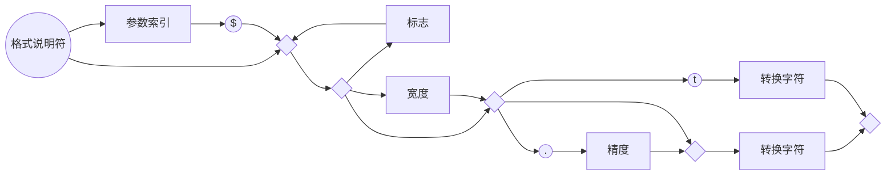

# 第3章 Java的基本程序设计结构

## 3.1 一个简单的Java应用程序

大小写敏感

访问修饰符（access modifier） 第五章介绍

第四章介绍Java类。Java应用程序中的全部内容都必须放置在类中。

根据Java语言规范，main方法必须声明为public

*C++注释：Java中所有函数都属于某个类的方法（标准术语称其为方法，而不是成员函数）。因此Java中的main方法必须有一个外壳类。读者有可能对C++中的静态成员函数（static member functions）十分熟悉。这些成员函数定义在类的内部，而且不对对象进行操作。Java中的main方法必须是静态的。如果希望在终止程序时返回其他代码，那就需要调用System.exit方法。*

## 3.2 注释

三种

`//`

`/*` 和`*/` 在Java中` /* */`注释不能嵌套。

`/**`和`*/`

## 3.3 数据类型

8种基本类型（primitive type），其中4种整型、2种浮点类型、1种用于表示Unicode编码的字符单元的字符类型char和1种用于表示真值的boolean类型。

*注释：Java有一个能够表示任意精度的算术包，通常称为“大数值”（big number）。虽然被称为大数值，但它并不是一种新的Java类型，而是一个Java对象。*

### 3.3.1 整型

| 类型  | 存储需求 |                       取值范围                        |
| :---: | :------: | :---------------------------------------------------: |
|  int  |  4字节   |     -2,147,483,648~-2,147,483,647（正好超过20亿）     |
| short |  2字节   |                    -32,768~32,767                     |
| long  |  8字节   | -9,223,372,036,854,775,808~-9,223,372,036,854,775,807 |
| byte  |  1字节   |                       -128~127                        |

长整型数值后缀L

十六进制数值前缀0x

八进制前缀0 八进制容易混淆，最好不要用

从Java7开始，加上前缀0b就可以写二进制数。还有可以为数字字面量加下划线，如用1_000_000表示一百万。这些下划线只是为了易读。Java编译器会去除 这些下划线。

*C++注释：Java所有数值类型占据的字节数量与平台无关*

*Java没有任何无符号类型*。

### 3.3.2 浮点类型

|  类型  | 存储需求 |                       取值范围                       |
| :----: | :------: | :--------------------------------------------------: |
| float  |  4字节   |      大约±3.402 823 47E+38F（有效位数为6~7位）       |
| double |  8字节   | 大约±1.797 693 134 862 315 70E+308（有效位数为15位） |

*注释：在JDK5.0中，可以使用十六进制表示浮点数值。例如，0.125可以表示成0x1.0p-3。在十六进制表示法中，使用p表示指数，而不是c。注意，尾数采用十六机制，指数采用十进制。指数的基数是2而不是10.*

所有浮点数计算都遵循IEEE754规范。下面是用于表示溢出和出错情况的三个特殊的浮点数值：

- 正无穷大，例如正整数除以0。常量Double.POSITIVE_INFINITY
- 负无穷大。常量Double.NEGATIVE_INFINITY
- NaN(不是一个数字Not a num)，例如计算0/0或者负数的平方根。常量Double.NaN

*注释：不能使用if(x==Double.NaN)类似方法判定一个特定值是否等于Double.NaN。所有"非数值"的值都认为是不相同的。然而，可以使用Double.isNaN方法：if(Double.isNaN(x))*

*警告：浮点数值不适用于禁止出现舍入误差的金融计算中。如果需要在数值计算中不含有任何舍入误差，就应该使用BigDecimal类*

### 3.3.3 char类型

\u 转义序列符表示Unicode代码单元的编码，可以出现在字符常量或字符串的引号之外（而其他转义序列不可以）。例如：`public static void main(String\u005B\u005D args)`这种形式完全符合语法规则，\u005B和\u005D是[和]的编码。

| 转义序列 |  名称  | Unicode值 |
| :------: | :----: | :-------: |
|    \b    |  退格  |  \u0008   |
|    \t    |  制表  |  \u0009   |
|    \n    |  换行  |  \u000a   |
|    \r    |  回车  |  \u000d   |
|    \"    | 双引号 |  \u0022   |
|    \'    | 单引号 |  \u0027   |
|    \\    | 反斜杠 |  \u005c   |

在设计Java时决定采用16位的Unicode字符集，现在16位char类型已经不能满足描述所有Unicode字符的需要了。

下面解释一下Java解决这个问题的基本方法。从JDK 5.0开始，**代码点（code point）**是指与一个编码表中的某个字符对应的代码值。在Unicode标准中，代码点采用十六进制书写，并加上前缀U+，例如U+0041就是字母A的代码点。Unicode的代码点可以分成17个**代码级别（code plane）**。第一个代码级别称为**基本的多语言级别（basic multilingual plane）**，代码点从U+0000到U+FFFF，其中包含了经典的Unicode代码；其余的16个附加级别，代码点从U+10000到U+10FFFF，其中包括了一些**辅助字符（supplementary character）**。

UTF-16编码采用不同长度的编码表示所有Unicode代码点。在基本的多语言级别中，每个字符用16位表示，通常被称为**代码单元（code unit）**；而辅助字符采用一对连续的代码单元进行编码。这样构成的编码值一定落入基本的多语言级别中空闲的2048字节内，通常被称为**替代区域（surrogate area）**[U+D800\~U+DBFF用于第一个代码单元，U+DC00\~U+DFFF用于第二个代码单元]。这样设计十分巧妙，我们可以从中迅速地知道一个代码单元是一个字符编码还是一个辅助字符的第一或第二部分。

在Java中，char类型用UTF-16编码描述一个代码单元。

我们强烈建议不要在程序中使用char类型，除非确实需要对UTF-16代码单元进行操作。最好将需要处理的字符串用抽象数据类型表示（有关这方面在3.6讨论）

### 3.3.4 boolean类型

*C++注释：在C++中，数值或指针可以代替boolean值。值0相当于布尔值false，非0值相当于true。在Java中则不是这样。因此，Java应用程序员不会遇到下述麻烦：`if(x=0)`*

*在C++中这个测试可以编译运行，而在Java中将不能编译*

## 3.4 变量

*提示：如果想要知道哪些Unicode字符属于Java中的“字母”，可以使用Character类的isJavaIdentifierStart 和 isJavaIdentifierPart方法进行检测。*

*提示：尽管$是一个合法的Java字符，但不要在自己的代码中使用这个字符。它只用在Java编译器或其他工具生成的名字中。*

可以在一行中声明多个变量：

`int i, j;`

不过，不提倡使用这种风格。逐一声明每一个变量可以提高程序的可读性。

*注释：如前所述，变量名对大小写敏感。但最好不要只存在大小写上的差异。*

### 3.4.1 变量初始化

Java中，变量的声明尽可能地靠近变量第一次使用的地方，这是一种良好的程序编写风格。

*C++注释：C和C++区分变量的声明与定义。例如：` int i = 10;`是一个定义，而` extern int i;`是一个声明。在Java中不区分变量的声明与定义*。

### 3.4.2 常量

在Java中，利用关键字final指示常量。

关键字final表示这个变量只能被赋值一次。一旦被赋值之后，就不能够再改了。习惯上，常量名使用全大写。

在Java中，经常希望某个常量可以在一个类中的多个方法中使用，通常将这些常量称为类常量。可以使用关键字static final设置一个类常量。

需要注意类常量的定义位于main方法外部。因此同一个类中其他方法中可以使用这个常量，如果声明为public，那么其他类的方法也可以使用这个常量。

*C++注释：const是Java保留的关键字，但目前并没有使用，在Java中，必须使用final定义常量*

## 3.5 运算符

*注释：double的可移植性是相当困难的。在有些处理器使用80位浮点寄存器。很多Intel处理器计算中间过程时的计算精度为80位，在最后才将结果截断为64位。但这样的结果可能与始终在64位机器上计算的结果不一样。Java虚拟机最初规定所有的中间运算都必须进行截断。这种行为遭到了数值计算团体的反对。截断计算不仅可能导致溢出，而且由于截断操作需要消耗时间。为此Java改进为默认情况下，虚拟机设计者允许将中间计算结果采用扩展的精度。但是对于使用stricfp关键字标记的方法必须使用严格的浮点计算来产生理想的结果。比如`public static strictfp void main(String[] args)`,此时main方法中所有指令都将使用严格的浮点计算。*

*实际的计算方式将取决于Intel处理器。默认情况下，中间结果允许使用扩展的指数，但不允许使用扩展的尾数（Intel芯片在截断尾数时并不损失性能）。因此这两种方式的区别仅仅在于采用默认方式不会溢出，而采用严格的计算有可能产生溢出。*

*如果没有仔细阅读这个注释，也没有关系。大多数程序来说，浮点溢出不属于大问题。在本书中，将不使用strictfp关键字*

### 3.5.1 自增运算符和自减运算符

我们建议不要在其他表达式内部使用++，这样编写的代码很容易令人困惑，并会产生烦人的bug。

### 3.5.2 关系运算符与boolean运算符

关系运算符

boolean运算符（逻辑运算符）

三元操作符

### 3.5.3 位运算符

&	|	^	~

<<	>>（用符号位填充高位）	>>>(用0填充高位)

*警告：对移位运算符右边的参数需要进行mod32的运算（除非左边的操作数是long，那么mod64），例如1<<35与1<<3或8是相同的*

*C++注释：在C或C++中无法确定>>是算术移位（扩展符号位），还是逻辑移位（高位填0）。在执行中会选择效率高的一种。Java消除了这种含糊性*

### 3.5.4 数学函数与常量

Math类

Math.sqrt方法，计算平方根（处理的不是对象，这样的方法叫作静态方法）

Math.pow方法, 幂运算。有两个double类型的参数，其返回结果也为double类型。

三角函数：Math.sin、Math.cos、Math.tan、Math.atan、Math.atan2

指数函数以及它的反函数：Math.exp、Math.log、Math.log10

π和e常量的近似值：Math.PI、Math.E

import static java.lang.Math.\*;(静态导入)

*注释：在Math类中为了达到最快性能，所有的方法都使用计算机浮点单元中的例程。如果得到一个完全可预测的结果比运算速度更重要的话，那么就应该使用StrictMath类。它使用“自由发布的Math库”（fdlibm）实现算法，以确保在所有平台上得到相同的结果。*

### 3.5.5 数值类型之间的转换

二元操作时，先要将两个操作数转换为同一种类型，然后再进行计算。

- 如果两个操作数有一个是double, 另一个就会转换为double
- 否则，如果其中一个是float，另一个就会转换为float
- 否则，如果其中一个是long，另一个就会转换为long
- 否则，两个操作数都将被转换为int

### 3.5.6 强制类型转换

如果想对浮点数进行四舍五入，使用Math.round方法。当调用round时候，仍需要使用强制类型转换（int）。因为round返回结果为long。

*C++注释：不要在boolean类型和任何数值类型之间进行强制类型转换，这样可以防止发生错误。只有极少数情况下才需要将布尔类型转换为数值类型，这时可以使用条件表达式b?1:0。*

### 3.5.7 括号与运算符级别

*C++注释：与C或C++不同，Java不使用逗号运算符。不过可以在for语句中使用逗号分隔表达式列表。*

|                      **运算符**                      | **结合性** |
| :--------------------------------------------------: | :--------: |
|                 [ ] . ( ) (方法调用)                 |  从左向右  |
| ! ~ ++ -- +(一元运算) -(一元运算)()(强制类型转换)new |  从右向左  |
|                        * / %                         |  从左向右  |
|                         + -                          |  从左向右  |
|                      << >> >>>                       |  从左向右  |
|                 < <= > >= instanceof                 |  从左向右  |
|                        == !=                         |  从左向右  |
|                          &                           |  从左向右  |
|                          ^                           |  从左向右  |
|                          \|                          |  从左向右  |
|                          &&                          |  从左向右  |
|                         \|\|                         |  从左向右  |
|                          ?:                          |  从右向左  |
|                          =                           |  从右向左  |

### 3.5.8 枚举类型

```java
enum Size {SMALL,MEDIUM,LARGE,EXTRA_LARGE};
```

Size类型的变量只能存储这个类型声明中给定的某个枚举值，或者null值，null表示这个标量没有设置任何值。

## 3.6 字符串

Java字符串就是Unicode字符序列。Java没有内置的字符串类型，而是在标准Java类库中提供了一个预定义类，很自然地叫做String。每个用双引号括起来的字符串都是String类的一个实例。

### 3.6.1 子串

String类的substring方法可以从一个较大的字符串提取出一个子串。

substring的第二个参数是不想复制的第一个位置。这里如果要复制位置为0、1和2的字符，所以写为（0, 3）

s.substring(a,b)子串长度为b-a.

### 3.6.2 拼接

Java允许使用+号连接（拼接）两个字符串。

当一个字符串与一个非字符串的值进行拼接时，后者被转换成字符串（第5章可以看到，任何一个java对象都可以转换成字符串）。

### 3.6.3 不可变字符串

String类没有提供用于修改字符串的方法。但可以通过赋值语句类似于：

```java
String greeting = "Hello"
greeting = greeting.substring(0,3)+"p!";
```

将"Hello"改为"Help!"

由于不能修改Java字符串中的字符，所以在Java文档中将String类对象称为不可变字符串。上面代码的实质并不是修改了字符而是让变量greeting引用另外一个字符串。

不可变字符串有一个优点：编译器可以让字符串共享。

为了弄清楚具体的工作方式，可以想象将各种字符串存放在公共的存储池中。字符串变量指向存储池中相应位置。如果复制一个字符串变量，原始字符串与复制的字符串共享相同的字符。

总而言之，Java的设计者认为共享带来的高效率远远胜过提取、拼接字符串所带来的低效率。（有一种例外情况，将源自于文件或键盘的单个字符或较短的字符串汇集成字符串。为此Java提供了一个独立的类，在3.6.8节中将详细介绍）。

*C++注释：在C程序员第一次接触Java字符串的时候，常常会感到疑惑，因为他们总将字符串认为是字符型数组。这种认识是错误的，Java字符串更像char\*指针。*

*当采用另一个字符串替换greeting的时候，Java代码主要进行下列操作：*

```c
char* temp = malloc(6);
strncpy(temp,greeting,3);
strncpy(temp+3,"p!",3);
greeting = temp;
```

*的确，现在greetng指向字符串"Help！"。即使是一名最顽固的C程序员也得承认Java语法要比一连串的strncpy调用舒适得多。如果将greeting赋予另外一个值，Java也因为垃圾回收机制而不会内存泄漏。*

### 3.6.4 检测字符串是否相等

equals方法检测两个字符串是否相等。对于表达式`s.equals(t)`，如果字符串s与t相等则返回true；否则返回false。需要注意，s和t可以是变量也可以是常量。例如，下列表达式是合法的：

```java
"Hello".equals(greeting);
```

要检测两个字符串是否相等而不区分大小写，可以使用equalsIgnoreCase方法。

一定不能使用==运算符检测两个字符串是否相等！这个运算符只能确定两个字符串是否放在同一个位置上。

如果虚拟机始终将相同字符串共享，就可以使用\==判断是否相等。但实际上只有字符串常量是共享的，而+或substring等操作产生的结果并不是共享的。因此，千万不要用\==运算符测试字符串的相等性，以免糟糕的bug。从表面上看，这种bug很像随机产生的间歇性错误。

*C++注释：C++的string类重载了==运算符，以检测字符串内容的相等性。但Java没有采取这种方式。*

*C程序员使用strcmp函数。Java的compareTo方法与strcmp完全类似，因此可以使用`if(greeting.compareTo("Hello")==0)`，不过使用equals看起来更为清晰。*

### 3.6.5 空串与null串

空串`""`是长度为0的字符串。可以调用`if(str.length==0)`或`if(str.equals(""))`来判断字符串是否为空。

空串是一个Java对象，有自己的串长度（0）和内容（空）。不过，String变量还可以存放一个特殊值，名为null，这表示目前没有任何对象与该变量相关联。要检查一个字符串是否为null，要使用`if(str==null)`

有时要检查一个字符串既不是null也不为空串，这种情况下就需要使用一下条件：`if(str!=null && str.length()!=0)`

首先要检查str不为null，如果在null值上调用方法，会出现错误。

### 3.6.6 代码点与代码单元

大多数的常用Unicode字符使用一个代码单元就可以表示，而辅助字符需要一对代码单元表示。

length 方法将返回采用UTF-16编码表示的给定字符串所需要的代码单元数量。

要想得到实际的长度，即代码点数量可以调用：

```java
int cpCount = greeting.codePointCount(0,greeting.length());
```


s.charAt(n)将返回位置n的代码单元。n介于0~s.length()-1之间。

想要得到第i个代码点，应该使用下列语句

```java
int index = greeting.offsetByCodePoints(0,i);
int cp = greeting.codePointAt(index);
```

*注释：类似于C和C++，Java对字符串代码单元和代码点从0开始计数。*

如果想要遍历一个字符串，并且依次查看每一个代码点，可以使用：

```java
int cp=sentence.codePointAt(i);
if(Character.isSupplementaryCodePoint(cp))i+=2;
else i++;
```

可以使用下列语句实现回退操作：

```java
i--;
if(Character.isSurrogate(sentence.charAt(i)))i--;
int cp = sentence.codePointAt(i);
```

### 3.6.7 字符串API

Java中的String类包含了50多个方法。令人惊讶的是绝大多数都很有用，可以设想使用频繁非常高。下面API注释汇众了一部分最常用的方法。

*注释：类名之后是一个或多个方法的名字、解释和参数描述。在这里，一般不列出某个类的所有方法，而是选择一些最常用的方法，并以简洁的方式给予描述。完整的方法列表请参看联机文档。这里还列出了所给类的版本号。如果某个方法是在这个版本之后添加的，就会给出一个单独的版本号。*

【API】java.lang.string 1.0:

- `char charAt(int index) ` 返回给定位置的代码单元。除非对底层的代码单元感兴趣，否则不需要调用这个方法。
- `int codePointAt(int index) `5.0 返回从给定位置开始或结束的代码点。
- `int offsetByCodePoints(int startIndex, int cpCount)` 5.0 返回从startIndex代码点开始，位移cpCount后的代码点索引。
- `int compareTo(String other) ` 按照字典顺序，如果字符串位于other之前，返回一个负数；如果字符串位于other之后，返回一个正数；如果两个字符串相等，返回0.
- `boolean endsWith(String suffix) `如果字符串以suffix结尾，返回true。
- `boolean equals(Object other)` 如果字符串与other相等，返回true
- `boolean equalsIngnoreCase(String other)` 如果字符串与other相等（忽略大小写），返回true。
- `int indexOf(String str)`
- `int indexOf(String str, int fromIndex)`
- `int indexOf(int cp)`
- `int indexOf(int cp, int fromIndex)` 返回与字符串str或代码点cp匹配的第一个子串开始位置。这个位置从索引0或fromIndex开始计算。如果在原始串中不存在str，返回-1.
- `int lastIndexOf(String str)`
- `int lastIndexOf(String str, int fromIndex)`
- `int lastIndexOf(int cp)`
- `int lastIndexOf(int cp, int fromIndex)` 返回与字符串str或代码点cp匹配的最后一个子串的开始位置。这个位置从原始串尾端或fromIndex开始计算。
- `int length()` 返回字符串的长度
- `int codePointCount(int startIndex, int endIndex)` 5.0 返回startIndex和endIndex-1之间的代码点数量。没有配成对的代用字符将计入代码点。
- `String replace(CharSequence oldString, CharSequence newString)` 返回一个新字符串。这个字符串用newString代替原始字符串中所有的oldString。可以用String或StringBuilder对象作为CharSequence参数。
- `boolean startWith(String prefix)` 如果字符串以prefix字符串开始，返回true。
- `String substring(int beginIndex)`
- `String substring(int beginIndex, int endIndex)`返回一个新字符串。这个字符串包含原始字符串中从beginIndex到串尾或endIndex-1的所有代码单元。
- `String toLowerCase()` 返回一个新字符串。这个字符串将原始字符串中所有大写字母改成小写字母。
- `String toUpperCase()` 返回一个新字符串。这个字符串将原始字符串中所有的小写字母改成了大写字母。
- `String trim()` 返回一个新字符串。这个字符串将删除原始字符串头部和尾部的空格。

### 3.6.8 阅读联机API文档

compareToIgnoreCase()

### 3.6.9 创建字符串

StringBuilder类：有时候需要由较短的字符串构建字符串，例如，按键或来自文件中的单词。采用字符串连接的方式达到此目的的效率较低。每次连接字符串都会构建一个新的String对象，既耗时，又浪费空间。使用StringBuilder类就可以避免这个问题。

如果需要用许多小段的字符串构建一个字符串，首先，构建一个空的字符串构建器，然后每次需要添加一部分内容时，就调用append方法。

```java
StringBuilder builder = new StringBuilder();
builder.append(ch);
builder.append(str);
String completedString = builder.toString()
```

在有需要构建字符串时就调用toString方法，将可以得到一个String对象，其中包含了构建器中的字符序列。

*注释：在JDK5.0中引入StringBuilder类。这个类的前身是StringBuffer，其效率稍有些低，但允许多线程的方式执行添加或删除字符的操作。如果所有字符串在一个单线程中编辑（通常都是这样），则应该用StringBuilder替代它。这两个类的API是相同的。*

下面API注释包含了StringBuilder类中的重要方法。

【API】java.lang.StringBuilder 5.0:

- `StringBuilder()` 构造一个空的字符串构建器
- `int length()` 返回构建器或缓冲器中的代码单元数量。
- `StringBuilder append(String str)` 追加一个字符串并返回this。
- `StringBuilder append(char c)` 追加一个代码单元并返回this。
- `StringBuilder appendCodePoint(int cp)` 追加一个代码点，并将其转换为一个或两个代码单元并返回this。
- `void setCharAt(int i, char c)` 将第i个代码单元设置为c。
- `StringBuilder insert(int offset, String str)` 在offset位置插入一个字符串并返回this。
- `StringBuilder insert(int offset, char c)` 在offset位置插入一个代码单元并返回this。
- `StringBuilder delete(int startIndex, int endIndex)` 删除偏移量从startIndex到endIndex-1的代码单元并返回this。
- `String toString() ` 返回一个与构建器或缓冲器内容相同的字符串

## 3.7 输入输出

### 3.7.1 读取输入

想要通过控制台进行输入，首先需要构造一个Scanner对象，并与“标准输入流”System.in关联。

```java
Scanner in = new Scanner(System.in);
```

（构造器和new操作符将在第4章详细地介绍）

现在，就可以使用Scanner类的各种方法实现输入操作了。例如，nextLine方法将输入一行。

```java
System.out.print("What is your name? ");
String name = in.nextLine();
```

在这里，使用nextLine方法是因为输入行中有可能包含空格。想要读取一个单词（以空白符作为分隔符），就调用

```java
String firstName = in.next();
```

要想读取一个整数，就调用nextInt方法。

```java
System.out.print("How old are you? ");
int age = in.nextInt();
```

与此类似，要想读取下一个浮点数，就调用nextDouble方法。

Scanner类定义在java.util包中，所以需要添加一行`import java.util.*`将相应的包加载进来。

*注释：因为输入是可见的，所以Scanner类不适用于从控制台读取密码。Java SE 6 特别引入了Console类来实现这个目的。要想读取一个密码可以采用如下代码：*

```java
Console cons = System.console();
String username = cons.readLine("User name: ");
char[] passwd = cons.readPassword("Password: ");
```

*为了安全起见，返回的密码存放在一维字符数组中，而不是字符串中。在对密码进行处理之后，应该马上用一个填充值覆盖数组元素（数组处理将在本章稍后介绍）。*

*采用Console对象处理输入不如采用Scanner方便。每次只能读取一行输入，而没有能够读取一个单词或一个数值的方法。*

【API】java.util.Scanner 5.0:

- `Scanner(InputStream in)` 用给定的输入流创建一个Scanner对象。
- `String nextLine()` 读取输入的下一行内容。
- `String next()` 读取输入的下一个单词（以空格作为分隔符）。
- `int nextInt()`
- `double nextDouble()` 读取并转换下一个表示整数或浮点数的字符序列。
- `boolean hasNext()` 检测输入中是否还有其他单词。
- `boolean hasNextInt()`
- `boolean hasNextDouble()` 检查是否还有表示整数或浮点数的下一个字符序列。

【API】java.lang.System 1.0

- `static Console console()` 6 如果有可能进行交互操作，就通过控制台窗口作为交互的用户返回一个Console对象，否则返回null。对于任何一个通过控制台窗口启动的程序，都可使用Console对象。否则，其可用性将与所使用的系统有关。

【API】java.io.Console 6

- `static char[] readPassword(String prompt, Object... args)`
- `static String readLine(String prompt, Object... args)` 显示字符串prompt并且读取用户输入，直到输入行结束。args参数可以用来提供输入格式。有关这部分内容将在下一节中介绍。

### 3.7.2 格式化输出

在早期的Java版本中，格式化数值曾引起过一些争议。庆幸的是，Java SE 5.0 沿用了C语言库函数中的printf方法。

调用：`System.out.printf("%8.2f", x);`可以用8个字符的宽度和小数点后两个字符的精度打印x。

以%字符开始的格式说明符尾部的转换符指示格式化的数值类型：

| 转换符 |         类型         |    举例    |
| :----: | :------------------: | :--------: |
|   d    |      十进制整数      |    159     |
|   x    |     十六进制整数     |     9f     |
|   o    |      八进制整数      |    237     |
|   f    |      定点浮点数      |    15.9    |
|   e    |      指数浮点数      |  1.59e+01  |
|   g    |      通用浮点数      |     —      |
|   a    |    十六进制浮点数    | 0x1.fccdp3 |
|   s    |        字符串        |   Hello    |
|   c    |         字符         |     H      |
|   b    |         布尔         |    true    |
|   h    |        散列码        |  42628b2   |
|   tx   |       日期时间       |  见表3-7   |
|   %    |        百分号        |     %      |
|   n    | 与平台有关的行分隔符 |     —      |

用于printf的标志：

|        标志        |                             目的                             |     举例     |
| :----------------: | :----------------------------------------------------------: | :----------: |
|         +          |                     打印正数和负数的符号                     |   +3333.33   |
|        空格        |                      在正数之前添加空格                      | \| 3333.33\| |
|         0          |                         数字前面补0                          |  003333.33   |
|         -          |                            左对齐                            | \|3333.33 \| |
|         （         |                       将负数括在括号内                       | （-3333.33） |
|         ，         |                        添加分组分隔符                        |   3,333.33   |
|   \#(对于f格式)    |                          包含小数点                          |    3,333.    |
| \#（对于x或0格式） |                        添加前缀0x或0                         |    0xcafe    |
|         \$         | 给定被格式化的参数索引。例如%1\$d, %1\$x将以十进制和十六进制格式打印第一个参数 |    159.9F    |
|         <          | 格式化前面说明的数值。例如, %d%<x以十进制和十六进制打印同一个数值 |    159.9F    |

*注释：可以使用s转换符格式化任意的对象。对于任意实现了Formattable接口的对象都将调用formatTo方法；否则将调用toString方法，它可以将对象转换为字符串。在第5章中将讨论toString方法，在第6章将讨论接口。*

可以使用静态的String.format方法创建一个格式化的字符串，而不打印输出：

```java
String message = String.format("Hello, %s. Next year, you'll be %d",name,age);
```

printf方法中日期与时间的格式化选项。在这里，使用以t开始，以表3-7中任意字母结束的两个字母格式。例如，`System.out.printf("%tc",new Date());`这条语句将用下面的格式打印当前的日期和时间：`Mon Feb 09 18:05:19 PST 2004`

表3-7 日期和时间的转换符

| 转换符 |                     类型                      |             举例             |
| :----: | :-------------------------------------------: | :--------------------------: |
|   c    |               完整的日期和时间                | Mon Feb 09 18:05:19 PST 2004 |
|   F    |                 ISO 8601 日期                 |          2004-02-09          |
|   D    |          美国格式的日期（月/日/年）           |          02/09/2004          |
|   T    |                  24小时时间                   |          18：05：19          |
|   r    |                  12小时时间                   |         06：05：19pm         |
|   R    |               24小时时间没有秒                |            18：05            |
|   Y    |            4位数字的年（前面补0）             |             2004             |
|   y    |           年的后两位数字（前面补0）           |              04              |
|   C    |           年的前两位数字（前面补0）           |              20              |
|   B    |                 月的完整拼写                  |           February           |
|  b或h  |                   月的缩写                    |             Feb              |
|   m    |            两位数字的月（前面补0）            |              02              |
|   d    |            两位数字的日（前面补0）            |              09              |
|   e    |           两位数字的月（前面不补0）           |              9               |
|   A    |               星期几的完整拼写                |            Monday            |
|   a    |                 星期几的缩写                  |             Mon              |
|   j    | 三位数的年中的日子（前面补0），在001到366之间 |             069              |
|   H    |    两位数字的小时（前面补0），在0到23之间     |              18              |
|   k    |   两位数字的小时（前面不补0），在0到23之间    |              18              |
|   I    |    两位数字的小时（前面补0），在0到12之间     |              06              |
|   l    |   两位数字的小时（前面不补0），在0到12之间    |              6               |
|   M    |           两位数字的分钟（前面补0）           |              05              |
|   S    |            两位数字的秒（前面补0）            |              19              |
|   L    |           三位数字的毫秒（前面补0）           |             047              |
|   N    |          九位数字的毫微秒（前面补0）          |          047000000           |
|   P    |             上午或下午的大写标志              |              PM              |
|   p    |             上午或下午的小写标志              |              pm              |
|   z    |            从GMT起，RFC822数字位移            |            -0800             |
|   Z    |                     时区                      |             PST              |
|   s    |   从格林威治时间1970-01-01 00:00:00起的秒数   |          1078884319          |
|   Q    |  从格林威治时间1970-01-01 00:00:00起的毫秒数  |        1078884319047         |

可以看到，某些格式只给出了指定日期的部分信息。例如，只有日期或月份。如果需要多次对日期操作才能实现对每一部分进行格式化的目的就太笨拙了。为此，可以采用一个格式化的字符串指出要被格式化的参数索引。索引必须紧跟在%后面，并以\$终止。例如`System.out.printf("%1$s %2$tB %2$te, %2$tY","Due date:",new Date())`;

打印`Due date: February 9, 2004`

还可以选择使用<标志。它指示前面格式说明中的参数将被再次使用。也就是说，下列语句将产生与前面语句同样的输出结果：

`System.out.printf("%s %tB %<te, %<tY", "Due date:", new Date());`

*提示：参数索引值从1开始，而不是从0开始，%1$...对第一个参数格式化。这就避免了与0标志混淆。*

现在已经了解了printf方法的所有特性。下图给出了格式说明符的语法图。



### 3.7.3 文件输入与输出

要想对文件进行读取，就需要一个用File对象构造一个Scanner对象，如下所示：

```java
Scanner in = new Scanner(Paths.get("myfile.txt"));
```

如果文件名中包含反斜杠符号，就要记住在每个反斜杠之前再加一个额外的反斜杠：“c:\\mydirectory\\myfile.txt”。

现在，就可以利用前面介绍的任何一个Scanner方法对文件进行读取。

要想写入文件，就需要构造一个PrintWrite对象。在构造器中，只需要提供文件名：

```java
PrintWriter out = new PrintWriter("myfile.txt");
```

如果文件不存在，创建该文件。可以像输出到System.out一样使用print、println以及printf命令。

*警告：可以构造一个带有字符串参数的Scanner，但这个Scanner将字符串解释为数据，而不是文件名。例如，如果调用：*

```java
Scanner in = new Scanner("myfile.txt");//ERROR?
```

*这个scanner会将参数作为10个字符的数据：'m','y','f'等。在这个示例中所显示的并不是人们所期望的效果。*

*注释：当指定一个相对文件名时，例如，“myfile.txt”, "mydirectory/myfile.txt"或"../myfile.txt"，文件位于Java虚拟机启动路径的相对位置。如果在命令行方式下用下列命令启动程序： `java MyProg` 启动路径就是命令解释器的当前路径。然而，如果使用集成开发环境，那么启动路径将由IDE控制。可以使用下面的调用方式找到路径的位置：`String dir = System.getProperty("user.dir")；` 如果觉得定位文件比较烦恼，则可以考虑使用绝对路径，例如："C:\\mydirectory\\myfile.txt"或者“/home/me/mydirectory/myfile.txt”*

正如读者所看到的，访问文件与使用System.in和System.out一样容易。要记住一点：如果用一个不存在的文件构造一个Scanner，或者用一个不能被创建的文件名构造一个PrintWriter，那么就会发生异常。Java编译器认为这些异常比“被零整除”异常更严重。在第11章中，将会学习各种处理异常的方式。现在，应该告知编译器：已经知道有可能出现“找不到文件”的异常。这需要在main方法中用throws子句标记。

现在读者已经学习了如何读写包含文本数据的文件。对于更加高级的技术，例如，处理不同的字符编码，处理二进制数据、读取目录以及编写压缩文件，请参看卷II第1章。

*注释：当采用命令行方式启动一个程序时，可以利用重定向将任意文件捆绑到System.in和System.out:`java MyProg <myfile.txt> output.txt`这样，就不必担心处理FileNotFoundException异常了。*

【API】java.util.Scanner 5.0

- `Scanner(file f)` 构造一个从给定文件读取数据的Scanner。
- `Scanner(String data)` 构造一个从给定字符串读取数据的Scanner。 

【API】java.io.PrintWriter 1.1

- `PrintWriter(String fileName)` 构造一个将数据写入文件的PrintWriter。文件名由参数指定。

【API】java.nio.file.Paths 7

- `static Path get(String pathName)` 根据给定的路径名构造一个Path。

## 3.8 控制流程

*C++注释：Java的控制流程结构与C和C++的控制流程结构一样，只有很少的例外情况。没有goto语句，但break语句可以带标签，可以利用它实现从内层循环跳出的目的（这种情况C语言采用goto语句实现）。另外，还有一种变形的for循环，在C或C++没有这类循环。它有点类似于C#中的foreach循环*

### 3.8.1 块作用域

不能在嵌套的两个块中声明同名的变量。

*C++注释：在C++中，可以在嵌套的块中重定义一个变量。在内层定义的变量会覆盖在外层定义的变量。这样，有可能会导致程序设计错误，因此在Java中不允许这样做。*

### 3.8.2 条件语句

### 3.8.3 循环

### 3.8.4 确定循环

*警告：在循环中，检测两个浮点数是否相等时需要格外小心。比如`for(double x = 0; x!=10;x+=0.1)`可能永远不会结束。由于舍入的误差，最终可能得不到精确值。例如，在上面的循环中，因为0.1无法精确地用二进制表示，所以，x将从9.999 999 999 999 98调到10.099 999 999 999 98。*

特别指出，如果在for语句内部定义一个变量，这个变量就不能在循环体之外使用。因此，如果希望在for循环体之外使用循环计数器的最终值，就要确保这个变量在循环语句的前面且在外部声明！

另一方面，可以在各自独立的不同for循环中定义同名的变量。

### 3.8.5 多重选择：switch语句

switch语句将从与选项值相匹配的case标签处开始执行直到遇到break语句，或者执行到switch语句的结束处为止。如果没有相匹配的case标签，而有default子句，就执行这个子句。

*警告：有可能触发多个case分支。如果在case分支语句的末尾没有break语句，那么就会接着执行下一个case分支语句。这种情况相当危险，常常会引发错误。因此我们在程序中从不使用switch语句。*

*编译代码时加上`-Xlint:fallthrough`选项，如果某个分支缺少break语句，编译器就会给出一个警告消息。*

*如果你确实想要使用这一“直通式”（fallthrough）行为，可以在其外围方法加一个标注@SuppressWarnings（“fallthrough”）。这样就不会对这种方法生成警告了。（标注是为编译器或处理Java源文件或类文件的工具提供信息的一种机制。我们将在卷II的第13章详细讨论标注。）*

case标签可以是：

- 类型为char、byte、short或int（或其包装器类Character、Byte、Short、Integer，这些包装器类将在第4章介绍）的常量表达式。
- 枚举常量
- 从Java SE 7开始，case标签还可以是字符串变量。

当在switch语句中使用枚举常量时，不必在每个标签中指明枚举名，可以由switch的表达式值确定。例如

```java
Size sz=...;
switch(sz){
    case SMALL:
        ...
        break;
    ...
}
```

### 3.8.6 中断控制流程语句

尽管Java的设计者将goto作为保留字，但实际上也没有打算在语言中使用它。

Java提供了一种带标签的break语句，用于跳出多重嵌套的循环语句。有时候在嵌套很深的循环语句中会发生一些不可预料的事情。此时可能更加希望跳到嵌套的所有循环语句之外。通过添加一些额外的条件判断实现各层循环的检测很不方便。

还有一种带标签的continue语句，将跳到与标签匹配的循环首部。

*提示：许多程序员容易混淆break和continue语句。这些语句完全是可选的，即不使用它们也可以表达同样的逻辑含义。在本书中，将不使用break和continue。*

## 3.9 大数值

java.math包中的两个很有用的类：BigInteger和BigDecimal。这两个类可以处理包含任意长度数字序列的数值。BigInteger类实现了任意精度的整数运算，BigDecimal实现了任意精度的浮点数运算。

使用静态的ValueOf方法可以将普通的数值转换为大数值：

```java
BigInteger a = BigInteger.valueOf(100);
```

遗憾的是，不能使用人们熟悉的算术运算符（如：+和\*）处理大数值。而需要使用大数值类中的add和multiply方法。

```java
BigInteger c = a.add(b);
BigInteger d = c.multiply(b.add(BigInteger.valueOf(2)))
```

*C++注释：与C++不同，Java没有提供运算符重载功能。程序员无法重定义+和\*运算符，使其应用于BigInteger类的add和multiply运算。Java语言设计者仅仅重载了字符串连接的+运算符，而没有重载其他的运算符，也没有给Java程序员在自己类中重载运算符的机会。*

【API】java.math.BigInteger 1.1:

- `BigInteger add(BigInteger other)` 
- `BigInteger substract(BigInteger other)`
- `BigInteger multiply(BigInteger other)`
- `BigInteger divide(BigInteger other)`
- `BigInteger mod(BigInteger other)` 返回这个大整数和另一个大整数other的和、差、积、商以及余数。
- `int compareTo(BigInteger other)` 如果这个大整数与另一个大整数other相等，返回0；如果这个大整数小于另一个大整数other，返回负数；否则，返回正数。
- `static BigInteger valueOf(long x)` 返回值等于x的大整数。

【API】java.math.BigDecimal 1.1:

- `BigDecimal add(BigDecimal other)`
- `BigDecimal substract(BigDecimal other)`
- `BigDecimal multiply(BigDecimal other)`
- `BigDecimal divide(BigDecimal other)`
- `BigDecimal mod(BigDecimal other, RoundingMode mode)` 返回这个大实数和另一个大实数other的和、差、积、商。要想计算商，必须给出舍入方式（rounding mode）。RoundingMode.HALF_UP是学校学习的四舍五入方式。它适用于常规的计算。有关其他的舍入方式请参看API文档。
- `int compareTo(BigDecimal other)` 如果这个大实数与另一大实数相等，返回0；如果这个大实数小于另一个大实数other，返回负数；否则，返回正数
- `static BigDecimal valueOf(long x)`
- `static BigDecimal valueOf(long x, int scale)` 返回值x或x/10^scale的一个大实数。

## 3.10 数组

数组是一种数据结构，用来存储同一类型值的集合。

创建一个数字数组时，所有元素都初始化为0.boolean元素数组会初试化为false。对象数组的元素会初始化为null。

array.length获取数组中元素个数。

如果需要经常需要在运行过程中扩展数组的大小，就应该使用另一种数据结构——数组列表（array list）有关数组列表的详细内容请参看第5章。

### 3.10.1 for each 循环

增强的for循环语句格式为：

`for(variable : collection)statement`

定义一个变量用于暂存集合中的每一个元素，并执行相应的语句（当然，也可以是用语句块）。collection这一集合表达式必须是一个实现了Iterable接口的类对象（例如ArrayList）。有关数组列表的内容将在第5章讨论，有关Iterable接口的内容将在卷II的第2章中讨论。

*注释：for each循环语句的循环变量将会遍历数组中的每个元素，而不需要使用下标值。*

*提示：有一个打印数组所有值的方法，即利用Arrays类的toString方法。*

### 3.10.2 数组初始化以及匿名数组

创建数组对象并同时赋予初始值的简化书写形式：

```java
int[] smallPrimes = {2,3,5,7,11,13};
```

请注意，这种语句不需要调用new。

甚至可以初始化一个匿名数组：

```java
new int[]{17,19,23,29,31,37}
```

这种表示法将创建一个新数组并利用括号中提供的值进行初始化。使用这种语法形式可以在不创建新变量的情况下重新初始化一个数组。例如：

```java
smallPrimes = new int[]{17,19,23,29,31,37};
```

这是下列语句的简写形式：

```java
int[] anonymous = {17,19,23,29,31,37};
smallPrimes = anonymous;
```

*注释：在Java中，允许数组长度为0。在编写一个结果为数组的方法时，如果碰巧为空，则这种语法形式就显得非常有用。此时可以创建一个长度为0的数组：`new elementType[0]`注意，数组长度为0与null不同。*

### 3.10.3 数组拷贝

在Java中，允许讲一个数组变量拷贝给另一个数组变量。这时，两个变量将引用同一个数组：

```java
int[] luckyNumbers = smallPrimes;
luckyNumbers[5]=12;//now smallPrimes[5] is alse 12
```

如果希望一个数组的所有值拷贝到一个新的数组中去，就要使用Arrays类的copyTo方法：

```java
int[] copiedLuckyNumbers = Arrays.copyOf(luckyNumbers, luckyNumbers.length);
```

第二个参数是新数组的长度。这个方法通常用来增加数组的大小：

```java
luckyNumbers = Arrays.copyOf(luckyNumbers, 2*luckyNumbers.length);
```

如果数组元素是数值型，那么多余的元素将被赋值为0；如果数组元素是布尔型，则将赋值为false。相反，如果长度小于原始数组的长度，则只拷贝最前面的数据元素。

*C++注释：Java数组与C++数组在堆栈上有很大不同，但基本上与分配在堆（heap）上的数组指针一样。也就是说，`int[] a=new int[100];//java`不同于`int a[100];//C++`而等同于`int\* a=new int[100];//C++ ` Java中[]运算符被预定义为检查数组边界，而且没有指针运算，即不能通过a加1得到数组的下一个元素。*

### 3.10.4 命令行参数

前面已经看到多个使用Java数组的示例。每一个Java应用程序都有一个带String arg[]参数的main方法。这个参数表明main方法将接受一个字符串数组，也就是命令行参数。

例如，看一看下面这个程序：

```java
public class Message{
    public static void main(String args[]){
        if(args[0].equals("-h"))
            System.out.print("Hello,");
        else if(args[0].equals("-g"))
            System.out.print("Goodbye,");
        for(int i=1;i<args.length;i++)
            System.out.print(" "+args[i]);
        System.out.println("!");
    }
}
```

如果使用下面这种形式运行这个程序：

`java Message -g cruel world`

这个程序将显示下列信息：

```
Goodbye, cruel world!
```

*C++注释：在Java应用程序的main方法中，程序名并没有存储在args数组中。*

### 3.10.5 数组排序

要想对数值型数组进行排序，可以使用Arrays类中的sort方法。

这个方法使用了优化的快速排序算法。快速排序算法对于大多数数据集合来说都是效率比较高的。Array类还提供了几个使用很便捷的方法，在稍后的API注释中将介绍它们。

【API】java.util.Arrays 1.2:

- `static String toString(type[] a)` 5.0 返回包含a数据元素的字符串，这些数据元素被放在括号内，并用逗号分隔。参数：a                  类型为int、long、short、char、byte、boolean、float或double的数组。
- `static type copyOf(type[] a, int length) 6
- 'static type copyOf(type[] a, int start, int end)' 6 返回与a类型相同的一个数组，其长度为length或者end-start，数组元素为a的值。参数： a                 类型为int、long、short、char、byte、boolean、float或double的数组。               start                        起始下标（包含这个值）。                   end                      终止下标（不包含这个值）。这个值可能大于a.length。在这种情况下，结果为0或false。                         length                 拷贝的数据元素长度。如果length值大于a.length，结果为0或false；否则，数组中只有前面length个数据元素的拷贝值。
- `static void sort(type[] a)`采用优化的快速排序算法对数组进行排序。 参数：a             类型为int、long、short、char、byte、boolean、float或double的数组。
- `static int binarySearch(type[] a, type v)`
- `static int binarySearch(type[] a, int start, int end, type v)` 6 采用二分搜索算法查找值v。如果查找成功，则返回相应的下标值；否则，返回一个负数值r。-r-1是为保持a有序v应插入的位置。参数：        a            类型为int、long、short、char、byte、boolean、float或double的有序数组。                  start              起始下标（包含这个值）。                end               终止下标（不包含这个值）                 v                      同a的数据元素类型相同的值
- `static void fill(type[] a, type v)` 将数组的所有数据元素值设置为v。参数：a                           类型为int、long、short、char、byte、boolean、float或double的数组。                v                与a的数据类型一样的一个值。
- `static boolean equals(type[] a, type v)` 如果两个数组大小相同，并且下标相同的元素都对应相等，返回true。           参数：a、b              类型为int、long、short、char、byte、boolean、float或double的数组。

### 3.10.6 多维数组

Java中，声明一个二维数组相当简单。例如：

```java
double[][] balances;
```

与一维数组一样，在调用new对多维数组进行初始化之前不能使用它。在这里可以这样初始化：

```java
balances = new double[NYEARS][NRATES];
```

此外如果你知道数组元素，就可以不调用new，而直接使用简化的书写形式对多维数组进行初始化。例如：

```java
int[][] magicSquare = {
    {16,3,2,13},
    {5,10,11,8},
    {9,6,7,12},
    {4,15,14,1}
};
```

一旦数组被初始化，就可以利用两个方括号访问每个元素，例如，balances\[i][j]。

*注释：foreach循环语句不能自动处理二维数组的每一个元素。需要使用两个嵌套的循环*

*提示：想要快速地打印一个二维数组的数据元素列表，可以调用：Arrays.deepToString()*

### 3.10.7 不规则数组

Java的数组实际上与其他程序设计语言存在着一些细微的差异，这正是Java的优势所在：Java实际上没有多维数组，只有一维数组。多维数组被解释为“数组的数组。”

由于可以单独地存取数组的某一行，所以可以让两行交换。

可以方便地构造一个“不规则”数组，即数组每一行有不同长度。

```java
int[][] odds = new int[NMAX+1][];
for(int n=0;n<=NMAX;n++)
    odds[n]=new int[n+1];
```

*C++注释：在C++中，Java的声明`double[][] balances = new double[10][6];//java`不同于`double balances[10][6];//c++`也不同于`double(\*balances)[6]=new double[10][6];//C++` 而是分配了一个包含10个指针的数组：`double\*\* balances = new double\*[10];//C++` 然后，指针数组的每一个元素被填充了一个包含6个数字的数组：`for(i=0;i<10;i++) balances[i]=new double[6];` 庆幸的是，当创建new double\[10][6]时，这个循环将自动执行。当需要不规则的数组时，只能单独地创建行数组。*

