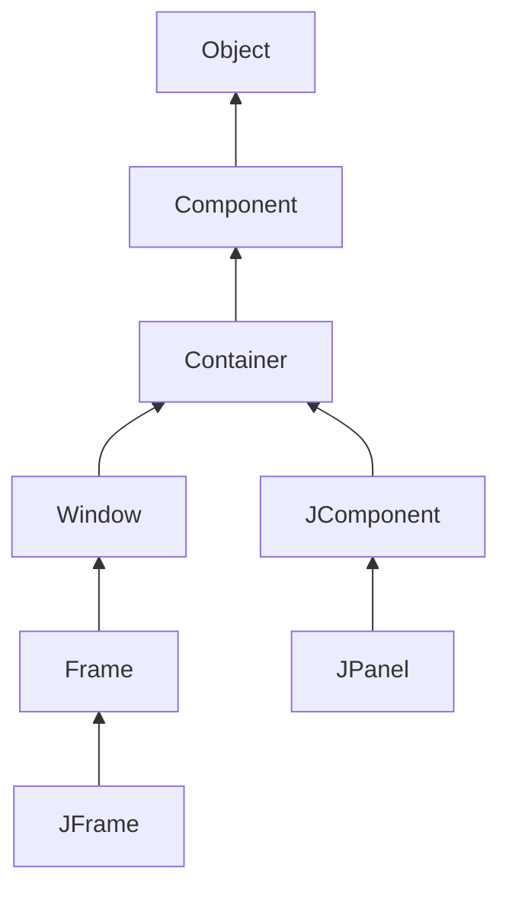
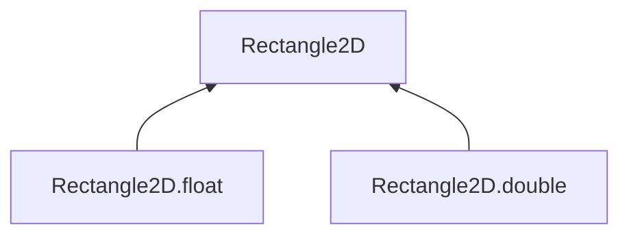
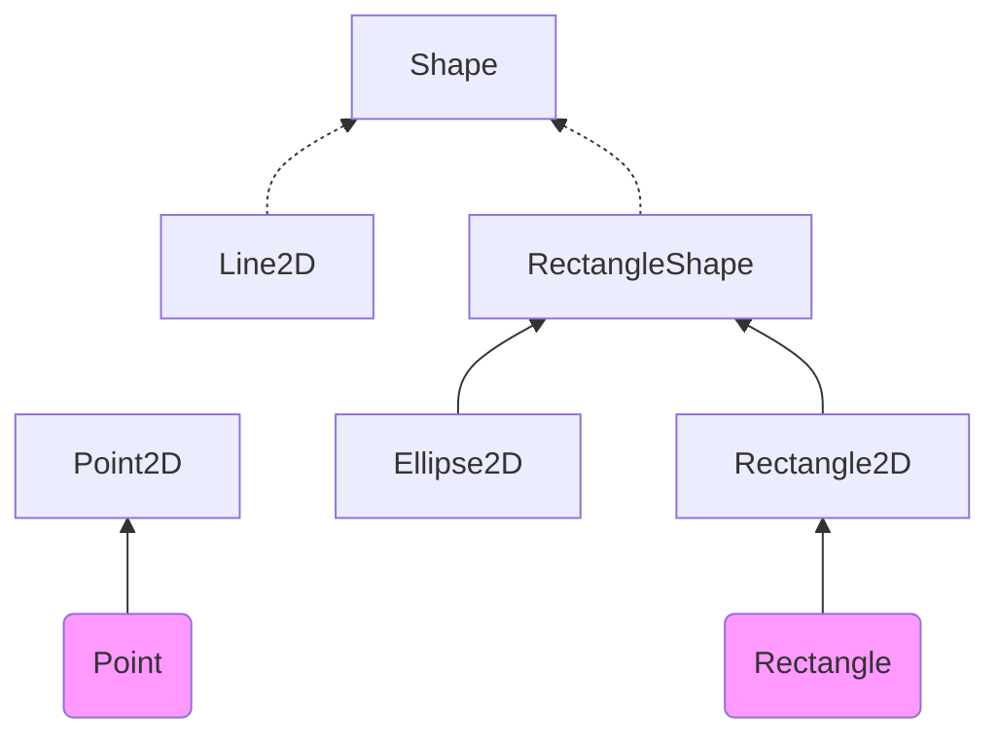

# 第10章 图形程序设计

## 10.1 Swing概述

在 Java 1.0 刚刚出现的时候， 包含了一个用于基本 GUI 程序设计的类库， Sun 将它称为抽象窗口工具箱（ Abstract Window Toolkit, AWT)。 

在 1996 年， Netscape 创建了一种称为 IFC ( Internet Foundation Class ) 的 GUI 库， 它采用了与 AWT 完全不同的工作方式。它将按钮、菜单这样的用户界面元素绘制在空白窗口上，而对等体只需要创建和绘制窗口。因此， Netscape 的 IFC 组件在程序运行的所有平台上的外观和动作都一样。 Sun 与 Netscape 合作完善了这种方式， 创建了一个名为 Swing 的用户界面库。Swing 可作为 Java 1.1 的扩展部分使用， 现已成为 Java SE 1.2 标准库的一部分。 

现在， Swing 是不对等基于 GUI 工具箱的正式名字。它已是 Java 基础类库（Java Foundation Class, JFC ) 的一部分。完整的 JFC 十分庞大， 其中包含的内容远远大于 Swing GUI 工具箱。JFC 特性不仅仅包含了 Swing 组件，而且还包含了一个可访问性 API、一个 2D API 和一个可拖放API。

*注释： Swing 没有完全替代 AWT , 而是基于 AWT 架构之上。Swing 仅仅提供了能力更加强大的用户界面组件。 尤其在采用 Swing 编写的程序中， 还需要使用基本的 AWT 处理事件。从现在开始， Swing 是指 “ 被绘制的 ” 用户界面类；AWT 是指像事件处理这样的窗口工具箱的底层机制。*

Sun 开发了一种称为 Metal 的独立于平台的观感。 现在， 市场上人们将它称为“ Java 观感”。 

在 Java SE 6 中， Sun 改进了对 Windows 和 GTK 本地观感的支持。 

Java 7 提供了一个新观感， 称为 Nimbus ， 不过默认情况下不可用。Nimbus使用了矢量绘图而不是位图绘图， 所以它不依赖于屏幕分辨率。 

## 10.2 创建框架

在 Java 中， 顶层窗口（就是没有包含在其他窗口中的窗口）被称为框架（frame)。在AWT 库中有一个称为 Frame 的类， 用于描述顶层窗口。这个类的 Swing 版本名为 JFrame,它扩展于 Frame 类。JFrame 是极少数几个不绘制在画布上的 Swing 组件之一。因此，它的修饰部件（按钮、标题栏、 图标等）由用户的窗口系统绘制， 而不是由 Swing 绘制。 

*警告： 绝大多数 Swing 组件类都以“ J” 开头， 例如， JButton、JFrame 等。在 Java 中有Button 和 Frame 这样的类， 但它们属于 AWT 组件。如果偶然地忘记书写“ J”， 程序仍然可以进行编译和运行，但是将 Swing 和 AWT 组件混合在一起使用将会导致视觉和行为的不一致。*

首先， 所有的 Swing 组件必须由事件分派线程（event dispatch thread ) 进行配置，线程将鼠标点击和按键控制转移到用户接口组件。 下面的代码片断是事件分派线程中的执行代码：

 ```java
EventQueue.invokeLater(() ->
	{
		statements
	});
 ```

接下来，定义一个用户关闭这个框架时的响应动作。对于这个程序而言， 只让程序简单地退出即可。 选择这个响应动作的语句是
`frame.setDefaultCloseOperation(JFrame. EXIT_ON_CLOSE); `

在包含多个框架的程序中， 不能在用户关闭其中的一个框架时就让程序退出。在默认情况下，用户关闭窗口时只是将框架隐藏起来， 而程序并没有终止（在最后一个框架不可见之后，程序再终止，这样处理比较合适，而 Swing却不是这样工作的)。 

简单地构造框架是不会自动地显示出来的， 框架起初是不可见的。这就给程序员了一个机会， 可以在框架第一次显示之前往其中添加组件。为了显示框架，main方法需要调用框架的 setVisible 方法。 

*注释：在 Java SE 5.0 以前的版本中， 可以使用 JFrame 类从超类 Window 继承 show 方法。Window 类的超类是 Component, 其中也有一个 show 方法。在 Java SE 1.2 中不提倡使用Component.show。如果想要显示一个组件， 建议调用 setVisible(true)。 然而， Java SE 1.4以前的版本， 并没有反对使用 Window.show 方法。事实上， 这个方法很实用， 它可以让窗口可见， 且置于其他窗口的前面。 遗憾的是， 由于不提倡使用它， 随之也失去了这一好处， Java SE 5.0 也不赞成使用 show 显示窗口。*

在初始化语句结束后， main 方法退出。需要注意，退出 main 并没有终止程序，终止的只是主线程。事件分派线程保持程序处于激活状态， 直到关闭框架或调用 SyStem.exit 方法终止程序。 

*注释： 可以调用 frame.setUndecorated(true) 关闭所有框架装饰。*

## 10.3 框架定位

•setLocation 和 setBounds 方法用于设置框架的位置。
•setlconlmage 用于告诉窗口系统在标题栏、任务切换窗口等位置显示哪个图标。
•setTitle 用于改变标题栏的文字。
•setResizable 利用一个 boolean 值确定框架的大小是否允许用户改变。 



例如， 在Component 类中的 setLocation 方法是重定位组件的一个方法。 如果调用
`setLocation(x, y)`
则窗口将放置在左上角水平 x 像素，垂直 y 像素的位置， 坐标（ 0, 0 ) 位于屏幕的左上角。

同样地， Component 中的 setBounds 方法可以实现一步重定位组件（特别是 JFrame) 大小和位置的操作， 例如：
`setBounds(x, y, width, height)`
可以让窗口系统控制窗口的位置，如果在显示窗口之前调用
`setLocationByPlatform(true);`
窗口系统会选用窗口的位置（而不是大小，) 通常是距最后一个显示窗口很少偏移量的位置。 

*注释： 对于框架来说， setLocation 和 setBounds 中的坐标均相对于整个屏幕。在第 12 章中将会看到， 在容器中包含的组件所指的坐标均相对于容器。*

### 10.3.1 框架属性

组件类的很多方法是以获取 / 设置方法对形式出现的， 例如， Frame 类的下列方法：
`public String getTitle()`
`public void setTitle(String title)`

这样的一个获取 / 设置方法对被称为一种属性。属性包含属性名和类型。将 get 或 set 之后的第一个字母改为小写字母就可以得到相应的属性名。例如， Frame 类有一个名为 title 且类型为 String 的属性。 

针对 get/set 约定有一个例外： 对于类型为 boolean 的属性， 获取方法由 is 开头。例如,下面两个方法定义了 locationByPlatform 属性：
`public boolean islocationByPIatforn()`
`public void setLocationByPIatforra(boolean b)`

### 10.3.2 确定合适的框架大小

为了得到屏幕的大小， 需要按照下列步骤操作。调用 Toolkit 类的静态方法 getDefaultToolkit 得到一个 Toolkit 对象Toolkit 类包含很多与本地窗口系统打交道的方法。) 然后，调用getScreenSize 方法， 这个方法以 Dimension 对象的形式返回屏幕的大小。Dimension 对象同时用公有实例变量 width 和 height 保存着屏幕的宽度和高度。 下面是相关的代码： 

```java
Toolkit kit = Toolkit.getDefaultToolkit();
Dimension screenSize - kit,getScreenSize();
int screenWidth = screenSize.width;
int screenHeight = screenSize.height;
```

下面，将框架大小设定为上面取值的 50%，然后，告知窗口系统定位框架：

```java
setSize(screenWidth / 2, screenHeight / 2) ;
setLocationByPlatform(true); 
```

另外， 还提供一个图标。由于图像的描述与系统有关，所以需要再次使用工具箱加载图像。然后， 将这个图像设置为框架的图标。

```java
Image img = new ImageIcon("icon.gif").getImage();
setIconImage(img); 
```

下面是为了处理框架给予的一些提示：

• 如果框架中只包含标准的组件， 如按钮和文本框，那么可以通过调用 pack 方法设置框架大小。框架将被设置为刚好能够放置所有组件的大小。在通常情况下， 将程序的主框架尺寸设置为最大。可以通过调用下列方法将框架设置为最大。
`frame.setExtendedState(Frame.MAXIMIZED_BOTH):`
• 牢记用户定位应用程序的框架位置、 重置框架大小，并且在应用程序再次启动时恢复这些内容是一个不错的想法。在第 13 章中将会介绍如何运用 API 的参数选择达到这个目的。
•GraphicsDevice 类还允许以全屏模式执行应用。 

【API】java.awt.Component 1.0 :

- `boolean isVisible( )`
- `void setVisible( boolean b )`
  获取或设置 visible 属性。组件最初是可见的， 但 JFrame 这样的顶层组件例外。
- `void setSize( int width , int height )` 1.1
  使用给定的宽度和高度， 重新设置组件的大小。
- `void setLocation( int x ，int y)` 1.1
  将组件移到一个新的位置上。如果这个组件不是顶层组件， x 和 y 坐标（或者 p.x 和 p.y) 是容器坐标；否则是屏幕坐标（例如：JFrame)。
- `void setBounds ( int x , int y , int width , int height )` 1.1
  移动并重新设置组件的大小。
- `Dimension getSize( )` 1.1
  `void setSize( Dimension d )` 1.1
  获取或设置当前组件的 s i z e 属性。 

【API】java.awt.Window 1.0 ：

- `void toFront()`
  将这个窗口显示在其他窗口前面。
- `void toBack()`
  将这个窗口移到桌面窗口栈的后面， 并相应地重新排列所有的可见窗口。
- `boolean isLocationByPlatform()` 5.0
- `void setLocationByPlatform( boolean b )` 5.0 
  获取或设置 locationByPlatform 属性。这个属性在窗口显示之前被设置， 由平台选择一个合适的位置。 

【API】java.awt.Frame 1.0 :

- `boolean isResizable( )`
- `void setResizable( boolean b )`
  获取或设置 resizable 属性。这个属性设置后， 用户可以重新设置框架的大小。
- `String getTitle( )`
- `void setTitle( String s )`
  获取或设置 title 属性， 这个属性确定框架标题栏中的文字。
- `Image getIconImage( )`
- `void setIconImage( Image image )`
  获取或设置 iconlmage 属性， 这个属性确定框架的图标。窗口系统可能会将图标作为框架装饰或其他部位的一部分显示。
- `boolean isUndecorated()` 1.4
- `void setUndecorated( boolean b )` 1.4
  获取或设置 undecorated 属性。这个属性设置后， 框架显示中将没有标题栏或关闭按钮这样的装饰。在框架显示之前，必须调用这个方法。
- `int getExtendedState( )` 1.4
- `void setExtendedState(int state)` 1.4
  获取或设置窗口状态。状态是下列值之一。
  Frame.NORMAL
  Frame.ICONIFIED
  Frame.MAXIMIZED_HORIZ
  Frame.MAXIMIZED_VERT
  Frame.MAXIMIZED_BOTH 

【API】 java.awt.Toolkit 1.0 ：

- `static Toolkit getDefaultToolkit( )`
  返回默认的工具箱。
- `Dimension getScreenSize( )`
  返回用户屏幕的尺寸。

【API】 javax.swing.lmagelcon 1.2 :

- `ImageIcon( String filename)`
  构造一个图标， 其图像存储在一个文件中。
- `Image getlmage( )`
  获得该图标的图像 

## 10.4 在组件中显示信息

可以看到，在 JFrame 中有四层面板。其中的根面板、层级面板和玻璃面板人们并不太关心；它们是用来组织菜单栏和内容窗格以及实现观感的。Swing 程序员最关心的是内容窗格（contentpane)。在设计框架的时候， 要使用下列代码将所有的组件添加到内容窗格中：

```java
Container contentPane = frame.getContentPane() ;
Component c = . . .;
contentPane.add(c) ; 
```

可以直接调用
`frame.add(c);`
在这里， 打算将一个绘制消息的组件添加到框架中。绘制一个组件，需要定义一个扩展JComponent 的类，并覆盖其中的 paintComponent 方法。 

paintComponent 方法有一个 Graphics 类型的参数， 这个参数保存着用于绘制图像和文本的设置， 例如，设置的字体或当前的颜色。在 Java 中， 所有的绘制都必须使用 Graphics 对象， 其中包含了绘制图案、 图像和文本的方法。 

*注释： Graphics 参数与 Windows 中的设备环境或 XII 程序设计中的图形环境基本类似。*

下列代码给出了如何创建一个能够进行绘制的组件： 

```java
class MyComponent extends JComponent
{
	public void paintComponent(Graphics g)
	{
		code for drawing
	}
}
```

无论何种原因， 只要窗口需要重新绘图， 事件处理器就会通告组件， 从而引发执行所有组件的 paintComponent 方法。

一定不要自己调用 paintComponent 方法。在应用程序需要重新绘图的时候， 这个方法将被自动地调用，不要人为地干预这个自动的处理过程。 

何种类别的动作会触发这个自动响应过程呢？ 例如，在用户扩大窗口或极小化窗口，然后又恢复窗口的大小时会引发重新绘图。 如果用户弹出了另外一个窗口，并且这个窗口覆盖了一个已经存在的窗口，使得覆盖的窗口不可见，则此时被覆盖的应用程序窗口被破坏，需要重新绘制（图形系统不保存下面的像素。) 当然， 窗口第一次显示时，需要处理一些代码，主要包含确定绘制最初元素的方式以及位置。 

*提示：如果需要强制刷新屏幕， 就需要调用 repaint 方法， 而不是 paintComponent 方法。它将引发采用相应配置的 Graphics 对象调用所有组件的 paintComponent 方法 。*

从上述代码片段中可以看到， paintComponent 方法只有一个 Graphics 类型的参数。对于屏幕显示来说，Graphics 对象的度量单位是像素。 坐标（ 0,0 ) 指出所绘制组件表面的左上角。

显示文本是一种特殊的绘图。 在 Graphics 类中有一个 drawstring方法， 调用的语法格式为：
`g.drawString(text, x, y) `

最后， 组件要告诉用户它应该有多大。覆盖 getPreferredSize 方法， 返回一个有首选宽度和高度的 Dimension 类对象.

在框架中填入一个或多个组件时， 如果你只想使用它们的首选大小， 可以调用 pack 方法而不是 setSize 方法 

*注释： 有些程序员更喜欢妒展 JPanel, 而不是 JComponent。JPanel 是一个可以包含其他组件的容器（ container ), 但同样也可以在其上面进行绘制。 有一点不同之处是， 面板不透明， 这意味着需要在面板的边界内绘制所有的像素。 最容易实现的方法是， 在每个面板子类的 paintComponent 方法中调用 super.paintComponent 来用背景色绘制面板*

【API】 javax.swing.JFrame 1.2：

- `Container getContentPane( )`
  返回这个 JFrame 的内容窗格对象。
- `Component add(Component c )`
  将一个给定的组件添加到该框架的内容窗格中（在 Java SE 5.0 以前的版本中，这个方法将抛出一个异常 )。

【API】java.awt.Component 1.0 :

- `void repaint( )`
  “ 尽可能快地” 重新绘制组件。
- `Dimension getPreferredSize( )`
  要覆盖这个方法，返回这个组件的首选大小。

【API】 javax.swing.JComponent 1.2 :

- `void paintComponent(Grphics g )`
  覆盖这个方法来描述应该如何绘制自己的组件。

【API】java.awt.Window 1.0 ：

- `void pack( )`
  调整窗口大小，要考虑到其组件的首选大小。 

## 10.5 处理2D图形

自从 Java 版本 1.0 以来， Graphics 类就包含绘制直线、矩形和楠圆等方法。但是，这些绘制图形的操作能力非常有限。例如， 不能改变线的粗细，不能旋转这些图形。 

Java SE 1.2引人了 Java 2D 库，这个库实现了一组功能强大的图形操作。在本章中，只介绍 Java 2D 库的基础部分，有关高级功能的详细内容请参看卷 II 的第 7 章。 

要想使用 Java 2D 库绘制图形， 需要获得一个 Graphics2D 类对象。这个类是 Graphics 类的子类。自从 Java SE 2 版本以来，paintComponent 方法就会自动地获得一个 Graphics2D 类对象，我们只需要进行一次类型转换就可以了。 

```java
public void paintComponent(Graphics g)
{
	Graphics2D g2 = (Graphics2D) g;
    ...
}
```

*注释： Java 2D 库支持更加复杂的图形， 例如圆弧、二次曲线、三次曲线和通用路径。有关更详细的内容请参看卷 n 第 7 章。*

要想绘制图形，首先要创建一个实现了 Shape 接口的类的对象， 然后调用 Graphics2D 类中的 draw 方法。例如，

```java
Rectangle2D rect = ... ;
g2.draw(rect); 
```

*注释： 在 Java 2D 库出现之前，程序员使用 Grpahics 类中的 drawRectangle 方法绘制图形。从表面上看， 老式风格的方法调用起来好像更加简单一点。然而， 使用 Java 2D 库，可以选择 Java 2D 库中提供的一些工具提高绘制能力。*

使用 Java 2D 图形类或许会增加一些复杂度。在 1.0 的绘制方法中， 采用的是整型像素坐标， 而 Java 2D 图形采用的是浮点坐标。 	在 Java 2D库中， 内部的很多浮点计算都采用单精度 float。 

由于后缀和类型转换都有点麻烦， 所以 2D 库的设计者决定为每个图形类提供两个版本：一个是为那些节省空间的程序员提供的 float 类型的坐标；另一个是为那些懒惰的程序员提供的 double 类型的坐标（本书主要采用的是第二个版本， 即 double 类型的坐标。) 

这个库的设计者选择了一种古怪且在最初看起来还有些混乱的方式进行了打包。看一下Rectangle2D 类， 这是一个拥有两个具体子类的抽象类，这两个具体子类也是静态内部类：
Rectangle20.Float
Rectangle2D.Double 




当创建一个 Rectangle2D.Float 对象时， 应该提供float型数值的坐标。 而创建Rectangle2D. Double 对象时，应该提供 double 型数值的坐标。 

实 际 上， 由 于 Rectangle2D.Float 和 Rectangle2D.Double 都 扩 展 于 Rectangle2D 类， 并且子类只覆盖了 RectangldD 超类中的方法， 所以没有必要记住图形类型。 可以直接使用Rectangle2D 变量保存矩形的引用。 

Rectangle2D方法的参数和返回值均为 double 类型。例如， 即使 Rectangle2D.Float 对象存储 float 类型的宽度，getWidth 方法也返回一个 double 值。 

*提示：直接使用 Double 图形类可以避免处理 float 类型的值， 然而如果需要创建上千个图形对象， 还是应该考虑使用 Float 类，这样可以节省存储空间。*

前面对 Rectangle2D 类的论述也适用于其他图形类。另外， Point2D 类也有两个子类 Point2D.Float 和 Point2D.Double。 

*提示： Point2D 类是很有用的。 使用 Point2D 对象比使用单独的 x 和 y 更加具有面向对象的风格。许多构造器和方法都接收 Point2D 型参数， 我们建议在可能的情况下使用Point2D 对象。这样会使几何计算更容易理解*

Rectangle2D 和 Ellipse2D 类都是由公共超类 RectangularShape 继承来的。无可非议， 椭圆不是矩形， 但它们都有着矩形边界 

RectangularShape 类定义了 20 多个有关图形操作的通用方法， 其中比较常用的方法有 getWidth、 getHeight、getCenterX、 getCenterY 等（但在写本书时， getCenter 方法还不能以 Point2D 对象的形式返回中心位置)。 

最后， 从 Java 1.0 遗留下来的两个类也被放置在图形类的继承层次中。它们是 Rectangle 和 Point 类， 分别扩展于Rectangle2D 和 Point2D 类，并用整型坐标存储矩形和点 



Rectangle2D 和 Ellipse2D 对象很容易构造。 需要给出
•左上角的 x 和 y 坐标；
•宽和高。  

在这种情况下，首先创建一个空矩形，然后调用 setFrameFromDiagonal 方法， 如下所示：
`Rectangle2D rect = new Rectangle2D.Double();`
`rect.setFrameFromDiagonal (px, py, qx, qy);`
或者，如果已知的顶点分别用 Point2D 类型的两个对象 p 和 q 表示，就应该这样调用：
`rect.setFrameFromDiagonal (p, q);` 

在构造楠圆（这种情况还出现在构造其他图形时）时，通常可以知道椭圆的中心、宽和高， 而不是外接矩形的顶点。setFrameFromCenter 方法使用中心点，但仍然要给出四个顶点中的一个。因此，通常采用下列方式构造橢圆：
`Ellipse2D ellipse = new Ellipse2D.Double(centerX - width / 2, centerY - height / 2, width, height);`

要想构造一条直线，需要提供起点和终点。这两个点既可以使用 Point2D 对象表示，也可以使用一对数值表示：
`Line2D line = new Line2D.Double(start, end);`
或者
`Line2D line = new Line2D.Double(startX, startY, endX, endY) ;` 

【API】java.awt.geom.RectangularShape 1.2 ：

- `double getCenterX()`
- `double getCenterY()`
- `double getMinX()`
- `double getMinY()`
- `double getMaxX()`
- `double getMaxY()`
  返回闭合矩形的中心， 以及最小、 最大 x 和 y 坐标值。
- `double getWidth( )`
- `double getHeight( )`
  返回闭合矩形的宽和高。
- `double getX( )`
- `double getY( )`
  返回闭合矩形左上角的 x 和 y 坐标。

【API】 java.awt.geom.Rectangle2D.Double 1.2：

- `Rectangle2D . Double( double x , double y , double w , double h )`
  利用给定的左上角、宽和高， 构造一个矩形。 

【API】java.awt.geom.Rectangle2D.Float 1.2 ：

- `Rectangle2D . FIoat( f 1oat x , float y, float w , float h )`
  利用给定的左上角、 宽和高， 构造一个矩形。

【API】 java.awt.geom.Ellipse2D.Double 1.2：

- `Ellipse2D . Double( double x , double y ,double w , double h )`
  利用给定的左上角、 宽和高的外接矩形， 构造一个椭圆。

【API】 java.awt.geom.Point2D.Double 1.2：

- `Point2D.Double( double x , double y)`
  利用给定坐标构造一个点。

【API】java.awt.geom.Line2D.Double 1.2：

- `Line2D.Double( Point2D start , Point2D end )`
- `Line2D.Double( double startX , double startY , double endX , double endY )`
  使用给定的起点和终点， 构造一条直线。 

## 10.6 使用颜色

使用 Graphics2D 类的 setPaint 方法可以为图形环境上的所有后续的绘制操作选择颜色。例如：

```java
g2.setPaint(Color.RED) ;
g2.drawString("Warning!", 100， 100) ;
```


只需要将调用 draw 替换为调用 fill 就可以用一种颜色填充一个封闭图形（例如： 矩形或椭圆）的内部：

```java
Rectangle2D rect = . . .;
g2.setPaint(Color.RED) ;
g2.fill(rect) ; // fills rect with red
```


要想绘制多种颜色， 就需要按照选择颜色、 绘制图形、 再选择另外一种颜色、 再绘制图形的过程实施。 

*注释： fill 方法会在右侧和下方少绘制一个像素。 例如， 如果绘制一个 new Rectangle2D.Double(0, 0, 10, 20), 绘制的矩形将包括 x = 10 和 y = 20 的像素。如果填充这个矩形， 则不会绘制 x = 10 和 y = 20 的像素。*

Color 类用于定义颜色。在 java.awt.Color 类中提供了 13 个预定义的常量， 它们分別表示 13 种标准颜色。
BLACK, BLUE, CYAN, DARK_GRAY, CRAY, GREEN, LIGHT_CRAY, MACENTA, ORANGE, PINK, RED, WHITE, YELLOW 

*注释： 在 Java SE 1.4之前的版本中， 颜色常量的名字为小写形式， 例如， Color.red。这似乎有些超出寻常， 因为标准编码的惯例是采用大写形式书写常量。现在可以采用大写的形式书写标准颜色的名字， 不过， 为了向后兼容， 也可以用小写形式书写 。*

可以通过提供红、 绿和蓝三色成分来创建一个 Color 对象， 以达到定制颜色的目的。三种颜色都是用 0 ~ 255(也就是一个字节）之间的整型数值表示， 调用 Color 的构造器格式为：
`Color(int redness, int greenness, int blueness)`

下面是一个定制颜色的例子：

```java
g2.setPaint(new Color(0, 128, 128)) ; // a dull blue-green
g2.drawString("Welcome!"， 75, 125); 
```

*注释： 除了纯色以外，还可以选择更复杂的“ 颜料” 设置，例如，改变色调（ hue) 或者图像。 有关这方面更加详细的内容请参看卷 II 中的高级 AWT 章节。如果使用 Graphics对象， 而不是 Graphics2D 对象， 就需要使用 setColor 方法设置颜色。*

要想设置背景颜色， 就需要使用 Component 类中的 setBackground 方法。Component 类是 JComponent 类的祖先。

```java
MyComponent p = new MyComponent() :
p.setBackground(Color.PINK);
```


另外，还有一个 setForeground方法，它是用来设定在组件上进行绘制时使用的默认颜色。 

*提示： 从名字就可以看出， Color 类中的 brighter( ) 方法和 darker( ) 方法的功能， 它们分别加亮或变暗当前的颜色。 使用 brighter 方法也是加亮条目的好办法。 实际上， brighter()只微微地加亮一点。要达到耀眼的效果， 需要调用三次这个方法：c.brighter( ). brighter( ).brighter( )。*

Java 在 SystemColor 类中预定义了很多颜色的名字。在这个类中的常量， 封装了用户系统的各个元素的颜色。例如，
p.setBackground(SystemColor.window)
它将把面板的背景颜色设定为用户桌面上所有窗口使用的默认颜色。（无论何时重新绘制窗口，都会填充背景颜色。）当希望让绘制的用户界面元素与用户桌面上已经存在的其他元素的颜色匹配时， 使用 SystemColor 类中的颜色非常有用。 

【API】java.awt.Color 1.0 :

- `Color(int r, int g, int b)`

【API】java.awt.Graphics 1.0 :

- `Color getColor()`
- `void setColor(Color c)`

【API】java.awt.Graphics2D 1.2 :

- `Paint getPaint()`
- `void setPaint(Paint p)`
- `void fill(Shape s)`

【API】java.awt.Component 1.0 :

- `Color getBackGround()`
- `void setBackGround()`
- `Color getForeground`
- `void setForeground`

## 10.7 文本使用特殊字体

要想知道某台特定计算机上允许使用的字体， 就需要调用 GraphicsEnvironment 类中的getAvailableFontFamilyNames 方法。这个方法将返回一个字符型数组， 其中包含了所有可用的字体名。GraphicsEnvironment 类描述了用户系统的图形环境， 为了得到这个类的对象， 需要调用静态的 getLocalGraphicsEnvironment 方法。 

要想使用某种字体绘制字符， 必须首先利用指定的字体名、字体风格和字体大小来创建—个 Font 类对象。下面是构造一个 Font 对象的例子：
`Font sansbold14 = new Font("SansSerif", Font.BOLD, 14); `

g.setFont()

要想得到屏幕设备字体属性的描述对象， 需要调用 GraphicS2D 类中的 getFontRenderContext 方法。它将返回一个 FontRenderContext 类对象。可以直接将这个对象传递给 Font 类的 getStringBounds 方法：

```java
FontRenderContext context = g2.getFontRenderContext()；
Rectangle2D bounds = sansbold14.getStringBounds(message, context); 
```

getStringBounds 方法返回的矩形宽度是字符串水平方向的宽度。矩形的高度是上坡度、下坡度、 行间距的总和。 

因此，可以采用下面的方法获得字符串的宽度、 髙度和上坡度：

```java
double stringWidth = bounds.getWidth();
double stringHeight = bounds.getHeight() ;
double ascent = -bounds.getY();
```

如果需要知道下坡度或行间距，可以使用 Font 类的 getLineMetrics 方法。这个方法将返回一个 LineMetrics 类对象，获得下坡度和行间距的方法是：

```java
LineMetrics metrics = f.getLineMetrics(message, context);
float descent = raetrics.getDescent()；
float leading = metrics.getLeading()； 
```

为了能够获得中央的位置， 可以使用 getWidth() 得到组件的宽度。 使用 bounds.getWidth( ) 得到字符串的宽度。前者减去后者就是两侧应该剩余的空间。 因此， 每侧剩余的空间应该是这个差值的一半。高度也是一样。 

*注释： 如果需要在 paintComponent 方法外部计算布局图的尺度， 不能从 Graphics2D 对象得到字体绘制环境。换
作调用 JComponent 类的 getFontMetrics 方法， 而后紧接着调用 getFontRenderContext:
`FontRenderContext context = getFontMetncs(f) .getFontRenderContext ();`*

【API】java.awt.Font 1.0：

- `Font( String name, int style, int size)`
  创建一个新字体对象。
  参数： name 字体名。不是字体名 （例如，“ Helvetica Bold”）， 就是逻辑字体名( 例如，“ Serif”、“ SansSerif”）
  style 字体风格（ Font.PLAIN、Font.BOLD、Font.ITALIC 或 Font.BOLD+Font.ITALIC )
  size 字体大小（例如，12 )
- `String getFontName( )`
  返回字体名， 例如，“ Helvetica Bold”。
- `String getFamily( )`
  返回字体家族名， 例如，“ Helvetica”。
- `String getName( )`
  如果采用逻辑字体名创建字体， 将返回逻辑字体， 例如，“ SansSerif”； 否则， 返回字体名。
- `Rectangle2D getStringBounds(String s, FontRenderContext context)` 1.2
  返回包围这个字符串的矩形。矩形的起点为基线。矩形顶端的 y 坐标等于上坡度的负值。矩形的高度等于上坡度、下坡度和行间距之和。宽度等于字符串的宽度。
- `LineMetrics getLineMetrics(String s, FontRenderContext context )` 1.2
  返回测定字符串宽度的一个线性 metrics 对象。
- `Font deriveFont( int style)` 1.2
- `Font deriveFont(float size)` 1.2
- `Font deriveFont( int style, float size)` 1.2
  返回一个新字体， 除给定大小和字体风格外， 其余与原字体一样。

【API】 java.awt.font.LineMetrics 1.2 ：

- `float getAscent( )`
  返回字体的上坡度—从基线到大写字母顶端的距离。
- `float getDescent( )`
  返回字体的下坡度—从基线到坡底的距离。
- `float getLeading( )`
  返回字体的行间距—从一行文本底端到下一行文本顶端之间的空隙。
- `float getHeight( )`
  返回字体的总高度—两条文本基线之间的距离（下坡度 + 行间距 + 上坡度）。

【API】 java.awt.Graphic 1.0 ：

- `Font getFont( )` 

- `void setFont(Font font)`
  获取或设置当前的字体。这种字体将被应用于后续的文本绘制操作中。
  参数： font —种字体
- `void drawString(String str, int x, int y)`
  采用当前字体和颜色绘制一个字符串。
  参数：str 将要绘制的字符串
  x 字符串开始的 x 坐标
  y 字符串基线的 y 坐标

【API】java.awt.Graphics2D 1.2：

- `FontRenderContext getFontRenderContext()`
  返回这个图形文本中， 指定字体特征的字体绘制环境。
- `void drawString(String str, float x, float y)`
  采用当前的字体和颜色绘制一个字符串。
  参数： str 将要绘制的字符串
  x 字符串开始的 x 坐标
  y 字符串基线的 y 坐标

【API】 javax.swing.JComponent 1.2 :

- `FontMetrics getFontMetrics(Font f)` 5.0
  获取给定字体的度量。FontMetrics 类是 LineMetrics 类的早先版。

【API】java.awt.FontMetrics 1.0：

- `FontRenderContext getFontRenderContext()` 1.2
  返回字体的字体绘制环境。 

## 10.8 显示图像

在这里我们使用你之前已经见过的Imagelcon 类：
`Image image = new ImageIcon(filename).getlmage();`
这里的变量 image 包含了一个封装图像数据的对象引用。可以使用 Graphics类的 drawlmage方法将图像显示出来。 

这里采用 paintComponent 方法来实现平铺显示。它的基本过程为：先在左上角显示图像的一个拷贝， 然后使用 copyArea 将其拷贝到整个窗口 

【API】java.awt.Graphic 1.0 :

- `boolean drawlmage( Image img, int x, int y, ImageObserver observer )`
  绘制一幅非比例图像。注意： 这个调用可能会在图像还没有绘制完毕就返回。
  参数： img 将要绘制的图像
  X 左上角的 X 坐标
  y 左上角的 y 坐标
  observer 绘制进程中以通告为目的的对象（可能为 null )。
- `boolean drawlmage( Image img, int x,int y,int width,int height , ImageObserver observer )`
  绘制一幅比例图像。 系统按照比例将图像放人给定宽和高的区域。注意： 这个调用可能会在图像还没有绘制完毕就返回。 参数： img  将要绘制的图像
  X 左上角的x坐标
  y 左上角的 y 坐标
  width 描述图像的宽度
  height 描述图像的髙度
  observer 绘制进程中以通告为目的的对象（可能为 null )
- `void copyArea(int x,int y,int width,int height,int dx,int dy)`
  拷贝屏幕的一块区域。
  参数： x 原始区域左上角的 x 坐标
  y 原始区域左上角的 y 坐标
  width 原始区域的宽度
  height 原始区域的高度
  dx 原始区域到目标区域的水平距离
  dy 原始区域到目标区域的垂直距离 

