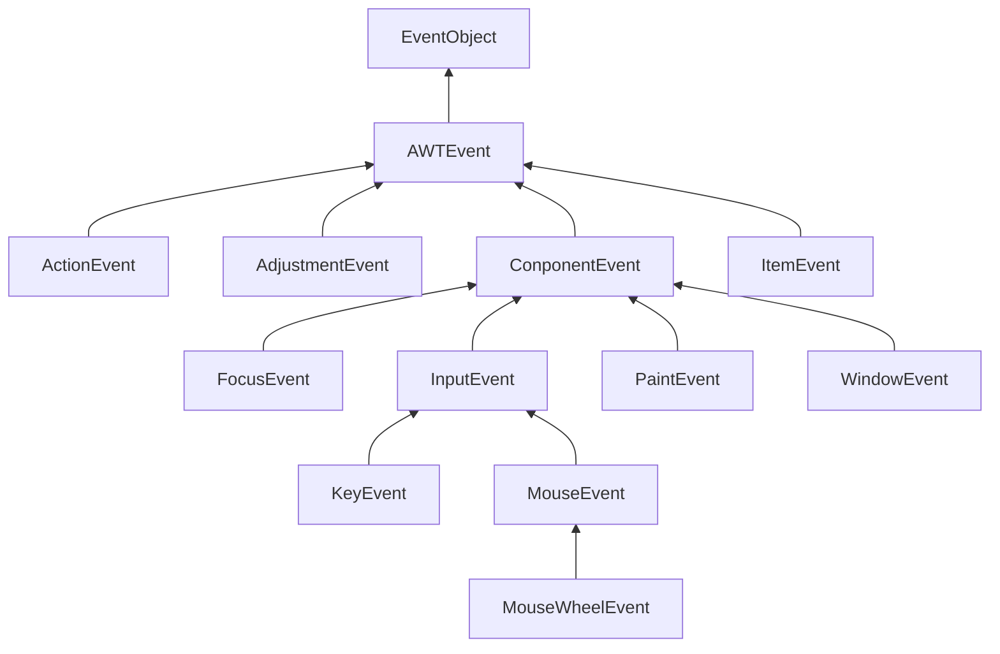

# 第11章 事件处理

对于图形用户界面的程序来说，事件处理是十分重要的。要想实现用户界面，必须掌握Java 事件处理的基本方法。本章将讲解 Java AWT 事件模型的工作机制， 从中可以看到如何捕获用户界面组件和输入设备产生的事件。另外，本章还介绍如何以更加结构化的方式处理动作（actions) 事件。 

## 11.1 事件处理基础

程序员对相关的特定事件编写代码， 并将这些代码放置在过程中，通常人们将它们称为事件过程（ event procedure) 。	每个 Visual Basic 的GUI 组件都响应一个固定的事件集，不可能改变 Visual Basic 组件响应的事件集。 

另一方面，如果使用像原始的 C 这样的语言进行事件驱动的程序设计， 那就需要编写代码来不断地检查事件队列， 以便査询操作环境报告的内容（通常这些代码被放置在包含很多switch语句的循环体中）。 	它的好处在于响应的事件不受限制， 而不像 Visual Basic 这样的语言，将事件队列对程序员隐藏起来。 

Java 程序设计环境折中了 Visual Basic 与原始 C 的事件处理方式， 因此， 它既有着强大的功能， 又具有一定的复杂性。在 AWT 所知的事件范围内， 完全可以控制事件从事件源( event source) 例如， 按钮或滚动条， 到事件监听器（event listener) 的传递过程， 并将任何对象指派给事件监听器。不过事实上，应该选择一个能够便于响应事件的对象。这种事件委托模型（event delegation model ) 与 Visual Basic 那种预定义监听器模型比较起来更加灵活。 

事件源有一些向其注册事件监听器的方法。当某个事件源产生事件时， 事件源会向为事件注册的所有事件监听器对象发送一个通告。 

像 Java 这样的面向对象语言， 都将事件的相关信息封装在一个事件对象（ event object)中。在 Java 中，所有的事件对象都最终派生于 java.util.EventObject 类。 

不同的事件源可以产生不同类别的事件。 例如， 按钮可以发送一个 ActionEvent 对象,而窗口可以发送 WindowEvent 对象。 

### 11.1.1 实例： 处理按钮点击事件

可以通过在按钮构造器中指定一个标签字符串、 一个图标或两项都指定来创建一个按钮。 

```java
JButton yellowButton = new JButton("Yellow");
JButton blueButton = new JButton(new ImageIcon("blue-ball.gif"));
```

将按钮添加到面板中需要调用 add 方法： 

```java
JButton yellowButton = new JButton("Yellow") ;
JButton blueButton = new JButton("Blue")；
JButton redButton = new JButton("Red")；
buttonPanel.add(yellowButton) ;
buttonPanel.add(blueButton) ;
buttonPanel.add(redButton) ;
```

接下来需要增加让面板监听这些按钮的代码。这需要一个实现了 ActionListener 接口的类。 如前所述， 应该包含一个 actionPerformed 方法 

*注释： 在按钮示例中， 使用的 ActionListener 接口并不仅限于按钮点击事件。 它可以应用于很多情况：
•当采用鼠标双击的方式选择了列表框中的一个选项时；
•当选择一个菜单项时；
•当在文本域中按回车键时；
•对于一个 Timer 组件来说， 当达到指定的时间间隔时。
在本章和下一章中， 读者将会看到更加详细的内容。
在所有这些情况下， 使用 ActionListener 接口的方式都是一样的：actionPerformed 方法 （ActionListener 中的唯一方法）将接收一个 ActionEvent 类型的对象作为参数。这个事件对象包含了事件发生时的相关信息。*

当按钮被点击时， 希望将面板的背景颜色设置为指定的颜色。 这个颜色存储在监听器中：

```java
class ColorAction implements ActionListener
{
	private Color backgroundColor;
	public ColorAction(Color c)
	{
		backgroundedor = c;
	}
	public void actionPerformed(ActionEvent event)
	{
		// set panel background color
		...
	}
}
```

然后， 为每种颜色构造一个对象， 并将这些对象设置为按钮监听器。 

```java
ColorAction yellowAction = new ColorAction(Color.YELLOW):
ColorAction blueAction = new ColorAction(Color.BLUE);
ColorAction redAction = new ColorAction(Color.RED);
yellowButton.addActionListener(yellowAction) ;
blueButton.addActionListener(blueAction);
redButton.addActionListener(redAction);
```

这里还有一个需要考虑的问题。CobrAction 对象不能访问 buttonpanel 变量。 可以采用两种方式解决这个问题。一个是将面板存储在 ColorAction 对象中，并在 ColorAction 的构造器中设置它；另一个是将 ColorAction 作为 ButtonFrame 类的内部类，这样一来，它的方法就自动地拥有访问外部面板的权限了（有关内部类的详细介绍请参看第 6 章)。 

这里使用第二种方法。下面说明一下如何将 ColorAction 类放置在 ButtonFrame 类内。 

```java
class ButtonFrame extends JFrame
{
	private ]Panel buttonPanel ;
	private class ColorAction implements ActionListener
	{
		private Color backgroundColor;
		public void actionPerformed(ActionEvent event)
		{
			buttonPanel.setBackground(backgroundColor);
		}
	}
}
```

下面仔细地研究 actionPerformed 方法。在 ColorAction类中没有 buttonPanel 域，但在外部 ButtonFrame 类中却有。

这种情形经常会遇到。事件监听器对象通常需要执行一些对其他对象可能产生影响的操作。可以策略性地将监听器类放置在需要修改状态的那个类中。 

【API】javax.swing.JButton 1.2 :

- `JButton(String label)`
- `JButton(Icon icon)`
- `JButton(String label,Icon icon)`
  构造一个按钮。标签可以是常规的文本， 从 Java SE 1.3 开始， 也可以是 HTML。例如，“`` <html><b>Ok</b></html>``”。 

【API】java.awt.Container 1.0 :

- `Component add(Component c)`
  将组件 c 添加到这个容器中。 

### 11.1.2 简洁地指定监视器

在上一节中， 我们为事件监听器定义了一个类并构造了这个类的 3 个对象。一个监听器类有多个实例的情况并不多见。 更常见的情况是： 每个监听器执行一个单独的动作。在这种情况下， 没有必要分别建立单独的类。 只需要使用一个 lambda 表达式：
`exitButton.addActionListener(event -> System.exit(0)); `

现在考虑这样一种情况： 有多个相互关联的动作， 如上一节中的彩色按钮。在这种情况下， 可以实现一个辅助方法： 

```java
public void makeButton(String name, Color backgroundedor)
{
	JButton button = new JButton(name);
	buttonPanel.add(button);
	button.addActionListener(event ->
		buttonPanel.setBackground(backgroundColor));
}
```

需要说明， lambda 表达式指示参数变量 backgroundColor。

然后只需要调用：

```java
makeButton("yellow", Color.YELLOW):
makeButton("blue", Color.BLUE);
makeButton("red", Color.RED); 
```

*注释： 在较老的代码中， 通常可能会看到使用匿名类：*

```java
exitButton.addActionListener(new ActionListener(){
	public void actionPerformed(new ActionEvent){
		System.exit(0);
	}    
});
```

*当然， 已经不再需要这种繁琐的代码。使用 lambda 表达式更简单， 也更简洁。*

*注释：有些程序员不习惯使用内部类或 lambda 表达式， 而更喜欢创建实现了 ActionListener接口的事件源容器。 然后这个容器再设置自身作为监听器。 如下所示：
yellowButton_ addActionListener(this);
blueButton.addActionListener(this);
redButton.addActionListener(this); 
现在这 3 个按钮不再有单独的监听器。 它们共享一个监听器对象， 具体来讲就是框架 （frame )。 因此， actionPerformed 方法必须明确点击了哪个按钮。*

```java
class ButtonFrame extends ]Frame implements ActionListener
{
	...
	public void actionPerformed(ActionEvent event)
	{
		Object source = event.getSourceO ;
		if (source == yellowButton) ...
		else if (source = blueButton) ...
		else if (source = redButton ) ...
		else ...
	}
}
```

*我们并不建议采用这种策略*

*注释：lambda表达式出现之前，还可以采用一种机制来指定事件监听器，其事件处理器包含一个方法调用。例如，假设一个按钮监听器需要执行以下调用：
`frame.loadData() ;`
EventHandler 类可以用下面的调用创建这样一个监听器：
`EventHandler.create (ActionListener.class, frame , "loadData")`
这种方法现在已经成为历史。 利用 lambda 表达式， 可以更容易地使用以下调用：
`event -> frame.loadData();`
EventHandler机制的效率也不高，而且比较容易出错。它使用反射来调用方法。 出于这个原因，EventHandler.create 调用的第二个参数必须属于一个公有类。否 则，反射机制就无法确定和调用目标方法。* 

【API】java.awt.event.ActionEvent 1.1：

- `String getActionCommand ()`
  返回与这个动作事件关联的命令字符串。 如果这个动作事件源自一个按钮， 命令字符串就等于按钮标签， 除非已经用 setActionCommand 方法改变了命令字符串。

【API】java.beans.EventHandler 1.4：

- `static <T> T create( Class < T> listenerInterface , Object target , String action )`
- `static <T> T create ( Class < T> listenerInterface , Object target , String action , String eventProperty )`
- `static < T > T create( Class < T > listener Interface , Object target , String action , String eventProperty, String listenerMethod )`
  构造实现给定接 n 的一个代理类的对象。接口的指定方法或所有方法会在目标对象上 执行给定的动作。
  这个动作可以是一个方法名， 或者是目标的一个属性。 如果这是一个属性， 则执行它的设置方法。例如， 动作 "text" 会转换为一个 setText 方法调用。
  事件属性由一个或多个由点号（.）分隔的属性名组成。第一个属性从监听器方法的参数读取，第二个属性由得到的对象读取， 依此类推。最终结果会成为动作的参数。例如， 属性 "source.text" 会转换为 getSource 和 getText 方法调用。

【API】java.util.EventQbject 1.1：

- `Object getSource()`
  返回发生这个事件的对象的一个引用。 

### 11.1.3 实例：改变观感

在默认情况下， Swing 程序使用 Metal 观感，可以采用两种方式改变观感。 第一种方式是在 Java 安装的子目录 jre/lib 下有一个文件 swing.properties。在这个文件中，将属性 swing.defaultlaf 设置为所希望的观感类名。 

注意， Metal 和 Nimbus 观感位于 javax.swing 包中。其他的观感包位于 com.sun.java 包中， 并且不是在每个 Java 实现中都提供。现在， 鉴于版权的原因， Windows 和 Macintosh 的观感包只与 Windows 和 Macintosh 版本的 Java 运行时环境一起发布。

*提示：由于属性文件中以 # 字符开始的行被忽略， 所以， 可以在 swing.properties 文件中提供几种观感选择， 并通过增删 # 字符来切换选择：
#swing.defaultl af=javax.swing.pi af.metal .Metal LookAnd Feel
swi ng.default af=com.sun. java.swing.plaf.motif.MotifLookAndFeel
#swing.defaultlaf=com.sun.java.swing.plaf.windows.WindowsLookAndFeel
采用这种方式开启观感时必须重新启动程序。Swing 程序只在启动时读取一次 swing.properties 文件。*

第二种方式是动态地改变观感。这需要调用静态的 UIManager.setLookAndFeel 方法，并提供所想要的观感类名， 然后再调用静态方法 SwingUtilities.updateComponentTreeUI 来刷新全部的组件集。这里需要向这个方法提供一个组件，并由此找到其他的所有组件。 

下面是一个示例，它显示了如何用程序切换至 Motif 观感： 

```java
String className = "com.sun. java.swing.piaf.motif.MotifLookAndFeel":
try
{
	UIManager.setLookAndFeel (className) ;
	SwingUtilities.updateComponentTreeUI(frame) ;
	pack()；
}
catch(Exception e) { e.printStackTrace(); }
```

为了列举安装的所有观感实现， 可以调用

`UIManager.LookAndFeelInfo[] infos = UIManager.getlnstalledLookAndFeels();`

然后采用下列方式得到每一种观感的名字和类名

`String name = infos[i].getName() ;`
`String className = infos[i].getClassName()；`

我们遵循前一节的建议， 使用辅助方法 makeButton 和匿名内部类指定按钮动作， 即切换观感。 

*注释： 在本书之前的版本中， 我们使用了一个内部匿名类来定义这个监听器。 那时， 我们要特别注意向 SwingUtilities.updateComponentTreeUI 传递 PlafFrame.this ( 而不是内部类的 this 引用）：
有了 lambda 表达式之后， 就不存在这个问题了。在一个 lambda 表达式中， this 就指示外围的对象。*

【API】javax.swing.UIManager 1.2 :

- `static UIManager.LookAndFeelInfo[] getlnstalledLookAndFeels()`
  获得一个用于描述已安装的观感实现的对象数组。
- `static setLookAndFeel(String className)`
  利用给定的类名设置当前的观感。例如，javax.swing.plaf.metal.MetalLookAndFeel

【API】javax.swing.UIManager.LookAndFeellnfo 1.2 ：

- `String getName()`
  返回观感的显示名称。
- `String getClassName()`
  返回观感实现类的名称。 

### 11.1.4 适配器类

当程序用户试图关闭一个框架窗口时， JFrame 对象就是 WindowEvent 的事件源。 如果希望捕获这个事件， 就必须有一个合适的监听器对象， 并将它添加到框架的窗口监听器列表中。 

`WindowListener listener = ...;`
`frame.addWindowListener(listener) ; `

窗口监听器必须是实现 WindowListener 接口的类的一个对象。在 WindowListener 接口中包含 7 个方法。当发生窗口事件时， 框架将调用这些方法响应 7 个不同的事件。从它们的名字就可以得知其作用， 唯一的例外是在 Windows 下， 通常将 iconified (图标化）称为minimized (最小化)。 下面是完整的 WindowListener 接口： 

```java
public interface WindowListener
{
void windowOpened(WindowEvent e) ;
void windowClosing(WindowEvent e):
void windowClosed(WindowEvent e) ;
void windowlconified(WindowEvent e) ;
void windowDeiconified(WindowEvent e) ;
void windowActivated(WindowEvent e);
void windowDeactivated(WindowEvent e) ;
}
```

*注释：为了能够查看窗口是否被最大化，需要安装WindowStateListener并覆盖windowStateChanged 方法。*

当然， 可以这样定义实现这个接口的类： 在 windowClosing 方法中增加一个对 System.exit(0) 的调用，其他 6个方法不做任何事情 

书写 6 个没有任何操作的方法代码显然是一种乏味的工作。鉴于简化的目的， 每个含有多个方法的 AWT 监听器接口都配有一个适配器（adapter) 类，这个类实现了接口中的所有方法， 但每个方法没有做任何事情。这意味着适配器类自动地满足了 Java 实现相关监听器接口的技术需求。可以通过扩展适配器类来指定对某些事件的响应动作， 而不必实现接口中的每个方法（ActionListener 这样的接口只有一个方法，因此没必要提供适配器类。) 

*瞀告： 如果在扩展适配器类时将方法名拼写错了， 编译器不会捕获到这个错误。 例如，如果在 WindowAdapter 类中定义一个 windowIsClosing 方法， 就会得到一个包含 8 个方法的类，. 并且 windowClosing 方法没有做任何事情。 可以使用 @Override 注角 （在第 5 章已经介绍过）避免这种错误。*

创建一个扩展于 WindowAdapter 的监听器类是一个很好的改进， 但是还可以继续改进。事实上， 没有必要为 listener 对象命名。 

不要就此止步！我们可以将监听器类定义为框架的匿名内部类。 

```java
frame.addWindowListener(new WindowAdapter(){
    public void windowClosing(WindowEvent e){
        if(user agrees) System,exit(0);
	}
});
```

这段代码具有下列作用：

- 定义了一个扩展于 WindowAdapter 类的无名类。
- 将 windowClosing 方法添加到匿名类中（与前面一样，这个方法将退出程序。)
- 从 WindowAdapter 继承 6 个没有做任何事情的方法。
- 创建这个类的一个对象， 这个对象没有名字。
- 将这个对象传递给 addWindowListener 方法。

这里重申一次， 匿名内部类的语法需要人们适应一段时间， 但得到的是更加简练的代码。 

*注释： 如今， 可能有人会把 WindowListener 接口中什么也不做的方法实现为默认方法。不过， Swing 早在有默认方法很多年之前就已经问世了。*（***笔记注解***：等于说可以用Java8的接口默认方法特性简化适配器？）

【API】java.awt.event.WindowListener 1.1：

- `void windowOpened(WindowEvent e)`
  窗口打开后调用这个方法。
- `void windowCIosing(WindowEvent e)`
  在用户发出窗口管理器命令关闭窗口时调用这个方法。需要注意的是， 仅当调用 hide 或 dispose 方法后窗口才能够关闭。
- `void windowClosed(WindowEvent e)`
  窗口关闭后调用这个方法。
- `void windowIconified(WindowEvent e)`
  窗口图标化后调用这个方法。 
- `void windowDelconified( UindowEvent e)`
  窗口非图标化后调用这个方法。
- `void windowActlvated( WindowEvent e )`
  激活窗口后调用这个方法。只有框架或对话框可以被激活。通常， 窗口管理器会对活动窗口进行修饰， 比如， 髙亮度标题栏。
- `void windowDeactlvated( WindowEvent e )`
  窗口变为未激活状态后调用这个方法。 

【API】java.awt.event.WindowStateListener 1.4 :

- `void windowStateChanged( WindowEvent event )`
  窗口被最大化、 图标化或恢复为正常大小时调用这个方法。

【API】java.awt.event.WlndowEvent 1.1：

- `int getNewState( ) 1.4`
- `int getOldState( ) 1.4`
  返回窗口状态改变事件中窗口的新、旧状态。返回的整型数值是下列数值之一：
  Frame.NORMAL
  Fraae.ICONIFIED
  Fraae.MAXIMIZED_HORIZ
  Frame.HAXIMIZED_VERT
  Frame.MAXIMIZED_BOTH

## 11.2 动作

通常， 激活一个命令可以有多种方式。用户可以通过菜单、击键或工具栏上的按钮选择特定的功能。在 AWT 事件模型中实现这些非常容易：将所有事件连接到同一个监听器上。 

Swing 包提供了一种非常实用的机制来封装命令，并将它们连接到多个事件源，这就是Action 接口。一个动作是一个封装下列内容的对象：

- 命令的说明（一个文本字符串和一个可选图标)；
- 执行命令所需要的参数（例如，在列举的例子中请求改变的颜色)。 

Action 接口包含下列方法： 

`void actionPerformed(ActionEvent event)`
`void setEnabled(boolean b)`
`boolean isEnabled()`
`void putValue(String key, Object value)`
`Object getValue(String key)`
`void addPropertyChangeListener(PropertyChangeListener listener)`
`void removePropertyChangeListener(PropertyChangeListener listener) `

第一个方法是 ActionListener 接口中很熟悉的一个： 实际上，Action 接口扩展于 ActionListener 接口，因此，可以在任何需要 ActionListener 对象的地方使用 Action 对象。 

接下来的两个方法允许启用或禁用这个动作，并检査这个动作当前是否启用。当一个连接到菜单或工具栏上的动作被禁用时， 这个选项就会变成灰色。 

putValue 和 getvalue 方法允许存储和检索动作对象中的任意名 / 值。有两个重要的预定义字符串： Action.NAME 和 Action.SMALL_ICON，用于将动作的名字和图标存储到一个动作对象中：
action.putValue(Action.NAME , "Blue");
action.putValue(Action.SMALL_ICON , new ImageIcon("blue-ball.gif")); 

| 名称               | 值                                                        |
| ------------------ | --------------------------------------------------------- |
| NAME               | 动作名称，显示在按钮和菜单上                              |
| SMALL_ICON         | 存储小图标的地方：显示在按钮、菜单项或工具栏中            |
| SHORT_DESCRIPTION  | 图标的简要说明：显示在工具提示中                          |
| LONG_DESCRIPTION   | 图标的详细说明：使用在在线帮助中，没有Swing组件使用这个值 |
| MNEMONIC_KEY       | 快捷键缩写：显示在菜单项中（请参看第12章）                |
| ACCELERATOR_KEY    | 存储加速击键的地方：Swing组件不使用这个值                 |
| ACTION_COMMAND_KEY | 历史遗留：仅在旧版本的registerKeyboardAction方法中使用    |
| DEFAULT            | 可能有用的综合属性：Swing组件不使用这个值                 |

如果动作对象添加到菜单或工具栏上，它的名称和图标就会被自动地提取出来， 并显示在菜单项或工具栏项中。SHORT_DESCRIPTION 值变成了工具提示。

 Action 接口的最后两个方法能够让其他对象在动作对象的属性发生变化时得到通告， 尤其是菜单或工具栏触发的动作。 

需要注意， Action 是一个接口， 而不是一个类。实现这个接口的所有类都必须实现刚才讨论的 7 个方法。庆幸的是，有一个类实现了这个接口除 actionPerformed 方法之外的所有方法，它就是 AbstractAction。这个类存储了所有名 / 值对， 并管理着属性变更监听器。我们可以直接扩展 AbstractAction 类，并在扩展类中实现 actionPerformed 方法。 

下面构造一个用于执行改变颜色命令的动作对象。首先存储这个命令的名称、 图标和需要的颜色。将颜色存储在 AsbstractAction 类提供的名 / 值对表中。下面是 ColorAction 类的代码。构造器设置名 / 值对， 而 actionPerformed 方法执行改变颜色的动作。 

```java
public class ColorAction extends AbstractAction
{
	public ColorAction(String name, Icon icon, Color c)
	{
		putValue(Action.NAME , name) ;
		putValue(Action.SMALL_ICON, icon);
		putValue("Color", c) ;
		putValue(Action.SHORT_DESCRIPTION, "Set panel color to " + name.toLowerCase());
	}
	public void actionPerformed(ActionEvent event)
	{
		Color c = (Color) getValue("color");
		buttonPanel.setBackground(c);
	}
}
```

想要将这个动作对象添加到击键中， 以便让用户敲击键盘命令来执行这项动作。为了将动作与击键关联起来， 首先需要生成 Keystroke 类对象。这是一个很有用的类， 它封装了对键的说明。要想生成一个 Keystroke 对象，不要调用构造器， 而是调用 Keystroke 类中的静态 getKeyStroke 方法 

为了能够理解下一个步骤，需要知道的概念。用户界面中可以包含许多按钮、 菜单、 滚动栏以及其他的组件。当用户敲击键盘时， 这个动作会被发送给拥有焦点的组件。通常具有焦点的组件可以明显地察觉到（但并不总是这样，) 例如， 在 Java 观感中，具有焦点的按钮在按钮文本周围有一个细的矩形边框。用户可以使用 TAB 键在组件之间移动焦点。当按下 SPACE 键时， 就点击了拥有焦点的按钮。还有一些键执行一些其他的动作，例如， 按下箭头键可以移动滚动条。 

Swing 设计者给出了一种很便捷的解决方案。每个 JComponent 有三个输入映射（imput map),  每一个映射的 Keystroke 对象都与动作关联。三个输人映射对应
着三个不同的条件（请参看表 11-2 )。

| 标志                               | 激活动作                                         |
| ---------------------------------- | ------------------------------------------------ |
| WHEN_FOCUSED                       | 当这个组件拥有键盘焦点时                         |
| WHEN_ANCESTOR_OF_FOCUSED_COMPONENT | 当这个组件包含了拥有键盘焦点的组件时             |
| WHEN_IN_FOCUSED_WINDOW             | 当这个组件被包含在一个拥有键盘焦点组件的窗口中时 |

按键处理将按照下列顺序检査这些映射：

1 ) 检查具有输入焦点组件的 WHEN_FOCUSED 映射。如果这个按键存在， 将执行对应的动作。如果动作已启用，则停止处理。

2 ) 从具有输入焦点的组件开始， 检査其父组件的WHEN_ANCESTOR_OF_FOCUSED_COMPONENT 映射。一旦找到按键对应的映射， 就执行对应的动作。如果动作已启用， 将停止处理。

3 ) 査看具有输入焦点的窗口中的所有可视的和启用的组件， 这个按键被注册到 WHEN_IN_FOCUSED_WINDOW 映射中。给这些组件（按照按键注册的顺序）一个执行对应动作的机会。一旦第一个启用的动作被执行， 就停止处理。 如果一个按键在多个 WHEN_IN_FOCUSED_WINDOW 映射中出现， 这部分处理就可能会出现问题。 

可以使用 getlnputMap 方法从组件中得到输入映射。 

WHEN_FOCUSED 条件意味着在当前组件拥有键盘焦点时会查看这个映射。在这里的示例中，并不想使用这个映射。是某个按钮拥有输入焦点， 而不是面板。其他的两个映射都能够很好地完成增加颜色改变按键的任务。 在示例程序中使用的是 WHEN_ANCESTOR_OF_FOCUSED_COMPONENT。 

InputMap 不能直接地将 Keystroke 对象映射到 Action 对象。而是先映射到任意对象上，然后由 ActionMap 类实现将对象映射到动作上的第 2 个映射。这样很容易实现来自不同输入映射的按键共享一个动作的目的。 

因而， 每个组件都可以有三个输人映射和一个动作映射。为了将它们组合起来，需要为动作命名。下面是将键与动作关联起来的方式： 

```java
map.put(KeyStroke.getKeyStroke("ctrl Y"), "panel.yellow")；
ActionMap amap = panel.getActionMap();
amap.put("panel.yellow", yellowAction) ;
```

习惯上， 使用字符串 none 表示空动作。 这样可以轻松地取消一个按键动作 

*警告： JDK 文档提倡使用动作名作为动作键。 我们并不认为这是一个好建议。 在按钮和菜单项上显示的动作名， UI 设计者可以随心所欲地进行更改， 也可以将其翻译成多种语言。使用这种不牢靠的字符串作为查询键不是一种好的选择。 建议将动作名与显示的名字分开。*

下面总结一下用同一个动作响应按钮、 菜单项或按键的方式：

1 ) 实现一个扩展于 AbstractAction 类的类。多个相关的动作可以使用同一个类。

2 ) 构造一个动作类的对象。

3 ) 使用动作对象创建按钮或菜单项。 构造器将从动作对象中读取标签文本和图标。

4 ) 为了能够通过按键触发动作， 必须额外地执行几步操作。首先定位顶层窗口组件，例如， 包含所有其他组件的面板。

5 ) 然后， 得到顶层组件的 WHEN_ANCESTOR_OF_FOCUS_COMPONENT 输入映射。为需要的按键创建一个 KeyStrike 对象。创建一个描述动作字符串这样的动作键对象。将 （按键， 动作键）对添加到输人映射中。

6 ) 最后，得到顶层组件的动作映射。将（动作键，动作对象）添加到映射中。 

【API】javax.swing.Action 1.2：

- `boolean isEnalbled( )`
- `void setEnabled( boolean b )`
  获得或设置这个动作的 enabled 属性。
- `void putValue( String key,Object value )`
  将名 / 值对放置在动作对象内。
  参数： key 用动作对象存储性能的名字。它可以是一个字符串， 但预定义了几个名字， 其含义参看表 11-1。 
  value 与名字关联的对象。 
- `Object getValue(String key)`
  返回被存储的名 / 值对的值。 

【API】javax.swing.Keystroke 1.2：

- `static Keystroke getKeyStroke(String description)`
  根据一个便于人们阅读的说明创建一个按键 （由空格分隔的字符串序列）。这个说明以0 个或多个修饰符 shift control Ctrl meta alt altGraph 开始， 以由 typed 和单个字符构成的字符串（例如：“ typeda”）或者一个可选的事件说明符（pressed 默认， 或 released)紧跟一个键码结束。 以 VK_前缀开始的键码应该对应一个 KeyEvent 常量， 例如，“ INSERT” 对应 KeyEvent.VK_INSERT。 

【API】javax.swing.JComponent 1.2：

- `ActionMap getActionMap()` 1.3
  返回关联动作映射键（可以是任意的对象）和动作对象的映射。
- `InputMap getInputMap(int flag)` 1.3
  获得将按键映射到动作键的输入映射。
  参数： flag 触发动作的键盘焦点条件。具体的值请参看表 11-2。

## 11.3 鼠标事件

当用户点击鼠标按钮时， 将会调用三个监听器方法： 鼠标第一次被按下时调用 mousePressed ; 鼠标被释放时调用mouseReleased； 最后调用 mouseClicked。 如果只对最终的点击事件感兴趣， 就可以忽略前两个方法。 用 MouseEvent 类
对象作为参数， 调用 getX 和 getY 方法可以获得鼠标被按下时鼠标指针所在的 x 和 y 坐标。 要想区分单击、 双击和三击（！，) 需要使用 getClickCount方法。 

有些用户界面设计者喜欢让用户采用鼠标点击与键盘修饰符组合（例如， CONTROL+SHIFT+CLICK) 的方式进行操作。我们感觉这并不是一种值得赞许的方式。如果对此持有不同的观点，可以看一看同时检测鼠标按键和键盘修饰符所带来的混乱。 

当鼠标在窗口上移动时， 窗口将会收到一连串的鼠标移动事件。请注意：有两个独立的接口 MouseListener 和 MouseMotionListener。 这样做有利于提高效率。 当用户移动鼠标时，只关心鼠标点击 (clicks) 的监听器就不会被多余的鼠标移动 (moves) 所困扰。 

| 图标             | 常量             |
| ---------------- | ---------------- |
| 正常箭头         | DEFAULT_CURSOR   |
| 十字             | CROSSHAIR_CURSOR |
| 手指（超链接）   | HAND_CURSOR      |
| 十字箭头（移动） | MOVE_CURSOR      |
| 光标（编辑）     | TEXT_CURSOR      |
| 漏斗（等待）     | WAIT_CURSOR      |
| 上方改变大小     | N_RESIZE_CURSOR  |
| 右上方改变大小   | NE_RESIZE_CURSOR |
| 右方改变大小     | E_RESIZE_CURSOR  |
| 右下方改变大小   | SE_RESIZE_CURSOR |
| 下方改变大小     | S_RESIZE_CURSOR  |
| 左下方改变大小   | SW_RESIZE_CURSOR |
| 左方改变大小     | W_RESIZE_CURSOR  |
| 左上方改变大小   | NW_RESIZE_CURSOR |

*注释：还可以利用 Toolkit类中的 createCustomCursor方法自定义光标类型：
Toolkit tk = Toolkit.getDefaultToolkit();
Image img = tk.getlmage("dynamite.gif");
Cursor dynamiteCursor = tk.createCustomCijrsor(inig, new Point (10, 10) , "dynamite stick") ;
createCustomCursor 的第一个参数指向光标图像。 第二个参数给出了光标的“ 热点”偏移。 第三个参数是一个描述光标的字符串。 这个字符串可以用于访问性支持， 例如，可以将光标形式读给视力受损或没有在屏幕前面的人。*

如果用户在移动鼠标的同时按下鼠标，就会调用 mouseMoved 而不是调用mouseDmgged。在测试应用程序中， 用户可以用光标拖动小方块。在程序中， 仅仅用拖动的矩形更新当前光标位置。然后，重新绘制画布， 以显示新的鼠标位置。 

*注释： 只有鼠标在一个组件内部停留才会调用 mouseMoved 方法。然而，即使鼠标拖动到组件外面， mouseDragged 方法也会被调用。*

还有两个鼠标事件方法： mouseEntered 和 mouseExited。这两个方法是在鼠标进入或移出组件时被调用。 

最后， 解释一下如何监听鼠标事件。 鼠标点击由 mouseClicked 过程报告， 它是 MouseListener 接口的一部分。由于大部分应用程序只对鼠标点击感兴趣， 而对鼠标移动并不感兴趣， 但鼠标移动事件发生的频率又很高， 因此将鼠标移动事件与拖动事件定义在一个称为 MouseMotionListener 的独立接口中。 

【API】java.awt.event MouseEvent 1.1 :

- `int getX()`
  `int getY()`
  `Point getPoint()`
  返回事件发生时， 事件源组件左上角的坐标 x (水平）和 y (竖直)， 或点信息。
- `int getClickCount()`
  返回与事件关联的鼠标连击次数（“ 连击” 所指定的时间间隔与具体系统有关)。 

【API】java awt.event.InputEvent 1.1

- `int getModifiersEx( )` 1.4
  返回事件扩展的或“ 按下”（down) 的修饰符。使用下面的掩码值检测返回值：
  BUTTON1_DOWN_MASK
  BUTTON2_DOWN_MASK
  BUTTON3_DOWN_MASK
  SHIFT_DOWN_MASK
  CTRL_DOWN_MASK
  ALT_DOWN_MASK
  ALT_GRAPH_DOWN_MASK
  META_DOWN_MASK
- `static String getModifiersExText(int modifiers )` 1.4
  返回用给定标志集描述的扩展或“ 按下” （down) 的修饰符字符串， 例如“Shift+Button1” 。

【API】java.awt.Toolkit 1.0：

- `public Cursor createCustomCursor( Image image,Point hotSpot,String name)` 1.2
  创建一个新的定制光标对象。
  参数： image 光标活动时显示的图像
  hotSpot 光标热点（箭头的顶点或十字中心）
  name 光标的描述， 用来支持特殊的访问环境

【API】java.awtComponent 1.0：

- `public void setCursor( Cursor cursor )`
  用光标图像设置给定光标 

## 11.4 AWT事件继承层次

前面已经提到， Java 事件处理采用的是面向对象方法， 所有的事件都是由 java.util 包中的 EventObject 类扩展而来的（公共超类不是 Event, 它是旧事件模型中的事件类名。尽管现在不赞成使用旧的事件模型，但这些类仍然保留在 Java 库中)。 



对于有些 AWT 事件类来说， Java 程序员并不会实际地使用它们。 例如， AWT 将会把PaintEvent 对象插入事件队列中， 但这些对象并没有传递给监听器。 Java 程序员并不监听绘图事件， 如果希望控制重新绘图操作， 就需要覆盖 paintComponent 方法。 另外， AWT 还可以生成许多只对系统程序员有用的事件， 用于提供表义语言的输人系统以及自动检测机器人等。 在此，将不讨论这些特殊的事件类型。

### 11.4.1 语义事件和底层事件

AWT 将事件分为底层（ low-level) 事件和语义（semantic ) 事件。**语义事件**是表示用户动作的事件， 例如，点击按钮；因此， ActionEvent 是一种语义事件。**底层事件**是形成那些事件的事件。 

下面是 java.awt.event 包中最常用的语义事件类：

•ActionEvent (对应按钮点击、 菜单选择、 选择列表项或在文本框中 ENTER );
•AdjustmentEvent (用户调节滚动条；)
•ItemEvem (用户从复选框或列表框中选择一项）。

常用的 5 个底层事件类是：

•KeyEvent (一个键被按下或释放；)
•MouseEvent ( 鼠标键被按下、 释放、 移动或拖动；)
•MouseWheelEvent ( 鼠标滚轮被转动；)
•FocusEvent (某个组件获得焦点或失去焦点；)
•WindowEvent ( 窗口状态被改变）。 

下列接口将监听这些事件。

ActionListener
AdjustmentListener
FocusListener
ItemListener
KeyListener
MouseListener
MouseMoti onListener
MouseWheelListener
WindowListener
WindowFocusListener
WindowStateListener

有几个 AWT 监听器接口包含多个方法， 它们都配有一个适配器类， 在这个类中实现了相应接口中的所有方法，但每个方法没有做任何事情 （有些接口只包含一个方法， 因此， 就没有必要为它们定义适配器类了）。下面是常用的适配器类：

FocusAdapter
MouseMotionAdapter
KeyAdapter
WindowAdapter
MouseAdapter 

| 接口                | 方法                                                         | 参数/访问方法                                                | 事件源                                                   |
| ------------------- | ------------------------------------------------------------ | ------------------------------------------------------------ | -------------------------------------------------------- |
| ActionListener      | actionPerformed                                              | ActionEvent<br />- getActionCommand<br />- getModifiers      | AbstractButton<br />JComboBox<br />JTextField<br />Timer |
| AdjustmentListener  | adjustmentValueChanged                                       | AdjustmentEvent<br />- getAdjustable<br />- getAdjustmentType<br />- getValue | JScrollbar                                               |
| ItemListener        | itemStateChanged                                             | ItemEvent<br />- getItem<br />- getItemSelectable<br />- getStateChange | AbstractButton<br />JComboBox                            |
| FocusListener       | focusGained<br />focusLost                                   | FocusEvent<br />- isTemporary                                | Component                                                |
| KeyListener         | keyPressed<br />keyReleased<br />keyTyped                    | KeyEvent<br />- getKeyChar<br />- getKeyCode<br />- getKeyModifiersText<br />- getKeyText<br />- isActionKey | Component                                                |
| MouseListener       | mousePressed<br />mouseReleased<br />mouseEntered<br />mouseExited<br />mouseClicked | MouseEvent<br />- getClickCount<br />- getX<br />- getY<br />- getPoint<br />- translatePoint | Component                                                |
| MouseMotionListener | mouseDragged<br />mouseMoved                                 | MouseEvent                                                   | Component                                                |
| MouseWheelListener  | mouseWheelMoved                                              | MouseWheelEvent                                              | Component                                                |
| WindowListener      | windowClosing<br />windowOpened<br />windowIconified<br />windowDeiconified<br />windowClosed<br />windowActivated<br />windowDeactivated | WindowEvent<br />- getWindow                                 | Window                                                   |
| WindowFocusListener | windowGainedFocus<br />windowLostFocus                       | WindowEvent<br />- getOppositeWindow                         | Window                                                   |
| WindowStateListener | windowStateChanged                                           | WindowEvent<br />- getOldEvent<br />- getNewEvent            | Window                                                   |

