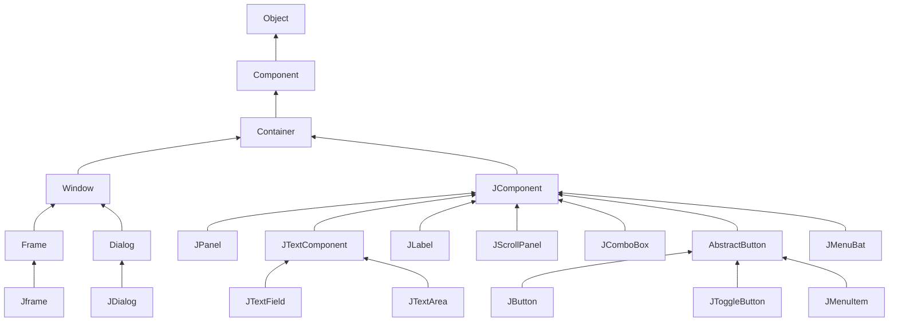

# 第12章 Swing用户界面组件

## 12.1 Swing和模型-视图-控制器设计模式

### 12.1.1 设计模式

近几年来， 软件工程师们开始对这些模式进行汇总分类。这个领域的先驱者的灵感来源于建筑师 Christopher Alexander 的设计模式。 

模型-视图-控制器模式并不是 AWT 和 Swing 设计中使用的唯一模式。下列是应用的另外几种模式：

•容器和组件是“ 组合（composite )” 模式
•带滚动条的面板是“ 装饰器（decorator)” 模式
•布局管理器是“ 策略（strategy)” 模式 

### 12.1.2 模型-视图-控制器模式

Swing 设计者采用了一种很有名的设计模式（design pattern ) : 模型 - 视图 - 控制器 （ model-view-controller) 模式。这种设计模式同其他许多设计模式一样，都遵循第 5 章介绍过的面向对象设计中的一个基本原则： 限制一个对象拥有的功能数量。不要用一个按钮类完成所有的事情， 而是应该让一个对象负责组件的观感， 另一个对象负责存储内容。模型-视图- 控制器（MVC) 模式告诉我们如何实现这种设计，实现三个独立的类：

•模型 （model ): 存储内容。
•视图 （view): 显示内容。
•控制器（controller): 处理用户输入。

这个模式明确地规定了三个对象如何进行交互。**模型**存储内容， 它没有用户界面。 

模型必须实现改变内容和查找内容的方法。 	记住：模型是完全不可见的。显示存储在模型中的数据是视图的工作。 

模型-视图-控制器模式的一个优点是一个模型可以有多个视图， 其中每个视图可以显示全部内容的不同部分或不同形式。 例如， 一个 HTML 编辑器常常为同一内容在同一时刻提供两个视图： 一个 WYSIWYG (所见即所得）视图和一个“ 原始标记” 视图。

**控制器**负责处理用户输入事件，如点击鼠标和敲击键盘。然后决定是否把这些事件转化成对模型或视图的改变。 

除了“ 本职工作” 外，模型-视图- 控制器模式吸引 Swing 设计者的主要原因是这种模式允许实现可插观感。  

### 12.1.3 Swing按钮的模型-视图-控制器分析

对于大多数组件来说， 模型类将实现一个名字以 Model 结尾的接口， 例如，按钮就实现了 ButtonModel 接口。实现了此接口的类可以定义各种按钮的状态。 

对于一个按钮来说， 仅凭模型无法知道它的外观（实际上， 在有关单选钮的 12.4.2 节中将会看到，这种纯粹的设计会给程序员带来一些麻烦)。 

需要注意的是， 同样的模型（即 DefaultButtonModel ) 可用于下压按钮、单选按钮、复选框、甚至是菜单项。当然， 这些按钮都有各自不同的视图和控制器。当使用 Metal 观感时，JButton 类用 BasicButtonUI 类作为其视图； 用 ButtonUIListener 类作为其控制器。通常， 每个 Swing 组件都有一个相关的后缀为 UI 的视图对象， 但并不是所有的 Swing 组件都有专门的控制器对象。 

在阅读 JButton 底层工作的简介之后可能会想到： JButton 究竟是什么？ 事实上， 它仅仅是一个继承了 JComponent 的包装器类， JComponent 包含了一个 DefauUButtonModel 对象，一些视图数据（例如按钮标签和图标）和一个负责按钮视图的 BasicButtonUI 对象。 

## 12.2 布局管理概述

回顾上一章的程序， 我们设计了几个按钮，点击这些按钮可以改变框架的背景颜色。

这几个按钮被放置在一个 JPanel 对象中， 且用流布局管理器（ flow layout manager) 管理， 这是面板的默认布局管理器。当一行的空间不够时，会将显示在新的一行上。 

另外， 按钮总是位于面板的中央， 即使用户对框架进行缩放也是如此。  

通常， 组件放置在容器中， 布局管理器决定容器中的组件具体放置的位置和大小。 

*注释： 可惜的是， 继承层次有两点显得有点混乱。 首先， 像 JFrame 这样的顶层窗口是 Container 的子类， 所以也是 Component 的子类， 但却不能放在其他容器内。 另外，JComponent 是 Container 的子类， 但不直接继承 Component, 因此， 可以将其他组件添置到 JButton 中。（但无论如何， 这些组件无法显示出来）。*

每个容器都有一个默认的布局管理器，但可以重新进行设置。 例如， 使用下列语句：
`panel.setLayout(new GridLayout(4, 4));`
这个面板将用 GridLayout 类布局组件。可以往容器中添加组件。容器的 add 方法将把组件和放置的方位传递给布局管理器 



【API】java.awt.Container 1.0

- `Void SetLayout(LayoutManager m)`
  为容器设置布局管理器
- `Component add(Component c)`
- `Component add(Component c, Object constraints)` 1.1
  将组件添加到容器中， 并返回组件的引用。
  参数： c 要添加的组件
  constraints 布局管理器理解的标识符

【API】 java.awt.FlowLayout 1.0

- `FIowLayout ()`

- `FIowLayout(int align)`

- `FIowLayout (int align, int hgap , int vgap)`
  构造一个新的 FlowLayout 对象。
  参数： align LEFT、 CENTER 或者 RIGHT

  hgap 以像素为单位的水平间距（如果为负值， 则强行重叠）
  vgap 以像素为单位的垂直间距（如果为负值，则强行重叠） 

### 12.2.1 边框布局

边框布局管理器（border layout manager) 是每个 JFrame的内容窗格的默认布局管理器。 流布局管理器完全控制每个组件的放置位置，边框布局管理器则不然，它允许为每个组件选择一个放置位置。 

先放置边缘组件，剩余的可用空间由中间组件占据。当容器被缩放时，边缘组件的尺寸不会改变， 而中部组件的大小会发生变化。 在添加组件时可以指定 BorderLayout 类中的 CENTER、 NORTH、 SOUTH、 EAST 和 WEST 常量。并非需要占用所有的位置，如果没有提供任何值，系统默认为 CENTER。 

*注释： BorderLayout 常量定义为字符串。 例如： BorderLayout.SOUTH 定义为 字符串“ SOUTH”。很多程序员喜欢直接使用字符串， 因为这些字符串比较简短， 例如， frame.add (component,“ SOUTH” ）。 然而， 如果字符串拼写有误， 编译器不会捕获错误。*

与流布局不同，边框布局会扩展所有组件的尺寸以便填满可用空间（流布局将维持每个组件的最佳尺寸。) 当将一个按钮添加到容器中时会出现问题 .按钮扩展至填满框架的整个南部区域。而且，如果再将另外一个按钮添加到南部区域， 就会取代第一个按钮。 

解决这个问题的常见方法是使用另外一个面板（panel )。屏幕底部的三个按钮全部包含在一个面板中。这个面板被放置在内容窗格的南部。 

要想得到这种配置效果， 首先需要创建一个新的 JPanel 对象，然后逐一将按钮添加到面板中。面板的默认布局管理器是 HowLayout，这恰好符合我们的需求。随后使用在前面已经看到的 add 方法将每个按钮添加到面板中。每个按钮的放置位置和尺寸完全处于 FlowLayout 布局管理器的控制之下。这意味着这些按钮将置于面板的中央，并且不会扩展至填满整个面板区域。最后， 将这个面板添加到框架的内容窗格中。

【API】java.awt.BorderLayout 1.0：

- `BorderLayout()`
- `BorderLayout( int hgap, int vgap)`
  构造一个新的 BorderLayout 对象。
  参数： hgap 以像素为单位的水平间距（如果为负值， 则强行重叠）
  vgap 以像素为单位的垂直间距（如果为负值， 则强行重叠） 

### 12.2.2 网格布局

网格布局像电子数据表一样， 按行列排列所有的组件。不过，它的每个单元大小都是一样的。缩放窗口时， 示例中的计算器按钮将随之变大或变小，但所有的按钮尺寸始终保持一致。

在网格布局对象的构造器中，需要指定行数和列数 。

当然， 极少有像计算器这样整齐的布局。实际上， 在组织窗口的布局时小网格（通常只有一行或者一列）比较有用。 例如， 如果想放置一行尺寸都一样的按钮，就可以将这些按钮放置在一个面板里， 这个面板使用只有一行的网格布局进行管理。 

【API】java.awt.GridLayout 1.0

- `GridLayout(int rows, int columns)`
- `GridLayout(int rows, int columns, int hgap, int vgap)`
  构造一个新的 GridLayout 对象。 rows 或者 columns 可以为零， 但不能同时为零，指定的每行或每列的组件数量可以任意的。
  参数：rows 网格的行数
  columns 网格的列数
  hgap 以像素为单位的水平间距（如果为负值， 则强行重叠）
  vgap 以像素为单位的垂直间距（如果为负值，则强行重叠） 

## 12.3 文本输入

首先， 介绍具有用户输入和编辑文本功能的组件。文本域（ JTextField) 和文本区 （ JTextArea) 组件用于获取文本输人。文本域只能接收单行文本的输人， 而文本区能够接收多行文本的输人。JPassword 也只能接收单行文本的输人，但不会将输入的内容显示出来。 

这三个类都继承于 JTextComponent 类。由于 JTextComponent 是一个抽象类，所以不能够构造这个类的对象。另外，在 Java 中常会看到这种情况。在査看 API 文档时，发现自己正在寻找的方法实际上来自父类 JTextComponent, 而不是来自派生类自身。例如，在一个文本域和文本区内获取（get)、 设置（set) 文本的方法实际上都是 JTextComponent 类中的方法。 

【API】javax.swing.text.JTextComponent 1.2：

- `String getText()`
- `void setText(String text)`
  获取或设置文本组件中的文本。
- `boolean isEditable() `
- `void setEditable( boolean b)`
  获取或设置 editable 特性， 这个特性决定了用户是否可以编辑文本组件中的内容。 

### 12.3.1 文本域

把文本域添加到窗口的常用办法是将它添加到面板或者其他容器中，这与添加按钮完全一样。

但是，这里所说的列不是一个精确的测量单位。一列就是在当前使用的字体下一个字符的宽度。 如果希望文本域最多能够输人 n 个字符， 就应该把宽度设置为 n 列。在实际中， 这样做效果并不理想，应该将最大输人长度再多设 1 ~ 2 个字符。列数只是给 AWT 设定首选（ preferred) 大小的一个提示。如果布局管理器需要缩放这个文本域，它会调整文本域的大小。在 JTextField 的构造器中设定的宽度并不是用户能输人的字符个数的上限。用户可以输入一个更长的字符串，但是当文本长度超过文本域长度时输人就会滚动。用户通常不喜欢滚动文本域， 因此应该尽量把文本域设置的宽一些。如果需要在运行时重新设置列数，可以使用 setColumns 方法。 

*提示：使用 setColumns 方法改变了一个文本域的大小之后， 需要调用包含这个文本框的容器的 revalidate 方法。
revalidate 方法会重新计算容器内所有组件的大小， 并且对它们重新进行布局。调用revalidate 方法以后， 布局管理器会重新设置容器的大小， 然后就可以看到改变尺寸后的文本域了。
revalidate 方法是 JComponent 类中的方法。它并不是马上就改变组件大小， 而是给这个组件加一个需要改变大小的标记。这样就避免了多个组件改变大小时带来的重复计算。但是， 如果想重新计算一个 JFrame 中的所有组件， 就必须调用 validate 方法JFrame 没有扩展 JComponent。*

通常情况下，希望用户在文本域中键入文本（或者编辑已经存在的文本)。文本域一般初始为空白。只要不为 JTextField 构造器提供字符串参数，就可以构造一个空白文本域 

可以在任何时候调用 setText 方法改变文本域中的内容。 这个方法是从前面提到的
JTextComponent 中继承而来的。 

并且， 在前面已经提到， 可以调用 getText 方法来获取用户键人的文本。这个方法返回用户输人的文本。 如果想要将 getText 方法返回的文本域中的内容的前后空格去掉， 就应该调用 trim 方法 

如果想要改变显示文本的字体，就调用 setFont 方法 

【API】javax.swing.JTextField 1.2：

- `JTextField(Int cols )`
  构造一个给定列数的空 JTextField 对象。
- `JTextField(String text , int cols )`
  构造一个给定列数、给定初始字符串的 JTextField 对象。
- `int getColumns( )`
- `void setColumns( int cols )`
  获取或设置文本域使用的列数。

【API】 javax.swing.JComponent 1.2：

- `void revalidate( )`
  重新计算组件的位置和大小。
- `void setFont( Font f )`
  设置组件的字体。

【API】 java.awt.Component 1.0：

- `void validate( )`
  重新计算组件的位置和大小。如果组件是容器， 容器中包含的所有组件的位置和大小也被重新计算。
- `Font getFont( )`
  获取组件的字体。 

### 12.3.2 标签和标签组件

标签是容纳文本的组件，它们没有任何的修饰（例如没有边缘，) 也不能响应用户输入。可以利用标签标识组件。 例如： 与按钮不同，文本域没有标识它们的标签 要想用标识符标识这种不带标签的组件， 应该

1 ) 用相应的文本构造一个 JLabel 组件。

2 ) 将标签组件放置在距离需要标识的组件足够近的地方， 以便用户可以知道标签所标识的组件。 

JLabel 的构造器允许指定初始文本和图标， 也可以选择内容的排列方式。可以用 Swing Constants 接口中的常量来指定排列方式。在这个接口中定义了几个很有用的常量， 如 LEFT、RIGHT、 CENTER、 NORTH、 EAST 等。JLabel 是实现这个接口的一个 Swing 类。 

利用 setText 和 setlcon 方法可以在运行期间设置标签的文本和图标 。

*提示： 可以在按钮、 标签和菜单项上使用无格式文本或 HTML 文本。 我们不推荐在按钮上使用 HTML 文本—这样会影响观感。 但是 HTML 文本在标签中是非常有效的。 只要简单地将标签字符串放置在 `<html>...</html>` 中即可
需要说明的是包含 HTML 标签的第一个组件需要延迟一段时间才能显示出来， 这是因为需要加载相当复杂的 HTML 显示代码。*

与其他组件一样，标签也可以放置在容器中。这就是说，可以利用前面介绍的技巧将标签放置在任何需要的地方。 

【API】javax.swing.JLabel 1.2：

- `JLabel (String text )`
- `JLabel (Icon icon)`
- `JLabel (String text, int align)`
- `JLabel (String text, Icon Icon, int align)`
  构造一个标签。
  参数： text 标签中的文本
  icon 标签中的图标
  align 一个 SwingConstants 的常量 LEFT (默认)、 CENTER 或者 WGHT
- `String getText( )`
- `void setText(String text )`
  获取或设置标签的文本。
- `Icon getIcon( )`
- `void setIcon(Icon Icon)`
  获取或设置标签的图标。 

### 12.3.3 密码域

密码域是一种特殊类型的文本域。为了避免有不良企图的人看到密码， 用户输入的字符不显示出来。 每个输人的字符都用回显字符 （ echo character) 表示， 典型的回显字符是星号(*)。 Swing 提供了 JPasswordField 类来实现这样的文本域。 

密码域是另一个应用模型 - 视图 - 控制器体系模式的例子。密码域采用与常规的文本域相同的模型来存储数据， 但是，它的视图却改为显示回显字符，而不是实际的字符。

【API】 javax.swing.JPasswordField 1.2：

- `JPasswordField(String text, int columns)`
  构造一个新的密码域对象。
- `void setEchoChar(char echo)`
  为密码域设置回显字符。注意：独特的观感可以选择自己的回显字符。0 表示重新设置为默认的回显字符。
- `char[ ] getPassworci()`
  返回密码域中的文本。 为了安全起见， 在使用之后应该覆写返回的数组内容（密码并不是以 String 的形式返回，这是因为字符串在被垃圾回收器回收之前会一直驻留在虚拟机中）。 

### 12.3.4 文本区

有时， 用户的输人超过一行。 正像前面提到的， 需要使用 JTextArea 组件来接收这样的输入。当在程序中放置一个文本区组件时， 用户就可以输
人多行文本，并用 ENTER 键换行。每行都以一个“ \n” 结尾。 

在 JTextArea 组件的构造器中，可以指定文本区的行数和列数。 

与文本域一样。出于稳妥的考虑， 参数 columns 应该设置得大一些。另外，用户并不受限于输人指定的行数和列数。当输人过长时，文本会滚动。还可以用 setColumns 方法改变列数， 用 setRows 方法改变行数。这些数值只是首选大
小一布局管理器可能会对文本区进行缩放。 

如果文本区的文本超出显示的范围， 那么剩下的文本就会被剪裁掉。可以通过开启换行特性来避免裁剪过长的行 

换行只是视觉效果；文档中的文本没有改变，在文本中并没有插入“ \n” 字符。 

### 12.3.5 滚动窗格

在 Swing 中， 文本区没有滚动条。 如果需要滚动条， 可以将文本区插人到滚动窗格(scroll pane) 中。 

现在滚动窗格管理文本区的视图。 如果文本超出了文本区可以显示的范围， 滚动条就会自动地出现， 并且在删除部分文本后， 当文本能够显示在文本区范围内时， 滚动条会再次自动地消失。滚动是由滚动窗格内部处理的， 编写程序时无需处理滚动事件。 

这是一种为任意组件添加滚动功能的通用机制， 而不是文本区特有的。也就是说， 要想为组件添加滚动条， 只需将它们放人一个滚动窗格中即可。 

*注释： JTextArea 组件只显示无格式的文本， 没有特殊字体或者格式设置。如果想要显示格式化文本（如 HTML ), 就需要使用 JEditorPane 类。在卷 II 将详细讨论。*

【API】javax.swing.JTextArea 1.2：

- `JTextArea( )`
- `JTextArea( int rows, int cols )`
- `JTextArea( String text, int rows, int cols )`
  构造一个新的文本区对象。
- `void setColumns( int cols )`
  设置文本区应该使用的首选列数。
- `void setRows ( int rows )`
  设置文本区应该使用的首选行数。
- `void append( String newText )`
  将给定的文本追加到文本区中已有文本的尾部。
- `void setLineWrap(boolean wrap )`
  打开或关闭换行。
- `void setWrapStyleWord(boolean word)`
  如果 word 是 true, 超长的行会在字边框处换行。如果为 false, 超长的行被截断而不考虑字边框。
- `void setTabSize(int c )`
  将制表符 （tab stop ) 设置为 c 列。注意， 制表符不会被转化为空格， 但可以让文本对齐到下一个制表符处。

【API】 javax.swing.JScrollPane 1.2：

- `JScrollPane( Component c )`
  创建一个滚动窗格， 用来显示指定组件的内容。当组件内容超过显示范围时， 滚动条会自动地出现。 

## 12.4 选择组件

### 12.4.1 复选框

如果想要接收的输人只是“ 是” 或“ 非”， 就可以使用复选框组件。复选框自动地带有标识标签。用户通过点击某个复选框来选择相应的选项， 再点击则取消选取。当复选框获得焦点时， 用户也可以通过按空格键来切换选择。 

复选框需要一个紧邻它的标签来说明其用途。在构造器中指定标签文本。 

可以使用 setSelected 方法来选定或取消选定复选框。 

isSelected方法将返回每个复选框的当前状态。 

当用户点击复选框时将触发一个动作事件。通常， 可以为复选框设置一个动作监听器。 

【API】javax.swing.JCheckBox 1.2：

- `JCheckBox(String label )`
- `JCheckBox( String label , Icon icon )`
  构造一个复选框， 初始没有被选择。
- `JCheckBox(String label , boolean state )`
  用给定的标签和初始化状态构造一个复选框。
- `boolean isSelected ( )`
- `void setSelected(boolean state )`
  获取或设置复选框的选择状态 

### 12.4.2 单选钮

在前一个例子中， 对于两个复选框， 用户既可以选择一个、 两个，也可以两个都不选。在很多情况下，我们需要用户只选择几个选项当中的一个。当用户选择另一项的时候， 前一项就自动地取消选择。这样一组选框通常称为单选钮组（Radio Button Group), 这是因为这些按钮的工作很像收音机上的电台选择按钮。当按下一个按钮时，前一个按下的按钮就会自动弹起。 

在 Swing 中，实现单选钮组非常简单。为单选钮组构造一个 ButtonGroup 的对象。然后，再将 JRadioButton 类型的对象添加到按钮组中。按钮组负责在新按钮被按下时，取消前一个被按下的按钮的选择状态。 

构造器的第二个参数为 true 表明这个按钮初始状态是被选择，其他按钮构造器的这个参数为 false。注意，按钮组仅仅控制按钮的行为， 如果想把这些按钮组织在一起布局， 需要把它们添加到容器中， 如 JPanel。 

*注释： 如果有一组单选钮， 并知道它们之中只选择了一个。要是能够不查询组内所有的按钮就可以很快地知道哪个按钮被选择的话就好了。 由 于 ButtonGroup 对象控制着所有的按钮， 所以如果这个对象能够给出被选择的按钮的引用就方便多了。 事实上，ButtonGroup 类中有一个 getSelection 方法， 但是这个方法并不返回被选择的单选钮， 而是返回附加在那个按钮上的模型 ButtonModel 的引用。 对于我们来说， ButtonModel 中的方法没有什么实际的应用价值。 ButtonModel 接 口 从 ItemSelectable 接口继承了一个getSelectedObject 方法， 但是这个方法没有用， 它返回 null。 getActionCommand 方法看起来似乎可用， 这是因为一个单选钮的“ 动作命令” 是它的文本标签， 但是它的模型的动作命令是 null。只有在通过 setActionCommand 命令明确地为所有单选钮设定动作命令后
， 才能够通过调用方法 buttonGroup.getSelection().getActionCommand() 获得当前选择的按钮的动作命令。*

【API】javax.swing.JRadioButton 1.2：

- `JRadioButton(String label , Icon icon)`
  构造一个单选钮， 初始没有被选择。
- `JRadioButton(String label , boolean state)`
  用给定的标签和初始状态构造一个单选钮。

【API】 javax.swing.ButtonGroup 1.2：

- `void add(AbstractButton b)`
  将按钮添加到组中。
- `ButtonModel getSelection()`
  返回被选择的按钮的按钮模型。 

【API】javax.swing.ButtonModel 1.2：

- `String getActionCommand()`
  返回按钮模型的动作命令。 

【API】 javax.swing.AbstractButton 1.2：

- `void setActionCommand(String s)`
  设置按钮及其模型的动作命令。

### 12.4.3 边框

如果在一个窗口中有多组单选按钮， 就需要用可视化的形式指明哪些按钮属于同一组。Swing 提供了一组很有用的边框（ borders ) 来解决这个问题。可以在任何继承了 JComponent的组件上应用边框。 最常用的用途是在一个面板周围放置一个边框，然后用其他用户界面元素 （如单选钮）填充面板。 

1 ) 调用 BorderFactory 的静态方法创建边框。下面是几种可选的风格:

- 凹斜面
- 凸斜面
- 蚀刻
- 直线
- 蒙版
- 空（只是在组件外围创建一些空白空间） 

2 ) 如果愿意的话， 可以给边框添加标题， 具体的实现方法是将边框传递给
BroderFactory.createTitledBorder。

3 ) 如果确实想把一切凸显出来， 可以调用下列方法将几种边框组合起来使用：
BorderFactory.createCompoundBorder 。

4 ) 调用 JComponent 类中 setBorder方法将结果边框添加到组件中。 

不同的边框有不同的用于设置边框的宽度和颜色的选项。 详情请参看 API 注释。 偏爱使用边框的人都很欣赏这一点， SoftBevelBorder 类用于构造具有柔和拐角的斜面边框， LineBorder 类也能够构造圆拐角。 这些边框只能通过类中的某个构造器构造， 而没有BorderFactory 方法。 

【API】javax.swing.BorderFactory 1.2 :

- `static Border createLineBorder(Color color)`
- `static Border createLineBorder(Color color, int thickness)
  创建一个简单的直线边框
- `static MatteBorder createMatteBorder(int top, int left, int bottom, int right, Color color)`
- `static MatteBorder createMatteBorder(int top, int left, int bottom, int right, Icon tileIcon)`
  创建一个用color颜色或一个重复（repeating）图标填充的粗的边框
- `static Border createEmptyBorder()`
- `static Border createEmptyBorder(int top, int left, int bottom, int right)`
  创建一个空边框
- `static Border createEtchedBorder()`
- `static Border createEtchedBorder(Color highlight, Color shadow)`
- `static Border createEtchedBorder(int type)`
- `static Border createEtchedBorder(int type, Color highlight, Color shadow)`
  创建一个具有3D效果的直线边框。
  参数：hightlight，shadow 用于3D效果的颜色
  type EtchedBorder.RAISED和EtchedBorder.LOWERED之一
- `static Border createBevelBorder(int type)`
- `static Border createBevelBorder(int type, Color highlight, Color shadow)`
- `static Border createLoweredBevelBorder()`
- `static Border createRaisedBevelBorder()`
  创建一个具有凹面或凸面效果的边框。
  参数：type BevelBorder.LOWERED和BevelBorder.RAISED之一
  highlight, shadow  用于3D效果的颜色
- `static TitledBorder createTitledBorder(String title)`
- `static TitledBorder createTitledBorder(Border border)`
- `static TitledBorder createTitledBorder(Border border, String title)`
- `static TitledBorder createTitledBorder(Border border, String title, int justification, int position)`
- `static TitledBorder createTitledBorder(Border border, String title, int justification, int position, Font font)`
- `static TitledBorder createTitledBorder(Border border, String title, int justification, int position), Font font, Color color`
  创建一个具有给定特性的带标题的边框。
  参数：title 标题字符串
  border 用标题装饰的边框
  justification TitledBorder常量LEFT、CENTER、RIGHT、LEADING、TRAILING或DEFAULT_JUSTIFICATION（Left）之一
  position TitledBorder常量ABOVE_TOP、TOP、BELOW_TOP、ABOVE_BOTTOM、BOTTOM、BELOW_BOTTOM或DEFAULT_POSITION（top）之一
  font 标题的字体
  color 标题的颜色
- `static CompoundBorder createCompoundBorder(Border outsideBorder, Border insideBorder)`
  将两个边框组合成一个新的边框

【API】javax.swing.border.SoftBevelBorder 1.2 :

- `SoftBevelBorder(int type)`
- `SoftBevelBorder(int type, Color highlight, Color shadow)`
  创建一个带有柔和边角的斜面边框。
  参数：type BevelBorder.LOWERED和BevelBorder.RAISED之一
  highlight,shadow用于3D效果的颜色

【API】javax.swing.border.LineBorder 1.2 :

- `public LineBorder(Color color, int thickness, boolean roundedCorners)`
  用指定颜色和粗细创建一个直线边框。如果roundCorners为true，则边框有圆角。

【API】javax.swing.JComponent 1.2 :

- `void setBorder(Border border)`
  设置这个组件和边框

### 12.4.4 组合框

如果有多个选择项， 使用单选按钮就不太适宜了， 其原因是占据的屏幕空间太大。这时就可以选择组合框。 当用户点击这个组件时， 选择列表就会下拉出来， 用户可以从中选择一项 

如果下拉列表框被设置成可编辑 （ editable ), 就可以像编辑文本一样编辑当前的选项内容。鉴于这个原因， 这种组件被称为组合框（combo box ),它将文本域的灵活性与一组预定义的选项组合起来。 JComboBox 类提供了组合框的组件。 

在 Java SE 7中， JComboBox 类是一个泛型类。 例如， JComboBox\<String> 包含 String 类型的对象， JComboBox\<Integer> 包含整数。 

调用 setEditable 方法可以让组合框可编辑。 注意， 编辑只会影响当前项， 而不会改变列表内容。 

可以调用 getSelectedltem 方法获取当前的选项， 如果组合框是可编辑的， 当前选项则是可以编辑的。不过，对于可编辑组合框， 其中的选项可以是任何类型，这取决于编辑器（即由编辑器获取用户输人并将结果转换为一个对象。) 关于编辑器的讨论请参见卷 II 中的第 6 章。  如果你的组合框不是可编辑的， 最好调用
`combo.getltemAt(combo.getSelectedlndex ())`
这会为所选选项提供正确的类型。 

可以调用 addltem 方法增加选项。在示例程序中， 只在构造器中调用了 addltem 方法，实际上，可以在任何地方调用它。 

这个方法将字符串添加到列表的尾部。可以利用 insertltemAt 方法在列表的任何位置插人一个新选项 。

可以增加任何类型的选项，组合框可以调用每个选项的 toString 方法显示其内容。

如果需要在运行时删除某些选项，可以使用 removeltem 或者 removeltemAt 方法，使用哪个方法将取决于参数提供的是想要删除的选项内容， 还是选项位置。 

调用 removeAllltems 方法将立即移除所有的选项。 

*提示： 如果需要往组合框中添加大量的选项，addltem 方法的性能就显得很差了。 取而代之的是构造一个 DefaultComboBoxModel, 并调用 addElement 方法进行加载， 然后再调用 JComboBox 中的 setModel 方法。*

当用户从组合框中选择一个选项时，组合框就将产生一个动作事件。为了判断哪个选项被选择， 可以通过事件参数调用 getSource 方法来得到发送事件的组合框引用， 接着调用getSelectedltem 方法获取当前选择的选项。需要把这个方法的返回值转化为相应的类型，通常是 String 型。 

*注释： 如果希望持久地显示列表， 而不是下拉列表， 就应该使用 JList 组件。在卷 II 的第6 章中将介绍 JList。*

【API】javax.swing.JComboBox 1.2：

- `boolean isEditable( )`
- `void setEditable( boolean b )`
  获取或设置组合框的可编辑特性。
- `void addItem( Object item)`
  把一个选项添加到选项列表中。
- `void insertltemAt(Object item, int index )`
  将一个选项添加到选项列表的指定位置。
- `void removeItem( Object item)`
  从选项列表中删除一个选项。
- `void removeItemAt( int index )`
  删除指定位置的选项。
- `void removeAllItems( )`
  从选项列表中删除所有选项。
- `Object getSelectedltem( )`
  返回当前选择的选项。 

### 12.4.5 滑动条

通常， 可以使用下列方式构造滑动条：

`JSlider slider = new ]Slide「(min, max, initialValue) ;`

如果省略最小值、 最大值和初始值， 其默认值分别为 0、100 和 50。

或者如果需要垂直滑动条， 可以按照下列方式调用构造器：

`JSlider slider = new JSIider(SwingConstants.VERTICAL, min, max, initialValue);`

这些构造器构造了一个无格式的滑动条 。

可以通过显示标尺（ tick ) 对滑动条进行修饰。 

`slider.setMajorTickSpacing(20);`
`slider.setMinorTi ckSpacing(5);`

上述滑动条在每 20 个单位的位置显示一个大标尺标记， 每 5 个单位的位置显示一个小标尺标记。所谓单位是指滑动条值， 而不是像素。 

这些代码只设置了标尺标记， 要想将它们显示出来， 还需要调用：

`slider.setPaintTicks(true);`

大标尺和小标尺标记是相互独立的。 例如， 可以每 20 个单位设置一个大标尺标记， 同时每 7 个单位设置一个小标尺标记， 但是这样设置， 滑动条看起来会显得非常凌乱。 

可以强制滑动条对齐标尺。这样一来， 只要用户完成拖放滑动条的操作， 滑动条就会立即自动地移到最接近的标尺处。激活这种操作方式需要调用：

`slider.setSnapToTicks(true); `

*注释：“ 对齐标尺” 的行为与想象的工作过程并不太一样。在滑动条真正对齐之前， 改变监听器报告的滑动条值并不是对应的标尺值。 如果点击了滑动条附近， 滑动条将会向点击的方向移动一小段距离，“ 对夺标尺” 的滑块并不移动到下一个标尺处。*

可以调用下列方法为大标尺添加标尺标记标签（tick mark labels )：

`slider.setPaintLabels(true); `

还可以提供其他形式的标尺标记， 如字符串或者图标（见图 12-18 )。 这样做有些烦琐。 首先需要填充一个键为 Integer 类型且值为 Component 类型的散列表。 然后再调用setLabelTable 方法，组件就会放置在标尺标记处。通常组件使用的是 JLabel 对象。 

*提示： 如果标尺的标记或者标签不显示， 请检查一下是否调用了 setPaintTicks(true) 和 setPaintLabels(true)。*

要想隐藏滑动条移动的轨迹， 可以调用：

`slider.setPaintTrack(false);`

滑动条是逆向的， 调用下列方法可以实现这个效果：

`slider.setlnverted(true);`

【API】javax.swing.JSlider 1.2：

- `JSlider()`
- `JSlider(int direction)`
- `JSlider ( int min, int max )`
- `JSlider ( int min, int max, int initialValue)`
- `JSlider( int direction, int min, int max, int initialValue)`
  用给定的方向、最大值、 最小值和初始化值构造一个水平滑动条。
  参数： direction SwingConstants. HORIZONTAL 或 SwingConstants.VERTICAL 之一。默认为水平。
  min, max 滑动条的最大值、最小值。默认值为 0 到 100。
  initialValue 滑动条的初始化值。默认值为 50。
- `void setPaintTicks( boolean b)`
  如果 b 为 true, 显示标尺。
- `void setMajorTickSpacing(int units )`
- `void setMinorTickSpacing(int units )`
  用给定的滑动条单位的倍数设置大标尺和小标尺。
- `void setPaintLabels(boolean b)`
  如果 b 是 true， 显示标尺标签。
- `void setLabelTable( Dictionary table )`
  设置用于作为标尺标签的组件。 表中的每一个键 / 值对都采用 new Integer(value)/component 的格式。
- `void setSnapToTicks ( boolean b)`
  如果 b 是 true， 每一次调整后滑块都要对齐到最接近的标尺处。
- `void setPaintTrack( boolean b)`
  如果 b 是 true， 显示滑动条滑动的轨迹。 

## 12.5 菜单

位于窗口顶部的菜单栏 （menubar ) 包括了下拉菜单的名字。点击一个名字就可以打开包含菜单项 （ menu items ) 和子菜单 （ submenus) 的菜单。 当用户点击菜单项时， 所有的菜单都会被关闭并且将一条消息发送给程序。 

### 12.5.1 菜单创建

创建菜单是一件非常容易的事情。首先要创建一个菜单栏：

`JMenuBar menuBar = new JMenuBar();`

菜单栏是一个可以添加到任何位置的组件。 通常放置在框架的顶部。可以调用 setJMenuBar 方法将菜单栏添加到框架上：

`frame.setJMenuBar(menuBar);`

需要为每个菜单建立一个菜单对象：

`JMenu editMenu = new JMenu("Edit");`

然后将顶层菜单添加到菜单栏中：

`menuBar.add(editMenu);`

向菜单对象中添加菜单项、分隔符和子菜单： 

```java
JMenuItem pasteItem = new JMenuItem("Paste")；
editMenu.add(pasteItem) ;
editMenu.addSeparator() ;
JMenu optionsMenu = . . .; // a submenu
editMenu.add(optionsMenu) ;
```

当用户选择菜单时，将触发一个动作事件。这里需要为每个菜单项安装一个动作监听器。 

`ActionListener listener = ... ;`
`pasteItem.addActionListener(listener) ;`

可以使用 JMenu.add(String s) 方法将菜单项插入到菜单的尾部， 例如：

`editMenu.add("Paste");`

Add 方法返回创建的子菜单项。可以采用下列方式获取它，并添加监听器：

`JMenuItem pasteItem = editMenu.add("Paste");`
`pasteItem.addActionListener(listener);`

在通常情况下， 菜单项触发的命令也可以通过其他用户界面元素（如工具栏上的按钮 )激活。在第 11 章中， 已经看到了如何通过 Action对象来指定命令。通常， 采用扩展抽象类AbstractAction 来定义一个实现 Action 接口的类。这里需要在 AbstractAction 对象的构造器中指定菜单项标签并且覆盖 actionPerformed 方法来获得菜单动作处理器。 

【API】javax.swing.JMenu 1.2：

- `JMenu(String label)`
  用给定标签构造一个菜单。
- `JMenuItem add(JMenuItem item)`
  添加一个菜单项 （或一个菜单 )。
- `JMenuItem add(String label)`
  用给定标签将一个菜单项添加到菜单中， 并返回这个菜单项。
- `JMenuItem add(Action a)`
  用给定动作将一个菜单项添加到菜单中， 并返回这个菜单项。
- `void addSeparator()`
  将一个分隔符行（separatorline)添加到菜单中。
- `JMenuItem insert(JMenuItem menu, int index)`
  将一个新菜单项（或子菜单）添加到菜单的指定位置。
- `JMenuItem insert(Action a, int index)`
  用给定动作在菜单的指定位置添加一个新菜单项。
- `void insertSeparator(int index)`
  将一个分隔符添加到菜单中。
  参数 : index 添加分隔符的位置
- `void remove(int index)`
- `void remove(JMenuItem item)`
  从菜单中删除指定的菜单项。 

【API】 javax.swing.JMenuItem 1.2：

- `JMenuItem(String label)`
  用给定标签构造一个菜单项。
- `JMenuItemCAction a)` 1.3
  为给定动作构造一个菜单项。

【API】 javax.swing.AbstractButton 1.2：

- `void setAction(Action a)` 1.3
  为这个按钮或菜单项设置动作。

【API】javax.swing.JFrame 1.2：

- `void setJMenuBar(JMenuBar menubar)`
  为这个框架设置菜单栏。

### 12.5.2 菜单栏中的图标

菜单项与按钮很相似。 实际上， JMenuItem 类扩展了 AbstractButton 类。与按钮一样，菜单可以包含文本标签、 图标， 也可以两者都包含。既可以利用 JMenuItem(Striiig，Icon) 或者 JMenuItem(Icon) 构造器为菜单指定一个图标，也可以利用 JMenuItem 类中的 setlcon 方法(继承自 AbstractButton 类）指定一个图标。 

正如所看到的，在默认情况下，菜单项的文本被放置在图标的右侧。如果喜欢将文本放置在左侧， 可以调用 JMenuItem类中的 setHorizontalTextPosition 方法（继承自 AbstractButton 类）设置。 

也可以将一个图标添加到一个动作上：

`cutAction.putValue(Action.SMALL_ICON, new ImageIcon("cut.gif"));` 

当使用动作构造菜单项时，Action.NAME 值将会作为菜单项的文本，而 Action.SMALL_ICON 将会作为图标。 

另外， 可以利用 AbstractAction 构造器设置图标 

【API】javax.swing.JMenuItem 1.2：

- `JMenuItem(String label , Icon icon)`
  用给定的标签和图标构造一个菜单项。

【API】 javax.swing.AbstractButton 1.2：

- `void setHorizontalTextPosition(int pos)`
  设置文本对应图标的水平位置。
  参数： pos SwingConstants.RIGHT (文本在图标的右侧）或 SwingConstants.LEFT

【API】 javax.swing.AbstractAction 1.2：

- `AbstractAction(String name, Icon smallIcon)`
  用给定的名字和图标构造一个抽象的动作。 

### 12.5.3 复选框和单选钮菜单项

下面是创建复选框菜单项的代码：

`JCheckBoxHenuItem readonlyltem = new]CheckBoxMenuItem("Read-only");`
`optionsMenu.add(readonlyltem);`

单选钮菜单项与普通单选钮的工作方式一样， 必须将它们加人到按钮组中。当按钮组中的一个按钮被选中时， 其他按钮都自动地变为未选择项。 

```java
ButtonGroup group = new ButtonGroup();
JRadioButtonMenuItem insertItem = new JRadioButtonMenuItem("Insert");
insertItem.setSelected(true);
]RadioButtonMenuItem overtypeItem = new JRadioButtonMenuItem("Overtype")；
group.add(insertItem);
group.add(overtypeItem);
optionsMenu.add(insertItem);
optionsMenu.add(overtypeltem);
```

使用这些菜单项，不需要立刻得到用户选择菜单项的通知。而是使用 isSelected方法来测试菜单项的当前状态（当然， 这意味着应该保留一个实例域保存这个菜单项的引用）。使用setSelected 方法设置状态。 

【API】javax.swing.JCheckBoxMenultem 1.2：

- `JCheckBoxMenuItem(String label)`
  用给定的标签构造一个复选框菜单项。
- `JCheckBoxMenuItem(String label , boolean state)`
  用给定的标签和给定的初始状态（true 为选定）构造一个复选框菜单。

【API】 javax.swing.JRadioButtonMenultem 1.2：

- `JRadioButtonMenuItem(String label)`
  用给定的标签构造一个单选钮菜单项。
- `JRadioButtonMenuItemCString label , boolean state)`
  用给定的标签和给定的初始状态（true 为选定）构造一个单选钮菜单项。

【API】javax.swing.AbstractButton 1.2：

- `boolean isSelected()`
- `void setSelected(boo1ean state)`
  获取或设置这个菜单项的选择状态（true 为选定)。 

### 12.5.4 弹出菜单

弹出菜单（pop-up menu) 是不固定在菜单栏中随处浮动的菜单。

创建一个弹出菜单与创建一个常规菜单的方法类似，但是弹出菜单没有标题。

`JPopupMenu popup = new JPopupMenu();`

然后用常规的方法添加菜单项：

`JMenuItem item = new JMenuItem("Cut");`
`item.addActionListener(listener);`
`popup.add(item);`

弹出菜单并不像常规菜单栏那样总是显示在框架的顶部，必须调用 show 方法菜单才能显示出来。 调用时需要给出父组件以及相对父组件坐标的显示位置。例如：

`popup.show(panel , x, y); `

通常， 当用户点击某个鼠标键时弹出菜单。 这就是所谓的弹出式触发器（pop-up trigger) 。 在 Windows 或者 Linux 中， 弹出式触发器是鼠标右键。要想在用户点击某一个组件时弹出菜单， 需要按照下列方式调用方法：

`component.setComponentPopupMenu(popup) ;`

偶尔会遇到在一个含有弹出菜单的组件中放置一个组件的情况。这个子组件可以调用下列方法继承父组件的弹出菜单。调用：

`child.setInheritsPopupMenu(true);`


【API】javax.swing.JPopupMenu 1.2：

- `void show( Component c, int x, int y)`
  显示一个弹出菜单。
  参数： c 显示弹出菜单的组件
  x，y 弹出菜单左上角的坐标（C 的坐标空间内）
- `boolean isPopupTrigger( MouseEvent event )` 1.3
  如果鼠标事件是弹出菜单触发器， 则返回 true 。

【API】java.awt.event.MouseEvent 1.1：

- `boolean isPopupTrigger( )`
  如果鼠标事件是弹出菜单触发器， 则返回 true。

【API】javax.swing.JComponent 1.2：

- `JPopupMenu getComponentPopupMenu( )` 5.0
- `void setComponentPopupMenu( JPopupMenu popup)` 5.0
  获取或设置用于这个组件的弹出菜单。
- `boolean getlnheritsPopupMenu( )` 5.0
- `void setInheritsPopupMenu( boolean b)` 5.0
  获取或设置 inheritsPopupMenu 特性。 如果这个特性被设置或这个组件的弹出菜单为

### 12.5.5 快捷键和加速器

对于有经验的用户来说， 通过快捷键来选择菜单项会感觉更加便捷。可以通过在菜单项的构造器中指定一个快捷字母来为菜单项设置快捷键：

`JMenuItem aboutltem = new JMenuItem("About" , ' A');`

快捷键会自动地显示在菜单项中， 并带有一条下划线(如图 12-21 所示)。例如，在上面的例子中， 菜单项中的标
签为“ About”， 字母 A 带有一个下划线。当显示菜单时，用户只需要按下“ A” 键就可以这个选择菜单项（如果快捷
字母没有出现在菜单项标签字符串中， 同样可以按下快捷键选择菜单项， 只是快捷键没有显示出来。很自然，这种
不可见的快捷键没有提示效果)。 

有时候不希望在菜单项的第一个快捷键字母下面加下划线。例如， 如果在菜单项“ Save As” 中使用快捷键“ A”， 则在第二个“ A” （ Save As) 下面加下划线更为合理。可以调用 setDisplayedMnemonicIndex 方法指定希望加下划线的字符。 

【API】javax.swing.JMenultem 1.2：

- `JMenuItem（String label， int mnemonic )`
  用给定的标签和快捷键字符构造一个菜单项。
  参数：label 菜单项的标签
  mnemonic 菜单项的快捷键字符， 在标签中这个字符下面会有一个下划线。
- `void setAccelerator(Keystroke k )`
  将 k 设置为这个菜单项的加速器。加速器显示在标签的旁边。 

【API】javax.swing.AbstractButton 1.2：

- `void setMnemonic（int mnemonic )`
  设置按钮的快捷字符。该字符会在标签中以下划线的形式显示。
- `void setDisplayedMnemoniclndex( int index )` 1.4
  将按钮文本中的 index 字符设定为带下划线。 如果不希望第一个出现的快捷键字符带
  下划线， 就可以使用这个方法。

### 12.5.6 启用和禁用菜单项

【API】javax.swing.JMenultem 1.2：

- `void setEnabled( boolean b )`
  启用或禁用菜单项。

【API】 javax.swing.event.MenuListener 1.2：

- `void menuSelected(MenuEvent e)`
  在菜单被选择但尚未打开之前调用。
- `void menuDeselected(MenuEvent e )`
  在菜单被取消选择并且已经关闭之后被调用。
- `void menuCanceled(MenuEvent e )`
  当菜单被取消时被调用。例如， 用户点击菜单以外的区域。

### 12.5.7 工具栏

### 12.5.8 工具提示

【API】javax.swing.JToolBar 1.2：

- `JToolBar( )`
- `JToolBar ( String titlestring )`
- `JToolBar( int orientation )`
- `JToolBar( String titleString , int orientation )`
  用给定的标题字符串和方向构造一个工具栏。Orientation 可以是 SwingConstants.HORIZONTAL ( 默认）或 SwingConstants.VERTICAL。
- `JButton add( Action a )`
  用给定的动作名、 图标、 简要的说明和动作回调构造一个工具栏中的新按钮。
- `void addSeparator( )`
  将一个分隔符添加到工具栏的尾部。

【API】 javax.swing.JComponent 1.2：

- `void setToolTipText( String text )`
  设置当鼠标停留在组件上时显示在工具提示中的文本。 

## 12.6 复杂的布局管理

### 12.6.1 网格组布局

#### 12.6.1.1 gridx、gridy、gridwidth 和 gridheight 参数

#### 12.6.1.2 增量域

#### 12.6.1.3 fill和anchor参数

#### 12.6.1.4 填充

#### 12.6.1.5 指定 gridx, gridy, gridwidth 和 gridheight 参數的另一种方法 

#### 12.6.1.6 使用帮助类来管理网格组约束 

【API】java.awt.GridBagConstraints 1.0：

- `int gridx, gridy`
  指定单元格的起始行和列。 默认值为 0。
- `int grid width , gridheight`
  指定单元格的行和列的范围。默认值为 1。
- `double weightx, weighty`
  指定单元格扩大时的容量 。 默认值为 0。
- `int anchor`
  表示组件在单元格内的对齐方式。可以选择的绝对位置有:
  NORTHWEST
  WEST
  SOUTHWEST
  NORTH
  NORTHEAST
  CENTER
  EAST
  SOUTH
  SOUTHEAST
  或者各个方向上的相对位置：
  FIRST_LINE_START
  LINE_START
  PAGE_START
  CENTER
  LAST_LINE_START
  LINE_END
  FIRST_LINE_END
  PAGE_END
  LAST_LINE_END
  如果应用程序有可能从右向左，或者自顶至底排列文本， 就应该使用后者。 默认值为
  CENTER。
- `int fill`
  指定组件在单元格内的填充行为， 取值为 NONE、 BOTH、 HORIZONTAL, 或者 VERTICAL。默认值为 NONE。
- `int ipadx, ipady`
  指定组件周围的“ 内部” 填充。默认值为 0。
- `Insets insets`
  指定组件边框周围的“ 外部” 填充。默认为不填充。
- `GridBagConstraints ( int gridx , int gridy, int gridwidth , int gridheight , double weightx, double weighty, int anchor , int fill ,Insets insets , int ipadx, int ipady)` 1.2
  用参数中给定的所有域值构造 GridBagConstraints 。S u n 建议这个构造器只用在自动代码生成器中，因为它会使得代码非常难于阅读。 

### 12.6.2 组布局

### 12.6.3 不使用布局管理器

### 12.6.4 定制布局管理器

### 12.6.5 遍历顺序


## 12.7 对话框


### 12.7.1 选项对话框

### 12.7.2 创建对话框

### 12.7.3 数据交换

### 12.7.4 文件对话框

### 12.7.5 颜色选择器


## 12.8 GUI程序排错


### 12.8.1 调试技巧

### 12.8.2 让AWT机器人完成工作