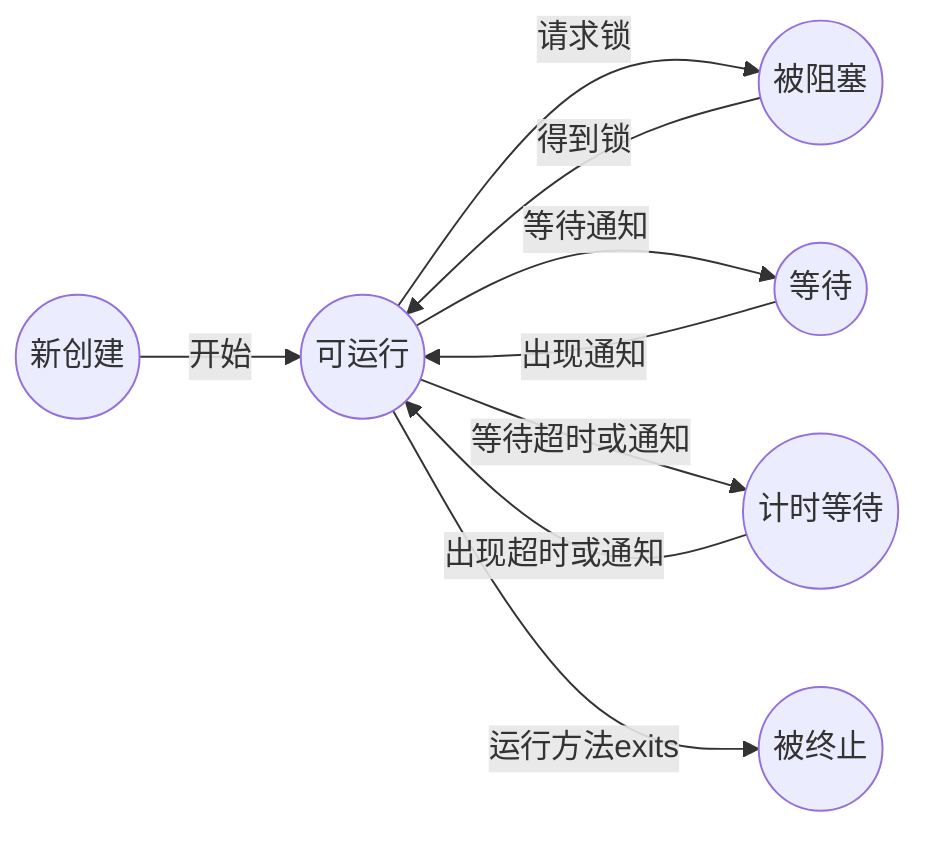

# 第14章 并发

多线程程序在较低的层次上扩展了多任务的概念：一个程序同时执行多个任务。通常，每一个任务称为一个线程（ thread), 它是线程控制的简称。可以同时运行一个以上线程的程序称为多线程程序（multithreaded)。 

## 14.1 什么是线程

sleep 方法可以抛出一个 IntermptedException 异常。 

【API】java.Iang.Thread 1.0：

- `static void sleep(long minis)`
  休眠给定的毫秒数。
  参数： millis 休眠的毫秒数 

### 14.1.1 使用线程给其他任务提供机会

下面是在一个单独的线程中执行一个任务的简单过程：

1 ) 将任务代码移到实现了 Runnable 接口的类的 run 方法中。 

由于 Runnable 是一个函数式接口，可以用 lambda 表达式建立一个实例 

`Runnable r = () -> { task code };`

2 ) 由 Runnable 创建一个 Thread 对象 

`Thread t = new Thread(r); `

3 ) 启动线程 

`t.start();`

*注释： 也可以通过构建一个 Thread 类的子类定义一个线程 。然后， 构造一个子类的对象， 并调用 start 方法。 不过， 这种方法已不再推荐。 应该将要并行运行的任务与运行机制解耦合。如果有很多任务， 要为每个任务创建一个独立的线程所付出的代价太大了。 可以使用线程池来解决这个问题， 有关内容请参看第14.9 节。*

*警告： 不要调用 Thread 类或 Runnable 对象的 run 方法。 直接调用 run 方法， 只会执行同一个线程中的任务， 而不会启动新线程。 应该调用 Thread.start 方法。这个方法将创建一个执行 ran 方法的新线程*

【API】java.Iang.Thread 1.0：

- `ThreadCRunnable target )`
  构造一个新线程， 用于调用给定目标的 run() 方法。
- `void start( )`
  启动这个线程， 将引发调用 run() 方法。这个方法将立即返回， 并且新线程将并发运行。
- `void run( )`
  调用关联 Runnable 的 run 方法。 

【API】java.lang.Runnable 1.0：

- `void run( )`
  必须覆盖这个方法， 并在这个方法中提供所要执行的任务指令。

## 14.2 中断线程

在 Java 的早期版本中， 还有一个 stop方法， 其他线程可以调用它终止线程。但是， 这个方法现在已经被弃用了。 

没有可以强制线程终止的方法。然而， interrupt 方法可以用来请求终止线程。 

要想弄清中断状态是否被置位，首先调用静态的 Thread.currentThread 方法获得当前线程， 然后调用 islnterrupted 方法 

当在一个被阻塞的线程（调用 sleep 或 wait ) 上调用 interrupt 方法时， 阻塞调用将会被Interrupted Exception 异常中断。 

*注释： 有两个非常类似的方法， interrupted 和 islnterrupted。Interrupted 方法是一个静态方法， 它检测当前的线程是否被中断。 而且， 调用 interrupted 方法会清除该线程的中断状态。 另一方面， islnterrupted 方法是一个实例方法， 可用来检验是否有线程被中断。调用这个方法不会改变中断状态。*

【API】java.Iang.Thread 1.0：

- `void interrupts()`
  向线程发送中断请求。线程的中断状态将被设置为 true。如果目前该线程被一个 sleep调用阻塞，那么， InterruptedException 异常被抛出。
- `static boolean interrupted()`
  测试当前线程（即正在执行这一命令的线程）是否被中断。注意，这是一个静态方法。这一调用会产生副作用—它将当前线程的中断状态重置为 false。
- `boolean islnterrupted()`
  测试线程是否被终止。不像静态的中断方法，这一调用不改变线程的中断状态。
- `static Thread currentThread()`
  返回代表当前执行线程的 Thread 对象 

## 14.3 线程状态

线程可以有如下 6 种状态：

- New (新创建）
- Runnable (可运行）
- Blocked (被阻塞）
- Waiting (等待）
- Timed waiting (计时等待）
- Terminated (被终止）

下一节对每一种状态进行解释。
要确定一个线程的当前状态， 可调用 getState 方法。 

### 14.3.1 新创建线程

当用 new 操作符创建一个新线程时， 如 newThread(r)， 该线程还没有开始运行。这意味着它的状态是 new。当一个线程处于新创建状态时， 程序还没有开始运行线程中的代码。在线程运行之前还有一些基础工作要做。 

### 14.3.2 可运行线程

一旦调用 start 方法，线程处于 runnable 状态。 

现在所有的桌面以及服务器操作系统都使用抢占式调度。但是，像手机这样的小型设备可能使用协作式调度。 

记住，在任何给定时刻，二个可运行的线程可能正在运行也可能没有运行（这就是为什么将这个状态称为可运行而不是运行。 

### 14.3.3 被阻塞线程和等待线程

当线程处于被阻塞或等待状态时，它暂时不活动。它不运行任何代码且消耗最少的资源。直到线程调度器重新激活它。 细节取决于它是怎样达到非活动状态的。 

- 当一个线程试图获取一个内部的对象锁（而不是 javiutiUoncurrent 库中的锁，) 而该锁被其他线程持有， 则该线程进人阻塞状态 。当所有其他线程释放该锁，并且线程调度器允许本线程持有它的时候，该线程将变成非阻塞状态 
- 当线程等待另一个线程通知调度器一个条件时， 它自己进入等待状态 
- 有几个方法有一个超时参数。调用它们导致线程进人计时等待（timed waiting) 状态。这一状态将一直保持到超时期满或者接收到适当的通知 




### 14.3.4 被终止的线程

线程因如下两个原因之一而被终止：

- 因为 run 方法正常退出而自然死亡。 
- 因为一个没有捕获的异常终止了 run 方法而意外死亡 

特别是， 可以调用线程的 stop 方法杀死一个线程。 该方法抛出 ThreadDeath 错误对象 ,由此杀死线程。但是，stop 方法已过时， 不要在自己的代码中调用这个方法。 

【API】java.iang.Thread 1.0：

- `void join( )`
  等待终止指定的线程。
- `void join( long millis )`
  等待指定的线程死亡或者经过指定的毫秒数。
- `Thread.State getState ()` 5 . 0
  得到这一线程的状态；NEW、RUNNABLE BLOCKED、 WAITING 、TIMED_WAITNG或 TERMINATED 之一。
- `void stop( )`
  停止该线程。这一方法已过时 
- `void suspend()`
  暂停这一线程的执行。这一方法已过时。
- `void resume()`
  恢复线程。这一方法仅仅在调用 suspend() 之后调用。这一方法已过时 

## 14.4 线程属性

### 14.4.1 线程优先级

可以用 setPriority 方法提高或降低任何一个线程的优先级。 可以将优先级设置为在 MIN_PRIORITY (在 Thread 类中定义为 1 ) 与 MAX_PRIORITY (定义为 10 ) 之间的任何值。NORM_PRIORITY 被定义为 5。 

不要将程序构建为功能的正确性依赖于优先级。 

【API】java.lang.Thread 1.0：

- `void setPriority(int newPriority)`
  设置线程的优先级。优先级必须在 Thread.MIN_PRIORITY 与 Thread.MAX_PRIORITY之间。一般使用 Thread.NORM_PRIORITY 优先级。
- `static int MIN_PRIORITY`
  线程的最小优先级。最小优先级的值为 1。
- `static int NORM_PRIORITY`
  线程的默认优先级。默认优先级为 5。
- `static int MAX_PRIORITY`
  线程的最高优先级。最高优先级的值为 10。
- `static void yield( )`
  导致当前执行线程处于让步状态。如果有其他的可运行线程具有至少与此线程同样高的优先级，那么这些线程接下来会被调度。注意，这是一个静态方法。 

### 14.4.2 守护线程

可以通过调用
`t.setDaemon(true);`
将线程转换为守护线程（daemon thread)。这样一个线程没有什么神奇。守护线程的唯一用途是为其他线程提供服务。 

【API】java.lang.Thread 1.0：

- `void setDaemon( boolean isDaemon )`
  标识该线程为守护线程或用户线程。这一方法必须在线程启动之前调用。 

### 14.4.3 未捕获异常处理器

【API】java.lang.Thread 1.0：

- `static void setDefaultUncaughtExceptionHandler(Thread.UncaughtExceptionHandler handler)` 5.0
- `static Thread.UncaughtExceptionHandler getDefaultUncaughtExceptionHandler()` 5.0
  设置或获取未捕获异常的默认处理器。
- `void setUncaughtExceptionHandler( Thread.UncaughtExceptionHandler handler)` 5.0
- `Thread.UncaughtExceptionHandler getUncaughtExceptionHandler( )` 5.0
  设置或获取未捕获异常的处理器。如果没有安装处理器， 则将线程组对象作为处理器。

【API】java.Iang.Thread.UncaughtExceptionHandler 5.0：

- `void UncaughtException(Thread t, Throwable e)`
  当一个线程因未捕获异常而终止， 按规定要将客户报告记录到日志中。
  参数： t 由于未捕获异常而终止的线程
  e 未捕获的异常对象

【API】java.lang.ThreadGroup 1.0：

- `void UncaughtException( Thread t, Throwable e)`
  如果有父线程组， 调用父线程组的这一方法; 或者， 如果 Thread 类有默认处理器，调用该处理器， 否则， 输出栈轨迹到标准错误流上（但是， 如果 e 是一个 ThreadDeath对象， 栈轨迹是被禁用的。ThreadDeath 对象由 stop方法产生， 而该方法已经过时)。 

## 14.5 同步

### 14.5.1 竞争条件的一个例子

### 14.5.2 竞争条件详解

### 14.5.3 锁对象

有两种机制防止代码块受并发访问的干扰。Java语言提供一个 synchronized 关键字达到这一目的，并且 Java SE 5.0 引入了 ReentrantLock 类。 

*警告： 把解锁操作括在 finally 子句之内是至关重要的。如果在临界区的代码抛出异常，锁必须被释放。 否则， 其他线程将永远阻塞。*

*注释： 如果使用锁， 就不能使用带资源的 try语句。首先， 解锁方法名不是 close。不过，即使将它重命名， 带资源的 try 语句也无法正常工作。它的首部希望声明一个新变量。但是如果使用一个锁， 你可能想使用多个线程共享的那个变量（而不是新变量）。*

锁是可重入的， 因为线程可以重复地获得已经持有的锁。锁保持一个持有计数（ hold count ) 来跟踪对 lock 方法的嵌套调用。 

【API】java.util.concurrent.locks.Lock 5.0：

- `void lock( )`
  获取这个锁；如果锁同时被另一个线程拥有则发生阻塞。
- `void unlock( )`
  释放这个锁。 

【API】java,util.concurrent.locks.ReentrantLock 5.0：

- `ReentrantLock( )`
  构建一个可以被用来保护临界区的可重入锁。
- `ReentrantLock(boolean fair )`
  构建一个带有公平策略的锁。一个公平锁偏爱等待时间最长的线程。但是，这一公平的保证将大大降低性能。所以， 默认情况下， 锁没有被强制为公平的。

*警告： 听起来公平锁更合理一些， 但是使用公平锁比使用常规锁要慢很多。 只有当你确实了解自己要做什么并且对于你要解决的问题有一个特定的理由必须使用公平锁的时候，才可以使用公平锁。 即使使用公平锁， 也无法确保线程调度器是公平的。 如果线程调度器选择忽略一个线程， 而该线程为了这个锁已经等待了很长时间， 那么就没有机会公平
地处理这个锁了。*

### 14.5.4 条件对象

【API】java.util.concurrent.locks.Lock 5.0：

- Condition newCondition( )
  返回一个与该锁相关的条件对象。 

【API】java.util.concurrent.locks.Condition 5.0：

- `void await( )`
  将该线程放到条件的等待集中。
- `void signalAll( )`
  解除该条件的等待集中的所有线程的阻塞状态。
- `void signal ( )`
  从该条件的等待集中随机地选择一个线程， 解除其阻塞状态。

### 14.5.5 synchronized关键字

从 1.0 版开始， Java中的每一个对象都有一个内部锁。 如果一个方法用 synchronized关键字声明，那么对象的锁
将保护整个方法。也就是说，要调用该方法， 线程必须获得内部的对象锁。 

*注释： wait、notifyAll 以及 notify 方法是 Object 类的 final 方法。Condition 方法必须被命名为 await、signalAll 和 signal 以便它们不会与那些方法发生冲突。*

内部锁和条件存在一些局限。包括：

- 不能中断一个正在试图获得锁的线程。
- 试图获得锁时不能设定超时。
- 每个锁仅有单一的条件， 可能是不够的。 

在代码中应该使用哪一种？ Lock 和 Condition 对象还是同步方法？下面是一些建议：

- 最好既不使用 Lock/Condition 也不使用 synchronized 关键字。在许多情况下你可以使
  用 java.util.concurrent 包中的一种机制，它会为你处理所有的加锁。  
- 如果 synchronized 关键字适合你的程序， 那么请尽量使用它，这样可以减少编写的代
  码数量，减少出错的几率。
- 如果特别需要 Lock/Condition 结构提供的独有特性时，才使用 Lock/Condition。 

【API】java.lang.Object 1.0：

- `void notifyAll ( )`
  解除那些在该对象上调用 wait 方法的线程的阻塞状态。该方法只能在同步方法或同步块内部调用。如果当前线程不是对象锁的持有者，该方法拋出一个 IllegalMonitorStateException异常。
- `void notify( )`
  随机选择一个在该对象上调用 wait 方法的线程， 解除其阻塞状态。该方法只能在一个同步方法或同步块中调用。 如果当前线程不是对象锁的持有者， 该方法抛出一个IllegalMonitorStateException 异常。
- `void wait( )`
  导致线程进人等待状态直到它被通知。该方法只能在一个同步方法中调用。 如果当前线程不是对象锁的持有者，该方法拋出一个 IllegalMonitorStateException 异常。
- `void wait(long millis)`
- `void wait(long millis, int nanos )`
  导致线程进入等待状态直到它被通知或者经过指定的时间。这些方法只能在一个同步方法中调用。如果当前线程不是对象锁的持有者该方法拋出一个 IllegalMonitorStateException异常。
  参数： millis 毫秒数
  nanos 纳秒数，<1 000 000 

### 14.5.6 同步阻塞

正如刚刚讨论的， 每一个 Java 对象有一个锁。线程可以通过调用同步方法获得锁。还有另一种机制可以获得锁，通过进入一个同步阻塞。 

有时程序员使用一个对象的锁来实现额外的原子操作， 实际上称为客户端锁定（ clientside locking) 。

如你所见， 客户端锁定是非常脆弱的，通常不推荐使用。 

### 14.5.7 监视器概念

锁和条件是线程同步的强大工具，但是，严格地讲，它们不是面向对象的。多年来，研究人员努力寻找一种方法，可以在不需要程序员考虑如何加锁的情况下，就可以保证多线程的安全性。最成功的解决方案之一是监视器（monitor), 这一概念最早是由 Per Brinch Hansen和 Tony Hoare 在 20 世纪 70 年代提出的。用 Java 的术语来讲， 监视器具有如下特性：

- 监视器是只包含私有域的类。
- 每个监视器类的对象有一个相关的锁。
- 使用该锁对所有的方法进行加锁。换句话说，如果客户端调用 obj.method(), 那么 obj对象的锁是在方法调用开始时自动获得， 并且当方法返回时自动释放该锁。因为所有的域是私有的，这样的安排可以确保一个线程在对对象操作时， 没有其他线程能访问该域。
- 该锁可以有任意多个相关条件。 

Java 设计者以不是很精确的方式采用了监视器概念， Java 中的每一个对象有一个内部的锁和内部的条件。 如果一个方法用 synchronized 关键字声明，那么，它表现的就像是一个监视器方法。通过调用 wait/notifyAU/notify 来访问条件变量。

然而， 在下述的 3 个方面 Java 对象不同于监视器， 从而使得线程的安全性下降：

- 域不要求必须是 private。
- 方法不要求必须是 synchronized。
- 内部锁对客户是可用的。 

这种对安全性的轻视激怒了 Per Brinch Hansen。 他在一次对原始 Java 中的多线程的严厉评论中， 写道：“ 这实在是令我震惊，在监视器和并发 Pascal 出现四分之一个世纪后，Java的这种不安全的并行机制被编程社区接受。这没有任何益处。” 

### 14.5.8 Volatile域

遗憾的是， 使用现代的处理器与编译器， 出错的可能性很大。

- 多处理器的计算机能够暂时在寄存器或本地内存缓冲区中保存内存中的值。结果是，运行在不同处理器上的线程可能在同一个内存位置取到不同的值。
- 编译器可以改变指令执行的顺序以使吞吐量最大化。这种顺序上的变化不会改变代码语义，但是编译器假定内存的值仅仅在代码中有显式的修改指令时才会改变。然而，内存的值可以被另一个线程改变！ 

*注释： Brian Goetz 给出了下述 “ 同步格言”： “ 如果向一个变量写入值， 而这个变量接下来可能会被另一个线程读取， 或者， 从一个变量读值， 而这个变量可能是之前被另一个线程写入的， 此时必须使用同步”。*

volatile 关键字为实例域的同步访问提供了一种免锁机制。如果声明一个域为 volatile ,那么编译器和虚拟机就知道该域是可能被另一个线程并发更新的。 

### 14.5.9 final变量

### 14.5.10 原子性

假设对共享变量除了赋值之外并不完成其他操作，那么可以将这些共享变量声明为volatile。

java.util.concurrent.atomic 包中有很多类使用了很高效的机器级指令（而不是使用锁）来保证其他操作的原子性。 例如， Atomiclnteger 类提供了方法 incrementAndGet 和decrementAndGet, 它们分别以原子方式将一个整数自增或自减。 

有很多方法可以以原子方式设置和增减值， 不过， 如果希望完成更复杂的更新，就必须使用 compareAndSet 方法。 

在 Java SE 8 中，不再需要编写这样的循环样板代码。实际上， 可以提供一个 lambda 表达式更新变量，它会为你完成更新。 

accumulateAndGet 方法利用一个二元操作符来合并原子值和所提供的参数。 

还有 getAndUpdate 和 getAndAccumulate 方法可以返回原值 。

*注释： 类 Atomiclnteger、AtomicIntegerArray、AtomicIntegerFieldUpdater、AtomicLongArray、AtomicLongFieldUpdater、AtomicReference、 AtomicReferenceArray 和 AtomicReferenceFieldUpdater 也提供了这些方法。*

如果有大量线程要访问相同的原子值， 性能会大幅下降， 因为乐观更新需要太多次重试。 Java SE 8 提供了 LongAdder 和 LongAccumulator 类来解决这个问题。LongAdder 包括多个变量（加数，) 其总和为当前值。 

如果认为可能存在大量竞争， 只需要使用 LongAdder 而不是 AtomicLong。方法名稍有区别。调用 increment 让计数器自增，或者调用 add 来增加一个量， 或者调用 sum 来获取总和。 

另外 DoubleAdder 和 DoubleAccumulator 也采用同样的方式， 只不过处理的是 double 值。 

### 14.5.11 死锁

### 14.5.12 线程局部变量

【API】java.lang.ThreadLocal\<T>：

- `T get( )`
  得到这个线程的当前值。如果是首次调用 get, 会调用 initialize 来得到这个值。
- `protected initialize( )`
  应覆盖这个方法来提供一个初始值。默认情况下，这个方法返回 mill。
- `void set( T t)`
  为这个线程设置一个新值。
- `void remove( )`
  删除对应这个线程的值。
- `static <S> ThreadLocal <S> withlnitial ( Supplier < ? extends S> supplier)` 8
  创建一个线程局部变量， 其初始值通过调用给定的 supplier 生成。 

【API】java.util.concurrent.ThreadLocalRandom 7：

- `static ThreadLocalRandom current( )`
  返回特定于当前线程的 Random 类实例。 

### 14.5.13 锁测试和锁超时

tryLock 方法试图申请一个锁， 在成功获得锁后返回 true, 否则， 立即返回false, 而且线程可以立即离开去做其他事情。 

然而， 如果调用带有用超时参数的 tryLock, 那么如果线程在等待期间被中断，将抛出InterruptedException 异常。这是一个非常有用的特性，因为允许程序打破死锁。 

也可以调用 locklnterruptibly 方法。它就相当于一个超时设为无限的 tryLock 方法。 

【API】java.util.concurrent.locks.Lock 5.0：

- `boolean tryLock()`
  尝试获得锁而没有发生阻塞；如果成功返回真。这个方法会抢夺可用的锁， 即使该锁有公平加锁策略， 即便其他线程已经等待很久也是如此。
- `boolean tryLock(long time, TimeUnit unit)`
  尝试获得锁，阻塞时间不会超过给定的值；如果成功返回 true 。
- `void lockInterruptibly()`
  获得锁， 但是会不确定地发生阻塞。 如果线程被中断， 抛出一个 InterruptedException异常。 

【API】java.util.concurrent.locks.Condition 5.0：

- `boolean await( long time , TimeUnit unit )`
  进入该条件的等待集， 直到线程从等待集中移出或等待了指定的时间之后才解除阻塞。 如果因为等待时间到了而返回就返回 false , 否 则 返 回 true。
- `void awaitUninterruptibly()`
  进入该条件的等待集， 直到线程从等待集移出才解除阻塞。 如果线程被中断， 该方法不会抛出 InterruptedException 异常 

### 14.5.14 读/写锁

下面是使用读 / 写锁的必要步骤：

1 ) 构造一个 ReentrantReadWriteLock 对象： 

`private ReentrantReadWriteLock rwl = new ReentrantReadWriteLock();`

2 ) 抽取读锁和写锁：

`private Lock readLock = rwl.readLock() ;`
`private Lock writeLock = rwl.writeLock();`

3 ) 对所有的获取方法加读锁：

```java
public double getTotalBalance()
{
	readLock.lock();
	try { . . . }
	finally { readLock.unlock() ; }
} 
```

4) 对所有的修改方法加写锁：

```java
public void transfer(. . .)
{
	writeLock.lock();
	try { . . . }
	finally { writeLock.unlock(); }
} 
```

【API】java.util.concurrent.locks.ReentrantReadWriteLock 5.0：

- `Lock readLock( )`
  得到一个可以被多个读操作共用的读锁， 但会排斥所有写操作。
- `Lock writeLock( )`
  得到一个写锁， 排斥所有其他的读操作和写操作。 

### 14.5.15 为什么弃用stop和suspend方法

stop、 suspend 和 resume 方法已经弃用。stop 方法天生就不安全，经验证明 suspend 方法会经常导致死锁。 

## 14.6 阻塞队列

当试图向队列添加元素而队列已满， 或是想从队列移出元素而队列为空的时候，**阻塞队列（blocking queue )** 导致线程阻塞。在协调多个线程之间的合作时， 阻塞队列是一个有用的工具。工作者线程可以周期性地将中间结果存储在阻塞队列中。其他的工作者线程移出中间结果并进一步加以修改。队列会自动地平衡负载。 

阻塞队列方法分为以下 3 类， 这取决于当队列满或空时它们的响应方式。如果将队列当作线程管理工具来使用， 将要用到 put 和 take 方法。当试图向满的队列中添加或从空的队列中移出元素时，add、 remove 和 element 操作抛出异常。当然，在一个多线程程序中， 队列会在任何时候空或满， 因此，一定要使用 offer、 poll 和 peek方法作为替代。这些方法如果不能完成任务，只是给出一个错误提示而不会抛出异常。 

*注释： poll和 peek 方法返回空来指示失败。因此，向这些队列中插入 null 值是非法的。*

java.util.concurrent 包提供了阻塞队列的几个变种。 默认情况下， LinkedBlockingQueue的容量是没有上边界的，但是，也可以选择指定最大容量。LinkedBlockingDeque 是一个双端的版本。ArrayBlockingQueue 在构造时需要指定容量，并且有一个可选的参数来指定是否需要公平性。若设置了公平参数， 则那么等待了最长时间的线程会优先得到处理。通常，公平性会降低性能，只有在确实非常需要时才使用它。 

PriorityBlockingQueue 是一个带优先级的队列， 而不是先进先出队列。元素按照它们的优先级顺序被移出。该队列是没有容量上限，但是，如果队列是空的， 取元素的操作会阻塞。（有关优先级队列的详细内容参看第 9 章。） 

最后， DelayQueue 包含实现 Delayed 接口的对象 

getDelay方法返回对象的残留延迟。 负值表示延迟已经结束。元素只有在延迟用完的情况下才能从 DelayQueue 移除。还必须实现 compareTo 方法。DelayQueue 使用该方法对元素进行排序 

JavaSE 7增加了一个 TransferQueue 接口，允许生产者线程等待， 直到消费者准备就绪可以接收一个元素。 

【API】java.util.concurrent.ArrayBlockingQueue\<E> 5.0：

- `ArrayBlockingQueue( int capacity)`
- `ArrayBlockingQueue(int capacity, boolean fair )`
  构造一个带有指定的容量和公平性设置的阻塞队列。该队列用循环数组实现。

【API】java,util.concurrent.LinkedBlockingQueue\<E> 5.0：

【API】java.util.concurrent.LinkedBlockingDeque\<E> 6：

- `LinkedBlockingQueue( )`
- `LinkedBlockingDeque( )`
  构造一个无上限的阻塞队列或双向队列，用链表实现。
- `LinkedBlockingQueue(int capacity )`
- `LinkedBlockingDeque(int capacity )`
  根据指定容量构建一个有限的阻塞队列或双向队列，用链表实现。

【API】 java.util.concurrent.DelayQueue\<E extends Delayed> 5.0：

- `DelayQueue( )`
  构造一个包含 Delayed 元素的无界的阻塞时间有限的阻塞队列。只有那些延迟已经超过时间的元素可以从队列中移出。

【API】 java.util.concurrent.Delayed 5.0：

- `long getDelay( TimeUnit unit )`
  得到该对象的延迟，用给定的时间单位进行度量。

【API】java.util.concurrent.PriorityBlockingQueue\<E> 5.0：

- `PriorityBlockingQueue( )`
- `PriorityBlockingQueiie(int initialCapacity)`
- `PriorityBlockingQueue( int initialCapacity, Comparator <? super E> comparator )`
  构造一个无边界阻塞优先队列，用堆实现。
  参数： initialCapacity 优先队列的初始容量。默认值是 11。
  comparator 用来对元素进行比较的比较器， 如果没有指定， 则元素必须实现 Comparable 接口。 

【API】java.util.concurrent.BlockingQueue\<E> 5.0：

- `void put( E element )`
  添加元素， 在必要时阻塞
- `E take( )`
  移除并返回头元素， 必要时阻塞。
- `boolean offer( E element , long time , TimeUnit unit )`
  添加给定的元素， 如果成功返回 true， 如果必要时阻塞， 直至元素已经被添加或超时。
- `E poll ( long time , TimeUnit unit )`
  移除并返回头元素， 必要时阻塞， 直至元素可用或超时用完。失败时返回 null。

【API】java.util.concurrent.BiockingDeque\<E> 6：

- `void putFirst( E element )`
- `void putLast( E element )`
  添加元素， 必要时阻塞。
- `E takeFirst( )`
- `E takeLast( )`
  移除并返回头元素或尾元素， 必要时阻塞。
- `boolean offerFirst( E element , long time, TimeUnit unit )`
- `boolean offerLast( E element , long time , TimeUnit unit )`
  添加给定的元素， 成功时返回 true， 必要时阻塞直至元素被添加或超时。
- `E pollFirst( long time , TimeUnit unit )`
- `E pollLast( long time , TimeUnit unit )`
  移动并返回头元素或尾元素，必要时阻塞， 直至元素可用或超时。失败时返回 null。

【API】 java.util.concurrent.TransferQueue\<E> 7：

- `void transfer( E element )`
- `boolean tryTransfer( E element , long time , TimeUnit unit )`
  传输一个值， 或者尝试在给定的超时时间内传输这个值， 这个调用将阻塞，直到另一个线程将元素删除。第二个方法会在调用成功时返回 true。 

## 14.7 线程安全的集合

当然，前一节讨论的阻塞队列就是线程安全的集合。在下面各小节中， 将讨论 Java 类库提供的另外一些线程安全的集合。 

### 14.7.1 高效的映射、集和队列

java.util.concurrent 包提供了映射、 有序集和队列的高效实现： ConcurrentHashMap、ConcurrentSkipListMap > ConcurrentSkipListSet 和 ConcurrentLinkedQueue。 

*注释： 有些应用使用庞大的并发散列映射，这些映射太过庞大， 以至于无法用 size 方法得到它的大小， 因为这个方法只能返回 int。对于一个包含超过 20 亿条目的映射该如何处理？ JavaSE 8 引入了一个 mappingCount 方法可以把大小作为 long 返回。*

集合返回弱一致性（weakly consistent) 的迭代器。 这意味着迭代器不一定能反映出它们被构造之后的所有的修改，但是，它们不会将同一个值返回两次，也不会拋出 ConcurrentModificationException 异常。 

并发的散列映射表， 可高效地支持大量的读者和一定数量的写者。==默认情况下， 假定可以有多达 16 个写者线程同时执行==。可以有更多的写者线程，但是， ==如果同一时间多于 16个，其他线程将暂时被阻塞==。可以指定更大数目的构造器，然而， 恐怕没有这种必要。 

*注释：在 JavaSE 8 中，并发散列映射将桶组织为树， 而不是列表， 键类型实现了 Comparable, 从而可以保证性能为 O(log（n）)*

【API】java.util.concurrent.ConcurrentLinkedQueue\<E> 5.0：

- `ConcurrentLinkedQueue<E>()`
  构造一个可以被多线程安全访问的无边界非阻塞的队列。

【API】 java.util.concurrent.ConcurrentLinkedQueue\<E> 6：

- `ConcurrentSkipListSet<E>()`
- `ConcurrentSkipListSet<E>(Comparator<? super E> comp)`
  构造一个可以被多线程安全访问的有序集。第一个构造器要求元素实现 Comparable接口。 

【API】java.util.concurrent.ConcurrentHashMap\<K,V> 5.0 :

【API】java.util.concurrent.ConcurrentSkipListMap\<K,V> 6 :

- `ConcurrentHashMap<K, V>() `
- `ConcurrentHashMap<K, V>(int initialCapacity) `
- `ConcurrentHashMap<K, V>(int initialCapacity, float loadFactor, int concurrencyLevel)`
  构造一个可以被多线程安全访问的散列映射表。 
  参数：initialCapacity 集合的初始容量。默认值为16.
  loadFactor 控制调整：如果每个桶的平均负载超过这个因子，表的大小会被重新调整。默认值为0.75。
  concurrencyLevel 并发写者线程的估计数目。
- `ConcurrentSkipListMap<K, V>()`
- `ConcurrentSkipListSet<K, V>(Comparator<? super K> comp)`
  构造一个可以被多线程安全访问的有序的映像表。 第一个构造器要求键实现Comparable 接口 。

### 14.7.2 映射条目的原子更新

*注释： 有些程序员很奇怪为什么原本线程安全的数据结构会允许非线程安全的操作。不过有两种完全不同的情况。如果多个线程修改一个普通的 HashMap， 它们会破坏内部结构 （一个链表数组）。 有些链接可能丢失， 或者甚至会构成循环，使得这个数据结构不再可用。对于 ConcurrentHashMap 绝对不会发生这种情况。在上面的例子中，get 和 put 代码不会破坏数据结构。 不过， 由于操作序列不是原子的， 所以结果不可预知。*

传统的做法是使用 replace 操作， 它会以原子方式用一个新值替换原值，前提是之前没有其他线程把原值替换为其他值。必须一直这么做， 直到 replace 成功 

或者， 可以使用一个 ConcurrentHashMap\<String，AtomicLong>， 或者在 Java SE 8 中，还可以使用 ConcurrentHashMap\<String ，LongAdder> 

Java SE 8 提供了一些可以更方便地完成原子更新的方法。调用 compute 方法时可以提供一个键和一个计算新值的函数。这个函数接收键和相关联的值（如果没有值，则为 null), 它会计算新值。 

另外还有 computelfPresent 和 computelf bsent 方法，它们分别只在已经有原值的情况下计算新值，或者只有没有原值的情况下计算新值。 

首次增加一个键时通常需要做些特殊的处理。利用 merge 方法可以非常方便地做到这一点。这个方法有一个参数表示键不存在时使用的初始值。否则， 就会调用你提供的函数来结合原值与初始值。（与 compute 不同，这个函数不处理键。） 

### 14.7.3 对并发散列映射的批操作

Java SE 8 为并发散列映射提供了批操作，即使有其他线程在处理映射，这些操作也能安全地执行。批操作会遍历映射，处理遍历过程中找到的元素。无须冻结当前映射的快照。 

有 3 种不同的操作：

- 搜索（search) 为每个键或值提供一个函数，直到函数生成一个非 null 的结果。然后搜索终止，返回这个函数的结果。
- 归约（reduce) 组合所有键或值， 这里要使用所提供的一个累加函数。
- forEach 为所有键或值提供一个函数。

每个操作都有 4 个版本：

- operationKeys : 处理键。
- operatioriValues : 处理值。
- operation: 处理键和值。
- operatioriEntries: 处理 Map.Entry 对象。 

### 14.7.4 并发集视图

静态 newKeySet 方法会生成一个 Set\<K>, 这实际上是 ConcurrentHashMap<K, Boolean>的一个包装器。（所有映射值都为 Boolean.TRUE, 不过因为只是要把它用作一个集，所以并不关心具体的值。） 

### 14.7.5 写数组的拷贝

CopyOnWriteArrayList 和 CopyOnWriteArraySet 是线程安全的集合， 其中所有的修改线程对底层数组进行复制。 

### 14.7.6 并行数组算法

在 Java SE 8中， Arrays 类提供了大量并行化操作。 静态 Arrays.parallelSort 方法可以对一个基本类型值或对象的数组排序。 

最后还有一个 parallelPrefix 方法，它会用对应一个给定结合操作的前缀的累加结果替换各个数组元素。 

### 14.7.7 较早的线程安全集合

从 Java 的初始版本开始， Vector 和 Hashtable 类就提供了线程安全的动态数组和散列表的实现。 现在这些类被弃用了， 取而代之的是 AnayList 和 HashMap 类。这些类不是线程安全的，而集合库中提供了不同的机制。任何集合类都可以通过使用同步包装器（synchronization wrapper) 变成线程安全的 。

最好使用 java.util.Concurrent 包中定义的集合， 不使用同步包装器中的。 	有一个例外是经常被修改的数组列表。在那种情况下，同步的 ArrayList 可以胜过 CopyOnWriteArrayList 。

【API】java.util.CoIlections 1.2：

- `static <E> Collect1 on<E> synchronizedCollection(Collection<E> c)`
- `static <E> List synchronizedList(List<E> c)`
- `static <E> Set synchronizedSet(Set<E> c)`
- `static <E> SortedSet synchronizedSortedSet(SortedSet <E> c)`
- `static <K, V> Map<K, V> synchronizedMap(Map<K, V> c)`
- `static <K, V> SortedMap<K, V> synchronizedSortedMap(SortedMap<K, V> c)`
  构建集合视图， 该集合的方法是同步的。 

## 14.8 Callable与Future

Runnable 封装一个异步运行的任务，可以把它想象成为一个没有参数和返回值的异步方法。Callable 与 Runnable 类似， 但是有返回值。Callable 接口是一个参数化的类型， 只有一个方法 call。 

类型参数是返回值的类型。 

Future 保存异步计算的结果。可以启动一个计算，将 Future 对象交给某个线程，然后忘掉它。 Future 对象的所有者在结果计算好之后就可以获得它。 

FutureTask 包装器是一种非常便利的机制， 可将 Callable转换成 Future 和 Runnable, 它同时实现二者的接口。 

【API】java.util.concurrent.Callable\<V> 5.0：

- `V call()`
  运行一个将产生结果的任务。

【API】 java.util.concurrent.Future\<V> 5.0：

- `V get()`
- `V get(long time, TimeUnit unit)`
  获取结果， 如果没有结果可用， 则阻塞直到真正得到结果超过指定的时间为止。 如果不成功， 第二个方法会拋出 TimeoutException 异常。
- `boolean cancel(boolean mayInterrupt)`
  尝试取消这一任务的运行。 如果任务已经开始， 并且 maylnterrupt 参数值为 true， 它就会被中断。 如果成功执行了取消操作， 返回 true。 
- `boolean isCancelled()`
  如果任务在完成前被取消了， 则返回 true。
- `boolean isDone()`
  如果任务结束，无论是正常结束、 中途取消或发生异常， 都返回 true。

【API】java.util.concurrent.FutureTask\<V> 5.0：

- `FutureTask(Callable< V > task)`
- `FutureTask(Runnable task, V result)`
  构造一个既是 Future\<V> 又是 Runnable 的对象。 

## 14.9 执行器

构建一个新的线程是有一定代价的， 因为涉及与操作系统的交互。如果程序中创建了大量的生命期很短的线程，应该使用线程池（thread pool )。一个线程池中包含许多准备运行的空闲线程。 将 Runnable 对象交给线程池， 就会有一个线程调用 run 方法。 当 run 方法退出时， 线程不会死亡，而是在池中准备为下一个请求提供服务。 

另一个使用线程池的理由是减少并发线程的数目。创建大量线程会大大降低性能甚至使虚拟机崩溃。 如果有一个会创建许多线程的算法， 应该使用一个线程数“ 固定的” 线程池以限制并发线程的总数。 

执行器 （ Executor) 类有许多静态工厂方法用来构建线程池。

### 14.9.1 线程池

newCachedThreadPool方法构建了一个线程池， 对于每个任务， 如果有空闲线程可用， 立即让它执行任务， 如果没有可用的空闲线程， 则创建一个新线程。
newFixedThreadPool 方法构建一个具有固定大小的线程池。 如果提交的任务数多于空闲的线程数， 那么把得不到服务的任务放置到队列中。当其他任务完成以后再运行它们。
newSingleThreadExecutor 是一个退化了的 大小为 1 的线程池： 由一个线程执行提交的任务， 一个接着一个。
这 3 个方法返回实现了ExecutorService 接口的 ThreadPoolExecutor 类的对象。 

当用完一个线程池的时候， 调用 shutdown。该方法启动该池的关闭序列。被关闭的执行器不再接受新的任务。当所有任务都完成以后，线程池中的线程死亡。另一种方法是调用shutdownNow。该池取消尚未开始的所有任务并试图中断正在运行的线程。

下面总结了在使用连接池时应该做的事：

1 ) 调用 Executors 类中静态的方法 newCachedThreadPool 或 newFixedThreadPool。

2 ) 调用 submit 提交 Runnable 或 Callable 对象。

3 ) 如果想要取消一个任务， 或如果提交 Callable 对象， 那就要保存好返回的 Future对象。

4 ) 当不再提交任何任务时，调用 shutdown。 

【API】java.util.concurrent.Executors：

- `ExecutorService newCachedThreadPool()`
  返回一个带缓存的线程池， 该池在必要的时候创建线程， 在线程空闲 60 秒之后终止线程。
- `ExecutorService newFixedThreadPool(int threads)`
  返回一个线程池， 该池中的线程数由参数指定。
- `ExecutorService newSingleThreadExecutor()`
  返回一个执行器， 它在一个单个的线程中依次执行各个任务。

【API】 java.util.concurrent.ExecutorService 5.0：

- `Future<T > submit(Callable<T> task)`
- `Future< T > submit(Runnable task, T result)`
- `Future<?> submit(Runnable task)`
  提交指定的任务去执行。
- `void shutdown()`
  关闭服务， 会先完成已经提交的任务而不再接收新的任务。

【API】java.util.concurrent.ThreadPoolExecutor 5.0：

- `int getLargestPoolSize()`
  返回线程池在该执行器生命周期中的最大尺寸。 

### 14.9.2 预定执行

ScheduledExecutorService 接口具有为预定执行（ Scheduled Execution ) 或重复执行任务而设计的方法。 

【API】java.util.concurrent.Executors 5.0：

- `ScheduledExecutorService newScheduledThreadPool(int threads)`
  返回一个线程池， 它使用给定的线程数来调度任务。 
- `ScheduledExecutorService newSingleThreadScheduledExecutor( )`
  返回一个执行器， 它在一个单独线程中调度任务。

【API】java.util.concurrent.ScheduledExecutorService 5.0：

- `ScheduledFuture<V> schedule(Cal 1able<V> task , long time, Timellnit unit)`
- `ScheduledFuture<?> schedule(Runnable task , long time , TimeUnit unit )`
  预定在指定的时间之后执行任务。
- `ScheduledFuture< ? > scheduleAtFixedRate ( Runnable task , long initialDelay , long period, TimeUnit unit )`
  预定在初始的延迟结束后， 周期性地运行给定的任务， 周期长度是 period。
- `ScheduledFuture< ?> scheduleWithFixedDelay( Runnable task , long initialDelay , long delay, TimeUnit unit )`
  预定在初始的延迟结束后周期性地运行给定的任务， 在一次调用完成和下一次调用开始之间有长度为 delay 的延迟。 

### 14.9.3 控制任务组

invokeAny 方法提交所有对象到一个 Callable 对象的集合中， 并返回某个已经完成了的任务的结果。 

invokeAll 方法提交所有对象到一个 Callable 对象的集合中，并返回一个 Future 对象的列表，代表所有任务的解决方案。 

【API】java.util.concurrent.ExecutorService 5.0 :

- `T invokeAny( Collection<Callable<T>> tasks )`
- `T invokeAny(Collection<Callable<T>> tasks , long timeout , TimeUnit unit )`
  执行给定的任务， 返回其中一个任务的结果。第二个方法若发生超时， 抛出一个Timeout Exception异常。
- `List<Future<T>> invokeAll ( Collection<Callable<T>> tasks )`
- `List <Future< T > > invokeAll ( Collection<Callabl e<T > > tasks , long timeout, TimeUnit unit)`
  执行给定的任务，返回所有任务的结果。第二个方法若发生超时，抛出一个Timeout Exception异常。

【API】java.util.concurrent.ExecutorCompletionService\<V>5.0：

- `ExecutorCompletionService( Executor e )`
  构建一个执行器完成服务来收集给定执行器的结果。
- `Future< V> submit( Callable< V > task )`
- `Future< V > submit( Runnable task , V result )`
  提交一个任务给底层的执行器。
- `Future< V > take( )`
  移除下一个已完成的结果， 如果没有任何已完成的结果可用则阻塞。
- `Future< V > poll( )`
- `Future< V > poll( long time , TimeUnit unit )`
  移除下一个已完成的结果， 如果没有任何已完成结果可用则返回 null。 第二个方法将等待给定的时间。 

### 14.9.4 Fork-Join框架

有些应用使用了大量线程， 但其中大多数都是空闲的。举例来说， 一个 Web 服务器可能会为每个连接分别使用一个线程。另外一些应用可能对每个处理器内核分别使用一个线程，来完成计算密集型任务， 如图像或视频处理。 Java SE 7 中新引入了 fork-join 框架，专门用来支持后一类应用。 

在后台， fork-join 框架使用了一种有效的智能方法来平衡可用线程的工作负载，这种方法称为工作密取（work stealing)。每个工作线程都有一个双端队列 ( deque ) 来完成任务。 

### 14.9.5 可完成Future

Java SE 8 的 CompletableFuture 类提供了一种候选方法。 与事件处理器不同，“ 可完成future" 可以“ 组合”（composed ) 。

## 14.10 同步器

java.util.concurrent 包包含了几个能帮助人们管理相互合作的线程集的类 。这些机制具有为线程之间的共用集结点模式（common rendezvous patterns) 提供的“ 预置功能”( canned functionality ) 。 如果有一个相互合作的线程集满足这些行为模式之一， 那么应该直接重用合适的库类而不要试图提供手工的锁与条件的集合。 

### 14.10.1 信号量

概念上讲，一个信号量管理许多的许可证（permit)。 为了通过信号量，线程通过调用acquire 请求许可。其实没有实际的许可对象， 信号量仅维护一个计数。许可的数目是固定的， 由此限制了通过的线程数量。其他线程可以通过调用 release 释放许可。而且，许可不是必须由获取它的线程释放。事实上，任何线程都可以释放任意数目的许可，这可能会增加许可数目以至于超出初始数目。
信号量在 1968 年由 Edsger Dijkstra 发明， 作为同步原语（ synchronization primitive ) 。Dijkstra 指出信号量可以被有效地实现， 并且有足够的能力解决许多常见的线程同步问题。在几乎任何一本操作系统教科书中， 都能看到使用信号量实现的有界队列 

### 14.10.2 倒计时门栓

一个倒计时门栓（ CountDownLatch) 让一个线程集等待直到计数变为 0。倒计时门栓是一次性的。一旦计数为 0, 就不能再重用了。 

### 14.10.3 障栅

CyclicBarrier 类实现了一个集结点（ rendezvous) 称为障栅（ barrier)。考虑大量线程运行在一次计算的不同部分的情形。当所有部分都准备好时，需要把结果组合在一起。当一个线程完成了它的那部分任务后， 我们让它运行到障栅处。一旦所有的线程都到达了这个障栅，障栅就撤销， 线程就可以继续运行。 

### 14.10.4 交换器

当两个线程在同一个数据缓冲区的两个实例上工作的时候， 就可以使用交换器( Exchanger) 典型的情况是， 一个线程向缓冲区填人数据， 另一个线程消耗这些数据。当它们都完成以后，相互交换缓冲区 

### 14.10.5 同步队列

同步队列是一种将生产者与消费者线程配对的机制。当一个线程调用 SynchronousQueue的 put 方法时，它会阻塞直到另一个线程调用 take 方法为止， 反之亦然。 与 Exchanger 的情况不同， 数据仅仅沿一个方向传递，从生产者到消费者。 

## 14.11 线程与Swing

### 14.11.1 运行耗时的任务

将线程与 Swing—起使用时， 必须遵循两个简单的原则 。

( 1 ) 如果一个动作需要花费很长时间，在一个独立的工作器线程中做这件事不要在事件分配线程中做。

( 2 ) 除了事件分配线程，不要在任何线程中接触 Swing 组件。 

第二条规则在 Swing 编程中通常称为单一线程规则 （ single-thread rule)。 

【API】java.awt. EventQueue 1.1：

- `static void invokeLater(Runnable runnable)` 1.2
  在待处理的线程被处理之后，让 runnable 对象的 run 方法在事件分配线程中执行。
- `static void invokeAndWait(Runnable runnable)` 1.2
  在待处理的线程被处理之后，让 runnable 对象的 run方法在事件分配线程中执行。该调用会阻塞， 直到 run 方法终止。
- `static boolean isDispatchThread()` 1.2
  如果执行这一方法的线程是事件分配线程， 返固 true。 

### 14.11.2 使用Swing工作线程

【API】javax.swing.SwingWorker<T, V> 6：

- `abstract T doInBackground( )`
  覆盖这一方法来执行后台的任务并返回这一工作的结果。
- `void process(List<V> data)`
  覆盖这一方法来处理事件分配线程中的中间进度数据。
- `void publish( V... data)`
  传递中间进度数据到事件分配线程。从 doInBackground 调用这一方法。
- `void execute( )`
  为工作器线程的执行预定这个工作器。
- `SwingWorker.StateValue getState( )`
  得到这个工作器线程的状态， 值为 PENDING、 STARTED 或 DONE 之一。 

### 14.11.3 单一线程规则

对于单一线程规则存在一些例外情况。 

- 可在任一个线程里添加或移除事件监听器。 当然该监听器的方法会在事件分配线程中被触发。
- 只有很少的 Swing 方法是线程安全的。在 API 文档中用这样的句子特别标明：“ 尽管大多数 Swing 方法不是线程安全的， 但这个方法是。” 在这些线程安全的方法中最有用的是：
  JTextComponent.setText
  JTextArea.insert
  JTextArea.append
  JTextArea.replaceRange
  JCouponent.repaint
  JComponent.revalidate 

