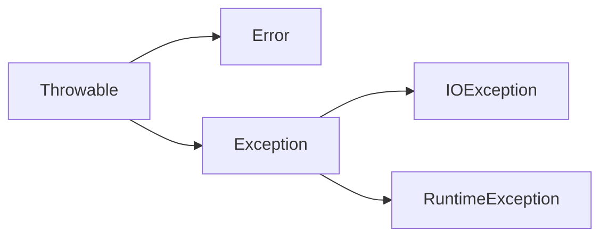

# 第7章 异常、断言和日志

对于异常情况， 例如， 可能造成程序崩溃的错误输入， Java 使用一种称为**异常处理( exception handing)** 的错误捕获机制处理。  

## 7.1 处理错误

如果由于出现错误而使得某些操作没有完成， 程序应该：

- 返回到一种安全状态，并能够让用户执行一些其他的命令；或者
- 允许用户保存所有操作的结果，并以妥善的方式终止程序 

要做到这些并不是一件很容易的事情。其原因是检测（或引发）错误条件的代码通常离那些能够让数据恢复到安全状态， 或者能够保存用户的操作结果， 并正常地退出程序的代码很远。异常处理的任务就是将控制权从错误产生的地方转移给能够处理这种情况的错误处理器。 

1. 用户输入错误
2. 设备错误
3. 物理限制
4. 代码错误

在 Java 中， 如果某个方法不能够采用正常的途径完整它的任务，就可以通过另外一个路径退出方法。在这种情况下，方法并不返回任何值， 而是抛出( throw) 一个封装了错误信息的对象。需要注意的是，这个方法将会立刻退出，并不返回任何值。 此外， 调用这个方法的代码也将无法继续执行，取而代之的是， 异常处理机制开始搜索能够处理这种异常状况的异常处理器 （exception handler )。 

### 7.1.1 异常分类

在 Java 程序设计语言中， 异常对象都是派生于 Throwable 类的一个实例。 



Error 类层次结构描述了 Java 运行时系统的内部错误和资源耗尽错误。 应用程序不应该抛出这种类型的对象。 如果出现了这样的内部错误， 除了通告给用户，并尽力使程序安全地终止之外， 再也无能为力了。 

在设计 Java 程序时， 需要关注 Exception 层次结构。 这个层次结构又分解为两个分支：一个分支派生于 RuntimeException ; 另一个分支包含其他异常。划分两个分支的规则是： 由程序错误导致的异常属于 RuntimeException ; 而程序本身没有问题， 但由于像 I/O 错误这类问题导致的异常属于其他异常: 

派生于 RuntimeException 的异常包含下面几种情况：

- 错误的类型转换。
- 数组访问越界 。
- 访问 null 指针。

不是派生于 RuntimeException 的异常包括：

- 试图在文件尾部后面读取数据。
- 试图打开一个不存在的文件。
- 试图根据给定的字符串查找 Class 对象， 而这个字符串表示的类并不存在 。

Java 语 言 规 范 将 派 生 于 Error 类 或 RuntimeException 类的所有异常称为**非受查( unchecked ) 异常**， 所有其他的异常称为**受查（ checked) 异常**。这是两个很有用的术语，在后面还会用到。 编译器将核查是否为所有的受査异常提供了异常处理器。 

*注释： RuntimeException 这个名字很容易让人混淆。 实际上， 现在讨论的所有错误都发生在运行时。*

*C++ 注释：如果熟悉标准 C++ 类库中的异常层次结构， 就一定会感到有些困惑。 C++ 有两个基本的异常类， 一个是 runtime_error ; 另一个是 logic_error。 logic_error 类相当于Java 中的 RuntimeException， 它表示程序中的逻辑错误；runtime_error 类是所有由于不可预测的原因所引发的异常的基类。它相当于 Java 中的非 RuntimeException 异常。*

### 7.1.2 声明受查异常

在自己编写方法时， 不必将所有可能抛出的异常都进行声明。至于什么时候需要在方法中用 throws 子句声明异常， 什么异常必须使用 throws 子句声明， 需要记住在遇到下面 4 种情况时应该抛出异常：

1 ) 调用一个抛出受査异常的方法， 例如， FilelnputStream 构造器。

2 ) 程序运行过程中发现错误， 并且利用 throw语句抛出一个受查异常（下一节将详细地介绍 throw 语句)。

3 ) 程序出现错误， 例如，a[-l]=0 会抛出一个 ArraylndexOutOffloundsException 这样的非受查异常。 

4 ) Java 虚拟机和运行时库出现的内部错误。 

如果一个方法有可能抛出多个受查异常类型， 那么就必须在方法的首部列出所有的异常类。 

但是， 不需要声明 Java 的内部错误， 即从 Error 继承的错误。任何程序代码都具有抛出那些异常的潜能， 而我们对其没有任何控制能力。

同样，也不应该声明从 RuntimeException 继承的那些非受查异常。

*警告： 如果在子类中覆盖了超类的一个方法， 子类方法中声明的受查异常不能比超类方法中声明的异常更通用 （也就是说， 子类方法中可以抛出更特定的异常， 或者根本不抛出任何异常）。特别需要说明的是， 如果超类方法没有抛出任何受查异常， 子类也不能抛出任何受查异常。*

*C++ 注释： Java 中的 throws 说明符与 C++ 中的 throw 说明符基本类似，但有一点重要的区别。在 C++ 中， throw 说明符在运行时执行， 而不是在编译时执行。 也就是说， C++编译器将不处理任何异常规范。但是， 如果函数抛出的异常没有出现在 throw 列表中，就会调用 unexpected 函数， 这个函数的默认处理方式是终止程序的执行。
另外，在 C++ 中， 如果没有给出 throw 说明， 函数可能会抛出任何异常。 而在 Java中， 没有 throws 说明符的方法将不能抛出任何受查异常。*

### 7.1.3 如何抛出异常

throw子句

在前面已经看到， 对于一个已经存在的异常类， 将其抛出非常容易 。 在这种情况下：
1 ) 找到一个合适的异常类。
2 ) 创建这个类的一个对象。
3 ) 将对象抛出。 

*C++ 注释： 在 C++ 与 Java 中， 抛出异常的过程基本相同， 只有一点微小的差别。 在Java 中， 只能抛出 Throwable 子类的对象， 而在 C++ 中， 却可以抛出任何类型的值。*

### 7.1.4 创建异常类

【API】java.lang.Throwable 1.0 :

- `Throwable()`构造一个新的 Throwabie 对象， 这个对象没有详细的描述信息。 
- `Throwable(String message )`构造一个新的 throwabie 对象， 这个对象带有特定的详细描述信息。习惯上，所有派生的异常类都支持一个默认的构造器和一个带有详细描述信息的构造器。
-  `String getMessage( )`获得 Throwabie 对象的详细描述信息。 

## 7.2 捕获异常

### 7.2.1 捕获异常

如果某个异常发生的时候没有在任何地方进行捕获，那程序就会终止执行，并在控制台上打印出异常信息， 其中包括异常的类型和堆栈的内容。 对于图形界面程序（applet 和应用程序，) 在捕获异常之后，也会打印出堆桟的信息， 但程序将返回到用户界面的处理循环中(在调试 GUI 程序时， 最好保证控制台窗口可见，并且没有被最小化。) 

try/catch语句块

*C++ 注释：在 Java 与 C++ 中，捕获异常的方式基本相同。严格地说， 下列代码:`catch (Exception e) // ]ava`与`catch (Exception& e) // C++`是一样的。
在 Java 中， 没有与 C++ 中 catch() 对应的东西。 由于 Java 中的所有异常类都派生于一个公共的超类， 所以， 没有必要使用这种机制。*

### 7.2.2 捕获多个异常

异常对象可能包含与异常本身有关的信息。要想获得对象的更多信息， 可以试着使用
`e.getMessage()`
得到详细的错误信息（如果有的话，) 或者使用
`e.getClass().getName()`
得到异常对象的实际类型。 

在 Java SE 7中，同一个 catch 子句中可以捕获多个异常类型。 

*注释： 捕获多个异常时，异常变量隐含为 final 变量。例如，不能在以下子句体中为 e 赋不同的值：`catch (FileNotFoundException | UnknownHostException e) { . . . } `*

*注释：捕获多个异常不仅会让你的代码看起来更简单，还会更高效。 生成的字节码只包含一个对应公共catch子句的代码块。*

### 7.2.3 再次抛出异常和异常链

不过，可以有一种更好的处理方法，并且将原始异常设置为新异常的“ 原因”：

```java
try
{
	access the database
}
catch (SQLException e){
	Throwable se = new ServletException ("database error")；
	se.initCause(e);
	throw se; 
}
```

当捕获到异常时， 就可以使用下面这条语句重新得到原始异常：
`Throwable e = se.getCause() ;`
强烈建议使用这种包装技术。这样可以让用户抛出子系统中的高级异常，而不会丢失原始异常的细节。 

*提示： 如果在一个方法中发生了一个受查异常， 而不允许抛出它， 那么包装技术就十分有用。我们可以捕获这个受查异常， 并将它包装成一个运行时异常*

有时你可能只想记录一个异常， 再将它重新抛出， 而不做任何改变：

```java
try
{
	access the database
}
catch (Exception e)
{
	logger.logOevel, message, e);
	throw e;
}
```

在Java SE 7之前，这种方法存在一个问题。假设这个代码在以下方法中：
`public void updateRecord() throws SQLException`
Java 编译器查看 catch 块中的 throw 语句， 然后查看 e 的类型， 会指出这个方法可以抛出任何 Exception 而不只是 SQLException。现在这个问题已经有所改进。 编译器会跟踪到e 来自 try块。假设这个 try块中仅有的已检査异常是 SQLException 实例， 另外， 假设 e 在catch 块中未改变， 将外围方法声明为 throws SQLException 就是合法的。 

### 7.2.4 finally子句

不管是否有异常被捕获， finally 子句中的代码都被执行。 

try 语句可以只有 finally 子句，而没有 catch 子句。 

*提示： 这里， 强烈建议解搞合 try/catch 和 try/finally 语句块。 这样可以提高代码的清晰度。例如：*

```java
InputStrean in = . . .;
try
{
	try
	{
		code that might throw exceptions
	}
	finally
	{
		in.close();
	}
}
catch (IOException e)
{
	show error message
}
```

*内层的 try语句块只有一个职责， 就是确保关闭输入流。 外层的 try 语句块也只有一个职责， 就是确保报告出现的错误。 这种设计方式不仅清楚， 而且还具有一个功能， 就是将会报告 finally 子句中出现的错误。*

*警告： 当 finally 子句包含 return 语句时， 将会出现一种意想不到的结果„ 假设利用 return语句从 try语句块中退出。==在方法返回前， finally 子句的内容将被执行。如果 finally 子句中也有一个 return 语句， 这个返回值将会覆盖原始的返回值。==*

有时候， finally 子句也会带来麻烦。例如， 清理资源的方法也有可能抛出异常。 

这会有问题， 因为第一个异常很可能更有意思。如果你想做适当的处理， 重新抛出原来的异常， 代码会变得极其繁琐：

```java
InputStream in = . . .;
Exception ex = null ;
try{
	try{
		code that might throw exceptions
	}
	catch (Exception e){
		ex=e;
        throw e;
	}
}
finally{
	try{
		in.close()；
	}
	catch (Exception e){
		if (ex = null) throw e;
	}
}
```

幸运的是，下一节你将了解到， Java SE 7 中关闭资源的处理会容易得多。

### 7.2.5 带资源的try语句

假设资源属于一个实现了 AutoCloseable 接口的类， Java SE 7 为这种代码模式提供了一个很有用的快捷方式。AutoCloseable 接口有一个方法：`void close() throws Exception `

*注释： 另外，还有一个 Closeable 接口。 这是 AutoCloseable 的子接口， 也包含一个 close方法。 不过， 这个方法声明为抛出一个 IOException。*

带资源的 try 语句（try-with-resources)  ：try后接括号，括号内为资源

还可以指定多个资源: 例如：

```java
try (Scanner in = new Scanner (new FileInputStream("/usr/share/dict/words"), "UTF-8");
	PrintWriter out = new PrintWriter("out.txt"))
{
	while (in.hasNext())
		out.println(in.next().toUpperCase());
} 
```

不论这个块如何退出， in 和 out 都会关闭。如果你用常规方式手动编程， 就需要两个嵌套的 try/finally语句。 

上一节已经看到， 如果 try 块抛出一个异常， 而且 close 方法也抛出一个异常，这就会带来一个难题。带资源的 try 语句可以很好地处理这种情况。原来的异常会重新抛出，而 close方法抛出的异常会“被抑制”。 这些异常将自动捕获，并由 addSuppressed 方法增加到原来的异常。 如果对这些异常感兴趣， 可以调用 getSuppressed 方法，它会得到从 close 方法抛出并被抑制的异常列表。 

你肯定不想采用这种常规方式编程。 只要需要关闭资源， 就要尽可能使用带资源的 try语句。 

*注释： 带资源的 try语句自身也可以有 catch 子句和一个 finally 子句。 这些子句会在关闭资源之后执行。 不过在实际中， 一个 try 语句中加入这么多内容可能不是一个好主意。*

### 7.2.6 分析堆栈轨迹元素

**堆栈轨迹（stack trace )** 是一个方法调用过程的列表， 它包含了程序执行过程中方法调用的特定位置 。

【API】java.lang.Throwable 1.0 :

- `Throwable(Throwable cause)` 1.4
- `Throwable(String message, Throwable cause)` 1.4  用给定的“ 原因” 构造一个 Throwable 对象。 
- `Throwable initCause(Throwable cause)` 1.4  将这个对象设置为“ 原因”。如果这个对象已经被设置为“ 原因”， 则抛出一个异常。返回 this 引用。
- `Throwable getCause()` 1.4  获得设置为这个对象的“ 原因” 的异常对象。 如果没有设置“ 原因”， 则返回 null。 
- `StackTraceElement[] getStackTrace()` 1.4  获得构造这个对象时调用堆栈的跟踪。
- `void addSuppressed(Throwable t)` 7  为这个异常增加一个“ 抑制” 异常。这出现在带资源的 try语句中， 其中 t 是 dose 方法抛出的一个异常。
- `Throwable[] getSuppressed()` 7  得到这个异常的所有“ 抑制” 异常。一般来说，这些是带资源的 try语句中 close 方法拋出的异常 

【API】java.lang.Exception 1.0 ：

- `Exception(Throwable cause)` 1.4
- `Exception(String message, Throwable cause)`用给定的“ 原因” 构造一个异常对象。

【API】 java.lang.RuntimeException 1.0 ：

- `RuntimeException(Throwable cause)` 1.4
- `RuntimeException(String message, Throwable cause)` 1.4  用给定的“ 原因” 构造一个 RuntimeException 对象。

【API】 java.lang.StackTraceElement 1.4 :

- `String getFileName()`  返回这个元素运行时对应的源文件名。如果这信息不存在， 则返回 null。
- `int getLineNumber()`  返回这个元素运行时对应的源文件行数。 如果这个信息不存在，则返回-1。
- `String getClassName()`  返回这个元素运行时对应的类的完全限定名。
- `String getMethodName()`  返回这个元素运行时对应的方法名。构造器名是\<init>； 静态初始化器名是 \<clinit> ;这里无法区分同名的重载方法。
- `boolean isNativeMethod()`  如果这个元素运行时在一个本地方法中， 则返回 true。
- `String toString()`  如果存在的话， 返回一个包含类名、方法名、 文件名和行数的格式化字符串。 

## 7.3 使用异常机制的技巧

1. 异常处理不能代替简单的测试

2. 不要过分地细化异常 
3. 利用异常层次结构 
4. 不要压制异常 
5. 在检测错误时，“ 苛刻” 要比放任更好 
6. 不要羞于传递异常 

*注释： 规则 5、6 可以归纳为“ 早抛出，晚捕获 ”*

## 7.4 使用断言

### 7.4.1 断言的概念

断言机制允许在测试期间向代码中插入一些检査语句。当代码发布时，这些插人的检测语句将会被自动地移走。

Java 语言引人了关键字 assert。这个关键字有两种形式：`assert 条件;` 和 `assert 条件：表达式;`

这两种形式都会对条件进行检测， 如果结果为 false, 则抛出一个 AssertionError 异常。在第二种形式中，表达式将被传人 AssertionError 的构造器， 并转换成一个消息字符串。

*注释：“ 表达式” 部分的唯一目的是产生一个消息字符串。AssertionError 对象并不存储表达式的值， 因此， 不可能在以后得到它。正如 JDK 文档所描述的那样： 如果使用表达式的值， 就会鼓励程序员试图从断言中恢复程序的运行， 这不符合断言机制的初衷。*

*C++ 注释： C 语言中的 assert 宏将断言中的条件转换成一个字符串。 当断言失败时，这个字符串将会被打印出来 。 例如， 若 assert(x>=0) 失败， 那么将打印出失败条件“ x>=0”。在 Java 中， 条件并不会自动地成为错误报告中的一部分。 如果希望看到这个条件， 就必须将它以字符串的形式传递给 AssertionError 对象： assert x >= 0“: x >= 0” 。*

### 7.4.2 启用和禁用断言

在默认情况下， 断言被禁用。可以在运行程序时用 -enableassertions 或 -ea 选项启用 。

需要注意的是， 在启用或禁用断言时不必重新编译程序。启用或禁用断言是类加载器( class loader) 的功能。当断言被禁用时， 类加载器将跳过断言代码， 因此，不会降低程序运行的速度。 

也可以在某个类或整个包中使用断言， 例如：
`java -ea:MyClass -ea:com.mycompany.mylib... MyApp`
这条命令将开启 MyClass 类以及在 com.mycompany.mylib 包和它的子包中的所有类的断言。选项 -ea 将开启默认包中的所有类的断言。 

也可以用选项 -disableassertions 或 -da 禁用某个特定类和包的断言：
`java -ea:... -da:MyClass MyApp`
有些类不是由类加载器加载， 而是直接由虚拟机加载。可以使用这些开关有选择地启用或禁用那些类中的断言。 

然而， 启用和禁用所有断言的 -ea 和 -da 开关不能应用到那些没有类加载器的“ 系统类”上。对于这些系统类来说， 需要使用 -enablesystemassertions/-esa 开关启用断言。 

在程序中也可以控制类加载器的断言状态。有关这方面的内容请参看本节末尾的 API 注释。 

### 7.4.3 使用断言完成参数检查

在 Java 语言中， 给出了 3 种处理系统错误的机制：

- 抛出一个异常
- 日志
- 使用断言

什么时候应该选择使用断言呢？ 请记住下面几点：

- 断言失败是致命的、 不可恢复的错误。
- 断言检查只用于开发和测阶段（这种做法有时候被戏称为“ 在靠近海岸时穿上救生衣，但在海中央时就把救生衣抛掉吧”）。

因此，不应该使用断言向程序的其他部分通告发生了可恢复性的错误，或者，不应该作为程序向用户通告问题的手段。断言只应该用于在测试阶段确定程序内部的错误位置。 

然而，假设对这个方法的约定做一点微小的改动：
`@param a the array to be sorted (must not be null).`

现在，这个方法的调用者就必须注意：不允许用 null 数组调用这个方法，并在这个方法
的开头使用断言：
`assert a != null;`

计算机科学家将这种约定称为前置条件 （ Precondition)。 	如果调用者在调用这个方法时没有提供满足这个前置条件的参数， 所有的断言都会失败，并且这个方法可以执行它想做的任何操作。 

### 7.4.4 为文档假设使用断言

前面已经知道， 断言是一种测试和调试阶段所使用的战术性工具; 而日志记录是一种在程序的整个生命周期都可以使用的策略性工具。下一节将介绍日志的相关知识 。

【API】java.lang.ClassLoader 1.0 :

- `void setDefaultAssertionStatus ( boolean b )` 1.4  对于通过类加载器加载的所有类来说， 如果没有显式地说明类或包的断言状态， 就启用或禁用断言。
- `void setCIassAssertionStatus ( String className , boolean b )` 1.4  对于给定的类和它的内部类，启用或禁用断言。
- `void setPackageAssertionStatus ( String packageName , bool ean b )` 1.4  对于给定包和其子包中的所有类，启用或禁用断言。
- `void clearAssertionStatus( )` 1.4  移去所有类和包的显式断言状态设置， 并禁用所有通过这个类加载器加载的类的断言。 

## 7.5 记录日志

- 可以很容易地取消全部日志记录，或者仅仅取消某个级别的日志，而且打开和关闭这个操作也很容易。
- 可以很简单地禁止日志记录的输出， 因此，将这些日志代码留在程序中的开销很小。
- 日志记录可以被定向到不同的处理器， 用于在控制台中显示， 用于存储在文件中等。
- 日志记录器和处理器都可以对记录进行过滤。过滤器可以根据过滤实现器制定的标准丢弃那些无用的记录项。
- 日志记录可以采用不同的方式格式化，例如，纯文本或 XML。
- 应用程序可以使用多个日志记录器， 它们使用类似包名的这种具有层次结构的名字，例如， com.mycompany.myapp。
- 在默认情况下，日志系统的配置由配置文件控制。 如果需要的话， 应用程序可以替换这个配置。 

### 7.5.1 基本日志

要生成简单的日志记录，可以使用全局日志记录器（global logger) 并调用其 info 方法 。

但是， 如果在适当的地方（如 main 开始）调用`Logger.getGlobal().setLevel (Level.OFF);`将会取消所有的日志。 

### 7.5.2 高级日志

从前面已经看到“ 虚拟日志”，下面继续看一下企业级（ industrial-strength) 日志。在一个专业的应用程序中，不要将所有的日志都记录到一个全局日志记录器中，而是可以自定义日志记录器。

可以调用 getLogger 方法创建或获取记录器：
`private static final Logger myLogger = Logger.getLogger("com.mycompany.myapp"); `

*提示：未被任何变量引用的日志记录器可能会被垃圾回收。为了防止这种情况发生，要像上面的例子中一样， 用一个静态变量存储日志记录器的一个引用。*

与包名类似， 日志记录器名也具有层次结构。 事实上， 与包名相比， 日志记录器的层次性更强。 对于包来说， 一个包的名字与其父包的名字之间没有语义关系， 但是日志记录器的父与子之间将共享某些属性。 例如， 如果对 com.mycompany 日志记录器设置了日志级别，它的子记录器也会继承这个级别 。

通常， 有以下 7 个日志记录器级别：

- SEVERE
- WARNING
- INFO
- CONFIG
- FINE
- FINER
- FINEST 

在默认情况下，只记录前三个级别。 也可以设置其他的级別。例如，`logger.setLevel (Level.FINE); `现在， FINE 和更高级别的记录都可以记录下来。 

另外， 还可以使用 Level.ALL 开启所有级别的记录， 或者使用 Level.OFF 关闭所有级别的记录。 

对于所有的级别有下面几种记录方法：`logger.warning(message);`  `logger.fine(message);`
同时， 还可以使用 log 方法指定级别， 例如：`logger.log(Level.FINE, message); `

*提示： 默认的日志配置记录了 INFO 或更高级别的所有记录， 因此， 应该使用 CONFIG、FINE, FINER 和 FINEST 级别来记录那些有助于诊断，但对于程序员又没有太大意义的调试信息。*

*警告： 如果将记录级别设计为 INFO 或者更低， 则需要修改日志处理器的配置。 默认的日志处理器不会处理低于 INFO 级别的信息。 更加详细的内容请参看下一节。*

默认的日志记录将显示包含日志调用的类名和方法名， 如同堆栈所显示的那样。 但是,如果虚拟机对执行过程进行了优化，就得不到准确的调用信息。此时，可以调用 logp 方法获得调用类和方法的确切位置 

*注释： 在未来， 带 Object[ ] 参数的曰志记录方法可能会被重写， 以便支持变量参数列表(" varargs"）。此后就可以用 `logger.entering ("com.mycompany.mylib.Reader"，"read"，file, pattern)` 格式调用这个方法了。*

记录日志的常见用途是记录那些不可预料的异常。 可以使用下面两个方法提供日志记录中包含的异常描述内容。
`void throwing(String className, String methodName , Throwable t)`
`void log(Level l, String message, Throwable t) `

### 7.5.3 修改日志管理器配置

可以通过编辑配置文件来修改日志系统的各种属性。在默认情况下， 配置文件存在于：jre/lib/logging.properties
要想使用另一个配置文件， 就要将 java.util.logging.config.file 特性设置为配置文件的存储位置， 并用下列命令启动应用程序： 
`java -Djava.util.logging.config.file=configFile MainClass`

*警告： 日志管理器在 VM 启动过程中初始化， 这在 main 执行之前完成。 如果在 main中调用 `System.setProperty("java.util.logging.config.file"，file)`, 也 会 调 用 `LogManager.readConfiguration()` 来重新初始化曰志管理器*

要想修改默认的日志记录级别， 就需要编辑配置文件，并修改以下命令行
`.level=INFO`
可以通过添加以下内容来指定自己的日志记录级别
`com.mycompany.myapp.level=FINE`
也就是说，在日志记录器名后面添加后缀 .level。
在稍后可以看到， 日志记录并不将消息发送到控制台上，这是处理器的任务。另外，处理器也有级别。 要想在控制台上看到 FINE 级别的消息， 就需要进行下列设置
`java.util.logging.ConsoleHandler.level=FINE` 

*警告： 在曰志管理器配置的属性设置不是系统属性， 因此， 用 -Dcom.mycompany.myapp.level= FINE 启动应用程序不会对日志记录器产生任何影响。*

*警告： 截止到 Java SE 7, Logmanager 类的 API 文档主张通过 Preferences API 设置 java.util.logging.config.class 和 java.util.logging.config.file 属性。 这是不正确的， 有关信息请参看Javabug 数据库中的第 4691587 号 bug ( http://bugs.sun.com/bugdatabase )。

*注释：日志属性文件由 java.util.logging.LogManager 类处理。可以通过将 java.util.logging.manager 系统属性设置为某个子类的名字来指定一个不同的日志管理器。 另外， 在保存标准日志管理器的同时， 还可以从日志属性文件跳过初始化。还有一种方式是将 java.util.logging.config.class 系统属性设置为某个类名， 该类再通过其他方式设定日志管理器
属性。有关 LogManager 类的佯细内容请参看 API 文档。*

### 7.5.4 本地化

本地化的应用程序包含资源包（resource bundle ) 中的本地特定信息。 

一个程序可以包含多个资源包， 一个用于菜单；其他用于日志消息。 每个资源包都有一个名字（如com.mycompany.logmessages)。要想将映射添加到一个资源包中，需要为每个地区创建一个文件。英文消息映射位于 com/mycompany/logmessages_en.properties 文件中； 德文消息映射位于 com/mycompany/logmessages_de.properties 文件中。（en 和 de 是语言编码）可以将这些文件与应用程序的类文件放在一起， 以便 ResourceBimdle 类自动地对它们进行定位。 

通常需要在本地化的消息中增加一些参数， 因此， 消息应该包括占位符 {0} 、 {1} 等。 

### 7.5.5 处理器

在默认情况下, 日志记录器将记录发送到 ConsoleHandler 中， 并由它输出到 System.err流中。特别是，日志记录器还会将记录发送到父处理器中，而最终的处理器（命名为“ ”）有一个 ConsoleHandler。
与日志记录器一样， 处理器也有日志记录级别。对于一个要被记录的日志记录，它的日志记录级别必须高于日志记录器和处理器的阈值。 默认为INFO

要想记录 FINE 级别的日志，就必须修改配置文件中的默认日志记录级别和处理器级别。 

在默认情况下， 日志记录器将记录发送到自己的处理器和父处理器。我们的日志记录器是原始日志记录器（命名为“ ”）的子类， 而原始日志记录器将会把所有等于或高于 INFO 级別的记录发送到控制台。然而， 我们并不想两次看到这些记录。 鉴于这个原因， 应该将useParentHandlers 属性设置为 false 。

要想将日志记录发送到其他地方， 就要添加其他的处理器。 日志 API 为此提供了两个很有用的处理器， 一个是 FileHandler ; 另一个是 SocketHandler。 SocketHandler 将记录发送到特定的主机和端口。 而更令人感兴趣的是 FileHandler, 它可以收集文件中的记录。 

### 7.5.6 过滤器

在默认情况下， 过滤器根据日志记录的级别进行过滤。每个日志记录器和处理器都可以有一个可选的过滤器来完成附加的过滤。另外， 可以通过实现 Filter 接口并定义下列方法来自定义过滤器。
`boolean isLoggable(LogRecord record) `

要想将一个过滤器安装到一个日志记录器或处理器中， 只需要调用 setFilter 方法就可以了。 注意，同一时刻最多只能有一个过滤器。 

### 7.5.7 格式化器

ConsoleHandler 类和 FileHandler 类可以生成文本和 XML 格式的日志记录。但是， 也可以自定义格式。这需要扩展 Formatter 类并覆盖下面这个方法：
`String format(LogRecord record) `

### 7.5.8 日志记录说明

1 ) 为一个简单的应用程序， 选择一个日志记录器，并把日志记录器命名为与主应用程序包一样的名字， 例如，com.mycompany.myprog, 这是一种好的编程习惯。 

2 ) 默认的日志配置将级别等于或高于 INFO 级别的所有消息记录到控制台。用户可以覆盖默认的配置文件。但是正如前面所述，改变配置需要做相当多的工作。因此，最好在应用程序中安装一个更加适宜的默认配置。 

3) 现在，可以记录自己想要的内容了。但需要牢记： 所有级别为 INFO、 WARNING 和SEVERE 的消息都将显示到控制台上。 因此， 最好只将对程序用户有意义的消息设置为这几个级别。将程序员想要的日志记录，设定为 FINE 是一个很好的选择。 

【API】java.util.logging.Logger 1.4 :

-  `Logger getLogger(String loggerName)`
- `Logger getLogger(String 1oggerName, String bundleName)`
  获得给定名字的日志记录器。如果这个日志记录器不存在， 创建一个日志记录器。
  参数： loggerName 具有层次结构的日志记录器名。例如，com.mycompany.myapp
  bundleName 用来查看本地消息的资源包名
- `void severe(String message)`
- `void warning(String message)`
- `void info(String message)`
- `void config(String message)`
- `void fine(String message)`
- `void finer(String message)`
- `void finest(String message)`
  记录一个由方法名和给定消息指示级别的日志记录。
- `void entering(String className, String methodName)`
- `void entering(String className, String methodName, Object param)`
- `void entering(String className, String methodName, Object[] param)`
- `void exiting(String className, String methodName)`
- `void exiting(String className, String methodName, Object result)`
  记录一个描述进人 /退出方法的日志记录， 其中应该包括给定参数和返回值。
- `void throwing(String className, String methodName, Throwable t)`
  记录一个描述拋出给定异常对象的日志记录。
- `void log(Level level, String message)`
- `void log(Level level, String message, Object obj)`
- `void log(Level level, String message, Object[] objs)`
- `void log(Level level, String message, Throwable t)`
  记录一个给定级别和消息的日志记录， 其中可以包括对象或者可抛出对象。要想包括
  对象， 消息中必须包含格式化占位符 {0}、 {1} 等。
- `void logp(Level level, String className, String methodName, String message)`
- `void logp(Level level, String className, String methodName, String message, Object obj)`
- `void 1ogp(Level level, String className, String methodName, String message, Object[] objs)`
- `void logp(Level level, String className, String methodName, String message, Throwable t)`
  记录一个给定级别、 准确的调用者信息和消息的日志记录， 其中可以包括对象或可抛出对象。
- `void logrb( Level level, String className, String methodName, String bundleName, String message)`
- `void logrb( Level level, String className, String methodName, String bundleName, String message, Object object)`
- `void logrb( Level level, String className, String methodName, String bundleName, String message, Object[] object)`
- `void logrb( Level level, String className, String methodName, String bundleName, String message, Throwable t)`
  记录一个给定级别、 准确的调用者信息、 资源包名和消息的日志记录， 其中可以包括对象或可拋出对象。
- `Level getLevel()`
- `void setLevel ( Level l )`
  获得和设置这个日志记录器的级别。
- `Logger getParent()`
- `void setParent( Logger l )`
  获得和设置这个日志记录器的父日志记录器。
- `Handler[ ] getHandlers( )`
  获得这个日志记录器的所有处理器。
- `void addHandler( Handler h)`
- `void removeHandler ( Handler h )`
  增加或删除这个日志记录器中的一个处理器。
- `boolean getUseParentHandlers( )`
- `void setUseParentHandlers( boolean b)`
  获得和设置“ use parent handler” 属性。如果这个属性是 true， 则日志记录器会将全部的日志记录转发给它的父处理器。
- `Filter getFilter ( )`
- `void setFilter (FiIter f )`
  获得和设置这个日志记录器的过滤器。

【API】java.util.logging.Handler 1.4 ：

- `abstract void publish( LogRecord record)`
  将日志记录发送到希望的目的地。
- `abstract void flush( )`
  刷新所有已缓冲的数据
- `abstract void close( )`
  刷新所有已缓冲的数据， 并释放所有相关的资源。
- `Filter getFilter ( )`
- `void setFilter (Filter f )`
  获得和设置这个处理器的过滤器。
- `Formatter getFormatter( )`
- `void setFormatter(Formatter f )`
  获得和设置这个处理器的格式化器。
- `Level getLevel ( )`
- `void setLevel ( Level 1 )`
  获得和设置这个处理器的级别。

【API】 java.util.logging.ConsoleHandler 1.4：

- `ConsoleHandler( )`
  构造一个新的控制台处理器。

【API】 java.util.logging.FileHandler 1.4 ：

- `FileHandler( String pattern )`
- `FileHandler( String pattern, boolean append)`
- `FileHandler( String pattern, int limit, int count )`
- `FileHandler( String pattern, int limit, int count, boolean append)`
  构造一个文件处理器。
  参数： pattern 构造日志文件名的模式。参见表 7-2 列出的模式变量
  limit 在打开一个新日志文件之前， 日志文件可以包含的近似最大字节数
  count 循环序列的文件数量
  append 新构造的文件处理器对象应该追加在一个已存在的日志文件尾部，则为 true

【API】 java.util.logging.LogRecord 1.4 ：

- `Level getLevel ( )`
  获得这个日志记录的记录级别。
- `String getLoggerName( )`
  获得正在记录这个日志记录的日志记录器的名字。
- `ResourceBundle getresourceBundle( )`
- `String getresourceBundleName( )`
  获得用于本地化消息的资源包或资源包的名字。如果没有获得，则返回 null。
- `String getMessage( )`
  获得本地化和格式化之前的原始消息。
- ` Object[] getParameters()`
  获得参数对象。 如果没有获得， 则返回 null。
- `Throwable getThrown()`
  获得被拋出的对象。 如果不存在， 则返回 null。
- `String getSourceClassName()`
- `String getSourceMethodName()`
  获得记录这个日志记录的代码区域。这个信息有可能是由日志记录代码提供的， 也有可能是自动从运行时堆栈推测出来的。如果日志记录代码提供的值有误，或者运行时代码由于被优化而无法推测出确切的位置，这两个方法的返回值就有可能不准确。
- `long getMillis()`
  获得创建时间。以毫秒为单位（从 1970 年开始。)
- `long getSequenceNumber()`
  获得这个日志记录的唯一序列序号。
- `int getThreadID()`
  获得创建这个日志记录的线程的唯一 ID 这些 ID 是由 LogRecord 类分配的，并且与其他线程的 ID 无关。

【API】 java.util.logging.Filter 1.4：

- `boolean isLoggable(LogRecord record)`
  如果给定日志记录需要记录， 则返回 true。

【API】java.util.logging.Formatter 1.4：

- `abstract String format(LogRecord record)`
  返回对日志记录格式化后得到的字符串。
- `String getHead(Handler h)`
- `String getTail(Handler h)`
  返回应该出现在包含日志记录的文档的开头和结尾的字符串。 超类 Formatter 定义了这些方法，它们只返回空字符串。 如果必要的话，可以对它们进行覆盖。
- `String formatMessage(LogRecord record)`
  返回经过本地化和格式化后的日志记录的消息内容。 

## 7.6 调试技巧

1 ) 可以用下面的方法打印或记录任意变量的值：
`System.out.println("x=" + x);`
或
`Logger.getGlobal().info("this=" + this);`

2 ) 一个不太为人所知但却非常有效的技巧是在每一个类中放置一个单独的 main方法。这样就可以对每一个类进行单元测试。 

另外， 可以为每个类保留一个 main方法，然后分别为每个文件调用Java 虚拟机进行运行测试。在运行 applet 应用程序的时候， 这些 main方法不会被调用， 而在运行应用程序的时候， Java 虚拟机只调用启动类的 main方法。 

3 ) 如果喜欢使用前面所讲述的技巧， 就应该到 http://junit.org 网站上査看一下 JUnit。JUnit 是一个非常常见的单元测试框架，利用它可以很容易地组织测试用例套件。只要修改类，就需要运行测试。在发现 bug 时，还要补充一些其他的测试用例。 

4 ) 日志代理（logging proxy) 是一个子类的对象， 它可以截获方法调用， 并进行日志记录， 然后调用超类中的方法。 

5 ) 利用 Throwable 类提供的 printStackTrace 方法，可以从任何一个异常对象中获得堆栈情况。 

6 )—般来说， 堆栈轨迹显示在 System.err 上。也可以利用 `printStackTrace(PrintWriter s)`方法将它发送到一个文件中。 

7 ) 通常， 将一个程序中的错误信息保存在一个文件中是非常有用的。然而，错误信息被发送到 System.err 中，而不是 System.out 中。 

8 ) 让非捕获异常的堆栈轨迹出现在 System.err 中并不是一个很理想的方法。如果在客户端偶然看到这些消息，则会感到迷惑，并且在需要的时候也无法实现诊断目的。 比较好的方式是将这些内容记录到一个文件中。可以调用静态的 Thread.setDefaultUncaughtExceptionHandler 方法改变非捕获异常的处理器 

9 ) 要想观察类的加载过程， 可以用 -verbose 标志启动 Java 虚拟机。 

10 ) -Xlint 选项告诉编译器对一些普遍容易出现的代码问题进行检査。 

11 ) java 虚拟机增加了对 Java 应用程序进行监控（monitoring) 和管理 （management ) 的支持。它允许利用虚拟机中的代理装置跟踪内存消耗、 线程使用、 类加载等情况。这个功能对于像应用程序服务器这样大型的、 长时间运行的 Java 程序来说特别重要。 

12 ) 可以使用 jmap 实用工具获得一个堆的转储， 其中显示了堆中的每个对象。 

13 ) 如果使用 -Xprof标志运行 Java 虚拟机， 就会运行一个基本的剖析器来跟踪那些代码中经常被调用的方法。 