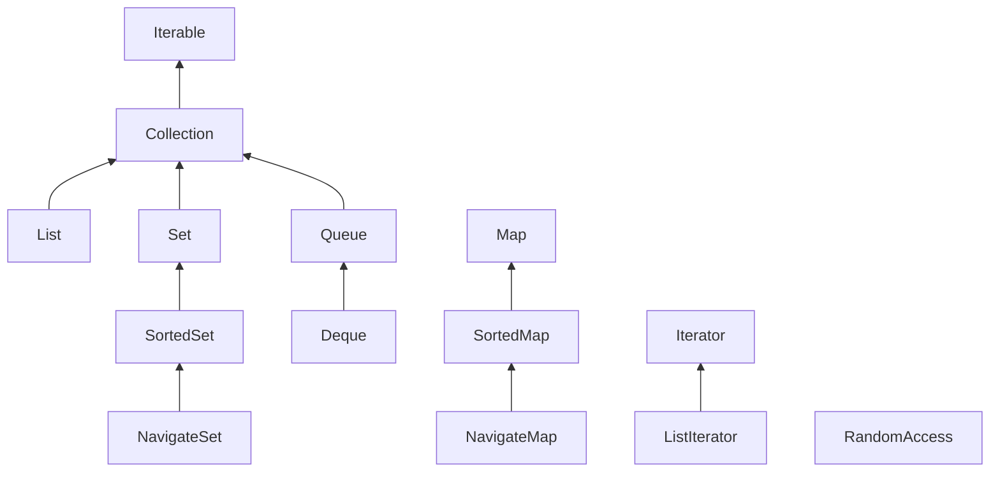
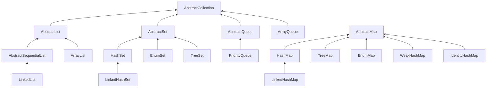
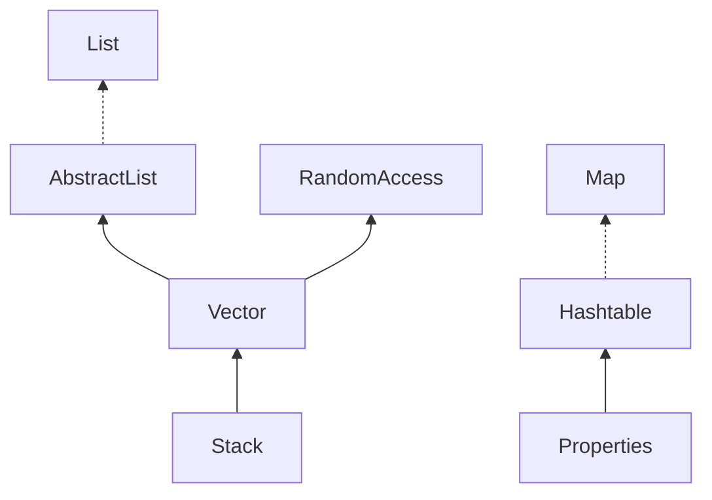

# 第9章 集合

## 9.1 Java集合框架

Java 最初版本只为最常用的数据结构提供了很少的一组类：Vector、 Stack、 Hashtable、BitSet 与 Enumeration 接口， 其中的 Enumeration 接口提供了一种用于访问任意容器中各个元素的抽象机制。 

随着 Java SE 1.2 的问世，设计人员感到是推出一组功能完善的数据结构的时机了。面对一大堆相互矛盾的设计策略，他们希望让类库规模小且易于学习， 而不希望像 C++ 的“ 标准模版库” （即 STL) 那样复杂，但却又希望能够得到 STL 率先推出的“ 泛型算法” 所具有的优点。 

### 9.1.1 将集合的接口与实现分离

与现代的数据结构类库的常见情况一样， Java 集合类库也将接口 （ interface) 与实现( implementation) 分离。首先， 看一下人们熟悉的数据结构 队列 （queue) 是如何分离的。 

*注释： 实际上，Java 类库没有名为 CircularArrayQueue 和 LinkedListQueue 的类。这里，只是以这些类作为示例， 解释一下集合接口与实现在概念上的不同。 如果需要一个循环数组队列， 就可以使用 ArrayDeque 类。如果需要一个链表队列， 就直接使用 LinkedList类， 这个类实现了 Queue 接口。*

当在程序中使用队列时，一旦构建了集合就不需要知道究竟使用了哪种实现。因此， 只有在构建集合对象时，使用具体的类才有意义。可以使用接口类型存放集合的引用。 

利用这种方式，一旦改变了想法， 可以轻松地使用另外一种不同的实现。只需要对程序的一个地方做出修改， 即调用构造器的地方。 

循环数组是一个有界集合， 即容量有限。如果程序中要收集的对象数量没有上限， 就最好使用链表来实现。 

在研究 API 文档时， 会发现另外一组名字以 Abstract 开头的类， 例如， AbstractQueue。这些类是为类库实现者而设计的。 如果想要实现自己的队列类（也许不太可能，) 会发现扩展AbstractQueue 类要比实现 Queue 接口中的所有方法轻松得多。 

### 9.1.2 Collection接口

在 Java 类库中，集合类的基本接口是 Collection 接口。 这个接口有两个基本方法：add、iterator

除了这两个方法之外，还有几个方法，将在稍后介绍。

add方法用于向集合中添加元素。如果添加元素确实改变了集合就返回 true, 如果集合没有发生变化就返回 false。例如， 如果试图向集中添加一个对象， 而这个对象在集中已经存在，这个添加请求就没有实效，因为集中不允许有重复的对象。

iterator方法用于返回一个实现了 Iterator 接口的对象。可以使用这个迭代器对象依次访问集合中的元素。下一节讨论迭代器。 

### 9.1.3 迭代器

Iterator 接口包含 4 个方法：

```java
public interface Iterator<E>
{
	E next();
	boolean hasNextO;
	void remove0;
	default void forEachRemaining(Consumer<? super E> action);
}
```


通过反复调用 next 方法，可以逐个访问集合中的每个元素。但是，如果到达了集合的末尾，next 方法将抛出一个 NoSuchElementException。 因此，需要在调用 next 之前调用 hasNext方法。如果迭代器对象还有多个供访问的元素， 这个方法就返回 true。如果想要査看集合中的所有元素，就请求一个迭代器，并在 hasNext 返回 true 时反复地调用 next 方法。 

编译器简单地将“ foreach” 循环翻译为带有迭代器的循环 

“ for each” 循环可以与任何实现了 Iterable 接口的对象一起工作， 这个接口只包含一个抽象方法 iterator()

Collection 接口扩展了 Iterable 接口。因此， 对于标准类库中的任何集合都可以使用“ for each” 循环。 

在 Java SE 8中， 甚至不用写循环。可以调用 forEachRemaining 方法并提供一 lambda表达式（它会处理一个元素）。 将对迭代器的每一个元素调用这个 lambda 表达式，直到再没有元素为止。
`iterator.forEachRemai ni ng(el ement -> do something with element); `

元素被访问的顺序取决于集合类型。 如果对 ArrayList 进行迭代， 迭代器将从索引 0开始， 每迭代一次， 索引值加 1。然而， 如果访问 HashSet 中的元素， 每个元素将会按照某种随机的次序出现。虽然可以确定在迭代过程中能够遍历到集合中的所有元素，但却无法预知元素被访问的次序。 

*注释： 编程老手会注意到： Iterator 接口的 next 和 hasNext 方法与 Enumeration 接口的nextElement 和 hasMoreElements 方法的作用一样。Java 集合类库的设计者可以选择使用Enumeration 接口。但是，他们不喜欢这个接口累赘的方法名， 于是引入了具有较短方法名的新接口。*

Java 集合类库中的迭代器与其他类库中的迭代器在概念上有着重要的区别。在传统的集合类库中， 例如， C++ 的标准模版库， 迭代器是根据数组索引建模的。如果给定这样一个迭代器， 就可以查看指定位置上的元素， 就像知道数组索引 i 就可以査看数组元素 a[i]—样。不需要查找元素， 就可以将迭代器向前移动一个位置。这与不需要执行査找操作就可以通过i++ 将数组索引向前移动一样。但是，Java 迭代器并不是这样操作的。查找操作与位置变更是紧密相连的。查找一个元素的唯一方法是调用 next, 而在执行查找操作的同时， 迭代器的位置随之向前移动。

因此，应该将 Java 迭代器认为是位于两个元素之间。 当调用 next 时，迭代器就越过下一个元素，并返回刚刚越过的那个元素的引用 

*注释： 这里还有一个有用的推论。 可以将丨terator.next 与 InputStream.read 看作为等效的。从数据流中读取一个字节，就会自动地“ 消耗掉” 这个字节。 下一次调用 read 将会消耗并返回输入的下一个字节。 用同样的方式， 反复地调用 next 就可以读取集合中所有元素。*

Iterator 接口的 remove 方法将会删除上次调用 next 方法时返回的元素。在大多数情况下，在决定删除某个元素之前应该先看一下这个元素是很具有实际意义的。然而， 如果想要删除指定位置上的元素， 仍然需要越过这个元素。 

更重要的是，对 next 方法和 remove 方法的调用具有互相依赖性。如果调用 remove 之前没有调用 next 将是不合法的。 如果这样做， 将会抛出一个 IllegalStateException 异常。 

### 9.1.4 泛型实用方法

由于 Collection 与 Iterator 都是泛型接口，可以编写操作任何集合类型的实用方法。 

Java 类库的设计者认为：这些实用方法中的某些方法非常有用， 应该将它们提供给用户使用。这样，类库的使用者就不必自己重新构建这些方法了。contains 就是这样一个实用方法。 

事实上，Collection 接口声明了很多有用的方法，所有的实现类都必须提供这些方法。下 面列举了其中的一部分:
int size()
boolean isEmpty()
boolean contains (Object obj)
boolean containsAll (Collection\<?> c)
boolean equals (Object other)
boolean addAll (Collection\<? extends E> from)
boolean remove(Object obj)
boolean removeAll (Collection\<?> c)
void clear ()
boolean retainAll (Collection\<?> c)
Object[] toArray()
\<T> T[] toArray(T[] arrayToFill ) 

当然， 如果实现 Collection 接口的每一个类都要提供如此多的例行方法将是一件很烦人的事情。 为了能够让实现者更容易地实现这个接口， Java 类库提供了一个类 AbstractCollection，它将基础方法 size 和 iterator 抽象化了， 但是在此提供了例行方法。 

对于 Java SE 8, 这种方法有些过时了。 如果这些方法是 Collection 接口的默认方法会更好。 但实际上并不是这样。不过， 确实已经增加了很多默认方法。其中大部分方法都与流的处理有关（有关内容将在卷 II 中讨论）。 

【API】 java.util.Collection\<E> 1.2 :

- `Iterator \<E> iterator()`
  返回一个用于访问集合中每个元素的迭代器。 
- `int size()`
  返回当前存储在集合中的元素个数。
- `boolean isEmpty()`
  如果集合中没有元素， 返回 true。
- `boolean contains(Object obj)`
  如果集合中包含了一个与 obj 相等的对象， 返回 true。
- `boolean containsAll(Collection<?> other)`
  如果这个集合包含 other 集合中的所有元素， 返回 true。
- `boolean add(Object element)`
  将一个元素添加到集合中。如果由于这个调用改变了集合，返回 true。
- `boolean addAll(Collection<? extends E> other)`
  将 other 集合中的所有元素添加到这个集合。如果由于这个调用改变了集合， 返回 true。
- `boolean remove(Object obj)`
  从这个集合中删除等于 obj 的对象。 如果有匹配的对象被删除， 返回 true。
- `boolean removeAll(Collection<?> other)`
  从这个集合中删除 other 集合中存在的所有元素。如果由于这个调用改变了集合，返回 true 。
- `default boolean removelf(Predicate<? super E> filter)` 8
  从这个集合删除 filter 返回 true 的所有元素。如果由于这个调用改变了集合， 则返回 true。
- `void clear()`
  从这个集合中删除所有的元素。
- `boolean retainAll(Collection<?> other)`
  从这个集合中删除所有与 other 集合中的元素不同的元素。 如果由于这个调用改变了集合， 返回 true。
- `Object[] toArray()`
  返回这个集合的对象数组。
- `<T> T[] toArray(T[] arrayToFill)`
  返回这个集合的对象数组。 如果 arrayToFill 足够大， 就将集合中的元素填入这个数组中。剩余空间填补 null ; 否则， 分配一个新数组， 其成员类型与 arrayToFill 的成员类型相同， 其长度等于集合的大小， 并填充集合元素。 

【API】java.util.Iterator\<E> 1.2 :

- `boolean hasNext()`
  如果存在可访问的元素， 返回 true。
- `E next()`
  返回将要访问的下一个对象。如果已经到达了集合的尾部， 将拋出一个 NoSuchElementException。 
- `void remove( )`
  删除上次访问的对象。这个方法必须紧跟在访问一个元素之后执行。如果上次访问之后，集合已经发生了变化， 这个方法将抛出一个 IllegalStateException。 

### 9.1.5 集合框架中的接口



集合有两个基本接口：Collection 和 Map。 

映射包含键 / 值对，所以要用 put 方法来插入

从映射中读取值则要使用 get 方法 

List 是一个有序集合（ order collection）。元素会增加到容器中的特定位置。可以采用两种方式访问元素：使用迭代器访问， 或者使用一个整数索引来访问。后一种方法称为随机访问（random access), 因为这样可以按任意顺序访问元素。与之不同， 使用迭代器访问时， 必须顺序地访问元素 。

Listlterator 接口是 Iterator 的一个子接口。它定义了一个方法用于在迭代器位置前面增加一个元素 

*注释：为了避免对链表完成随机访问操作， Java SE 1.4 引入了一个标记接口 RandomAccess。这个接口不包含任何方法， 不过可以用它来测试一个特定的集合是否支持高效的随机访问*

Set 接口等同于 Collection 接口，不过其方法的行为有更严谨的定义。集（set) 的 add方法不允许增加重复的元素。要适当地定义集的 equals 方法：只要两个集包含同样的元素就认为是相等的，而不要求这些元素有同样的顺序。 hashCode 方法的定义要保证包含相同元素的两个集会得到相同的散列码。 

SortedSet 和 SortedMap 接口会提供用于排序的比较器对象，这两个接口定义了可以得到集合子集视图的方法。有关内容将在 9.4 节讨论。

最后，Java SE 6 引人了接口 NavigableSet 和 NavigableMap, 其中包含一些用于搜索和遍历有序集和映射的方法。（理想情况下，这些方法本应当直接包含在 SortedSet 和 SortedMap接口中。）TreeSet 和 TreeMap 类实现了这些接口。 

## 9.2 具体的集合

| 集合类型        | 描述                                                 |
| --------------- | ---------------------------------------------------- |
| ArrayList       | 一种可以动态增长和缩减的索引序列                     |
| LinkedList      | 一种可以在任何位置进行高效地插入和删除操作的有序序列 |
| ArrayDeque      | 一种用循环数组实现的双端队列                         |
| HashSet         | 一种没有重复元素的无序集合                           |
| TreeSet         | 一种有序集                                           |
| EnumSet         | 一种包含枚举类型值的集                               |
| LinkedHashSet   | 一种可以记住元素插入次序的集                         |
| PriorityQueue   | 一种允许高效删除最小元素的集合                       |
| HashMap         | 一种存储键/值关联的数据结构                          |
| TreeMap         | 一种键值有序排列的映射表                             |
| EnumMap         | 一种键值属于枚举类型的映射表                         |
| LinkedHashMap   | 一种可以记住键/值项添加次序的映射表                  |
| WeakHashMap     | 一种其值无用武之地后可以被垃圾回收器回收的映射表     |
| IdentityHashMap | 一种用==而不是用equals比较键值的映射表               |



### 9.2.1 链表

数组和数组列表都有一个重大的缺陷。这就是从数组的中间位置删除一个元素要付出很大的代价，其原因是数组中处于被删除元素之后的所有元素都要向数组的前端移动 

在 Java 程序设计语言中， 所有链表实际上都是双向链接的(doubly linked)—即每个结点还存放着指向前驱结点的引用 

但是， 链表与泛型集合之间有一个重要的区别。链表是一个有序集合（ordered collection), 每个对象的位置十分重要。 LinkedList.add 方法将对象添加到链表的尾部。但是，常常需要将元素添加到链表的中间。由于迭代器是描述集合中位置的， 所以这种依赖于位置的 add 方法将由迭代器负责。只有对自然有序的集合使用迭代器添加元素才有实际意义。例如， 下一节将要讨论的集 （set ) 类型，其中的元素完全无序。 因此， 在 Iterator 接口中就没有add 方法。相反地，集合类库提供了子接口 Listlterator, 其中包含 add 方法 

与 Collection.add 不同， 这个方法不返回 boolean 类型的值， 它假定添加操作总会改变链表。 

另外， Listlterator 接口有两个方法， 可以用来反向遍历链表。
`E previous()`
`boolean hasPrevious()`
与 next 方法一样， previous 方法返回越过的对象。

LinkedList 类的 listlterator 方法返回一个实现了 Listlterator 接口的迭代器对象。

Add 方法在迭代器位置之前添加一个新对象。 

当用一个刚刚由 Iterator 方法返回， 并且指向链表表头的迭代器调用 add 操作时， 新添加的元素将变成列表的新表头。当迭代器越过链表的最后一个元素时（即 hasNext 返回 false),添加的元素将变成列表的新表尾。 如果链表有 n 个元素，有 n+1 个位置可以添加新元素。这些位置与迭代器的 n+1 个可能的位置相对应。 

*注释：在用“ 光标” 类比时要格外小心。remove 操作与 BACKSPACE 键的工作方式不太一样。在调用 next 之后， remove 方法确实与 BACKSPACE 键一样删除了迭代器左侧的元素。但是， 如果调用 previous 就会将右侧的元素删除掉， 并且不能连续调用两次remove。
add 方法只依赖于迭代器的位置， 而 remove 方法依赖于迭代器的状态。*

最后需要说明，set 方法用一个新元素取代调用 next 或 previous 方法返回的上一个元素。 

可以想象， 如果在某个迭代器修改集合时， 另一个迭代器对其进行遍历， 一定会出现混乱的状况。 链表迭代器的设计使它能够检测到这种修改。 如果迭代器发现它的集合被另一个迭代器修改了， 或是被该集合自身的方法修改了， 就会抛出一个ConcurrentModificationException 异常。 

为了避免发生并发修改的异常，请遵循下述简单规则：可以根据需要给容器附加许多的迭代器，但是这些迭代器只能读取列表。另外，再单独附加一个既能读又能写的迭代器。 

有一种傅单的方法可以检测到并发修改的问题。 集合可以跟踪改写操作（诸如添加或删除元素）的次数。每个迭代器都维护一个独立的计数值。在每个迭代器方法的开始处检查自己改写操作的计数值是否与集合的改写操作计数值一致。 如果不一致， 抛出一个 ConcurrentModificationException 异常。 

*注释：对于并发修改列表的检测肴一个奇怪的例外。链表只负责跟踪对列表的结构性修改， 例如，添加元素、 删除元素。set 方法不被视为结构性修改。 可以将多个迭代器附加给一个链表， 所有的迭代器都调用 set 方法对现有结点的内容进行修改。在本章后面所介绍的 Collections 类的许多算法都需要使用这个功能。*

在 Java 类库中， 还提供了许多在理论上存在一定争议的方法。链表不支持快速地随机访问。 如果要查看链表中第n个元素，就必须从头开始， 越过n-1个元素。没有捷径可走。鉴于这个原因，在程序需要采用整数索引访问元素时， 程序员通常不选用链表。
尽管如此， LinkedList 类还是提供了一个用来访问某个特定元素的 get 方法。

当然，这个方法的效率并不太高。 如果发现自己正在使用这个方法，说明有可能对于所要解决的问题使用了错误的数据结构。 

绝对不应该使用这种让人误解的随机访问方法来遍历链表。下面这段代码的效率极低：
for (int i = 0; i < list.size()；i++)
do something with list.get(i);
每次査找一个元素都要从列表的头部重新开始搜索。LinkedList 对象根本不做任何缓存位置信息的操作。 

*注释： get 方法做了微小的优化：如果索引大于 size() / 2就从列表尾端开始搜索元素。*

列表迭代器接口还有一个方法，可以告之当前位置的索引。实际上，从概念上讲， 由于Java 迭代器指向两个元素之间的位置， 所以可以同时产生两个索引：nextlndex 方法返回下一次调用 next 方法时返回元素的整数索引；previouslndex 方法返回下一次调用 previous 方法时返回元素的整数索引。 当然， 这个索引只比 nextlndex 返回的索引值小 1。 这两个方法的效率非常高，这是因为迭代器保持着当前位置的计数值。最后需要说一下， 如果有一个整数索引n, list.listlterator(n) 将返回一个迭代器， 这个迭代器指向索引为 n 的元素前面的位置。 

我们建议避免使用以整数索引表示链表中位置的所有方法。 如果需要对集合进行随机访问， 就使用数组或 ArrayList, 而不要使用链表。 

【API】java.util.List\<E> 1.2 :

- `ListIterator<E> listIterator()`返回一个列表迭代器， 以便用来访问列表中的元素。
- `ListIterator<E> listIterator(int index )`
  返回一个列表迭代器， 以便用来访问列表中的元素， 这个元素是第一次调用 next 返回的给定索引的元素。
- `void add( int i , E element )`
  在给定位置添加一个元素。
- `void addAll ( int i , Col 1ection<? extends E> elements )`
  将某个集合中的所有元素添加到给定位置。
- `E remove( int i )`
  删除给定位置的元素并返回这个元素。
- `E get( int i )`
  获取给定位置的元素。
- `E set(int i , E element )`
  用新元素取代给定位置的元素， 并返回原来那个元素。
- `int indexOf ( Object element ) `
  返回与指定元素相等的元素在列表中第一次出现的位置， 如果没有这样的元素将返回-1。
- `int lastIndexOf(Object element)`
  返回与指定元素相等的元素在列表中最后一次出现的位置， 如果没有这样的元素将返回 -1。

【API】 java.util.Listlterator\<E> 1.2 :

- `void add(E newElement)`
  在当前位置前添加一个元素。
- `void set(E newElement)`
  用新元素取代 next 或 previous 上次访问的元素。 如果在 next 或 previous 上次调用之后列表结构被修改了， 将拋出一个 IllegalStateException 异常。
- `boolean hasPrevious()`
  当反向迭代列表时， 还有可供访问的元素， 返回 true。
- `E previous()`
  返回前对象。如果已经到达了列表的头部，就抛出一个NoSuchElementException 异常。
- `int nextlndex()`
  返回下一次调用 next 方法时将返回的元素索引。
- `int previousIndex()`
  返回下一次调用 previous 方法时将返回的元素索引。

【API】java.util.LinkedList\<E> 1.2 :

- `LinkedList()`
  构造一个空链表。
- `LinkedList(Collection<? extends E> elements)`
  构造一个链表， 并将集合中所有的元素添加到这个链表中。
- `void addFirst(E element)`
- `void addLast(E element)`
  将某个元素添加到列表的头部或尾部。
- `E getFirst()`
- `E getLast()`
  返回列表头部或尾部的元素。
- `E removeFirst()`
- `E removeLast()`
  删除并返回列表头部或尾部的元素。 

### 9.2.2 数组列表

有两种访问元素的协议：一种是用迭代器， 另一种是用 get 和 set 方法随机地访问每个元素。后者不适用于链表， 但对数组却很有用。 集合类库提供了一种大家熟悉的 ArrayList 类， 这个类也实现了 List 接口。ArrayList 封装了一个动态再分配的对象数组。 

*注释：对于一个经验丰富的 Java 程序员来说， 在需要动态数组时， 可能会使用 Vector 类。为什么要用 ArrayList 取代 Vector 呢？ 原因很简单： Vector 类的所有方法都是同步的。 可以由两个线程安全地访问一个 Vector 对象。但是， 如果由一个线程访问 Vector, 代码要在同步操作上耗费大量的时间。这种情况还是很常见的。 而 ArrayList 方法不是同步的，因此，建议在不需要同步时使用 ArrayList, 而不要使用 Vector。*

### 9.2.3 散列集

如果集合中包含的元素很多， 将会消耗很多时间。 如果不在意元素的顺序， 可以有几种能够快速査找元素的数据结构。其缺点是无法控制元素出现的次序。 它们将按照有利于其操作目的的原则组织数据。 

有一种众所周知的数据结构， 可以快速地査找所需要的对象， 这就是散列表（hash table )。散列表为每个对象计算一个整数， 称为散列码（hash code)。散列码是由对象的实例域产生的一个整数。更准确地说， 具有不同数据域的对象将产生不同的散列码。 

在 Java 中， 散列表用链表数组实现。每个列表被称为桶 （ bucket) (参看图 9-10。) 要想査找表中对象的位置， 就要先计算它的散列码， 然后与桶的总数取余， 所得到的结果就是保存这个元素的桶的索引。 

当然， 有时候会遇到桶被占满的情况， 这也是不可避免的。这种现象被称为散列冲突（ hash collision) 。这时， 需要用新对象与桶中的所有对象进行比较，査看这个对象是否已经存在。如果散列码是合理且随机分布的， 桶的数目也足够大， 需要比较的次数就会很少。

*注释： 在 JavaSE 8 中， 桶满时会从链表变为平衡二叉树。如果选择的散列函数不当， 会产生很多冲突， 或者如果有恶意代码试图在散列表中填充多个有相同散列码的值， 这样就能提高性能。*

如果大致知道最终会有多少个元素要插人到散列表中， 就可以设置桶数。通常， 将桶数设置为预计元素个数的 75% ~ 150%。有些研究人员认为：尽管还没有确凿的证据，但最好将桶数设置为一个素数， 以防键的集聚。==标准类库使用的桶数是 2 的幂， 默认值为 16 (为表大小提供的任何值都将被自动地转换为 2 的下一个幂 )==。 

当然，并不是总能够知道需要存储多少个元素的， 也有可能最初的估计过低。 如果散列表太满， 就需要再散列 （rehashed)。 如果要对散列表再散列， 就需要创建一个桶数更多的表，并将所有元素插入到这个新表中，. 然后丢弃原来的表。 装填因子（ load factor) 决定何时对散列表进行再散列。 例如， 如果装填因子为 0.75 (默认值) ，而表中超过 75%的位置已经填人元素， 这个表就会用双倍的桶数自动地进行再散列。对于大多数应用程序来说， 装填因子为0.75 是比较合理的。 

散列表可以用于实现几个重要的数据结构。 其中最简单的是 set 类型。set 是没有重复元素的元素集合。set 的 add 方法首先在集中查找要添加的对象， 如果不存在，就将这个对象添加进去。 

Java 集合类库提供了一个 HashSet 类，它实现了基于散列表的集。可以用 add 方法添加元素。contains方法已经被重新定义， 用来快速地查看是否某个元素已经出现在集中。它只在某个桶中査找元素，而不必查看集合中的所有元素。 

【API】java.util.HashSet\<E> 1.2 ：

- `HashSet( )`
  构造一个空散列表。
- `HashSet( Collection<? extends E> elements )`
  构造一个散列集， 并将集合中的所有元素添加到这个散列集中。
- `HashSet( int initialCapacity )`
  构造一个空的具有指定容量（桶数）的散列集。
- `HashSet(int initialCapacity , float loadFactor )`
  构造一个具有指定容量和装填因子（一个 0.0 ~ 1.0 之间的数值， 确定散列表填充的百 分比， 当大于这个百分比时， 散列表进行再散列）的空散列集。

【API】java.Iang.Object 1.0 ：

- `int hashCode( )`
  返回这个对象的散列码。散列码可以是任何整数， 包括正数或负数。equals 和 hashCode的定义必须兼容，即如果 x.equals(y) 为 true, x.hashCode() 必须等于 y.hashCode()。 

### 9.2.4 树集

正如 TreeSet 类名所示， 排序是用树结构完成的（当前实现使用的是红黑树（red-black tree)。  每次将一个元素添加到树中时，都被放置在正确的排序
位置上。因此，迭代器总是以排好序的顺序访问每个元素。 

将一个元素添加到树中要比添加到散列表中慢，但是，与检查数组或链表中的重复元素相比还是快很多。 

*注释：要使用树集， 必须能够比较元素。这些元素必须实现 Comparable 接口（参见 6.1.1节，) 或者构造集时必须提供一个 Comparator (参见 6.2.2 节和 6.3.8 节）*

*注释： 从 JavaSE 6 起， TreeSet 类实现了 NavigableSet 接口。 这个接口增加了几个便于定位元素以及反向遍历的方法。*

【API】java.util.TreeSet\<E> 1.2 :

- `TreeSet()`
- `TreeSet(Comparator<? super E> comparator)`
  构造一个空树集。
- `TreeSet(Collection<? extends E> elements)`
- `TreeSet(SortedSet<E> s)`
  构造一个树集， 并增加一个集合或有序集中的所有元素（对于后一种情况， 要使用同样的顺序。)

【API】java.util.SortedSet\<E> 1.2 :

- `Comparator <? super E> comparator ()`
  返回用于对元素进行排序的比较器。 如果元素用 Comparable 接口的 compareTo方法进行比较则返回 null。
- `E first()`
- `E last()`
  返回有序集中的最小元素或最大元素。

【API】java.util.NavigableSet\<E> 6 :

- `E higher(E value)`
- `E lower(E value)`
  返回大于 value 的最小元素或小于 value 的最大元素，如果没有这样的元素则返回 null。
- `E ceiling(E value)`
- `E floor(E value)`
  返回大于等于 vaiue 的最小元素或小于等于 value 的最大元素， 如果没有这样的元素则返回 null。
- `E pollFirst()`
- `E pollLast()`
  删除并返回这个集中的最大元素或最小元素， 这个集为空时返回 null。
- `Iterator<E> descendingIterator()`
  返回一个按照递减顺序遍历集中元素的迭代器。 

### 9.2.5 队列与双端队列

前面已经讨论过， 队列可以让人们有效地在尾部添加一个元素， 在头部删除一个元素。有两个端头的队列， 即双端队列， 可以让人们有效地在头部和尾部同时添加或删除元素。不支持在队列中间添加元素。在 Java SE 6 中引人了 Deque 接口， 并由 ArrayDeque 和LinkedList 类实现。这两个类都提供了双端队列，而且在必要时可以增加队列的长度。 在第14 章将会看到有限队列和有限双端队列。 

【API】java.utii.Queue\<E> 5.0 :

-  `boolean add(E element )`
- `boolean offer(E element )`
  如果队列没有满，将给定的元素添加到这个双端队列的尾部并返回 true。如果队列满了，第一个方法将拋出一个 IllegalStateException, 而第二个方法返回 false。
- `E remove( )`
- `E poll ( )`
  假如队列不空，删除并返回这个队列头部的元素。如果队列是空的，第一个方法抛出NoSuchElementException, 而第二个方法返回 null。
- `E element()`
- `E peek( )`
  如果队列不空，返回这个队列头部的元素， 但不删除。如果队列空，第一个方法将拋出一个 NoSuchElementException, 而第二个方法返回 null。

【API】java.util.Deque\<E> 6 :

- `void addFirst( E element )`
- `void addLast(E element )`
- `boolean offerFirst(E element )`
- `boolean offerLast( E element )`
  将给定的对象添加到双端队列的头部或尾部。如果队列满了，前面两个方法将拋出一个 IllegalStateException， 而后面两个方法返回 false。
- `E removeFirst( )`
- `E removeLast( )`
- `E pollFirst()`
- `E pollLast()`
  如果队列不空，删除并返回队列头部的元素。 如果队列为空，前面两个方法将拋出一个 NoSuchElementException, 而后面两个方法返回 null。
- `E getFirst()`
- `E getLast()`
- `E peekFirst()`
- `E peekLast()`
  如果队列非空，返回队列头部的元素， 但不删除。 如果队列空，前面两个方法将拋出一个 NoSuchElementException, 而后面两个方法返回 null。

【API】 java.util.ArrayDeque\<E> 6 ：

- `ArrayDeque( )`
- `ArrayDeque( Int initialCapacity) `
  用初始容量 16 或给定的初始容量构造一个无限双端队列。 

### 9.2.6 优先级队列

优先级队列（priority queue) 中的元素可以按照任意的顺序插人，却总是按照排序的顺序进行检索。也就是说，无论何时调用 remove 方法，总会获得当前优先级队列中最小的元素。然而，优先级队列并没有对所有的元素进行排序。如果用迭代的方式处理这些元素，并不需要对它们进行排序。优先级队列使用了一个优雅且高效的数据结构，称为堆（heap)。堆是一个可以自我调整的二叉树，对树执行添加 （ add) 和删除（remore) 操作， 可以让最小的元素移动到根，而不必花费时间对元素进行排序。 

与 TreeSet—样，一个优先级队列既可以保存实现了 Comparable 接口的类对象， 也可以保存在构造器中提供的 Comparator 对象。 

使用优先级队列的典型示例是任务调度。每一个任务有一个优先级，任务以随机顺序添加到队列中。每当启动一个新的任务时，都将优先级最高的任务从队列中删除（由于习惯上将 1 设为“ 最高” 优先级，所以会将最小的元素删除 )。 

与 TreeSet 中的迭代不同，这里的迭代并不是按照元素的排列顺序访问的。而删除却总是删掉剩余元素中优先级数最小的那个元素。 

【API】java.util.PriorityQueue 5.0 :

- `PriorityQueue()`
- `PriorityQueue(int initialCapacity)`
  构造一个用于存放Comparable对象的优先级队列。
- `PriorityQueue(int initialCapacity, Comparator<? super E> c)`
  构造一个优先级队列，并用指定的比较器对元素进行排序。

## 9.3 映射

通常， 我们知道某些键的信息，并想要查找与之对应的元素。 映射（ map) 数据结构就是为此设计的。映射用来存放键 / 值对。如果提供了键， 就能够查找到值。 

### 9.3.1 基本映射操作

Java 类库为映射提供了两个通用的实现： HashMap 和 TreeMap 。这两个类都实现了 Map 接口。 

散列映射对键进行散列， 树映射用键的整体顺序对元素进行排序， 并将其组织成搜索树。==散列或比较函数只能作用于键。与键关联的值不能进行散列或比较==。 

应该选择散列映射还是树映射呢？ 与集一样， 散列稍微快一些， 如果不需要按照排列顺序访问键， 就最好选择散列。 

如果在映射中没有与给定键对应的信息， get 将返回 null。

null 返回值可能并不方便。有时可以有一个好的默认值， 用作为映射中不存在的键。然后使用 getOrDefault 方法。 

键必须是唯一的。不能对同一个键存放两个值。 如果对同一个键两次调用 put 方法， 第二个值就会取代第一个值。实际上， put 将返回用这个键参数存储的上一个值。 

remove 方法用于从映射中删除给定键对应的元素。 size 方法用于返回映射中的元素数。

要迭代处理映射的键和值， 最容易的方法是使用 forEach 方法。可以提供一个接收键和值的 lambda 表达式。映射中的每一项会依序调用这个表达式。

```java
scores.forEach((k, v) ->
System.out.println("key=" + k + ", value:" + v));
```

【API】java.util.Map\<K,V> 1.2 :

- `V get(Object key)`
  获取与键对应的值；返回与键对应的对象， 如果在映射中没有这个对象则返回 null。键可以为 null。
- `default V getOrDefault(Object key, V defaultValue)`
  获得与键关联的值；返回与键关联的对象， 或者如果未在映射中找到这个键， 则返回defaultValue。
- `V put(K key, V value)`
  将键与对应的值关系插入到映射中。 如果这个键已经存在， 新的对象将取代与这个键对应的旧对象。这个方法将返回键对应的旧值。 如果这个键以前没有出现过则返回null。键可以为 null， 但值不能为 null。
- `void putAll(Map<? extends K , ? extends V> entries)`
  将给定映射中的所有条目添加到这个映射中。
- `boolean containsKey(Object key)`
  如果在映射中已经有这个键， 返回 true。
- `boolean containsValue(Object value)`
  如果映射中已经有这个值， 返回 true。
- `default void forEach(BiConsumer<? super K ,? super V> action)` 8
  对这个映射中的所有键 / 值对应用这个动作。

【API】java.utii.HashMap\<K,V> 1.2 :

- `HashMap()`
- `HashMap(int initialCapacity)`
- `HashMap(int initialCapacity, float loadFactor)`
  用给定的容量和装填因子构造一个空散列映射（装填因子是一个 0.0 〜 1.0 之间的数值。这个数值决定散列表填充的百分比。一旦到了这个比例， 就要将其再散列到更大的表中）。默认的装填因子是 0.75。

【API】java.util.TreeMap\<K,V>  1.2 :

- `TreeMap()`
  为实现 Comparable 接口的键构造一个空的树映射。
- `TreeMap(Comparator<? super K> c)`
  构造一个树映射， 并使用一个指定的比较器对键进行排序。
- `TreeMap(Map<? extends K, ? extends V> entries)`
  构造一个树映射， 并将某个映射中的所有条目添加到树映射中。
- `TreeMap(SortedMap<? extends K, ? extends V> entries)`
  构造一个树映射， 将某个有序映射中的所有条目添加到树映射中， 并使用与给定的有序映射相同的比较器。

【API】java.util.SortedMap\<K, V> 1.2 :

- `Comparator <? super K> comparator()`
  返回对键进行排序的比较器。 如果键是用 Comparable 接口的 compareTo 方法进行比较的，返回 null。
- `K firstKey()`
- `K lastKey()`
  返回映射中最小元素和最大元素。 

### 9.3.2 更新映射项

处理映射时的一个难点就是更新映射项。正常情况下， 可以得到与一个键关联的原值，完成更新， 再放回更新后的值。不过，必须考虑一个特殊情况， 即键第一次出现。下面来看一个例子，使用一个映射统计一个单词在文件中出现的频度。看到一个单词（word) 时， 我们将计数器增 1， 如下所示：
`counts.put (word, counts.get(word)+ 1);`
这是可以的， 不过有一种情况除外：就是第一次看到 word 时。在这种情况下，get 会返回 null, 因此会出现一个 NullPointerException 异常。

作为一个简单的补救， 可以使用 getOrDefault 方法：
`counts,put(word, counts.getOrDefault(word, 0)+ 1);`

另一种方法是首先调用 putlfAbsent 方法。只有当键原先存在时才会放入一个值。
`counts.putlfAbsent (word, 0);`
`counts.put (word, counts.get(word)+ 1); // Now we know that get will succeed`

不过还可以做得更好。merge 方法可以简化这个常见的操作。如果键原先不存在，下面的调用：
`counts.merge(word, 1, Integer::sum);`
将把 word 与 1 关联，否则使用 Integer::sum 函数组合原值和 1 (也就是将原值与 1 求和。)

API 注释还描述了另外一些更新映射项的方法，不过这些方法不太常用。 

【API】java.util.Map<K,V> 1.2 :

- `default V merge(K key, V value, BiFunction<? super V,? super V,?
  extends V> remappingFunctlon)` 8
  如果 key 与一个非 null 值 v 关联， 将函数应用到 v 和 value, 将 key 与结果关联， 或者如果结果为 null, 则删除这个键。否则， 将 key 与 value 关联， 返回 get(key)。
- `default V compute(K key, BiFunction<? super K,? super V,? extends V>
  remappingFunction)` 8
  将函数应用到 key 和 get(key)。 将 key 与结果关联， 或者如果结果为 null， 则删除这个键。返回 get(key)。
- `default V computeIfPresent(K key , BiFunction<? super K , ? super V , ? extends V > remappingFunction )` 8
  如果 key 与一个非 null 值 v 关联， 将函数应用到 key 和 v， 将 key 与结果关联， 或者如果结果为 null, 则删除这个键。返回 get(key)。
- `default V computeIfAbsent( K key , Function<? super K ,? extends V >
  mappingFunction )` 8
  将函数应用到 key, 除非 key 与一个非 null 值关联。将 key 与结果关联， 或者如果结果为 null, 则删除这个键。返回 get(key)。
- `default void replaceAll ( BiFunction<? super K ,? super V ,? extends
  V > function )` 8
  在所有映射项上应用函数。将键与非 mill 结果关联， 对于 null 结果， 则将相应的键删除。 

### 9.3.3 映射视图

集合框架不认为映射本身是一个集合。（其他数据结构框架认为映射是一个键 / 值对集合， 或者是由键索引的值集合。）不过， 可以得到映射的视图（ View )—这是实现了Collection 接口或某个子接口的对象。 

有 3 种视图： 键集、 值集合（不是一个集） 以及键 / 值对集。键和键 / 值对可以构成一个集， 因为映射中一个键只能有一个副本。 下面的方法：
`Set<K> keySet()`
`Collection<V> values()`
`Set<Map.Entry<K, V>> entrySet()`
会分别返回这 3 个视图。（条目集的元素是实现 Map.Entry 接口的类的对象。） 

需要说明的是， keySet 不是 HashSet 或 TreeSet， 而是实现了 Set 接口的另外某个类的对象。 Set 接口扩展了 Collection 接口。因此， 可以像使用集合一样使用 keySet。 

如果想同时参看键和值，可以通过枚举条目来避免查找值。使用以下代码：

```java
for(Map.Entry<String,Employee> entry: staff.entrySet()){
    String k = entry.getKey();
    Employee v = entry.getValue();
    do somethig with k,v
}
```

*提示： 原先这是访问所有映射条目的最高效的方法。如今， 只需要使用 forEach 方法：*

```java
counts.forEach((k，v) -> {
	do something with k, v
});
```

如果在键集视图上调用迭代器的 remove 方法， 实际上会从映射中删除这个键和与它关联的值。==不过，不能向键集视图增加元素==。另外， 如果增加一个键而没有同时增加值也是没有意义的。 如果试图调用 add 方法， 它会抛出一个 UnsupportedOperationException。 条目集视图有同样的限制，尽管理论上增加一个新的键 / 值对好像是有意义的。 

【API】java.util.Map\<K,V> 1.2 :

- `Set<Map.Entry<K, V>> entrySet()`
  返回 Map.Entry对象（映射中的键 / 值对）的一个集视图。可以从这个集中删除元素，它们将从映射中删除，但是不能增加任何元素。
- `Set<K> keySet()`
  返回映射中所有键的一个集视图。可以从这个集中删除元素，键和相关联的值将从映射中删除， 但是不能增加任何元素。
- `Collection<V> values()`
  返回映射中所有值的一个集合视图。可以从这个集合中删除元素， 所删除的值及相应的键将从映射中删除， 不过不能增加任何元素。

【API】java.util.Map.Entry<K, V> 1.2 ：

- `K getKey()`
- `V getValue()`
  返回这一条目的键或值。
- `V setValue(V newValue)`
  将相关映射中的值改为新值， 并返回原来的值。 

### 9.3.4 弱散列映射

设计 WeakHashMap 类是为了解决一个有趣的问题。 如果有一个值，对应的键已经不再使用了， 将会出现什么情况呢？ 假定对某个键的最后一次引用已经消亡，不再有任何途径引用这个值的对象了。但是，由于在程序中的任何部分没有再出现这个键， 所以， 这个键 / 值对无法从映射中删除。为什么垃圾回收器不能够删除它呢？  

遗憾的是， 事情没有这样简单。 垃圾回收器跟踪活动的对象。只要映射对象是活动的，其中的所有桶也是活动的， 它们不能被回收。因此， 需要由程序负责从长期存活的映射表中删除那些无用的值。 或者使用 WeakHashMap 完成这件事情。 当对键的唯一引用来自散列条目时， 这一数据结构将与垃圾回收器协同工作一起删除键 / 值对 。

下面是这种机制的内部运行情况。 WeakHashMap 使用弱引用 （ weak references) 保存键。WeakReference 对象将引用保存到另外一个对象中， 在这里， 就是散列键。对于这种类型的对象， 垃圾回收器用一种特有的方式进行处理。通常， 如果垃圾回收器发现某个特定的对象已经没有他人引用了， 就将其回收。然而， 如果某个对象只能由 WeakReference 引用， 垃圾回收器仍然回收它，但要将引用这个对象的弱引用放人队列中。WeakHashMap 将周期性地检查队列， 以便找出新添加的弱引用。一个弱引用进人队列意味着这个键不再被他人使用， 并且已经被收集起来。于是， WeakHashMap 将删除对应的条目。 

### 9.3.5 链接散列集与映射

LinkedHashSet 和 LinkedHashMap类用来记住插人元素项的顺序。这样就可以避免在散列表中的项从表面上看是随机排列的。当条目插入到表中时，就会并入到双向链表中 

链接散列映射将用访问顺序， 而不是插入顺序， 对映射条目进行迭代。每次调用 get 或put, 受到影响的条目将从当前的位置删除， 并放到条目链表的尾部（只有条目在链表中的位置会受影响， 而散列表中的桶不会受影响。一个条目总位于与键散列码对应的桶中）。 

==访问顺序对于实现高速缓存的“ 最近最少使用” 原则十分重要。==例如， 可能希望将访问频率高的元素放在内存中， 而访问频率低的元素则从数据库中读取。当在表中找不到元素项且表又已经满时， 可以将迭代器加入到表中， 并将枚举的前几个元素删除掉。这些是近期最少使用的几个元素。 

甚至可以让这一过程自动化。即构造一 LinkedHashMap 的子类，然后覆盖下面这个方法：
`protected boolean removeEldestEntry(Map.Entry<K， V> eldest)`
每当方法返回 true 时， 就添加一个新条目，从而导致删除 eldest 条目。 

### 9.3.6 枚举集与映射

EmimSet 是一个枚举类型元素集的高效实现。 由于枚举类型只有有限个实例， 所以EnumSet 内部用位序列实现。如果对应的值在集中， 则相应的位被置为 1。 

EnumSet 类没有公共的构造器。 可以使用静态工厂方法构造这个集。

可以使用Set接口的常用方法来修改EnumSet。

EnumMap 是一个键类型为枚举类型的映射。它可以直接且高效地用一个值数组实现。 

*注释： 在 EnumSet 的 API 文档中， 将会看到 E extends Enum\<E> 这样奇怪的类型参数。简单地说， 它的意思是 “ E 是一个枚举类型。” 所有的枚举类型都扩展于泛型 Enum 类。例如， Weekday 扩展 Enum\<Weekday>*

### 9.3.7 标识散列映射

类 IdentityHashMap 有特殊的作用。在这个类中， 键的散列值不是用 hashCode 函数计算的， 而是用 System.identityHashCode 方法计算的。 这是 Object.hashCode 方法根据对象的内存地址来计算散列码时所使用的方式。 而且， 在对两个对象进行比较时， IdentityHashMap 类使用 ==, 而不使用 equals。 

也就是说， 不同的键对象， 即使内容相同， 也被视为是不同的对象。 在实现对象遍历算法 （如对象串行化）时， 这个类非常有用， 可以用来跟踪每个对象的遍历状况。 

【API】java.util.WeakHashMap<K, V>1.2：

- `WeakHashMap()`
- `WeakHashMapCint initialCapacity)`
- `WeakHashMap(int initialCapacity, float loadFactor)`
  用给定的容量和填充因子构造一个空的散列映射表。

【API】java.util.LinkedHashSet\<E> 1.4 :

- `LinkedHashSet()`
- `LinkedHashSet(int initialCapacity)`
- `LinkedHashSet(int initialCapacity, float loadFactor)`
  用给定的容量和填充因子构造一个空链接散列集。

【API】 java.utif.LinkedHashMap<K, V> 1.4 :

- `LinkedHashMap()`
- `LinkedHashMap(int initialCapacity)`
- `LinkedHashMap(int initialCapacity, float loadFactor)`
- `LinkedHashMap(int initialCapacity, float loadFactor, boolean accessOrder)`
  用给定的容量、 填充因子和顺序构造一个空的链接散列映射表。 accessOrder 参数为true 时表示访问顺序， 为 false 时表示插入顺序。
- `protected boolean removeEldestEntry(Map.Entry<K, V > eldest)`
  如果想删除 eldest 元素， 并同时返回 true, 就应该覆盖这个方法。eldest 参数是预期要删除的条目。这个方法将在条目添加到映射中之后调用。其默认的实现将返回 false。即在默认情况下，旧元素没有被删除。然而， 可以重新定义这个方法， 以便有选择地返回 true。例如， 如果最旧的条目符合一个条件， 或者映射超过了一定大小， 则返回true 

【API】java.util.EnumSet\<E extends Enum\<E>> 5.0 :

- `static < E extends Enum< E>> EnumSet< E> allOf(Class<E> enumType)`
  返回一个包含给定枚举类型的所有值的集。
- `static < E extends Enum< E >> EnumSet< E > noneOf(Class< E > enumType)`
  返回一个空集，并有足够的空间保存给定的枚举类型所有的值。
- `static < E extends Enum< E >> EnumSet< E > range(E from, E to)`
  返回一个包含 from 〜 to 之间的所有值（包括两个边界元素）的集。
- `static < E extends Enum< E >> EnumSet< E > of(E value)`
- `static < E extends Enum< E>> EnumSet< E > of(E value, E... values)`
  返回包括给定值的集。 

【API】java.util.EnumMap\<K extends Enum\<K>, V> 5.0 :

- `EnumMap(Class<K > keyType)`
  构造一个键为给定类型的空映射。 

【API】java.util.IdentityHashMap\<K, V> 1.4 :

- `IndentityHashMap()`
- `IdentityHashMap(int expectedMaxSize)`
  构造一个空的标识散列映射集，其容量是大于 1.5 * expectedMaxSize 的 2 的最小次幂(expectedMaxSize 的默认值是 21 )。 

【API】java.lang.System 1.0 :

- `static int identityHashCode(Object obj)` 1.1 
  返回 Object.hashCode 计算出来的相同散列码（根据对象的内存地址产生，) 即使 obj所属的类已经重新定义了 hashCode 方法也是如此。 

## 9.4 视图和包装器

看一下图 9-4 和图 9-5 可能会感觉： 用如此多的接口和抽象类来实现数量并不多的具体集合类似乎没有太大必要。然而， 这两张图并没有展示出全部的情况。通过使用视图( views) 可以获得其他的实现了 Collection 接口和 Map 接口的对象。映射类的 keySet 方法就是一个这样的示例。初看起来， 好像这个方法创建了一个新集， 并将映射中的所有键都填进去，然后返回这个集。但是， 情况并非如此。取而代之的是： keySet 方法返回一个实现 Set接口的类对象， 这个类的方法对原映射进行操作。这种集合称为视图。 

### 9.4.1 轻量级集合包装器

Arrays 类的静态方法 asList 将返回一个包装了普通 Java 数组的 List 包装器。 这个方法可以将数组传递给一个期望得到列表或集合参数的方法。 

返回的对象不是 ArrayList。它是一个视图对象， 带有访问底层数组的 get 和 set方法。改变数组大小的所有方法（例如，与迭代器相关的 add 和 remove 方法）都会抛出一个Unsupported OperationException 异常。 

asList 方法可以接收可变数目的参数。 

*注释： Collections 类包含很多实用方法， 这些方法的参数和返回值都是集合。不要将它与 Collection 接口混淆起来。*

如果调用下列方法
`Collections.singleton(anObject)`
则将返回一个视图对象。这个对象实现了 Set 接口（与产生 List 的 ncopies 方法不同）。返回的对象实现了一个不可修改的单元素集， 而不需要付出建立数据结构的开销。 singletonList方法与 singletonMap 方法类似。

类似地，对于集合框架中的每一个接口，还有一些方法可以生成空集、 列表、 映射， 等等。特别是， 集的类型可以推导得出：
`Set<String> deepThoughts = Col1ecti ons.emptySet() ; `

### 9.4.2 子范围

可以为很多集合建立子范围（subrange) 视图。 	可以使用 subList 方法来获得一个列表的子范围视图。 

第一个索引包含在内， 第二个索引则不包含在内。这与 String类的 substring 操作中的参数情况相同。 

可以将任何操作应用于子范围，并且能够自动地反映整个列表的情况。 

Java SE 6 引人的 NavigableSet 接口赋予子范围操作更多的控制能力。可以指定是否包括边界 

### 9.4.3 不可修改的视图

Collections 还有几个方法， 用于产生集合的不可修改视图 （ unmodifiable views)。这些视图对现有集合增加了一个运行时的检查。如果发现试图对集合进行修改， 就抛出一个异常，同时这个集合将保持未修改的状态。 

Collections.unmodifiableList 方法将返回一个实现 List 接口的类对象。 其访问器方法将从staff 集合中获取值。当然， lookAt 方法可以调用 List 接口中的所有方法， 而不只是访问器。但是所有的更改器方法（例如， add) 已经被重新定义为抛出一个 UnsupportedOperationException异常，而不是将调用传递给底层集合。 

不可修改视图并不是集合本身不可修改。仍然可以通过集合的原始引用（在这里是 staff)对集合进行修改。并且仍然可以让集合的元素调用更改器方法。 

由于视图只是包装了接口而不是实际的集合对象， 所以只能访问接口中定义的方法。例如， LinkedList 类有一些非常方便的方法， addFirst 和 addLast，它们都不是 List 接口的方法，不能通过不可修改视图进行访问。 

*警告： unmodifiableCollection 方法（与本节稍后讨论的 synchronizedCollection 和 checkedCollection 方法一样）将返回一个集合， 它的 equals 方法不调用底层集合的 equals 方法。相反， 它继承了 Object 类的 equals 方法， 这个方法只是检测两个对象是否是同一个对象。 如果将集或列表转换成集合， 就再也无法检测其内容是否相同了。• 视图就是以这种方式运行的， 因为内容是否相等的检测在分层结构的这一层上没有定义妥当。视图将以同样的方式处理 hashCode 方法。
然而，unmodifiableSet 类和 unmodifiableList 类却使用底层集合的 equals方法和hashCode 方法。*

### 9.4.4 同步视图

如果由多个线程访问集合，就必须确保集不会被意外地破坏。例如， 如果一个线程试图将元素添加到散列表中，同时另一个线程正在对散列表进行再散列，其结果将是灾难性的。 

类库的设计者使用视图机制来确保常规集合的线程安全， 而不是实现线程安全的集合类。 例如， Collections 类的静态 synchronizedMap方法可以将任何一个映射表转换成具有同步访问方法的 Map 

### 9.4.5 受查视图

“受査” 视图用来对泛型类型发生问题时提供调试支持。 

视图的 add 方法将检测插人的对象是否属于给定的类。 如果不属于给定的类， 就立即抛出一个 ClassCastException。这样做的好处是错误可以在正确的位置得以报告 

*警告： 受查视图受限于虚拟机可以运行的运行时检查。 例如， 对于 ArrayList \<Pair\<String>>, 由于虚拟机有一个单独的“ 原始” Pair 类， 所以，无法阻止插入 Pair \<Date>。*

### 9.4.6 关于可选操作的说明

通常， 视图有一些局限性， 即可能只可以读、 无法改变大小、只支持删除而不支持插入，这些与映射的键视图情况相同。如果试图进行不恰当的操作，受限制的视图就会抛出一个 UnsupportedOperationException。 

在集合和迭代器接口的 API 文档中， 许多方法描述为“ 可选操作”。这看起来与接口的概念有所抵触。 

是否应该将“ 可选” 方法这一技术扩展到用户的设计中呢？ 我们认为不应该。 	应该能够找到一种不必依靠极端衡量“ 可选的” 接口操作来解决这类问题的方案。 

【API】java.util.Collections 1.2 :

- `static \<E> Collection unmodifiableCollectlon(Collection\<E> c )`
- `static <E> List unmodifiableLIst(L1st<E> c )`
- `static <E> Set unmodifiab1eSet(Set<E> c )`
- `static <E> SortedSet unmodif1ableSortedSet( SortedSet<E> c)`
- `static <E> SortedSet unmodif1ableNavigableSet(NavigableSet<E> c )` 8
- `static <K , V> Map unmodifiableMap(Map<K , V> c )`
- `static <K, V> SortedMap unmodifiableSortedMap( SortedMap<K , V> c)`
- `static <K, V> SortedMap unmodifiableNavigab eMap(NavigableMap<K , V> c)` 8
  构造一个集合视图；视图的更改器方法抛出一个 UnsupportedOperationException。 

- `static <E> Collection<E> synchronizedCollection( Collection<E> c )`
- `static <E> List synchronizedList(List<E> c )`
- `static <E> Set synchronizedSet( Set <E> c )`
- `static <E> SortedSet synchronizedSortedSet( SortedSet<E> c )`
- `static <E> Navi gab eSet synchronizedNavigab eSet(NavigableSet<E> c)` 8
- `static <K, V > Map<K, V > synchronizedMap( Map<K, V > c )`
- `static <K, V > SortedMapCK, V> synchronizedSortedMap( SortedMap<K, V> c )`
- `static <K, V > NavigableMap<K, V > synchronizedNavigab1eMap( Navi gableMap<K, V> c )` 8
  构造一个集合视图； 视图的方法同步。
- `static <E> Collection checkedCollection(Collection<E> c, Class<E>
  elementType)`
- `static <E> List checkedList(List<E> c, Class<E> elementType)`
- `static <E> Set checkedSet( Set<E> c, Class<E> elementType)`
- `static <E> SortedSet checkedSortedSet( SortedSet<E> c, Class<E>
  elementType)`
- `static <E> NavigableSet checkedNavigableSet( NavigableSet <E> c ,
  Class<E> elementType)` 8
- `static <K, V > Map checkedMap( Map<K , V > c , Class <K > keyType,
  Class< V> valueType)`
- `static <K, V > SortedMap checkedSortedMap( SortedMap<K , V > c ,
  Class<K> keyType, Class< V> valueType)`
- `static <K , V> NavigableMap checkedNavigableMap(NavigableMap<K, V>
  c, Class<K> keyType, Cl ass<V> valueType)` 8
- `static <E > Queue< E > checkedQueue ( Queue< E > queue, Class <E >
  elementType)` 8
  构造一个集合视图；如果插入一个错误类型的元素，视图的方法拋出一个ClassCastException。
- `static <E> List<E> nCopies( int n, E value)`
- `static <E> Set<E> singleton( E value )`
- `static <E> List<E> singletonList( E value)`
- `static <K, V> Map<K, V> singletonMap( K key, V value)`
  构造一个对象视图， 可以是一个包含 n 个相同元素的不可修改列表， 也可以是一个单元素集、 列表或映射。
- `static <E> List<E> emptyList( )`
- `static <T> Set<T> emptySet( )`
- `static <E> SortedSet<E> emptySortedSet( )`
- `static NavigableSet<E> emptyNavigableSet()`
- `static <K,V> Map<K ,V> emptyMap()`
- `static <K,V> SortedMap<K ,V> emptySortedMap()`
- `static <K,V> NavigableMap<K ,V> emptyNavigableMap()`
- `static <T> Enumeration<T> emptyEnumeration()`
- `static <T> Iterator<T> emptyIterator()`
- `static <T> ListIterator<T> emptyListIterator()`
  生成一个空集合、映射或迭代器。 

【API】 java.util.Arrays 1.2 ：

- `static <E> List<E> asList(E... array)`
  返回一个数组元素的列表视图。这个数组是可修改的， 但其大小不可变。

【API】java.util.List\<E> 1.2 :

- `List<E> subList(int firstlncluded， int firstExcluded)`
  返回给定位置范围内的所有元素的列表视图。

【API】 java.util.SortedSet\<E> 1.2 :

- `SortedSet<E> subSet(E firstlncluded , E firstExcluded)`
- `SortedSet<E> headSet(E firstExcluded)`
- `SortedSet<E> tailSet(E firstlncluded)`
  返回给定范围内的元素视图。

【API】 java.util.NavigableSet\<E> 6 ：

- `NavigableSet<E> subSet(E from , boolean fromlncluded, E to, boolean
  tolncluded)`
- `NavigableSet<E> headSet(E to, boolean tolncluded)`
- `NavigableSet<E> tai 1 Set(E from , boolean fromlncluded)`
  返回给定范围内的元素视图。boolean 标志决定视图是否包含边界。

【API】 java.util.SortedMap<K, V> 1.2：

- `SortedMap<K , V> subMap(K firstlncluded , K firstExcluded)`
- `SortedMap<K , V> headMap(K firstExcluded)`
- `SortedMap<K , V> tailMap(K firstlncluded)`
  返回在给定范围内的键条目的映射视图。

【API】 java.util.NavigableMap<K, V> 6：

- `NavigableMap<K , V > subMap(K from , boolean fromlncluded , K to,
  boolean tolncluded) `
- `NavigableMap< K, V > headMap(K from, boolean fromlncluded)`
- `NavigableMapCK, V > tailMap(K to, boolean tolncluded)`
  返回在给定范围内的键条目的映射视图。 boolean 标志决定视图是否包含边界。 

## 9.5 算法

这是一个非常重要的概念。事实上，标准的 C++ 类库已经有几十种非常有用的算法， 每个算法都是在泛型集合上操作的。Java 类库中的算法没有如此丰富， 但是，也包含了基本的排序、二分查找等实用算法。 

### 9.5.1 排序与混排

Collections 类中的 sort 方法可以对实现了 List 接口的集合进行排序。 

这个方法假定列表元素实现了 Comparable 接口。如果想采用其他方式对列表进行排序，可以使用 List 接口的 sort方法并传入一个 Comparator 对象。 

如果想按照降序对列表进行排序， 可以使用一种非常方便的静态方法 Collections.reverseOrder() 。这个方法将返回一个比较器， 比较器则返回 b.compareTo（a）。 例如，
`staff.sort(Comparator.reverseOrder()) `
这个方法将根据元素类型的 compareTo 方法给定排序顺序， 按照逆序对列表 staff 进行排序。 

人们可能会对 sort 方法所采用的排序手段感到好奇。 通常，在翻阅有关算法书籍中的排序算法时，会发觉介绍的都是有关数组的排序算法， 而且使用的是随机访问方式。但是，对列表进行随机访问的效率很低。==实际上， 可以使用归并排序对列表进行高效的排序。然而，Java 程序设计语言并不是这样实现的。它直接将所有元素转人一个数组， 对数组进行排序，然后，再将排序后的序列复制回列表==。 

集合类库中使用的排序算法比快速排序要慢一些， 快速排序是通用排序算法的传统选择。但是， 归并排序有一个主要的优点：稳定， 即不需要交换相同的元素。  

因为集合不需要实现所有的“ 可选” 方法，因此， 所有接受集合参数的方法必须描述什么时候可以安全地将集合传递给算法。例如，显然不能将 unmodifiableList 列表传递给排序算法。可以传递什么类型的列表呢？ 根据文档说明，列表必须是可修改的， 但不必是可以改变大小的。 

下面是有关的术语定义：

- 如果列表支持 set 方法，则是可修改的。
- 如果列表支持 add 和 remove 方法， 则是可改变大小的。 

Collections 类有一个算法 shuffle, 其功能与排序刚好相反， 即随机地混排列表中元素的顺序。 

如果提供的列表没有实现 RandomAccess 接口，shuffle 方法将元素复制到数组中，然后打乱数组元素的顺序，最后再将打乱顺序后的元素复制回列表。 

【API】java.util.Collections 1.2 :

- `static <T extends Comparable<? super T>> void sort(List<T> elements )`
  使用稳定的排序算法， 对列表中的元素进行排序。这个算法的时间复杂度是 0(n log n), 其中 n 为列表的长度。
- `static void shuffle( List<?> elements )`
- `static void shuffle( List <?> elements , Random r )`
  随机地打乱列表中的元素。这个算法的时间复杂度是 O(n a(n)), n 是列表的长度，a (n)是访问元素的平均时间。 

【API】java.util.List\<E> 1.2 :

- `default void sort(Comparator<? super T> comparator )` 8
  使用给定比较器对列表排序。 

【API】java.util.Comparator\<T> 1.2 :

- `static <T extends Comparable<? super T» Comparator<T> reverseOrder( )` 8
  生成一个比较器， 将逆置 Comparable 接口提供的顺序。
- `default Comparator<T> reversed( )` 8
  生成一个比较器， 将逆置这个比较器提供的顺序。 

### 9.5.2 二分查找

Collections 类的 binarySearch方法实现了这个算法。 注意， 集合必须是排好序的， 否则算法将返回错误的答案。要想查找某个元素， 必须提供集合（这个集合要实现 List 接口， 下面还要更加详细地介绍这个问题）以及要查找的元素。 如果集合没有采用 Comparable 接口的compareTo 方法进行排序， 就还要提供一个比较器对象。

 如果 binarySearch 方法返回的数值大于等于 0, 则表示匹配对象的索引。也就是说,c.get(i) 等于在这个比较顺序下的 element。 如果返回负值， 则表示没有匹配的元素。但是，可以利用返回值计算应该将 element 插人到集合的哪个位置， 以保持集合的有序性。 

只有采用随机访问，二分査找才有意义。如果必须利用迭代方式一次次地遍历链表的一半元素来找到中间位置的元素，二分査找就完全失去了优势。因此， 如果为 binarySearch 算法提供一个链表， 它将自动地变为线性查找。 

【API】java.util.Collections 1.2 :

- `static <T extends Comparable<? super T>> int binarySearch( List<T>
  elements , T key)`
- `static <T> int binarySearch(List<T> elements, T key, Conparator<? super T> c)`
  从有序列表中搜索一个键， 如果元素扩展了 AbstractSequentialList 类， 则采用线性查找，否则将采用二分查找。这个方法的时间复杂度为 0 (a(n) log n), n 是列表的长度，a(n) 是访问一个元素的平均时间。这个方法将返回这个键在列表中的索引， 如果在列表中不存在这个键将返回负值。i 在这种情况下，应该将这个键插人到列表索引 -i-1 的位置上， 以保持列表的有序性。 

### 9.5.3 简单算法

在 Collections 类中包含了几个简单且很有用的算法。前面介绍的查找集合中最大元素的示例就在其中。另外还包括：将一个列表中的元素复制到另外一个列表中； 用一个常量值填充容器；逆置一个列表的元素顺序。 

Java SE 8 增加了默认方法 Collection.removelf 和 List.replaceAll， 这两个方法稍有些复杂。要提供一个 lambda 表达式来测试或转换元素。 

【API】java.util.Collections 1.2：

- `static <T extends Comparab1e<? super T>> T min(Collection<T> elements )`
- `static <T extends Comparable<? super T>> T max(Collection<T> elements)`
- `static <T> min( Collection<T> elements, Comparator ? super T> c )`
- ` static <T> max( Collection<T> elements, Comparator ? super T> c )`
  返回集合中最小的或最大的元素（为清楚起见， 参数的边界被简化了）。
- `static <T> void copy(List<? super T> to, List<T> from)`
  将原列表中的所有元素复制到目辱列表的相应位1上。目标列表的长度至少与原列表一样。
- `static <T> void fill(List<? super T> l， T value)`
  将列表中所有位置设置为相同的值。
- `static <T> boolean addAll(Collection<? super T> c, T. .. values )` 5.0
  将所有的值添加到集合中。 如果集合改变了， 则返回 true。
- `static <T> boolean replaceAll(List<T> l, T oldValue, T newValue)` 1.4
  用 newValue 取代所有值为 oldValue 的元素。
- `static int indexOfSubList(List<?> l, List<?> s )` 1.4
- `static int lastlndexOfSubList(List<?> l, List<?> s )` 1.4
  返回 l 中第一个或最后一个等于 S 子列表的索引。如果 l 中不存在等于 s 的子列表， 则返回-1。例如， l 为[s,t, a, r] , s 为[t, a, r], 两个方法都将返回索引 1。
- `static void swap(List<?> 1, int i, int j)` 1.4
  交换给定偏移量的两个元素
- `static void reverse(List<?> l)`
  逆置列表中元素的顺序。例如， 逆置列表 [t, a, r] 后将得到列表 [r, a, t]。 这个方法的时间复杂度为 O (n)，n 为列表的长度。
- `static void rotate(List<?> l, int d)` 1.4
  旋转列表中的元素， 将索引 i 的条目移动到位置（i + d) % l.size() 。例如， 将列表 [t, a,r] 旋转移 2 个位置后得到 [a,r, t]。 这个方法的时间复杂度为 O(n), n 为列表的长度。
- `static int frequency(Collection<?> c, Object o)` 5.0
  返回 c 中与对象 o 相同的元素个数。
- `boolean disjoint(Collection<?> cl, Collection<?> c2 )` 5.0
  如果两个集合没有共同的元素， 则返回 true。

【API】 java.util.Collection\<T> 1.2

- `default boolean removeIf(Predicate<? super E> filter )` 8
  删除所有匹配的元素。 

【API】java.util.List<E> 1.2：

-  `default void replaceAll(UnaryOperator<E> op)` 8
  对这个列表的所有元素应用这个操作。 

### 9.5.4 批操作

很多操作会“ 成批” 复制或删除元素。 

在这里， 我们利用了一个事实：每一个集合都有这样一个构造器，其参数是包含初始值的另一个集合。 

通过使用一个子范围视图，可以把批操作限制在子列表和子集上。 例如，假设希望把一个列表的前 10 个元素增加到另一个容器，可以建立一个子列表选出前 10 个元素 

### 9.5.5 集合与数组的转换

由于 Java 平台 API 的大部分内容都是在集合框架创建之前设计的， 所以，有时候需要在传统的数组和比较现代的集合之间进行转换。 

如果需要把一个数组转换为集合，Arrays.asList 包装器可以达到这个目的。 

toArray方法返回的数组是一个 Object[] 数组， 不能改变它的类型。实际上， 必须使用toArray 方法的一个变体形式，提供一个所需类型而且长度为 0 的数组。这样一来， 返回的数组就会创建为相同的数组类型：
`String[] values = staff.toArray(new String[O]);`
如果愿意，可以构造一个指定大小的数组：
`staff.toArray(new String[staff.size()]);`
在这种情况下，不会创建新数组。 

*注释： 你可能奇怪为什么不能直接将一个 Class 对象（如 String.class) 传递到 toArray 方法。 原因是这个方法有“ 双重职责”， 不仅要填充一个已有的数组（如果它足够长，) 还要创建一个新数组。*

### 9.5.6 编写自己的算法

*注释：既然将集合接口作为方法参数是个很好的想法， 为什么 Java 类库不更多地这样做呢？ 例如， JComboBox 有两个构造器：
JComboBox(Object[] items)
JComboBox(Vector<?> items)
之所以没有这样做， 原因很简单： 时间问题。Swing 类库是在集合类库之前创建的。*

## 9.6 遗留的集合

从 Java 第 1 版问世以来， 在集合框架出现之前已经存在大量“ 遗留的” 容器类 



### 9.6.1 Hashtable类

Hashtable 类与 HashMap 类的作用一样，实际上，它们拥有相同的接口。与 Vector 类的方法一样。Hashtable 的方法也是同步的。如果对同步性或与遗留代码的兼容性没有任何要求，就应该使用 HashMap。如果需要并发访问， 则要使用 ConcurrentHashMap。

### 9.6.2 枚举

遗留集合使用 Enumeration 接口对元素序列进行遍历。 Enumeration 接口有两个方法， 即hasMoreElements 和 nextElement。 这两个方法与 Iterator 接口的 hasNext 方法和 next 方法十分类似。 

有时还会遇到遗留的方法，其参数是枚举类型的。静态方法 Collections.enumeration将产生一个枚举对象，枚举集合中的元素。 

*注释： 在 C++ 中， 用迭代器作为参数十分普遍。幸好，在 Java 的编程平台中，只有极少的程序员沿用这种习惯。传递集合要比传递迭代器更为明智。 集合对象的用途更大。 当接受方如果需要时， 总是可以从集合中获得迭代器， 而且，还可以随时地使用集合的所有方法。 不过， 可能会在某些遗留代码中发现枚举接口， 因为这是在 Java SE 1.2 的集合框架出现之前， 它们是泛型集合唯一可以使用的机制*

【API】java.util.Enumeration\<E> 1.0 :

- `boolean hasMoreElements()`
  如果还有更多的元素可以査看， 则返回 true。
- `E nextElement()`
  返回被检测的下一个元素。 如果 hasMoreElements() 返回 false, 则不要调用这个方法。
- `Enumeration<K> keys()`
  返回一个遍历散列表中键的枚举对象。
- `Enumeration<V> elements()`
  返回一个遍历散列表中元素的枚举对象。
- `Enumeration<E> elements()`
  返回遍历向量中元素的枚举对象。 

### 9.6.3 属性映射

属性映射（property map) 是一个类型非常特殊的映射结构。它有下面 3 个特性：

•键与值都是字符串。
•表可以保存到一个文件中， 也可以从文件中加载。
•使用一个默认的辅助表。

实现属性映射的 Java 平台类称为 Properties。

属性映射通常用于程序的特殊配置选项 。

【API】java.util.Properties 1.0 :

- `Properties()`
  创建一个空的属性映射。
- `Properties(Properties defaults)`
  创建一个带有一组默认值的空的属性映射。
- `String getProperty(String key)`
  获得属性的对应关系；返回与键对应的字符串。 如果在映射中不存在， 返回默认表中与这个键对应的字符串。
- `String getProperty(String key, String defaultValue)`
  获得在键没有找到时具有的默认值属性；它将返回与键对应的字符串，如果在映射中不存在，就返回默认的字符串。
- `void load(InputStream in)`
  从 InputStream 加载属性映射。
- `void store(OutputStream out, String commentstring)`
  把属性映射存储到 OutputStream。 

### 9.6.4 栈

从 1.0 版开始，标准类库中就包含了 Stack 类，其中有大家熟悉的 push 方法和 pop方法。但是， Stack 类扩展为 Vector 类， 从理论角度看， Vector 类并不太令人满意，它可以让栈使用不属于栈操作的 insert 和 remove 方法， 即可以在任何地方进行插入或删除操作，而不仅仅是在栈顶。 

【API】java.util.Stack\<E> 1.0

- `E push(E item)`
  将 item 压人桟并返回 item。
- `E pop()`
  弹出并返回栈顶的 item。 如果栈为空，请不要调用这个方法。
- `E peek()`
  返回栈顶元素，但不弹出。 如果栈为空， 请不要调用这个方法。 

### 9.6.5 位集

Java 平台的 BitSet 类用于存放一个位序列（它不是数学上的集，称为位向量或位数组更为合适)。如果需要高效地存储位序列（例如，标志）就可以使用位集。由于位集将位包装在字节里， 所以，使用位集要比使用 Boolean 对象的 ArrayList 更加高效。

BitSet 类提供了一个便于读取、设置或清除各个位的接口。使用这个接口可以避免屏蔽和其他麻烦的位操作。如果将这些位存储在 int 或 long 变量中就必须进行这些繁琐的操作。 

*C++ 注释：C++ 中的 bitset 模板与 Java 平台的 BitSet 功能一样。*

【API】java.util.BitSet 1.0：

- `BitSet( int initialCapacity)`
  创建一个位集。
- `int length( )`
  返回位集的“ 逻辑长度”， 即 1 加上位集的最高设置位的索引。
- `boolean get(int bit )`
  获得一个位。
- `void set(int bit )`
  设置一个位。
- `void clear(int bit )`
  清除一个位。
- `void and( BitSet set )`
  这个位集与另一个位集进行逻辑“ AND”。
- `void or(BitSet set )`
  这个位集与另一个位集进行逻辑“ OR”。
- `void xor(BitSet set )`
  这个位集与另一个位集进行逻辑“ XOR”。
- `void andNot(BitSet set )`
  清除这个位集中对应另一个位集中设置的所有位。 

采用“ Eratosthenes 筛子” 算法查找素数.        这并不是一种查找素数的最好方法，但是由于某种原因，它已经成为测试编译程序性能的一种流行的基准。（这也不是一种最好的基准测试方法，它主要用于测试位操作。） 

