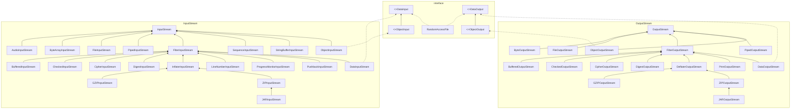
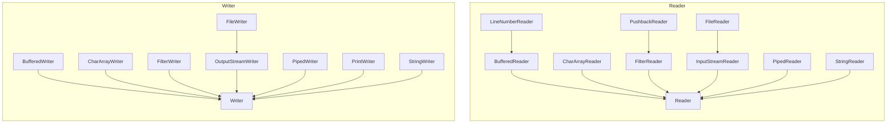
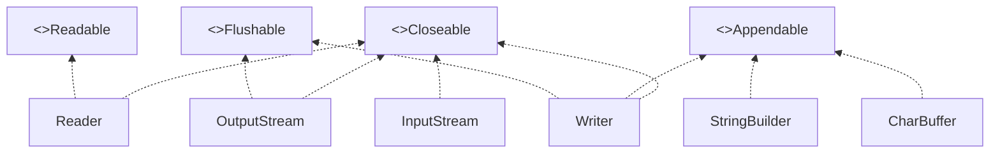

# 第2章 输入与输出

## 2.1 输入/输出流

在Java API中，可以从其中读入一个字节序列的对象称作**输入流**，而可以向其中写入一个字节序列的对象称作**输出流**。这些字节序列的来源地和目的地可以是文件，而且通常都是文件，但是也可以是网络连接，甚至是内存块。抽象类InputStream和OutputStream构成了输入/输出（I/O)类层次结构的基础。

*注意：这些输入/输出流与在前一章中看到的流没有任何关系。为了清楚起见，只要是讨论用于输入和输出的流，我们都将使用术语输入流、输出流或输入/输出流。*

### 2.1.1 读写字节

InputStream类有一个抽象方法read()

这个方法将读入一个字节，并返回读入字节，或者在遇到输入源结尾时返回-1。在设计具体的输入流类时，必须覆盖这个方法以提供适用的功能。

InputStream类还有若干个非抽象的方法，它们可以读入一个字节数组，或者跳过大量的字节。这些方法都要调用抽象的read方法，因此，各个子类都只需覆盖这一个方法。

与此类似，OutputStream类定义了下面的抽象方法：write(int b)

它可以向某个输出位置写出一个字节。

read和write方法在执行时都将阻塞，直至字节确实被读入或写出。

available方法使我们可以去检查当前可读入的字节数量。

当你完成对输入/输出流的读写时，应该通过调用close方法来关闭它，这个调用会释放掉十分有限的操作系统资源。如果一个应用程序打开了过多的输入/输出流而没有关闭，那么系统资源将被耗尽。关闭一个输出流的同时还会冲刷用于该输出流的缓冲区：所有被临时置于缓冲区中，以便用更大的包的形式传递的字节在关闭输出流时都将被送出。特别是，如果不关闭文件，那么写出字节的最后一个包可能将永远得不到传递。当然，我们还可以用flush方法来人为地冲刷出这些输出。

我们可以使用众多的从基本InputStream和OutputStream类导出的某个输入/输出类，而不只是直接使用字节。

【API】java.io.InputStream 1.0 :

- `abstract int read()`
  从数据中读入一个字节，并返回该字节。这个read方法在碰到输入流的结尾时返回-1.
- `int read(byte[] b)`
  读入一个字节数组，并返回实际读入的字节数，或者在碰到输入流的结尾时返回-1.这个read方法最多读入b.length个字节。
- `int read(byte[] b, int off, int len)`
  读入一个字节数组。这个read方法返回实际读入的字节数，或者在碰到输入流的结尾时返回-1.
  参数：b    数据读入的数组
  off    第一个读入字节应该被放置的位置在b中的偏移量
  len    读入字节的最大数量
- `long skip(long n)`
  在输入流中跳过n个字节，返回实际跳过的字节数（如果碰到输入流的结尾，则可能小于n）。
- `int available()`
  返回在不阻塞的情况下可获取的字节数（回忆一下，阻塞意味着当前线程将失去它对资源的占用。）
- `void close()`
  关闭这个输入流。
- `void mark(int readlimit)`
  在输入流的当前位置打一个标记（并非所有的流都支持这个特性）。如果从输入流中已经读入的字节多于readlimit个，则这个流允许忽略这个标记。
- `void reset()`
  返回到最后一个标记，随后对read的调用将重新读入这些字节。如果当前没有任何标记，则这个流不被重置。
- `boolean markSupported()`
  如果这个流支持打标记，则返回true。

【API】java.io.OutputStream 1.0 :

- `abstract void write(int n)`
  写出一个字节的数据。
- `void write(byte[] b)`
- `void write(byte[] b, int off, int len)`
  写出所有字节或者某个范围的字节到数组b中。
  参数：b    数据写出的数组
  off    第一个写出字节在b中的偏移量
  len    写出字节的最大数量
- `void close()`
  冲刷并关闭输出流。
- `void flush()`
  冲刷输出流，也就是将所有缓冲的数据发送到目的地。

### 2.1.2 完整的流家族



DataInputStream和DataOutputStream可以以二进制格式读写所有的基本Java类型。

ZipInputStream和ZipOutputStream可以以常见的ZIP压缩格式读写文件。

另一方面，对于Unicode文本，可以使用抽象类Reader和Writer的子类。Reader和Writer类的基本方法与InputStream和OutputStream中的方法类似。

read方法将返回一个Unicode码元（一个在0~65535之间的整数），或者在碰到文件结尾时返回-1。write方法在被调用时，需要传递一个Unicode码元（请查看卷I第3章有关Unicode码元的讨论）。



还有四个附加的接口：Closable、Flushable、Readable和Appendable。



【API】java.io.Closeable 5.0 :

- `void close()`
  关闭这个Closeable，这个方法可能会抛出IOException。

【API】java.io.Flushable 5.0 :

- `void flush()`
  冲刷这个Flushable。

【API】java.lang.Readable 5.0 :

- `int read(CharBuffer cb)`
  尝试着向cb读入其可持有数量的char值。返回读入的char值的数量，或者当从这个Readable中无法再获得更多的值时返回-1。

【API】java.lang.Appendable 5.0 :

- `Appendable append(char c)`
- `Appendable append(charSequence cs)`
  向这个Appendable中追加给定的码元或者给定的序列中所有码元，返回this。

【API】java.lang.CharSequence 1.4 :

- `char charAt(int index)`
  返回给定索引处的码元。
- `int length()`
  返回在这个序列中的码元数量。
- `CharSequence subSequence(int startIndex, int endIndex)`
  返回由存储在startIndex到endIndex-1处的所有码元构成的CharSequence。
- `String toString()`
  返回这个序列中所有码元构成的字符串。

### 2.1.3 组合输入/输出流过滤器

*提示：所有在java.io中的类都将相对路径名解释为以用户工作目录开始，你可以通过调用System.getProperty("user.dir")来获得这个信息。*

*警告：由于反斜杠字符在Java字符串中是转义字符，因此要确保在Windows风格的路径名中使用`\\`。在Windows中，还可以使用单斜杠字符，因为大部分Windows文件处理的系统调用都会将斜杠解释成文件分隔符。但是，并不推荐这样做，因为Windows系统函数的行为会因与时俱进而发生变化。因此，对于可移植的程序来说，应该使用程序所运行平台的文件分隔符，我们可以通过常量字符串java.io.File.separator获得它。*

Java使用了一种灵巧的机制来分离这两种职责。某些输入流（例如FileInputStream和由URL类的openStream方法返回的输入流）可以从文件和其他更外部的位置上获取字节，而其他的输入流（例如DataInputStream）可以将字节组装到更有用的数据类型中。Java程序员必须对二者进行组合。

你可以通过嵌套过滤器来添加多重功能。例如，输入流在默认情况下是不被缓冲区缓存的，也就是说，每个对read的调用都会请求操作系统再分发一个字节。相比之下，请求一个数据块并将其置于缓冲区中会显得更加高效。

有时当多个输入流链接在一起时，你需要跟踪各个中介输入流（intermediate input stream）。	PushbackInputStream预读下一个字节并且在它并非你所希望的值时将其推回流中。

读入和推回是可应用于可回推（pushback）输入流的仅有的方法。

当然，在其他编程语言的输入/输出流类库中，诸如缓冲机制和预览等细节都是自动处理的。因此，相比较而言，Java就有一点麻烦，它必须将多个流过滤器组合起来。但是，这种混合并匹配过滤器类以构建真正有用的输入/输出流序列的能力，将带来极大的灵活性。

【API】java.io.FileInputStream 1.0 :

- `FileInputStream(Stream name)`
- `FileInputStream(File file)`

【API】java.io.FileOutputStream 1.0 :

- `FileOutputStream(String name)`
- `FileOutputStream(String name, boolean append)`
- `FileOutputStream(File file)`
- `FileOutputStream(File file, boolean append)`

【API】java.io.BufferedInputStream 1.0 :

- `BufferedInputStream(InputStream in)`

【API】java.io.BufferedOutputStream 1.0 :

- `BufferedOutputStream(OutputStream out)`

【API】java.io.PushbackInputStream 1.0 :

- `PushbackInputStream(InputStream in)`
- `PushbackInputStream(InputStream in, int size)`
- `void unread(int b)`

## 2.2 文本输入与输出

### 2.2.1 如何写出文本输出

对于文本输出，可以使用PrintWriter。

println方法在行中添加了对目标系统来说恰当的行结束符（Windows系统是"\r\n"，UNIX系统是"\n"）

自动冲刷模式	默认情况下，自动冲刷机制是禁用的

print方法不抛出异常，你可以调用checkError方法来查看输出流是否出现了某些错误。

*注意：在Java1.0中，PrintStream类只是通过将高字节丢弃的方式把所有Unicode字符截断成ASCII字符。	为了与已有代码兼容，System.in、System.out、System.err仍旧是输入/输出流而不是读入器和写出器。但是现在PrintStream类在内部采用与PrintWriter相同的方式将Unicode字符转换成了默认的主机编码方式。当你在使用print和println方法时，PrintStream类型的对象的行为看起来确实很像打印写出器，但是与打印写出器不同的是，它们允许我们用write(int)和write(byte[])方法输出原生字节。*

【API】java.io.PrintWriter 1.1 :

- `PrintWriter(Write out)`
- `PrintWriter(Writer writer)`
- `PrintWriter(String filename, String encoding)`
- `PrintWriter(File file, String encoding)`
- `void print(Object obj)`
- `void print(String s)`
- `void println(String s)`
- `void print(char[] s)`
- `void print(char c)`
- `void print(int i)`
- `void print(long l)`
- `void print(float f)`
- `void print(double d)`
- `void print(boolean b)`
- `void printf(String format, Object... args)`
- `boolean checkError()`

### 2.2.2 如何读入文本输入

在早期Java版本中，处理文本输入的唯一方式就是通过BufferedReader类。它的readline方法会产生一行文本，或者在无法获得更多输入时返回null。

如今，BufferedReader类又有了一个lines方法，可以产生一个Stream\<String>对象。但是，与Scanner不同，BufferedReader没有用于任何读入数字的方法。

### 2.2.3 以文本格式存储对象

### 2.2.4 字符编码方式

最常见的编码方式是UTF-8,它会将每个Unicode编码点编码为1到4个字节的序列。UTF-8的好处是传统的包含了英语中用到的所有字符的ASCII字符集中的每个字符都只会占用一个字节。

另一种常见的编码方式是UTF-16，它会将每个Unicode编码点编码为1个或2个16位值。这是一种在Java字符串中使用的编码方式。实际上，有两种形式的UTF-16，被称为“高位优先”和“低位优先”。

*警告：有些程序，包括Microsoft Notepad（微软记事本）在内，都在UTF-8编码的文件开头处添加了一个字节顺序标记。很明显，这并不需要，因为在UTF-8中，并不存在字节顺序的问题。但是Unicode标准允许这样做，甚至认为这是一种好的做法，因为这样做可以使编码机制不留疑惑。遗憾的是，Java并没有这么做。	对你来说，最好的做法是将输入中发现的所有先导的\uFEFF都剥离掉。*

不存在任何可靠的方式可以自动地探测出字节流中所使用的字符编码方式。

*注意：平台使用的编码方式可以由静态方法Charset.defaultCharset返回。静态方法Charset.availableCharsets会返回所有可用的Charset实例，返回结果一个从字符集的规范名称到Charset对象的映射表。*

*警告：Oracle的Java实现有一个用于覆盖平台默认值的系统属性file.encoding。但是它并非官方支持的属性，并且Java库的Oracle实现的所有部分并非都以一致的方式处理该属性，因此，你不应该设置它。*

StandardCharsets类具有类型为Charset的静态变量，用于表示每种Java虚拟机都必须支持的字符编码方式。

为了获得另一种编码方式的Charset，可以使用静态的forName方法。

*警告：在不指定任何编码方式时，有些方法（例如String（byte[ ]）构造器）会使用默认的平台编码方式，而其他方法（例如Files.readAllLines）会使用UTF-8*

## 2.3 读写二进制数据

### 2.3.1 DataInput和DataOutput

DataOutput接口定义了用于二进制格式写数组、字符、boolean值和字符串的方法。

例如，writeInt总是将一个整数写出为4字节的二进制数量值，而不管它有多少位，writeDouble总是将一个double值写出为8字节的二进制数量值。这样产生的结果并非人可阅读的，但是对于给定类型的每个值，所需的空间都是相同的，而且将其读回也比解析文本要快。

*注意：在Java中，所有的值都按照高位在前的模式写出，不管使用何种处理器，这使得Java数据文件可以独立于平台。*

writeUTF方法使用修订版的8位Unicode转换格式写出字符串。这种方式与直接使用标准的UTF-8编码方式不同，其中，Unicode码元序列首先用UTF-16表示，其结果之后使用UTF-8规则进行编码。修订后的编码方式对于编码大于0xFFFF的字符的处理有所不同，这是为了向后兼容在Unicode还没有超过16位构建的虚拟机。

因为没有其他方法会使用UTF-8的这种修订，所以你应该只在写出用于Java虚拟机的字符串时才使用writeUTF方法。	对于其他场合，都应该使用writeChars方法。

【API】java.io.DataInput 1.0 :

- `boolean readBoolean()`
- `byte readByte()`
- `char readChar()`
- `double readDouble()`
- `float readFloat()`
- `int readInt()`
- `long readLong()`
- `short readShort()`
- `void readFully(byte[] b)`
- `void readFully(byte[] b,int off,int len)`
- `String readUTF()`
- `int skipBytes(int n)`

【API】java.io.DataOutput 1.0 :

- `void writeBoolean(boolean b)`
- `void writeByte(int b);`
- `void writeChar(int c)`
- `void writeDouble(double d)`
- `void writeFloat(float f)`
- `void writeInt(int i)`
- `void writeLong(long l)`
- `void writeShort(int s)`
- `void writerChars(String s)`
- `void writeUTF(String s)`

### 2.3.2 随机访问文件

RandomAccessFile类可以在文件中的任何位置查找或写入数据。磁盘文件都是随机访问的，但是与网络套接字通信的输入/输出流却不是。你可以打开一个随机访问文件，只用于读入或者同时用于读写，你可以通过使用字符串“r”（用于读入访问）或“rw”（用于读入/写出访问）作为构造器的第二个参数来指定这个选项。

当你将已有文件作为RandomAccessFile打开时，这个文件并不会被删除。

随机访问文件有一个表示下一个将被读入或写出的字节所处位置的文件指针，seek方法可以用来将这个文件指针设置到文件中的任意字节位置。

getFilePointer方法将返回文件指针的当前位置。

RandomAccessFile类同时实现了DataInput和DataOutput接口。

要确定文件中的字节总数，可以使用length方法。

【API】java.io.RandomAccessFile 1.0 :

- `RandomAccessFile(String file, String mode)`
- `RandomAccessFile(File file, String mode)`
- `long getFilePointer()`
- `void seek(long pos)`
- `long length()`

### 2.3.3 ZIP文档

ZIP文档（通常）以压缩格式存储了一个或多个文件，每个ZIP文档都有一个头，包含诸如每个文件的名字和所使用的压缩方法等信息。在Java中，可以使用ZipInputStream来读入ZIP文档。你可能需要浏览文档中每个单独的项，getNextEntry方法就可以返回一个描述这些项的对象。向ZipInputStream的getInputStream方法传递该项用于读取该项的输入流。然后调用closeEntry来读入下一项。下面是典型的通读ZIP文件的代码序列：

```java
ZipInputStream zin = new ZipInputStream(new FileInputStream(zipname));
ZipEntry entry;
while((entry = zin.getNextEntry())!=null){
    InputStream in = zin.getInputStream(entry);
    read the contents of in...
    zin.closeEntry();
}
zin.close();
```

要写出到ZIP文件，可以使用ZipOutputStream，对于你希望放入到ZIP文件中的每一项，都应该创建一个ZipEntry对象，并将文件名传递给ZipEntry的构造器，它将设置其他诸如文件日期和解压缩方法等参数。	下面是代码框架：

```java
FileOutputStream fout = new FileOutputStream("test.zip");
ZipOutputStream zout = new ZipOutputStream(fout);
for all files{
    ZipEntry ze = new ZipEntry(filename);
    zout.putNextEntry(ze);
    send data to zout
    zout.closeEntry();
}
zout.close();
```

*注意：JAR文件只是带有一个特殊项的ZIP文件，这个项称作清单。你可以使用JarInputStream和JarOutputStream来读写清单项*

ZIP输入流是一个能够展示流的抽象化的强大之处的实例。当你读入以压缩格式存储的数据时，不必担心边请求边解压数据的问题，而且ZIP格式的字节源并非必须是文件，也可以是来自网络链接的ZIP数据。事实上，当Applet的类加载器读入JAR文件时，它就是在读入和解压来自网络的数据。

【API】java.util.zip.ZipInputStream 1.1 :

- `ZipInputStream(InputStream in)`
- `ZipEntry getNextEntry()`
- `void closeEntry()`

【API】java.util.zip.ZipOutputStream 1.1 :

- `ZipOutputStream(OutputStream out)`
- `void putNextEntry(ZipEntry ze)`
- `void closeEntry()`
- `void setLevel(int level)`
- `void setMethod(int method)`

【API】java.util.zip.ZipEntry 1.1 :

- `ZipEntry(String name)`
- `long getCrc()`
- `String getName()`
- `long getSize()`
- `boolean isDirectory()`
- `void setMethod(int method)`
- `void setSize(long size)`
- `void setCrc(long crc)`

【API】java.util.zip.ZipFile 1.1 :

- `ZipFile(String name)`
- `ZipFile(File file)`
- `Enumeration entries()`
- `ZipEntry getEntry(String name)`
- `InputStream getInputStream(ZipEntry ze)`
- `String getName()`

## 2.4 对象输入/输出流与序列化

Java语言支持一种称为对象序列化（object serialization）的非常通用的机制，它可以将任何对象写出到输出流中，并在之后将其读回。

### 2.4.1 保存和加载序列化对象

对希望在对象输出流中存储或从对象输入流中恢复的所有类都应进行一下修改，这些类必须实现Serializable接口

Serializable接口没有任何方法。

当一个对象被多个对象分享，作为它们各自状态的一部分时，会发生什么？	保存这样的对象网络是一种挑战，在这里我们当然不能去保存和恢复对象的内存地址。与此不同的是，每个对象都是用一个序列号（serial number）保存的，这就是这种机制之所以称为对象序列化的原因。下面是其算法：

- 对你遇到的每一个对象引用都关联一个序列号。
- 对于每个对象，当第一次遇到时，保存其对象数据到输出流中。
- 如果某个对象之前已经被保存过，那么只写出“与之前保存过的序列号为x的对象相同”。在读回对象时，整个过程是反过来的。
- 对于对象输入流中的对象，在第一次遇到其序列号时，构建它，并使用流中数据来初始化它，然后记录这个顺序号和新对象之间的关联。
- 当遇到“与之前保存过的序列号为x的对象相同”标记时，获取与这个顺序号相关联的对象引用。

*注意：序列化的另一种非常重要的应用是通过网络将对象集合传送到另一台计算机上。*

【API】java.io.ObjectOutputStream 1.1 :

- `ObjectOutputStream(OutputStream out)`
- `void writeObject(Object obj)`

【API】java.io.ObjectInputStream 1.1 :

- `ObjectInputStream(InputStream in)`
- `Object readObject()`

### 2.4.2 理解对象序列化的文件格式

每个文件都是以下面这两个字节的“魔幻数字”开始的

`AC ED`

后面紧跟着对象序列化格式的版本号，目前是

`00 05`

然后是，它包含的对象序列，其顺序即它们存储的顺序。

字符串对象被存为`74 两字节表示的字符串长度 所有字符`	例如，字符串“Harry”被存为`74 00 05 Harry`	字符串中的Unicode字符被存储为修订过的UTF-8格式。

当存储一个对象时，这个对象所属的类也必须存储。这个类的描述包含：

- 类名
- 序列化的版本唯一的ID，它是数据域类型和方法签名的指纹。
- 描述序列化方法的标志集。
- 对数据域的描述。

指纹是通过对类、超类、接口、域类型和方法签名按照规范方式排序，然后将安全散列算法（SHA）应用于这些数据而获得的。

SHA是一种可以为较大信息块提供指纹的快速算法，不论是最初的数据块尺寸有多大，这种指纹总是20个字节的数据包。	序列化机制只使用了SHA码的前8个字节作为类的指纹。即便这样，当类的数据域或方法发生变化时，其指纹跟着变化的可能性还是非常大。

下面表示了类标识符是如何存储的：

- 72
- 2字节的类名长度
- 类名
- 8字节长的指纹
- 1字节长的标志
- 2字节长的数据域描述符的数量
- 数据域描述符
- 78（结束标记）
- 超类类型（如果没有就是70）

标记字节是由在java.io.ObjectStreamConstants中定义的3位掩码构成的。

我们会在本章稍后讨论Externalizable接口。可外部化的类提供了定制的接管其实例域输出的读写方法。我们要写出这些类实现了Serializable接口，并且其标志值为02，而可序列化的java.util.Date类定义了它自己的readObject/writeObject方法，并且其标志值为03。

每个数据域描述符的格式如下：

- 1字节长的类型编码
- 2字节长的域名长度
- 域名
- 类名（如果域是对象）

其中类型编码是下列取值之一：

B	byte

C	char

D	double

F	float

I	int

J	long

L	对象

S	short

Z	boolean

[	数组

当类型编号为L时，域名后面紧跟域的类型。类名和域名字符串不是以字符串编码74开头的，但域类型是。域类型使用的是与域名稍有不同的编码机制，即本地方法使用的格式。

例如，Employee类的薪水域被编码为：

`D 00 06 salary`

下面是Employee类完整的类描述符：

```
72 00 08 Employee
	E6 D2 86 7D AE AC 18 1B 02		指纹和标志
	00 03							实例域的数量
	D 00 06 salary					实例域的类型和名字
	L 00 07 hireDay					实例域的类型和名字
	74 00 10 Ljava/util/Date		实例域的类名——Date
	L 00 04 name					实例域的类型和名字
	74 00 12 Ljava/lang/String		实例域的类名——String
	78								结束标记
	70								无超类
```

这些描述符相当长，如果在文件中再次需要相同的类描述符，可以使用一种缩写版：

`71		4字节长的序列号`

这个序列号将引用到前面已经描述过的类描述符，我们稍后将讨论编号模式。


你应该记住：

- 对象流输出中包含所有对象的类型和数据域。
- 每个对象都被赋予一个序列号。
- 相同对象的重复出现将被存储为对这个对象的序列号的引用。

### 2.4.3 修改默认的序列化机制

某些数据域是不可以序列化的，例如，只对本地方法有意义的存储文件句柄或窗口句柄的整数值，这种信息在稍后重新加载对象或将其传送到其他机器上时都是没有用处的。事实上，这种域的值如果不恰当，还会引起本地方法崩溃。Java拥有一种很简单的机制来防止这种域被序列化，那就是将它们标记成是transient的。如果这些域属于不可序列化的类，你也需要将它们标记成transient的。瞬时的域在对象被序列化时总是被跳过的。

序列化机制为单个的类提供了一种方式，去向默认的读写行为添加验证或任何其他想要的行为。可序列化的类可以定义具有下列签名的方法：

`private void readObject(ObjectInputStream in) throws IOException, ClassNotFoundException;`

`private void writeObject(ObjectOutputStream out) throws IOException;` 

之后，数据域就再也不会被自动序列化，取而代之的是调用这些方法。

readObject和writeObject方法只需要保存和加载它们的数据域，而不需要关心超类数据和任何其他类的信息。

除了让序列化机制来保存和恢复对象数据，类还可以定义它自己的机制。为了做到这一点，这个类必须实现Externalizable接口，这需要它定义两个方法：

`public void readExternal(ObjectInputStream in) throws IOException, ClassNotFoundException;`

`public void writeExternal(ObjectOutputStream out) throws IOException;`

与前面一节描述的readObject和writeObject不同，这些方法对包括超类数据在内的整个对象的存储和恢复负全责。

*警告：readObject和writeObject方法是私有的，并且只能被序列化机制调用。与此不同的是，readExternal和writeExternal方法是公共的。特别是，readExternal还潜在地允许修改现有对象的状态。*

### 2.4.4 序列化单例和类型安全的枚举

当类型安全的枚举实现Serializable接口时，你必须牢记存在着一种重要的变化，此时，默认的序列化机制是不适用的。

为了解决这个问题，你需要定义另外一种称为readResolve的特殊序列化方法。如果定义了readResolve方法，在对象被序列化之后就会调用它。它必须返回一个对象，而该对象之后会成为readObject的返回值。

请记住向遗留代码中所有类型安全的枚举以及向所有支持单例设计模式的类中添加readResolve方法。

### 2.4.5 版本管理

类可以表明它对其早期版本保持兼容，要想这样做，就必须首先获得这个类的早期版本的指纹。我们可以使用JDK中的单机程序serialver来获得这个数字。

这个类的所有较新的版本都必须把serialVersionUID常量定义为与最初版本的指纹相同。

如果一个类具有名为serialVersionUID的静态数据成员，它就不再需要人工地计算其指纹，而只需直接使用这个值。

对象输入流会将这个类当前版本的数据域与被序列化的版本中的数据域进行比较，当然，对象流只会考虑非瞬时和非静态的数据域。如果这两部分数据域之间名字匹配而类型不匹配，那么对象输入流不会尝试将一种类型转换成另一种类型，因为这两个对象不兼容；如果被序列化的对象具有在当前版本中所没有的数据域，那么对象输入流会忽略这些额外的数据；如果当前版本具有在被序列化的对象中所没有的数据域，那么这些新添加的域将被设置成它们的默认值（如果是对象则是null，如果是数字则为0，如果是boolean值则是false）。

### 2.4.6 为克隆使用序列化

序列化机制有一种很有趣的用法：即提供了一种克隆对象的简便途径，只要对应的类是可序列化的即可。其做法很简单：直接将对象序列化到输出流中，然后将其读回。这样产生的新对象是对现有对象的一个深拷贝（deep copy）。在此过程中，我们不必将对象写出到文件中，因为可以用ByteArrayOutputStream将数据保存到字节数组中。

我们应该当心这个方法，尽管它很灵巧，但是它通常会比显式地构建新对象并复制或克隆数据域的克隆方法慢得多。

## 2.5 操作文件

Path和Files类封装了在用户机器上处理文件系统所需的所有功能。例如，Files类可以用来移除或重命名文件，或者查询文件最后被修改的时间。换句话说，输入/输出流类关心的是文件的内容，而我们在此处要讨论的类关心的是在磁盘上如何存储文件。

Path接口和Files类是在Java SE 7 中新添加进来的，它们用起来比自JDK 1.0以来就一直使用的File类要方便得多。

### 2.5.1 Path

Path表示的是一个目录名序列，其后还可以跟着一个文件名。	以跟部件开始的路径是绝对路径；否则就是相对路径。

静态的Paths.get方法接受一个或多个字符串，并将它们用默认文件系统的路径分隔符（类Unix文件系统是/，Windows是\）连接起来。然后它解析连接起来的结果，如果其表示的不是给定文件系统中的合法路径，那么就抛出InvalidPathException异常。这个连接起来的结果就是一个Path对象。

get方法可以获取包含多个部件构成的单个字符串。

组成或解析路径是司空见惯的操作，调用p.resolve(q)将按照下列规则返回一个路径：

- 如果q是绝对路径，则结果就是q。
- 否则，根据文件系统的规则，将“p后面跟着q”作为结果。

resolveSibling

resolve的对立面是relative。

normalize方法

toAbsolutePath方法

*注意：偶尔，你可能需要与遗留系统的API交互，它们使用的是File类而不是Path接口。Path接口有一个toFile方法，而File类有一个toPath方法。*

【API】java.nio.file.Paths 7 :

- `static Path get(String first, String... more)`

【API】java.nio.file.Path 7 :

- `Path resolve(Path other)`
- `Path resolve(String other)`
- `Path resolveSibling(Path other)`
- `Path resolveSibling(String other)`
- `Path relative(Path other)`
- `Path normalize()`
- `Path toAbsolutePath()`
- `Path getParent()`
- `Path getFileName()`
- `Path getRoot()`
- `toFile()`

【API】java.io.File 1.0 :

- `Path toPath()` 7

### 2.5.2 读写文件

Files类可以使得普通文件操作变得快捷。例如，可以用下面的方式很容易地读取文件的所有内容：

`byte[] bytes = Files.readAllBytes(path);`

如果想将文件当做字符串读入，那么可以在调用readAllBytes之后执行下面的代码:

`String content = new String(bytes, charset);`

但是如果希望将文件当作行序列读入，那么可以调用：

`List<String> lines = Files.readAllLines(path, charset);`

相反地，如果希望写出一个字符串到文件中，可以调用：

`Files.write(path, content.getBytes(charset), StandardOpenOption.APPEND);`

还可以用下面的语句将一个行的集合写出到文件中：

`Files.write(path, lines);`

这些简便方法适用于处理中等长度的文本文件，如果要处理的文件长度比较大，或者是二进制文件，那么还是应该使用所熟知的输入/输出流或者读入器/写出器：

```java
InputStream in = Files.newInputStream(path);
OutputStream out = Files.newOutputStream(path);
Reader in = Files.newBufferedReader(path,charset);
Writer out = Files.newBufferedWriter(path,charset);
```

这些简便方法可以将你从处理FileInputStream、FileOutputStream、BufferedReader和BufferedWriter的繁复操作中解脱出来。

【API】java.nio.file.Files 7 :

- `static byte[] readAllBytes(Path path)`
- `static List<String> readAllLines(Path path, Charset charset)`
- `static Path write(Path path, byte[] contents, OpenOption... options)`
- `static Path write(Path path, Iterable<? extends CharSequence> contents, OpenOption options)`
- `static InputStream newInputStream(Path path, OpenOption... options)`
- `static OutputStream newOutputStream(Path path, OpenOption... options)`
- `static BufferedReader newBufferedReader(Path path, Charset charset)`
- `static BufferedWriter newBufferedWriter(Path path, Charset charset, OpenOption... options)`

### 2.5.3 创建文件和目录

【API】java.nio.file.Files 7 :

- `static Path createFile(Path path, FileAttribute<?>... attrs)`
- `static Path createDirectory(Path path, FileAttribute<?>... attrs)`
- `static Path createDirectories(Path path, FileAttribute<?>... attrs)`
  创建一个文件或目录，createDirectories方法还会创建路径中所有的中间目录。
- `static Path createTempFile(String prefix, String suffix, FileAttribute<?>... attrs)`
- `static Path createTempFile(Path parentDir, String prefix, String suffix, FileAttribute<?>... attrs)`
- `static Path createTempDirectory(String prefix, FileAttribute<?>... attrs)`
- `static Path createTempDirectory(Path parentDir, String prefix, FileAttribute<?>... attrs)`
  在适合临时文件的位置，或者在给定的父目录中，创建一个临时文件或目录。返回所创建的文件或目录的路径。

### 2.5.4 复制、移动和删除文件

请查阅表2-3以了解对文件操作而言有用的选项。

StandardOpenOperation；与newBufferedWriter，newInputStream，newOutputStream，write一起使用

| 选项              | 描述                                                         |
| ----------------- | ------------------------------------------------------------ |
| READ              | 用于读取而打开                                               |
| WRITE             | 用于写入而打开                                               |
| APPEND            | 如果用于写入而打开，那么在文件末尾追加                       |
| TRUNCATE_EXISTING | 如果用于写入而打开，那么移除已有内容                         |
| CREATE_NEW        | 创建新文件并且在文件已存在的情况下会创建失败                 |
| CREATE            | 自动在文件不存在的情况下创建新文件                           |
| DELETE_ON_CLOSE   | 当文件被关闭时，尽“可能”地删除该文件                         |
| SPARSE            | 给文件系统一个提示，表示该文件是稀疏的                       |
| DSYN\|SYN         | 要求对文件数据\|数据和元数据的每次更新都必须同步地写入到存储设备中 |

StandardCopyOption；与copy、move一起使用

| 选项             | 描述                     |
| ---------------- | ------------------------ |
| ATOMIC_MOVE      | 原子性地移动文件         |
| COPY_ATTRIBUTES  | 复制文件的属性           |
| REPLACE_EXISTING | 如果目标已存在，则替换它 |

LinkOption；与上面方法以及exists，isDirectory，isRegularFile等一起使用

| 选项           | 描述             |
| -------------- | ---------------- |
| NOFOLLOW_LINKS | 不要跟踪符号链接 |

FileVisitOption;与find，walk，walkFileTree一起使用

| 选项         | 描述         |
| ------------ | ------------ |
| FOLLOW_LINKS | 跟踪符号链接 |

【API】java.nio.file.Files 7 :

- `static Path copy(Path from, Path to, CopyOption... options)`
- `static Path move(Path from, Path to, CopyOption... options)`
  将from复制或移动到给定位置，并返回to。
- `static long copy(InputStream from, Path to, CopyOption... options)`
- `static long copy(Path from, OutputStream to, CopyOption... options)`
  从输入流复制到文件中，或者从文件复制到输出流中，返回复制的字节数。
- `static void delete(Path path)`
- `static boolean deleteIfExists(Path path)`
  删除给定文件或空目录。第一个方法在文件或目录不存在情况下抛出异常，而第二个方法在这种情况下会返回false。

### 2.5.5 获取文件信息

下面的静态方法都将返回一个boolean值，表示检查路径的某个属性的结果：

- exists
- isHidden
- isReadable，isWritable，isExecutable
- isRegularFile，isDirectory，isSymbolicLink

size方法将返回文件的字节数。

getOwner方法将文件的拥有这作为java.nio.file.attribute.UserPrincipal的一个实例返回。

【API】java.nio.file.Files 7 :

- `static boolean exists(Path path)`
- `static boolean isHidden(Path path)`
- `static boolean isReadable(Path path)`
- `static boolean isWritable(Path path)`
- `static boolean isExecutable(Path path)`
- `static boolean isRegularFile(Path path)`
- `static boolean isDirectory(Path path)`
- `static boolean isSymbolicLink(Path path)`
  检查由路径指定的文件的给定属性。
- `static long size(Path path)`
  获取文件按字节数度量的尺寸。
- `A readAttributes(Path path, Class<A> type, LinkOption... options)`
  读取类型为A的文件属性。

【API】java.nio.file.attribute.BasicFileAttributes 7 :

- `FileTime creationTime()`
- `FileTime lastAccessTime()`
- `FileTime lastModifiedTime()`
- `boolean isRegularFile()`
- `boolean isDirectory()`
- `boolean isSymbolicLink()`
- `long size()`
- `Object fileKey()`
  获取所请求的属性。

### 2.5.6 访问目录中的项

静态的Files.list方法会返回一个可以读取目录中各个项的Stream\<Path>对象。目录是被惰性读取的，这使得处理具有大量项的目录可以变得更高效。

list不会进入子目录。为了处理子目录，需要使用Files.walk方法。

可以通过调用Files.walk(pathToRoot, depth)来限制想要访问的树的深度。两种walk方法都具有FileVisitOption... 的可变长参数

### 2.5.7 使用目录流

有时，你需要对遍历过程进行更加细粒度的控制。在这种情况下，应该使用File.newDirectoryStream对象，它会产生一个DirectoryStream。注意，它不是java.util.stream.Stream的子接口，而是专门用于目录遍历的接口。它是Iterable的子接口，因此你可以在增强的for循环中使用目录流。

【API】java.util.file.Files 7 :

- `static DirectoryStream<Path> newDirectoryStream(Path path)`
- `static DirectoryStream<Path> newDirectoryStream(Path path, String glob)`
  获取给定目录中可以遍历所有文件和目录的迭代器。第二个方法只接受那些与给定的glob模式匹配的项。
- `static Path walkFileTree(Path start, FileVisitor<? super Path> visitor)`
  遍历给定路径的所有子孙，并将访问器应用于这些子孙之上。

【API】java.nio.file.SimpleFileVisitor\<T> 7 :

- `static FileVisitResult visitFile(T path, BasicFileAttributes attrs)`
  在访问文件或目录时被调用，返回CONTINUE、SKIP_SUBTREE、SKIP_SIBLINGS和TERMINATE之一，默认实现是不做任何操作而继续访问。
- `static FileVisitResult preVisitDirectory(T dir, BasicFileAttributes attrs)`
- `static FileVisitResult postVisitDirectory(T dir, BasicFileAttributes attrs)`
  在访问目录之前和之后被调用，默认实现是不做任何操作而继续访问。
- `static FileVisitResult visitFileFailed(T path, IOException exc)`
  如果在试图获取给定文件的信息时抛出异常，则该方法被调用。默认实现是重新抛出异常，这会导出访问操作以这个异常而终止。如果你想自己访问，可以覆盖这个方法。

### 2.5.8 ZIP文件系统

【API】java.nio.file.FileSystems 7 :

- `static FileSystem newFileSystem(Path path, ClassLoader loader)`
  对所安装的文件系统提供者进行迭代，并且如果loader不为null，那么就还迭代给定的类加载器能够加载的文件系统，返回由第一个可以接受给定路径的文件系统提供者创建的文件系统。默认情况下，对于ZIP文件系统是有一个提供者的，它接受名字以.zip或.jar结尾的文件。

【API】java.nio.file.FileSystem 7 :

- `static Path getPath(String first, String... more)`
  将给定的字符串连接起来创建一个路径。

## 2.6 内存映射文件

### 2.6.1 内存映射文件的性能

很明显，与随机访问相比，性能提高总是很显著的。另一方面，对于中等尺寸文件的顺序读入则没有必要使用内存映射。

java.nio包使内存映射变得十分简单，下面就是我们需要做的。

首先，从文件中获得一个通道（channel），通道是用于磁盘文件的一种抽象，它使我们可以访问诸如内存映射、文件加锁机制以及文件间快速数据传递等操作系统特性。

然后，通过调用FileChannel类的map方法从这个通道中获得一个ByteBuffer。你可以指定想要映射的文件区域与映射模式，支持的模式有三种：

- FileChannel.MapMode.READ_ONLY: 所产生的缓冲区是只读的，任何对该缓冲区写入的尝试都会导致ReadOnlyBufferException异常。
- FileChannel.MapMode.READ_WRITE: 所产生的缓冲区是可写的，任何修改都会在某个时刻写回到文件中。注意，其他映射同一个文件的程序可能不能立即看到这些修改，多个程序同时进行文件映射行为是依赖于操作系统的。
- FileChannel.MapMode.PRIVATE: 所产生的的缓冲区是可写的，但是任何修改对这个缓冲区来说都是私有的，不会传播到文件中。

一旦有了缓冲区，就可以使用ByteBuffer类和Buffer超类的方法读写数据了。

缓冲区支持顺序和随机数据访问，它有一个可以通过get和put操作来移动的位置。

【API】java.io.FileInputStream 1.0 :

- `FileChannel getChannel()` 1.4

【API】java.io.FileOutputStream 1.0 :

- `FileChannel getChannel()` 1.4

【API】java.io.RandomAccessFile 1.0 :

- `FileChannel getChannel()` 1.4

【API】java.nio.channels.FileChannel 1.4 :

- `static FileChannel open(Path path, OpenOption... options)` 7
- `MappedByteBuffer map(FileChannel.MapMode mode, long position, long size)`

【API】java.nio.Buffer 1.4 :

- `boolean hasRemaining()`
- `int limit()`

【API】java.nio.ByteBuffer 1.4 :

- `byte get()`
- `byte getIndex()`
- `ByteBuffer put(byte b)`
- `ByteBuffer put(int index, byte b)`
- `ByteBuffer get(byte[] destination)`
- `ByteBuffer get(byte[] destination, int offset, int length)`
- `ByteBuffer put(byte[] source, int offset, int length)`
- `Xxx getXxx()`
- `Xxx getXxx(int index)`
- `ByteBuffer putXxx(Xxx value)`
- `ByteBuffer putXxx(int index, Xxx value)`
- `ByteBuffer order(ByteOrder order)`
- `ByteBuffer order()`
- `static ByteBuffer allocate(int capacity)`
- `static ByteBuffer wrap(byte[] values)`
- `charBuffer asCharBuffer()`

【API】java.nio.CharBuffer 1.4 :

- `char get()`
- `CharBuffer get(char[] destination)`
- `CharBuffer get(char[] destination, int offset, int length)`
- `CharBuffer put(char c)`
- `CharBuffer put(char[] source)`
- `CharBuffer put(char[] source, int offset, int length)`
- `CharBuffer put(String source)`
- `CharBuffer put(CharBuffer source)`

### 2.6.2 缓冲区数据结构

缓冲区是具有相同类型的数值构成的数组，Buffer类是一个抽象类，它有众多具体子类，包括ByteBuffer、CharBuffer、DoubleBuffer、IntBuffer、LongBuffer和ShortBuffer。

在实践中，最常用的将是ByteBuffer和CharBuffer。每个缓冲区都具有：

- 一个容量，它永远不能改变。
- 一个读写位置，下一个值将在此进行读写。
- 一个界限，超过它进行读写是没有意义的。
- 一个可选的标记，用于重复一个读入或写入操作。

这些值满足下面的条件：

$0\leq\text标记\leq\text位置\leq\text界限\leq\text容量$

【API】java.nio.Buffer 1.4 :

- `Buffer clear()`
- `Buffer flip()`
- `Buffer rewind()`
- `Buffer mark()`
- `Buffer reset()`
- `int remaining()`
- `int position()`
- `void position(int newValue)`
- `int capacity()`

### 2.6.3 文件加锁机制

要锁定一个文件，可以调用FileChannel类的lock或tryLock方法。

*注意：如果你锁定了文件的尾部，而这个文件的长度随后增长超过了锁定的部分，那么增长出来的额外区域是未锁定的，要想锁定所有的字节，可以使用Long.MAX_VALUE来表示尺寸。*

请记住，文件加锁机制是依赖于操作系统的，下面是需要注意的几点：

- 在某些系统中，文件加锁仅仅是建议性的，如果一个应用未能得到锁，它仍旧可以向被另一个应用并发锁定的文件执行写操作。
- 在某些系统中，不能在锁定一个文件的同时将其映射到内存中。
- 文件锁由整个Java虚拟机持有的。如果有两个程序是由同一个虚拟机启动的（如Applet和应用程序启动器），那么它们不可能每一个都获得一个在同一个文件上的锁。当调用lock和tryLock方法时，如果虚拟机已经在同一文件上持有了另一个重叠的锁，那么这两个方法将抛出OverlappingFileLockException。
- 在一些系统中，关闭一个通道会释放由Java虚拟机持有的底层文件上的所有锁。因此，在同一个锁定文件上应避免使用多个通道。
- 在网络文件系统上锁定文件是高度依赖于系统的，因此应该尽量避免。

【API】java.nio.channels.FileChannel 1.4 :

- `FileLock lock()`
- `FileLock tryLock()`
- `FileLock lock(long position, long size, boolean shared)`
- `Filelock tryLock(long position, long size, boolean shared)`

【API】java.nio.channels.FileLock 1.4 :

- `void close()` 1.7

## 2.7 正则表达式

- 字符类（character class）是一个括在括号中的可选择的字符集，例如，`[Jj]`、`[0-9]`、`[A-Za-z]`或`[\^0-9]`。这里的"`-`"表示是一个范围（所有Unicode值落在两个边界范围之内的字符），而`^`表示补集（除了指定字符之外的所有字符）。
- 如果字符类中包含"`-`"，那么它必须是第一项或最后一项；如果要包含"`[`"，那么它必须是第一项；如果要包含"`^`",那么它可以是除开始位置之外的任何位置。其中你只需要转义"`[`"和"`\`"。

- 有许多预定的字符类，例如`\d`（数字）和`\p{Sc}`(Unicode货币符号)
- 大部分字符都可以与它们自身匹配，例如在前面示例中的ava字符。
- `.`符号可以匹配任何字符（有可能不包括行终止符，这取决于标志的设置）。
- 使用`\`作为转义字符，例如，`\.`匹配句号而`\\`匹配反斜线。
- `^`和`$`分别匹配一行的开头和结尾。
- 如果X和Y是正则表达式，那么XY表示"任何X的匹配后面跟随Y的匹配"，X|Y表示"任何X或Y的匹配"。
- 你可以将量词运用到表达式X：X+(1个或多个)、X*（0个或多个）与X?（0个或1个）。
- ==默认情况下，量词要匹配能够使整个匹配成功的最大可能的重复次数==。你可以修改这种行为，方法是使用后缀？（使用勉强或吝啬匹配，也就是匹配最小的重复次数）或使用后缀+（使用占有或贪婪匹配，也就是即使让整个匹配失败，也要匹配最大的重复次数）。
- 我们使用群组来定义子表达式，其中群组用括号`()`括起来。

关于正则表达式语法的更多信息，可以求教于Pattern类的API文档。

正则表达式最简单用法就是测试某个特定的字符串是否与它匹配。首先用表示正则表达式的字符串构建一个Pattern对象。然后从这个模式中获得一个Matcher，并调用它的matches方法

这个匹配器的输入可以是任何实现了CharSequence接口的类的对象，例如String、StringBuilder和CharBuffer。

通常，你不希望用正则表达式来匹配全部输入，而只是想找出输入中一个或多个匹配的子字符串。这时可以使用Matcher类的find方法来查找匹配内容，如果返回true，再使用start和end方法来查找匹配的内容，或使用不带引元的group方法来获取匹配的字符串。

Matcher类的replaceAll方法将正则表达式出现的所有地方都用替换字符串来替换。

【API】java.util.regex.Pattern 1.4 :

- `static Pattern compile(String expression)`
- `static Pattern compile(String expression, int flags)`
- `Matcher matcher(CharSequence input)`
- `String[] split(CharSequence input)`
- `String[] split(CharSequence input, int limit)`
- `Stream<String> splitAsStream(CharSequence input)` 8

【API】java.util.regex.Matcher 1.4 :

- `boolean matches()`
- `boolean lookingAt()`
- `boolean find()`
- `boolean find(int start)`
- `int start()`
- `int end()`
- `String group()`
- `int groupCount()`
- `int start(int groupIndex)`
- `int end(int groupIndex)`
- `String group(int groupIndex)`
- `String replaceAll(String replacement)`
- `String replaceFirst(String replacement)`
- `static String quoteReplacement(String str)` 5.0
- `Matcher reset()`
- `Matcher reset(CharSequence input)`

