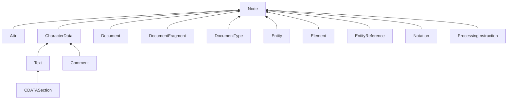

# 第3章 XML

## 3.1 XML概述

你可以用Properties类在单个方法调用中读入这样的属性文件。这是一个很好的特性，但这还不够。在许多情况下，相应描述的信息的结构比较复杂，属性文件不能很方便地处理它。

属性文件采用的是一种单一的平面层次结构。你常常会看到程序员用键名来解决这种局限性

属性文件格式的另一个缺点就是要求键是唯一的。如果要存放一个值序列，则需要另一个变通方法。

XML格式解决了这些问题，因为它能够表示层次结构，这比属性文件的平面表结构更灵活。

XML和HTML格式是古老的标准通用标记语言（Standard Generalized Markup Language，SGML）的衍生语言。

尽管HTML和XML同宗同源，但是两者之间存在着重要的区别：

- 与HTML不同，XML是大小写敏感的。
- 在HTML中，如果从上下文中可以分清哪里是段落或列表项的结尾，那么结束标签就可以省略，而在XML中结束标签绝对不能省略。
- 在XML中，只有单个标签而没有相对应的结束标签的元素必须以`/`结尾，比如``。这样，解析器就知道不需要查找`</img>`。
- 在XML中，属性值必须用引号括起来。在HTML中，引号是可有可无的。
- 在HTML中，属性名可以没有值。在XML中，所有属性必须都有属性值。

### 3.1.1 XML文档的结构

XML文档应当以一个文档头开始，例如：

`<?xml version="1.0"?>`或者`<?xml version="1.0" encoding="UTF-8"?>`

严格来说，文档头是可选的，但是强烈推荐你使用文档头。

文件头之后通常是文档类型定义（Document Type Definition, DTD）。

最后，XML文档的正文包含根元素，根元素包含其他元素。

*提示：在设计XML文档结构时，最好让元素要么包含子元素，要么包含文本。你应该避免混合式内容（mixed content）。在本章中，稍后你会看到，如果避免了混合式内容，就可以简化解析过程。*

一条常用的经验法则是，属性只应该用来修改值的解释，而不是用来指定值。

*注意：在HTML中，属性的使用规则很简单：凡是不显示在网页上的都是属性。*

元素和文本是XML文档“主要的支撑要素”，你可能还会遇到其他一些标记，说明如下：

- 字符引用（character reference）的形式是&#十进制值；或&#x十六进制值；。
- 实体引用（entity reference）的形式是&name；。下面这些实体引用：
  `&lt; &gt; &amp; &quot; &apos;` 都有预定义的含义：小于、大于、&、引号、省略号等字符。还可以在DTD中定义其他的实体引用。
- CDATA部分（CDATA Section）用<!CDATA[ 和 ]]>来限定其界限。它们是字符数据的一种特殊形式。你可以使用它们来囊括那些含有<，>，&之类字符的字符串，而不必将它们解释为标记。
  CDATA部分不能包含字符串 ]]> 。使用这一特性时要特别小心，因为它常用来当做将遗留数据偷偷纳入XML文档的一个后门。
- 处理指令（processing instruction）是那些专门在处理XML文档的应用程序中使用的指令，它们由<? 和 ？>来限定其界限。
- 注释（comment）用<!- 和 -->来限定其界限。
  注释不应该含有字符串--。注释只能是给文档读者提供的信息，其中绝不该含有隐藏的命令，命令应该是用处理指令来实现。

## 3.2 解析XML文档

Java库提供了两种XML解析器：

- 像文档对象模型（Document Object Model，DOM）解析器这样的树型解析器（tree parser），它们将读入的XML文档转换成树结构。
- 像XML简单API（Simple API for XML，SAX）解析器这样的流机制解析器（streaming parser），它们在读入XML文档时生成相应的事件。

DOM解析器对于实现我们大多数目的来说都容易一些，所以我们先介绍它。如果你要处理很长的文档，用它生成树结构将会消耗大量内存，或者如果你只是对于某些元素感兴趣，而不关心它们的上下文，那么在这些情况下你应该考虑使用流机制解析器。

要读入一个XML文档，首先需要一个DocumentBuilder对象，可以从DocumentBuilderFactory中得到这个对象。

Document对象是XML文档的树形结构在内存中的表示方式，它由实现了node接口及其各种子接口的类的对象构成。

可以通过调用getDocumentElement方法启动对文档内容的分析，它将返回根元素。

【API】javax.xml.parsers.DocumentBuilderFactory 1.4 :

- `static DocumentBuilderFactory newInstance()`
- `DocumentBuilder newDocumentBuilder()`

【API】javax.xml.parsers.DocumentBuilder 1.4 :

- `Document parse(File f)`
- `Document parse(String url)`
- `Document parse(InputStream in)`

【API】org.w3c.dom.Document 1.4 :

- `Element getDocumentElement()`

【API】org.w3c.dom.Element 1.4 :

- `String getTagName()`
- `String getAttribute(String name)`

【API】org.w3c.dom.Node 1.4 :

- `NodeList getChildNodes()`
- `Node getFirstChild()`
- `Node getLastChild()`
- `Node getNextSibling()`
- `Node getPreviousSibling()`
- `Node getParentNode()`
- `NamedNodeMap getAttributes()`
- `String getNodeName()`
- `String getNodeValue()`

【API】org.w3c.dom.CharacterData 1.4 :

- `String getData()`

【API】org.w3c.dom.NodeList 1.4 :

- `int getLength()`
- `Node item(int index)`

【API】org.w3c.dom.NamedNodeMap 1.4 :

- `int getLength()`
- `Node item(int index)`

## 3.3 验证XML文档

如果要指定文档结构，可以提供一个文档类型定义（DTD）或一个XML Schema定义。

### 3.3.1 文档类型定义

DOCTYPE声明

SYSTEM声明

ELEMENT规则

缩写PCDATA

*注意：实际上，在DTD规则中并不能为元素指定任意的正则表达式，XML解析器会拒绝导致某些非确定性的复杂规则。*

【API】javax.xml.parsers.DocumentBuilder 1.4 :

- `void setEntityResolver(EntityResolver resolver)`
- `void setErrorHandler(ErrorHandler handler)`

【API】org.xml.sax.EntityResolver 1.4 :

- `public InputSource resolveEntity(String publicID, String systemID)`

【API】org.xml.sax.InputSource 1.4 :

- `InputSource(InputStream in)`
- `InputSource(Reader in)`
- `InputSource(String systemID)`

【API】org.xml.sax.ErrorHandler 1.4 :

- `void fatalError(SAXParseException exception)`
- `void error(SAXParseException exception)`
- `void warning(SAXParseException exception)`

【API】org.xml.sax.SAXParseException 1.4 :

- `int getLineNumber()`
- `int getColumnNumber()`

【API】javax.xml.parsers.DocumentBuilderFactory 1.4 :

- `boolean isValidating()`
- `void setValidating(boolean value)`
- `boolean isIgnoringElementContentWhitespace()`
- `void setIgnoringElementContentWhitespace(boolean value)`

### 3.3.2 XML Schema

Schema为每个元素都定义了类型。类型可以是简单类型，即有格式限制的字符串，或者是复杂类型。

可以定义自己的简单类型。

类型约束了元素的内容。

你可以把类型组合成复杂类型。

xsd:sequence 结构和DTD中的连接符号等价，而xsd:choice 结构和 | 操作符等价。

如果要允许重复元素，可以使用minoccurs和maxoccurs属性。

如果要指定属性，可以把xsd:attribute元素添加到complexType定义中去

解析带有Schema的XML文件和解析DTD的文件相似，但有3点差别：

（1）必须打开对命名空间的支持，即使在XML文件里你可能不会用到它。

（2）必须通过如下的“魔咒”来准备好处理Schema的工厂。

（3）解析器不会丢弃元素中的空白字符，这确实很令人恼火，关于这是否是一个bug，人们看法不一。

### 3.3.3 实用示例

### 3.3.4 使用XPath来定位信息

使用XPath执行下列操作比普通的DOM方式要简单得多：

1）获得文档节点

2）枚举它的子元素

3）定位database元素

4）定位其子节点中名字为username的节点。

5）定位其子节点中的text节点。

6）获取其数据。

Java SE 5.0 添加了一个API来计算XPath表达式，首先需要从XPathFactory创建一个XPath对象

然后调用evaluate方法来计算XPath表达式。

【API】javax.xml.xpath.XPathFactory 5.0 :

- `static XPathFactory newInstance()`
- `XPath newXpath()`

【API】javax.xml.xpath.XPath 5.0 :

- `String evaluate(String expression, Object startingPoint)`
- `Object evaluate(String expression, Object startingPoint, QName resultType)`

## 3.5 使用命名空间

XML也有类似的命名空间（namespace）机制，可以用于元素名和属性名。

名字空间是由统一资源标识符（Uniform Resource Identifier，URI）来标识的。

【API】org.w3c.dom.Node 1.4 :

- `String getLocalName()`
- `String getNamespaceURI()`

【API】javax.xml.parsers.DocumentBuilderFactory 1.4 :

- `boolean isNamespaceAware()`
- `void setNamespaceAware(boolean value)`

## 3.6 流机制解析器

DOM解析器会完整地读入XML文档，然后将其转换为一个树形数据结构。对于大多数应用，DOM都运行得很好。但是，如果文档过大，并且处理算法又非常简单，可以在运行时解析节点，而不必看到完整的树形结构，那么DOM可能就会显得效率低下了。在这种情况下，我们应该使用流机制解析器（streaming parser）。

老而弥坚的SAX解析器和添加到Java SE 6中的更现代化的StAX解析器。SAX解析器使用的是事件回调（event callback），而StAX解析器提供了遍历解析事件的迭代器，后者用起来通常更方便一些。

### 3.6.1 使用SAX解析器

实际上，DOM解析器是在SAX解析器基础上构建的，它在接收到解析器事件时构建DOM树。

在使用SAX解析器时，需要一个处理器来为各种解析器事件定义事件动作。ContentHandler接口定义了若干个在解析文档时解析器会调用的回调方法。下面是最重要的几个：

- startElement和endElement在每当遇到起始或终止标签时调用。
- characters 在每当遇到字符数据时调用。
- startDocument和endDocument分别在文档开始和结束时各调用一次。

*注意：遗憾的是，HTML不必是合法的XML。    但是，W3C编写的大部分页面都是用XHTML编写的，XHTML是一种HTML方言，且是良构的XML，你可以用这些页面来测试实例程序。*

与DOM解析器一样，命名空间处理特性默认是关闭的。

【API】javax.xml.parsers.SAXParserFactory 1.4 :

- `static SAXParserFactory newInstance()`
- `SAXParser newSAXParser()`
- `boolean isNamespaceAware()`
- `void setNamespaceAware(boolean value)`
- `boolean isValidating`
- `void setValidating(boolean value)`

【API】 javax.xml.parsers.SAXParser 1.4 :

- `void parse(File f, DefaultHandler handler)`
- `void parse(String url, DefaultHandler handler)`
- `void parse(InputStream in, DefaultHandler handler)`

【API】org.xml.sax.ContentHandler 1.4 :

- `void startDocument()`
- `void endDocument()`
- `void startElement(String uri, String lname, String qname, Attributes attr)`
- `void endElement(String uri, String lname, String qname)`
- `void characters(char[] data, int start, int length)`

【API】org.xml.sax.Attributes 1.4 :

- `int getLength()`
- `String getLocalName(int index)`
- `String getURI(int index)`
- `String getQName(int index)`
- `String getValue(int index)`
- `String getValue(String qname)`
- `String getValue(String uri, String lname)`

### 3.6.2 使用StAX解析器

StAX解析器是一种“拉解析器（pull parser）”。

【API】javax.xml.stream.XMLInputFactory 6 :

- `static XMLInputFactory newInstance()`
- `void setProperty(String name, Object value)`
- `XMLStreamReader createXMLStreamReader(InputStream in)`
- `XMLStreamReader createXMLStreamReader(InputStream in, String characterEncoding)`
- `XMLStreamReader createXMLStreamReader(Reader in)`
- `XMLStreamReader createXMLStreamReader(Source in)`

【API】javax.xml.stream.XMLStreamReader 6 :

- `boolean hasNext()`
- `int next()`
- `boolean isStartElement()`
- `boolean isEndElement()`
- `boolean isCharacters()`
- `boolean isWhiteSpace()`
- `QName getName()`
- `String getLocalName()`
- `String getText()`
- `int getAttributeCount()`
- `QName getAttributeName(int index)`
- `String getAttributeLocalName(int index)`
- `String getAttributeValue(int index)`
- `String getAttributeValue(String namespaceURI, String name)`

## 3.7 生成XML文档

一种更好的方式是由文档的内容构建一棵DOM树，然后在写出该树的所有内容。

### 3.7.1 不带命名空间的文档

要建立一棵DOM树，你可以从一个空的文档开始。通过调用DocumentBuilder类的newDocument方法可以得到一个空文档。

使用Document类的createElement方法可以构建文档里的元素。

使用createTextNode方法可以构建文本节点

在建立DOM树时，可能还需要设置元素属性，这只需调用Element类的setAttribute方法即可

### 3.7.2 带命名空间的文档

首先，需要将生成器工厂设置为是命名空间感知的，然后在创建生成器。

然后使用createElementNS而不是createElement来创建所有节点。

如果节点具有带命名空间前缀的限定名，那么所有必需的带有xmlns前缀的属性都会被自动创建。

如果需要设置的元素属性的名字位于命名空间中，那么可以使用Element类的setAttributeNS方法。

### 3.7.3 写出文档

有些奇怪的是，把DOM树写出到输出流并非一件易事。最容易的方式是使用可扩展的样式表语言转换（Extensible Stylesheet Language Transformation，XSLT）API。

### 3.7.4 示例：生成SVG文件

【API】javax.xml.parsers.DocumentBuilder 1.4 :

- `Document newDocument()`

【API】org.w3c.dom.Document 1.4 :

- `Element createElement(String name)`
- `Element createElementNS(String uri, String qname)`
- `Text createTextNode(String data)`

【API】org.w3c.dom.Node 1.4 :

- `Node appendChild(Node child)`

【API】org.w3c.dom.Element 1.4 :

- `void setAttribute(String name, String value)`
- `void setAttribute(String uri, String qname, String value)`

【API】javax.xml.transform.TransformerFactory 1.4

- `static TransformerFactory newInstance()`
- `Transformer newTransformer()`

【API】javax.xml.transform.Transformer 1.4

- `void setOutputProperty(String name, String value)`
- `void transform(Source from, Result to)`

【API】javax.xml.transform.dom.DOMSource 1.4 :

- `DOMSource(Node n)`

【API】javax.xml.transform.stream.StreamResult 1.4 :

- `StreamResult(File f)`
- `StreamResult(OutputStream out)`
- `StreamResult(Writer out)`
- `StreamResult(String systemID)`

### 3.7.5 使用StAX写出XML文档

【API】javax.xml.stream.XMLOutputFactory 6 :

- `static XMLOutputFactory newInstance()`
- `XMLStreamWriter createXMLStreamWriter(OutputStream in)`
- `XMLStreamWriter createXMLStreamWriter(OutputStream in, String characterEncoding)`
- `XMLStreamWriter createXMLStreamWriter(Writer in)`
- `XMLStreamWriter createXMLStreamWriter(Result in)`

【API】javax.xml.stream.XMLStreamWriter 6 :

- `void writeStartDocument()`
- `void writeStartDocument(String xmlVersion)`
- `void writeStartDocument(String encoding, String xmlVersion)`
- `void setDefaultNamespace(String namespaceURI)`
- `void setPrefix(String prefix, String namespaceURI)`
- `void writeStartElement(String localName)`
- `void writeStartElement(String namespaceURI, String localName)`
- `void writeEndElement()`
- `void writeEndDocument()`
- `void writeEmptyElement(String localName)`
- `void writeEmptyElement(String namespaceURI, String localName)`
- `void writeAttribute(String localName, String value)`
- `void writeAttribute(String namespaceURI, String localName, String value)`
- `void writeCharacters(String text)`
- `void writeCData(String text)`
- `void writeDTD(String dtd)`
- `void writeComment(String comment)`
- `void close()`

## 3.8 XSL转换

【API】javax.xml.transform.TransformerFactory 1.4 :

- `Transformer newTransformer(Source styleSheet)`
  返回一个transformer类的实例，用来从指定的源中读取样式表。

【API】javax.xml.transform.stream.StreamSource 1.4:

- `StreamSource(File f)`
- `StreamSource(InputStream in)`
- `StreamSource(Reader in)`
- `StreamSource(String systemID)`
  自一个文件、流、阅读器或系统ID（通常是相对或绝对URL）构建一个数据流源。

【API】javax.xml.transform.sax.SAXSource 1.4 :

- `SAXSource(XMLReader reader, InputSource source)`
  构建一个SAX数据源，以便以从给定输入源获取数据，并使用给定的阅读器来解析输入数据。

【API】org.xml.sax.XMLReader 1.4 :

- `void setContentHandler（ContentHandler handler）`
  设置在输入被解析时会被告知解析事件的处理器。
- `void parse(InputSource source)`
  解析来自给定输入源的输入数据，并将解析事件发送到内容处理器。

【API】javax.xml.transform.dom.DOMResult 1.4 :

- `DOMResult(Node n)`
  自给定节点构建一个数据源。通常，n是一个新文档节点。

【API】org.xml.sax.helpers.AttributesImpl 1.4 :

- `void addAttribute(String uri, String lname, String qname, String type, String value)`
  将一个属性添加到该属性集合。
  参数：uri    名字空间的URI
  lname    无前缀的本地名
  qname    带前缀的限定名
  type    类型，“CDATA”、“ID”、“IDREF”、“IDREFS”、“NMTOKEN”、“NMTOKENS”、“ENTITY”、“ENTITIES”或“NOTATION”之一
  value    属性值
- `void clear()`
  删除属性集合中的所有属性。