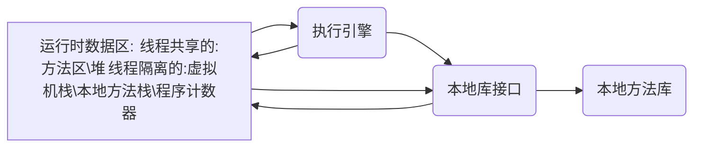

# 第2章 Java内存区域与内存溢出异常

Java与C++之间有一堵由内存动态分配和垃圾收集技术所围成的“高墙”，墙外面的人想进去，墙里面的人却想出来。

## 2.1 概述

## 2.2 运行时数据区域

Java虚拟机在执行Java程序的过程中会把它所管理的内存划分为若干个不同的数据区域：

### 2.2.1 程序计数器

程序计数器（Program Counter Register）是一块较小的空间，它可以看作是当前线程所执行的字节码的行号指示器。

由于Java虚拟机的多线程是通过线程轮流切换并分配处理器执行时间的方式来实现的。因此，为了线程切换后能够恢复到正确的执行位置，每条线程都需要有一个独立的程序计数器，每条线程之间计数器互不影响，独立存储，我们称这类内存区域为“线程私有”的内存。

如果线程正在执行的是一个java方法，这个计数器记录的是正在执行的虚拟机字节码指令的地址；如果正在执行的是Native方法，这个计数器值则为空（Undefined）。此内存区域是唯一一个在Java虚拟机规范中没有规定任何OutOfMemoryError情况的区域。

### 2.2.2 Java虚拟机栈

java虚拟机栈（Java Virtual Machine Stacks）也是线程私有的，它的生命周期与线程相同。虚拟机栈描述的是Java方法执行的内存模型：每个方法在执行的同时都会创建一个栈帧（Stack Frame）用于存储局部变量表、操作数栈、动态链接、方法出口等信息。每一个方法从调用直至执行完成的过程，就对应着一个栈帧在虚拟机栈中入栈到出栈的过程。

经常有人把Java内存区分为堆内存（Heap）和栈内存（Stack），这种分法比较粗糙，Java内存区域划分实际上远比这复杂。这种划分方式的流行只能说明大多数程序员最关注的、与对象内存分配关系最密切的内存区域是这两块。其中所指的“堆”笔者在后面会专门讲述，而所指的“栈”就是现在讲的虚拟机栈，或者说是虚拟机栈中局部变量表部分。

局部变量表存放了编译期可知的各种基本数据类型、对象引用和returnAddress类型

其中64位长度的long和double类型的数据会占用2个局部变量空间（Slot），其余的数据类型只占用1个。==局部变量表所需的内存空间在编译期间完成分配，当进入一个方法时，这个方法需要在帧中分配多大的局部变量空间是完全确定的，在方法运行期间不会改变局部变量表的大小。==

在Java虚拟机规范中，对这个区域规定了两种异常状况：如果线程请求的栈深度大于虚拟机所允许的深度，将抛出StackOverflowError异常；如果虚拟机栈可以动态扩展（当前大部分的Java虚拟机都可动态扩展，只不过Java虚拟机规范中也允许固定长度的虚拟机栈），如果扩展时无法申请到足够的内存，就会抛出OutOfMemoryError异常。

### 2.2.3 本地方法栈

本地方法栈（Native Method Stack）与虚拟机栈所发挥的作用是非常相似的，它们之间的区别不过是虚拟机栈为虚拟机执行Java方法（也就是字节码）服务，而本地方法栈则为虚拟机使用到的Native方法服务。在虚拟机规范中对本地方法栈中方法使用的语言、使用方式与数据结构没有强制规定，因此具体的虚拟机可以自由实现它。==甚至有的虚拟机（譬如Sun HotSpot虚拟机）直接就把本地方法栈和虚拟机栈合二为一。==与虚拟机栈一样，本地方法栈区域也会抛出StackOverflowError和OutOfMemoryError异常。

### 2.2.4 Java堆

对于大多数应用来说，Java堆（Java Heap）是java虚拟机所管理的内存中最大的一块。Java堆是被所有线程共享的一块内存区域，在虚拟机启动时创建。次内存区域的唯一目的就是存放对象实例，几乎所有的对象实例都在这里分配内存。	栈上分配、标量替换优化技术

Java堆是垃圾收集器管理的主要区域，因此很多时候也被称作“GC堆”。从内存回收的角度来看，由于现在收集器基本都采用分代收集算法，所以Java堆中还可以细分为：新生代和老年代；再细致一点的有Eden空间、From Survivor空间、To Survivor空间等。	多个线程私有的分配缓冲区（Thread Local Allocation Buffer,TLAB）

Java堆可以处于物理上不连续的内存空间中，只要逻辑上是连续的即可，就像我们的磁盘空间一样。在实现时，既可以是固定大小的，也可以是扩展的（主流）。	OutOfMemoryError异常

### 2.2.5 方法区

线程共享	存储已被虚拟机加载的类信息、常量、静态变量、即时编译器编译后的代码等数据。Java虚拟机规范把方法区描述为堆的一个逻辑部分，但是它却有别名叫“非堆（Non-Heap）”,目的应该是与Java堆区分开来。

永久代（Permanent Generation）与方法区本质上并不等价，仅仅是因为HotSpot虚拟机设计团队选择把GC分代收集扩展至方法区，或者说使用永久代来实现方法区而已。	永久代实现方法区，现在看来并不是一个好主意，更容易遇到内存溢出问题。

方法区可以选择不实现垃圾收集。

OutOfMemoryError异常

### 2.2.6 运行时常量池

Runtime Constant Pool， 是方法区的一部分。Class文件中除了有类的版本、字段、方法、接口等描述信息外，还有一项信息常量池（Constant Pool Table），用于存放编译器生成的各种字面量和符号引用，这部分内容将在类加载后进入方法区的运行时常量池存放。

Java虚拟机对Class文件每一部分（自然也包括常量池）的格式都有严格规定，但对于运行常量池，Java虚拟机规范没有做任何细节的要求。

运行时常量池相对于Class文件常量池的另外一个重要特征就是具备动态性，Java语言并不要求常量一定只有编译期才能产生，也就是并非预置入Class文件中常量池的内容才能进入方法区运行的常量池，运行期间也可能将新的常量放入池中，这种特性被开发人员利用得比较多的便是String类的intern()方法。

OutOfMemoryError异常

### 2.2.7 直接内存

Direct Memory，并不是虚拟机运行时数据区的一部分，也不是虚拟机规范中定义的内存区域。但这部分内存也被频繁地使用，而且可能导致OutOfMemoryError异常出现。

JDK 1.4 新加入NIO（New Input/Output）类，引入了一种基于通道（Channel）与缓冲区（Buffer）的I/O方式，它可以使用Native函数库直接分配堆外内存，然后通过一个存储在Java堆中DirectByteBuffer对象作为这块内存的引用进行操作。这样能在一些场景中显著提高性能，因为避免了在Java堆和Native堆中来回复制数据。

OutOfMemeryError异常

## 2.3 HotSpot 虚拟机对象探秘

### 2.3.1 对象的创建

对象（文中讨论的对象限于普通Java对象，不包括数组和Class对象等）的创建是怎样的过程呢？

虚拟机遇到一条new指令时，==首先将去检查这个指令的参数是否能在常量池中定位到一个类的符号引用，并且检查这个符号引用代表的类是否已被加载、解析和初始化过==。如果没有，那必须先执行相应的类加载过程

在类加载检查通过后，==接下来虚拟机将为新生对象分配内存==。对象所需内存的大小在类加载完成后便可完全确定，为对象分配空间的任务等同于把一块确定大小的内存从Java堆中划分出来。	堆中内存绝对规整：“指针碰撞（Bump the Pointer）”	不是规整的：“空闲列表（Free List）”	是否规整由垃圾收集器是否带有压缩整理功能决定。	Serial、ParNew等带Compact过程的收集器	CMS基于Mark-Sweep算法的收集器

对象创建在虚拟机中是非常频繁的行为，并发情况下并不是线程安全的。解决这个问题有两种方案：一种是对分配内存空间的动作进行同步处理——实际上虚拟机采用CAS配上失败重试的方式保证更新操作的原子性；另一种是把内存分配的动作按照线程划分在不同的空间之中进行，即每个线程在Java堆中预先分配一小块内存，称为本地线程分配缓冲（Thread Local Allocation Buffer，TLAB），哪个线程要分配内存，就在哪个线程的TLAB上分配，只有TLAB用完并分配新的FLAB时，才需要同步锁定。虚拟机是否使用TLAB，可以通过-XX：+/-UseTLAB参数来设定。

==内存分配完成后，虚拟机需要将分配到的内存空间都初始化为零值（不包括对象头）==。如果使用TLAB，这一工作过程也可以提前至TLAB分配时进行。这一步操作保证了对象的实例字段在Java代码中可以不赋初值就直接使用，程序能访问到这些字段的数据类型所对应的零值。

==接下来，虚拟机要对对象进行必要的设置==，例如这个对象是哪个类的实例、如何才能找到类的元数据信息、对象的哈希码、对象的GC分代年龄等信息，这些信息存放在对象的对象头（Object Header）之中。

上面工作完成后，虚拟机的视角来看，一个新的对象已经产生了。但从Java程序的视角来看，对象创建才刚刚开始——\<init>方法还没有执行，所有的字段都还为零。

### 2.3.2 对象的内存布局

对象头（Header）、实例数据（Instance Data）、对齐填充（Padding）.

HotSpot对象头包含两部分信息：第一部分对象自身的运行时数据（哈希码、GC分代年龄、锁状态标志、线程持有的锁、偏向线程ID、偏向时间戳等）

另外一部分是类型指针，即对象指向它的类元数据的指针，虚拟机通过这个指针来确定这个对象是哪个类的实例。并不是所有的虚拟机实现都必须在对象数据上保存类型指针，换句话说，查找对象的元数据信息并不一定要经过对象本身。

实例数据是对象真正存储的有效信息，也是在程序代码中所定义的各种类型的字段内容。无论是从父类继承下来的，还是在子类中定义的，都需要记录起来。	分配策略参数（FieldsAllocationStyle）和字段在Java源码中定义顺序	相同宽度字段分配在一起，父类在子类前

对齐填充并不是必然存在的，仅仅起着占位符的作用。HotSpot对象大小必须是8字节整数倍

### 2.3.3 对象的访问定位

需要栈上的reference数据来操作堆上的具体对象。Java虚拟机规范中只规定了一个指向对象的引用，并没有规定引用的具体实现。	主流的访问方式：句柄和直接指针

- 句柄：	句柄池	reference存储对象句柄地址，句柄包含了对象实例数据与类型数据各自的具体地址信息
- 直接指针：	reference中存储对象地址

句柄好处：reference本身不需要修改，只改变句柄中实例数据指针

直接指针的好处：速度更快（Sun HotSpot采用这个）

## 2.4 实战：OutOfMemoryError异常

目的：一、通过代码验证Java虚拟机规范中描述的各个运行时区域存储的内容；二、希望读者在工作中遇到实际的内存溢出异常时，能根据异常的信息快速判断是哪个区域的内存溢出，知道什么样的代码可能导致这些区域内存溢出，以及出现这些异常后该如何处理。

### 2.4.1 Java堆溢出

通过参数`-XX:+HeapDumpOnOutOfMemoryError`可以让虚拟机在出现内存溢出异常时Dump出当前的内存堆转储快照以便事后进行分析。

java.lang.OutOfMemoryError会跟着进一步提示“Java heap space”

要解决这个区域的异常，要先分清楚到底是出现了内存泄露（Memory Leak）还是内存溢出（Memory Overflow）

内存泄露，可进一步通过工具查看泄露对象是通过怎样的路径与GC roots相关联并导致垃圾收集器无法自动回收他们的。

如果不存在泄露，检查虚拟机的堆参数（-Xmx与-Xms），与机器物理内存对比看是否还可以调大，从代码上检查是否存在某些对象生命周期过长、持有状态时间过长的情况，尝试减少程序运行期的内存消耗。

### 2.4.2 虚拟机栈和本地方法栈溢出

HotSpot不区分虚拟机栈和本地方法栈，因此-Xoss参数（设置本地方法栈大小）存在，但实际上是无效的，栈容量只由-Xss参数设定。

关于虚拟机栈和本地方法栈，两种异常：

- StackOverflowError
- OutOfMemoryError

实验证明：在单个线程下，无论是栈帧太大还是虚拟机栈太小，当内存无法分配时，抛出的都是StackOverflowError。

如果测试时不限于单线程，通过不断建立线程的方式到实施可以产生内存溢出异常。

虚拟机默认参数，栈深度大多情况下（每个方法压入栈的帧大小并不是一样的）达到1000~2000完全没有问题，对于正常方法调用（包括递归），这个深度应该完全够用了。==但是，如果是建立过多线程导致的内存溢出，在不能减少线程数或者更换64位虚拟机的情况下，就只能通过减少最大堆和减少栈容量来换取更多线程。==这种通过“减少内存”的手段来解决内存溢出的方式会比较难想到。

*注意：Windows平台的虚拟机中，Java的线程是映射到操作系统的内核线程上的*

### 2.4.3 方法区和运行时常量池溢出

String.intern()是一个Native方法，它的作用是：如果字符串常量池中已经包含一个等于此String对象的字符串，则返回代表池中这个字符串的String对象；否则，将此String对象包含的字符串添加到常量池中，并且返回此String对象的引用。

JDK 1.6及以前，由于常量池分配在永久代内，我们可以通过-XX:PermSize和-XX:MaxPermSize限制方法区大小，从而间接限制其中常量池的容量

运行时常量池溢出，OutOfMemoryError后面跟随“PermGen space”，说明运行时常量池术语方法区（HotSpot虚拟机中的永久代）的一部分

当前许多直流框架，如Spring、Hibernate，在对类进行增强时，都会使用到CGLib这类字节码技术，增强的类越多，就需要越大的方法区来保证动态生成的Class可以加载入内存。另外，JVM上的动态语言（例如Groovy等）通常需要持续创建类来实现语言的动态性，随着这类语言的流行，也越来越容易遇到方法区溢出的场景。

方法区溢出也是一种常见的内存溢出异常，一个类要被垃圾收集器回收掉，判定条件是比较苛刻的。在经常动态生成大量Class应用中，需要特别注意类的回收状况。这类场景除了上面提到的程序使用了CGLib字节码增强和动态语言之外，常见的还有：大量JSP或动态产生JSP文件的应用（JSP第一次运行时需要编译为Java类）、基于OSGi的应用（即使是同一个类文件，被不同的加载器加载也会视为不同的类）等。

### 2.4.4 本机直接内存溢出

DirectMemory容量可以通过-XX:MaxDirectMemorySize指定，如果不指定，则默认与Java堆最大值（-Xmx指定）一样。

DirectMemory导致的内存溢出，一个明显的特征是在Heap Dump文件中不会看见明显的异常，如果读者发现OOM之后Dump文件很小，而程序又直接或间接使用了NIO，那就可以考虑检查一下是不是这方面的原因。

