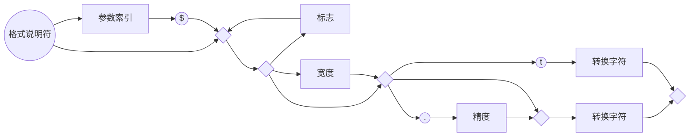

# 第1章 Java程序设计概述

## 1.1 Java程序设计平台

## 1.2 Java“白皮书”的关键术语

1) 简单性	2）面向对象	3）网络技能（Network-Savvy）	4）健壮性	5）安全性	6）体系结构中立	7）可移植性	8）解释型	9）高性能	10）多线程	11）动态性

### 1.2.1 简单性

Java语法是C++语法的一个“纯净版本”。这里没有头文件、指针运算（甚至指针语法）、结构、联合、操作符重载、虚基类等。

如果已经习惯于使用可视化的编程环境（例如Visual Basic），你就不会觉得Java简单了。Java有许多奇怪的语法（尽管掌握其要领并不需要很长时间）。Visual Basic的魅力在于它的可视化设计环境几乎自动地为应用程序提供了大量基础结构。而使用Java实现同样的功能却需要手工编制代码，通常代码量还相当大。

简单性另一方面就是小：基本解释器及类支持大约仅为40KB，再加上基础的标准类库和对线程的支持（基本上是一个自包含的微内核）大约需要增加175KB。

### 1.2.2 面向对象

Java的面向对象特性与C++旗鼓相当。Java和C++的主要不同点在于多继承，在Java取而代之的是简单的接口概念，以及Java的元类（metaclass）模型（这部分内容将在第5章讨论）。

### 1.2.3 网络技能

打开socket链接这类繁重的任务在Java中变得简单。远程方法调用机制使得分布式对象之间可以进行通信。（卷II中介绍）

### 1.2.4 健壮性

Java编译器能够检测许多在其他语言中仅在运行时刻才能够检测出来的问题。

Java绝对是安全的，其原因是永远不会存取一个“坏的”指针，造成内存分配的错误，也不必防范内存泄露

### 1.2.5 安全性

Java一开始就设计成能够防范各种攻击，其中包括：

- 运行时堆栈溢出。如，蠕虫等病毒常用的攻击手段。

- 在自己的处理空间之外破坏内存。

- 未经授权读写文件。

数字签名类

### 1.2.6 体系结构中立

原始Pascal以及UCSD Pascal都使用了这种技术。

解释字节码比全速运行机器指令慢很多。虚拟机有一个选项，可以将使用最频繁的字节码序列翻译成机器码，这一过程被称为即时编译。.NET平台也依赖于虚拟机。

虚拟机可以检测指令序列的行为。有的程序还可以快速地生成字节码，并动态地增强所运行程序的处理能力。

### 1.2.7 可移植性

Java规范中没有“依赖具体实现”的地方。

### 1.2.8 解释型

Java解释器可以在任何移植了解释器的机器上执行Java字节码。由于链接是一个增量式且轻量级的过程，所以开发过程也变得更加快捷，更加具有探索性。

增量型链接有其优势，但给开发过程带来的好处显然是言过其实了。事实上，早期的Java开发工具的速度相当慢。现在，使用即时编译器将字节码翻译成机器码。

### 1.2.9 高性能

使用Java的头几年，许多用户不同意：性能就是“适用性更强”。然而，现在的即时编译器已经非常出色，以至于成了传统编译器的竞争对手，其原因是它们含有更多的可用信息。

消除函数调用（即“内嵌”）

### 1.2.10 多线程

只要操作系统支持，Java中的线程就可以利用多个处理器。在底层，主流平台的线程实现机制各不相同，Java把多线程的实现交给了底层的操作系统或线程库来完成。

### 1.2.11 动态性

Java与C和C++相比更加具有动态性。库中可以自由地添加新方法和实例变量，而对客户端没有任何影响。

## 1.3 Java applet与Internet

这里的想法很简单：用户从Internet下载Java字节码，并在自己的机器上运行。在网页中运行Java程序称为applet。	java源代码的许可证	不允许对语言和基本类库的结构做任何修改	虚拟机的安全机制

如今，浏览器的动态效果大多直接使用JavaScript或Flash。Java已经成为用来开发服务器端应用程序的最流行的语言

## 1.4 Java发展简史

1996年年初 Java1.0 没有打印功能

Java1.1 大大改进了反射能力，并为GUI编程增加了新的事件处理模型。

1998年 Java1.2版 又称Java 2 取代了早期玩具式的GUI，并且它的图形工具箱更加精细而具有可伸缩性，更加接近“一次编写，随处运行”的承诺。

Java1.5 即Java 5 这个版本添加了泛型类型（generic type）（类似于C++的模板）。另外还有几个受C#启发的很有用的语言特性：“for each”循环、自动装箱和元数据。

2006年 Java 6 没有改进语言方面，改进了性能，加强类库

2009年 Sun被Oracle收购。Java开发停滞了很长一段时间。

2011年Java 7 只做了一些很简单的改进

| 版本 | 年份 | 语言新特性                                                   | 类与接口的数量 |
| ---- | ---- | ------------------------------------------------------------ | -------------- |
| 1.0  | 1996 | 语言本身                                                     | 211            |
| 1.1  | 1997 | 内部类                                                       | 477            |
| 1.2  | 1998 | 无                                                           | 1524           |
| 1.3  | 2000 | 无                                                           | 1840           |
| 1.4  | 2002 | 断言                                                         | 2723           |
| 5.0  | 2004 | 泛型类型、foreach循环、可变元参数、自动装箱、元数据、枚举、静态导入 | 3279           |
| 6    | 2006 | 无                                                           | 3793           |
| 7    | 2011 | 基于字符串的switch，变形操作符，二进制字面量，异常处理改进   | 4024           |

## 1.5 关于Java的常见误解

# 第2章 Java程序设计环境

## 2.1 安装Java开发工具箱

### 2.1.1 下载JDK

Java术语

| 术语名                   | 缩写 | 解释                                                |
| ------------------------ | ---- | --------------------------------------------------- |
| Java Development Kit     | JDK  | 编写Java程序的程序员使用的软件                      |
| Java Runtime Environment | JRE  | 运行Java程序的用户使用的软件                        |
| Standard Edition         | SE   | 用于桌面或简单的服务器应用的Java平台                |
| Enterprise Edition       | EE   | 用于复杂的服务器应用的Java平台                      |
| Micro Edition            | ME   | 用于手机和其他小型设备的Java平台                    |
| Java 2                   | J2   | 一个过时的术语，用于描述1998年~2006年之间的Java版本 |
| Software Development Kit | SDK  | 一个过时的术语，用于描述1998年~2006年之间的JDK      |
| Update                   | u    | Oracle的术语，用于发布修改的bug                     |
| NetBeans                 | -    | Oracle的集成开发环境                                |

### 2.1.2 设置执行路径

### 2.1.3 安装库源文件和文档

### 2.1.4 安装本节中的示例

### 2.1.5 导航Java目录

| 目录结构 | 描述                                           |
| -------- | ---------------------------------------------- |
| jdk      | （名字可能带版本号）                           |
| bin      | 编译器和工具                                   |
| demo     | 演示                                           |
| docs     | HTML格式的类库文档（解压j2sdkversion-doc.zip） |
| include  | 用于编译本地方法的文件（参看卷II）             |
| jre      | Java运行环境文件                               |
| lib      | 类库文件                                       |
| src      | 类库源文件（解压src.zip之后）                  |

## 2.2 选择开发环境

过去推荐使用文本编辑器编写简单的程序，如：Emacs，JEdit或者TextPad。现在不会再这样推荐了，因为集成开发环境非常快捷、方便。

## 2.3 使用命令行工具

将CLASSPATH环境变量设置为全局并不是一个提倡的做法。然而，Windows中有些编写很差的软件安装程序就是这样做的。

可以在当前Shell窗口中键入下列命令，临时取消CLASSPATH环境变量的设置：

set CLASSPATH=

## 2.4 使用集成开发环境

Eclipse是采用java编写的。

## 2.5 运行图形化应用程序

## 2.6 建立并运行applet

# 第3章 Java的基本程序设计结构

## 3.1 一个简单的Java应用程序

大小写敏感

访问修饰符（access modifier） 第五章介绍

第四章介绍Java类。Java应用程序中的全部内容都必须放置在类中。

根据Java语言规范，main方法必须声明为public

*C++注释：Java中所有函数都属于某个类的方法（标准术语称其为方法，而不是成员函数）。因此Java中的main方法必须有一个外壳类。读者有可能对C++中的静态成员函数（static member functions）十分熟悉。这些成员函数定义在类的内部，而且不对对象进行操作。Java中的main方法必须是静态的。如果希望在终止程序时返回其他代码，那就需要调用System.exit方法。*

## 3.2 注释

三种

`//`

`/*` 和`*/` 在Java中` /* */`注释不能嵌套。

`/**`和`*/`

## 3.3 数据类型

8种基本类型（primitive type），其中4种整型、2种浮点类型、1种用于表示Unicode编码的字符单元的字符类型char和1种用于表示真值的boolean类型。

*注释：Java有一个能够表示任意精度的算术包，通常称为“大数值”（big number）。虽然被称为大数值，但它并不是一种新的Java类型，而是一个Java对象。*

### 3.3.1 整型

| 类型  | 存储需求 |                       取值范围                        |
| :---: | :------: | :---------------------------------------------------: |
|  int  |  4字节   |     -2,147,483,648~-2,147,483,647（正好超过20亿）     |
| short |  2字节   |                    -32,768~32,767                     |
| long  |  8字节   | -9,223,372,036,854,775,808~-9,223,372,036,854,775,807 |
| byte  |  1字节   |                       -128~127                        |

长整型数值后缀L

十六进制数值前缀0x

八进制前缀0 八进制容易混淆，最好不要用

从Java7开始，加上前缀0b就可以写二进制数。还有可以为数字字面量加下划线，如用1_000_000表示一百万。这些下划线只是为了易读。Java编译器会去除 这些下划线。

*C++注释：Java所有数值类型占据的字节数量与平台无关*

*Java没有任何无符号类型*。

### 3.3.2 浮点类型

|  类型  | 存储需求 |                       取值范围                       |
| :----: | :------: | :--------------------------------------------------: |
| float  |  4字节   |      大约±3.402 823 47E+38F（有效位数为6~7位）       |
| double |  8字节   | 大约±1.797 693 134 862 315 70E+308（有效位数为15位） |

*注释：在JDK5.0中，可以使用十六进制表示浮点数值。例如，0.125可以表示成0x1.0p-3。在十六进制表示法中，使用p表示指数，而不是c。注意，尾数采用十六机制，指数采用十进制。指数的基数是2而不是10.*

所有浮点数计算都遵循IEEE754规范。下面是用于表示溢出和出错情况的三个特殊的浮点数值：

- 正无穷大，例如正整数除以0。常量Double.POSITIVE_INFINITY
- 负无穷大。常量Double.NEGATIVE_INFINITY
- NaN(不是一个数字Not a num)，例如计算0/0或者负数的平方根。常量Double.NaN

*注释：不能使用if(x==Double.NaN)类似方法判定一个特定值是否等于Double.NaN。所有"非数值"的值都认为是不相同的。然而，可以使用Double.isNaN方法：if(Double.isNaN(x))*

*警告：浮点数值不适用于禁止出现舍入误差的金融计算中。如果需要在数值计算中不含有任何舍入误差，就应该使用BigDecimal类*

### 3.3.3 char类型

\u 转义序列符表示Unicode代码单元的编码，可以出现在字符常量或字符串的引号之外（而其他转义序列不可以）。例如：`public static void main(String\u005B\u005D args)`这种形式完全符合语法规则，\u005B和\u005D是[和]的编码。

| 转义序列 |  名称  | Unicode值 |
| :------: | :----: | :-------: |
|    \b    |  退格  |  \u0008   |
|    \t    |  制表  |  \u0009   |
|    \n    |  换行  |  \u000a   |
|    \r    |  回车  |  \u000d   |
|    \"    | 双引号 |  \u0022   |
|    \'    | 单引号 |  \u0027   |
|    \\    | 反斜杠 |  \u005c   |

在设计Java时决定采用16位的Unicode字符集，现在16位char类型已经不能满足描述所有Unicode字符的需要了。

下面解释一下Java解决这个问题的基本方法。从JDK 5.0开始，**代码点（code point）**是指与一个编码表中的某个字符对应的代码值。在Unicode标准中，代码点采用十六进制书写，并加上前缀U+，例如U+0041就是字母A的代码点。Unicode的代码点可以分成17个**代码级别（code plane）**。第一个代码级别称为**基本的多语言级别（basic multilingual plane）**，代码点从U+0000到U+FFFF，其中包含了经典的Unicode代码；其余的16个附加级别，代码点从U+10000到U+10FFFF，其中包括了一些**辅助字符（supplementary character）**。

UTF-16编码采用不同长度的编码表示所有Unicode代码点。在基本的多语言级别中，每个字符用16位表示，通常被称为**代码单元（code unit）**；而辅助字符采用一对连续的代码单元进行编码。这样构成的编码值一定落入基本的多语言级别中空闲的2048字节内，通常被称为**替代区域（surrogate area）**[U+D800\~U+DBFF用于第一个代码单元，U+DC00\~U+DFFF用于第二个代码单元]。这样设计十分巧妙，我们可以从中迅速地知道一个代码单元是一个字符编码还是一个辅助字符的第一或第二部分。

在Java中，char类型用UTF-16编码描述一个代码单元。

我们强烈建议不要在程序中使用char类型，除非确实需要对UTF-16代码单元进行操作。最好将需要处理的字符串用抽象数据类型表示（有关这方面在3.6讨论）

### 3.3.4 boolean类型

*C++注释：在C++中，数值或指针可以代替boolean值。值0相当于布尔值false，非0值相当于true。在Java中则不是这样。因此，Java应用程序员不会遇到下述麻烦：`if(x=0)`*

*在C++中这个测试可以编译运行，而在Java中将不能编译*

## 3.4 变量

*提示：如果想要知道哪些Unicode字符属于Java中的“字母”，可以使用Character类的isJavaIdentifierStart 和 isJavaIdentifierPart方法进行检测。*

*提示：尽管$是一个合法的Java字符，但不要在自己的代码中使用这个字符。它只用在Java编译器或其他工具生成的名字中。*

可以在一行中声明多个变量：

`int i, j;`

不过，不提倡使用这种风格。逐一声明每一个变量可以提高程序的可读性。

*注释：如前所述，变量名对大小写敏感。但最好不要只存在大小写上的差异。*

### 3.4.1 变量初始化

Java中，变量的声明尽可能地靠近变量第一次使用的地方，这是一种良好的程序编写风格。

*C++注释：C和C++区分变量的声明与定义。例如：` int i = 10;`是一个定义，而` extern int i;`是一个声明。在Java中不区分变量的声明与定义*。

### 3.4.2 常量

在Java中，利用关键字final指示常量。

关键字final表示这个变量只能被赋值一次。一旦被赋值之后，就不能够再改了。习惯上，常量名使用全大写。

在Java中，经常希望某个常量可以在一个类中的多个方法中使用，通常将这些常量称为类常量。可以使用关键字static final设置一个类常量。

需要注意类常量的定义位于main方法外部。因此同一个类中其他方法中可以使用这个常量，如果声明为public，那么其他类的方法也可以使用这个常量。

*C++注释：const是Java保留的关键字，但目前并没有使用，在Java中，必须使用final定义常量*

## 3.5 运算符

*注释：double的可移植性是相当困难的。在有些处理器使用80位浮点寄存器。很多Intel处理器计算中间过程时的计算精度为80位，在最后才将结果截断为64位。但这样的结果可能与始终在64位机器上计算的结果不一样。Java虚拟机最初规定所有的中间运算都必须进行截断。这种行为遭到了数值计算团体的反对。截断计算不仅可能导致溢出，而且由于截断操作需要消耗时间。为此Java改进为默认情况下，虚拟机设计者允许将中间计算结果采用扩展的精度。但是对于使用stricfp关键字标记的方法必须使用严格的浮点计算来产生理想的结果。比如`public static strictfp void main(String[] args)`,此时main方法中所有指令都将使用严格的浮点计算。*

*实际的计算方式将取决于Intel处理器。默认情况下，中间结果允许使用扩展的指数，但不允许使用扩展的尾数（Intel芯片在截断尾数时并不损失性能）。因此这两种方式的区别仅仅在于采用默认方式不会溢出，而采用严格的计算有可能产生溢出。*

*如果没有仔细阅读这个注释，也没有关系。大多数程序来说，浮点溢出不属于大问题。在本书中，将不使用strictfp关键字*

### 3.5.1 自增运算符和自减运算符

我们建议不要在其他表达式内部使用++，这样编写的代码很容易令人困惑，并会产生烦人的bug。

### 3.5.2 关系运算符与boolean运算符

关系运算符

boolean运算符（逻辑运算符）

三元操作符

### 3.5.3 位运算符

&	|	^	~

<<	>>（用符号位填充高位）	>>>(用0填充高位)

*警告：对移位运算符右边的参数需要进行mod32的运算（除非左边的操作数是long，那么mod64），例如1<<35与1<<3或8是相同的*

*C++注释：在C或C++中无法确定>>是算术移位（扩展符号位），还是逻辑移位（高位填0）。在执行中会选择效率高的一种。Java消除了这种含糊性*

### 3.5.4 数学函数与常量

Math类

Math.sqrt方法，计算平方根（处理的不是对象，这样的方法叫作静态方法）

Math.pow方法, 幂运算。有两个double类型的参数，其返回结果也为double类型。

三角函数：Math.sin、Math.cos、Math.tan、Math.atan、Math.atan2

指数函数以及它的反函数：Math.exp、Math.log、Math.log10

π和e常量的近似值：Math.PI、Math.E

import static java.lang.Math.\*;(静态导入)

*注释：在Math类中为了达到最快性能，所有的方法都使用计算机浮点单元中的例程。如果得到一个完全可预测的结果比运算速度更重要的话，那么就应该使用StrictMath类。它使用“自由发布的Math库”（fdlibm）实现算法，以确保在所有平台上得到相同的结果。*

### 3.5.5 数值类型之间的转换

二元操作时，先要将两个操作数转换为同一种类型，然后再进行计算。

- 如果两个操作数有一个是double, 另一个就会转换为double
- 否则，如果其中一个是float，另一个就会转换为float
- 否则，如果其中一个是long，另一个就会转换为long
- 否则，两个操作数都将被转换为int

### 3.5.6 强制类型转换

如果想对浮点数进行四舍五入，使用Math.round方法。当调用round时候，仍需要使用强制类型转换（int）。因为round返回结果为long。

*C++注释：不要在boolean类型和任何数值类型之间进行强制类型转换，这样可以防止发生错误。只有极少数情况下才需要将布尔类型转换为数值类型，这时可以使用条件表达式b?1:0。*

### 3.5.7 括号与运算符级别

*C++注释：与C或C++不同，Java不使用逗号运算符。不过可以在for语句中使用逗号分隔表达式列表。*

|                      **运算符**                      | **结合性** |
| :--------------------------------------------------: | :--------: |
|                 [ ] . ( ) (方法调用)                 |  从左向右  |
| ! ~ ++ -- +(一元运算) -(一元运算)()(强制类型转换)new |  从右向左  |
|                        * / %                         |  从左向右  |
|                         + -                          |  从左向右  |
|                      << >> >>>                       |  从左向右  |
|                 < <= > >= instanceof                 |  从左向右  |
|                        == !=                         |  从左向右  |
|                          &                           |  从左向右  |
|                          ^                           |  从左向右  |
|                          \|                          |  从左向右  |
|                          &&                          |  从左向右  |
|                         \|\|                         |  从左向右  |
|                          ?:                          |  从右向左  |
|                          =                           |  从右向左  |

### 3.5.8 枚举类型

```java
enum Size {SMALL,MEDIUM,LARGE,EXTRA_LARGE};
```

Size类型的变量只能存储这个类型声明中给定的某个枚举值，或者null值，null表示这个标量没有设置任何值。

## 3.6 字符串

Java字符串就是Unicode字符序列。Java没有内置的字符串类型，而是在标准Java类库中提供了一个预定义类，很自然地叫做String。每个用双引号括起来的字符串都是String类的一个实例。

### 3.6.1 子串

String类的substring方法可以从一个较大的字符串提取出一个子串。

substring的第二个参数是不想复制的第一个位置。这里如果要复制位置为0、1和2的字符，所以写为（0, 3）

s.substring(a,b)子串长度为b-a.

### 3.6.2 拼接

Java允许使用+号连接（拼接）两个字符串。

当一个字符串与一个非字符串的值进行拼接时，后者被转换成字符串（第5章可以看到，任何一个java对象都可以转换成字符串）。

### 3.6.3 不可变字符串

String类没有提供用于修改字符串的方法。但可以通过赋值语句类似于：

```java
String greeting = "Hello"
greeting = greeting.substring(0,3)+"p!";
```

将"Hello"改为"Help!"

由于不能修改Java字符串中的字符，所以在Java文档中将String类对象称为不可变字符串。上面代码的实质并不是修改了字符而是让变量greeting引用另外一个字符串。

不可变字符串有一个优点：编译器可以让字符串共享。

为了弄清楚具体的工作方式，可以想象将各种字符串存放在公共的存储池中。字符串变量指向存储池中相应位置。如果复制一个字符串变量，原始字符串与复制的字符串共享相同的字符。

总而言之，Java的设计者认为共享带来的高效率远远胜过提取、拼接字符串所带来的低效率。（有一种例外情况，将源自于文件或键盘的单个字符或较短的字符串汇集成字符串。为此Java提供了一个独立的类，在3.6.8节中将详细介绍）。

*C++注释：在C程序员第一次接触Java字符串的时候，常常会感到疑惑，因为他们总将字符串认为是字符型数组。这种认识是错误的，Java字符串更像char\*指针。*

*当采用另一个字符串替换greeting的时候，Java代码主要进行下列操作：*

```c
char* temp = malloc(6);
strncpy(temp,greeting,3);
strncpy(temp+3,"p!",3);
greeting = temp;
```

*的确，现在greetng指向字符串"Help！"。即使是一名最顽固的C程序员也得承认Java语法要比一连串的strncpy调用舒适得多。如果将greeting赋予另外一个值，Java也因为垃圾回收机制而不会内存泄漏。*

### 3.6.4 检测字符串是否相等

equals方法检测两个字符串是否相等。对于表达式`s.equals(t)`，如果字符串s与t相等则返回true；否则返回false。需要注意，s和t可以是变量也可以是常量。例如，下列表达式是合法的：

```java
"Hello".equals(greeting);
```

要检测两个字符串是否相等而不区分大小写，可以使用equalsIgnoreCase方法。

一定不能使用==运算符检测两个字符串是否相等！这个运算符只能确定两个字符串是否放在同一个位置上。

如果虚拟机始终将相同字符串共享，就可以使用\==判断是否相等。但实际上只有字符串常量是共享的，而+或substring等操作产生的结果并不是共享的。因此，千万不要用\==运算符测试字符串的相等性，以免糟糕的bug。从表面上看，这种bug很像随机产生的间歇性错误。

*C++注释：C++的string类重载了==运算符，以检测字符串内容的相等性。但Java没有采取这种方式。*

*C程序员使用strcmp函数。Java的compareTo方法与strcmp完全类似，因此可以使用`if(greeting.compareTo("Hello")==0)`，不过使用equals看起来更为清晰。*

### 3.6.5 空串与null串

空串`""`是长度为0的字符串。可以调用`if(str.length==0)`或`if(str.equals(""))`来判断字符串是否为空。

空串是一个Java对象，有自己的串长度（0）和内容（空）。不过，String变量还可以存放一个特殊值，名为null，这表示目前没有任何对象与该变量相关联。要检查一个字符串是否为null，要使用`if(str==null)`

有时要检查一个字符串既不是null也不为空串，这种情况下就需要使用一下条件：`if(str!=null && str.length()!=0)`

首先要检查str不为null，如果在null值上调用方法，会出现错误。

### 3.6.6 代码点与代码单元

大多数的常用Unicode字符使用一个代码单元就可以表示，而辅助字符需要一对代码单元表示。

length 方法将返回采用UTF-16编码表示的给定字符串所需要的代码单元数量。

要想得到实际的长度，即代码点数量可以调用：

```java
int cpCount = greeting.codePointCount(0,greeting.length());
```


s.charAt(n)将返回位置n的代码单元。n介于0~s.length()-1之间。

想要得到第i个代码点，应该使用下列语句

```java
int index = greeting.offsetByCodePoints(0,i);
int cp = greeting.codePointAt(index);
```

*注释：类似于C和C++，Java对字符串代码单元和代码点从0开始计数。*

如果想要遍历一个字符串，并且依次查看每一个代码点，可以使用：

```java
int cp=sentence.codePointAt(i);
if(Character.isSupplementaryCodePoint(cp))i+=2;
else i++;
```

可以使用下列语句实现回退操作：

```java
i--;
if(Character.isSurrogate(sentence.charAt(i)))i--;
int cp = sentence.codePointAt(i);
```

### 3.6.7 字符串API

Java中的String类包含了50多个方法。令人惊讶的是绝大多数都很有用，可以设想使用频繁非常高。下面API注释汇众了一部分最常用的方法。

*注释：类名之后是一个或多个方法的名字、解释和参数描述。在这里，一般不列出某个类的所有方法，而是选择一些最常用的方法，并以简洁的方式给予描述。完整的方法列表请参看联机文档。这里还列出了所给类的版本号。如果某个方法是在这个版本之后添加的，就会给出一个单独的版本号。*

【API】java.lang.string 1.0:

- `char charAt(int index) ` 返回给定位置的代码单元。除非对底层的代码单元感兴趣，否则不需要调用这个方法。
- `int codePointAt(int index) `5.0 返回从给定位置开始或结束的代码点。
- `int offsetByCodePoints(int startIndex, int cpCount)` 5.0 返回从startIndex代码点开始，位移cpCount后的代码点索引。
- `int compareTo(String other) ` 按照字典顺序，如果字符串位于other之前，返回一个负数；如果字符串位于other之后，返回一个正数；如果两个字符串相等，返回0.
- `boolean endsWith(String suffix) `如果字符串以suffix结尾，返回true。
- `boolean equals(Object other)` 如果字符串与other相等，返回true
- `boolean equalsIngnoreCase(String other)` 如果字符串与other相等（忽略大小写），返回true。
- `int indexOf(String str)`
- `int indexOf(String str, int fromIndex)`
- `int indexOf(int cp)`
- `int indexOf(int cp, int fromIndex)` 返回与字符串str或代码点cp匹配的第一个子串开始位置。这个位置从索引0或fromIndex开始计算。如果在原始串中不存在str，返回-1.
- `int lastIndexOf(String str)`
- `int lastIndexOf(String str, int fromIndex)`
- `int lastIndexOf(int cp)`
- `int lastIndexOf(int cp, int fromIndex)` 返回与字符串str或代码点cp匹配的最后一个子串的开始位置。这个位置从原始串尾端或fromIndex开始计算。
- `int length()` 返回字符串的长度
- `int codePointCount(int startIndex, int endIndex)` 5.0 返回startIndex和endIndex-1之间的代码点数量。没有配成对的代用字符将计入代码点。
- `String replace(CharSequence oldString, CharSequence newString)` 返回一个新字符串。这个字符串用newString代替原始字符串中所有的oldString。可以用String或StringBuilder对象作为CharSequence参数。
- `boolean startWith(String prefix)` 如果字符串以prefix字符串开始，返回true。
- `String substring(int beginIndex)`
- `String substring(int beginIndex, int endIndex)`返回一个新字符串。这个字符串包含原始字符串中从beginIndex到串尾或endIndex-1的所有代码单元。
- `String toLowerCase()` 返回一个新字符串。这个字符串将原始字符串中所有大写字母改成小写字母。
- `String toUpperCase()` 返回一个新字符串。这个字符串将原始字符串中所有的小写字母改成了大写字母。
- `String trim()` 返回一个新字符串。这个字符串将删除原始字符串头部和尾部的空格。

### 3.6.8 阅读联机API文档

compareToIgnoreCase()

### 3.6.9 创建字符串

StringBuilder类：有时候需要由较短的字符串构建字符串，例如，按键或来自文件中的单词。采用字符串连接的方式达到此目的的效率较低。每次连接字符串都会构建一个新的String对象，既耗时，又浪费空间。使用StringBuilder类就可以避免这个问题。

如果需要用许多小段的字符串构建一个字符串，首先，构建一个空的字符串构建器，然后每次需要添加一部分内容时，就调用append方法。

```java
StringBuilder builder = new StringBuilder();
builder.append(ch);
builder.append(str);
String completedString = builder.toString()
```

在有需要构建字符串时就调用toString方法，将可以得到一个String对象，其中包含了构建器中的字符序列。

*注释：在JDK5.0中引入StringBuilder类。这个类的前身是StringBuffer，其效率稍有些低，但允许多线程的方式执行添加或删除字符的操作。如果所有字符串在一个单线程中编辑（通常都是这样），则应该用StringBuilder替代它。这两个类的API是相同的。*

下面API注释包含了StringBuilder类中的重要方法。

【API】java.lang.StringBuilder 5.0:

- `StringBuilder()` 构造一个空的字符串构建器
- `int length()` 返回构建器或缓冲器中的代码单元数量。
- `StringBuilder append(String str)` 追加一个字符串并返回this。
- `StringBuilder append(char c)` 追加一个代码单元并返回this。
- `StringBuilder appendCodePoint(int cp)` 追加一个代码点，并将其转换为一个或两个代码单元并返回this。
- `void setCharAt(int i, char c)` 将第i个代码单元设置为c。
- `StringBuilder insert(int offset, String str)` 在offset位置插入一个字符串并返回this。
- `StringBuilder insert(int offset, char c)` 在offset位置插入一个代码单元并返回this。
- `StringBuilder delete(int startIndex, int endIndex)` 删除偏移量从startIndex到endIndex-1的代码单元并返回this。
- `String toString() ` 返回一个与构建器或缓冲器内容相同的字符串

## 3.7 输入输出

### 3.7.1 读取输入

想要通过控制台进行输入，首先需要构造一个Scanner对象，并与“标准输入流”System.in关联。

```java
Scanner in = new Scanner(System.in);
```

（构造器和new操作符将在第4章详细地介绍）

现在，就可以使用Scanner类的各种方法实现输入操作了。例如，nextLine方法将输入一行。

```java
System.out.print("What is your name? ");
String name = in.nextLine();
```

在这里，使用nextLine方法是因为输入行中有可能包含空格。想要读取一个单词（以空白符作为分隔符），就调用

```java
String firstName = in.next();
```

要想读取一个整数，就调用nextInt方法。

```java
System.out.print("How old are you? ");
int age = in.nextInt();
```

与此类似，要想读取下一个浮点数，就调用nextDouble方法。

Scanner类定义在java.util包中，所以需要添加一行`import java.util.*`将相应的包加载进来。

*注释：因为输入是可见的，所以Scanner类不适用于从控制台读取密码。Java SE 6 特别引入了Console类来实现这个目的。要想读取一个密码可以采用如下代码：*

```java
Console cons = System.console();
String username = cons.readLine("User name: ");
char[] passwd = cons.readPassword("Password: ");
```

*为了安全起见，返回的密码存放在一维字符数组中，而不是字符串中。在对密码进行处理之后，应该马上用一个填充值覆盖数组元素（数组处理将在本章稍后介绍）。*

*采用Console对象处理输入不如采用Scanner方便。每次只能读取一行输入，而没有能够读取一个单词或一个数值的方法。*

【API】java.util.Scanner 5.0:

- `Scanner(InputStream in)` 用给定的输入流创建一个Scanner对象。
- `String nextLine()` 读取输入的下一行内容。
- `String next()` 读取输入的下一个单词（以空格作为分隔符）。
- `int nextInt()`
- `double nextDouble()` 读取并转换下一个表示整数或浮点数的字符序列。
- `boolean hasNext()` 检测输入中是否还有其他单词。
- `boolean hasNextInt()`
- `boolean hasNextDouble()` 检查是否还有表示整数或浮点数的下一个字符序列。

【API】java.lang.System 1.0

- `static Console console()` 6 如果有可能进行交互操作，就通过控制台窗口作为交互的用户返回一个Console对象，否则返回null。对于任何一个通过控制台窗口启动的程序，都可使用Console对象。否则，其可用性将与所使用的系统有关。

【API】java.io.Console 6

- `static char[] readPassword(String prompt, Object... args)`
- `static String readLine(String prompt, Object... args)` 显示字符串prompt并且读取用户输入，直到输入行结束。args参数可以用来提供输入格式。有关这部分内容将在下一节中介绍。

### 3.7.2 格式化输出

在早期的Java版本中，格式化数值曾引起过一些争议。庆幸的是，Java SE 5.0 沿用了C语言库函数中的printf方法。

调用：`System.out.printf("%8.2f", x);`可以用8个字符的宽度和小数点后两个字符的精度打印x。

以%字符开始的格式说明符尾部的转换符指示格式化的数值类型：

| 转换符 |         类型         |    举例    |
| :----: | :------------------: | :--------: |
|   d    |      十进制整数      |    159     |
|   x    |     十六进制整数     |     9f     |
|   o    |      八进制整数      |    237     |
|   f    |      定点浮点数      |    15.9    |
|   e    |      指数浮点数      |  1.59e+01  |
|   g    |      通用浮点数      |     —      |
|   a    |    十六进制浮点数    | 0x1.fccdp3 |
|   s    |        字符串        |   Hello    |
|   c    |         字符         |     H      |
|   b    |         布尔         |    true    |
|   h    |        散列码        |  42628b2   |
|   tx   |       日期时间       |  见表3-7   |
|   %    |        百分号        |     %      |
|   n    | 与平台有关的行分隔符 |     —      |

用于printf的标志：

|        标志        |                             目的                             |     举例     |
| :----------------: | :----------------------------------------------------------: | :----------: |
|         +          |                     打印正数和负数的符号                     |   +3333.33   |
|        空格        |                      在正数之前添加空格                      | \| 3333.33\| |
|         0          |                         数字前面补0                          |  003333.33   |
|         -          |                            左对齐                            | \|3333.33 \| |
|         （         |                       将负数括在括号内                       | （-3333.33） |
|         ，         |                        添加分组分隔符                        |   3,333.33   |
|   \#(对于f格式)    |                          包含小数点                          |    3,333.    |
| \#（对于x或0格式） |                        添加前缀0x或0                         |    0xcafe    |
|         \$         | 给定被格式化的参数索引。例如%1\$d, %1\$x将以十进制和十六进制格式打印第一个参数 |    159.9F    |
|         <          | 格式化前面说明的数值。例如, %d%<x以十进制和十六进制打印同一个数值 |    159.9F    |

*注释：可以使用s转换符格式化任意的对象。对于任意实现了Formattable接口的对象都将调用formatTo方法；否则将调用toString方法，它可以将对象转换为字符串。在第5章中将讨论toString方法，在第6章将讨论接口。*

可以使用静态的String.format方法创建一个格式化的字符串，而不打印输出：

```java
String message = String.format("Hello, %s. Next year, you'll be %d",name,age);
```

printf方法中日期与时间的格式化选项。在这里，使用以t开始，以表3-7中任意字母结束的两个字母格式。例如，`System.out.printf("%tc",new Date());`这条语句将用下面的格式打印当前的日期和时间：`Mon Feb 09 18:05:19 PST 2004`

表3-7 日期和时间的转换符

| 转换符 |                     类型                      |             举例             |
| :----: | :-------------------------------------------: | :--------------------------: |
|   c    |               完整的日期和时间                | Mon Feb 09 18:05:19 PST 2004 |
|   F    |                 ISO 8601 日期                 |          2004-02-09          |
|   D    |          美国格式的日期（月/日/年）           |          02/09/2004          |
|   T    |                  24小时时间                   |          18：05：19          |
|   r    |                  12小时时间                   |         06：05：19pm         |
|   R    |               24小时时间没有秒                |            18：05            |
|   Y    |            4位数字的年（前面补0）             |             2004             |
|   y    |           年的后两位数字（前面补0）           |              04              |
|   C    |           年的前两位数字（前面补0）           |              20              |
|   B    |                 月的完整拼写                  |           February           |
|  b或h  |                   月的缩写                    |             Feb              |
|   m    |            两位数字的月（前面补0）            |              02              |
|   d    |            两位数字的日（前面补0）            |              09              |
|   e    |           两位数字的月（前面不补0）           |              9               |
|   A    |               星期几的完整拼写                |            Monday            |
|   a    |                 星期几的缩写                  |             Mon              |
|   j    | 三位数的年中的日子（前面补0），在001到366之间 |             069              |
|   H    |    两位数字的小时（前面补0），在0到23之间     |              18              |
|   k    |   两位数字的小时（前面不补0），在0到23之间    |              18              |
|   I    |    两位数字的小时（前面补0），在0到12之间     |              06              |
|   l    |   两位数字的小时（前面不补0），在0到12之间    |              6               |
|   M    |           两位数字的分钟（前面补0）           |              05              |
|   S    |            两位数字的秒（前面补0）            |              19              |
|   L    |           三位数字的毫秒（前面补0）           |             047              |
|   N    |          九位数字的毫微秒（前面补0）          |          047000000           |
|   P    |             上午或下午的大写标志              |              PM              |
|   p    |             上午或下午的小写标志              |              pm              |
|   z    |            从GMT起，RFC822数字位移            |            -0800             |
|   Z    |                     时区                      |             PST              |
|   s    |   从格林威治时间1970-01-01 00:00:00起的秒数   |          1078884319          |
|   Q    |  从格林威治时间1970-01-01 00:00:00起的毫秒数  |        1078884319047         |

可以看到，某些格式只给出了指定日期的部分信息。例如，只有日期或月份。如果需要多次对日期操作才能实现对每一部分进行格式化的目的就太笨拙了。为此，可以采用一个格式化的字符串指出要被格式化的参数索引。索引必须紧跟在%后面，并以\$终止。例如`System.out.printf("%1$s %2$tB %2$te, %2$tY","Due date:",new Date())`;

打印`Due date: February 9, 2004`

还可以选择使用<标志。它指示前面格式说明中的参数将被再次使用。也就是说，下列语句将产生与前面语句同样的输出结果：

`System.out.printf("%s %tB %<te, %<tY", "Due date:", new Date());`

*提示：参数索引值从1开始，而不是从0开始，%1$...对第一个参数格式化。这就避免了与0标志混淆。*

现在已经了解了printf方法的所有特性。下图给出了格式说明符的语法图。



### 3.7.3 文件输入与输出

要想对文件进行读取，就需要一个用File对象构造一个Scanner对象，如下所示：

```java
Scanner in = new Scanner(Paths.get("myfile.txt"));
```

如果文件名中包含反斜杠符号，就要记住在每个反斜杠之前再加一个额外的反斜杠：“c:\\mydirectory\\myfile.txt”。

现在，就可以利用前面介绍的任何一个Scanner方法对文件进行读取。

要想写入文件，就需要构造一个PrintWrite对象。在构造器中，只需要提供文件名：

```java
PrintWriter out = new PrintWriter("myfile.txt");
```

如果文件不存在，创建该文件。可以像输出到System.out一样使用print、println以及printf命令。

*警告：可以构造一个带有字符串参数的Scanner，但这个Scanner将字符串解释为数据，而不是文件名。例如，如果调用：*

```java
Scanner in = new Scanner("myfile.txt");//ERROR?
```

*这个scanner会将参数作为10个字符的数据：'m','y','f'等。在这个示例中所显示的并不是人们所期望的效果。*

*注释：当指定一个相对文件名时，例如，“myfile.txt”, "mydirectory/myfile.txt"或"../myfile.txt"，文件位于Java虚拟机启动路径的相对位置。如果在命令行方式下用下列命令启动程序： `java MyProg` 启动路径就是命令解释器的当前路径。然而，如果使用集成开发环境，那么启动路径将由IDE控制。可以使用下面的调用方式找到路径的位置：`String dir = System.getProperty("user.dir")；` 如果觉得定位文件比较烦恼，则可以考虑使用绝对路径，例如："C:\\mydirectory\\myfile.txt"或者“/home/me/mydirectory/myfile.txt”*

正如读者所看到的，访问文件与使用System.in和System.out一样容易。要记住一点：如果用一个不存在的文件构造一个Scanner，或者用一个不能被创建的文件名构造一个PrintWriter，那么就会发生异常。Java编译器认为这些异常比“被零整除”异常更严重。在第11章中，将会学习各种处理异常的方式。现在，应该告知编译器：已经知道有可能出现“找不到文件”的异常。这需要在main方法中用throws子句标记。

现在读者已经学习了如何读写包含文本数据的文件。对于更加高级的技术，例如，处理不同的字符编码，处理二进制数据、读取目录以及编写压缩文件，请参看卷II第1章。

*注释：当采用命令行方式启动一个程序时，可以利用重定向将任意文件捆绑到System.in和System.out:`java MyProg <myfile.txt> output.txt`这样，就不必担心处理FileNotFoundException异常了。*

【API】java.util.Scanner 5.0

- `Scanner(file f)` 构造一个从给定文件读取数据的Scanner。
- `Scanner(String data)` 构造一个从给定字符串读取数据的Scanner。 

【API】java.io.PrintWriter 1.1

- `PrintWriter(String fileName)` 构造一个将数据写入文件的PrintWriter。文件名由参数指定。

【API】java.nio.file.Paths 7

- `static Path get(String pathName)` 根据给定的路径名构造一个Path。

## 3.8 控制流程

*C++注释：Java的控制流程结构与C和C++的控制流程结构一样，只有很少的例外情况。没有goto语句，但break语句可以带标签，可以利用它实现从内层循环跳出的目的（这种情况C语言采用goto语句实现）。另外，还有一种变形的for循环，在C或C++没有这类循环。它有点类似于C#中的foreach循环*

### 3.8.1 块作用域

不能在嵌套的两个块中声明同名的变量。

*C++注释：在C++中，可以在嵌套的块中重定义一个变量。在内层定义的变量会覆盖在外层定义的变量。这样，有可能会导致程序设计错误，因此在Java中不允许这样做。*

### 3.8.2 条件语句

### 3.8.3 循环

### 3.8.4 确定循环

*警告：在循环中，检测两个浮点数是否相等时需要格外小心。比如`for(double x = 0; x!=10;x+=0.1)`可能永远不会结束。由于舍入的误差，最终可能得不到精确值。例如，在上面的循环中，因为0.1无法精确地用二进制表示，所以，x将从9.999 999 999 999 98调到10.099 999 999 999 98。*

特别指出，如果在for语句内部定义一个变量，这个变量就不能在循环体之外使用。因此，如果希望在for循环体之外使用循环计数器的最终值，就要确保这个变量在循环语句的前面且在外部声明！

另一方面，可以在各自独立的不同for循环中定义同名的变量。

### 3.8.5 多重选择：switch语句

switch语句将从与选项值相匹配的case标签处开始执行直到遇到break语句，或者执行到switch语句的结束处为止。如果没有相匹配的case标签，而有default子句，就执行这个子句。

*警告：有可能触发多个case分支。如果在case分支语句的末尾没有break语句，那么就会接着执行下一个case分支语句。这种情况相当危险，常常会引发错误。因此我们在程序中从不使用switch语句。*

*编译代码时加上`-Xlint:fallthrough`选项，如果某个分支缺少break语句，编译器就会给出一个警告消息。*

*如果你确实想要使用这一“直通式”（fallthrough）行为，可以在其外围方法加一个标注@SuppressWarnings（“fallthrough”）。这样就不会对这种方法生成警告了。（标注是为编译器或处理Java源文件或类文件的工具提供信息的一种机制。我们将在卷II的第13章详细讨论标注。）*

case标签可以是：

- 类型为char、byte、short或int（或其包装器类Character、Byte、Short、Integer，这些包装器类将在第4章介绍）的常量表达式。
- 枚举常量
- 从Java SE 7开始，case标签还可以是字符串变量。

当在switch语句中使用枚举常量时，不必在每个标签中指明枚举名，可以由switch的表达式值确定。例如

```java
Size sz=...;
switch(sz){
    case SMALL:
        ...
        break;
    ...
}
```

### 3.8.6 中断控制流程语句

尽管Java的设计者将goto作为保留字，但实际上也没有打算在语言中使用它。

Java提供了一种带标签的break语句，用于跳出多重嵌套的循环语句。有时候在嵌套很深的循环语句中会发生一些不可预料的事情。此时可能更加希望跳到嵌套的所有循环语句之外。通过添加一些额外的条件判断实现各层循环的检测很不方便。

还有一种带标签的continue语句，将跳到与标签匹配的循环首部。

*提示：许多程序员容易混淆break和continue语句。这些语句完全是可选的，即不使用它们也可以表达同样的逻辑含义。在本书中，将不使用break和continue。*

## 3.9 大数值

java.math包中的两个很有用的类：BigInteger和BigDecimal。这两个类可以处理包含任意长度数字序列的数值。BigInteger类实现了任意精度的整数运算，BigDecimal实现了任意精度的浮点数运算。

使用静态的ValueOf方法可以将普通的数值转换为大数值：

```java
BigInteger a = BigInteger.valueOf(100);
```

遗憾的是，不能使用人们熟悉的算术运算符（如：+和\*）处理大数值。而需要使用大数值类中的add和multiply方法。

```java
BigInteger c = a.add(b);
BigInteger d = c.multiply(b.add(BigInteger.valueOf(2)))
```

*C++注释：与C++不同，Java没有提供运算符重载功能。程序员无法重定义+和\*运算符，使其应用于BigInteger类的add和multiply运算。Java语言设计者仅仅重载了字符串连接的+运算符，而没有重载其他的运算符，也没有给Java程序员在自己类中重载运算符的机会。*

【API】java.math.BigInteger 1.1:

- `BigInteger add(BigInteger other)` 
- `BigInteger substract(BigInteger other)`
- `BigInteger multiply(BigInteger other)`
- `BigInteger divide(BigInteger other)`
- `BigInteger mod(BigInteger other)` 返回这个大整数和另一个大整数other的和、差、积、商以及余数。
- `int compareTo(BigInteger other)` 如果这个大整数与另一个大整数other相等，返回0；如果这个大整数小于另一个大整数other，返回负数；否则，返回正数。
- `static BigInteger valueOf(long x)` 返回值等于x的大整数。

【API】java.math.BigDecimal 1.1:

- `BigDecimal add(BigDecimal other)`
- `BigDecimal substract(BigDecimal other)`
- `BigDecimal multiply(BigDecimal other)`
- `BigDecimal divide(BigDecimal other)`
- `BigDecimal mod(BigDecimal other, RoundingMode mode)` 返回这个大实数和另一个大实数other的和、差、积、商。要想计算商，必须给出舍入方式（rounding mode）。RoundingMode.HALF_UP是学校学习的四舍五入方式。它适用于常规的计算。有关其他的舍入方式请参看API文档。
- `int compareTo(BigDecimal other)` 如果这个大实数与另一大实数相等，返回0；如果这个大实数小于另一个大实数other，返回负数；否则，返回正数
- `static BigDecimal valueOf(long x)`
- `static BigDecimal valueOf(long x, int scale)` 返回值x或x/10^scale的一个大实数。

## 3.10 数组

数组是一种数据结构，用来存储同一类型值的集合。

创建一个数字数组时，所有元素都初始化为0.boolean元素数组会初试化为false。对象数组的元素会初始化为null。

array.length获取数组中元素个数。

如果需要经常需要在运行过程中扩展数组的大小，就应该使用另一种数据结构——数组列表（array list）有关数组列表的详细内容请参看第5章。

### 3.10.1 for each 循环

增强的for循环语句格式为：

`for(variable : collection)statement`

定义一个变量用于暂存集合中的每一个元素，并执行相应的语句（当然，也可以是用语句块）。collection这一集合表达式必须是一个实现了Iterable接口的类对象（例如ArrayList）。有关数组列表的内容将在第5章讨论，有关Iterable接口的内容将在卷II的第2章中讨论。

*注释：for each循环语句的循环变量将会遍历数组中的每个元素，而不需要使用下标值。*

*提示：有一个打印数组所有值的方法，即利用Arrays类的toString方法。*

### 3.10.2 数组初始化以及匿名数组

创建数组对象并同时赋予初始值的简化书写形式：

```java
int[] smallPrimes = {2,3,5,7,11,13};
```

请注意，这种语句不需要调用new。

甚至可以初始化一个匿名数组：

```java
new int[]{17,19,23,29,31,37}
```

这种表示法将创建一个新数组并利用括号中提供的值进行初始化。使用这种语法形式可以在不创建新变量的情况下重新初始化一个数组。例如：

```java
smallPrimes = new int[]{17,19,23,29,31,37};
```

这是下列语句的简写形式：

```java
int[] anonymous = {17,19,23,29,31,37};
smallPrimes = anonymous;
```

*注释：在Java中，允许数组长度为0。在编写一个结果为数组的方法时，如果碰巧为空，则这种语法形式就显得非常有用。此时可以创建一个长度为0的数组：`new elementType[0]`注意，数组长度为0与null不同。*

### 3.10.3 数组拷贝

在Java中，允许讲一个数组变量拷贝给另一个数组变量。这时，两个变量将引用同一个数组：

```java
int[] luckyNumbers = smallPrimes;
luckyNumbers[5]=12;//now smallPrimes[5] is alse 12
```

如果希望一个数组的所有值拷贝到一个新的数组中去，就要使用Arrays类的copyTo方法：

```java
int[] copiedLuckyNumbers = Arrays.copyOf(luckyNumbers, luckyNumbers.length);
```

第二个参数是新数组的长度。这个方法通常用来增加数组的大小：

```java
luckyNumbers = Arrays.copyOf(luckyNumbers, 2*luckyNumbers.length);
```

如果数组元素是数值型，那么多余的元素将被赋值为0；如果数组元素是布尔型，则将赋值为false。相反，如果长度小于原始数组的长度，则只拷贝最前面的数据元素。

*C++注释：Java数组与C++数组在堆栈上有很大不同，但基本上与分配在堆（heap）上的数组指针一样。也就是说，`int[] a=new int[100];//java`不同于`int a[100];//C++`而等同于`int\* a=new int[100];//C++ ` Java中[]运算符被预定义为检查数组边界，而且没有指针运算，即不能通过a加1得到数组的下一个元素。*

### 3.10.4 命令行参数

前面已经看到多个使用Java数组的示例。每一个Java应用程序都有一个带String arg[]参数的main方法。这个参数表明main方法将接受一个字符串数组，也就是命令行参数。

例如，看一看下面这个程序：

```java
public class Message{
    public static void main(String args[]){
        if(args[0].equals("-h"))
            System.out.print("Hello,");
        else if(args[0].equals("-g"))
            System.out.print("Goodbye,");
        for(int i=1;i<args.length;i++)
            System.out.print(" "+args[i]);
        System.out.println("!");
    }
}
```

如果使用下面这种形式运行这个程序：

`java Message -g cruel world`

这个程序将显示下列信息：

```
Goodbye, cruel world!
```

*C++注释：在Java应用程序的main方法中，程序名并没有存储在args数组中。*

### 3.10.5 数组排序

要想对数值型数组进行排序，可以使用Arrays类中的sort方法。

这个方法使用了优化的快速排序算法。快速排序算法对于大多数数据集合来说都是效率比较高的。Array类还提供了几个使用很便捷的方法，在稍后的API注释中将介绍它们。

【API】java.util.Arrays 1.2:

- `static String toString(type[] a)` 5.0 返回包含a数据元素的字符串，这些数据元素被放在括号内，并用逗号分隔。参数：a                  类型为int、long、short、char、byte、boolean、float或double的数组。
- `static type copyOf(type[] a, int length) 6
- 'static type copyOf(type[] a, int start, int end)' 6 返回与a类型相同的一个数组，其长度为length或者end-start，数组元素为a的值。参数： a                 类型为int、long、short、char、byte、boolean、float或double的数组。               start                        起始下标（包含这个值）。                   end                      终止下标（不包含这个值）。这个值可能大于a.length。在这种情况下，结果为0或false。                         length                 拷贝的数据元素长度。如果length值大于a.length，结果为0或false；否则，数组中只有前面length个数据元素的拷贝值。
- `static void sort(type[] a)`采用优化的快速排序算法对数组进行排序。 参数：a             类型为int、long、short、char、byte、boolean、float或double的数组。
- `static int binarySearch(type[] a, type v)`
- `static int binarySearch(type[] a, int start, int end, type v)` 6 采用二分搜索算法查找值v。如果查找成功，则返回相应的下标值；否则，返回一个负数值r。-r-1是为保持a有序v应插入的位置。参数：        a            类型为int、long、short、char、byte、boolean、float或double的有序数组。                  start              起始下标（包含这个值）。                end               终止下标（不包含这个值）                 v                      同a的数据元素类型相同的值
- `static void fill(type[] a, type v)` 将数组的所有数据元素值设置为v。参数：a                           类型为int、long、short、char、byte、boolean、float或double的数组。                v                与a的数据类型一样的一个值。
- `static boolean equals(type[] a, type v)` 如果两个数组大小相同，并且下标相同的元素都对应相等，返回true。           参数：a、b              类型为int、long、short、char、byte、boolean、float或double的数组。

### 3.10.6 多维数组

Java中，声明一个二维数组相当简单。例如：

```java
double[][] balances;
```

与一维数组一样，在调用new对多维数组进行初始化之前不能使用它。在这里可以这样初始化：

```java
balances = new double[NYEARS][NRATES];
```

此外如果你知道数组元素，就可以不调用new，而直接使用简化的书写形式对多维数组进行初始化。例如：

```java
int[][] magicSquare = {
    {16,3,2,13},
    {5,10,11,8},
    {9,6,7,12},
    {4,15,14,1}
};
```

一旦数组被初始化，就可以利用两个方括号访问每个元素，例如，balances\[i][j]。

*注释：foreach循环语句不能自动处理二维数组的每一个元素。需要使用两个嵌套的循环*

*提示：想要快速地打印一个二维数组的数据元素列表，可以调用：Arrays.deepToString()*

### 3.10.7 不规则数组

Java的数组实际上与其他程序设计语言存在着一些细微的差异，这正是Java的优势所在：Java实际上没有多维数组，只有一维数组。多维数组被解释为“数组的数组。”

由于可以单独地存取数组的某一行，所以可以让两行交换。

可以方便地构造一个“不规则”数组，即数组每一行有不同长度。

```java
int[][] odds = new int[NMAX+1][];
for(int n=0;n<=NMAX;n++)
    odds[n]=new int[n+1];
```

*C++注释：在C++中，Java的声明`double[][] balances = new double[10][6];//java`不同于`double balances[10][6];//c++`也不同于`double(\*balances)[6]=new double[10][6];//C++` 而是分配了一个包含10个指针的数组：`double\*\* balances = new double\*[10];//C++` 然后，指针数组的每一个元素被填充了一个包含6个数字的数组：`for(i=0;i<10;i++) balances[i]=new double[6];` 庆幸的是，当创建new double\[10][6]时，这个循环将自动执行。当需要不规则的数组时，只能单独地创建行数组。*

# 第4章 对象与类

## 4.1 面向对象程序设计概述

### 4.1.1 类

类（class） 构造（construct）对象的过程称为创建类的实例（instance）

封装（encapsulation，有时称为数据隐藏）

实例域（instance field）： 对象中的数据

方法（method）

每个特定的类实例（对象）都有一组特定的实例域值。这些值的集合就是这个对象的当前状态（state）。

实现封装的关键在于绝对不能让类中的方法直接访问其他类的实例域。程序仅通过对像的方法与对象数据进行交互。“黑盒”特征 提高重用性和可靠性。

继承（inheritance）：扩展一个类来建立另外一个新类。Java所有的类来自于一个“神通广大的超类”Object。（下一章介绍Object）

### 4.1.2 对象

三个主要特性：

- 对象的行为（behavior）
- 对象的状态（state）
- 对象标识（identity）

### 4.1.3 识别类

简单规则： 分析问题的过程中寻找名词，方法对应着动词。

### 4.1.4 类之间的关系

- 依赖（uses-a）
- 聚合（has-a）
- 继承（is-a）

依赖（dependence，即uses-a关系） 应该尽可能地将相互依赖的类减至最少。软件工程的术语来说，让类之间的耦合度最小。

聚合（aggregation，即has-a关系）

表达关系的UML符号：


继承（inheritance，即is-a关系）

UML（Unified Modeling Language，统一建模语言）

## 4.2 使用预定义类

并不是所有类都具有面向对象特征，例如， Math类。Math类只封装了功能，它不需要也不必隐藏数据。由于没有数据，因此也不必担心生成对象以及初始化实例域。

下一节会给出一个更典型的类Date类，从中可以看到如何构造对象，以及如何调用类的方法。

### 4.2.1 对象与对象变量

构造器（constructor）

Date类，它的对象将描述一个时间点。

*注释：为什么用类描述时间，而不像其他语言那样用一个内置的（built-in）类型？例如，VB中有一个内置的date类型，而不必为设计类而操心。但适应性不佳。如果使用类，这些设计任务就交给了类库的设计者。如果类设计的不完善，其他操作员可以很容易地编写自己的类，以便增强或替代（replace）系统提供的类*

Date类中有一个toString方法，返回日期的字符描述。

一个对象变量并没有实际包含一个对象，仅仅引用一个对象。

在Java中，任何对象变量的值都是对存储在另外一个地方的一个对象的引用。new操作符返回值也是一个引用。

可以显式地将对象变量设置为null，表明这个对象变量目前没有引用任何对象。

局部变量不会自动地初始化为null，则必须通过调用new或将它们设置为null进行初始化。

*C++注释：很多人错误地认为Java的对象变量与C++的引用类似。然而，在C++中没有空引用，并且引用不能赋值。可以将Java的对象变量看做C++的对象指针。*

*所有Java对象都存储在堆中。当一个对象包含另一个对象变量时，这个变量依然包含着指向另一个堆对象的指针*

*在C++中，指针十分让人头疼。Java语言中，如果使用一个没有初始化的指针，运行系统将会产生一个运行时错误，而不是一个随机的结果。也不用担心内存管理问题，有垃圾收集器。*

*C++通过拷贝型构造器和复制操作符来实现对象的自动拷贝。可以得到一个内容相同却独立的对象。在Java中必须使用clone方法获得对象的完整拷贝。*

### 4.2.2 Java类库中GregorianCalendar类

Date类实例有一个状态，即**特定的时间点**。

时间是用距离一个固定时间点的毫秒数（可正可负）表示的，这个点就是纪元（epoch），它是UTC时间1970年1月1日00：00：00.

UTC是Coordinated Universal Time的缩写，与大家熟悉的GMT（即Greenwich Mean Time格林威治时间）一样，是一种具有实践意义的科学标准时间。

类设计者决定将保存时间和给时间点命名分开。所以一个是用来表示时间点的Date类；另一个是用大家熟悉日历表示法的GregorianCalendar类。事实上，GregorianCalendar类扩展了一个更加通用的Calendar类，这个类描述了日历的一般属性。标准Java库还包含泰国佛历和日本黄历的实现。

将时间与日历分开是一种很好的面向对象设计。

Date类只提供了少量方法用来比较两个时间点。例如before和after方法分别表示一个时间点是否早于另一个时间点或晚于。

*注释：Date类还有getDay、getMonth以及getYear等方法，但不推荐使用。这些是在单独设计日历类之前，就是Date类的一部分了。*

GregorianCalendar类有几个很有用的构造器表达式：表示对象构造时的日期和时间`new GregorianCalendar()`，年月日构造特定日期午夜的日历对象`new GregorianCalendar(1999,11,31)`

有些怪异的是，月份从0开始计数，因此11表示十二月。可以使用常量Calendar.DECEMBER代替。

还可以设置时间`new GregorianCalendar(1999,Calendar.DECEMBER,31,23,59,59)`

GregorianCalendar类封装了实例域，这些实例域保存着设置的日期信息。

### 4.2.3 更改器方法与访问器方法

GregorianCalendar类的get方法。需要借助于Calendar类中定义的一些常量，如：Calendar.MONTH或Calendar.DAY_OF_WEEK:

```java
GregorianCalendar now = new GregorianCalendar();
int month = now.get(Calendar.MONTH);
int weekday = now.get(Calendar.DAY_OF_WEEK);
```

API注释列出了可以使用的全部常量。

调用set方法，可以改变对象的状态。

还可以用add方法增加天数、星期数、月份等。给负数就前移。

get方法与set和add方法在概念上不同。get仅仅查看并返回对象状态，而set和add却对状态进行修改。对实例域进行修改的方法称为**更改器方法（mutator method）**，仅访问实例域而不进行修改的方法称为**访问器方法（accessor method）**

*C++注释：C++中const后缀的方法是访问器方法；默认为更改器方法。但是Java中，两者没有语法上的明显区别。*

通常习惯是在访问器方法前加前缀get，在更改器方法加上前缀set。GregorianCalendar类有getTime和setTime，分别获得和设置日历对象所表示的时间点

*提示：如果想看到不同地区程序的输出，应该在main方法的第一行中添加下列代码：`Locale.setDefault(Locale.ITALY);`*

getFirstDayOfWeek方法获得当前地区星期的起始日。

DateFormatSymbols类方法实现输出表示星期几名称的前几个字母。

getShortWeekdays方法返回用户语种所命名的表示星期几的缩写字符串（例如：英语将返回“Sun”、“Mon”等）。

【API】java.util.GregorianCalendar 1.1:

- `GregorianCalendar()` 构造一个日历对象，用来表示默认地区、默认时区的当前时间。
- `GregorianCalendar(int year, int month, int day)`
- `GregorianCalendar(int year,int month, int day, int hour, int minutes, int seconds)` 用给定日期和时间构造一个Gregorian日历对象。参数：year 该日期所在的年份；month 该日期所在的月份，以0为基准，例如，0表示一月；day 该月份中的日期；hour 小时（0到23之间）；minutes（0到59之间）；seconds 秒（0到59之间）
- `int get(int field)` 返回给定域的值。 field可以是：Calendar.ERA、Calendar.YEAR、Calendar.MONTH、Calendar.WEEK_OF_YEAR、Calendar.DAY_OF_MONTH、Calendar.WEEK_OF_MONTH、Calendar.DAY_OF_YEAR、Calendar.DAY_OF_WEEK、Calendar.DAY_OF_WEEK_IN_MONTH、Calendar.AM_PM、Calendar.HOUR、Calendar.HOUR_OF_DAY、Calendar.MINUTE、Calendar.SECOND、Calendar.MILLISECOND、Calendar.ZONE_OFFSET、Calendar.DST_OFFSET
- `void set(int field, int value)` 设置特定域的值。参数：field是get接受的常量之一；value是新值。
- `void set(int year, int month, int day)`
- `void set(int year, int month, int day, int hour, int minutes, int seconds)` 将日期域和时间域设置为新值。参数：year 该日期所在的年份；month 该日期所在的月份。此值以0为基准，例如，0表示一月；day 该月份中的日期；hour 小时（0到23）；minutes 分钟（0到59）；seconds 秒（0到59）
- `void add（int field, int amount）` 这是一个可以对日期信息实施算术运算的方法。对给定的时间域增加指定数量的时间。例如，可以通过调用c.add(Calendar.DAY_OF_MONTH, 7),将当前的日历日期加上7。参数：field 需要修改的域（可以使用get方法文档中给出的一个常量）；amount 域被改变的数量（可以是负值）
- `int getFirstDayOfWeek()` 获得当前用户所在地区，一个星期中的第一天。例如：在美国一个星期中第一天是Calendar.SUNDAY。
- `void setTime(Date time)`将日历设置为指定的时间点。 参数：time 时间点
- `Date getTime()` 获得这个日历对象当前值所表示的时间点。

【API】java.text.DateFormatSymnbols 1.1:

- `String[] getShortWeekdays()`
- `String[] getShortMonths()`
- `String[] getWeekdays()`
- `String[] getMonths()` 获得当前地区的星期几或月份的名称。利用Calendar的星期和月份常量作为数组索引值。

## 4.3 用户自定义类

主力类（workhorse class）。通常这些类没有main方法，却有自己的实例域和实例方法。要像创建一个完整的程序，应该将若干类组合在一起，其中只有一个类有main方法。

### 4.3.1 Employee类

源文件名是EmployeeTest.java，这是因为文件名必须与public类的名字相匹配。在一个源文件中，只能有一个公有类，但可以有任意数目的非公有类。

### 4.3.2 多个源文件的使用

许多程序员习惯于将每一个类存在一个单独的源文件中。例如，将Employee类存放在Employee.java中，将EmployeeTest类存放在文件EmployeeTest.java中。

如果喜欢这样组织文件，将可以有两种编译源程序的方法。一种是使用通配符调用Java编译器：`javac Employee*.java`于是，所以与通配符匹配的源文件都将被编译成类文件。或者键入下列命令：`javac EmployeeTest.java` 

第二种方式，并没有显式地编译Employee.java。然而，当Java编译器发现EmployeeTest.java使用了Employee类时会查找名为Employee.class的文件。如果没有找到这个文件，就会自动地搜索Employee.java，然后，对它进行编译。更重要的是：如果Employee.java版本较已有的Employee.class文件版本新，Java编译器就会自动地重新编译这个文件。

*注释：如果熟悉UNIX的“make”工具（或者是Windows中的“nmake”等工具），可以认为Java编译器内置了“make”功能。*

### 4.3.3 剖析Employee类

*注释：可以用public标记实例域，但这是一种极为不提倡的做法。public数据域允许程序中的任何方法对其进行读取和修改。这就完全破坏了封装。因此，这里强烈建议将实例域标记为private*

### 4.3.4 从构造器开始

构造器和其他方法有一个重要的不同。构造器总是伴随着new操作符的执行被调用，而不能对一个已经存在的对象调用构造器来达到重新设置实例域的目的。

- 构造器与类同名
- 每个类可以有一个以上的构造器
- 构造器可以有0个、1个或多个参数
- 构造器没有返回值
- 构造器总是伴随着new操作一起调用

*C++注释：Java构造器的工作方式与C++一样。但是，要记住所有的Java对象都是在堆中构造的，构造器总是伴随着new操作符一起使用。C++程序员最易犯的错误就是忘记new操作符*

*警告：请注意，不要在构造器中定义与实例域重名的局部变量。例如，下面的构造器将无法设置salary。这个构造器声明了局部变量name和salary。这些变量只能在构造器内部访问。这些变量屏蔽了同名的实例域。有些程序设计者（例如，本书的作者）常常不假思索地写出这类代码，因为它们已经习惯增加这类数据类型。这种错误很难被检查出来，因此，必须注意在所有的方法中不要命名与实例域同名的变量。*

### 4.3.5 隐式参数与显式参数

方法用于操作对象以及存取它们的实例域。例如，方法：

```java
public void raiseSalary(double byPercent){
    double raise = salary * byPercent / 100;
    salary +=raise;
}
```

将调用这个方法的对象的salary实例域设置为新值。看看这个调用：

```java
number007.raiseSalary(5);
```

它的结果将number007.salary域的值增加5%。具体地说，这个调用将执行下列指令：

```java
double raise = number007.salary*5/100;
number007.salary += raise;
```

raiseSalary 方法有两个参数。第一个参数称为**隐式（implicit）**参数，是出现在方法名前的Employee类对象。第二个参数位于方法名后面括号中的数值，这是一个**显式（explicit）**参数。

每一个方法中，关键字this表示隐式参数。

*C++注释：在C++中，通常在类的外面定义方法。如果在类的内部定义方法，这个方法将自动地成为内联（inline）方法。在Java中，所有方法必须在类的内部定义，但并不表示它们是内联方法。是否将某个方法设置为内联方法是Java虚拟机的任务。即时编译器会监视调用那些简洁、经常被调用、没有被重载以及可优化的方法。*

### 4.3.6 封装的优点

getName方法、getSalary方法和getHireDay方法。这些都是典型的访问器方法。由于它们只返回实例域值，因此又称为域访问器。

首先，可以改变内部实现，除了该类的方法外，不会影响其他代码。

第二，更改器方法可以执行错误检查。

*警告：注意不要编写返回引用可变对象的访问器方法。这样会破坏封装性！出错的原因很微妙，d和harry.hireDay引用同一个对象后，对d调用更改器方法就可以自动地改变这个雇员对象的私有状态！*

*如果需要返回一个可变对象的引用，应该首先对它进行克隆（clone）。对象clone是指存放在另一个位置上的对象副本。有关对象clone的详细内容将在第6章讨论。*

### 4.3.7 基于类的访问权限

方法可以访问所调用对象的私有数据。一个方法可以访问所属类的所有对象的私有数据，这令很多人感动奇怪！

*C++注释：C++也有同样的原则。方法可以访问所属类的私有特性（feature），而不仅访问隐式参数的私有特性。*

### 4.3.8 私有方法

### 4.3.9 final实例域

可以将实例域定义为final。构建对象时必须初始化这样的域。也就是说，必须确保在每一个构造器执行之后，这个域的值被设置，并且在后面的操作中，不能够再对它进行修改。例如，可以将Employee类中的name域声明为final，因为在对象构建之后，这个值不会再被修改，即没有setName方法。

final修饰符大都应用于基本（primitive）类型域，或不可变（immutable）类的域（如果类中的方法都不会改变其对象，这种类就是不可变的类。例如，String类就是一个不可变的类）。==例如，`private final Date hiredate;`仅仅意味着存储在hiredate变量中的对象引用在对象构造后不能被改变，而不意味着hiredate对象是一个常量。任何方法都可以对hiredate引用的对象调用setTime更改器。==

## 4.4 静态域与静态方法

### 4.4.1 静态域

如果将域定义为static，每个类中只有一个这样的域。而每个对象对于所有的实例域却都有自己的一份拷贝。

*注释：在绝大多数的面向对象程序设计语言中，静态域被称为类域。术语“static”只是沿用了C++的叫法，并无实际意义。*

### 4.4.2 静态常量

一个静态常量：Math.PI

另外一个多次使用的静态常量是System.out

前面提到过，由于每个类对象都可以对公有域进行修改，所以，最好不要将域设计为public。然而，公有常量（即final域）却没问题。

*注释：如果查看一下System类，就会发现有一个setOut方法，它可以将System.out设置为不同的流。原因在于，setOut是一个本地方法，而不是Java语言实现的。本地方法可以绕过Java语言的存取控制机制。这是一种特殊的方法，在自己编写程序时，不应该这样处理。*

### 4.4.3 静态方法

静态方法是一种不能向对象实施操作的方法。例如，Math类中的pow方法就是一个静态方法。

可以认为静态方法是没有this参数的方法（在一个非静态方法中，this参数表示这个方法的隐式参数，参见4.3.5节）

因为静态方法不能操作对象，所以不能在静态方法中访问实例域。但是静态方法可以访问自身类中的静态域。下面是使用这种静态方法的一个示例：

```java
public static int getNextId(){
    return nextId;
}
```

可以通过类名调用这个方法：`int n=Employee.getNextId();`这个方法可以省略关键字static吗？答案是肯定的。但是，需要通过Employee类对象的引用调用这个方法。

*注释：可以使用对象调用静态方法。不过，这种方式很容易造成混淆，其原因是getNextId方法计算的结果与harry毫无关系。我们建议使用类名，而不是对象来调用静态方法。*

在下面两种情况下使用静态方法：

- 一个方法不需要访问对象状态，其所需参数都是通过显式参数提供（例如：Math.pow）。
- 一个方法只需要访问类的静态域（例如：Employee.getNextId）

*C++注释：Java中的静态域与静态方法在功能上与C++相同。但是，语法书写上却稍有所不同。在C++中，使用：：操作符访问自身作用域之外的静态域和静态方法，如Math::PI。*

*术语“static”有一段不寻常的历史。起初，C引入关键字static是为了表示退出一个块后依然存在的局部变量。在这种情况下，术语“static”是有意义的：变量一直存在，当再次进入该块时仍然存在。随后，static在C中有了第二种含义，表示不能被其他文件访问的全局变量和函数。为了避免引入一个新的关键字，关键字static被冲用了。最后，C++第三次重用了这个关键字，与前面赋予的含义完全不一样，这里将解释为：属于类且不属于类对象的变量和函数。这个含义与Java相同。*

### 4.4.4 工厂方法

静态方法还有一种常见的用途。NumberFormat类使用工厂方法产生不同风格的格式对象。

```java
NumberFormat currencyFormatter = NumberFormat.getCurrencyInstance();
NumberFormat percentFormatter = NumberFormat.getPercentInstance)();
double x = 0.1;
System.out.println(currencyFormatter.format(x));
System.out.println(percentFormatter.format(x));
```

为什么NumberFormat类不利用构造器完成这些操作呢？这主要有两个原因：

- 无法命名构造器。构造器的名字必须与类名相同。但是，这里希望将得到的货币实例和百分比实例采用不用的名字。
- 当使用构造器时，无法改变所构造的对象类型。而Factory方法将返回一个DecimalFormat类对象，这是NumberFormat的子类（有关继承的详细内容请参看第5章）。

### 4.4.5 main方法

需要注意，不需要使用对象调用静态方法。

main方法不对任何对象进行操作。事实上，在启动程序时还没有任何一个对象。静态的main方法将执行并创建程序所需要的对象。

*提示：每一个类可以有一个main方法。这是一个常用于对类进行单元测试的技巧。运行大型类的时候，除了它自己的main方法，下面组成部分的main方法不会执行*

## 4.5 方法参数

**按值调用（call by value）**表示方法接受的是调用者提供的值。而**按引用调用(call by reference)**表示方法接收的是调用者提供的变量地址。一个方法可以修改传递引用所对应的变量值，而不能修改传递值调用所对应的变量值。（事实上，还有一种**按名称调用（call by name）**，Algol程序设计语言使用的就是这种参数传递方式。不过现在，这种传递方式已经成为历史）

Java程序设计语言==总是==采用按值调用。也就是说，方法得到的是所有参数值的一个拷贝，特别是，方法不能修改传递给它的任何参数变量的内容。

一个方法不能修改一个基本数据类型的参数。而对象引用作为参数就不同了，可以很容易利用下面这个方法实现将一个雇员的薪金提高两倍的操作：

```java
public static void tripleSalary(Employee x){
    x.raiseSalary(200);
}
```

当调用

```java
harry = new Employee(...);
tripleSalary(harry);
```

时，具体的执行过程为：

1） x被初始化为harry值的拷贝，这里是一个对象的引用。

2） raiseSalary方法应用于这个对象引用。x和harry同时引用的那个Employee对象的薪金提高了200%。

3） 方法结束后，参数变量x不再使用。当然，对象变量harry继续引用那个薪金增至3被的雇员对象。

读者已经看到，实现一个改变对象参数状态的方法并不是一件难事。理由很简单，方法得到的是对象引用的拷贝，对象引用及其他的拷贝同时引用同一个对象。

很多程序设计语言（特别是，C++和Pascal）提供了两种参数传递的方式：值调用和引用调用。==有些程序员（甚至本书作者）认为Java对对象采用的是引用调用，实际上，这种理解是不对的。==举个反例：

首先编写一个交换两个雇员对象的方法：

```java
public static void swap(Employee x, Employee y){
    Employee temp = x;
    x=y;
    y=temp;
}
```

但是，`swap(a,b);`并没有改变存储在变量a和b中的对象引用。swap方法的参数x和y被初始化为两个对象引用的拷贝，这个方法交换的是这两个拷贝。

这个过程说明：Java程序设计语言对对象采用的不是引用调用，实际上，==对象引用进行的是值传递==。

- 一个方法不能修改一个基本数据类型的参数（即数值型和布尔型）。
- 一个方法可以改变一个对象参数的状态。
- 一个方法不能让对象参数引用一个新的对象。

*C++注释：C++有值调用和引用调用。引用参数标有&符号。*

## 4.6 对象构造

### 4.6.1 重载

重载（overloading）：多个方法有相同的名字、不同的参数，便产生了重载。

重载解析（overloading resolution）

*注释：方法签名（signature）——方法名以及参数类型。返回类型不是方法签名的一部分。*

### 4.6.2 默认域初始化

构造器中没有显式给域赋予初值的话，那么就会被自动地赋予默认值：数值为0，布尔值为false，对象引用为null。

### 4.6.3 无参数的构造器

如果在编写一个类时没有编写构造器，那么系统就会提供一个无参数构造器。这个构造器将所有实例域设置为默认值。

如果类中提供了至少一个构造器，但是没有提供无参数的构造器，则在构造对象时如果没有提供参数就会被视为不合法。

### 4.6.4 显式域初始化

在类定义中，直接将一个值赋给任何域。

初始值不一定是常量。

*C++注释：在C++中，不能直接初始化类的实例域。所有的域必须在构造器中设置。有一个特殊的初始化器列表语法：*

```cpp
Employee::Employee(String n, double s, int y, int n, int d):name(n),
salary(s),
hireDay(y,m,d)
{    
}
```

*C++使用这种特殊的语法来调用域构造器。在Java中没有这个必要，因为对象没有子对象，只有指向其他对象的指针。*

### 4.6.5 参数名

在编写很小的构造器时，常常在参数命名上出现错误。

通常，参数用单个字符命名，但这样有个缺陷：只有阅读代码才能够了解参数n和参数s的含义。于是有些程序员在每个参数前面加一个前缀“a”，这样很清晰。

还有一种常用技巧，它基于这样的事实：参数变量用同样的名字将实例域屏蔽起来。例如，如果将参数命名为salary，salary将引用这个参数，而不是实例域。但是可以采用this.salary的形式访问实例域。回想一下，this指示隐式参数，也就是被构造的对象。示例：

```java
public Employee(String name,double salary){
    this.name=name;
    this.salary=salary;
}
```

*C++注释：在C++中，经常用下划线或某个固定字母（一般用m或x）作为实例域的前缀。例如，salary域可能被命名为_salary、mSalary或xSalary。Java程序员通常不这样做*

### 4.6.6 调用另一个构造器

关键字this引用方法的隐式参数。然而，这个关键字还有另外一个含义。

如果构造器的第一个语句形如this(...)，这个构造器将调用同一个类的另一个构造器。例子：

```java
public Employee(double s){
    this("Employee #"+nextId,s);
    nextId++;
}
```

当调用newEmployee(60000)时，Employee(double)构造器将调用Employee(String,double) 构造器。

采用这种方式使用this关键字非常有用，这样对公共的构造器代码部分只编写一次即可。

*C++注释：在Java中，this引用等价于C++的指针。但是在C++中一个构造器不能调用另一个构造器。在C++中必须抽取出公共初始化代码编写成一个独立的方法。*

### 4.6.7 初始化块

前面浆果两种初始化数据域的方法：

- 在构造器中设置值
- 在声明中赋值

实际上，Java还有第三种机制，称为**初始化块（initialization block）**。在一个类的声明中可以包含多个代码块。只要构造类的对象，这些块就会被执行。例如

```java
class Employee{
    private static int nextId;
    
    private int id;
    private String name;
    private double salary;
    
    //object initialization block
    {
        id=nextId;
        nextId++;
    }
    
    public Employee(String n, double s){
        name=n;
        salary=s;
    }
    
    public Employee(){
        name="";
        salary=0;
    }
}
```

在这个实例中，无论使用哪个构造器构造对象，id域都在对象初始化中被初始化。首先运行初始化块，然后才运行构造器的主体部分。

这种机制不是必须的，也不常见。通常直接将初始化代码放在构造器中。

*注释：即使在类后面定义，仍然可以在初始化块中设置域。但是为了避免循环定义，不要读取在后面初始化的域。建议将初始化块放在域定义之后。*

由于初始化数据域有多种途径，所以列出构造过程的所有路径可能相当混乱。下面是调用构造器的具体处理步骤：

1）所有数据域被初始化为默认值（0、false或null）。

2）按照在类声明中出现的次序，依次执行所有域初始化语句和初始化块。

3）如果构造器第一行调用了第二个构造器，则执行第二个构造器主体。

4）执行这个构造器的主体。

当然，应该精心地组织好初始化代码，这样有利于其他程序员的理解。例如，如果让类构造器行为依赖于数据域声明的顺序，那就回显得奇怪并且容易引起错误。

可以通过提供一个初始化值，或者使用一个静态的初始化块来对静态域进行初始化。

如果对类的静态域进行初始化的代码比较复杂，那么可以使用静态的初始化块。将代码放在一个块中，并标记关键字static。

在类第一次加载的时候，就会进行静态域的初始化。与实例域一样，除非它们显式地被设置为其他值，否则默认的初始值是0、false或null。所有的静态初始化语句以及静态初始化块都将按照类定义的顺序执行。

*注释：使用下面这种方式，可以使用Java编写一个没有main方法的“HelloWorld”程序*

```java
public class SublimeTextTest{
	static{
		System.out.println("Hello,World");
	}
}
```

*当用java Hello调用这个类时，这个类就会加载，静态初始化块将会打印“HelloWorld”。在此之后，会得到一个“main is not defined（没有定义）”的错误信息。不过可以在静态初始化块的尾部调用System.exit(0)避免这一缺陷。*

【API】java.util.Random 1.0:

- `Random()` 构造一个新的随机数生成器。
- `int nextInt(int n)` 1.2 返回一个0~n-1之间的随机数。

### 4.6.8 对象析构和finalize方法

有些面向对象的程序设计语言，特别是C++，有显式的析构器方法，其中放置一些当对象不再使用时需要执行的清理代码。在析构器中，最常见的是回收分配给对象的存储空间。由于Java有自动垃圾回收器，所以Java不支持析构器。

某些对象使用了内存之外的其他资源。在这种情况下，资源不再需要时，将其回收和再利用就非常重要。

可以为任何一个类添加finalize方法。其将在垃圾回收器清除对象前调用。不要依赖于finalize方法回收任何短缺的资源，这是因为很难知道这个方法什么时候才能够调用。

*注释：有个名为System.runFinalizersOnExit(true)的方法能够确保finalize方法在Java关闭前被调用。不过，这个方法并不安全，也不鼓励大家使用。有一种代替的方法是使用方法Runtime.addShutdownHook添加“关闭钩”（shutdown hook），详细内容请参看API文档。*

如果某个资源需要在使用完毕后立刻被关闭，那么就需要由人工来管理。对象用完时，可以应用一个close方法来完成相应的清理操作。11.2.4节会介绍如何确保这个方法自动得到调用。

## 4.7 包

Java允许使用包（package）将类组织起来。借助于包可以方便地组织自己的代码，并将自己的代码与别人提供的代码库分开管理。

标准的Java类库分布在多个包中，包括java.lang、java.util和java.net等。标准的Java包具有一个层次结构。如同硬盘的目录嵌套一样，也可以使用嵌套层次组织包。所有标准的Java包都处于Java和javax包层次中。

==使用包的主要原因是确保类名的唯一性==。假如两个程序员不约而同地建立了Employee类。只要将这些类放置在不同的包中，就不会产生冲突。事实上，为了保证包名的绝对唯一性，Sun公司建议将公司的因特网域名（这显然是独一无二的）以逆序的形式作为包名，并且对于不同的项目使用不同的子包。例如，horstmann.com是本书作者之一注册的域名。逆序形式为com.horstmann。

从编译器的角度来看，嵌套的包之间没有任何关系。例如，java.util包与java.util.jar包毫无关系。每一个都拥有独立的类集合。

### 4.7.1 类的导入

一个类可以使用所属包的所有类，以及其他包中的**公有类（public class）**。我们可以采用两种方式访问另一个包中的公有类。第一种方式是在每个类名前添加完整的包名。例如：

`java.util.Date today = new java.util.Date();`

这显然很令人生厌。更简单而更常用的方式是使用import语句。import语句是一种引用包含在包中的类的简明描述。一旦使用了import语句，在使用类时，就不必写出包的全名了。

可以使用import语句导入一个特定的类或者整个包。import语句应该位于源文件的顶部（但位于package语句的后面）。例如，可以使用下面这条语句导入java.util包中所有的类。

`import java.util.*;`

然后，就可以使用

`Date today = new Date();`

而无须在前面加上包前缀。还可以导入一个包中的特定类：

`import java.util.Date;`

*提示：在Eclipse中，可以使用菜单选项Source->Organize Imports. Package语句，如import java.util.\* 将会自动地扩展指定的导入列表。是一个十分便捷的特性。*

但是，需要注意的是，只能使用星号（\*）导入一个包，而不能使用import java.\*或import java.\*.\* 导入以java为前缀的所有包。

在大多数情况下，只导入所需的包，并不必过多地理睬他们。但在发生命名冲突时，就不得不注意包的名字了。

可以采用添加一个特定的import语句来解决这个问题

如果这两个同名类都需要使用，则在每个类名前加上完整的包名。

*C++注释：C++程序员经常将import与#include弄混。实际上，这两者之间并没有共同之处。在C++中，必须使用#include将外部特性的声明加载进来，这是因为C++编译器无法查看任何文件的内部，除了正在编译的文件以及在头文件中明确包含的文件。Java编译器可以查看其他文件的内部，只要告诉它到哪里去查看就可以了。*

*在Java中，通过显式地给出包名，就可以不使用import；而在C++中，无法避免使用#include。*

*import语句的唯一好处就是简捷。在C++中，与包机制类似的是命名空间（namespace）。在Java中，package与import语句类似于C++中的namespace和using指令（directive）。*

### 4.7.2 静态导入

import还增加了导入了静态方法和静态域的功能。例如：`import static java.lang.System.*;`就可以使用System类的静态方法和静态域，而不必加类名前缀。

另外，还可以导入特定的方法或域：`import static java.lang.System.out;`

### 4.7.3 将类放入包中

要想将一个类放入包中，就必须将包的名字放在源文件的开头，包中定义类的代码之前。例如：`package com.horstmann.corejava;`

如果没有在原文件中放置package语句，这个源文件中的类就被放置在一个**默认包（default package）**中。

需要注意，编译器对文件（带有文件分隔符和扩展名.java的文件）进行操作。而Java解释器加载类（带有.分隔符）。

*提示：从下一章开始，我们将对源代码使用包。这样一来，就可以为各章建立一个IDE工程，而不是各小节分别建立工程。*

*警告：编译器在编译源文件的时候不检查目录结构。假如源文件没在包指定的子目录下，也可以进行编译。如果它不依赖于其他包，就不会出现编译错误。但是，最终程序将无法运行，因为虚拟机找不到类文件。*

### 4.7.4 包作用域

变量必须显式地标记为private，不然的话将默认为包可见。这样会破坏封装性。

包密封（package sealing）机制来解决各种包混杂在一起的问题。如果将一个包密封起来，就不能再向这个包添加类了。在第10章中，将介绍制作包含密封包的JAR文件的方法。

## 4.8 类路径

类存储在文件系统的子目录中。类的路径必须与包名匹配。

另外，类文件也可以存储在JAR（Java归档）文件中。

*提示：JAR文件使用ZIP格式组织文件和子目录。可以使用所有ZIP实用程序查看内部的rt.jar以及其他的JAR文件。*

为了使类能够被多个程序共享：

1） 把类放到一个目录中。需要注意，这个目录是包树状结构的基目录。

2）将JAR文件放在一个目录中。

3）设置类路径（class path）。类路径是所有包含类文件的路径的集合。

类路径包括：

- 基目录/home/user/classdir或c:\classes;
- 当前目录(.);
- JAR文件/home/user/archives/archive.jar或c:\archives\archive.jar

从Java SE 6开始，可以在JAR文件目录中指定通配符。

在归档目录中的所有JAR文件（但不包括.classs文件）都包含在类路径中。

*警告：javac编译器总是在当前的目录中查找文件，但Java虚拟机仅在类路径有“.”目录的时候才查看当前目录。如果没有设置类路径，那也不会产生什么问题，默认的类路径包含“.”目录。然而如果设置了类路径却忘记包含“.”目录，则程序仍然可以通过编译，但不能运行。*

类路径所列出的目录和归档文件是搜寻类的起始点。

编译器定位文件要比虚拟机复杂得多。如果引用一个类，而没指出这个类所在的包，那么编译器将首先查找包含这个类的包，并询查所有的import指令，确定其中是否包含了被引用的类。如果找到了一个以上的类，就会产生编译错误（因为类必须是唯一的，而import语句的次序却无关紧要）。

编译器的任务不止这些，它还要查看源文件（source files）是否比类文件新。如果是这样的话，那么源文件就会自动地重新编译。在前面已经知道，仅可以导入其他包中的公有类。一个源文件只能包含一个公有类，并且文件名必须与公有类匹配。因此，编译器很容易定位公有类所在的源文件。当然，也可以从当前包中导入非公有类。这些类有可能定义在与类名不同的源文件中。如果从当前包中导入一个类，编译器就要搜索当前包中的所有源文件，以便确定哪个源文件定义了这个类。

### 设置类路径

最好采用-classpath（或-cp）选项指定类路径。

也可以通过设置CLASSPATH环境变量完成这个操作。

*警告：有人建议将CLASSPATH环境变量设置为永久不变的值。总的来说这是一个很糟糕的主意。*

*警告：有人建议绕开类路径，将所有文件放在jre/lib/ext路径。这是一个极坏的主意，原因有二：当手工地加载其他的类文件时，如果将它们存放在扩展路径上，则不能正常地工作（有关类加载器的详细信息，请参看卷II第9章）。此外，程序员经常会忘记3个月前所存放文件的位置。当类加载器忽略了曾经仔细设计的类路径时，程序员会毫无头绪地在头文件中查找。事实上，加载的是扩展路径上已长时间遗忘的 类。*

## 4.9 文档注释

JDK包含一个很有用的工具，叫做javadoc，它可以由源文件生成一个HTML文档。事实上，在第3章讲述的联机API文档就是通过对标准Java类库的源代码运行javadoc生成的。

如果在源代码中添加专用的定界符`/**`开始的注释，那么可以很容易地生成一个看上去具有专业水准的文档。

### 4.9.1 注释的插入

javadoc实用程序（utility）从下面几个特性中抽取信息：

- 包
- 公有类与接口
- 公有的和受保护的构造器及方法
- 公有的和受保护的域

在第5章将介绍受保护特性，在第6章介绍接口。

应该为上面几部分编写注释。注释应该放置在所描述特性的前面。注释以`/**`开始，并以`*/`结束。

每个`/** ... */`文档注释在标记之后紧跟着**自由格式文本（free-form text）**。标记由@开始，如@author或@param。

自由格式文本的第一句应该是一个概要性的句子。javadoc实用程序自动地将这些句子抽取出来形成概要页。

自由格式文本中，可以使用HTML修饰符，例如，用于强调的`<em>...</em>`,用于设置等宽“打字机”字体的`<code>...</code>`，用于着重强调的`<strong>...</strong>`以及包含图像的``等。不过，一定不要使用`<h1>...</h1>`，因为它们会与文档的格式产生冲突。

*注释：如果文档中有到其他文件的链接，例如，图像文件（用户界面的组件的图表或图像等），就应该将这些文件放到子目录doc-files中。javadoc实用程序将从源目录拷贝这些目录及其中的文件到文档目录中。在链接中需要使用doc-files目录，例如：``*。

### 4.9.2 类注释

类注释必须放在import语句之后，类定义之前。

*注释：没必要在每一行开始用星号，然而大部分IDE都提供了自动添加星号，并且当注释行改变时，自动重新排列这些星号的功能。*

### 4.9.3 方法注释

- @param 变量描述 这个标记将对当前方法的“param”（参数）部分添加一个条目。这个描述可以占据多行，并可以使用HTML标记。一个方法的所有@param标记必须放在一起。
- @return 描述 这个标记将对当前方法添加“return”（返回）部分。这个描述可以跨越多行，并可以使用HTML标记。
- @throws 类描述 这个标记添加一个注释，用于表示这个方法有可能抛出异常。有关异常的详细内容将在第11章中讨论。

### 4.9.4 域注释

只需要对公有域（通常指的是静态常量）建立文档。

### 4.9.5 通用注释

下面的标记可以用在类文档的注释中。

- @author 姓名 这个标记将产生一个“author”（作者）条目。可以使用多个@author标记，每个@author标记对应一名作者。
- @version 文本 这个标记将产生一个“version”（版本）条目。这里的文本可以是对当前版本的任何描述。下面的标记可以用于所有的文档注释中。
- @since 文本 这个标记将产生一个“since”（始于）条目。这里的text可以是对引入特性的版本描述。例如，@since verison 1.7.1。
- @deprecated 文本 这个标记将对类、方法或变量添加一个不再使用的注释。文本中给出了取代的建议。通过@see和@link标记，可以使用超级链接，链接到javadoc文档的相关部分或外部文档。
- @see 引用 这个标记将在“see also”部分增加一个超级链接。它可以用于类中，也可以用于方法中。这里的引用可以选择下列情形之一：`package .class#feature label`、`<a href="...">label</a>`、`"text"`第一种情况是最常见的。只要提供类、方法或变量的名字，javadoc就在文档中插入一个超链接。

### 4.9.6 包与概述注释

可以直接将类、方法和变量的注释放置在Java源文件中，只要用`/** ... */`文档注释界定就可以了。但是要产生包注释，就需要在每一个包目录中添加一个单独的文件。有两个选择：

1）提供一个以package.html命令的HTML文件。在标记`<body>...</body>`之间所有的文本都会被抽取出来。

2） 提供一个以package-info.java 命令的Java文件。这个文件必须包含一个初试的以`/**`和`*/`界定的Javadoc注释，跟随在一个包语句之后。它不应该包含更多的代码或注释。

还可以为所有的源文件提供一个概述性的注释。这个注释将放置在一个名叫overview.html的文件中，这个文件位于包含所有源文件的父目录中。标记`<body>...</body>`之间的所有文本将被抽取出来。当用户从导航栏中选择“Overview”时，就会显示出这些注释内容。

### 4.9.7 注释的抽取

这里，假设HTML文件将被存放在目录docDirectory下。执行以下步骤：

1）切换到包含想要生成文档的源文件目录。如果有嵌套的包要生成文档，就必须切换到包含子目录的根目录。

2） 如果是一个包或多个包，应该运行：`javadoc -d docDirectory nameOfPackage1 nameOfPackage2 ...`

如果文件在默认包中，就应该运行：`javadoc -d docDirectory *.java`如果省略了-d docDirectory选项，那HTML文件就会被提取到当前目录下。这样有可能带来混乱，因此不提倡这种做法。

可以使用命令行选项对javadoc程序进行调整。例如-author和-version选项在文档中包含@author 和 @version标记（默认情况下，这些标记会被省略）。另一个很有用的选项是-link，用来为标准类添加超链接。例如，使用

`javadoc -link http://docs.oracle.com/javase/7/docs/api *.java` 那么，所有的标准类库类都会自动地链接到Oracle网站的文档。

如果使用-linksource选项，则每个源文件被转换为HTML（不对代码着色，但包含行编号）。并且每个类和方法名将转变为指向源代码的超链接。

*注释：如果需要进一步的定制，例如，生成非HTML格式的文档，可以提供自定义的doclet，以便生成想要的任何输出形式。*

## 4.10 类设计技巧

1）一定要保证数据私有。

这是最重要的：绝对不要破坏封装性。有时候，需要编写一个访问器方法或更改器方法，但是最好还是保持实例域的私有性。

2）一定要对数据初始化。

Java不对局部变量进行初始化，但是会对对象的实例域进行初始化。最好不要依赖于系统的默认值，而是应该显式地初始化所有的数据，具体的初始化方式可以是提供默认值，也可以是在所有构造器中设置默认值。

3）不要在类中使用过多的基本类型。

就是说，用其他的类代替多个相关的基本类型的使用。这样会使类更加易于理解且易于修改。

4）不是所有的域都需要独立的域访问器和域更改器。

5）将职责过多的类进行分解。

6）类名和方法名要能够体现它们的职责。

# 第5章 继承

继承（inheritance）

反射（reflection）

## 5.1 类、超类和子类

关键字extends表示继承。

*C++注释：Java与C++定义继承类的方式十分相似。Java用关键字extends代替了C++中的冒号（：）。在Java中，所有的继承都是共有继承，而没有C++中的私有继承和保护继承。*

关键字extends表明正在构造的新类派生于一个已存在的类。已存在的类称为**超类（superclass）**、**基类（base class）**或**父类（parent class）**；新类称为**子类(subclass)**、**派生类（derived class）**或**孩子类（child class）**。超类和子类是Java程序员最常用的两个术语，而了解其他语言的程序员可能更加偏爱使用父类和孩子类，这些都是继承时使用的术语。

*注释：前缀“超”和“子”来源于计算机科学和数学理论中的集合语言的术语。所有雇员组成的集合包含所有经理组成的集合。可以这样说，雇员集合是经理集合的超级，也可以说，经理级和是雇员集合的子集。*

在通过扩展超类定义子类的时候，仅需要指出子类与超类的不同之处。因此，在设计类的时候，应该将通用的方法放在超类中，而将特殊用途的方法放在子类中。

但，超类中的有些方法对子类不一定适用，为此需要提供一个新的方法来**覆盖（override）**超类中的这个方法。

子类方法不能够直接访问超类的私有域。一定要访问私有域的话，就必须借助于共有的接口，如getSalary()。我们希望调用超类的方法，而不是当前类的这个方法，可以适用关键字super解决这个问题。

*注释：有人认为super和this引用是类似的概念，实际上，这种比较并不太恰当。这是因为super不是一个对象的引用，不能将super赋给另一个对象变量，它只是一个指示编译器调用超类方法的特殊关键字。*

子类中可以增加域、增加方法或覆盖超类的方法，然而绝对不能删除继承的任何域和方法。

*C++注释：在Java中使用关键字super调用超类的方法，而在C++中则采用超类名加上`::`操作符的形式*

super在构造器中的应用：调用超类构造器。必须是子类构造器的第一条语句。

如果子类构造器没有显式地调用超类的构造器，则将自动地调用超类默认（没有参数）的构造器。如果超类没有不带参数的构造器，而子类构造器又没有显式地调用超类其他构造器，Java编译器将报告错误。

*注释：回忆一下，关键字this有两个用途：一是引用隐式参数，二是调用该类其他的构造器。同样，super关键字也有两个用途：一是调用超类的方法，二是调用超类的构造器。在调用构造器的时候，这两个关键字的使用方式很相似。调用构造器的语句只能作为另一个构造器的第一条语句出现。构造参数既可以传递给本类（this）的其他构造器，也可以传递给超类（super）的构造器。*

*C++注释：在C++的构造函数中，使用初始化列表语法调用超类的构造函数，而不调用super。*

一个对象变量（例如，变量e）可以指示多种实际类型的现象被称为**多态（polymorphism）**。在运行时能够自动地选择调用哪个方法的现象称为**动态绑定（dynamic binding）**。

*C++注释：在Java中，不需要将方法声明为虚拟方法。动态绑定是默认的处理方式。如果不希望让一个方法具有虚拟特征，可以将它标记为final（稍后介绍关键字final）。*

### 5.1.1 继承层次

由一个公共超类派生出来的所有类的集合被称为**继承层次（inheritance hierarchy）**。在继承层次中，从某个特定的类到其祖先的路径被称为该类的**继承链（inheritance chain）**。

*C++注释：Java不支持多继承。有关Java中多继承功能的实现方式，请参看下一章6.1节有关接口的讨论。*

### 5.1.2 多态

有一个用来判断是否应该设计为继承关系的简单规则，这就是"is-a"规则，它表明子类的每一个对象也是超类的对象。

"is-a"规则的另一种表述法是**置换法则**。它表明程序中出现超类对象的任何地方都可以用子类对象置换。

在Java中，对象变量是多态的。一个变量既可以引用本类的对象，也可以引用子类的对象。

``` java
Manager boss = new Manager(...);
Employee[] staff = new Employee[3];
staff[0]=boss;
```

在这个例子中，变量staff[0]与boss引用同一对象。但编译器将staff[0]看成Employee对象，所以不能调用Manager类的setBonus方法。而boss可以。

*警告：在Java中，子类数组的引用可以转换成超类数组的引用，而不需要采用强制类型转换。下面是一个经理数组`Manager[] manager = new Manager[10];`将它转换成Employee[]数组是完全合法的：`Employee[] staff = managers;`。然而这样之后，manager和staff引用了同一数组。现在看这条语句：`staff[0] = new Employee("Harry Hacker", ...);` 编译器竟然接纳了这个赋值操作。但在这里，staff[0]与manager[0] 引用的是同一个对象，似乎我们把一个普通雇员擅自归入经理行列中了。这是一种很忌讳发生的情形，当调用managers[0].setBonus(1000)的时候，将会导致调用一个不存在的实例域，进而搅乱相邻存储空间的内容。*

*为了确保不发生这类错误，所有数组都要牢记创建它们的元素类型，并负责监督仅将类型兼容的引用存储到数组中。*

*如果试图存储一个Employee类型的引用就会引发ArrayStoreException异常*

### 5.1.3 动态绑定

调用过程的详细描述：

1） 编译器查看对象的声明类型和方法名。可能存在多个名字相同为f，参数类型不一样的方法。编译器将会一一列举所有C类中名为f的方法和其超类中访问属性为public且名为f的方法。

至此，编译器已获得所有可能被调用的候选方法。

2）接下来，编译器将查看调用方法时提供的参数类型。如果在所有名为f的方法中存在中存在一个与提供的参数类型完全匹配，就选择这个方法。这个过程被称为**重载解析（overloading resolution）**。由于允许类型转换，所以这个过程可能很复杂。如果编译器没有找到与参数类型匹配的方法，或者发现经过类型转换后有多个方法与之匹配，就会报告一个错误。

至此，编译器已获得需要调用的方法名字和参数类型。

*注释：前面曾经说过，方法的名字和参数列表称为方法的签名。如果在子类中定义了一个与超类签名相同的方法，那么子类中的这个方法就覆盖了超类中的这个相同签名的方法。*

*不过返回类型不是签名的一部分。因此，在覆盖方法时，一定要保证返回类型的兼容性。允许子类将覆盖方法的返回类型定义为原返回类型的子类型。我们说这两个方法具有可协变的返回类型。*

3） 如果是private方法、static方法、final方法（有关final修饰符的含义在下一章表述）或者构造器，那么编译器将可以准确地知道应该调用哪个方法，我们将这种调用方式称为**静态绑定（static binding）**。与此对应的是，调用的方法依赖于隐式参数的实际类型，并且在运行时实现动态绑定。在我们列举的示例中，编译器采用动态绑定的方式生成一条调用f(String)的指令。

4）当程序运行，并且采用动态绑定调用方法时，虚拟机一定调用与x所引用对象的实际类型最合适的那个类的方法。先在本类寻找，没有就去超类中寻找。

每次调用方法都要进行搜索，时间开销相当大。因此，虚拟机预先为每个类创建了一个**方法表（method table）**，其中列出了所有方法的签名和实际调用的方法。这样依赖，在真正调用方法的时候，虚拟机仅查找这个表就行了。这里要提醒一点，如果调用super.f(param)。编译器将对隐式参数超类方法表进行搜索。

动态绑定有一个非常重要的特性：无需对现存代码进行修改，就可以对程序进行扩展。

*警告：在覆盖一个方法的时候，子类方法不能低于超类方法的可见性。*

### 5.1.4 阻止继承：final类和方法

有时候，可能希望阻止人们利用某个类定义子类。不允许扩展的类被称为final类。如果在定义类的时候使用了final修饰符就表明这个类是final类。

*注释：前面曾经说过，域也可以被声明为final。对于final域来说，构造对象之后就不允许改变它们的值了。不过，如果将一个类声明为final，只有其中的方法自动地成为final，而不包括域。*

将方法或类声明为final主要目的是：确保它们不会在子类中改变语义。

**内联（inline）**：一个方法没被覆盖而且很短，编译器能够对它进行优化处理

### 5.1.5 强制类型转换

子类的引用赋给一个超类，编译器是允许的。但将一个超类的引用赋给一个子类变量，必须进行类型转换，这样才能通过运行时的检查。

instanceof运算符

*注释：x为null，x instanceof C不会产生异常，只是返回false*

尽量少用类型转换和instanceof运算符。

*C++注释：C++dynamic_cast操作*

### 5.1.6 抽象类

只将它作为派生其他类的基类，而不作为想使用的特定实例类。

包含一个或多个抽象方法的类本身必须被声明为抽象的。除了抽象方法之外，抽象类还可以包含具体数据和具体方法。

*提示：建议尽量将通用的域和方法（不管是否是抽象的）放在超类（不管是否是抽象类）中*

抽象方法充当着占位的角色，它们的具体实现在子类中。子类中定义部分抽象方法或抽象方法也不定义，则必须将子类标记为抽象类。全部定义抽象方法才不是抽象的。

类即使不含抽象方法，也可以将类声明为抽象类。

抽象类不能实例化。可以定义一个抽象类的对象变量，但是它只能引用非抽象子类的对象。

*C++注释：尾部用=0标记的抽象方法，称为纯虚函数。有一个纯虚函数，这个类就是抽象类。C++没有提供用于表示抽象类的特殊关键字。*

### 5.1.7 受保护访问

protected，允许子类访问。

*C++注释：Java中的protected概念要比C++中的安全性差。*

## 5.2 Object：所有类的超类

Object类是Java所有类的始祖，在Java中每个类都是由它扩展来的。

如果没有明确指明超类，Object就被认为是这个类的超类。

可以使用Object类型引用任何类型的对象。

在Java中，只有基本类型（primitive types）不是对象。==所有的数组类型，不管是对象数组还是基本类型数组都扩展于Object类。==

*C++注释：在C++中没有所有类的根类，不过每个指针都可以转换为void\*指针。*

### 5.2.1 equals方法

在Object类中，这个方法将判断两个对象是否具有相同的引用。

getClass方法返回一个对象所属的类。

*提示：为了防备.equals前的变量可能为null的情况，需要使用Object.equals(a, b)方法。*

### 5.2.2 相等测试与继承

如果隐式和显式的参数不属于同一个类，equals方法如何处理？类不匹配，返回false。许多程序员喜欢使用instanceof来进行检测，这样做不但没有解决otherObject是子类的情况，并且可能招致一些麻烦。所以不建议使用这种方式。

Java语言规范要求equals方法具有下面特性：

1）自反性

2）对称性

3）传递性

4）一致性

5）非空引用x.equals(null)应该返回false。

下面可以从两个截然不同的情况看一下这个问题：

- 如果子类能够拥有自己相等概念，则对称性需求将强制采用getClass进行检测。
- 如果超类决定相等概念，那么就可以使用instanceof进行检测，这样可以在不用子类对象之间进行相等的比较。

*注释：标准Java库中包含150多个equals方法实现，包括使用instanceof检测、调用getClass检测、捕获ClassCastException或者什么也不做。*

下面给出编写一个完美的equals方法的建议：

1. 显式参数命名为otherObject， 稍后需要将它转换成另一个叫做other的变量。
2. 检测this与otherObject是否引用同一个对象。
3. 检测otherObject是否为null，如果为null，返回false。
4. 比较this与otherObject是否属于同一类。如果equals的语义在每个子类中有所改变，就用getClass检测。如果都有子类都有统一的语义，就用instanceof检测。
5. 将otherObject转换为相应的类类型变量
6. 现在开始对所有需要比较的域进行比较了。使用==比较基本类型域，使用equals比较对象域。如果所有的域都匹配，就返回true；否则返回false。

如果在子类中重新定义equals，就要在其中包含调用super.equals(other)。

*提示：对于数组类型的域，可以使用静态的Arrays.equals方法检测相应的数组元素是否相等。*

*警告：可以使用@Override对覆盖超类的方法进行标记。*

【API】java.util.Arrays 1.2

- `static Boolean equals(type[] a, type[] b)` 5.0

【API】java.util.Objects 7

- `static boolean equals(Object a, Object b)`

### 5.2.3 hashCode方法

**散列码（hash code）**是由对象导出的一个整型值。

hashCode方法定义在Object类中，因此每个对象都有一个默认的散列码，其值为对象的存储地址。

字符串的散列码是由内容导出的。而没有定义hashCode方法的类的散列码是由Object类的默认hashCode方法导出的对象存储地址。

如果重新定义equals方法，就必须重新定义hashCode方法，以便用户可以将对象插入到散列表中。

hashCode方法应该返回一个整型数值（也可以是负数），并合理地组合实例域的散列码，以便能够让各个不同的对象产生的散列码更加均匀。

Java 7中可以做两个改进。首先，最好使用null安全的方法Objects.hashCode. 需要组合多个散列值时，可以调用Object.hash并提供多个参数。这个方法会对各个参数调用Object.hashCode，并组合这些散列值。

*提示：如果存在数组类型的域，那么可以使用静态的Arrays.hashCode方法计算一个散列码，这个散列码由数组元素的散列码组成。*

【API】java.lang.Object 1.0

- `int hashCode()`

【API】java.lang.Objects 7

- `int hash(Object... objects)`
- `static int hashCode(Object a)`

【API】java.util.Arrays 1.2

- static int hashCode(type[] a) 5.0

### 5.2.4 toString方法

在Object中还有一个重要的方法，就是toString方法，它用于返回表示对象值的字符串。下面是一个典型的例子。Point类的toString方法将返回下面这样的字符串：

`java.awt.Point[x=10,y=20]`

绝大多数（但不是全部）的toString方法都遵循这样的格式：类的名字，随后是一对方括号括起来的域值。

随处可见toString方法的主要原因是：只要对象与一个字符串通过操作符"+"连接起来，Java编译就会自动地调用toString方法，以便获得这个对象的字符串描述。

*提示：在调用x.toString()的地方可以用""+x替代。与toString不同的是，如果x是基本类型，这条语句照样能够执行。*

Object类定义了toString方法，用来打印输出对象所属的类名和散列码。

*警告：数组继承了Object类的toString方法。修正的方式是调用静态方法Arrays.toString。要想打印多维数组（即，数组的数组）则需要调用Arrays.deepToString方法。*

toString方法是一种非常有用的调试工具。读者在第11章将可以看到，更好的解决方法是：`Logger.global.info("Current position = "+position);`

*提示：强烈建议为自定义的每一个类增加toString方法。这样做不仅自己受益，而且所有使用这个类的程序员也会从这个日志记录支持中受益匪浅。*

【API】java.lang.Object 1.0：

- `Class getClass()`
- `boolean equals (Object otherObject)`
- `String toString()`

【API】java.lang.Class 1.0 ：

- `String getName()`
- `Class getSuperClass()`

## 5.3 泛型数组列表

C语言中必须在编译时就确定整个数组的大小。

Java中，允许在运行时确定数组的大小。

一旦确定了数组的大小，改变它就太不容易了。在Java中，解决这个问题的最简单方法是使用Java中另外一个被称为ArrayList的类。它添加或删除元素时，具有自动调节数组容量的功能，而不需要为此编写任何代码。

ArrayList是一个采用类型参数（type parameter）的泛型类（generic class）。为了指定数组列表保存的元素对象类型，需要用一对尖括号将类名括起来加在后面，例如，ArrayList\<Employee>。在第13章将可以看到如何自定义一个泛型类。

Java7中，可以省去右边的类型参数：`ArrayList<Employee> staff = new ArrayList<>();`

这被称为"菱形"语法，因为空尖括号\<>就像一个菱形。

*注释：Java SE 5.0以前的版本没有提供泛型类，而是有一个ArrayList类，其中保存类型为Object的元素，它是"自适应大小"的集合。在Java SE 5.0以后的版本中，没有后缀\<...> 仍然可以使用ArrayList，它将被认为是一个删去了类型参数的"原始"类型。*

*注释：在Java老版本中，程序员使用Vector类实现动态数组。不过ArrayList类更加有效，没有任何理由一定要用Vector类。*

使用add方法可以将元素添加到ArrayList中。

ArrayList管理着对象引用的一个内部数组。如果调用add且内部数组已经满了，ArrayList将自动地创建一个更大的数组，并将所有对象拷贝到较大数组中。

如果已经清楚或能估计出数组可能存储的元素数量，就可以在填充数组之前调用ensureCapacity方法。

另外还可以把初始容量传递给ArrayList构造器：`ArrayList<Employee> staff = new ArrayList<>(100);`

*警告：数组列表和数组大小有一个非常重要的区别。如果为数组分配100个元素的存储空间，数组就有100个空位置可以使用。而容量为100个元素的数组列表只是拥有保存100个元素的潜力（实际上，重新分配空间的话，将会超过100），但是在最初，甚至完成初始化构造之后，数组列表根本就不含有任何元素。*

size方法将返回数组列表中包含的实际元素数目。它等价于数组a的a.length。

一旦能够确认数组列表的大小不再发生变化，就可以调用trimToSize方法。这个方法将存储区域的大小调整为当前元素数量所需要的存储空间数目。垃圾回收器将回收多余的存储空间。

*C++注释：ArrayList类似于C++的vector模板。ArrayList与vector都是泛型类型。但是C++的vector模板为了便于访问元素重载了[ ]运算符。由于Java没有运算符重载，所以必须调用显示的方法。此外，C++向量是值拷贝，a=b会构造一个和b长度一样的新向量a。而在Java中，让a和b引用同一个数组列表。*

【API】java.util.ArrayList\<T> 1.2：

- `ArrayList<T>()`
- `ArrayList<T>(int initialCapacity)`
- `boolean add(T obj)`
- `int size()`
- `void ensureCapacity(int capacity)`
- `void trimToSize()`

### 5.3.1 访问数组列表元素

使用get和set方法实现访问或改变数组元素的操作，而不使用人们喜爱的[]语法格式。

`staff.set(i,harry);`等价于数组a的元素赋值（下表从0开始）：`a[i]=harry;`

*警告：只有i小于或等于数组列表的大小时，才能够调用list.set(i,x)。使用add方法为数组添加新元素，而不要使用set方法，它只能替换数组中已经存在的元素内容。*

`Employee e = staff.get(i);`等价于`Employee e =a[i];`

*注释：没有泛型类时，原始的ArrayList类提供的get方法别无选择只能返回Object，因此，get方法的调用者必须对返回值进行类型转换。*

*原始的ArrayList存在一定的危险性。它的add和set方法允许接受任意类型的对象。*

toArray方法将数组元素拷贝到一个数组中。

带索引参数的add方法，可以在数组列表中间插入元素。为了插入一个新元素，位于n之后的所有元素都要向后移动一个位置。如果插入新元素后，数组列表的大小超过了容量，数组列表就会被重新分配存储空间。

同样的可从数组列表中间删除一个元素。`Employee e = staff.remove(n);`位于这个位置之后的所有元素都向前移动一个位置，并且数组的大小减1。

对数组实施插入和删除元素的操作效率比较低。考虑使用链表，有关链表操作的实现方式将在第13章中讲述。

可以使用“for each”循环遍历数组列表。`for(Employee e : staff)`

【API】java.util.ArrayList\<T> 1.2：

- `void set(int index, T obj)`
- `T get(int index)`
- `void add(int index, T obj)`
- `T remove(int index)`

### 5.3.2 类型化与原始数组列表的兼容性

可以将一个类型化的数组列表传递给参数是原始类型的方法，而不需要进行任何类型转换。

*警告：尽管编译器没有给出任何错误信息或警告，但是这样的调用并不安全。这与在Java中增加泛型之前是一样的。既没降低安全性，也没受益于编译时的检查。*

相反的，将一个原始ArrayList赋给一个类型化ArrayList会得到一个警告。

*注释：为了能够看到警告性错误文字信息，要将编译选项置为-Xlint:unchecked。*

使用类型转换并不能避免出现警告。这样会得到另一个警告信息，被告知类型转换有误。

鉴于兼容性的考虑，编译器在对类型转换进行检查之后，如果没有违反规则的现象，就将所有的类型化数组列表转换成原始ArrayList对象。在程序运行时，所有的数组列表都是一样的，即没有虚拟机中的类型参数。

一旦能确保不会造成严重的后果，可以用@SuppressWarnings("unchecked")标注来标记这个变量能够接受类型转换。

## 5.4 对象包装器与自动装箱

**包装器（wrapper）**：对象包装器类——Integer、Long、Float、Double、Short、Byte、Character、Void和Boolean（前面6个类派生于公共的超类Number）。对象包装器类是不可变的，即一旦构造了包装器，就不允许更改包装在其中的值。同时，对象包装器还是final，因此不能定义它们的子类。

假设想定义一个整型数组列表。而尖括号中的类型参数不允许是基本类型，也就是说，不允许写成ArrayList\<int>。这里就用到了Integer对象包装器类。。我们可以声明一个Integer对象的数组列表。`ArrayList<Integer> list = new ArrayList<>();`

*警告：由于每个值分别包装在对象中，所以ArrayList\<Integer>的效率远远低于int[]数组。因此，应该用它构造小型集合，其原因是此时程序员操作的方便性要比执行效率更加重要。*

Java SE 5.0 的另一个改进之处是更加便于添加或获得数组元素。下面这个调用`list.add(3);`将自动地变换成`list.add(Integer,valueOf(3));`这种变换被称为自动装箱（autoboxing）。

*注释：大家可能认为自动打包（autowrapping）更加合适，而"装箱（boxing）"这个词源自于C#。*

相反地，当将一个Integer对象赋给一个int值时，将会自动地拆箱。也就是说，编译器将下列语句：`int n = list.get(i);`翻译成`int n = list.get(i).intValue();`甚至在算术表达式中也能够自动地装箱和拆箱。

在很多情况下，容易有一种假象，即基本类型和它们的对象包装器是一样的，只是它们相等性不同。解决这个问题的方法是在两个包装器对象比较时调用equals方法。

*注释：自动装箱规范要求boolean、byte、char<=127，介于-128~127之间的short和int被包装到固定对象中。例如，如果在前面的例子中将a和b初始化为100，对它们进行比较的结果一定成立*

最后强调一下，装箱和拆箱是编译器认可的，而不是虚拟机。编译器在生成类的字节码时，插入必要的方法调用。虚拟机只是执行这些字节码。

使用数值对象包装器还有另外 一个好处。Java设计这发现，可以将某些基本方法放置在包装器中，例如Integer.parseInt(s)将字符串转换成整型。这里与Integer对象没有任何关系，parseInt是一个静态方法。但Integer类是放置这个方法的好地方。

*警告：有些人认为包装器类可以用来实现修改数值参数的方法，然而这是错误的。Integer对象是不可变的。*

【API】java.lang.Integer 1.0：

- `int intValue()`
- `static String toString(int i)`
- `static String toString(int i, int radix)`
- `static int parseInt(String s)`
- `static int parseInt(String s, int radix)`
- `static Integer valueOf(String s)`
- `static Integer valueOf(String s, int radix)`

【API】java.text.NumberFormat 1.1：

- `Number parse(String s)`

## 5.5 参数数量可变的方法

在Java SE 5.0以前的版本中，每个Java方法都有固定数量的参数。然而现在的版本提供了可以用可变参数数量调用的方法（有时称为"变参"方法）。

... 是Java代码的一部分，它表明这个方法可以接收任意数量的对象。

对于printf的实现者来说，Object...参数类型与Object[]完全一样。

*注释：允许将一个数组传递给可变参数方法的最后一个参数。因此可以将已经存在且最后一个参数是数组的方法重新定义为可变参数的方法，而不会破坏任何已经存在的代码。例如，MassageFormat.format在Java SE 5.0就采用了这种方式。甚至可以将main方法声明为String... args形式*

## 5.6 枚举类

比较两个枚举类型的值时，永远不需要调用equals，而直接使用“==”就可以了。

如果需要的话，可以在枚举类型中添加一些构造器、方法和域。当然，构造器只是在构造枚举常量的时候被调用。下面是一个示例：

``` java
public enum Size{
    SMALL("S"),MEDIUM("M"),LARGE("L"),EXTRA_LARGE("XL");
    private String abbreviation;
    private Size(String abbreviation){this.abbreviation = abbreviation;}
    public String getAbbreviation(){return abbreviation;}
}
```

所有的枚举类型都是Enum类的子类。它们继承了这个类的许多方法。其中最有用的一个是toString，这个方法能够返回枚举常量名。例如，Size.SMALL.toString()将返回字符串“SMALL”。

toString的逆方法是静态方法valueOf。例如，语句：`Size s = Enum.valueOf(Size.class, "CLASS");`将s设置成Size.SMALL。

每个枚举类型都有一个静态的values方法，它返回一个包含全部枚举值的数组。例如，如下调用`Size[] values = Size.values();`返回包含元素Size.SMALL，Size.MEDIUM，Size.LARGE 和 Size.EXTRA_LARGE的数组。

ordinal方法返回enum声明中枚举常量的位置，位置从0开始计数。例如Size.MEDIUM.ordinal()返回1。

*注释：如图Class类一样，鉴于简化的考虑，Enum类省略了一个类型参数，例如实际上，应该将枚举类型Size扩展为Enum\<Size>。类型参数在compareTo方法中使用（compareTo方法在第6章中介绍，类型参数在第12章中介绍）。*

【API】java.lang.Enum \<E> 5.0：

- `static Enum valueOf(Class enumClass, String name)`
- `String toString()`
- `int ordinal()`
- `int compareTo(E other)`

## 5.7 反射

**反射库（reflection library）**提供了一个非常丰富且精心设计的工具集，以便编写能够动态操纵Java代码的程序。这项功能被大量应用于JavaBeans中，它是Java组件的体系结构（有关JavaBeans的详细内容在卷II中阐述）。

能够分析类能力的程序称为**反射（reflective）**。反射机制可以用来：

- 在运行中分析类的能力
- 在运行中查看对象，例如，编写一个toString方法供所有类使用。
- 实现通用的数组操作代码。
- 利用Method对象，这个对象很像C++中的函数指针。

反射是一种功能强大且复杂的机制。使用它的主要人员是工具构造者，而不是应用程序员。如果仅对设计应用程序感兴趣，而对构造工具不感兴趣，可以跳过本章的剩余部分，稍后再回来学习。

### 5.7.1 Class类

程序运行期间，Java运行时系统始终为所有的对象维护一个被称为运行时的类型标识。

保存这些信息的类被称为Class。Object类中的getClass()方法将会返回一个Class类型的实例。

最常用的Class方法是getName()。这个方法将返回类的名字。如果类在一个包里，包的名字也作为类名的一部分。

还可以调用静态方法forName获得类名对应的Class对象。当然，这个方法只有在className是类名或接口名时才能够执行。否则，forName方法将抛出一个checked exception（已检查异常）。无论何时使用这个方法，都应该提供一个**异常处理器（exception handler）**。如何提供一个异常处理器，请参看下一节。

*提示：使用下面这个技巧给用户一种启动速度比较快的幻觉。要确保包含main方法的类没有显式地引用其他的类。首先，显式一个启动画面；然后通过调用Class.forName手工地加载其他的类。*

获得Class类对象的第三种方法非常简单。如果T是任意的Jave类型，T.class将代表匹配的类对象。

请注意，一个Class对象实际上表示的是一个类型，而这个类型未必一定是一种类。例如，int不是类，但int.class是一个Class类型的对象。

*注释：从Java SE 5.0 开始，Class类已参数化。例如，Class\<Employee>的类型是Employee.class。没有说明这个问题的原因是，它将已经抽象的概念复杂化了。在大多数实际问题中，可以忽略类型参数，而使用原始的Class类。有关这个问题更详细的论述请参看第13章。*

*警告：鉴于历史原因，getName方法在应用于数组类型的时候会返回一个很奇怪的名字：`Double[].class.getName()`返回"[Ljava.lang.Double;"。`int[].class.getName`返回"[I"。*

虚拟机为每个类型管理一个Class对象。因此，可以利用==运算符实现两个类对象比较的操作。

还有一个很有用的方法newInstance()，可以用来快速地创建一个类的实例。newInstance调用默认的构造器初始化新构件的对象，如果这个类没有默认的构造器，就会抛出一个异常。

*注释：如果需要以这种方式向希望按名称创建的类的构造器提供参数，就必须使用Constructor类中的newInstance方法。*

*C++注释：newInstance方法对应C++虚拟构造器的习惯用法。然而C++中的虚拟构造器不是一种语言特性，需要由专门的库支持。Class类与C++中的type_info类相似，getClass方法与C++中的type_info只能以字符串的形式显示一个类型的名字，而不能创建那个类型的对象。*

### 5.7.2 捕获异常

第11章 异常处理机制

抛出异常 “捕获”异常的**处理器（handler）**

没有提供处理器，程序就会终止，并在控制台上打印出一条信息，其中给出了异常的类型。例如，null引用或者数组越界等。

异常有两种类型：未检查异常和已检查异常。对于已检查异常，编译器会检查是否提供了处理器。

Throwable类 printStackTrace方法打印出栈的轨迹。Throwable是Exception类的超类

调用了一个抛出已检查异常的方法，而又没有提供处理器，编译器就会给出错误报告。

【API】java.lang.Class 1.0：

- `static Class forName(String className)`

- `Object newInstance()`

【API】java.lang.reflect.Constructor 1.1：

- `Object newInstance(Object[] args)`

【API】java.lang.Throwable 1.0：

- `void printStackTrace()`

### 5.7.3 利用反射分析类的能力

反射机制最重要的内容——检查类的结构。

在java.lang.reflect包中有三个类Field、Method和Constructor分别用于描述类的域、方法和构造器。这三个类都有一个叫做getName的方法，用来返回项目的名称。Field类有一个getType方法，用来返回描述域所属类型的Class对象。Method和Constructor类有能够报告参数类型的方法，Method类还有一个可以报告返回类型的方法。这三个类还有一个叫getModifiers的方法，它将返回一个整型数值，用不同的位开关描述public和static这样的修饰符使用情况。另外，还可以利用java.lang.reflect包中的Modifier类的静态方法分析getModifiers返回的整型数值。例如可以使用Modifier类中的isPublic、isPrivate或isFinal判断方法或构造器是否是public、private或final。还可以利用Modifier.toString方法将修饰符打印出来。

Class类中的getFields、getMethods和getConstructors方法将分别返回类提供的public域、方法和构造器数组，其中包括超类的公有成员。Class类的getDeclareFields、getDeclareMethods和getDeclaredConstructors方法将分别返回类中声明的全部域、方法和构造器，其中包括私有和受保护成员，但不包括超类的成员。

【API】java.lang.Class 1.0

- `Field[] getFields()` 1.1
- `Field[] getDeclaredFields()` 1.1
- `Method[] getMethods()` 1.1
- `Method[] getDeclareMethods()` 1.1
- `Constructor[] getConstructors()` 1.1
- `Constructor[] getDeclaredConstructors()` 1.1

【API】java.lang.reflect.Field 1.1：

【API】java.lang.reflect.Method 1.1 :

【API】java.lang.reflect.Constructor 1.1 :

- `Class getDeclaringClass()`
- `Class[] getExceptionTypes()`（在Constructor和Method类中）
- `int getModifiers()`
- `String getName()`
- `Class[] getParameterTypes()`（在Constructor和Method类中）
- `Class getReturnType()`（在Method类中）

【API】java.lang.reflect.Modifier 1.1 :

- `static String toString(int modifiers)`
- `static boolean isAbstract(int modifiers)`
- `static boolean isFinal(int modifiers)`
- `static boolean isInterface(int modifiers)`
- `static boolean isNative(int modifiers)`
- `static boolean isPrivate(int modifiers)`
- `static boolean isProtected(int modifiers)`
- `static boolean isPublic(int modifiers)`
- `static boolean isStatic(int modifiers)`
- `static boolean isStrict(int modifiers)`
- `static boolean isSynchronized(int modifiers)`
- `static boolean isVolatile(int modifiers)`

### 5.7.4 在运行时使用反射分析对象

如何查看任意对象的数据域名称和类型：

- 获得对应的Class对象。
- 通过Class对象调用getDeclaredFields。

查看对象域的关键方法是Field类的get方法。如果f是一个Field类型的对象（例如，通过getDeclaredFields得到的对象），obj是某个包含f域的类的对象，f.get(obj)将返回一个对象，其值为obj域的当前值。

反射机制的默认行为受限于Java的访问控制。Field、Method或Constructor对象的setAccessable方法

setAccessable方法是AccessibleObject类的一个方法，它是Field、Method和Constructor类的公共超类。这个特性是为调试、持久存储和相似机制提供的。本书稍后将利用它编写一个通用的toString方法。

Field类中的getDouble方法，也可以调用get方法，此时反射机制会自动地将这个域值打包到相应的对象包装器中。

f.set(obj, value)可以将obj对象的f域设置成新值。

【API】java.lang.reflect.AccessibleObject 1.2 :

- `void setAccessible(boolean flag)`
- `boolean isAccessible()`
- `static void setAccessible(AccessibleObject[] array, boolean flag)`

【API】java.lang.Class 1.1 :

- `Field getField(String name)`
- `Field[] getField()`
- `Field[] getDeclaredField(String name)`
- `Field[] getDeclaredFields()`

【API】java.lang.reflect.Field 1.1 :

- `Object get(Object obj)`
- `void set(Object obj, Object newValue)`

### 5.7.5 使用反射编写泛型数组代码

Array类中的copyOf方法实现

需要java.lang.reflect包中Array类的一些方法。Array类中的静态方法newInstance

Array.getLength(a)获得数组的长度，也可以通过Array类的静态getLength方法的返回值得到任意数组的长度。

Class类的getComponentType方法确定数组对应的类型。

【API】java.lang.reflect.Array 1.1 :

- `static Object get(Object array, int index)`
- `static xxx getXxx(Object array, int index)`
- `static void set(Object array, int index, Object newValue)`
- `static setXxx(Object array, int index, xxx newValue)`
- `static int getLength(Object array)`
- `static Object newInstance(Class componentType, int length)`
- `static Object newInstance(Class componentType, iny[] lengths)`

### 5.7.6 调用任意方法

Java没有提供方法指针

Java设计者认为接口是一种更好的解决方案。然而，反射机制允许你调用任意方法。

*注释：J++（以及后来的C#）委托（delegate），它与本节讨论的Method类不同。内部类比委托更加有用*

Method类invoke方法，允许调用包装在当前Method对象中的方法。

如何得到Method对象？getDeclaredMethods方法，然后对返回的Method对象数组进行查找，知道发现想要的方法为止。也可以通过调用Class类中的getMethod方法得到想要的方法。

设计风格不太简便，出错可能性也较大。参数和返回值必须是Object类型的。比仅仅直接调用方法明显慢一些。

有鉴于此，建议仅在必要时候才使用Method对象。建议不要使用Method对象的回调功能。

【API】java.lang.reflect.Method 1.1 :

- `public Object invoke(Object implicitParameter, Object[] explicitParameters)`

## 5.8 继承设计的技巧

1）将公共操作和域放在超类

2）不要使用受保护的域

3）使用继承实现“is-a”关系

4）除非所有继承方法都有意义，否则不要使用继承。

5）在覆盖方法时，不要改变预期的行为。

6）使用多态，而非类型信息。

7）不要过多地使用反射。

# 第6章 接口与内部类

**接口（interface）**技术，这种技术主要用来描述类具有什么功能，而并不给出每个功能的具体实现。一个类可以实现（implement）一个或多个接口。克隆对象（有时称为深拷贝）。对象的克隆是指创建一个新对象，且新对象的状态与原始对象的状态相同。当对克隆的新对象进行修改时，不会影响原始对象的状态。

**内部类（inner class）**

**代理（proxy）**，这是一种是实现任意接口的对象。

## 6.1 接口

接口不是类，而是对类的一组需求描述。

Comparable接口 包含compareTo方法

*注释：在Java SE 5.0中，Comparable接口已经改进为泛型类型。*

接口中的所有方法自动地属于public。

接口决不能含有实例域，也不能在接口中实现方法。

为了让类实现一个接口，通常需要下面两个步骤：

1）将类声明为实现给定的接口

2）对接口中的所有方法进行定义。

关键字implements

*警告：在实现接口时，必须把方法声明为public;否则编译器将认为这个方法的访问属性是包可见性，即类的默认访问属性，之后编译器就会给出试图提供更弱的访问权限的警告信息。*

*提示：Comparable接口中的compareTo方法将返回一个整型数值*

Java是**强类型（strong typed）**语言。在调用方法时候，编译器会检查这个方法是否存在。

*注释：有人认为，将Arrays类中的sort方法定义为接受一个Comparable[]数组就可以在使用元素类型没有实现Comparable接口的数组作为参数调用sort方法时，由编译器给出错误报告。但事实并非如此。在这种情况下，sort方法可以接受一个Object[]数组，并对其进行笨拙的类型转换：*

```java
//Approach used in the standard library--not recommended
if(((Comparable)a[i]).compareTo(a[j])>0){
    //rearrange a[i] and a[j]
    ...
}
```

*如果a[i]不属于实现了Comparable接口的类，那么虚拟机就会抛出一个异常。*

【API】java.lang.Comparable\<T> 1.0 :

- int compareTo(T other)

【API】java.util.Arrays 1.2 :

- static void sort(Object[] a)

【API】java.lang.Integer 7 :

- static int compare(int x, int y)

*注释：语言标准规定：对于任意的x和y，实现必须能够保证sgn(x.compareTo(y))=-sgn(y.compareTo(x))。*

### 6.1.1 接口的特性

接口不是类，不能使用new实例化一个接口

能声明接口的变量。接口变量必须引用实现了接口的类对象。

也可以instanceof 检查一个对象是否实现了某个特定的接口

接口也可以被扩展。

虽然接口中不能包含实例域或静态方法，但却可以包含常量。

接口中的域将被自动设为public static final

*注释：可以将接口方法标记为public，域标记为public static final。有些程序员出于习惯或提高清晰度的考虑，愿意这样做。但Java语言规范却建议不要书写这些多余的关键字。*

有些接口只定义了常量而没有定义方法。例如，在标准库中有一个SwingConstants就是这样一个接口，其中只包含NORTH、SOUTH和HORIZONTAL等常量。实现了该接口的类自动地继承了这些常量，并可以在方法中直接引用NORTH，并不必采用SwingConstants.NORTH这样的繁琐书写形式。然而，这样的应用接口似乎有点偏离了接口概念的初衷，最好不要这样使用它。

每个只能拥有一个超类，却可以实现多个接口。

Cloneable接口

使用逗号将实现的各个接口分隔开。

### 6.1.2  接口与抽象类

抽象类表示通用属性存在这样一个问题：每个类只能扩展于一个类。

但每个类可以实现多个接口。

有些语言允许一个类有多个超类，例如C++。我们将此特性称为**多继承（multiple inheritance）**。Java的设计者选择了不支持多继承，主要原因多继承会让语言变得非常复杂（如同C++），效率也会降低（如同Eiffel）。

接口可以提供多重继承的大多数好处，同时还能避免多重继承的复杂性和低效性。

*C++注释：C++具有多继承，随之带来了诸如虚基类、控制规则和横向指针类型转换等复杂特性。C++中，“混合”类可以添加默认的行为，而Java接口不行。*

## 6.2 对象克隆

当拷贝一个变量时，原始变量与拷贝变量引用同一个对象。

对象包含了子对象的引用，拷贝的结果会使得两个域引用统一子对象。

默认的克隆操作是**浅拷贝**，它并没有克隆包含在对象中的内部对象。

常见的情况是子对象可变，因此必须重新定义clone方法，以便实现克隆子对象的**深拷贝**。

对于每一个类，都需要做出下列判断：

1. 默认的clone方法是否满足要求。
2. 默认的clone方法是否能够通过调用可变子对象的clone得到修补。
3. 是否不应该使用clone。

实际上，选项3是默认的。如果要选择1或2，类必须：

1. 实现Cloneable接口。
2. 使用public访问修饰符重新定义clone方法。

*注释：在Object类中，clone方法被声明为protected，因此无法直接调用anObject.clone()。为此必须重新定义clone方法，并将它声明为public，这样才能够让所有的方法克隆对象。*

Cloneable接口的出现与接口的正常使用没有任何关系。尤其是，他并没有指定clone方法，这个方法是从Object类继承而来的。接口在这里只是作为一个标记

*注释：Cloneable接口是Java提供的几个标记接口（tagging interface）之一（有些程序员称为marker interface）。使用它的唯一目的是可以用instanceof进行类型检查。建议在自己编写程序时不要使用这种技术。*

即使clone的默认实现能满足需求，也应该实现Cloneable接口，将clone重定义为public，并调用super.clone()

*注释：在Java SE 5.0 以前的版本中，clone方法总是返回Object类型，而现在协变返回类型允许克隆方法指定正确的返回类型。*

CloneNotSupportException异常

标准类库中，只有不到5%的类实现了clone

*注释：所有的数组类型都包含一个clone方法，这个方法被设为public，而不是protected。*

*注释：将在卷II第1章中介绍另一种克隆对象的机制，其中使用了Java的序列化功能。这种机制很容易实现并且也很安全，但效率较低。*

## 6.3 接口与回调

**回调（callback）**，可以指出某个特定事件发生时应该采取的动作。

java.swing包中有一个Timer类，可以使用它在到达给定的时间间隔时发出通告。

定时器需要知道调用哪一个方法，并要求传递的对象所属的类实现了java.awt.event包的ActionListener接口。

当到达指定的时间间隔时，定时器就调用actionPerformed方法。

*C++注释：在任何使用C++函数指针的地方，都应该考虑使用Java中的接口。*

程序清单6-5，这个程序除了导入javax.swing.\*和java.util.\*外，还通过类名导入了javax.swing.Timer。这就消除了javax.swing.Timer与java.util.Timer之间产生的二义性。这里的java.util.Timer是一个与本例无关的类，它主要用于调度后台任务。

【API】javax.swing.JOptionPane 1.2 :

- `static void showMessageDialog(Component parent, Object message)`

【API】javax.swing.Timer 1.2 :

- `Timer(int interval, ActionListener listener)`
- `void start()`
- `void stop()`

【API】java.awt.Toolkit 1.0 :

- `static Toolkit getDefaultToolkit()`
- `void beep()`

## 6.4 内部类

**内部类（inner class）**是定义在另一个类中的类。为什么需要使用内部类呢？主要原因有以下三点：

- 内部类方法可以访问该类定义所在的作用域中的数据，包括私有的数据。
- 内部类可以对同一个包中的其他类隐藏起来。
- 当想要定义一个回调函数且不想编写大量代码时，使用**匿名（anonymous）**内部类比较便捷。

*C++注释“”：C++有嵌套类。一个被嵌套的类包含在外围类的作用域内。嵌套是一种类之间的关系，而不是对象间的关系。嵌套类有两个好处：命名控制和访问控制。Java内部类还有一个功能，这使得它比C++嵌套类更加丰富，用途更加广泛。内部类的对象有一个隐式引用，它引用了实例化该内部对象的外围类对象。在Java中，static内部类没有这种附加指针，这样的内部类与C++的嵌套类很相似。*

### 6.4.1 使用内部类访问对象状态

内部类既可以访问自身的数据域，也可以访问创建它的外围类的对象的数据域。

为了能够运行这个程序，内部类的对象总有一个隐式引用，它指向创建它的外部类对象。这个引用在内部类的定义中是不可见的。

*注释：只有内部类可以是私有类，而常规类只可以具有包可见性，或公有可见性。*

### 6.4.2 内部类的特殊语法规则

事实上，使用外围类引用的正规语法还要复杂一些。表达式：`OuterClass.this`表示OuterClass引用。

```java
public void actionPerformed(ActionEvent event){
    ...
    if(TalkingClock.this.beep) Toolkit.getDefaultToolkit().beep();
}
```


反过来，可以采用下列语法格式更加明确地编写内部对象的构造器：`outerObject.new InnerClass(construction parameters)`例如，

```java
ActionListener listener = this.new TimePrinter();
```

需要注意，在外围类的作用域外，可以这样引用内部类：`OuterClass.InnerClass`

### 6.4.3 内部类是否有用、必要和安全

内部类的语法很复杂。它与访问控制和安全性等其他的语言特性的没有明显的关联。

内部类是一种编译器现象，与虚拟机无关。编译器将会把内部类翻译成用\$（美元符号）分割外部类名与内部类名的常规类文件，而虚拟机对此一无所知。

javap -private ClassName

*注释：如果使用UNIX，并以命令行的方式提供类名，就需要记住将$字符进行转义。*

内部类拥有访问特权，所以比常规类比较起来更加强大。内部类管理那些额外访问特权的方法是：编译器在外围类添加静态方法access\$0。它将返回作为参数传递给它的对象域beep（方法名可能稍有不同，如access\$000，取决于你的编译器。）

内部类方法将调用那个方法。这样做存在安全风险，任何人都可以通过调用access\$0方法很容易地读取到私有域beep。当然，access\$0不是Java的合法方法名。但熟悉类文件结构的黑客可以使用十六进制编辑器轻松地创建一个用虚拟机指令调用那个方法的类文件。由于隐秘地访问方法需要拥有包可见性，所以攻击代码需要与被攻击类放在同一个包中。

总而言之，如果内部类访问了私有数据域，就有可能通过附加在外围类所在包中的其他类访问它们，但做这些事情需要高超的技巧和极大的决心。

*注释：合成构造器和方法是复杂令人费解的。*

### 6.4.4 局部内部类

类名字是在方法中创建这个类型的对象时使用了一次，当遇到这类情况时，可以在一个方法中定义局部类。

```java
public void start(){
    class TimePrinter implements ActionListener{
        public void actionPerformed(ActionEvent event){
            Date now = new Date();
            System.out.println("At the tone, the time is "+now);
            if(beep) Toolkit.getDefaultToolkit().beep();
        }
    }
    ActionListener Listener = new timePrinter();
    Timer t = new Timer(interval, listener);
    t.start();
}
```


局部类不能用public或private访问说明符进行声明。它的作用域被限定在这个局部类的块中。

局部类有一个优势，即对外部世界可以完全地隐藏起来。即使TalkingClock类中的其他代码也不能访问它。除start方法之外，没有任何方法知道TimePrinter类的存在。

### 6.4.5 由外部方法访问final变量

局部类不仅能够访问包含它们的外部类，还可以访问局部变量。不过那些局部变量必须被声明为final。

当创建一个对象的时候，编译器必须检测对局部变量的访问，为每一个变量建立相应的数据域，并将局部变量拷贝到构造器中，以便将这些数据域初始化为局部变量的副本。

从程序员的角度看，局部变量的访问非常容易。它减少了需要显式编写的实例域，从而使得内部类更加简单。

参数声明为final，对它进行初始化后不能够再进行修改。因此就使得局部变量与在局部类内建立的拷贝保持一致。

*注释：final关键字可以应用于局部变量、实例变量和静态变量。在所有这些情况下，它们的含义都是：在创建这个变量后，只能够为之赋值一次。此后，再也不能修改它的值了，这就是final。*

*定义final变量时，不必进行初始化。定义时没有初始化的final变量通常被称为空final（blank final）变量*

有时final限制显得并不太方便。==补救的方法是使用一个长度为一的数组。（数组变量仍然被声明为final，但是这仅仅表示不可以让它引用另外一个数组。数组中的数据元素可以自由地更改。）==

### 6.4.6 匿名内部类

将局部内部类的使用再深入一步。假如只创建这个类的一个对象，就不必命名了。这种类被称为**匿名内部类（anonymous inner class）**

它的含义是：创建一个实现ActionListener接口的类的新对象，需要实现的方法actionPerformed定义在括号｛｝内。

通常的语法格式为：

```java
new SuperType(construction parameters){
    innerclass methods and data
}
```

其中SuperType可以是ActionListener这样的接口，于是内部类就要实现这个接口。SuperType也可以是一个类，于是内部类就要扩展它。

由于构造器的名字必须与类名相同，而匿名类没有类名，所以匿名类不能有构造器。取而代之的是，将构造器参数传递给**超类（superclass）**构造器。尤其是在内部类实现接口的时候，不能有任何构造参数。

如果构造参数的闭圆括号跟一个开花括号，正在定义的就是匿名内部类。

*注释：下面的技巧称为"双括号初始化（double brace initialization）"，这里利用了内部类语法。外层括号建立了匿名子类，内层括号则是一个对象构造块。*

*警告：建立一个超类大体类似（但不完全相同）的匿名子类通常会很方便。不过，对于equals方法要特别当心。*

*提示：生成日志或调试信息时，通常希望包含当前类的类名，如getClass()。不过这对于静态方法不奏效。毕竟调用getClass时调用的是this.getClass()，而静态方法没有this。所以应该使用一下表达式：`new Object(){}.getClass().getEnclosingClass()//get class of static method`在这里，new Object(){}会建立一个匿名子类的匿名对象，getEnclosingClass则得到其外围类，也就是包含这个静态方法的类。*

### 6.4.7 静态内部类

有时候，使用内部类只是为了把一个类隐藏在另外一个类的内部，并不需要内部类引用外围类对象。为此，可以将内部类声明为static，以便取消产生的引用。

当然，只有内部类可以声明为static。静态内部类的对象出了没有对生成它的外围类对象的引用特权外，与其他所有内部类完全一样。

*注释：在内部类不需要访问外围类对象的时候，应该使用静态内部类。有些程序员用嵌套类（nested class）表示静态内部类。*

*注释：声明在接口中的内部类自动称为static和public类。*

## 6.5 代理

**代理（proxy）**是Java SE 1.3 新增加的特性。利用代理可以在运行时创建一个实现了一组给定接口的新类。==这种功能只有在编译时无法确定需要实现哪个接口时才有必要使用。==对于应用程序设计人员来说，遇到这种情况的机会很少。然而对于系统程序设计人员来说，代理带来的灵活性却十分重要。

代理类可以在运行时创建全新的类。这样的代理类能够实现指定的接口。尤其是，它具有下列方法：

- 指定接口所需要的全部方法。
- Object类中的全部方法，例如，toString，equals等。

然而不能在运行时定义这些方法的新代码。而是要提供一个**调用处理器（invocation handler）**。调用处理器是实现了InvocationHandler接口的类对象。在这个接口中只有一个方法：`Object invoke(Object proxy, Method method, Object[] args)`

无论何时调用代理对象的方法，调用处理器的invoke方法都会被调用，并向其传递Method对象和原始的调用参数。调用处理器必须给出调用处理的方式。

要想创建一个代理对象，需要使用Proxy类的newInstance方法。这个方法有三个参数：

- 一个**类加载器（class loader）**。作为Java安全模型的一部分，对于系统类和从因特网上下载下来的类，可以使用不同的类加载器。有关类加载器的详细内容将在卷II第9章中讨论。目前，用null表示使用默认的类加载器。
- 一个Class对象数组，每个元素都是需要实现的接口。
- 一个调用处理器。

代理对象属于在运行时定义的类（它有一个名字，如\$Proxy0）。

### 代理类的特性

代理类是在程序运行过程中创建的。然而，一旦被创建，就变成了常规类，与虚拟机中的任何其他类没有什么区别。

所有的代理类都扩展于Proxy类。一个代理类只有一个实例域——调用处理器，它定义在Proxy的超类中。为了履行代理对象的职责，所需要的任何附加数据都必须存储在调用处理器中。

所有代理类都覆盖了Object类中的方法toString、equals和hashCode。如同所有的代理方法一样，这些方法仅仅调用了调用处理器的invoke。Object类中的其他方法（如clone和getClass）没有被重新定义。

没有定义代理类的名字，Sun虚拟机中Proxy将生成一个以字符串\$Proxy开头的类名。

对于特定的类加载器和预设的一组接口来说，只能有一个代理类。也就是说如果使用同一个类加载器和接口数组调用两次newProxyInstance方法，那么只能够得到同一个类的两个对象，也可以利用getProxyClass方法获得这个类。

代理类一定是public和final。如果代理类实现的所有接口都是public，代理类就不属于某个特定的包；否则，所有非公有的接口都必须属于同一个包，同时，代理类也属于这个包。

可以通过调用Proxy类中的isProxyClass方法检测一个特定的Class对象是否代表一个代理类。

【API】java.lang.reflect.InvocationHandler 1.3 :

- `Object invoke (Object proxy, Method method, Object[] args)`

【API】java.lang.reflect.Proxy 1.3 :

- `static Class getProxyClass(ClassLoader loader, Class[] interfaces)`
- `static Object newProxyInstance(ClassLoader loader, Class[] interfaces, InvocationHandler handler)`

- `static boolean isProxyClass(Class c)`

# 第7章 图形程序设计

