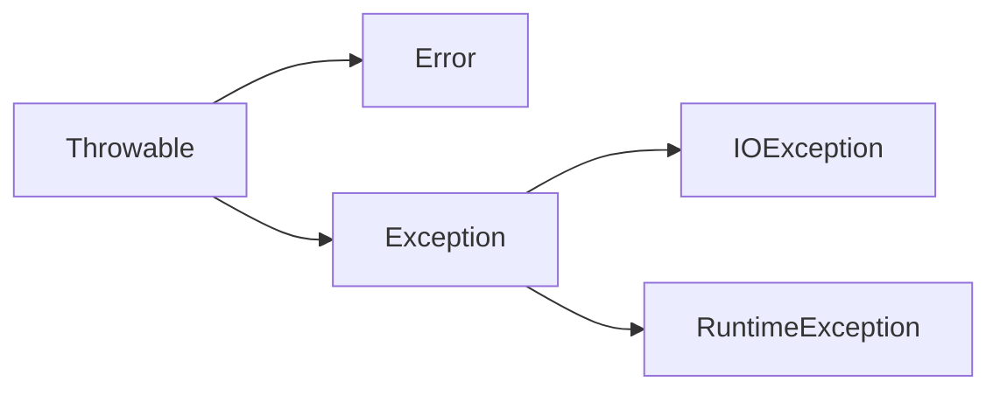
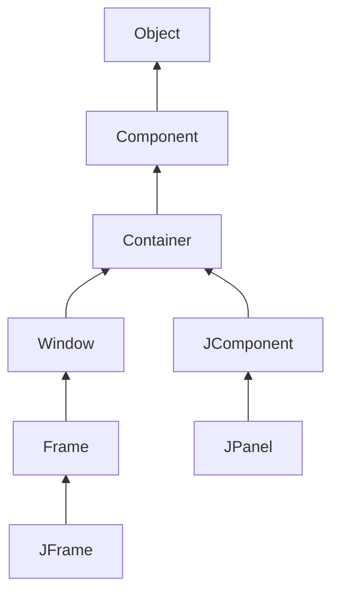
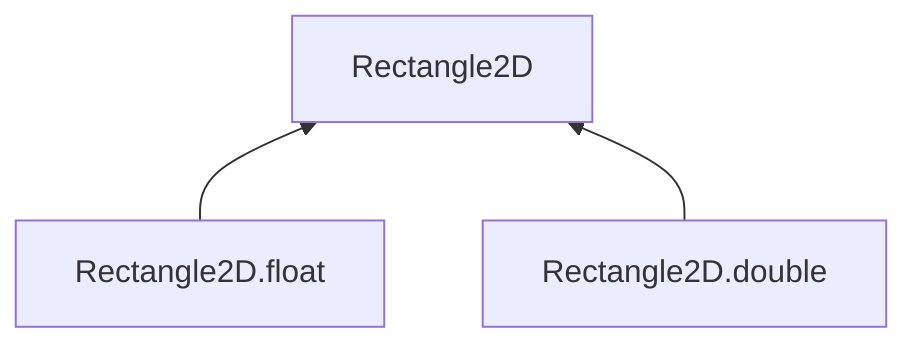
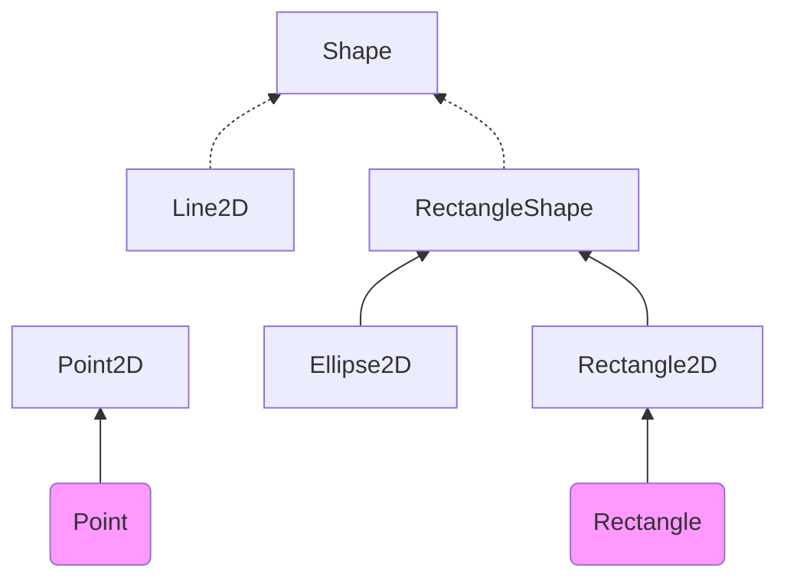
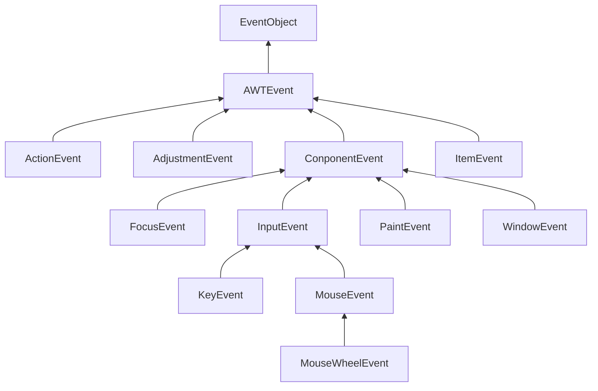
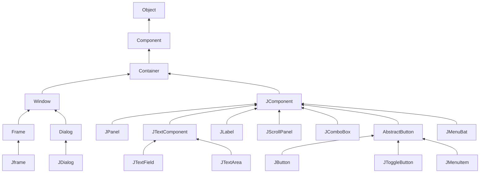
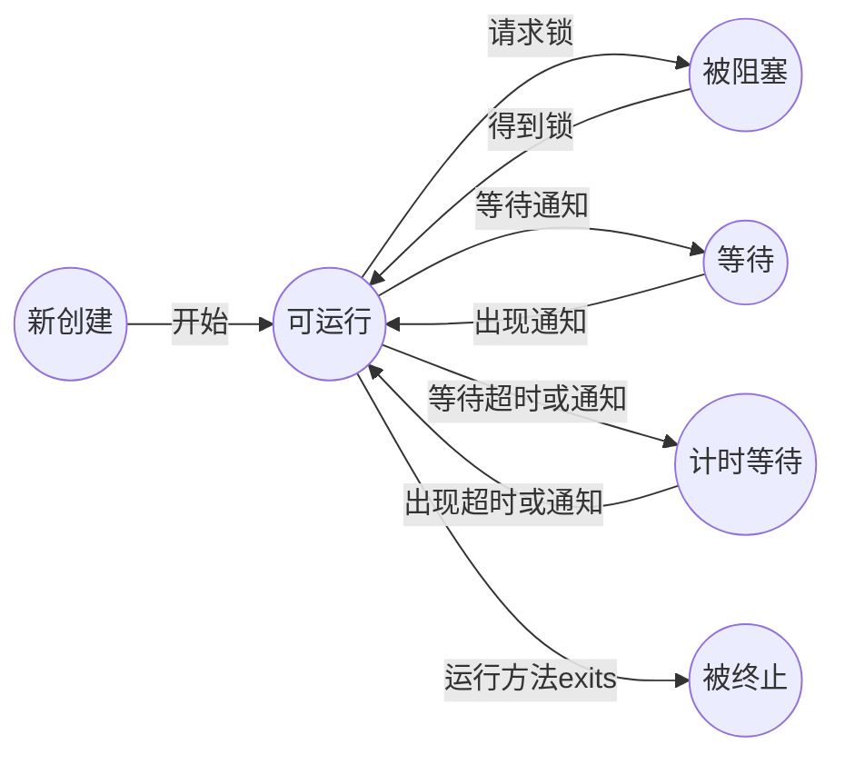

# 第5章 继承

利用**继承（inheritance）**，人们可以基于已存在的类构造一个新类。继承已存在的类就是复用（继承）这些类的方法和域。在此基础上，还可以添加一些新的方法和域， 以满足新的需求。 

**反射（reflection）**是指在程序运行期间发现更多的类及其属性的能力。这是一个功能强大的特性，使用起来也比较复杂。由于主要是开发软件工具的人员， 而不是编写应用程序的人员对这项功能感兴趣， 因此对于这部分内容， 可以先浏览一下，待日后再返回来学习。 

## 5.1 类、超类和子类

### 5.1.1 定义子类

关键字extends

*C++注释：Java 与 C++ 定义继承类的方式十分相似。 Java 用关键字 extends 代替了 C++中的冒号（：）。 在 Java 中， 所有的继承都是公有继承， 而没有 C++ 中的私有继承和保护继承*

关键字 extends 表明正在构造的新类派生于一个已存在的类。 已存在的类称为超类( superclass )、 基类（base class ) 或父类（parent class); 新类称为子类（subclass、) 派生类( derived class ) 或孩子类（child class )。 超类和子类是 Java 程序员最常用的两个术语，而了解其他语言的程序员可能更加偏爱使用父类和孩子类，这些都是继承时使用的术语。 

*注释： 前缀“ 超” 和“ 子” 来源于计算机科学和数学理论中的集合语言的术语。所有雇员组成的集合包含所有经理组成的集合。可以这样说， 雇员集合是经理集合的超集， 也可以说， 经理集合是雇员集合的子集。*

### 5.1.2 覆盖方法

方法不能够直接地访问超类的私有域。 方法一定要访问私有域， 就必须借助于公有的接口 

关键字super

*注释：有些人认为 super 与 this 引用是类似的概念， 实际上，这样比较并不太恰当。这是因为 super 不是一个对象的引用， 不能将 super 赋给另一个对象变量， 它只是一个指示编译器调用超类方法的特殊关键字。*

正像前面所看到的那样， 在子类中可以增加域、 增加方法或覆盖超类的方法，然而绝对不能删除继承的任何域和方法。 

*C++ 注释： 在 Java 中使用关键字 super 调用超类的方法， 而在 C++ 中则采用超类名加上：：操作符的形式。 例如， 在 Manager 类的 getSalary 方法中， 应该将 super.getSalary 替换为 Employee::getSalary*

### 5.1.3 子类构造器

这里的关键字 super 具有不同的含义。语句`super(n, s, year, month, day);`是“ 调用超类 Employee 中含有 n、 s、year、 month 和 day 参数的构造器” 的简写形式。 

我们可以通过 super 实现对超类构造器的调用。使用super 调用构造器的语句必须是子类构造器的第一条语句。 

如果子类的构造器没有显式地调用超类的构造器， 则将自动地调用超类默认（没有参数 ) 的构造器。如果超类没有不带参数的构造器， 并且在子类的构造器中又没有显式地调用超类的其他构造器， 则 Java 编译器将报告错误。 

*注释： 回忆一下， 关键字 this 有两个用途：一是引用隐式参数，二是调用该类其他的构造器 ， 同样，super 关键字也有两个用途：一是调用超类的方法，二是调用超类的构造器。在调用构造器的时候， 这两个关键字的使用方式很相似。调用构造器的语句只能作为另一个构造器的第一条语句出现。 构造参数既可以传递给本类 （ this) 的其他构造器， 也可以传递给超类（super ) 的构造器。*

*C++ 注释： 在 C++ 的构造函数中， 使用初始化列表语法调用超类的构造函数， 而不调用super*

一个对象变量（例如， 变量 e ) 可以指示多种实际类型的现象被称为**多态（ polymorphism)**。 在运行时能够自动地选择调用哪个方法的现象称为**动态绑定（dynamic binding) **。在本章中将详细地讨论这两个概念。 

*C++ 注释： 在 Java 中， 不需要将方法声明为虚拟方法。动态绑定是默认的处理方式。如果不希望让一个方法具有虚拟特征， 可以将它标记为 final (本章稍后将介绍关键字 final）。*

### 5.1.4 继承层次

继承并不仅限于一个层次。 例如， 可以由 Manager 类派生 Executive 类。由一个公共超类派生出来的所有类的集合被称为**继承层次（ inheritance hierarchy )**。在继承层次中， 从某个特定的类到其祖先的路径被称为该类的**继承链 ( inheritance chain) **。

*C++ 注释： Java 不支持多继承。有关Java 中多继承功能的实现方式， 请参看下一章 6.1 节有关接口的讨论。*

### 5.1.5 多态

有一个用来判断是否应该设计为继承关系的简单规则， 这就是“ is-a” 规则， 它表明子类的每个对象也是超类的对象。 

"is-a" 规则的另一种表述法是置换法则。它表明程序中出现超类对象的任何地方都可以用子类对象置换。 

在 Java 程序设计语言中， 对象变量是多态的。 

*警告：为了确保不发生这类错误， 所有数组都要牢记创建它们的元素类型， 并负责监督仅将类型兼容的引用存储到数组中。*

### 5.1.6 理解方法调用

## 5.6 枚举类

读者在第3章已经看到如何定义枚举类型。下面是一个典型的例子：

`public enum Size{SMALL, MEDIUM, LARGE, EXTRA_LARGE};`

实际上，这个声明定义的类型是一个类，它刚好有4个实例，在此尽量不要构造新对象。

因此，在比较两个枚举类型的值时，永远不需要调用equals，而直接使用“==”就可以了。

如果需要的话，可以在枚举类型中添加一些构造器、方法和域。当然，构造器只是在构造枚举常量的时候被调用。下面是一个示例：

~~~java
public enum Size{
    SMALL("S"),
    MEDIUM("M"),
    LARGE("L"),
    EXTRA_LARGE("XL");
    
    private String abbreviation;
    
    private Size(String abbreviation) {
        this.abbreviation = abbreviation;
    }
    public String getAbbreviation() {
        return abbreviation;
    }
}
~~~

所有的枚举类型都是Enum类的子类。它们继承了这个类的许多方法。其中最有用的一个是toString，这个方法能够返回枚举常量名。例如，Size.SMALL.toString()将返回字符串"SMALL"。

toString的逆方法是静态方法valueOf。例如，语句:

`Size s = Enum.valueOf(Size.class, "SMALL");`

将s设置成Size.SMALL。

每个枚举类型都是一个静态的values方法，它将返回一个包含全部枚举值的数组。例如，如下调用

`Size[] values = Size.values();`

返回包含元素Size.SMALL, Size.MEDIUM, Size.LARGE, Size.EXTRA_LARGE的数组。

ordinal方法返回enum声明中枚举常量的位置，位置从0开始计数。例如：Size.MEDIUM.ordinal()返回1。

程序清单5-12演示了，枚举类型的工作方式。

> 注释：如同Class类一样，鉴于简化的考虑，Enum类省略了一个类型参数。例如，实际上，应该将枚举类型Size扩展为`Enum<Size>`。类型参数在compareTo方法中使用（compareTo方法在第6章中介绍，类型参数在第8章中介绍）。

~~~java
package enums;

import java.util.*;

/**
 * This program demonstrates enumerated types.
 */
public class EnumTest {
    public static void main(String[] args){
        Scanner in = new Scanner(System.in);
        System.out.print("Enter a size: (SMALL, MEDIUM, LARGE, EXTRA_LARGE)");
        String input = in.next().toUpperCase();
        Size size = Enum.valueOf(Size.class, input);
        System.out.println("size=" + size);
        System.out.println("abbreviation=" + size.getAbbreviation());
        if(size == Size.EXTRA_LARGE){
            System.out.println("Good job--you paid attention to the _.")
        }
    }
}

enum Size {
    SMALL("S"),
    MEDIUM("M"),
    LARGE("L"),
    EXTRA_LARGE("XL");
    
    private Size(String abbreviation) {
        this.abbreviation = abbreviation;
    }
    public String getAbbreviation() {
        return abbreviation;
    }
    
    private String abbreviation;
}
~~~

【API】java.lang.Enum\<E> 1.0 :

- `static Enum valueOf(Class enumClass, String name)`
  返回指定名字、给定类的枚举常量。
- `String toString()`
  返回枚举常量名。
- `int ordinal()`
  返回枚举常量在enum声明中的位置，位置从0开始计数。
- `int compareTo(E other)`
  如果枚举常量出现在other之前，则返回一个负值；如果this==other,则返回0；否则返回正值。枚举常量的出现次序在enum声明中给出。

# 第6章 接口、Lambda表达式与内部类

## 6.1 接口

### 6.1.1 接口概念

Comparable接口：都需要包含compareTo方法

*注释：在Java SE 5.0中，Comparable接口已经改进为泛型类型。*

接口的所有方法自动属于public。因此，在接口中声明方法时不必提供关键字public。

接口绝不能含有实例域，在Java SE 8之前，也不能在接口中实现方法。（6.1.4节和6.1.5节可以看到，现在已经可以在接口中提供简单方法了。当然，这些方法不能引用实例域）

提供实例域和方法实现的任务应该由实现接口的那个类来完成。

为了让类实现一个接口，通常需要下面两个步骤：

1）将类声明为实现给定接口

2）对接口中的所有方法进行定义

关键字implements

Double.compare静态方法，如果第一个参数小于第二个参数，它会返回一个负值；如果二者相等则返回0；否则返回一个正值。

*警告：在实现接口时，必须把方法声明为public；否则编译器将认为这个方法的访问属性是包可见性，即类的默认访问属性，之后编译器就会给出试图提供更严格的访问权限的警告信息。*

*提示：Comparable接口中的compareTo方法将返回一个整型数值。如果两个对象不相等，则返回一个正值或者一个负值。*

主要原因在于 Java 程序设计语言是一种**强类型 （strongly typed）** 语言。在调用方法的时候， 编译器将会检查这个方法是否存在。 

*注释： 有人认为， 将 Arrays 类中的 sort 方法定义为接收一个 Comparable[ ] 数组就可以在使用元素类型没有实现 Comparable 接口的数组作为参数调用 sort 方法时， 由编译器给出错误报告。但事实并非如此。 在这种情况下， sort 方法可以接收一个 Object[ ] 数组， 并对其进行笨拙的类型转换*

【API】java.lang.Comparable\<T> 1.0 :

- `int compareTo(T other)` 用这个对象与 other 进行比较。 如果这个对象小于 other 则返回负值； 如果相等则返回0；否则返回正值。 

【API】java.util.Arrays 1.2 :

- `static void sort(Object[] a)` 使用 mergesort 算法对数组 a 中的元素进行排序。要求数组中的元素必须属于实现了Comparable 接口的类， 并且元素之间必须是可比较的 。

【API】java.lang.Integer 1.0 :

- `static int compare(int x, int y)` 7   如果 x < y 返回一个负整数；如果 x 和 y 相等，则返回 0; 否则返回一个负整数。 

【API】java.lang.Double 1.0 :

- `static int compare(double x, double y)` 1.4   如果 x < y 返回一个负数；如果 x 和 y 相等则返回 0; 否则返回一个负数 

*注释：语 言标准规定：对于任意的x和y,实现必须能够保证 sgn(x.compareTo(y)) = -sgn(y.compareTo(x)。) （也就是说， 如果 y.compareTo(x) 抛出一个异常， 那么 x.compareTo(y) 也应该抛出一个异常。）这里的“ sgn” 是一个数值的符号： 如果n是负值， sgn（n） 等于 -1 ; 如果 n 是 0, sgn(n) 等于 0 ; 如果 n 是正值， sgn（n）等于 1 简单地讲， 如果调换compareTo 的参数， 结果的符号也应该调换 （而不是实际值）*

*与 equals 方法一样， 在继承过程中有可能会出现问题。*

*这种情况与第5章中讨论的 equals 方法一样， 修改的方式也一样 ，有两种不同的情况*

### 6.1.2 接口的特性

接口不是类，尤其不能使用 new 运算符实例化一个接口 

然而， 尽管不能构造接口的对象，却能声明接口的变量 

接口变量必须引用实现了接口的类对象

接下来， 如同使用 instanceof 检查一个对象是否属于某个特定类一样， 也可以使用instanceof 检查一个对象是否实现了某个特定的接口 

与可以建立类的继承关系一样，接口也可以被扩展。这里允许存在多条从具有较高通用性的接口到较高专用性的接口的链 。

虽然在接口中不能包含实例域或静态方法，但却可以包含常量。 

与接口中的方法都自动地被设置为 public—样，接口中的域将被自动设为 public static final。 

*注释：可以将接口方法标记为 public, 将域标记为 public static final。有些程序员出于习惯或提高清晰度的考虑， 愿意这样做。但 Java 语言规范却建议不要书写这些多余的关键字， 本书也采纳了这个建议。*

有些接口只定义了常量， 而没有定义方法。例如， 在标准库中有一个 SwingConstants就是这样一个接口， 其中只包含 NORTH、 SOUTH 和 HORIZONTAL 等常量。 任何实现SwingConstants 接口的类都自动地继承了这些常量， 并可以在方法中直接地引用 NORTH,而不必采用 SwingConstants.NORTH 这样的繁琐书写形式。然而，这样应用接口似乎有点偏离了接口概念的初衷， 最好不要这样使用它。 

尽管每个类只能够拥有一个超类， 但却可以实现多个接口。 	如果某个类实现了这个 Cloneable 接口，Object 类中的 clone 方法就可以创建类对象的一个拷贝。 如果希望自己设计的类拥有克隆和比较的能力， 只要实现这两个接口就可以了: 使用逗号将实现的各个接口分隔开。 

### 6.1.3 接口和抽象类

使用抽象类表示通用属性存在这样一个问题： 每个类只能扩展于一个类。 

有些程序设计语言允许一个类有多个超类， 例如 C++。我们将此特性称为**多重继承( multiple inheritance) **。而 Java 的设计者选择了不支持多继承，其主要原因是多继承会让语言本身变得非常复杂（如同 C++，) 效率也会降低 （如同 Eiffel。) 

*C++注释：C++ 具有多重继承特性， 随之带来了一些诸如虚基类、控制规则和横向指针类型转换等复杂特性 ， 很少有 C++ 程序员使用多继承， 甚至有些人说： 就不应该使用多继承。 也有些程序员建议只对“ 混合” 风格的继承使用多继承。 在“ 混合” 风格中， 一个主要的基类描述父对象， 其他的基类 （因此称为混合）扮演辅助的角色这种风格类似于 Java 类中从一个基类派生， 然后实现若干个辅助接口 。*

### 6.1.4 静态方法

在 Java SE 8 中，允许在接口中增加静态方法。理论上讲，没有任何理由认为这是不合法的。 只是这有违于将接口作为抽象规范的初衷。 

目前为止， 通常的做法都是将静态方法放在伴随类中。在标准库中， 你会看到成对出现的接口和实用工具类， 如 Collection/Collections 或 Path/Paths。 

不过整个 Java 库都以这种方式重构也是不太可能的， 但是实现你自己的接口时，不再需要为实用工具方法另外提供一个伴随类。 

### 6.1.5 默认方法

可以为接口方法提供一个默认实现。 必须用 default 修饰符标记这样一个方法。 

当然， 这并没有太大用处， 因为 Comparable 的每一个实际实现都要覆盖这个方法。不过有些情况下， 默认方法可能很有用。 例如， 在第 11 章会看到， 如果希望在发生鼠标点击事件时得到通知， 就要实现一个包含 5 个方法的接口 。大多数情况下， 你只需要关心其中的 1、2 个事件类型。在 Java SE 8 中， 可以把所有方法声明为默认方法， 这些默认方法什么也不做。 

默认方法可以调用任何其他方法。 

*注释：在 JavaAPI 中，你会看到很多接口都有相应的伴随类，这个伴随类中实现了相应接口的部分或所有方法， 如 CoUection/AbstractCollectkm 或 MouseListener/MouseAdapter 。在JavaSE 8 中， 这个技术已经过时。现在可以直接在接口中实现方法。*

默认方法的一个重要用法是“‘ 接口演化” （interface evolution)。  以 Collection 接口为例，这个接口作为 Java 的一部分已经有很多年了。 假设很久以前你提供了这样一个类：

`public class Bag implements Collection`

假设 stream 方法不是一个默认方法。那么 Bag 类将不能编译， 因为它没有实现这个新方法。 后来， 在 JavaSE 8 中， 又为这个接口增加了一个 stream 方法。 为接口增加一个非默认方法不能保证“ 源代码兼容 ”（source compatible）。

不过， 假设不重新编译这个类， 而只是使用原先的一个包含这个类的 JAR 文件。这个类仍能正常加载，尽管没有这个新方法。程序仍然可以正常构造 Bag 实例， 不会有意外发生。( 为接口增加方法可以保证“ 二进制兼容”）。不过， 如果程序在一个 Bag 实例上调用 stream方法，就会出现一个 AbstractMethodError。 

将方法实现为一个默认方法就可以解决这两个问题。 Bag 类又能正常编译了。另外如果没有重新编译而直接加载这个类， 并在一个 Bag 实例上调用 stream 方法， 将调用 Collection.stream 方法。 

### 6.1.6 解决默认方法冲突

如果先在一个接口中将一个方法定义为默认方法， 然后又在超类或另一个接口中定义了同样的方法， 会发生什么情况？ 诸如 Scala 和 C++ 等语言对于解决这种二义性有一些复杂的规则。幸运的是， Java 的相应规则要简单得多。规则如下：

1 ) ==超类优先==。如果超类提供了一个具体方法，同名而且有相同参数类型的默认方法会被忽略。

2 ) ==接口冲突==。 如果一个超接口提供了一个默认方法，另一个接口提供了一个同名而且参数类型 （不论是否是默认参数）相同的方法， 必须覆盖这个方法来解决冲突。 

下面来看第二个规则。 

不过，Java 设计者更强调一致性。两个接口如何冲突并不重要。 ==如果至少有一个接口提供了一个实现， 编译器就会报告错误， 而程序员就必须解决这个二义性==。 

*注释：当然，如果两个接口都没有为共享方法提供默认实现， 那么就与 Java SE 8之前的情况一样，这里不存在冲突。 实现类可以有两个选择： 实现这个方法， 或者干脆不实现。如果是后一种情况， 这个类本身就是抽象的。*

我们只讨论了两个接口的命名冲突。现在来考虑另一种情况， 一个类扩展了一个超类，同时实现了一个接口，并从超类和接口继承了相同的方法。 

==在这种情况下， 只会考虑超类方法， 接口的所有默认方法都会被忽略==。 	这正是“ 类优先” 规则。 

“ 类优先” 规则可以确保与 Java SE 7 的兼容性。 如果为一个接口增加默认方法，这对于
有这个默认方法之前能正常工作的代码不会有任何影响。 

*警告：千万不要让一个默认方法重新定义 Object 类中的某个方法。 例如， 不能为 toString或 equals 定义默认方法， 尽管对于 List 之类的接口这可能很有吸引力， 由于“ 类优先”规则， 这样的方法绝对无法超越 Object.toString 或 Objects.equals。*

## 6.2 接口示例

### 6.2.1 接口和回调

**回调（ callback)** 是一种常见的程序设计模式。在这种模式中， 可以指出某个特定事件发生时应该采取的动作。  

【API】javax.swing.JOptionPane 1.2 :

- `static void showMessageDialog(Component parent, Object message)` 显示一个包含一条消息和 OK 按钮的对话框。 这个对话框将位于其 parent 组件的中央。如果 parent 为 null , 对话框将显示在屏幕的中央。

【API】javax.swing.Timer 1.2 :

- `Timer(int interval, ActionListener listener)` 构造一个定时器， 每隔 interval 毫秒通告 listener—次 。
- `void start()` 启动定时器。一旦启动成功， 定时器将调用监听器的 actionPerformed。 
- `void stop()` 停止定时器。一旦停止成功， 定时器将不再调用监听器的 actionPerformed。

【API】java.awt.Toolkit 1.0 :

- `static Toolkit getDefaultToolKit()` 获得默认的工具箱。 工具箱包含有关 GUI 环境的信息。 
- `void beep()` 发出一声铃响 。

### 6.2.2 Comparator接口

现在假设我们希望按长度递增的顺序对字符串进行排序，而不是按字典顺序进行排序。肯定不能让 String 类用两种不同的方式实现 compareTo 方法—更何况，String 类也不应由我们来修改。 

要处理这种情况，Arrays.Sort 方法还有第二个版本， 有一个数组和一个比较器 ( comparator ) 作为参数， 比较器是实现了 Comparator 接口的类的实例。 

将这个调用与 words[i].compareTo(words[j]) 做比较。这个 compare 方法要在比较器对象上调用， 而不是在字符串本身上调用。 

*注释：尽管 LengthComparator 对象没有状态， 不过还是需要建立这个对象的一个实例。我们需要这个实例来调用 compare 方法——它不是一个静态方法*

在 6.3 节中我们会了解， 利用 lambda 表达式可以更容易地使用 Comparator。 

### 6.2.3 对象克隆

如果希望 copy 是一个新对象，它的初始状态与 original 相同， 但是之后它们各自会有自己不同的状态， 这种情况下就可以使用 clone 方法。 

不过并没有这么简单。 clone 方法是 Object 的一个 protected 方法， 这说明你的代码不能直接调用这个方法。 

可以看到， 默认的克隆操作是“ 浅拷贝”，并没有克隆对象中引用的其他对象。 

浅拷贝会有什么影响吗？ 这要看具体情况。如果原对象和浅克隆对象共享的子对象是不可变的， 那么这种共享就是安全的。如果子对象属于一个不可变的类， 如 String, 就是这种情况。或者在对象的生命期中， 子对象一直包含不变的常量， 没有更改器方法会改变它， 也没有方法会生成它的引用，这种情况下同样是安全的。 

不过， 通常子对象都是可变的， 必须重新定义 clone 方法来建立一个深拷贝， 同时克隆所有子对象。 

对于每一个类，需要确定：

1 ) 默认的 clone 方法是否满足要求；
2 ) 是否可以在可变的子对象上调用 clone 来修补默认的 clone 方法；
3 ) 是否不该使用 clone 。

实际上第 3 个选项是默认选项。 如果选择第 1 项或第 2 项，类必须：

1 ) 实现 Cloneable 接口；
2 ) 重新定义 clone 方法，并指定 public 访问修饰符 。

*注释：Cloneable 接口是 Java 提供的一组标记接口 ( tagging interface ) 之一。（有些程序员称之为记号接口 ( marker interface))。 应该记得， Comparable 等接口的通常用途是确保一个类实现一个或一组特定的方法。 标记接口不包含任何方法； 它唯一的作用就是允许在类型查询中使用 instanceof。建议你自己的程序中不要使用标记接口。*

即使 clone 的默认（浅拷贝）实现能够满足要求， 还是需要实现 Cloneable 接口， 将 clone重新定义为 public， 再调用 super.clone(）。 

*注释：在 Java SE 1.4 之前， clone 方法的返回类型总是 Object, 而现在可以为你的 clone 方法指定正确的返回类型。这是协变返回类型的一个例子（见第 5 章）。 *

与 Object.clone 提供的浅拷贝相比， 前面看到的 clone 方法并没有为它增加任何功能。这里只是让这个方法是公有的。 要建立深拷贝， 还需要做更多工作，克隆对象中可变的实例域。 

如果在一个对象上调用 clone, 但这个对象的类并没有实现 Cloneable 接口， Object 类的 clone 方法就会拋出一个 CloneNotSupportedException。

必须当心子类的克隆。 

要不要在自己的类中实现 clone 呢？ 如果你的客户需要建立深拷贝，可能就需要实现这个方法。有些人认为应该完全避免使用 clone, 而实现另一个方法来达到同样的目的。 clone相当笨拙， 这一点我们也同意，不过如果让另一个方法来完成这个工作， 还是会遇到同样的问题。毕竟， 克隆没有你想象中那么常用。标准库中只有不到 5% 的类实现了 done。 

*注释：所有数组类型都有一个 public 的 clone 方法， 而不是 protected: 可以用这个方法建立一个新数组， 包含原数组所有元素的副本。 *

*注释：卷 II 的第 2 章将展示另一种克隆对象的机制， 其中使用了 Java 的对象串行化特性。这个机制很容易实现， 而且很安全，但效率不高。*

## 6.3 lambda表达式

### 6.3.1 为什么引入lambda表达式

lambda 表达式是一个可传递的代码块， 可以在以后执行一次或多次。 

这两个例子有一些共同点， 都是将一个代码块传递到某个对象 （一个定时器， 或者一个sort 方法。) 这个代码块会在将来某个时间调用。 

到目前为止，在 Java 中传递一个代码段并不容易， 不能直接传递代码段 。Java 是一种面向对象语言， 所以必须构造一个对象，这个对象的类需要有一个方法能包含所需的代码 。

就现在来说，问题已经不是是否增强 Java 来支持函数式编程， 而是要如何做到这一点。设计者们做了多年的尝试，终于找到一种适合 Java 的设计。 下一节中， 你会了解 Java SE 8中如何处理代码块。 

### 6.3.2 lambda表达式的语法

```java
(String first,String second)->first.length()-second.length()
```

lambda 表达式就是一个代码块， 以及必须传人代码的变量规范。 

*注释：为什么是字母 λ? Church 已经把字母表里的所有其他字母都用完了吗？ 实际上，权威的《数学原理》一书中就使用重音符 \^ 来表示自由变量， 受此启发， Church 使用大写 lambda ( Λ ) 表示参数。 不过， 最后他还是改为使用小写的 lambda( λ) 。从那以后，带参数变量的表达式就被称为 lambda 表达式。 *

你已经见过 Java 中的一种 lambda 表达式形式：参数， 箭头（->) 以及一个表达式。如果代码要完成的计算无法放在一个表达式中，就可以像写方法一样，把这些代码放在 { }中，并包含显式的 return 语句。 

```java
(String first,String second)->{
    if(first.length()<second.length())return -1;
    else if(first.length()>second.length())return 1;
    else return 0;
}
```

即使 lambda 表达式没有参数， 仍然要提供空括号，就像无参数方法一样 。

如果可以推导出一个 lambda 表达式的参数类型，则可以忽略其类型。 例如：

```java
Comparator<String> comp = (first, second)->first.length()-second.length();
```

在这里， 编译器可以推导出 first 和 second 必然是字符串， 因为这个 lambda 表达式将赋给一个字符串比较器。（下一节会更详细地分析这个赋值。） 

如果方法只有一个参数， 而且这个参数的类型可以推导得出，那么甚至还可以省略小括号 。

无需指定 lambda 表达式的返回类型。 lambda 表达式的返回类型总是会由上下文推导得出。 

*注释：如果一个 lambda 表达式只在某些分支返回一个值， 而在另外一些分支不返回值，这是不合法的。 例如，（int x)-> { if (x >= 0) return 1; } 就不合法。 *

### 6.3.3 函数式接口

对于只有一个抽象方法的接口， 需要这种接口的对象时， 就可以提供一个 lambda 表达式。这种接口称为**函数式接口 （functional interface )**。 

*注释：你可能想知道为什么函数式接口必须有一个抽象方法。不是接口中的所有方法都是抽象的吗？ 实际上， 接口完全有可能重新声明 Object 类的方法， 如 toString 或 clone,这些声明有可能会让方法不再是抽象的。（Java API 中的一些接口会重新声明 Object 方法来附加 javadoc 注释 Comparator API就是这样一个例子。） 更重要的是， 正如 6.1.5 节所述， 在 JavaSE 8 中， 接口可以声明非抽象方法。 *

为了展示如何转换为函数式接口， 下面考虑 Arrays.sort 方法。它的第二个参数需要一个Comparator 实例， Comparator 就是只有一个方法的接口， 所以可以提供一个 lambda 表达式 。

在底层， Arrays.sort 方法会接收实现了 Comparator\<String> 的某个类的对象。 在这个对象上调用 compare 方法会执行这个 lambda 表达式的体。这些对象和类的管理完全取决于具体实现， 与使用传统的内联类相比， 这样可能要高效得多。最好把 lambda 表达式看作是一个函数， 而不是一个对象， 另外要接受 lambda 表达式可以传递到函数式接口。 

lambda 表达式可以转换为接口， 这一点让 lambda 表达式很有吸引力。具体的语法很简短。下面再来看一个例子： 

```java
Timer t = new Timer(1000, event->{
    System.out.println("At the tone, the time is"+new Date());
    Toolkit.getDefaultToolkit().beep();
});
```

与使用实现了ActionListener接口的类相比，这个代码可读性要好得多。

实际上，在 Java 中， 对 lambda 表达式所能做的也只是能转换为函数式接口。在其他支持函数字面量的程序设计语言中，可以声明函数类型（如（String, String) -> int )、 声明这些类型的变量，还可以使用变量保存函数表达式。不过， Java 设计者还是决定保持我们熟悉的接口概念， 没有为 Java 语言增加函数类型。 

*注释：甚至不能把lambda 表达式赋给类型为 Object 的变量，Object 不是一个函数式接口。 *

Java API 在 java.util.function 包中定义了很多非常通用的函数式接口。其中一个接口BiFunction<T, U, R> 描述了参数类型为 T 和 U 而且返回类型为 R 的函数。可以把我们的字符串比较 lambda 表达式保存在这个类型的变量中 。

不过， 这对于排序并没有帮助。没有哪个 Arrays.sort 方法想要接收一个 BiFunction。 如果你之前用过某种函数式程序设计语言，可能会发现这很奇怪。不过， 对于 Java 程序员而言，这非常自然。类似 Comparator 的接口往往有一个特定的用途， 而不只是提供一个有指定参数和返回类型的方法。Java SE 8 沿袭了这种思路。想要用 lambda 表达式做某些处理，还是要谨记表达式的用途， 为它建立一个特定的函数式接口。 

java.util.function 包中有一个尤其有用的接口 Predicate 。

ArrayList 类有一个 removeIf 方法， 它的参数就是一个 Predicate。这个接口专门用来传递lambda 表达式。 

### 6.3.4 方法引用

表达式 System.out::println 是一个方法引用（ method reference ), 它等价于 lambda 表达式x -> System.out.println(x) 

再来看一个例子， 假设你想对字符串排序， 而不考虑字母的大小写。可以传递以下方法表达式： 

```java
Arrays.sort(strings, String::compareToIgnoreCase)
```

从这些例子可以看出， 要用 :: 操作符分隔方法名与对象或类名。 主要有3种情况：

- object::instanceMethod
- Class::staticMethod
- Class::instanceMethod

在前 2 种情况中， 方法引用等价于提供方法参数的 lambda 表达式。前面已经提到，System.out::println 等价于 x -> System.out.println(x) 。类似地， Math::pow 等价于（x，y) ->Math.pow(x, y)。 

对于第 3 种情况， 第 1 个参数会成为方法的目标。例如，String::compareToIgnoreCase 等
同于 (x, y)-> x.compareToIgnoreCase(y) 。

*注释：如果有多个同名的重载方法， 编译器就会尝试从上下文中找出你指的那一个方法。例如， Math.max 方法有两个版本， 一个用于整数， 另一个用于 double 值。选择哪一个版本取决于 Math::max 转换为哪个函数式接口的方法参数。 类似于 lambda 表达式， 方法引用不能独立存在，总是会转换为函数式接口的实例。 *

可以在方法引用中使用 this 参数。 例如， this::equals 等同于 x-> this.equals(x)。 使用super 也是合法的。`Super::instanceMethod`使用this为目标，会调用给定方法的超类版本。

###  6.3.5 构造器引用

构造器引用与方法引用很类似，只不过方法名为 new。例如， Person::new 是 Person 构造器的一个引用。哪一个构造器呢？ 这取决于上下文。 

可以用数组类型建立构造器引用。例如， int[]::new 是一个构造器引用，它有一个参数：即数组的长度。这等价于 lambda 表达式 x-> new int[x] 。

Java 有一个限制，无法构造泛型类型 T 的数组。数组构造器引用对于克服这个限制很有用。表达式 new T[n] 会产生错误，因为这会改为 new Object[n] 。对于开发类库的人来说，这是一个问题。例如，假设我们需要一个 Person 对象数组。 Stream 接口有一个 toArray 方法可以返回 Object 数组。

不过，这并不让人满意。用户希望得到一个 Person 引用数组，而不是 Object 引用数组。流库利用构造器引用解决了这个问题。可以把 Person[]::new 传入 toArray 方法 

toArray方法调用这个构造器来得到一个正确类型的数组。然后填充这个数组并返回。 

### 6.3.6 变量作用域

通常， 你可能希望能够在 lambda 表达式中访问外围方法或类中的变量。 

要了解到底会发生什么，下面来巩固我们对 lambda 表达式的理解 lambda 表达式有 3个部分：

1 ) 一个代码块；
2 ) 参数;
3 ) 自由变量的值， 这是指非参数而且不在代码中定义的变量。 

在我们的例子中， 这个 lambda 表达式有 1 个自由变量 text。 表示 lambda 表达式的数据结构必须存储自由变量的值， 在这里就是字符串 "Hello"。 我们说它被 lambda 表达式捕获（captured）（下面来看具体的实现细节。 例如， 可以把一个 lambda 表达式转换为包含一个方法的对象，这样自由变量的值就会复制到这个对象的实例变量中。） 

*注释：关于代码块以及自由变量值有一个术语： 闭包（closure。) 如果有人吹嘘他们的语言有闭包，现在你也可以自信地说 Java 也有闭包。 在 Java 中， lambda 表达式就是闭包。 *

可以看到， lambda 表达式可以捕获外围作用域中变量的值。 在 Java 中， 要确保所捕获的值是明确定义的，这里有一个重要的限制。在 lambda 表达式中， 只能引用值不会改变的变量。 

之所以有这个限制是有原因的。 如果在 lambda 表达式中改变变量， 并发执行多个动作时就会不安全。对于目前为止我们看到的动作不会发生这种情况，不过一般来讲，这确实是一个严重的问题。 

另外如果在 lambda 表达式中引用变量， 而这个变量可能在外部改变，这也是不合法的。 

这里有一条规则：lambda 表达式中捕获的变量必须实际上是最终变量 ( effectively final)。实际上的最终变量是指， 这个变量初始化之后就不会再为它赋新值。 

lambda 表达式的体与嵌套块有相同的作用域。这里同样适用命名冲突和遮蔽的有关规则。在 lambda 表达式中声明与一个局部变量同名的参数或局部变量是不合法的。 

在方法中，不能有两个同名的局部变量， 因此， lambda 表达式中同样也不能有同名的局部变量。

在一个 lambda 表达式中使用 this 关键字时， 是指创建这个 lambda 表达式的方法的 this参数。 	在 lambda 表达式中， this 的使用并没有任何特殊之处。lambda 表达式的作用域嵌套在 init 方法中，与出现在这个方法中的其他位置一样， lambda 表达式中 this 的含义并没有变化 。

### 6.3.7 处理lambda表达式

使用 lambda 表达式的重点是延迟执行（ deferred execution ）。	之所以希望以后再执行代码， 这有很多原因， 如：

- 在一个单独的线程中运行代码；
- 多次运行代码；
- 在算法的适当位置运行代码 （例如， 排序中的比较操作；)
- 发生某种情况时执行代码 （如， 点击了一个按钮， 数据到达， 等等；)
- 只在必要时才运行代码。 

Runnable接口

表6-1 常用函数式接口：

| 函数式接口         | 参数类型 | 返回类型 | 抽象方法名 | 描述                         | 其他方法                   |
| ------------------ | -------- | -------- | ---------- | ---------------------------- | -------------------------- |
| Runnable           | 无       | void     | run        | 作为无参数或返回值的动作运行 |                            |
| Suppier\<T>        | 无       | T        | get        | 提供一个T类型的值            |                            |
| Consumer\<T>       | T        | void     | accept     | 处理一个T类型的值            | andThen                    |
| BiConsumer\<T,U>   | T,U      | void     | accept     | 处理T和U类型的值             | andThen                    |
| Function<T,R>      | T        | R        | apply      | 有一个T类型参数的函数        | compose, andThen, identity |
| BiFunction\<T,U,R> | T,U      | R        | apply      | 有T和U类型参数的函数         | andThen                    |
| UnaryOperator\<T>  | T        | T        | apply      | 类型T上的一元操作符          | compose, andThen, identity |
| BinaryOperator\<T> | T,T      | T        | apply      | 类型T上的二元操作符          | andThen, maxBy, minBy      |
| Predicate\<T>      | T        | boolean  | test       | 布尔值函数                   | and, or, negate, isEqual   |
| BiPredicate\<T,U>  | T,U      | boolean  | test       | 有两个参数的布尔值函数       | and, or, negate            |

表 6-2 列出了基本类型 int、 long 和 double 的 34 个可能的规范。 最好使用这些特殊化规范来减少自动装箱。 出于这个原因， 我在上一节的例子中使用了 IntConsumer 而不是Consumer\<lnteger>。 

表6-2 基本类型的函数式接口：

| 函数式接口         | 参数类型 | 返回类型 | 抽象方法名   |
| ------------------ | -------- | -------- | ------------ |
| BooleanSupplier    | none     | boolean  | getAsBoolean |
| PSupplier          | none     | p        | getAsP       |
| PConsumer          | p        | void     | accept       |
| ObjPConsumer\<T>   | T,p      | void     | accept       |
| PFunction\<T>      | p        | T        | apply        |
| PToQFunction       | p        | q        | applyAsQ     |
| ToPFunction\<T>    | T        | p        | applyAsP     |
| ToPBiFunction<T,U> | T,U      | p        | applyAsP     |
| PUnaryOperator     | p        | p        | applyAsP     |
| PBinaryOperator    | p,p      | p        | applyAsP     |
| PPredicate         | p        | boolean  | test         |

注：p, q为int, long, double; P, Q为Int、Long、Double。

*提示：最好使用表 6-1 或表 6-2 中的接口。 例如， 假设要编写一个方法来处理满足某个特定条件的文件。 对此有一个遗留接口 java.io.FileFilter, 不过最好使用标准的Predicate\<File> , 只有一种情况下可以不这么做， 那就是你已经有很多有用的方法可以生成 FileFilter 实例。*

*注释：大多数标准函数式接口都提供了非抽象方法来生成或合并函数。 例如， Predicate.isEqual(a) 等同于 a::equals, 不过如果 a 为 null 也能正常工作。 已经提供了默认方法 and、or 和 negate 来合并谓词。 例如， Predicate.isEqual(a).or(Predicate.isEqual(b)) 就等同于 x->a.equals(x) || b.equals(x)。*

*注释：如果设计你自己的接口，其中只有一个抽象方法，可以用 @FunctionalInterface 注解来标记这个接口。 这样做有两个优点。 如果你无意中增加了另一个非抽象方法， 编译器会产生一个错误消息。 另外 javadoc 页里会指出你的接口是一个函数式接口。*
*并不是必须使用注解根据定义， 任何有一个抽象方法的接口都是函数式接口。不过使用 @FunctionalInterface 注解确实是一个很好的做法。*

### 6.3.8 再谈Comparator

Comparator 接口包含很多方便的静态方法来创建比较器。 这些方法可以用于 lambda 表达式或方法引用。 

静态 comparing 方法取一个“ 键提取器” 函数， 它将类型 T 映射为一个可比较的类型( 如 String )。 对要比较的对象应用这个函数， 然后对返回的键完成比较。 例如， 假设有一个Person 对象数组，可以如下按名字对这些对象排序： 

```java
Arrays.sort(people, Comparator.comparing(Person::getName));
```


可以把比较器与 thenComparing 方法串起来。 

```java
Arrays.sort(people, 
            Comparator.comparing(Person::getLastName)
            .thenComparing(Person::getFirstName));
```

如果两个人的姓相同， 就会使用第二个比较器。 

这些方法有很多变体形式。 可以为 comparing 和 thenComparing 方法提取的键指定一个比较器。 

另外， comparing 和 thenComparing 方法都有变体形式，可以避免 int、 long 或 double 值的装箱。 

如果键函数可以返回 null, 可能就要用到 nullsFirst 和 nullsLast适配器。 这些静态方法会修改现有的比较器，从而在遇到 null 值时不会抛出异常， 而是将这个值标记为小于或大于正常值。 

nullsFirst 方法需要一个比较器， 在这里就是比较两个字符串的比较器。 naturalOrder 方法可以为任何实现了 Comparable 的类建立一个比较器。在这里， Comparator.\<String>naturalOrder() 正是
我们需要的。 

静态 reverseOrder 方法会提供自然顺序的逆序。要让比较器逆序比较， 可以使用 reversed实例方法 。

## 6.4 内部类

**内部类（inner class）**是定义在另一个类中的类。为什么需要使用内部类呢？ 其主要原因有以下三点：

- 内部类方法可以访问该类定义所在的作用域中的数据， 包括私有的数据。
- 内部类可以对同一个包中的其他类隐藏起来。
- 当想要定义一个回调函数且不想编写大量代码时，使用匿名 （anonymous) 内部类比较便捷。 

*C++注释：C++ 有嵌套类。一个被嵌套的类包含在外围类的作用域内。	嵌套是一种类之间的关系， 而不是对象之间的关系。	嵌套类有两个好处： 命名控制和访问控制。 由于名字 Iterator 嵌套在 LinkedList 类的内部， 所以在外部被命名为 LinkedList::Iterator， 这样就不会与其他名为 Iterator 的类发生冲突。在 Java 中这个并不重要， 因为 Java 包已经提供了相同的命名控制。 需要注意的是， Link 类位于 LinkedList 类的私有部分， 因此， Link 对其他的代码均不可见。鉴于此情况， 可以将 Link 的数据域设计为公有的， 它仍然是安全的。 这些数据域只能被LinkedList 类 （具有访问这些数据域的合理需要）中的方法访问， 而不会暴露给其他的代码。在 Java 中， 只有内部类能够实现这样的控制。*
*然而， Java 内部类还有另外一个功能， 这使得它比 C++ 的嵌套类更加丰富， 用途更加广泛。 内部类的对象有一个隐式引用， 它引用了实例化该内部对象的外围类对象。通过这个指针， 可以访问外围类对象的全部状态。在本章后续内容中， 我们将会看到有关这个 Java 机制的详细介绍*
*在 Java 中，static 内部类没有这种附加指针， 这样的内部类与 C++ 中的嵌套类很相似。*

### 6.4.1 使用内部类访问对象状态

内部类既可以访问自身的数据域，也可以访问创建它的外围类对象的数据域 

为了能够运行这个程序， 内部类的对象总有一个隐式引用， 它指向了创建它的外部类对象。 	这个引用在内部类的定义中是不可见的。 

外围类的引用在构造器中设置。编译器修改了所有的内部类的构造器， 添加一个外围类引用的参数。 

*注释：只有内部类可以是私有类，而常规类只可以具有包可见性，或公有可见性。*

### 6.4.2 内部类的特殊语法规则

事实上，使用外围类引用的正规语法还要复杂一些。表达式 `OuterClass.this`表示外围类引用。

反过来，可以采用下列语法格式更加明确地编写内部对象的构造器 ：`outerObject.new InnerClass(construction parameters)`。

在这里，最新构造的 TimePrinter 对象的外围类引用被设置为创建内部类对象的方法中的this 引用。这是一种最常见的情况。通常， this 限定词是多余的。不过，可以通过显式地命名将外围类引用设置为其他的对象。 

需要注意， 在外围类的作用域之外，可以这样引用内部类：`OuterClass.InnerClass `

*注释： 内部类中声明的所有静态域都必须是 final。原因很简单。我们希望一个静态域只有一个实例， 不过对于每个外部对象， 会分别有一个单独的内部类实例。如果这个域不是 final, 它可能就不是唯一的。
内部类不能有 static 方法。Java 语言规范对这个限制没有做任何解释。也可以允许有静态方法，但只能访问外围类的静态域和方法。 显然， Java 设计者认为相对于这种复杂性来说， 它带来的好处有些得不偿失。* 

### 6.4.3 内部类是否有用、必要和安全

当在 Java 1.1 的 Java语言中增加内部类时， 很多程序员都认为这是一项很主要的新特性，但这却违背了 Java 要比 C++ 更加简单的设计理念。 内部类的语法很复杂（可以看到，稍后介绍的匿名内部类更加复杂 )。它与访问控制和安全性等其他的语言特性的没有明显的关联 。

我们并不打算就这个问题给予一个完整的答案。 内部类是一种编译器现象， 与虚拟机无关。编译器将会把内部类翻译成用 $ (美元符号）分隔外部类名与内部类名的常规类文件， 而虚拟机则对此一无所知。 

javap -private ClassName

*注释：如果使用 UNIX， 并以命令行的方式提供类名， 就需要记住将 $ 字符进行转义*

可以清楚地看到， 编译器为了引用外围类， 生成了一个附加的实例域 this\$0 (名字this\$0 是由编译器合成的，在自己编写的代码中不能够引用它）。另外，还可以看到构造器的TalkingClock（外围类） 参数 。

由于内部类拥有访问特权， 所以与常规类比较起来功能更加强大。 

请注意编译器在外围类添加静态方法 access\$0。它将返回作为参数传递给它的对象域beep。（方法名可能稍有不同， 如 access\$000, 这取决于你的编译器）。 

这样做不是存在安全风险吗？ 这种担心是很有道理的。任何人都可以通过调用 access\$0方法很容易地读取到私有域 beep。当然， access\$0 不是 Java 的合法方法名。但熟悉类文件结构的黑客可以使用十六进制编辑器轻松地创建一个用虚拟机指令调用那个方法的类文件。由于隐秘地访问方法需要拥有包可见性，所以攻击代码需要与被攻击类放在同一个包中。 

*注释： 合成构造器和方法是复杂令人费解的（如果过于注重细节， 可以跳过这个注释）。假设将 TimePrinter 转换为一个内部类。在虚拟机中不存在私有类， 因此编译器将会利用私有构造器生成一个包可见的类：`private TalkingClock$TimePrinter(TalkingClock);`
当然，没有人可以调用这个构造器， 因此， 存在第二个包可见构造器`TalkingClock$TimePrinter(TalkingGock, TalkingClock$1);`它将调用第一个构造器。
编译器将 TalkingClock 类 start 方法中的构造器调用翻译为：`new TalkingClock$TimePrinter(this, null)`*

### 6.4.4 局部内部类

如果仔细地阅读一下 TalkingClock 示例的代码就会发现， TimePrinter 这个类名字只在start 方法中创建这个类型的对象时使用了一次。
当遇到这类情况时， 可以在一个方法中定义局部类。 

局部类不能用 public 或 private 访问说明符进行声明。它的作用域被限定在声明这个局部类的块中。 

局部类有一个优势， 即对外部世界可以完全地隐藏起来。 即使 TalkingClock 类中的其他代码也不能访问它。除 start 方法之外， 没有任何方法知道 TimePrinter 类的存在 。

### 6.4.5 由外部方法访问变量

与其他内部类相比较， 局部类还有一个优点。它们不仅能够访问包含它们的外部类， 还可以访问局部变量。不过， 那些局部变量必须事实上为 final。这说明， 它们一旦赋值就绝不会改变。 

从程序员的角度看， 局部变量的访问非常容易。它减少了需要显式编写的实例域， 从而使得内部类更加简单。 

*注释：在 JavaSE 8 之前， 必须把从局部类访问的局部变量声明为 final。*

有时， final 限制显得并不太方便。 补救的方法是使用一个长度为 1 的数组 

在内部类被首次提出时， 原型编译器对内部类中修改的局部变量自动地进行转换。不过， 后来这种做法被废弃。毕竟， 这里存在一个危险。同时在多个线程中执行内部类中的代码时， 这种并发更新会导致竞态条件—有关内容参见第 14 章。 

### 6.4.6 匿名内部类

将局部内部类的使用再深人一步。 假如只创建这个类的一个对象，就不必命名了。这种类被称为**匿名内部类（anonymous inner class)**。 

由于构造器的名字必须与类名相同， 而匿名类没有类名， 所以， 匿名类不能有构造器。取而代之的是，将构造器参数传递给超类 （ superclass) 构造器。尤其是在内部类实现接口的时候， 不能有任何构造参数。 

如果构造参数的闭小括号后面跟一个开大括号， 正在定义的就是匿名内部类 。

==多年来， Java 程序员习惯的做法是用匿名内部类实现事件监听器和其他回调。 如今最好还是使用 lambda 表达式。==

*注释： 下面的技巧称为“ 双括号初始化” （double brace initialization), 这里利用了内部类语法。假设你想构造一个数组列表， 并将它传递到一个方法：
ArrayList\<String> friends = new ArrayList\<>()；
friends.add("Harry");
friends.add("Tony");
invite(friends);
如果不再需要这个数组列表， 最好让它作为一个匿名列表。不过作为一个匿名列表，该如何为它添加元素呢？ 方法如下：
invite(new ArrayList\<String>() {{ add("Harry"); add("Tony"); }});
注意这里的双括号。 外层括号建立了 ArrayList 的一个匿名子类。 内层括号则是一个对象构造块（见第 4 章)。*

*警告： 建立一个与超类大体类似（但不完全相同）的匿名子类通常会很方便。不过， 对于 equals 方法要特别当心。 第 5 章中， 我们曾建议 equals 方法最好使用以下测试：`if (getClass() != other.getClass()) return false;`
但是对匿名子类做这个测试时会失败。*

*提示：生成曰志或调试消息时， 通常希望包含当前类的类名， 如：`Systen.err.println("Something awful happened in " + getClass());`
不过， 这对于静态方法不奏效。毕竟， 调用 getClass 时调用的是 this.getClass(), 而静态方法没有 this 。所以应该使用以下表达式：`new Object0{}.getClass().getEnclosingClass() // gets class of static method`
在这里，newObject0{} 会建立 Object 的一个匿名子类的一个匿名对象，getEnclosingClass
则得到其外围类， 也就是包含这个静态方法的类。*

### 6.4.7 静态内部类

有时候， 使用内部类只是为了把一个类隐藏在另外一个类的内部，并不需要内部类引用外围类对象。为此，可以将内部类声明为 static, 以便取消产生的引用。 

当然， 只有内部类可以声明为 static。静态内部类的对象除了没有对生成它的外围类对象的引用特权外， 与其他所冇内部类完全一样。在我们列举的示例中， 必须使用静态内部类，这是由于内部类对象是在静态方法中构造的 

*注释： 在内部类不需要访问外围类对象的时候， 应该使用静态内部类。 有些程序员用嵌套类 （nested class ) 表示静态内部类*

*注释： 与常规内部类不同，静态内部类可以有静态域和方法。*

*注释： 声明在接口中的内部类自动成为 static 和 public 类*

## 6.5 代理

代理 （ proxy)。 利用代理可以在运行时创建一个实现了一组给定接口的新类 : 这种功能只有在编译时无法确定需要实现哪个接口时才有必要使用。 

### 6.5.1 何时使用代理

假设有一个表示接口的 Class 对象（有可能只包含一个接口，) 它的确切类型在编译时无法知道。这确实有些难度。要想构造一个实现这些接口的类， 就需要使用 newlnstance 方法或反射找出这个类的构造器。但是， 不能实例化一个接口，需要在程序处于运行状态时定义一个新类。

为了解决这个问题， 有些程序将会生成代码；将这些代码放置在一个文件中；调用编译器；然后再加载结果类文件。很自然， 这样做的速度会比较慢，并且需要将编译器与程序放在一起。而代理机制则是一种更好的解决方案。代理类可以在运行时创建全新的类。这样的代理类能够实现指定的接口。尤其是，它具有下列方法：

- 指定接口所需要的全部方法。
- Object 类中的全部方法， 例如， toString、 equals 等。

然而，不能在运行时定义这些方法的新代码。而是要提供一个调用处理器（invocation handler)。调用处理器是实现了 InvocationHandler 接口的类对象。在这个接口中只有一个方法：
`Object invoke(Object proxy, Method method, Object[] args)`
无论何时调用代理对象的方法， 调用处理器的 invoke 方法都会被调用， 并向其传递Method 对象和原始的调用参数。 调用处理器必须给出处理调用的方式。 

### 6.5.2 创建代理对象

要想创建一个代理对象， 需要使用 Proxy 类的 newProxylnstance 方法。 这个方法有三个参数：

- 一个类加载器（class loader)。作为 Java 安全模型的一部分， 对于系统类和从因特网上下载下来的类，可以使用不同的类加载器。有关类加载器的详细内容将在卷 II 第 9章中讨论。目前， 用 null 表示使用默认的类加载器。
- 一个 Class 对象数组， 每个元素都是需要实现的接口。
- 一个调用处理器。

还有两个需要解决的问题。 如何定义一个处理器？ 能够用结果代理对象做些什么？ 当然， 这两个问题的答案取决于打算使用代理机制解决什么问题。 使用代理可能出于很多原因， 例如：

- 路由对远程服务器的方法调用。
- 在程序运行期间，将用户接口事件与动作关联起来。
- 为调试， 跟踪方法调用 。

*注释： 前面已经讲过， 在 Java SE 5.0 中， Integer 类实际上实现了 Comparable\<Integer>。 然而， 在运行时， 所有的泛型类都被取消， 代理将它们构造为原 Comparable 类的类对象。*

### 6.5.3 代理类的特性

需要记住， 代理类是在程序运行过程中创建的。 然而， 一旦被创建， 就变成了常规类， 与虚拟机中的任何其他
类没有什么区别。 

所有的代理类都扩展于 Proxy 类。一个代理类只有一个实例域—调用处理器，它定义在 Proxy 的超类中。 为了履行代理对象的职责， 所需要的任何附加数据都必须存储在调用处理器中。  

所有的代理类都覆盖了 Object 类中的方法 toString、 equals 和 hashCode。如同所有的代理方法一样，这些方法仅仅调用了调用处理器的 invoke。Object 类中的其他方法（如 clone和 getClass) 没有被重新定义。 

没有定义代理类的名字，Sun 虚拟机中的 Proxy类将生成一个以字符串 $Proxy 开头的类名。 

对于特定的类加载器和预设的一组接口来说， 只能有一个代理类。 也就是说， 如果使用同一个类加载器和接口数组调用两次 newProxylnstance 方法的话， 那么只能够得到同一个类的两个对象，也可以利用 getProxyClass方法获得这个类 

代理类一定是 public 和 final。 如果代理类实现的所有接口都是 public， 代理类就不属于某个特定的包；否则， 所有非公有的接口都必须属于同一个包，同时，代理类也属于这个包。

可以通过调用 Proxy 类中的 isProxyClass 方法检测一个特定的 Class 对象是否代表一个代理类。 

【API】java.Iang.reflect.InvocationHandler 1.3 :

-  Object invoke(Object proxy,Method method,0bject[] args)
   定义了代理对象调用方法时希望执行的动作。

【API】 java.Iang.reflect.Proxy 1.3 :

- `static Class<?> getProxyClass(Cl assLoader loader, Class<?>...
  interfaces)` 返回实现指定接口的代理类。
- `static Object newProxyInstance(ClassLoader loader, Class<?>[] interfaces, InvocationHandler handler)` 构造实现指定接口的代理类的一个新实例。所有方法会调用给定处理器对象的 invoke 方法。
- `static boolean isProxyClass(Class<?> cl)`
  如果 cl 是一个代理类则返回 true。 

# 第7章 异常、断言和日志

对于异常情况， 例如， 可能造成程序崩溃的错误输入， Java 使用一种称为**异常处理( exception handing)** 的错误捕获机制处理。  

## 7.1 处理错误

如果由于出现错误而使得某些操作没有完成， 程序应该：

- 返回到一种安全状态，并能够让用户执行一些其他的命令；或者
- 允许用户保存所有操作的结果，并以妥善的方式终止程序 

要做到这些并不是一件很容易的事情。其原因是检测（或引发）错误条件的代码通常离那些能够让数据恢复到安全状态， 或者能够保存用户的操作结果， 并正常地退出程序的代码很远。异常处理的任务就是将控制权从错误产生的地方转移给能够处理这种情况的错误处理器。 

1. 用户输入错误
2. 设备错误
3. 物理限制
4. 代码错误

在 Java 中， 如果某个方法不能够采用正常的途径完整它的任务，就可以通过另外一个路径退出方法。在这种情况下，方法并不返回任何值， 而是抛出( throw) 一个封装了错误信息的对象。需要注意的是，这个方法将会立刻退出，并不返回任何值。 此外， 调用这个方法的代码也将无法继续执行，取而代之的是， 异常处理机制开始搜索能够处理这种异常状况的异常处理器 （exception handler )。 

### 7.1.1 异常分类

在 Java 程序设计语言中， 异常对象都是派生于 Throwable 类的一个实例。 



Error 类层次结构描述了 Java 运行时系统的内部错误和资源耗尽错误。 应用程序不应该抛出这种类型的对象。 如果出现了这样的内部错误， 除了通告给用户，并尽力使程序安全地终止之外， 再也无能为力了。 

在设计 Java 程序时， 需要关注 Exception 层次结构。 这个层次结构又分解为两个分支：一个分支派生于 RuntimeException ; 另一个分支包含其他异常。划分两个分支的规则是： 由程序错误导致的异常属于 RuntimeException ; 而程序本身没有问题， 但由于像 I/O 错误这类问题导致的异常属于其他异常: 

派生于 RuntimeException 的异常包含下面几种情况：

- 错误的类型转换。
- 数组访问越界 。
- 访问 null 指针。

不是派生于 RuntimeException 的异常包括：

- 试图在文件尾部后面读取数据。
- 试图打开一个不存在的文件。
- 试图根据给定的字符串查找 Class 对象， 而这个字符串表示的类并不存在 。

Java 语 言 规 范 将 派 生 于 Error 类 或 RuntimeException 类的所有异常称为**非受查( unchecked ) 异常**， 所有其他的异常称为**受查（ checked) 异常**。这是两个很有用的术语，在后面还会用到。 编译器将核查是否为所有的受査异常提供了异常处理器。 

*注释： RuntimeException 这个名字很容易让人混淆。 实际上， 现在讨论的所有错误都发生在运行时。*

*C++ 注释：如果熟悉标准 C++ 类库中的异常层次结构， 就一定会感到有些困惑。 C++ 有两个基本的异常类， 一个是 runtime_error ; 另一个是 logic_error。 logic_error 类相当于Java 中的 RuntimeException， 它表示程序中的逻辑错误；runtime_error 类是所有由于不可预测的原因所引发的异常的基类。它相当于 Java 中的非 RuntimeException 异常。*

### 7.1.2 声明受查异常

在自己编写方法时， 不必将所有可能抛出的异常都进行声明。至于什么时候需要在方法中用 throws 子句声明异常， 什么异常必须使用 throws 子句声明， 需要记住在遇到下面 4 种情况时应该抛出异常：

1 ) 调用一个抛出受査异常的方法， 例如， FilelnputStream 构造器。

2 ) 程序运行过程中发现错误， 并且利用 throw语句抛出一个受查异常（下一节将详细地介绍 throw 语句)。

3 ) 程序出现错误， 例如，a[-l]=0 会抛出一个 ArraylndexOutOffloundsException 这样的非受查异常。 

4 ) Java 虚拟机和运行时库出现的内部错误。 

如果一个方法有可能抛出多个受查异常类型， 那么就必须在方法的首部列出所有的异常类。 

但是， 不需要声明 Java 的内部错误， 即从 Error 继承的错误。任何程序代码都具有抛出那些异常的潜能， 而我们对其没有任何控制能力。

同样，也不应该声明从 RuntimeException 继承的那些非受查异常。

*警告： 如果在子类中覆盖了超类的一个方法， 子类方法中声明的受查异常不能比超类方法中声明的异常更通用 （也就是说， 子类方法中可以抛出更特定的异常， 或者根本不抛出任何异常）。特别需要说明的是， 如果超类方法没有抛出任何受查异常， 子类也不能抛出任何受查异常。*

*C++ 注释： Java 中的 throws 说明符与 C++ 中的 throw 说明符基本类似，但有一点重要的区别。在 C++ 中， throw 说明符在运行时执行， 而不是在编译时执行。 也就是说， C++编译器将不处理任何异常规范。但是， 如果函数抛出的异常没有出现在 throw 列表中，就会调用 unexpected 函数， 这个函数的默认处理方式是终止程序的执行。
另外，在 C++ 中， 如果没有给出 throw 说明， 函数可能会抛出任何异常。 而在 Java中， 没有 throws 说明符的方法将不能抛出任何受查异常。*

### 7.1.3 如何抛出异常

throw子句

在前面已经看到， 对于一个已经存在的异常类， 将其抛出非常容易 。 在这种情况下：
1 ) 找到一个合适的异常类。
2 ) 创建这个类的一个对象。
3 ) 将对象抛出。 

*C++ 注释： 在 C++ 与 Java 中， 抛出异常的过程基本相同， 只有一点微小的差别。 在Java 中， 只能抛出 Throwable 子类的对象， 而在 C++ 中， 却可以抛出任何类型的值。*

### 7.1.4 创建异常类

【API】java.lang.Throwable 1.0 :

- `Throwable()`构造一个新的 Throwabie 对象， 这个对象没有详细的描述信息。 
- `Throwable(String message )`构造一个新的 throwabie 对象， 这个对象带有特定的详细描述信息。习惯上，所有派生的异常类都支持一个默认的构造器和一个带有详细描述信息的构造器。
- `String getMessage( )`获得 Throwabie 对象的详细描述信息。 

## 7.2 捕获异常

### 7.2.1 捕获异常

如果某个异常发生的时候没有在任何地方进行捕获，那程序就会终止执行，并在控制台上打印出异常信息， 其中包括异常的类型和堆栈的内容。 对于图形界面程序（applet 和应用程序，) 在捕获异常之后，也会打印出堆桟的信息， 但程序将返回到用户界面的处理循环中(在调试 GUI 程序时， 最好保证控制台窗口可见，并且没有被最小化。) 

try/catch语句块

*C++ 注释：在 Java 与 C++ 中，捕获异常的方式基本相同。严格地说， 下列代码:`catch (Exception e) // ]ava`与`catch (Exception& e) // C++`是一样的。
在 Java 中， 没有与 C++ 中 catch() 对应的东西。 由于 Java 中的所有异常类都派生于一个公共的超类， 所以， 没有必要使用这种机制。*

### 7.2.2 捕获多个异常

异常对象可能包含与异常本身有关的信息。要想获得对象的更多信息， 可以试着使用
`e.getMessage()`
得到详细的错误信息（如果有的话，) 或者使用
`e.getClass().getName()`
得到异常对象的实际类型。 

在 Java SE 7中，同一个 catch 子句中可以捕获多个异常类型。 

*注释： 捕获多个异常时，异常变量隐含为 final 变量。例如，不能在以下子句体中为 e 赋不同的值：`catch (FileNotFoundException | UnknownHostException e) { . . . } `*

*注释：捕获多个异常不仅会让你的代码看起来更简单，还会更高效。 生成的字节码只包含一个对应公共catch子句的代码块。*

### 7.2.3 再次抛出异常和异常链

不过，可以有一种更好的处理方法，并且将原始异常设置为新异常的“ 原因”：

```java
try
{
	access the database
}
catch (SQLException e){
	Throwable se = new ServletException ("database error")；
	se.initCause(e);
	throw se; 
}
```

当捕获到异常时， 就可以使用下面这条语句重新得到原始异常：
`Throwable e = se.getCause() ;`
强烈建议使用这种包装技术。这样可以让用户抛出子系统中的高级异常，而不会丢失原始异常的细节。 

*提示： 如果在一个方法中发生了一个受查异常， 而不允许抛出它， 那么包装技术就十分有用。我们可以捕获这个受查异常， 并将它包装成一个运行时异常*

有时你可能只想记录一个异常， 再将它重新抛出， 而不做任何改变：

```java
try
{
	access the database
}
catch (Exception e)
{
	logger.logOevel, message, e);
	throw e;
}
```

在Java SE 7之前，这种方法存在一个问题。假设这个代码在以下方法中：
`public void updateRecord() throws SQLException`
Java 编译器查看 catch 块中的 throw 语句， 然后查看 e 的类型， 会指出这个方法可以抛出任何 Exception 而不只是 SQLException。现在这个问题已经有所改进。 编译器会跟踪到e 来自 try块。假设这个 try块中仅有的已检査异常是 SQLException 实例， 另外， 假设 e 在catch 块中未改变， 将外围方法声明为 throws SQLException 就是合法的。 

### 7.2.4 finally子句

不管是否有异常被捕获， finally 子句中的代码都被执行。 

try 语句可以只有 finally 子句，而没有 catch 子句。 

*提示： 这里， 强烈建议解搞合 try/catch 和 try/finally 语句块。 这样可以提高代码的清晰度。例如：*

```java
InputStrean in = . . .;
try
{
	try
	{
		code that might throw exceptions
	}
	finally
	{
		in.close();
	}
}
catch (IOException e)
{
	show error message
}
```

*内层的 try语句块只有一个职责， 就是确保关闭输入流。 外层的 try 语句块也只有一个职责， 就是确保报告出现的错误。 这种设计方式不仅清楚， 而且还具有一个功能， 就是将会报告 finally 子句中出现的错误。*

*警告： 当 finally 子句包含 return 语句时， 将会出现一种意想不到的结果„ 假设利用 return语句从 try语句块中退出。==在方法返回前， finally 子句的内容将被执行。如果 finally 子句中也有一个 return 语句， 这个返回值将会覆盖原始的返回值。==*

有时候， finally 子句也会带来麻烦。例如， 清理资源的方法也有可能抛出异常。 

这会有问题， 因为第一个异常很可能更有意思。如果你想做适当的处理， 重新抛出原来的异常， 代码会变得极其繁琐：

```java
InputStream in = . . .;
Exception ex = null ;
try{
	try{
		code that might throw exceptions
	}
	catch (Exception e){
		ex=e;
        throw e;
	}
}
finally{
	try{
		in.close()；
	}
	catch (Exception e){
		if (ex = null) throw e;
	}
}
```

幸运的是，下一节你将了解到， Java SE 7 中关闭资源的处理会容易得多。

### 7.2.5 带资源的try语句

假设资源属于一个实现了 AutoCloseable 接口的类， Java SE 7 为这种代码模式提供了一个很有用的快捷方式。AutoCloseable 接口有一个方法：`void close() throws Exception `

*注释： 另外，还有一个 Closeable 接口。 这是 AutoCloseable 的子接口， 也包含一个 close方法。 不过， 这个方法声明为抛出一个 IOException。*

带资源的 try 语句（try-with-resources)  ：try后接括号，括号内为资源

还可以指定多个资源: 例如：

```java
try (Scanner in = new Scanner (new FileInputStream("/usr/share/dict/words"), "UTF-8");
	PrintWriter out = new PrintWriter("out.txt"))
{
	while (in.hasNext())
		out.println(in.next().toUpperCase());
} 
```

不论这个块如何退出， in 和 out 都会关闭。如果你用常规方式手动编程， 就需要两个嵌套的 try/finally语句。 

上一节已经看到， 如果 try 块抛出一个异常， 而且 close 方法也抛出一个异常，这就会带来一个难题。带资源的 try 语句可以很好地处理这种情况。原来的异常会重新抛出，而 close方法抛出的异常会“被抑制”。 这些异常将自动捕获，并由 addSuppressed 方法增加到原来的异常。 如果对这些异常感兴趣， 可以调用 getSuppressed 方法，它会得到从 close 方法抛出并被抑制的异常列表。 

你肯定不想采用这种常规方式编程。 只要需要关闭资源， 就要尽可能使用带资源的 try语句。 

*注释： 带资源的 try语句自身也可以有 catch 子句和一个 finally 子句。 这些子句会在关闭资源之后执行。 不过在实际中， 一个 try 语句中加入这么多内容可能不是一个好主意。*

### 7.2.6 分析堆栈轨迹元素

**堆栈轨迹（stack trace )** 是一个方法调用过程的列表， 它包含了程序执行过程中方法调用的特定位置 。

【API】java.lang.Throwable 1.0 :

- `Throwable(Throwable cause)` 1.4
- `Throwable(String message, Throwable cause)` 1.4  用给定的“ 原因” 构造一个 Throwable 对象。 
- `Throwable initCause(Throwable cause)` 1.4  将这个对象设置为“ 原因”。如果这个对象已经被设置为“ 原因”， 则抛出一个异常。返回 this 引用。
- `Throwable getCause()` 1.4  获得设置为这个对象的“ 原因” 的异常对象。 如果没有设置“ 原因”， 则返回 null。 
- `StackTraceElement[] getStackTrace()` 1.4  获得构造这个对象时调用堆栈的跟踪。
- `void addSuppressed(Throwable t)` 7  为这个异常增加一个“ 抑制” 异常。这出现在带资源的 try语句中， 其中 t 是 dose 方法抛出的一个异常。
- `Throwable[] getSuppressed()` 7  得到这个异常的所有“ 抑制” 异常。一般来说，这些是带资源的 try语句中 close 方法拋出的异常 

【API】java.lang.Exception 1.0 ：

- `Exception(Throwable cause)` 1.4
- `Exception(String message, Throwable cause)`用给定的“ 原因” 构造一个异常对象。

【API】 java.lang.RuntimeException 1.0 ：

- `RuntimeException(Throwable cause)` 1.4
- `RuntimeException(String message, Throwable cause)` 1.4  用给定的“ 原因” 构造一个 RuntimeException 对象。

【API】 java.lang.StackTraceElement 1.4 :

- `String getFileName()`  返回这个元素运行时对应的源文件名。如果这信息不存在， 则返回 null。
- `int getLineNumber()`  返回这个元素运行时对应的源文件行数。 如果这个信息不存在，则返回-1。
- `String getClassName()`  返回这个元素运行时对应的类的完全限定名。
- `String getMethodName()`  返回这个元素运行时对应的方法名。构造器名是\<init>； 静态初始化器名是 \<clinit> ;这里无法区分同名的重载方法。
- `boolean isNativeMethod()`  如果这个元素运行时在一个本地方法中， 则返回 true。
- `String toString()`  如果存在的话， 返回一个包含类名、方法名、 文件名和行数的格式化字符串。 

## 7.3 使用异常机制的技巧

1. 异常处理不能代替简单的测试

2. 不要过分地细化异常 
3. 利用异常层次结构 
4. 不要压制异常 
5. 在检测错误时，“ 苛刻” 要比放任更好 
6. 不要羞于传递异常 

*注释： 规则 5、6 可以归纳为“ 早抛出，晚捕获 ”*

## 7.4 使用断言

### 7.4.1 断言的概念

断言机制允许在测试期间向代码中插入一些检査语句。当代码发布时，这些插人的检测语句将会被自动地移走。

Java 语言引人了关键字 assert。这个关键字有两种形式：`assert 条件;` 和 `assert 条件：表达式;`

这两种形式都会对条件进行检测， 如果结果为 false, 则抛出一个 AssertionError 异常。在第二种形式中，表达式将被传人 AssertionError 的构造器， 并转换成一个消息字符串。

*注释：“ 表达式” 部分的唯一目的是产生一个消息字符串。AssertionError 对象并不存储表达式的值， 因此， 不可能在以后得到它。正如 JDK 文档所描述的那样： 如果使用表达式的值， 就会鼓励程序员试图从断言中恢复程序的运行， 这不符合断言机制的初衷。*

*C++ 注释： C 语言中的 assert 宏将断言中的条件转换成一个字符串。 当断言失败时，这个字符串将会被打印出来 。 例如， 若 assert(x>=0) 失败， 那么将打印出失败条件“ x>=0”。在 Java 中， 条件并不会自动地成为错误报告中的一部分。 如果希望看到这个条件， 就必须将它以字符串的形式传递给 AssertionError 对象： assert x >= 0“: x >= 0” 。*

### 7.4.2 启用和禁用断言

在默认情况下， 断言被禁用。可以在运行程序时用 -enableassertions 或 -ea 选项启用 。

需要注意的是， 在启用或禁用断言时不必重新编译程序。启用或禁用断言是类加载器( class loader) 的功能。当断言被禁用时， 类加载器将跳过断言代码， 因此，不会降低程序运行的速度。 

也可以在某个类或整个包中使用断言， 例如：
`java -ea:MyClass -ea:com.mycompany.mylib... MyApp`
这条命令将开启 MyClass 类以及在 com.mycompany.mylib 包和它的子包中的所有类的断言。选项 -ea 将开启默认包中的所有类的断言。 

也可以用选项 -disableassertions 或 -da 禁用某个特定类和包的断言：
`java -ea:... -da:MyClass MyApp`
有些类不是由类加载器加载， 而是直接由虚拟机加载。可以使用这些开关有选择地启用或禁用那些类中的断言。 

然而， 启用和禁用所有断言的 -ea 和 -da 开关不能应用到那些没有类加载器的“ 系统类”上。对于这些系统类来说， 需要使用 -enablesystemassertions/-esa 开关启用断言。 

在程序中也可以控制类加载器的断言状态。有关这方面的内容请参看本节末尾的 API 注释。 

### 7.4.3 使用断言完成参数检查

在 Java 语言中， 给出了 3 种处理系统错误的机制：

- 抛出一个异常
- 日志
- 使用断言

什么时候应该选择使用断言呢？ 请记住下面几点：

- 断言失败是致命的、 不可恢复的错误。
- 断言检查只用于开发和测阶段（这种做法有时候被戏称为“ 在靠近海岸时穿上救生衣，但在海中央时就把救生衣抛掉吧”）。

因此，不应该使用断言向程序的其他部分通告发生了可恢复性的错误，或者，不应该作为程序向用户通告问题的手段。断言只应该用于在测试阶段确定程序内部的错误位置。 

然而，假设对这个方法的约定做一点微小的改动：
`@param a the array to be sorted (must not be null).`

现在，这个方法的调用者就必须注意：不允许用 null 数组调用这个方法，并在这个方法
的开头使用断言：
`assert a != null;`

计算机科学家将这种约定称为前置条件 （ Precondition)。 	如果调用者在调用这个方法时没有提供满足这个前置条件的参数， 所有的断言都会失败，并且这个方法可以执行它想做的任何操作。 

### 7.4.4 为文档假设使用断言

前面已经知道， 断言是一种测试和调试阶段所使用的战术性工具; 而日志记录是一种在程序的整个生命周期都可以使用的策略性工具。下一节将介绍日志的相关知识 。

【API】java.lang.ClassLoader 1.0 :

- `void setDefaultAssertionStatus ( boolean b )` 1.4  对于通过类加载器加载的所有类来说， 如果没有显式地说明类或包的断言状态， 就启用或禁用断言。
- `void setCIassAssertionStatus ( String className , boolean b )` 1.4  对于给定的类和它的内部类，启用或禁用断言。
- `void setPackageAssertionStatus ( String packageName , bool ean b )` 1.4  对于给定包和其子包中的所有类，启用或禁用断言。
- `void clearAssertionStatus( )` 1.4  移去所有类和包的显式断言状态设置， 并禁用所有通过这个类加载器加载的类的断言。 

## 7.5 记录日志

- 可以很容易地取消全部日志记录，或者仅仅取消某个级别的日志，而且打开和关闭这个操作也很容易。
- 可以很简单地禁止日志记录的输出， 因此，将这些日志代码留在程序中的开销很小。
- 日志记录可以被定向到不同的处理器， 用于在控制台中显示， 用于存储在文件中等。
- 日志记录器和处理器都可以对记录进行过滤。过滤器可以根据过滤实现器制定的标准丢弃那些无用的记录项。
- 日志记录可以采用不同的方式格式化，例如，纯文本或 XML。
- 应用程序可以使用多个日志记录器， 它们使用类似包名的这种具有层次结构的名字，例如， com.mycompany.myapp。
- 在默认情况下，日志系统的配置由配置文件控制。 如果需要的话， 应用程序可以替换这个配置。 

### 7.5.1 基本日志

要生成简单的日志记录，可以使用全局日志记录器（global logger) 并调用其 info 方法 。

但是， 如果在适当的地方（如 main 开始）调用`Logger.getGlobal().setLevel (Level.OFF);`将会取消所有的日志。 

### 7.5.2 高级日志

从前面已经看到“ 虚拟日志”，下面继续看一下企业级（ industrial-strength) 日志。在一个专业的应用程序中，不要将所有的日志都记录到一个全局日志记录器中，而是可以自定义日志记录器。

可以调用 getLogger 方法创建或获取记录器：
`private static final Logger myLogger = Logger.getLogger("com.mycompany.myapp"); `

*提示：未被任何变量引用的日志记录器可能会被垃圾回收。为了防止这种情况发生，要像上面的例子中一样， 用一个静态变量存储日志记录器的一个引用。*

与包名类似， 日志记录器名也具有层次结构。 事实上， 与包名相比， 日志记录器的层次性更强。 对于包来说， 一个包的名字与其父包的名字之间没有语义关系， 但是日志记录器的父与子之间将共享某些属性。 例如， 如果对 com.mycompany 日志记录器设置了日志级别，它的子记录器也会继承这个级别 。

通常， 有以下 7 个日志记录器级别：

- SEVERE
- WARNING
- INFO
- CONFIG
- FINE
- FINER
- FINEST 

在默认情况下，只记录前三个级别。 也可以设置其他的级別。例如，`logger.setLevel (Level.FINE); `现在， FINE 和更高级别的记录都可以记录下来。 

另外， 还可以使用 Level.ALL 开启所有级别的记录， 或者使用 Level.OFF 关闭所有级别的记录。 

对于所有的级别有下面几种记录方法：`logger.warning(message);`  `logger.fine(message);`
同时， 还可以使用 log 方法指定级别， 例如：`logger.log(Level.FINE, message); `

*提示： 默认的日志配置记录了 INFO 或更高级别的所有记录， 因此， 应该使用 CONFIG、FINE, FINER 和 FINEST 级别来记录那些有助于诊断，但对于程序员又没有太大意义的调试信息。*

*警告： 如果将记录级别设计为 INFO 或者更低， 则需要修改日志处理器的配置。 默认的日志处理器不会处理低于 INFO 级别的信息。 更加详细的内容请参看下一节。*

默认的日志记录将显示包含日志调用的类名和方法名， 如同堆栈所显示的那样。 但是,如果虚拟机对执行过程进行了优化，就得不到准确的调用信息。此时，可以调用 logp 方法获得调用类和方法的确切位置 

*注释： 在未来， 带 Object[ ] 参数的曰志记录方法可能会被重写， 以便支持变量参数列表(" varargs"）。此后就可以用 `logger.entering ("com.mycompany.mylib.Reader"，"read"，file, pattern)` 格式调用这个方法了。*

记录日志的常见用途是记录那些不可预料的异常。 可以使用下面两个方法提供日志记录中包含的异常描述内容。
`void throwing(String className, String methodName , Throwable t)`
`void log(Level l, String message, Throwable t) `

### 7.5.3 修改日志管理器配置

可以通过编辑配置文件来修改日志系统的各种属性。在默认情况下， 配置文件存在于：jre/lib/logging.properties
要想使用另一个配置文件， 就要将 java.util.logging.config.file 特性设置为配置文件的存储位置， 并用下列命令启动应用程序： 
`java -Djava.util.logging.config.file=configFile MainClass`

*警告： 日志管理器在 VM 启动过程中初始化， 这在 main 执行之前完成。 如果在 main中调用 `System.setProperty("java.util.logging.config.file"，file)`, 也 会 调 用 `LogManager.readConfiguration()` 来重新初始化曰志管理器*

要想修改默认的日志记录级别， 就需要编辑配置文件，并修改以下命令行
`.level=INFO`
可以通过添加以下内容来指定自己的日志记录级别
`com.mycompany.myapp.level=FINE`
也就是说，在日志记录器名后面添加后缀 .level。
在稍后可以看到， 日志记录并不将消息发送到控制台上，这是处理器的任务。另外，处理器也有级别。 要想在控制台上看到 FINE 级别的消息， 就需要进行下列设置
`java.util.logging.ConsoleHandler.level=FINE` 

*警告： 在曰志管理器配置的属性设置不是系统属性， 因此， 用 -Dcom.mycompany.myapp.level= FINE 启动应用程序不会对日志记录器产生任何影响。*

*警告： 截止到 Java SE 7, Logmanager 类的 API 文档主张通过 Preferences API 设置 java.util.logging.config.class 和 java.util.logging.config.file 属性。 这是不正确的， 有关信息请参看Javabug 数据库中的第 4691587 号 bug ( http://bugs.sun.com/bugdatabase )。

*注释：日志属性文件由 java.util.logging.LogManager 类处理。可以通过将 java.util.logging.manager 系统属性设置为某个子类的名字来指定一个不同的日志管理器。 另外， 在保存标准日志管理器的同时， 还可以从日志属性文件跳过初始化。还有一种方式是将 java.util.logging.config.class 系统属性设置为某个类名， 该类再通过其他方式设定日志管理器
属性。有关 LogManager 类的佯细内容请参看 API 文档。*

### 7.5.4 本地化

本地化的应用程序包含资源包（resource bundle ) 中的本地特定信息。 

一个程序可以包含多个资源包， 一个用于菜单；其他用于日志消息。 每个资源包都有一个名字（如com.mycompany.logmessages)。要想将映射添加到一个资源包中，需要为每个地区创建一个文件。英文消息映射位于 com/mycompany/logmessages_en.properties 文件中； 德文消息映射位于 com/mycompany/logmessages_de.properties 文件中。（en 和 de 是语言编码）可以将这些文件与应用程序的类文件放在一起， 以便 ResourceBimdle 类自动地对它们进行定位。 

通常需要在本地化的消息中增加一些参数， 因此， 消息应该包括占位符 {0} 、 {1} 等。 

### 7.5.5 处理器

在默认情况下, 日志记录器将记录发送到 ConsoleHandler 中， 并由它输出到 System.err流中。特别是，日志记录器还会将记录发送到父处理器中，而最终的处理器（命名为“ ”）有一个 ConsoleHandler。
与日志记录器一样， 处理器也有日志记录级别。对于一个要被记录的日志记录，它的日志记录级别必须高于日志记录器和处理器的阈值。 默认为INFO

要想记录 FINE 级别的日志，就必须修改配置文件中的默认日志记录级别和处理器级别。 

在默认情况下， 日志记录器将记录发送到自己的处理器和父处理器。我们的日志记录器是原始日志记录器（命名为“ ”）的子类， 而原始日志记录器将会把所有等于或高于 INFO 级別的记录发送到控制台。然而， 我们并不想两次看到这些记录。 鉴于这个原因， 应该将useParentHandlers 属性设置为 false 。

要想将日志记录发送到其他地方， 就要添加其他的处理器。 日志 API 为此提供了两个很有用的处理器， 一个是 FileHandler ; 另一个是 SocketHandler。 SocketHandler 将记录发送到特定的主机和端口。 而更令人感兴趣的是 FileHandler, 它可以收集文件中的记录。 

### 7.5.6 过滤器

在默认情况下， 过滤器根据日志记录的级别进行过滤。每个日志记录器和处理器都可以有一个可选的过滤器来完成附加的过滤。另外， 可以通过实现 Filter 接口并定义下列方法来自定义过滤器。
`boolean isLoggable(LogRecord record) `

要想将一个过滤器安装到一个日志记录器或处理器中， 只需要调用 setFilter 方法就可以了。 注意，同一时刻最多只能有一个过滤器。 

### 7.5.7 格式化器

ConsoleHandler 类和 FileHandler 类可以生成文本和 XML 格式的日志记录。但是， 也可以自定义格式。这需要扩展 Formatter 类并覆盖下面这个方法：
`String format(LogRecord record) `

### 7.5.8 日志记录说明

1 ) 为一个简单的应用程序， 选择一个日志记录器，并把日志记录器命名为与主应用程序包一样的名字， 例如，com.mycompany.myprog, 这是一种好的编程习惯。 

2 ) 默认的日志配置将级别等于或高于 INFO 级别的所有消息记录到控制台。用户可以覆盖默认的配置文件。但是正如前面所述，改变配置需要做相当多的工作。因此，最好在应用程序中安装一个更加适宜的默认配置。 

3) 现在，可以记录自己想要的内容了。但需要牢记： 所有级别为 INFO、 WARNING 和SEVERE 的消息都将显示到控制台上。 因此， 最好只将对程序用户有意义的消息设置为这几个级别。将程序员想要的日志记录，设定为 FINE 是一个很好的选择。 

【API】java.util.logging.Logger 1.4 :

-  `Logger getLogger(String loggerName)`
-  `Logger getLogger(String 1oggerName, String bundleName)`
   获得给定名字的日志记录器。如果这个日志记录器不存在， 创建一个日志记录器。
   参数： loggerName 具有层次结构的日志记录器名。例如，com.mycompany.myapp
   bundleName 用来查看本地消息的资源包名
-  `void severe(String message)`
-  `void warning(String message)`
-  `void info(String message)`
-  `void config(String message)`
-  `void fine(String message)`
-  `void finer(String message)`
-  `void finest(String message)`
   记录一个由方法名和给定消息指示级别的日志记录。
-  `void entering(String className, String methodName)`
-  `void entering(String className, String methodName, Object param)`
-  `void entering(String className, String methodName, Object[] param)`
-  `void exiting(String className, String methodName)`
-  `void exiting(String className, String methodName, Object result)`
   记录一个描述进人 /退出方法的日志记录， 其中应该包括给定参数和返回值。
-  `void throwing(String className, String methodName, Throwable t)`
   记录一个描述拋出给定异常对象的日志记录。
-  `void log(Level level, String message)`
-  `void log(Level level, String message, Object obj)`
-  `void log(Level level, String message, Object[] objs)`
-  `void log(Level level, String message, Throwable t)`
   记录一个给定级别和消息的日志记录， 其中可以包括对象或者可抛出对象。要想包括
   对象， 消息中必须包含格式化占位符 {0}、 {1} 等。
-  `void logp(Level level, String className, String methodName, String message)`
-  `void logp(Level level, String className, String methodName, String message, Object obj)`
-  `void 1ogp(Level level, String className, String methodName, String message, Object[] objs)`
-  `void logp(Level level, String className, String methodName, String message, Throwable t)`
   记录一个给定级别、 准确的调用者信息和消息的日志记录， 其中可以包括对象或可抛出对象。
-  `void logrb( Level level, String className, String methodName, String bundleName, String message)`
-  `void logrb( Level level, String className, String methodName, String bundleName, String message, Object object)`
-  `void logrb( Level level, String className, String methodName, String bundleName, String message, Object[] object)`
-  `void logrb( Level level, String className, String methodName, String bundleName, String message, Throwable t)`
   记录一个给定级别、 准确的调用者信息、 资源包名和消息的日志记录， 其中可以包括对象或可拋出对象。
-  `Level getLevel()`
-  `void setLevel ( Level l )`
   获得和设置这个日志记录器的级别。
-  `Logger getParent()`
-  `void setParent( Logger l )`
   获得和设置这个日志记录器的父日志记录器。
-  `Handler[ ] getHandlers( )`
   获得这个日志记录器的所有处理器。
-  `void addHandler( Handler h)`
-  `void removeHandler ( Handler h )`
   增加或删除这个日志记录器中的一个处理器。
-  `boolean getUseParentHandlers( )`
-  `void setUseParentHandlers( boolean b)`
   获得和设置“ use parent handler” 属性。如果这个属性是 true， 则日志记录器会将全部的日志记录转发给它的父处理器。
-  `Filter getFilter ( )`
-  `void setFilter (FiIter f )`
   获得和设置这个日志记录器的过滤器。

【API】java.util.logging.Handler 1.4 ：

- `abstract void publish( LogRecord record)`
  将日志记录发送到希望的目的地。
- `abstract void flush( )`
  刷新所有已缓冲的数据
- `abstract void close( )`
  刷新所有已缓冲的数据， 并释放所有相关的资源。
- `Filter getFilter ( )`
- `void setFilter (Filter f )`
  获得和设置这个处理器的过滤器。
- `Formatter getFormatter( )`
- `void setFormatter(Formatter f )`
  获得和设置这个处理器的格式化器。
- `Level getLevel ( )`
- `void setLevel ( Level 1 )`
  获得和设置这个处理器的级别。

【API】 java.util.logging.ConsoleHandler 1.4：

- `ConsoleHandler( )`
  构造一个新的控制台处理器。

【API】 java.util.logging.FileHandler 1.4 ：

- `FileHandler( String pattern )`
- `FileHandler( String pattern, boolean append)`
- `FileHandler( String pattern, int limit, int count )`
- `FileHandler( String pattern, int limit, int count, boolean append)`
  构造一个文件处理器。
  参数： pattern 构造日志文件名的模式。参见表 7-2 列出的模式变量
  limit 在打开一个新日志文件之前， 日志文件可以包含的近似最大字节数
  count 循环序列的文件数量
  append 新构造的文件处理器对象应该追加在一个已存在的日志文件尾部，则为 true

【API】 java.util.logging.LogRecord 1.4 ：

- `Level getLevel ( )`
  获得这个日志记录的记录级别。
- `String getLoggerName( )`
  获得正在记录这个日志记录的日志记录器的名字。
- `ResourceBundle getresourceBundle( )`
- `String getresourceBundleName( )`
  获得用于本地化消息的资源包或资源包的名字。如果没有获得，则返回 null。
- `String getMessage( )`
  获得本地化和格式化之前的原始消息。
- ` Object[] getParameters()`
  获得参数对象。 如果没有获得， 则返回 null。
- `Throwable getThrown()`
  获得被拋出的对象。 如果不存在， 则返回 null。
- `String getSourceClassName()`
- `String getSourceMethodName()`
  获得记录这个日志记录的代码区域。这个信息有可能是由日志记录代码提供的， 也有可能是自动从运行时堆栈推测出来的。如果日志记录代码提供的值有误，或者运行时代码由于被优化而无法推测出确切的位置，这两个方法的返回值就有可能不准确。
- `long getMillis()`
  获得创建时间。以毫秒为单位（从 1970 年开始。)
- `long getSequenceNumber()`
  获得这个日志记录的唯一序列序号。
- `int getThreadID()`
  获得创建这个日志记录的线程的唯一 ID 这些 ID 是由 LogRecord 类分配的，并且与其他线程的 ID 无关。

【API】 java.util.logging.Filter 1.4：

- `boolean isLoggable(LogRecord record)`
  如果给定日志记录需要记录， 则返回 true。

【API】java.util.logging.Formatter 1.4：

- `abstract String format(LogRecord record)`
  返回对日志记录格式化后得到的字符串。
- `String getHead(Handler h)`
- `String getTail(Handler h)`
  返回应该出现在包含日志记录的文档的开头和结尾的字符串。 超类 Formatter 定义了这些方法，它们只返回空字符串。 如果必要的话，可以对它们进行覆盖。
- `String formatMessage(LogRecord record)`
  返回经过本地化和格式化后的日志记录的消息内容。 

## 7.6 调试技巧

1 ) 可以用下面的方法打印或记录任意变量的值：
`System.out.println("x=" + x);`
或
`Logger.getGlobal().info("this=" + this);`

2 ) 一个不太为人所知但却非常有效的技巧是在每一个类中放置一个单独的 main方法。这样就可以对每一个类进行单元测试。 

另外， 可以为每个类保留一个 main方法，然后分别为每个文件调用Java 虚拟机进行运行测试。在运行 applet 应用程序的时候， 这些 main方法不会被调用， 而在运行应用程序的时候， Java 虚拟机只调用启动类的 main方法。 

3 ) 如果喜欢使用前面所讲述的技巧， 就应该到 http://junit.org 网站上査看一下 JUnit。JUnit 是一个非常常见的单元测试框架，利用它可以很容易地组织测试用例套件。只要修改类，就需要运行测试。在发现 bug 时，还要补充一些其他的测试用例。 

4 ) 日志代理（logging proxy) 是一个子类的对象， 它可以截获方法调用， 并进行日志记录， 然后调用超类中的方法。 

5 ) 利用 Throwable 类提供的 printStackTrace 方法，可以从任何一个异常对象中获得堆栈情况。 

6 )—般来说， 堆栈轨迹显示在 System.err 上。也可以利用 `printStackTrace(PrintWriter s)`方法将它发送到一个文件中。 

7 ) 通常， 将一个程序中的错误信息保存在一个文件中是非常有用的。然而，错误信息被发送到 System.err 中，而不是 System.out 中。 

8 ) 让非捕获异常的堆栈轨迹出现在 System.err 中并不是一个很理想的方法。如果在客户端偶然看到这些消息，则会感到迷惑，并且在需要的时候也无法实现诊断目的。 比较好的方式是将这些内容记录到一个文件中。可以调用静态的 Thread.setDefaultUncaughtExceptionHandler 方法改变非捕获异常的处理器 

9 ) 要想观察类的加载过程， 可以用 -verbose 标志启动 Java 虚拟机。 

10 ) -Xlint 选项告诉编译器对一些普遍容易出现的代码问题进行检査。 

11 ) java 虚拟机增加了对 Java 应用程序进行监控（monitoring) 和管理 （management ) 的支持。它允许利用虚拟机中的代理装置跟踪内存消耗、 线程使用、 类加载等情况。这个功能对于像应用程序服务器这样大型的、 长时间运行的 Java 程序来说特别重要。 

12 ) 可以使用 jmap 实用工具获得一个堆的转储， 其中显示了堆中的每个对象。 

13 ) 如果使用 -Xprof标志运行 Java 虚拟机， 就会运行一个基本的剖析器来跟踪那些代码中经常被调用的方法。

# 第8章 泛型程序设计

致使 Java SE 5.0 中增加泛型机制的主要原因是为了满足在 1999 年制定的最早的 Java 规范需求之一（JSR 14 )。专家组花费了 5 年左右的时间用来定义规范和测试实现。 

至少在表面上看来， 泛型很像 C++ 中的模板。与 java—样，在 C++ 中， 模板也是最先被添加到语言中支持强类型集合的。但是， 多年之后人们发现模板还有其他的用武之地。学习完本章的内容可以发现 Java 中的泛型在程序中也有新的用途。 

## 8.1 为什么要使用泛型程序设计

**泛型程序设计（Generic programming)** 意味着编写的代码可以被很多不同类型的对象所重用。 

实际上，在Java增加泛型类之前已经有一个ArrayList类。下面来研究泛型程序设计的机制是如何演变的，另外还会讲解这对于用户和实现者来说意味着什么。

### 8.1.1 类型参数的好处

在 Java 中增加范型类之前， 泛型程序设计是用继承实现的。ArrayList 类只维护一个Object 引用的数组：

~~~java
public class ArrayList // before generic classes
{
    private Object[] elementData;
    ...
    public Object get(int i){...}
    public void add(Object o){...}
}
~~~

这种方法有两个问题。当获取一个值时必须进行强制类型转换。 

~~~java
ArrayList files = new ArrayList();
...
String filename = (String) files.get(0);
~~~

此外，这里没有错误检査。可以向数组列表中添加任何类的对象 。

~~~java
files.add(new File("..."));
~~~

对于这个调用，编译和运行都不会出错。然而在其他地方，如果将get的结果强制类型转换为String类型，就会产生一个错误。

泛型提供了一个更好的解决方案： **类型参数 （type parameters)**。 ArrayList 类有一个类型参数用来指示元素的类型 ：

~~~java
ArrayList<String> files = new ArrayList<String>();
~~~

这使得代码具有更好的可读性。人们一看就知道这个数组列表中包含的是String对象。

> **注释**： 前面已经提到，在 Java SE 7及以后的版本中， 构造函数中可以省略泛型类型：`ArrayList\<String> files = new ArrayList\<>();`
>
> 省略的类型可以从变量的类型推断得出。

编译器也可以很好地利用这个信息。当调用get的时候，不需要进行强制类型转换，编译器就知道返回值类型为String，而不是Object：

~~~java
String filename = files.get(0);
~~~

编译器还知道`ArrayList<String>`中add方法有一个类型为String的参数。这将比使用Object类型的参数安全一些。现在，编译器可以进行检查，避免插入错误类型的对象。例如：

~~~java
files.add(new File("..."));// can only add String objects to an ArrayList<String>
~~~

是无法通过编译的。出现编译错误比类在运行时出现类的强制类型转换异常要好得多。

类型参数的魅力在于：使得程序具有更好的可读性和安全性 。

### 8.1.2 谁想成为泛型程序员

使用像ArrayList的泛型类很容易。大多数Java程序员都使用`ArrayList<String>`这样的类型，就好像它们已经构建在语言之中，像String[]数组一样。（当然，数组列表比数组要好些，因为它可以自动扩展。）

但是， 实现一个泛型类并没有那么容易。对于类型参数， 使用这段代码的程序员可能想要内置（plug in) 所有的类。 他们希望在没有过多的限制以及混乱的错误消息的状态下， 做所有的事情。因此， 一个泛型程序员的任务就是预测出所用类的未来可能有的所有用途。 

这一任务难到什么程度呢？下面是标准类库的设计者们肯定产生争议的一个典型问题。ArrayList类有一个方法addAll用来添加另一个集合的全部元素。程序员可能想要将`ArrayList<Manager>`中的所有元素添加到`ArrayList<Employee>`中去。然而，反过来就不行了。如果只能允许前一个调用，而不能允许后一个调用呢？Java 语言的设计者发明了一个具有独创性的新概念，**通配符类型 （ wildcard type)**, 它解决了这个问题。通配符类型非常抽象，然而，它们能让库的构建者编写出尽可能灵活的方法。 

泛型程序设计分为3个能力级别。

- 基本级别是，仅仅使用泛型类——典型的是像ArrayList这样的集合——不必考虑它们的工作方式和原因。大多数应用程序员将会停留在这一级别上，直到出现了什么问题。
- 当把不同的泛型类混合在一起时，或是在与对类型参数一无所知的遗留的代码进行衔接时，可能会看到含混不清的错误消息。如果这样的话，就需要学习Java泛型来系统地解决这些问题，而不要胡乱地猜测。
- 当然，最终可能想要实现自己的泛型类与泛型方法。

应用程序员很可能不太喜欢编写太多的泛型代码。JDK开发人员已经做出了很大的努力，为所有的集合类提供了类型参数。凭经验来说，那些原本涉及许多来自通用类型（如Object或Comparable接口）的强制类型转换的代码一定会因使用类型参数而收益。

## 8.2 定义简单泛型类

一个泛型类（generic class) 就是具有一个或多个类型变量的类。 本章使用一个简单的Pair类作为例子。对于这个类来说，我们只关注泛型，而不会为数据存储的细节烦恼。下面时Pair类的代码：

~~~java
public class Pair<T> {
    private T first;
    private T second;
    
    public Pair(){
        first = null;
        second = null;
    }
    public Pair(T first, T second){
        this.first = first;
        this.second = second;
    }
    
    public T getFirst(){
        return first;
    }
    public T getSecond(){
        return second;
    }
    
    public void setFirst(T newValue){
        first = newValue;
    }
    public void setSecond(T newValue){
        second = newValue;
    }
}
~~~

Pair类引入了一个类型变量T，用尖括号（<>）括起来，并放在类名的后面。泛型类可以有多个类型变量。例如可以定义Pair类，其中第一个域和第二个域使用不同的类型：

~~~java
public class Pair<T,U>{...}
~~~

类定义中的类型变量指定方法的返回类型以及域和局部变量的类型。 例如

~~~java
private T first; // uses the type variable
~~~

> **注释**： 类型变量使用大写形式，且比较短， 这是很常见的。在 Java 库中， 使用变量 E 表示集合的元素类型， K 和 V 分别表示表的关键字与值的类型。 T ( 需要时还可以用临近的字母 U 和 S ) 表示“任意类型”。

用具体的类型替换类型变量就可以实例化泛型类型 ，例如:`Pair<String>`

可以将结果想象成带有构造器的普通类：

`Pair<String>()`

`Pair<String>(String, String)`

和方法：

`String getFirst()`

`String getSecond()`

`void setFirst(String)`

`void setSecond(String)`

换句话说，泛型类可看作普通类的工厂 。

> C++ 注释： 从表面上看， Java 的泛型类类似于 C++ 的模板类。唯一明显的不同是 Java 没有专用的 template 关键字。但是， 在本章中读者将会看到， 这两种机制有着本质的区别。

## 8.3 泛型方法

前面已经介绍了如何定义一个泛型类。实际上，还可以定义一个带有类型参数的简单方法。

~~~java
class ArrayAlg{
    public static <T> T getMiddle(T... a){
        return a[a.length/2];
    }
}
~~~

这个方法是在普通类中定义的， 而不是在泛型类中定义的。然而，这是一个泛型方法，可以从尖括号和类型变量看出这一点。注意，类型变量放在修饰符（这里是 public static) 的后面，返回类型的前面。 

泛型方法可以定义在普通类中，也可以定义在泛型类中。 

当调用一个泛型方法时，在方法名前的尖括号中放入具体的类型：

~~~java
String middle = ArrayAlg.<String>getMiddle("John","Q.","Public");
~~~

在这种情况（实际也是大多数情况）下，方法调用中可以省略`<String>`类型参数。编译器有足够的信息能够推断出所调用的方法。它用names的类型（即String[]）与泛型类型T[]进行匹配并推断出T一定是String。也就是说，可以调用

~~~java
String middle = ArrayAlg.getMiddle("John","Q.","Public");
~~~

几乎在大多数情况下，对于泛型方法的类型引用没有问题。 偶尔， 编译器也会提示错误， 此时需要解译错误报告。看一看下面这个示例：
`double middle = ArrayAlg.getMiddle(3.14, 1729, 0); `
错误消息会以晦涩的方式指出（不同的编译器给出的错误消息可能有所不同）： 解释这句代码有两种方法，而且这两种方法都是合法的。简单地说， 编译器将会自动打包参数为 1 个Double 和 2 个 Integer 对象，而后寻找这些类的共同超类型。事实上；找到 2 个这样的超类型： Number 和 Comparable 接口，其本身也是一个泛型类型。在这种情况下，可以采取的补救措施是将所有的参数写为 double 值 。

> **提示**： 如果想知道编译器对一个泛型方法调用最终推断出哪种类型， Peter von der Ahe 推荐了这样一个窍门： 有目的地引入一个错误， 并研究所产生的错误消息。
>
> 例如，看一下调用ArrayAlg.getMiddle("Hello", 0, null)。将结果赋给JButton, 这不可能正确。将会得到一个错误报告：
>
> ~~~
> found:
> java.lang.Object&java.io.Serializable&java.lang.Comparable<? extends java.lang.Object&java.io.Serializable&java.lang.Comparable<?>>
> ~~~
>
> 大致的意思是：可以将结果赋值给Object、Serializable或Comparable。

> **C++ 注释**：在 C++ 中将类型参数放在方法名后面， 有可能会导致语法分析的歧义。例如，g(f\<a,b>(c)) 可以理解为“用 f<a, b>(c) 的结果调用 g”，或者理解为“ 用两个布尔值 f<a 和  b>(c) 调用 g。”

## 8.4 类型变量的限定

有时，类或方法需要对类型变量加以约束。 下面是一个典型的例子。我们要计算数组中最小元素：

~~~java
class ArrayAlg{
    public static <T> T min(T[] a) // almost correct
    {
        if(a == null || a.length == 0) return null;
        T smallest = a[0];
        for(int i = 1; i < a.length; i++){
            if(smallest.compareTo(a[i]) > 0) smallest = a[i];
        }
        return smallest;
    }
}
~~~

但是这里有一个问题。请看一下min方法的代码内部。变量smallest类型为T，这意味着它可以是任何一个类的对象。怎么才能确信T所属的类有compareTo方法呢？

解决这个问题的方案是将T限制为实现了Comparable接口（只含一个方法compareTo的标准接口）的类。可以通过对类型变量 T 设置限定（bound) 实现这一点：`public static <T extends Coiparable> T min(T[] a) . . . `

实际上Comparable接口本身就是一个泛型类型。目前，我们忽略其复杂性以及编译器产生的警告。第8.8节讨论了如何在Comparable接口中适当地使用类型参数。

现在，泛型的min方法只能被实现了Comparable接口的类（如String、LocalDate等）的数组调用。由于Rectangle类没有实现Comparable接口，所以调用min将会产生一个编译错误。

> C++ 注释：在 C++ 中不能对模板参数的类型加以限制。 如果程序员用一个不适当的类型实例化一个模板，将会在模板代码中报告一个（通常是含糊不清的）错误消息。

读者或许会感到奇怪—在此为什么使用关键字 extends 而不是 implements ? 毕竟，Comparable 是一个接口。下面的记法
`<T extends BoundingType>`
表示 T 应该是绑定类型的子类型 （subtype)。 T 和绑定类型可以是类， 也可以是接口。选择关键字 extends 的原因是更接近子类的概念， 并且 Java 的设计者也不打算在语言中再添加一个新的关键字（如 sub)。 

一个类型变量或通配符可以有多个限定， 例如：
`T extends Comparable & Serializable`
==限定类型用“ &” 分隔，而逗号用来分隔类型变量==。 

在 Java 的继承中， 可以根据需要拥有多个接口超类型， 但限定中至多有一个类。如果用一个类作为限定，它必须是限定列表中的第一个。 

## 8.5 泛型代码和虚拟机

虚拟机没有泛型类型对象—所有对象都属于普通类。在泛型实现的早期版本中， 甚至能够将使用泛型的程序编译为在 1.0 虚拟机上运行的类文件！ 这个向后兼容性在 Java 泛型开发的后期被放弃了。 

### 8.5.1 类型擦除

无论何时定义一个泛型类型， 都自动提供了一个相应的原始类型 （ raw type)。原始类型的名字就是删去类型参数后的泛型类型名。擦除（ erased) 类型变量 , 并替换为限定类型 （无限定的变量用 Object。) 

例如，`Pair<T>`的原始类型如下所示：

~~~java
public class Pair{
    private Object first;
    private Object second;
    
    public Pair(Object first, Object second){
        this.first = first;
        this.second = second;
    }
    
    public Object getFirst(){return first;}
    public Object getSecond(){return second;}
    
    public void setFirst(Object newValue){first = newValue;}
    public void setSecond(Object newValue){second = newValue;}
}
~~~

因为T是一个无限定的变量，所以直接用Object替换。

结果是一个普通的类，就好像泛型引入Java语言之前已经实现的那样。

在程序中可以包含不同类型的Pair，例如，`Pair<String>`或`Pair<LocalDate>`。而擦除类型后就变成原始的Pair类型了。

> C++ 注释：就这点而言， Java 泛型与 C++ 模板有很大的区别。C++ 中每个模板的实例化产生不同的类型，这一现象称为“ 模板代码膨账”。Java 不存在这个问题的困扰。

==原始类型用第一个限定的类型变量来替换， 如果没有给定限定就用 Object 替换==。 例如`Pair<T>`中的类型变量没有显式的限定，因此，原始类型用Object替换T。假定声明了一个不同的类型。

~~~java
public class Interval<T extends Comparable & Serializable> implements Serializable{
    private T lower;
    private T upper;
    ...
    public Interval(T first, T second){
        if(first.compareTo(second) <= 0){
            lower = first;
            upper = second;
        }else{
            lower = second;
            upper = first;
        }
    }
}
~~~

原始类型Interval如下所示:

~~~java
public class Interval implements Serializable{
    private Comparable lower;
    private Comparable upper;
    ...
    public Interval(Comparable first, Comparable second){...}
}
~~~

> **注释**： 读者可能想要知道切换限定： class Interval<T extends Serializable & Comparable>会发生什么。 如果这样做， 原始类型用 Serializable 替换 T, 而编译器在必要时要向Comparable 插入强制类型转换。 为了提高效率， 应该将标签（tagging) 接口（即没有方法的接口）放在边界列表的末尾。

### 8.5.2 翻译泛型表达式

当程序调用泛型方法时， 如果擦除返回类型， 编译器插入强制类型转换。 例如，下面这个语句序列

~~~java
Pair<Employee> buddies = ...;
Employee buddy = buddies.getFirst();
~~~

擦除getFirst的返回类型后会返回Object类型。编译器自动插入Employee的强制类型转换。也就是说，编译器把这个方法调用翻译为两条虚拟机指令：

- 对原始方法Pair.getFirst的调用
- 将返回的Object类型强制转换为Employee类型。

当存取一个泛型域时也要插入强制类型转换。假设Pair类的first域和second域都是公有的（也许这不是一种好的编程风格，但在Java中是合法的）。表达式：`Employee buddy = buddies.first;`也会在结果字节码中插入强制类型转换。

### 8.5.3 翻译泛型方法

类型擦除也会出现在泛型方法中。 程序员通常认为下述的泛型方法

`public static <T extends Comparable> T min(T[] a)` 是一个完整的方法族，而擦除类型之后，只剩下一个方法：

`public static Comparable min(Comparable[] a)`

注意，类型参数T已经被擦除了，只留下了限定类型Comparable。

方法的擦除带来了两个复杂的问题。看一看下面这个示例：

~~~java
class DateInterval extends Pair<LocalDate>{
    public void setSecond(LocalDate second){
        if(second.compareTo(getFirst()) >= 0){
            super.setSecond(second);
        }
    }
    ...
}
~~~

一个日期区间是一对LocalDate对象，并且需要覆盖这个方法来确保第二个值永远不小于第一个值。这个类擦除后变成

~~~java
class DateInterval extends Pair // after erasure
{
    public void setSecond(LocalDate second){...}
    ...
}
~~~

令人感到奇怪的是，存在另一个从Pair继承的setSecond方法，即`public void setSecond(Object second)`

这显然是一个不同的方法，因为它有一个不同类型的参数——Object，而不是LocalDate。然而，不应该不一样。考虑下面的语句序列：

~~~java
DateInterval interval = new DateInterval(...);
Pair<LocalDate> pair = interval; // OK --assignment to superclass
pair.setSecond(aDate);
~~~

这里希望对setSecond的调用具有多态性，并调用最合适的那个方法。由于pair引用DateInterval对象，所以应该调用DateInterval.setSecond。问题在于类型擦除与多态发生了冲突。要解决这个问题， 就需要编译器在 类中生成一个桥方法 （bridge method) 

`public void setSecond(Object second){setSecond((Date) second);}`

要想了解它的工作过程，请仔细地跟踪下列语句的执行：

`pair.setSecond(aDate);`

变量pair已经声明为类型`Pair<LocalDate>`，并且这个类型只有一个简单的方法叫setSecond，即setSecond(Object)。虚拟机用pair引用的对象调用这个方法。这个对象是DateInterval类型的，因而将会调用DateInterval.setSecond(Object)方法。这个方法是合成的桥方法。它调用DateInterval.setSecond(Date)，这正是我们所期望的操作效果。

桥方法可能会变得十分奇怪。假设DateInterval方法也覆盖了getSecond方法：

~~~java
class DateInterval extends Pair<LocalDate>{
    public LocalDate getSecond(){
        return (Date)super.getSecond().clone();
    }
    ...
}
~~~

在DateInterval类中，有两个getSecond方法：

`LocalDate getSecond() // defined in DateInterval`

`Object getSecond() // overrides the method defined in Pair to call the first method`

不能这样编写 Java 代码（在这里，具有相同参数类型的两个方法是不合法的）。它们都没有参数。但是， 在虚拟机中，用参数类型和返回类型确定一个方法。因此， 编译器可能产生两个仅返回类型不同的方法字节码，虚拟机能够正确地处理这一情况。 

> **注释**： 桥方法不仅用于泛型类型。 第 5 章已经讲过，在一个方法覆盖另一个方法时可以指定一个更严格的返回类型。
>
> ~~~java
> public class Employee implements Cloneable{
>     public Employee clone() throws CloneNotSupportedException {...}
> }
> ~~~
>
> Object.clone和Employee.clone方法被说成具有协变的返回类型 （covariant return types)。
>
> 实际上，Employee类有两个克隆方法：
>
> `Employee clone() // defined above`
>
> `Object clone() // synthesized bridge method, overrides Object.clone`
>
> 合成的桥方法调用了新定义的方法。

总之，需要记住有关 Java 泛型转换的事实：

- 虚拟机中没有泛型，只有普通的类和方法。
- 所有的类型参数都用它们的限定类型替换。
- 桥方法被合成来保持多态。
- 为保持类型安全性，必要时插人强制类型转换。 

### 8.5.4 调用遗留代码

设计 Java 泛型类型时， 主要目标是允许泛型代码和遗留代码之间能够互操作。

下面看一个具体的示例。要想设置一个JSlider标签，可以使用方法： 

`void setLableTable(Dictionary table)`

在这里，Dictionary 是一个原始类型， 因为实现 JSlider 类时 Java 中还不存在泛型。不过，填充字典时，要使用泛型类型。

~~~java
Dictionary<Integer, Component> labelTable = new Hashtable<>();
labelTable.put(0, new JLabel(new ImageIcon("nine.gif")));
labelTable.put(20, new JLabel(new ImageIcon("ten.gif")));
...
~~~

将 Dictionary<Integer，Component> 对象传递给 setLabelTable 时，编译器会发出一个警告。

`slider.setLabelTable(labelTable); // warning`

毕竟，编译器无法确定setLabelTable可能会对Dictionary对象做什么操作。这个方法可能会用字符串替换所有的关键字。这就打破了关键字类型为整形（Integer）的承诺，未来的操作有可能会产生强制类型转换的异常。

这个警告对操作不会产生什么影响，最多考虑一下JSlider 有可能用 Dictionary 对象做什么就可以了。在这里十分清楚，JSlider 只阅读这个信息， 因此可以忽略这个警告。

现在，看一个相反的情形， 由一个遗留的类得到一个原始类型的对象。可以将它赋给一个参数化的类型变量， 当然，这样做会看到一个警告。 例如：

`Dictionary<Integer, Components> labelTable = slider.getLabelTable(); // warning`

这就行了。再看一看警告，确保标签表已经包含了 Integer 和 Component 对象。 当然，从来也不会有绝对的承诺。恶意的编码者可能会在滑块中设置不同的 Dictionary。然而， 这种情况并不会比有泛型之前的情况更糟糕。最差的情况就是程序抛出一个异常。

在查看了警告之后，可以利用注解 （ annotation) 使之消失。注释必须放在生成这个警告的代码所在的方法之前，如下： 

~~~java
@SuppressWarning("unchecked")
Dictionary<Integer, Components> labelTable = slider.getLabelTable(); // No warning
~~~

或者，可以标注整个方法，如下所示：

~~~java
@SuppressWarning("unchecked")
public void configureSlider(){...}
~~~

这个注解会关闭对方法中所有代码的检查。

## 8.6 约束与局限性

在下面几节中， 将阐述使用 Java 泛型时需要考虑的一些限制。大多数限制都是由类型擦除引起的。 

### 8.6.1 不能用基本类型实例化类型参数

不能用类型参数代替基本类型。因此， 没有 `Pair<double>`, 只 有 `Pair<Double>`。 当然 ,其原因是类型擦除。擦除之后， Pair 类含有 Object 类型的域， 而 Object 不能存储 double 值。

这的确令人烦恼。但是，这样做与Java语言中基本类型的独立状态相一致。这并不是一个致命的缺陷——只有8种基本类型，当包装器类型（wrapper type）不能接受替换时，可以使用独立的类和方法处理它们。

### 8.6.2 运行时类型查询只适用于原始类型

虚拟机中的对象总有一个特定的非泛型类型。 因此， 所有的类型查询只产生原始类型。 例如：

`if (a instanceof Pair<String>) //Error`

实际上仅仅测试a是否是任意的一个Pair。下面的测试同样如此：

`if (a instanceof Pair<T>) //Error`

或强制类型转换：

`Pair<String> p = (Pair<String>) a; // warning--can only test that a is a Pair`

为提醒这一风险， 试图查询一个对象是否属于某个泛型类型时，==倘若使用 instanceof 会得到一个编译器错误， 如果使用强制类型转换会得到一个警告==。

同样的道理， getClass 方法总是返回原始类型。 例如：

~~~java
Pair<String> stringPair = ...;
Pair<Employee> employeePair = ...;
if(stringPair.getClass() == employeePair.getClass()) // they are equal
~~~

其比较的结果是true，这是因为两次调用getClass都将返回Pair.class。

### 8.6.3 不能创建参数化类型的数组

不能实例化参数化类型的数组，例如：

`Pair<String>[] table = new Pair<String>[10]; // Error`

这有什么问题呢？擦除之后，table的类型是Pair[]。可以把它转换为Object[]：

`Object[] objarray = table;`

数组会记住它的元素类型，如果视图存储其他类型的元素，就会抛出一个ArrayStoreException异常：

`objarray[0] = "hello"; // Error -- component type is Pair`

不过对于泛型类型， 擦除会使这种机制无效。 以下赋值：
`objarray[0] = new Pair< Employee>0;`
能够通过数组存储检査， 不过仍会导致一个类型错误。 出于这个原因， 不允许创建参数化类型的数组。 

需要说明的是， 只是不允许创建这些数组， 而声明类型为 Pair\<String>[] 的变量仍是合法的。不过不能用 new Pair\<String>[10] 初始化这个变量。 

> 注释： 可以声明通配类型的数组， 然后进行类型转换：
> `Pair<String>[] table = (Pair<String>[]) new Pair<?>[10];`
> 结果将是不安全的。 如果在 table[0] 中存储一个 `Pair<Employee>`, 然后对 table[0].getFirst() 调用一个 String 方法， 会得到一个 ClassCastException 异常。

> 提示：如果需要收集参数化类型对象， 只有一种安全而有效的方法： 使用 `ArrayList:Arra
> yList<Pair<String>>`。

### 8.6.4 Varargs警告

上一节中已经了解到， Java 不支持泛型类型的数组。这一节中我们再来讨论一个相关的问题：向参数个数可变的方法传递一个泛型类型的实例。 

考虑下面这个简单的方法，它的参数个数是可变的：

~~~java
public static <T> void addAll(Collection<T> coll, T... ts){
    for(T t : ts) coll.add(t);
}
~~~

应该记得，实际上参数ts是一个数组，包含提供的所有实参。

现在考虑如下调用：

~~~java
Collection<Pair<String>> table = ...;
Pair<String> pair1 = ...;
Pair<String> pair2 = ...;
addAll(table, pair1, pair2);
~~~

为了调用这个方法， Java 虚拟机必须建立一个 Pair\<String> 数组， 这就违反了前面的规则。不过，对于这种情况， 规则有所放松， 你只会得到一个警告，而不是错误。

可以采用两种方法来抑制这个警告。 一种方法是为包含 addAll 调用的方法增加注解 @SuppressWamings("unchecked")。 或者在 Java SE 7中， 还可以用@SafeVarargs 直接标注addAll 方法 。

> 注释： 可以使用 @SafeVarargs标注来消除创建泛型数组的有关限制，方法如下：
>
> ~~~java
> @SafeVarargs
> static <E> E[] array(E... array) {
>     return array;
> }
> ~~~
>
> 现在可以调用：
>
> ~~~java
> Pair<String>[] table = array(pair1, pair2);
> ~~~
>
> 这看起来很方便， 不过隐藏着危险。以下代码：
>
> ~~~java
> Object[] objarray = table;
> objarray[0] = new Pair<Employee>();
> ~~~
>
> 能顺利运行而不会出现ArrayStoreException异常（因为数组存储只会检查擦除的类型），但在处理table[0]时你会在别处得到一个异常。

### 8.6.5 不能实例化类型变量

不能使用像 new T(...)， new T[...] 或 T.class 这样的表达式中的类型变量。 例如，下面的`Pair<T>`构造器就是非法的：

~~~java
public Pair(){
    first = new T();
    second = new T();
} // Error
~~~

类型擦除将T改变成Object，而且，本意肯定不希望调用new Object()。在Java SE 8之后，最好的解决办法是让调用者提供一个构造器表达式。例如：

~~~java
Pair<String> p = Pair.makePair(String::new);
~~~

makePair方法接收一个`Supplier<T>`，这是一个函数式接口，表示一个无参数而且返回类型为T的函数：

~~~java
public static <T> Pair<T> makePair(Supplier<T> constr){
    return new Pair<>(constr.get(), constr.get());
}
~~~

比较传统的解决方法是通过反射调用Class.newInstance方法来构造泛型对象。

遗憾的是，细节有点复杂。不能调用：

~~~java
first = T.class.newInstance(); // Error
~~~

表达式T.class是不合法的，因为它会擦除为Object.class。必须像下面这样设计API以便得到一个Class对象：

~~~java
public static <T> Pair<T> makePair(Class<T> cl){
    try {
        return new Pair<>(cl.newInstance(), cl.newInstance());
    } catch(Exception ex) {
        return null;
    }
}
~~~

这个方法可以按照下列方式调用：

~~~java
Pair<String> p = Pair.makePair(String.class);
~~~

注意，Class类本身是泛型。 例如， String.daSS 是一个 Class\<String> 的实例（事实上，它是唯一的实例。)  

### 8.6.6 不能构造泛型数组

就像不能实例化一个泛型实例一样， 也不能实例化数组。不过原因有所不同，毕竟数组会填充null 值，构造时看上去是安全的。不过， 数组本身也有类型，用来监控存储在虚拟机中的数组。这个类型会被擦除。 例如，考虑下面的例子：

~~~java
public static <T extends Comparable> T[] minmax(T[] a){
    T[] mm = new T[2];
}
~~~

类型擦除会让这个方法永远构造Comparable[2]数组。

如果数组仅仅作为一个类的私有实例域， 就可以将这个数组声明为 Object[]，并且在获取元素时进行类型转换。 例如，ArrayList类可以这样实现：

~~~java
public class ArrayList<E> {
    private Object[] elements;
    ...
    @SuppressWarnings("unchecked")
    public E get(int n) {
        return (E) elements[n];
    }
    public void set(int n, E e) {
        elements[n] = e;
    }// no cast needed
}
~~~

实际的实现没有这么清晰：

~~~java
public class ArrayList<E> {
    private E[] elements;
    ...
    public ArrayList(){
        elements = (E[]) new Object[10];
    }
}
~~~

这里，强制类型转换E[]是一个假象，而类型擦除使其无法察觉。

由于minmax方法返回T[]数组，使得这一技术无法施展，如果掩盖这个类型会有运行时错误结果。假设实现代码：

~~~java
public static <T extends Comparable> T[] minmax(T... a) {
    Object[] mm = new Object[2];
    ...
    return (T[]) mm; // compiles with warning
}
~~~

调用

~~~java
String[] ss = ArrayAlg.minmax("Tom", "Dick", "Harry");
~~~

编译时不会有任何警告。当Object[]引用赋给Comparable[]变量时，将会发生ClassCastException异常。

在这种情况下， 最好让用户提供一个数组构造器表达式 ：

~~~java
String[] ss = ArrayAlg.minmax(String[]::new, "Tom", "Dick", "Harry");
~~~

构造器表达式String::new指示一个函数，给定所需的长度，会构造一个指定长度的String数组。

minmax方法使用这个参数生成一个有正确类型的数组：

~~~java
public static <T extends Comparable> T[] minmax(IntFunction<T[]> constr, T... a) {
    T[] mm = constr.apply(2);
    ...
}
~~~

比较老式的方法是利用反射， 调用 Array.newlnstance :

~~~java
public static <T extends Comparable> T[] minmax(T... a) {
    T[] mm = (T[]) Array.newInstance(a.getClass().getComponentType(), 2);
    ...
}
~~~

ArrayList类的toArray方法就没有这么幸运。它需要生成一个T[]数组，但没有成分类型。因此，有下面两种不同的形式：

~~~java
Object[] toArray()
T[] toArray(T[] result)
~~~

第二个方法接受一个数组参数。如果数组足够大，就使用这个数组。否则，用result的成分类型构造一个足够大的新数组。

### 8.6.7 泛型类的静态上下文中类型变量无效

不能在静态域或方法中引用类型变量。 例如，下列高招将无法施展：

~~~java
public class Singleton<T> {
    private static T singleInstance; // Error
    
    public static T getSingleInstance() {
        // Error
        if(singleInstance == null) {
            // construct new instance of T
        }
        return singleInstance;
    }
}
~~~

如果这个程序能够运行，就可以声明一个`Singleton<Random>`共享随机数生成器，声明一个`Singleton<JFileChooser>`共享文件选择器对话框。但是，这个程序无法工作。类型擦除之后，只剩下Singleton类，它只包含一个singleInstance域。因此，禁止使用带有类型变量的静态域和方法。

### 8.6.8 不能抛出或捕获泛型类的实例

既不能抛出也不能捕获泛型类对象。实际上， 甚至泛型类扩展 Throwable 都是不合法的。 例如，以下定义就不能正常编译：

~~~java
public class Problem<T> extends Exception {
    /* ... */
} // Error -- can't extend Throwable
~~~

catch 子句中不能使用类型变量。 例如，以下方法将不能编译：

~~~java
public static <T extends Throwable> void doWork(Class<T> t){
    try{
        // do work
    } catch (T e) {
        // Error -- can't catch type variable
        Logger.glabal.info(...)
    }
}
~~~

不过， 在异常规范中使用类型变量是允许的。 以下方法是合法的：

~~~java
public static <T extends Throwable> void doWork(T t) throws T {
    // OK
    try {
        // do work
    } catch(Throwable realCause) {
        t.initCause(realCause);
        throw t;
    }
}
~~~

### 8.6.9 可以消除对受查异常的检查

Java 异常处理的一个基本原则是， 必须为所有受查异常提供一个处理器。不过可以利用泛型消除这个限制。 关键在于以下方法：

```java
@SuppressWamings("unchecked")
public static <T extends Throwable〉void throwAs(Throwable e) throws T
{
	throw (T) e;
} 
```

通过使用泛型类、 擦除和 @SuppressWamings 注解， 就能消除 Java 类型系统的部分基本限制。 

### 8.6.10 注意擦除后的冲突

当泛型类型被擦除时， 无法创建引发冲突的条件。 

当然，补救的办法是重新命名引发错误的方法。

泛型规范说明还提到另外一个原则：“ 要想支持擦除的转换， 就需要强行限制一个类或类型变量不能同时成为两个接口类型的子类， 而这两个接口是同一接口的不同参数化。”  

## 8.7 泛型类型的继承规则

考虑一个类和一个子类， 如 Employee 和 Manager。 Pair\<Manager> 是Pair\<Employee> 的一个子类吗？ 答案是“ 不是”， 或许人们会感到奇怪。 

无论 S 与 T 有什么联系 ,  通常， Pair\<S> 与 Pair\<T> 没有什么联系。 

这一限制看起来过于严格， 但对于类型安全非常必要。 

永远可以将参数化类型转换为一个原始类型。例如， Pair\<Employee> 是原始类型 Pair 的一个子类型。在与遗留代码衔接时，这个转换非常必要。 

转换成原始类型之后会产生类型错误吗？ 很遗憾， 会！ 

最后， 泛型类可以扩展或实现其他的泛型类。就这一点而言，与普通的类没有什么区别。 例如， ArrayList\<T> 类实现 List\<T> 接口。 

## 8.8 通配符类型

### 8.8.1 通配符概念

通配符类型中， 允许类型参数变化。 例如， 通配符类型
`Pair<? extends Employee>`
表示任何泛型 Pair 类型， 它的类型参数是 Employee 的子类， 如 Pair\<Manager>， 但不是Pair\<String>。 

编译器只知道需要某个 Employee 的子类型，但不知道具体是什么类型。它拒绝传递任何特定的类型。毕竟？不能用来匹配 

这就是引入有限定的通配符的关键之处。现在已经有办法区分安全的访问器方法和不安全的更改器方法了。 

### 8.8.2 通配符的超类型限定

通配符限定与类型变量限定十分类似，但是，还有一个附加的能力， 即可以指定一个超
类型限定 （supertype bound), 如下所示：
`? super Manager `

带有超类型限定的通配符的行为与 8.8 节介绍的相反。可以为方法提供参数， 但不能使用返回值。 

直观地讲，带有超类型限定的通配符可以向泛型对象写人，带有子类型限定的通配符可以从泛型对象读取。 

对于初学者来说，<T extends Comparable<? super T>>这样的声明看起来有点吓人。很遗憾， 因为这一声明的意图在于帮助应用程序员排除调用参数上的不必要的限制。对泛型没有兴趣的应用程序员很可能很快就学会掩盖这些声明，想当然地认为库程序员做的都是正确的。如果是一名库程序员，一定要习惯于通配符，否则， 就会受到用户的责备，还要在代码中随意地添加强制类型转换直至代码可以编译。 

*注释：子类型限定的另一个常见的用法是作为一个函数式接口的参数类型。*

### 8.8.3 无限定通配符

还可以使用无限定的通配符， 例如，Pair<?>。初看起来，这好像与原始的 Pair 类型一样。实际上， 有很大的不同。

### 8.8.4 通配符捕获

## 8.9 反射和泛型

### 8.9.1 泛型Class类

现在， Class 类是泛型的。 例如， String.class 实际上是一个：Class\< String > 类的对象（事实上，是唯一的对象。) 

类型参数十分有用， 这是因为它允许 Class\<T> 方法的返回类型更加具有针对性 。

newlnstance 方法返回一个实例，这个实例所属的类由默认的构造器获得。它的返回类型目前被声明为 T， 其类型与 Class\<T> 描述的类相同，这样就免除了类型转换。 

【API】java.lang.Class\<T> 1.0 :

- `T newInstance()`
  返回无参数构造器构造的一个新实例。
- `T cast(Object obj)`
  如果 obj 为 null 或有可能转换成类型 T， 则返回 obj ; 否则拋出 BadCastException异常。
- `T[ ] getEnumConstants( )` 5.0
  如果 T 是枚举类型， 则返回所有值组成的数组，否则返回 null。
- `Class<? super T> getSuperclass( )`
  返回这个类的超类。如果 T 不是一个类或 Object 类， 则返回 null。
- `Constructor<T> getConstructor(Class... parameterTypes)` 1.1
  `Constructor<T> getDeclaredConstructor(Class... parameterTypes)` 1.1
  获得公有的构造器， 或带有给定参数类型的构造器。 

【API】java.lang.reflect.Constructor\<T> 1.1 :

- `T newlnstance(Object... parameters)`
  返回用指定参数构造的新实例。 

### 8.9.2 使用Class\<T>参数进行类型匹配

### 8.9.3 虚拟机中的泛型类型信息

Java 泛型的卓越特性之一是在虚拟机中泛型类型的擦除。令人感到奇怪的是， 擦除的类仍然保留一些泛型祖先的微弱记忆。 

换句话说，需要重新构造实现者声明的泛型类以及方法中的所有内容。但是，不会知道对于特定的对象或方法调用， 如何解释类型参数。 

为了表达泛型类型声明， 使用 java.lang.reflect 包中提供的接口 Type。这个接口包含下列子类型：
•Class 类，描述具体类型。
•TypeVariable 接口，描述类型变量（如 T extends Comparable<? super T>) 。
•WildcardType 接口， 描述通配符 （如？super T )。
•ParameterizedType 接口， 描述泛型类或接口类型（如 Comparable<? super T>)。
•GenericArrayType 接口， 描述泛型数组（如 T[ ]。 

【API】java.lang.Class\<T> 1.0

- `TypeVariable[ ] getTypeParameters( )` 5.0 
  如果这个类型被声明为泛型类型， 则获得泛型类型变量，否则获得一个长度为 0 的数组。
- `Type getGenericSuperclass( )` 5.0
  获得被声明为这一类型的超类的泛型类型； 如果这个类型是 Object 或不是一个类类型(class type), 则返回 null。
- `Type[ ] getGenericInterfaces( )` 5.0
  获得被声明为这个类型的接口的泛型类型（以声明的次序，) 否则， 如果这个类型没有实现接口，返回长度为 0 的数组。

【API】java.lang.reflect.Method 1.1 ：

- `TypeVariable[] getTypeParameters( )` 5.0
  如果这个方法被声明为泛型方法， 则获得泛型类型变量，否则返回长度为 0 的数组。
- `Type getGenericReturnType( )` 5.0
  获得这个方法被声明的泛型返回类型。
- `Type[ ] getGenericParameterTypes( )` 5.0
  获得这个方法被声明的泛型参数类型。 如果这个方法没有参数， 返回长度为 0 的数组。

【API】java.lang.reflect.TypeVariable 5.0 ：

- `String getName( )`
  获得类型变量的名字。
- `Type[ ] getBounds( )`
  获得类型变量的子类限定，否则， 如果该变量无限定， 则返回长度为 0 的数组。

【API】 java.Iang.reflect.WildcardType 5.0

- `Type[ ] getUpperBounds( )`
  获得这个类型变量的子类 ( extends) 限定，否则， 如果没有子类限定，则返回长度为0 的数组。
- `Type[ ] getLowerBounds( )`
  获得这个类型变量的超类（super) 限定，否则， 如果没有超类限定， 则返回长度为 0的数组。

【API】 java.Iang.reflect.ParameterizedType 5.0 ：

- `Type getRawType( )`
  获得这个参数化类型的原始类型。
- `Type[ ] getActualTypeArguments( )`
  获得这个参数化类型声明时所使用的类型参数。
- `Type getOwnerType( )`
  如果是内部类型， 则返回其外部类型， 如果是一个顶级类型， 则返回 null。 

【API】java.Iang.reflect.GenericAnrayType 5.0 ：

- `Type getGenericComponentType( )`
  获得声明该数组类型的泛型组件类型。 

 # 第9章 集合

 ## 9.1 Java集合框架

 Java 最初版本只为最常用的数据结构提供了很少的一组类：Vector、 Stack、 Hashtable、BitSet 与 Enumeration 接口， 其中的 Enumeration 接口提供了一种用于访问任意容器中各个元素的抽象机制。 

 随着 Java SE 1.2 的问世，设计人员感到是推出一组功能完善的数据结构的时机了。面对一大堆相互矛盾的设计策略，他们希望让类库规模小且易于学习， 而不希望像 C++ 的“ 标准模版库” （即 STL) 那样复杂，但却又希望能够得到 STL 率先推出的“ 泛型算法” 所具有的优点。 

 ### 9.1.1 将集合的接口与实现分离

 与现代的数据结构类库的常见情况一样， Java 集合类库也将接口 （ interface) 与实现( implementation) 分离。首先， 看一下人们熟悉的数据结构 队列 （queue) 是如何分离的。 

 *注释： 实际上，Java 类库没有名为 CircularArrayQueue 和 LinkedListQueue 的类。这里，只是以这些类作为示例， 解释一下集合接口与实现在概念上的不同。 如果需要一个循环数组队列， 就可以使用 ArrayDeque 类。如果需要一个链表队列， 就直接使用 LinkedList类， 这个类实现了 Queue 接口。*

 当在程序中使用队列时，一旦构建了集合就不需要知道究竟使用了哪种实现。因此， 只有在构建集合对象时，使用具体的类才有意义。可以使用接口类型存放集合的引用。 

 利用这种方式，一旦改变了想法， 可以轻松地使用另外一种不同的实现。只需要对程序的一个地方做出修改， 即调用构造器的地方。 

 循环数组是一个有界集合， 即容量有限。如果程序中要收集的对象数量没有上限， 就最好使用链表来实现。 

 在研究 API 文档时， 会发现另外一组名字以 Abstract 开头的类， 例如， AbstractQueue。这些类是为类库实现者而设计的。 如果想要实现自己的队列类（也许不太可能，) 会发现扩展AbstractQueue 类要比实现 Queue 接口中的所有方法轻松得多。 

 ### 9.1.2 Collection接口

 在 Java 类库中，集合类的基本接口是 Collection 接口。 这个接口有两个基本方法：add、iterator

 除了这两个方法之外，还有几个方法，将在稍后介绍。

 add方法用于向集合中添加元素。如果添加元素确实改变了集合就返回 true, 如果集合没有发生变化就返回 false。例如， 如果试图向集中添加一个对象， 而这个对象在集中已经存在，这个添加请求就没有实效，因为集中不允许有重复的对象。

 iterator方法用于返回一个实现了 Iterator 接口的对象。可以使用这个迭代器对象依次访问集合中的元素。下一节讨论迭代器。 

 ### 9.1.3 迭代器

 Iterator 接口包含 4 个方法：

 ```java
 public interface Iterator<E>
 {
 	E next();
 	boolean hasNextO;
 	void remove0;
 	default void forEachRemaining(Consumer<? super E> action);
 }
 ```


 通过反复调用 next 方法，可以逐个访问集合中的每个元素。但是，如果到达了集合的末尾，next 方法将抛出一个 NoSuchElementException。 因此，需要在调用 next 之前调用 hasNext方法。如果迭代器对象还有多个供访问的元素， 这个方法就返回 true。如果想要査看集合中的所有元素，就请求一个迭代器，并在 hasNext 返回 true 时反复地调用 next 方法。 

 编译器简单地将“ foreach” 循环翻译为带有迭代器的循环 

 “ for each” 循环可以与任何实现了 Iterable 接口的对象一起工作， 这个接口只包含一个抽象方法 iterator()

 Collection 接口扩展了 Iterable 接口。因此， 对于标准类库中的任何集合都可以使用“ for each” 循环。 

 在 Java SE 8中， 甚至不用写循环。可以调用 forEachRemaining 方法并提供一 lambda表达式（它会处理一个元素）。 将对迭代器的每一个元素调用这个 lambda 表达式，直到再没有元素为止。
 `iterator.forEachRemai ni ng(el ement -> do something with element); `

 元素被访问的顺序取决于集合类型。 如果对 ArrayList 进行迭代， 迭代器将从索引 0开始， 每迭代一次， 索引值加 1。然而， 如果访问 HashSet 中的元素， 每个元素将会按照某种随机的次序出现。虽然可以确定在迭代过程中能够遍历到集合中的所有元素，但却无法预知元素被访问的次序。 

 *注释： 编程老手会注意到： Iterator 接口的 next 和 hasNext 方法与 Enumeration 接口的nextElement 和 hasMoreElements 方法的作用一样。Java 集合类库的设计者可以选择使用Enumeration 接口。但是，他们不喜欢这个接口累赘的方法名， 于是引入了具有较短方法名的新接口。*

 Java 集合类库中的迭代器与其他类库中的迭代器在概念上有着重要的区别。在传统的集合类库中， 例如， C++ 的标准模版库， 迭代器是根据数组索引建模的。如果给定这样一个迭代器， 就可以查看指定位置上的元素， 就像知道数组索引 i 就可以査看数组元素 a[i]—样。不需要查找元素， 就可以将迭代器向前移动一个位置。这与不需要执行査找操作就可以通过i++ 将数组索引向前移动一样。但是，Java 迭代器并不是这样操作的。查找操作与位置变更是紧密相连的。查找一个元素的唯一方法是调用 next, 而在执行查找操作的同时， 迭代器的位置随之向前移动。

 因此，应该将 Java 迭代器认为是位于两个元素之间。 当调用 next 时，迭代器就越过下一个元素，并返回刚刚越过的那个元素的引用 

 *注释： 这里还有一个有用的推论。 可以将丨terator.next 与 InputStream.read 看作为等效的。从数据流中读取一个字节，就会自动地“ 消耗掉” 这个字节。 下一次调用 read 将会消耗并返回输入的下一个字节。 用同样的方式， 反复地调用 next 就可以读取集合中所有元素。*

 Iterator 接口的 remove 方法将会删除上次调用 next 方法时返回的元素。在大多数情况下，在决定删除某个元素之前应该先看一下这个元素是很具有实际意义的。然而， 如果想要删除指定位置上的元素， 仍然需要越过这个元素。 

 更重要的是，对 next 方法和 remove 方法的调用具有互相依赖性。如果调用 remove 之前没有调用 next 将是不合法的。 如果这样做， 将会抛出一个 IllegalStateException 异常。 

 ### 9.1.4 泛型实用方法

 由于 Collection 与 Iterator 都是泛型接口，可以编写操作任何集合类型的实用方法。 

 Java 类库的设计者认为：这些实用方法中的某些方法非常有用， 应该将它们提供给用户使用。这样，类库的使用者就不必自己重新构建这些方法了。contains 就是这样一个实用方法。 

 事实上，Collection 接口声明了很多有用的方法，所有的实现类都必须提供这些方法。下 面列举了其中的一部分:
 int size()
 boolean isEmpty()
 boolean contains (Object obj)
 boolean containsAll (Collection\<?> c)
 boolean equals (Object other)
 boolean addAll (Collection\<? extends E> from)
 boolean remove(Object obj)
 boolean removeAll (Collection\<?> c)
 void clear ()
 boolean retainAll (Collection\<?> c)
 Object[] toArray()
 \<T> T[] toArray(T[] arrayToFill ) 

 当然， 如果实现 Collection 接口的每一个类都要提供如此多的例行方法将是一件很烦人的事情。 为了能够让实现者更容易地实现这个接口， Java 类库提供了一个类 AbstractCollection，它将基础方法 size 和 iterator 抽象化了， 但是在此提供了例行方法。 

 对于 Java SE 8, 这种方法有些过时了。 如果这些方法是 Collection 接口的默认方法会更好。 但实际上并不是这样。不过， 确实已经增加了很多默认方法。其中大部分方法都与流的处理有关（有关内容将在卷 II 中讨论）。 

 【API】 java.util.Collection\<E> 1.2 :

 - `Iterator \<E> iterator()`
   返回一个用于访问集合中每个元素的迭代器。 
 - `int size()`
   返回当前存储在集合中的元素个数。
 - `boolean isEmpty()`
   如果集合中没有元素， 返回 true。
 - `boolean contains(Object obj)`
   如果集合中包含了一个与 obj 相等的对象， 返回 true。
 - `boolean containsAll(Collection<?> other)`
   如果这个集合包含 other 集合中的所有元素， 返回 true。
 - `boolean add(Object element)`
   将一个元素添加到集合中。如果由于这个调用改变了集合，返回 true。
 - `boolean addAll(Collection<? extends E> other)`
   将 other 集合中的所有元素添加到这个集合。如果由于这个调用改变了集合， 返回 true。
 - `boolean remove(Object obj)`
   从这个集合中删除等于 obj 的对象。 如果有匹配的对象被删除， 返回 true。
 - `boolean removeAll(Collection<?> other)`
   从这个集合中删除 other 集合中存在的所有元素。如果由于这个调用改变了集合，返回 true 。
 - `default boolean removelf(Predicate<? super E> filter)` 8
   从这个集合删除 filter 返回 true 的所有元素。如果由于这个调用改变了集合， 则返回 true。
 - `void clear()`
   从这个集合中删除所有的元素。
 - `boolean retainAll(Collection<?> other)`
   从这个集合中删除所有与 other 集合中的元素不同的元素。 如果由于这个调用改变了集合， 返回 true。
 - `Object[] toArray()`
   返回这个集合的对象数组。
 - `<T> T[] toArray(T[] arrayToFill)`
   返回这个集合的对象数组。 如果 arrayToFill 足够大， 就将集合中的元素填入这个数组中。剩余空间填补 null ; 否则， 分配一个新数组， 其成员类型与 arrayToFill 的成员类型相同， 其长度等于集合的大小， 并填充集合元素。 

 【API】java.util.Iterator\<E> 1.2 :

 - `boolean hasNext()`
   如果存在可访问的元素， 返回 true。
 - `E next()`
   返回将要访问的下一个对象。如果已经到达了集合的尾部， 将拋出一个 NoSuchElementException。 
 - `void remove( )`
   删除上次访问的对象。这个方法必须紧跟在访问一个元素之后执行。如果上次访问之后，集合已经发生了变化， 这个方法将抛出一个 IllegalStateException。 

 ### 9.1.5 集合框架中的接口

 ```mermaid
 graph BT
 	l[List]-->c[Collection]
 	c-->i[Iterable]
 	n[NavigateSet]-->s[SortedSet]
 	s-->set[Set]
 	set-->c
 	d[Deque]-->q[Queue]
 	q-->c
 	nm[NavigateMap]-->sm[SortedMap]
 	sm-->m[Map]
 	li[ListIterator]-->it[Iterator]
 	ra[RandomAccess]
 ```

 集合有两个基本接口：Collection 和 Map。 

 映射包含键 / 值对，所以要用 put 方法来插入

 从映射中读取值则要使用 get 方法 

 List 是一个有序集合（ order collection）。元素会增加到容器中的特定位置。可以采用两种方式访问元素：使用迭代器访问， 或者使用一个整数索引来访问。后一种方法称为随机访问（random access), 因为这样可以按任意顺序访问元素。与之不同， 使用迭代器访问时， 必须顺序地访问元素 。

 Listlterator 接口是 Iterator 的一个子接口。它定义了一个方法用于在迭代器位置前面增加一个元素 

 *注释：为了避免对链表完成随机访问操作， Java SE 1.4 引入了一个标记接口 RandomAccess。这个接口不包含任何方法， 不过可以用它来测试一个特定的集合是否支持高效的随机访问*

 Set 接口等同于 Collection 接口，不过其方法的行为有更严谨的定义。集（set) 的 add方法不允许增加重复的元素。要适当地定义集的 equals 方法：只要两个集包含同样的元素就认为是相等的，而不要求这些元素有同样的顺序。 hashCode 方法的定义要保证包含相同元素的两个集会得到相同的散列码。 

 SortedSet 和 SortedMap 接口会提供用于排序的比较器对象，这两个接口定义了可以得到集合子集视图的方法。有关内容将在 9.4 节讨论。

 最后，Java SE 6 引人了接口 NavigableSet 和 NavigableMap, 其中包含一些用于搜索和遍历有序集和映射的方法。（理想情况下，这些方法本应当直接包含在 SortedSet 和 SortedMap接口中。）TreeSet 和 TreeMap 类实现了这些接口。 

 ## 9.2 具体的集合

| 集合类型        | 描述                                                 |
| --------------- | ---------------------------------------------------- |
| ArrayList       | 一种可以动态增长和缩减的索引序列                     |
| LinkedList      | 一种可以在任何位置进行高效地插入和删除操作的有序序列 |
| ArrayDeque      | 一种用循环数组实现的双端队列                         |
| HashSet         | 一种没有重复元素的无序集合                           |
| TreeSet         | 一种有序集                                           |
| EnumSet         | 一种包含枚举类型值的集                               |
| LinkedHashSet   | 一种可以记住元素插入次序的集                         |
| PriorityQueue   | 一种允许高效删除最小元素的集合                       |
| HashMap         | 一种存储键/值关联的数据结构                          |
| TreeMap         | 一种键值有序排列的映射表                             |
| EnumMap         | 一种键值属于枚举类型的映射表                         |
| LinkedHashMap   | 一种可以记住键/值项添加次序的映射表                  |
| WeakHashMap     | 一种其值无用武之地后可以被垃圾回收器回收的映射表     |
| IdentityHashMap | 一种用==而不是用equals比较键值的映射表               |

 ```mermaid
 graph BT
 	ll[LinkedList]-->asl[AbstractSequentialList]
 	asl-->al[AbstractList]
 	al-->ac[AbstractCollection]
 	ali[ArrayList]-->al
 	lhs[LinkedHashSet]-->hs[HashSet]
 	hs-->as[AbstractSet]
 	as-->ac
 	es[EnumSet]-->as
 	ts[TreeSet]-->as
 	pq[PriorityQueue]-->aq[AbstractQueue]
 	aq-->ac
 	aqu[ArrayQueue]-->ac
 	lhm[LinkedHashMap]-->hm[HashMap]
 	hm-->am[AbstractMap]
 	tm[TreeMap]-->am
 	em[EnumMap]-->am
 	whm[WeakHashMap]-->am
 	ihm[IdentityHashMap]-->am
 ```

 ### 9.2.1 链表

 数组和数组列表都有一个重大的缺陷。这就是从数组的中间位置删除一个元素要付出很大的代价，其原因是数组中处于被删除元素之后的所有元素都要向数组的前端移动 

 在 Java 程序设计语言中， 所有链表实际上都是双向链接的(doubly linked)—即每个结点还存放着指向前驱结点的引用 

 但是， 链表与泛型集合之间有一个重要的区别。链表是一个有序集合（ordered collection), 每个对象的位置十分重要。 LinkedList.add 方法将对象添加到链表的尾部。但是，常常需要将元素添加到链表的中间。由于迭代器是描述集合中位置的， 所以这种依赖于位置的 add 方法将由迭代器负责。只有对自然有序的集合使用迭代器添加元素才有实际意义。例如， 下一节将要讨论的集 （set ) 类型，其中的元素完全无序。 因此， 在 Iterator 接口中就没有add 方法。相反地，集合类库提供了子接口 Listlterator, 其中包含 add 方法 

 与 Collection.add 不同， 这个方法不返回 boolean 类型的值， 它假定添加操作总会改变链表。 

 另外， Listlterator 接口有两个方法， 可以用来反向遍历链表。
 `E previous()`
 `boolean hasPrevious()`
 与 next 方法一样， previous 方法返回越过的对象。

 LinkedList 类的 listlterator 方法返回一个实现了 Listlterator 接口的迭代器对象。

 Add 方法在迭代器位置之前添加一个新对象。 

 当用一个刚刚由 Iterator 方法返回， 并且指向链表表头的迭代器调用 add 操作时， 新添加的元素将变成列表的新表头。当迭代器越过链表的最后一个元素时（即 hasNext 返回 false),添加的元素将变成列表的新表尾。 如果链表有 n 个元素，有 n+1 个位置可以添加新元素。这些位置与迭代器的 n+1 个可能的位置相对应。 

 *注释：在用“ 光标” 类比时要格外小心。remove 操作与 BACKSPACE 键的工作方式不太一样。在调用 next 之后， remove 方法确实与 BACKSPACE 键一样删除了迭代器左侧的元素。但是， 如果调用 previous 就会将右侧的元素删除掉， 并且不能连续调用两次remove。
 add 方法只依赖于迭代器的位置， 而 remove 方法依赖于迭代器的状态。*

 最后需要说明，set 方法用一个新元素取代调用 next 或 previous 方法返回的上一个元素。 

 可以想象， 如果在某个迭代器修改集合时， 另一个迭代器对其进行遍历， 一定会出现混乱的状况。 链表迭代器的设计使它能够检测到这种修改。 如果迭代器发现它的集合被另一个迭代器修改了， 或是被该集合自身的方法修改了， 就会抛出一个ConcurrentModificationException 异常。 

 为了避免发生并发修改的异常，请遵循下述简单规则：可以根据需要给容器附加许多的迭代器，但是这些迭代器只能读取列表。另外，再单独附加一个既能读又能写的迭代器。 

 有一种傅单的方法可以检测到并发修改的问题。 集合可以跟踪改写操作（诸如添加或删除元素）的次数。每个迭代器都维护一个独立的计数值。在每个迭代器方法的开始处检查自己改写操作的计数值是否与集合的改写操作计数值一致。 如果不一致， 抛出一个 ConcurrentModificationException 异常。 

 *注释：对于并发修改列表的检测肴一个奇怪的例外。链表只负责跟踪对列表的结构性修改， 例如，添加元素、 删除元素。set 方法不被视为结构性修改。 可以将多个迭代器附加给一个链表， 所有的迭代器都调用 set 方法对现有结点的内容进行修改。在本章后面所介绍的 Collections 类的许多算法都需要使用这个功能。*

 在 Java 类库中， 还提供了许多在理论上存在一定争议的方法。链表不支持快速地随机访问。 如果要查看链表中第n个元素，就必须从头开始， 越过n-1个元素。没有捷径可走。鉴于这个原因，在程序需要采用整数索引访问元素时， 程序员通常不选用链表。
 尽管如此， LinkedList 类还是提供了一个用来访问某个特定元素的 get 方法。

 当然，这个方法的效率并不太高。 如果发现自己正在使用这个方法，说明有可能对于所要解决的问题使用了错误的数据结构。 

 绝对不应该使用这种让人误解的随机访问方法来遍历链表。下面这段代码的效率极低：
 for (int i = 0; i < list.size()；i++)
 do something with list.get(i);
 每次査找一个元素都要从列表的头部重新开始搜索。LinkedList 对象根本不做任何缓存位置信息的操作。 

 *注释： get 方法做了微小的优化：如果索引大于 size() / 2就从列表尾端开始搜索元素。*

 列表迭代器接口还有一个方法，可以告之当前位置的索引。实际上，从概念上讲， 由于Java 迭代器指向两个元素之间的位置， 所以可以同时产生两个索引：nextlndex 方法返回下一次调用 next 方法时返回元素的整数索引；previouslndex 方法返回下一次调用 previous 方法时返回元素的整数索引。 当然， 这个索引只比 nextlndex 返回的索引值小 1。 这两个方法的效率非常高，这是因为迭代器保持着当前位置的计数值。最后需要说一下， 如果有一个整数索引n, list.listlterator(n) 将返回一个迭代器， 这个迭代器指向索引为 n 的元素前面的位置。 

 我们建议避免使用以整数索引表示链表中位置的所有方法。 如果需要对集合进行随机访问， 就使用数组或 ArrayList, 而不要使用链表。 

 【API】java.util.List\<E> 1.2 :

 - `ListIterator<E> listIterator()`返回一个列表迭代器， 以便用来访问列表中的元素。
 - `ListIterator<E> listIterator(int index )`
   返回一个列表迭代器， 以便用来访问列表中的元素， 这个元素是第一次调用 next 返回的给定索引的元素。
 - `void add( int i , E element )`
   在给定位置添加一个元素。
 - `void addAll ( int i , Col 1ection<? extends E> elements )`
   将某个集合中的所有元素添加到给定位置。
 - `E remove( int i )`
   删除给定位置的元素并返回这个元素。
 - `E get( int i )`
   获取给定位置的元素。
 - `E set(int i , E element )`
   用新元素取代给定位置的元素， 并返回原来那个元素。
 - `int indexOf ( Object element ) `
   返回与指定元素相等的元素在列表中第一次出现的位置， 如果没有这样的元素将返回-1。
 - `int lastIndexOf(Object element)`
   返回与指定元素相等的元素在列表中最后一次出现的位置， 如果没有这样的元素将返回 -1。

 【API】 java.util.Listlterator\<E> 1.2 :

 - `void add(E newElement)`
   在当前位置前添加一个元素。
 - `void set(E newElement)`
   用新元素取代 next 或 previous 上次访问的元素。 如果在 next 或 previous 上次调用之后列表结构被修改了， 将拋出一个 IllegalStateException 异常。
 - `boolean hasPrevious()`
   当反向迭代列表时， 还有可供访问的元素， 返回 true。
 - `E previous()`
   返回前对象。如果已经到达了列表的头部，就抛出一个NoSuchElementException 异常。
 - `int nextlndex()`
   返回下一次调用 next 方法时将返回的元素索引。
 - `int previousIndex()`
   返回下一次调用 previous 方法时将返回的元素索引。

 【API】java.util.LinkedList\<E> 1.2 :

 - `LinkedList()`
   构造一个空链表。
 - `LinkedList(Collection<? extends E> elements)`
   构造一个链表， 并将集合中所有的元素添加到这个链表中。
 - `void addFirst(E element)`
 - `void addLast(E element)`
   将某个元素添加到列表的头部或尾部。
 - `E getFirst()`
 - `E getLast()`
   返回列表头部或尾部的元素。
 - `E removeFirst()`
 - `E removeLast()`
   删除并返回列表头部或尾部的元素。 

 ### 9.2.2 数组列表

 有两种访问元素的协议：一种是用迭代器， 另一种是用 get 和 set 方法随机地访问每个元素。后者不适用于链表， 但对数组却很有用。 集合类库提供了一种大家熟悉的 ArrayList 类， 这个类也实现了 List 接口。ArrayList 封装了一个动态再分配的对象数组。 

 *注释：对于一个经验丰富的 Java 程序员来说， 在需要动态数组时， 可能会使用 Vector 类。为什么要用 ArrayList 取代 Vector 呢？ 原因很简单： Vector 类的所有方法都是同步的。 可以由两个线程安全地访问一个 Vector 对象。但是， 如果由一个线程访问 Vector, 代码要在同步操作上耗费大量的时间。这种情况还是很常见的。 而 ArrayList 方法不是同步的，因此，建议在不需要同步时使用 ArrayList, 而不要使用 Vector。*

 ### 9.2.3 散列集

 如果集合中包含的元素很多， 将会消耗很多时间。 如果不在意元素的顺序， 可以有几种能够快速査找元素的数据结构。其缺点是无法控制元素出现的次序。 它们将按照有利于其操作目的的原则组织数据。 

 有一种众所周知的数据结构， 可以快速地査找所需要的对象， 这就是散列表（hash table )。散列表为每个对象计算一个整数， 称为散列码（hash code)。散列码是由对象的实例域产生的一个整数。更准确地说， 具有不同数据域的对象将产生不同的散列码。 

 在 Java 中， 散列表用链表数组实现。每个列表被称为桶 （ bucket) (参看图 9-10。) 要想査找表中对象的位置， 就要先计算它的散列码， 然后与桶的总数取余， 所得到的结果就是保存这个元素的桶的索引。 

 当然， 有时候会遇到桶被占满的情况， 这也是不可避免的。这种现象被称为散列冲突（ hash collision) 。这时， 需要用新对象与桶中的所有对象进行比较，査看这个对象是否已经存在。如果散列码是合理且随机分布的， 桶的数目也足够大， 需要比较的次数就会很少。

 *注释： 在 JavaSE 8 中， 桶满时会从链表变为平衡二叉树。如果选择的散列函数不当， 会产生很多冲突， 或者如果有恶意代码试图在散列表中填充多个有相同散列码的值， 这样就能提高性能。*

 如果大致知道最终会有多少个元素要插人到散列表中， 就可以设置桶数。通常， 将桶数设置为预计元素个数的 75% ~ 150%。有些研究人员认为：尽管还没有确凿的证据，但最好将桶数设置为一个素数， 以防键的集聚。==标准类库使用的桶数是 2 的幂， 默认值为 16 (为表大小提供的任何值都将被自动地转换为 2 的下一个幂 )==。 

 当然，并不是总能够知道需要存储多少个元素的， 也有可能最初的估计过低。 如果散列表太满， 就需要再散列 （rehashed)。 如果要对散列表再散列， 就需要创建一个桶数更多的表，并将所有元素插入到这个新表中，. 然后丢弃原来的表。 装填因子（ load factor) 决定何时对散列表进行再散列。 例如， 如果装填因子为 0.75 (默认值) ，而表中超过 75%的位置已经填人元素， 这个表就会用双倍的桶数自动地进行再散列。对于大多数应用程序来说， 装填因子为0.75 是比较合理的。 

 散列表可以用于实现几个重要的数据结构。 其中最简单的是 set 类型。set 是没有重复元素的元素集合。set 的 add 方法首先在集中查找要添加的对象， 如果不存在，就将这个对象添加进去。 

 Java 集合类库提供了一个 HashSet 类，它实现了基于散列表的集。可以用 add 方法添加元素。contains方法已经被重新定义， 用来快速地查看是否某个元素已经出现在集中。它只在某个桶中査找元素，而不必查看集合中的所有元素。 

 【API】java.util.HashSet\<E> 1.2 ：

 - `HashSet( )`
   构造一个空散列表。
 - `HashSet( Collection<? extends E> elements )`
   构造一个散列集， 并将集合中的所有元素添加到这个散列集中。
 - `HashSet( int initialCapacity )`
   构造一个空的具有指定容量（桶数）的散列集。
 - `HashSet(int initialCapacity , float loadFactor )`
   构造一个具有指定容量和装填因子（一个 0.0 ~ 1.0 之间的数值， 确定散列表填充的百 分比， 当大于这个百分比时， 散列表进行再散列）的空散列集。

 【API】java.Iang.Object 1.0 ：

 - `int hashCode( )`
   返回这个对象的散列码。散列码可以是任何整数， 包括正数或负数。equals 和 hashCode的定义必须兼容，即如果 x.equals(y) 为 true, x.hashCode() 必须等于 y.hashCode()。 

 ### 9.2.4 树集

 正如 TreeSet 类名所示， 排序是用树结构完成的（当前实现使用的是红黑树（red-black tree)。  每次将一个元素添加到树中时，都被放置在正确的排序
 位置上。因此，迭代器总是以排好序的顺序访问每个元素。 

 将一个元素添加到树中要比添加到散列表中慢，但是，与检查数组或链表中的重复元素相比还是快很多。 

 *注释：要使用树集， 必须能够比较元素。这些元素必须实现 Comparable 接口（参见 6.1.1节，) 或者构造集时必须提供一个 Comparator (参见 6.2.2 节和 6.3.8 节）*

 *注释： 从 JavaSE 6 起， TreeSet 类实现了 NavigableSet 接口。 这个接口增加了几个便于定位元素以及反向遍历的方法。*

 【API】java.util.TreeSet\<E> 1.2 :

 - `TreeSet()`
 - `TreeSet(Comparator<? super E> comparator)`
   构造一个空树集。
 - `TreeSet(Collection<? extends E> elements)`
 - `TreeSet(SortedSet<E> s)`
   构造一个树集， 并增加一个集合或有序集中的所有元素（对于后一种情况， 要使用同样的顺序。)

 【API】java.util.SortedSet\<E> 1.2 :

 - `Comparator <? super E> comparator ()`
   返回用于对元素进行排序的比较器。 如果元素用 Comparable 接口的 compareTo方法进行比较则返回 null。
 - `E first()`
 - `E last()`
   返回有序集中的最小元素或最大元素。

 【API】java.util.NavigableSet\<E> 6 :

 - `E higher(E value)`
 - `E lower(E value)`
   返回大于 value 的最小元素或小于 value 的最大元素，如果没有这样的元素则返回 null。
 - `E ceiling(E value)`
 - `E floor(E value)`
   返回大于等于 vaiue 的最小元素或小于等于 value 的最大元素， 如果没有这样的元素则返回 null。
 - `E pollFirst()`
 - `E pollLast()`
   删除并返回这个集中的最大元素或最小元素， 这个集为空时返回 null。
 - `Iterator<E> descendingIterator()`
   返回一个按照递减顺序遍历集中元素的迭代器。 

 ### 9.2.5 队列与双端队列

 前面已经讨论过， 队列可以让人们有效地在尾部添加一个元素， 在头部删除一个元素。有两个端头的队列， 即双端队列， 可以让人们有效地在头部和尾部同时添加或删除元素。不支持在队列中间添加元素。在 Java SE 6 中引人了 Deque 接口， 并由 ArrayDeque 和LinkedList 类实现。这两个类都提供了双端队列，而且在必要时可以增加队列的长度。 在第14 章将会看到有限队列和有限双端队列。 

 【API】java.utii.Queue\<E> 5.0 :

 -  `boolean add(E element )`
 -  `boolean offer(E element )`
    如果队列没有满，将给定的元素添加到这个双端队列的尾部并返回 true。如果队列满了，第一个方法将拋出一个 IllegalStateException, 而第二个方法返回 false。
 -  `E remove( )`
 -  `E poll ( )`
    假如队列不空，删除并返回这个队列头部的元素。如果队列是空的，第一个方法抛出NoSuchElementException, 而第二个方法返回 null。
 -  `E element()`
 -  `E peek( )`
    如果队列不空，返回这个队列头部的元素， 但不删除。如果队列空，第一个方法将拋出一个 NoSuchElementException, 而第二个方法返回 null。

 【API】java.util.Deque\<E> 6 :

 - `void addFirst( E element )`
 - `void addLast(E element )`
 - `boolean offerFirst(E element )`
 - `boolean offerLast( E element )`
   将给定的对象添加到双端队列的头部或尾部。如果队列满了，前面两个方法将拋出一个 IllegalStateException， 而后面两个方法返回 false。
 - `E removeFirst( )`
 - `E removeLast( )`
 - `E pollFirst()`
 - `E pollLast()`
   如果队列不空，删除并返回队列头部的元素。 如果队列为空，前面两个方法将拋出一个 NoSuchElementException, 而后面两个方法返回 null。
 - `E getFirst()`
 - `E getLast()`
 - `E peekFirst()`
 - `E peekLast()`
   如果队列非空，返回队列头部的元素， 但不删除。 如果队列空，前面两个方法将拋出一个 NoSuchElementException, 而后面两个方法返回 null。

 【API】 java.util.ArrayDeque\<E> 6 ：

 - `ArrayDeque( )`
 - `ArrayDeque( Int initialCapacity) `
   用初始容量 16 或给定的初始容量构造一个无限双端队列。 

 ### 9.2.6 优先级队列

 优先级队列（priority queue) 中的元素可以按照任意的顺序插人，却总是按照排序的顺序进行检索。也就是说，无论何时调用 remove 方法，总会获得当前优先级队列中最小的元素。然而，优先级队列并没有对所有的元素进行排序。如果用迭代的方式处理这些元素，并不需要对它们进行排序。优先级队列使用了一个优雅且高效的数据结构，称为堆（heap)。堆是一个可以自我调整的二叉树，对树执行添加 （ add) 和删除（remore) 操作， 可以让最小的元素移动到根，而不必花费时间对元素进行排序。 

 与 TreeSet—样，一个优先级队列既可以保存实现了 Comparable 接口的类对象， 也可以保存在构造器中提供的 Comparator 对象。 

 使用优先级队列的典型示例是任务调度。每一个任务有一个优先级，任务以随机顺序添加到队列中。每当启动一个新的任务时，都将优先级最高的任务从队列中删除（由于习惯上将 1 设为“ 最高” 优先级，所以会将最小的元素删除 )。 

 与 TreeSet 中的迭代不同，这里的迭代并不是按照元素的排列顺序访问的。而删除却总是删掉剩余元素中优先级数最小的那个元素。 

 【API】java.util.PriorityQueue 5.0 :

 - `PriorityQueue()`
 - `PriorityQueue(int initialCapacity)`
   构造一个用于存放Comparable对象的优先级队列。
 - `PriorityQueue(int initialCapacity, Comparator<? super E> c)`
   构造一个优先级队列，并用指定的比较器对元素进行排序。

 ## 9.3 映射

 通常， 我们知道某些键的信息，并想要查找与之对应的元素。 映射（ map) 数据结构就是为此设计的。映射用来存放键 / 值对。如果提供了键， 就能够查找到值。 

 ### 9.3.1 基本映射操作

 Java 类库为映射提供了两个通用的实现： HashMap 和 TreeMap 。这两个类都实现了 Map 接口。 

 散列映射对键进行散列， 树映射用键的整体顺序对元素进行排序， 并将其组织成搜索树。==散列或比较函数只能作用于键。与键关联的值不能进行散列或比较==。 

 应该选择散列映射还是树映射呢？ 与集一样， 散列稍微快一些， 如果不需要按照排列顺序访问键， 就最好选择散列。 

 如果在映射中没有与给定键对应的信息， get 将返回 null。

 null 返回值可能并不方便。有时可以有一个好的默认值， 用作为映射中不存在的键。然后使用 getOrDefault 方法。 

 键必须是唯一的。不能对同一个键存放两个值。 如果对同一个键两次调用 put 方法， 第二个值就会取代第一个值。实际上， put 将返回用这个键参数存储的上一个值。 

 remove 方法用于从映射中删除给定键对应的元素。 size 方法用于返回映射中的元素数。

 要迭代处理映射的键和值， 最容易的方法是使用 forEach 方法。可以提供一个接收键和值的 lambda 表达式。映射中的每一项会依序调用这个表达式。

 ```java
 scores.forEach((k, v) ->
 System.out.println("key=" + k + ", value:" + v));
 ```

 【API】java.util.Map\<K,V> 1.2 :

 - `V get(Object key)`
   获取与键对应的值；返回与键对应的对象， 如果在映射中没有这个对象则返回 null。键可以为 null。
 - `default V getOrDefault(Object key, V defaultValue)`
   获得与键关联的值；返回与键关联的对象， 或者如果未在映射中找到这个键， 则返回defaultValue。
 - `V put(K key, V value)`
   将键与对应的值关系插入到映射中。 如果这个键已经存在， 新的对象将取代与这个键对应的旧对象。这个方法将返回键对应的旧值。 如果这个键以前没有出现过则返回null。键可以为 null， 但值不能为 null。
 - `void putAll(Map<? extends K , ? extends V> entries)`
   将给定映射中的所有条目添加到这个映射中。
 - `boolean containsKey(Object key)`
   如果在映射中已经有这个键， 返回 true。
 - `boolean containsValue(Object value)`
   如果映射中已经有这个值， 返回 true。
 - `default void forEach(BiConsumer<? super K ,? super V> action)` 8
   对这个映射中的所有键 / 值对应用这个动作。

 【API】java.utii.HashMap\<K,V> 1.2 :

 - `HashMap()`
 - `HashMap(int initialCapacity)`
 - `HashMap(int initialCapacity, float loadFactor)`
   用给定的容量和装填因子构造一个空散列映射（装填因子是一个 0.0 〜 1.0 之间的数值。这个数值决定散列表填充的百分比。一旦到了这个比例， 就要将其再散列到更大的表中）。默认的装填因子是 0.75。

 【API】java.util.TreeMap\<K,V>  1.2 :

 - `TreeMap()`
   为实现 Comparable 接口的键构造一个空的树映射。
 - `TreeMap(Comparator<? super K> c)`
   构造一个树映射， 并使用一个指定的比较器对键进行排序。
 - `TreeMap(Map<? extends K, ? extends V> entries)`
   构造一个树映射， 并将某个映射中的所有条目添加到树映射中。
 - `TreeMap(SortedMap<? extends K, ? extends V> entries)`
   构造一个树映射， 将某个有序映射中的所有条目添加到树映射中， 并使用与给定的有序映射相同的比较器。

 【API】java.util.SortedMap\<K, V> 1.2 :

 - `Comparator <? super K> comparator()`
   返回对键进行排序的比较器。 如果键是用 Comparable 接口的 compareTo 方法进行比较的，返回 null。
 - `K firstKey()`
 - `K lastKey()`
   返回映射中最小元素和最大元素。 

 ### 9.3.2 更新映射项

 处理映射时的一个难点就是更新映射项。正常情况下， 可以得到与一个键关联的原值，完成更新， 再放回更新后的值。不过，必须考虑一个特殊情况， 即键第一次出现。下面来看一个例子，使用一个映射统计一个单词在文件中出现的频度。看到一个单词（word) 时， 我们将计数器增 1， 如下所示：
 `counts.put (word, counts.get(word)+ 1);`
 这是可以的， 不过有一种情况除外：就是第一次看到 word 时。在这种情况下，get 会返回 null, 因此会出现一个 NullPointerException 异常。

 作为一个简单的补救， 可以使用 getOrDefault 方法：
 `counts,put(word, counts.getOrDefault(word, 0)+ 1);`

 另一种方法是首先调用 putIfAbsent 方法。只有当键原先存在时才会放入一个值。
 `counts.putIfAbsent (word, 0);`
 `counts.put (word, counts.get(word)+ 1); // Now we know that get will succeed`

 不过还可以做得更好。merge 方法可以简化这个常见的操作。如果键原先不存在，下面的调用：
 `counts.merge(word, 1, Integer::sum);`
 将把 word 与 1 关联，否则使用 Integer::sum 函数组合原值和 1 (也就是将原值与 1 求和。)

 API 注释还描述了另外一些更新映射项的方法，不过这些方法不太常用。 

 【API】java.util.Map<K,V> 1.2 :

 - `default V merge(K key, V value, BiFunction<? super V,? super V,?
   extends V> remappingFunctlon)` 8
   如果 key 与一个非 null 值 v 关联， 将函数应用到 v 和 value, 将 key 与结果关联， 或者如果结果为 null, 则删除这个键。否则， 将 key 与 value 关联， 返回 get(key)。
 - `default V compute(K key, BiFunction<? super K,? super V,? extends V>
   remappingFunction)` 8
   将函数应用到 key 和 get(key)。 将 key 与结果关联， 或者如果结果为 null， 则删除这个键。返回 get(key)。
 - `default V computeIfPresent(K key , BiFunction<? super K , ? super V , ? extends V > remappingFunction )` 8
   如果 key 与一个非 null 值 v 关联， 将函数应用到 key 和 v， 将 key 与结果关联， 或者如果结果为 null, 则删除这个键。返回 get(key)。
 - `default V computeIfAbsent( K key , Function<? super K ,? extends V >
   mappingFunction )` 8
   将函数应用到 key, 除非 key 与一个非 null 值关联。将 key 与结果关联， 或者如果结果为 null, 则删除这个键。返回 get(key)。
 - `default void replaceAll ( BiFunction<? super K ,? super V ,? extends
   V > function )` 8
   在所有映射项上应用函数。将键与非 mill 结果关联， 对于 null 结果， 则将相应的键删除。 

 ### 9.3.3 映射视图

 集合框架不认为映射本身是一个集合。（其他数据结构框架认为映射是一个键 / 值对集合， 或者是由键索引的值集合。）不过， 可以得到映射的视图（ View )—这是实现了Collection 接口或某个子接口的对象。 

 有 3 种视图： 键集、 值集合（不是一个集） 以及键 / 值对集。键和键 / 值对可以构成一个集， 因为映射中一个键只能有一个副本。 下面的方法：
 `Set<K> keySet()`
 `Collection<V> values()`
 `Set<Map.Entry<K, V>> entrySet()`
 会分别返回这 3 个视图。（条目集的元素是实现 Map.Entry 接口的类的对象。） 

 需要说明的是， keySet 不是 HashSet 或 TreeSet， 而是实现了 Set 接口的另外某个类的对象。 Set 接口扩展了 Collection 接口。因此， 可以像使用集合一样使用 keySet。 

 如果想同时参看键和值，可以通过枚举条目来避免查找值。使用以下代码：

 ```java
 for(Map.Entry<String,Employee> entry: staff.entrySet()){
     String k = entry.getKey();
     Employee v = entry.getValue();
     do somethig with k,v
 }
 ```

 *提示： 原先这是访问所有映射条目的最高效的方法。如今， 只需要使用 forEach 方法：*

 ```java
 counts.forEach((k，v) -> {
 	do something with k, v
 });
 ```

 如果在键集视图上调用迭代器的 remove 方法， 实际上会从映射中删除这个键和与它关联的值。==不过，不能向键集视图增加元素==。另外， 如果增加一个键而没有同时增加值也是没有意义的。 如果试图调用 add 方法， 它会抛出一个 UnsupportedOperationException。 条目集视图有同样的限制，尽管理论上增加一个新的键 / 值对好像是有意义的。 

 【API】java.util.Map\<K,V> 1.2 :

 - `Set<Map.Entry<K, V>> entrySet()`
   返回 Map.Entry对象（映射中的键 / 值对）的一个集视图。可以从这个集中删除元素，它们将从映射中删除，但是不能增加任何元素。
 - `Set<K> keySet()`
   返回映射中所有键的一个集视图。可以从这个集中删除元素，键和相关联的值将从映射中删除， 但是不能增加任何元素。
 - `Collection<V> values()`
   返回映射中所有值的一个集合视图。可以从这个集合中删除元素， 所删除的值及相应的键将从映射中删除， 不过不能增加任何元素。

 【API】java.util.Map.Entry<K, V> 1.2 ：

 - `K getKey()`
 - `V getValue()`
   返回这一条目的键或值。
 - `V setValue(V newValue)`
   将相关映射中的值改为新值， 并返回原来的值。 

 ### 9.3.4 弱散列映射

 设计 WeakHashMap 类是为了解决一个有趣的问题。 如果有一个值，对应的键已经不再使用了， 将会出现什么情况呢？ 假定对某个键的最后一次引用已经消亡，不再有任何途径引用这个值的对象了。但是，由于在程序中的任何部分没有再出现这个键， 所以， 这个键 / 值对无法从映射中删除。为什么垃圾回收器不能够删除它呢？  

 遗憾的是， 事情没有这样简单。 垃圾回收器跟踪活动的对象。只要映射对象是活动的，其中的所有桶也是活动的， 它们不能被回收。因此， 需要由程序负责从长期存活的映射表中删除那些无用的值。 或者使用 WeakHashMap 完成这件事情。 当对键的唯一引用来自散列条目时， 这一数据结构将与垃圾回收器协同工作一起删除键 / 值对 。

 下面是这种机制的内部运行情况。 WeakHashMap 使用弱引用 （ weak references) 保存键。WeakReference 对象将引用保存到另外一个对象中， 在这里， 就是散列键。对于这种类型的对象， 垃圾回收器用一种特有的方式进行处理。通常， 如果垃圾回收器发现某个特定的对象已经没有他人引用了， 就将其回收。然而， 如果某个对象只能由 WeakReference 引用， 垃圾回收器仍然回收它，但要将引用这个对象的弱引用放人队列中。WeakHashMap 将周期性地检查队列， 以便找出新添加的弱引用。一个弱引用进人队列意味着这个键不再被他人使用， 并且已经被收集起来。于是， WeakHashMap 将删除对应的条目。 

 ### 9.3.5 链接散列集与映射

 LinkedHashSet 和 LinkedHashMap类用来记住插人元素项的顺序。这样就可以避免在散列表中的项从表面上看是随机排列的。当条目插入到表中时，就会并入到双向链表中 

 链接散列映射将用访问顺序， 而不是插入顺序， 对映射条目进行迭代。每次调用 get 或put, 受到影响的条目将从当前的位置删除， 并放到条目链表的尾部（只有条目在链表中的位置会受影响， 而散列表中的桶不会受影响。一个条目总位于与键散列码对应的桶中）。 

 ==访问顺序对于实现高速缓存的“ 最近最少使用” 原则十分重要。==例如， 可能希望将访问频率高的元素放在内存中， 而访问频率低的元素则从数据库中读取。当在表中找不到元素项且表又已经满时， 可以将迭代器加入到表中， 并将枚举的前几个元素删除掉。这些是近期最少使用的几个元素。 

 甚至可以让这一过程自动化。即构造一 LinkedHashMap 的子类，然后覆盖下面这个方法：
 `protected boolean removeEldestEntry(Map.Entry<K， V> eldest)`
 每当方法返回 true 时， 就添加一个新条目，从而导致删除 eldest 条目。 

 ### 9.3.6 枚举集与映射

 EmimSet 是一个枚举类型元素集的高效实现。 由于枚举类型只有有限个实例， 所以EnumSet 内部用位序列实现。如果对应的值在集中， 则相应的位被置为 1。 

 EnumSet 类没有公共的构造器。 可以使用静态工厂方法构造这个集。

 可以使用Set接口的常用方法来修改EnumSet。

 EnumMap 是一个键类型为枚举类型的映射。它可以直接且高效地用一个值数组实现。 

 *注释： 在 EnumSet 的 API 文档中， 将会看到 E extends Enum\<E> 这样奇怪的类型参数。简单地说， 它的意思是 “ E 是一个枚举类型。” 所有的枚举类型都扩展于泛型 Enum 类。例如， Weekday 扩展 Enum\<Weekday>*

 ### 9.3.7 标识散列映射

 类 IdentityHashMap 有特殊的作用。在这个类中， 键的散列值不是用 hashCode 函数计算的， 而是用 System.identityHashCode 方法计算的。 这是 Object.hashCode 方法根据对象的内存地址来计算散列码时所使用的方式。 而且， 在对两个对象进行比较时， IdentityHashMap 类使用 ==, 而不使用 equals。 

 也就是说， 不同的键对象， 即使内容相同， 也被视为是不同的对象。 在实现对象遍历算法 （如对象串行化）时， 这个类非常有用， 可以用来跟踪每个对象的遍历状况。 

 【API】java.util.WeakHashMap<K, V>1.2：

 - `WeakHashMap()`
 - `WeakHashMapCint initialCapacity)`
 - `WeakHashMap(int initialCapacity, float loadFactor)`
   用给定的容量和填充因子构造一个空的散列映射表。

 【API】java.util.LinkedHashSet\<E> 1.4 :

 - `LinkedHashSet()`
 - `LinkedHashSet(int initialCapacity)`
 - `LinkedHashSet(int initialCapacity, float loadFactor)`
   用给定的容量和填充因子构造一个空链接散列集。

 【API】 java.utif.LinkedHashMap<K, V> 1.4 :

 - `LinkedHashMap()`
 - `LinkedHashMap(int initialCapacity)`
 - `LinkedHashMap(int initialCapacity, float loadFactor)`
 - `LinkedHashMap(int initialCapacity, float loadFactor, boolean accessOrder)`
   用给定的容量、 填充因子和顺序构造一个空的链接散列映射表。 accessOrder 参数为true 时表示访问顺序， 为 false 时表示插入顺序。
 - `protected boolean removeEldestEntry(Map.Entry<K, V > eldest)`
   如果想删除 eldest 元素， 并同时返回 true, 就应该覆盖这个方法。eldest 参数是预期要删除的条目。这个方法将在条目添加到映射中之后调用。其默认的实现将返回 false。即在默认情况下，旧元素没有被删除。然而， 可以重新定义这个方法， 以便有选择地返回 true。例如， 如果最旧的条目符合一个条件， 或者映射超过了一定大小， 则返回true 

 【API】java.util.EnumSet\<E extends Enum\<E>> 5.0 :

 - `static < E extends Enum< E>> EnumSet< E> allOf(Class<E> enumType)`
   返回一个包含给定枚举类型的所有值的集。
 - `static < E extends Enum< E >> EnumSet< E > noneOf(Class< E > enumType)`
   返回一个空集，并有足够的空间保存给定的枚举类型所有的值。
 - `static < E extends Enum< E >> EnumSet< E > range(E from, E to)`
   返回一个包含 from 〜 to 之间的所有值（包括两个边界元素）的集。
 - `static < E extends Enum< E >> EnumSet< E > of(E value)`
 - `static < E extends Enum< E>> EnumSet< E > of(E value, E... values)`
   返回包括给定值的集。 

 【API】java.util.EnumMap\<K extends Enum\<K>, V> 5.0 :

 - `EnumMap(Class<K > keyType)`
   构造一个键为给定类型的空映射。 

 【API】java.util.IdentityHashMap\<K, V> 1.4 :

 - `IndentityHashMap()`
 - `IdentityHashMap(int expectedMaxSize)`
   构造一个空的标识散列映射集，其容量是大于 1.5 * expectedMaxSize 的 2 的最小次幂(expectedMaxSize 的默认值是 21 )。 

 【API】java.lang.System 1.0 :

 - `static int identityHashCode(Object obj)` 1.1 
   返回 Object.hashCode 计算出来的相同散列码（根据对象的内存地址产生，) 即使 obj所属的类已经重新定义了 hashCode 方法也是如此。 

 ## 9.4 视图和包装器

 看一下图 9-4 和图 9-5 可能会感觉： 用如此多的接口和抽象类来实现数量并不多的具体集合类似乎没有太大必要。然而， 这两张图并没有展示出全部的情况。通过使用视图( views) 可以获得其他的实现了 Collection 接口和 Map 接口的对象。映射类的 keySet 方法就是一个这样的示例。初看起来， 好像这个方法创建了一个新集， 并将映射中的所有键都填进去，然后返回这个集。但是， 情况并非如此。取而代之的是： keySet 方法返回一个实现 Set接口的类对象， 这个类的方法对原映射进行操作。这种集合称为视图。 

 ### 9.4.1 轻量级集合包装器

 Arrays 类的静态方法 asList 将返回一个包装了普通 Java 数组的 List 包装器。 这个方法可以将数组传递给一个期望得到列表或集合参数的方法。 

 返回的对象不是 ArrayList。它是一个视图对象， 带有访问底层数组的 get 和 set方法。改变数组大小的所有方法（例如，与迭代器相关的 add 和 remove 方法）都会抛出一个Unsupported OperationException 异常。 

 asList 方法可以接收可变数目的参数。 

 *注释： Collections 类包含很多实用方法， 这些方法的参数和返回值都是集合。不要将它与 Collection 接口混淆起来。*

 如果调用下列方法
 `Collections.singleton(anObject)`
 则将返回一个视图对象。这个对象实现了 Set 接口（与产生 List 的 ncopies 方法不同）。返回的对象实现了一个不可修改的单元素集， 而不需要付出建立数据结构的开销。 singletonList方法与 singletonMap 方法类似。

 类似地，对于集合框架中的每一个接口，还有一些方法可以生成空集、 列表、 映射， 等等。特别是， 集的类型可以推导得出：
 `Set<String> deepThoughts = Col1ecti ons.emptySet() ; `

 ### 9.4.2 子范围

 可以为很多集合建立子范围（subrange) 视图。 	可以使用 subList 方法来获得一个列表的子范围视图。 

 第一个索引包含在内， 第二个索引则不包含在内。这与 String类的 substring 操作中的参数情况相同。 

 可以将任何操作应用于子范围，并且能够自动地反映整个列表的情况。 

 Java SE 6 引人的 NavigableSet 接口赋予子范围操作更多的控制能力。可以指定是否包括边界 

 ### 9.4.3 不可修改的视图

 Collections 还有几个方法， 用于产生集合的不可修改视图 （ unmodifiable views)。这些视图对现有集合增加了一个运行时的检查。如果发现试图对集合进行修改， 就抛出一个异常，同时这个集合将保持未修改的状态。 

 Collections.unmodifiableList 方法将返回一个实现 List 接口的类对象。 其访问器方法将从staff 集合中获取值。当然， lookAt 方法可以调用 List 接口中的所有方法， 而不只是访问器。但是所有的更改器方法（例如， add) 已经被重新定义为抛出一个 UnsupportedOperationException异常，而不是将调用传递给底层集合。 

 不可修改视图并不是集合本身不可修改。仍然可以通过集合的原始引用（在这里是 staff)对集合进行修改。并且仍然可以让集合的元素调用更改器方法。 

 由于视图只是包装了接口而不是实际的集合对象， 所以只能访问接口中定义的方法。例如， LinkedList 类有一些非常方便的方法， addFirst 和 addLast，它们都不是 List 接口的方法，不能通过不可修改视图进行访问。 

 *警告： unmodifiableCollection 方法（与本节稍后讨论的 synchronizedCollection 和 checkedCollection 方法一样）将返回一个集合， 它的 equals 方法不调用底层集合的 equals 方法。相反， 它继承了 Object 类的 equals 方法， 这个方法只是检测两个对象是否是同一个对象。 如果将集或列表转换成集合， 就再也无法检测其内容是否相同了。• 视图就是以这种方式运行的， 因为内容是否相等的检测在分层结构的这一层上没有定义妥当。视图将以同样的方式处理 hashCode 方法。
 然而，unmodifiableSet 类和 unmodifiableList 类却使用底层集合的 equals方法和hashCode 方法。*

 ### 9.4.4 同步视图

 如果由多个线程访问集合，就必须确保集不会被意外地破坏。例如， 如果一个线程试图将元素添加到散列表中，同时另一个线程正在对散列表进行再散列，其结果将是灾难性的。 

 类库的设计者使用视图机制来确保常规集合的线程安全， 而不是实现线程安全的集合类。 例如， Collections 类的静态 synchronizedMap方法可以将任何一个映射表转换成具有同步访问方法的 Map 

 ### 9.4.5 受查视图

 “受査” 视图用来对泛型类型发生问题时提供调试支持。 

 视图的 add 方法将检测插人的对象是否属于给定的类。 如果不属于给定的类， 就立即抛出一个 ClassCastException。这样做的好处是错误可以在正确的位置得以报告 

 *警告： 受查视图受限于虚拟机可以运行的运行时检查。 例如， 对于 ArrayList \<Pair\<String>>, 由于虚拟机有一个单独的“ 原始” Pair 类， 所以，无法阻止插入 Pair \<Date>。*

 ### 9.4.6 关于可选操作的说明

 通常， 视图有一些局限性， 即可能只可以读、 无法改变大小、只支持删除而不支持插入，这些与映射的键视图情况相同。如果试图进行不恰当的操作，受限制的视图就会抛出一个 UnsupportedOperationException。 

 在集合和迭代器接口的 API 文档中， 许多方法描述为“ 可选操作”。这看起来与接口的概念有所抵触。 

 是否应该将“ 可选” 方法这一技术扩展到用户的设计中呢？ 我们认为不应该。 	应该能够找到一种不必依靠极端衡量“ 可选的” 接口操作来解决这类问题的方案。 

 【API】java.util.Collections 1.2 :

 - `static \<E> Collection unmodifiableCollectlon(Collection\<E> c )`
 - `static <E> List unmodifiableLIst(L1st<E> c )`
 - `static <E> Set unmodifiab1eSet(Set<E> c )`
 - `static <E> SortedSet unmodif1ableSortedSet( SortedSet<E> c)`
 - `static <E> SortedSet unmodif1ableNavigableSet(NavigableSet<E> c )` 8
 - `static <K , V> Map unmodifiableMap(Map<K , V> c )`
 - `static <K, V> SortedMap unmodifiableSortedMap( SortedMap<K , V> c)`
 - `static <K, V> SortedMap unmodifiableNavigab eMap(NavigableMap<K , V> c)` 8
   构造一个集合视图；视图的更改器方法抛出一个 UnsupportedOperationException。 

 - `static <E> Collection<E> synchronizedCollection( Collection<E> c )`
 - `static <E> List synchronizedList(List<E> c )`
 - `static <E> Set synchronizedSet( Set <E> c )`
 - `static <E> SortedSet synchronizedSortedSet( SortedSet<E> c )`
 - `static <E> Navi gab eSet synchronizedNavigab eSet(NavigableSet<E> c)` 8
 - `static <K, V > Map<K, V > synchronizedMap( Map<K, V > c )`
 - `static <K, V > SortedMapCK, V> synchronizedSortedMap( SortedMap<K, V> c )`
 - `static <K, V > NavigableMap<K, V > synchronizedNavigab1eMap( Navi gableMap<K, V> c )` 8
   构造一个集合视图； 视图的方法同步。
 - `static <E> Collection checkedCollection(Collection<E> c, Class<E>
   elementType)`
 - `static <E> List checkedList(List<E> c, Class<E> elementType)`
 - `static <E> Set checkedSet( Set<E> c, Class<E> elementType)`
 - `static <E> SortedSet checkedSortedSet( SortedSet<E> c, Class<E>
   elementType)`
 - `static <E> NavigableSet checkedNavigableSet( NavigableSet <E> c ,
   Class<E> elementType)` 8
 - `static <K, V > Map checkedMap( Map<K , V > c , Class <K > keyType,
   Class< V> valueType)`
 - `static <K, V > SortedMap checkedSortedMap( SortedMap<K , V > c ,
   Class<K> keyType, Class< V> valueType)`
 - `static <K , V> NavigableMap checkedNavigableMap(NavigableMap<K, V>
   c, Class<K> keyType, Cl ass<V> valueType)` 8
 - `static <E > Queue< E > checkedQueue ( Queue< E > queue, Class <E >
   elementType)` 8
   构造一个集合视图；如果插入一个错误类型的元素，视图的方法拋出一个ClassCastException。
 - `static <E> List<E> nCopies( int n, E value)`
 - `static <E> Set<E> singleton( E value )`
 - `static <E> List<E> singletonList( E value)`
 - `static <K, V> Map<K, V> singletonMap( K key, V value)`
   构造一个对象视图， 可以是一个包含 n 个相同元素的不可修改列表， 也可以是一个单元素集、 列表或映射。
 - `static <E> List<E> emptyList( )`
 - `static <T> Set<T> emptySet( )`
 - `static <E> SortedSet<E> emptySortedSet( )`
 - `static NavigableSet<E> emptyNavigableSet()`
 - `static <K,V> Map<K ,V> emptyMap()`
 - `static <K,V> SortedMap<K ,V> emptySortedMap()`
 - `static <K,V> NavigableMap<K ,V> emptyNavigableMap()`
 - `static <T> Enumeration<T> emptyEnumeration()`
 - `static <T> Iterator<T> emptyIterator()`
 - `static <T> ListIterator<T> emptyListIterator()`
   生成一个空集合、映射或迭代器。 

 【API】 java.util.Arrays 1.2 ：

 - `static <E> List<E> asList(E... array)`
   返回一个数组元素的列表视图。这个数组是可修改的， 但其大小不可变。

 【API】java.util.List\<E> 1.2 :

 - `List<E> subList(int firstlncluded， int firstExcluded)`
   返回给定位置范围内的所有元素的列表视图。

 【API】 java.util.SortedSet\<E> 1.2 :

 - `SortedSet<E> subSet(E firstlncluded , E firstExcluded)`
 - `SortedSet<E> headSet(E firstExcluded)`
 - `SortedSet<E> tailSet(E firstlncluded)`
   返回给定范围内的元素视图。

 【API】 java.util.NavigableSet\<E> 6 ：

 - `NavigableSet<E> subSet(E from , boolean fromlncluded, E to, boolean
   tolncluded)`
 - `NavigableSet<E> headSet(E to, boolean tolncluded)`
 - `NavigableSet<E> tai 1 Set(E from , boolean fromlncluded)`
   返回给定范围内的元素视图。boolean 标志决定视图是否包含边界。

 【API】 java.util.SortedMap<K, V> 1.2：

 - `SortedMap<K , V> subMap(K firstlncluded , K firstExcluded)`
 - `SortedMap<K , V> headMap(K firstExcluded)`
 - `SortedMap<K , V> tailMap(K firstlncluded)`
   返回在给定范围内的键条目的映射视图。

 【API】 java.util.NavigableMap<K, V> 6：

 - `NavigableMap<K , V > subMap(K from , boolean fromlncluded , K to,
   boolean tolncluded) `
 - `NavigableMap< K, V > headMap(K from, boolean fromlncluded)`
 - `NavigableMapCK, V > tailMap(K to, boolean tolncluded)`
   返回在给定范围内的键条目的映射视图。 boolean 标志决定视图是否包含边界。 

 ## 9.5 算法

 这是一个非常重要的概念。事实上，标准的 C++ 类库已经有几十种非常有用的算法， 每个算法都是在泛型集合上操作的。Java 类库中的算法没有如此丰富， 但是，也包含了基本的排序、二分查找等实用算法。 

 ### 9.5.1 排序与混排

 Collections 类中的 sort 方法可以对实现了 List 接口的集合进行排序。 

 这个方法假定列表元素实现了 Comparable 接口。如果想采用其他方式对列表进行排序，可以使用 List 接口的 sort方法并传入一个 Comparator 对象。 

 如果想按照降序对列表进行排序， 可以使用一种非常方便的静态方法 Collections.reverseOrder() 。这个方法将返回一个比较器， 比较器则返回 b.compareTo（a）。 例如，
 `staff.sort(Comparator.reverseOrder()) `
 这个方法将根据元素类型的 compareTo 方法给定排序顺序， 按照逆序对列表 staff 进行排序。 

 人们可能会对 sort 方法所采用的排序手段感到好奇。 通常，在翻阅有关算法书籍中的排序算法时，会发觉介绍的都是有关数组的排序算法， 而且使用的是随机访问方式。但是，对列表进行随机访问的效率很低。==实际上， 可以使用归并排序对列表进行高效的排序。然而，Java 程序设计语言并不是这样实现的。它直接将所有元素转人一个数组， 对数组进行排序，然后，再将排序后的序列复制回列表==。 

 集合类库中使用的排序算法比快速排序要慢一些， 快速排序是通用排序算法的传统选择。但是， 归并排序有一个主要的优点：稳定， 即不需要交换相同的元素。  

 因为集合不需要实现所有的“ 可选” 方法，因此， 所有接受集合参数的方法必须描述什么时候可以安全地将集合传递给算法。例如，显然不能将 unmodifiableList 列表传递给排序算法。可以传递什么类型的列表呢？ 根据文档说明，列表必须是可修改的， 但不必是可以改变大小的。 

 下面是有关的术语定义：

 - 如果列表支持 set 方法，则是可修改的。
 - 如果列表支持 add 和 remove 方法， 则是可改变大小的。 

 Collections 类有一个算法 shuffle, 其功能与排序刚好相反， 即随机地混排列表中元素的顺序。 

 如果提供的列表没有实现 RandomAccess 接口，shuffle 方法将元素复制到数组中，然后打乱数组元素的顺序，最后再将打乱顺序后的元素复制回列表。 

 【API】java.util.Collections 1.2 :

 - `static <T extends Comparable<? super T>> void sort(List<T> elements )`
   使用稳定的排序算法， 对列表中的元素进行排序。这个算法的时间复杂度是 0(n log n), 其中 n 为列表的长度。
 - `static void shuffle( List<?> elements )`
 - `static void shuffle( List <?> elements , Random r )`
   随机地打乱列表中的元素。这个算法的时间复杂度是 O(n a(n)), n 是列表的长度，a (n)是访问元素的平均时间。 

 【API】java.util.List\<E> 1.2 :

 - `default void sort(Comparator<? super T> comparator )` 8
   使用给定比较器对列表排序。 

 【API】java.util.Comparator\<T> 1.2 :

 - `static <T extends Comparable<? super T» Comparator<T> reverseOrder( )` 8
   生成一个比较器， 将逆置 Comparable 接口提供的顺序。
 - `default Comparator<T> reversed( )` 8
   生成一个比较器， 将逆置这个比较器提供的顺序。 

 ### 9.5.2 二分查找

 Collections 类的 binarySearch方法实现了这个算法。 注意， 集合必须是排好序的， 否则算法将返回错误的答案。要想查找某个元素， 必须提供集合（这个集合要实现 List 接口， 下面还要更加详细地介绍这个问题）以及要查找的元素。 如果集合没有采用 Comparable 接口的compareTo 方法进行排序， 就还要提供一个比较器对象。

  如果 binarySearch 方法返回的数值大于等于 0, 则表示匹配对象的索引。也就是说,c.get(i) 等于在这个比较顺序下的 element。 如果返回负值， 则表示没有匹配的元素。但是，可以利用返回值计算应该将 element 插人到集合的哪个位置， 以保持集合的有序性。 

 只有采用随机访问，二分査找才有意义。如果必须利用迭代方式一次次地遍历链表的一半元素来找到中间位置的元素，二分査找就完全失去了优势。因此， 如果为 binarySearch 算法提供一个链表， 它将自动地变为线性查找。 

 【API】java.util.Collections 1.2 :

 - `static <T extends Comparable<? super T>> int binarySearch( List<T>
   elements , T key)`
 - `static <T> int binarySearch(List<T> elements, T key, Conparator<? super T> c)`
   从有序列表中搜索一个键， 如果元素扩展了 AbstractSequentialList 类， 则采用线性查找，否则将采用二分查找。这个方法的时间复杂度为 0 (a(n) log n), n 是列表的长度，a(n) 是访问一个元素的平均时间。这个方法将返回这个键在列表中的索引， 如果在列表中不存在这个键将返回负值。i 在这种情况下，应该将这个键插人到列表索引 -i-1 的位置上， 以保持列表的有序性。 

 ### 9.5.3 简单算法

 在 Collections 类中包含了几个简单且很有用的算法。前面介绍的查找集合中最大元素的示例就在其中。另外还包括：将一个列表中的元素复制到另外一个列表中； 用一个常量值填充容器；逆置一个列表的元素顺序。 

 Java SE 8 增加了默认方法 Collection.removelf 和 List.replaceAll， 这两个方法稍有些复杂。要提供一个 lambda 表达式来测试或转换元素。 

 【API】java.util.Collections 1.2：

 - `static <T extends Comparab1e<? super T>> T min(Collection<T> elements )`
 - `static <T extends Comparable<? super T>> T max(Collection<T> elements)`
 - `static <T> min( Collection<T> elements, Comparator ? super T> c )`
 - ` static <T> max( Collection<T> elements, Comparator ? super T> c )`
   返回集合中最小的或最大的元素（为清楚起见， 参数的边界被简化了）。
 - `static <T> void copy(List<? super T> to, List<T> from)`
   将原列表中的所有元素复制到目辱列表的相应位1上。目标列表的长度至少与原列表一样。
 - `static <T> void fill(List<? super T> l， T value)`
   将列表中所有位置设置为相同的值。
 - `static <T> boolean addAll(Collection<? super T> c, T. .. values )` 5.0
   将所有的值添加到集合中。 如果集合改变了， 则返回 true。
 - `static <T> boolean replaceAll(List<T> l, T oldValue, T newValue)` 1.4
   用 newValue 取代所有值为 oldValue 的元素。
 - `static int indexOfSubList(List<?> l, List<?> s )` 1.4
 - `static int lastlndexOfSubList(List<?> l, List<?> s )` 1.4
   返回 l 中第一个或最后一个等于 S 子列表的索引。如果 l 中不存在等于 s 的子列表， 则返回-1。例如， l 为[s,t, a, r] , s 为[t, a, r], 两个方法都将返回索引 1。
 - `static void swap(List<?> 1, int i, int j)` 1.4
   交换给定偏移量的两个元素
 - `static void reverse(List<?> l)`
   逆置列表中元素的顺序。例如， 逆置列表 [t, a, r] 后将得到列表 [r, a, t]。 这个方法的时间复杂度为 O (n)，n 为列表的长度。
 - `static void rotate(List<?> l, int d)` 1.4
   旋转列表中的元素， 将索引 i 的条目移动到位置（i + d) % l.size() 。例如， 将列表 [t, a,r] 旋转移 2 个位置后得到 [a,r, t]。 这个方法的时间复杂度为 O(n), n 为列表的长度。
 - `static int frequency(Collection<?> c, Object o)` 5.0
   返回 c 中与对象 o 相同的元素个数。
 - `boolean disjoint(Collection<?> cl, Collection<?> c2 )` 5.0
   如果两个集合没有共同的元素， 则返回 true。

 【API】 java.util.Collection\<T> 1.2

 - `default boolean removeIf(Predicate<? super E> filter )` 8
   删除所有匹配的元素。 

 【API】java.util.List<E> 1.2：

 -  `default void replaceAll(UnaryOperator<E> op)` 8
    对这个列表的所有元素应用这个操作。 

 ### 9.5.4 批操作

 很多操作会“ 成批” 复制或删除元素。 

 在这里， 我们利用了一个事实：每一个集合都有这样一个构造器，其参数是包含初始值的另一个集合。 

 通过使用一个子范围视图，可以把批操作限制在子列表和子集上。 例如，假设希望把一个列表的前 10 个元素增加到另一个容器，可以建立一个子列表选出前 10 个元素 

 ### 9.5.5 集合与数组的转换

 由于 Java 平台 API 的大部分内容都是在集合框架创建之前设计的， 所以，有时候需要在传统的数组和比较现代的集合之间进行转换。 

 如果需要把一个数组转换为集合，Arrays.asList 包装器可以达到这个目的。 

 toArray方法返回的数组是一个 Object[] 数组， 不能改变它的类型。实际上， 必须使用toArray 方法的一个变体形式，提供一个所需类型而且长度为 0 的数组。这样一来， 返回的数组就会创建为相同的数组类型：
 `String[] values = staff.toArray(new String[O]);`
 如果愿意，可以构造一个指定大小的数组：
 `staff.toArray(new String[staff.size()]);`
 在这种情况下，不会创建新数组。 

 *注释： 你可能奇怪为什么不能直接将一个 Class 对象（如 String.class) 传递到 toArray 方法。 原因是这个方法有“ 双重职责”， 不仅要填充一个已有的数组（如果它足够长，) 还要创建一个新数组。*

 ### 9.5.6 编写自己的算法

 *注释：既然将集合接口作为方法参数是个很好的想法， 为什么 Java 类库不更多地这样做呢？ 例如， JComboBox 有两个构造器：
 JComboBox(Object[] items)
 JComboBox(Vector<?> items)
 之所以没有这样做， 原因很简单： 时间问题。Swing 类库是在集合类库之前创建的。*

 ## 9.6 遗留的集合

 从 Java 第 1 版问世以来， 在集合框架出现之前已经存在大量“ 遗留的” 容器类 

 ```mermaid
 graph BT
 	s[Stack]-->v[Vector]
 	v-->al[AbstractList]
 	v-->ra[RandomAccess]
 	al-.->List
 	Properties-->h[Hashtable]
 	h-.->Map	
 ```

 ### 9.6.1 Hashtable类

 Hashtable 类与 HashMap 类的作用一样，实际上，它们拥有相同的接口。与 Vector 类的方法一样。Hashtable 的方法也是同步的。如果对同步性或与遗留代码的兼容性没有任何要求，就应该使用 HashMap。如果需要并发访问， 则要使用 ConcurrentHashMap。

 ### 9.6.2 枚举

 遗留集合使用 Enumeration 接口对元素序列进行遍历。 Enumeration 接口有两个方法， 即hasMoreElements 和 nextElement。 这两个方法与 Iterator 接口的 hasNext 方法和 next 方法十分类似。 

 有时还会遇到遗留的方法，其参数是枚举类型的。静态方法 Collections.enumeration将产生一个枚举对象，枚举集合中的元素。 

 *注释： 在 C++ 中， 用迭代器作为参数十分普遍。幸好，在 Java 的编程平台中，只有极少的程序员沿用这种习惯。传递集合要比传递迭代器更为明智。 集合对象的用途更大。 当接受方如果需要时， 总是可以从集合中获得迭代器， 而且，还可以随时地使用集合的所有方法。 不过， 可能会在某些遗留代码中发现枚举接口， 因为这是在 Java SE 1.2 的集合框架出现之前， 它们是泛型集合唯一可以使用的机制*

 【API】java.util.Enumeration\<E> 1.0 :

 - `boolean hasMoreElements()`
   如果还有更多的元素可以査看， 则返回 true。
 - `E nextElement()`
   返回被检测的下一个元素。 如果 hasMoreElements() 返回 false, 则不要调用这个方法。
 - `Enumeration<K> keys()`
   返回一个遍历散列表中键的枚举对象。
 - `Enumeration<V> elements()`
   返回一个遍历散列表中元素的枚举对象。
 - `Enumeration<E> elements()`
   返回遍历向量中元素的枚举对象。 

 ### 9.6.3 属性映射

 属性映射（property map) 是一个类型非常特殊的映射结构。它有下面 3 个特性：

 •键与值都是字符串。
 •表可以保存到一个文件中， 也可以从文件中加载。
 •使用一个默认的辅助表。

 实现属性映射的 Java 平台类称为 Properties。

 属性映射通常用于程序的特殊配置选项 。

 【API】java.util.Properties 1.0 :

 - `Properties()`
   创建一个空的属性映射。
 - `Properties(Properties defaults)`
   创建一个带有一组默认值的空的属性映射。
 - `String getProperty(String key)`
   获得属性的对应关系；返回与键对应的字符串。 如果在映射中不存在， 返回默认表中与这个键对应的字符串。
 - `String getProperty(String key, String defaultValue)`
   获得在键没有找到时具有的默认值属性；它将返回与键对应的字符串，如果在映射中不存在，就返回默认的字符串。
 - `void load(InputStream in)`
   从 InputStream 加载属性映射。
 - `void store(OutputStream out, String commentstring)`
   把属性映射存储到 OutputStream。 

 ### 9.6.4 栈

 从 1.0 版开始，标准类库中就包含了 Stack 类，其中有大家熟悉的 push 方法和 pop方法。但是， Stack 类扩展为 Vector 类， 从理论角度看， Vector 类并不太令人满意，它可以让栈使用不属于栈操作的 insert 和 remove 方法， 即可以在任何地方进行插入或删除操作，而不仅仅是在栈顶。 

 【API】java.util.Stack\<E> 1.0

 - `E push(E item)`
   将 item 压人桟并返回 item。
 - `E pop()`
   弹出并返回栈顶的 item。 如果栈为空，请不要调用这个方法。
 - `E peek()`
   返回栈顶元素，但不弹出。 如果栈为空， 请不要调用这个方法。 

 ### 9.6.5 位集

 Java 平台的 BitSet 类用于存放一个位序列（它不是数学上的集，称为位向量或位数组更为合适)。如果需要高效地存储位序列（例如，标志）就可以使用位集。由于位集将位包装在字节里， 所以，使用位集要比使用 Boolean 对象的 ArrayList 更加高效。

 BitSet 类提供了一个便于读取、设置或清除各个位的接口。使用这个接口可以避免屏蔽和其他麻烦的位操作。如果将这些位存储在 int 或 long 变量中就必须进行这些繁琐的操作。 

 *C++ 注释：C++ 中的 bitset 模板与 Java 平台的 BitSet 功能一样。*

 【API】java.util.BitSet 1.0：

 - `BitSet( int initialCapacity)`
   创建一个位集。
 - `int length( )`
   返回位集的“ 逻辑长度”， 即 1 加上位集的最高设置位的索引。
 - `boolean get(int bit )`
   获得一个位。
 - `void set(int bit )`
   设置一个位。
 - `void clear(int bit )`
   清除一个位。
 - `void and( BitSet set )`
   这个位集与另一个位集进行逻辑“ AND”。
 - `void or(BitSet set )`
   这个位集与另一个位集进行逻辑“ OR”。
 - `void xor(BitSet set )`
   这个位集与另一个位集进行逻辑“ XOR”。
 - `void andNot(BitSet set )`
   清除这个位集中对应另一个位集中设置的所有位。 

 采用“ Eratosthenes 筛子” 算法查找素数.        这并不是一种查找素数的最好方法，但是由于某种原因，它已经成为测试编译程序性能的一种流行的基准。（这也不是一种最好的基准测试方法，它主要用于测试位操作。） 

# 第10章 图形程序设计

## 10.1 Swing概述

在 Java 1.0 刚刚出现的时候， 包含了一个用于基本 GUI 程序设计的类库， Sun 将它称为抽象窗口工具箱（ Abstract Window Toolkit, AWT)。 

在 1996 年， Netscape 创建了一种称为 IFC ( Internet Foundation Class ) 的 GUI 库， 它采用了与 AWT 完全不同的工作方式。它将按钮、菜单这样的用户界面元素绘制在空白窗口上，而对等体只需要创建和绘制窗口。因此， Netscape 的 IFC 组件在程序运行的所有平台上的外观和动作都一样。 Sun 与 Netscape 合作完善了这种方式， 创建了一个名为 Swing 的用户界面库。Swing 可作为 Java 1.1 的扩展部分使用， 现已成为 Java SE 1.2 标准库的一部分。 

现在， Swing 是不对等基于 GUI 工具箱的正式名字。它已是 Java 基础类库（Java Foundation Class, JFC ) 的一部分。完整的 JFC 十分庞大， 其中包含的内容远远大于 Swing GUI 工具箱。JFC 特性不仅仅包含了 Swing 组件，而且还包含了一个可访问性 API、一个 2D API 和一个可拖放API。

*注释： Swing 没有完全替代 AWT , 而是基于 AWT 架构之上。Swing 仅仅提供了能力更加强大的用户界面组件。 尤其在采用 Swing 编写的程序中， 还需要使用基本的 AWT 处理事件。从现在开始， Swing 是指 “ 被绘制的 ” 用户界面类；AWT 是指像事件处理这样的窗口工具箱的底层机制。*

Sun 开发了一种称为 Metal 的独立于平台的观感。 现在， 市场上人们将它称为“ Java 观感”。 

在 Java SE 6 中， Sun 改进了对 Windows 和 GTK 本地观感的支持。 

Java 7 提供了一个新观感， 称为 Nimbus ， 不过默认情况下不可用。Nimbus使用了矢量绘图而不是位图绘图， 所以它不依赖于屏幕分辨率。 

## 10.2 创建框架

在 Java 中， 顶层窗口（就是没有包含在其他窗口中的窗口）被称为框架（frame)。在AWT 库中有一个称为 Frame 的类， 用于描述顶层窗口。这个类的 Swing 版本名为 JFrame,它扩展于 Frame 类。JFrame 是极少数几个不绘制在画布上的 Swing 组件之一。因此，它的修饰部件（按钮、标题栏、 图标等）由用户的窗口系统绘制， 而不是由 Swing 绘制。 

*警告： 绝大多数 Swing 组件类都以“ J” 开头， 例如， JButton、JFrame 等。在 Java 中有Button 和 Frame 这样的类， 但它们属于 AWT 组件。如果偶然地忘记书写“ J”， 程序仍然可以进行编译和运行，但是将 Swing 和 AWT 组件混合在一起使用将会导致视觉和行为的不一致。*

首先， 所有的 Swing 组件必须由事件分派线程（event dispatch thread ) 进行配置，线程将鼠标点击和按键控制转移到用户接口组件。 下面的代码片断是事件分派线程中的执行代码：

 ```java
EventQueue.invokeLater(() ->
	{
		statements
	});
 ```

接下来，定义一个用户关闭这个框架时的响应动作。对于这个程序而言， 只让程序简单地退出即可。 选择这个响应动作的语句是
`frame.setDefaultCloseOperation(JFrame. EXIT_ON_CLOSE); `

在包含多个框架的程序中， 不能在用户关闭其中的一个框架时就让程序退出。在默认情况下，用户关闭窗口时只是将框架隐藏起来， 而程序并没有终止（在最后一个框架不可见之后，程序再终止，这样处理比较合适，而 Swing却不是这样工作的)。 

简单地构造框架是不会自动地显示出来的， 框架起初是不可见的。这就给程序员了一个机会， 可以在框架第一次显示之前往其中添加组件。为了显示框架，main方法需要调用框架的 setVisible 方法。 

*注释：在 Java SE 5.0 以前的版本中， 可以使用 JFrame 类从超类 Window 继承 show 方法。Window 类的超类是 Component, 其中也有一个 show 方法。在 Java SE 1.2 中不提倡使用Component.show。如果想要显示一个组件， 建议调用 setVisible(true)。 然而， Java SE 1.4以前的版本， 并没有反对使用 Window.show 方法。事实上， 这个方法很实用， 它可以让窗口可见， 且置于其他窗口的前面。 遗憾的是， 由于不提倡使用它， 随之也失去了这一好处， Java SE 5.0 也不赞成使用 show 显示窗口。*

在初始化语句结束后， main 方法退出。需要注意，退出 main 并没有终止程序，终止的只是主线程。事件分派线程保持程序处于激活状态， 直到关闭框架或调用 SyStem.exit 方法终止程序。 

*注释： 可以调用 frame.setUndecorated(true) 关闭所有框架装饰。*

## 10.3 框架定位

•setLocation 和 setBounds 方法用于设置框架的位置。
•setlconlmage 用于告诉窗口系统在标题栏、任务切换窗口等位置显示哪个图标。
•setTitle 用于改变标题栏的文字。
•setResizable 利用一个 boolean 值确定框架的大小是否允许用户改变。 



例如， 在Component 类中的 setLocation 方法是重定位组件的一个方法。 如果调用
`setLocation(x, y)`
则窗口将放置在左上角水平 x 像素，垂直 y 像素的位置， 坐标（ 0, 0 ) 位于屏幕的左上角。

同样地， Component 中的 setBounds 方法可以实现一步重定位组件（特别是 JFrame) 大小和位置的操作， 例如：
`setBounds(x, y, width, height)`
可以让窗口系统控制窗口的位置，如果在显示窗口之前调用
`setLocationByPlatform(true);`
窗口系统会选用窗口的位置（而不是大小，) 通常是距最后一个显示窗口很少偏移量的位置。 

*注释： 对于框架来说， setLocation 和 setBounds 中的坐标均相对于整个屏幕。在第 12 章中将会看到， 在容器中包含的组件所指的坐标均相对于容器。*

### 10.3.1 框架属性

组件类的很多方法是以获取 / 设置方法对形式出现的， 例如， Frame 类的下列方法：
`public String getTitle()`
`public void setTitle(String title)`

这样的一个获取 / 设置方法对被称为一种属性。属性包含属性名和类型。将 get 或 set 之后的第一个字母改为小写字母就可以得到相应的属性名。例如， Frame 类有一个名为 title 且类型为 String 的属性。 

针对 get/set 约定有一个例外： 对于类型为 boolean 的属性， 获取方法由 is 开头。例如,下面两个方法定义了 locationByPlatform 属性：
`public boolean islocationByPIatforn()`
`public void setLocationByPIatforra(boolean b)`

### 10.3.2 确定合适的框架大小

为了得到屏幕的大小， 需要按照下列步骤操作。调用 Toolkit 类的静态方法 getDefaultToolkit 得到一个 Toolkit 对象Toolkit 类包含很多与本地窗口系统打交道的方法。) 然后，调用getScreenSize 方法， 这个方法以 Dimension 对象的形式返回屏幕的大小。Dimension 对象同时用公有实例变量 width 和 height 保存着屏幕的宽度和高度。 下面是相关的代码： 

```java
Toolkit kit = Toolkit.getDefaultToolkit();
Dimension screenSize - kit,getScreenSize();
int screenWidth = screenSize.width;
int screenHeight = screenSize.height;
```

下面，将框架大小设定为上面取值的 50%，然后，告知窗口系统定位框架：

```java
setSize(screenWidth / 2, screenHeight / 2) ;
setLocationByPlatform(true); 
```

另外， 还提供一个图标。由于图像的描述与系统有关，所以需要再次使用工具箱加载图像。然后， 将这个图像设置为框架的图标。

```java
Image img = new ImageIcon("icon.gif").getImage();
setIconImage(img); 
```

下面是为了处理框架给予的一些提示：

• 如果框架中只包含标准的组件， 如按钮和文本框，那么可以通过调用 pack 方法设置框架大小。框架将被设置为刚好能够放置所有组件的大小。在通常情况下， 将程序的主框架尺寸设置为最大。可以通过调用下列方法将框架设置为最大。
`frame.setExtendedState(Frame.MAXIMIZED_BOTH):`
• 牢记用户定位应用程序的框架位置、 重置框架大小，并且在应用程序再次启动时恢复这些内容是一个不错的想法。在第 13 章中将会介绍如何运用 API 的参数选择达到这个目的。
•GraphicsDevice 类还允许以全屏模式执行应用。 

【API】java.awt.Component 1.0 :

- `boolean isVisible( )`
- `void setVisible( boolean b )`
  获取或设置 visible 属性。组件最初是可见的， 但 JFrame 这样的顶层组件例外。
- `void setSize( int width , int height )` 1.1
  使用给定的宽度和高度， 重新设置组件的大小。
- `void setLocation( int x ，int y)` 1.1
  将组件移到一个新的位置上。如果这个组件不是顶层组件， x 和 y 坐标（或者 p.x 和 p.y) 是容器坐标；否则是屏幕坐标（例如：JFrame)。
- `void setBounds ( int x , int y , int width , int height )` 1.1
  移动并重新设置组件的大小。
- `Dimension getSize( )` 1.1
  `void setSize( Dimension d )` 1.1
  获取或设置当前组件的 s i z e 属性。 

【API】java.awt.Window 1.0 ：

- `void toFront()`
  将这个窗口显示在其他窗口前面。
- `void toBack()`
  将这个窗口移到桌面窗口栈的后面， 并相应地重新排列所有的可见窗口。
- `boolean isLocationByPlatform()` 5.0
- `void setLocationByPlatform( boolean b )` 5.0 
  获取或设置 locationByPlatform 属性。这个属性在窗口显示之前被设置， 由平台选择一个合适的位置。 

【API】java.awt.Frame 1.0 :

- `boolean isResizable( )`
- `void setResizable( boolean b )`
  获取或设置 resizable 属性。这个属性设置后， 用户可以重新设置框架的大小。
- `String getTitle( )`
- `void setTitle( String s )`
  获取或设置 title 属性， 这个属性确定框架标题栏中的文字。
- `Image getIconImage( )`
- `void setIconImage( Image image )`
  获取或设置 iconlmage 属性， 这个属性确定框架的图标。窗口系统可能会将图标作为框架装饰或其他部位的一部分显示。
- `boolean isUndecorated()` 1.4
- `void setUndecorated( boolean b )` 1.4
  获取或设置 undecorated 属性。这个属性设置后， 框架显示中将没有标题栏或关闭按钮这样的装饰。在框架显示之前，必须调用这个方法。
- `int getExtendedState( )` 1.4
- `void setExtendedState(int state)` 1.4
  获取或设置窗口状态。状态是下列值之一。
  Frame.NORMAL
  Frame.ICONIFIED
  Frame.MAXIMIZED_HORIZ
  Frame.MAXIMIZED_VERT
  Frame.MAXIMIZED_BOTH 

【API】 java.awt.Toolkit 1.0 ：

- `static Toolkit getDefaultToolkit( )`
  返回默认的工具箱。
- `Dimension getScreenSize( )`
  返回用户屏幕的尺寸。

【API】 javax.swing.lmagelcon 1.2 :

- `ImageIcon( String filename)`
  构造一个图标， 其图像存储在一个文件中。
- `Image getlmage( )`
  获得该图标的图像 

## 10.4 在组件中显示信息

可以看到，在 JFrame 中有四层面板。其中的根面板、层级面板和玻璃面板人们并不太关心；它们是用来组织菜单栏和内容窗格以及实现观感的。Swing 程序员最关心的是内容窗格（contentpane)。在设计框架的时候， 要使用下列代码将所有的组件添加到内容窗格中：

```java
Container contentPane = frame.getContentPane() ;
Component c = . . .;
contentPane.add(c) ; 
```

可以直接调用
`frame.add(c);`
在这里， 打算将一个绘制消息的组件添加到框架中。绘制一个组件，需要定义一个扩展JComponent 的类，并覆盖其中的 paintComponent 方法。 

paintComponent 方法有一个 Graphics 类型的参数， 这个参数保存着用于绘制图像和文本的设置， 例如，设置的字体或当前的颜色。在 Java 中， 所有的绘制都必须使用 Graphics 对象， 其中包含了绘制图案、 图像和文本的方法。 

*注释： Graphics 参数与 Windows 中的设备环境或 XII 程序设计中的图形环境基本类似。*

下列代码给出了如何创建一个能够进行绘制的组件： 

```java
class MyComponent extends JComponent
{
	public void paintComponent(Graphics g)
	{
		code for drawing
	}
}
```

无论何种原因， 只要窗口需要重新绘图， 事件处理器就会通告组件， 从而引发执行所有组件的 paintComponent 方法。

一定不要自己调用 paintComponent 方法。在应用程序需要重新绘图的时候， 这个方法将被自动地调用，不要人为地干预这个自动的处理过程。 

何种类别的动作会触发这个自动响应过程呢？ 例如，在用户扩大窗口或极小化窗口，然后又恢复窗口的大小时会引发重新绘图。 如果用户弹出了另外一个窗口，并且这个窗口覆盖了一个已经存在的窗口，使得覆盖的窗口不可见，则此时被覆盖的应用程序窗口被破坏，需要重新绘制（图形系统不保存下面的像素。) 当然， 窗口第一次显示时，需要处理一些代码，主要包含确定绘制最初元素的方式以及位置。 

*提示：如果需要强制刷新屏幕， 就需要调用 repaint 方法， 而不是 paintComponent 方法。它将引发采用相应配置的 Graphics 对象调用所有组件的 paintComponent 方法 。*

从上述代码片段中可以看到， paintComponent 方法只有一个 Graphics 类型的参数。对于屏幕显示来说，Graphics 对象的度量单位是像素。 坐标（ 0,0 ) 指出所绘制组件表面的左上角。

显示文本是一种特殊的绘图。 在 Graphics 类中有一个 drawstring方法， 调用的语法格式为：
`g.drawString(text, x, y) `

最后， 组件要告诉用户它应该有多大。覆盖 getPreferredSize 方法， 返回一个有首选宽度和高度的 Dimension 类对象.

在框架中填入一个或多个组件时， 如果你只想使用它们的首选大小， 可以调用 pack 方法而不是 setSize 方法 

*注释： 有些程序员更喜欢妒展 JPanel, 而不是 JComponent。JPanel 是一个可以包含其他组件的容器（ container ), 但同样也可以在其上面进行绘制。 有一点不同之处是， 面板不透明， 这意味着需要在面板的边界内绘制所有的像素。 最容易实现的方法是， 在每个面板子类的 paintComponent 方法中调用 super.paintComponent 来用背景色绘制面板*

【API】 javax.swing.JFrame 1.2：

- `Container getContentPane( )`
  返回这个 JFrame 的内容窗格对象。
- `Component add(Component c )`
  将一个给定的组件添加到该框架的内容窗格中（在 Java SE 5.0 以前的版本中，这个方法将抛出一个异常 )。

【API】java.awt.Component 1.0 :

- `void repaint( )`
  “ 尽可能快地” 重新绘制组件。
- `Dimension getPreferredSize( )`
  要覆盖这个方法，返回这个组件的首选大小。

【API】 javax.swing.JComponent 1.2 :

- `void paintComponent(Grphics g )`
  覆盖这个方法来描述应该如何绘制自己的组件。

【API】java.awt.Window 1.0 ：

- `void pack( )`
  调整窗口大小，要考虑到其组件的首选大小。 

## 10.5 处理2D图形

自从 Java 版本 1.0 以来， Graphics 类就包含绘制直线、矩形和楠圆等方法。但是，这些绘制图形的操作能力非常有限。例如， 不能改变线的粗细，不能旋转这些图形。 

Java SE 1.2引人了 Java 2D 库，这个库实现了一组功能强大的图形操作。在本章中，只介绍 Java 2D 库的基础部分，有关高级功能的详细内容请参看卷 II 的第 7 章。 

要想使用 Java 2D 库绘制图形， 需要获得一个 Graphics2D 类对象。这个类是 Graphics 类的子类。自从 Java SE 2 版本以来，paintComponent 方法就会自动地获得一个 Graphics2D 类对象，我们只需要进行一次类型转换就可以了。 

```java
public void paintComponent(Graphics g)
{
	Graphics2D g2 = (Graphics2D) g;
    ...
}
```

*注释： Java 2D 库支持更加复杂的图形， 例如圆弧、二次曲线、三次曲线和通用路径。有关更详细的内容请参看卷 n 第 7 章。*

要想绘制图形，首先要创建一个实现了 Shape 接口的类的对象， 然后调用 Graphics2D 类中的 draw 方法。例如，

```java
Rectangle2D rect = ... ;
g2.draw(rect); 
```

*注释： 在 Java 2D 库出现之前，程序员使用 Grpahics 类中的 drawRectangle 方法绘制图形。从表面上看， 老式风格的方法调用起来好像更加简单一点。然而， 使用 Java 2D 库，可以选择 Java 2D 库中提供的一些工具提高绘制能力。*

使用 Java 2D 图形类或许会增加一些复杂度。在 1.0 的绘制方法中， 采用的是整型像素坐标， 而 Java 2D 图形采用的是浮点坐标。 	在 Java 2D库中， 内部的很多浮点计算都采用单精度 float。 

由于后缀和类型转换都有点麻烦， 所以 2D 库的设计者决定为每个图形类提供两个版本：一个是为那些节省空间的程序员提供的 float 类型的坐标；另一个是为那些懒惰的程序员提供的 double 类型的坐标（本书主要采用的是第二个版本， 即 double 类型的坐标。) 

这个库的设计者选择了一种古怪且在最初看起来还有些混乱的方式进行了打包。看一下Rectangle2D 类， 这是一个拥有两个具体子类的抽象类，这两个具体子类也是静态内部类：
Rectangle20.Float
Rectangle2D.Double 




当创建一个 Rectangle2D.Float 对象时， 应该提供float型数值的坐标。 而创建Rectangle2D. Double 对象时，应该提供 double 型数值的坐标。 

实 际 上， 由 于 Rectangle2D.Float 和 Rectangle2D.Double 都 扩 展 于 Rectangle2D 类， 并且子类只覆盖了 RectangldD 超类中的方法， 所以没有必要记住图形类型。 可以直接使用Rectangle2D 变量保存矩形的引用。 

Rectangle2D方法的参数和返回值均为 double 类型。例如， 即使 Rectangle2D.Float 对象存储 float 类型的宽度，getWidth 方法也返回一个 double 值。 

*提示：直接使用 Double 图形类可以避免处理 float 类型的值， 然而如果需要创建上千个图形对象， 还是应该考虑使用 Float 类，这样可以节省存储空间。*

前面对 Rectangle2D 类的论述也适用于其他图形类。另外， Point2D 类也有两个子类 Point2D.Float 和 Point2D.Double。 

*提示： Point2D 类是很有用的。 使用 Point2D 对象比使用单独的 x 和 y 更加具有面向对象的风格。许多构造器和方法都接收 Point2D 型参数， 我们建议在可能的情况下使用Point2D 对象。这样会使几何计算更容易理解*

Rectangle2D 和 Ellipse2D 类都是由公共超类 RectangularShape 继承来的。无可非议， 椭圆不是矩形， 但它们都有着矩形边界 

RectangularShape 类定义了 20 多个有关图形操作的通用方法， 其中比较常用的方法有 getWidth、 getHeight、getCenterX、 getCenterY 等（但在写本书时， getCenter 方法还不能以 Point2D 对象的形式返回中心位置)。 

最后， 从 Java 1.0 遗留下来的两个类也被放置在图形类的继承层次中。它们是 Rectangle 和 Point 类， 分别扩展于Rectangle2D 和 Point2D 类，并用整型坐标存储矩形和点 



Rectangle2D 和 Ellipse2D 对象很容易构造。 需要给出
•左上角的 x 和 y 坐标；
•宽和高。  

在这种情况下，首先创建一个空矩形，然后调用 setFrameFromDiagonal 方法， 如下所示：
`Rectangle2D rect = new Rectangle2D.Double();`
`rect.setFrameFromDiagonal (px, py, qx, qy);`
或者，如果已知的顶点分别用 Point2D 类型的两个对象 p 和 q 表示，就应该这样调用：
`rect.setFrameFromDiagonal (p, q);` 

在构造楠圆（这种情况还出现在构造其他图形时）时，通常可以知道椭圆的中心、宽和高， 而不是外接矩形的顶点。setFrameFromCenter 方法使用中心点，但仍然要给出四个顶点中的一个。因此，通常采用下列方式构造橢圆：
`Ellipse2D ellipse = new Ellipse2D.Double(centerX - width / 2, centerY - height / 2, width, height);`

要想构造一条直线，需要提供起点和终点。这两个点既可以使用 Point2D 对象表示，也可以使用一对数值表示：
`Line2D line = new Line2D.Double(start, end);`
或者
`Line2D line = new Line2D.Double(startX, startY, endX, endY) ;` 

【API】java.awt.geom.RectangularShape 1.2 ：

- `double getCenterX()`
- `double getCenterY()`
- `double getMinX()`
- `double getMinY()`
- `double getMaxX()`
- `double getMaxY()`
  返回闭合矩形的中心， 以及最小、 最大 x 和 y 坐标值。
- `double getWidth( )`
- `double getHeight( )`
  返回闭合矩形的宽和高。
- `double getX( )`
- `double getY( )`
  返回闭合矩形左上角的 x 和 y 坐标。

【API】 java.awt.geom.Rectangle2D.Double 1.2：

- `Rectangle2D . Double( double x , double y , double w , double h )`
  利用给定的左上角、宽和高， 构造一个矩形。 

【API】java.awt.geom.Rectangle2D.Float 1.2 ：

- `Rectangle2D . FIoat( f 1oat x , float y, float w , float h )`
  利用给定的左上角、 宽和高， 构造一个矩形。

【API】 java.awt.geom.Ellipse2D.Double 1.2：

- `Ellipse2D . Double( double x , double y ,double w , double h )`
  利用给定的左上角、 宽和高的外接矩形， 构造一个椭圆。

【API】 java.awt.geom.Point2D.Double 1.2：

- `Point2D.Double( double x , double y)`
  利用给定坐标构造一个点。

【API】java.awt.geom.Line2D.Double 1.2：

- `Line2D.Double( Point2D start , Point2D end )`
- `Line2D.Double( double startX , double startY , double endX , double endY )`
  使用给定的起点和终点， 构造一条直线。 

## 10.6 使用颜色

使用 Graphics2D 类的 setPaint 方法可以为图形环境上的所有后续的绘制操作选择颜色。例如：

```java
g2.setPaint(Color.RED) ;
g2.drawString("Warning!", 100， 100) ;
```


只需要将调用 draw 替换为调用 fill 就可以用一种颜色填充一个封闭图形（例如： 矩形或椭圆）的内部：

```java
Rectangle2D rect = . . .;
g2.setPaint(Color.RED) ;
g2.fill(rect) ; // fills rect with red
```


要想绘制多种颜色， 就需要按照选择颜色、 绘制图形、 再选择另外一种颜色、 再绘制图形的过程实施。 

*注释： fill 方法会在右侧和下方少绘制一个像素。 例如， 如果绘制一个 new Rectangle2D.Double(0, 0, 10, 20), 绘制的矩形将包括 x = 10 和 y = 20 的像素。如果填充这个矩形， 则不会绘制 x = 10 和 y = 20 的像素。*

Color 类用于定义颜色。在 java.awt.Color 类中提供了 13 个预定义的常量， 它们分別表示 13 种标准颜色。
BLACK, BLUE, CYAN, DARK_GRAY, CRAY, GREEN, LIGHT_CRAY, MACENTA, ORANGE, PINK, RED, WHITE, YELLOW 

*注释： 在 Java SE 1.4之前的版本中， 颜色常量的名字为小写形式， 例如， Color.red。这似乎有些超出寻常， 因为标准编码的惯例是采用大写形式书写常量。现在可以采用大写的形式书写标准颜色的名字， 不过， 为了向后兼容， 也可以用小写形式书写 。*

可以通过提供红、 绿和蓝三色成分来创建一个 Color 对象， 以达到定制颜色的目的。三种颜色都是用 0 ~ 255(也就是一个字节）之间的整型数值表示， 调用 Color 的构造器格式为：
`Color(int redness, int greenness, int blueness)`

下面是一个定制颜色的例子：

```java
g2.setPaint(new Color(0, 128, 128)) ; // a dull blue-green
g2.drawString("Welcome!"， 75, 125); 
```

*注释： 除了纯色以外，还可以选择更复杂的“ 颜料” 设置，例如，改变色调（ hue) 或者图像。 有关这方面更加详细的内容请参看卷 II 中的高级 AWT 章节。如果使用 Graphics对象， 而不是 Graphics2D 对象， 就需要使用 setColor 方法设置颜色。*

要想设置背景颜色， 就需要使用 Component 类中的 setBackground 方法。Component 类是 JComponent 类的祖先。

```java
MyComponent p = new MyComponent() :
p.setBackground(Color.PINK);
```


另外，还有一个 setForeground方法，它是用来设定在组件上进行绘制时使用的默认颜色。 

*提示： 从名字就可以看出， Color 类中的 brighter( ) 方法和 darker( ) 方法的功能， 它们分别加亮或变暗当前的颜色。 使用 brighter 方法也是加亮条目的好办法。 实际上， brighter()只微微地加亮一点。要达到耀眼的效果， 需要调用三次这个方法：c.brighter( ). brighter( ).brighter( )。*

Java 在 SystemColor 类中预定义了很多颜色的名字。在这个类中的常量， 封装了用户系统的各个元素的颜色。例如，
p.setBackground(SystemColor.window)
它将把面板的背景颜色设定为用户桌面上所有窗口使用的默认颜色。（无论何时重新绘制窗口，都会填充背景颜色。）当希望让绘制的用户界面元素与用户桌面上已经存在的其他元素的颜色匹配时， 使用 SystemColor 类中的颜色非常有用。 

【API】java.awt.Color 1.0 :

- `Color(int r, int g, int b)`

【API】java.awt.Graphics 1.0 :

- `Color getColor()`
- `void setColor(Color c)`

【API】java.awt.Graphics2D 1.2 :

- `Paint getPaint()`
- `void setPaint(Paint p)`
- `void fill(Shape s)`

【API】java.awt.Component 1.0 :

- `Color getBackGround()`
- `void setBackGround()`
- `Color getForeground`
- `void setForeground`

## 10.7 文本使用特殊字体

要想知道某台特定计算机上允许使用的字体， 就需要调用 GraphicsEnvironment 类中的getAvailableFontFamilyNames 方法。这个方法将返回一个字符型数组， 其中包含了所有可用的字体名。GraphicsEnvironment 类描述了用户系统的图形环境， 为了得到这个类的对象， 需要调用静态的 getLocalGraphicsEnvironment 方法。 

要想使用某种字体绘制字符， 必须首先利用指定的字体名、字体风格和字体大小来创建—个 Font 类对象。下面是构造一个 Font 对象的例子：
`Font sansbold14 = new Font("SansSerif", Font.BOLD, 14); `

g.setFont()

要想得到屏幕设备字体属性的描述对象， 需要调用 GraphicS2D 类中的 getFontRenderContext 方法。它将返回一个 FontRenderContext 类对象。可以直接将这个对象传递给 Font 类的 getStringBounds 方法：

```java
FontRenderContext context = g2.getFontRenderContext()；
Rectangle2D bounds = sansbold14.getStringBounds(message, context); 
```

getStringBounds 方法返回的矩形宽度是字符串水平方向的宽度。矩形的高度是上坡度、下坡度、 行间距的总和。 

因此，可以采用下面的方法获得字符串的宽度、 髙度和上坡度：

```java
double stringWidth = bounds.getWidth();
double stringHeight = bounds.getHeight() ;
double ascent = -bounds.getY();
```

如果需要知道下坡度或行间距，可以使用 Font 类的 getLineMetrics 方法。这个方法将返回一个 LineMetrics 类对象，获得下坡度和行间距的方法是：

```java
LineMetrics metrics = f.getLineMetrics(message, context);
float descent = raetrics.getDescent()；
float leading = metrics.getLeading()； 
```

为了能够获得中央的位置， 可以使用 getWidth() 得到组件的宽度。 使用 bounds.getWidth( ) 得到字符串的宽度。前者减去后者就是两侧应该剩余的空间。 因此， 每侧剩余的空间应该是这个差值的一半。高度也是一样。 

*注释： 如果需要在 paintComponent 方法外部计算布局图的尺度， 不能从 Graphics2D 对象得到字体绘制环境。换
作调用 JComponent 类的 getFontMetrics 方法， 而后紧接着调用 getFontRenderContext:
`FontRenderContext context = getFontMetncs(f) .getFontRenderContext ();`*

【API】java.awt.Font 1.0：

- `Font( String name, int style, int size)`
  创建一个新字体对象。
  参数： name 字体名。不是字体名 （例如，“ Helvetica Bold”）， 就是逻辑字体名( 例如，“ Serif”、“ SansSerif”）
  style 字体风格（ Font.PLAIN、Font.BOLD、Font.ITALIC 或 Font.BOLD+Font.ITALIC )
  size 字体大小（例如，12 )
- `String getFontName( )`
  返回字体名， 例如，“ Helvetica Bold”。
- `String getFamily( )`
  返回字体家族名， 例如，“ Helvetica”。
- `String getName( )`
  如果采用逻辑字体名创建字体， 将返回逻辑字体， 例如，“ SansSerif”； 否则， 返回字体名。
- `Rectangle2D getStringBounds(String s, FontRenderContext context)` 1.2
  返回包围这个字符串的矩形。矩形的起点为基线。矩形顶端的 y 坐标等于上坡度的负值。矩形的高度等于上坡度、下坡度和行间距之和。宽度等于字符串的宽度。
- `LineMetrics getLineMetrics(String s, FontRenderContext context )` 1.2
  返回测定字符串宽度的一个线性 metrics 对象。
- `Font deriveFont( int style)` 1.2
- `Font deriveFont(float size)` 1.2
- `Font deriveFont( int style, float size)` 1.2
  返回一个新字体， 除给定大小和字体风格外， 其余与原字体一样。

【API】 java.awt.font.LineMetrics 1.2 ：

- `float getAscent( )`
  返回字体的上坡度—从基线到大写字母顶端的距离。
- `float getDescent( )`
  返回字体的下坡度—从基线到坡底的距离。
- `float getLeading( )`
  返回字体的行间距—从一行文本底端到下一行文本顶端之间的空隙。
- `float getHeight( )`
  返回字体的总高度—两条文本基线之间的距离（下坡度 + 行间距 + 上坡度）。

【API】 java.awt.Graphic 1.0 ：

- `Font getFont( )` 

- `void setFont(Font font)`
  获取或设置当前的字体。这种字体将被应用于后续的文本绘制操作中。
  参数： font —种字体
- `void drawString(String str, int x, int y)`
  采用当前字体和颜色绘制一个字符串。
  参数：str 将要绘制的字符串
  x 字符串开始的 x 坐标
  y 字符串基线的 y 坐标

【API】java.awt.Graphics2D 1.2：

- `FontRenderContext getFontRenderContext()`
  返回这个图形文本中， 指定字体特征的字体绘制环境。
- `void drawString(String str, float x, float y)`
  采用当前的字体和颜色绘制一个字符串。
  参数： str 将要绘制的字符串
  x 字符串开始的 x 坐标
  y 字符串基线的 y 坐标

【API】 javax.swing.JComponent 1.2 :

- `FontMetrics getFontMetrics(Font f)` 5.0
  获取给定字体的度量。FontMetrics 类是 LineMetrics 类的早先版。

【API】java.awt.FontMetrics 1.0：

- `FontRenderContext getFontRenderContext()` 1.2
  返回字体的字体绘制环境。 

## 10.8 显示图像

在这里我们使用你之前已经见过的Imagelcon 类：
`Image image = new ImageIcon(filename).getlmage();`
这里的变量 image 包含了一个封装图像数据的对象引用。可以使用 Graphics类的 drawlmage方法将图像显示出来。 

这里采用 paintComponent 方法来实现平铺显示。它的基本过程为：先在左上角显示图像的一个拷贝， 然后使用 copyArea 将其拷贝到整个窗口 

【API】java.awt.Graphic 1.0 :

- `boolean drawlmage( Image img, int x, int y, ImageObserver observer )`
  绘制一幅非比例图像。注意： 这个调用可能会在图像还没有绘制完毕就返回。
  参数： img 将要绘制的图像
  X 左上角的 X 坐标
  y 左上角的 y 坐标
  observer 绘制进程中以通告为目的的对象（可能为 null )。
- `boolean drawlmage( Image img, int x,int y,int width,int height , ImageObserver observer )`
  绘制一幅比例图像。 系统按照比例将图像放人给定宽和高的区域。注意： 这个调用可能会在图像还没有绘制完毕就返回。 参数： img  将要绘制的图像
  X 左上角的x坐标
  y 左上角的 y 坐标
  width 描述图像的宽度
  height 描述图像的髙度
  observer 绘制进程中以通告为目的的对象（可能为 null )
- `void copyArea(int x,int y,int width,int height,int dx,int dy)`
  拷贝屏幕的一块区域。
  参数： x 原始区域左上角的 x 坐标
  y 原始区域左上角的 y 坐标
  width 原始区域的宽度
  height 原始区域的高度
  dx 原始区域到目标区域的水平距离
  dy 原始区域到目标区域的垂直距离 

# 第11章 事件处理

对于图形用户界面的程序来说，事件处理是十分重要的。要想实现用户界面，必须掌握Java 事件处理的基本方法。本章将讲解 Java AWT 事件模型的工作机制， 从中可以看到如何捕获用户界面组件和输入设备产生的事件。另外，本章还介绍如何以更加结构化的方式处理动作（actions) 事件。 

## 11.1 事件处理基础

程序员对相关的特定事件编写代码， 并将这些代码放置在过程中，通常人们将它们称为事件过程（ event procedure) 。	每个 Visual Basic 的GUI 组件都响应一个固定的事件集，不可能改变 Visual Basic 组件响应的事件集。 

另一方面，如果使用像原始的 C 这样的语言进行事件驱动的程序设计， 那就需要编写代码来不断地检查事件队列， 以便査询操作环境报告的内容（通常这些代码被放置在包含很多switch语句的循环体中）。 	它的好处在于响应的事件不受限制， 而不像 Visual Basic 这样的语言，将事件队列对程序员隐藏起来。 

Java 程序设计环境折中了 Visual Basic 与原始 C 的事件处理方式， 因此， 它既有着强大的功能， 又具有一定的复杂性。在 AWT 所知的事件范围内， 完全可以控制事件从事件源( event source) 例如， 按钮或滚动条， 到事件监听器（event listener) 的传递过程， 并将任何对象指派给事件监听器。不过事实上，应该选择一个能够便于响应事件的对象。这种事件委托模型（event delegation model ) 与 Visual Basic 那种预定义监听器模型比较起来更加灵活。 

事件源有一些向其注册事件监听器的方法。当某个事件源产生事件时， 事件源会向为事件注册的所有事件监听器对象发送一个通告。 

像 Java 这样的面向对象语言， 都将事件的相关信息封装在一个事件对象（ event object)中。在 Java 中，所有的事件对象都最终派生于 java.util.EventObject 类。 

不同的事件源可以产生不同类别的事件。 例如， 按钮可以发送一个 ActionEvent 对象,而窗口可以发送 WindowEvent 对象。 

### 11.1.1 实例： 处理按钮点击事件

可以通过在按钮构造器中指定一个标签字符串、 一个图标或两项都指定来创建一个按钮。 

```java
JButton yellowButton = new JButton("Yellow");
JButton blueButton = new JButton(new ImageIcon("blue-ball.gif"));
```

将按钮添加到面板中需要调用 add 方法： 

```java
JButton yellowButton = new JButton("Yellow") ;
JButton blueButton = new JButton("Blue")；
JButton redButton = new JButton("Red")；
buttonPanel.add(yellowButton) ;
buttonPanel.add(blueButton) ;
buttonPanel.add(redButton) ;
```

接下来需要增加让面板监听这些按钮的代码。这需要一个实现了 ActionListener 接口的类。 如前所述， 应该包含一个 actionPerformed 方法 

*注释： 在按钮示例中， 使用的 ActionListener 接口并不仅限于按钮点击事件。 它可以应用于很多情况：
•当采用鼠标双击的方式选择了列表框中的一个选项时；
•当选择一个菜单项时；
•当在文本域中按回车键时；
•对于一个 Timer 组件来说， 当达到指定的时间间隔时。
在本章和下一章中， 读者将会看到更加详细的内容。
在所有这些情况下， 使用 ActionListener 接口的方式都是一样的：actionPerformed 方法 （ActionListener 中的唯一方法）将接收一个 ActionEvent 类型的对象作为参数。这个事件对象包含了事件发生时的相关信息。*

当按钮被点击时， 希望将面板的背景颜色设置为指定的颜色。 这个颜色存储在监听器中：

```java
class ColorAction implements ActionListener
{
	private Color backgroundColor;
	public ColorAction(Color c)
	{
		backgroundedor = c;
	}
	public void actionPerformed(ActionEvent event)
	{
		// set panel background color
		...
	}
}
```

然后， 为每种颜色构造一个对象， 并将这些对象设置为按钮监听器。 

```java
ColorAction yellowAction = new ColorAction(Color.YELLOW):
ColorAction blueAction = new ColorAction(Color.BLUE);
ColorAction redAction = new ColorAction(Color.RED);
yellowButton.addActionListener(yellowAction) ;
blueButton.addActionListener(blueAction);
redButton.addActionListener(redAction);
```

这里还有一个需要考虑的问题。CobrAction 对象不能访问 buttonpanel 变量。 可以采用两种方式解决这个问题。一个是将面板存储在 ColorAction 对象中，并在 ColorAction 的构造器中设置它；另一个是将 ColorAction 作为 ButtonFrame 类的内部类，这样一来，它的方法就自动地拥有访问外部面板的权限了（有关内部类的详细介绍请参看第 6 章)。 

这里使用第二种方法。下面说明一下如何将 ColorAction 类放置在 ButtonFrame 类内。 

```java
class ButtonFrame extends JFrame
{
	private ]Panel buttonPanel ;
	private class ColorAction implements ActionListener
	{
		private Color backgroundColor;
		public void actionPerformed(ActionEvent event)
		{
			buttonPanel.setBackground(backgroundColor);
		}
	}
}
```

下面仔细地研究 actionPerformed 方法。在 ColorAction类中没有 buttonPanel 域，但在外部 ButtonFrame 类中却有。

这种情形经常会遇到。事件监听器对象通常需要执行一些对其他对象可能产生影响的操作。可以策略性地将监听器类放置在需要修改状态的那个类中。 

【API】javax.swing.JButton 1.2 :

- `JButton(String label)`
- `JButton(Icon icon)`
- `JButton(String label,Icon icon)`
  构造一个按钮。标签可以是常规的文本， 从 Java SE 1.3 开始， 也可以是 HTML。例如，“`` <html><b>Ok</b></html>``”。 

【API】java.awt.Container 1.0 :

- `Component add(Component c)`
  将组件 c 添加到这个容器中。 

### 11.1.2 简洁地指定监视器

在上一节中， 我们为事件监听器定义了一个类并构造了这个类的 3 个对象。一个监听器类有多个实例的情况并不多见。 更常见的情况是： 每个监听器执行一个单独的动作。在这种情况下， 没有必要分别建立单独的类。 只需要使用一个 lambda 表达式：
`exitButton.addActionListener(event -> System.exit(0)); `

现在考虑这样一种情况： 有多个相互关联的动作， 如上一节中的彩色按钮。在这种情况下， 可以实现一个辅助方法： 

```java
public void makeButton(String name, Color backgroundedor)
{
	JButton button = new JButton(name);
	buttonPanel.add(button);
	button.addActionListener(event ->
		buttonPanel.setBackground(backgroundColor));
}
```

需要说明， lambda 表达式指示参数变量 backgroundColor。

然后只需要调用：

```java
makeButton("yellow", Color.YELLOW):
makeButton("blue", Color.BLUE);
makeButton("red", Color.RED); 
```

*注释： 在较老的代码中， 通常可能会看到使用匿名类：*

```java
exitButton.addActionListener(new ActionListener(){
	public void actionPerformed(new ActionEvent){
		System.exit(0);
	}    
});
```

*当然， 已经不再需要这种繁琐的代码。使用 lambda 表达式更简单， 也更简洁。*

*注释：有些程序员不习惯使用内部类或 lambda 表达式， 而更喜欢创建实现了 ActionListener接口的事件源容器。 然后这个容器再设置自身作为监听器。 如下所示：
yellowButton_ addActionListener(this);
blueButton.addActionListener(this);
redButton.addActionListener(this); 
现在这 3 个按钮不再有单独的监听器。 它们共享一个监听器对象， 具体来讲就是框架 （frame )。 因此， actionPerformed 方法必须明确点击了哪个按钮。*

```java
class ButtonFrame extends ]Frame implements ActionListener
{
	...
	public void actionPerformed(ActionEvent event)
	{
		Object source = event.getSourceO ;
		if (source == yellowButton) ...
		else if (source = blueButton) ...
		else if (source = redButton ) ...
		else ...
	}
}
```

*我们并不建议采用这种策略*

*注释：lambda表达式出现之前，还可以采用一种机制来指定事件监听器，其事件处理器包含一个方法调用。例如，假设一个按钮监听器需要执行以下调用：
`frame.loadData() ;`
EventHandler 类可以用下面的调用创建这样一个监听器：
`EventHandler.create (ActionListener.class, frame , "loadData")`
这种方法现在已经成为历史。 利用 lambda 表达式， 可以更容易地使用以下调用：
`event -> frame.loadData();`
EventHandler机制的效率也不高，而且比较容易出错。它使用反射来调用方法。 出于这个原因，EventHandler.create 调用的第二个参数必须属于一个公有类。否 则，反射机制就无法确定和调用目标方法。* 

【API】java.awt.event.ActionEvent 1.1：

- `String getActionCommand ()`
  返回与这个动作事件关联的命令字符串。 如果这个动作事件源自一个按钮， 命令字符串就等于按钮标签， 除非已经用 setActionCommand 方法改变了命令字符串。

【API】java.beans.EventHandler 1.4：

- `static <T> T create( Class < T> listenerInterface , Object target , String action )`
- `static <T> T create ( Class < T> listenerInterface , Object target , String action , String eventProperty )`
- `static < T > T create( Class < T > listener Interface , Object target , String action , String eventProperty, String listenerMethod )`
  构造实现给定接 n 的一个代理类的对象。接口的指定方法或所有方法会在目标对象上 执行给定的动作。
  这个动作可以是一个方法名， 或者是目标的一个属性。 如果这是一个属性， 则执行它的设置方法。例如， 动作 "text" 会转换为一个 setText 方法调用。
  事件属性由一个或多个由点号（.）分隔的属性名组成。第一个属性从监听器方法的参数读取，第二个属性由得到的对象读取， 依此类推。最终结果会成为动作的参数。例如， 属性 "source.text" 会转换为 getSource 和 getText 方法调用。

【API】java.util.EventQbject 1.1：

- `Object getSource()`
  返回发生这个事件的对象的一个引用。 

### 11.1.3 实例：改变观感

在默认情况下， Swing 程序使用 Metal 观感，可以采用两种方式改变观感。 第一种方式是在 Java 安装的子目录 jre/lib 下有一个文件 swing.properties。在这个文件中，将属性 swing.defaultlaf 设置为所希望的观感类名。 

注意， Metal 和 Nimbus 观感位于 javax.swing 包中。其他的观感包位于 com.sun.java 包中， 并且不是在每个 Java 实现中都提供。现在， 鉴于版权的原因， Windows 和 Macintosh 的观感包只与 Windows 和 Macintosh 版本的 Java 运行时环境一起发布。

*提示：由于属性文件中以 # 字符开始的行被忽略， 所以， 可以在 swing.properties 文件中提供几种观感选择， 并通过增删 # 字符来切换选择：
#swing.defaultl af=javax.swing.pi af.metal .Metal LookAnd Feel
swi ng.default af=com.sun. java.swing.plaf.motif.MotifLookAndFeel
#swing.defaultlaf=com.sun.java.swing.plaf.windows.WindowsLookAndFeel
采用这种方式开启观感时必须重新启动程序。Swing 程序只在启动时读取一次 swing.properties 文件。*

第二种方式是动态地改变观感。这需要调用静态的 UIManager.setLookAndFeel 方法，并提供所想要的观感类名， 然后再调用静态方法 SwingUtilities.updateComponentTreeUI 来刷新全部的组件集。这里需要向这个方法提供一个组件，并由此找到其他的所有组件。 

下面是一个示例，它显示了如何用程序切换至 Motif 观感： 

```java
String className = "com.sun. java.swing.piaf.motif.MotifLookAndFeel":
try
{
	UIManager.setLookAndFeel (className) ;
	SwingUtilities.updateComponentTreeUI(frame) ;
	pack()；
}
catch(Exception e) { e.printStackTrace(); }
```

为了列举安装的所有观感实现， 可以调用

`UIManager.LookAndFeelInfo[] infos = UIManager.getlnstalledLookAndFeels();`

然后采用下列方式得到每一种观感的名字和类名

`String name = infos[i].getName() ;`
`String className = infos[i].getClassName()；`

我们遵循前一节的建议， 使用辅助方法 makeButton 和匿名内部类指定按钮动作， 即切换观感。 

*注释： 在本书之前的版本中， 我们使用了一个内部匿名类来定义这个监听器。 那时， 我们要特别注意向 SwingUtilities.updateComponentTreeUI 传递 PlafFrame.this ( 而不是内部类的 this 引用）：
有了 lambda 表达式之后， 就不存在这个问题了。在一个 lambda 表达式中， this 就指示外围的对象。*

【API】javax.swing.UIManager 1.2 :

- `static UIManager.LookAndFeelInfo[] getlnstalledLookAndFeels()`
  获得一个用于描述已安装的观感实现的对象数组。
- `static setLookAndFeel(String className)`
  利用给定的类名设置当前的观感。例如，javax.swing.plaf.metal.MetalLookAndFeel

【API】javax.swing.UIManager.LookAndFeellnfo 1.2 ：

- `String getName()`
  返回观感的显示名称。
- `String getClassName()`
  返回观感实现类的名称。 

### 11.1.4 适配器类

当程序用户试图关闭一个框架窗口时， JFrame 对象就是 WindowEvent 的事件源。 如果希望捕获这个事件， 就必须有一个合适的监听器对象， 并将它添加到框架的窗口监听器列表中。 

`WindowListener listener = ...;`
`frame.addWindowListener(listener) ; `

窗口监听器必须是实现 WindowListener 接口的类的一个对象。在 WindowListener 接口中包含 7 个方法。当发生窗口事件时， 框架将调用这些方法响应 7 个不同的事件。从它们的名字就可以得知其作用， 唯一的例外是在 Windows 下， 通常将 iconified (图标化）称为minimized (最小化)。 下面是完整的 WindowListener 接口： 

```java
public interface WindowListener
{
void windowOpened(WindowEvent e) ;
void windowClosing(WindowEvent e):
void windowClosed(WindowEvent e) ;
void windowlconified(WindowEvent e) ;
void windowDeiconified(WindowEvent e) ;
void windowActivated(WindowEvent e);
void windowDeactivated(WindowEvent e) ;
}
```

*注释：为了能够查看窗口是否被最大化，需要安装WindowStateListener并覆盖windowStateChanged 方法。*

当然， 可以这样定义实现这个接口的类： 在 windowClosing 方法中增加一个对 System.exit(0) 的调用，其他 6个方法不做任何事情 

书写 6 个没有任何操作的方法代码显然是一种乏味的工作。鉴于简化的目的， 每个含有多个方法的 AWT 监听器接口都配有一个适配器（adapter) 类，这个类实现了接口中的所有方法， 但每个方法没有做任何事情。这意味着适配器类自动地满足了 Java 实现相关监听器接口的技术需求。可以通过扩展适配器类来指定对某些事件的响应动作， 而不必实现接口中的每个方法（ActionListener 这样的接口只有一个方法，因此没必要提供适配器类。) 

*瞀告： 如果在扩展适配器类时将方法名拼写错了， 编译器不会捕获到这个错误。 例如，如果在 WindowAdapter 类中定义一个 windowIsClosing 方法， 就会得到一个包含 8 个方法的类，. 并且 windowClosing 方法没有做任何事情。 可以使用 @Override 注角 （在第 5 章已经介绍过）避免这种错误。*

创建一个扩展于 WindowAdapter 的监听器类是一个很好的改进， 但是还可以继续改进。事实上， 没有必要为 listener 对象命名。 

不要就此止步！我们可以将监听器类定义为框架的匿名内部类。 

```java
frame.addWindowListener(new WindowAdapter(){
    public void windowClosing(WindowEvent e){
        if(user agrees) System,exit(0);
	}
});
```

这段代码具有下列作用：

- 定义了一个扩展于 WindowAdapter 类的无名类。
- 将 windowClosing 方法添加到匿名类中（与前面一样，这个方法将退出程序。)
- 从 WindowAdapter 继承 6 个没有做任何事情的方法。
- 创建这个类的一个对象， 这个对象没有名字。
- 将这个对象传递给 addWindowListener 方法。

这里重申一次， 匿名内部类的语法需要人们适应一段时间， 但得到的是更加简练的代码。 

*注释： 如今， 可能有人会把 WindowListener 接口中什么也不做的方法实现为默认方法。不过， Swing 早在有默认方法很多年之前就已经问世了。*（***笔记注解***：等于说可以用Java8的接口默认方法特性简化适配器？）

【API】java.awt.event.WindowListener 1.1：

- `void windowOpened(WindowEvent e)`
  窗口打开后调用这个方法。
- `void windowCIosing(WindowEvent e)`
  在用户发出窗口管理器命令关闭窗口时调用这个方法。需要注意的是， 仅当调用 hide 或 dispose 方法后窗口才能够关闭。
- `void windowClosed(WindowEvent e)`
  窗口关闭后调用这个方法。
- `void windowIconified(WindowEvent e)`
  窗口图标化后调用这个方法。 
- `void windowDelconified( UindowEvent e)`
  窗口非图标化后调用这个方法。
- `void windowActlvated( WindowEvent e )`
  激活窗口后调用这个方法。只有框架或对话框可以被激活。通常， 窗口管理器会对活动窗口进行修饰， 比如， 髙亮度标题栏。
- `void windowDeactlvated( WindowEvent e )`
  窗口变为未激活状态后调用这个方法。 

【API】java.awt.event.WindowStateListener 1.4 :

- `void windowStateChanged( WindowEvent event )`
  窗口被最大化、 图标化或恢复为正常大小时调用这个方法。

【API】java.awt.event.WlndowEvent 1.1：

- `int getNewState( ) 1.4`
- `int getOldState( ) 1.4`
  返回窗口状态改变事件中窗口的新、旧状态。返回的整型数值是下列数值之一：
  Frame.NORMAL
  Fraae.ICONIFIED
  Fraae.MAXIMIZED_HORIZ
  Frame.HAXIMIZED_VERT
  Frame.MAXIMIZED_BOTH

## 11.2 动作

通常， 激活一个命令可以有多种方式。用户可以通过菜单、击键或工具栏上的按钮选择特定的功能。在 AWT 事件模型中实现这些非常容易：将所有事件连接到同一个监听器上。 

Swing 包提供了一种非常实用的机制来封装命令，并将它们连接到多个事件源，这就是Action 接口。一个动作是一个封装下列内容的对象：

- 命令的说明（一个文本字符串和一个可选图标)；
- 执行命令所需要的参数（例如，在列举的例子中请求改变的颜色)。 

Action 接口包含下列方法： 

`void actionPerformed(ActionEvent event)`
`void setEnabled(boolean b)`
`boolean isEnabled()`
`void putValue(String key, Object value)`
`Object getValue(String key)`
`void addPropertyChangeListener(PropertyChangeListener listener)`
`void removePropertyChangeListener(PropertyChangeListener listener) `

第一个方法是 ActionListener 接口中很熟悉的一个： 实际上，Action 接口扩展于 ActionListener 接口，因此，可以在任何需要 ActionListener 对象的地方使用 Action 对象。 

接下来的两个方法允许启用或禁用这个动作，并检査这个动作当前是否启用。当一个连接到菜单或工具栏上的动作被禁用时， 这个选项就会变成灰色。 

putValue 和 getvalue 方法允许存储和检索动作对象中的任意名 / 值。有两个重要的预定义字符串： Action.NAME 和 Action.SMALL_ICON，用于将动作的名字和图标存储到一个动作对象中：
action.putValue(Action.NAME , "Blue");
action.putValue(Action.SMALL_ICON , new ImageIcon("blue-ball.gif")); 

| 名称               | 值                                                        |
| ------------------ | --------------------------------------------------------- |
| NAME               | 动作名称，显示在按钮和菜单上                              |
| SMALL_ICON         | 存储小图标的地方：显示在按钮、菜单项或工具栏中            |
| SHORT_DESCRIPTION  | 图标的简要说明：显示在工具提示中                          |
| LONG_DESCRIPTION   | 图标的详细说明：使用在在线帮助中，没有Swing组件使用这个值 |
| MNEMONIC_KEY       | 快捷键缩写：显示在菜单项中（请参看第12章）                |
| ACCELERATOR_KEY    | 存储加速击键的地方：Swing组件不使用这个值                 |
| ACTION_COMMAND_KEY | 历史遗留：仅在旧版本的registerKeyboardAction方法中使用    |
| DEFAULT            | 可能有用的综合属性：Swing组件不使用这个值                 |

如果动作对象添加到菜单或工具栏上，它的名称和图标就会被自动地提取出来， 并显示在菜单项或工具栏项中。SHORT_DESCRIPTION 值变成了工具提示。

 Action 接口的最后两个方法能够让其他对象在动作对象的属性发生变化时得到通告， 尤其是菜单或工具栏触发的动作。 

需要注意， Action 是一个接口， 而不是一个类。实现这个接口的所有类都必须实现刚才讨论的 7 个方法。庆幸的是，有一个类实现了这个接口除 actionPerformed 方法之外的所有方法，它就是 AbstractAction。这个类存储了所有名 / 值对， 并管理着属性变更监听器。我们可以直接扩展 AbstractAction 类，并在扩展类中实现 actionPerformed 方法。 

下面构造一个用于执行改变颜色命令的动作对象。首先存储这个命令的名称、 图标和需要的颜色。将颜色存储在 AsbstractAction 类提供的名 / 值对表中。下面是 ColorAction 类的代码。构造器设置名 / 值对， 而 actionPerformed 方法执行改变颜色的动作。 

```java
public class ColorAction extends AbstractAction
{
	public ColorAction(String name, Icon icon, Color c)
	{
		putValue(Action.NAME , name) ;
		putValue(Action.SMALL_ICON, icon);
		putValue("Color", c) ;
		putValue(Action.SHORT_DESCRIPTION, "Set panel color to " + name.toLowerCase());
	}
	public void actionPerformed(ActionEvent event)
	{
		Color c = (Color) getValue("color");
		buttonPanel.setBackground(c);
	}
}
```

想要将这个动作对象添加到击键中， 以便让用户敲击键盘命令来执行这项动作。为了将动作与击键关联起来， 首先需要生成 Keystroke 类对象。这是一个很有用的类， 它封装了对键的说明。要想生成一个 Keystroke 对象，不要调用构造器， 而是调用 Keystroke 类中的静态 getKeyStroke 方法 

为了能够理解下一个步骤，需要知道的概念。用户界面中可以包含许多按钮、 菜单、 滚动栏以及其他的组件。当用户敲击键盘时， 这个动作会被发送给拥有焦点的组件。通常具有焦点的组件可以明显地察觉到（但并不总是这样，) 例如， 在 Java 观感中，具有焦点的按钮在按钮文本周围有一个细的矩形边框。用户可以使用 TAB 键在组件之间移动焦点。当按下 SPACE 键时， 就点击了拥有焦点的按钮。还有一些键执行一些其他的动作，例如， 按下箭头键可以移动滚动条。 

Swing 设计者给出了一种很便捷的解决方案。每个 JComponent 有三个输入映射（imput map),  每一个映射的 Keystroke 对象都与动作关联。三个输人映射对应
着三个不同的条件（请参看表 11-2 )。

| 标志                               | 激活动作                                         |
| ---------------------------------- | ------------------------------------------------ |
| WHEN_FOCUSED                       | 当这个组件拥有键盘焦点时                         |
| WHEN_ANCESTOR_OF_FOCUSED_COMPONENT | 当这个组件包含了拥有键盘焦点的组件时             |
| WHEN_IN_FOCUSED_WINDOW             | 当这个组件被包含在一个拥有键盘焦点组件的窗口中时 |

按键处理将按照下列顺序检査这些映射：

1 ) 检查具有输入焦点组件的 WHEN_FOCUSED 映射。如果这个按键存在， 将执行对应的动作。如果动作已启用，则停止处理。

2 ) 从具有输入焦点的组件开始， 检査其父组件的WHEN_ANCESTOR_OF_FOCUSED_COMPONENT 映射。一旦找到按键对应的映射， 就执行对应的动作。如果动作已启用， 将停止处理。

3 ) 査看具有输入焦点的窗口中的所有可视的和启用的组件， 这个按键被注册到 WHEN_IN_FOCUSED_WINDOW 映射中。给这些组件（按照按键注册的顺序）一个执行对应动作的机会。一旦第一个启用的动作被执行， 就停止处理。 如果一个按键在多个 WHEN_IN_FOCUSED_WINDOW 映射中出现， 这部分处理就可能会出现问题。 

可以使用 getlnputMap 方法从组件中得到输入映射。 

WHEN_FOCUSED 条件意味着在当前组件拥有键盘焦点时会查看这个映射。在这里的示例中，并不想使用这个映射。是某个按钮拥有输入焦点， 而不是面板。其他的两个映射都能够很好地完成增加颜色改变按键的任务。 在示例程序中使用的是 WHEN_ANCESTOR_OF_FOCUSED_COMPONENT。 

InputMap 不能直接地将 Keystroke 对象映射到 Action 对象。而是先映射到任意对象上，然后由 ActionMap 类实现将对象映射到动作上的第 2 个映射。这样很容易实现来自不同输入映射的按键共享一个动作的目的。 

因而， 每个组件都可以有三个输人映射和一个动作映射。为了将它们组合起来，需要为动作命名。下面是将键与动作关联起来的方式： 

```java
map.put(KeyStroke.getKeyStroke("ctrl Y"), "panel.yellow")；
ActionMap amap = panel.getActionMap();
amap.put("panel.yellow", yellowAction) ;
```

习惯上， 使用字符串 none 表示空动作。 这样可以轻松地取消一个按键动作 

*警告： JDK 文档提倡使用动作名作为动作键。 我们并不认为这是一个好建议。 在按钮和菜单项上显示的动作名， UI 设计者可以随心所欲地进行更改， 也可以将其翻译成多种语言。使用这种不牢靠的字符串作为查询键不是一种好的选择。 建议将动作名与显示的名字分开。*

下面总结一下用同一个动作响应按钮、 菜单项或按键的方式：

1 ) 实现一个扩展于 AbstractAction 类的类。多个相关的动作可以使用同一个类。

2 ) 构造一个动作类的对象。

3 ) 使用动作对象创建按钮或菜单项。 构造器将从动作对象中读取标签文本和图标。

4 ) 为了能够通过按键触发动作， 必须额外地执行几步操作。首先定位顶层窗口组件，例如， 包含所有其他组件的面板。

5 ) 然后， 得到顶层组件的 WHEN_ANCESTOR_OF_FOCUS_COMPONENT 输入映射。为需要的按键创建一个 KeyStrike 对象。创建一个描述动作字符串这样的动作键对象。将 （按键， 动作键）对添加到输人映射中。

6 ) 最后，得到顶层组件的动作映射。将（动作键，动作对象）添加到映射中。 

【API】javax.swing.Action 1.2：

- `boolean isEnalbled( )`
- `void setEnabled( boolean b )`
  获得或设置这个动作的 enabled 属性。
- `void putValue( String key,Object value )`
  将名 / 值对放置在动作对象内。
  参数： key 用动作对象存储性能的名字。它可以是一个字符串， 但预定义了几个名字， 其含义参看表 11-1。 
  value 与名字关联的对象。 
- `Object getValue(String key)`
  返回被存储的名 / 值对的值。 

【API】javax.swing.Keystroke 1.2：

- `static Keystroke getKeyStroke(String description)`
  根据一个便于人们阅读的说明创建一个按键 （由空格分隔的字符串序列）。这个说明以0 个或多个修饰符 shift control Ctrl meta alt altGraph 开始， 以由 typed 和单个字符构成的字符串（例如：“ typeda”）或者一个可选的事件说明符（pressed 默认， 或 released)紧跟一个键码结束。 以 VK_前缀开始的键码应该对应一个 KeyEvent 常量， 例如，“ INSERT” 对应 KeyEvent.VK_INSERT。 

【API】javax.swing.JComponent 1.2：

- `ActionMap getActionMap()` 1.3
  返回关联动作映射键（可以是任意的对象）和动作对象的映射。
- `InputMap getInputMap(int flag)` 1.3
  获得将按键映射到动作键的输入映射。
  参数： flag 触发动作的键盘焦点条件。具体的值请参看表 11-2。

## 11.3 鼠标事件

当用户点击鼠标按钮时， 将会调用三个监听器方法： 鼠标第一次被按下时调用 mousePressed ; 鼠标被释放时调用mouseReleased； 最后调用 mouseClicked。 如果只对最终的点击事件感兴趣， 就可以忽略前两个方法。 用 MouseEvent 类
对象作为参数， 调用 getX 和 getY 方法可以获得鼠标被按下时鼠标指针所在的 x 和 y 坐标。 要想区分单击、 双击和三击（！，) 需要使用 getClickCount方法。 

有些用户界面设计者喜欢让用户采用鼠标点击与键盘修饰符组合（例如， CONTROL+SHIFT+CLICK) 的方式进行操作。我们感觉这并不是一种值得赞许的方式。如果对此持有不同的观点，可以看一看同时检测鼠标按键和键盘修饰符所带来的混乱。 

当鼠标在窗口上移动时， 窗口将会收到一连串的鼠标移动事件。请注意：有两个独立的接口 MouseListener 和 MouseMotionListener。 这样做有利于提高效率。 当用户移动鼠标时，只关心鼠标点击 (clicks) 的监听器就不会被多余的鼠标移动 (moves) 所困扰。 

| 图标             | 常量             |
| ---------------- | ---------------- |
| 正常箭头         | DEFAULT_CURSOR   |
| 十字             | CROSSHAIR_CURSOR |
| 手指（超链接）   | HAND_CURSOR      |
| 十字箭头（移动） | MOVE_CURSOR      |
| 光标（编辑）     | TEXT_CURSOR      |
| 漏斗（等待）     | WAIT_CURSOR      |
| 上方改变大小     | N_RESIZE_CURSOR  |
| 右上方改变大小   | NE_RESIZE_CURSOR |
| 右方改变大小     | E_RESIZE_CURSOR  |
| 右下方改变大小   | SE_RESIZE_CURSOR |
| 下方改变大小     | S_RESIZE_CURSOR  |
| 左下方改变大小   | SW_RESIZE_CURSOR |
| 左方改变大小     | W_RESIZE_CURSOR  |
| 左上方改变大小   | NW_RESIZE_CURSOR |

*注释：还可以利用 Toolkit类中的 createCustomCursor方法自定义光标类型：
Toolkit tk = Toolkit.getDefaultToolkit();
Image img = tk.getlmage("dynamite.gif");
Cursor dynamiteCursor = tk.createCustomCijrsor(inig, new Point (10, 10) , "dynamite stick") ;
createCustomCursor 的第一个参数指向光标图像。 第二个参数给出了光标的“ 热点”偏移。 第三个参数是一个描述光标的字符串。 这个字符串可以用于访问性支持， 例如，可以将光标形式读给视力受损或没有在屏幕前面的人。*

如果用户在移动鼠标的同时按下鼠标，就会调用 mouseMoved 而不是调用mouseDmgged。在测试应用程序中， 用户可以用光标拖动小方块。在程序中， 仅仅用拖动的矩形更新当前光标位置。然后，重新绘制画布， 以显示新的鼠标位置。 

*注释： 只有鼠标在一个组件内部停留才会调用 mouseMoved 方法。然而，即使鼠标拖动到组件外面， mouseDragged 方法也会被调用。*

还有两个鼠标事件方法： mouseEntered 和 mouseExited。这两个方法是在鼠标进入或移出组件时被调用。 

最后， 解释一下如何监听鼠标事件。 鼠标点击由 mouseClicked 过程报告， 它是 MouseListener 接口的一部分。由于大部分应用程序只对鼠标点击感兴趣， 而对鼠标移动并不感兴趣， 但鼠标移动事件发生的频率又很高， 因此将鼠标移动事件与拖动事件定义在一个称为 MouseMotionListener 的独立接口中。 

【API】java.awt.event MouseEvent 1.1 :

- `int getX()`
  `int getY()`
  `Point getPoint()`
  返回事件发生时， 事件源组件左上角的坐标 x (水平）和 y (竖直)， 或点信息。
- `int getClickCount()`
  返回与事件关联的鼠标连击次数（“ 连击” 所指定的时间间隔与具体系统有关)。 

【API】java awt.event.InputEvent 1.1

- `int getModifiersEx( )` 1.4
  返回事件扩展的或“ 按下”（down) 的修饰符。使用下面的掩码值检测返回值：
  BUTTON1_DOWN_MASK
  BUTTON2_DOWN_MASK
  BUTTON3_DOWN_MASK
  SHIFT_DOWN_MASK
  CTRL_DOWN_MASK
  ALT_DOWN_MASK
  ALT_GRAPH_DOWN_MASK
  META_DOWN_MASK
- `static String getModifiersExText(int modifiers )` 1.4
  返回用给定标志集描述的扩展或“ 按下” （down) 的修饰符字符串， 例如“Shift+Button1” 。

【API】java.awt.Toolkit 1.0：

- `public Cursor createCustomCursor( Image image,Point hotSpot,String name)` 1.2
  创建一个新的定制光标对象。
  参数： image 光标活动时显示的图像
  hotSpot 光标热点（箭头的顶点或十字中心）
  name 光标的描述， 用来支持特殊的访问环境

【API】java.awtComponent 1.0：

- `public void setCursor( Cursor cursor )`
  用光标图像设置给定光标 

## 11.4 AWT事件继承层次

前面已经提到， Java 事件处理采用的是面向对象方法， 所有的事件都是由 java.util 包中的 EventObject 类扩展而来的（公共超类不是 Event, 它是旧事件模型中的事件类名。尽管现在不赞成使用旧的事件模型，但这些类仍然保留在 Java 库中)。 



对于有些 AWT 事件类来说， Java 程序员并不会实际地使用它们。 例如， AWT 将会把PaintEvent 对象插入事件队列中， 但这些对象并没有传递给监听器。 Java 程序员并不监听绘图事件， 如果希望控制重新绘图操作， 就需要覆盖 paintComponent 方法。 另外， AWT 还可以生成许多只对系统程序员有用的事件， 用于提供表义语言的输人系统以及自动检测机器人等。 在此，将不讨论这些特殊的事件类型。

### 11.4.1 语义事件和底层事件

AWT 将事件分为底层（ low-level) 事件和语义（semantic ) 事件。**语义事件**是表示用户动作的事件， 例如，点击按钮；因此， ActionEvent 是一种语义事件。**底层事件**是形成那些事件的事件。 

下面是 java.awt.event 包中最常用的语义事件类：

•ActionEvent (对应按钮点击、 菜单选择、 选择列表项或在文本框中 ENTER );
•AdjustmentEvent (用户调节滚动条；)
•ItemEvem (用户从复选框或列表框中选择一项）。

常用的 5 个底层事件类是：

•KeyEvent (一个键被按下或释放；)
•MouseEvent ( 鼠标键被按下、 释放、 移动或拖动；)
•MouseWheelEvent ( 鼠标滚轮被转动；)
•FocusEvent (某个组件获得焦点或失去焦点；)
•WindowEvent ( 窗口状态被改变）。 

下列接口将监听这些事件。

ActionListener
AdjustmentListener
FocusListener
ItemListener
KeyListener
MouseListener
MouseMoti onListener
MouseWheelListener
WindowListener
WindowFocusListener
WindowStateListener

有几个 AWT 监听器接口包含多个方法， 它们都配有一个适配器类， 在这个类中实现了相应接口中的所有方法，但每个方法没有做任何事情 （有些接口只包含一个方法， 因此， 就没有必要为它们定义适配器类了）。下面是常用的适配器类：

FocusAdapter
MouseMotionAdapter
KeyAdapter
WindowAdapter
MouseAdapter 

| 接口                | 方法                                                         | 参数/访问方法                                                | 事件源                                                   |
| ------------------- | ------------------------------------------------------------ | ------------------------------------------------------------ | -------------------------------------------------------- |
| ActionListener      | actionPerformed                                              | ActionEvent<br />- getActionCommand<br />- getModifiers      | AbstractButton<br />JComboBox<br />JTextField<br />Timer |
| AdjustmentListener  | adjustmentValueChanged                                       | AdjustmentEvent<br />- getAdjustable<br />- getAdjustmentType<br />- getValue | JScrollbar                                               |
| ItemListener        | itemStateChanged                                             | ItemEvent<br />- getItem<br />- getItemSelectable<br />- getStateChange | AbstractButton<br />JComboBox                            |
| FocusListener       | focusGained<br />focusLost                                   | FocusEvent<br />- isTemporary                                | Component                                                |
| KeyListener         | keyPressed<br />keyReleased<br />keyTyped                    | KeyEvent<br />- getKeyChar<br />- getKeyCode<br />- getKeyModifiersText<br />- getKeyText<br />- isActionKey | Component                                                |
| MouseListener       | mousePressed<br />mouseReleased<br />mouseEntered<br />mouseExited<br />mouseClicked | MouseEvent<br />- getClickCount<br />- getX<br />- getY<br />- getPoint<br />- translatePoint | Component                                                |
| MouseMotionListener | mouseDragged<br />mouseMoved                                 | MouseEvent                                                   | Component                                                |
| MouseWheelListener  | mouseWheelMoved                                              | MouseWheelEvent                                              | Component                                                |
| WindowListener      | windowClosing<br />windowOpened<br />windowIconified<br />windowDeiconified<br />windowClosed<br />windowActivated<br />windowDeactivated | WindowEvent<br />- getWindow                                 | Window                                                   |
| WindowFocusListener | windowGainedFocus<br />windowLostFocus                       | WindowEvent<br />- getOppositeWindow                         | Window                                                   |
| WindowStateListener | windowStateChanged                                           | WindowEvent<br />- getOldEvent<br />- getNewEvent            | Window                                                   |

# 第12章 Swing用户界面组件

## 12.1 Swing和模型-视图-控制器设计模式

### 12.1.1 设计模式

近几年来， 软件工程师们开始对这些模式进行汇总分类。这个领域的先驱者的灵感来源于建筑师 Christopher Alexander 的设计模式。 

模型-视图-控制器模式并不是 AWT 和 Swing 设计中使用的唯一模式。下列是应用的另外几种模式：

•容器和组件是“ 组合（composite )” 模式
•带滚动条的面板是“ 装饰器（decorator)” 模式
•布局管理器是“ 策略（strategy)” 模式 

### 12.1.2 模型-视图-控制器模式

Swing 设计者采用了一种很有名的设计模式（design pattern ) : 模型 - 视图 - 控制器 （ model-view-controller) 模式。这种设计模式同其他许多设计模式一样，都遵循第 5 章介绍过的面向对象设计中的一个基本原则： 限制一个对象拥有的功能数量。不要用一个按钮类完成所有的事情， 而是应该让一个对象负责组件的观感， 另一个对象负责存储内容。模型-视图- 控制器（MVC) 模式告诉我们如何实现这种设计，实现三个独立的类：

•模型 （model ): 存储内容。
•视图 （view): 显示内容。
•控制器（controller): 处理用户输入。

这个模式明确地规定了三个对象如何进行交互。**模型**存储内容， 它没有用户界面。 

模型必须实现改变内容和查找内容的方法。 	记住：模型是完全不可见的。显示存储在模型中的数据是视图的工作。 

模型-视图-控制器模式的一个优点是一个模型可以有多个视图， 其中每个视图可以显示全部内容的不同部分或不同形式。 例如， 一个 HTML 编辑器常常为同一内容在同一时刻提供两个视图： 一个 WYSIWYG (所见即所得）视图和一个“ 原始标记” 视图。

**控制器**负责处理用户输入事件，如点击鼠标和敲击键盘。然后决定是否把这些事件转化成对模型或视图的改变。 

除了“ 本职工作” 外，模型-视图- 控制器模式吸引 Swing 设计者的主要原因是这种模式允许实现可插观感。  

### 12.1.3 Swing按钮的模型-视图-控制器分析

对于大多数组件来说， 模型类将实现一个名字以 Model 结尾的接口， 例如，按钮就实现了 ButtonModel 接口。实现了此接口的类可以定义各种按钮的状态。 

对于一个按钮来说， 仅凭模型无法知道它的外观（实际上， 在有关单选钮的 12.4.2 节中将会看到，这种纯粹的设计会给程序员带来一些麻烦)。 

需要注意的是， 同样的模型（即 DefaultButtonModel ) 可用于下压按钮、单选按钮、复选框、甚至是菜单项。当然， 这些按钮都有各自不同的视图和控制器。当使用 Metal 观感时，JButton 类用 BasicButtonUI 类作为其视图； 用 ButtonUIListener 类作为其控制器。通常， 每个 Swing 组件都有一个相关的后缀为 UI 的视图对象， 但并不是所有的 Swing 组件都有专门的控制器对象。 

在阅读 JButton 底层工作的简介之后可能会想到： JButton 究竟是什么？ 事实上， 它仅仅是一个继承了 JComponent 的包装器类， JComponent 包含了一个 DefauUButtonModel 对象，一些视图数据（例如按钮标签和图标）和一个负责按钮视图的 BasicButtonUI 对象。 

## 12.2 布局管理概述

回顾上一章的程序， 我们设计了几个按钮，点击这些按钮可以改变框架的背景颜色。

这几个按钮被放置在一个 JPanel 对象中， 且用流布局管理器（ flow layout manager) 管理， 这是面板的默认布局管理器。当一行的空间不够时，会将显示在新的一行上。 

另外， 按钮总是位于面板的中央， 即使用户对框架进行缩放也是如此。  

通常， 组件放置在容器中， 布局管理器决定容器中的组件具体放置的位置和大小。 

*注释： 可惜的是， 继承层次有两点显得有点混乱。 首先， 像 JFrame 这样的顶层窗口是 Container 的子类， 所以也是 Component 的子类， 但却不能放在其他容器内。 另外，JComponent 是 Container 的子类， 但不直接继承 Component, 因此， 可以将其他组件添置到 JButton 中。（但无论如何， 这些组件无法显示出来）。*

每个容器都有一个默认的布局管理器，但可以重新进行设置。 例如， 使用下列语句：
`panel.setLayout(new GridLayout(4, 4));`
这个面板将用 GridLayout 类布局组件。可以往容器中添加组件。容器的 add 方法将把组件和放置的方位传递给布局管理器 



【API】java.awt.Container 1.0

- `Void SetLayout(LayoutManager m)`
  为容器设置布局管理器
- `Component add(Component c)`
- `Component add(Component c, Object constraints)` 1.1
  将组件添加到容器中， 并返回组件的引用。
  参数： c 要添加的组件
  constraints 布局管理器理解的标识符

【API】 java.awt.FlowLayout 1.0

- `FIowLayout ()`

- `FIowLayout(int align)`

- `FIowLayout (int align, int hgap , int vgap)`
  构造一个新的 FlowLayout 对象。
  参数： align LEFT、 CENTER 或者 RIGHT

  hgap 以像素为单位的水平间距（如果为负值， 则强行重叠）
  vgap 以像素为单位的垂直间距（如果为负值，则强行重叠） 

### 12.2.1 边框布局

边框布局管理器（border layout manager) 是每个 JFrame的内容窗格的默认布局管理器。 流布局管理器完全控制每个组件的放置位置，边框布局管理器则不然，它允许为每个组件选择一个放置位置。 

先放置边缘组件，剩余的可用空间由中间组件占据。当容器被缩放时，边缘组件的尺寸不会改变， 而中部组件的大小会发生变化。 在添加组件时可以指定 BorderLayout 类中的 CENTER、 NORTH、 SOUTH、 EAST 和 WEST 常量。并非需要占用所有的位置，如果没有提供任何值，系统默认为 CENTER。 

*注释： BorderLayout 常量定义为字符串。 例如： BorderLayout.SOUTH 定义为 字符串“ SOUTH”。很多程序员喜欢直接使用字符串， 因为这些字符串比较简短， 例如， frame.add (component,“ SOUTH” ）。 然而， 如果字符串拼写有误， 编译器不会捕获错误。*

与流布局不同，边框布局会扩展所有组件的尺寸以便填满可用空间（流布局将维持每个组件的最佳尺寸。) 当将一个按钮添加到容器中时会出现问题 .按钮扩展至填满框架的整个南部区域。而且，如果再将另外一个按钮添加到南部区域， 就会取代第一个按钮。 

解决这个问题的常见方法是使用另外一个面板（panel )。屏幕底部的三个按钮全部包含在一个面板中。这个面板被放置在内容窗格的南部。 

要想得到这种配置效果， 首先需要创建一个新的 JPanel 对象，然后逐一将按钮添加到面板中。面板的默认布局管理器是 HowLayout，这恰好符合我们的需求。随后使用在前面已经看到的 add 方法将每个按钮添加到面板中。每个按钮的放置位置和尺寸完全处于 FlowLayout 布局管理器的控制之下。这意味着这些按钮将置于面板的中央，并且不会扩展至填满整个面板区域。最后， 将这个面板添加到框架的内容窗格中。

【API】java.awt.BorderLayout 1.0：

- `BorderLayout()`
- `BorderLayout( int hgap, int vgap)`
  构造一个新的 BorderLayout 对象。
  参数： hgap 以像素为单位的水平间距（如果为负值， 则强行重叠）
  vgap 以像素为单位的垂直间距（如果为负值， 则强行重叠） 

### 12.2.2 网格布局

网格布局像电子数据表一样， 按行列排列所有的组件。不过，它的每个单元大小都是一样的。缩放窗口时， 示例中的计算器按钮将随之变大或变小，但所有的按钮尺寸始终保持一致。

在网格布局对象的构造器中，需要指定行数和列数 。

当然， 极少有像计算器这样整齐的布局。实际上， 在组织窗口的布局时小网格（通常只有一行或者一列）比较有用。 例如， 如果想放置一行尺寸都一样的按钮，就可以将这些按钮放置在一个面板里， 这个面板使用只有一行的网格布局进行管理。 

【API】java.awt.GridLayout 1.0

- `GridLayout(int rows, int columns)`
- `GridLayout(int rows, int columns, int hgap, int vgap)`
  构造一个新的 GridLayout 对象。 rows 或者 columns 可以为零， 但不能同时为零，指定的每行或每列的组件数量可以任意的。
  参数：rows 网格的行数
  columns 网格的列数
  hgap 以像素为单位的水平间距（如果为负值， 则强行重叠）
  vgap 以像素为单位的垂直间距（如果为负值，则强行重叠） 

## 12.3 文本输入

首先， 介绍具有用户输入和编辑文本功能的组件。文本域（ JTextField) 和文本区 （ JTextArea) 组件用于获取文本输人。文本域只能接收单行文本的输人， 而文本区能够接收多行文本的输人。JPassword 也只能接收单行文本的输人，但不会将输入的内容显示出来。 

这三个类都继承于 JTextComponent 类。由于 JTextComponent 是一个抽象类，所以不能够构造这个类的对象。另外，在 Java 中常会看到这种情况。在査看 API 文档时，发现自己正在寻找的方法实际上来自父类 JTextComponent, 而不是来自派生类自身。例如，在一个文本域和文本区内获取（get)、 设置（set) 文本的方法实际上都是 JTextComponent 类中的方法。 

【API】javax.swing.text.JTextComponent 1.2：

- `String getText()`
- `void setText(String text)`
  获取或设置文本组件中的文本。
- `boolean isEditable() `
- `void setEditable( boolean b)`
  获取或设置 editable 特性， 这个特性决定了用户是否可以编辑文本组件中的内容。 

### 12.3.1 文本域

把文本域添加到窗口的常用办法是将它添加到面板或者其他容器中，这与添加按钮完全一样。

但是，这里所说的列不是一个精确的测量单位。一列就是在当前使用的字体下一个字符的宽度。 如果希望文本域最多能够输人 n 个字符， 就应该把宽度设置为 n 列。在实际中， 这样做效果并不理想，应该将最大输人长度再多设 1 ~ 2 个字符。列数只是给 AWT 设定首选（ preferred) 大小的一个提示。如果布局管理器需要缩放这个文本域，它会调整文本域的大小。在 JTextField 的构造器中设定的宽度并不是用户能输人的字符个数的上限。用户可以输入一个更长的字符串，但是当文本长度超过文本域长度时输人就会滚动。用户通常不喜欢滚动文本域， 因此应该尽量把文本域设置的宽一些。如果需要在运行时重新设置列数，可以使用 setColumns 方法。 

*提示：使用 setColumns 方法改变了一个文本域的大小之后， 需要调用包含这个文本框的容器的 revalidate 方法。
revalidate 方法会重新计算容器内所有组件的大小， 并且对它们重新进行布局。调用revalidate 方法以后， 布局管理器会重新设置容器的大小， 然后就可以看到改变尺寸后的文本域了。
revalidate 方法是 JComponent 类中的方法。它并不是马上就改变组件大小， 而是给这个组件加一个需要改变大小的标记。这样就避免了多个组件改变大小时带来的重复计算。但是， 如果想重新计算一个 JFrame 中的所有组件， 就必须调用 validate 方法JFrame 没有扩展 JComponent。*

通常情况下，希望用户在文本域中键入文本（或者编辑已经存在的文本)。文本域一般初始为空白。只要不为 JTextField 构造器提供字符串参数，就可以构造一个空白文本域 

可以在任何时候调用 setText 方法改变文本域中的内容。 这个方法是从前面提到的
JTextComponent 中继承而来的。 

并且， 在前面已经提到， 可以调用 getText 方法来获取用户键人的文本。这个方法返回用户输人的文本。 如果想要将 getText 方法返回的文本域中的内容的前后空格去掉， 就应该调用 trim 方法 

如果想要改变显示文本的字体，就调用 setFont 方法 

【API】javax.swing.JTextField 1.2：

- `JTextField(Int cols )`
  构造一个给定列数的空 JTextField 对象。
- `JTextField(String text , int cols )`
  构造一个给定列数、给定初始字符串的 JTextField 对象。
- `int getColumns( )`
- `void setColumns( int cols )`
  获取或设置文本域使用的列数。

【API】 javax.swing.JComponent 1.2：

- `void revalidate( )`
  重新计算组件的位置和大小。
- `void setFont( Font f )`
  设置组件的字体。

【API】 java.awt.Component 1.0：

- `void validate( )`
  重新计算组件的位置和大小。如果组件是容器， 容器中包含的所有组件的位置和大小也被重新计算。
- `Font getFont( )`
  获取组件的字体。 

### 12.3.2 标签和标签组件

标签是容纳文本的组件，它们没有任何的修饰（例如没有边缘，) 也不能响应用户输入。可以利用标签标识组件。 例如： 与按钮不同，文本域没有标识它们的标签 要想用标识符标识这种不带标签的组件， 应该

1 ) 用相应的文本构造一个 JLabel 组件。

2 ) 将标签组件放置在距离需要标识的组件足够近的地方， 以便用户可以知道标签所标识的组件。 

JLabel 的构造器允许指定初始文本和图标， 也可以选择内容的排列方式。可以用 Swing Constants 接口中的常量来指定排列方式。在这个接口中定义了几个很有用的常量， 如 LEFT、RIGHT、 CENTER、 NORTH、 EAST 等。JLabel 是实现这个接口的一个 Swing 类。 

利用 setText 和 setlcon 方法可以在运行期间设置标签的文本和图标 。

*提示： 可以在按钮、 标签和菜单项上使用无格式文本或 HTML 文本。 我们不推荐在按钮上使用 HTML 文本—这样会影响观感。 但是 HTML 文本在标签中是非常有效的。 只要简单地将标签字符串放置在 `<html>...</html>` 中即可
需要说明的是包含 HTML 标签的第一个组件需要延迟一段时间才能显示出来， 这是因为需要加载相当复杂的 HTML 显示代码。*

与其他组件一样，标签也可以放置在容器中。这就是说，可以利用前面介绍的技巧将标签放置在任何需要的地方。 

【API】javax.swing.JLabel 1.2：

- `JLabel (String text )`
- `JLabel (Icon icon)`
- `JLabel (String text, int align)`
- `JLabel (String text, Icon Icon, int align)`
  构造一个标签。
  参数： text 标签中的文本
  icon 标签中的图标
  align 一个 SwingConstants 的常量 LEFT (默认)、 CENTER 或者 WGHT
- `String getText( )`
- `void setText(String text )`
  获取或设置标签的文本。
- `Icon getIcon( )`
- `void setIcon(Icon Icon)`
  获取或设置标签的图标。 

### 12.3.3 密码域

密码域是一种特殊类型的文本域。为了避免有不良企图的人看到密码， 用户输入的字符不显示出来。 每个输人的字符都用回显字符 （ echo character) 表示， 典型的回显字符是星号(*)。 Swing 提供了 JPasswordField 类来实现这样的文本域。 

密码域是另一个应用模型 - 视图 - 控制器体系模式的例子。密码域采用与常规的文本域相同的模型来存储数据， 但是，它的视图却改为显示回显字符，而不是实际的字符。

【API】 javax.swing.JPasswordField 1.2：

- `JPasswordField(String text, int columns)`
  构造一个新的密码域对象。
- `void setEchoChar(char echo)`
  为密码域设置回显字符。注意：独特的观感可以选择自己的回显字符。0 表示重新设置为默认的回显字符。
- `char[ ] getPassworci()`
  返回密码域中的文本。 为了安全起见， 在使用之后应该覆写返回的数组内容（密码并不是以 String 的形式返回，这是因为字符串在被垃圾回收器回收之前会一直驻留在虚拟机中）。 

### 12.3.4 文本区

有时， 用户的输人超过一行。 正像前面提到的， 需要使用 JTextArea 组件来接收这样的输入。当在程序中放置一个文本区组件时， 用户就可以输
人多行文本，并用 ENTER 键换行。每行都以一个“ \n” 结尾。 

在 JTextArea 组件的构造器中，可以指定文本区的行数和列数。 

与文本域一样。出于稳妥的考虑， 参数 columns 应该设置得大一些。另外，用户并不受限于输人指定的行数和列数。当输人过长时，文本会滚动。还可以用 setColumns 方法改变列数， 用 setRows 方法改变行数。这些数值只是首选大
小一布局管理器可能会对文本区进行缩放。 

如果文本区的文本超出显示的范围， 那么剩下的文本就会被剪裁掉。可以通过开启换行特性来避免裁剪过长的行 

换行只是视觉效果；文档中的文本没有改变，在文本中并没有插入“ \n” 字符。 

### 12.3.5 滚动窗格

在 Swing 中， 文本区没有滚动条。 如果需要滚动条， 可以将文本区插人到滚动窗格(scroll pane) 中。 

现在滚动窗格管理文本区的视图。 如果文本超出了文本区可以显示的范围， 滚动条就会自动地出现， 并且在删除部分文本后， 当文本能够显示在文本区范围内时， 滚动条会再次自动地消失。滚动是由滚动窗格内部处理的， 编写程序时无需处理滚动事件。 

这是一种为任意组件添加滚动功能的通用机制， 而不是文本区特有的。也就是说， 要想为组件添加滚动条， 只需将它们放人一个滚动窗格中即可。 

*注释： JTextArea 组件只显示无格式的文本， 没有特殊字体或者格式设置。如果想要显示格式化文本（如 HTML ), 就需要使用 JEditorPane 类。在卷 II 将详细讨论。*

【API】javax.swing.JTextArea 1.2：

- `JTextArea( )`
- `JTextArea( int rows, int cols )`
- `JTextArea( String text, int rows, int cols )`
  构造一个新的文本区对象。
- `void setColumns( int cols )`
  设置文本区应该使用的首选列数。
- `void setRows ( int rows )`
  设置文本区应该使用的首选行数。
- `void append( String newText )`
  将给定的文本追加到文本区中已有文本的尾部。
- `void setLineWrap(boolean wrap )`
  打开或关闭换行。
- `void setWrapStyleWord(boolean word)`
  如果 word 是 true, 超长的行会在字边框处换行。如果为 false, 超长的行被截断而不考虑字边框。
- `void setTabSize(int c )`
  将制表符 （tab stop ) 设置为 c 列。注意， 制表符不会被转化为空格， 但可以让文本对齐到下一个制表符处。

【API】 javax.swing.JScrollPane 1.2：

- `JScrollPane( Component c )`
  创建一个滚动窗格， 用来显示指定组件的内容。当组件内容超过显示范围时， 滚动条会自动地出现。 

## 12.4 选择组件

### 12.4.1 复选框

如果想要接收的输人只是“ 是” 或“ 非”， 就可以使用复选框组件。复选框自动地带有标识标签。用户通过点击某个复选框来选择相应的选项， 再点击则取消选取。当复选框获得焦点时， 用户也可以通过按空格键来切换选择。 

复选框需要一个紧邻它的标签来说明其用途。在构造器中指定标签文本。 

可以使用 setSelected 方法来选定或取消选定复选框。 

isSelected方法将返回每个复选框的当前状态。 

当用户点击复选框时将触发一个动作事件。通常， 可以为复选框设置一个动作监听器。 

【API】javax.swing.JCheckBox 1.2：

- `JCheckBox(String label )`
- `JCheckBox( String label , Icon icon )`
  构造一个复选框， 初始没有被选择。
- `JCheckBox(String label , boolean state )`
  用给定的标签和初始化状态构造一个复选框。
- `boolean isSelected ( )`
- `void setSelected(boolean state )`
  获取或设置复选框的选择状态 

### 12.4.2 单选钮

在前一个例子中， 对于两个复选框， 用户既可以选择一个、 两个，也可以两个都不选。在很多情况下，我们需要用户只选择几个选项当中的一个。当用户选择另一项的时候， 前一项就自动地取消选择。这样一组选框通常称为单选钮组（Radio Button Group), 这是因为这些按钮的工作很像收音机上的电台选择按钮。当按下一个按钮时，前一个按下的按钮就会自动弹起。 

在 Swing 中，实现单选钮组非常简单。为单选钮组构造一个 ButtonGroup 的对象。然后，再将 JRadioButton 类型的对象添加到按钮组中。按钮组负责在新按钮被按下时，取消前一个被按下的按钮的选择状态。 

构造器的第二个参数为 true 表明这个按钮初始状态是被选择，其他按钮构造器的这个参数为 false。注意，按钮组仅仅控制按钮的行为， 如果想把这些按钮组织在一起布局， 需要把它们添加到容器中， 如 JPanel。 

*注释： 如果有一组单选钮， 并知道它们之中只选择了一个。要是能够不查询组内所有的按钮就可以很快地知道哪个按钮被选择的话就好了。 由 于 ButtonGroup 对象控制着所有的按钮， 所以如果这个对象能够给出被选择的按钮的引用就方便多了。 事实上，ButtonGroup 类中有一个 getSelection 方法， 但是这个方法并不返回被选择的单选钮， 而是返回附加在那个按钮上的模型 ButtonModel 的引用。 对于我们来说， ButtonModel 中的方法没有什么实际的应用价值。 ButtonModel 接 口 从 ItemSelectable 接口继承了一个getSelectedObject 方法， 但是这个方法没有用， 它返回 null。 getActionCommand 方法看起来似乎可用， 这是因为一个单选钮的“ 动作命令” 是它的文本标签， 但是它的模型的动作命令是 null。只有在通过 setActionCommand 命令明确地为所有单选钮设定动作命令后
， 才能够通过调用方法 buttonGroup.getSelection().getActionCommand() 获得当前选择的按钮的动作命令。*

【API】javax.swing.JRadioButton 1.2：

- `JRadioButton(String label , Icon icon)`
  构造一个单选钮， 初始没有被选择。
- `JRadioButton(String label , boolean state)`
  用给定的标签和初始状态构造一个单选钮。

【API】 javax.swing.ButtonGroup 1.2：

- `void add(AbstractButton b)`
  将按钮添加到组中。
- `ButtonModel getSelection()`
  返回被选择的按钮的按钮模型。 

【API】javax.swing.ButtonModel 1.2：

- `String getActionCommand()`
  返回按钮模型的动作命令。 

【API】 javax.swing.AbstractButton 1.2：

- `void setActionCommand(String s)`
  设置按钮及其模型的动作命令。

### 12.4.3 边框

如果在一个窗口中有多组单选按钮， 就需要用可视化的形式指明哪些按钮属于同一组。Swing 提供了一组很有用的边框（ borders ) 来解决这个问题。可以在任何继承了 JComponent的组件上应用边框。 最常用的用途是在一个面板周围放置一个边框，然后用其他用户界面元素 （如单选钮）填充面板。 

1 ) 调用 BorderFactory 的静态方法创建边框。下面是几种可选的风格:

- 凹斜面
- 凸斜面
- 蚀刻
- 直线
- 蒙版
- 空（只是在组件外围创建一些空白空间） 

2 ) 如果愿意的话， 可以给边框添加标题， 具体的实现方法是将边框传递给
BroderFactory.createTitledBorder。

3 ) 如果确实想把一切凸显出来， 可以调用下列方法将几种边框组合起来使用：
BorderFactory.createCompoundBorder 。

4 ) 调用 JComponent 类中 setBorder方法将结果边框添加到组件中。 

不同的边框有不同的用于设置边框的宽度和颜色的选项。 详情请参看 API 注释。 偏爱使用边框的人都很欣赏这一点， SoftBevelBorder 类用于构造具有柔和拐角的斜面边框， LineBorder 类也能够构造圆拐角。 这些边框只能通过类中的某个构造器构造， 而没有BorderFactory 方法。 

【API】javax.swing.BorderFactory 1.2 :

- `static Border createLineBorder(Color color)`
- `static Border createLineBorder(Color color, int thickness)
  创建一个简单的直线边框
- `static MatteBorder createMatteBorder(int top, int left, int bottom, int right, Color color)`
- `static MatteBorder createMatteBorder(int top, int left, int bottom, int right, Icon tileIcon)`
  创建一个用color颜色或一个重复（repeating）图标填充的粗的边框
- `static Border createEmptyBorder()`
- `static Border createEmptyBorder(int top, int left, int bottom, int right)`
  创建一个空边框
- `static Border createEtchedBorder()`
- `static Border createEtchedBorder(Color highlight, Color shadow)`
- `static Border createEtchedBorder(int type)`
- `static Border createEtchedBorder(int type, Color highlight, Color shadow)`
  创建一个具有3D效果的直线边框。
  参数：hightlight，shadow 用于3D效果的颜色
  type EtchedBorder.RAISED和EtchedBorder.LOWERED之一
- `static Border createBevelBorder(int type)`
- `static Border createBevelBorder(int type, Color highlight, Color shadow)`
- `static Border createLoweredBevelBorder()`
- `static Border createRaisedBevelBorder()`
  创建一个具有凹面或凸面效果的边框。
  参数：type BevelBorder.LOWERED和BevelBorder.RAISED之一
  highlight, shadow  用于3D效果的颜色
- `static TitledBorder createTitledBorder(String title)`
- `static TitledBorder createTitledBorder(Border border)`
- `static TitledBorder createTitledBorder(Border border, String title)`
- `static TitledBorder createTitledBorder(Border border, String title, int justification, int position)`
- `static TitledBorder createTitledBorder(Border border, String title, int justification, int position, Font font)`
- `static TitledBorder createTitledBorder(Border border, String title, int justification, int position), Font font, Color color`
  创建一个具有给定特性的带标题的边框。
  参数：title 标题字符串
  border 用标题装饰的边框
  justification TitledBorder常量LEFT、CENTER、RIGHT、LEADING、TRAILING或DEFAULT_JUSTIFICATION（Left）之一
  position TitledBorder常量ABOVE_TOP、TOP、BELOW_TOP、ABOVE_BOTTOM、BOTTOM、BELOW_BOTTOM或DEFAULT_POSITION（top）之一
  font 标题的字体
  color 标题的颜色
- `static CompoundBorder createCompoundBorder(Border outsideBorder, Border insideBorder)`
  将两个边框组合成一个新的边框

【API】javax.swing.border.SoftBevelBorder 1.2 :

- `SoftBevelBorder(int type)`
- `SoftBevelBorder(int type, Color highlight, Color shadow)`
  创建一个带有柔和边角的斜面边框。
  参数：type BevelBorder.LOWERED和BevelBorder.RAISED之一
  highlight,shadow用于3D效果的颜色

【API】javax.swing.border.LineBorder 1.2 :

- `public LineBorder(Color color, int thickness, boolean roundedCorners)`
  用指定颜色和粗细创建一个直线边框。如果roundCorners为true，则边框有圆角。

【API】javax.swing.JComponent 1.2 :

- `void setBorder(Border border)`
  设置这个组件和边框

### 12.4.4 组合框

如果有多个选择项， 使用单选按钮就不太适宜了， 其原因是占据的屏幕空间太大。这时就可以选择组合框。 当用户点击这个组件时， 选择列表就会下拉出来， 用户可以从中选择一项 

如果下拉列表框被设置成可编辑 （ editable ), 就可以像编辑文本一样编辑当前的选项内容。鉴于这个原因， 这种组件被称为组合框（combo box ),它将文本域的灵活性与一组预定义的选项组合起来。 JComboBox 类提供了组合框的组件。 

在 Java SE 7中， JComboBox 类是一个泛型类。 例如， JComboBox\<String> 包含 String 类型的对象， JComboBox\<Integer> 包含整数。 

调用 setEditable 方法可以让组合框可编辑。 注意， 编辑只会影响当前项， 而不会改变列表内容。 

可以调用 getSelectedltem 方法获取当前的选项， 如果组合框是可编辑的， 当前选项则是可以编辑的。不过，对于可编辑组合框， 其中的选项可以是任何类型，这取决于编辑器（即由编辑器获取用户输人并将结果转换为一个对象。) 关于编辑器的讨论请参见卷 II 中的第 6 章。  如果你的组合框不是可编辑的， 最好调用
`combo.getltemAt(combo.getSelectedlndex ())`
这会为所选选项提供正确的类型。 

可以调用 addltem 方法增加选项。在示例程序中， 只在构造器中调用了 addltem 方法，实际上，可以在任何地方调用它。 

这个方法将字符串添加到列表的尾部。可以利用 insertltemAt 方法在列表的任何位置插人一个新选项 。

可以增加任何类型的选项，组合框可以调用每个选项的 toString 方法显示其内容。

如果需要在运行时删除某些选项，可以使用 removeltem 或者 removeltemAt 方法，使用哪个方法将取决于参数提供的是想要删除的选项内容， 还是选项位置。 

调用 removeAllltems 方法将立即移除所有的选项。 

*提示： 如果需要往组合框中添加大量的选项，addltem 方法的性能就显得很差了。 取而代之的是构造一个 DefaultComboBoxModel, 并调用 addElement 方法进行加载， 然后再调用 JComboBox 中的 setModel 方法。*

当用户从组合框中选择一个选项时，组合框就将产生一个动作事件。为了判断哪个选项被选择， 可以通过事件参数调用 getSource 方法来得到发送事件的组合框引用， 接着调用getSelectedltem 方法获取当前选择的选项。需要把这个方法的返回值转化为相应的类型，通常是 String 型。 

*注释： 如果希望持久地显示列表， 而不是下拉列表， 就应该使用 JList 组件。在卷 II 的第6 章中将介绍 JList。*

【API】javax.swing.JComboBox 1.2：

- `boolean isEditable( )`
- `void setEditable( boolean b )`
  获取或设置组合框的可编辑特性。
- `void addItem( Object item)`
  把一个选项添加到选项列表中。
- `void insertltemAt(Object item, int index )`
  将一个选项添加到选项列表的指定位置。
- `void removeItem( Object item)`
  从选项列表中删除一个选项。
- `void removeItemAt( int index )`
  删除指定位置的选项。
- `void removeAllItems( )`
  从选项列表中删除所有选项。
- `Object getSelectedltem( )`
  返回当前选择的选项。 

### 12.4.5 滑动条

通常， 可以使用下列方式构造滑动条：

`JSlider slider = new ]Slide「(min, max, initialValue) ;`

如果省略最小值、 最大值和初始值， 其默认值分别为 0、100 和 50。

或者如果需要垂直滑动条， 可以按照下列方式调用构造器：

`JSlider slider = new JSIider(SwingConstants.VERTICAL, min, max, initialValue);`

这些构造器构造了一个无格式的滑动条 。

可以通过显示标尺（ tick ) 对滑动条进行修饰。 

`slider.setMajorTickSpacing(20);`
`slider.setMinorTi ckSpacing(5);`

上述滑动条在每 20 个单位的位置显示一个大标尺标记， 每 5 个单位的位置显示一个小标尺标记。所谓单位是指滑动条值， 而不是像素。 

这些代码只设置了标尺标记， 要想将它们显示出来， 还需要调用：

`slider.setPaintTicks(true);`

大标尺和小标尺标记是相互独立的。 例如， 可以每 20 个单位设置一个大标尺标记， 同时每 7 个单位设置一个小标尺标记， 但是这样设置， 滑动条看起来会显得非常凌乱。 

可以强制滑动条对齐标尺。这样一来， 只要用户完成拖放滑动条的操作， 滑动条就会立即自动地移到最接近的标尺处。激活这种操作方式需要调用：

`slider.setSnapToTicks(true); `

*注释：“ 对齐标尺” 的行为与想象的工作过程并不太一样。在滑动条真正对齐之前， 改变监听器报告的滑动条值并不是对应的标尺值。 如果点击了滑动条附近， 滑动条将会向点击的方向移动一小段距离，“ 对夺标尺” 的滑块并不移动到下一个标尺处。*

可以调用下列方法为大标尺添加标尺标记标签（tick mark labels )：

`slider.setPaintLabels(true); `

还可以提供其他形式的标尺标记， 如字符串或者图标（见图 12-18 )。 这样做有些烦琐。 首先需要填充一个键为 Integer 类型且值为 Component 类型的散列表。 然后再调用setLabelTable 方法，组件就会放置在标尺标记处。通常组件使用的是 JLabel 对象。 

*提示： 如果标尺的标记或者标签不显示， 请检查一下是否调用了 setPaintTicks(true) 和 setPaintLabels(true)。*

要想隐藏滑动条移动的轨迹， 可以调用：

`slider.setPaintTrack(false);`

滑动条是逆向的， 调用下列方法可以实现这个效果：

`slider.setlnverted(true);`

【API】javax.swing.JSlider 1.2：

- `JSlider()`
- `JSlider(int direction)`
- `JSlider ( int min, int max )`
- `JSlider ( int min, int max, int initialValue)`
- `JSlider( int direction, int min, int max, int initialValue)`
  用给定的方向、最大值、 最小值和初始化值构造一个水平滑动条。
  参数： direction SwingConstants. HORIZONTAL 或 SwingConstants.VERTICAL 之一。默认为水平。
  min, max 滑动条的最大值、最小值。默认值为 0 到 100。
  initialValue 滑动条的初始化值。默认值为 50。
- `void setPaintTicks( boolean b)`
  如果 b 为 true, 显示标尺。
- `void setMajorTickSpacing(int units )`
- `void setMinorTickSpacing(int units )`
  用给定的滑动条单位的倍数设置大标尺和小标尺。
- `void setPaintLabels(boolean b)`
  如果 b 是 true， 显示标尺标签。
- `void setLabelTable( Dictionary table )`
  设置用于作为标尺标签的组件。 表中的每一个键 / 值对都采用 new Integer(value)/component 的格式。
- `void setSnapToTicks ( boolean b)`
  如果 b 是 true， 每一次调整后滑块都要对齐到最接近的标尺处。
- `void setPaintTrack( boolean b)`
  如果 b 是 true， 显示滑动条滑动的轨迹。 

## 12.5 菜单

位于窗口顶部的菜单栏 （menubar ) 包括了下拉菜单的名字。点击一个名字就可以打开包含菜单项 （ menu items ) 和子菜单 （ submenus) 的菜单。 当用户点击菜单项时， 所有的菜单都会被关闭并且将一条消息发送给程序。 

### 12.5.1 菜单创建

创建菜单是一件非常容易的事情。首先要创建一个菜单栏：

`JMenuBar menuBar = new JMenuBar();`

菜单栏是一个可以添加到任何位置的组件。 通常放置在框架的顶部。可以调用 setJMenuBar 方法将菜单栏添加到框架上：

`frame.setJMenuBar(menuBar);`

需要为每个菜单建立一个菜单对象：

`JMenu editMenu = new JMenu("Edit");`

然后将顶层菜单添加到菜单栏中：

`menuBar.add(editMenu);`

向菜单对象中添加菜单项、分隔符和子菜单： 

```java
JMenuItem pasteItem = new JMenuItem("Paste")；
editMenu.add(pasteItem) ;
editMenu.addSeparator() ;
JMenu optionsMenu = . . .; // a submenu
editMenu.add(optionsMenu) ;
```

当用户选择菜单时，将触发一个动作事件。这里需要为每个菜单项安装一个动作监听器。 

`ActionListener listener = ... ;`
`pasteItem.addActionListener(listener) ;`

可以使用 JMenu.add(String s) 方法将菜单项插入到菜单的尾部， 例如：

`editMenu.add("Paste");`

Add 方法返回创建的子菜单项。可以采用下列方式获取它，并添加监听器：

`JMenuItem pasteItem = editMenu.add("Paste");`
`pasteItem.addActionListener(listener);`

在通常情况下， 菜单项触发的命令也可以通过其他用户界面元素（如工具栏上的按钮 )激活。在第 11 章中， 已经看到了如何通过 Action对象来指定命令。通常， 采用扩展抽象类AbstractAction 来定义一个实现 Action 接口的类。这里需要在 AbstractAction 对象的构造器中指定菜单项标签并且覆盖 actionPerformed 方法来获得菜单动作处理器。 

【API】javax.swing.JMenu 1.2：

- `JMenu(String label)`
  用给定标签构造一个菜单。
- `JMenuItem add(JMenuItem item)`
  添加一个菜单项 （或一个菜单 )。
- `JMenuItem add(String label)`
  用给定标签将一个菜单项添加到菜单中， 并返回这个菜单项。
- `JMenuItem add(Action a)`
  用给定动作将一个菜单项添加到菜单中， 并返回这个菜单项。
- `void addSeparator()`
  将一个分隔符行（separatorline)添加到菜单中。
- `JMenuItem insert(JMenuItem menu, int index)`
  将一个新菜单项（或子菜单）添加到菜单的指定位置。
- `JMenuItem insert(Action a, int index)`
  用给定动作在菜单的指定位置添加一个新菜单项。
- `void insertSeparator(int index)`
  将一个分隔符添加到菜单中。
  参数 : index 添加分隔符的位置
- `void remove(int index)`
- `void remove(JMenuItem item)`
  从菜单中删除指定的菜单项。 

【API】 javax.swing.JMenuItem 1.2：

- `JMenuItem(String label)`
  用给定标签构造一个菜单项。
- `JMenuItemCAction a)` 1.3
  为给定动作构造一个菜单项。

【API】 javax.swing.AbstractButton 1.2：

- `void setAction(Action a)` 1.3
  为这个按钮或菜单项设置动作。

【API】javax.swing.JFrame 1.2：

- `void setJMenuBar(JMenuBar menubar)`
  为这个框架设置菜单栏。

### 12.5.2 菜单栏中的图标

菜单项与按钮很相似。 实际上， JMenuItem 类扩展了 AbstractButton 类。与按钮一样，菜单可以包含文本标签、 图标， 也可以两者都包含。既可以利用 JMenuItem(Striiig，Icon) 或者 JMenuItem(Icon) 构造器为菜单指定一个图标，也可以利用 JMenuItem 类中的 setlcon 方法(继承自 AbstractButton 类）指定一个图标。 

正如所看到的，在默认情况下，菜单项的文本被放置在图标的右侧。如果喜欢将文本放置在左侧， 可以调用 JMenuItem类中的 setHorizontalTextPosition 方法（继承自 AbstractButton 类）设置。 

也可以将一个图标添加到一个动作上：

`cutAction.putValue(Action.SMALL_ICON, new ImageIcon("cut.gif"));` 

当使用动作构造菜单项时，Action.NAME 值将会作为菜单项的文本，而 Action.SMALL_ICON 将会作为图标。 

另外， 可以利用 AbstractAction 构造器设置图标 

【API】javax.swing.JMenuItem 1.2：

- `JMenuItem(String label , Icon icon)`
  用给定的标签和图标构造一个菜单项。

【API】 javax.swing.AbstractButton 1.2：

- `void setHorizontalTextPosition(int pos)`
  设置文本对应图标的水平位置。
  参数： pos SwingConstants.RIGHT (文本在图标的右侧）或 SwingConstants.LEFT

【API】 javax.swing.AbstractAction 1.2：

- `AbstractAction(String name, Icon smallIcon)`
  用给定的名字和图标构造一个抽象的动作。 

### 12.5.3 复选框和单选钮菜单项

下面是创建复选框菜单项的代码：

`JCheckBoxHenuItem readonlyltem = new]CheckBoxMenuItem("Read-only");`
`optionsMenu.add(readonlyltem);`

单选钮菜单项与普通单选钮的工作方式一样， 必须将它们加人到按钮组中。当按钮组中的一个按钮被选中时， 其他按钮都自动地变为未选择项。 

```java
ButtonGroup group = new ButtonGroup();
JRadioButtonMenuItem insertItem = new JRadioButtonMenuItem("Insert");
insertItem.setSelected(true);
]RadioButtonMenuItem overtypeItem = new JRadioButtonMenuItem("Overtype")；
group.add(insertItem);
group.add(overtypeItem);
optionsMenu.add(insertItem);
optionsMenu.add(overtypeltem);
```

使用这些菜单项，不需要立刻得到用户选择菜单项的通知。而是使用 isSelected方法来测试菜单项的当前状态（当然， 这意味着应该保留一个实例域保存这个菜单项的引用）。使用setSelected 方法设置状态。 

【API】javax.swing.JCheckBoxMenultem 1.2：

- `JCheckBoxMenuItem(String label)`
  用给定的标签构造一个复选框菜单项。
- `JCheckBoxMenuItem(String label , boolean state)`
  用给定的标签和给定的初始状态（true 为选定）构造一个复选框菜单。

【API】 javax.swing.JRadioButtonMenultem 1.2：

- `JRadioButtonMenuItem(String label)`
  用给定的标签构造一个单选钮菜单项。
- `JRadioButtonMenuItemCString label , boolean state)`
  用给定的标签和给定的初始状态（true 为选定）构造一个单选钮菜单项。

【API】javax.swing.AbstractButton 1.2：

- `boolean isSelected()`
- `void setSelected(boo1ean state)`
  获取或设置这个菜单项的选择状态（true 为选定)。 

### 12.5.4 弹出菜单

弹出菜单（pop-up menu) 是不固定在菜单栏中随处浮动的菜单。

创建一个弹出菜单与创建一个常规菜单的方法类似，但是弹出菜单没有标题。

`JPopupMenu popup = new JPopupMenu();`

然后用常规的方法添加菜单项：

`JMenuItem item = new JMenuItem("Cut");`
`item.addActionListener(listener);`
`popup.add(item);`

弹出菜单并不像常规菜单栏那样总是显示在框架的顶部，必须调用 show 方法菜单才能显示出来。 调用时需要给出父组件以及相对父组件坐标的显示位置。例如：

`popup.show(panel , x, y); `

通常， 当用户点击某个鼠标键时弹出菜单。 这就是所谓的弹出式触发器（pop-up trigger) 。 在 Windows 或者 Linux 中， 弹出式触发器是鼠标右键。要想在用户点击某一个组件时弹出菜单， 需要按照下列方式调用方法：

`component.setComponentPopupMenu(popup) ;`

偶尔会遇到在一个含有弹出菜单的组件中放置一个组件的情况。这个子组件可以调用下列方法继承父组件的弹出菜单。调用：

`child.setInheritsPopupMenu(true);`


【API】javax.swing.JPopupMenu 1.2：

- `void show( Component c, int x, int y)`
  显示一个弹出菜单。
  参数： c 显示弹出菜单的组件
  x，y 弹出菜单左上角的坐标（C 的坐标空间内）
- `boolean isPopupTrigger( MouseEvent event )` 1.3
  如果鼠标事件是弹出菜单触发器， 则返回 true 。

【API】java.awt.event.MouseEvent 1.1：

- `boolean isPopupTrigger( )`
  如果鼠标事件是弹出菜单触发器， 则返回 true。

【API】javax.swing.JComponent 1.2：

- `JPopupMenu getComponentPopupMenu( )` 5.0
- `void setComponentPopupMenu( JPopupMenu popup)` 5.0
  获取或设置用于这个组件的弹出菜单。
- `boolean getlnheritsPopupMenu( )` 5.0
- `void setInheritsPopupMenu( boolean b)` 5.0
  获取或设置 inheritsPopupMenu 特性。 如果这个特性被设置或这个组件的弹出菜单为

### 12.5.5 快捷键和加速器

对于有经验的用户来说， 通过快捷键来选择菜单项会感觉更加便捷。可以通过在菜单项的构造器中指定一个快捷字母来为菜单项设置快捷键：

`JMenuItem aboutltem = new JMenuItem("About" , ' A');`

快捷键会自动地显示在菜单项中， 并带有一条下划线(如图 12-21 所示)。例如，在上面的例子中， 菜单项中的标
签为“ About”， 字母 A 带有一个下划线。当显示菜单时，用户只需要按下“ A” 键就可以这个选择菜单项（如果快捷
字母没有出现在菜单项标签字符串中， 同样可以按下快捷键选择菜单项， 只是快捷键没有显示出来。很自然，这种
不可见的快捷键没有提示效果)。 

有时候不希望在菜单项的第一个快捷键字母下面加下划线。例如， 如果在菜单项“ Save As” 中使用快捷键“ A”， 则在第二个“ A” （ Save As) 下面加下划线更为合理。可以调用 setDisplayedMnemonicIndex 方法指定希望加下划线的字符。 

【API】javax.swing.JMenultem 1.2：

- `JMenuItem（String label， int mnemonic )`
  用给定的标签和快捷键字符构造一个菜单项。
  参数：label 菜单项的标签
  mnemonic 菜单项的快捷键字符， 在标签中这个字符下面会有一个下划线。
- `void setAccelerator(Keystroke k )`
  将 k 设置为这个菜单项的加速器。加速器显示在标签的旁边。 

【API】javax.swing.AbstractButton 1.2：

- `void setMnemonic（int mnemonic )`
  设置按钮的快捷字符。该字符会在标签中以下划线的形式显示。
- `void setDisplayedMnemoniclndex( int index )` 1.4
  将按钮文本中的 index 字符设定为带下划线。 如果不希望第一个出现的快捷键字符带
  下划线， 就可以使用这个方法。

### 12.5.6 启用和禁用菜单项

【API】javax.swing.JMenultem 1.2：

- `void setEnabled( boolean b )`
  启用或禁用菜单项。

【API】 javax.swing.event.MenuListener 1.2：

- `void menuSelected(MenuEvent e)`
  在菜单被选择但尚未打开之前调用。
- `void menuDeselected(MenuEvent e )`
  在菜单被取消选择并且已经关闭之后被调用。
- `void menuCanceled(MenuEvent e )`
  当菜单被取消时被调用。例如， 用户点击菜单以外的区域。

### 12.5.7 工具栏

### 12.5.8 工具提示

【API】javax.swing.JToolBar 1.2：

- `JToolBar( )`
- `JToolBar ( String titlestring )`
- `JToolBar( int orientation )`
- `JToolBar( String titleString , int orientation )`
  用给定的标题字符串和方向构造一个工具栏。Orientation 可以是 SwingConstants.HORIZONTAL ( 默认）或 SwingConstants.VERTICAL。
- `JButton add( Action a )`
  用给定的动作名、 图标、 简要的说明和动作回调构造一个工具栏中的新按钮。
- `void addSeparator( )`
  将一个分隔符添加到工具栏的尾部。

【API】 javax.swing.JComponent 1.2：

- `void setToolTipText( String text )`
  设置当鼠标停留在组件上时显示在工具提示中的文本。 

## 12.6 复杂的布局管理

### 12.6.1 网格组布局

#### 12.6.1.1 gridx、gridy、gridwidth 和 gridheight 参数

#### 12.6.1.2 增量域

#### 12.6.1.3 fill和anchor参数

#### 12.6.1.4 填充

#### 12.6.1.5 指定 gridx, gridy, gridwidth 和 gridheight 参數的另一种方法 

#### 12.6.1.6 使用帮助类来管理网格组约束 

【API】java.awt.GridBagConstraints 1.0：

- `int gridx, gridy`
  指定单元格的起始行和列。 默认值为 0。
- `int grid width , gridheight`
  指定单元格的行和列的范围。默认值为 1。
- `double weightx, weighty`
  指定单元格扩大时的容量 。 默认值为 0。
- `int anchor`
  表示组件在单元格内的对齐方式。可以选择的绝对位置有:
  NORTHWEST
  WEST
  SOUTHWEST
  NORTH
  NORTHEAST
  CENTER
  EAST
  SOUTH
  SOUTHEAST
  或者各个方向上的相对位置：
  FIRST_LINE_START
  LINE_START
  PAGE_START
  CENTER
  LAST_LINE_START
  LINE_END
  FIRST_LINE_END
  PAGE_END
  LAST_LINE_END
  如果应用程序有可能从右向左，或者自顶至底排列文本， 就应该使用后者。 默认值为
  CENTER。
- `int fill`
  指定组件在单元格内的填充行为， 取值为 NONE、 BOTH、 HORIZONTAL, 或者 VERTICAL。默认值为 NONE。
- `int ipadx, ipady`
  指定组件周围的“ 内部” 填充。默认值为 0。
- `Insets insets`
  指定组件边框周围的“ 外部” 填充。默认为不填充。
- `GridBagConstraints ( int gridx , int gridy, int gridwidth , int gridheight , double weightx, double weighty, int anchor , int fill ,Insets insets , int ipadx, int ipady)` 1.2
  用参数中给定的所有域值构造 GridBagConstraints 。S u n 建议这个构造器只用在自动代码生成器中，因为它会使得代码非常难于阅读。 

### 12.6.2 组布局

### 12.6.3 不使用布局管理器

### 12.6.4 定制布局管理器

### 12.6.5 遍历顺序


## 12.7 对话框


### 12.7.1 选项对话框

### 12.7.2 创建对话框

### 12.7.3 数据交换

### 12.7.4 文件对话框

### 12.7.5 颜色选择器


## 12.8 GUI程序排错


### 12.8.1 调试技巧

### 12.8.2 让AWT机器人完成工作

# 第13章 部署Java应用程序


## 13.1 JAR文件


### 13.1.1 创建JAR文件

### 13.1.2 清单文件

### 13.1.3 可执行JAR文件

### 13.1.4 资源

【API】java.iang.Class 1.0：

- `URL getResource(String name)` 1.1
- `InputStream getResourceAsStream(String name)` 1.1
  找到与类位于同一位置的资源， 返回一个可以加载资源的 URL 或者输人流。 如果没有找到资源， 则返回 null , 而且不会抛出异常或者发生 I/O 错误。 

### 13.1.5 密封


## 13.2 应用首选项的存储


### 13.2.1 属性映射

【API】java.util.Properties 1.0：

- `Properties( )` 
  创建一个空属性映射。 

- `Properties ( Properties defaults ) `
  用一组默认值创建一个空属性映射。
  参数：defaults 用于查找的默认值。

- `String getProperty ( String key )`
  获得一个属性。返回与键（key）关联的值，或者如果这个键未在表中出现，则返回默认值表中与这个键关联的值，或者如果键在默认值表中也未出现，则返回null。
  参数：key 要获得相关字符串的键。

- `String getProperty(String key, String defaultValue)`
  如果键未找到，获得有默认值的属性。返回与键关联的字符串，或者如果键在表中未出现，则返回默认字符串。
  参数：key 要获得相关字符串的键
  defaultValue 键未找到时返回的字符串

- `Object setProperty(String key, String value)`

  设置一个属性。返回给定键之前设置的值。
  参数：key 要设置相关字符串的键
  value 与键关联的值

- `void load(InputStream in) throws IOException`
  从一个输入流加载一个属性映射。
  参数： in 输入流

- `void store( OutputStream out , String header )` 1.2
  将一个属性映射保存到一个输出流。
  参数： out 输出流
  header 存储文件第一行的标题 

【API】java.lang.System 1.0：

- `Properties getProperties( )`
  获取所有系统属性。应用必须有权限获取所有属性， 否则会拋出一个安全异常。
- `String getProperty( String key)`
  获取给定键名对应的系统属性。应用必须有权限获取这个属性， 否则会抛出一个安全异常。

*注释： 可以在 Java 运行时目录的 security/java.policy 文件中找到可以自由访问的系统属性名。*

### 13.2.2 首选项API

【API】java.util.prefs.Preferences 1.4：

- `Preferences userRoot( )`
  返回调用程序的用户的首选项根节点。
- `Preferences systemRoot( )`
  返回系统范围的首选项根节点。
- `Preferences node(String path )`
  返回从当前节点由给定路径可以到达的节点。 如果 path 是绝对路径 （也就是说， 以一个 / 开头，) 则从包含这个首选项节点的树的根节点开始查找。 如果给定路径不存在相应的节点， 则创建这样一个节点。
- `Preferences userNodeForPackage(Class cl )`
- `Preferences systemNodeForPackage(Class cl )`
  返回当前用户树或系统树中的一个节点， 其绝对节点路径对应类 cl 的包名。
- `String[] keys( )`
  返冋属于这个节点的所有键。
- `String get( String key, String defval )`
- `int getInt( String key, int defval )`
- `long getLong( String key, long defval )`
- `float getFloat( String key, float defval )`
- `double getDouble(String key, double defval )`
- `boolean getBoolean( String key, boolean defval )`
- `byte[ ] getByteArray( String key, byte[ ] defval )`
  返回与给定键关联的值， 或者如果没有值与这个键关联、 关联的值类型不正确或首选项存储库不可用， 则返回所提供的默认值。
- `void put( String key, String value)`
- `void putlnt( String key, int value)`
- `void putLong( String key, long value)`
- `void putFloat( String key, float value)`
- `void putDouble( String key, double value)`
- `void putBoolean( String key, boolean value)`
- `void putByteArray( String key, byte[ ] value)`
  在这个节点存储一个键 / 值对。
- `void exportSubtree( OutputStream out )`
  将这个节点及其子节点的首选项写至指定的流。
- `void exportNode( OutputStream out )`
  将这个节点 （但不包括其子节点） 的首选项写至指定的流。
- `void importPreferences( InputStream in)`
  导人指定流中包含的首选项。 

## 13.3 服务加载器

【API】java.util.ServiceLoader\<S> 1.6：

- `static <S> ServiceLoader<S> 1oad( C1ass<S> service )`
  创建一个服务加载器来加载实现给定服务接口的类。
- `Iterator<S> iterator()`
  生成一个以“ 懒” 方式加载服务类的迭代器。也就是说，迭代器推进时类才会加载。 

## 13.4 applet

### 13.4.1 一个简单的applet

【API】java.applet.Applet 1.0：

- `void init( )`
  首次加载 applet 时会调用这个方法。 覆盖这个方法， 把所有初始化代码放在这里。
- `void start( )`
  覆盖这个方法，用户每次访问包含这个 applet 的浏览器页面时需要执行的代码都放在这个方法中。典型的动作是重新激活一个线程。
- `void stop( )`
  覆盖这个方法，用户每次离开包含这个 applet 的浏览器页面时需要执行的代码都放在这个方法中。典型的动作是撤销一个线程。
- `void destroy( )`
  覆盖这个方法，用户退出浏览器时需要执行的代码都放在这个方法中。
- `void resize( int width , int height )`
  请求调整 applet 的大小。 如果能用在 Web 页面上这会是一个很不错的方法；遗憾的是，在当前浏览器中并不可用， 因为这与当前浏览器的页面布局机制有冲突。 

### 13.4.2 applet HTML 标记和属性

### 13.4.3 使用参数向applet传递信息

【API】java.applet.Applet 1.0：

- `public String getParameter( String name )`
  得到加载 applet 的 Web 页面中用 param 标记定义的一个参数值。字符串 name 是区分
  大小写的。
- `public String getAppletInfo( )`
  很多 applet 作者都会覆盖这个方法来返回关于当前 applet 作者、 版本和版权信息的字符串。
- `public String[][] getParameterInfo( )`
  可以覆盖这个方法来返回 applet 支持的一个 param 标记选项数组。每一行包含 3 项：参数名、类型和参数的描述。下面给出一个例子：
  "fps", "1-10", "frames per second"
  "repeat", "boolean", "repeat image loop?"
  "images", "url", "directory containing images"

### 13.4.4 访问图像和音频文件

【API】java.applet.Applet 1.0：

- `URL getDocumentBase( )`
  得到包含这个 applet 的 Web 页面的 URL。
- `URL getCodeBase( )`
  得到加载这个 appiet 的代码基目录的 URL。这可以是 codebase 属性引用的目录的绝对 URL , 如果没有指定， 则是 HTML 文件所在目录的 URL。
- `void play( URL url )`
- `void play( URL url , String name)`
  前一种形式会播放 URL 指定的一个音频文件。第二种形式使用字符串来提供相对于第一个参数中 URL 的一个路径。 如果未找到任何音频剪辑，那么什么也不会发生。 
- `AudioClip getAudioClip(URL url)`
- `AudioClip getAudioClip(URL url, String name)`
  第一种形式从给定 URL 得到一个音频剪辑。 第二种形式使用字符串提供相对于第一个参数中 URL 的一个路径。 如果无法找到音频剪辑， 这两个方法会返回 null。
- `Image getImage(URL url)`
- `Image getImage(URL url, String name)`
  返回封装了 URL 所指定图像的一个图像对象。 如果图像不存在， 贝立即返回 null。否
  则， 会启动一个单独的线程来加载这个图像。 

### 13.4.5 applet上下文

### 13.4.6 applet间通信

### 13.4.7 在浏览器中显示信息项

【API】java.applet.Applet 1.2：

- `public AppletContext getAppletContext ( )`
  提供 applet 的浏览器环境的一个句柄。在大多数浏览器中，可以使用这个信息控制运行这个 applet 的浏览器。
- `void showStatus(String msg)`
  在浏览器的状态栏中显示指定字符串。

【API】 java.applet.AppletContext 1.0：

- `Enumeration<Applet> getApplets()`
  返回相同上下文（也就是相同的 Web 页面）中所有 applet 的一个枚举（见第 9 章)。
- `Applet getApplet(String name)`
  返回当前上下文中有指定名的 applet; 如果不存在则返回 null。只会搜索当前 Web 页面。
- `void showDocument(URL url)`
- `void showDocument(URL url , String target)`
  在浏览器的一个框架中显示一个新 Web 页面。第一种形式中，新页面会替换当前页面。第二种形式使用 target 参数标识目标框架（见表 13-2。) 

### 13.4.8 沙箱

### 13.4.9 签名代码

## 13.5 Java Web Start

### 13.5.1 发布Java Web Start应用

### 13.5.2 JNLP API

【API】javax.jnlp.ServiceManager：

- `static String[ ] getServiceNames ( )`
  返回所有可用的服务名称。
- `static Object lookup( String name )`
  返回给定名称的服务。

【API】javax.jnlp.BasicService：

- `URL getCodeBase( )`
  返回应用程序的 codebase。
- `boolean isWebBrowserSupported( )`
  如果 Web Start 环境可以启动浏览器， 返回 true。
- `boolean showDocument( URL url )`
  尝试在浏览器中显示一个给定的 URL。 如果请求成功， 返回 true。

【API】javax.jnlp.FileContents：

- `InputStream getInputStream( )`
  返回一个读取文件内容的输入流。
- `OutputStream getOutputStream(boolean overwrite )`
  返回一个对文件进行写操作的输出流。 如果 overwrite 为 true， 文件中已有的内容将被覆盖。
- `String getName( )`
  返回文件名 （但不是完整的目录路径)。
- `boolean canRead( )boolean canWrite( )`
  如果后台文件可以读写， 返回 true。

【API】javax.jnlp.FileOpenService：

- `FileContents openFileDialog( String pathHint, String[ ] extensions )`
- `FileContents[ ] openMultiFileDialog( String pathHint, String[ ] extensions )`
  显示警告信息并打开文件选择器。返回文件的内容描述符或者用户选择的文件。 如果用户没有选择文件， 返回 null。

【API】javax.jnlp.FileSaveService：

- `FileContents saveFileDialog( String pathHint, String[ ] extensions,InputStream data, String nameHint )`
- `FileContents saveAsFileDialog ( String pathHint , String[ ] extensions , FileContents data )`
  显示警告信息并打开文件选择器。 写人数据， 并返回文件的内容描述符或者用户选择的文件。如果用户没有选择文件， 返回 null。

【API】javax.jnlp.PersistenceService：

- `long create( URL key, long maxsize)`
  对于给定的键创建一个持久性存储条目。返回由持久性存储授予这个条目的最大存储空间。
- `void delete( URL key )`
  删除给定键的条目。
- `String[ ] getNames( URL url )`
  返回由给定的 URL 开始的全部键的相对键名。
- `FileContents get(URL key)
  返回用来修改与给定键相关的数据的内容描述符。 如果没有与键相关的条目， 抛出FileNotFoundException。 

# 第14章 并发

多线程程序在较低的层次上扩展了多任务的概念：一个程序同时执行多个任务。通常，每一个任务称为一个线程（ thread), 它是线程控制的简称。可以同时运行一个以上线程的程序称为多线程程序（multithreaded)。 

## 14.1 什么是线程

sleep 方法可以抛出一个 IntermptedException 异常。 

【API】java.Iang.Thread 1.0：

- `static void sleep(long minis)`
  休眠给定的毫秒数。
  参数： millis 休眠的毫秒数 

### 14.1.1 使用线程给其他任务提供机会

下面是在一个单独的线程中执行一个任务的简单过程：

1 ) 将任务代码移到实现了 Runnable 接口的类的 run 方法中。 

由于 Runnable 是一个函数式接口，可以用 lambda 表达式建立一个实例 

`Runnable r = () -> { task code };`

2 ) 由 Runnable 创建一个 Thread 对象 

`Thread t = new Thread(r); `

3 ) 启动线程 

`t.start();`

*注释： 也可以通过构建一个 Thread 类的子类定义一个线程 。然后， 构造一个子类的对象， 并调用 start 方法。 不过， 这种方法已不再推荐。 应该将要并行运行的任务与运行机制解耦合。如果有很多任务， 要为每个任务创建一个独立的线程所付出的代价太大了。 可以使用线程池来解决这个问题， 有关内容请参看第14.9 节。*

*警告： 不要调用 Thread 类或 Runnable 对象的 run 方法。 直接调用 run 方法， 只会执行同一个线程中的任务， 而不会启动新线程。 应该调用 Thread.start 方法。这个方法将创建一个执行 ran 方法的新线程*

【API】java.Iang.Thread 1.0：

- `ThreadCRunnable target )`
  构造一个新线程， 用于调用给定目标的 run() 方法。
- `void start( )`
  启动这个线程， 将引发调用 run() 方法。这个方法将立即返回， 并且新线程将并发运行。
- `void run( )`
  调用关联 Runnable 的 run 方法。 

【API】java.lang.Runnable 1.0：

- `void run( )`
  必须覆盖这个方法， 并在这个方法中提供所要执行的任务指令。

## 14.2 中断线程

在 Java 的早期版本中， 还有一个 stop方法， 其他线程可以调用它终止线程。但是， 这个方法现在已经被弃用了。 

没有可以强制线程终止的方法。然而， interrupt 方法可以用来请求终止线程。 

要想弄清中断状态是否被置位，首先调用静态的 Thread.currentThread 方法获得当前线程， 然后调用 islnterrupted 方法 

当在一个被阻塞的线程（调用 sleep 或 wait ) 上调用 interrupt 方法时， 阻塞调用将会被Interrupted Exception 异常中断。 

*注释： 有两个非常类似的方法， interrupted 和 islnterrupted。Interrupted 方法是一个静态方法， 它检测当前的线程是否被中断。 而且， 调用 interrupted 方法会清除该线程的中断状态。 另一方面， islnterrupted 方法是一个实例方法， 可用来检验是否有线程被中断。调用这个方法不会改变中断状态。*

【API】java.Iang.Thread 1.0：

- `void interrupts()`
  向线程发送中断请求。线程的中断状态将被设置为 true。如果目前该线程被一个 sleep调用阻塞，那么， InterruptedException 异常被抛出。
- `static boolean interrupted()`
  测试当前线程（即正在执行这一命令的线程）是否被中断。注意，这是一个静态方法。这一调用会产生副作用—它将当前线程的中断状态重置为 false。
- `boolean islnterrupted()`
  测试线程是否被终止。不像静态的中断方法，这一调用不改变线程的中断状态。
- `static Thread currentThread()`
  返回代表当前执行线程的 Thread 对象 

## 14.3 线程状态

线程可以有如下 6 种状态：

- New (新创建）
- Runnable (可运行）
- Blocked (被阻塞）
- Waiting (等待）
- Timed waiting (计时等待）
- Terminated (被终止）

下一节对每一种状态进行解释。
要确定一个线程的当前状态， 可调用 getState 方法。 

### 14.3.1 新创建线程

当用 new 操作符创建一个新线程时， 如 newThread(r)， 该线程还没有开始运行。这意味着它的状态是 new。当一个线程处于新创建状态时， 程序还没有开始运行线程中的代码。在线程运行之前还有一些基础工作要做。 

### 14.3.2 可运行线程

一旦调用 start 方法，线程处于 runnable 状态。 

现在所有的桌面以及服务器操作系统都使用抢占式调度。但是，像手机这样的小型设备可能使用协作式调度。 

记住，在任何给定时刻，二个可运行的线程可能正在运行也可能没有运行（这就是为什么将这个状态称为可运行而不是运行。 

### 14.3.3 被阻塞线程和等待线程

当线程处于被阻塞或等待状态时，它暂时不活动。它不运行任何代码且消耗最少的资源。直到线程调度器重新激活它。 细节取决于它是怎样达到非活动状态的。 

- 当一个线程试图获取一个内部的对象锁（而不是 javiutiUoncurrent 库中的锁，) 而该锁被其他线程持有， 则该线程进人阻塞状态 。当所有其他线程释放该锁，并且线程调度器允许本线程持有它的时候，该线程将变成非阻塞状态 
- 当线程等待另一个线程通知调度器一个条件时， 它自己进入等待状态 
- 有几个方法有一个超时参数。调用它们导致线程进人计时等待（timed waiting) 状态。这一状态将一直保持到超时期满或者接收到适当的通知 




### 14.3.4 被终止的线程

线程因如下两个原因之一而被终止：

- 因为 run 方法正常退出而自然死亡。 
- 因为一个没有捕获的异常终止了 run 方法而意外死亡 

特别是， 可以调用线程的 stop 方法杀死一个线程。 该方法抛出 ThreadDeath 错误对象 ,由此杀死线程。但是，stop 方法已过时， 不要在自己的代码中调用这个方法。 

【API】java.iang.Thread 1.0：

- `void join( )`
  等待终止指定的线程。
- `void join( long millis )`
  等待指定的线程死亡或者经过指定的毫秒数。
- `Thread.State getState ()` 5 . 0
  得到这一线程的状态；NEW、RUNNABLE BLOCKED、 WAITING 、TIMED_WAITNG或 TERMINATED 之一。
- `void stop( )`
  停止该线程。这一方法已过时 
- `void suspend()`
  暂停这一线程的执行。这一方法已过时。
- `void resume()`
  恢复线程。这一方法仅仅在调用 suspend() 之后调用。这一方法已过时 

## 14.4 线程属性

### 14.4.1 线程优先级

可以用 setPriority 方法提高或降低任何一个线程的优先级。 可以将优先级设置为在 MIN_PRIORITY (在 Thread 类中定义为 1 ) 与 MAX_PRIORITY (定义为 10 ) 之间的任何值。NORM_PRIORITY 被定义为 5。 

不要将程序构建为功能的正确性依赖于优先级。 

【API】java.lang.Thread 1.0：

- `void setPriority(int newPriority)`
  设置线程的优先级。优先级必须在 Thread.MIN_PRIORITY 与 Thread.MAX_PRIORITY之间。一般使用 Thread.NORM_PRIORITY 优先级。
- `static int MIN_PRIORITY`
  线程的最小优先级。最小优先级的值为 1。
- `static int NORM_PRIORITY`
  线程的默认优先级。默认优先级为 5。
- `static int MAX_PRIORITY`
  线程的最高优先级。最高优先级的值为 10。
- `static void yield( )`
  导致当前执行线程处于让步状态。如果有其他的可运行线程具有至少与此线程同样高的优先级，那么这些线程接下来会被调度。注意，这是一个静态方法。 

### 14.4.2 守护线程

可以通过调用
`t.setDaemon(true);`
将线程转换为守护线程（daemon thread)。这样一个线程没有什么神奇。守护线程的唯一用途是为其他线程提供服务。 

【API】java.lang.Thread 1.0：

- `void setDaemon( boolean isDaemon )`
  标识该线程为守护线程或用户线程。这一方法必须在线程启动之前调用。 

### 14.4.3 未捕获异常处理器

【API】java.lang.Thread 1.0：

- `static void setDefaultUncaughtExceptionHandler(Thread.UncaughtExceptionHandler handler)` 5.0
- `static Thread.UncaughtExceptionHandler getDefaultUncaughtExceptionHandler()` 5.0
  设置或获取未捕获异常的默认处理器。
- `void setUncaughtExceptionHandler( Thread.UncaughtExceptionHandler handler)` 5.0
- `Thread.UncaughtExceptionHandler getUncaughtExceptionHandler( )` 5.0
  设置或获取未捕获异常的处理器。如果没有安装处理器， 则将线程组对象作为处理器。

【API】java.Iang.Thread.UncaughtExceptionHandler 5.0：

- `void UncaughtException(Thread t, Throwable e)`
  当一个线程因未捕获异常而终止， 按规定要将客户报告记录到日志中。
  参数： t 由于未捕获异常而终止的线程
  e 未捕获的异常对象

【API】java.lang.ThreadGroup 1.0：

- `void UncaughtException( Thread t, Throwable e)`
  如果有父线程组， 调用父线程组的这一方法; 或者， 如果 Thread 类有默认处理器，调用该处理器， 否则， 输出栈轨迹到标准错误流上（但是， 如果 e 是一个 ThreadDeath对象， 栈轨迹是被禁用的。ThreadDeath 对象由 stop方法产生， 而该方法已经过时)。 

## 14.5 同步

### 14.5.1 竞争条件的一个例子

### 14.5.2 竞争条件详解

### 14.5.3 锁对象

有两种机制防止代码块受并发访问的干扰。Java语言提供一个 synchronized 关键字达到这一目的，并且 Java SE 5.0 引入了 ReentrantLock 类。 

*警告： 把解锁操作括在 finally 子句之内是至关重要的。如果在临界区的代码抛出异常，锁必须被释放。 否则， 其他线程将永远阻塞。*

*注释： 如果使用锁， 就不能使用带资源的 try语句。首先， 解锁方法名不是 close。不过，即使将它重命名， 带资源的 try 语句也无法正常工作。它的首部希望声明一个新变量。但是如果使用一个锁， 你可能想使用多个线程共享的那个变量（而不是新变量）。*

锁是可重入的， 因为线程可以重复地获得已经持有的锁。锁保持一个持有计数（ hold count ) 来跟踪对 lock 方法的嵌套调用。 

【API】java.util.concurrent.locks.Lock 5.0：

- `void lock( )`
  获取这个锁；如果锁同时被另一个线程拥有则发生阻塞。
- `void unlock( )`
  释放这个锁。 

【API】java,util.concurrent.locks.ReentrantLock 5.0：

- `ReentrantLock( )`
  构建一个可以被用来保护临界区的可重入锁。
- `ReentrantLock(boolean fair )`
  构建一个带有公平策略的锁。一个公平锁偏爱等待时间最长的线程。但是，这一公平的保证将大大降低性能。所以， 默认情况下， 锁没有被强制为公平的。

*警告： 听起来公平锁更合理一些， 但是使用公平锁比使用常规锁要慢很多。 只有当你确实了解自己要做什么并且对于你要解决的问题有一个特定的理由必须使用公平锁的时候，才可以使用公平锁。 即使使用公平锁， 也无法确保线程调度器是公平的。 如果线程调度器选择忽略一个线程， 而该线程为了这个锁已经等待了很长时间， 那么就没有机会公平
地处理这个锁了。*

### 14.5.4 条件对象

【API】java.util.concurrent.locks.Lock 5.0：

- Condition newCondition( )
  返回一个与该锁相关的条件对象。 

【API】java.util.concurrent.locks.Condition 5.0：

- `void await( )`
  将该线程放到条件的等待集中。
- `void signalAll( )`
  解除该条件的等待集中的所有线程的阻塞状态。
- `void signal ( )`
  从该条件的等待集中随机地选择一个线程， 解除其阻塞状态。

### 14.5.5 synchronized关键字

从 1.0 版开始， Java中的每一个对象都有一个内部锁。 如果一个方法用 synchronized关键字声明，那么对象的锁
将保护整个方法。也就是说，要调用该方法， 线程必须获得内部的对象锁。 

*注释： wait、notifyAll 以及 notify 方法是 Object 类的 final 方法。Condition 方法必须被命名为 await、signalAll 和 signal 以便它们不会与那些方法发生冲突。*

内部锁和条件存在一些局限。包括：

- 不能中断一个正在试图获得锁的线程。
- 试图获得锁时不能设定超时。
- 每个锁仅有单一的条件， 可能是不够的。 

在代码中应该使用哪一种？ Lock 和 Condition 对象还是同步方法？下面是一些建议：

- 最好既不使用 Lock/Condition 也不使用 synchronized 关键字。在许多情况下你可以使
  用 java.util.concurrent 包中的一种机制，它会为你处理所有的加锁。  
- 如果 synchronized 关键字适合你的程序， 那么请尽量使用它，这样可以减少编写的代
  码数量，减少出错的几率。
- 如果特别需要 Lock/Condition 结构提供的独有特性时，才使用 Lock/Condition。 

【API】java.lang.Object 1.0：

- `void notifyAll ( )`
  解除那些在该对象上调用 wait 方法的线程的阻塞状态。该方法只能在同步方法或同步块内部调用。如果当前线程不是对象锁的持有者，该方法拋出一个 IllegalMonitorStateException异常。
- `void notify( )`
  随机选择一个在该对象上调用 wait 方法的线程， 解除其阻塞状态。该方法只能在一个同步方法或同步块中调用。 如果当前线程不是对象锁的持有者， 该方法抛出一个IllegalMonitorStateException 异常。
- `void wait( )`
  导致线程进人等待状态直到它被通知。该方法只能在一个同步方法中调用。 如果当前线程不是对象锁的持有者，该方法拋出一个 IllegalMonitorStateException 异常。
- `void wait(long millis)`
- `void wait(long millis, int nanos )`
  导致线程进入等待状态直到它被通知或者经过指定的时间。这些方法只能在一个同步方法中调用。如果当前线程不是对象锁的持有者该方法拋出一个 IllegalMonitorStateException异常。
  参数： millis 毫秒数
  nanos 纳秒数，<1 000 000 

### 14.5.6 同步阻塞

正如刚刚讨论的， 每一个 Java 对象有一个锁。线程可以通过调用同步方法获得锁。还有另一种机制可以获得锁，通过进入一个同步阻塞。 

有时程序员使用一个对象的锁来实现额外的原子操作， 实际上称为客户端锁定（ clientside locking) 。

如你所见， 客户端锁定是非常脆弱的，通常不推荐使用。 

### 14.5.7 监视器概念

锁和条件是线程同步的强大工具，但是，严格地讲，它们不是面向对象的。多年来，研究人员努力寻找一种方法，可以在不需要程序员考虑如何加锁的情况下，就可以保证多线程的安全性。最成功的解决方案之一是监视器（monitor), 这一概念最早是由 Per Brinch Hansen和 Tony Hoare 在 20 世纪 70 年代提出的。用 Java 的术语来讲， 监视器具有如下特性：

- 监视器是只包含私有域的类。
- 每个监视器类的对象有一个相关的锁。
- 使用该锁对所有的方法进行加锁。换句话说，如果客户端调用 obj.method(), 那么 obj对象的锁是在方法调用开始时自动获得， 并且当方法返回时自动释放该锁。因为所有的域是私有的，这样的安排可以确保一个线程在对对象操作时， 没有其他线程能访问该域。
- 该锁可以有任意多个相关条件。 

Java 设计者以不是很精确的方式采用了监视器概念， Java 中的每一个对象有一个内部的锁和内部的条件。 如果一个方法用 synchronized 关键字声明，那么，它表现的就像是一个监视器方法。通过调用 wait/notifyAU/notify 来访问条件变量。

然而， 在下述的 3 个方面 Java 对象不同于监视器， 从而使得线程的安全性下降：

- 域不要求必须是 private。
- 方法不要求必须是 synchronized。
- 内部锁对客户是可用的。 

这种对安全性的轻视激怒了 Per Brinch Hansen。 他在一次对原始 Java 中的多线程的严厉评论中， 写道：“ 这实在是令我震惊，在监视器和并发 Pascal 出现四分之一个世纪后，Java的这种不安全的并行机制被编程社区接受。这没有任何益处。” 

### 14.5.8 Volatile域

遗憾的是， 使用现代的处理器与编译器， 出错的可能性很大。

- 多处理器的计算机能够暂时在寄存器或本地内存缓冲区中保存内存中的值。结果是，运行在不同处理器上的线程可能在同一个内存位置取到不同的值。
- 编译器可以改变指令执行的顺序以使吞吐量最大化。这种顺序上的变化不会改变代码语义，但是编译器假定内存的值仅仅在代码中有显式的修改指令时才会改变。然而，内存的值可以被另一个线程改变！ 

*注释： Brian Goetz 给出了下述 “ 同步格言”： “ 如果向一个变量写入值， 而这个变量接下来可能会被另一个线程读取， 或者， 从一个变量读值， 而这个变量可能是之前被另一个线程写入的， 此时必须使用同步”。*

volatile 关键字为实例域的同步访问提供了一种免锁机制。如果声明一个域为 volatile ,那么编译器和虚拟机就知道该域是可能被另一个线程并发更新的。 

### 14.5.9 final变量

### 14.5.10 原子性

假设对共享变量除了赋值之外并不完成其他操作，那么可以将这些共享变量声明为volatile。

java.util.concurrent.atomic 包中有很多类使用了很高效的机器级指令（而不是使用锁）来保证其他操作的原子性。 例如， Atomiclnteger 类提供了方法 incrementAndGet 和decrementAndGet, 它们分别以原子方式将一个整数自增或自减。 

有很多方法可以以原子方式设置和增减值， 不过， 如果希望完成更复杂的更新，就必须使用 compareAndSet 方法。 

在 Java SE 8 中，不再需要编写这样的循环样板代码。实际上， 可以提供一个 lambda 表达式更新变量，它会为你完成更新。 

accumulateAndGet 方法利用一个二元操作符来合并原子值和所提供的参数。 

还有 getAndUpdate 和 getAndAccumulate 方法可以返回原值 。

*注释： 类 Atomiclnteger、AtomicIntegerArray、AtomicIntegerFieldUpdater、AtomicLongArray、AtomicLongFieldUpdater、AtomicReference、 AtomicReferenceArray 和 AtomicReferenceFieldUpdater 也提供了这些方法。*

如果有大量线程要访问相同的原子值， 性能会大幅下降， 因为乐观更新需要太多次重试。 Java SE 8 提供了 LongAdder 和 LongAccumulator 类来解决这个问题。LongAdder 包括多个变量（加数，) 其总和为当前值。 

如果认为可能存在大量竞争， 只需要使用 LongAdder 而不是 AtomicLong。方法名稍有区别。调用 increment 让计数器自增，或者调用 add 来增加一个量， 或者调用 sum 来获取总和。 

另外 DoubleAdder 和 DoubleAccumulator 也采用同样的方式， 只不过处理的是 double 值。 

### 14.5.11 死锁

### 14.5.12 线程局部变量

【API】java.lang.ThreadLocal\<T>：

- `T get( )`
  得到这个线程的当前值。如果是首次调用 get, 会调用 initialize 来得到这个值。
- `protected initialize( )`
  应覆盖这个方法来提供一个初始值。默认情况下，这个方法返回 mill。
- `void set( T t)`
  为这个线程设置一个新值。
- `void remove( )`
  删除对应这个线程的值。
- `static <S> ThreadLocal <S> withlnitial ( Supplier < ? extends S> supplier)` 8
  创建一个线程局部变量， 其初始值通过调用给定的 supplier 生成。 

【API】java.util.concurrent.ThreadLocalRandom 7：

- `static ThreadLocalRandom current( )`
  返回特定于当前线程的 Random 类实例。 

### 14.5.13 锁测试和锁超时

tryLock 方法试图申请一个锁， 在成功获得锁后返回 true, 否则， 立即返回false, 而且线程可以立即离开去做其他事情。 

然而， 如果调用带有用超时参数的 tryLock, 那么如果线程在等待期间被中断，将抛出InterruptedException 异常。这是一个非常有用的特性，因为允许程序打破死锁。 

也可以调用 locklnterruptibly 方法。它就相当于一个超时设为无限的 tryLock 方法。 

【API】java.util.concurrent.locks.Lock 5.0：

- `boolean tryLock()`
  尝试获得锁而没有发生阻塞；如果成功返回真。这个方法会抢夺可用的锁， 即使该锁有公平加锁策略， 即便其他线程已经等待很久也是如此。
- `boolean tryLock(long time, TimeUnit unit)`
  尝试获得锁，阻塞时间不会超过给定的值；如果成功返回 true 。
- `void lockInterruptibly()`
  获得锁， 但是会不确定地发生阻塞。 如果线程被中断， 抛出一个 InterruptedException异常。 

【API】java.util.concurrent.locks.Condition 5.0：

- `boolean await( long time , TimeUnit unit )`
  进入该条件的等待集， 直到线程从等待集中移出或等待了指定的时间之后才解除阻塞。 如果因为等待时间到了而返回就返回 false , 否 则 返 回 true。
- `void awaitUninterruptibly()`
  进入该条件的等待集， 直到线程从等待集移出才解除阻塞。 如果线程被中断， 该方法不会抛出 InterruptedException 异常 

### 14.5.14 读/写锁

下面是使用读 / 写锁的必要步骤：

1 ) 构造一个 ReentrantReadWriteLock 对象： 

`private ReentrantReadWriteLock rwl = new ReentrantReadWriteLock();`

2 ) 抽取读锁和写锁：

`private Lock readLock = rwl.readLock() ;`
`private Lock writeLock = rwl.writeLock();`

3 ) 对所有的获取方法加读锁：

```java
public double getTotalBalance()
{
	readLock.lock();
	try { . . . }
	finally { readLock.unlock() ; }
} 
```

4) 对所有的修改方法加写锁：

```java
public void transfer(. . .)
{
	writeLock.lock();
	try { . . . }
	finally { writeLock.unlock(); }
} 
```

【API】java.util.concurrent.locks.ReentrantReadWriteLock 5.0：

- `Lock readLock( )`
  得到一个可以被多个读操作共用的读锁， 但会排斥所有写操作。
- `Lock writeLock( )`
  得到一个写锁， 排斥所有其他的读操作和写操作。 

### 14.5.15 为什么弃用stop和suspend方法

stop、 suspend 和 resume 方法已经弃用。stop 方法天生就不安全，经验证明 suspend 方法会经常导致死锁。 

## 14.6 阻塞队列

当试图向队列添加元素而队列已满， 或是想从队列移出元素而队列为空的时候，**阻塞队列（blocking queue )** 导致线程阻塞。在协调多个线程之间的合作时， 阻塞队列是一个有用的工具。工作者线程可以周期性地将中间结果存储在阻塞队列中。其他的工作者线程移出中间结果并进一步加以修改。队列会自动地平衡负载。 

阻塞队列方法分为以下 3 类， 这取决于当队列满或空时它们的响应方式。如果将队列当作线程管理工具来使用， 将要用到 put 和 take 方法。当试图向满的队列中添加或从空的队列中移出元素时，add、 remove 和 element 操作抛出异常。当然，在一个多线程程序中， 队列会在任何时候空或满， 因此，一定要使用 offer、 poll 和 peek方法作为替代。这些方法如果不能完成任务，只是给出一个错误提示而不会抛出异常。 

*注释： poll和 peek 方法返回空来指示失败。因此，向这些队列中插入 null 值是非法的。*

java.util.concurrent 包提供了阻塞队列的几个变种。 默认情况下， LinkedBlockingQueue的容量是没有上边界的，但是，也可以选择指定最大容量。LinkedBlockingDeque 是一个双端的版本。ArrayBlockingQueue 在构造时需要指定容量，并且有一个可选的参数来指定是否需要公平性。若设置了公平参数， 则那么等待了最长时间的线程会优先得到处理。通常，公平性会降低性能，只有在确实非常需要时才使用它。 

PriorityBlockingQueue 是一个带优先级的队列， 而不是先进先出队列。元素按照它们的优先级顺序被移出。该队列是没有容量上限，但是，如果队列是空的， 取元素的操作会阻塞。（有关优先级队列的详细内容参看第 9 章。） 

最后， DelayQueue 包含实现 Delayed 接口的对象 

getDelay方法返回对象的残留延迟。 负值表示延迟已经结束。元素只有在延迟用完的情况下才能从 DelayQueue 移除。还必须实现 compareTo 方法。DelayQueue 使用该方法对元素进行排序 

JavaSE 7增加了一个 TransferQueue 接口，允许生产者线程等待， 直到消费者准备就绪可以接收一个元素。 

【API】java.util.concurrent.ArrayBlockingQueue\<E> 5.0：

- `ArrayBlockingQueue( int capacity)`
- `ArrayBlockingQueue(int capacity, boolean fair )`
  构造一个带有指定的容量和公平性设置的阻塞队列。该队列用循环数组实现。

【API】java,util.concurrent.LinkedBlockingQueue\<E> 5.0：

【API】java.util.concurrent.LinkedBlockingDeque\<E> 6：

- `LinkedBlockingQueue( )`
- `LinkedBlockingDeque( )`
  构造一个无上限的阻塞队列或双向队列，用链表实现。
- `LinkedBlockingQueue(int capacity )`
- `LinkedBlockingDeque(int capacity )`
  根据指定容量构建一个有限的阻塞队列或双向队列，用链表实现。

【API】 java.util.concurrent.DelayQueue\<E extends Delayed> 5.0：

- `DelayQueue( )`
  构造一个包含 Delayed 元素的无界的阻塞时间有限的阻塞队列。只有那些延迟已经超过时间的元素可以从队列中移出。

【API】 java.util.concurrent.Delayed 5.0：

- `long getDelay( TimeUnit unit )`
  得到该对象的延迟，用给定的时间单位进行度量。

【API】java.util.concurrent.PriorityBlockingQueue\<E> 5.0：

- `PriorityBlockingQueue( )`
- `PriorityBlockingQueiie(int initialCapacity)`
- `PriorityBlockingQueue( int initialCapacity, Comparator <? super E> comparator )`
  构造一个无边界阻塞优先队列，用堆实现。
  参数： initialCapacity 优先队列的初始容量。默认值是 11。
  comparator 用来对元素进行比较的比较器， 如果没有指定， 则元素必须实现 Comparable 接口。 

【API】java.util.concurrent.BlockingQueue\<E> 5.0：

- `void put( E element )`
  添加元素， 在必要时阻塞
- `E take( )`
  移除并返回头元素， 必要时阻塞。
- `boolean offer( E element , long time , TimeUnit unit )`
  添加给定的元素， 如果成功返回 true， 如果必要时阻塞， 直至元素已经被添加或超时。
- `E poll ( long time , TimeUnit unit )`
  移除并返回头元素， 必要时阻塞， 直至元素可用或超时用完。失败时返回 null。

【API】java.util.concurrent.BiockingDeque\<E> 6：

- `void putFirst( E element )`
- `void putLast( E element )`
  添加元素， 必要时阻塞。
- `E takeFirst( )`
- `E takeLast( )`
  移除并返回头元素或尾元素， 必要时阻塞。
- `boolean offerFirst( E element , long time, TimeUnit unit )`
- `boolean offerLast( E element , long time , TimeUnit unit )`
  添加给定的元素， 成功时返回 true， 必要时阻塞直至元素被添加或超时。
- `E pollFirst( long time , TimeUnit unit )`
- `E pollLast( long time , TimeUnit unit )`
  移动并返回头元素或尾元素，必要时阻塞， 直至元素可用或超时。失败时返回 null。

【API】 java.util.concurrent.TransferQueue\<E> 7：

- `void transfer( E element )`
- `boolean tryTransfer( E element , long time , TimeUnit unit )`
  传输一个值， 或者尝试在给定的超时时间内传输这个值， 这个调用将阻塞，直到另一个线程将元素删除。第二个方法会在调用成功时返回 true。 

## 14.7 线程安全的集合

当然，前一节讨论的阻塞队列就是线程安全的集合。在下面各小节中， 将讨论 Java 类库提供的另外一些线程安全的集合。 

### 14.7.1 高效的映射、集和队列

java.util.concurrent 包提供了映射、 有序集和队列的高效实现： ConcurrentHashMap、ConcurrentSkipListMap > ConcurrentSkipListSet 和 ConcurrentLinkedQueue。 

*注释： 有些应用使用庞大的并发散列映射，这些映射太过庞大， 以至于无法用 size 方法得到它的大小， 因为这个方法只能返回 int。对于一个包含超过 20 亿条目的映射该如何处理？ JavaSE 8 引入了一个 mappingCount 方法可以把大小作为 long 返回。*

集合返回弱一致性（weakly consistent) 的迭代器。 这意味着迭代器不一定能反映出它们被构造之后的所有的修改，但是，它们不会将同一个值返回两次，也不会拋出 ConcurrentModificationException 异常。 

并发的散列映射表， 可高效地支持大量的读者和一定数量的写者。==默认情况下， 假定可以有多达 16 个写者线程同时执行==。可以有更多的写者线程，但是， ==如果同一时间多于 16个，其他线程将暂时被阻塞==。可以指定更大数目的构造器，然而， 恐怕没有这种必要。 

*注释：在 JavaSE 8 中，并发散列映射将桶组织为树， 而不是列表， 键类型实现了 Comparable, 从而可以保证性能为 O(log（n）)*

【API】java.util.concurrent.ConcurrentLinkedQueue\<E> 5.0：

- `ConcurrentLinkedQueue<E>()`
  构造一个可以被多线程安全访问的无边界非阻塞的队列。

【API】 java.util.concurrent.ConcurrentLinkedQueue\<E> 6：

- `ConcurrentSkipListSet<E>()`
- `ConcurrentSkipListSet<E>(Comparator<? super E> comp)`
  构造一个可以被多线程安全访问的有序集。第一个构造器要求元素实现 Comparable接口。 

【API】java.util.concurrent.ConcurrentHashMap\<K,V> 5.0 :

【API】java.util.concurrent.ConcurrentSkipListMap\<K,V> 6 :

- `ConcurrentHashMap<K, V>() `
- `ConcurrentHashMap<K, V>(int initialCapacity) `
- `ConcurrentHashMap<K, V>(int initialCapacity, float loadFactor, int concurrencyLevel)`
  构造一个可以被多线程安全访问的散列映射表。 
  参数：initialCapacity 集合的初始容量。默认值为16.
  loadFactor 控制调整：如果每个桶的平均负载超过这个因子，表的大小会被重新调整。默认值为0.75。
  concurrencyLevel 并发写者线程的估计数目。
- `ConcurrentSkipListMap<K, V>()`
- `ConcurrentSkipListSet<K, V>(Comparator<? super K> comp)`
  构造一个可以被多线程安全访问的有序的映像表。 第一个构造器要求键实现Comparable 接口 。

### 14.7.2 映射条目的原子更新

*注释： 有些程序员很奇怪为什么原本线程安全的数据结构会允许非线程安全的操作。不过有两种完全不同的情况。如果多个线程修改一个普通的 HashMap， 它们会破坏内部结构 （一个链表数组）。 有些链接可能丢失， 或者甚至会构成循环，使得这个数据结构不再可用。对于 ConcurrentHashMap 绝对不会发生这种情况。在上面的例子中，get 和 put 代码不会破坏数据结构。 不过， 由于操作序列不是原子的， 所以结果不可预知。*

传统的做法是使用 replace 操作， 它会以原子方式用一个新值替换原值，前提是之前没有其他线程把原值替换为其他值。必须一直这么做， 直到 replace 成功 

或者， 可以使用一个 ConcurrentHashMap\<String，AtomicLong>， 或者在 Java SE 8 中，还可以使用 ConcurrentHashMap\<String ，LongAdder> 

Java SE 8 提供了一些可以更方便地完成原子更新的方法。调用 compute 方法时可以提供一个键和一个计算新值的函数。这个函数接收键和相关联的值（如果没有值，则为 null), 它会计算新值。 

另外还有 computelfPresent 和 computelf bsent 方法，它们分别只在已经有原值的情况下计算新值，或者只有没有原值的情况下计算新值。 

首次增加一个键时通常需要做些特殊的处理。利用 merge 方法可以非常方便地做到这一点。这个方法有一个参数表示键不存在时使用的初始值。否则， 就会调用你提供的函数来结合原值与初始值。（与 compute 不同，这个函数不处理键。） 

### 14.7.3 对并发散列映射的批操作

Java SE 8 为并发散列映射提供了批操作，即使有其他线程在处理映射，这些操作也能安全地执行。批操作会遍历映射，处理遍历过程中找到的元素。无须冻结当前映射的快照。 

有 3 种不同的操作：

- 搜索（search) 为每个键或值提供一个函数，直到函数生成一个非 null 的结果。然后搜索终止，返回这个函数的结果。
- 归约（reduce) 组合所有键或值， 这里要使用所提供的一个累加函数。
- forEach 为所有键或值提供一个函数。

每个操作都有 4 个版本：

- operationKeys : 处理键。
- operatioriValues : 处理值。
- operation: 处理键和值。
- operatioriEntries: 处理 Map.Entry 对象。 

### 14.7.4 并发集视图

静态 newKeySet 方法会生成一个 Set\<K>, 这实际上是 ConcurrentHashMap<K, Boolean>的一个包装器。（所有映射值都为 Boolean.TRUE, 不过因为只是要把它用作一个集，所以并不关心具体的值。） 

### 14.7.5 写数组的拷贝

CopyOnWriteArrayList 和 CopyOnWriteArraySet 是线程安全的集合， 其中所有的修改线程对底层数组进行复制。 

### 14.7.6 并行数组算法

在 Java SE 8中， Arrays 类提供了大量并行化操作。 静态 Arrays.parallelSort 方法可以对一个基本类型值或对象的数组排序。 

最后还有一个 parallelPrefix 方法，它会用对应一个给定结合操作的前缀的累加结果替换各个数组元素。 

### 14.7.7 较早的线程安全集合

从 Java 的初始版本开始， Vector 和 Hashtable 类就提供了线程安全的动态数组和散列表的实现。 现在这些类被弃用了， 取而代之的是 AnayList 和 HashMap 类。这些类不是线程安全的，而集合库中提供了不同的机制。任何集合类都可以通过使用同步包装器（synchronization wrapper) 变成线程安全的 。

最好使用 java.util.Concurrent 包中定义的集合， 不使用同步包装器中的。 	有一个例外是经常被修改的数组列表。在那种情况下，同步的 ArrayList 可以胜过 CopyOnWriteArrayList 。

【API】java.util.CoIlections 1.2：

- `static <E> Collect1 on<E> synchronizedCollection(Collection<E> c)`
- `static <E> List synchronizedList(List<E> c)`
- `static <E> Set synchronizedSet(Set<E> c)`
- `static <E> SortedSet synchronizedSortedSet(SortedSet <E> c)`
- `static <K, V> Map<K, V> synchronizedMap(Map<K, V> c)`
- `static <K, V> SortedMap<K, V> synchronizedSortedMap(SortedMap<K, V> c)`
  构建集合视图， 该集合的方法是同步的。 

## 14.8 Callable与Future

Runnable 封装一个异步运行的任务，可以把它想象成为一个没有参数和返回值的异步方法。Callable 与 Runnable 类似， 但是有返回值。Callable 接口是一个参数化的类型， 只有一个方法 call。 

类型参数是返回值的类型。 

Future 保存异步计算的结果。可以启动一个计算，将 Future 对象交给某个线程，然后忘掉它。 Future 对象的所有者在结果计算好之后就可以获得它。 

FutureTask 包装器是一种非常便利的机制， 可将 Callable转换成 Future 和 Runnable, 它同时实现二者的接口。 

【API】java.util.concurrent.Callable\<V> 5.0：

- `V call()`
  运行一个将产生结果的任务。

【API】 java.util.concurrent.Future\<V> 5.0：

- `V get()`
- `V get(long time, TimeUnit unit)`
  获取结果， 如果没有结果可用， 则阻塞直到真正得到结果超过指定的时间为止。 如果不成功， 第二个方法会拋出 TimeoutException 异常。
- `boolean cancel(boolean mayInterrupt)`
  尝试取消这一任务的运行。 如果任务已经开始， 并且 maylnterrupt 参数值为 true， 它就会被中断。 如果成功执行了取消操作， 返回 true。 
- `boolean isCancelled()`
  如果任务在完成前被取消了， 则返回 true。
- `boolean isDone()`
  如果任务结束，无论是正常结束、 中途取消或发生异常， 都返回 true。

【API】java.util.concurrent.FutureTask\<V> 5.0：

- `FutureTask(Callable< V > task)`
- `FutureTask(Runnable task, V result)`
  构造一个既是 Future\<V> 又是 Runnable 的对象。 

## 14.9 执行器

构建一个新的线程是有一定代价的， 因为涉及与操作系统的交互。如果程序中创建了大量的生命期很短的线程，应该使用线程池（thread pool )。一个线程池中包含许多准备运行的空闲线程。 将 Runnable 对象交给线程池， 就会有一个线程调用 run 方法。 当 run 方法退出时， 线程不会死亡，而是在池中准备为下一个请求提供服务。 

另一个使用线程池的理由是减少并发线程的数目。创建大量线程会大大降低性能甚至使虚拟机崩溃。 如果有一个会创建许多线程的算法， 应该使用一个线程数“ 固定的” 线程池以限制并发线程的总数。 

执行器 （ Executor) 类有许多静态工厂方法用来构建线程池。

### 14.9.1 线程池

newCachedThreadPool方法构建了一个线程池， 对于每个任务， 如果有空闲线程可用， 立即让它执行任务， 如果没有可用的空闲线程， 则创建一个新线程。
newFixedThreadPool 方法构建一个具有固定大小的线程池。 如果提交的任务数多于空闲的线程数， 那么把得不到服务的任务放置到队列中。当其他任务完成以后再运行它们。
newSingleThreadExecutor 是一个退化了的 大小为 1 的线程池： 由一个线程执行提交的任务， 一个接着一个。
这 3 个方法返回实现了ExecutorService 接口的 ThreadPoolExecutor 类的对象。 

当用完一个线程池的时候， 调用 shutdown。该方法启动该池的关闭序列。被关闭的执行器不再接受新的任务。当所有任务都完成以后，线程池中的线程死亡。另一种方法是调用shutdownNow。该池取消尚未开始的所有任务并试图中断正在运行的线程。

下面总结了在使用连接池时应该做的事：

1 ) 调用 Executors 类中静态的方法 newCachedThreadPool 或 newFixedThreadPool。

2 ) 调用 submit 提交 Runnable 或 Callable 对象。

3 ) 如果想要取消一个任务， 或如果提交 Callable 对象， 那就要保存好返回的 Future对象。

4 ) 当不再提交任何任务时，调用 shutdown。 

【API】java.util.concurrent.Executors：

- `ExecutorService newCachedThreadPool()`
  返回一个带缓存的线程池， 该池在必要的时候创建线程， 在线程空闲 60 秒之后终止线程。
- `ExecutorService newFixedThreadPool(int threads)`
  返回一个线程池， 该池中的线程数由参数指定。
- `ExecutorService newSingleThreadExecutor()`
  返回一个执行器， 它在一个单个的线程中依次执行各个任务。

【API】 java.util.concurrent.ExecutorService 5.0：

- `Future<T > submit(Callable<T> task)`
- `Future< T > submit(Runnable task, T result)`
- `Future<?> submit(Runnable task)`
  提交指定的任务去执行。
- `void shutdown()`
  关闭服务， 会先完成已经提交的任务而不再接收新的任务。

【API】java.util.concurrent.ThreadPoolExecutor 5.0：

- `int getLargestPoolSize()`
  返回线程池在该执行器生命周期中的最大尺寸。 

### 14.9.2 预定执行

ScheduledExecutorService 接口具有为预定执行（ Scheduled Execution ) 或重复执行任务而设计的方法。 

【API】java.util.concurrent.Executors 5.0：

- `ScheduledExecutorService newScheduledThreadPool(int threads)`
  返回一个线程池， 它使用给定的线程数来调度任务。 
- `ScheduledExecutorService newSingleThreadScheduledExecutor( )`
  返回一个执行器， 它在一个单独线程中调度任务。

【API】java.util.concurrent.ScheduledExecutorService 5.0：

- `ScheduledFuture<V> schedule(Cal 1able<V> task , long time, Timellnit unit)`
- `ScheduledFuture<?> schedule(Runnable task , long time , TimeUnit unit )`
  预定在指定的时间之后执行任务。
- `ScheduledFuture< ? > scheduleAtFixedRate ( Runnable task , long initialDelay , long period, TimeUnit unit )`
  预定在初始的延迟结束后， 周期性地运行给定的任务， 周期长度是 period。
- `ScheduledFuture< ?> scheduleWithFixedDelay( Runnable task , long initialDelay , long delay, TimeUnit unit )`
  预定在初始的延迟结束后周期性地运行给定的任务， 在一次调用完成和下一次调用开始之间有长度为 delay 的延迟。 

### 14.9.3 控制任务组

invokeAny 方法提交所有对象到一个 Callable 对象的集合中， 并返回某个已经完成了的任务的结果。 

invokeAll 方法提交所有对象到一个 Callable 对象的集合中，并返回一个 Future 对象的列表，代表所有任务的解决方案。 

【API】java.util.concurrent.ExecutorService 5.0 :

- `T invokeAny( Collection<Callable<T>> tasks )`
- `T invokeAny(Collection<Callable<T>> tasks , long timeout , TimeUnit unit )`
  执行给定的任务， 返回其中一个任务的结果。第二个方法若发生超时， 抛出一个Timeout Exception异常。
- `List<Future<T>> invokeAll ( Collection<Callable<T>> tasks )`
- `List <Future< T > > invokeAll ( Collection<Callabl e<T > > tasks , long timeout, TimeUnit unit)`
  执行给定的任务，返回所有任务的结果。第二个方法若发生超时，抛出一个Timeout Exception异常。

【API】java.util.concurrent.ExecutorCompletionService\<V>5.0：

- `ExecutorCompletionService( Executor e )`
  构建一个执行器完成服务来收集给定执行器的结果。
- `Future< V> submit( Callable< V > task )`
- `Future< V > submit( Runnable task , V result )`
  提交一个任务给底层的执行器。
- `Future< V > take( )`
  移除下一个已完成的结果， 如果没有任何已完成的结果可用则阻塞。
- `Future< V > poll( )`
- `Future< V > poll( long time , TimeUnit unit )`
  移除下一个已完成的结果， 如果没有任何已完成结果可用则返回 null。 第二个方法将等待给定的时间。 

### 14.9.4 Fork-Join框架

有些应用使用了大量线程， 但其中大多数都是空闲的。举例来说， 一个 Web 服务器可能会为每个连接分别使用一个线程。另外一些应用可能对每个处理器内核分别使用一个线程，来完成计算密集型任务， 如图像或视频处理。 Java SE 7 中新引入了 fork-join 框架，专门用来支持后一类应用。 

在后台， fork-join 框架使用了一种有效的智能方法来平衡可用线程的工作负载，这种方法称为工作密取（work stealing)。每个工作线程都有一个双端队列 ( deque ) 来完成任务。 

### 14.9.5 可完成Future

Java SE 8 的 CompletableFuture 类提供了一种候选方法。 与事件处理器不同，“ 可完成future" 可以“ 组合”（composed ) 。

## 14.10 同步器

java.util.concurrent 包包含了几个能帮助人们管理相互合作的线程集的类 。这些机制具有为线程之间的共用集结点模式（common rendezvous patterns) 提供的“ 预置功能”( canned functionality ) 。 如果有一个相互合作的线程集满足这些行为模式之一， 那么应该直接重用合适的库类而不要试图提供手工的锁与条件的集合。 

### 14.10.1 信号量

概念上讲，一个信号量管理许多的许可证（permit)。 为了通过信号量，线程通过调用acquire 请求许可。其实没有实际的许可对象， 信号量仅维护一个计数。许可的数目是固定的， 由此限制了通过的线程数量。其他线程可以通过调用 release 释放许可。而且，许可不是必须由获取它的线程释放。事实上，任何线程都可以释放任意数目的许可，这可能会增加许可数目以至于超出初始数目。
信号量在 1968 年由 Edsger Dijkstra 发明， 作为同步原语（ synchronization primitive ) 。Dijkstra 指出信号量可以被有效地实现， 并且有足够的能力解决许多常见的线程同步问题。在几乎任何一本操作系统教科书中， 都能看到使用信号量实现的有界队列 

### 14.10.2 倒计时门栓

一个倒计时门栓（ CountDownLatch) 让一个线程集等待直到计数变为 0。倒计时门栓是一次性的。一旦计数为 0, 就不能再重用了。 

### 14.10.3 障栅

CyclicBarrier 类实现了一个集结点（ rendezvous) 称为障栅（ barrier)。考虑大量线程运行在一次计算的不同部分的情形。当所有部分都准备好时，需要把结果组合在一起。当一个线程完成了它的那部分任务后， 我们让它运行到障栅处。一旦所有的线程都到达了这个障栅，障栅就撤销， 线程就可以继续运行。 

### 14.10.4 交换器

当两个线程在同一个数据缓冲区的两个实例上工作的时候， 就可以使用交换器( Exchanger) 典型的情况是， 一个线程向缓冲区填人数据， 另一个线程消耗这些数据。当它们都完成以后，相互交换缓冲区 

### 14.10.5 同步队列

同步队列是一种将生产者与消费者线程配对的机制。当一个线程调用 SynchronousQueue的 put 方法时，它会阻塞直到另一个线程调用 take 方法为止， 反之亦然。 与 Exchanger 的情况不同， 数据仅仅沿一个方向传递，从生产者到消费者。 

## 14.11 线程与Swing

### 14.11.1 运行耗时的任务

将线程与 Swing—起使用时， 必须遵循两个简单的原则 。

( 1 ) 如果一个动作需要花费很长时间，在一个独立的工作器线程中做这件事不要在事件分配线程中做。

( 2 ) 除了事件分配线程，不要在任何线程中接触 Swing 组件。 

第二条规则在 Swing 编程中通常称为单一线程规则 （ single-thread rule)。 

【API】java.awt. EventQueue 1.1：

- `static void invokeLater(Runnable runnable)` 1.2
  在待处理的线程被处理之后，让 runnable 对象的 run 方法在事件分配线程中执行。
- `static void invokeAndWait(Runnable runnable)` 1.2
  在待处理的线程被处理之后，让 runnable 对象的 run方法在事件分配线程中执行。该调用会阻塞， 直到 run 方法终止。
- `static boolean isDispatchThread()` 1.2
  如果执行这一方法的线程是事件分配线程， 返固 true。 

### 14.11.2 使用Swing工作线程

【API】javax.swing.SwingWorker<T, V> 6：

- `abstract T doInBackground( )`
  覆盖这一方法来执行后台的任务并返回这一工作的结果。
- `void process(List<V> data)`
  覆盖这一方法来处理事件分配线程中的中间进度数据。
- `void publish( V... data)`
  传递中间进度数据到事件分配线程。从 doInBackground 调用这一方法。
- `void execute( )`
  为工作器线程的执行预定这个工作器。
- `SwingWorker.StateValue getState( )`
  得到这个工作器线程的状态， 值为 PENDING、 STARTED 或 DONE 之一。 

### 14.11.3 单一线程规则

对于单一线程规则存在一些例外情况。 

- 可在任一个线程里添加或移除事件监听器。 当然该监听器的方法会在事件分配线程中被触发。
- 只有很少的 Swing 方法是线程安全的。在 API 文档中用这样的句子特别标明：“ 尽管大多数 Swing 方法不是线程安全的， 但这个方法是。” 在这些线程安全的方法中最有用的是：
  JTextComponent.setText
  JTextArea.insert
  JTextArea.append
  JTextArea.replaceRange
  JCouponent.repaint
  JComponent.revalidate 

