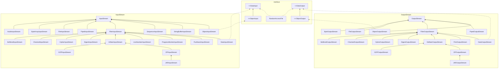
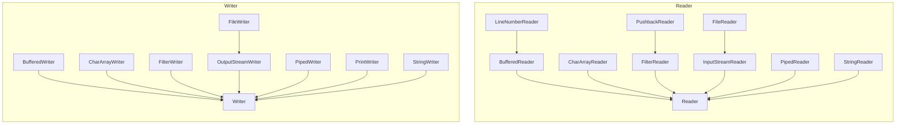
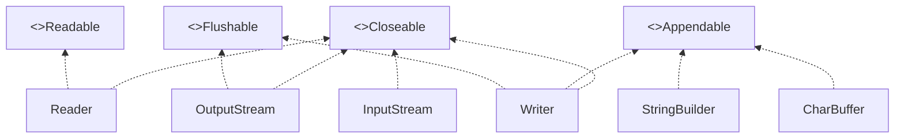
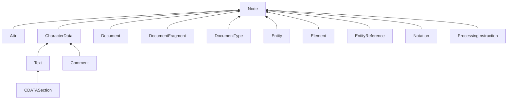

# 第1章 Java SE 8的流库

在本章中，你将学习如何使用Java的流库，它是在Java SE 8中引入的，用来以“做什么而非怎么做”的方式处理集合。

## 1.1 从迭代到流的操作

流表明上看起来和集合很类似，都可以让我们转换和获取数据。但是，它们之间存在着显著的差异：

1. 流并不存储其元素。这些元素可能存储在底层的集合中，或者是按需生成的。
2. 流的操作不会修改其数据源。例如，filter方法不会从新的流中移除元素，而是会生成一个新的流，其中不包含被过滤掉的元素。
3. 流的操作是尽可能惰性执行的。这意味着直至需要其结果时，操作才会执行。

【API】java.util.stream.Stream\<T> 8 ：

- `Stream<T> filter(Predicate <? super T> p)`
  产生一个流，其中包含当前流中满足P的所有元素。
- `long count()`
  产生当前流中元素的数量。这是一个终止操作。

【API】java.util.Collection\<E> 1.2 :

- `default Stream<E> stream()`
- `default Stream<E> parallelStream()`
  产生当前集合中所有元素的顺序流或并行流。

## 1.2 流的创建

静态的stream.of方法

of方法具有可变长参数，因此我们可以构建具有任意数量引元的流

使用Array.stream(array,from,to)可以从数组中位于from(包括)和to(不包括)的元素中创建一个流。

为了创建不包含任何元素的流，可以使用静态的Stream.empty方法

Stream接口有两个用于创建无限流的静态方法。generate方法会接受一个不包含任何引元的函数（或者从技术上来讲，是一个Supplier\<T>接口的对象）。

*注意：Java API中有大量方法都可以产生流。例如，Pattern类有一个splitAsStream方法*

【API】java.util.stream.Stream 8 :

- `static <T> Stream<T> of(T... values)`
  产生一个元素为给定值的流。
- `static <T> Stream<T> empty()`
  产生一个不包含任何元素的流
- `static <T> Stream<T> generate(Supplier<T> s)`
  产生一个无限流，它的值是通过反复调用函数s而构建的。
- `static <T> Stream<T> iterate(T seed, UnaryOperator<T> f)`
  产生一个无限流，它的元素包含种子、在种子上调用f产生的值、在前一个元素上调用f产生的值，等等。

【API】java.util.Arrays 1.2 :

- `static <T> Stream<T> stream(T[] array, int startInclusive, int endExclusive) 8`
  产生一个流，它的元素是由数组指定范围内的元素构成的。

【API】java.util.regex.Pattern 1.4 :

- `Stream<String> splitAsStream(CharSequence input) 8`
  产生一个流，它的元素是输入中由该模式界定的部分。

【API】java.nio.file.Files 7：

- `static Stream<String> lines(Path path)` 8
- `static Stream<String> lines(Path path, Charset cs)` 8
  产生一个流，它的元素是指定文件中的行，该文件的字符集为UTF-8，或者为指定的字符集。

【API】java.util.function.Supplier\<T> 8 :

- `T get()`
  提供一个值。

## 1.3 filter、map和flatMap方法

filter转换会产生一个流，它的元素与某种条件相匹配。

filter的引元是Predicate\<T>,即从T到boolean的函数。

通常，我们想要按照某种方式来转换流中的值，此时，可以使用map方法并传递执行该转换的函数。

我们得到一个包含流的流，为了将其摊平为字母流，可以使用flatMap方法而不是map方法。

【API】java.util.stream.Stream 8 :

- `Stream<T> filter(Predicate<? super T> predicate)`
  产生一个流，它包含当前流中所有满足断言条件的元素。
- `<R> Stream<R> map(Function<? super T, ? extends R> mapper)`
  产生一个流，它包含将mapper应用于当前流中所有元素所产生的结果。
- `<R> Stream<R> flatMap(Function<? super T, ? extends Stream<? extends R>> mapper)`
  产生一个流，它是通过将mapper应用于当前流中所有元素所产生的结果连接到一起而获得的。（注意，这里的每一个结果都是一个流。）

## 1.4 抽取子流和连接流

调用stream.limit(n)会返回一个新的流，它在n个元素之后结束（如果原来的流更短，那么就会在流结束时结束）。这个方法对于裁剪无限流的尺寸会显得特别有用。

调用stream.skip(n)正好相反：它会丢弃前n个元素。

我们可以用Steam类的静态的concat方法将两个流连接起来。

当然，第一个流不应该是无限的，否则第二个流永远都不会得到处理的机会。

【API】java.util.stream.Stream 8 :

- `Stream<T> limit(long maxSize)`
  产生一个流，其中包含了当前流中最初的maxSize个元素。
- `Stream<T> skip(long n)`
  产生一个流，它的元素是当前流中除了前n个元素之外的所有元素。
- `static <T> Stream<T> concat(Stream<? extends T> a, Stream<? extends T> b)`
  产生一个流，它的元素是a的元素后面跟着b的元素。

## 1.5 其他的流转换

distinct方法会返回一个流，它的元素是从原有流中产生的，即原来的元素按照同样的顺序剔除重复元素后产生的。这个流显然能够记住它已经看到过的元素。

对于流的排序，有多种sorted方法的变体可用。其中一种用于操作Comparable元素的流，而另一种可以接受一个Comparator。

peek方法会产生另一个流，它的元素与原来的流中的元素相同，但是在每次获取一个元素时，都会调用一个函数。

对于调试，你可以让peek调用一个你设置了断点的方法。

【API】java.util.stream.Stream 8 :

- `Stream<T> distinct()`
  产生一个流，包含当前流中所有不同的元素。
- `Stream<T> sorted()`
- `Stream<T> sorted(Comparator<? super T> comparator)`
  产生一个流，它的元素是当前流中的所有元素按照顺序排列的。第一个方法要求元素是实现了Comparable的类的实例。
- `Stream<T> peek(Consumer<? super T> action)`
  产生一个流，它与当前流中的元素相同，在获取其中每个元素时，会将其传递给action。

## 1.6 简单约简

约简是一种终结操作（terminal operation），它们会将流约简为可以在程序中使用的非流值。

你已经看到过一种简单约简：count方法会返回流中元素的数量。

其他的简单约简还有max和min，它们会返回最大值和最小值。

findFirst返回的是非空集合中的第一个值。

如果不强调使用第一个匹配，而是使用任意的匹配都可以，那么就可以使用findAny方法。

如果只想知道是否存在匹配，那么可以使用anyMatch。这个方法接受一个断言引元，因此不需要使用filter。

还有allMatch和noneMatch方法，它们分别会在所有元素和没有任何元素匹配断言的情况下返回true。

【API】java.util.stream.Stream 8 :

- `Optional<T> max(Comparator<? super T> comparator)`
- `Optional<T> min(Comparator<? super T> comparator)`
  分别产生这个流的最大元素和最小元素，使用由给定比较器定义的排序规则，如果这个流为空，会产生一个空的Optional对象。这些操作都是终结操作。
- `Optional<T> findFirst()`
- `Optional<T> findAny()`
  分别产生这个流的第一个和任意一个元素，如果这个流为空，会产生一个空的Optional对象。这些操作都是终结操作。
- `boolean anyMatch(Predicate <? super T> predicate)`
- `boolean allMatch(Predicate <? super T> predicate)`
- `boolean noneMatch(Predicate<? super T> predicate)`
  分别在这个流中任意元素、所有元素和没有任何元素匹配给定断言时返回true。这些操作都是终结操作。

## 1.7 Optional类型

Optional\<T>对象是一种包装器对象，要么包装了类型T的对象，要么没有包装任何对象。

### 1.7.1 如何使用Optional值

有效地使用Optional的关键是要使用这样的方法：它在值不存在的情况下会产生一个可代替物，而只有在值存在的情况下才会使用这个值。

ifPresent方法会接受一个函数。如果该可选值存在，那么它会被传递给该函数。否则，不会发生任何事情。

【API】java.util.Optional 8 :

- `T orElse(T other)`
  产生这个Optional的值，或者在该Optional为空时，产生other。
- `T orElseGet(Supplier<? extends T> other)`
  产生这个Optional的值，或者在该Optional为空时，产生调用other的结果。
- `<X extends Throwable> T orElseThrow(Supplier<? extends X> exceptionSupplier)`
  产生这个Optional的值，或者在该Optional为空时，抛出调用exceptionSupplier的结果。
- `void ifPresent(Consumer<? super T> consumer)`
  如果该Optional不为空，那么就将它的值传递给consumer。
- `<U> Optional<U> map(Function<? super T, ? extends U> mapper)`
  产生将该Optional的值传递给mapper后的结果，只要这个Optional不为空且结果不为null，否则产生一个空Optional。

### 1.7.2 不适合使用Optional值的方式

get方法会在Optional值存在的情况下获得其中包装的元素，或者在不存在的情形下抛出一个NoSuchElementException对象。

isPresent方法会报告某个Optional\<T>对象是否具有一个值。

【API】java.util.Optional 8 :

- `T get()`
  产生这个Optional的值，或者在该Optional为空时，抛出一个NoSuchElementException对象。
- `boolean isPresent()`
  如果该Optional不为空，则返回true。

### 1.7.3 创建Optional值

ofNullable方法被用来作为可能出现的null值和可选值之间的桥梁。

【API】java.util.Optional 8 :

- `static <T> Optional<T> of(T value)`
- `static <T> Optional<T> ofNullable(T value)`
  产生一个具有给定值的Optional。如果value为null，那么第一个方法会抛出一个NullPointerException对象，而第二个方法会产生一个空Optional。
- `static <T> Optional<T> empty()`
  产生一个空Optional。

### 1.7.4 用flatMap来构建Optional值的函数

【API】java.util.Optional 8 :

- `<U> Optional<U> flatMap(Function<? super T, Optional<U>> mapper)`
  产生将mapper应用于当前的Optional值所产生的结果，或者在当前Optional为空时，返回一个空Optional。

## 1.8 收集结果

调用iterator方法，它会产生可以用来访问元素的旧式风格的迭代器。

调用forEach方法，将某个函数应用于每个元素。

在并行流上，forEach方法会以任意顺序遍历各个元素。如果想要按照流中的顺序来处理它们，可以调用forEachOrdered方法。

调用toArray方法，获得由流的元素构成的数组。

因为无法在运行时创建泛型数组，所以表达式stream.toArray()会返回一个Object[]数组。如果想要让数组具有正确的类型，可以将其传递到数组构造器中。

collect方法，它会接受一个Collector接口的实例。Collectors类提供了大量应用于生成公共收集器的工厂方法。

如果想要将流的结果约简为总和、平均值、最大值或最小值，可以使用summarizing（Int| Long| Double）方法中的某一个。

【API】java.util.stream.BaseStream 8 :

- `Iterator<T> iterator()`
  产生一个用于获取当前流中各个元素的迭代器。这是一种终结操作。

【API】java.util.stream.Stream 8 :

- `void forEach(Consumer<? super T> action)`
  在流的每个元素上调用action。这是一种终结操作。
- `Object[] toArray()`
- `<A> A[] toArray(IntFunction<A[]> generator)`
  产生一个对象数组，或者在将引用A[]::new传递给构造器时，返回一个A类型的数组。这些操作都是终结操作。
- `<R,A> R collect(Collector<? super T,A,R> collector)`
  使用给定的收集器来收集当前流中的元素。Collectors类有用于多种收集器的工厂方法。

【API】java.util.stream.Collectors 8 :

- `static <T> Collector<T,?,List<T>> toList()`
- `static <T> Collector<T,?,Set<T>> toSet()`
  产生一个将元素收集到列表或集中的收集器。
- `static <T,C extends Collection<T>> Collector<T,?,C> toCollection(Supplier<C> collectionFactory)`
  产生一个将元素收集到任意集合中的收集器。可以传递一个诸如TreeSet::new的构造器引用。
- `static Collector<CharSequence,?,String> joining()`
- `static Collector<CharSequence,?,String> joining(CharSequence delimiter)`
- `static Collector<CharSequence,?,String> joining(CharSequence delimiter, CharSequence prefix, CharSequence suffix)`
  产生一个连接字符串的收集器。分隔符会置于字符串之间，而第一个字符串之前可以有前缀，最后一个字符串后可以有后缀。如果没有指定，那么它们都为空。
- `static <T> Collector<T,?,IntSummaryStatistics> summarizingInt(ToIntFunction<? super T> mapper)`
- `static<T> Collector<T,?,LongSummaryStatistics> summarizingLong(ToLongFunction<? super T> mapper)`
- `static<T> Collector<T,?,DoubleSummaryStatistics> summarizingDouble(ToDoubleFunction<? super T> mapper)`
  产生能够生成（Int| Long| Double）SummaryStatistics对象的收集器，通过它可以获得将mapper应用于每个元素后所产生的结果的个数、总和、平均值、最大值和最小值。

【API】IntSummaryStatistics 8
LongSummaryStatistics 8
DoubleSummaryStatistics 8：

- `long getCount()`
  产生汇总后的元素的个数。
- `(int|long|double) getSum()`
- `double getAverage()`
  产生汇总后的元素的总和或平均值，或者在没有任何元素时返回0。
- `(int|long|double) getMax()`
- `(int|long|double) getMin()`
  产生汇总后元素的最大值和最小值，或者在没有任何元素时，产生(Integer|Long|Double).(MAX|MIN)\_VALUE。

## 1.9 收集到映射表中

*注意：对于每一个toMap方法，都有一个等价的可以产生并发映射表的toConcurrentMap方法。*

【API】java.util.stream.Colletor 8 :

- `static<T,K,U> Collector<T,?,Map<K,U>> toMap(Function<? super T, ? extends K> keyMapper, Function<? super T, ? extends U> valueMapper)`
- `static<T,K,U> Collector<T,?,Map<K,U>> toMap(Function<? super T, ? extends K> keyMapper, Function<? super T, ? extends U> valueMapper, BinaryOperator<U> mergeFunction)`
- `static<T,K,U,M extends Map<K,U> Collector<T,?,M> toMap(Function<? super T, ? extends K> keyMapper, Function<? super T, ? extends U> valueMapper, BinaryOperator<U> mergeFunction, Supplier<M> mapSupplier)`
- `static<T,K,U> Collector<T,?,ConcurrentMap<K,U>> toConcurrentMap(Function<? super T, ? extends K> keyMapper, Function<? super T, ? extends U> valueMapper)`
- `static<T,K,U> Collector<T,?,ConcurrentMap<K,U>> toConcurrentMap(Function<? super T, ? extends K> keyMapper, Function<? super T, ? extends U> valueMapper, BinaryOperator<U> mergeFunction)`
- `static<T,K,U,M extends ConcurrentMap<K,U>> Collector<T,?,M> toConcurrentMap(Function<? super T, ? extends K> keyMapper, Function<? super T, ? extends U> valueMapper, BinaryOperator<U> mergeFunction, Supplier<M> mapSupplier)`
  产生一个收集器，它会产生一个映射表或并发映射表。keyMapper和valueMapper函数会应用于每个收集到的元素上，从而在所产生的映射表中生成一个键/值项。默认情况下，当两个元素产生相同的键时，会抛出一个IllegalStateException异常。你可以提供一个mergeFunction来合并具有相同键的值。默认情况下，其结果是一个HashMap或ConcurrentHashMap。你可以提供一个mapSupplier，它会产生所期望的映射表实例。

## 1.10 群组和分区

【API】java.util.stream.Collector 8 :

- `static<T,K> Colletor<T,?,Map<K,List<T>>> groupingBy(Function<? super T,? extends K> classifier)`
- `static<T,K> Colletor<T,?,ConcurrentMap<K,List<T>>> groupingByConcurrent(Function<? super T,? extends K> classifier)`
  产生一个收集器，它会产生一个映射表或并发映射表，其键是将classifier应用于所有收集到的元素上所产生的结果，而值是由具有相同键的元素构成的一个个列表。
- `static <T> Colletor<T,?,Map<Boolean,List<T>>> partitioningBy(Predicate<? super T> predicate)`
  产生一个收集器，它会产生一个映射表，其键是true/false，而值是有满足/不满足断言的元素构成的列表。

## 1.11 下游收集器

groupingBy方法会产生一个映射表，它的每个值都是一个列表。如果想要以某种方式来处理这些列表，就需要提供一个“下游收集器”。例如，如果想要获得集而不是列表，那么可以使用Colletor.toSet收集器。

Java提供了多种可以将群组元素约简为数字的收集器：

- counting会产生收集到的元素的个数。
- summing（Int|Long|Double）会接受一个函数作为引元，将该函数应用到下游元素中，并产生它们的和。
- maxBy和minBy会接受一个比较器，并产生下游元素中的最大值和最小值。

mapping方法会产生将函数应用到下游结果上的收集器，并将函数值传递给另一个收集器。

【API】java.util.stream.Collection 8 :

- `static <T> Collector<T,?,Long> counting()`
  产生一个可以对收集到的元素进行计数的收集器。
- `static <T> Collector<T,?,Integer> summingInt(ToIntFunction<? super T> mapper)`
- `static <T> Collector<T,?,Long> summingLong(ToLongFunction<? super T> mapper)`
- `static <T> Collector<T,?,Double> summingDouble(ToIntFunction<? super T> mapper)`
  产生一个收集器，对将mapper应用到收集到的元素上之后产生的值计算总和。
- `static <T> Collector<T,?,Optional<T>> maxBy(Comparator<? super T> comparator)`
- `static <T> Collector<T,?,Optional<T>> minBy(Comparator<? super T> comparator)`
  产生一个收集器，使用comparator指定的排序方法，计算收集到的元素中的最大和最小值。
- `static <T,U,A,R> Collector<T,?,R> mapping(Function<? super T, ? extends U> mapper, Colletor<? super U, A, R> downstream)`
  产生一个收集器，它会产生一个映射表，其键是将mapper应用到收集到的数据上而产生的，其值是使用downstream收集器收集到的具有相同键的元素。

## 1.12 约简操作

reduce方法是一种用于从流中计算某个值的通用机制，其最简单的形式将接受一个二元函数，并从前两个元素开始持续应用它。

【API】java.util.Stream 8 :

- `Optional<T> reduce(BinaryOperator<T> accumulator)`
- `T reduce(T identity, BinaryOperator<T> accumulator)`
- `<U> U reduce(U identity, BiFunction<U, ? super T, U> accumulator, BinaryOperator<U> combiner)`
  用给定的accumulator函数产生流中元素的累积总和。如果提供了幺元，那么第一个被累计的元素就是该幺元。如果提供了组合器，那么它可以用来将分别累积的各个部分整合成总和。
- `<R> Rcollect(Supplier<R> supplier, BiConsumer<R, ? super T> accumulator, BiConsumer<R,R> combiner)`
  将元素收集到类型R的结果中。在每个部分上，都会调用supplier来提供初始结果，调用accumulator来交替地将元素添加到结果中，并调用combiner来整合两个结果。

## 1.13 基本类型流

流库中具有专门的类型IntStream、LongStream和DoubleStream，用来直接存储基本类型值，而无需使用包装器。如果想要存储short、char、byte和boolean，可以使用IntStream，而对于float，可以使用DoubleStream。

为了创建IntStream，需要调用IntStream.of 和 Arrays.stream方法

与对象流一样，我们还可以使用静态的generate 和 iterate 方法。此外，IntStream 和 LongStream有静态方法range和rangeClosed，可以生成步长为1的整数范围。

CharSequence接口拥有codePoints和chars方法，可以生成由字符的Unicode码或由UTF-16编码机制的码元构成的IntStream。

当你有一个对象流时，可以用mapToInt、mapToLong和mapToDouble将其转换为基本类型流。

为了将基本类型流转换为对象流，需要使用boxed方法。

通常，基本类型流上的方法与对象流上的方法类似。下面是最主要的差异：

- toArray方法会返回基本类型数组。
- 产生可选结果的方法会返回一个OptionalInt、OptionalLong或OptionalDouble。这些类与Optional类类似，但是具有getAsInt、getAsLong和getAsDouble方法，而不是get方法。
- 具有返回总和、平均值、最大值和最小值的sum、average、max和min方法。对象流没有定义这些方法。
- summaryStatistics 方法会产生一个类型为IntSummaryStatistics、LongSummaryStatistics或DoubleSummaryStatistics的对象，它们可以同时报告流的总和、平均值、最大值和最小值。

*注意：Random类具有ints、longs和doubles方法，它们会返回由随机数构成的基本类型流。*

【API】java.util.stream.Stream 8 :

-  `static IntStream range(int startInclusive, int endExclusive)`
-  `static IntStream rangeClosed(int startInclusive, int endExclusive)`
   产生一个由给定范围内的整数构成的IntStream。
-  `static IntStream of(int... values)`
   产生一个由给定元素构成的IntStream。
-  `int[] toArray()`
   产生一个由当前流中的元素构成的数组。
-  `int sum()`
-  `OptionalDouble average()`
-  `OptionalInt max()`
-  `OptionalInt min()`
-  `IntSummaryStatistics summaryStatistics()`
   产生当前流中元素的总和、平均值、最大值和最小值，或者从中可以获得这些结果的所有四种值的对象。
-  `Stream<Integer> boxed`
   产生用于当前流中的元素的包装器对象流。

【API】java.util.stream.LongStream 8 :

- `static LongStream range(long startInclusive, long endExclusive)`
- `static LongStream rangeClosed(long startInclusive, long endExclusive)`
  用给定范围内的整数产生一个LongStream。
- `static LongStream of(long... values)`
  用给定元素产生一个LongStream。
- `long[] toArray()`
  用当前流中的元素产生一个数组。
- `long sum()`
- `OptionalDouble average()`
- `OptionalLong max()`
- `OptionalLong min()`
- `LongSummaryStatistics summaryStatistics()`
  产生当前流中元素的总和、平均值、最大值和最小值，或者从中可以获得这些结果的所有四种值的对象。
- `Stream<Long> boxed()`
  产生用于当前流中的元素的包装器对象流。

【API】java.util.stream.DoubleStream 8 :

- `static DoubleStream of(double... values)`
  用给定元素产生一个DoubleStream。
- `double[] toArray()`
  用当前流中的元素产生了一个数组。
- `double sum()`
- `OptionalDouble average()`
- `OptionalDouble max()`
- `OptionalDouble min()`
- `DoubleSummaryStatistics summaryStatistics()`
  产生当前流中元素的总和、平均值、最大值和最小值，或者从中可以获得这些结果的所有四种值的对象。
- `Stream<Double> boxed()`
  产生用于当前流中的元素的包装器对象流。

【API】java.lang.CharSequence 1.0 :

- `IntStream codePoints()` 8
  产生由当前字符串的所有Unicode码点构成的流。

【API】java.util.Random 1.0 :

- `IntStream ints()`
- `IntStream ints(int randomNumberOrigin, int randomNumberBound)` 8
- `IntStream ints(long streamSize)` 8
- `IntStream ints(long streamSize, int randomNumberOrigin, int randomNumberBound)` 8
- `LongStream longs()` 8
- `LongStream longs(long randomNumberOrigin, long randomNumberBound)` 8
- `LongStream longs(long streamSize)` 8
- `LongStream longs(long streamSize, long randomNumberOrigin, long randomNumberBound)` 8
- `DoubleStream doubles()` 8
- `DoubleStream doubles(double randomNumberOrigin, double randomNumberBound)` 8
- `DoubleStream doubles(long streamSize)` 8
- `DoubleStream doubles(long streamSize, double randomNumberOrigin, double randomNumberBound)` 8
  产生随机数流。如果提供了streamSize，这个流就是具有给定数量元素的有限流。当提供了边界时，其元素将位于randomNumberOrigin（包含）和randomNumberBound（不包含）的区间内。

【API】java.util.Optional(Int|Long|Double) 8 :

- `static Optional(Int|Long|Double) of((int|long|double) value)`
  用所提供的基本类型值产生一个可选对象。
- `(int|long|double) getAs(Int|Long|Double)()`
  产生当前可选对象的值，或者在其为空时抛出一个NoSuchElementException异常。
- `(int|long|double) orElse((int|long|double) other)`
- `(int|long|double) orElseGet((int|long|double) Supplier other)`
  产生当前可选对象的值，或者在这个对象为空时产生可替代的值。
- `void ifPresent((Int|Long|Double)Consumer consumer)`
  如果当前可选对象不为空，则将其值传递给consumer。

【API】java.util.(Int|Long|Double) SummaryStatistics 8 :

- `long getCount()`
- `(int|long|double) getSum()`
- `double getAverage()`
- `(int|long|double) getMax()`
- `(int|long|double) getMin()`
  产生收集到的元素的个数、总和、平均值、最大值和最小值。

## 1.14 并行流

流使得并行处理块操作变得很容易。这个过程几乎是自动的，但是需要遵守一些规则。首先，必须有一个并行流。可以用Collection.parallelStream()方法从任何集合中获取一个并行流。

为了让并行流正常工作，需要满足大量的条件：

- 数据应该在内存中。必须等到数据到达是非常低效的。
- 流应该可以被高效地分成若干个子部分。由数组或平衡二叉树支撑的流都可以工作得很好，但是Stream.iterate返回的结果不行。
- 流操作的工作量应该具有较大的规模。如果总工作负载并不是很大，那么搭建并行计算时所付出的代价就没有什么意义。
- 流操作不应该被阻塞。

换句话说，不要将所有的流都转换为并行流。只有在对已经位于内存中的数据执行大量计算操作时，才应该使用并行流。

【API】java.util.stream.BaseStream<T,S extends BaseStream<T,S>> 8 :

- `S parallel()`
  产生一个与当前流中元素相同的并行流。
- `S unordered()`
  产生一个与当前流中元素相同的无序流。

【API】java.util.Collection\<E> 1.2 :

- `Stream<E> parallelStream()` 8
  用当前集合中的元素产生一个并行流。

# 第2章 输入与输出

## 2.1 输入/输出流

在Java API中，可以从其中读入一个字节序列的对象称作**输入流**，而可以向其中写入一个字节序列的对象称作**输出流**。这些字节序列的来源地和目的地可以是文件，而且通常都是文件，但是也可以是网络连接，甚至是内存块。抽象类InputStream和OutputStream构成了输入/输出（I/O)类层次结构的基础。

*注意：这些输入/输出流与在前一章中看到的流没有任何关系。为了清楚起见，只要是讨论用于输入和输出的流，我们都将使用术语输入流、输出流或输入/输出流。*

### 2.1.1 读写字节

InputStream类有一个抽象方法read()

这个方法将读入一个字节，并返回读入字节，或者在遇到输入源结尾时返回-1。在设计具体的输入流类时，必须覆盖这个方法以提供适用的功能。

InputStream类还有若干个非抽象的方法，它们可以读入一个字节数组，或者跳过大量的字节。这些方法都要调用抽象的read方法，因此，各个子类都只需覆盖这一个方法。

与此类似，OutputStream类定义了下面的抽象方法：write(int b)

它可以向某个输出位置写出一个字节。

read和write方法在执行时都将阻塞，直至字节确实被读入或写出。

available方法使我们可以去检查当前可读入的字节数量。

当你完成对输入/输出流的读写时，应该通过调用close方法来关闭它，这个调用会释放掉十分有限的操作系统资源。如果一个应用程序打开了过多的输入/输出流而没有关闭，那么系统资源将被耗尽。关闭一个输出流的同时还会冲刷用于该输出流的缓冲区：所有被临时置于缓冲区中，以便用更大的包的形式传递的字节在关闭输出流时都将被送出。特别是，如果不关闭文件，那么写出字节的最后一个包可能将永远得不到传递。当然，我们还可以用flush方法来人为地冲刷出这些输出。

我们可以使用众多的从基本InputStream和OutputStream类导出的某个输入/输出类，而不只是直接使用字节。

【API】java.io.InputStream 1.0 :

- `abstract int read()`
  从数据中读入一个字节，并返回该字节。这个read方法在碰到输入流的结尾时返回-1.
- `int read(byte[] b)`
  读入一个字节数组，并返回实际读入的字节数，或者在碰到输入流的结尾时返回-1.这个read方法最多读入b.length个字节。
- `int read(byte[] b, int off, int len)`
  读入一个字节数组。这个read方法返回实际读入的字节数，或者在碰到输入流的结尾时返回-1.
  参数：b    数据读入的数组
  off    第一个读入字节应该被放置的位置在b中的偏移量
  len    读入字节的最大数量
- `long skip(long n)`
  在输入流中跳过n个字节，返回实际跳过的字节数（如果碰到输入流的结尾，则可能小于n）。
- `int available()`
  返回在不阻塞的情况下可获取的字节数（回忆一下，阻塞意味着当前线程将失去它对资源的占用。）
- `void close()`
  关闭这个输入流。
- `void mark(int readlimit)`
  在输入流的当前位置打一个标记（并非所有的流都支持这个特性）。如果从输入流中已经读入的字节多于readlimit个，则这个流允许忽略这个标记。
- `void reset()`
  返回到最后一个标记，随后对read的调用将重新读入这些字节。如果当前没有任何标记，则这个流不被重置。
- `boolean markSupported()`
  如果这个流支持打标记，则返回true。

【API】java.io.OutputStream 1.0 :

- `abstract void write(int n)`
  写出一个字节的数据。
- `void write(byte[] b)`
- `void write(byte[] b, int off, int len)`
  写出所有字节或者某个范围的字节到数组b中。
  参数：b    数据写出的数组
  off    第一个写出字节在b中的偏移量
  len    写出字节的最大数量
- `void close()`
  冲刷并关闭输出流。
- `void flush()`
  冲刷输出流，也就是将所有缓冲的数据发送到目的地。

### 2.1.2 完整的流家族



DataInputStream和DataOutputStream可以以二进制格式读写所有的基本Java类型。

ZipInputStream和ZipOutputStream可以以常见的ZIP压缩格式读写文件。

另一方面，对于Unicode文本，可以使用抽象类Reader和Writer的子类。Reader和Writer类的基本方法与InputStream和OutputStream中的方法类似。

read方法将返回一个Unicode码元（一个在0~65535之间的整数），或者在碰到文件结尾时返回-1。write方法在被调用时，需要传递一个Unicode码元（请查看卷I第3章有关Unicode码元的讨论）。



还有四个附加的接口：Closable、Flushable、Readable和Appendable。



【API】java.io.Closeable 5.0 :

- `void close()`
  关闭这个Closeable，这个方法可能会抛出IOException。

【API】java.io.Flushable 5.0 :

- `void flush()`
  冲刷这个Flushable。

【API】java.lang.Readable 5.0 :

- `int read(CharBuffer cb)`
  尝试着向cb读入其可持有数量的char值。返回读入的char值的数量，或者当从这个Readable中无法再获得更多的值时返回-1。

【API】java.lang.Appendable 5.0 :

- `Appendable append(char c)`
- `Appendable append(charSequence cs)`
  向这个Appendable中追加给定的码元或者给定的序列中所有码元，返回this。

【API】java.lang.CharSequence 1.4 :

- `char charAt(int index)`
  返回给定索引处的码元。
- `int length()`
  返回在这个序列中的码元数量。
- `CharSequence subSequence(int startIndex, int endIndex)`
  返回由存储在startIndex到endIndex-1处的所有码元构成的CharSequence。
- `String toString()`
  返回这个序列中所有码元构成的字符串。

### 2.1.3 组合输入/输出流过滤器

*提示：所有在java.io中的类都将相对路径名解释为以用户工作目录开始，你可以通过调用System.getProperty("user.dir")来获得这个信息。*

*警告：由于反斜杠字符在Java字符串中是转义字符，因此要确保在Windows风格的路径名中使用`\\`。在Windows中，还可以使用单斜杠字符，因为大部分Windows文件处理的系统调用都会将斜杠解释成文件分隔符。但是，并不推荐这样做，因为Windows系统函数的行为会因与时俱进而发生变化。因此，对于可移植的程序来说，应该使用程序所运行平台的文件分隔符，我们可以通过常量字符串java.io.File.separator获得它。*

Java使用了一种灵巧的机制来分离这两种职责。某些输入流（例如FileInputStream和由URL类的openStream方法返回的输入流）可以从文件和其他更外部的位置上获取字节，而其他的输入流（例如DataInputStream）可以将字节组装到更有用的数据类型中。Java程序员必须对二者进行组合。

你可以通过嵌套过滤器来添加多重功能。例如，输入流在默认情况下是不被缓冲区缓存的，也就是说，每个对read的调用都会请求操作系统再分发一个字节。相比之下，请求一个数据块并将其置于缓冲区中会显得更加高效。

有时当多个输入流链接在一起时，你需要跟踪各个中介输入流（intermediate input stream）。	PushbackInputStream预读下一个字节并且在它并非你所希望的值时将其推回流中。

读入和推回是可应用于可回推（pushback）输入流的仅有的方法。

当然，在其他编程语言的输入/输出流类库中，诸如缓冲机制和预览等细节都是自动处理的。因此，相比较而言，Java就有一点麻烦，它必须将多个流过滤器组合起来。但是，这种混合并匹配过滤器类以构建真正有用的输入/输出流序列的能力，将带来极大的灵活性。

【API】java.io.FileInputStream 1.0 :

- `FileInputStream(Stream name)`
- `FileInputStream(File file)`

【API】java.io.FileOutputStream 1.0 :

- `FileOutputStream(String name)`
- `FileOutputStream(String name, boolean append)`
- `FileOutputStream(File file)`
- `FileOutputStream(File file, boolean append)`

【API】java.io.BufferedInputStream 1.0 :

- `BufferedInputStream(InputStream in)`

【API】java.io.BufferedOutputStream 1.0 :

- `BufferedOutputStream(OutputStream out)`

【API】java.io.PushbackInputStream 1.0 :

- `PushbackInputStream(InputStream in)`
- `PushbackInputStream(InputStream in, int size)`
- `void unread(int b)`

## 2.2 文本输入与输出

### 2.2.1 如何写出文本输出

对于文本输出，可以使用PrintWriter。

println方法在行中添加了对目标系统来说恰当的行结束符（Windows系统是"\r\n"，UNIX系统是"\n"）

自动冲刷模式	默认情况下，自动冲刷机制是禁用的

print方法不抛出异常，你可以调用checkError方法来查看输出流是否出现了某些错误。

*注意：在Java1.0中，PrintStream类只是通过将高字节丢弃的方式把所有Unicode字符截断成ASCII字符。	为了与已有代码兼容，System.in、System.out、System.err仍旧是输入/输出流而不是读入器和写出器。但是现在PrintStream类在内部采用与PrintWriter相同的方式将Unicode字符转换成了默认的主机编码方式。当你在使用print和println方法时，PrintStream类型的对象的行为看起来确实很像打印写出器，但是与打印写出器不同的是，它们允许我们用write(int)和write(byte[])方法输出原生字节。*

【API】java.io.PrintWriter 1.1 :

- `PrintWriter(Write out)`
- `PrintWriter(Writer writer)`
- `PrintWriter(String filename, String encoding)`
- `PrintWriter(File file, String encoding)`
- `void print(Object obj)`
- `void print(String s)`
- `void println(String s)`
- `void print(char[] s)`
- `void print(char c)`
- `void print(int i)`
- `void print(long l)`
- `void print(float f)`
- `void print(double d)`
- `void print(boolean b)`
- `void printf(String format, Object... args)`
- `boolean checkError()`

### 2.2.2 如何读入文本输入

在早期Java版本中，处理文本输入的唯一方式就是通过BufferedReader类。它的readline方法会产生一行文本，或者在无法获得更多输入时返回null。

如今，BufferedReader类又有了一个lines方法，可以产生一个Stream\<String>对象。但是，与Scanner不同，BufferedReader没有用于任何读入数字的方法。

### 2.2.3 以文本格式存储对象

### 2.2.4 字符编码方式

最常见的编码方式是UTF-8,它会将每个Unicode编码点编码为1到4个字节的序列。UTF-8的好处是传统的包含了英语中用到的所有字符的ASCII字符集中的每个字符都只会占用一个字节。

另一种常见的编码方式是UTF-16，它会将每个Unicode编码点编码为1个或2个16位值。这是一种在Java字符串中使用的编码方式。实际上，有两种形式的UTF-16，被称为“高位优先”和“低位优先”。

*警告：有些程序，包括Microsoft Notepad（微软记事本）在内，都在UTF-8编码的文件开头处添加了一个字节顺序标记。很明显，这并不需要，因为在UTF-8中，并不存在字节顺序的问题。但是Unicode标准允许这样做，甚至认为这是一种好的做法，因为这样做可以使编码机制不留疑惑。遗憾的是，Java并没有这么做。	对你来说，最好的做法是将输入中发现的所有先导的\uFEFF都剥离掉。*

不存在任何可靠的方式可以自动地探测出字节流中所使用的字符编码方式。

*注意：平台使用的编码方式可以由静态方法Charset.defaultCharset返回。静态方法Charset.availableCharsets会返回所有可用的Charset实例，返回结果一个从字符集的规范名称到Charset对象的映射表。*

*警告：Oracle的Java实现有一个用于覆盖平台默认值的系统属性file.encoding。但是它并非官方支持的属性，并且Java库的Oracle实现的所有部分并非都以一致的方式处理该属性，因此，你不应该设置它。*

StandardCharsets类具有类型为Charset的静态变量，用于表示每种Java虚拟机都必须支持的字符编码方式。

为了获得另一种编码方式的Charset，可以使用静态的forName方法。

*警告：在不指定任何编码方式时，有些方法（例如String（byte[ ]）构造器）会使用默认的平台编码方式，而其他方法（例如Files.readAllLines）会使用UTF-8*

## 2.3 读写二进制数据

### 2.3.1 DataInput和DataOutput

DataOutput接口定义了用于二进制格式写数组、字符、boolean值和字符串的方法。

例如，writeInt总是将一个整数写出为4字节的二进制数量值，而不管它有多少位，writeDouble总是将一个double值写出为8字节的二进制数量值。这样产生的结果并非人可阅读的，但是对于给定类型的每个值，所需的空间都是相同的，而且将其读回也比解析文本要快。

*注意：在Java中，所有的值都按照高位在前的模式写出，不管使用何种处理器，这使得Java数据文件可以独立于平台。*

writeUTF方法使用修订版的8位Unicode转换格式写出字符串。这种方式与直接使用标准的UTF-8编码方式不同，其中，Unicode码元序列首先用UTF-16表示，其结果之后使用UTF-8规则进行编码。修订后的编码方式对于编码大于0xFFFF的字符的处理有所不同，这是为了向后兼容在Unicode还没有超过16位构建的虚拟机。

因为没有其他方法会使用UTF-8的这种修订，所以你应该只在写出用于Java虚拟机的字符串时才使用writeUTF方法。	对于其他场合，都应该使用writeChars方法。

【API】java.io.DataInput 1.0 :

- `boolean readBoolean()`
- `byte readByte()`
- `char readChar()`
- `double readDouble()`
- `float readFloat()`
- `int readInt()`
- `long readLong()`
- `short readShort()`
- `void readFully(byte[] b)`
- `void readFully(byte[] b,int off,int len)`
- `String readUTF()`
- `int skipBytes(int n)`

【API】java.io.DataOutput 1.0 :

- `void writeBoolean(boolean b)`
- `void writeByte(int b);`
- `void writeChar(int c)`
- `void writeDouble(double d)`
- `void writeFloat(float f)`
- `void writeInt(int i)`
- `void writeLong(long l)`
- `void writeShort(int s)`
- `void writerChars(String s)`
- `void writeUTF(String s)`

### 2.3.2 随机访问文件

RandomAccessFile类可以在文件中的任何位置查找或写入数据。磁盘文件都是随机访问的，但是与网络套接字通信的输入/输出流却不是。你可以打开一个随机访问文件，只用于读入或者同时用于读写，你可以通过使用字符串“r”（用于读入访问）或“rw”（用于读入/写出访问）作为构造器的第二个参数来指定这个选项。

当你将已有文件作为RandomAccessFile打开时，这个文件并不会被删除。

随机访问文件有一个表示下一个将被读入或写出的字节所处位置的文件指针，seek方法可以用来将这个文件指针设置到文件中的任意字节位置。

getFilePointer方法将返回文件指针的当前位置。

RandomAccessFile类同时实现了DataInput和DataOutput接口。

要确定文件中的字节总数，可以使用length方法。

【API】java.io.RandomAccessFile 1.0 :

- `RandomAccessFile(String file, String mode)`
- `RandomAccessFile(File file, String mode)`
- `long getFilePointer()`
- `void seek(long pos)`
- `long length()`

### 2.3.3 ZIP文档

ZIP文档（通常）以压缩格式存储了一个或多个文件，每个ZIP文档都有一个头，包含诸如每个文件的名字和所使用的压缩方法等信息。在Java中，可以使用ZipInputStream来读入ZIP文档。你可能需要浏览文档中每个单独的项，getNextEntry方法就可以返回一个描述这些项的对象。向ZipInputStream的getInputStream方法传递该项用于读取该项的输入流。然后调用closeEntry来读入下一项。下面是典型的通读ZIP文件的代码序列：

```java
ZipInputStream zin = new ZipInputStream(new FileInputStream(zipname));
ZipEntry entry;
while((entry = zin.getNextEntry())!=null){
    InputStream in = zin.getInputStream(entry);
    read the contents of in...
    zin.closeEntry();
}
zin.close();
```

要写出到ZIP文件，可以使用ZipOutputStream，对于你希望放入到ZIP文件中的每一项，都应该创建一个ZipEntry对象，并将文件名传递给ZipEntry的构造器，它将设置其他诸如文件日期和解压缩方法等参数。	下面是代码框架：

```java
FileOutputStream fout = new FileOutputStream("test.zip");
ZipOutputStream zout = new ZipOutputStream(fout);
for all files{
    ZipEntry ze = new ZipEntry(filename);
    zout.putNextEntry(ze);
    send data to zout
    zout.closeEntry();
}
zout.close();
```

*注意：JAR文件只是带有一个特殊项的ZIP文件，这个项称作清单。你可以使用JarInputStream和JarOutputStream来读写清单项*

ZIP输入流是一个能够展示流的抽象化的强大之处的实例。当你读入以压缩格式存储的数据时，不必担心边请求边解压数据的问题，而且ZIP格式的字节源并非必须是文件，也可以是来自网络链接的ZIP数据。事实上，当Applet的类加载器读入JAR文件时，它就是在读入和解压来自网络的数据。

【API】java.util.zip.ZipInputStream 1.1 :

- `ZipInputStream(InputStream in)`
- `ZipEntry getNextEntry()`
- `void closeEntry()`

【API】java.util.zip.ZipOutputStream 1.1 :

- `ZipOutputStream(OutputStream out)`
- `void putNextEntry(ZipEntry ze)`
- `void closeEntry()`
- `void setLevel(int level)`
- `void setMethod(int method)`

【API】java.util.zip.ZipEntry 1.1 :

- `ZipEntry(String name)`
- `long getCrc()`
- `String getName()`
- `long getSize()`
- `boolean isDirectory()`
- `void setMethod(int method)`
- `void setSize(long size)`
- `void setCrc(long crc)`

【API】java.util.zip.ZipFile 1.1 :

- `ZipFile(String name)`
- `ZipFile(File file)`
- `Enumeration entries()`
- `ZipEntry getEntry(String name)`
- `InputStream getInputStream(ZipEntry ze)`
- `String getName()`

## 2.4 对象输入/输出流与序列化

Java语言支持一种称为对象序列化（object serialization）的非常通用的机制，它可以将任何对象写出到输出流中，并在之后将其读回。

### 2.4.1 保存和加载序列化对象

对希望在对象输出流中存储或从对象输入流中恢复的所有类都应进行一下修改，这些类必须实现Serializable接口

Serializable接口没有任何方法。

当一个对象被多个对象分享，作为它们各自状态的一部分时，会发生什么？	保存这样的对象网络是一种挑战，在这里我们当然不能去保存和恢复对象的内存地址。与此不同的是，每个对象都是用一个序列号（serial number）保存的，这就是这种机制之所以称为对象序列化的原因。下面是其算法：

- 对你遇到的每一个对象引用都关联一个序列号。
- 对于每个对象，当第一次遇到时，保存其对象数据到输出流中。
- 如果某个对象之前已经被保存过，那么只写出“与之前保存过的序列号为x的对象相同”。在读回对象时，整个过程是反过来的。
- 对于对象输入流中的对象，在第一次遇到其序列号时，构建它，并使用流中数据来初始化它，然后记录这个顺序号和新对象之间的关联。
- 当遇到“与之前保存过的序列号为x的对象相同”标记时，获取与这个顺序号相关联的对象引用。

*注意：序列化的另一种非常重要的应用是通过网络将对象集合传送到另一台计算机上。*

【API】java.io.ObjectOutputStream 1.1 :

- `ObjectOutputStream(OutputStream out)`
- `void writeObject(Object obj)`

【API】java.io.ObjectInputStream 1.1 :

- `ObjectInputStream(InputStream in)`
- `Object readObject()`

### 2.4.2 理解对象序列化的文件格式

每个文件都是以下面这两个字节的“魔幻数字”开始的

`AC ED`

后面紧跟着对象序列化格式的版本号，目前是

`00 05`

然后是，它包含的对象序列，其顺序即它们存储的顺序。

字符串对象被存为`74 两字节表示的字符串长度 所有字符`	例如，字符串“Harry”被存为`74 00 05 Harry`	字符串中的Unicode字符被存储为修订过的UTF-8格式。

当存储一个对象时，这个对象所属的类也必须存储。这个类的描述包含：

- 类名
- 序列化的版本唯一的ID，它是数据域类型和方法签名的指纹。
- 描述序列化方法的标志集。
- 对数据域的描述。

指纹是通过对类、超类、接口、域类型和方法签名按照规范方式排序，然后将安全散列算法（SHA）应用于这些数据而获得的。

SHA是一种可以为较大信息块提供指纹的快速算法，不论是最初的数据块尺寸有多大，这种指纹总是20个字节的数据包。	序列化机制只使用了SHA码的前8个字节作为类的指纹。即便这样，当类的数据域或方法发生变化时，其指纹跟着变化的可能性还是非常大。

下面表示了类标识符是如何存储的：

- 72
- 2字节的类名长度
- 类名
- 8字节长的指纹
- 1字节长的标志
- 2字节长的数据域描述符的数量
- 数据域描述符
- 78（结束标记）
- 超类类型（如果没有就是70）

标记字节是由在java.io.ObjectStreamConstants中定义的3位掩码构成的。

我们会在本章稍后讨论Externalizable接口。可外部化的类提供了定制的接管其实例域输出的读写方法。我们要写出这些类实现了Serializable接口，并且其标志值为02，而可序列化的java.util.Date类定义了它自己的readObject/writeObject方法，并且其标志值为03。

每个数据域描述符的格式如下：

- 1字节长的类型编码
- 2字节长的域名长度
- 域名
- 类名（如果域是对象）

其中类型编码是下列取值之一：

B	byte

C	char

D	double

F	float

I	int

J	long

L	对象

S	short

Z	boolean

[	数组

当类型编号为L时，域名后面紧跟域的类型。类名和域名字符串不是以字符串编码74开头的，但域类型是。域类型使用的是与域名稍有不同的编码机制，即本地方法使用的格式。

例如，Employee类的薪水域被编码为：

`D 00 06 salary`

下面是Employee类完整的类描述符：

```
72 00 08 Employee
	E6 D2 86 7D AE AC 18 1B 02		指纹和标志
	00 03							实例域的数量
	D 00 06 salary					实例域的类型和名字
	L 00 07 hireDay					实例域的类型和名字
	74 00 10 Ljava/util/Date		实例域的类名——Date
	L 00 04 name					实例域的类型和名字
	74 00 12 Ljava/lang/String		实例域的类名——String
	78								结束标记
	70								无超类
```

这些描述符相当长，如果在文件中再次需要相同的类描述符，可以使用一种缩写版：

`71		4字节长的序列号`

这个序列号将引用到前面已经描述过的类描述符，我们稍后将讨论编号模式。


你应该记住：

- 对象流输出中包含所有对象的类型和数据域。
- 每个对象都被赋予一个序列号。
- 相同对象的重复出现将被存储为对这个对象的序列号的引用。

### 2.4.3 修改默认的序列化机制

某些数据域是不可以序列化的，例如，只对本地方法有意义的存储文件句柄或窗口句柄的整数值，这种信息在稍后重新加载对象或将其传送到其他机器上时都是没有用处的。事实上，这种域的值如果不恰当，还会引起本地方法崩溃。Java拥有一种很简单的机制来防止这种域被序列化，那就是将它们标记成是transient的。如果这些域属于不可序列化的类，你也需要将它们标记成transient的。瞬时的域在对象被序列化时总是被跳过的。

序列化机制为单个的类提供了一种方式，去向默认的读写行为添加验证或任何其他想要的行为。可序列化的类可以定义具有下列签名的方法：

`private void readObject(ObjectInputStream in) throws IOException, ClassNotFoundException;`

`private void writeObject(ObjectOutputStream out) throws IOException;` 

之后，数据域就再也不会被自动序列化，取而代之的是调用这些方法。

readObject和writeObject方法只需要保存和加载它们的数据域，而不需要关心超类数据和任何其他类的信息。

除了让序列化机制来保存和恢复对象数据，类还可以定义它自己的机制。为了做到这一点，这个类必须实现Externalizable接口，这需要它定义两个方法：

`public void readExternal(ObjectInputStream in) throws IOException, ClassNotFoundException;`

`public void writeExternal(ObjectOutputStream out) throws IOException;`

与前面一节描述的readObject和writeObject不同，这些方法对包括超类数据在内的整个对象的存储和恢复负全责。

*警告：readObject和writeObject方法是私有的，并且只能被序列化机制调用。与此不同的是，readExternal和writeExternal方法是公共的。特别是，readExternal还潜在地允许修改现有对象的状态。*

### 2.4.4 序列化单例和类型安全的枚举

当类型安全的枚举实现Serializable接口时，你必须牢记存在着一种重要的变化，此时，默认的序列化机制是不适用的。

为了解决这个问题，你需要定义另外一种称为readResolve的特殊序列化方法。如果定义了readResolve方法，在对象被序列化之后就会调用它。它必须返回一个对象，而该对象之后会成为readObject的返回值。

请记住向遗留代码中所有类型安全的枚举以及向所有支持单例设计模式的类中添加readResolve方法。

### 2.4.5 版本管理

类可以表明它对其早期版本保持兼容，要想这样做，就必须首先获得这个类的早期版本的指纹。我们可以使用JDK中的单机程序serialver来获得这个数字。

这个类的所有较新的版本都必须把serialVersionUID常量定义为与最初版本的指纹相同。

如果一个类具有名为serialVersionUID的静态数据成员，它就不再需要人工地计算其指纹，而只需直接使用这个值。

对象输入流会将这个类当前版本的数据域与被序列化的版本中的数据域进行比较，当然，对象流只会考虑非瞬时和非静态的数据域。如果这两部分数据域之间名字匹配而类型不匹配，那么对象输入流不会尝试将一种类型转换成另一种类型，因为这两个对象不兼容；如果被序列化的对象具有在当前版本中所没有的数据域，那么对象输入流会忽略这些额外的数据；如果当前版本具有在被序列化的对象中所没有的数据域，那么这些新添加的域将被设置成它们的默认值（如果是对象则是null，如果是数字则为0，如果是boolean值则是false）。

### 2.4.6 为克隆使用序列化

序列化机制有一种很有趣的用法：即提供了一种克隆对象的简便途径，只要对应的类是可序列化的即可。其做法很简单：直接将对象序列化到输出流中，然后将其读回。这样产生的新对象是对现有对象的一个深拷贝（deep copy）。在此过程中，我们不必将对象写出到文件中，因为可以用ByteArrayOutputStream将数据保存到字节数组中。

我们应该当心这个方法，尽管它很灵巧，但是它通常会比显式地构建新对象并复制或克隆数据域的克隆方法慢得多。

## 2.5 操作文件

Path和Files类封装了在用户机器上处理文件系统所需的所有功能。例如，Files类可以用来移除或重命名文件，或者查询文件最后被修改的时间。换句话说，输入/输出流类关心的是文件的内容，而我们在此处要讨论的类关心的是在磁盘上如何存储文件。

Path接口和Files类是在Java SE 7 中新添加进来的，它们用起来比自JDK 1.0以来就一直使用的File类要方便得多。

### 2.5.1 Path

Path表示的是一个目录名序列，其后还可以跟着一个文件名。	以跟部件开始的路径是绝对路径；否则就是相对路径。

静态的Paths.get方法接受一个或多个字符串，并将它们用默认文件系统的路径分隔符（类Unix文件系统是/，Windows是\）连接起来。然后它解析连接起来的结果，如果其表示的不是给定文件系统中的合法路径，那么就抛出InvalidPathException异常。这个连接起来的结果就是一个Path对象。

get方法可以获取包含多个部件构成的单个字符串。

组成或解析路径是司空见惯的操作，调用p.resolve(q)将按照下列规则返回一个路径：

- 如果q是绝对路径，则结果就是q。
- 否则，根据文件系统的规则，将“p后面跟着q”作为结果。

resolveSibling

resolve的对立面是relative。

normalize方法

toAbsolutePath方法

*注意：偶尔，你可能需要与遗留系统的API交互，它们使用的是File类而不是Path接口。Path接口有一个toFile方法，而File类有一个toPath方法。*

【API】java.nio.file.Paths 7 :

- `static Path get(String first, String... more)`

【API】java.nio.file.Path 7 :

- `Path resolve(Path other)`
- `Path resolve(String other)`
- `Path resolveSibling(Path other)`
- `Path resolveSibling(String other)`
- `Path relative(Path other)`
- `Path normalize()`
- `Path toAbsolutePath()`
- `Path getParent()`
- `Path getFileName()`
- `Path getRoot()`
- `toFile()`

【API】java.io.File 1.0 :

- `Path toPath()` 7

### 2.5.2 读写文件

Files类可以使得普通文件操作变得快捷。例如，可以用下面的方式很容易地读取文件的所有内容：

`byte[] bytes = Files.readAllBytes(path);`

如果想将文件当做字符串读入，那么可以在调用readAllBytes之后执行下面的代码:

`String content = new String(bytes, charset);`

但是如果希望将文件当作行序列读入，那么可以调用：

`List<String> lines = Files.readAllLines(path, charset);`

相反地，如果希望写出一个字符串到文件中，可以调用：

`Files.write(path, content.getBytes(charset), StandardOpenOption.APPEND);`

还可以用下面的语句将一个行的集合写出到文件中：

`Files.write(path, lines);`

这些简便方法适用于处理中等长度的文本文件，如果要处理的文件长度比较大，或者是二进制文件，那么还是应该使用所熟知的输入/输出流或者读入器/写出器：

```java
InputStream in = Files.newInputStream(path);
OutputStream out = Files.newOutputStream(path);
Reader in = Files.newBufferedReader(path,charset);
Writer out = Files.newBufferedWriter(path,charset);
```

这些简便方法可以将你从处理FileInputStream、FileOutputStream、BufferedReader和BufferedWriter的繁复操作中解脱出来。

【API】java.nio.file.Files 7 :

- `static byte[] readAllBytes(Path path)`
- `static List<String> readAllLines(Path path, Charset charset)`
- `static Path write(Path path, byte[] contents, OpenOption... options)`
- `static Path write(Path path, Iterable<? extends CharSequence> contents, OpenOption options)`
- `static InputStream newInputStream(Path path, OpenOption... options)`
- `static OutputStream newOutputStream(Path path, OpenOption... options)`
- `static BufferedReader newBufferedReader(Path path, Charset charset)`
- `static BufferedWriter newBufferedWriter(Path path, Charset charset, OpenOption... options)`

### 2.5.3 创建文件和目录

【API】java.nio.file.Files 7 :

- `static Path createFile(Path path, FileAttribute<?>... attrs)`
- `static Path createDirectory(Path path, FileAttribute<?>... attrs)`
- `static Path createDirectories(Path path, FileAttribute<?>... attrs)`
  创建一个文件或目录，createDirectories方法还会创建路径中所有的中间目录。
- `static Path createTempFile(String prefix, String suffix, FileAttribute<?>... attrs)`
- `static Path createTempFile(Path parentDir, String prefix, String suffix, FileAttribute<?>... attrs)`
- `static Path createTempDirectory(String prefix, FileAttribute<?>... attrs)`
- `static Path createTempDirectory(Path parentDir, String prefix, FileAttribute<?>... attrs)`
  在适合临时文件的位置，或者在给定的父目录中，创建一个临时文件或目录。返回所创建的文件或目录的路径。

### 2.5.4 复制、移动和删除文件

请查阅表2-3以了解对文件操作而言有用的选项。

StandardOpenOperation；与newBufferedWriter，newInputStream，newOutputStream，write一起使用

| 选项              | 描述                                                         |
| ----------------- | ------------------------------------------------------------ |
| READ              | 用于读取而打开                                               |
| WRITE             | 用于写入而打开                                               |
| APPEND            | 如果用于写入而打开，那么在文件末尾追加                       |
| TRUNCATE_EXISTING | 如果用于写入而打开，那么移除已有内容                         |
| CREATE_NEW        | 创建新文件并且在文件已存在的情况下会创建失败                 |
| CREATE            | 自动在文件不存在的情况下创建新文件                           |
| DELETE_ON_CLOSE   | 当文件被关闭时，尽“可能”地删除该文件                         |
| SPARSE            | 给文件系统一个提示，表示该文件是稀疏的                       |
| DSYN\|SYN         | 要求对文件数据\|数据和元数据的每次更新都必须同步地写入到存储设备中 |

StandardCopyOption；与copy、move一起使用

| 选项             | 描述                     |
| ---------------- | ------------------------ |
| ATOMIC_MOVE      | 原子性地移动文件         |
| COPY_ATTRIBUTES  | 复制文件的属性           |
| REPLACE_EXISTING | 如果目标已存在，则替换它 |

LinkOption；与上面方法以及exists，isDirectory，isRegularFile等一起使用

| 选项           | 描述             |
| -------------- | ---------------- |
| NOFOLLOW_LINKS | 不要跟踪符号链接 |

FileVisitOption;与find，walk，walkFileTree一起使用

| 选项         | 描述         |
| ------------ | ------------ |
| FOLLOW_LINKS | 跟踪符号链接 |

【API】java.nio.file.Files 7 :

- `static Path copy(Path from, Path to, CopyOption... options)`
- `static Path move(Path from, Path to, CopyOption... options)`
  将from复制或移动到给定位置，并返回to。
- `static long copy(InputStream from, Path to, CopyOption... options)`
- `static long copy(Path from, OutputStream to, CopyOption... options)`
  从输入流复制到文件中，或者从文件复制到输出流中，返回复制的字节数。
- `static void delete(Path path)`
- `static boolean deleteIfExists(Path path)`
  删除给定文件或空目录。第一个方法在文件或目录不存在情况下抛出异常，而第二个方法在这种情况下会返回false。

### 2.5.5 获取文件信息

下面的静态方法都将返回一个boolean值，表示检查路径的某个属性的结果：

- exists
- isHidden
- isReadable，isWritable，isExecutable
- isRegularFile，isDirectory，isSymbolicLink

size方法将返回文件的字节数。

getOwner方法将文件的拥有这作为java.nio.file.attribute.UserPrincipal的一个实例返回。

【API】java.nio.file.Files 7 :

- `static boolean exists(Path path)`
- `static boolean isHidden(Path path)`
- `static boolean isReadable(Path path)`
- `static boolean isWritable(Path path)`
- `static boolean isExecutable(Path path)`
- `static boolean isRegularFile(Path path)`
- `static boolean isDirectory(Path path)`
- `static boolean isSymbolicLink(Path path)`
  检查由路径指定的文件的给定属性。
- `static long size(Path path)`
  获取文件按字节数度量的尺寸。
- `A readAttributes(Path path, Class<A> type, LinkOption... options)`
  读取类型为A的文件属性。

【API】java.nio.file.attribute.BasicFileAttributes 7 :

- `FileTime creationTime()`
- `FileTime lastAccessTime()`
- `FileTime lastModifiedTime()`
- `boolean isRegularFile()`
- `boolean isDirectory()`
- `boolean isSymbolicLink()`
- `long size()`
- `Object fileKey()`
  获取所请求的属性。

### 2.5.6 访问目录中的项

静态的Files.list方法会返回一个可以读取目录中各个项的Stream\<Path>对象。目录是被惰性读取的，这使得处理具有大量项的目录可以变得更高效。

list不会进入子目录。为了处理子目录，需要使用Files.walk方法。

可以通过调用Files.walk(pathToRoot, depth)来限制想要访问的树的深度。两种walk方法都具有FileVisitOption... 的可变长参数

### 2.5.7 使用目录流

有时，你需要对遍历过程进行更加细粒度的控制。在这种情况下，应该使用File.newDirectoryStream对象，它会产生一个DirectoryStream。注意，它不是java.util.stream.Stream的子接口，而是专门用于目录遍历的接口。它是Iterable的子接口，因此你可以在增强的for循环中使用目录流。

【API】java.util.file.Files 7 :

- `static DirectoryStream<Path> newDirectoryStream(Path path)`
- `static DirectoryStream<Path> newDirectoryStream(Path path, String glob)`
  获取给定目录中可以遍历所有文件和目录的迭代器。第二个方法只接受那些与给定的glob模式匹配的项。
- `static Path walkFileTree(Path start, FileVisitor<? super Path> visitor)`
  遍历给定路径的所有子孙，并将访问器应用于这些子孙之上。

【API】java.nio.file.SimpleFileVisitor\<T> 7 :

- `static FileVisitResult visitFile(T path, BasicFileAttributes attrs)`
  在访问文件或目录时被调用，返回CONTINUE、SKIP_SUBTREE、SKIP_SIBLINGS和TERMINATE之一，默认实现是不做任何操作而继续访问。
- `static FileVisitResult preVisitDirectory(T dir, BasicFileAttributes attrs)`
- `static FileVisitResult postVisitDirectory(T dir, BasicFileAttributes attrs)`
  在访问目录之前和之后被调用，默认实现是不做任何操作而继续访问。
- `static FileVisitResult visitFileFailed(T path, IOException exc)`
  如果在试图获取给定文件的信息时抛出异常，则该方法被调用。默认实现是重新抛出异常，这会导出访问操作以这个异常而终止。如果你想自己访问，可以覆盖这个方法。

### 2.5.8 ZIP文件系统

【API】java.nio.file.FileSystems 7 :

- `static FileSystem newFileSystem(Path path, ClassLoader loader)`
  对所安装的文件系统提供者进行迭代，并且如果loader不为null，那么就还迭代给定的类加载器能够加载的文件系统，返回由第一个可以接受给定路径的文件系统提供者创建的文件系统。默认情况下，对于ZIP文件系统是有一个提供者的，它接受名字以.zip或.jar结尾的文件。

【API】java.nio.file.FileSystem 7 :

- `static Path getPath(String first, String... more)`
  将给定的字符串连接起来创建一个路径。

## 2.6 内存映射文件

### 2.6.1 内存映射文件的性能

很明显，与随机访问相比，性能提高总是很显著的。另一方面，对于中等尺寸文件的顺序读入则没有必要使用内存映射。

java.nio包使内存映射变得十分简单，下面就是我们需要做的。

首先，从文件中获得一个通道（channel），通道是用于磁盘文件的一种抽象，它使我们可以访问诸如内存映射、文件加锁机制以及文件间快速数据传递等操作系统特性。

然后，通过调用FileChannel类的map方法从这个通道中获得一个ByteBuffer。你可以指定想要映射的文件区域与映射模式，支持的模式有三种：

- FileChannel.MapMode.READ_ONLY: 所产生的缓冲区是只读的，任何对该缓冲区写入的尝试都会导致ReadOnlyBufferException异常。
- FileChannel.MapMode.READ_WRITE: 所产生的缓冲区是可写的，任何修改都会在某个时刻写回到文件中。注意，其他映射同一个文件的程序可能不能立即看到这些修改，多个程序同时进行文件映射行为是依赖于操作系统的。
- FileChannel.MapMode.PRIVATE: 所产生的的缓冲区是可写的，但是任何修改对这个缓冲区来说都是私有的，不会传播到文件中。

一旦有了缓冲区，就可以使用ByteBuffer类和Buffer超类的方法读写数据了。

缓冲区支持顺序和随机数据访问，它有一个可以通过get和put操作来移动的位置。

【API】java.io.FileInputStream 1.0 :

- `FileChannel getChannel()` 1.4

【API】java.io.FileOutputStream 1.0 :

- `FileChannel getChannel()` 1.4

【API】java.io.RandomAccessFile 1.0 :

- `FileChannel getChannel()` 1.4

【API】java.nio.channels.FileChannel 1.4 :

- `static FileChannel open(Path path, OpenOption... options)` 7
- `MappedByteBuffer map(FileChannel.MapMode mode, long position, long size)`

【API】java.nio.Buffer 1.4 :

- `boolean hasRemaining()`
- `int limit()`

【API】java.nio.ByteBuffer 1.4 :

- `byte get()`
- `byte getIndex()`
- `ByteBuffer put(byte b)`
- `ByteBuffer put(int index, byte b)`
- `ByteBuffer get(byte[] destination)`
- `ByteBuffer get(byte[] destination, int offset, int length)`
- `ByteBuffer put(byte[] source, int offset, int length)`
- `Xxx getXxx()`
- `Xxx getXxx(int index)`
- `ByteBuffer putXxx(Xxx value)`
- `ByteBuffer putXxx(int index, Xxx value)`
- `ByteBuffer order(ByteOrder order)`
- `ByteBuffer order()`
- `static ByteBuffer allocate(int capacity)`
- `static ByteBuffer wrap(byte[] values)`
- `charBuffer asCharBuffer()`

【API】java.nio.CharBuffer 1.4 :

- `char get()`
- `CharBuffer get(char[] destination)`
- `CharBuffer get(char[] destination, int offset, int length)`
- `CharBuffer put(char c)`
- `CharBuffer put(char[] source)`
- `CharBuffer put(char[] source, int offset, int length)`
- `CharBuffer put(String source)`
- `CharBuffer put(CharBuffer source)`

### 2.6.2 缓冲区数据结构

缓冲区是具有相同类型的数值构成的数组，Buffer类是一个抽象类，它有众多具体子类，包括ByteBuffer、CharBuffer、DoubleBuffer、IntBuffer、LongBuffer和ShortBuffer。

在实践中，最常用的将是ByteBuffer和CharBuffer。每个缓冲区都具有：

- 一个容量，它永远不能改变。
- 一个读写位置，下一个值将在此进行读写。
- 一个界限，超过它进行读写是没有意义的。
- 一个可选的标记，用于重复一个读入或写入操作。

这些值满足下面的条件：

$0\leq\text标记\leq\text位置\leq\text界限\leq\text容量$

【API】java.nio.Buffer 1.4 :

- `Buffer clear()`
- `Buffer flip()`
- `Buffer rewind()`
- `Buffer mark()`
- `Buffer reset()`
- `int remaining()`
- `int position()`
- `void position(int newValue)`
- `int capacity()`

### 2.6.3 文件加锁机制

要锁定一个文件，可以调用FileChannel类的lock或tryLock方法。

*注意：如果你锁定了文件的尾部，而这个文件的长度随后增长超过了锁定的部分，那么增长出来的额外区域是未锁定的，要想锁定所有的字节，可以使用Long.MAX_VALUE来表示尺寸。*

请记住，文件加锁机制是依赖于操作系统的，下面是需要注意的几点：

- 在某些系统中，文件加锁仅仅是建议性的，如果一个应用未能得到锁，它仍旧可以向被另一个应用并发锁定的文件执行写操作。
- 在某些系统中，不能在锁定一个文件的同时将其映射到内存中。
- 文件锁由整个Java虚拟机持有的。如果有两个程序是由同一个虚拟机启动的（如Applet和应用程序启动器），那么它们不可能每一个都获得一个在同一个文件上的锁。当调用lock和tryLock方法时，如果虚拟机已经在同一文件上持有了另一个重叠的锁，那么这两个方法将抛出OverlappingFileLockException。
- 在一些系统中，关闭一个通道会释放由Java虚拟机持有的底层文件上的所有锁。因此，在同一个锁定文件上应避免使用多个通道。
- 在网络文件系统上锁定文件是高度依赖于系统的，因此应该尽量避免。

【API】java.nio.channels.FileChannel 1.4 :

- `FileLock lock()`
- `FileLock tryLock()`
- `FileLock lock(long position, long size, boolean shared)`
- `Filelock tryLock(long position, long size, boolean shared)`

【API】java.nio.channels.FileLock 1.4 :

- `void close()` 1.7

## 2.7 正则表达式

- 字符类（character class）是一个括在括号中的可选择的字符集，例如，`[Jj]`、`[0-9]`、`[A-Za-z]`或`[\^0-9]`。这里的"`-`"表示是一个范围（所有Unicode值落在两个边界范围之内的字符），而`^`表示补集（除了指定字符之外的所有字符）。
- 如果字符类中包含"`-`"，那么它必须是第一项或最后一项；如果要包含"`[`"，那么它必须是第一项；如果要包含"`^`",那么它可以是除开始位置之外的任何位置。其中你只需要转义"`[`"和"`\`"。

- 有许多预定的字符类，例如`\d`（数字）和`\p{Sc}`(Unicode货币符号)
- 大部分字符都可以与它们自身匹配，例如在前面示例中的ava字符。
- `.`符号可以匹配任何字符（有可能不包括行终止符，这取决于标志的设置）。
- 使用`\`作为转义字符，例如，`\.`匹配句号而`\\`匹配反斜线。
- `^`和`$`分别匹配一行的开头和结尾。
- 如果X和Y是正则表达式，那么XY表示"任何X的匹配后面跟随Y的匹配"，X|Y表示"任何X或Y的匹配"。
- 你可以将量词运用到表达式X：X+(1个或多个)、X*（0个或多个）与X?（0个或1个）。
- ==默认情况下，量词要匹配能够使整个匹配成功的最大可能的重复次数==。你可以修改这种行为，方法是使用后缀？（使用勉强或吝啬匹配，也就是匹配最小的重复次数）或使用后缀+（使用占有或贪婪匹配，也就是即使让整个匹配失败，也要匹配最大的重复次数）。
- 我们使用群组来定义子表达式，其中群组用括号`()`括起来。

关于正则表达式语法的更多信息，可以求教于Pattern类的API文档。

正则表达式最简单用法就是测试某个特定的字符串是否与它匹配。首先用表示正则表达式的字符串构建一个Pattern对象。然后从这个模式中获得一个Matcher，并调用它的matches方法

这个匹配器的输入可以是任何实现了CharSequence接口的类的对象，例如String、StringBuilder和CharBuffer。

通常，你不希望用正则表达式来匹配全部输入，而只是想找出输入中一个或多个匹配的子字符串。这时可以使用Matcher类的find方法来查找匹配内容，如果返回true，再使用start和end方法来查找匹配的内容，或使用不带引元的group方法来获取匹配的字符串。

Matcher类的replaceAll方法将正则表达式出现的所有地方都用替换字符串来替换。

【API】java.util.regex.Pattern 1.4 :

- `static Pattern compile(String expression)`
- `static Pattern compile(String expression, int flags)`
- `Matcher matcher(CharSequence input)`
- `String[] split(CharSequence input)`
- `String[] split(CharSequence input, int limit)`
- `Stream<String> splitAsStream(CharSequence input)` 8

【API】java.util.regex.Matcher 1.4 :

- `boolean matches()`
- `boolean lookingAt()`
- `boolean find()`
- `boolean find(int start)`
- `int start()`
- `int end()`
- `String group()`
- `int groupCount()`
- `int start(int groupIndex)`
- `int end(int groupIndex)`
- `String group(int groupIndex)`
- `String replaceAll(String replacement)`
- `String replaceFirst(String replacement)`
- `static String quoteReplacement(String str)` 5.0
- `Matcher reset()`
- `Matcher reset(CharSequence input)`

# 第3章 XML

## 3.1 XML概述

你可以用Properties类在单个方法调用中读入这样的属性文件。这是一个很好的特性，但这还不够。在许多情况下，相应描述的信息的结构比较复杂，属性文件不能很方便地处理它。

属性文件采用的是一种单一的平面层次结构。你常常会看到程序员用键名来解决这种局限性

属性文件格式的另一个缺点就是要求键是唯一的。如果要存放一个值序列，则需要另一个变通方法。

XML格式解决了这些问题，因为它能够表示层次结构，这比属性文件的平面表结构更灵活。

XML和HTML格式是古老的标准通用标记语言（Standard Generalized Markup Language，SGML）的衍生语言。

尽管HTML和XML同宗同源，但是两者之间存在着重要的区别：

- 与HTML不同，XML是大小写敏感的。
- 在HTML中，如果从上下文中可以分清哪里是段落或列表项的结尾，那么结束标签就可以省略，而在XML中结束标签绝对不能省略。
- 在XML中，只有单个标签而没有相对应的结束标签的元素必须以`/`结尾，比如``。这样，解析器就知道不需要查找`</img>`。
- 在XML中，属性值必须用引号括起来。在HTML中，引号是可有可无的。
- 在HTML中，属性名可以没有值。在XML中，所有属性必须都有属性值。

### 3.1.1 XML文档的结构

XML文档应当以一个文档头开始，例如：

`<?xml version="1.0"?>`或者`<?xml version="1.0" encoding="UTF-8"?>`

严格来说，文档头是可选的，但是强烈推荐你使用文档头。

文件头之后通常是文档类型定义（Document Type Definition, DTD）。

最后，XML文档的正文包含根元素，根元素包含其他元素。

*提示：在设计XML文档结构时，最好让元素要么包含子元素，要么包含文本。你应该避免混合式内容（mixed content）。在本章中，稍后你会看到，如果避免了混合式内容，就可以简化解析过程。*

一条常用的经验法则是，属性只应该用来修改值的解释，而不是用来指定值。

*注意：在HTML中，属性的使用规则很简单：凡是不显示在网页上的都是属性。*

元素和文本是XML文档“主要的支撑要素”，你可能还会遇到其他一些标记，说明如下：

- 字符引用（character reference）的形式是&#十进制值；或&#x十六进制值；。
- 实体引用（entity reference）的形式是&name；。下面这些实体引用：
  `&lt; &gt; &amp; &quot; &apos;` 都有预定义的含义：小于、大于、&、引号、省略号等字符。还可以在DTD中定义其他的实体引用。
- CDATA部分（CDATA Section）用<!CDATA[ 和 ]]>来限定其界限。它们是字符数据的一种特殊形式。你可以使用它们来囊括那些含有<，>，&之类字符的字符串，而不必将它们解释为标记。
  CDATA部分不能包含字符串 ]]> 。使用这一特性时要特别小心，因为它常用来当做将遗留数据偷偷纳入XML文档的一个后门。
- 处理指令（processing instruction）是那些专门在处理XML文档的应用程序中使用的指令，它们由<? 和 ？>来限定其界限。
- 注释（comment）用<!- 和 -->来限定其界限。
  注释不应该含有字符串--。注释只能是给文档读者提供的信息，其中绝不该含有隐藏的命令，命令应该是用处理指令来实现。

## 3.2 解析XML文档

Java库提供了两种XML解析器：

- 像文档对象模型（Document Object Model，DOM）解析器这样的树型解析器（tree parser），它们将读入的XML文档转换成树结构。
- 像XML简单API（Simple API for XML，SAX）解析器这样的流机制解析器（streaming parser），它们在读入XML文档时生成相应的事件。

DOM解析器对于实现我们大多数目的来说都容易一些，所以我们先介绍它。如果你要处理很长的文档，用它生成树结构将会消耗大量内存，或者如果你只是对于某些元素感兴趣，而不关心它们的上下文，那么在这些情况下你应该考虑使用流机制解析器。

要读入一个XML文档，首先需要一个DocumentBuilder对象，可以从DocumentBuilderFactory中得到这个对象。

Document对象是XML文档的树形结构在内存中的表示方式，它由实现了node接口及其各种子接口的类的对象构成。



可以通过调用getDocumentElement方法启动对文档内容的分析，它将返回根元素。

【API】javax.xml.parsers.DocumentBuilderFactory 1.4 :

- `static DocumentBuilderFactory newInstance()`
- `DocumentBuilder newDocumentBuilder()`

【API】javax.xml.parsers.DocumentBuilder 1.4 :

- `Document parse(File f)`
- `Document parse(String url)`
- `Document parse(InputStream in)`

【API】org.w3c.dom.Document 1.4 :

- `Element getDocumentElement()`

【API】org.w3c.dom.Element 1.4 :

- `String getTagName()`
- `String getAttribute(String name)`

【API】org.w3c.dom.Node 1.4 :

- `NodeList getChildNodes()`
- `Node getFirstChild()`
- `Node getLastChild()`
- `Node getNextSibling()`
- `Node getPreviousSibling()`
- `Node getParentNode()`
- `NamedNodeMap getAttributes()`
- `String getNodeName()`
- `String getNodeValue()`

【API】org.w3c.dom.CharacterData 1.4 :

- `String getData()`

【API】org.w3c.dom.NodeList 1.4 :

- `int getLength()`
- `Node item(int index)`

【API】org.w3c.dom.NamedNodeMap 1.4 :

- `int getLength()`
- `Node item(int index)`

## 3.3 验证XML文档

如果要指定文档结构，可以提供一个文档类型定义（DTD）或一个XML Schema定义。

### 3.3.1 文档类型定义

DOCTYPE声明

SYSTEM声明

ELEMENT规则

缩写PCDATA

*注意：实际上，在DTD规则中并不能为元素指定任意的正则表达式，XML解析器会拒绝导致某些非确定性的复杂规则。*

【API】javax.xml.parsers.DocumentBuilder 1.4 :

- `void setEntityResolver(EntityResolver resolver)`
- `void setErrorHandler(ErrorHandler handler)`

【API】org.xml.sax.EntityResolver 1.4 :

- `public InputSource resolveEntity(String publicID, String systemID)`

【API】org.xml.sax.InputSource 1.4 :

- `InputSource(InputStream in)`
- `InputSource(Reader in)`
- `InputSource(String systemID)`

【API】org.xml.sax.ErrorHandler 1.4 :

- `void fatalError(SAXParseException exception)`
- `void error(SAXParseException exception)`
- `void warning(SAXParseException exception)`

【API】org.xml.sax.SAXParseException 1.4 :

- `int getLineNumber()`
- `int getColumnNumber()`

【API】javax.xml.parsers.DocumentBuilderFactory 1.4 :

- `boolean isValidating()`
- `void setValidating(boolean value)`
- `boolean isIgnoringElementContentWhitespace()`
- `void setIgnoringElementContentWhitespace(boolean value)`

### 3.3.2 XML Schema

Schema为每个元素都定义了类型。类型可以是简单类型，即有格式限制的字符串，或者是复杂类型。

可以定义自己的简单类型。

类型约束了元素的内容。

你可以把类型组合成复杂类型。

xsd:sequence 结构和DTD中的连接符号等价，而xsd:choice 结构和 | 操作符等价。

如果要允许重复元素，可以使用minoccurs和maxoccurs属性。

如果要指定属性，可以把xsd:attribute元素添加到complexType定义中去

解析带有Schema的XML文件和解析DTD的文件相似，但有3点差别：

（1）必须打开对命名空间的支持，即使在XML文件里你可能不会用到它。

（2）必须通过如下的“魔咒”来准备好处理Schema的工厂。

（3）解析器不会丢弃元素中的空白字符，这确实很令人恼火，关于这是否是一个bug，人们看法不一。

### 3.3.3 实用示例

### 3.3.4 使用XPath来定位信息

使用XPath执行下列操作比普通的DOM方式要简单得多：

1）获得文档节点

2）枚举它的子元素

3）定位database元素

4）定位其子节点中名字为username的节点。

5）定位其子节点中的text节点。

6）获取其数据。

Java SE 5.0 添加了一个API来计算XPath表达式，首先需要从XPathFactory创建一个XPath对象

然后调用evaluate方法来计算XPath表达式。

【API】javax.xml.xpath.XPathFactory 5.0 :

- `static XPathFactory newInstance()`
- `XPath newXpath()`

【API】javax.xml.xpath.XPath 5.0 :

- `String evaluate(String expression, Object startingPoint)`
- `Object evaluate(String expression, Object startingPoint, QName resultType)`

## 3.5 使用命名空间

XML也有类似的命名空间（namespace）机制，可以用于元素名和属性名。

名字空间是由统一资源标识符（Uniform Resource Identifier，URI）来标识的。

【API】org.w3c.dom.Node 1.4 :

- `String getLocalName()`
- `String getNamespaceURI()`

【API】javax.xml.parsers.DocumentBuilderFactory 1.4 :

- `boolean isNamespaceAware()`
- `void setNamespaceAware(boolean value)`

## 3.6 流机制解析器

DOM解析器会完整地读入XML文档，然后将其转换为一个树形数据结构。对于大多数应用，DOM都运行得很好。但是，如果文档过大，并且处理算法又非常简单，可以在运行时解析节点，而不必看到完整的树形结构，那么DOM可能就会显得效率低下了。在这种情况下，我们应该使用流机制解析器（streaming parser）。

老而弥坚的SAX解析器和添加到Java SE 6中的更现代化的StAX解析器。SAX解析器使用的是事件回调（event callback），而StAX解析器提供了遍历解析事件的迭代器，后者用起来通常更方便一些。

### 3.6.1 使用SAX解析器

实际上，DOM解析器是在SAX解析器基础上构建的，它在接收到解析器事件时构建DOM树。

在使用SAX解析器时，需要一个处理器来为各种解析器事件定义事件动作。ContentHandler接口定义了若干个在解析文档时解析器会调用的回调方法。下面是最重要的几个：

- startElement和endElement在每当遇到起始或终止标签时调用。
- characters 在每当遇到字符数据时调用。
- startDocument和endDocument分别在文档开始和结束时各调用一次。

*注意：遗憾的是，HTML不必是合法的XML。    但是，W3C编写的大部分页面都是用XHTML编写的，XHTML是一种HTML方言，且是良构的XML，你可以用这些页面来测试实例程序。*

与DOM解析器一样，命名空间处理特性默认是关闭的。

【API】javax.xml.parsers.SAXParserFactory 1.4 :

- `static SAXParserFactory newInstance()`
- `SAXParser newSAXParser()`
- `boolean isNamespaceAware()`
- `void setNamespaceAware(boolean value)`
- `boolean isValidating`
- `void setValidating(boolean value)`

【API】 javax.xml.parsers.SAXParser 1.4 :

- `void parse(File f, DefaultHandler handler)`
- `void parse(String url, DefaultHandler handler)`
- `void parse(InputStream in, DefaultHandler handler)`

【API】org.xml.sax.ContentHandler 1.4 :

- `void startDocument()`
- `void endDocument()`
- `void startElement(String uri, String lname, String qname, Attributes attr)`
- `void endElement(String uri, String lname, String qname)`
- `void characters(char[] data, int start, int length)`

【API】org.xml.sax.Attributes 1.4 :

- `int getLength()`
- `String getLocalName(int index)`
- `String getURI(int index)`
- `String getQName(int index)`
- `String getValue(int index)`
- `String getValue(String qname)`
- `String getValue(String uri, String lname)`

### 3.6.2 使用StAX解析器

StAX解析器是一种“拉解析器（pull parser）”。

【API】javax.xml.stream.XMLInputFactory 6 :

- `static XMLInputFactory newInstance()`
- `void setProperty(String name, Object value)`
- `XMLStreamReader createXMLStreamReader(InputStream in)`
- `XMLStreamReader createXMLStreamReader(InputStream in, String characterEncoding)`
- `XMLStreamReader createXMLStreamReader(Reader in)`
- `XMLStreamReader createXMLStreamReader(Source in)`

【API】javax.xml.stream.XMLStreamReader 6 :

- `boolean hasNext()`
- `int next()`
- `boolean isStartElement()`
- `boolean isEndElement()`
- `boolean isCharacters()`
- `boolean isWhiteSpace()`
- `QName getName()`
- `String getLocalName()`
- `String getText()`
- `int getAttributeCount()`
- `QName getAttributeName(int index)`
- `String getAttributeLocalName(int index)`
- `String getAttributeValue(int index)`
- `String getAttributeValue(String namespaceURI, String name)`

## 3.7 生成XML文档

一种更好的方式是由文档的内容构建一棵DOM树，然后在写出该树的所有内容。

### 3.7.1 不带命名空间的文档

要建立一棵DOM树，你可以从一个空的文档开始。通过调用DocumentBuilder类的newDocument方法可以得到一个空文档。

使用Document类的createElement方法可以构建文档里的元素。

使用createTextNode方法可以构建文本节点

在建立DOM树时，可能还需要设置元素属性，这只需调用Element类的setAttribute方法即可

### 3.7.2 带命名空间的文档

首先，需要将生成器工厂设置为是命名空间感知的，然后在创建生成器。

然后使用createElementNS而不是createElement来创建所有节点。

如果节点具有带命名空间前缀的限定名，那么所有必需的带有xmlns前缀的属性都会被自动创建。

如果需要设置的元素属性的名字位于命名空间中，那么可以使用Element类的setAttributeNS方法。

### 3.7.3 写出文档

有些奇怪的是，把DOM树写出到输出流并非一件易事。最容易的方式是使用可扩展的样式表语言转换（Extensible Stylesheet Language Transformation，XSLT）API。

### 3.7.4 示例：生成SVG文件

【API】javax.xml.parsers.DocumentBuilder 1.4 :

- `Document newDocument()`

【API】org.w3c.dom.Document 1.4 :

- `Element createElement(String name)`
- `Element createElementNS(String uri, String qname)`
- `Text createTextNode(String data)`

【API】org.w3c.dom.Node 1.4 :

- `Node appendChild(Node child)`

【API】org.w3c.dom.Element 1.4 :

- `void setAttribute(String name, String value)`
- `void setAttribute(String uri, String qname, String value)`

【API】javax.xml.transform.TransformerFactory 1.4

- `static TransformerFactory newInstance()`
- `Transformer newTransformer()`

【API】javax.xml.transform.Transformer 1.4

- `void setOutputProperty(String name, String value)`
- `void transform(Source from, Result to)`

【API】javax.xml.transform.dom.DOMSource 1.4 :

- `DOMSource(Node n)`

【API】javax.xml.transform.stream.StreamResult 1.4 :

- `StreamResult(File f)`
- `StreamResult(OutputStream out)`
- `StreamResult(Writer out)`
- `StreamResult(String systemID)`

### 3.7.5 使用StAX写出XML文档

【API】javax.xml.stream.XMLOutputFactory 6 :

- `static XMLOutputFactory newInstance()`
- `XMLStreamWriter createXMLStreamWriter(OutputStream in)`
- `XMLStreamWriter createXMLStreamWriter(OutputStream in, String characterEncoding)`
- `XMLStreamWriter createXMLStreamWriter(Writer in)`
- `XMLStreamWriter createXMLStreamWriter(Result in)`

【API】javax.xml.stream.XMLStreamWriter 6 :

- `void writeStartDocument()`
- `void writeStartDocument(String xmlVersion)`
- `void writeStartDocument(String encoding, String xmlVersion)`
- `void setDefaultNamespace(String namespaceURI)`
- `void setPrefix(String prefix, String namespaceURI)`
- `void writeStartElement(String localName)`
- `void writeStartElement(String namespaceURI, String localName)`
- `void writeEndElement()`
- `void writeEndDocument()`
- `void writeEmptyElement(String localName)`
- `void writeEmptyElement(String namespaceURI, String localName)`
- `void writeAttribute(String localName, String value)`
- `void writeAttribute(String namespaceURI, String localName, String value)`
- `void writeCharacters(String text)`
- `void writeCData(String text)`
- `void writeDTD(String dtd)`
- `void writeComment(String comment)`
- `void close()`

## 3.8 XSL转换

【API】javax.xml.transform.TransformerFactory 1.4 :

- `Transformer newTransformer(Source styleSheet)`
  返回一个transformer类的实例，用来从指定的源中读取样式表。

【API】javax.xml.transform.stream.StreamSource 1.4:

- `StreamSource(File f)`
- `StreamSource(InputStream in)`
- `StreamSource(Reader in)`
- `StreamSource(String systemID)`
  自一个文件、流、阅读器或系统ID（通常是相对或绝对URL）构建一个数据流源。

【API】javax.xml.transform.sax.SAXSource 1.4 :

- `SAXSource(XMLReader reader, InputSource source)`
  构建一个SAX数据源，以便以从给定输入源获取数据，并使用给定的阅读器来解析输入数据。

【API】org.xml.sax.XMLReader 1.4 :

- `void setContentHandler（ContentHandler handler）`
  设置在输入被解析时会被告知解析事件的处理器。
- `void parse(InputSource source)`
  解析来自给定输入源的输入数据，并将解析事件发送到内容处理器。

【API】javax.xml.transform.dom.DOMResult 1.4 :

- `DOMResult(Node n)`
  自给定节点构建一个数据源。通常，n是一个新文档节点。

【API】org.xml.sax.helpers.AttributesImpl 1.4 :

- `void addAttribute(String uri, String lname, String qname, String type, String value)`
  将一个属性添加到该属性集合。
  参数：uri    名字空间的URI
  lname    无前缀的本地名
  qname    带前缀的限定名
  type    类型，“CDATA”、“ID”、“IDREF”、“IDREFS”、“NMTOKEN”、“NMTOKENS”、“ENTITY”、“ENTITIES”或“NOTATION”之一
  value    属性值
- `void clear()`
  删除属性集合中的所有属性。
  
  # 第4章 网络
  
  ## 4.1 连接到服务器
  
  ### 4.1.1 使用telnet
  
  telnet是一种用于网络编程的非常强大的调试工具，你可以在命令shell中输入telnet来启动它。
  
  *注意：在Windows中，需要激活telnet。要激活它，需要到“控制面板”，选择“程序”，点击“打开/关闭Windows特性”，然后选择“Telnet客户端”复选框。Windows防火墙将会阻止我们在本章中使用的很多网络端口，你可能需要管理员账户才能解除对它们的禁用。*
  
  *注意：在网络术语中，端口并不是指物理设备，而是为了便于实现服务器与客户端之间的通信所使用的抽象概念。*
  
  *注意：如果一台Web服务器用相同的IP地址为多个域提供宿主环境，那么在连接这台Web Server时，就必须提供Host键/值对。如果服务器只为单个域提供宿主环境，则可以忽略该键/值对。*
  
  ### 4.1.2 用Java连接到服务器
  
  下面是这个简单程序的几行关键代码：
  
  ```java
  Socket s = new Socket("time-a.nist.gov",13);
  InputStream inStream = s.getInputStream();
  ```
  
  第一行代码用于打开一个套接字，它也是网络软件中的一个抽象概念，负责启动该程序内部和外部之间的通信。我们将远程地址和端口号传递给套接字的构造器，如果连接失败，它将抛出一个UnknownHostException异常；如果存在其他问题，它将抛出一个IOException异常。UnknownHostException是IOException的一个子类。
  
  一旦套接字被打开，java.net.Socket类中的getInputStream方法就会返回一个InputStream对象，该对象可以像其他任何对象流一样使用。	这个过程将一直持续到流发送完毕且服务器断开连接为止。
  
  Socket类非常简单易用，因为Java库隐藏了建立网络连接和通过连接发送数据的复杂过程。实际上，java.net包提供的编程接口与操作文件时所使用的接口基本相同。
  
  *注意：本节所介绍的内容仅覆盖了TCP（传输控制协议）网络协议。Java平台另外还支持UDP（用户数据报协议）协议，该协议可以用于发送数据包（也称为数据报），它所需付出的开销要比TCP少得多。UDP有一个重要的缺点：数据包无需按照顺序传递到接收应用程序，它们甚至可能在传输过程中全部丢失。UDP让数据包的接受者自己负责对它们进行排序，并请求发送者重新发送那些丢失的数据包。UDP比较适合于那些可以忍受数据包丢失的应用，例如用于音频流和视频流的传输，或者用于连续测量的应用领域。*
  
  【API】java.net.Socket 1.0 :
  
  - `Socket(String host, int port)`
    构建一个套接字，用来连接给定的主机和端口
  - `InputStream getInputStream()`
  - `OutputStream getOutputStream()`
    获取可以从套接字中读取数据的流，以及可以向套接字写出数据的流。
  
  ### 4.1.3 套接字超时
  
  从套接字读取信息时，在有数据可供访问之前，读操作将会被阻塞。如果此时主机不可达，那么应用将要等待很长的时间，并且因为受低层操作系统的限制而最终会导致超时。
  
  对于不同的应用，应该确定合理的超时值。然后调用setSoTimeout方法设置这个超时值（单位：毫秒）
  
  如果已经为套接字设置了超时值，并且之后的读操作和写操作在没有完成之前就超过了时间限制，那么这些操作就会抛出SocketTimeoutException异常。你可以捕获这个异常，并对超时做出反应。
  
  另外还有一个超时问题是必须解决的。下面这个构造器：`Socket(String host, int port)`会一直无限期地阻塞下去，直到建立了到达主机的初始连接为止。
  
  可以通过先构建一个无连接的套接字，然后再使用一个超时来进行连接的方式解决这个问题。
  `Socket s = new Socket();`
  `s.connect(new InetSocketAddress(host, port), timeout);`
  
  【API】java.net.Socket 1.0 :
  
  - `Socket()` 1.1
    创建一个还未被连接的套接字
  - `void connect(SocketAddress address)` 1.4
    将该套接字连接到给定的地址
  - `void connect(SocketAddress address, int timeOutInMilliseconds)` 1.4
    将套接字连接到给定的地址。如果在给定的时间内没有相应，则返回。
  - `void setSoTimeout(int timeoutInMilliseconds)` 1.1
    设置该套接字上读请求的阻塞时间。如果超出给定时间，则抛出一个InterruptedIOException异常。
  - `boolean isConnected()` 1.4
    如果该套接字已被连接，则返回true。
  - `boolean isClosed()` 1.4
    如果套接字已经被关闭，则返回true。
  
  ### 4.1.4 因特网地址
  
  通常，不用过多考虑因特网地址的问题，它们是用一串数字表示的主机地址，一个因特网地址由4个字节组成（在IPv6中是16个字节），比如129.6.15.28。但是，如果需要在主机名和因特网地址之间进行转换，那么就可以使用InetAddress类。
  
  只要主机操作系统支持IPv6格式的因特网地址，java.net包也将支持它。
  
  静态的getByName方法可以返回代表某个主机的InetAddress对象。
  
  【API】java.net.InetAddress 1.0 :
  
  - `static InetAddress getByName(String host)`
  - `static InetAddress[] getAllByName(String host)`
    为给定的主机名创建一个InetAddress对象，或者一个包含该主机名所对应的所有因特网地址的数组。
  - `static InetAddress getLocalHost()`
    为本地主机创建一个InetAddress对象。
  - `byte[] getAddress()`
    返回一个包含数字型地址的字节数组。
  - `String getHostAddress()`
    返回一个由十进制数组成的字符串，各数字间用圆点符号隔开，例如，"129.6.15.28"。
  - `String getHostName()`
    返回主机名
  
  ## 4.2 实现服务器
  
  ### 4.2.1 服务器套接字
  
  一旦启动了服务器程序，它便会等待某个客户端连接到它的端口。	ServerSocket类用于建立套接字。
  
  每一个服务器程序，比如一个HTTP Web服务器，都会不间断地执行下面这个循环：
  
  1）通过输入数据流从客户端接受一个命令（“get me this information”）。
  
  2）解码这个客户端命令。
  
  3）收集客户端所请求的信息。
  
  4）通过输出数据流发送信息给客户端。
  
  【API】java.net.ServerSocket 1.0 :
  
  - `ServerSocket(int port)`
    创建一个监听端口的服务器套接字。
  - `Socket accept()`
    等待连接。该方法阻塞（即，使之空闲）当前进程直到建立连接为止。该方法返回一个Socket对象，程序可以通过这个对象与连接中的客户端进行通信。
  - `void close()`
    关闭服务器套接字
  
  ### 4.2.2 为多个服务端服务
  
  每当程序建立一个新的套接字连接，也就是说当调用accept()时，将会启动一个新的线程来处理服务器和该客户端的连接，而主程序将立即返回并等待下一个连接。
  
  ThreadedEchoHandler类实现了Runnable接口，而且在它的run方法中包含了与客户端循环通信的代码。
  
  *注意：在这个程序中，我们为每个连接生成一个单独的线程。这种方法并不能满足高性能服务器的要求。为使服务器实现更高的吞吐量，你可以使用java.nio包中的一些特性。*
  
  ### 4.2.3 半关闭
  
  **半关闭（half-close）**提供了这样一种能力：套接字连接的一端可以终止其输出，同时仍旧可以接受来自另一端的数据。
  
  可以通过关闭一个套接字的输出流来表示发送给服务器的请求数据已经结束，但是保持输入流处于打开状态。
  
  如下代码演示了如何在客户端使用半关闭方法：
  
  ```java
  try(Socket socket = new Socket(host, port)){
      Scanner in = new PrintWriter(socket.getInputStream(),"UTF-8");
      PrintWriter writer = new PrintWriter(socket.getOutputStream());
      //send request data
      writer.print(...);
      writer.flush();
      socket.shutdownOutput();
      //now socket is half-closed
      //read respond data
      while(in.hasNextLine()!=null){String line = in.nextLine(); ... }
  }
  ```
  
  服务器端将读取输入信息，直至到达输入流的结尾，然后它再发送响应。
  
  当然，该协议只适用于一站式（one-shot）的服务，例如HTTP服务，在这种服务中，客户端连接服务器，发送一个请求，捕获响应信息，然后断开连接。
  
  【API】java.net.Socket 1.0 :
  
  - `void shutdownOutput()` 1.3
    将输出流设为"流结束"。
  - `void shutdownInput()` 1.3
    将输入流设为“流结束”。
  - `boolean isOutputShutdown()` 1.4
    如果输出已被关闭，则返回true。
  - `boolean isInputShutdown()` 1.4
    如果输出已被关闭，则返回true。
  
  ## 4.3 可中断套接字
  
  当连接到一个套接字时，当前线程将会被阻塞知道建立连接或产生超时为止。同样地，当通过套接字读写数据时，当前线程也会阻塞直到操作成功或产生超时为止。
  
  为了中断套接字操作，可以使用java.nio包提供的一个特性——SocketChannel类。
  
  通道（channel）并没有与之相关联的流。实际上，它所拥有的read和write方法都是通过使用Buffer对象来实现的（关于NIO缓冲区的相关信息请参见第2章）。ReadableByteChannel接口和WriterByteChannel接口都声明了这两个方法。
  
  如果不想处理缓冲区，可以使用Scanner类从SocketChannel中读取信息，因为Scanner有一个带ReadableByteChannel参数的构造器。
  
  通过调用静态方法Channels.newOutputStream，可以将通道转换成输出流。
  
  【API】java.net.InetSocketAddress 1.4 :
  
  - `InetSocketAddress(String hostname, int port)`
  - `boolean isUnresolved()`
  
  【API】java.nio.channels.SocketChannel 1.4 :
  
  - `static SocketChannel open(SocketAddress address)`
  
  【API】java.nio.channels.Channels 1.4 :
  
  - `static InputStream newInputStream(ReadableByteChannel channel)`
  - `static OutputStream newOutputStream(WritableByteChannel channel)`
  
  ## 4.4 获取Web数
  
  ### 4.4.1 URL和URI
  
  URL和URLConnection类封装了大量复杂的实现细节，这些细节涉及如何从远程站点获取信息。
  
  如果只是想获得该资源的内容，可以使用URL类中的openStream方法。
  
  java.net包对统一资源定位符（Uniform Resource Locator，URL）和统一资源标识符（Uniform Resource Identifier，URI）做了非常有用的区分。
  
  URI是个纯粹的语法结构，包含用来指定Web资源的字符串的各种组成部分。URL是URI的一个特例，它包含了用于定位Web资源的足够信息。其他URI，比如`mailto:cay@horstmann.com`则不属于定位符，因为根据该标识符我们无法定位任何数据。像这样的URI我们称之为URN（Uniform Resource Name，统一资源名称）。
  
  在Java类库中，URI类并不包含任何用于访问资源的方法，它的唯一作用就是解析。但是，URL类可以打开一个到达资源的流。因此，URL类只能作用于那些Java类库知道该如何处理的模式，例如http:、https:、ftp:、本地文件系统（file:）和JAR文件（jar:）。
  
  一个URI具有以下句法：
  
  `[scheme:]schemeSpecificPart[#fragment]`
  
  上式中，[...]表示可选部分，并且:和#可以被包含在标识符内。
  
  包含scheme:部分的URI称为绝对URI。否则，称为相对URI。
  
  如果绝对URI的schemeSpecificPart不是以/开头的，我们就称它是不透明的。
  
  所有绝对的透明URI和所有相对URI都是分层的（hierarchical）。
  
  一个分层URI的schemeSpecificPart具有以下结构：`[//authority][path][?query]`在这里，[...]同样表示可选部分。
  
  对于那些基于服务器的URI，authority部分具有以下形式：`[user-info@]host[:port]`port必须是个整数。
  
  解析相对URL
  
  相对化（relativization）
  
  ### 4.4.2 使用URLConnection获取信息
  
  如果想从某个Web资源获取更多信息，那么应该使用URLConnection类，通过它能够得到比基本的URL类更多的控制功能。
  
  当操作一个URLConnection对象时，必须像下面这样非常小心地安排操作步骤：
  
  1）调用URL类中的openConnection方法获得URLConnection对象
  
  2）使用以下方法来设置任意的请求属性
  
  3）调用connect方法连接远程资源
  
  4）与服务器建立连接后，你可以查询头信息。
  
  5）最后，访问资源数据。使用getInputStream方法获取一个输入流用以读取信息。
  
  *警告：一些程序员在属于URLConnection类的过程中形成了错误的概念，他们认为URLConnection类中的getInputStream和getOutputStream方法与Socket类中的这些方法相似，但是这种想法并不十分正确。URLConnection类具有很多表象之下的神奇功能，尤其在处理请求和响应消息头时。正因为如此，严格遵循建立连接的每个步骤显得非常重要。*
  
  【API】java.net.URL 1.0 :
  
  - `InputStream openStream()`
  - `URLConnection openConnection()`
  
  【API】java.net.URLConnection 1.0 :
  
  - `void setDoInput(boolean doInput)`
  - `boolean getDoInput()`
  - `void setDoOutput(boolean doOutput)`
  - `boolean getDoOutput()`
  - `void setIfModifiedSince(long time)`
  - `long getIfModifiedSince()`
  - `void setUseCaches(boolean useCaches)`
  - `boolean getUseCaches()`
  - `void setAllowUserInteraction(boolean allowUserInteraction)`
  - `boolean getAllowUserInteraction()`
  - `void setConnectTimeout(int timeout)` 5.0
  - `int getConnectTimeout()` 5.0
  - `void setReadTimeout(int timeout)` 5.0
  - `int getReadTimeout()` 5.0
  - `void setRequestProperty(String ket, String value)`
  - `Map<String, List<String>> getRequestProperties()` 1.4
  - `String getHeaderFieldKey(int n)`
  - `String getHeaderField(int n)`
  - `int getContentLength()`
  - `String getContentType()`
  - `String getContentEncoding()`
  - `long getDate()`
  - `long getExpiration()`
  - `long getLastModified()`
  - `InputStream getInputStream()`
  - `OutputStream getOutputStream()`
  - `Object getContent()`
  
  ### 4.4.3 提交表单数据
  
  有许多技术可以让Web服务器实现对程序的调用。其中最广为人知的是Java Servlet、JavaServer Face、微软的ASP（Active Server Pages，动态服务器主页）以及CGI（Common Gateway Interface，通用网关接口）脚本。
  
  【API】java.net.HttpURLConnection 1.0 :
  
  - `InputStream getErrorStream()`
  
  【API】java.net.URLEncoder 1.0 :
  
  - `static String encode(String s, String encoding)` 1.4
  
  【API】java.net.URLDecoder 1.2 :
  
  - `static String decode(String s, String encoding)` 1.4
  
  ## 4.5 发送E-mail
  
# 第5章 数据库编程

JDBC的版本已更新过数次。作为Java SE 1.2的一部分，1998年发布了JDBC第2版。JDBC 3已经被囊括到了Java SE 1.4和5.0中，而在本书出版之际，最新版的JDBC 4.2也被囊括到了Java SE 8 中。

*注意：根据Oracle的声明，JDBC是一个注册了商标的术语，而并非Java Database Connectivity的首字母缩写。对它的命名体现了对ODBC的致敬，后者是微软开创的标准数据库API，并因此而并入了SQL标准中。*

## 5.1 JDBC的设计

这种接口组织方式遵循了微软公司非常成功的ODBC模式，ODBC为C语言访问数据库提供了一套编程接口。JDBC和ODBC都基于同一思想：根据API编写的程序都可以与驱动管理器进行通信，而驱动管理器通过驱动程序与实际的数据库进行通信。

所有这些都意味着JDBC API是大部分程序员不得不使用的接口。

### 5.1.1 JDBC驱动程序类型

JDBC规范将驱动程序归结为以下几类：

- 第1类驱动程序将JDBC翻译成ODBC，然后使用一个ODBC驱动程序与数据库进行通信。较早版本的Java包含了一个这样的驱动程序：JDBC/ODBC桥，不过在使用这个桥接器之前需要对ODBC进行相应的部署和正确的设置。在JDBC面世之初，桥接器可以方便地用于测试，却不太适用于产品的开发。Java 8 已经不再提供JDBC/ODBC桥了。
- 第2类驱动程序是由部分Java程序和部分本地代码组成的，用于与数据库的客户端API进行通信。在使用这种驱动程序之前，客户端不仅需要安装Java类库，还需要安装一些与平台相关的代码。
- 第3类驱动程序是纯Java客户端类库，它使用一种与具体数据库无关的协议将数据库请求发送给服务器构件，然后该构件再将数据库请求翻译成数据库相关协议。这简化了部署，因为平台相关的代码只位于服务器端。
- 第4类驱动程序是纯Java类库，它将JDBC请求直接翻译成数据库相关的协议。

总之，JDBC最终是为了实现以下目标：

- 通过使用标准的SQL语句，甚至是专门的SQL扩展，程序员就可以利用Java语言开发访问数据库的应用，同时还依旧遵守Java语言的相关协定。
- 数据库供应商和数据库工具开发商可以提供底层的驱动程序。因此，他们可以优化各自数据库产品的驱动程序。

### 5.1.2 JDBC的典型用法

在传统的客户端/服务端模型中，通常是在服务器端部署数据库，而这客户端安装富GUI程序。在此模型中，JDBC驱动程序应该部署在客户端。

但是，如今三层模型更加常见。在三层应用模型中，客户端不直接调用数据库，而是调用服务器上的中间件层，由中间件层完成数据库查询操作。这种三层模型有以下优点：它将可视化表示（位于客户端）从业务逻辑（位于中间层）和原始数据（位于数据库）中分离出来。因此，我们可以从不同的客户端，如Java桌面应用、浏览器或者移动App，来访问相同的数据和相同的业务规则。

客户端的中间层之间的通信在典型情况下是通过HTTP实现的。JDBC管理着中间层和后台数据库之间的通信。

## 5.2 结构化查询语言

SELECT语句相当灵活。仅使用下面这个查询语句，就可以查出Books表中的所有记录：

`SELECT * FROM Books`

在每一个SQL的SELECT语句中，FROM子句都是必不可少的。FROM子句用于告知数据库应该在哪些表上查询数据。

并且还可以在查询语句中使用WHERE子句来限定所要选择的行。

请小心使用"相等"这个比较操作。与Java编程语言不同，SQL使用=和<>而非==和！=来进行相等比较。

*注意：有些数据库供应商的产品支持在进行不等于比较时使用！=。这不符合标准SQL的语法，所以我们建议不要使用这种方法。*

WHERE子句也可以使用LIKE操作符来实现模式匹配。不过，这里的通配符并不是通常使用的`*`和`?`，而是用`%`表示0或多个字符，用下划线表示单个字符。

请注意，字符串都是用单引号括起来的，而非双引号。字符串中的单引号则需要一对单引号代替。

每当查询语句涉及多个表时，相同的列名可能会出现在两个不同的地方。	当出现歧义时，可以在每个列名前添加它所在表的表名作为前缀，比如Books/Publishers。

也可以使用SQL来改变数据库中的数据。例如，假设现在要将所有书名中包含“C++”的图书降价5美元，可以执行以下语句：

```sql
UPDATE Books
SET Price = Price - 5.00
WHERE Title LIKE '%C++%'
```

类似地要删除所有的C++图书，可以使用下面的DELETE查询：

```sql
DELETE FROM Books
WHERE Title LIKE '%C++%'
```

此外，SQL还有许多内置函数，用于对某一列计算平均值、查找最大值和最小值以及其他许多功能。在此我们就不讨论了。

通常，可以使用INSERT语句向表中插入值：

```sql
INSERT INTO Books
VALUES ('A Guide to the SQL Standard', '0-201-96426-0', '0201', 47.95)
```

我们必须为每一条插入到表中的记录使用一次INSERT语句。

当然，在查询、修改和插入数据之前，必须要有存储数据的位置。可以使用CREATE TABLE语句创建一个新表，还可以为每一列指定列名和数据类型。

```sql
CREATE TABLE Books
(
	Title CHAR(60),
    ISBN CHAR(13),
    Publisher_Id CHAR(6),
    Price DECIMAL(10,2)
)
```

最常见的SQL数据类型

| 数据类型                               | 说明                                   |
| -------------------------------------- | -------------------------------------- |
| INTEGER或INT                           | 通常为32位的整数                       |
| SMALLINT                               | 通常为16位的整数                       |
| NUMERIC(m,n), DECIMAL(m,n) or DEC(m,n) | m位长的定点十进制数，其中小数点后为n位 |
| FLOAT(n)                               | 运算精度为n位二进制数的浮点数          |
| REAL                                   | 通常为32位浮点数                       |
| DOUBLE                                 | 通常为64位浮点数                       |
| CHARACTER(n) or CHAR(n)                | 固定长度为n的字符串                    |
| VARCHAR(n)                             | 最大长度为n的可变长字符串              |
| BOOLEAN                                | 布尔值                                 |
| DATE                                   | 日历日期（与具体实现有关）             |
| TIME                                   | 当前时间（与具体实现相关）             |
| TIMESTAMP                              | 当前日期和时间（与具体实现相关）       |
| BLOB                                   | 二进制大对象                           |
| CLOB                                   | 字符大对象                             |

在本书中，我们不再介绍更多的子句，比如可以应用于CREATE TABLE语句的主键语句和约束子句。

## 5.3 JDBC配置

当然，你需要有一个可获得其JDBC驱动程序的数据库程序。目前这方面有许多出色的程序可供选择，比如IBM DB2、Microsoft SQL Server、MySQL、 Oracle和PostgreSQL。

### 5.3.1 数据库URL

JDBC使用了一种与普通URL相类似的语法来描述数据源。下面是这种语法的两个实例：

`jdbc:derby://localhost:1527/COREJAVA;create=true`

`jdbc:postgresql:COREJAVA`

上述JDBC URL指定了名为COREJAVA的一个Derby数据库和一个PostgreSQL数据库。JDBC URL的一般语法为：

`jdbc:subprotocol:otherstuff`

其中subprotocol用于选择连接到数据库的具体驱动程序。

otherstuff参数的格式随所使用的的subprotocol不同而不同。

### 5.3.2 驱动程序JAR文件

在运行访问数据库的程序时，需要将驱动程序的JAR文件包括到类路径中（编译时并不需要这个JAR文件）。

### 5.3.3 启动数据库

### 5.3.4 注册驱动器类

### 5.3.5 连接到数据库

【API】java.sql.DriverManager 1.1 :

- `static Connection getConnection(String url, String user, String password)`

## 5.4 使用JDBC语句

### 5.4.1 执行SQL语句

在执行SQL语句之前，首先需要创建一个Statement对象。要创建Statement对象，需要使用调用DriverManager.getConnection方法所获得的Connection对象。

接着，把要执行的SQL语句放入字符串中。

然后，调用Statement接口中的executeUpdate方法。	executeUpdate方法将返回受SQL语句影响的行数，或者对不返回行数的语句返回0。

executeUpdate方法既可以执行诸如INSERT、UPDATE和DELETE之类的操作，也可以执行诸如CREATE TABLE和DROP TABLE之类的数据定义语句。但是，执行SELECT查询时必须使用executeQuery方法。另外还有一个execute语句可以执行任意的SQL语句，此方法通常只用于由用户提供的交互式查询。

当我们执行查询操作时，通常感兴趣的是查询结果。executeQuery方法会返回一个ResultSet类型的对象，可以通过它来每次一行地迭代遍历所有查询结果。

*警告：ResultSet接口的迭代协议与java.util.Iterator接口稍有不同。对于ResultSet接口，迭代器初始化时被设定在第一行之前的位置，必须调用next方法将它移动到第一行。另外，它没有hasNext方法，我们需要不断调用next，直至该方法返回false*

结果集中行的顺序是任意排列的。除非使用ORDER BY子句指定行的顺序，否则不能为行序强加任何意义。

查看每一行时，可能希望知道其中每一列的内容，有许多访问器（accessor）方法可以用于获取这些信息。

不同的数据类型有不同的访问器，比如getString和getDouble。每个访问器都有两种形式，一种接受数字型参数，另一种接受字符串参数。当使用数字型参数时，我们指的是该数字所对应的列。

*==警告：与数组的索引不同，数据库的列序号是从1开始计算的。==*

当使用字符串参数时，指的是结果集中以该字符串为列名的列。	使用数字型参数效率更高一些，但是使用字符串参数可以使代码易于阅读和维护。

当get方法的类型和列的数据类型不一致时，每个get方法都会进行合理的类型转换。

【API】java.sql.Connection 1.1 :

- `Statement createStatement()`
- `void close()`

【API】java.sql.Statement 1.1 :

- `ResultSet executeQuery(String sqlQuery)`
- `int executeUpdate(String sqlStatement)`
- `long executeLargeUpdate(String sqlStatement)` 8
- `boolean execute(String sqlStatement)`
- `ResultSet getResultSet()`
- `int getUpdateCount()`
- `long getLargeUpdateCount()` 8
- `void close()`
- `boolean isClosed()` 6
- `void closeOnCompletion()` 7

【API】java.sql.ResultSet 1.1 :

- `boolean next()`
- `Xxx getXxx(int columnNumber)`
- `Xxx getXxx(String columnLabel)`
- `<T> T getObject(int columnIndex, Class<T> type)` 7
- `<T> T getObject(String columnLabel, Class<T> type)` 7
- `void updateObject(int columnIndex, Object x, SQLType targetSqlType)` 8
- `void updateObject(String columnLabel, Object x, SQLType targetSqlType)` 8
- `int findColumn(String columnName)`
- `void close()`
- `boolean isClosed()` 6

### 5.4.2 管理连接、语句和结果集

每个Connection对象都可以创建一个或多个Statement对象。同一个Statement对象可以用于多个不相关的命令和查询。但是，一个Statement对象最多只能有一个打开的结果集。如果需要执行多个查询操作，且需要同时分析查询结果，那么必须创建多个Statement对象。

# 第9章 安全

## 9.1 类加载器

### 9.1.2 类加载器的层次结构

上下文类加载器

## 9.2 安全管理器与访问权限

### 9.2.2 Java平台安全性

代码来源（code source）是由一个代码位置和一个证书集指定的。

权限（permission）

### 9.2.3 安全策略文件

策略文件