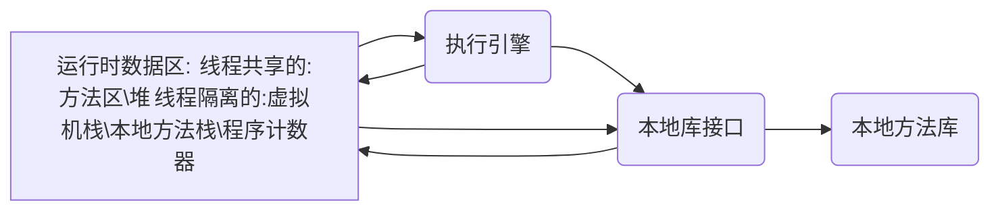

# 第1章 走近Java

## 1.1 概述

“一次编写到处运行”	安全的内存管理和访问机制	热点代码检测和运行时编译及优化	应用程序接口

## 1.2 Java技术体系

广义上讲，Clojure、JRuby、Groovy等运行于Java虚拟机上的语言及其相关的程序都属于Java技术体系中的一员。传统意义上来看，Sun官方所定义的Java技术体系包括以下几个组成部分：

- Java程序设计语言
- 各种硬件平台上的Java虚拟机
- Class 文件格式
- Java API 类库
- 来自商业机构和开源社区的第三方Java类库

我们可以把Java程序设计语言、Java虚拟机、Java API类库这三部分统称为JDK（Java Development Kit），JDK是用于支持Java程序开发的最小环境，在后面的内容中，为了讲解方便，有一些地方会以JDK来代替整个Java技术体系。另外，可以把Java API类库中的JavaSE API子集和Java虚拟机这两部分统称为JRE（Java Runtime Environment），JRE是支持Java程序运行的标准环境。

以上是根据各个组成部分的功能来进行划分的，如果按照技术所服务的领域来划分，或者说按照Java技术关注的重点业务领域来划分，Java技术体系可以分为4个平台，分别为：

- Java Card：支持一些Java小程序（Applets）运行在小内存设备（如智能卡）上的平台。
- Java ME（Micro Edition）：支持Java程序运行在移动终端（手机、PDA）上的平台，对Java API有所精简，并加入了针对移动终端的支持，这个版本以前称为J2ME。
- Java SE（Standard Edition）：支持面向桌面级应用（如Windows下的应用程序）的Java平台，提供了完整的Java核心API，这个版本以前称为J2SE。
- Java EE（Enterprise Edition）：支持使用多层架构的企业应用（如ERP、CRM应用）的Java平台，除了提供JavaSE API外，还对其做了大量的扩充并提供了相关的部署支持，这个版本以前称为J2EE。

## 1.3 Java发展史

1991年4月，由James Gosling博士领导的绿色计划（Green Project）开始启动，此计划的目的是开发一种能够在各种消费性电子产品（如机顶盒、冰箱、收音机等）上运行的程序架构。这个计划的产品就是Java语言的前身：Oak（橡树）。Oak当时在消费品市场上并不算成功，但随着1995年互联网潮流的兴起，Oak迅速找到了最适合自己发展的市场定位并蜕变成为Java语言。

1995年5月23日，Oak语言改名为Java，并且在SunWorld大会上正式发布Java 1.0版本。Java语言第一次提出了“Write Once，Run Anywhere”的口号。

1996年1月23日，JDK 1.0发布，Java语言有了第一个正式版本的运行环境。JDK 1.0提供了一个纯解释执行的Java虚拟机实现（Sun Classic VM）.JDK 1.0版本的代表技术包括：Java虚拟机、Applet、AWT等。

1996年4月，10个最主要的操作系统供应商申明将在其产品中嵌入Java技术。同年9月，已有大约8.3万个网页应用了Java技术来制作。在1996年5月底，Sun公司于美国旧金山举行了首届JavaOne大会，从此JavaOne成为全世界数百万Java语言开发者每年一度的技术盛会。

1997年2月19日	JDK 1.1	代表技术：JAR文件格式、JDBC、JavaBeans、RMI、Java语法也有了一定的发展，如内部类（Inner Class）和反射（Reflection）都是这个时候出现的。

1998年12月4日	JDK 1.2	工程代号Playground（竞技场）	这个版本把Java技术体系拆分成J2SE、J2EE和J2ME	代表技术：EJB、Java Plug-in、Java IDL、Swing等，第一次内置了JIT（Just In Time）编译器（JDK 1.2中曾并存过3个虚拟机，Classic VM、HotSpot VM 和 Exact VM，其中Exact VM只在Solaris平台出现过；后面两个虚拟机都是内置JIT编辑器的）。在语言和API级别上，Java添加了strictfp关键字与现在Java编码之中极为常用的一系列Collection集合类。

1999年4月27日	HotSpot虚拟机发布

2000年5月8日	JDK 1.3	工程代号Kestrel（美洲红隼）	改进一些类库（如数学运算和新的Timer API等），JNDI服务从JDK 1.3开始被作为一项平台级服务提供（以前JNDI仅仅是一项扩展），使用COBRA IIOP来实现RMI的通信协议，等等。这个版本还对Java 2D做了很多改进，提供了大量新的Java 2D API，并且新添加了JavaSound类库。

2002年2月13日	JDK 1.4	工程代号为Merlin（灰背隼）	Java真正走向成熟的一个版本	技术特性：正则表达式、异常链、NIO、日志类、XML解析器和XSLT转换器等。

2002年前后，.NET Framework发布

2004年9月30日	JDK 1.5	工程代号Tiger（老虎）	在Java语法易用性上做出了非常大的改进。例如，自动装箱、泛型、动态注解、枚举、可变长参数、遍历循环（foreach循环）等语法特性都是在JDK 1.5中加入的。这个版本改进了Java的内存模型（Java Memory Model，JMM）、提供了java.util.concurrent并发包等。

2006年12月11日	JDK 1.6	工程代号Mustang（野马）	这个版本终结了JDK 1.2开始已有8年历史的J2EE、J2SE、J2ME的命名方式，启用Java SE 6、Java EE 6、Java ME 6的命名方式。	改进包括：动态语言支持（内置Mozilla JavaScript Rhino引擎实现）、提供编译API和微型HTTP服务器API等。同时这个版本对Java虚拟机内部做了大量改进，包括锁与同步、垃圾手机、类加载等方面算法都有相当多的改动。

2006年11月13日的JavaOne大会上	Sun公司宣布最终会将Java开源。

2009年2月19日	JDK 1.7	工程代号Dolphin（海豚）	本应该是一个包含许多重要改进的JDK版本，其中的Lambda项目（Lambda表达式、函数式编程）、Jigsaw项目（虚拟机模块化支持）、动态语言支持、GarbageFirst收集器和Coin项目（语言细节进化）等子项目对于Java产业都会产生深远的影响。	不能按时完成的Lambda项目、Jigsaw项目和Coin项目的部分改进延迟到JDK 1.8之中。	JDK1.7的主要改进：提供新的G1收集器、加强对非Java语言的调用支持、升级类加载架构等。

2009年4月20日	Oracle公司宣布正式以74亿美元的价格收购Sun公司，Java商标从此正式归Oracle所有。

## 1.4 Java虚拟机发展史

### 1.4.1 Sun Classic/Exact VM

Classic VM	世界第一款商用Java虚拟机	只能使用纯解释器方式类执行Java代码，如果要使用JIT编译器，就必须进行外挂。如果外挂了JIT编辑器，JIT编译器就完全接管了虚拟机的执行系统，解释器便不再工作了。

sunwjit就是Sun提供的外挂编译器，类似的有SymantecJIT和shuJIT。由于解释器和编译器不能配合工作，“Java很慢”的形象就是在这时候开始在用户心中树立起来的。

Exact VM	JDK1.2时发布	二级即时编译器、编译器和解释器混合工作模式	准确式内存管理（Exact Memory Management，也可以叫做Non-Conservative/Accurate Memory Management）: 虚拟机可以知道内存中某个位置的数据具体是什么类型

### 1.4.2 Sun HotSpot VM

“Longview Technologies”的小公司设计的：甚至这个虚拟机最初并非是为Java语言而开发的，它来源于Strongtalk VM，而这款虚拟机中相当多的技术又是来源于一款支持Self语言实现“达到C语言50%以上的执行效率”的目标而设计的虚拟机。1997年Sun收购了Longview Technologies公司，从而获得了HotSpot VM。

（HotSpot一开始就是准确式GC，而Exact VM之中也有与HotSpot几乎一样的热点探测。HotSpot打败Exact并不能算技术上的胜利。）HotSpot VM的热点代码探测能力可以通过执行计数器找出最具有编译价值的代码，然后通知JIT编译器以方法为单位进行编译。如果一个方法被频繁调用，或方法中有效循环次数很多，将会分别触发标准编译和OSR（栈上替换）编译动作。通过编译器与解释器恰当地协同工作，可以在最优化的程序响应时间与最佳执行性能中取得平衡。

2008年和2009年，Oracle公司分别收购了BEA公司和Sun公司，这样Oracle同时拥有了JRockit VM和HotSpot VM两款优秀的Java虚拟机。Oracle宣布在不久的将来（大约应在发布JDK 8的时候）会完成这两款虚拟机的整合工作，使之优势互补。大致是在HotSpot的基础上，移植JRockit的优秀特性，譬如使用JRockit的垃圾回收器与MissionControl服务，使用HotSpot的JIT编译器与混合的运行时系统。

### 1.4.3 Sun Mobile-Embedded VM / Meta-Circular VM

1) KVM

2) CDC/CLDC HotSpot Implementation

3) Squawk VM

4) JavaInJava

5) Maxine VM

### 1.4.4 BEA JRockit / IBM J9 VM

由于专注于服务器端应用，它可以不太关注程序启动速度，因此JRockit内部不包含解析器实现，全部代码都靠及时编译器编译后执行。

IBM J9 VM最初是由IBM Ottawa实验室一个名叫SmallTalk的虚拟机扩展而来的

### 1.4.5 Azul VM / BEA Liquid VM

### 1.4.6 ApacheHarmony / Google Android Dalvik VM

TCK(Technology Compatibility Kit)的兼容性测试

JCP（Java Community Process）组织

Dalvik VM	没有遵循Java虚拟机规范	不能直接执行Class文件，使用寄存器架构	它执行的dex（Dalvik Executable）文件可以通过Class文件转化而来，使用Java语法编写应用程序，可以直接使用大部分的Java API等。

### 1.4.7 Microsoft JVM及其他

## 1.5 展望Java技术的未来

### 1.5.1 模块化

### 1.5.2 混合语言

### 1.5.3 多核并行

### 1.5.4 进一步丰富语法

### 1.5.5 64位虚拟机

## 1.6 实战：自己编译JDK

### 1.6.1 获取JDK源码

### 1.6.2 系统需求

### 1.6.3 构建编译环境

### 1.6.4 进行编译

### 1.6.5 在IDE工具中进行源码调试

# 第2章 Java内存区域与内存溢出异常

Java与C++之间有一堵由内存动态分配和垃圾收集技术所围成的“高墙”，墙外面的人想进去，墙里面的人却想出来。

## 2.1 概述

对于从事C、C++程序开发的开发人员来说，在内存管理领域，它们既是拥有最高权力的“皇帝”又是从事最基础工作的“劳动人民”——既拥有每一个对象的“所有权”，又担负着每一个对象生命开始到终结的维护责任。

对于Java程序员来说，在虚拟机自动内存管理机制的帮助下，不再需要为每一个new操作去写配对的delete/free代码，不容易出现内存泄露和内存溢出问题，由虚拟机管理内存这一切看起来都很美好。不过，也正是因为Java程序员把内存控制的权力交给了Java虚拟机，一旦出现内存泄露和溢出问题，如果不了解虚拟机是怎样使用内存的，那么排查错误将会成为一项异常艰难的工作。

本章是第二部分的第1章，笔者将从概念上介绍Java虚拟机内存的各个区域，讲解这些区域的作用、服务对象以及其中可能产生的问题，这是翻越虚拟机内存管理这堵围墙的第一步。

## 2.2 运行时数据区域

Java 虚拟机在执行Java程序的过程中会把它所管理的内存划分为若干个不同的数据区域。这些区域都有各个的用途，以及创建和销毁的时间，有的区域随着虚拟机进程的启动而存在，有些区域则依赖用户线程的启动和结束而建立和销毁。根据《Java虚拟机规范（Java SE 7版》的规定，Java虚拟机所管理的内存将会包括以下几个运行时数据区域。

- 运行时数据区
    - 方法区 （由所有线程共享的数据区）
    - 堆 （由所有线程共享的数据区）
    - 虚拟机栈 （线程隔离的数据区）
    - 本地方法栈 （线程隔离的数据区）
    - 程序计数器 （线程隔离的数据区）
- 执行引擎
- 本地库接口
- 本地方法库

### 2.2.1 程序计数器

程序计数器（Program Counter Register）是一块较小的内存空间，它可以看作是当前线程所执行的字节码的行号指示器。在虚拟机的概念模型里（仅是概念模型，各种虚拟机可能会通过一些更高效的方式去实现），字节码解释器工作时就是通过改变这个计数器的值来选取下一条需要执行的字节码指令，分支、循环、跳转、异常处理、线程恢复等基础功能都需要依赖这个计数器来完成。

由于Java虚拟机的多线程是通过线程轮流切换并分配处理器执行时间的方式来实现的，在任何一个确定时刻，一个处理器（对于多核处理器来说是一个内核）都只会执行一条线程中的指令。因此，为了线程切换后能恢复到正确的执行位置，每条线程都需要有一个独立的程序计数器，各条线程之间计数器互不影响，独立存储，我们称这类内存区域为“线程私有”的内存。

如果线程正在执行的是一个Java方法，这个计数器记录的是正在执行的虚拟机字节码指令的地址；如果正在执行的是Native方法，这个计数器值则为空（Undefined）。此内存区域是唯一一个在Java虚拟机规范中没有规定任何OutOfMemoryError情况的区域。

### 2.2.2 Java虚拟机栈

与程序计数器一样，Java虚拟机栈（Java Virtual Machine Stacks）也是线程私有的，它的生命周期与线程相同。虚拟机栈描述的是Java方法执行的内存模型：每个方法在执行的同时都会创建一个栈帧（Stack Frame）用于存储局部变量表、操作数栈、动态链接、方法出口等信息。每一个方法从调用直至执行完成的过程，就对应着一个栈帧在虚拟机栈中入栈到出栈的过程。

经常有人把Java内存区分为堆内存（Heap）和栈内存（Stack），这种分法比较粗糙，Java内存区域划分实际上远比这复杂。这种划分方式的流行只能说明大多数程序员最关注的、与对象内存分配关系最密切的内存区域是这两块。其中所指的“堆”笔者在后面会专门讲述，而所指的“栈”就是现在讲的虚拟机栈，或者说是虚拟机栈中局部变量表部分。

局部变量表存放了编译期可知的各种基本数据类型（boolean、byte、char、short、int、float、long、double）、对象引用（reference类型，它不等同于对象本身，可能是一个指向对象起始地址的引用指针，也可能是指向一个代表对象的句柄或其他与此对象相关的位置）和returnAddress类型（指向了一条字节码指令的地址）。

其中64位长度的long和double类型的数据会占用2个局部变量空间（Slot），其余的数据类型只占用1个。==局部变量表所需的内存空间在编译期间完成分配，当进入一个方法时，这个方法需要在帧中分配多大的局部变量空间是完全确定的，在方法运行期间不会改变局部变量表的大小。==

在Java虚拟机规范中，对这个区域规定了两种异常状况：如果线程请求的栈深度大于虚拟机所允许的深度，将抛出StackOverflowError异常；如果虚拟机栈可以动态扩展（当前大部分的Java虚拟机都可动态扩展，只不过Java虚拟机规范中也允许固定长度的虚拟机栈），如果扩展时无法申请到足够的内存，就会抛出OutOfMemoryError异常。

### 2.2.3 本地方法栈

本地方法栈（Native Method Stack）与虚拟机栈所发挥的作用是非常相似的，它们之间的区别不过是虚拟机栈为虚拟机执行Java方法（也就是字节码）服务，而本地方法栈则为虚拟机使用到的Native方法服务。在虚拟机规范中对本地方法栈中方法使用的语言、使用方式与数据结构没有强制规定，因此具体的虚拟机可以自由实现它。==甚至有的虚拟机（譬如Sun HotSpot虚拟机）直接就把本地方法栈和虚拟机栈合二为一。==与虚拟机栈一样，本地方法栈区域也会抛出StackOverflowError和OutOfMemoryError异常。

### 2.2.4 Java堆

对于大多数应用来说，Java堆（Java Heap）是Java虚拟机所管理的内存中最大的一块。Java堆是被所有线程共享的一块内存区域，在虚拟机启动时创建。此内存区域的唯一目的就是存放对象实例，几乎所有的对象实例都在这里分配内存。这一点在Java虚拟机规范中的描述是：所有的对象实例以及数组都要在堆上分配，但是随着JIT编译器的发展与逃逸分析技术逐渐成熟，栈上分配、标量替换优化技术将会导致一些微妙的变化发生，所有的对象都分配在堆上也渐渐变得不是那么“绝对”了。

Java堆是垃圾收集器管理的主要区域，因此很多时候也被称作“GC堆”（Garbage Collected Heap，幸好国内没翻译成“垃圾堆”）。从内存回收的角度来看，由于现在收集器基本都采用分代收集算法，所以Java堆中还可以细分为：新生代和老年代；再细致一点的有Eden空间、From Survivor空间、To Survivor空间等。从内存分配的角度来看，线程共享的Java堆中可能划分出多个线程私有的分配缓冲区（Thread Local Allocation Buffer，TLAB）。不过无论如何划分，都与存放内容无关，无论哪个区域，存储的都仍然是对象实例，进一步划分的目的是为了更好地回收内存，或者更快地分配内存。在本章中，我们仅仅针对内存区域的作用进行讨论，Java堆中的上述各个区域的分配、回收等细节将是第3章的主题。

根据Java虚拟机规范的规定，Java堆可以处于物理上不连续的内存空间中，只要逻辑上是连续的即可，就像我们的磁盘空间一样。在实现时，既可以实现成固定大小的，也可以是可扩展的，不过当前主流的虚拟机都是按照可扩展来实现的（通过-Xmx和-Xms控制）。如果在堆中没有内存完成实例分配，并且堆也无法再扩展时，将会抛出OutOfMemoryError异常。

### 2.2.5 方法区

方法区（Method Area）与Java堆一样，是各个线程共享的内存区域，它用于存储已被虚拟机加载的类信息、常量、静态变量、即时编译器编译后的代码等数据。虽然Java虚拟机规范把方法区描述为堆的一个逻辑部分，但是它却有一个别名叫做Non-Heap（非堆），目的应该是与Java堆区分开来。

对于习惯在HotSpot虚拟机上开发、部署程序的开发者来说，很多人都更愿意把方法区称为“永久代”（Permanent Generation），本质上两者并不等价，仅仅是因为HotSpot虚拟机的设计团队选择把GC分代收集扩展至方法区，或者说使用永久代来实现方法区而已，这样HotSpot的垃圾收集器可以像管理Java堆一样管理这部分内存，能够省去专门为方法区编写内存管理代码的工作。对于其他虚拟机（如BEA JRockit、IBM J9等）来说是不存在永久代的概念的。原则上，如何实现方法区属于虚拟机实现细节，不受虚拟机规范约束，但使用永久代来实现方法区，现在看来并不是一个好主意，因为这样更容易遇到内存溢出问题（永久代有-XX:MaxPermSize的上线，J9和JRockit只要没有触碰到进程可用内存的上限，例如32位系统中的4GB，就不会出现问题），而且有极少数方法（例如String.intern()）会因为这个原因导致不同虚拟机下有不同的表现。因此，对于HotSpot虚拟机，根据官方发布的路线图信息，现在也有放弃永久代并逐步改为采用Native Memory来实现方法区的规划了，在目前已经发布的JDK 1.7的HotSpot中，已经把原本放在永久代的字符串常量池移出。

Java虚拟机规范对方法区的限制非常宽松，除了和Java堆一样不需要连续的内存和可以选择固定大小或者可扩展外，还可以选择不实现垃圾收集。相对而言，垃圾收集行为在这个区域是比较少出现的，但并非数据进入了方法区就如永久代的名字一样“永久”存在了。这区域的内存回收目标主要是针对常量池的回收和对类型的卸载，一般来说，这个区域的回收“成绩”比较难以令人满意，尤其是类型的卸载，条件相当苛刻，但是这部分区域的回收确实是必要的。在Sun公司的BUG列表中，曾出现过的若干个严重的BUG就是由于低版本的HotSpot虚拟机对此区域未完全回收而导致内存泄漏。

根据Java虚拟机规范的规定，当方法区无法满足内存分配需求时，将抛出OutOfMemoryError异常。

### 2.2.6 运行时常量池

运行时常量池（Runtime Constant Pool）是方法区的一部分。Class文件中除了有类的版本、字段、方法、接口等描述信息外，还有一项信息是常量池（Constant Pool Table），用于存放编译期生成的各种字面量和符号引用，这部分内容将在类加载后进入方法区的运行时常量池中存放。

Java虚拟机对Class文件每一部分（自然也包括常量池）的格式都有严格规定，每一个字节用于存储哪种数据都必须符合规范上的要求才会被虚拟机认可、装载和执行，但对于运行时常量池，Java虚拟机规范没有做任何细节的要求，不同的提供商实现的虚拟机可以按照自己的需要来实现这个内存区域。不过，一般来说，除了保存Class文件中描述的符号引用外，还会把翻译出来的直接引用也存储在运行时常量池中。

运行时常量池相对于Class文件常量池的另外一个重要特征是具备动态性，Java语言并不要求常量一定只有编译期才能产生，也就是并非预置入Class文件中常量池的内容才能进入方法区运行时常量池，运行期间也可能将新的常量放入池中，这种特性被开发人员利用得比较多得便是String类得intern()方法。

既然运行时常量池是方法区的一部分，自然受到方法区内存的限制，当常量池无法再申请到内存时会抛出OutOfMemoryError异常。

### 2.2.7 直接内存

直接内存（Direct Memory）并不是虚拟机运行时数据区的一部分，也不是Java虚拟机规范中定义的内存区域。但是这部分内存也被频繁地使用，而且也可能导致OutOfMemoryError异常出现，所以我们放到这里一起讲解。

在JDK 1.4中新加入了NIO（New Input/Output）类，引入了一种基于通道（Channel）与缓冲区（Buffer）的I/O方式，它可以使用Native函数库直接分配对外内存，然后通过一个存储在Java堆中DirectByteBuffer对象作为这块内存的引用进行操作。这样能在一些场景中显著提高性能，因为避免了在Java堆和Native堆中来回复制数据。

显然，本机直接内存的分配不会受到Java堆大小的限制，但是，既然是内存，肯定还是会受到本机总内存（包括RAM以及SWAP区或者分页文件）大小以及处理器寻址空间的限制。服务器管理员在配置虚拟机参数时，会根据实际内存设置-Xmx等参数信息，但经常忽略直接内存，使得各个内存区域总和大于物理内存限制（包括物理的和操作系统级的限制），从而导致动态扩展时出现OutOfMemoryError异常。

## 2.3 HotSpot 虚拟机对象探秘

介绍完Java虚拟机的运行时数据区之后，我们大致知道了虚拟机内存的概况，读者了解了内存中放了些什么后，也许就会想更进一步了解这些虚拟机内存中的数据的其他细节，譬如它们是如何创建、如何布局以及如何返回的。对于这样涉及细节的问题，必须把讨论范围限定在具体的虚拟机和集中在某一个内存区域上才有意义。基于实用优先的原则，笔者以常用的虚拟机HotSpot和常用的内存区域Java堆为例，深入探讨HotSpot虚拟机在Java堆中对象分配、布局和访问的全过程。

### 2.3.1 对象的创建

Java是一门面向对象的编程语言，在Java程序运行过程中无时无刻都有对象被创建出来。在语言层面上，创建对象（例如克隆、反序列化）通常仅仅是一个new关键字而已，而在虚拟机中，对象（文中讨论的对象限于普通Java对象，不包括数组和Class对象等）的创建又是怎样一个过程呢？

虚拟机遇到一条new指令时，首先将去检查这个指令的参数是否能在常量池中定位到一个类的引用，并且检查这个符号引用代表的类是否已被加载、解析和初始化过。如果没有，那必须先执行相应的类加载过程，本书第7章将探讨这部分内容的细节。

在类加载检查通过后，接下来虚拟机将为新生对象分配内存。对象所需内存的大小在类加载完成后便可完全确定（如何确定将在2.3.2节中介绍），为对象分配空间的任务等同于把一块确定大小的内存从Java堆中划分出来。假设Java堆中内存时绝对规整的，所有用过的内存都放在一边，空闲的内存放在另一边，中间放着一个指针作为分界点的指示器，那所分配的内存就仅仅是把哪个指针向空闲空间那边挪动一段与对象大小相等的距离，这种分配方式称为“指针碰撞”（Bump the Pointer）。如果Java堆中的内存并不是规整的，已使用的内存和空闲的内存相互交错，那就没有办法简单地进行指针碰撞了，虚拟机就必须维护一个列表，记录上哪些内存块时可用地，在分配的时候从列表中找到一块足够大的空间划分给对象实例，并更新列表上的记录，这种分配方式称为“空闲列表”（Free List）。选择哪种分配方式由Java堆是否规整决定，而Java堆是否规整又由所采用的垃圾收集器是否带有压缩整理功能决定。因此，在使用Serial、ParNew等带Compact过程的收集器时，系统采用的分配算法是指针碰撞，而使用CMS这种基于Mark-Sweep算法的收集器时，通常采用空闲列表。

除如何划分可用空间之外，还有另外一个需要考虑的问题是对象创建在虚拟机中是非常频繁的行为，即使是仅仅修改一个指针所指向的位置，在并发情况下也并不是线程安全的，可能出现正在给对象A分配内存，指针还没来得及修改，对象B又同时使用了原来的指针来分配内存的情况。解决这个问题有两种方案，一种是对分配内存空间的动作进行同步处理——实际上虚拟机采用CAS配上失败重试的方式保证更新操作的原子性；另一种是把内存分配的动作按照线程划分在不同的空间中进行，即每个线程在Java堆中预先分配一小块内存，称为本地线程分配缓冲（Thread Local Allocation Buffer，TLAB）。哪个线程要分配内存，就在哪个线程的TLAB上分配，只要TLAB用完并分配新的TLAB时，才需要同步锁定。虚拟机是否使用TLAB，可以通过-XX:+/-UseTLAB参数来设定。

内存分配完成后，虚拟机需要将分配到的内存空间都初始化为零值（不包括对象头），如果使用TLAB，这一工作过程也可以提前至TLAB分配时进行。这一步操作保证了对象的实例字段在Java代码中可以不赋初始值就直接使用，程序能访问到的这些字段的数据类型所对应的零值。

接下来，虚拟机要对对象进行必要的设置，例如这个对象是哪个类的实例、如何才能找到类的元数据信息、对象的哈希码、对象的GC分代年龄等信息。这些信息存放在对象的对象头（Object Header）之中。根据虚拟机当前的运行状态的不同，如是否启用偏向锁等，对象头会有不同的设置方式。关于对象头的具体内容，稍后再做详细介绍。

在上面工作都完成之后，从虚拟机的视角来看，一个新的对象已经产生了，但从Java程序的视角来看，对象创建才刚刚开始——\<init>方法还没有执行，所有的字段都还为零。所以，一般来说（由字节码中是否跟随invokespecial指令所指定），执行new指令之后会接着执行\<init>方法，把对象按照程序员的意愿进行初始化，这样一个真正可用的对象才算完全产生出来。

下面的代码清单2-1是HotSpot虚拟机bytecodeInterpreter.cpp中的代码片段（这个解释器实现很少有机会实际使用，因为大部分平台上都使用模板解释器；当代码通过JIT编译器执行时差异就更大了。不过，这段代码用于了解HotSpot的运作过程是没有什么问题的）。

### 2.3.2 对象的内存布局

在HotSpot虚拟机中，对象在内存中存储的布局可以分为3块区域：对象头（Header）、实例数据（Instance Data）和对齐填充（Padding）。

HotSpot虚拟机的对象头包括两部分信息，第一部分用于存储对象自身的运行时数据，如哈希码（HashCode）、GC分代年龄、锁状态标志、线程持有的锁、偏向线程ID、偏向时间戳等，这部分数据的长度在32位和64位的虚拟机（未开启压缩指针）中分别为32bit和64bit，官方称它为“Mark Word”。对象需要存储的运行时数据很多，其实已经超出了32位、64位Bitmap结构所能记录的限度，但是对象头信息是与对象自身定义的数据无关的额外存储成本，考虑到虚拟机的空间效率，Mark Word被设计成一个非固定的数据结构以便在极小的空间内存储尽量多的信息，它会根据对象的状态复用自己的存储空间。例如，在32位的HotSpot虚拟机中，如果对象处于未被锁定的状态下，那么Mark Word的32bit空间中的25bit用于存储对象哈希码，4bit用于存储对象分代年龄，2bit用于存储锁标志位，1bit固定为0，而在其他状态（轻量级锁定、重量级锁定、GC标记、可偏向）下对象的存储内容间表2-1.

表2-1 HotSpot虚拟机对象头Mark Word

|存储内容|标志位|状态|
|-------|------|------|
| 对象哈希码、对象分代年龄|01|未锁定|
|指向锁记录的指针|00|轻量级锁定|
|指向重量级锁的指针|10|膨胀（重量级锁定）|
|空，不需要记录信息|11|GC标记|
|偏向线程ID、偏向时间戳、对象分代年龄|01|可偏向|

对象头的另外一部分是类型指针，即对象指向它的类元数据的指针，虚拟机通过这个指针来确定这个对象是哪个类的实例。并不是所有的虚拟机实现都必须在对象数据上保留类型指针，换句话说，查找对象的元数据信息并不一定要经过对象本身，这点将在2.3.3节讨论。另外，如果对象是一个Java数组，那在对象头中还必须有一块用于记录数组长度的数据，因为虚拟机可以通过普通Java对象的元数据信息确定Java对象的大小，但是从数组的元数据中却无法确定数组的大小。

代码清单2-2为HotSpot虚拟机markOop.cpp中的代码（注释）片段，它描述了32bit下Mark Word的存储状态。

代码清单2-2 markOop.cpp片段
~~~cpp
// Bit-format of an object header(most significant first, big endian layout below):
// 32 bits:
// --------
// hash: 25 ------------>| age:4    biased_lock: 1 lock: 2 (normal object)
// JavaThread*:23 epoch:2  age:4    biased_lock: 1 lock: 2 (biased object)
// size: 32 -------------------------------------------->| (CMS free block)
// PromotedObject*: 29 --------->| promo_bits: 3 ------->| (CMS promoted object)
~~~

接下来的实例数据部分是对象真正存储的有效信息，也是在程序代码中所定义的各种类型的字段内容。无论是从父类继承下来的，还是在子类中定义的，都需要记录起来。这部分的存储顺序会受到虚拟机分配策略参数（FieldsAllocationStyle）和字段在Java源码中定义顺序的影响。HotSpot虚拟机默认的分配策略为longs/doubles、ints、shorts/chars、bytes/booleans、oops（Ordinary Object Pointers），从分配策略中可以看出，相同宽度的字段总是被分配到一起。在满足这个前提条件的情况下，在父类中定义的变量会出现在子类之前。如果CompactFields参数值为true（默认为true），那么子类之中较窄的变量也可能会插入到父类变量的空隙之中。

第三部分对齐填充并不是必然存在的，也没有特别的含义，它仅仅起着占位符的作用。由于HotSpot VM的自动内存管理系统要求对象起始地址必须是8字节的整数倍，换句话说，就是对象的大小必须是8字节的整数倍。而对象头部分正好是8字节的倍数（1倍或者2倍），因此，当对象实例数据部分没有对齐时，就需要通过对齐填充来补全。

### 2.3.3 对象的访问定位

建立对象是为了使用对象，我们的Java程序需要通过栈上的reference数据来操作堆上的具体对象。由于reference类型在Java虚拟机规范中只规定了一个指向对象的引用，并没有定义这个引用应该通过何种方式去定位、访问堆中的对象的具体位置，所以对象访问方式也是取决于虚拟机实现而定的。目前主流的访问方式有使用句柄和直接指针两种。

- 如果使用句柄访问的话，那么Java堆中将会划分出一块内存来作为句柄池，reference中存储的就是对象的句柄地址，而句柄中包含了对象实例数据与类型数据各自的具体地址信息，如图2-2所示（Java栈本地变量表-->Java堆 句柄池：到对象实例数据的指针、到对象类型数据的指针 --> Java堆 实例池：对象实例数据、 方法区：对象类型数据）
- 如果使用直接指针访问，那么Java堆对象的布局中就必须考虑如何放置访问类型数据的相关信息，而reference中存储的直接就是对象地址，如图2-3所示。（Java栈本地变量表-->Java堆：对象实例数据（中间有到对象类型数据的指针）--> 方法区：对象类型数据）

这两种对象访问方式各有优势，使用句柄来访问的最大好处就是reference中存储的是稳定的句柄地址，在对象被移动（垃圾收集时移动对象时非常普遍的行为）时只会改变句柄中的实例数据指针，而reference本身不需要修改。

使用直接指针访问方式的最大好处就是速度更快，它节省了一次指针定位的时间开销，由于对象的访问在Java中非常频繁，因此这类开销积少成多后也是一项非常可观的执行成本。就本书讨论的主要虚拟机Sun HotSpot而言，它是使用第二种方式进行对象访问的，但从整个软件开发的范围来看，各种语言和框架使用句柄来访问的情况也十分常见。

## 2.4 实战：OutOfMemoryError异常

在Java虚拟机的描述中，除了程序计数器外，虚拟机内存的其他几个运行时区域都有发生OutOfMemoryError（下文称OOM）异常的可能，本节将通过若干实例来验证异常发生的场景（代码清单2-3 ~ 代码清单2-9几段简单代码），并且会初步介绍几个与内存相关的最基本的虚拟机参数。

本节内容的目的有两个：第一，通过代码验证Java虚拟机规范中描述的各个运行时区域存储的内容；第二，希望读者在工作中遇到实际的内存溢出异常时，能根据异常的信息快速判断是哪个区域的内存溢出，知道什么样的代码可能导致这些区域内存溢出，以及出现这些异常后该如何处理。

下文的代码开头都注释了执行时所需要设置的虚拟机启动参数（注释中“VM Args”后面跟着的参数），这些参数对实验的结果有直接影响，读者调试代码的时候千万不要忽略。如果读者使用控制台命令来执行程序，那直接跟在Java命令之后书写就可以。如果读者使用Eclipse IDE，则可以参考图2-4在Debug/Run 页签中的设置。

下文的代码都是基于Sun公司的HotShot虚拟机运行的，对于不同公司的不同版本的虚拟机，参数和程序运行的结果可能会有所差别。

### 2.4.1 Java堆溢出

通过参数`-XX:+HeapDumpOnOutOfMemoryError`可以让虚拟机在出现内存溢出异常时Dump出当前的内存堆转储快照以便事后进行分析。

java.lang.OutOfMemoryError会跟着进一步提示“Java heap space”

要解决这个区域的异常，要先分清楚到底是出现了内存泄露（Memory Leak）还是内存溢出（Memory Overflow）

内存泄露，可进一步通过工具查看泄露对象是通过怎样的路径与GC roots相关联并导致垃圾收集器无法自动回收他们的。

如果不存在泄露，检查虚拟机的堆参数（-Xmx与-Xms），与机器物理内存对比看是否还可以调大，从代码上检查是否存在某些对象生命周期过长、持有状态时间过长的情况，尝试减少程序运行期的内存消耗。

### 2.4.2 虚拟机栈和本地方法栈溢出

HotSpot不区分虚拟机栈和本地方法栈，因此-Xoss参数（设置本地方法栈大小）存在，但实际上是无效的，栈容量只由-Xss参数设定。

关于虚拟机栈和本地方法栈，两种异常：

- StackOverflowError
- OutOfMemoryError

实验证明：在单个线程下，无论是栈帧太大还是虚拟机栈太小，当内存无法分配时，抛出的都是StackOverflowError。

如果测试时不限于单线程，通过不断建立线程的方式到实施可以产生内存溢出异常。

虚拟机默认参数，栈深度大多情况下（每个方法压入栈的帧大小并不是一样的）达到1000~2000完全没有问题，对于正常方法调用（包括递归），这个深度应该完全够用了。==但是，如果是建立过多线程导致的内存溢出，在不能减少线程数或者更换64位虚拟机的情况下，就只能通过减少最大堆和减少栈容量来换取更多线程。==这种通过“减少内存”的手段来解决内存溢出的方式会比较难想到。

*注意：Windows平台的虚拟机中，Java的线程是映射到操作系统的内核线程上的*

### 2.4.3 方法区和运行时常量池溢出

String.intern()是一个Native方法，它的作用是：如果字符串常量池中已经包含一个等于此String对象的字符串，则返回代表池中这个字符串的String对象；否则，将此String对象包含的字符串添加到常量池中，并且返回此String对象的引用。

JDK 1.6及以前，由于常量池分配在永久代内，我们可以通过-XX:PermSize和-XX:MaxPermSize限制方法区大小，从而间接限制其中常量池的容量

运行时常量池溢出，OutOfMemoryError后面跟随“PermGen space”，说明运行时常量池术语方法区（HotSpot虚拟机中的永久代）的一部分

当前许多直流框架，如Spring、Hibernate，在对类进行增强时，都会使用到CGLib这类字节码技术，增强的类越多，就需要越大的方法区来保证动态生成的Class可以加载入内存。另外，JVM上的动态语言（例如Groovy等）通常需要持续创建类来实现语言的动态性，随着这类语言的流行，也越来越容易遇到方法区溢出的场景。

方法区溢出也是一种常见的内存溢出异常，一个类要被垃圾收集器回收掉，判定条件是比较苛刻的。在经常动态生成大量Class应用中，需要特别注意类的回收状况。这类场景除了上面提到的程序使用了CGLib字节码增强和动态语言之外，常见的还有：大量JSP或动态产生JSP文件的应用（JSP第一次运行时需要编译为Java类）、基于OSGi的应用（即使是同一个类文件，被不同的加载器加载也会视为不同的类）等。

### 2.4.4 本机直接内存溢出

DirectMemory容量可以通过-XX:MaxDirectMemorySize指定，如果不指定，则默认与Java堆最大值（-Xmx指定）一样。

DirectMemory导致的内存溢出，一个明显的特征是在Heap Dump文件中不会看见明显的异常，如果读者发现OOM之后Dump文件很小，而程序又直接或间接使用了NIO，那就可以考虑检查一下是不是这方面的原因。

# 第3章 垃圾收集器与内存分配策略

## 3.1 概述

说起垃圾收集（Garbage Collection, GC），大部分人都把这项技术当作Java语言的伴生产物。事实上，GC的历史比Java久远，1960年诞生于MIT的Lisp是第一门真正使用内存动态分配和垃圾收集技术的语言。当Lisp还在胚胎时期时，人们就在思考GC需要完成的3件事情：
- 哪些内存需要回收？
- 什么时候回收？
- 如何回收？

经过半个多世纪的发展，目前内存的动态分配与内存回收技术已经相当成熟，一切看起来都进入了“自动化”时代，那为什么我们还要去了解GC和内存分配呢？答案很简单：当需要排查各种内存溢出、内存泄漏问题时，当垃圾收集成为系统达到更高并发量的瓶颈时，我们就需要对这些“自动化”的技术实施必要的监控和调节。

把时间从半个多世纪以前拨回到现在，回到我们熟悉的Java语言。第2章介绍了Java内存运行时区域的各个部分，其中程序计数器、虚拟机栈、本地方法栈3个区域随线程而生，随线程而灭；栈中的栈帧随着方法的进入和退出而有条不紊地执行着出栈和入栈操作。每一个栈帧中分配多少内存基本上是在类结构确定下来时就已知的（尽管在运行期会由JIT编译器进行一些优化，但在本章基于概念模型的讨论中，大体可以认为是编译期可知的），因此这几个区域的内存分配和回收都具备确定性，在这几个区域内就不需要过多考虑回收的问题，因为方法结束或者线程结束时，内存自然就跟随着回收了。而Java堆和方法区则不一样，我们只有在程序处于运行期间才能知道会创建哪些对象，这部分内存的分配和回收都是动态的，垃圾收集器所关注的是这部分内存，本章后续讨论中的“内存”分配与回收也仅指这一部分内存。

## 3.2 对象已死吗

### 3.2.1 引用计数算法

Reference Counting 实现简单，判定效率也很高，在大部分情况下它都是一个不错的算法，也有比较著名的应用案例，如微软的COM（Component Object Model）技术、使用ActionScript 3 的FlashPlayer、Python语言和在游戏脚本领域被广泛应用的Squirrel中都使用了引用计数算法进行内存管理。但是主流的Java虚拟机没有选用，主要原因是很难解决对象之间循环引用的问题。

### 3.2.2 可达性分析算法

在主流的商用程序语言（Java、C#，甚至包括前面提到的古老的Lisp）的主流实现中，都是通过**可达性分析（Reachability Analysis）**来判定对象是否存活的。这个算法的基本思路就是通过一系列的称为“GC Roots”的对象作为起始点，从这些节点开始向下搜索，搜索所走过的路径称为**引用链（Reference Chain）**，当一个对象到GC Roots没有任何引用链相连（用图论的话来说，就是从GC Roots到这个对象不可达）时，则证明该对象是不可用的。

在Java语言中，可作为GC Roots的对象包括下面几种：

- 虚拟机栈（栈帧中的本地变量表）中引用的对象
- 方法区类静态属性引用的对象
- 方法区常量引用的对象
- 本地方法栈中JNI（即一般说的Native方法）引用的对象

### 3.2.3 再谈引用

JDK 1.2之前，Java中引用的定义很传统：如果Reference类型的数据中存储的数值代表的是另一块内存的起始地址，就称这块内存代表着一个引用。	我们希望能描述：当内存空间还足够时，则能保留在内存之中；如果内存空间在进行垃圾收集后还是非常紧张，则可以抛弃这些对象。很多系统的缓存功能都符合这样的应用场景。

在JDK1.2之后，Java对引用的概念进行了扩充，将引用分为强引用（Strong Reference）、软引用（Soft Reference）、弱引用（Weak Reference）、虚引用（Phantom Reference）4种，这4种引用强度依次逐渐减弱。

- 强引用就是指在程序代码之中普遍存在的，类似“Object obj = new Object()”这类的引用，只要强引用还存在，垃圾收集器永远不会回收掉被引用的对象。
- 软引用是用来描述一些还有用但并非必须的对象。对于软引用关联着的对象，在系统将要发生内存溢出异常之前，将会把这些对象列进回收范围之中进行第二次回收。如果这次回收还没有足够的内存，才会抛出内存溢出异常。在JDK 1.2之后，提供了SoftReference类来实现软引用。
- 弱引用也是用来描述非必需对象的，但是它的强度比软引用更弱一些，被弱引用关联的对象只能生存到下一次垃圾收集发生之前。当垃圾收集器工作时，无论当前内存是否足够，都会回收掉只被弱引用关联的对象。在JDK1.2之后，提供了WeakReference类来实现弱引用。
- 虚引用也称为幽灵引用或者幻影引用，它是最弱的一种引用关系。一个对象是否有虚引用的存在，完全不会对其生存时间构成影响，也无法通过虚引用来取得一个对象实例。为一个对象设置虚引用关联的唯一目的就是能在这个对象被收集器回收时收到一个系统通知。在JDK 1.2之后，提供了PhantomReference类来实现虚引用。

### 3.2.4 生存还是死亡

即使可达性分析算法中不可达的对象，也并非是“非死不可”的，这时候它们暂时处于“缓刑”阶段，要真正宣告一个对象死亡，至少要经历两次标记过程：如果对象在进行可达性分析后发现没有与GC Roots相连接的引用链，那它将会第一次标记并且进行一次筛选，筛选的条件是此对象是否有必要执行finalize()方法。当对象没有覆盖finalize()方法，或者finalize()方法已经被虚拟机调用过，虚拟机将这两种情况都视为“没有必要执行”。

如果对象被判定为有必要执行finalize()方法，那么这个对象将会放置在一个叫做F-Queue的队列中，并在稍后由一个虚拟机自动建立的、低优先级的Finalizer线程去执行它。这里所谓“执行”是指虚拟机会触发这个方法，但不承诺会等待它运行结束。原因是：一个对象finalize()执行缓慢或者发生了死循环，会导致F-Queue队列中其他对象永久处于等待。

任何一个对象的finalize()方法都只会被系统自动调用一次。

建议大家避免使用finalize()。

### 3.2.5 回收方法区

很多人认为方法区（或者HotSpot虚拟机中的永久代）是没有垃圾收集的，Java虚拟机规范中确实说过可以不要求虚拟机在方法区实现垃圾收集，而且在方法区中进行垃圾收集的“性价比”一般比较低：在堆中，尤其是在新生代中，常规应用进行一次垃圾收集一般可以回收70%~95%的空间，而永久代的垃圾收集效率远低于此。

永久代的垃圾收集主要回收两部分内容：废弃常量和无用的类。

判定一个常量是否是“废弃常量”比较简单，而要判定一个类是否是“无用的类”的条件则相对苛刻许多。类需要同时满足下面3个条件才能算是“无用的类”：
- 该类所有的实例都已经被回收，也就是Java堆中不存在该类的任何实例。
- 加载该类的ClassLoader已经被回收。
- 该类对应的java.lang.Class对象没有在任何地方被引用，无法在任何地方通过反射访问该类的方法。

虚拟机可以对满足上述3个条件的无用类进行回收，这里说的仅仅是“可以”，而不是和对象一样，不使用了就必然会回收。是否对类进行回收，HotSpot虚拟机提供了-Xnoclassgc参数进行控制，还可以使用-verbose:class以及-XX:+TraceClassLoading、-XX:+TraceClassUnLoading查看类加载和卸载信息，其中-verbose:class和-XX:+TraceClassLoading可以在Product版的虚拟机中使用，-XX:+TraceClassUnLoading参数需要FastDebug版的虚拟机支持。

在大量使用反射、动态代理、CGLib等ByteCode框架、动态生成JSP以及OSGi这类频繁自定义ClassLoader的场景都需要虚拟机具备类卸载的功能，以保证永久代不会溢出。

## 3.3 垃圾收集算法

由于垃圾收集算法的实现涉及大量的程序细节，而且各个平台的虚拟机操作内存的方法又各不相同，因此本节不打算过多地讨论算法的实现，只是介绍几种算法的思想及其发展过程。

### 3.3.1 标记-清除算法

最基础的收集算法是“标记-清除”（Mark-Sweep）算法，如同它的名字一样，算法分为“标记”和“清除”两个阶段：首先标记出所有需要回收的对象，在标记完成后统一回收所有被标记的对象，它的标记过程其实在前一节讲述对象标记判定时已经介绍过了。之所以说它是最基础的收集算法，是因为后续的收集算法都是基于这种思路并对其不足进行改进而得到的。它的主要不足有两个：一个是效率问题，标记和清除两个过程的效率都不高；另一个是空间问题，标记清除之后会产生大量不连续的内存碎片，空间碎片太多可能会导致以后在程序运行过程中需要分配较大对象时，无法找到足够的连续内存而不得不提前触发另一次垃圾收集动作。标记-清除算法的执行过程如图3-2所示。

### 3.3.2 复制算法

为了解决效率问题，一种称为“复制”（Copying）的收集算法出现了，它将可用内存按容量划分为大小相等的两块，每次只使用其中的一块。当这一块的内存用完了，就将还存活着的对象复制到另一块上面，然后再把已使用过的内存空间一次清理掉。这样使得每次都是对整个半区进行内存回收，内存分配时也就不用考虑内存碎片等复杂情况，只要移动堆顶指针，按顺序分配内存即可，实现简单，运行高效。只是这种算法的代价是将内存缩小为了原来的一半，未免太高了一点。复制算法的执行过程如图3-3所示。

现代的商业虚拟机都采用这种收集算法来回收新生代，IBM公司的专门研究表明，新生代中的对象98%是“朝生夕死”的，所以并不需要按照1：1的比例来划分内存空间，而是将内存分为一块较大的Eden空间和两块较小的Survivor空间，每次使用Eden和其中一块Survivor。当回收时，将Eden和Survivor中还存活着的对象一次性地复制到另外一块Survivor空间上，最后清理掉Eden和刚才用过的Survivor空间。HotSpot虚拟机默认Eden和Survivor的大小比例是8：1，也就是每次新生代中可用内存空间为整个新生代容量的90%（80% + 10%），只有10%的内存会被“浪费”。当然，98%的对象可回收只是一般场景下的数据，我们没有办法保证每次回收都只有不多于10%的对象存活，当Survivor空间不够用时，需要依赖其他内存（这里指老年代）进行分配担保（Handle Promotion）。

内存的分配担保就好比我们去银行借款，如果我们信誉很好，在98%的情况下都能按时偿还，于是银行可能会默认我们下一次也能按时按量地偿还贷款，只需要有一个担保人能保证如果我不能还款时，可以从他的账户扣钱，那银行就认为没有风险了。内存的分配担保也一样，如果另一块Survivor空间没有足够空间存放上一次新生代收集下来的存活对象时，这些对象将直接通过分配担保机制进入老年代。关于对新生代进行分配担保的内容，在本章稍后在讲解垃圾收集器执行规则时还会再详细讲解。

### 3.3.3 标记-整理算法

复制收集算法在对象存活率较高时就要进行较多的复制操作，效率将会变低。更关键的是，如果不想浪费50%的空间，就需要有额外的空间进行分配担保，以应对被使用的内存中所有对象都100%存活的极端情况，所以在老年代一般不能直接选用这种算法。

根据老年代的特点，有人提出了另外一种“标记-整理”（Mark-Compact）算法，标记过程仍然与“标记-清除”算法一样，但后续步骤不是直接对可回收对象进行清理，而是让所有存活的对象都向一端移动，然后直接清理掉端边界以外的内存，“标记-整理”算法的示意图如图3-4所示。

### 3.3.4 分代收集算法

当前商业虚拟机的垃圾收集都采用“分代收集”（Generational Collection）算法，这种算法并没有什么新思想，只是根据对象存活周期的不同将内存划分为几块。一般是把Java堆分为新生代和老年代，这样就可以根据各个年代的特点采用最适当的收集算法。在新生代中，每次垃圾收集时都发现有大批对象死去，只有少量存活，那就选用复制算法，只需要付出少量存活对象的复制成本就可以完成收集。而老年代中因为对象存活率高、没有额外空间对它进行分配担保，就必须使用“标记-清理”或者“标记-整理”算法来进行回收。

## 3.4 HotSpot的算法实现

3.2节和3.3节从理论上介绍了对象存活判定算法和垃圾收集算法，而在HotSpot虚拟机上实现这些算法时，必须对算法的执行效率有严格的考量，才能保证虚拟机高效运行。

### 3.4.1 枚举根节点

从可达性分析中从GC Roots节点找引用链这个操作为例，可作为GC Roots的节点主要在全局性的引用（例如常量或类静态属性）与执行上下文（例如栈帧中的本地变量表）中，现在很多应用仅仅方法区就有数百兆，如果要逐个检查这里面的引用，那么必然会消耗很多时间。

另外，可达性分析对执行时间的敏感还体现在GC停顿上，因为这项分析工作必须在一个能确保一致性的快照中进行——这里“一致性”的意思是指在整个分析期间整个执行系统看起来就像被冻结在某个时间点上，不可以出现分析过程中对象引用关系还在不断变化的情况，该点不满足的话分析结果准确性就无法得到保证。这点是导致GC进行时必须停顿所有Java执行线程（Sun将这件事情称为“Stop The World”）的其中一个重要原因，即使是在号称（几乎）不会发生停顿的CMS收集器中，枚举根节点时也是必须要停顿的。

由于目前的主流Java虚拟机使用的都是准确式GC（这个概念在第1章介绍Exact VM对Classic VM的改进时讲过），所以当执行系统停顿下来后，并不需要一个不漏地检查完所有执行上下文和全局的引用位置，虚拟机应当是有办法直接得知哪些地方存放着对象引用。在HotSpot的实现中，是使用一组称为OopMap的数据结构来达到这个目的的，在类加载完成的时候，HotSpot就把对象内什么偏移量上是什么类型的数据计算出来，在JIT编译过程中，也会在特定的位置记录下栈和寄存器中哪些位置是引用。这样，GC在扫描时就可以直接得知这些信息了。下面的代码清单3-3是HotSpot Client VM生成的一段String.hashCode()方法的本地代码，可以看到在在0x026eb7a9处的call指令有OopMap记录，它指明了EBX寄存器和栈中偏移量为16的内存区域中各有一个普通对象指针（Ordinary Object Pointer）的引用，有效范围为从call指令开始直到0x026eb730(指令流的起始位置)+142（OopMap记录的偏移量）=0x026eb7be，即hlt指令为止。

### 3.4.2 安全点

在OopMap的协助下，HotSpot可以快速且准确地完成GC Roots枚举，但一个很现实地问题随之而来：可能导致引用关系变化，或者说OopMap内容变化的指令非常多，如果为每一条指令都生成对应的OopMap，那就会需要大量的额外空间，这样GC的空间成本将会变得很高。

实际上，HotSpot也的确没有为每条指令都生成OopMap，前面已经提到，只是在“特定的位置”记录了这些信息，这些位置称为安全点（Safepoint），即程序执行时并非在所有地方都能停顿下来开始GC，只有在到达安全点时才能暂停。Safepoint的选定既不能太少以致于让GC等待时间太长，也不能过于频繁以致于过分增大运行时的负荷。所以，安全点的选定基本上是以程序“是否具有让程序长时间执行的特征”为标准进行选定的——因为每条指令执行的时间都非常短暂，程序不太可能因为指令流长度太长这个原因而过长时间运行，“长时间执行”的最明显特征就是指令序列复用，例如方法调用、循环跳转、异常跳转等，所以具有这些功能的指令才会产生Safepoint。

对于Safepoint，另一个需要考虑的问题是如何在GC发生时让所有线程（这里不包括执行JNI调用的线程）都“跑”到最近的安全点上再停顿下来。这里有两种方案可供选择：抢先式中断（Preemptive Suspension）和主动式中断（Voluntary Suspension），其中抢先式中断不需要线程的执行代码主动去配合，在GC发生时，首先把所有线程全部中断，如果发现有线程中断的地方不在安全点上，就恢复线程，让它“跑”到安全点上。现在几乎没有虚拟机实现采用抢先式中断来暂停线程从而响应GC事件。

而主动式中断的思想是当GC需要中断线程的时候，不直接对线程操作，仅仅简单地设置一个标志，各个线程执行时主动去轮询这个标志，发现中断标志为真时就自己中断挂起。轮询标志地地方和安全点是重合的，另外再加上创建对象需要分配内存的地方。下面代码清单3-4中的test指令是HotSpot生成的轮询指令，当需要暂停线程时，虚拟机把0x160100的内存页设置为不可读，线程执行到test指令时就会产生一个自陷异常信号，在预先注册的异常处理器中暂停线程实现等待，这样一条汇编指令便完成安全点轮询和触发线程中断。

### 3.4.3 安全区域

使用Safepoint似乎已经完美地解决了如何进入GC的问题，但实际情况却不一定。Safepoint机制保证了程序执行时，在不太长的时间内就会遇到可进入GC的Safepoint。但是，程序“不执行”的时候呢？所谓的程序不执行就是没有分配CPU时间，典型的例子就是线程处于Sleep状态或者Blocked状态，这时候线程无法响应JVM的中断请求，“走”到安全的地方去中断挂起，JVM也显然不太可能等待线程重新被分配CPU时间。对于这种情况，就需要安全区域（Safe Region）来解决。

安全区域是指在一段代码片段之中，引用关系不会发生变化。在这个区域的任何地方开始GC都是安全的。我们也可以把Safe Region看作是被扩展了的Safepoint。

在线程执行到Safe Region中的代码时，首先标识自己已经进入了Safe Region，那样，当在这段时间里JVM要发起GC时，就不用管标识自己为Safe Region状态的线程了。在线程要离开Safe Region时，它要检查系统是否已经完成了根节点枚举（或者是整个GC过程），如果完成了，那线程就继续执行，否则它就必须等待直到收到可以安全离开Safe Region的信号为止。

到此，笔者简要地介绍了HotSpot虚拟机如何去发起内存回收的问题，但是虚拟机如何具体地进行内存回收动作仍然未涉及，因为内存回收如何进行是由虚拟机所采用的GC收集器决定的，而通常虚拟机中往往不止有一种GC收集器。下面继续来看HotSpot中有哪些GC收集器。

## 3.5 垃圾收集器

如果说收集算法是内存回收的方法论，那么垃圾收集器就是内存回收的具体实现。Java虚拟机规范中对垃圾收集器应该如何实现并没有任何规定，因此不同的厂商、不同版本的虚拟机所提供的垃圾收集器都可能会有很大差别，并且一般都会提供参数供用户根据自己的应用特点和要求组合出各个年代所使用的收集器。这里讨论的收集器基于JDK 1.7 Update 14之后的HotSpot虚拟机（在这个版本中正式提供了商用的G1收集器，之前G1仍处于实验状态），这个虚拟机包含的所有收集器如图3-5所示。

图3-5展示了7种作用于不同分代的收集器，如果两个收集器之间存在连线，就说明它们可以搭配使用。虚拟机所处的区域，则表示它是属于新生代收集器还是老年代收集器。接下来笔者将逐一介绍这些收集器的特性、基本原理和使用场景，并重点分析CMS和G1这两款相对复杂的收集器，了解它们的部分运作细节。

在介绍这些收集器各自的特性之前，我们先来明确一个观点：虽然我们是在对各个收集器进行比较，但并非为了挑选出一个最好的收集器。因为直到现在为止还没有最好的收集器出现，更加没有万能的收集器，所以我们选择的只是对具体应用最合适的收集器。这点不需要多加解释就能证明：如果有一种放之四海皆准、任何场景下都适用的完美收集器存在，那HotSpot虚拟机就没必要实现那么多不同的收集器了。

### 3.5.1 Serial收集器

Serial收集器是最基本、发展历史最悠久的收集器，曾经（在JDK 1.3.1之前）是虚拟机新生代收集的唯一选择。大家看名字就会知道，这个收集器是一个单线程的收集器，但它的“单线程”的意义并不仅仅说明它只会使用一个CPU或一条收集线程去完成垃圾收集工作，更重要的是在它进行垃圾收集时，必须暂停其他所有的工作线程，直到它收集结束。“Stop The World”这个名字也许听起来很酷，但这项工作实际上是由虚拟机在后台自动发起和自动完成的，在用户不可见的情况下把用户正常工作的线程全部停掉，这对很多应用来说都是难以接受的。读者不妨试想一下，要是你的计算机每运行一个小时就会暂停响应5分钟，你会有什么样的心情？图3-6示意了Serial/Serial Old收集器的运行过程。

对于“Stop The World”带给用户的不良体验，虚拟机的设计者们表示完全理解，但也表示非常委屈：“你妈妈在给你打扫房间的时候，肯定也就会让你老老实实地在椅子上或者房间外待着，如果她一边打扫，你一边乱扔纸屑，这房间还能打扫完？”这确实是一个合情合理地矛盾，虽然垃圾收集这项工作听起来和打扫房间属于一个性质的，但实际上肯定还要比打扫房间复杂得多啊！

从JDK 1.3开始，一直到现在最新的JDK 1.7，HotSpot虚拟机开发团队为消除或者减少工作线程因内存回收而导致停顿的努力一直在进行着，从Serial收集器到Parallel收集器，再到Concurrent Mark Sweep（CMS）乃至GC收集器的最前沿成果Garbage First（G1）收集器，我们看到了一个个越来越优秀（也越来越复杂）的收集器的出现，用户线程的停顿时间在不断缩短，但是仍然没有办法完全消除（这里暂不包括RTSJ种的收集器）。寻找更优秀的垃圾收集器的工作仍在继续！

写到这里，笔者似乎把Serial收集器描述成一个“老而无用、食之无味弃之可惜”的鸡肋了，但实际上到现在为止，它依然是虚拟机运行在Client模式下的默认新生代收集器。它也有着优于其他收集器的地方：简单而高效（与其他收集器的单线程比），对于限定单个CPU的环境来说，Serial收集器由于没有线程交互的开销，专心做垃圾收集自然可以获得最高的单线程收集效率。在用户的桌面应用场景中，分配给虚拟机管理的内存一般来说不会很大，收集几十兆甚至一两百兆的新生代（仅仅是新生代使用的内存，桌面应用基本上不会再大了），停顿时间完全可以控制在几十毫秒最多一百多毫秒以内，只要不是频繁发生，这点停顿是可以接受的。所以，Serial收集器对于运行在Client模式下的虚拟机来说是一个很好的选择。

### 3.5.2 ParNew收集器

ParNew收集器其实就是Serial收集器的多线程版本，除了使用多条线程进行垃圾收集之外，其余行为包括Serial收集器可用的所有控制参数（例如：-XX:SurvivorRatio、-XX:PretenureSizeThreshold、-XX:HandlePromotionFailure等）、收集算法、Stop The World、对象分配规则、回收策略等都与Serial收集器完全一样，在实现上，这两种收集器也共用了相当多的代码。ParNew收集器的工作过程如图3-7所示。

ParNew收集器除了多线程收集之外，其他与Serial收集器相比并没有太多创新之处，但它却是许多运行在Server模式下的虚拟机中首选的新生代收集器，其中有一个与性能无关但很重要的原因是，除了Serial收集器外，目前只有它能与CMS收集器配合工作。在JDK 1.5时期，HotSpot推出了一款在强交互应用中几乎可认为有划时代意义的垃圾收集器——CMS收集器（Concurrent Mark Sweep，本节稍后将详细介绍这款收集器），这款收集器是HotSpot虚拟机中第一款真正意义上的并发（Concurrent）收集器，它第一次实现了让垃圾收集线程与用户线程（基本上）同时工作，用前面那个例子的话来说，就是做到了在你的妈妈打扫房间的时候你还能一边往地上扔纸屑。

不幸的是，CMS作为老年代的收集器，却无法与JDK 1.4.0中已经存在的新生代收集器Parallel Scavenge配合工作，所以在JDK 1.5中使用CMS来收集老年代的时候，新生代只能选择ParNew或者Serial收集器中的一个。ParNew收集器也是使用-XX:+UseConcMarkSweepGC选项后的默认新生代收集器，也可以使用-XX:+UseParNewGC选项来强制指定它。

ParNew收集器在单CPU的环境中绝对不会有比Serial收集器更好的效果，甚至由于存在线程交互的开销，该收集器在通过超线程技术实现的两个CPU的环境中都不能百分之百地保证可以超越Serial收集器。当然，随着可以使用的CPU的数量的增加，它对于GC时系统资源的有效利用还是很有好处的。它默认开启的收集线程数与CPU的数量相同，在CPU非常多（譬如32个，现在CPU动辄就4核加超线程，服务器超过32个逻辑CPU的情况越来越多了）的环境下，可以使用-XX:ParallelGCThreads参数来限制垃圾收集的线程数。

> 注意 从ParNew收集器开始，后面还会接触到几款并发和并行的收集器。在大家可能产生疑惑之前，有必要先解释两个名词：并发和并行。这两个名词都是并发编程中的概念，在谈论垃圾收集器的上下文语境中，它们可以解释如下。
>- 并行（Parallel）：指多条垃圾收集线程并行工作，但此时用户线程仍然处于等待状态。
>- 并发（Concurrent）:指用户线程与垃圾收集线程同时执行（但不一定是并行的，可能会交替执行），用户程序在继续运行，而垃圾收集程序运行于另一个CPU上。

### 3.5.3 Parallel Scavenger 收集器

Parallel Scavenge收集器是一个新生代收集器，它也是使用复制算法的收集器，又是并行的多线程收集器…… 看上去和ParNew都一样，那它有什么特别之处呢？

Parallel Scavenge收集器的特点是它的关注点与其他收集器不同，CMS等收集器的关注点是尽可能地缩短垃圾收集时用户线程地停顿时间，而Parallel Scavenge收集器地目标则是达到一个可控制的吞吐量（Throughput）。所谓吞吐量就是CPU用于运行用户代码的时间与CPU总消耗时间的比值，即吞吐量=运行用户代码时间/（运行用户代码时间+垃圾收集时间），虚拟机总共运行了100分钟，其中垃圾收集花掉1分钟，那吞吐量就是99%。

停顿时间越短就越适合需要与用户交互的程序，良好的响应速度能提升用户体验，而高吞吐量则可以高效率地利用CPU时间，尽快完成程序的运算任务，主要适合在后台运算而不需要太多交互的任务。

Parallel Scavenge收集器提供了两个参数用于精确控制吞吐量，分别是控制最大垃圾收集停顿时间的-XX:MaxGCPauseMillis参数以及直接设置吞吐量大小的-XX:GCTimeRatio参数。

MaxGCPauseMillis参数允许的值是一个大于0的毫秒数，收集器将尽可能地保证内存回收花费的时间不超过设定值。不过大家不要认为如果把这个参数的值设置得稍小一点就能使得系统的垃圾收集速度变得更快，GC停顿时间缩短是以牺牲吞吐量和新生代空间来换取的：系统把新生代调小一些，收集300MB新生代肯定比收集500MB快吧。这也直接导致垃圾收集发生得更频繁一些，原来10秒收集一次、每次停顿100毫秒，现在变成5秒收集一次、每次停顿70毫秒。停顿时间的确在下降，但吞吐量也降下来了。

GCTimeRatio参数的值应当是一个大于0且小于100的整数，也就是垃圾收集时间占总时间的比率，相当于是吞吐量的倒数。如果把此参数设置为19，那允许的最大GC时间就占总时间的5%（即1/（1+19）），默认值为99，就是允许最大1%（即1/(1+99)）的垃圾收集时间。

由于与吞吐量关系密切，Parallel Scavenge收集器也经常称为“吞吐量优先”收集器。除上述两个参数之外，Parallel Scavenge收集器还有一个参数-XX:+UseAdaptiveSizePolicy值得关注。这是一个开关参数，当这个参数打开之后，就不需要手工指定新生代的大小（-Xmn）、Eden与Survivor区的比例（-XX:SurvivorRatio）、晋升老年代对象年龄（-XX:PretenureSizeThreshold）等细节参数了，虚拟机会根据当前系统的运行情况收集性能监控信息，动态调整这些参数以提供最合适的停顿时间或者最大的吞吐量，这种调节方式称为GC自适应的调节策略（GC Ergonomics）。如果读者对于收集器运作原来不太了解，手工优化存在困难的时候，使用Parallel Scavenge收集器配合自适应调节策略，把内存管理的调优任务交给虚拟机去完成将是一个不错的选择。只需要把基本的内存数据设置好（如-Xmx设置最大堆），然后使用MaxGCPauseMillis参数（更关注最大停顿时间）或GCTimeRatio（更关注吞吐量）参数给虚拟机设立一个优化目标，那具体细节参数的调节工作就由虚拟机完成了。自适应调节策略也是Parallel Scavenge收集器与ParNew收集器的一个重要区别。

### 3.5.4 Serial Old 收集器

Serial Old是Serial收集器的老年代版本，它同样是一个单线程收集器，使用“标记-整理”算法。这个收集器的主要意义也是在于给Client模式下的虚拟机使用。如果在Server模式下，那么它主要还有两大用途：一种用途是在JDK 1.5以及之前的版本中与Parallel Scavenge收集器搭配使用，另一种用途就是作为CMS收集器的后备预案，在并发收集放生Concurrent Mode Failure时使用。这两点都将在后面的内容中详细讲解。Serial Old收集器的工作过程如图3-8所示。

### 3.5.5 Parallel Old 收集器

Parallel Old是Parallel Scavenge收集器的老年代版本，使用多线程和“标记-整理”算法。这个收集器是在JDK 1.6中才开始提供的，在此之前，新生代的Parallel Scavenge收集器一直处于比较尴尬的状态。原因是，如果新生代选择了Parallel Scavenge收集器，老年代除了Serial Old（PS MarkSweep）收集器外别无选择（还记得上面说过Parallel Scavenge收集器无法与CMS收集器配合工作吗？）。由于老年代Serial Old收集器在服务端应用性能上的“拖累”，使用了Parallel Scavenge收集器也未必能在整体应用上获得吞吐量最大化的效果，由于单线程的老年代收集中无法充分利用服务器多CPU的处理能力，在老年代很大而且硬件比较高级的环境中，这种组合的吞吐量甚至还不一定有ParNew加CMS的组合“给力”。

直到Parallel Old收集器出现后，“吞吐量优先”收集器终于有了比较名副其实的应用组合，在注重吞吐量以及CPU资源敏感的场合，都可以优先考虑Parallel Scavenge加Parallel Old收集器。Parallel Old 收集器的工作过程如图3-9所示。

### 3.5.6 CMS 收集器

CMS（Concurrent Mark Sweep）收集器是一种以获取最短回收停顿时间为目标的收集器。目前很大一部分的Java应用集中在互联网站或者B/S系统的服务端上，这类应用尤其重视服务的响应速度，希望系统停顿时间最短，以给用户带来较好的体验。CMS收集器就非常符合这类应用的需求。

从名字（包含“Mark Sweep”）上就可以看出，CMS收集器是基于“标记-清除”算法实现的，它的运作过程相对于前面几种收集器来说更复杂一些，整个过程分为4个步骤，包括：

- 初始标记（CMS initial mark）
- 并发标记（CMS concurrent mark）
- 重新标记（CMS remark）
- 并发清除（CMS concurrent sweep）

其中，初始标记、重新标记这两个步骤仍然需要“Stop The World”。初始标记仅仅只是标记一下GC Roots能直接关联到的对象，速度很快，并发标记阶段就是进行GC Roots Tracing的过程，而重新标记阶段则是为了修正并发标记期间因用户程序继续运作而导致标记产生变动的那一部分对象的标记记录，这个阶段的停顿时间一般会比初始标记阶段稍长一些，但远比并发标记的时间短。

由于整个过程中耗时最长的并发标记和并发清除过程收集器线程都可以与用户线程一起工作，所以，从总体上来说，CMS收集器的内存回收过程是与用户线程一起并发执行的。通过图3-10可以比较清楚地看到CMS收集器的运作步骤中并发和需要停顿的时间。

CMS是一款优秀的收集器，它的主要优点在名字上已经体现出来了：并发收集、低停顿，Sun公司的一些官方文档中也称之为并发低停顿收集器（Concurrent Low Pause Collector）。但是CMS还远达不到完美的程度，它有以下3个明显的缺点：

- CMS收集器对CPU资源非常敏感。其实，面向并发设计的程序都对CPU资源比较敏感。在并发阶段，它虽然不会导致用户线程停顿，但是会因为占用了一部分线程（或者说CPU资源）而导致应用程序变慢，总吞吐量会降低。CMS默认启动的回收线程数是（CPU数量+3）/4，也就是当CPU在4个以上时，并发回收时垃圾收集线程不少于25%的CPU资源，并且随着CPU数量的增加而下降。但是当CPU不足4个（譬如2个）时，CMS对用户程序的影响就可能变得很大，如果本来CPU负载就比较大，还分出一半的运算能力去执行收集器线程，就可能导致用户程序的执行速度忽然降低了50%，其实也让人无法接受。为了应付这种情况，虚拟机提供了一种称为”增量式并发收集器“（Incremental Concurrent Mark Sweep/i-CMS）的CMS收集器变种，所做的事情和单CPU年代PC机操作系统使用抢占式来模拟多任务机制的思想一样，就是在并发标记、清理的时候让GC线程、用户线程交替运行，尽量减少GC线程的独占资源的时间，这样整个垃圾收集的过程会更长，但对用户程序的影响就会显得少一些，也就是速度下降没有那么明显。实践证明，增量时的CMS收集器效果很一般，在目前版本中，i-CMS已经被声明为”deprecated“，即不再提倡用户使用。
- CMS收集器无法处理浮动垃圾（Floating Garbage），可能出现”Concurrent Mode Failure“失败而导致另一次Full GC的产生。由于CMS并发清理阶段用户线程还在运行着，伴随程序运行自然就还会有新的垃圾不断产生，这一部分垃圾出现在标记过程之后，CMS无法在当次收集中处理掉它们，只好留待下一次GC时再清理掉。这一部分垃圾就称为”浮动垃圾“。也是由于在垃圾收集阶段用户线程还需要运行，那也就还需要预留有足够的内存空间给用户线程使用，因此CMS收集器不能像其他收集器那样等到老年代几乎完全被填满了再进行收集，需要预留一部分空间提供并发收集时的程序运作使用。在JDK 1.5的默认设置下，CMS收集器当老年代使用了68%的空间后就会被激活，这是一个偏保守的设置，如果在应用中老年代增长不是太快，可以适当调高参数 -XX：CMSInitiatingOccupancyFraction的值来提高触发百分比，以便降低内存回收次数从而获取更好的性能，在JDK 1.6中，CMS收集器的启动阈值已经提升至92%。要是CMS运行期间预留的内存无法满足程序需要，就会出现一次”Concurrent Mode Failure“失败，这时虚拟机将启动后备预案：临时启用Serial Old收集器来重新进行老年代的垃圾收集，这样停顿时间就很长了。所以说参数-XX:CMSInitiatingOccupancyFraction设置得太高很容易导致大量”Concurrent Mode Failure“失败，性能反而降低。
- 还有最后一个缺点，在本节开头说过，CMS是一款基于”标记-清除“算法实现的收集器，如果读者对前面这种算法介绍还有印象的话，就可能想到这意味着收集结束时会有大量空间碎片产生。空间碎片过多时，将会给大对象分配带来很大麻烦，往往会出现老年代还有很大空间剩余，但是无法找到足够大的连续空间来分配当前对象，不得不提前触发一次Full GC，为了解决这个问题，CMS收集器提供了一个-XX:+UseCMSCompactAtFullCollection开关参数（默认就是开启的），用于在CMS收集器顶不住要进行FullGC时开启内存碎片的合并整理过程，内存整理的过程是无法并发的，空间碎片问题没有了，但停顿时间不得不变长。虚拟机设计者还提供了另外一个参数-XX:CMSFullGCsBeforeCompaction，这个参数是用于设置执行多少次不压缩的Full GC后，跟着来一次带压缩的（默认值为0，表示每次进入Full GC时都进行碎片整理）。

### 3.5.7 G1收集器

G1（Garbage-First）收集器是当今收集器技术发展的最前沿成果之一，早在JDK 1.7刚刚确立项目目标，Sun公司给出的JDK 1.7 RoadMap里面，它就被视为JDK 1.7中HotSpot虚拟机的一个重要进化特征。从JDK 6u14中开始就有Early Access版本的G1收集器供开发人员实验、试用，由此开始G1收集器的”Experimental“状态持续了数年时间，直至JDK 7u4，Sun公司才认为它达到足够成熟的商用程度，移除了”Experimental“的标识。

G1是一款面向服务端应用的垃圾收集器。HotSpot开发团队赋予它的使命是（在比较长期的）未来可以替换掉JDK 1.5中发布的CMS收集器。与其他GC收集器相比，G1具备如下特点。

- 并行与并发：G1能充分利用多CPU、多核环境下的硬件优势，使用多个CPU（CPU或者CPU核心）来缩短Stop-The-World停顿的时间，部分其他收集器原本需要停顿Java线程执行的GC动作，G1收集器仍然可以通过并发的方式让Java程序继续执行。
- 分代收集：与其他收集器一样，分代概念在G1中依然得以保留。虽然G1可以不需要其他收集器配合就能独立管理整个GC堆，但它能够采用不同的方式去处理新创建的对象和已经存活了一段时间、熬过多次GC的旧对象以获取更好的收集效果。
- 空间整合
- 可预测的停顿

G1之前其他收集器的范围都是整个新生代或者老年代，而G1不再是这样。使用G1收集器时，Java堆和内存布局就与其他收集器有很大差别，它将整个Java堆划分为多个大小相等的独立区域（Region），虽然还保留有新生代和老年代的概念，但它们不再是物理隔离的了，它们都是一部分Region（不需要连续）的集合。

G1收集器之所以可预测停顿，是因为它有计划地避免在整个Java堆中进行全区域的垃圾收集。G1跟踪各个Region里面的垃圾堆积的价值大小（回收所获得的空间大小以及回收所需时间的经验值），在后台维护一个优先列表，每次根据允许的收集时间，优先回收价值最大的Region（也就是Garbage-First名称的来由）。

在G1收集器中，Region之间的对象引用以及其他收集器中新生代和老年代之间的对象引用，虚拟机都是使用Remembered Set来避免全堆扫描的。G1中每个Region都有一个与之对应的Remembered Set，虚拟机发现程序在对Reference类型的数据进行写操作时，会产生一个Write Barrier暂时中断写操作，检查Reference引用的对象是否处于不同的Region中（在分代的例子中就是检查是否老年代中的对象引用了新生代中的对象），如果是，便通过CardTable把相关引用信息记录到被引用对象所属的Region的Remembered Set中。当进行内存回收时，在GC根节点枚举范围中加入Remembered Set 即可保证不对全堆扫描也不会有遗漏。

不计算维护Remembered Set的操作，G1收集器的运作大致可划分为：

- 初始标记，停顿线程、耗时短
- 并发标记，耗时长、可并发
- 最终标记，停顿线程、可并行
- 筛选回收

初始标记仅仅是标记一下GC Roots能直接关联到的对象，并且修改TAMS（Next Top at Mark Start）	并发标记从GC Root开始对堆中对象进行可达性分析，找出存活对象	最终标记为了修正在并发标记时因用户程序继续运作而导致标记产生变动的那部分标记记录，虚拟机将这段对象变化记录在线程Remembered Set Logs里面，然后合并到Remembered Set。	筛选回收先对各个Region的回收价值和成本进行排序，根据用户所期望的GC停顿时间指定回收计划。

### 3.5.8 理解GC日志

==FullGC的“Full”说明这次GC是发生了Stop-The-World的。==

### 3.5.9 垃圾收集器参数总结

| 参数                           | 描述                                                         |
| ------------------------------ | ------------------------------------------------------------ |
| UseSerialGC                    | 虚拟器运行在Client模式下的默认值，打开此开关后，使用Serial+Serial Old |
| UseParNewGC                    | 打开此开关后，使用ParNew+Serial Old                          |
| UseConcMarkSweepGC             | 打开此开关后，使用ParNew+CMS+Serial Old，Serial Old作为CMS出现Concurrent Mode Failure后的后备收集器使用 |
| UseParallelGC                  | 虚拟器运行在Server模式下的默认值，打开此开关后，使用Parallel Scavenger+Serial Old（PS MarkSweep）的收集器组合进行内存回收 |
| UseParallelOldGC               | 打开此开关后，使用Parallel Scavenger + Parallel Old          |
| SurvivorRatio                  | 新生代中Eden区和Survivor区的容量比值，默认为8，表示Eden：Survivor=8：1 |
| PretenureSizeThreshold         | 直接晋升到老年代的对象大小，设置这个参数后，大于这个参数的对象直接在老年代分配 |
| MaxTenuringThreshold           | 晋升到老年代的对象年龄，每个对象在坚持过一次Minor GC之后，年龄就增加1，当超过这个参数值时就进入老年代 |
| UseAdaptiveSizePolicy          | 动态调整Java堆中各个区域的大小和进入老年代的年龄             |
| HandlePromotionFailure         | 是否允许分配担保失败                                         |
| ParallelGCThreads              | 设置并行GC时进行内存回收的线程数                             |
| GCTimeRatio                    | GC时间占总时间的比率，默认为99，即允许1%的GC时间，仅在Parallel Scavenger收集器时生效 |
| MaxGCPauseMills                | 设置GC最大停顿时间，仅在使用Parallel Scavenger收集器时生效   |
| CMSInitiatingOccupancyFraction | 设置CMS收集器在老年代空间被使用多少后触发垃圾收集。默认值为68%，仅在使用CMS时生效 |
| UseCMSCompactAtFullCollection  | 设置CMS收集器在完成垃圾收集后是否要进行一次内存碎片整理。仅在CMS时生效 |
| CMSFullGCsBeforeCompaction     | 设置CMS收集器在进行若干次垃圾收集后再启动一次内存碎片整理。仅在使用CMS收集器时生效。 |

## 3.6 内存分配与回收策略

### 3.6.1 对象优先在Eden分配

*注意：新生代GC（Minor GC）：指在新生代的垃圾收集动作*

*老年代GC（Major GC/Full GC）：指发生在老年代的GC，出现了Major GC,经常会伴随至少一次的MinorGC（但非绝对），MajorGC的速度一般会比Minor GC慢10倍以上。*

### 3.6.2 大对象直接进入老年代

大对象是指，需要大量连续内存空间的Java对象。

### 3.6.3 长期存活的对象将进入老年代

对象在Survivor区每熬过一次Minor GC，年龄就增加1岁，当它的年龄增加到一定程度（默认为15岁），就将晋升到老年代中

### 3.6.4 动态对象年龄判定

如果在Survivor空间中有相同年龄所有对象大小总和大于Survivor空间的一半，年龄大于等于该年龄的对象就可以直接进入老年代，无需等到MaxTenuringThreshold中要求的年龄。

### 3.6.5 空间分配担保

在发生Minor GC之前，虚拟机会先检查老年代最大可用的连续空间是否大于新生代所有对象总空间，如果这个条件成立，那么Minor GC可以确保是安全的。如果不成立则查看HandlePromotionFailure设置值是否允许担保失败。如果允许，那么继续检查老年代最大可用的连续空间是否大于历次晋升到老年代对象的平均大小，如果大于，将尝试着进行一次Minor GC，尽管这次Minor GC是有风险的：如果小于，或者HandlePromotionFailure设置不允许冒险，那这时也要改为进行一次Full GC。

# 第4章 虚拟机性能监控与故障处理工具

## 4.1 概述

给一个系统定位问题的时候，知识、经验是关键基础，数据是依据，工具是运用知识处理数据的手段。这里说的数据包括：运行日志、异常堆栈、GC日志、线程快照（threaddump/javacore文件）、堆转储快照（heapdump/hprof文件）等。

## 4.2 JDK的命令行工具

这些命令行工具大多数是jdk/lib/tools.jar类库的一层薄包装而已，它们主要的功能代码是在tools类库中实现的。

Linux版本JDK，这些工具中很多甚至就是由Shell脚本直接写成的，可以用vim直接打开它们。

JDK开发团队选择采用java代码来实现这些监控工具是有特别用意的，当应用程序部署到生产环境后，无论是直接解除物理服务器还是远程Telnet到服务器上都可能会收到限制。借助tools.jar类库里面的接口，我们可以直接在应用程序中实现功能强大的监控分析功能。（tools.jar中的类库不属于Java的标准API，如果引入这个类库，意味着用户的程序只能运行于Sun HotSpot上面，或者在部署程序时需要一起部署tools.jar）

*注意：运行于JDK1.5的虚拟机之上的程序，在程序启动时请添加参数"-Dcom.sun.management.jmxremote"开启JMX管理功能。如果运行于JDK1.6的虚拟机之上，那JMX管理默认是开启的。*

Sun JDK监控和故障处理工具

| 名称   | 主要作用                                                     |
| ------ | ------------------------------------------------------------ |
| jps    | JVM Process Status Tool，显示指定系统内所有的HotSpot虚拟机进程 |
| jstat  | JVM Statistics Monitoring Tool，用于收集HotSpot虚拟机各方面运行数据 |
| jinfo  | Configuration Info for Java，显示虚拟机配置信息。            |
| jmap   | Memory Map for Java，生成虚拟机的内存转储快照（heapdump文件） |
| jhat   | JVM Heap Dump Brower，用于分析heapdump文件，它会建立一个HTTP/HTML服务器，让用户可以在浏览器上查看分析结果 |
| jstack | Stack Trace for Java，显示虚拟机的线程快照                   |

### 4.2.1 jps：虚拟机进程状况工具

JDK很多小工具的名字都参考了UNIX命令的命名方式，jps是其中的典型。除了名字像UNIX的ps命令外，它的功能也和ps命令类似：可以列出正在运行的虚拟机进程，并显示虚拟机执行主类（Main Class，main()函数所在的类）名称以及这些进程的本地虚拟机唯一ID（Local Virtual Machine Identifier，LVMID）。

jps [options] [hostid]

jps可以通过RMI协议查询开启了RMI服务的远程虚拟机进程状态，hostid为RMI注册表中注册的主机名。

jps工具主要选项

| 选项 | 作用                                               |
| ---- | -------------------------------------------------- |
| -q   | 只输出LVMID，省略主类的名称                        |
| -m   | 输出虚拟机进程启动时传递给主类main()函数的参数     |
| -l   | 输出主类的全名，如果进程执行的是Jar包，输出Jar路径 |
| -v   | 输出虚拟机进程启动时JVM参数                        |

### 4.2.2 jstat：虚拟机统计信息监视工具

jstat（JVM Statistics Monitoring Tool）是用于监视虚拟机各种运行状态信息的命令行工具。它可以显示本地或远程（RMI支持）虚拟机进程的类装载、内存、垃圾收集、JIT编译等运行数据。

`jstat [option vmid [interval [m|ms] [count]] ]`

对于命令中的VMID与LVMID需要特别说明一下：如果是本地虚拟机进程，VMID与LVMID是一致的，如果是远程虚拟机进程，那VMID的格式应当是：

`[protocol:][//]lvmid[@hostname[:port]/servername]`

参数interval和count代表查询间隔和次数，如果省略这两个参数，说明只查询一次。假设没250毫秒查询一次进程2764垃圾收集状况，一共查询20次，那命令应当是：

`jstat -gc 2764 250 20`

jstat工具主要选项

| 选项              |                                                              |
| ----------------- | ------------------------------------------------------------ |
| -class            | 监视类装载、卸载数量、总空间以及类装载所耗费的时间           |
| -gc               | 监视Java堆状况，包括Eden区、两个Survivor区、老年代、永久代等的容量、已用空间、GC时间合计等信息 |
| -gccapacity       | 监视内容与-gc基本相同，但输出主要关注Java堆各个区域使用到的最大、最小空间 |
| -gcutil           | 监视内容与-gc基本相同，但输出主要关注已使用空间占总空间的百分比 |
| -gccause          | 与-gcutil功能一样，但是会额外输出导致上一次GC产生的原因      |
| -gcnew            | 监视新生代GC状况                                             |
| -gcnewcapacity    | 监视内容与-gcnew基本相同，输出主要关注使用到的最大、最小空间 |
| -gcold            | 监视老年代GC状况                                             |
| -gcoldcapacity    | 监视内容与-gcold基本相同，输出主要关注使用到的最大、最小空间 |
| -gcpermcapacity   | 输出永久代使用到的最大、最小空间                             |
| -compiler         | 输出JIT编译器编译过的方法、耗时等信息                        |
| -printcompilation | 输出已经被JIT编译的方法                                      |

### 4.2.3 jinfo：Java配置信息工具

jinfo（Configuration Info for Java）的作用是实时地查看和调整虚拟机各项参数。	-v参数可以查看虚拟机启动时显式指定的参数列表	-flag查询未被显式指定的参数的系统默认值（JDK1.6或以上版本，可使用"java -XX:+PrintFlagsFinal"查看参数默认值）	-sysprops选项把虚拟机进程的System.getProperties()的内容打印出来	可以使用-flag [+|-] name或者-flag name=value修改一部分运行期可写的虚拟机参数值。

`jinfo [option] pid`

### 4.2.4 jmap：Java内存映像工具

