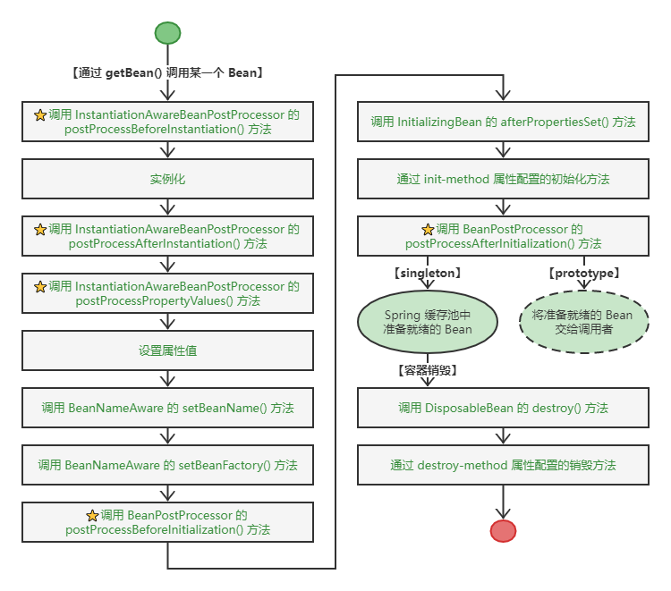

# 简答

BeanFactory 中 Bean 生命周期的完整过程



ApplicationContext 中的 Bean 的生命周期


Bean 在应用上下文中的生命周期和在 BeanFactory 中的生命周期类似，不同的是，如果 Bean 实现了 org.springframework.context.ApplicationContextAware 接口，则会增加一个调用该接口方法 setApplicationContext() 的步骤。

# 详解

我们先介绍 BeanFactory 和 ApplicationContext，然后再具体介绍两者中的 Bean 的生命周期。

# 1 BeanFactory 和 ApplicationContext

Spring 通过一个配置文件描述 Bean 及 Bean 之间的依赖关系，利用 Java 语言的反射功能实例化 Bean 并建立 Bean 之间的依赖关系。Spring 的 IoC 容器在完成这些底层工作的基础上，还提供了 Bean 实例缓存、生命周期管理、Bean 实例代理、事件发布、资源装载等高级服务。

- **Bean 工厂**（`com.springframework.beans.factory.BeanFactory`）是 Spring 框架最核心的接口，它提供了高级 IoC 的配置机制。BeanFactory 使管理不同类型的 Java 对象成为可能
- **应用上下文**（`com.springframework.context.ApplicationContext`）建立在 BeanFactory 基础之上，提供了更多面向应用的功能，它提供了国际化支持和框架事件体系，更易于创建实际应用。

我们一般称 BeanFactory 为 IoC 容器，而称 ApplicationContext 为应用上下文。但有时为了行文方便，我们也将 ApplicationContext 称为 Spring 容器。

对于两者的用途，我们也可以进行简单的划分：BeanFactory 是 Spring 框架的基础设施，面向 Spring 本身；ApplicationContext 面向使用 Spring 框架的开发者，几乎所有的应用场合都可以直接使用 ApplicationContext 而非底层的 BeanFactory。

## 1.1 BeanFactory 介绍

诚如其名，BeanFactory 是一个类工厂，但和传统的类工厂不同，传统的类工厂仅负责构造一个或几个类的实例；而 BeanFactory 是类的通用工厂，它可以创建并管理各种类的对象。这些可被创建和管理的对象本身没有什么特别之处，仅是一个 POJO，Spring 称这些被创建和管理的 Java 对象为 Bean。

> 我们知道 JavaBean 是要满足一定规范的，如必须提供一个默认不带参的构造函数、不依赖于某一特定的容器等，但 Spring 中所说的 Bean 比 JavaBean 更宽泛一些，所有可以被 Spring 容器实例化并管理的 Java 类都可以成为 Bean。

### 1.1.1 BeanFactory 的类体系结构

Spring 为 BeanFactory 提供了多种实现，最常用的是 XmlBeanFactory，但在 Spring 3.2 中已被废弃，建议使用 XmlBeanDefinationReader、DefaultListableBeanFactory 替代。BeanFactory 的类继承体系设计优雅，堪称经典。通过继承体系，我们可以很容易地了解到 BeanFactory 具有哪些功能，如下图所示。


BeanFactory 接口位于类结构树的顶端，它最主要的方法就是 `getBean(String beanName)`，该方法从容器中返回特定名称的 Bean。BeanFactory 的功能通过其他接口得到不断扩展。下面对图中其他接口分别进行说明。

- ListableBeanFactory：该接口定义了访问容器中 Bean 基本信息的若干方法，如查看 Bean 的个数、获取某一类型 Bean 的配置名、查看容器中是否包括某一 Bean 等。
- HierarchicalBeanFactory：父子级联 IoC 容器的接口，子容器可以通过接口方法访问父容器。
- ConfigurableBeanFactory：这是一个重要的接口，增强了 IoC 容器的可定制性。它定义了设置类装载器、属性编辑器、容器初始化后置处理器等方法。
- AutowireCapableBeanFactory：定义了将容器中的 Bean 按某种规则（如按名字匹配、按类型匹配等）进行自动装配的方法。
- SingletonBeanRegistry：定义了允许在运行期向容器注册单实例 Bean 的方法。
- BeanDefinitionRegistry：Spring 配置文件中每一个 `<bean>` 节点元素在 Spring 容器里都通过一个 BeanDefinition 对象表示，它描述了Bean的配置信息。而 BeanDefinitionRegistry 接口提供了向容器手工注册 BeanDefinition 对象的方法。

### 1.1.2 初始化 BeanFactory

下面使用 Spring 配置文件为 Car 提供配置信息，然后通过 BeanFactory 装载配置文件，启动Spring IoC 容器。Spring 配置文件如下代码清单所示：

```xml
<?xml version="1.0" encoding="UTF-8" ?>
<beans xmlns="http://www.springframework.org/schema/beans"
       xmlns:xsi="http://www.w4.org/2001/XMLSchema-instance"
       xmlns:p="http://www.springframework.org/schema/p"
       xsi:schemaLocation="http://www.springframework.org/schema/beans
                           http://www.springframework.org/schema/beans/spring-beans-4.0.xsd">
    <bean id="car1" class="com.smart.Car" 
          p:brand="红旗CA72" 
          p:color="黑色" 
          p:maxSpeed="200" />
</beans>
```

下面通过 XmlBeanDefinitionReader、DefaultListableBeanFactory 实现类启动 Spring IoC 容器，如下代码清单所示

```java
package com.smart.beanfactory;
import org.springframework.beans.factory.support.DefaultListableBeanFactory;
import org.springframework.beans.factory.xml.XmlBeanDefinitionReader;
import org.springframework.core.io.Resource;
import org.springframework.core.io.support.PathMatchingResourcePatternResolver;
import org.springframework.core.io.support.ResourcePatternResolver;
import com.smart.Car;
import org.testng.annotations.*;
import static org.testng.Assert.*;

public class BeanFactoryTest{
    @Test
    public void getBean() throws Throwable{
        ResourcePatternResolver resolver = new PathMatchingResourcePatternResolver();
        Resource res = resolver.getResource("classpath:com/smart/beanfactory/beans.xml");
        System.out.println(res.getURL());
        
        // 被废弃，不建议使用
        // BeanFactory bf = new XmlBeanFactory(res);
        DefaultListableBeanFactory factory = new DefaultListableBeanFactory();
        XmlBeanDefinitionReader reader = new XmlBeanDefinitionReader(factory);
        reader.loadBeanDefinitions(res);
        
        System.out.println("init BeanFactory.");
        
        Car car = factory.getBean("car", Car.class);
        System.out.println("car bean is ready for use!");
        car.introduce();
    }
}
```

XmlBeanDefinitionReader 通过 Resource 装载 Spring 配置信息并启动 IoC 容器，然后就可以通过 `BeanFactory#getBean(beanName)` 方法从 IoC 容器中获取 Bean。通过 BeanFactory 启动 IoC 容器时，并不会初始化配置文件中定义的 Bean，初始化动作发生在第一个调用时。对于单实例（singleton）的 Bean 来说，BeanFactory 会缓存 Bean 实例，所以第二次使用 getBean() 获取 Bean 时，将直接从 IoC 容器的缓存中获取 Bean 实例。

Spring 在 DefaultSingletonBeanRegistry 类中提供了一个用于缓存单实例 Bean 的缓存器，它是一个用 HashMap 实现的缓存器，单实例的 Bean 以 beanName 为键保存在这个 HashMap 中。

值得一提的是，在初始化 BeanFactory 时，必须为其提供一种日志框架，我们使用 Log4j，即在类路径下提供 Log4j 配置文件，这样启动 Spring 容器才不会报错。

## 1.2 ApplicationContext 介绍

如果说 BeanFactory 是 Spring 的“心脏”，那么 ApplicationContext 就是完整的“身躯”了。ApplicationContext 由 BeanFactory 派生而来，提供了更多面向实际应用的功能。在 BeanFactory 中，很多功能需要以编程的方式实现，而在 ApplicationContext 中则可以通过配置的方式实现。

### 1.2.1 ApplicationContext 类体系结构

ApplicationContext 的主要实现类是 ClassPathXmlApplicationContext 和 FileSystemXmlApplicationContext，前者默认从类路径加载配置文件，后者默认从文件系统中装载配置文件。下面了解一下 ApplicationContext 的类继承体系，如下图所示。


ConfigurableApplicationContext 扩展于 ApplicationContext，它新增了两个主要的方法：refresh() 和 close()，让 ApplicationContext 具有启动、刷新和关闭上下文的能力。在应用上下文关闭的情况下调用 refresh() 即可启动应用上下文，在已经启动的状态下调用 refresh() 则可清除缓存并重新装载配置信息，而调用 close() 则可关闭应用上下文。这些接口方法为容器的控制管理带来了便利，但作为开发者，我们并不需要过多关心这些方法。

和 BeanFactory 初始化相似，ApplicationContext 的初始化也很简单。如果配置文件放置在类路径下，则可以优先考虑使用 ClassPathXmlApplicationContext 实现类。

```java
ApplicationContext ctx = new ClassPathXmlApplicationContext("com/smart/context/beans.xml");
```

对于 ClassPathXmlApplicationContext 来说，“com/smart/context/beans.xml” 等同于 “classpath:com/smart/context/beans.xml”。

如果配置文件放置在文件系统的路径下，则可以优先考虑使用 FileSystemXmlApplicationContext 实现类。

```java
ApplicationContext ctx = new FileSystemXmlApplicationContext(
    new String[]{"conf/beans1.xml","conf/beans2.xml"});
```

当然，FileSystemXmlApplicationContext 和 ClassPathXmlApplicationContext 都可以显式使用带资源类型前缀的路径，它们的区别在于如果不显式指定资源类型前缀，则分别将路径解析为文件系统路径和类路径。

在获取 ApplicationContext 实例后，就可以像 BeanFactory 一样调用 getBean(beanName) 返回 Bean 了。ApplicationContext 的初始化和 BeanFactory 有一个重大的区别：BeanFactory 在初始化容器时，并未实例化 Bean，直到第一次访问某个 Bean 时才实例化目标 Bean；

而 ApplicationContext 则在初始化应用上下文时就实例化所有单实例的 Bean。因此，ApplicationContext 的初始化时间会比 BeanFactory 稍长一些，不过稍后的调用则没有“第一次惩罚”的问题。

Spring 支持基于类注解的配置方式，主要功能来自 Spring 的一个名叫 **JavaConfig** 的子项目。JavaConfig 现已升级为 Spring 核心框架的一部分。一个标注 @Configuration 注解的 POJO 即可提供 Spring 所需的 Bean 配置信息，如下面代码清单所示：

```java
package com.smart.context;
import org.springframework.context.annotation.Bean;
import org.springframework.context.annotation.Configuration;
import com.smart.Car;

// ①表示是一个配置信息提供类
@Configuration
public class Beans {
    // ②定义一个Bean
    @Bean(name = "car")
    public Car buildCar(){
        Car car = new Car();
        car.setBrand("红旗CA72");
        car.setMaxSpeed(200);
        return car;
    }
}
```

和基于 XML 文件的配置方式相比，类注解的配置方式可以很容易地让开发者控制 Bean 的初始化过程，比基于 XML 文件的配置方式更加灵活。

Spring 为基于注解类的配置提供了专门的 ApplicationContext 实现类：AnnotationConfigApplicationContext。来看一个使用 AnnotationConfigApplicationContext 启动 Spring 容器的示例，如代码清单所示：

```java
package com.smart.context;

import org.springframework.context.ApplicationContext;
import org.springframework.context.annotation.AnnotationConfigApplicationContext;
import com.smart.Car;
import static org.testng.Assert.*;
import org.testng.annotations.*;

public class AnnotationApplicationContextTest {
    @Test
    public void getBean(){
        // ①通过一个带@Configuration的POJO装载Bean配置
        ApplicationContext ctx = new AnnotationConfigApplicationContext(Beans.class);
        Car car = ctx.getBean("car", Car.class);
        assertNotNull(car);
    }
}
```

AnnotationConfigApplicationContext 将加载 Bean.class 中的 Bean 定义并调用 Beans.class 中的方法实例化 Bean，启动容器并装配 Bean。

Spring 4.0 支持使用 **Groovy DSL** 来进行 Bean 定义配置。其与基于 XML 文件的配置类似，只不过基于Groovy脚本语言，可以复杂、灵活的Bean配置逻辑，来看一个例子，如代码清单所示。

```groovy
package com.smart.context;
import com.smart.Car;

beans{
    car(Car){ // ①名字（类型）
        brand = "红旗CA72" //②注入属性
        maxSpeed = "200"
        color = "red"
    }
}
```

基于 Groovy 的配置方式可以很容易地让开发者配置复杂 Bean 的初始化过程，比基于 XML 文件、注解的配置方式更加灵活。

Spring 为基于 Groovy 的配置提供了专门的 ApplicationContext 实现类：GenericGroovyApplicationContext。来看一个如何使用 GenericGroovyApplicationContext 启动 Spring 容器的示例，如代码清单所示：

```java
package com.smart.context;

import com.smart.Car;
import org.springframework.context.ApplicationContext;
import org.springframework.context.annotation.GenericGroovyApplicationContext;
import org.testng.annotations.*;
import static org.testng.Assert.*;

public class AnnotationApplicationContextTest {
    @Test
    public void getBean(){
        // ①通过一个带@Configuration的POJO装载Bean配置
        ApplicationContext ctx = new GenericGroovyApplicationContext("classpath:com/smart/context/groovy-beans.groovy");
        Car car = (Car) ctx.getBean("car");
        assertNotNull(car);
        assertEquals(car.getColor(), "red");
    }
}
```

### 1.2.2 WebApplicationContext 类体系结构

WebApplicationContext 是专门为 Web 应用准备的，它允许从相对于 Web 根目录的路径中装载配置文件完成初始化工作。从 WebApplicationContext 中可以获得 ServletContext 的引用，整个Web应用上下文对象将作为属性放置到 ServletContext 中，以便 Web 应用环境可以访问 Spring 应用上下文。Spring 专门为此提供了一个工具类 WebApplicationContextUtils，通过该类的 `getWebApplicationContext(ServletContext sc)` 方法，可以从 ServletContext 中获取 WebApplicationContext 实例。

在非 Web 应用的环境下，Bean 只有 singleton 和 prototype 两种作用域。WebApplicationContext 为 Bean 添加了三个新的作用域：request、session 和 global session。

下面来看一下 WebApplicationContext 的类继承体系，如下图所示：


由于 Web 应用比一般的应用拥有更多的特性，因此 WebApplicationContext 扩展了 ApplicationContext。WebApplicationContext 定义了一个常量 ROOT_WEB_APPLICATION_CONTEXT_ATTRIBUTE，在上下文启动时，WebApplication 实例即以此为键放置在 ServletContext 的属性列表中，可以通过以下语句中从 Web 容器中获取 WebApplicationContext：

```java
WebApplicationContext wac = (WebApplicationContext)servletContext.getAttribute(
WebApplicationContext.ROOT_WEB_APPLICATION_CONTEXT_ATTRIBUTE);
```

这正是前面提到的 WebApplicationContextUtils 工具类 `getWebApplicationContext(ServletContext sc)` 方法的内部实现方式。这样，Spring 的 Web 应用上下文和 Web 容器的上下文应用就可以实现互访，二者实现了融合。

ConfigurableWebApplicationContext 扩展了 WebApplicationContext，它允许通过配置的方式实例化 WebApplicationContext，同时定义了两个重要的方法。

- `setServletContext(ServletContext servletContext)`：为Spring设置Web应用上下文，以便两者整合。
- `setConfigLocations(String[] configLocations)`：设置Spring配置文件地址，一般情况下，配置文件地址是相对于Web根目录的地址，如 /WEB-INF/smart-dao.xml、/WEB-INF/smart-service.xml 等。但用户也可以使用带资源类型前缀的地址，如 classpath:com/smart/beans.xml 等。

### 1.2.3 WebApplicationContext初始化

WebApplicationContext 的初始化方式和 BeanFactory、ApplicationContext 有所区别，因为 WebApplicationContext 需要 ServletContext 实例，也就是说，它必须在拥有 Web 容器的前提下才能完成启动工作。有过Web开发经验的读者都知道，可以在 web.xml 中配置自启动的 Servlet 或定义 Web 容器监听器(ServletContextListener)，借助二者中的任何一个，就可以完成启动 Spring Web 应用上下文的工作。

> **提示**：所有版本的 Web 容器都可以定义自启动的 Servlet，但只有 Servlet 2.3 及以上版本的 Web 容器才支持 Web 容器监听器。有些即使支持 Servlet 2.3 的 Web 服务器，也不能在 Servlet 初始化之前启动 Web 监听器，如 Weblogic 8.1、WebSphere 5.x、Oracle OC4J 9.0。

Spring 分别提供了用于启动 WebApplicationContext 的 Servlet 和 Web 容器监听器：

- org.springframework.web.context.ContextLoaderServlet。
- org.springframework.web.context.ContextLoaderListener。

二者的内部都实现了启动 WebApplicationContext 实例的逻辑，只要根据 Web 容器的具体情况选择二者之一，并在 web.xml 中完成配置即可。

下面代码清单是使用 ContextLoaderListener 启动 WebApplicationContext 的具体配置。

```xml
...
<!--①指定配置文件-->
<context-param>
	<param-name>contextConfigLocation</param-name>
    <param-value>
        WEB-INF/smart-dao.xml, /WEB-INF/smart-service.xml
    </param-value>
</context-param>

<!--②声明Web容器监听器-->
<listener>
    <listener-class>org.springframework.web.context.ContextLoaderListener</listener-class>
</listener>
```

ContextLoaderListener 通过 Web 容器上下文参数 contextConfigLocation 获取 Spring 配置文件的位置。用户可以指定多个配置文件，用逗号、空格或冒号分隔均可。对于未带资源类型前缀的配置文件路径，WebApplicationContext 默认这些路径相对于 Web 的部署根路径。当然，也可以采用带资源类型前缀的路径配置，如 “`classpath*:/smart-*.xml`” 和上面的配置是等效的。

如果在不支持容器监听器的低版本 Web 容器中，则可以采用 ContextLoaderServlet 完成相同的工作，如代码清单所示：

```xml
...
<context-param>
	<param-name>contextConfigLocation</param-name>
    <param-value>
        WEB-INF/smart-dao.xml, /WEB-INF/smart-service.xml
    </param-value>
</context-param>
...
<!--①声明自启动的Servlet-->
<servlet>
	<servlet-name>springContextLoaderServlet</servlet-name>
    <servlet-class>org.springframework.web.context.ContextLoaderServlet</servlet-class>
    
    <!--②启动顺序-->
    <load-on-startup>1</load-on-startup>
</servlet>
```

由于 WebApplicationContext 需要使用日志功能，所以用户可以将 Log4J 的配置文件放置在类路径 WEB-INF/classes 下，这时 Log4J 引擎即可顺利启动。如果 Log4J 配置文件放置在其他位置，那么用户必须在 web.xml 中指定 Log4J 配置文件的位置。Spring 为启动 Log4J 引擎提供了两个类似于启动 WebApplicationContext 的实现类：Log4jConfigServlet 和 Log4jConfigListener，不管采用哪种方式，都必须保证能够在装载 Spring 配置文件前先装载 Log4J 配置信息，如下面代码清单所示。

```xml
<context-param>
	<param-name>contextConfigLocation</param-name>
    <param-value>
        WEB-INF/smart-dao.xml, /WEB-INF/smart-service.xml
    </param-value>
</context-param>
<!--①指定Log4J配置文件的位置-->
<context-param>
	<param-name>log4jConfigLocation</param-name>
    <param-value>WEB-INF/log4j.properties</param-value>
</context-param>
<!--②装载Log4J配置文件的自启动Servlet-->
<servlet>
	<servlet-name>log4jConfigServlet</servlet-name>
    <servlet-class>org.springframework.web.util.Log4jConfigServlet</servlet-class>
    <load-on-startup>1</load-on-startup>
</servlet>
<servlet>
	<servlet-name>springContextLoaderServlet</servlet-name>
    <servlet-class>org.springframework.web.context.ContextLoaderServlet</servlet-class>
    <load-on-startup>2</load-on-startup>
</servlet>
```

注意上面将 log4jConfigServlet 的启动顺序号设置为 1，而将 springContextLoaderServlet 的启动顺序号设置为 2。这样，前者将先启动，完成装载 Log4J 配置文件并初始化 Log4J 引擎的工作，紧接着后者再启动。如果使用 Web 监听器，则必须将 Log4jConfigListener 放置在 ContextLoaderListener 前面。采用以上配置方式，Spring 将自动使用 XmlWebApplicationContext 启动 Spring 容器，即通过 XML 文件为 Spring 容器提供 Bean 的配置信息。

如果使用标注 @Configuration 的 Java 类提供配置信息，则 web.xml 需要按以下方式配置，如代码清单所示。

```xml
<web-app>
	<!--通过指定context参数，让Spring使用AnnotationConfigWebApplicationContext而非XmlWebApplicationContext启动容器-->
    <context-param>
    	<param-name>contextClass</param-name>
        <param-value>
        	org.springframework.web.context.support.AnnotationConfigWebApplicationContext
        </param-value>
    </context-param>
    
    <!--指定标注了@Configuration的配置类，多个可以使用逗号或空格分隔-->
    <context-param>
        <param-name>contextConfigLocation</param-name>
        <param-value>
        	com.smart.AppConfig1,com.smart.AppConfig2
        </param-value>
    </context-param>
    
    <!-- ContextLoaderListener监听器将根据上面的配置使用
		AnnotationConfigWebApplicationContext根据contextConfigLocation
		指定的配置类启动Spring容器-->
    <listener>
        <listener-class>
        	org.springframework.web.context.ContextLoaderListener
        </listener-class>
    </listener>
</web-app>
```

ContextLoaderListener 如果发现配置了 contextClass 上下文参数，就会使用参数所指定的 WebApplicationContext 实现类（AnnotationConfigWebApplicationContext）初始化容器，该实现类会根据 contextConfigLocation 上下文参数指定的标注@Configuration 的配置类所提供的 Spring 配置信息初始化容器。

如果使用 Groovy DSL 配置 Bean 信息，则 web.xml 需要按以下方式配置，如代码清单所示。

```xml
<web-app>
    <!--通过指定context参数，让Spring使用GroovyWebApplicationContext而非XmlWebApplicationContext或AnnotationConfigWebApplicationContext启动容器-->
    <context-param>
    	<param-name>contextClass</param-name>
        <param-value>
        	org.springframework.web.context.support.GroovyWebApplicationContext
        </param-value>
    </context-param>
    
    <!--指定标注了Groovy的配置类-->
    <context-param>
        <param-name>contextConfigLocation</param-name>
        <param-value>
        	Classpath*:conf/spring-mvc.groovy
        </param-value>
    </context-param>
    
    <!-- ContextLoaderListener监听器将根据上面的配置使用
		GroovyWebApplicationContext根据contextConfigLocation
		指定的配置类启动Spring容器-->
    <listener>
        <listener-class>
        	org.springframework.web.context.ContextLoaderListener
        </listener-class>
    </listener>
</web-app>
```

GroovyWebApplicationContext 实现类会根据 contextConfigLocation 上下文参数指定的 conf/spring-mvc.groovy 所提供的 Spring 配置信息初始化容器。

## 1.3 父子容器

通过HierarchicalBeanFactory接口，Spring的IoC容器可以建立父子层级关联的容器体系，子容器可以访问父容器中的Bean，但父容器不能访问子容器中的Bean。在容器内，Bean的id必须是唯一的，但子容器可以拥有一个和父容器id相同的Bean。父子容器层级体系增强了Spring容器架构的扩展性和灵活性，因为第三方可以通过编程的方式为一个已经存在的容器添加一个或多个特殊用途的子容器，以提供一些额外的功能。

Spring使用父子容器实现了很多功能，比如在SpringMVC中，展示层Bean位于一个子容器中，而业务层和持久层Bean位于父容器中。这样，展现层Bean就可以引用业务层和持久层Bean，而业务层和持久层Bean则看不到展现层Bean。

# 2 Bean的生命周期

我们知道 Web 容器的 Servlet 拥有明确的生命周期，Spring 容器中的 Bean 也拥有相似的生命周期。Bean 生命周期由多个特定的生命阶段组成，每个生命阶段都开出了一扇门，允许外界借由此门对 Bean 施加控制。

在 Spring 中，可以从两个层面定义 Bean 的生命周期：第一个层面是 Bean 的作用范围；第二个层面是实例化 Bean 时所经历的一系列阶段。下面分别对 BeanFactory 和 ApplicationContext 中 Bean 的生命周期进行分析。

## 2.1 BeanFactory 中 Bean 的生命周期

### 2.1.1 生命周期图解

由于Bean的生命周期所经历的阶段比较多，下面将通过图形化的方式进行描述。下图描述了 BeanFactory 中 Bean 生命周期的完整过程


具体过程如下。

1. 当调用者通过 `getBean(beanName)` 向容器请求某一个 Bean 时，如果容器注册了 org.springframework.beans.factory.config.InstantiationAwareBeanPostProcessor 接口，则在实例化 Bean 之前，将调用接口的 `postProcessBeforeInstantiation()` 方法。
2. 根据配置情况调用 Bean 构造函数或工厂方法实例化 Bean。
3. 如果容器注册了 InstantiationAwareBeanPostProcessor 接口，那么在实例化 Bean 之后，调用该接口的 `postProcessAfterInstantiation()` 方法，可在这里对已经实例化的对象进行一些“梳妆打扮”。
4. 如果 Bean 配置了属性信息，那么容器在这一步着手将配置值设置到 Bean 对应的属性中，不过在设置每个属性之前将先调用 InstantiationAwareBeanPostProcessor 接口的 `postProcessPropertyValues()` 方法。
5. 调用 Bean 的属性设置方法设置属性值。
6. 如果 Bean 实现了 org.springframework.beans.factory.BeanNameAware 接口，则将调用 `setBeanName()` 接口方法，将配置文件中该 Bean 对应的名称设置到 Bean 中。
7. 如果 Bean 实现了 org.springframework.beans.factory.BeanFactoryAware 接口，则将调用 `setBeanFactory()` 接口方法，将 BeanFactory 容器实例设置到Bean中。
8. 如果 BeanFactory 装配了 org.springframework.beans.factory.config.BeanPostProcessor 后处理器，则将调用 BeanPostProcessor 的 `Object postProcessBeforeInitialization(Object bean, String beanName)` 接口方法对 Bean 进行加工操作。其中，入参 bean 是当前正在处理的 Bean，而 beanName 是当前 Bean 的配置名，返回的对象为加工处理后的 Bean。用户可以使用该方法对某些Bean进行特殊的处理，甚至改变 Bean 的行为。BeanPostProcessor 在 Spring 框架中占有重要的地位，为容器提供对 Bean 进行后续加工处理的切入点，Spring 容器所提供的各种“神奇功能”（如 AOP、动态代理等）都通过 BeanPostProcessor 实施。
9. 如果 Bean 实现了 InitializingBean 接口，则将调用接口的 `afterPropertiesSet()` 方法。
10. 如果在 `<bean>` 中通过 init-method 属性定义了初始化方法，则将执行这个方法。
11. BeanPostProcessor 后处理器定义了两个方法：其一是 `postProcessorBeforeInitialization()`，在第 8 步调用；其二是 `Object postProcessAfterInitialization(Object bean, String beanName)`，这个方法在此时调用，容器再次获得对 Bean 进行加工处理的机会。
12. 如果在 `<bean>` 中指定 Bean 的作用范围为 scope="prototype"，则将 Bean 返回给调用者，调用者负责 Bean 后续生命的管理，Spring 不再管理这个 Bean 的生命周期。如果将作用范围设置为 scope="singleton"，则将 Bean 放入 Spring IoC 容器的缓存池中，并将 Bean 引用返回给调用者，Spring 继续对这些 Bean 进行后续的生命管理。
13. 对于 scope="singleton" 的 Bean（默认情况），当容器关闭时，将触发 Spring 对 Bean 后续生命周期的管理工作。如果 Bean 实现了 DisposableBean 接口，则将调用接口的 destroy() 方法，可以在此编写释放资源、记录日志等操作。
14. 对于 scope="singleton" 的Bean，如果通过 `<bean>` 的 destroy-method 属性指定了 Bean 的销毁方法，那么 Spring 将执行 Bean 的这个方法，完成 Bean 资源的释放等操作。

Bean 的完整生命周期从 Spring 容器着手实例化 Bean 开始，直到最终销毁 Bean。其中经过了许多关键点，每个关键点都涉及特定的方法调用，可以将这些方法大致划分为 4 类。

- **Bean自身的方法**：如调用 Bean 构造函数实例化 Bean、调用 Setter 设置 Bean 的属性值及通过 `<bean>` 的 init-method 和 destroy-method 所指定的方法。
- **Bean级生命周期接口方法**：如 BeanNameAware、BeanFactoryAware、InitializingBean 和 DisposableBean，这些接口方法由 Bean 类直接实现。
- **容器级生命周期接口方法**：在流程图中带"`*`"的步骤是由 InstantiationAwareBeanPostProcessor 和 BeanPostProcessor 这两个接口实现的，一般称它们的实现类为“后处理器”。后处理器接口一般不由 Bean 本身实现，它们独立于 Bean，实现类以容器附加装置的形式注册到 Spring 容器中，并通过接口反射为 Spring 容器扫描识别。当 Spring 容器创建任何 Bean 的时候，这些后处理都会发生作用，所以这些后处理器的影响是全局性的。当然，用户可以通过合理地编写后处理器，让其仅对感兴趣的 Bean 进行加工处理。
- **工厂后处理器接口方法**：包括 AspectJWeavingEnabler、CustomAutowireConfigurer、ConfigurationClassPostProcessor 等方法。工厂后处理器也是容器级的，在应用上下文装配配置文件后立即调用。

Bean 级生命周期接口和容器级生命周期接口是个性和共性辩证统一思想的体现，前者解决 Bean 个性化处理的问题，而后者解决容器中某些 Bean 共性化处理的问题。

Spring 容器中是否可以注册多个后处理器呢？答案是肯定的。只要它们同时实现 org.springframework.core.Ordered 接口，容器将按特定的顺序依次调用这些后处理器。所以流程图中带"`*`"的步骤都可能调用多个后处理器进行一系列加工操作。

InstantiationAwareBeanPostProcessor 其实是 BeanPostProcessor 接口的子接口，Spring 为其提供了一个适配器类 InstantiationAwareBeanPostProcessorAdapter，一般情况下，可以方便地扩展该适配器覆盖感兴趣的方法以定义实现类。下面将通过一个具体的实例来更好地理解 Bean 生命周期的各个步骤。

### 2.1.2 窥探 Bean 生命周期的实例

依旧采用前面介绍的 Car 类，让它实现所有 Bean 级的生命周期接口。此外，还定义了初始化和销毁的方法，这两个方法将通过 `<bean>` 的 init-method 和 destroy-method 属性指定，如代码清单所示。

```java
package com.smart;

import org.springframework.beans.BeansException;
import org.springframework.beans.factory.BeanFactory;
import org.springframework.beans.factory.BeanFactoryAware;
import org.springframework.beans.factory.BeanNameAware;
import org.springframework.beans.factory.DisposableBean;
import org.springframework.beans.factory.InitializingBean;

// ①管理Bean生命周期的接口
public class Car implements BeanFactoryAware, BeanNameAware, InitializingBean, DisposableBean {
    private String brand;
    private String color;
    private int maxSpeed;
    
    private BeanFactory beanFactory;
    private String beanName;
    
    public Car(){
        System.out.println("调用Car()构造函数。");
    }
    public void setBrand(String brand){
        System.out.println("调用setBrand()设置属性。");
        this.brand = brand;
    }
    public void introduce(){
        System.out.println("brand:" + brand + ";color:" + color + ";maxSpeed:" + maxSpeed);
    }
    
    // ②BeanFactoryAware接口方法
    public void setBeanFactory(BeanFactory beanFactory) throws BeansException {
        System.out.println("调用BeanFactoryAware.setBeanFactory()。");
        this.beanFactory = beanFactory;
    }
    
    // ③BeanNameAware接口方法
    public void setBeanName(String beanName) {
        System.out.println("调用BeanNameAware.setBeanName()。");
        this.beanName = beanName;
    }
    
    // ④InitializingBean接口方法
    public void afterPropertiesSet() throws Exception {
        System.out.println("调用InitializingBean.afterPropertiesSet()。");
    }
    
    // ⑤DisposableBean接口方法
    public void destroy() throws Exception {
        System.out.println("调用Disposable.destroy()。");
    }
    
    // ⑥通过<bean>的init-method属性指定的初始化方法
    public void myInit() {
        System.out.println("调用init-method所指定的myInit()，将maxSpeed设置为240。");
        this.maxSpeed = 240;
    }
    
    // ⑦通过<bean>的destroy-method属性指定的销毁方法
    public void myDestroy() {
        System.out.println("调用destroy-method所指定的myDestroy()。");
    }
}
```

Car 类在 ②、③、④、⑤ 处实现了 BeanFactoryAware、BeanNameAware、InitializingBean、DisposableBean 这些 Bean 级的生命周期控制接口；在 ⑥ 和 ⑦ 处定义了 myInit() 和 myDestroy() 方法，以便在配置文件中通过 init-method 和 destroy-method 属性定义初始化和销毁方法。

MyInstantiationAwareBeanPostProcessor 通过扩展 InstantiationAwareBeanPostProcessor 适配器 InstantiationAwareBeanPostProcessorAdapter 提供实现，如代码清单所示。

```java
package com.smart.beanfactory;
import java.beans.PropertyDescriptor;
import org.springframework.beans.BeansException;
import org.springframework.beans.PropertyValues;
import org.springframework.beans.factory.config.InstantiationAwareBeanPostProcessorAdapter;
import com.smart.Car;

public class MyInstantiationAwareBeanPostProcessor extends InstantiationAwareBeanPostProcessorAdapter {
    // ①接口方法：在实例化Bean前调用
    public Object postProcessBeforeInstantiation(Class beanClass, String beanName) throws BeansException {
        // ①-1仅对容器中的car Bean处理
        if("car".equals(beanName)){
            System.out.println("InstantiationAware BeanPostProcessor.postProcessBeforeInstantiation");
        }
        return null;
    }
    
    // ②接口方法：在实例化Bean后调用
    public boolean postProcessAfterInstantiation(Object bean, String beanName) throws BeansException {
        // ②-1仅对容器中的car Bean处理
        if("car".equals(beanName)){
            System.out.println("InstantiationAware BeanPostProcessor.postProcessAfterInstantiation");
        }
        return true;
    }
    
    // ③接口方法：在设置某个属性时调用
    public PropertyValues postProcessPropertyValues(PropertyValues pvs, PropertyDescriptor[] pds, Object bean, String beanName) throws BeanException {
        // ③-1仅对容器中的car Bean进行处理，还可以通过pdst入参进行过滤，
        // 仅对car的某个特定属性值进行处理
        if("car".equals(beanName)){
            System.out.println("Instantiation AwareBeanPostProcessor.postProcessPropertyValues");
        }
        return pvs;
    }
}
```

在 MyInstatiationAwareBeanPostProcessor 中，通过过滤条件仅对 car Bean 进行处理，对其他的 Bean 一概视而不见。

此外，还提供了一个 BeanPostProcessor 实现类，在该实现类中仅对 car Bean 进行处理，对配置文件所提供的属性设置值进行判断，并执行相应的“补缺补漏”操作，如代码清单所示：

```java
package com.smart.beanfactory;
import org.springframework.beans.BeansException;
import org.springframework.beans.factory.config.BeanPostProcessor;
import com.smart.Car;
public class MyBeanPostProcessor implements BeanPostProcessor {
    public Object postProcessBeforeInitialization(Object bean, String beanName) throws BeansException {
        if(beanName.equals("car")){
            Car car = (Car)bean;
            if(car.getColor()==null){
                System.out.println("调用BeanPostProcessor.postProcessBeforeInitialization(), color为空，设置为默认黑色。");
                car.setColor("黑色");
            }
        }
        return bean;
    }
    
    public Object postProcessAfterInitialization(Object bean, String beanName) throws BeansException {
        if(beanName.equals("car")){
            Car car = (Car)bean;
            if(car.getMaxSpeed()) >= 200){
                System.out.println("调用BeanPostProcessor.postProcessAfterInitialization(),将maxSpeed调整为200。");
                car.setMaxSpeed(200);
            }
        }
        return bean;
    }
}
```

在 MyBeanPostProcessor 类的 postProcessBeforeInitialization() 方法中，首先判断所处理的 Bean 是否名为 car，如果是，则进一步判断该 Bean 的 color 属性是否为空；如果为空，则将该属性设置为“黑色”。在 postProcessAfterInitialization() 方法中，仅对名为 car 的 Bean 进行处理，判断其 maxSpeed 是否超过最大速度 200，如果超过，则将其设置为 200。

至于如何将 MyInstantiationAwareBeanPostProcessor 和 MyBeanPostProcessor 这两个处理器注册到 BeanFactory 容器中，请参看代码清单：

```xml
<bean id="car" class="com.smart.Car"
      init-method="myInit"
      destroy-method="myDestroy"
      p:brand="红旗CA72"
      p:maxSpeed="200"/>
```

通过 init-method 指定 Car 的初始化方法为 myInit(); 通过 destroy-method 指定Car的销毁方法为 myDestroy(); 同时通过 scope 定义了 Car 的作用范围。

下面让容器装载配置文件，然后分别注册上面所提供的两个后处理器，如代码清单所示：

```java
package com.smart.beanfactory;
import org.springframework.beans.factory.BeanFactory;
import org.springframework.beans.factory.config.ConfigurableBeanFactory;
import org.springframework.beans.factory.xml.xmlBeanFactory;
import org.springframework.beans.core.io.ClassPathResource;
import org.springframework.beans.core.io.Resource;
import com.smart.Car;

public class BeanLifeCycle{
    private static void LifeCycleInBeanFactory(){
        // ①下面两句装载配置文件并启动容器
        Resource res = new ClassPathResource("com/smart/beanfactory/beans.xml");
        
        BeanFactory bf = new DefaultListableBeanFactory();
        XmlBeanDefinitionReader reader = new XmlBeanDefinitionReader((DefaultListableBeanFactory)bf);
        reader.loadBeanDefinitions(res);
        
        // ②向容器中注册MyBeanPostProcessor后处理器
        ((ConfigurableBeanFactory)bf).addBeanPostProcessor(new MyBeanPostProcessor());
        
        // ③向容器中注册MyInstantiationAwareBeanPostProcessor后处理器
        ((ConfigurableBeanFactory)bf).addBeanPostProcessor(new MyInstantiationAwareBeanPostProcessor());
        
        // ④第一次从容器中获取car，将触发容器实例化该Bean，这将引发Bean生命周期方法的调用
        Car car1 = (Car)bf.getBean("car");
        car1.introduce();
        car1.setColor("红色");
        
        // ⑤第二次从容器中获取car，直接从缓存池中获取
        Car car = (Car)bf.getBean("car");
        
        // ⑥查看car1和car2是否指向同一引用
        System.out.println("car1==car2:"+(car1==car2));
        
        // ⑦关闭容器
        ((DefaultListableBeanFactory)bf).destroySingletons();
    }
    
    public static void main(String[] args){
        LifeCycleInBeanFactory();
    }
}
```

在 ① 处，装载了配置文件并启动容器。在 ② 处，向容器中注册了 MyBeanPostProcessor 后处理器，注意对 BeanFactory 类型的 bf 变量进行了强制类型转换，因为用于注册后处理器的 addBeanPostProcessor() 方法是在 ConfigurableBeanFactory 接口中定义的。如果有多个后处理器，则可以按照相似的方式调用 addBeanPostProcessor() 方法进行注册。需要强调的是，后处理器的实际调用顺序和注册顺序是无关的，在具有多个后处理器的情况下，必须通过实现的 org.springframework.core.Ordered 接口来确定调用顺序。

在 ③ 处，按照注册 MyBeanPostProcessor 后处理器相同的方法注册 MyInstantiationAwareBeanPostProcessor 后处理器，Spring 容器会自动检查后处理器是否实现了 InstantiationAwareBeanPostProcessor 接口，并据此判断后处理器的类型。

在 ④ 处，第一次从容器中获取 car Bean，容器将按流程图中描述的 Bean 生命周期过程，实例化 Car 并将其放入缓存池中，然后再将这个 Bean 引用返回给调用者。

在 ⑤ 处，再次从容器中获取 car Bean，Bean 将从容器缓存池中直接取出，不会引发生命周期相关方法的执行。如果 Bean 的作用范围定义为 scope="prototype"，则第二次 getBean() 时，生命周期方法会再次被调用，因为 prototype 范围的 Bean 每次都返回新的实例。

在 ⑥ 处，检验 car1 和 car2 是否指向相同的对象。

运行 BeanLifeCycle，在控制台得到以下输出信息：

```
InstantiationAwareBeanPostProcessor.postProcessorBeforeInstantiation
调用Car()构造函数。
InstantiationAwareBeanPostProcessor.postProcessorAfterInstantiation
InstantiationAwareBeanPostProcessor.postProcessorPropertyValues
调用setBrand()设置属性。
调用BeanNameAware.setBeanName()。
调用BeanFactoryAware.setBeanFactory()。
调用BeanPostProcessor.postProcessBeforeInitialization(), color为空，设置为默认黑色。
调用InitializingBean.afterPropertiesSet()。
调用myInit()，将maxSpeed设置为240。
调用BeanPostProcessor.postProcessAfterInitialization(),将maxSpeed调整为200。
brand:奇瑞QQ;color:黑色;maxSpeed:200
brand:奇瑞QQ;color:红色;maxSpeed:200
2016-01-03 15:47:10,640 INFO [main] (DefaultSingletonBeanRegistry.java:272) - Destroying singletons in (org.springframework.beans.factory.xml.XmlBeanFactory defining beans [car]; root of BeanFactory hierarchy)
调用DisposableBean.destroy()。
调用myDestroy()。
```

仔细观察输出的信息，发现其验证了前面所介绍的 Bean 生命周期的完整过程。在 ⑦ 处，通过 destroySingletons() 方法关闭了容器，由于 Car 实现了销毁接口并指定了销毁方法，所以容器将触发调用这两个方法。

### 2.1.3 关于 Bean 生命周期接口的探讨

通过实现 Spring 的 Bean 生命周期接口对 Bean 进行额外控制，虽然让 Bean 具有了更细致的生命周期阶段，但也带来了一个问题：Bean 和 Spring 框架紧密地绑定在一起，这和 Spring 一直推崇的“不对应用程序类作任何限制”的理念是相悖的。因此，如果用户希望将业务类完全 POJO 化，则可以只实现自己的业务接口，不需要和某个特定框架（包括 Spring 框架）的接口关联。可以通过 `<bean>` 的 init-method 和 destroy-method 属性配置方式为 Bean 指定初始化和销毁的方法，采用这种方式对 Bean 生命周期的控制效果和通过实现 InitializingBean 和 DisposableBean 接口所达到的效果是完全不同的。采用前者的配置方式可以使 Bean 不需要和特定的 Spring 框架接口绑定，达到了框架解耦的目的。此外，Spring 还拥有一个 Bean 后置处理器 initDestroyAnnotationBeanPostProcessor，它负责对标注了 @PostConstruct、@PreDestroy 的 Bean 进行处理，在 Bean 初始化后及销毁前执行相应的逻辑。喜欢注解的读者，可以通过 InitDestroyAnnotationBeanPostProcessor 达到和以上两种方式相同的效果（如果在 ApplicationContext 中，则已经默认装配了该处理器）。

对于 BeanFactoryAware 和 BeanNameAware 接口，前者让 Bean 感知容器（BeanFactory 实例），而后者让 Bean 获得配置文件中对应的配置名称。一般情况下，用户几乎不需要关心这两个接口。如果 Bean 希望获取容器中的其他 Bean，则可以通过属性注入的方式引用这些 Bean；如果 Bean 希望在运行期获知在配置文件中的 Bean 名称，则可以简单地将名称作为属性注入。

综上所述，我们认为，除非编写一个基于 Spring 之上的扩展插件或子项目之类的东西，否则用户完全可以抛开以上 4 个 Bean 生命周期的接口类，使用更好的方案替代之。

但 BeanPostProcessor 接口却不一样，它不要求 Bean 去继承它，可以完全像插件一样注册到 Spring 容器中，为容器提供额外的功能。Spring 容器充分利用了 BeanPostProcessor 对 Bean 进行加工处理，当我们讲到 Spring 的 AOP 功能时，还会对此进行分析，了解 BeanPostProcessor 对 Bean 的影响，对于深入理解 Spring 核心功能的工作机理将会有很大的帮助。很多 Spring 扩展插件或 Spring 子项目都是使用这些后处理器完成激动人心的功能的。

## 2.2 ApplicationContext 中 Bean 的生命周期

Bean 在应用上下文中的生命周期和在 BeanFactory 中的生命周期类似，不同的是，如果 Bean 实现了 org.springframework.context.ApplicationContextAware 接口，则会增加一个调用该接口方法 setApplicationContext() 的步骤，如下面流程图所示。


此外，如果在配置文件中声明了工厂后处理器接口 BeanFactoryPostProcessor 的实现类，则应用上下文在装载配置文件之后、初始化Bean实例之前将调用这些 BeanFactoryPostProcessor 对配置信息进行加工处理。Spring 框架提供了多个工厂后处理器，如 CustomEditorConfigurer、PropertyPlaceholderConfigurer 等。如果在配置文件中定义了多个工厂后处理器，那么最好让它们实现 org.springframework.core.Ordered 接口，以便 Spring 以确定的顺序调用它们。工厂后处理器是容器级的，仅在应用上下文初始化时调用一次，其目的是完成一些配置文件的加工处理工作。

ApplicationContext 和 BeanFactory 另一个最大的不同之处在于：前者会利用 Java 反射机制自动识别出配置文件中定义的 BeanPostProcessor、InstantiationAwareBeanPostProcessor 和 BeanFactoryPostProcessor，并自动将它们注册到应用上下文中；而后者需要在代码中通过手工调用 addBeanPostProcessor() 方法进行注册。这也是为什么在应用开发时普遍使用 ApplicationContext 而很少使用 BeanFactory 的原因之一。

在 ApplicationContext 中，只需在配置文件中通过 `<bean>` 定义工厂后处理器和 Bean 后处理器，它们就会按预期的方式运行。

来看一个使用工厂后处理器的实例。假设我们希望对配置文件中 car 的 brand 配置属性进行调整，则可以编写一个如代码清单所示的工厂后处理器。

```java
package com.smart.context;
import org.springframework.beans.BeansException;
import org.springframework.beans.factory.config.BeanDefinition;
import org.springframework.beans.factory.config.BeanFactoryPostProcessor;
import org.springframework.beans.factory.config.ConfigurableListableBeanFactory;
import com.smart.Car;

public class MyBeanFactoryPostProcessor implements BeanFactoryPostProcessor {
    // ①对car <bean>的brand属性配置信息进行“偷梁换柱”的加工操作
    public void postProcessBeanFactory(ConfigurableListableBeanFactory bf) throws BeansException {
        BeanDefinition bd = bf.getBeanDefinition("car");
        
        bd.getPropertyValues().addPropertyValue("brand", "奇瑞QQ");
        System.out.println("调用BeanFactoryPostProcessor.postProcessBeanFactory()!");
    }
}
```

ApplicationContext 在启动时，将首先为配置文件中的每个 `<bean>` 生成一个 BeanDefinition 对象，BeanDefinition 是 `<bean>` 在 Spring 容器中的内部表示。当配置文件中所有的 `<bean>` 都被解析成 BeanDefinition 时，ApplicationContext 将调用工厂后处理器的方法，因此，我们有机会通过程序的方式调整 Bean 的配置信息。在这里，我们将 car 对应的 BeanDefinition 进行调整，将 brand 属性设置为"奇瑞QQ"，具体配置如代码清单所示

```xml
<!--①这个brand属性的值将被工厂后处理器更改掉-->
<bean id="car" class="com.smart.Car" init-method="myInit" destroy-method="myDestroy"
      p:brand="红旗CA72"
      p:maxSpeed="200"/>
<!--②工厂后处理器-->
<bean id="myBeanPostProcessor"
      class="com.smart.context.MyBeanPostProcessor"/>
<!--③注册Bean后处理器-->
<bean id="myBeanFactoryPostProcessor"
      class="com.smart.context.MyBeanFactoryPostProcessor"/>
```

在 ② 和 ③ 处定义的 BeanPostProcessor 和 BeanFactoryPostProcessor 会自动被 ApplicationContext 识别并注册到容器中。在 ② 处注册的工厂后处理器将会对在 ① 处配置的属性值进行调整。在 ③ 处还声明了一个 Bean 后处理器，它也可以对 Bean 的属性进行调整。启动容器并查看 car Bean 的信息，将发现 car Bean 的 brand 属性成功被工厂后处理器更改了。

# 参考文档

- 《精通 Spring 4.x：企业应用开发实战》4.4 BeanFactory 和 ApplicationContext、4.5 Bean 的生命周期

